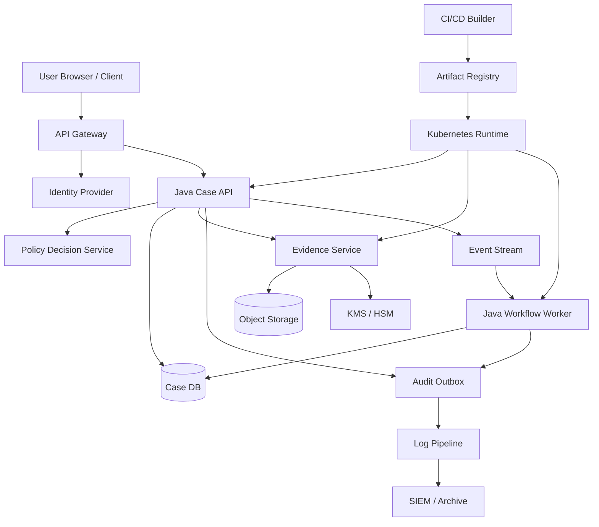
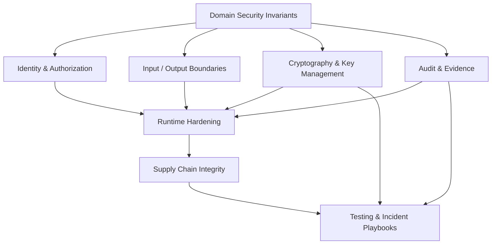
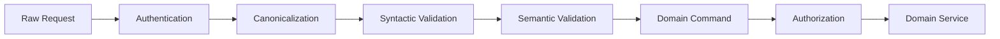
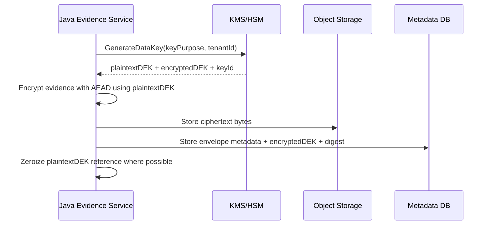
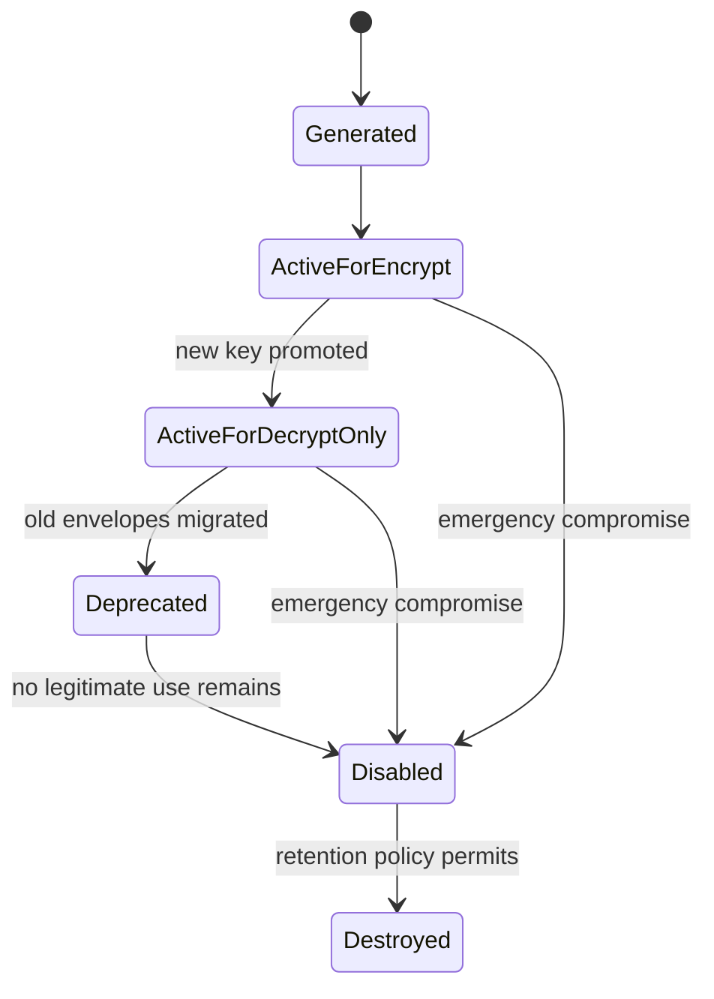
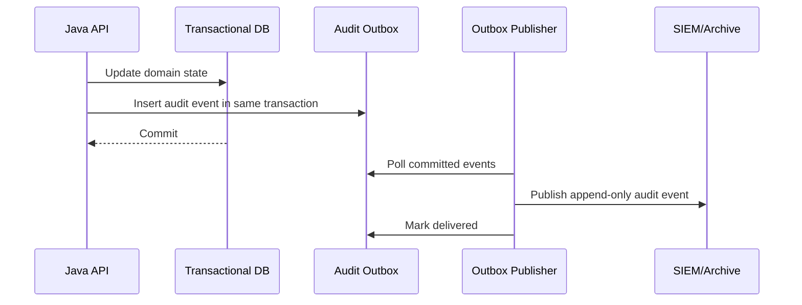

# Part 034 — Capstone: Secure Java Platform

This is the final part of the series.

The purpose of the capstone is to combine everything into a single system design. Not a toy checklist. Not a framework demo. A defensible Java platform with clear boundaries, strong invariants, crypto agility, artifact integrity, operational hardening, and incident readiness.

We will design a secure Java platform for a sensitive case-management domain. The same structure applies to banking, healthcare, public-sector enforcement, insurance, identity platforms, marketplace trust/safety, or any system where integrity and auditability matter.

---

## 1. Capstone Scenario

We are building a Java-based platform with these capabilities:

- authenticated users access case records,
- case records include sensitive evidence files,
- service-to-service communication uses mTLS,
- authorization is tenant-aware and case-state-aware,
- high-risk actions require audit events,
- evidence files are encrypted at rest,
- external callbacks are signed,
- build artifacts are signed and traced to source,
- production runtime is hardened,
- incident response can revoke tokens, rotate keys, isolate services, and prove artifact lineage.

This is intentionally broader than a web application. A real secure platform is a graph of code, identities, keys, artifacts, logs, policies, and operational surfaces.

---

## 2. Kaufman Final Skill Target

At the end of this series, the target skill is:

> Given a Java system, identify its trust boundaries, define its security invariants, choose appropriate cryptographic and platform controls, verify them with tests, operate them safely, and respond when they fail.

That is the difference between someone who knows security APIs and someone who can engineer secure systems.

---

## 3. Platform Context Diagram



Trust boundaries:

1. public client to gateway,
2. gateway to internal service,
3. service to policy decision service,
4. service to database/object storage,
5. service to KMS/HSM,
6. service to event stream,
7. CI/CD to artifact registry,
8. registry to Kubernetes runtime,
9. runtime to observability/audit archive.

Every boundary needs an explicit trust mechanism.

---

## 4. Security Invariants

A secure platform should be described by invariants. These are stronger than requirements because they must hold across normal operation, failure, retries, deployments, and incidents.

| Invariant | Meaning |
|---|---|
| INV-001 Authentication | Every externally initiated action has a verified actor, issuer, audience, expiration, and token/session status. |
| INV-002 Authorization | Every domain object access is authorized against actor, tenant, case state, action, and policy version. |
| INV-003 Tenant Isolation | No actor can read, write, export, or infer another tenant’s protected data unless explicitly delegated. |
| INV-004 Evidence Confidentiality | Evidence bytes are encrypted before storage using versioned envelope encryption. |
| INV-005 Evidence Integrity | Evidence downloads verify cryptographic metadata and storage digest before release. |
| INV-006 Auditability | Every high-risk decision emits an append-only, attributable audit event. |
| INV-007 Artifact Integrity | Production only runs signed artifacts with trusted provenance. |
| INV-008 Runtime Least Privilege | Workloads run with minimum OS/container/network capabilities. |
| INV-009 Crypto Agility | Encrypted/signed data carries key ID, algorithm version, and migration metadata. |
| INV-010 Incident Recoverability | Credentials, keys, certificates, artifacts, and feature surfaces can be revoked/rotated/isolated. |

A good architecture review asks: where exactly is each invariant enforced, logged, tested, and monitored?

---

## 5. Security Architecture Layers



Security is not one layer. It is a set of coordinated controls that preserve domain invariants.

---

## 6. Identity and Token Verification

The platform accepts tokens only after:

- signature verification,
- issuer validation,
- audience validation,
- expiration validation,
- token ID revocation check,
- session/device policy check where applicable,
- tenant/account binding validation,
- policy version compatibility check.

Example interface:

```java
public interface AuthenticationBoundary {
    AuthenticatedActor authenticate(InboundRequest request);
}

public record AuthenticatedActor(
    String subject,
    String tenantId,
    Set<String> assurance,
    String tokenId,
    String issuer,
    String audience,
    Instant authenticatedAt
) {}
```

Do not pass raw JWT claims deep into the domain. Convert them into a narrow authenticated actor model.

---

## 7. Authorization Decision Model

Authorization must be object-aware.

```java
public interface AuthorizationService {
    Decision decide(AuthContext actor, Action action, ResourceRef resource, RequestAttributes attrs);
}

public record Decision(
    boolean allowed,
    String policyId,
    String policyVersion,
    String reasonCode,
    Map<String, String> obligations
) {
    public void requireAllowed() {
        if (!allowed) {
            throw new ForbiddenException(reasonCode);
        }
    }
}
```

Use a domain-level decision shape, not scattered `if (role.equals("ADMIN"))` checks.

Example case access invariant:

```java
public EvidenceDownload authorizeEvidenceDownload(AuthContext actor, EvidenceId evidenceId) {
    EvidenceMeta meta = evidenceRepository.getMeta(evidenceId);

    Decision decision = authorizationService.decide(
        actor,
        Action.DOWNLOAD_EVIDENCE,
        ResourceRef.evidence(meta.tenantId(), meta.caseId(), evidenceId),
        RequestAttributes.of("caseState", meta.caseState().name())
    );

    decision.requireAllowed();

    audit.record(AuditEvent.highRisk(
        actor,
        "EVIDENCE_DOWNLOAD_AUTHORIZED",
        meta.caseId().value(),
        Map.of(
            "evidenceId", evidenceId.value(),
            "policyId", decision.policyId(),
            "policyVersion", decision.policyVersion()
        )
    ));

    return evidenceService.prepareDownload(meta);
}
```

Authorization and audit belong close to the protected action.

---

## 8. Input Boundary Design

The API layer should convert untrusted input into validated domain commands.



Rules:

- Parse only expected content types.
- Canonicalize before comparison.
- Validate identifiers before lookup.
- Bind tenant/resource ownership before authorization.
- Reject ambiguous encodings.
- Limit size, depth, count, and timeout.
- Convert strings into domain value objects early.

Example:

```java
public record CaseId(String value) {
    private static final Pattern VALID = Pattern.compile("case_[A-Za-z0-9]{26}");

    public CaseId {
        if (value == null || !VALID.matcher(value).matches()) {
            throw new BadRequestException("invalid_case_id");
        }
    }
}
```

---

## 9. Evidence Encryption Envelope

Evidence files are large, sensitive, and often long-lived. Use envelope encryption.



Envelope metadata:

```java
public record CryptoEnvelope(
    int envelopeVersion,
    String algorithm,
    String keyId,
    String encryptedDataKeyRef,
    byte[] nonce,
    byte[] aadDigest,
    byte[] ciphertextDigest,
    Instant encryptedAt
) {}
```

Associated data should bind ciphertext to domain context:

```java
public record EvidenceAad(
    String tenantId,
    String caseId,
    String evidenceId,
    int envelopeVersion,
    String classification
) {}
```

AAD is not secret. It is integrity-bound context. If ciphertext is moved to another tenant/case/evidence ID, decryption must fail.

---

## 10. Key Registry and Crypto Agility

The system must not hard-code algorithms everywhere.

```java
public interface CryptoPolicyRegistry {
    EncryptionPolicy encryptionPolicy(String purpose, Instant at);
    SignaturePolicy signaturePolicy(String purpose, Instant at);
    VerificationPolicy verificationPolicy(String purpose, String keyId, String algorithm);
}

public record EncryptionPolicy(
    int envelopeVersion,
    String algorithm,
    String keyPurpose,
    String keyId,
    boolean allowNewEncryption
) {}
```

This allows:

- key rotation,
- algorithm migration,
- legacy verification,
- staged decryption support,
- post-quantum readiness,
- emergency distrust of compromised key IDs.

---

## 11. Key Rotation State Machine



Important distinction:

- **active for encrypt/sign** means allowed for new cryptographic production,
- **active for decrypt/verify only** means legacy compatibility,
- **disabled** means no normal use,
- **destroyed** means unrecoverable.

Never design rotation as “replace string in config.”

---

## 12. TLS and mTLS Model

External traffic:

- client to gateway uses TLS,
- gateway validates user/session/token layer,
- internal services use mTLS for workload identity.

Internal traffic:

- certificate SAN maps to service identity,
- issuer is controlled by platform CA/service mesh CA,
- service identity is not automatically authorization,
- mTLS proves workload identity, then application policy decides action authority.

Correct mental model:

```text
TLS protects channel.
mTLS authenticates workload.
Authorization decides what the workload may do.
Audit records what happened.
```

Wrong model:

```text
It is internal traffic, so it is trusted.
```

---

## 13. Signed External Callback Pattern

For outbound webhooks/callbacks:

- canonicalize payload,
- sign bytes with versioned key,
- include timestamp and nonce/event ID,
- receiver verifies signature, timestamp window, replay, and key ID.

```java
public record SignedMessage(
    String keyId,
    String algorithm,
    Instant signedAt,
    String nonce,
    byte[] payload,
    byte[] signature
) {}
```

Receiver-side invariant:

> A message is accepted only if the signature is valid, the key is trusted for the purpose, the timestamp is within window, and the nonce/event ID has not been processed.

---

## 14. Audit Architecture

Use an audit outbox so business transaction and audit emission cannot silently diverge.



Audit event shape:

```java
public record SecurityAuditEvent(
    String eventId,
    Instant occurredAt,
    String actorId,
    String tenantId,
    String action,
    String targetType,
    String targetId,
    String decision,
    String policyId,
    String policyVersion,
    String correlationId,
    Map<String, String> safeAttributes
) {}
```

Do not place secrets, raw tokens, plaintext evidence, or unnecessary PII in audit events.

---

## 15. Artifact Integrity Pipeline

```mermaid
flowchart LR
    A[Source Commit] --> B[Protected CI Builder]
    B --> C[Unit/Security Tests]
    C --> D[SCA/SAST/SBOM]
    D --> E[Build JAR/Image]
    E --> F[Generate Provenance]
    F --> G[Sign Artifact]
    G --> H[Registry]
    H --> I[Admission Policy]
    I --> J[Kubernetes Runtime]
    J --> K[Runtime Digest Monitoring]
```



Release manifest:

```yaml
release: 2026.06.28.4
source:
  repository: git@example.com/platform/case-api
  commit: 9f3a2c...
  branch: main
build:
  builder: trusted-builder-v3
  workflow: release.yml
  build_id: 928381
artifacts:
  jar_digest: sha256:...
  image_digest: sha256:...
  sbom_digest: sha256:...
  provenance_digest: sha256:...
signatures:
  artifact_signature: sigstore://...
  signer_identity: release-bot@example.com
policy:
  slsa_level_target: 3
  admission_required: true
```

Runtime must not merely run “latest.” It must run a digest that matches release evidence.

---

## 16. Kubernetes Runtime Hardening Baseline

Example baseline deployment posture:

```yaml
apiVersion: apps/v1
kind: Deployment
metadata:
  name: case-api
spec:
  template:
    spec:
      serviceAccountName: case-api
      automountServiceAccountToken: false
      securityContext:
        runAsNonRoot: true
        seccompProfile:
          type: RuntimeDefault
      containers:
        - name: app
          image: registry.example.com/platform/case-api@sha256:abc123
          ports:
            - containerPort: 8080
          securityContext:
            allowPrivilegeEscalation: false
            readOnlyRootFilesystem: true
            capabilities:
              drop: ["ALL"]
          resources:
            requests:
              cpu: "500m"
              memory: "512Mi"
            limits:
              cpu: "2"
              memory: "1Gi"
          volumeMounts:
            - name: tmp
              mountPath: /tmp
      volumes:
        - name: tmp
          emptyDir: {}
```

For production, add network policy, admission policy, image signature verification, secret mount strategy, liveness/readiness design, and management-port isolation.

---

## 17. JVM Runtime Rules

Production JVM rules:

- no public JDWP,
- no unauthenticated JMX,
- no broad heap dump endpoint,
- no secrets in system properties if avoidable,
- controlled diagnostics access,
- explicit memory/resource limits,
- startup verification of crypto provider/policy,
- fail closed on missing security config,
- structured security event logging,
- runtime digest and version exposed only to authorized observability.

Startup check example:

```java
public final class SecurityStartupChecks {
    public void verify(SecurityConfig config) {
        require(config.productionProfile(), "production profile required");
        require(!config.debugEnabled(), "debug must be disabled");
        require(config.tlsEnabled(), "TLS required");
        require(config.auditEnabled(), "audit required");
        require(config.cryptoProviderAllowed(), "unexpected crypto provider");
        require(config.artifactDigestPresent(), "artifact digest missing");
    }

    private static void require(boolean condition, String message) {
        if (!condition) throw new IllegalStateException(message);
    }
}
```

Security misconfiguration should fail at startup, not become a latent production weakness.

---

## 18. Security Test Suite

A secure platform needs multiple test classes.

| Test Type | Example |
|---|---|
| Unit invariant test | Tenant A cannot read tenant B evidence. |
| Negative authorization test | Non-admin cannot approve restricted transition. |
| Crypto known-answer test | AEAD implementation decrypts official vector. |
| Crypto tamper test | Modified ciphertext/AAD/tag fails. |
| Token verification test | Expired/revoked/wrong-audience token rejected. |
| Fuzz test | Parser rejects malformed nested JSON within limits. |
| Integration test | mTLS client with wrong cert fails. |
| SCA gate | Vulnerable dependency blocks merge/release. |
| Artifact policy test | Unsigned image rejected. |
| Incident drill | JWT signing key rotation completes safely. |

Example authorization regression:

```java
@ParameterizedTest
@MethodSource("unauthorizedEvidenceCases")
void unauthorizedEvidenceAccessIsAlwaysDenied(AuthContext actor, EvidenceId evidenceId) {
    assertThrows(ForbiddenException.class, () ->
        caseApi.downloadEvidence(actor, evidenceId)
    );
}
```

Example crypto tamper test:

```java
@Test
void decryptFailsWhenAssociatedDataChanges() {
    EncryptedPayload encrypted = encryptor.encrypt(
        plaintext,
        aad("tenant-a", "case-1", "evidence-1")
    );

    assertThrows(CryptoIntegrityException.class, () ->
        encryptor.decrypt(encrypted, aad("tenant-b", "case-1", "evidence-1"))
    );
}
```

---

## 19. Observability and Detection

Security controls must emit observable signals.

Metrics:

- auth failures by reason,
- authorization denies by action/resource type,
- token revocation hits,
- key version usage,
- crypto decrypt failure rate,
- mTLS handshake failures,
- certificate expiry days,
- audit outbox lag,
- artifact digest mismatch,
- dependency policy violations,
- management endpoint access attempts.

Alerts should map to playbooks:

| Alert | Playbook |
|---|---|
| Old key used for signing | Key compromise/rotation investigation. |
| Refresh token replay | Token compromise. |
| Audit hash-chain mismatch | Log tampering. |
| Running digest mismatch | Malicious/untrusted artifact. |
| JDWP port detected | Runtime exposure. |
| Cross-tenant deny spike | Authorization attack or client bug. |
| Cert expires soon | TLS certificate playbook. |

---

## 20. Architecture Review Rubric

Use this review before launch or major change.

### Identity

- Are all actors explicit?
- Are users, services, jobs, admins, and integrations separated?
- Are token issuer/audience/expiry/revocation enforced?

### Authorization

- Are decisions object-aware?
- Is deny-by-default implemented?
- Are tenant/case-state constraints enforced close to data access?
- Are policy versions logged?

### Crypto

- Is each primitive used for the right purpose?
- Are AEAD, AAD, nonce, key ID, and algorithm version handled correctly?
- Is there a rotation path?
- Is there compromise response?

### Data Exposure

- Are DTOs audience-specific?
- Are logs and metrics redacted?
- Is evidence decrypted only at controlled boundary?

### Runtime

- Are debug/management surfaces isolated?
- Is the process non-root with minimal permissions?
- Is egress restricted?

### Supply Chain

- Are dependencies verified?
- Is SBOM generated?
- Are artifacts signed?
- Is provenance checked before deploy?

### Incident Readiness

- Can secrets, tokens, keys, certs, and artifacts be revoked/rotated?
- Can impact be scoped from logs/audit?
- Are playbooks rehearsed?

---

## 21. Capstone Deliverables

To prove mastery, produce these artifacts for a real or simulated Java service:

1. Security context diagram.
2. Data-flow diagram with trust boundaries.
3. Security invariants list.
4. Authentication and token validation specification.
5. Authorization policy model.
6. Crypto envelope format.
7. Key lifecycle and rotation state machine.
8. TLS/mTLS trust model.
9. Audit event taxonomy.
10. Runtime hardening manifest.
11. Dependency/SBOM/provenance policy.
12. Artifact signing and admission policy.
13. Security test suite plan.
14. Incident playbooks for top five incidents.
15. Security Decision Records for accepted trade-offs.

If these deliverables exist and are executable by the team, security becomes an engineering system instead of hero work.

---

## 22. Final Integrated Failure Scenario

Scenario:

> A vulnerable dependency allows crafted payloads to trigger unexpected deserialization behavior in the evidence service. An attacker uses it to read environment variables and attempts outbound calls. The service has access to object storage and KMS decrypt for evidence.

A weak platform fails catastrophically.

A strong platform limits damage:

- SCA detects vulnerable dependency before release.
- If missed, parser limits and allowlists reduce exploitability.
- Container runs non-root with read-only filesystem.
- Egress policy blocks outbound callback.
- KMS policy limits decrypt to evidence context.
- Audit logs show unusual decrypt attempts.
- Runtime digest confirms expected artifact.
- Secrets are mounted minimally and rotated after exposure.
- Incident playbook scopes affected evidence IDs.
- Patch is built by trusted CI, signed, verified, and admitted by policy.
- Post-incident test reproduces exploit and prevents regression.

This is defense in depth that is measurable, not decorative.

---

## 23. What “Top 1%” Looks Like Here

A top security-capable Java engineer:

- models security as invariants, not scattered annotations,
- knows when Java APIs are safe and when they are footguns,
- understands that crypto requires metadata, lifecycle, and operational discipline,
- treats authorization as a decision system,
- designs audit logs as evidence, not debugging noise,
- expects secrets, keys, certs, dependencies, and artifacts to fail,
- builds rotation and revocation before incidents,
- verifies supply chain integrity, not just source correctness,
- rejects “internal traffic is trusted,”
- can explain residual risk clearly to engineers and decision-makers.

---

## 24. Series Completion

This series is complete.

We covered:

1. Kaufman skill map,
2. security mental models,
3. Java attack surface,
4. secure coding,
5. threat modeling,
6. identity and authorization,
7. input/output boundaries,
8. Java cryptography architecture,
9. randomness, hashing, MAC, KDF,
10. symmetric and asymmetric cryptography,
11. digital signatures and PKI,
12. TLS/mTLS,
13. keystores, KMS, HSM, and secrets,
14. credentials and token storage,
15. serialization/deserialization,
16. classloading, reflection, modules, and agents,
17. post-Security-Manager hardening,
18. JVM/container/OS hardening,
19. dependency and supply-chain risk,
20. SBOM, provenance, SLSA, and artifact signing,
21. logging, audit, and forensics,
22. security testing and crypto failure simulation,
23. architecture review,
24. post-quantum and crypto agility,
25. production incident playbooks,
26. secure Java platform capstone.

The learning path now changes from “consume material” to “apply pressure.”

Pick one Java system and produce the capstone deliverables. Then run three drills:

1. rotate a signing key,
2. simulate an authorization bypass,
3. reject an unsigned or untrusted artifact at deployment.

That is where the material becomes skill.
