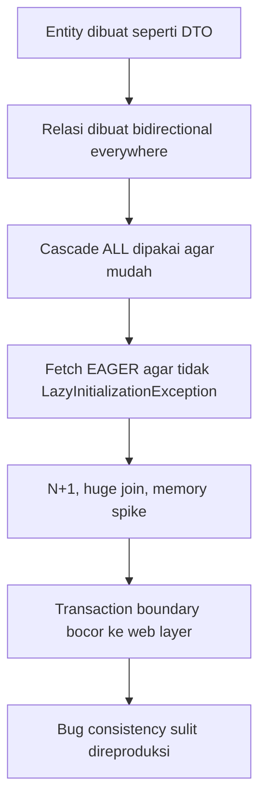
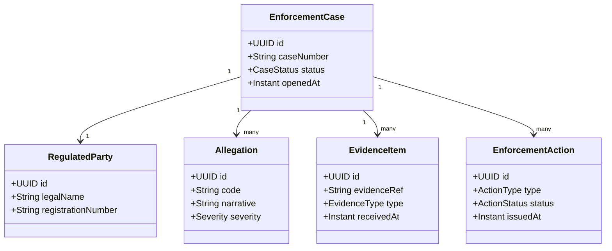
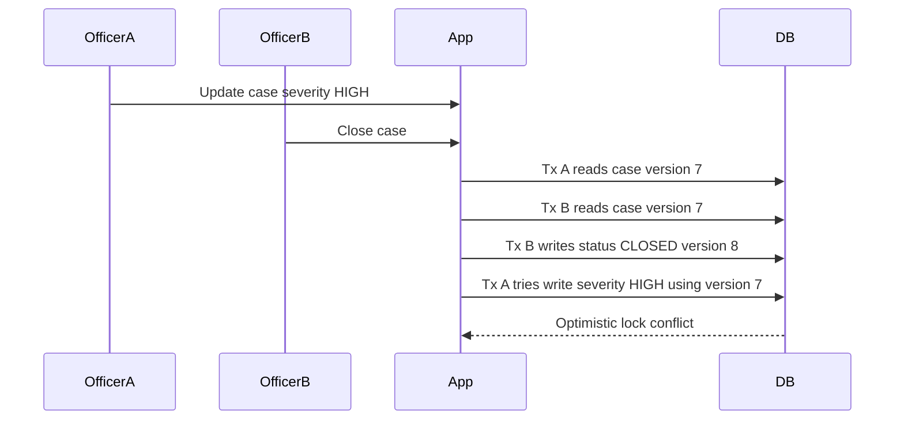
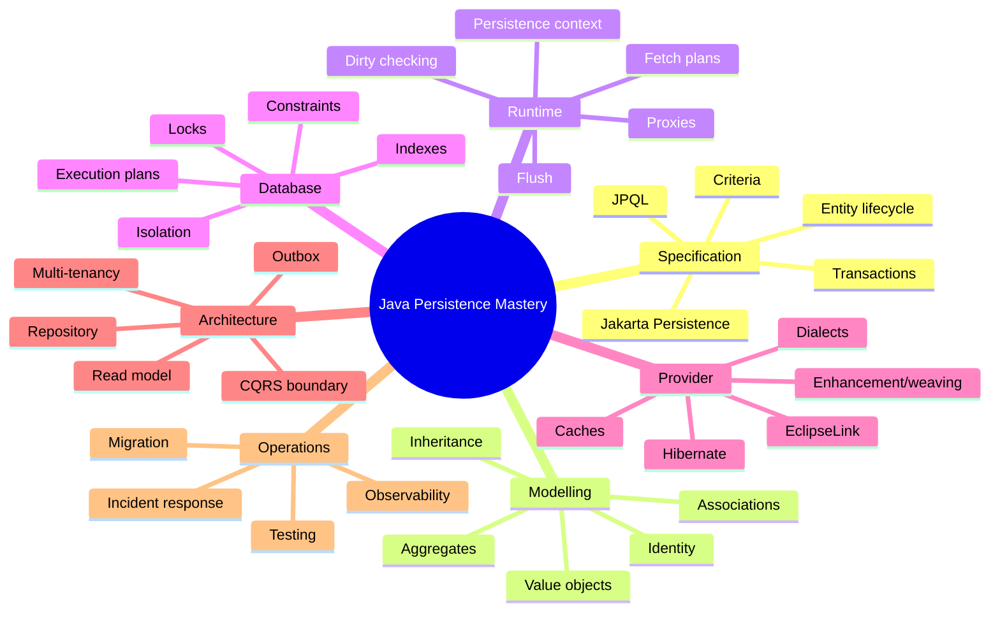
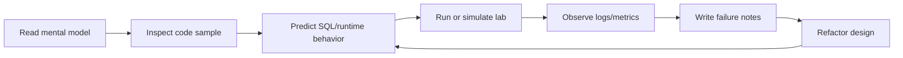
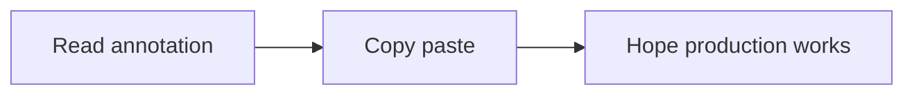
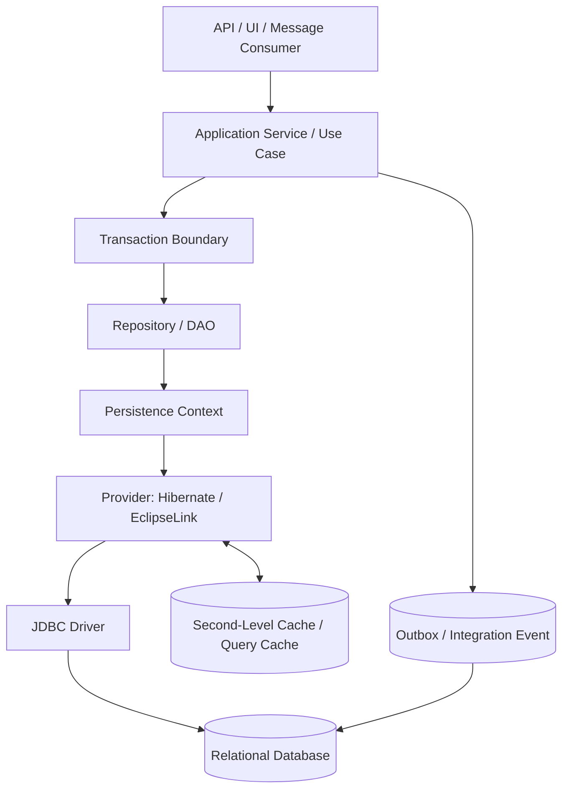
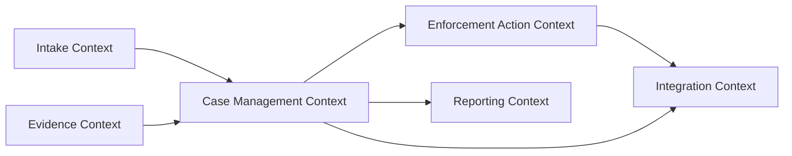

------
title: Learn Java Persistence, Database Integration, JPA, Hibernate ORM & EclipseLink - Part 001
description: Kaufman skill map untuk menguasai Java Persistence secara efektif, dari dekomposisi skill, practice plan, mental model, sampai mastery rubric.
series: learn-java-persistence
seriesTitle: Learn Java Persistence, Database Integration, JPA, Hibernate ORM & EclipseLink
order: 1
partTitle: Kaufman Skill Map
tags:
- java
- persistence
- jpa
- jakarta-persistence
- hibernate
- eclipselink
- orm
- database-integration
- kaufman
- series
date: 2026-06-27
---

# Kaufman Skill Map for Java Persistence

> Target part ini: membangun peta belajar yang efisien untuk menjadi engineer yang bukan hanya “bisa pakai JPA”, tetapi bisa **mendesain, memprediksi, menguji, mengobservasi, dan memperbaiki sistem persistence production-grade**.

Seri ini memakai prinsip dari *The First 20 Hours* karya Josh Kaufman sebagai kerangka belajar:

1. **Deconstruct the skill** — pecah skill besar menjadi sub-skill yang bisa dilatih.
2. **Learn enough to self-correct** — belajar teori secukupnya agar bisa mendeteksi kesalahan sendiri.
3. **Remove practice barriers** — siapkan lingkungan, dataset, skenario, dan checklist supaya latihan tidak tertahan setup.
4. **Practice deliberately for at least 20 hours** — latihan pada sub-skill paling bernilai, bukan membaca pasif.

Dalam konteks Java Persistence, “20 jam” bukan berarti menjadi ahli ORM dalam 20 jam. Artinya: setelah 20 jam latihan terstruktur, kamu harus punya **operational grip**: bisa membaca mapping, memprediksi SQL, menemukan N+1, memahami flush/transaction boundary, dan tahu kapan ORM membantu atau justru merusak desain.

---

## 1. Baseline Teknis Seri

Seri ini memakai baseline berikut:

- **Jakarta Persistence 3.2** sebagai baseline spesifikasi stabil untuk Jakarta EE 11.
- **Hibernate ORM 7.x** sebagai provider utama untuk observasi behavior, karena Hibernate adalah provider yang sangat umum dipakai di ekosistem Java/Spring.
- **EclipseLink 5.x** sebagai provider pembanding, terutama untuk memahami portability, weaving, shared cache, descriptor model, dan perbedaan behavior provider.
- **Jakarta Persistence 4.0** hanya akan dibahas sebagai arah perkembangan, bukan baseline utama, karena masih under development.

Referensi utama:

- Jakarta Persistence 3.2 Specification: <https://jakarta.ee/specifications/persistence/3.2/>
- Jakarta Persistence 3.2 Spec Document: <https://jakarta.ee/specifications/persistence/3.2/jakarta-persistence-spec-3.2>
- Hibernate ORM Documentation: <https://hibernate.org/orm/documentation/>
- Hibernate ORM 7.4 Documentation: <https://hibernate.org/orm/documentation/7.4/>
- Hibernate ORM User Guide: <https://docs.hibernate.org/stable/orm/userguide/html_single/>
- EclipseLink Project: <https://projects.eclipse.org/projects/ee4j.eclipselink>
- EclipseLink 5.0.0 Release: <https://projects.eclipse.org/projects/ee4j.eclipselink/releases/5.0.0>

---

## 2. Kenapa Java Persistence Sulit?

Java Persistence tampak sederhana di permukaan:

```java
@Entity
class Customer {
    @Id
    private Long id;
}
```

Tetapi di production, persistence jarang gagal karena anotasi kurang. Ia gagal karena engineer salah memahami **state, identity, transaction boundary, query shape, object graph, cache consistency, isolation, dan lifecycle**.

Masalah tipikal:

- entity terlihat seperti object biasa, padahal sebagian state-nya dikendalikan persistence context;
- relasi terlihat seperti pointer object, padahal di database ia adalah foreign key dan join;
- akses field terlihat murah, padahal bisa memicu SQL;
- transaksi terlihat sebagai anotasi, padahal menentukan konsistensi, locking, flush, rollback, dan visibility;
- repository terlihat seperti collection, padahal beroperasi di atas jaringan, SQL optimizer, constraint, index, lock, dan log database;
- provider terlihat seperti implementasi transparan, padahal Hibernate dan EclipseLink punya behavior, extension, cache, enhancement, dan default yang berbeda.

Mental model yang salah biasanya menghasilkan desain seperti ini:



Top 1% engineer tidak menghafal semua anotasi. Mereka mampu menjawab:

- Object mana yang seharusnya menjadi entity, embeddable, DTO, event, atau read model?
- Kapan relationship harus dimodelkan sebagai association, kapan cukup foreign key scalar?
- SQL apa yang akan keluar dari query ini?
- Kapan flush terjadi?
- Apakah operasi ini aman terhadap concurrent update?
- Apakah cascade ini menghormati aggregate boundary?
- Apakah caching ini benar secara consistency, atau hanya mempercepat data salah?
- Apakah provider-specific feature layak dipakai atau mengunci arsitektur?

---

## 3. Target Kemampuan Akhir

Setelah menyelesaikan seri ini, kamu ditargetkan mampu melakukan hal berikut.

### 3.1 Capability: Modelling

Kamu bisa mendesain model persistence untuk domain kompleks tanpa menjadikan database schema sebagai object dump.

Contoh domain seri:



Fokusnya bukan domain regulatory itu sendiri, tetapi karena domain ini cukup kaya untuk melatih:

- aggregate boundaries;
- lifecycle transitions;
- auditability;
- immutable historical facts;
- concurrent case updates;
- long-running process interaction;
- read model vs write model;
- evidence attachment boundary;
- escalation logic;
- outbox/domain event integration.

### 3.2 Capability: Runtime Prediction

Kamu bisa memprediksi runtime behavior sebelum melihat log:

```java
var enforcementCase = entityManager.find(EnforcementCase.class, id);
var count = enforcementCase.getEvidenceItems().size();
```

Pertanyaan yang harus langsung muncul:

- Apakah `evidenceItems` lazy atau eager?
- Apakah persistence context masih terbuka?
- Apakah `size()` memicu select collection penuh, extra-lazy count, atau sudah loaded?
- Apakah ada filter tenant/security yang berlaku?
- Apakah data ini terkena second-level cache?
- Apakah operasi ini terjadi dalam transaction read-only?

### 3.3 Capability: Failure Modelling

Kamu bisa memodelkan failure, bukan hanya happy path.

Contoh:



Engineer yang matang tidak melihat optimistic lock sebagai error tak terduga. Ia melihatnya sebagai bagian dari desain: siapa yang boleh retry, apa pesan UI, apakah command idempotent, dan apakah update bisa di-merge secara domain-safe.

### 3.4 Capability: Architecture Decision

Kamu bisa memilih antara:

- JPA entity query;
- Criteria API;
- native SQL;
- database view;
- stored procedure;
- read model;
- CQRS split;
- batch job;
- event/outbox;
- direct JDBC;
- provider-specific extension.

Keputusan tidak dibuat berdasarkan preferensi, tetapi berdasarkan shape masalah:

| Problem Shape | Pilihan yang Sering Cocok | Risiko |
|---|---|---|
| CRUD aggregate kecil | JPA entity + repository | Over-fetching jika relasi buruk |
| Complex reporting | Native SQL/read model | Duplication mapping |
| Bulk update ribuan row | JPQL bulk/native SQL | Persistence context stale |
| Audit history | Envers/custom audit/outbox | Storage growth, query complexity |
| Cross-service integration | Outbox + relay | Idempotency, ordering |
| High-volume ingestion | JDBC/batch/stateless session | Bypass lifecycle/cascade |
| Multi-tenant SaaS | tenant discriminator/schema/database | leak risk, migration complexity |

---

## 4. Skill Deconstruction

Java Persistence kita pecah menjadi 12 sub-skill utama.



### 4.1 Sub-skill Matrix

| Sub-skill | Yang Harus Dikuasai | Self-Correction Signal |
|---|---|---|
| Persistence context | Managed/detached/new/removed, first-level cache, identity map | Bisa menjelaskan kenapa object berubah tanpa explicit update |
| Entity identity | `@Id`, generated id, natural id, equals/hashCode | Tidak lagi menaruh generated id naïf dalam hashCode mutable |
| Mapping | basic, embeddable, converter, associations, inheritance | Bisa melihat mismatch schema-object sebelum runtime |
| Association modelling | owning side, inverse side, join table/column | Tidak membuat bidirectional relation tanpa use case traversal |
| Aggregate persistence | cascade, orphan removal, invariant boundary | Cascade tidak melewati aggregate boundary sembarangan |
| Query model | JPQL, Criteria, projection, native SQL | Bisa memilih query strategy sesuai use case |
| Fetch planning | lazy/eager, join fetch, entity graph, batch fetch | Bisa menemukan dan memperbaiki N+1 secara sistematis |
| Flush/dirty checking | write-behind, flush mode, SQL ordering | Tidak kaget ketika query memicu flush |
| Transaction | propagation, rollback, read-only, resource-local/JTA | Boundary transaksi sejajar dengan use case, bukan controller |
| Concurrency | optimistic/pessimistic lock, isolation anomalies | Bisa membuat retry policy dan conflict UX |
| Caching | first-level, second-level, query cache | Tidak cache data volatile tanpa invalidation story |
| Provider internals | Hibernate/EclipseLink behavior | Bisa membaca log provider dan menjelaskan penyebab SQL |
| Testing | Testcontainers, migration tests, deterministic fixtures | Test tidak bergantung pada rollback illusion saja |
| Operations | metrics, slow query, pool, deadlock, migration safety | Bisa melakukan incident triage persistence |

---

## 5. Apa yang Tidak Akan Diulang

Karena seri ini melanjutkan seri sebelumnya, beberapa materi dianggap sudah dikuasai.

### 5.1 Tidak Mengulang dari `learn-java-sql-jdbc`

Tidak akan dibahas ulang secara detail:

- cara kerja `Connection`, `PreparedStatement`, `ResultSet`;
- connection pool basic;
- SQL injection prevention basic;
- transaction isolation dasar;
- JDBC batch API detail;
- HikariCP tuning dasar.

Yang akan dibahas hanya interaksinya dengan ORM, misalnya:

- bagaimana Hibernate memakai JDBC connection;
- kapan connection diambil dari pool;
- bagaimana flush menghasilkan SQL;
- bagaimana transaction boundary memengaruhi SQL visibility;
- bagaimana batch insert/update di ORM berbeda dari JDBC batch mentah.

### 5.2 Tidak Mengulang dari `learn-java-patterns`

Tidak akan mengulang pattern umum seperti Strategy, Factory, Builder, Decorator, atau pipeline pattern.

Pattern yang tetap dibahas adalah pattern spesifik persistence:

- Unit of Work;
- Identity Map;
- Repository;
- Data Mapper;
- Active Record boundary;
- Outbox;
- Transactional Script vs Domain Model;
- CQRS read model;
- Anti-Corruption Layer;
- Specification pattern dalam query composition.

### 5.3 Tidak Mengulang dari `learn-java-core-types`

Tidak akan mengulang Java type system, collection, `Optional`, `record`, `enum`, atau `java.time` dari awal.

Yang dibahas hanya implikasi persistence-nya:

- enum ordinal vs string;
- `Instant`, `LocalDate`, `OffsetDateTime` mapping;
- record sebagai embeddable/id class;
- collection semantics dalam ORM;
- mutability dan dirty checking.

---

## 6. Learning Loop: Cara Membaca Setiap Part

Setiap part sebaiknya dibaca dengan loop berikut.



Bukan:



### 6.1 Pertanyaan Wajib Saat Belajar

Untuk setiap konsep, tanyakan:

1. **State apa yang berubah?** Java object, persistence context, database row, cache, atau message/event?
2. **Kapan perubahan menjadi visible?** Saat field set, saat flush, saat commit, atau saat transaction lain membaca?
3. **Siapa owner-nya?** Entity, aggregate root, repository, database constraint, atau application service?
4. **SQL apa yang keluar?** Select, insert, update, delete, join, lock, batch, atau no SQL karena cache?
5. **Apa failure mode-nya?** N+1, stale data, constraint violation, deadlock, lost update, memory blow-up, detached entity bug?
6. **Bagaimana mengobservasinya?** Log SQL, metrics, statistics, test, execution plan, database lock view?

---

## 7. The Persistence Stack

Persistence dalam aplikasi Java modern bukan satu layer. Ia adalah stack perilaku.



Setiap layer punya tanggung jawab berbeda:

| Layer | Tanggung Jawab | Kesalahan Umum |
|---|---|---|
| API/UI | menerima request, presentasi error | membuka entity langsung ke serialization |
| Application service | use case orchestration | transaction terlalu kecil/terlalu besar |
| Transaction | atomicity dan consistency boundary | boundary ditempatkan di controller/helper acak |
| Repository | query dan persistence intent | repository menjadi dumping ground semua query |
| Persistence context | identity map dan unit of work | dianggap seperti cache global |
| ORM provider | mapping, SQL generation, dirty checking | dianggap transparan 100% |
| JDBC driver | komunikasi database | pool/driver behavior diabaikan |
| Database | constraint, isolation, indexes, durability | dianggap hanya storage pasif |
| Cache | latency reduction | invalidation tidak jelas |
| Outbox | reliable integration | event dikirim sebelum commit |

Top-level insight: **JPA bukan pengganti database thinking**. JPA adalah lapisan sinkronisasi state object-relational. Engineer tetap harus memahami constraint, index, join, lock, transaction log, dan query plan.

---

## 8. Domain Lab Seri

Agar pembelajaran konsisten, seluruh seri memakai domain lab berikut.

### 8.1 Domain: Enforcement Lifecycle Platform

Kita akan memodelkan sistem enforcement lifecycle untuk regulator.

Entitas konseptual:

- `EnforcementCase` — aggregate root untuk case aktif.
- `RegulatedParty` — pihak yang diawasi.
- `Allegation` — dugaan pelanggaran.
- `EvidenceItem` — bukti, dokumen, atau referensi bukti.
- `CaseAssignment` — penugasan officer/team.
- `EnforcementAction` — warning, notice, penalty, suspension.
- `CaseNote` — catatan internal.
- `CaseTimelineEvent` — historical event.
- `OutboxMessage` — event integrasi setelah commit.

### 8.2 Kenapa Domain Ini Bagus untuk Persistence?

Karena ia memaksa kita menghadapi realitas yang sering tidak muncul di contoh `User` dan `Order` sederhana:

- Banyak object punya lifecycle sendiri.
- Ada audit dan historical immutability.
- Ada long-running process.
- Ada permission dan sensitive data.
- Ada concurrent edits.
- Ada escalation rules.
- Ada read-heavy dashboard.
- Ada write-heavy evidence ingestion.
- Ada integration event.
- Ada kebutuhan defensibility: keputusan sistem harus dapat dijelaskan.

### 8.3 Bounded Context Awal



Tidak semua context harus satu database atau satu persistence model. Salah satu skill penting adalah tahu kapan entity model cukup, dan kapan perlu read model, event, atau database view.

---

## 9. Practice Environment Minimum

Agar latihan tidak tersendat, siapkan baseline berikut.

### 9.1 Runtime Minimum

- Java 21 atau lebih baru untuk latihan modern.
- Maven atau Gradle.
- PostgreSQL via Docker/Testcontainers.
- Hibernate ORM sebagai provider utama.
- EclipseLink untuk part portability/provider comparison.
- Logging SQL dan bind parameter.
- Migration tool seperti Flyway atau Liquibase.
- Testcontainers untuk integration test.

### 9.2 Database Minimum

Gunakan PostgreSQL sebagai database latihan karena ia cukup kaya untuk:

- sequence;
- UUID;
- JSONB;
- index expression;
- transaction isolation;
- row locking;
- execution plan;
- constraint advanced;
- deadlock diagnosis.

Seri ini tidak bergantung total pada PostgreSQL, tetapi PostgreSQL bagus untuk membangun kebiasaan observability dan query-plan thinking.

### 9.3 Logging Minimum

Dalam latihan, aktifkan minimal:

- SQL statement logging;
- bind parameter logging;
- transaction boundary logging;
- slow query threshold;
- Hibernate statistics saat masuk performance part;
- database-side query plan saat analisis performa.

Contoh prinsip konfigurasi:

```properties
# Jangan copy-paste ini ke production tanpa filtering dan policy security.
# Bind parameter logging dapat membocorkan PII/sensitive data.
logging.level.org.hibernate.SQL=DEBUG
logging.level.org.hibernate.orm.jdbc.bind=TRACE
```

---

## 10. Deliberate Practice Plan 20 Jam

Rencana ini bukan seluruh seri. Ini adalah latihan minimum untuk mendapatkan grip cepat.

| Jam | Fokus | Latihan | Output |
|---:|---|---|---|
| 1-2 | Mental model | Buat diagram stack persistence dan object/row lifecycle | Catatan “state changes” |
| 3-4 | Entity lifecycle | Implement `EnforcementCase`, persist/find/merge/remove | Log lifecycle + SQL |
| 5-6 | Identity | Bandingkan sequence, UUID, natural key, equals/hashCode | Decision record identity |
| 7-8 | Mapping | Tambah embeddable value object dan enum converter | Mapping checklist |
| 9-10 | Associations | Model case-allegation-evidence dengan owning side jelas | SQL insert/update trace |
| 11-12 | Fetching | Reproduksi N+1 dan perbaiki dengan fetch plan | Before/after query count |
| 13-14 | Flush | Reproduksi unexpected flush sebelum query | Flush trigger notes |
| 15-16 | Transaction | Uji rollback, read-only, propagation | Transaction boundary map |
| 17-18 | Locking | Simulasi optimistic locking conflict | Retry/conflict policy |
| 19-20 | Review | Refactor model berdasarkan failure yang ditemukan | Architecture review memo |

Aturan latihan:

- Jangan lanjut jika belum bisa memprediksi SQL yang akan keluar.
- Jangan puas dengan “test green”; baca SQL dan transaction log.
- Jangan gunakan repository abstraction sebelum memahami EntityManager behavior.
- Jangan pakai `EAGER` untuk menghindari masalah; itu biasanya memindahkan masalah ke tempat lain.
- Jangan membuat relasi bidirectional kecuali ada traversal use case yang jelas.

---

## 11. Self-Correction Checklist

Gunakan checklist ini setiap selesai membuat mapping atau repository.

### 11.1 Entity Design Checklist

- Apakah entity punya identity yang stabil?
- Apakah `equals/hashCode` aman untuk lifecycle transient/managed/detached?
- Apakah field mutable memang perlu mutable?
- Apakah invariant domain dijaga di method entity/aggregate root?
- Apakah constructor/factory mencegah invalid state?
- Apakah entity tidak membawa dependency service/framework berlebihan?

### 11.2 Association Checklist

- Apakah owning side jelas?
- Apakah inverse side benar-benar dibutuhkan?
- Apakah cardinality sesuai domain, bukan convenience?
- Apakah collection bisa tumbuh besar?
- Apakah delete behavior eksplisit?
- Apakah cascade mengikuti aggregate boundary?
- Apakah `orphanRemoval` sesuai makna domain?

### 11.3 Query Checklist

- Apakah query mengembalikan entity atau projection?
- Apakah use case butuh write-capable object atau read-only view?
- Apakah fetch plan eksplisit?
- Apakah pagination aman dengan join fetch collection?
- Apakah index mendukung predicate dan ordering?
- Apakah query bisa diprediksi saat data 10x/100x?

### 11.4 Transaction Checklist

- Apakah transaction boundary berada di use case, bukan helper kecil?
- Apakah operasi harus atomic bersama event/outbox?
- Apakah retry aman?
- Apakah lock mode sesuai risiko concurrency?
- Apakah read-only transaction benar-benar tidak memutasi managed entity?
- Apakah exception mapping jelas untuk caller/API?

### 11.5 Production Checklist

- Apakah migration sudah diuji terhadap schema nyata?
- Apakah startup validation cukup ketat?
- Apakah slow query bisa ditemukan?
- Apakah SQL bind logging aman terhadap PII?
- Apakah pool exhaustion punya metric/alert?
- Apakah deadlock dan optimistic lock diperlakukan sebagai known failure?

---

## 12. Common Misleading Premises

### 12.1 “JPA Membuat Database Tidak Perlu Dipikirkan”

Salah. JPA membuat database interaction lebih ekspresif di Java, tetapi database tetap menentukan:

- constraint;
- locking;
- isolation;
- index usage;
- join algorithm;
- transaction log;
- execution plan;
- durability.

ORM tidak menghapus database. ORM menyembunyikan sebagian detail sampai detail itu menjadi masalah.

### 12.2 “Entity Sama dengan Table”

Kadang entity memang berkorespondensi dengan table, tetapi secara desain entity adalah **object dengan identity dan lifecycle**. Table adalah struktur relasional. Perbedaan ini penting saat mendesain aggregate, embeddable, inheritance, projection, dan read model.

### 12.3 “Repository Sama dengan DAO CRUD”

Repository yang baik merepresentasikan collection-like access terhadap aggregate atau model tertentu. DAO sering lebih dekat ke operasi persistence teknis. Dalam banyak codebase, istilahnya bercampur. Yang penting bukan namanya, tetapi boundary-nya:

- Apakah repository mengekspos persistence detail?
- Apakah repository mengizinkan caller membangun object graph liar?
- Apakah repository memaksa use case membaca terlalu banyak data?
- Apakah repository menyembunyikan query mahal?

### 12.4 “Lazy Itu Buruk, Eager Itu Aman”

Lazy dan eager bukan moral choice. Keduanya adalah fetch strategy dengan konsekuensi. Default `EAGER` sering lebih berbahaya karena membuat query shape tersembunyi dan sulit dikontrol. Fetch plan seharusnya use-case-specific.

### 12.5 “Provider Portability Selalu Lebih Penting”

Portability penting, tetapi bukan absolut. Kadang provider-specific feature memberi value besar: batch fetching, filters, soft delete, custom types, bytecode enhancement, multi-tenancy, audit. Keputusan sehat adalah sadar biaya lock-in dan punya boundary yang jelas.

---

## 13. Mastery Rubric

Gunakan rubric ini untuk menilai kemampuan.

### Level 1 — API User

Ciri:

- bisa menulis `@Entity`, `@Id`, repository sederhana;
- menggunakan Spring Data JPA atau EntityManager untuk CRUD;
- sering trial-error saat mapping error;
- tidak selalu membaca SQL yang keluar.

Risiko:

- N+1 tidak terlihat;
- cascade berlebihan;
- transaction boundary asal jalan;
- entity diekspos ke API.

### Level 2 — Conscious Practitioner

Ciri:

- paham persistence context dan lifecycle;
- bisa membedakan managed vs detached;
- membaca SQL log;
- mulai membuat fetch plan;
- menghindari `EAGER` default yang tidak perlu.

Risiko:

- belum kuat pada concurrency dan cache;
- masih sering membuat model terlalu object-graph-heavy.

### Level 3 — Production Engineer

Ciri:

- bisa mendesain aggregate persistence;
- bisa memprediksi flush dan SQL ordering;
- punya migration/testing strategy;
- bisa debug deadlock, lock timeout, optimistic lock;
- bisa menjelaskan query plan dan index implication.

Risiko:

- provider-specific optimizations bisa menyebar tanpa boundary.

### Level 4 — Architecture-Level Persistence Engineer

Ciri:

- tahu kapan memakai ORM, native SQL, read model, outbox, atau direct JDBC;
- bisa membuat persistence architecture review;
- bisa mendesain consistency boundary lintas module/service;
- bisa menilai trade-off portability vs performance;
- bisa membuat operational playbook.

### Level 5 — Top 1% Persistence Engineer

Ciri:

- mampu memodelkan domain, database, runtime, dan failure sebagai satu sistem;
- bisa mengajari tim membaca persistence behavior dari logs dan metrics;
- bisa mencegah class of bugs lewat design guardrail;
- bisa memilih strategi persistence berdasarkan domain invariants, load profile, dan operational risk;
- bisa membuat migration plan untuk sistem besar tanpa downtime yang tidak perlu.

---

## 14. Red Flags yang Harus Langsung Terlihat

Saat review code persistence, red flag berikut harus memicu investigasi:

```java
@OneToMany(fetch = FetchType.EAGER, cascade = CascadeType.ALL)
private List<EvidenceItem> evidenceItems;
```

Kemungkinan masalah:

- `EAGER` membuat query mahal dan sulit dikontrol.
- `CascadeType.ALL` mungkin melewati aggregate boundary.
- `List` tanpa ordering eksplisit bisa bermakna ambigu.
- Collection evidence bisa tumbuh besar.
- Serialization API bisa menarik seluruh graph.

Contoh lain:

```java
@Transactional
public EnforcementCase getCase(UUID id) {
    return repository.findById(id).orElseThrow();
}
```

Jika entity dikembalikan langsung ke web/API layer, tanya:

- Apakah lazy property akan disentuh serializer?
- Apakah persistence context masih terbuka?
- Apakah field sensitive terekspos?
- Apakah API contract sekarang bergantung pada entity shape?
- Apakah response butuh projection, bukan entity?

Contoh lain:

```java
entityManager.merge(command.toEntity());
```

Tanya:

- Apakah object detached ini merepresentasikan full state atau partial update?
- Field mana yang bisa tertimpa null?
- Apakah optimistic lock ikut divalidasi?
- Apakah association ikut berubah tanpa disengaja?
- Apakah command seharusnya memuat aggregate lalu memanggil method domain?

---

## 15. Seri Ini Akan Berjalan Seperti Handbook

Setiap part berikutnya akan menggunakan struktur umum:

1. **Problem framing** — masalah nyata yang sering muncul.
2. **Mental model** — cara berpikir yang benar.
3. **Specification baseline** — perilaku menurut Jakarta Persistence.
4. **Provider notes** — perbedaan Hibernate/EclipseLink jika relevan.
5. **Code model** — contoh domain enforcement.
6. **Runtime behavior** — SQL, flush, transaction, cache, lifecycle.
7. **Failure modes** — bug dan anti-pattern.
8. **Design checklist** — guardrail untuk review.
9. **Practice lab** — latihan pendek dan observasi.

---

## 16. Output Setelah Part Ini

Setelah membaca part ini, kamu harus punya:

- peta skill Java Persistence;
- definisi target kemampuan;
- domain lab konsisten;
- daftar sub-skill yang harus dilatih;
- practice plan 20 jam;
- checklist self-correction;
- rubric untuk mengukur level.

Part berikutnya akan masuk ke fondasi paling penting: **Persistence Mental Model: Objects, Tables, Identity, and State**.
