------
title: Learn Java Persistence, Database Integration, JPA, Hibernate ORM & EclipseLink - Part 002
description: Mental model persistence sebagai sinkronisasi state antara object graph, persistence context, relational database, transaction, dan cache.
series: learn-java-persistence
seriesTitle: Learn Java Persistence, Database Integration, JPA, Hibernate ORM & EclipseLink
order: 2
partTitle: Persistence Mental Model: Objects, Tables, Identity, State
tags:
- java
- persistence
- jpa
- jakarta-persistence
- hibernate
- eclipselink
- orm
- database-integration
- entity-state
- mental-model
- series
date: 2026-06-27
---

# Persistence Mental Model: Objects, Tables, Identity, and State

> Target part ini: membangun mental model dasar bahwa persistence bukan sekadar CRUD, tetapi **sinkronisasi state** antara object graph Java, persistence context, provider ORM, JDBC, relational database, transaction, dan cache.

Jika mental model ini salah, semua topik lanjutan akan terlihat seperti aturan acak: kenapa `merge()` aneh, kenapa `flush()` terjadi sebelum query, kenapa lazy loading gagal, kenapa `equals()` membuat bug, kenapa N+1 muncul, kenapa data stale, dan kenapa transaction rollback tidak selalu seperti dugaan.

---

## 1. Persistence Bukan CRUD

CRUD adalah vocabulary operasi:

- create;
- read;
- update;
- delete.

Persistence adalah problem yang lebih dalam:

> Bagaimana perubahan state di memory direpresentasikan, divalidasi, disinkronkan, dikunci, disimpan, dibaca ulang, dan diamati di storage yang durable dan concurrent?

Dalam JPA/Jakarta Persistence, kamu tidak hanya memanggil `insert` atau `update`. Kamu berinteraksi dengan sistem yang melakukan:

- identity tracking;
- lifecycle management;
- object graph traversal;
- dirty checking;
- write-behind;
- SQL generation;
- flush ordering;
- transaction synchronization;
- optimistic/pessimistic locking;
- cache interaction;
- conversion antara type Java dan type database.

Diagram mental:

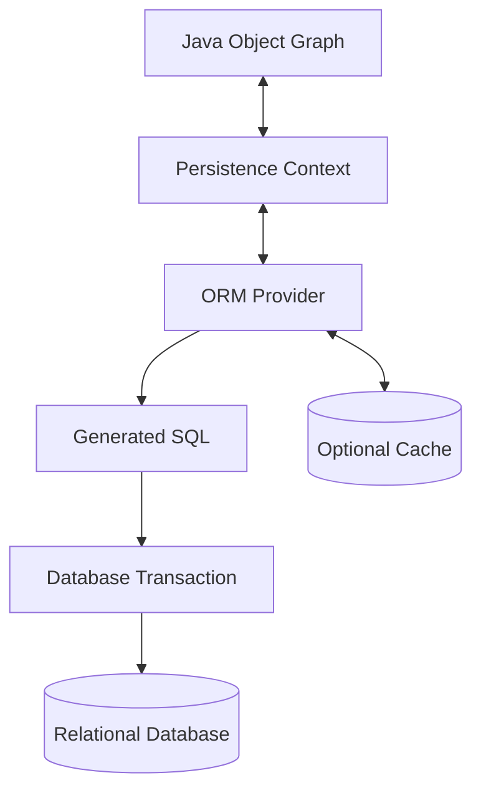

Kalimat paling penting:

> Dalam JPA, perubahan object tidak otomatis sama dengan perubahan database. Perubahan object menjadi database-visible melalui mekanisme persistence context, flush, dan commit.

---

## 2. Lima State yang Harus Selalu Dibedakan

Saat melihat kode persistence, bedakan lima state ini.

| State | Lokasi | Contoh | Bisa Berbeda? |
|---|---|---|---|
| Java object state | Heap JVM | `case.status = UNDER_REVIEW` | Ya |
| Persistence context state | EntityManager/Session | snapshot managed entity | Ya |
| SQL write queue | ORM action queue | pending insert/update/delete | Ya |
| Database transaction state | uncommitted DB changes | row update belum commit | Ya |
| Committed database state | durable visible data | data terlihat oleh transaction lain | Ya |

Contoh sederhana:

```java
@Transactional
public void escalate(UUID caseId) {
    EnforcementCase c = entityManager.find(EnforcementCase.class, caseId);
    c.escalateToHighRisk();

    // Belum tentu SQL UPDATE sudah dikirim di baris ini.
    // Tetapi persistence context mengetahui entity managed berubah.
}
```

Kemungkinan timeline:

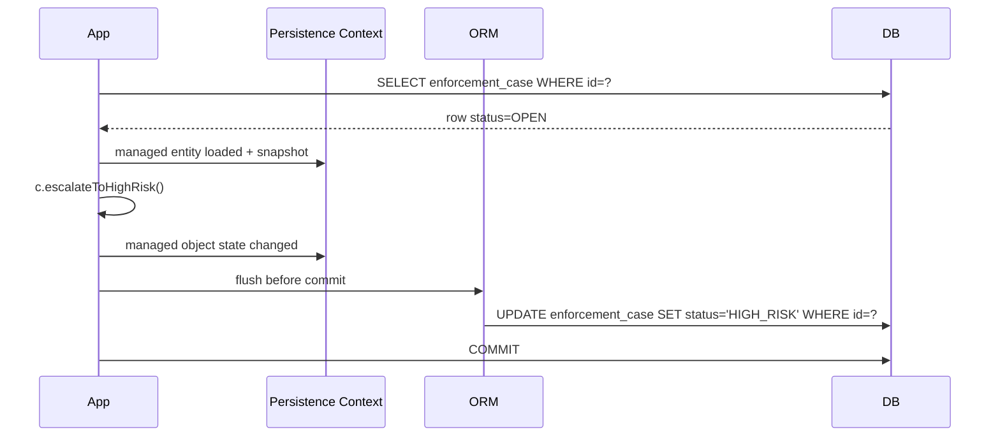

Sampai flush terjadi, database mungkin belum menerima update. Sampai commit terjadi, transaction lain mungkin belum melihat update, tergantung isolation level.

---

## 3. Object Model vs Relational Model

Java object model dan relational model punya asumsi berbeda.

### 3.1 Object Model

Object model cenderung berbicara tentang:

- identity object;
- reference/pointer;
- encapsulated behavior;
- inheritance;
- collection;
- graph traversal;
- mutability;
- lifecycle object;
- equality method.

Contoh:

```java
caseFile.getRegulatedParty().getLegalName();
caseFile.getAllegations().add(new Allegation(...));
```

Ini terlihat seperti traversal murah di memory.

### 3.2 Relational Model

Relational database berbicara tentang:

- table;
- row;
- column;
- primary key;
- foreign key;
- unique constraint;
- index;
- join;
- set-based operation;
- transaction;
- isolation;
- execution plan.

Query-nya berbentuk seperti:

```sql
select p.legal_name
from enforcement_case c
join regulated_party p on p.id = c.regulated_party_id
where c.id = ?;
```

### 3.3 Mismatch Utama

| Area | Object World | Relational World | Risiko |
|---|---|---|---|
| Identity | object reference / `equals` | primary key / unique key | duplicate object, wrong equality |
| Association | pointer / collection | foreign key / join table | N+1, join explosion |
| Inheritance | class hierarchy | table strategy | sparse table, join cost |
| Lifecycle | object creation/removal | insert/update/delete | orphan, cascade error |
| Transaction | method boundary | DB transaction | partial write, stale read |
| Query | graph navigation | set algebra | over-fetching, under-fetching |
| Type | Java type | SQL type | precision, timezone, enum drift |
| Constraint | object validation | DB constraint | race condition if only app-level |

ORM adalah jembatan. Tetapi setiap jembatan punya batas beban.

---

## 4. Identity: Same Object, Same Row, Same Meaning?

Identity adalah sumber bug besar dalam persistence.

Ada beberapa jenis identity:

| Identity Type | Contoh | Dipakai Untuk |
|---|---|---|
| JVM identity | `a == b` | apakah referensi object sama |
| Java equality | `a.equals(b)` | apakah object dianggap sama menurut code |
| Persistence identity | entity type + primary key | apakah entity merepresentasikan row yang sama |
| Domain identity | case number, registration number | apakah konsep bisnis sama |
| Database identity | primary key/unique key | constraint durable |

Contoh:

```java
EnforcementCase a = entityManager.find(EnforcementCase.class, id);
EnforcementCase b = entityManager.find(EnforcementCase.class, id);

System.out.println(a == b); // biasanya true dalam persistence context yang sama
```

Dalam satu persistence context, provider menjaga identity map: entity type + primary key yang sama biasanya direpresentasikan oleh instance managed yang sama.

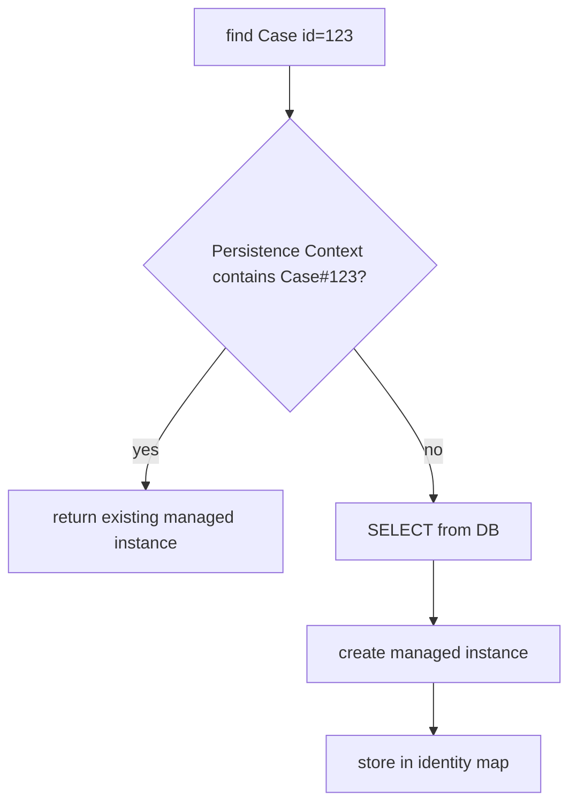

Tetapi di persistence context berbeda:

```java
EnforcementCase a = em1.find(EnforcementCase.class, id);
EnforcementCase b = em2.find(EnforcementCase.class, id);

System.out.println(a == b); // false
```

Keduanya bisa merepresentasikan row yang sama, tetapi bukan instance yang sama.

### 4.1 Equality Pitfall

Masalah klasik:

```java
@Entity
class EnforcementCase {
    @Id
    @GeneratedValue
    private Long id;

    @Override
    public boolean equals(Object other) {
        if (this == other) return true;
        if (!(other instanceof EnforcementCase that)) return false;
        return Objects.equals(id, that.id);
    }

    @Override
    public int hashCode() {
        return Objects.hash(id);
    }
}
```

Kode ini tampak masuk akal, tetapi berbahaya untuk entity dengan generated id.

Sebelum persist:

```java
var c = new EnforcementCase();
set.add(c);       // hashCode berdasarkan id null
entityManager.persist(c); // id bisa terisi setelah persist/flush tergantung strategy
set.contains(c);  // bisa false jika hashCode berubah
```

Mental model benar:

- generated database id sering belum tersedia saat object baru dibuat;
- hashCode yang berubah saat object berada di `HashSet`/`HashMap` merusak struktur data;
- equality entity harus dirancang berdasarkan lifecycle.

Beberapa strategi:

| Strategi | Kapan Cocok | Risiko |
|---|---|---|
| Business key equality | natural key immutable tersedia sejak awal | natural key harus benar-benar stabil |
| Database id equality dengan constant hashCode | entity mutable dan id generated | perlu disiplin implementasi |
| Reference equality only | aggregate internal, tidak dipakai lintas context | collection behavior terbatas |
| UUID assigned at construction | id tersedia sejak awal | index size, generation policy |

Tidak ada jawaban universal. Yang ada adalah invariants.

---

## 5. Persistence Context sebagai Identity Map + Unit of Work

Persistence context adalah konsep sentral JPA.

Secara mental, ia melakukan dua hal:

1. **Identity Map** — memastikan satu row/entity identity direpresentasikan satu managed instance dalam context yang sama.
2. **Unit of Work** — melacak perubahan dan menyinkronkannya ke database saat flush.

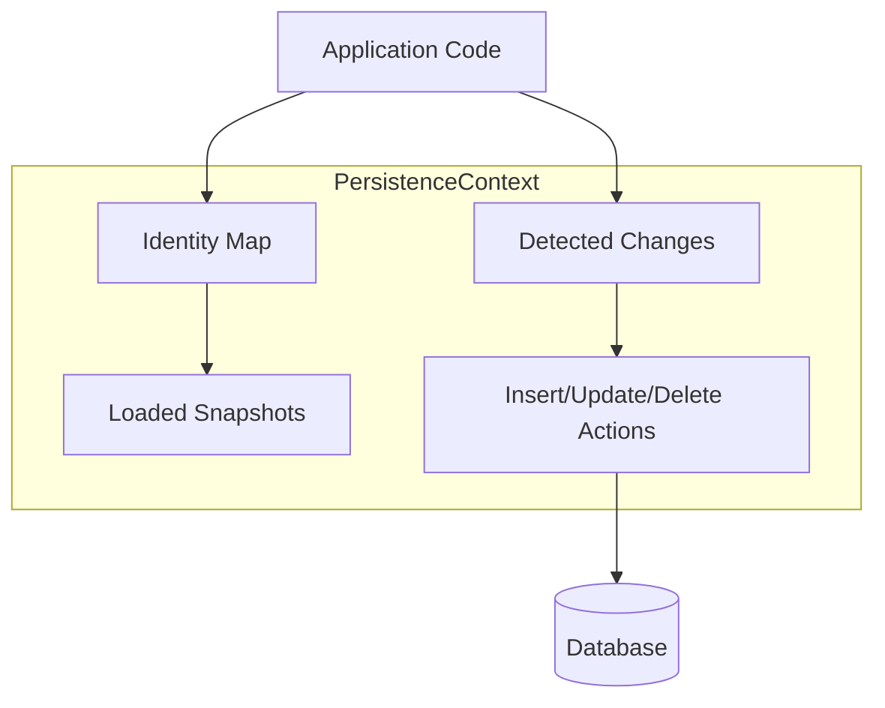

### 5.1 Managed Entity Bukan POJO Biasa

Entity class memang Java class biasa secara sintaks. Tetapi instance managed berada dalam aturan persistence context.

```java
@Transactional
public void renameParty(UUID id, String newName) {
    RegulatedParty party = entityManager.find(RegulatedParty.class, id);
    party.renameTo(newName);
    // Tidak ada entityManager.update(party)
}
```

Kenapa update tetap bisa terjadi?

Karena entity managed dilacak. Saat flush, provider membandingkan state sekarang dengan snapshot atau menggunakan enhancement-based dirty tracking.

### 5.2 Detached Entity

Setelah persistence context ditutup, entity menjadi detached.

```java
EnforcementCase c;

try (EntityManager em = emf.createEntityManager()) {
    c = em.find(EnforcementCase.class, id);
}

c.escalateToHighRisk(); // hanya mengubah object detached, DB tidak tahu
```

Detached entity sering menjadi sumber bug:

- lazy association gagal saat diakses;
- perubahan tidak tersimpan kecuali reattached/merged;
- state bisa stale;
- partial object bisa menimpa data jika `merge()` dipakai sembarangan.

---

## 6. Lifecycle States

JPA entity biasanya dipahami melalui state berikut.

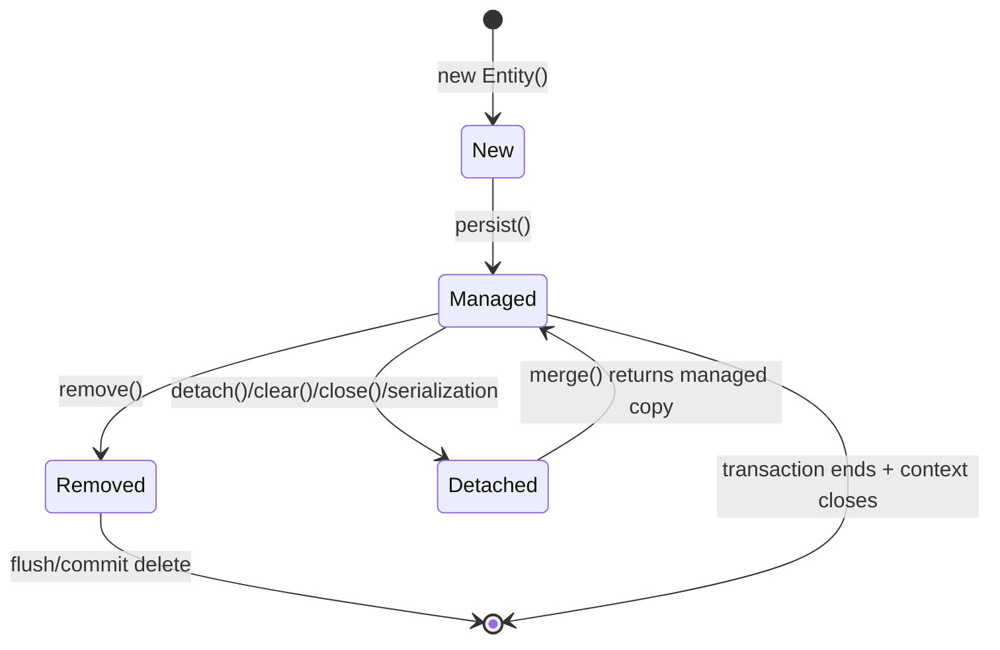

### 6.1 New / Transient

Object baru, belum dikenal persistence context.

```java
var allegation = new Allegation("AML-001", "Suspicious transaction pattern");
```

Tidak ada row database. Tidak ada tracking.

### 6.2 Managed

Object dikenal persistence context.

```java
entityManager.persist(allegation);
```

Atau:

```java
var allegation = entityManager.find(Allegation.class, id);
```

Perubahan field bisa dideteksi saat flush.

### 6.3 Detached

Object pernah managed, tetapi context yang mengelolanya sudah tidak aktif atau object dikeluarkan.

```java
entityManager.detach(allegation);
```

Perubahan detached tidak otomatis tersimpan.

### 6.4 Removed

Entity ditandai untuk delete.

```java
entityManager.remove(allegation);
```

Delete SQL biasanya dikirim saat flush, bukan selalu saat `remove()` dipanggil.

---

## 7. Flush Bukan Commit

Ini distinction wajib.

| Konsep | Makna |
|---|---|
| Flush | mengirim perubahan pending dari persistence context ke database dalam transaction aktif |
| Commit | mengakhiri transaction dan membuat perubahan durable/visible sesuai isolation |
| Rollback | membatalkan perubahan transaction |

Contoh:

```java
@Transactional
public void example(UUID caseId) {
    EnforcementCase c = entityManager.find(EnforcementCase.class, caseId);
    c.markUnderReview();

    entityManager.flush();

    // SQL update sudah dikirim.
    // Tetapi transaction belum commit.
    // Jika exception terjadi setelah ini, rollback masih bisa membatalkan update.
}
```

Timeline:

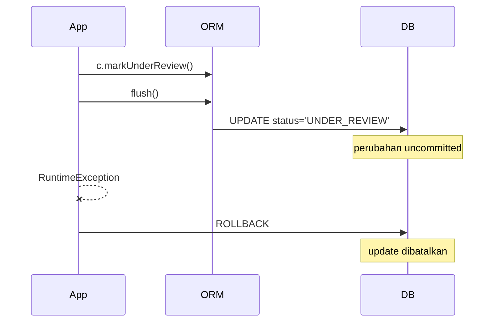

### 7.1 Kenapa Flush Bisa Terjadi Sebelum Commit?

Provider perlu menjaga consistency antara query dan perubahan pending.

Contoh:

```java
c.markUnderReview();

List<EnforcementCase> cases = entityManager
    .createQuery("select c from EnforcementCase c where c.status = :status", EnforcementCase.class)
    .setParameter("status", CaseStatus.UNDER_REVIEW)
    .getResultList();
```

Jika flush mode mengharuskan query melihat perubahan pending, provider bisa flush sebelum query. Ini membuat SQL update muncul di tengah method, sebelum commit.

Mental model:

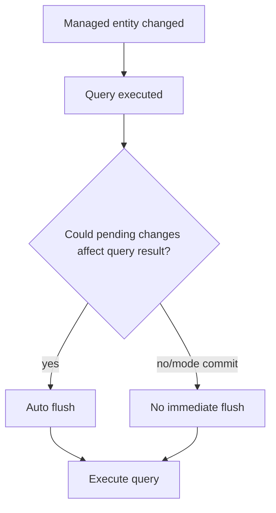

---

## 8. Object Graph Bukan Query Plan

Dalam Java, relasi terlihat seperti object graph:

```java
caseFile.getRegulatedParty().getLegalName();
caseFile.getEvidenceItems().forEach(...);
caseFile.getActions().forEach(...);
```

Tetapi database tidak menyimpan object graph. Database menyimpan row dan foreign key.

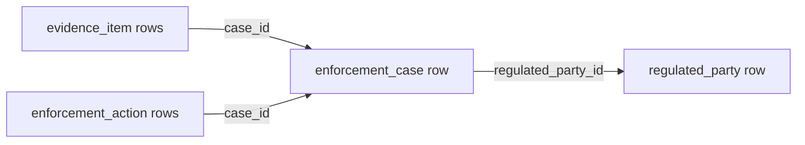

Jika setiap traversal memicu query, kamu mendapat N+1.

```java
List<EnforcementCase> cases = repository.findOpenCases();

for (EnforcementCase c : cases) {
    System.out.println(c.getRegulatedParty().getLegalName());
}
```

Kemungkinan SQL:

```sql
select * from enforcement_case where status = 'OPEN';
select * from regulated_party where id = ?;
select * from regulated_party where id = ?;
select * from regulated_party where id = ?;
-- repeated N times
```

Mental model benar:

> Object graph traversal adalah code shape. SQL query plan adalah data access shape. Keduanya harus sengaja disejajarkan melalui fetch plan.

---

## 9. Entity Bukan DTO

Entity adalah object persistence dengan identity, lifecycle, dan invariants. DTO adalah shape data untuk transfer.

Mencampur keduanya memicu masalah:

```java
@RestController
class CaseController {
    @GetMapping("/cases/{id}")
    EnforcementCase get(@PathVariable UUID id) {
        return service.getCase(id);
    }
}
```

Risiko:

- serializer menyentuh lazy association;
- infinite recursion pada bidirectional relation;
- sensitive field bocor;
- API contract ikut berubah saat mapping entity berubah;
- transaction harus dibuka sampai web serialization agar lazy loading bekerja;
- write model dan read model tercampur.

Model lebih sehat:

```java
record CaseSummaryResponse(
    UUID id,
    String caseNumber,
    String regulatedPartyName,
    CaseStatus status,
    Instant openedAt
) {}
```

Query bisa diarahkan ke projection:

```java
select new com.example.CaseSummaryResponse(
    c.id,
    c.caseNumber,
    p.legalName,
    c.status,
    c.openedAt
)
from EnforcementCase c
join c.regulatedParty p
where c.id = :id
```

Prinsip:

- Entity cocok untuk command/write use case yang perlu invariant behavior.
- Projection/DTO cocok untuk read use case yang butuh shape spesifik.
- Jangan menjadikan entity sebagai format API publik.

---

## 10. Database Bukan Sekadar Persistence Detail

Walaupun memakai JPA, database tetap memegang kebenaran penting:

- primary key;
- foreign key;
- unique constraint;
- not-null constraint;
- check constraint;
- transaction isolation;
- lock;
- index;
- query plan;
- durability.

Contoh:

```java
boolean exists = repository.existsByCaseNumber(caseNumber);
if (!exists) {
    repository.save(new EnforcementCase(caseNumber));
}
```

Kode ini tidak cukup untuk menjamin uniqueness dalam concurrency.

Dua request paralel bisa sama-sama melihat `exists = false`, lalu sama-sama insert. Constraint database tetap wajib.

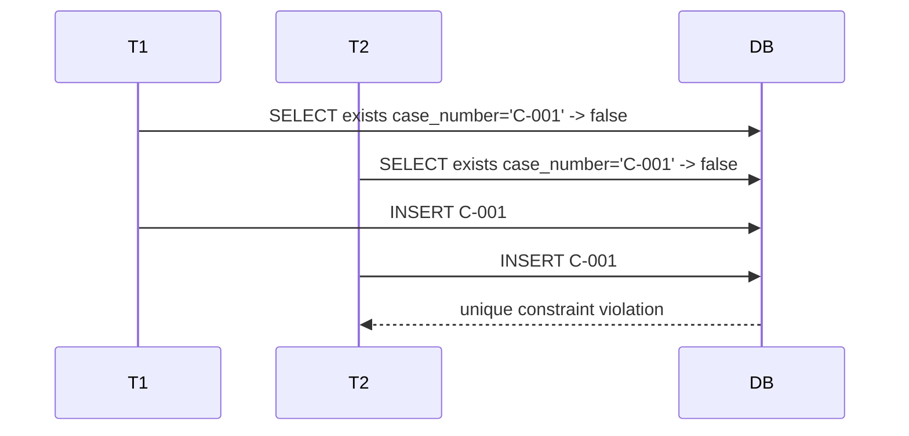

Mental model benar:

> Validasi aplikasi memberi pesan dan flow yang baik. Constraint database memberi kebenaran durable di bawah concurrency.

---

## 11. Transaction Boundary adalah Consistency Boundary

Transaction bukan dekorasi. Transaction menentukan operasi mana yang atomic.

Buruk:

```java
public void closeCase(UUID id) {
    EnforcementCase c = caseRepository.find(id);      // Tx 1?
    c.close();                                        // no tx?
    caseRepository.save(c);                           // Tx 2?
    outboxRepository.save(eventFrom(c));              // Tx 3?
}
```

Lebih sehat:

```java
@Transactional
public void closeCase(UUID id, CloseCaseCommand command) {
    EnforcementCase c = caseRepository.getForUpdateIntent(id);
    c.close(command.reason(), command.closedBy());
    outboxRepository.add(CaseClosedEvent.from(c));
}
```

Kita ingin case update dan outbox insert berada dalam transaction yang sama.

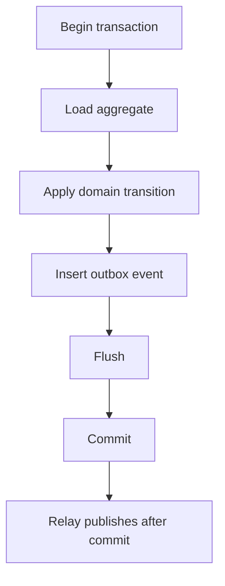

Jika event dikirim sebelum commit dan commit gagal, sistem lain melihat event palsu. Jika commit berhasil tetapi event gagal dikirim tanpa outbox, integration lost.

---

## 12. Time, History, and Mutability

Persistence sering menjadi sulit karena waktu.

Ada beberapa waktu:

| Time | Makna | Contoh |
|---|---|---|
| Event time | kapan kejadian domain terjadi | evidence received at 10:00 |
| Transaction time | kapan database commit | row committed at 10:05 |
| Processing time | kapan sistem memproses | worker processed at 10:07 |
| Valid time | kapan fakta berlaku | license suspended from Monday |
| Audit time | kapan perubahan dicatat | status changed by officer |

Entity current-state tidak cukup untuk semua kebutuhan.

Contoh:

```java
class EnforcementCase {
    private CaseStatus status;
}
```

Ini menjawab status saat ini, tetapi tidak menjawab:

- siapa mengubah status;
- kapan status berubah;
- status sebelumnya apa;
- alasan perubahan;
- apakah perubahan berasal dari user, system, atau migration;
- apakah perubahan sah menurut policy saat itu.

Maka persistence design sering perlu:

- audit table;
- domain event;
- timeline event;
- outbox;
- temporal table;
- immutable event log;
- historical read model.

Untuk sistem regulatory, defensibility sering sama pentingnya dengan current state.

---

## 13. Mapping adalah Contract, Bukan Dekorasi

Annotation mapping bukan kosmetik. Ia adalah contract antara object model dan database model.

Contoh:

```java
@ManyToOne(optional = false, fetch = FetchType.LAZY)
@JoinColumn(name = "regulated_party_id", nullable = false)
private RegulatedParty regulatedParty;
```

Contract-nya:

- setiap case harus punya regulated party;
- database column tidak boleh null;
- association dimuat lazy;
- foreign key berada di table `enforcement_case`;
- object field merepresentasikan relationship many-to-one.

Jika mapping tidak sejajar dengan schema, bug muncul dalam bentuk:

- constraint violation;
- unexpected null;
- extra update;
- join table tidak perlu;
- delete failure;
- orphan row;
- query lambat.

Prinsip:

> Mapping harus mencerminkan invariant domain dan bentuk data access, bukan sekadar membuat ORM berhenti error.

---

## 14. Provider Itu Tidak Sepenuhnya Transparan

Jakarta Persistence adalah spesifikasi. Hibernate dan EclipseLink adalah provider.

Spesifikasi mendefinisikan contract umum, tetapi banyak detail behavior, optimization, dan extension berasal dari provider.

Contoh area provider-specific:

- bytecode enhancement/weaving;
- proxy implementation;
- dirty tracking strategy;
- batching behavior;
- second-level cache implementation;
- query hints;
- custom type mapping;
- filters/soft delete;
- multi-tenancy;
- fetch optimization;
- SQL dialect behavior.

Mental model:

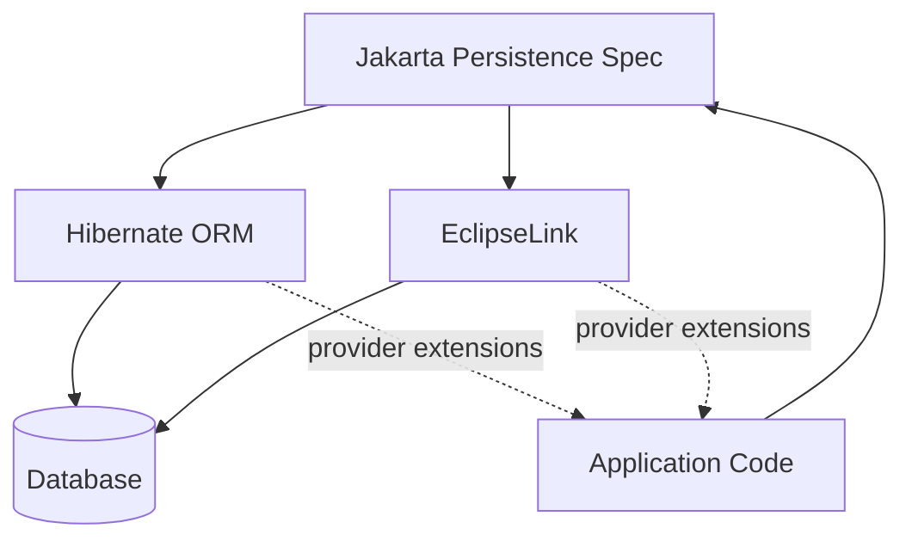

Provider extension tidak salah. Yang salah adalah memakainya tanpa boundary dan tanpa sadar migration cost.

---

## 15. Read Model dan Write Model Tidak Harus Sama

Salah satu kesalahan paling mahal adalah memaksa satu entity model melayani semua use case:

- command update;
- API detail response;
- dashboard list;
- reporting;
- export;
- audit;
- search;
- batch processing.

Write model biasanya butuh:

- invariant;
- lifecycle;
- concurrency control;
- aggregate boundary;
- transactional consistency.

Read model biasanya butuh:

- shape data spesifik;
- denormalized projection;
- pagination stabil;
- filter/search;
- minimal join;
- read-only optimization.

Diagram:

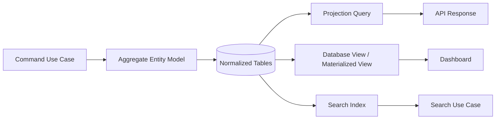

Prinsip:

> Entity model adalah alat untuk menjaga perubahan state. Jangan paksa entity model menjadi semua bentuk baca.

---

## 16. Example: Enforcement Case as Aggregate

Mari mulai dari model konseptual.

```java
@Entity
@Table(name = "enforcement_case")
public class EnforcementCase {

    @Id
    private UUID id;

    @Column(nullable = false, unique = true)
    private String caseNumber;

    @Enumerated(EnumType.STRING)
    @Column(nullable = false)
    private CaseStatus status;

    @ManyToOne(fetch = FetchType.LAZY, optional = false)
    @JoinColumn(name = "regulated_party_id", nullable = false)
    private RegulatedParty regulatedParty;

    @OneToMany(mappedBy = "caseFile", cascade = CascadeType.ALL, orphanRemoval = true)
    private List<Allegation> allegations = new ArrayList<>();

    protected EnforcementCase() {
        // for JPA
    }

    public EnforcementCase(UUID id, String caseNumber, RegulatedParty regulatedParty) {
        this.id = Objects.requireNonNull(id);
        this.caseNumber = requireValidCaseNumber(caseNumber);
        this.regulatedParty = Objects.requireNonNull(regulatedParty);
        this.status = CaseStatus.OPEN;
    }

    public void addAllegation(String code, String narrative, Severity severity) {
        if (status == CaseStatus.CLOSED) {
            throw new IllegalStateException("Cannot add allegation to closed case");
        }
        allegations.add(new Allegation(this, code, narrative, severity));
    }

    public void close(String reason) {
        if (allegations.isEmpty()) {
            throw new IllegalStateException("Cannot close case without allegations");
        }
        this.status = CaseStatus.CLOSED;
    }
}
```

Ada beberapa keputusan penting:

- `EnforcementCase` punya UUID assigned, sehingga identity tersedia sejak construction.
- `RegulatedParty` adalah association many-to-one, bukan embedded, karena party punya lifecycle sendiri.
- `Allegation` berada dalam aggregate case, sehingga cascade/orphan removal mungkin masuk akal.
- Constructor menjaga valid initial state.
- Method domain menjaga transition rule.
- Entity tidak diekspos sebagai API response.

Tetapi desain ini belum final. Kita masih harus bertanya:

- Apakah `RegulatedParty` boleh berubah legal name dan memengaruhi historical case?
- Apakah allegation boleh dihapus secara fisik, atau harus historis immutable?
- Apakah collection allegations bisa tumbuh sangat besar?
- Apakah close case butuh optimistic lock?
- Apakah status transition perlu timeline event?
- Apakah `caseNumber` generated oleh database, service, atau external system?

Persistence modelling selalu domain modelling + runtime modelling.

---

## 17. Predict the SQL

Sebelum menjalankan code, biasakan memprediksi SQL.

```java
@Transactional
public UUID openCase(OpenCaseCommand command) {
    RegulatedParty party = entityManager.getReference(
        RegulatedParty.class,
        command.regulatedPartyId()
    );

    EnforcementCase c = new EnforcementCase(
        UUID.randomUUID(),
        command.caseNumber(),
        party
    );

    c.addAllegation(command.allegationCode(), command.narrative(), command.severity());

    entityManager.persist(c);
    return c.getId();
}
```

Kemungkinan SQL saat flush:

```sql
insert into enforcement_case
    (id, case_number, status, regulated_party_id)
values
    (?, ?, ?, ?);

insert into allegation
    (id, case_id, code, narrative, severity)
values
    (?, ?, ?, ?, ?);
```

Tapi bisa berbeda jika:

- ID generated by database identity;
- cascade tidak dikonfigurasi;
- `getReference()` memicu select karena provider perlu validate;
- constraint gagal;
- flush terjadi lebih awal;
- provider melakukan batching;
- ada lifecycle callback;
- ada entity listener/audit.

Pertanyaan latihan:

1. Apakah `getReference()` selalu query database?
2. Kapan insert dikirim?
3. Apakah allegation ikut persist tanpa explicit `persist(allegation)`?
4. Apa yang terjadi jika `regulated_party_id` tidak ada?
5. Jika unique constraint `case_number` dilanggar, exception muncul saat `persist()` atau flush/commit?

Jawaban inti: banyak error database muncul saat flush/commit, bukan saat object dimodifikasi.

---

## 18. Persistence Failure Modes: Early Map

Sebelum masuk detail tiap topik, simpan peta failure ini.

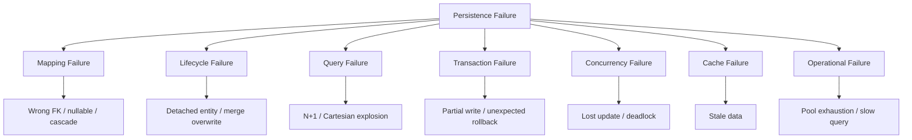

Setiap part lanjutan akan kembali ke peta ini.

---

## 19. Mental Rules of Thumb

### Rule 1 — Object Change Is Not Database Change

Object managed berubah, tetapi database berubah saat flush. Data durable saat commit.

### Rule 2 — Relationship Is Not Free

Setiap traversal association punya potensi query, join, memory load, atau cache lookup.

### Rule 3 — Entity Is Not API Contract

Gunakan projection/DTO untuk read shape. Entity untuk lifecycle dan invariant.

### Rule 4 — Transaction Defines Truth Window

Tanpa transaction boundary yang benar, invariant domain bisa pecah.

### Rule 5 — Database Constraint Is Still Required

Application validation bukan pengganti unique/foreign key/check constraint.

### Rule 6 — Provider Defaults Are Design Decisions

Default fetch, cascade, id strategy, batching, and cache behavior punya konsekuensi.

### Rule 7 — Read and Write Often Need Different Models

Satu model untuk semua use case biasanya menghasilkan entity gemuk, query lambat, dan boundary bocor.

---

## 20. Practice Lab

### Lab 1 — State Timeline

Buat entity minimal:

```java
@Entity
class CaseNote {
    @Id
    private UUID id;

    @Column(nullable = false)
    private String body;

    protected CaseNote() {}

    CaseNote(UUID id, String body) {
        this.id = id;
        this.body = body;
    }

    void revise(String body) {
        this.body = body;
    }
}
```

Lakukan:

1. `new CaseNote(...)`
2. `persist(note)`
3. ubah `note.revise(...)`
4. panggil query JPQL lain
5. commit

Catat:

- kapan insert terjadi;
- kapan update terjadi;
- apakah query memicu flush;
- apakah SQL keluar saat setter/method dipanggil;
- apa yang berubah jika flush mode diganti.

### Lab 2 — Identity Map

Dalam satu transaction:

```java
CaseNote a = em.find(CaseNote.class, id);
CaseNote b = em.find(CaseNote.class, id);
System.out.println(a == b);
```

Lalu lakukan di dua `EntityManager` berbeda.

Catat:

- object identity;
- persistence identity;
- SQL count;
- behavior setelah `clear()`.

### Lab 3 — Constraint Race

Simulasikan dua transaction insert `caseNumber` sama.

Tujuan:

- melihat bahwa `existsByCaseNumber` tidak cukup;
- melihat unique constraint sebagai final guard;
- merancang exception mapping untuk API.

### Lab 4 — Entity vs Projection

Buat endpoint konseptual:

- `GET /cases/{id}` detail response;
- `GET /cases?status=OPEN` list page;
- `POST /cases/{id}/close` command.

Tentukan mana yang memakai:

- entity aggregate;
- DTO projection;
- native query;
- separate read model.

---

## 21. Review Checklist

Sebelum lanjut ke EntityManager detail, pastikan kamu bisa menjawab:

- Apa perbedaan object state, persistence context state, transaction state, dan committed database state?
- Apa bedanya flush dan commit?
- Kenapa entity managed bisa update tanpa explicit `update()`?
- Kenapa detached entity berbahaya?
- Kenapa object graph traversal bisa menghasilkan N+1?
- Kenapa database constraint tetap wajib walaupun ada validation di service?
- Kenapa entity tidak ideal sebagai API response?
- Kenapa read model dan write model boleh berbeda?
- Apa peran provider dibanding spesifikasi Jakarta Persistence?

Jika jawaban masih kabur, ulangi part ini sebelum masuk Part 003.

---

## 22. Kesimpulan

Mental model persistence yang sehat adalah:

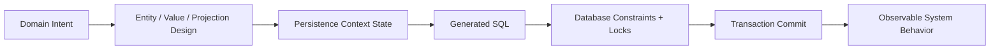

JPA bukan magic CRUD. JPA adalah mekanisme sinkronisasi state object-relational dengan aturan lifecycle, identity, transaction, dan provider behavior.

Part berikutnya akan membahas **JPA to Jakarta Persistence: Specification, Providers, and Runtime Model**: apa yang dijamin spesifikasi, apa yang diserahkan ke provider, dan bagaimana memilih abstraction boundary yang benar.
