------
title: Learn Java Persistence, Database Integration, JPA, Hibernate ORM & EclipseLink - Part 003
description: Landscape Jakarta Persistence, provider ORM, framework integration, runtime model, portability boundary, dan keputusan arsitektural sebelum menulis mapping entity.
series: learn-java-persistence
seriesTitle: Learn Java Persistence, Database Integration, JPA, Hibernate ORM & EclipseLink
order: 3
partTitle: JPA to Jakarta Persistence: Specification, Providers, Runtime Model
tags:
- java
- persistence
- jpa
- jakarta-persistence
- hibernate
- eclipselink
- orm
- specification
- runtime
- portability
- series
date: 2026-06-27
---

# JPA to Jakarta Persistence: Specification, Providers, Runtime Model

> Target part ini: memahami **lapisan kontrak** di ekosistem Java Persistence: mana yang dijamin oleh spesifikasi Jakarta Persistence, mana yang merupakan behavior provider seperti Hibernate/EclipseLink, mana yang berasal dari framework seperti Spring/Jakarta EE/Quarkus/Micronaut, dan mana yang sebenarnya adalah constraint database.

Sebelum menulis mapping entity, engineer harus bisa menjawab pertanyaan ini:

> “Saya sedang bergantung pada kontrak siapa?”

Jika jawabannya tidak jelas, desain persistence akan mudah rapuh. Kode terlihat portable, tetapi diam-diam bergantung pada Hibernate. Atau sebaliknya, kode sengaja dibuat “pure JPA”, tetapi performanya buruk karena tidak memanfaatkan fitur provider yang memang dibutuhkan production.

Part ini bukan hafalan sejarah API. Ini adalah peta keputusan: **specification vs provider vs runtime vs database**.

---

## 1. Dari JPA ke Jakarta Persistence

Secara konseptual, istilah “JPA” masih sering dipakai oleh engineer karena sudah melekat lama. Namun nama spesifikasi modernnya adalah **Jakarta Persistence**.

Perubahan penting:

- dulu API berada pada namespace `javax.persistence`;
- sekarang API berada pada namespace `jakarta.persistence`;
- migrasi dari Java EE ke Jakarta EE menyebabkan perubahan package namespace;
- konsep inti tetap familiar: `Entity`, `EntityManager`, persistence context, JPQL, Criteria API, mapping annotation, transaction integration;
- versi modern menambahkan perbaikan bertahap, dukungan tipe Java modern, query improvement, dan penyesuaian ekosistem Jakarta EE.

Baseline seri ini:

- **Jakarta Persistence 3.2** sebagai baseline stabil seri;
- **Hibernate ORM 7.x** sebagai provider observasi utama;
- **EclipseLink 5.x** sebagai provider pembanding;
- **Jakarta Persistence 4.0** hanya sebagai future-looking topic saat relevan.

```java
import jakarta.persistence.Entity;
import jakarta.persistence.EntityManager;
import jakarta.persistence.Id;
import jakarta.persistence.PersistenceContext;
```

Di production, namespace bukan sekadar kosmetik. Ia menentukan kompatibilitas library, application server, Spring Boot version, provider ORM, bytecode enhancement, annotation processor, dan plugin build.

---

## 2. Empat Lapisan yang Sering Tercampur

Java Persistence adalah stack, bukan satu teknologi tunggal.

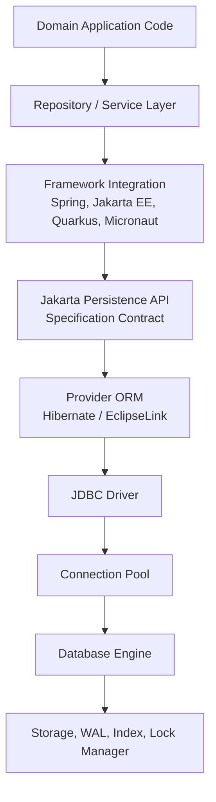

Ketika bug terjadi, banyak engineer langsung menyalahkan “JPA”. Padahal sumbernya bisa berbeda:

| Symptom | Kemungkinan sumber sebenarnya |
|---|---|
| Query lambat | SQL shape, index, statistics, join order, fetch plan, cardinality estimate |
| Lazy loading error | persistence context sudah tertutup, thread boundary salah, serialization boundary salah |
| Update tidak tersimpan | entity detached, transaction tidak aktif, flush tidak terjadi, rollback diam-diam |
| Duplicate object | identity/equality salah, persistence context berbeda, DTO/entity tercampur |
| Deadlock | database lock ordering, batch write ordering, transaction scope terlalu besar |
| Data stale | cache, isolation, repeatable read, persistence context lama, second-level cache |
| Memory naik | persistence context terlalu panjang, batch import tanpa clear, graph terlalu besar |
| Migration gagal | schema drift, DDL generation vs migration tool boundary kabur |

Mental model yang benar: **Jakarta Persistence memberi kontrak; provider menjalankan strategi; framework mengatur lifecycle; database menentukan kebenaran akhir.**

---

## 3. Apa yang Dijamin Specification?

Jakarta Persistence mendefinisikan kontrak standar untuk object/relational mapping dan pengelolaan persistence di Java.

Yang biasanya termasuk wilayah specification:

1. **Entity model**
   - apa itu entity;
   - bagaimana primary key dideklarasikan;
   - lifecycle entity;
   - mapping field/property;
   - inheritance mapping;
   - embeddable;
   - association mapping.

2. **Persistence context**
   - konsep managed entity;
   - identity guarantee dalam satu persistence context;
   - state transition;
   - flush;
   - detach;
   - remove;
   - merge.

3. **EntityManager API**
   - `persist()`;
   - `find()`;
   - `getReference()`;
   - `merge()`;
   - `remove()`;
   - `flush()`;
   - `clear()`;
   - `detach()`;
   - `refresh()`;
   - query creation.

4. **Query language**
   - JPQL;
   - Criteria API;
   - typed query;
   - parameter binding;
   - bulk update/delete;
   - named queries.

5. **Transaction integration**
   - resource-local persistence unit;
   - JTA integration;
   - synchronization with transaction lifecycle.

6. **Locking abstraction**
   - optimistic locking;
   - pessimistic locking;
   - lock modes;
   - version field.

7. **Metadata model**
   - annotations;
   - XML mapping;
   - persistence unit configuration;
   - schema generation properties.

8. **Portable minimum behavior**
   - enough to write code that can run on compliant providers;
   - not enough to guarantee same performance, SQL shape, or every edge behavior.

A top engineer tidak berhenti pada “valid menurut spec”. Ia bertanya:

- Apakah provider menghasilkan SQL yang masuk akal?
- Apakah transaction boundary sesuai use case?
- Apakah fetch plan eksplisit?
- Apakah database constraint mendukung invariant domain?
- Apakah mapping portable atau sengaja provider-specific?

---

## 4. Apa yang Tidak Dijamin Specification?

Ini bagian yang sering membuat engineer intermediate tersandung.

Specification tidak menjamin banyak hal yang justru penting di production.

| Area | Kenapa tidak cukup mengandalkan specification |
|---|---|
| SQL exact shape | Provider bebas memilih SQL selama semantik terpenuhi. Join order, alias, select list, batching, dan subquery bisa berbeda. |
| Dirty checking algorithm | Spec mendefinisikan efek, bukan detail internal snapshot/bytecode enhancement. |
| Lazy loading mechanism | Proxy, bytecode enhancement, weaving, dan field interception berbeda antar provider. |
| Second-level cache | Ada standar caching tertentu, tetapi strategi, invalidation, region, dan consistency banyak provider-specific. |
| Batch processing | Insert/update batching, ordering, stateless session, streaming result sering provider-specific. |
| Dialect behavior | Pagination, locking SQL, sequences, identity, JSON/array types sangat bergantung database dan provider dialect. |
| Query optimization | Provider tidak menggantikan database optimizer. ORM hanya membentuk SQL. |
| Fetch tuning | Spec punya entity graph dan fetch join, tetapi batch/subselect fetch biasanya provider-specific. |
| Monitoring | Metrics, statistics, slow query insight, query plan capture bukan standar penuh JPA. |
| Multi-tenancy | Ada pola standar, tetapi implementasi production banyak provider/framework/database-specific. |

Rule yang sehat:

> Pakai specification sebagai bahasa desain default. Gunakan provider feature secara sadar ketika production constraint membutuhkannya. Jangan bergantung pada provider behavior secara tidak sengaja.

---

## 5. Provider ORM: Hibernate dan EclipseLink

Jakarta Persistence adalah kontrak. Provider adalah engine.

Dua provider yang akan banyak muncul di seri ini:

- **Hibernate ORM**;
- **EclipseLink**.

Keduanya dapat menjalankan API Jakarta Persistence, tetapi arsitektur internal dan fitur extension-nya berbeda.

---

## 6. Hibernate ORM dalam Mental Model

Hibernate adalah provider ORM yang sangat umum digunakan di ekosistem Spring dan enterprise Java modern.

Saat memakai Hibernate via JPA, kamu mungkin menulis:

```java
@PersistenceContext
private EntityManager entityManager;
```

Namun di baliknya, Hibernate memiliki konsep internal seperti:

- `Session` sebagai native API utama;
- persistence context internal;
- entity entry dan loaded state snapshot;
- action queue;
- flush event;
- dirty checking;
- proxies;
- bytecode enhancement;
- collection persister;
- dialect;
- fetch profiles;
- second-level cache region;
- query plan/cache;
- statistics.

Relasi konseptualnya:

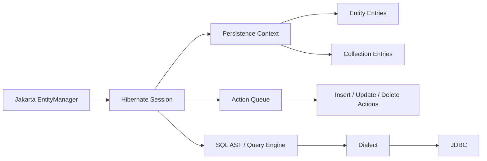

Sebagai engineer, kamu tidak harus memakai native Hibernate API setiap hari. Tetapi kamu harus memahami bahwa beberapa behavior yang kamu lihat berasal dari Hibernate, bukan dari spec.

Contoh:

```java
Session session = entityManager.unwrap(Session.class);
```

`unwrap()` adalah sinyal eksplisit:

> “Mulai titik ini, kode saya tidak lagi purely portable JPA. Saya sengaja masuk ke provider-specific contract.”

Itu bukan dosa. Yang berbahaya adalah memakai fitur provider tanpa sadar dan menganggapnya portable.

---

## 7. EclipseLink dalam Mental Model

EclipseLink juga merupakan provider Jakarta Persistence. Ia punya sejarah kuat di enterprise Java/Jakarta EE dan menjadi reference/compatible implementation dalam beberapa konteks.

Konsep internal EclipseLink yang penting untuk dipahami:

- session;
- unit of work;
- descriptors;
- mappings;
- weaving;
- shared cache;
- fetch groups;
- query hints;
- change tracking policies;
- identity map;
- database platform.

Model konseptualnya:

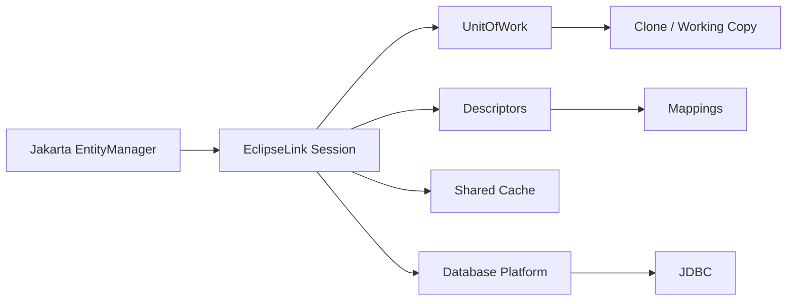

Perbedaan mental model penting:

- Hibernate sering dibahas dengan istilah `Session`, action queue, dirty checking snapshot, proxy;
- EclipseLink sering dibahas dengan istilah `Session`, `UnitOfWork`, descriptor, weaving, identity map, shared cache;
- sama-sama bisa menjalankan JPA, tetapi tuning dan debugging berbeda.

Jika sebuah organisasi ingin portability, jangan hanya menjalankan test di Hibernate. Jalankan juga compliance-oriented tests atau minimal provider-switch smoke tests pada mapping kritikal.

---

## 8. Provider Comparison: Bukan “Mana yang Terbaik?”

Pertanyaan “Hibernate atau EclipseLink mana yang lebih baik?” biasanya terlalu dangkal.

Pertanyaan yang lebih tepat:

> “Untuk runtime, team skill, database, observability, performance profile, dan portability constraint saya, provider mana yang memberi risk/capability trade-off terbaik?”

| Aspek | Hibernate ORM | EclipseLink |
|---|---|---|
| Ekosistem Spring | Sangat umum, default mental model banyak dokumentasi Spring | Bisa dipakai, tetapi tidak seumum Hibernate di Spring Boot mainstream |
| Jakarta EE server | Bisa dipakai tergantung server/integration | Kuat di lingkungan Jakarta EE tertentu |
| Native extension | Sangat luas: filters, custom types, Envers, stateless session, fetch features | Kuat pada descriptor, weaving, cache, fetch group, query hints |
| Debugging public knowledge | Sangat banyak artikel, issue, StackOverflow, production lore | Lebih kecil, tetapi dokumentasi enterprise cukup kuat |
| Portability risk | Tinggi jika terlalu banyak memakai extension Hibernate | Tinggi jika memakai extension EclipseLink |
| Tuning model | Banyak knob; powerful tetapi bisa kompleks | Banyak knob; terutama cache/weaving/descriptor-driven tuning |
| Best use | Spring-heavy systems, Hibernate-specific optimization, broad hiring familiarity | Jakarta EE-oriented systems, EclipseLink-specific caching/weaving features, provider diversity |

Kesimpulan praktis:

- default ke Hibernate jika ekosistemmu Spring-heavy dan team sudah terbiasa;
- pertimbangkan EclipseLink jika runtime Jakarta EE/provider compatibility menjadi concern utama atau kamu butuh fitur spesifiknya;
- untuk seri ini, Hibernate dipakai sebagai “primary microscope”, EclipseLink sebagai “portability mirror”.

---

## 9. Runtime Model: Siapa yang Membuka dan Menutup EntityManager?

`EntityManager` tidak hidup di ruang hampa. Ia dibuat, diikat ke transaksi, dan ditutup oleh runtime.

Ada tiga model besar:

1. **Application-managed**
2. **Container-managed**
3. **Framework-managed**

---

## 10. Application-Managed EntityManager

Model ini umum di aplikasi standalone, CLI, test manual, atau ketika kita ingin mengontrol lifecycle secara eksplisit.

```java
EntityManagerFactory emf = Persistence.createEntityManagerFactory("case-management-pu");

EntityManager em = emf.createEntityManager();
EntityTransaction tx = em.getTransaction();

try {
    tx.begin();

    CaseFile caseFile = em.find(CaseFile.class, caseId);
    caseFile.assignTo("investigator-17");

    tx.commit();
} catch (RuntimeException ex) {
    if (tx.isActive()) {
        tx.rollback();
    }
    throw ex;
} finally {
    em.close();
    emf.close();
}
```

Kelebihan:

- eksplisit;
- mudah dipahami untuk belajar;
- cocok untuk batch sederhana atau bootstrap;
- memudahkan eksperimen provider behavior.

Kekurangan:

- mudah salah menutup resource;
- transaction handling repetitif;
- tidak ideal untuk aplikasi web/service besar;
- raw error handling bisa tersebar.

Mental model:

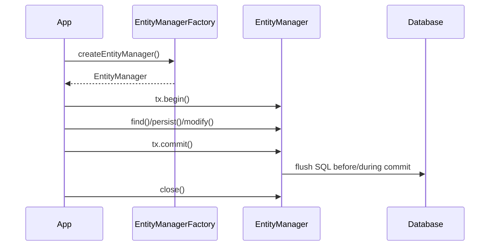

---

## 11. Container-Managed EntityManager

Dalam Jakarta EE style, container dapat mengelola lifecycle `EntityManager` dan transaction integration.

```java
@ApplicationScoped
public class CaseAssignmentService {

    @PersistenceContext
    private EntityManager em;

    @Transactional
    public void assign(long caseId, String investigatorId) {
        CaseFile caseFile = em.find(CaseFile.class, caseId);
        caseFile.assignTo(investigatorId);
    }
}
```

Di sini kode tidak memanggil `createEntityManager()` atau `close()`. Runtime yang mengatur.

Kelebihan:

- lebih ringkas;
- resource lifecycle dikelola container;
- transaction integration lebih konsisten;
- cocok untuk aplikasi server-side.

Risiko:

- lifecycle tersembunyi;
- engineer bisa salah paham bahwa `EntityManager` adalah singleton biasa;
- transaction boundary terlihat sebagai anotasi, tetapi efeknya sangat besar;
- debugging butuh memahami container behavior.

Invariant penting:

> Injected `EntityManager` bukan berarti satu persistence context global untuk seluruh aplikasi. Biasanya yang diinjeksi adalah proxy yang mengarahkan operasi ke persistence context yang sesuai dengan transaction/thread/request aktif.

---

## 12. Framework-Managed EntityManager: Spring Example

Dalam Spring, `@Transactional` mengatur transaction boundary dan mengikat `EntityManager` ke thread selama scope transaksi.

```java
@Service
public class CaseAssignmentService {

    private final EntityManager em;

    public CaseAssignmentService(EntityManager em) {
        this.em = em;
    }

    @Transactional
    public void assign(long caseId, String investigatorId) {
        CaseFile caseFile = em.find(CaseFile.class, caseId);
        caseFile.assignTo(investigatorId);
    }
}
```

Yang tampak sederhana:

```java
caseFile.assignTo(investigatorId);
```

Yang terjadi secara konseptual:

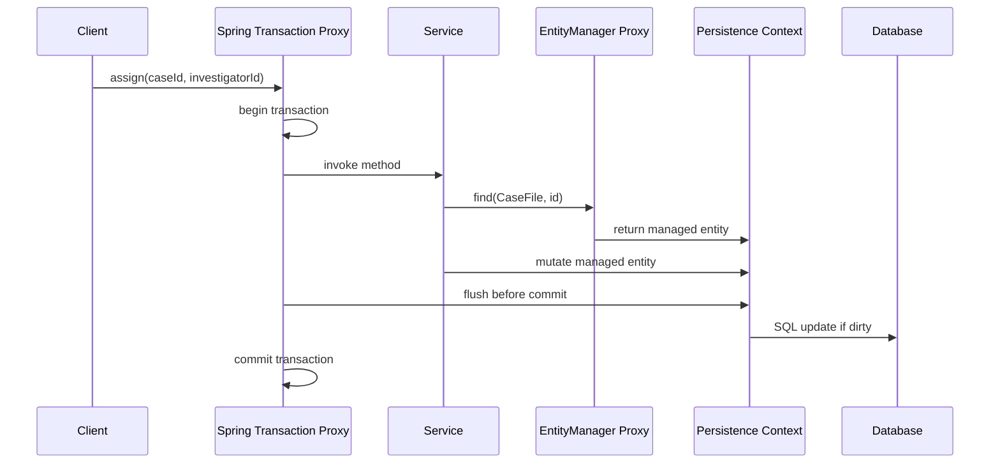

Spring tidak menghilangkan konsep JPA. Spring mengelola lifecycle-nya. Jika mental model JPA salah, `@Transactional` hanya membuat bug lebih tersembunyi.

---

## 13. Persistence Unit

`persistence.xml` atau konfigurasi framework mendefinisikan persistence unit.

Persistence unit menjawab:

- entity classes apa yang dikelola;
- provider apa yang dipakai;
- data source/connection apa yang dipakai;
- apakah transaction type resource-local atau JTA;
- property provider apa yang diaktifkan;
- schema generation strategy apa yang digunakan;
- cache/validation/listener apa yang berlaku.

Contoh klasik:

```xml
<persistence xmlns="https://jakarta.ee/xml/ns/persistence"
             version="3.2">
    <persistence-unit name="case-management-pu" transaction-type="RESOURCE_LOCAL">
        <provider>org.hibernate.jpa.HibernatePersistenceProvider</provider>

        <class>com.example.casefile.CaseFile</class>
        <class>com.example.casefile.ViolationNotice</class>

        <properties>
            <property name="jakarta.persistence.jdbc.url" value="jdbc:postgresql://localhost:5432/cases" />
            <property name="jakarta.persistence.jdbc.user" value="app" />
            <property name="jakarta.persistence.jdbc.password" value="secret" />
            <property name="jakarta.persistence.schema-generation.database.action" value="validate" />
        </properties>
    </persistence-unit>
</persistence>
```

Di Spring Boot, banyak konfigurasi ini pindah ke `application.yml`, auto-configuration, entity scanning, dan datasource bean. Tetapi konsep persistence unit tetap relevan.

---

## 14. Resource-Local vs JTA

Ini sering diabaikan, padahal menentukan siapa transaction coordinator-nya.

### Resource-Local

Resource-local berarti transaksi dikontrol langsung oleh persistence provider/JDBC resource.

```java
EntityTransaction tx = em.getTransaction();
tx.begin();
// work
tx.commit();
```

Cocok untuk:

- aplikasi standalone;
- test sederhana;
- service yang hanya punya satu database resource;
- latihan provider behavior.

Risiko:

- tidak cocok untuk koordinasi multi-resource yang benar;
- transaction demarcation manual;
- integrasi dengan container bisa membingungkan jika dipakai salah tempat.

### JTA

JTA berarti transaction dikoordinasikan oleh transaction manager eksternal/container.

```java
@Transactional
public void escalate(long caseId) {
    CaseFile caseFile = em.find(CaseFile.class, caseId);
    caseFile.escalate();
}
```

Cocok untuk:

- Jakarta EE server;
- container-managed transaction;
- beberapa resource yang perlu dikoordinasikan;
- enterprise integration.

Namun jangan salah: JTA bukan alasan untuk melakukan distributed transaction secara sembarangan. Banyak architecture modern lebih memilih outbox, saga, idempotency, dan eventual consistency daripada XA transaction lintas banyak sistem.

---

## 15. JPA API vs Native Provider API

Lapisan API bisa dipahami seperti ini:

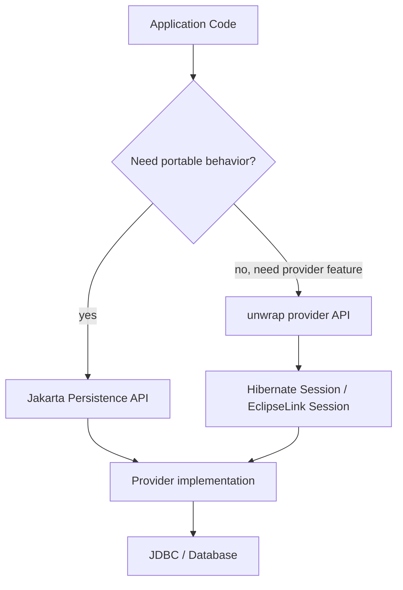

Contoh portable JPA:

```java
CaseFile caseFile = entityManager.find(CaseFile.class, id);
```

Contoh provider escape hatch:

```java
Session session = entityManager.unwrap(Session.class);
session.setDefaultReadOnly(true);
```

Aturan engineering:

1. Default ke API standar.
2. Ukur atau buktikan kebutuhan sebelum masuk provider-specific API.
3. Bungkus provider-specific code di boundary yang jelas.
4. Dokumentasikan alasan dan fallback-nya.
5. Test behavior-nya saat upgrade provider.

---

## 16. Portability Gradient

Portability bukan binary. Ada level-levelnya.

| Level | Contoh | Portability | Kapan dipakai |
|---|---|---:|---|
| 1. Pure spec | `@Entity`, `@Id`, JPQL sederhana | Tinggi | Default untuk mapping dan use case umum |
| 2. Spec + common conventions | `@Version`, entity graph, Criteria API | Tinggi-menengah | Production normal, masih relatif aman |
| 3. Standard API + provider hints | query hint tertentu, cache hint | Menengah | Ketika tuning butuh provider-specific behavior |
| 4. Provider annotation | Hibernate `@BatchSize`, filter, custom type | Rendah-menengah | Ketika benefit jelas dan lokal |
| 5. Native provider API | `Session`, stateless session, descriptor API | Rendah | Batch, streaming, special tuning |
| 6. Native SQL/database feature | CTE, window function, JSONB, lock clause spesifik | Tergantung database | Query/reporting/performance-critical path |

Top engineer tidak alergi terhadap level 4–6. Ia hanya tidak menaruhnya secara acak di seluruh codebase.

---

## 17. Decision Tree: API Mana yang Dipakai?

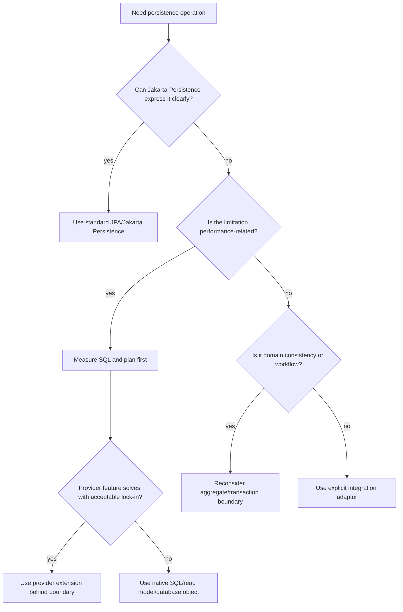

Contoh:

- CRUD aggregate biasa → standard JPA.
- Fetch use case dengan predictable graph → entity graph atau fetch join.
- Large import jutaan row → provider-specific batch/stateless/native JDBC mungkin lebih tepat.
- Complex analytical query → native SQL/read model lebih tepat.
- Workflow enforcement lifecycle → jangan paksa semua state machine masuk entity graph; desain boundary.

---

## 18. Runtime Integration dengan Framework

### Spring / Spring Boot

Spring memberi:

- transaction demarcation via `@Transactional`;
- dependency injection;
- exception translation;
- repository abstraction;
- entity scanning;
- datasource integration;
- auto-configuration provider.

Spring tidak memberi:

- jaminan fetch plan benar;
- perlindungan otomatis dari N+1;
- desain aggregate yang baik;
- query plan optimal;
- transaction boundary sesuai domain jika service method-nya salah;
- magic fix untuk detached entity.

### Jakarta EE

Jakarta EE memberi:

- container-managed EntityManager;
- JTA transaction;
- CDI;
- integration dengan Bean Validation;
- application server resource management;
- portable programming model untuk server runtime.

Jakarta EE tidak otomatis membuat mapping portable secara performa. Compliance bukan sinonim optimal.

### Quarkus

Quarkus sering mengoptimalkan banyak hal pada build time. Dalam konteks persistence, ini dapat memengaruhi:

- entity scanning;
- bytecode enhancement;
- reflection requirements;
- native image compatibility;
- dev services/test integration;
- Panache-style model jika dipakai.

### Micronaut

Micronaut memiliki pendekatan compile-time DI dan data access abstraction. Jika menggunakan JPA/Hibernate, konsep persistence context tetap relevan.

### Rule

Framework berbeda, invariant persistence tetap sama:

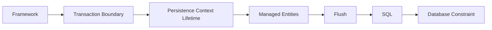

Jangan belajar framework sebagai pengganti mental model ORM.

---

## 19. Object Model vs Database Model vs API Model

Dalam aplikasi modern, minimal ada tiga model:

1. **Domain model** — model perilaku bisnis.
2. **Persistence model** — mapping ke database.
3. **API model** — contract request/response.

Kadang domain model dan persistence model memakai class yang sama. Kadang dipisah.

Masalah muncul saat engineer menganggap satu class harus melayani semuanya.

Contoh buruk:

```java
@Entity
public class CaseFile {
    @Id
    private Long id;

    public String publicApiStatus;
    public String internalWorkflowStatus;
    public String databaseAuditBlob;
    public String uiColor;
}
```

Class ini mulai menjadi campuran:

- database row;
- domain aggregate;
- REST response;
- UI state;
- audit artifact.

Akibatnya:

- mapping menjadi tidak stabil;
- API change memengaruhi database;
- fetch plan mengikuti kebutuhan UI tertentu;
- domain invariant tersebar;
- test persistence menjadi rapuh.

Model sehat:

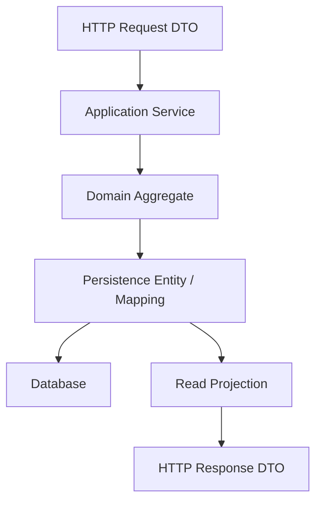

Tidak selalu harus memisahkan class. Tetapi harus sadar role-nya.

---

## 20. Domain Lab Seri: Enforcement Case Management

Agar seri ini tidak berhenti di contoh `User` dan `Order`, kita memakai domain lab konsisten:

- `CaseFile` — berkas kasus enforcement;
- `RegulatedParty` — pihak yang diawasi;
- `ViolationNotice` — temuan atau dugaan pelanggaran;
- `InvestigationAction` — aktivitas investigasi;
- `EscalationDecision` — keputusan eskalasi;
- `PenaltyAssessment` — assessment sanksi;
- `CaseTimelineEntry` — catatan timeline;
- `DocumentEvidence` — dokumen bukti;
- `CaseAssignment` — penugasan investigator;
- `OutboxEvent` — event integrasi keluar.

Kenapa domain ini bagus untuk persistence?

Karena ia punya:

- lifecycle state yang jelas;
- auditability tinggi;
- relasi antar aggregate;
- concurrency conflict realistis;
- read model berbeda dari write model;
- data retention;
- historical state;
- legal defensibility;
- workflow escalation;
- heavy query untuk dashboard;
- transactional decision points.

Contoh awal:

```java
@Entity
@Table(name = "case_file")
public class CaseFile {

    @Id
    private UUID id;

    @Version
    private long version;

    @Column(nullable = false)
    private String caseNumber;

    @Enumerated(EnumType.STRING)
    @Column(nullable = false)
    private CaseStatus status;

    @Column(nullable = false)
    private Instant openedAt;

    protected CaseFile() {
        // for provider
    }

    public CaseFile(UUID id, String caseNumber, Instant openedAt) {
        this.id = Objects.requireNonNull(id);
        this.caseNumber = Objects.requireNonNull(caseNumber);
        this.openedAt = Objects.requireNonNull(openedAt);
        this.status = CaseStatus.OPEN;
    }

    public void escalate() {
        if (status != CaseStatus.OPEN && status != CaseStatus.UNDER_REVIEW) {
            throw new IllegalStateException("Only open or under-review cases can be escalated");
        }
        this.status = CaseStatus.ESCALATED;
    }
}
```

Di part berikutnya, class ini akan dipakai untuk membahas `EntityManager` dan persistence context.

---

## 21. Specification-First, Provider-Aware Design

Ada dua ekstrem buruk.

### Ekstrem 1: Pure Specification Dogmatism

Semua harus portable. Tidak boleh provider-specific. Tidak boleh native SQL.

Masalah:

- performance-critical path bisa buruk;
- fitur database modern tidak dimanfaatkan;
- batch processing dipaksakan lewat entity graph;
- query kompleks menjadi JPQL yang tidak terbaca;
- operational visibility lemah.

### Ekstrem 2: Provider Lock-In Tanpa Boundary

Semua memakai extension provider di mana-mana.

Masalah:

- upgrade provider berisiko tinggi;
- portability hilang;
- onboarding sulit;
- test tidak cukup menangkap perubahan behavior;
- domain code bocor oleh detail ORM.

### Pendekatan yang benar

Gunakan model berikut:

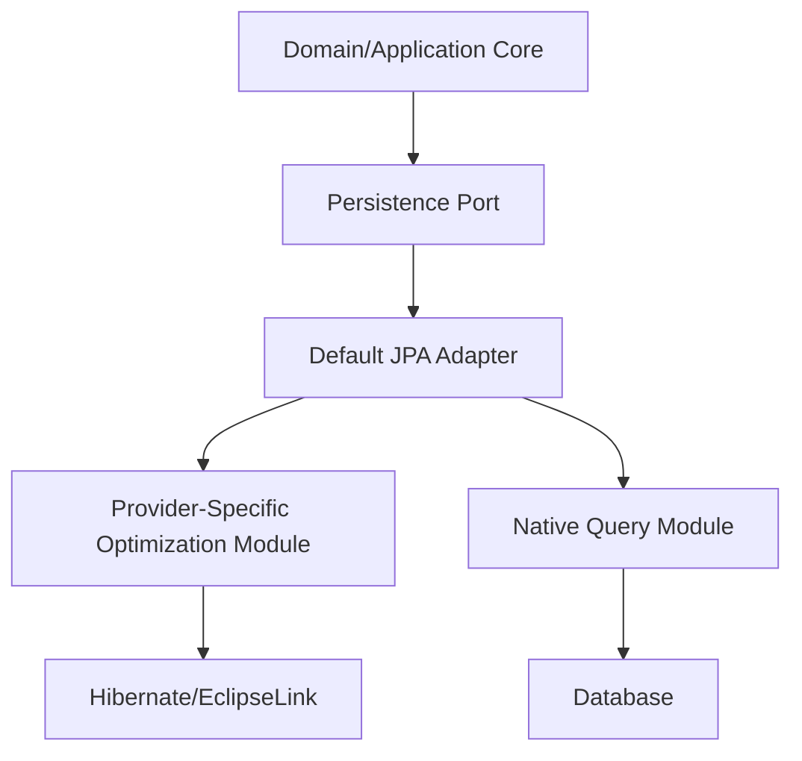

Atur boundary:

- mapping standar di entity;
- provider-specific annotation hanya di entity jika sangat bernilai;
- provider-specific API di adapter/helper, bukan tersebar di service;
- native SQL diberi nama jelas dan test kontrak;
- read model dipisahkan jika query terlalu kompleks.

---

## 22. Anti-Pattern: “JPA Is My Architecture”

JPA bukan architecture. JPA adalah persistence abstraction.

Architecture tetap harus menjawab:

- aggregate boundary;
- transaction boundary;
- consistency requirement;
- concurrency conflict policy;
- read/write model separation;
- integration event policy;
- migration strategy;
- operational monitoring;
- failure recovery;
- data retention;
- auditability;
- schema ownership.

Contoh desain lemah:

```java
@RestController
public class CaseController {

    @PersistenceContext
    private EntityManager em;

    @PostMapping("/cases/{id}/escalate")
    public CaseFile escalate(@PathVariable UUID id) {
        CaseFile caseFile = em.find(CaseFile.class, id);
        caseFile.escalate();
        return caseFile;
    }
}
```

Masalah:

- controller memegang persistence boundary;
- entity dikembalikan langsung sebagai API response;
- transaction boundary tidak eksplisit;
- fetch plan untuk serialization tidak dikendalikan;
- domain action tidak punya application service boundary;
- audit/outbox tidak punya tempat natural;
- error mapping tidak jelas.

Desain lebih sehat:

```java
@RestController
public class CaseController {

    private final EscalateCaseUseCase escalateCase;

    public CaseController(EscalateCaseUseCase escalateCase) {
        this.escalateCase = escalateCase;
    }

    @PostMapping("/cases/{id}/escalate")
    public CaseResponse escalate(@PathVariable UUID id) {
        return escalateCase.escalate(new EscalateCaseCommand(id));
    }
}
```

Persistence dipakai di use case/repository boundary, bukan sebagai architecture keseluruhan.

---

## 23. Checklist: Saat Membaca Kode Persistence

Saat menemukan kode persistence, tanyakan:

### Specification Boundary

- Apakah kode ini memakai API standar Jakarta Persistence?
- Apakah ada provider-specific annotation/API?
- Apakah provider-specific code dibungkus boundary?
- Apakah ada asumsi Hibernate yang tidak disebutkan?

### Runtime Boundary

- Siapa membuat `EntityManager`?
- Siapa menutup `EntityManager`?
- Apakah transaction active saat entity dimodifikasi?
- Apakah persistence context lifespan pendek atau panjang?
- Apakah entity dipakai melewati thread/request boundary?

### Database Boundary

- Constraint apa yang benar-benar dijamin database?
- Apakah invariant hanya dijaga di Java?
- Apakah index mendukung query utama?
- Apakah locking behavior sesuai isolation?
- Apakah migration tool mengontrol schema?

### Framework Boundary

- Apakah `@Transactional` berada di method yang benar?
- Apakah self-invocation menyebabkan transaction tidak aktif?
- Apakah repository abstraction menyembunyikan query mahal?
- Apakah exception translation mengubah detail error yang dibutuhkan?

### Operational Boundary

- Bisa melihat SQL yang dihasilkan?
- Bisa melihat query plan?
- Bisa mengukur flush count?
- Bisa mendeteksi N+1?
- Bisa mengobservasi connection pool pressure?
- Bisa membedakan DB slow vs ORM misuse?

---

## 24. Practice: Classify Dependency Level

Untuk setiap contoh, klasifikasikan level portability-nya.

### Example A

```java
CaseFile caseFile = em.find(CaseFile.class, id);
```

Jawaban: pure Jakarta Persistence API. Portability tinggi.

### Example B

```java
@NamedEntityGraph(
    name = "CaseFile.detail",
    attributeNodes = {
        @NamedAttributeNode("notices"),
        @NamedAttributeNode("assignments")
    }
)
@Entity
class CaseFile { }
```

Jawaban: standard entity graph. Portability relatif tinggi, tetapi provider SQL/fetch behavior tetap perlu diuji.

### Example C

```java
@org.hibernate.annotations.BatchSize(size = 50)
private Set<ViolationNotice> notices = new HashSet<>();
```

Jawaban: Hibernate-specific annotation. Portability rendah-menengah. Bisa sangat berguna, tetapi harus dianggap explicit provider dependency.

### Example D

```java
Session session = em.unwrap(Session.class);
session.setJdbcBatchSize(100);
```

Jawaban: native Hibernate API. Portability rendah. Cocok jika ditempatkan di batch adapter yang jelas.

### Example E

```java
SELECT *
FROM case_file
WHERE metadata @> '{"risk":"high"}'::jsonb
```

Jawaban: native PostgreSQL-specific SQL. Portability database rendah, tetapi mungkin pilihan terbaik untuk query tertentu.

---

## 25. Design Rule untuk Seri Ini

Sepanjang seri ini, setiap fitur akan dievaluasi dengan lima pertanyaan:

1. **Apa kontrak specification-nya?**
2. **Apa behavior provider yang umum?**
3. **Apa SQL/database consequence-nya?**
4. **Apa failure mode production-nya?**
5. **Bagaimana menguji dan mengobservasinya?**

Jika sebuah materi hanya menjawab nomor 1, ia belum cukup untuk level advanced.

---

## 26. Ringkasan Mental Model

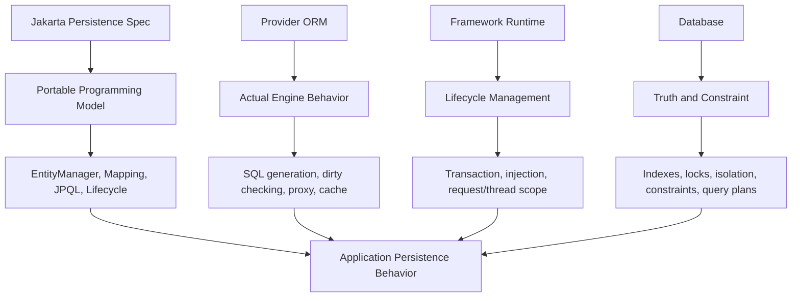

Core principle:

> Java Persistence mastery bukan menghafal annotation. Mastery berarti bisa melihat satu baris repository code dan memprediksi lapisan mana yang terlibat, SQL apa yang mungkin muncul, state apa yang berubah, transaction mana yang aktif, cache mana yang mungkin dipakai, dan failure apa yang realistis.

---

## 27. Self-Correction Questions

Sebelum lanjut ke Part 004, pastikan bisa menjawab:

1. Apa beda Jakarta Persistence specification dan Hibernate provider?
2. Apa risiko memakai `EntityManager.unwrap(Session.class)`?
3. Mengapa `@Transactional` bukan pengganti pemahaman persistence context?
4. Kapan native SQL lebih sehat daripada JPQL?
5. Apa beda resource-local transaction dan JTA?
6. Mengapa portability bukan binary?
7. Mengapa framework-managed `EntityManager` sering berupa proxy?
8. Apa contoh behavior penting yang tidak dijamin exact oleh specification?
9. Bagaimana cara membatasi provider-specific code?
10. Dalam domain enforcement case management, operasi mana yang seharusnya menjadi use case boundary, bukan sekadar repository method?

---

## 28. Transisi ke Part 004

Part berikutnya masuk ke pusat runtime Jakarta Persistence:

- `EntityManager`;
- persistence context;
- first-level cache;
- managed/detached/new/removed state;
- unit of work;
- flush;
- identity map.

Jika Part 003 menjawab “lapisan siapa yang sedang kita pakai?”, Part 004 menjawab:

> “Apa yang sebenarnya terjadi pada object Java saya ketika ia menjadi managed entity?”
