------
title: Learn Java Persistence, Database Integration, JPA, Hibernate ORM & EclipseLink - Part 004
description: EntityManager, persistence context, first-level cache, unit of work, entity state, flush, dan invariant runtime yang menentukan perilaku JPA/Hibernate/EclipseLink.
series: learn-java-persistence
seriesTitle: Learn Java Persistence, Database Integration, JPA, Hibernate ORM & EclipseLink
order: 4
partTitle: EntityManager, Persistence Context, and Unit of Work
tags:
- java
- persistence
- jpa
- jakarta-persistence
- hibernate
- eclipselink
- entitymanager
- persistence-context
- unit-of-work
- first-level-cache
- series
date: 2026-06-27
---

# EntityManager, Persistence Context, and Unit of Work

> Target part ini: memahami `EntityManager` bukan sebagai “DAO bawaan JPA”, tetapi sebagai **facade menuju persistence context** yang melacak identity, state, perubahan, lifecycle, dan sinkronisasi object graph ke database dalam batas transaksi tertentu.

Jika hanya ada satu konsep JPA yang harus benar-benar dikuasai, konsep itu adalah **persistence context**.

Banyak bug JPA/Hibernate/EclipseLink terlihat tidak masuk akal sampai kita menyadari bahwa entity tidak selalu object biasa. Dalam periode tertentu, entity bisa menjadi **managed object**: object Java yang state-nya diamati dan disinkronkan oleh provider.

---

## 1. Posisi `EntityManager` dalam Stack

Di kode aplikasi, kita sering melihat:

```java
@PersistenceContext
private EntityManager em;
```

atau:

```java
private final EntityManager em;
```

Lalu operasi terlihat sederhana:

```java
CaseFile caseFile = em.find(CaseFile.class, caseId);
caseFile.escalate();
```

Tidak ada `save()`.
Tidak ada `update()`.
Tidak ada SQL eksplisit.

Tetapi perubahan bisa tersimpan.

Kenapa?

Karena `caseFile` adalah managed entity di dalam persistence context. Provider melacak perubahan dan melakukan flush ke database saat diperlukan.

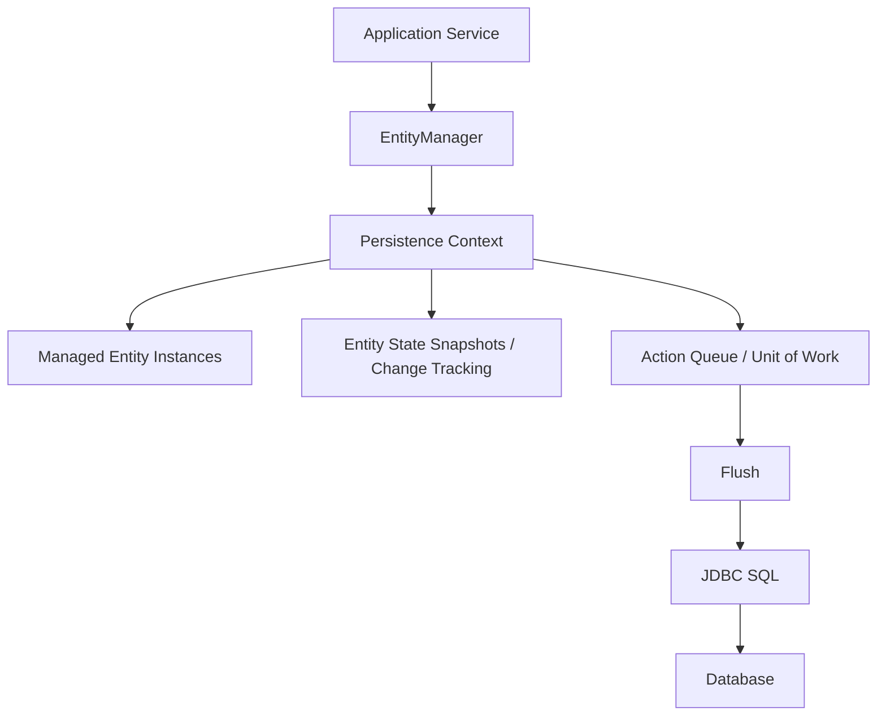

Mental model:

> `EntityManager` adalah API. Persistence context adalah working set. Provider adalah engine. Database adalah source of durable truth.

---

## 2. `EntityManagerFactory` vs `EntityManager`

Dua type ini sering tertukar secara konseptual.

### `EntityManagerFactory`

`EntityManagerFactory` adalah factory untuk membuat `EntityManager`.

Karakteristik:

- expensive dibuat;
- biasanya dibuat satu kali per persistence unit;
- thread-safe untuk digunakan bersama;
- memegang metadata mapping;
- memegang konfigurasi provider;
- berhubungan dengan connection provider, cache, metamodel, dan bootstrap.

Contoh application-managed:

```java
EntityManagerFactory emf = Persistence.createEntityManagerFactory("case-management-pu");
```

Biasanya tidak dibuat per request.

### `EntityManager`

`EntityManager` adalah object kerja untuk interaksi persistence context.

Karakteristik:

- relatif ringan dibanding EMF;
- tidak thread-safe;
- merepresentasikan persistence context atau facade ke persistence context aktif;
- lifespan-nya harus jelas;
- biasanya scoped ke transaction/request/use case;
- tidak boleh disimpan di singleton sebagai state mutable manual.

Contoh:

```java
EntityManager em = emf.createEntityManager();
```

Rule:

> `EntityManagerFactory` boleh dibagi. `EntityManager` jangan dibagi lintas thread.

---

## 3. Apa Itu Persistence Context?

Persistence context adalah sekumpulan entity instance yang sedang **managed** oleh provider.

Ia menjalankan beberapa fungsi sekaligus:

1. **Identity map**
   - memastikan satu database identity direpresentasikan oleh satu Java object dalam persistence context yang sama.

2. **First-level cache**
   - menyimpan entity managed yang sudah diload.

3. **Change tracking**
   - melacak perubahan entity.

4. **Write-behind buffer**
   - menunda SQL insert/update/delete sampai flush.

5. **Lifecycle coordinator**
   - mengatur state new, managed, detached, removed.

6. **Unit of work**
   - mengumpulkan perubahan lalu menyinkronkannya sebagai satu unit.

Persistence context bukan database. Ia adalah **in-memory transactional working set**.

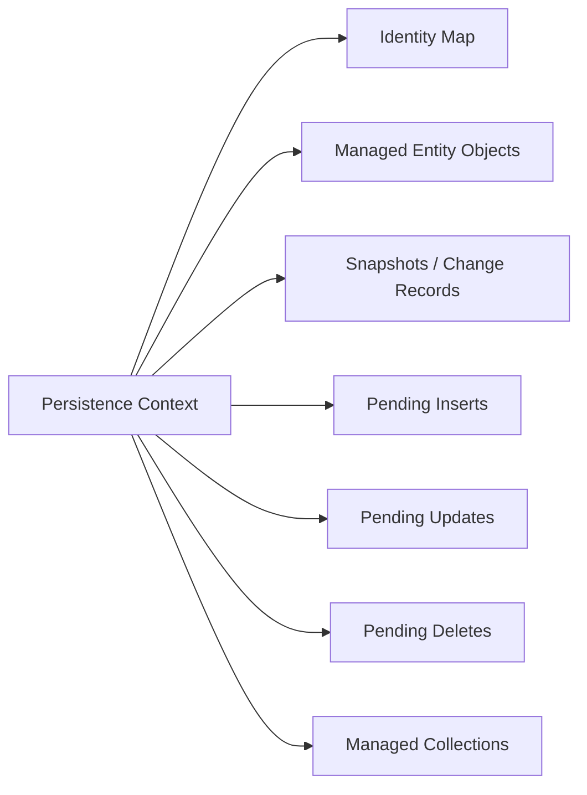

---

## 4. Identity Map Invariant

Invariant terpenting:

> Dalam satu persistence context, satu database row identity hanya boleh memiliki satu managed Java object instance.

Contoh:

```java
CaseFile a = em.find(CaseFile.class, caseId);
CaseFile b = em.find(CaseFile.class, caseId);

System.out.println(a == b); // true, dalam persistence context yang sama
```

Kenapa ini penting?

Karena jika ada dua object berbeda untuk row yang sama dalam satu unit-of-work, provider tidak tahu state mana yang benar.

Persistence context menyelesaikannya dengan identity map:

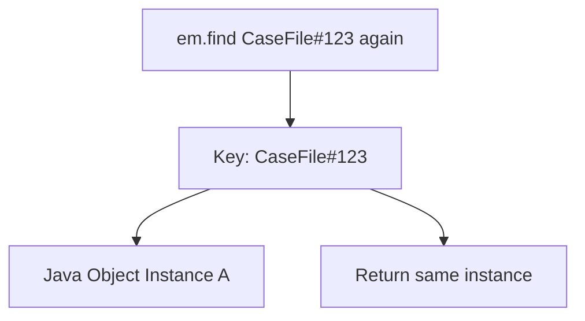

Namun invariant ini hanya berlaku dalam persistence context yang sama.

```java
EntityManager em1 = emf.createEntityManager();
EntityManager em2 = emf.createEntityManager();

CaseFile a = em1.find(CaseFile.class, caseId);
CaseFile b = em2.find(CaseFile.class, caseId);

System.out.println(a == b); // false
System.out.println(Objects.equals(a.getId(), b.getId())); // true
```

Ini sumber banyak bug `equals()`/`hashCode()`, terutama saat entity bergerak antar layer, request, transaction, atau cache.

---

## 5. Entity State: New, Managed, Detached, Removed

JPA entity memiliki state konseptual.

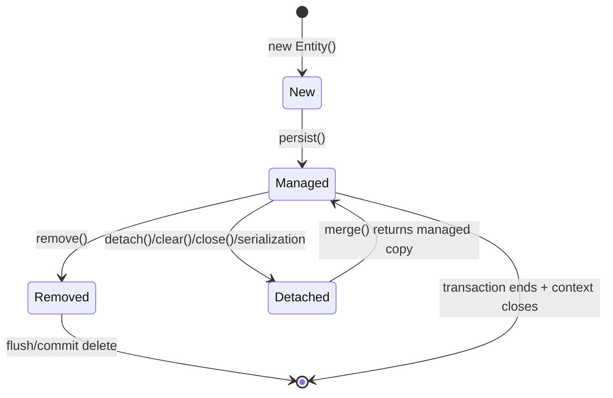

### New / Transient

Object Java baru yang belum dikenal persistence context.

```java
CaseFile caseFile = new CaseFile(id, "CASE-2026-0001", Instant.now());
```

Belum ada row yang dijadwalkan insert sampai:

```java
em.persist(caseFile);
```

### Managed

Entity dikenal oleh persistence context.

```java
CaseFile caseFile = em.find(CaseFile.class, id);
caseFile.escalate();
```

Jika transaction aktif, perubahan dapat disinkronkan saat flush.

### Detached

Entity pernah managed, tetapi persistence context yang mengelolanya sudah tidak lagi mengelolanya.

Penyebab:

- `em.detach(entity)`;
- `em.clear()`;
- `em.close()`;
- keluar dari transaction/request dengan transaction-scoped context;
- serialization;
- dikirim ke UI/client;
- dipakai di thread lain.

Detached entity adalah object Java biasa dengan identity database. Perubahan padanya tidak otomatis tersimpan.

### Removed

Entity managed yang ditandai untuk dihapus.

```java
CaseFile caseFile = em.find(CaseFile.class, id);
em.remove(caseFile);
```

Delete SQL biasanya terjadi saat flush, bukan selalu saat `remove()` dipanggil.

---

## 6. State Transition Example

```java
@Transactional
public UUID openCase(String caseNumber) {
    CaseFile caseFile = new CaseFile(UUID.randomUUID(), caseNumber, Instant.now());

    // state: new/transient
    em.persist(caseFile);

    // state: managed
    caseFile.assignRiskLevel(RiskLevel.HIGH);

    // no explicit update call
    return caseFile.getId();
}
```

Konseptual:

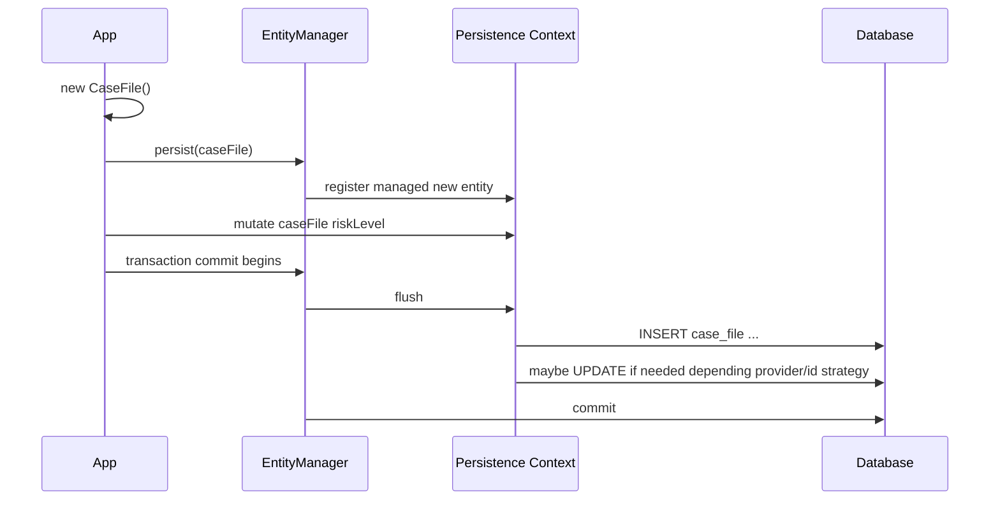

Catatan penting:

- SQL tidak harus terjadi pada `persist()`;
- SQL bisa terjadi saat flush;
- beberapa ID strategy dapat memaksa insert lebih awal;
- provider boleh mengoptimalkan detail selama kontrak terpenuhi.

---

## 7. `persist()` Bukan `save()` Umum

`persist()` berarti:

> Jadikan new entity sebagai managed dan jadwalkan insert sesuai aturan provider/transaction/flush.

Contoh benar:

```java
CaseFile caseFile = new CaseFile(id, caseNumber, openedAt);
em.persist(caseFile);
```

Common pitfall:

```java
CaseFile detached = loadFromPreviousRequest();
em.persist(detached); // salah secara konsep
```

Jika object sudah punya database identity dan berasal dari request sebelumnya, kemungkinan ia detached. Untuk itu, JPA menyediakan `merge()`, tetapi `merge()` juga sering disalahgunakan.

---

## 8. `merge()` Tidak Mengubah Detached Entity Menjadi Managed

Ini salah satu API paling sering disalahpahami.

Banyak engineer berpikir:

```java
em.merge(detachedCase);
detachedCase.escalate(); // dikira managed
```

Padahal konsep yang benar:

> `merge()` menyalin state dari detached entity ke managed instance dan mengembalikan managed instance tersebut.

Contoh benar:

```java
CaseFile managed = em.merge(detachedCase);
managed.escalate();
```

Diagram:

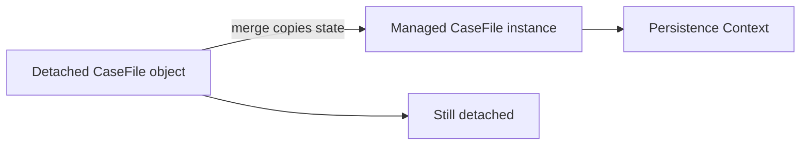

Anti-pattern:

```java
@Transactional
public void update(CaseFile caseFileFromApi) {
    em.merge(caseFileFromApi);
    caseFileFromApi.markReviewed(); // not managed
}
```

Better:

```java
@Transactional
public void markReviewed(UUID caseId) {
    CaseFile managed = em.find(CaseFile.class, caseId);
    managed.markReviewed();
}
```

Untuk command-based application, sering lebih baik load managed aggregate lalu apply command, bukan menerima detached entity dari luar.

---

## 9. `find()` vs `getReference()`

### `find()`

`find()` mengembalikan entity managed jika ada.

```java
CaseFile caseFile = em.find(CaseFile.class, id);
```

Biasanya memicu select jika entity belum ada di persistence context/first-level cache.

### `getReference()`

`getReference()` dapat mengembalikan reference/proxy tanpa langsung mengambil seluruh row.

```java
CaseFile caseRef = em.getReference(CaseFile.class, id);
```

Kapan berguna?

Misalnya membuat association tanpa butuh membaca full entity:

```java
ViolationNotice notice = new ViolationNotice(
    UUID.randomUUID(),
    em.getReference(CaseFile.class, caseId),
    "Late regulatory filing"
);

em.persist(notice);
```

Risiko:

- akses field non-id dapat memicu lazy load;
- jika row tidak ada, error bisa muncul belakangan;
- proxy behavior provider-specific detail;
- serialization proxy bisa bermasalah.

Rule:

> Pakai `find()` ketika butuh membaca dan memvalidasi state. Pakai `getReference()` ketika hanya butuh identity reference dan invariant lain dijamin di tempat berbeda.

---

## 10. First-Level Cache

Persistence context adalah first-level cache.

Contoh:

```java
CaseFile a = em.find(CaseFile.class, id); // SQL SELECT
CaseFile b = em.find(CaseFile.class, id); // no SQL, same context
```

Dalam persistence context yang sama:

- entity yang sama tidak di-load ulang;
- perubahan in-memory terlihat konsisten oleh kode yang sama;
- query tertentu bisa tetap memicu SQL tetapi hasilnya direkonsiliasi dengan managed instance;
- `find()` by id sangat dipengaruhi identity map.

Namun jangan salah:

> First-level cache bukan distributed cache, bukan second-level cache, dan bukan jaminan database isolation.

Contoh skenario:

```java
@Transactional
public void example(UUID id) {
    CaseFile caseFile = em.find(CaseFile.class, id);

    // process lain mengubah row di database

    CaseFile again = em.find(CaseFile.class, id);
    System.out.println(again.getStatus()); // bisa tetap status lama dalam PC
}
```

Untuk memaksa reload:

```java
em.refresh(caseFile);
```

Tetapi `refresh()` bukan obat umum. Ia harus dipakai saat memang ada kebutuhan sinkronisasi eksplisit dengan database.

---

## 11. Dirty Checking

Dirty checking adalah mekanisme provider untuk mendeteksi perubahan entity managed.

Contoh:

```java
@Transactional
public void assign(UUID caseId, String investigatorId) {
    CaseFile caseFile = em.find(CaseFile.class, caseId);
    caseFile.assignTo(investigatorId);
}
```

Tidak ada `em.update(caseFile)`.

Saat flush, provider membandingkan state sekarang dengan state awal atau memakai change tracking/enhancement.

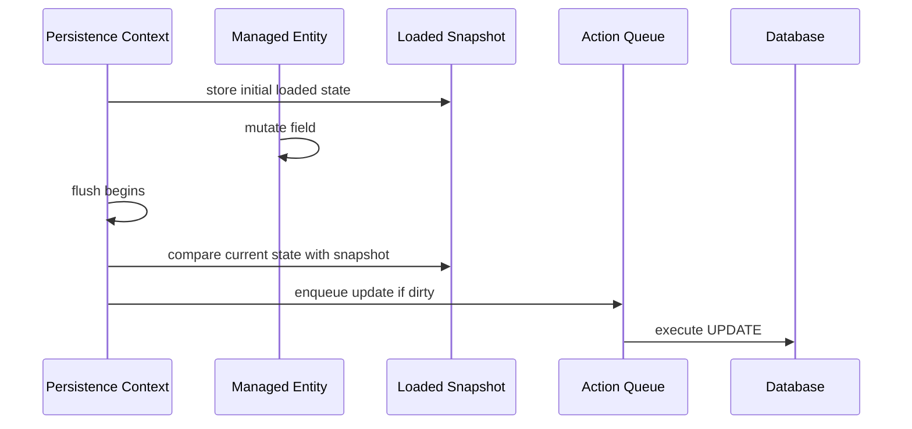

Provider berbeda bisa memakai strategi berbeda:

- snapshot comparison;
- bytecode enhancement;
- field interception;
- weaving;
- explicit change tracking.

Spec menjamin efek konseptual, bukan detail algoritma internal.

---

## 12. Flush: Sinkronisasi, Bukan Commit

Flush adalah proses menyinkronkan perubahan persistence context ke database lewat SQL.

Commit adalah proses menyelesaikan transaction secara durable.

Keduanya berbeda.

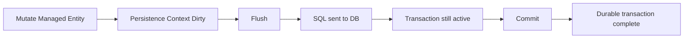

Contoh:

```java
caseFile.escalate();
em.flush();
// SQL update may have been sent, but transaction can still rollback
```

Jika setelah flush terjadi exception dan transaction rollback:

```java
em.flush();
throw new RuntimeException("fail after flush");
```

Maka SQL yang sudah dikirim tetap bisa dibatalkan oleh rollback transaction.

Rule:

> Flush membuat database melihat perubahan dalam transaction yang sama. Commit membuat perubahan durable dan visible sesuai isolation semantics.

---

## 13. Kapan Flush Terjadi?

Flush dapat terjadi:

- saat transaction commit;
- sebelum query tertentu jika flush mode `AUTO` dan provider perlu menjaga query consistency;
- saat `em.flush()` dipanggil eksplisit;
- saat provider butuh menjalankan SQL lebih awal untuk ID generation/constraint tertentu;
- sebelum native query tertentu tergantung provider/configuration.

Contoh unexpected flush:

```java
@Transactional
public List<CaseFile> searchAfterMutation(UUID id) {
    CaseFile caseFile = em.find(CaseFile.class, id);
    caseFile.escalate();

    // Query ini dapat memicu flush sebelum SELECT
    return em.createQuery("select c from CaseFile c where c.status = :status", CaseFile.class)
        .setParameter("status", CaseStatus.ESCALATED)
        .getResultList();
}
```

Kenapa flush sebelum query?

Karena query result harus konsisten dengan perubahan managed yang pending, tergantung flush mode dan query space/provider behavior.

---

## 14. Flush Mode

Dua flush mode utama yang perlu dipahami:

### `AUTO`

Provider boleh flush sebelum query jika perlu.

```java
em.setFlushMode(FlushModeType.AUTO);
```

Ini default umum.

### `COMMIT`

Provider menunda flush sampai commit sejauh memungkinkan.

```java
em.setFlushMode(FlushModeType.COMMIT);
```

Berguna untuk read-heavy flow dengan mutation yang tidak perlu memengaruhi query antara. Namun jangan memakai ini sebagai “performance switch” tanpa memahami consistency consequence.

Rule:

> Flush mode adalah consistency/performance trade-off. Jangan ubah global tanpa observasi SQL dan test behavior.

---

## 15. Unit of Work

Unit of Work adalah pola yang mengumpulkan perubahan object, lalu menulisnya sebagai satu unit sinkronisasi.

Dalam JPA, persistence context menjalankan unit-of-work role.

Contoh:

```java
@Transactional
public void escalateCase(UUID caseId, String reason) {
    CaseFile caseFile = em.find(CaseFile.class, caseId);

    caseFile.escalate(reason);

    InvestigationAction action = InvestigationAction.escalation(caseFile, reason, Instant.now());
    em.persist(action);

    OutboxEvent event = OutboxEvent.caseEscalated(caseFile.getId(), reason);
    em.persist(event);
}
```

Satu use case menghasilkan:

- update `case_file`;
- insert `investigation_action`;
- insert `outbox_event`.

Semua dikoordinasikan oleh persistence context dan transaction.

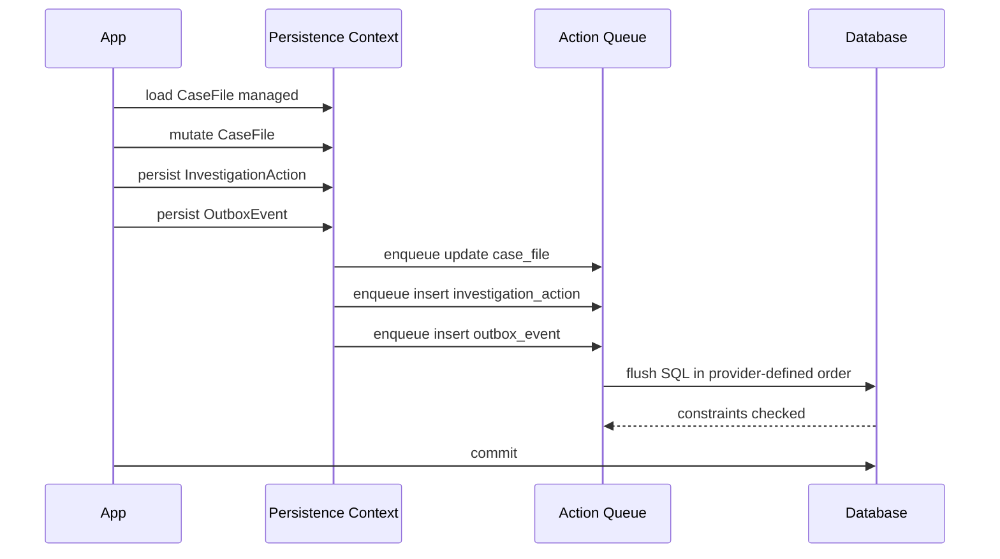

Unit of work bukan berarti SQL order selalu sesuai urutan method call. Provider dapat mengurutkan SQL untuk constraint/batching selama kontrak terpenuhi.

---

## 16. Transaction-Scoped Persistence Context

Model umum di aplikasi service:

> Persistence context hidup selama transaction.

```java
@Transactional
public void assign(UUID caseId, String investigatorId) {
    CaseFile caseFile = em.find(CaseFile.class, caseId);
    caseFile.assignTo(investigatorId);
}
```

Setelah method selesai dan transaction commit, entity biasanya menjadi detached.

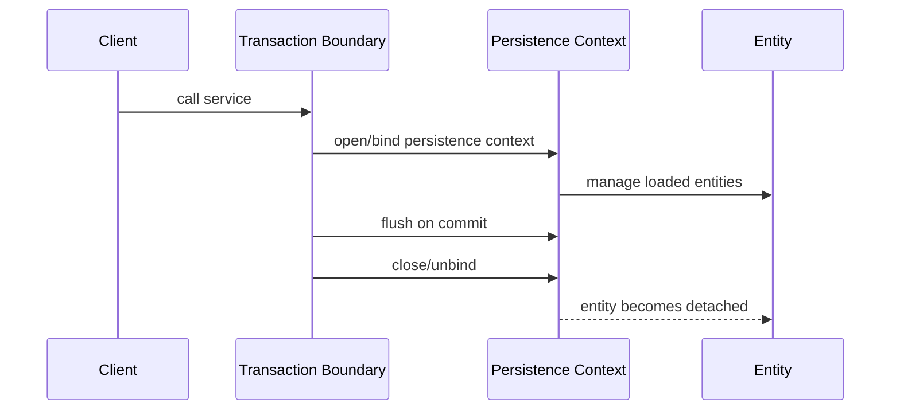

Risiko umum:

```java
CaseFile caseFile = service.findCase(id); // transaction selesai
caseFile.escalate(); // detached mutation, not automatically saved
```

Better:

```java
service.escalateCase(id);
```

Use case method harus membawa perubahan ke dalam transaction boundary.

---

## 17. Extended Persistence Context

Extended persistence context dapat hidup lebih lama dari satu transaction, misalnya conversation state di aplikasi stateful.

Konsep:

- entity tetap managed lintas beberapa interaksi;
- perubahan bisa dikumpulkan lalu disinkronkan pada transaction tertentu;
- lebih kompleks;
- risiko memory growth dan stale data lebih besar.

Cocok untuk:

- stateful conversation yang benar-benar membutuhkan object graph managed panjang;
- aplikasi desktop/long conversation tertentu;
- Jakarta EE stateful session scenario tertentu.

Tidak cocok sebagai default web/service stateless modern.

Rule:

> Untuk service stateless, gunakan transaction-scoped persistence context. Extended context adalah special tool, bukan default.

---

## 18. Persistence Context Lifetime dan Lazy Loading

Lazy loading hanya bisa bekerja jika provider masih punya persistence context aktif untuk mengambil data yang belum dimuat.

Contoh:

```java
@Transactional
public CaseFile getCase(UUID id) {
    return em.find(CaseFile.class, id);
}
```

Lalu di controller/serializer:

```java
CaseFile caseFile = service.getCase(id);
caseFile.getViolationNotices().size(); // bisa gagal jika collection lazy dan PC sudah closed
```

Masalahnya bukan “lazy loading buruk”. Masalahnya boundary salah.

Solusi sehat:

- buat DTO response di dalam transaction dengan fetch plan eksplisit;
- gunakan entity graph/fetch join sesuai use case;
- jangan expose entity langsung ke serialization;
- hindari Open Session in View sebagai solusi default;
- desain read model untuk endpoint kompleks.

---

## 19. `clear()`, `detach()`, `refresh()`

### `clear()`

Melepaskan semua managed entity dari persistence context.

```java
em.clear();
```

Berguna dalam batch processing untuk menghindari memory growth.

Risiko:

- semua entity menjadi detached;
- perubahan pending bisa hilang jika belum flush;
- identity map dikosongkan;
- lazy loading setelahnya bisa gagal.

Batch pattern:

```java
for (int i = 0; i < rows.size(); i++) {
    em.persist(toEntity(rows.get(i)));

    if (i % 1000 == 0) {
        em.flush();
        em.clear();
    }
}
```

### `detach(entity)`

Melepaskan satu entity.

```java
em.detach(caseFile);
```

Berguna jika ingin memastikan perubahan berikutnya tidak disimpan otomatis.

### `refresh(entity)`

Mengambil ulang state dari database dan menimpa state entity managed.

```java
em.refresh(caseFile);
```

Berguna jika database trigger/procedure/process lain mengubah state yang perlu dibaca kembali.

Risiko:

- perubahan in-memory yang belum flush bisa tertimpa;
- bisa memicu query tambahan;
- bukan pengganti desain consistency yang baik.

---

## 20. `remove()` dan Delete Semantics

`remove()` menandai managed entity untuk dihapus.

```java
@Transactional
public void deleteNotice(UUID noticeId) {
    ViolationNotice notice = em.find(ViolationNotice.class, noticeId);
    em.remove(notice);
}
```

Jika entity detached:

```java
em.remove(detachedNotice); // salah/berisiko, harus managed
```

Pattern:

```java
ViolationNotice managed = em.find(ViolationNotice.class, noticeId);
em.remove(managed);
```

Atau:

```java
ViolationNotice managed = em.merge(detachedNotice);
em.remove(managed);
```

Tetapi untuk command-based application, lebih baik tidak menerima entity detached dari luar.

Hal yang perlu diperhatikan:

- cascade remove;
- orphan removal;
- foreign key constraint;
- soft delete vs hard delete;
- audit requirement;
- regulatory retention;
- delete ordering;
- bulk delete bypass persistence context.

Dalam domain enforcement, hard delete sering tidak boleh dilakukan untuk record legal/audit. Soft delete, status transition, retention policy, atau archival table mungkin lebih tepat.

---

## 21. Bulk Operations Bypass Persistence Context

JPQL bulk update/delete tidak bekerja seperti dirty checking entity biasa.

```java
int updated = em.createQuery("""
    update CaseFile c
    set c.status = :closed
    where c.status = :stale
""")
.setParameter("closed", CaseStatus.CLOSED)
.setParameter("stale", CaseStatus.STALE)
.executeUpdate();
```

Bulk operation:

- langsung dieksekusi ke database;
- tidak memanggil lifecycle callback entity biasa;
- tidak otomatis sinkron dengan managed entity yang sudah ada di persistence context;
- bisa membuat first-level cache stale.

Pattern aman:

```java
em.flush();
int updated = query.executeUpdate();
em.clear();
```

Atau jalankan bulk operation di transaction/use case terpisah tanpa managed entity relevan di context.

---

## 22. EntityManager Thread Safety

`EntityManager` tidak boleh dipakai lintas thread.

Anti-pattern:

```java
@Component
public class BadAsyncProcessor {

    private final EntityManager em;

    public void processAsync(List<UUID> ids) {
        ids.parallelStream().forEach(id -> {
            CaseFile c = em.find(CaseFile.class, id); // wrong
            c.recalculateRisk();
        });
    }
}
```

Masalah:

- persistence context bukan thread-safe;
- transaction context biasanya thread-bound;
- connection handling bisa kacau;
- lazy loading di thread lain bisa gagal;
- managed entity race condition.

Better:

```java
public void process(List<UUID> ids) {
    for (UUID id : ids) {
        processOneCase(id);
    }
}

@Transactional
public void processOneCase(UUID id) {
    CaseFile c = em.find(CaseFile.class, id);
    c.recalculateRisk();
}
```

Untuk parallelism, buat unit kerja terpisah dengan transaction dan persistence context masing-masing.

---

## 23. Transaction Boundary Harus Use-Case Boundary

Buruk:

```java
@Transactional
public CaseFile find(UUID id) {
    return em.find(CaseFile.class, id);
}

public void escalate(UUID id) {
    CaseFile caseFile = find(id);
    caseFile.escalate(); // detached mutation
}
```

Baik:

```java
@Transactional
public void escalate(UUID id, String reason) {
    CaseFile caseFile = em.find(CaseFile.class, id);
    caseFile.escalate(reason);
}
```

Transaction harus membungkus:

- load state yang dibutuhkan;
- validasi invariant;
- perubahan domain;
- persistence side effect;
- outbox/audit insert;
- flush/commit.

Jika transaction terlalu kecil, entity menjadi detached sebelum use case selesai.
Jika transaction terlalu besar, lock, memory, stale data, dan contention meningkat.

---

## 24. Example: Enforcement Case Escalation

Entity:

```java
@Entity
@Table(name = "case_file")
public class CaseFile {

    @Id
    private UUID id;

    @Version
    private long version;

    @Column(nullable = false, unique = true)
    private String caseNumber;

    @Enumerated(EnumType.STRING)
    @Column(nullable = false)
    private CaseStatus status;

    @Column(nullable = false)
    private Instant openedAt;

    private Instant escalatedAt;

    protected CaseFile() {
    }

    public CaseFile(UUID id, String caseNumber, Instant openedAt) {
        this.id = Objects.requireNonNull(id);
        this.caseNumber = Objects.requireNonNull(caseNumber);
        this.openedAt = Objects.requireNonNull(openedAt);
        this.status = CaseStatus.OPEN;
    }

    public void escalate(Instant now) {
        if (status == CaseStatus.CLOSED) {
            throw new IllegalStateException("Closed cases cannot be escalated");
        }
        if (status == CaseStatus.ESCALATED) {
            return;
        }
        this.status = CaseStatus.ESCALATED;
        this.escalatedAt = Objects.requireNonNull(now);
    }
}
```

Use case:

```java
@Service
public class EscalateCaseUseCase {

    private final EntityManager em;
    private final Clock clock;

    public EscalateCaseUseCase(EntityManager em, Clock clock) {
        this.em = em;
        this.clock = clock;
    }

    @Transactional
    public void escalate(UUID caseId) {
        CaseFile caseFile = em.find(CaseFile.class, caseId);
        if (caseFile == null) {
            throw new CaseNotFoundException(caseId);
        }

        caseFile.escalate(clock.instant());

        em.persist(OutboxEvent.caseEscalated(caseId, clock.instant()));
    }
}
```

Tidak ada `em.save(caseFile)` karena `caseFile` managed. Perubahan akan terdeteksi saat flush.

---

## 25. Observability: Bagaimana Membuktikan Mental Model?

Untuk memahami persistence context, jangan hanya membaca. Observasi SQL.

Eksperimen:

```java
@Transactional
public void experiment(UUID id) {
    CaseFile a = em.find(CaseFile.class, id);
    CaseFile b = em.find(CaseFile.class, id);

    System.out.println(a == b);

    a.escalate(Instant.now());

    // optional
    em.flush();
}
```

Yang perlu diamati:

- berapa kali SELECT terjadi?
- apakah `a == b` true?
- kapan UPDATE terjadi?
- apakah UPDATE terjadi sebelum commit atau saat commit?
- jika `em.flush()` dihapus, apakah UPDATE tetap terjadi?
- jika transaction rollback, apakah perubahan durable?

Checklist observasi:

```text
[ ] SQL logging aktif di test/dev
[ ] Parameter binding terlihat
[ ] Transaction begin/commit/rollback terlihat
[ ] Flush count bisa dilihat
[ ] Entity load count bisa dilihat
[ ] Dirty update bisa dibedakan dari explicit update call
[ ] Query count per use case tercatat
```

---

## 26. Common Pitfalls

### Pitfall 1: Menganggap EntityManager adalah DAO Stateless

Salah:

```java
em.find(CaseFile.class, id);
// dianggap hanya query helper
```

Benar:

`EntityManager` beroperasi di atas persistence context yang punya memory, identity, state, dan lifecycle.

### Pitfall 2: Mengirim Managed Entity ke Layer Luar

Salah:

```java
return em.find(CaseFile.class, id);
```

Jika dikirim ke serializer, bisa memicu lazy loading, circular reference, stale data, atau leakage internal schema.

### Pitfall 3: Merge Abuse

Salah:

```java
@Transactional
public void update(CaseFile incoming) {
    em.merge(incoming);
}
```

Masalah:

- overwrite field yang tidak dimaksud;
- detached object mungkin dari client;
- invariant domain dilewati;
- association graph bisa kacau;
- optimistic locking bisa tidak dipahami.

Better:

```java
@Transactional
public void updateRisk(UUID caseId, RiskLevel riskLevel) {
    CaseFile caseFile = em.find(CaseFile.class, caseId);
    caseFile.changeRiskLevel(riskLevel);
}
```

### Pitfall 4: Long-Lived Persistence Context Tanpa Alasan

Persistence context terlalu lama menyebabkan:

- memory growth;
- stale data;
- flush besar;
- conflict terlambat;
- object graph membengkak;
- debugging sulit.

### Pitfall 5: Bulk Update Tanpa Clear

Bulk update bisa membuat managed entity stale.

Pattern aman:

```java
em.flush();
int count = bulkUpdate.executeUpdate();
em.clear();
```

### Pitfall 6: Lazy Loading di Thread/Request Berbeda

Entity managed tidak boleh diperlakukan seperti DTO portabel.

---

## 27. Design Heuristics

Gunakan heuristik ini:

1. **One use case, one transaction boundary** sebagai default.
2. **Load managed aggregate, apply command, commit**.
3. Jangan menerima entity dari API sebagai entity persistence.
4. Jangan expose entity sebagai response API.
5. Treat detached entity as data snapshot, not live persistence object.
6. Pakai `merge()` secara sadar, bukan default update strategy.
7. Pakai `flush()` eksplisit hanya ketika butuh constraint check, SQL ordering, batching, atau observability tertentu.
8. Jangan menyimpan `EntityManager` dalam object state yang dipakai lintas thread.
9. Jangan mengandalkan first-level cache sebagai consistency mechanism lintas transaksi.
10. Pisahkan read model jika fetch graph terlalu kompleks.

---

## 28. Lab 004-A: Identity Map

Buat test:

```java
@Test
@Transactional
void sameIdReturnsSameInstanceInOnePersistenceContext() {
    UUID id = fixture.persistOpenCase();

    CaseFile a = em.find(CaseFile.class, id);
    CaseFile b = em.find(CaseFile.class, id);

    assertSame(a, b);
}
```

Expected observation:

- SELECT pertama terjadi;
- SELECT kedua biasanya tidak terjadi;
- object reference sama.

Variation:

```java
em.clear();
CaseFile c = em.find(CaseFile.class, id);
assertNotSame(a, c);
```

---

## 29. Lab 004-B: Dirty Checking

```java
@Test
@Transactional
void managedMutationIsFlushedWithoutExplicitSave() {
    UUID id = fixture.persistOpenCase();

    CaseFile caseFile = em.find(CaseFile.class, id);
    caseFile.escalate(Instant.parse("2026-06-27T00:00:00Z"));

    em.flush();
    em.clear();

    CaseFile reloaded = em.find(CaseFile.class, id);
    assertEquals(CaseStatus.ESCALATED, reloaded.getStatus());
}
```

Expected observation:

- no explicit `save()`;
- UPDATE muncul saat flush;
- setelah clear dan reload, database state sudah sesuai dalam transaction.

---

## 30. Lab 004-C: Detached Mutation Does Not Persist

```java
@Test
void detachedMutationDoesNotPersistAutomatically() {
    UUID id = tx(() -> fixture.persistOpenCase());

    CaseFile detached = tx(() -> em.find(CaseFile.class, id));

    detached.escalate(Instant.parse("2026-06-27T00:00:00Z"));

    CaseStatus status = tx(() -> em.find(CaseFile.class, id).getStatus());

    assertEquals(CaseStatus.OPEN, status);
}
```

Expected observation:

- entity returned from previous transaction is detached;
- mutation outside persistence context is just normal Java mutation;
- database unchanged.

---

## 31. Lab 004-D: Merge Returns Managed Copy

```java
@Test
@Transactional
void mergeReturnsManagedCopy() {
    UUID id = fixture.persistOpenCase();

    CaseFile detached = em.find(CaseFile.class, id);
    em.detach(detached);

    detached.escalate(Instant.parse("2026-06-27T00:00:00Z"));

    CaseFile managed = em.merge(detached);

    assertNotSame(detached, managed);
    assertTrue(em.contains(managed));
    assertFalse(em.contains(detached));
}
```

Expected observation:

- detached object tetap detached;
- returned object adalah managed instance;
- perubahan dari detached disalin ke managed.

---

## 32. Decision Table: Method EntityManager

| Method | Input state ideal | Output/consequence | Common mistake |
|---|---|---|---|
| `persist()` | new entity | entity becomes managed, insert scheduled | dipakai untuk detached entity |
| `find()` | id | managed entity or null | dianggap selalu hit database |
| `getReference()` | id | managed reference/proxy | dipakai lalu di-serialize |
| `merge()` | detached/new object | returns managed copy | mengabaikan return value |
| `remove()` | managed entity | delete scheduled | remove detached langsung |
| `flush()` | dirty PC | SQL sync to DB | dikira commit |
| `clear()` | any PC | detach all | lupa flush pending changes |
| `detach()` | managed entity | detach one | lazy access setelah detach |
| `refresh()` | managed entity | reload from DB | menimpa perubahan in-memory |
| `contains()` | entity | check managed state | dikira check existence in DB |

---

## 33. Mastery Rubric

Kamu siap lanjut jika bisa menjelaskan dengan yakin:

- kenapa `caseFile.escalate()` bisa tersimpan tanpa `save()`;
- kenapa `merge()` mengembalikan object baru/berbeda;
- kenapa dua `find()` bisa mengembalikan instance yang sama;
- kenapa flush bukan commit;
- kenapa entity yang keluar dari transaction bisa menjadi detached;
- kenapa lazy loading gagal setelah persistence context tertutup;
- kenapa `EntityManager` tidak thread-safe;
- kapan `clear()` dibutuhkan dalam batch;
- bagaimana bulk update bisa membuat first-level cache stale;
- kenapa transaction boundary harus mengikuti use case, bukan sekadar repository method.

---

## 34. Ringkasan

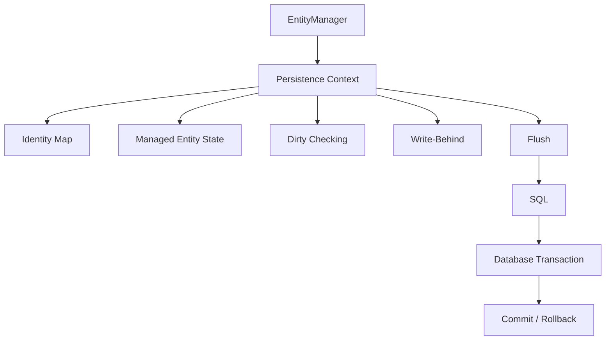

Inti part ini:

> Persistence context adalah boundary tempat object Java menjadi managed state. Selama entity managed, provider dapat melacak perubahan, menjaga identity map, menunda SQL, dan menyinkronkan perubahan pada flush. Setelah entity detached, ia kembali menjadi object biasa.

Part berikutnya akan memperdalam entity lifecycle state transition:

- `persist()`;
- `merge()`;
- `remove()`;
- `detach()`;
- `refresh()`;
- lifecycle callback;
- cascade interaction;
- state transition failure modes.
