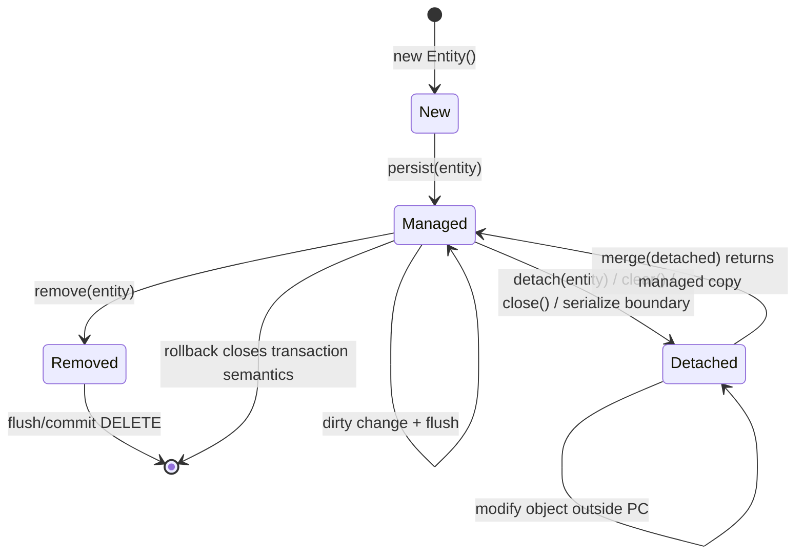
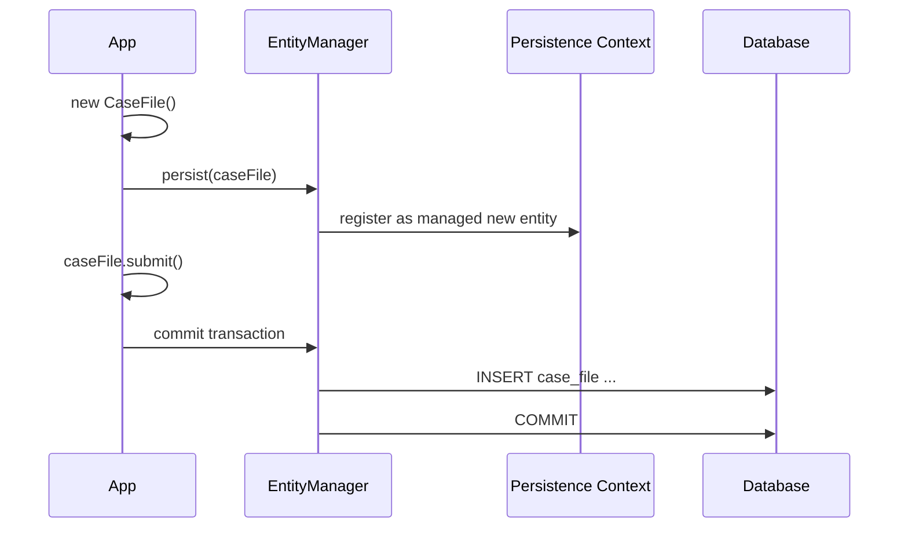
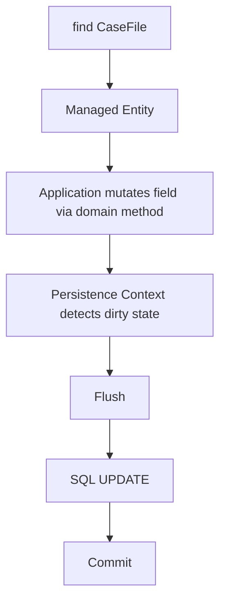
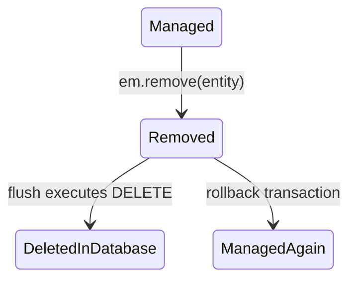
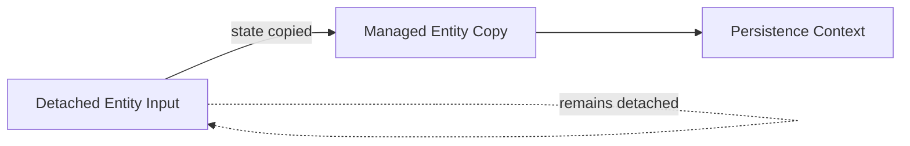
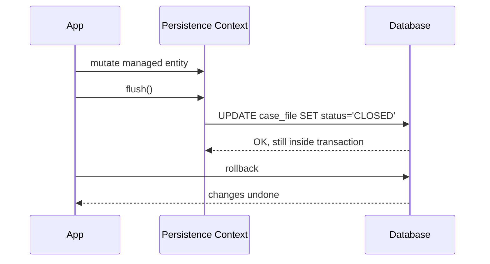
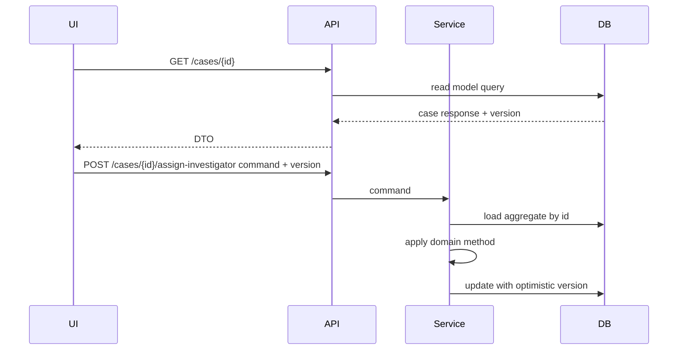

------
title: Learn Java Persistence, Database Integration, JPA, Hibernate ORM & EclipseLink - Part 005
description: Entity lifecycle, state transition, persist, merge, remove, detach, refresh, flush, rollback, lifecycle callback, dan failure mode yang sering terjadi pada JPA/Hibernate/EclipseLink.
series: learn-java-persistence
seriesTitle: Learn Java Persistence, Database Integration, JPA, Hibernate ORM & EclipseLink
order: 5
partTitle: Entity Lifecycle and State Transitions
tags:
- java
- persistence
- jpa
- jakarta-persistence
- hibernate
- eclipselink
- entity-lifecycle
- state-transition
- persist
- merge
- detach
- flush
- series
date: 2026-06-27
---

# Entity Lifecycle and State Transitions

> Target part ini: memahami lifecycle entity sebagai **state machine**, bukan daftar method. Setelah part ini, kamu harus bisa memprediksi efek `persist`, `merge`, `remove`, `detach`, `clear`, `refresh`, `flush`, `commit`, dan `rollback` tanpa menebak-nebak.

JPA sering terasa “magis” karena banyak perubahan database terjadi tanpa `save()` eksplisit. Tetapi behavior-nya bukan magic. Behavior-nya mengikuti state machine.

Jika persistence context adalah working set, maka lifecycle entity adalah status setiap object di dalam atau di luar working set itu.

Bug seperti ini hampir selalu berasal dari lifecycle yang salah dipahami:

```text
org.hibernate.PersistentObjectException: detached entity passed to persist
```

atau:

```text
jakarta.persistence.EntityNotFoundException
```

atau lebih berbahaya lagi: tidak ada exception, tetapi data yang tersimpan bukan data yang dimaksud.

---

## 1. Lifecycle Entity sebagai State Machine

Secara praktis, entity instance dalam aplikasi berada pada salah satu state utama:

| State | Arti | Dilacak persistence context? | Punya row database? | Bisa dirty checked? |
|---|---|---:|---:|---:|
| New / Transient | Object Java baru, belum dikenal provider | Tidak | Belum tentu | Tidak |
| Managed / Persistent | Object sedang dikelola persistence context | Ya | Biasanya ya, atau akan dibuat saat flush | Ya |
| Detached | Pernah managed, sekarang di luar persistence context | Tidak | Biasanya ya | Tidak |
| Removed | Managed entity yang dijadwalkan untuk delete | Ya, sampai flush/commit | Masih ada sampai delete dieksekusi | Tidak seperti update normal |

Diagram mental:



Hal penting:

> Lifecycle state adalah relasi antara **object instance tertentu** dan **persistence context tertentu**.

Satu object bisa detached dari satu persistence context, lalu data yang sama bisa direpresentasikan oleh object managed lain di persistence context lain.

---

## 2. Domain Lab: Enforcement Case

Kita akan memakai domain kecil ini sebagai running example:

```java
@Entity
@Table(name = "case_file")
public class CaseFile {

    @Id
    @GeneratedValue(strategy = GenerationType.UUID)
    private UUID id;

    @Column(nullable = false, unique = true, updatable = false)
    private String caseNumber;

    @Enumerated(EnumType.STRING)
    @Column(nullable = false)
    private CaseStatus status;

    @Version
    private long version;

    protected CaseFile() {
        // Required by JPA
    }

    public CaseFile(String caseNumber) {
        this.caseNumber = Objects.requireNonNull(caseNumber);
        this.status = CaseStatus.DRAFT;
    }

    public void submit() {
        if (status != CaseStatus.DRAFT) {
            throw new IllegalStateException("Only draft case can be submitted");
        }
        this.status = CaseStatus.SUBMITTED;
    }

    public void close() {
        if (status != CaseStatus.SUBMITTED) {
            throw new IllegalStateException("Only submitted case can be closed");
        }
        this.status = CaseStatus.CLOSED;
    }
}
```

Kita sengaja memakai `@Version` sejak awal karena lifecycle dan concurrency tidak bisa dipisahkan dalam sistem production.

---

## 3. New / Transient State

Object ini transient:

```java
CaseFile caseFile = new CaseFile("CASE-2026-0001");
```

Karakteristik:

- belum dikenal persistence context;
- tidak ada identity persistence yang stabil jika id generated belum diisi;
- perubahan field tidak dilacak;
- tidak akan muncul dalam SQL kecuali dibuat managed dengan `persist()` atau dipakai sebagai bagian cascade persist.

Contoh:

```java
@Transactional
public UUID createDraftCase(String caseNumber) {
    CaseFile caseFile = new CaseFile(caseNumber);
    caseFile.submit();
    return caseFile.getId(); // likely null before persist
}
```

Kode di atas tidak menyimpan apapun. Object hanya hidup di heap.

New/transient bukan error. Ia adalah state normal sebelum object dimasukkan ke unit of work.

---

## 4. `persist()` Transition: New ke Managed

`persist()` membuat entity baru menjadi managed.

```java
@Transactional
public UUID createDraftCase(String caseNumber) {
    CaseFile caseFile = new CaseFile(caseNumber);

    em.persist(caseFile);

    return caseFile.getId();
}
```

Efek penting:

1. entity masuk persistence context;
2. insert dijadwalkan, belum tentu langsung dieksekusi;
3. provider mulai melacak perubahan;
4. id mungkin tersedia langsung atau nanti, tergantung generation strategy;
5. jika transaction rollback, insert dibatalkan di database.

Mental model:



Perhatikan urutan ini:

```java
em.persist(caseFile);
caseFile.submit();
```

Perubahan `submit()` ikut tersimpan karena `caseFile` sudah managed.

Tetapi ini juga ikut tersimpan:

```java
caseFile.submit();
em.persist(caseFile);
```

Karena ketika dipersist, state saat itu menjadi state yang akan disinkronkan.

---

## 5. `persist()` Bukan `saveOrUpdate()`

Kesalahan umum:

```java
public void save(CaseFile caseFile) {
    em.persist(caseFile);
}
```

Nama method `save` membuat developer mengira object baru dan object lama bisa masuk lewat method yang sama. Dalam JPA, ini berbahaya.

`persist()` dimaksudkan untuk **entity baru**.

Jika object sebenarnya detached:

```java
CaseFile detached = apiPayload.toEntity();
detached.setId(existingId);

em.persist(detached); // wrong
```

Provider berhak menolak karena object tersebut bukan new entity murni.

Rule praktis:

> Gunakan `persist()` ketika aplikasi sedang membuat aggregate baru, bukan ketika menerima object yang mengaku punya id.

Dalam sistem enforcement, membuat `CaseFile` baru dan memperbarui `CaseFile` existing harus menjadi use case berbeda.

```java
@Transactional
public UUID openCase(OpenCaseCommand command) {
    CaseFile caseFile = new CaseFile(command.caseNumber());
    em.persist(caseFile);
    return caseFile.getId();
}

@Transactional
public void submitCase(UUID caseId) {
    CaseFile caseFile = em.find(CaseFile.class, caseId);
    requireFound(caseFile, caseId);
    caseFile.submit();
}
```

Use case update tidak perlu `persist()` dan tidak perlu `merge()` jika entity di-load dalam transaction yang sama.

---

## 6. Managed State

Entity managed adalah object Java yang berada dalam persistence context.

```java
@Transactional
public void closeCase(UUID caseId) {
    CaseFile caseFile = em.find(CaseFile.class, caseId);
    caseFile.close();
}
```

Tidak ada `em.update(caseFile)`.

Kenapa perubahan tersimpan?

Karena provider melakukan dirty checking.



Di level top 1%, managed state harus dipahami sebagai **capability** dan **risk**.

Capability:

- domain method bisa natural;
- tidak perlu manual update;
- unit of work bisa mengumpulkan banyak perubahan;
- provider bisa mengoptimalkan write order.

Risk:

- perubahan tidak sengaja bisa tersimpan;
- object yang terlalu lama managed membuat behavior sulit diprediksi;
- lazy loading bisa terjadi jauh dari query awal;
- persistence context yang besar menjadi mahal.

---

## 7. Dirty Checking: Mutation as Persistence Intent

Dalam JPA, mutation terhadap managed entity adalah persistence intent.

```java
CaseFile caseFile = em.find(CaseFile.class, id);
caseFile.setStatus(CLOSED); // persistence intent if managed
```

Ini berbeda dari gaya explicit repository:

```java
repository.save(caseFile);
```

Mental model yang lebih benar:

> Di dalam transaction, managed entity adalah live record representation. Mengubahnya berarti mengubah rencana sinkronisasi.

Karena itu setter publik yang bebas pada entity production sering menjadi risk.

Lebih aman:

```java
caseFile.close();
```

daripada:

```java
caseFile.setStatus(CLOSED);
```

Domain method membuat persistence intent melewati invariant bisnis.

---

## 8. `find()` dan Managed Result

`find()` mengembalikan managed entity jika ditemukan.

```java
CaseFile caseFile = em.find(CaseFile.class, caseId);
```

Kemungkinan:

| Kondisi | Hasil |
|---|---|
| Entity ada di persistence context | instance yang sama dikembalikan |
| Entity belum ada di persistence context, row ada di DB | provider query DB lalu register managed entity |
| Row tidak ada | `null` |

Konsekuensi:

```java
CaseFile a = em.find(CaseFile.class, id);
CaseFile b = em.find(CaseFile.class, id);

assert a == b;
```

Dalam persistence context yang sama, identity map menjamin satu persistent identity punya satu object instance.

---

## 9. `getReference()` dan Lazy Reference State

`getReference()` mengembalikan reference/proxy managed tanpa harus langsung membaca semua data.

```java
CaseFile caseFile = em.getReference(CaseFile.class, caseId);
```

Use case yang valid:

```java
Investigation investigation = new Investigation(...);
investigation.assignTo(caseFileReference);
```

Jika hanya butuh foreign key association, `getReference()` bisa menghindari SELECT awal.

Tetapi ada trap:

```java
CaseFile caseFile = em.getReference(CaseFile.class, missingId);
caseFile.close(); // may trigger load and fail later
```

`getReference()` tidak selalu membuktikan row ada saat method dipanggil. Provider boleh menunda akses database sampai state selain id dibutuhkan.

Rule:

> Gunakan `getReference()` untuk membentuk association by identity, bukan untuk validasi existence.

Untuk validasi existence, gunakan `find()` atau query eksplisit.

---

## 10. Removed State

`remove()` tidak selalu langsung menghapus row. Ia menandai managed entity sebagai removed.

```java
@Transactional
public void deleteDraftCase(UUID caseId) {
    CaseFile caseFile = em.find(CaseFile.class, caseId);
    requireFound(caseFile, caseId);

    if (!caseFile.isDraft()) {
        throw new IllegalStateException("Only draft case can be deleted");
    }

    em.remove(caseFile);
}
```

State transition:



Important nuance:

- sebelum flush, row mungkin masih ada di database;
- setelah `remove()`, entity masih instance Java;
- jangan treat removed entity sebagai normal domain object;
- accessing associations after remove can be confusing and provider-specific in timing.

Prinsip production:

> Deletion adalah business operation, bukan generic repository method.

Dalam regulatory system, banyak “delete” sebenarnya bukan delete. Sering kali itu:

- withdraw case;
- mark as duplicate;
- void draft;
- archive;
- soft delete;
- legal hold;
- retention expiry.

Jangan memakai `remove()` sebelum lifecycle bisnis dan audit requirement jelas.

---

## 11. Detached State

Entity menjadi detached saat tidak lagi dikelola persistence context.

Penyebab umum:

```java
em.detach(entity);
em.clear();
em.close();
transactionScopedEntityManager ends;
entity serialized to client;
entity returned outside service boundary;
```

Contoh:

```java
public CaseFile loadCase(UUID id) {
    return em.find(CaseFile.class, id);
} // transaction ends here; returned entity is detached
```

Di luar transaction:

```java
CaseFile caseFile = service.loadCase(id);
caseFile.close(); // no dirty checking
```

Perubahan ini hanya perubahan object Java, bukan update database.

Detached entity adalah sumber dua kelas bug:

1. developer mengira perubahan akan tersimpan, padahal tidak;
2. developer mencoba attach ulang dengan cara salah.

---

## 12. `merge()` Bukan Attach Sederhana

`merge()` adalah salah satu API paling sering disalahpahami.

Kode:

```java
CaseFile managed = em.merge(detachedCaseFile);
```

Meaning:

- input `detachedCaseFile` tidak menjadi managed;
- provider membuat/mengambil managed copy;
- state dari detached object disalin ke managed copy;
- return value adalah instance managed;
- input tetap detached.

Diagram:



Bug klasik:

```java
em.merge(caseFile);
caseFile.close(); // still detached; this mutation may not be persisted
```

Benar:

```java
CaseFile managed = em.merge(caseFile);
managed.close();
```

Tetapi lebih baik lagi untuk command use case:

```java
@Transactional
public void closeCase(UUID caseId) {
    CaseFile managed = em.find(CaseFile.class, caseId);
    requireFound(managed, caseId);
    managed.close();
}
```

Dalam application service modern, `merge()` seharusnya jarang muncul. Jika terlalu sering, biasanya boundary DTO/entity kacau.

---

## 13. Merge as Graph Copy, Not Intent-Aware Update

Misalkan payload API hanya mengirim field tertentu:

```json
{
  "status": "CLOSED"
}
```

Lalu developer membuat entity:

```java
CaseFile detached = new CaseFile();
detached.setId(id);
detached.setStatus(CLOSED);

em.merge(detached);
```

Bahaya:

- field yang tidak dikirim bisa menjadi `null`;
- association bisa terhapus;
- invariant domain bisa dilewati;
- optimistic locking bisa tidak sesuai ekspektasi;
- audit trail kehilangan makna bisnis.

`merge()` menyalin state object. Ia tidak tahu apakah `null` artinya “tidak berubah”, “hapus value”, atau “client tidak mengirim field”.

Rule:

> Jangan gunakan entity detached sebagai patch document.

Lebih aman:

```java
@Transactional
public void changePriority(UUID caseId, Priority newPriority) {
    CaseFile caseFile = em.find(CaseFile.class, caseId);
    requireFound(caseFile, caseId);
    caseFile.changePriority(newPriority);
}
```

Command menjelaskan intent. Entity managed mengeksekusi invariant. Persistence context menyimpan efeknya.

---

## 14. `detach()` dan `clear()`

`detach(entity)` melepas satu entity dari persistence context.

```java
CaseFile caseFile = em.find(CaseFile.class, id);
em.detach(caseFile);
caseFile.close(); // not tracked
```

`clear()` melepas semua managed entity.

```java
em.clear();
```

Use case valid:

- batch processing agar persistence context tidak membesar;
- read-only transformation;
- mencegah accidental dirty checking;
- long-running import dengan flush-clear cycle.

Batch pattern:

```java
for (int i = 0; i < items.size(); i++) {
    CaseEvent event = map(items.get(i));
    em.persist(event);

    if (i % 100 == 0) {
        em.flush();
        em.clear();
    }
}
```

Jangan pakai `clear()` sembarangan di service biasa karena semua managed reference setelah itu menjadi detached.

---

## 15. `refresh()`

`refresh(entity)` membuang perubahan lokal dan reload state dari database.

```java
CaseFile caseFile = em.find(CaseFile.class, id);
caseFile.close();

em.refresh(caseFile); // local close() discarded
```

Use case valid:

- database trigger mengubah kolom;
- stored procedure mengubah state;
- reload setelah pessimistic lock;
- membatalkan local mutation sebelum flush.

Risk:

- perubahan domain yang belum flush hilang;
- association behavior dapat ikut terpengaruh tergantung cascade refresh;
- tidak boleh dipakai sebagai mekanisme conflict resolution yang malas.

Dalam sistem audit/regulatory, `refresh()` harus jarang. Jika database mengubah state secara tersembunyi, model ownership state perlu dievaluasi.

---

## 16. `flush()`

`flush()` menyinkronkan persistence context ke database tanpa mengakhiri transaction.

```java
caseFile.close();
em.flush();
```

Setelah flush:

- SQL sudah dikirim;
- constraint database bisa gagal sekarang;
- row database dalam transaction sudah berubah;
- transaction masih bisa rollback;
- commit belum terjadi.

Diagram:



Kesalahan umum:

> Mengira flush sama dengan commit.

Flush bukan commit. Flush adalah SQL synchronization. Commit adalah transaction finalization.

---

## 17. When Flush Happens

Flush bisa terjadi:

- saat transaction commit;
- saat explicit `em.flush()`;
- sebelum query tertentu, tergantung flush mode dan provider;
- sebelum native query tertentu, tergantung provider/framework;
- saat provider membutuhkan id/generated value tertentu.

Contoh surprise flush:

```java
caseFile.close();

List<CaseFile> openCases = em.createQuery("""
    select c from CaseFile c
    where c.status = :status
""", CaseFile.class)
.setParameter("status", CaseStatus.SUBMITTED)
.getResultList();
```

Provider dapat melakukan flush sebelum query agar query melihat perubahan yang konsisten dengan persistence context.

Implikasi:

- constraint violation bisa muncul saat query, bukan saat commit;
- SQL write bisa terjadi lebih awal dari yang developer bayangkan;
- jangan mutate entity lalu menjalankan query tanpa memahami flush mode.

---

## 18. Rollback dan Entity State

Jika transaction rollback, database kembali seperti semula. Tetapi object Java di memory tidak otomatis “time travel”.

Contoh:

```java
CaseFile caseFile = em.find(CaseFile.class, id);
caseFile.close();

try {
    em.flush();
} catch (RuntimeException ex) {
    transaction.rollback();
}

// caseFile object may still have status CLOSED in memory
```

Setelah rollback:

- transaction gagal;
- persistence context biasanya tidak boleh dianggap sehat;
- managed entities bisa punya state yang tidak cocok dengan database;
- service harus mengakhiri unit of work dan membuang object tersebut.

Rule:

> Setelah rollback, jangan lanjut memakai entity instance sebagai sumber kebenaran.

Ini penting untuk retry design. Retry sebaiknya membuka transaction baru dan reload state dari database.

---

## 19. Lifecycle Callback

JPA menyediakan lifecycle callback:

```java
@PrePersist
@PostPersist
@PreUpdate
@PostUpdate
@PreRemove
@PostRemove
@PostLoad
```

Contoh:

```java
@MappedSuperclass
public abstract class AuditedEntity {

    @Column(nullable = false, updatable = false)
    private Instant createdAt;

    @Column(nullable = false)
    private Instant updatedAt;

    @PrePersist
    protected void prePersist() {
        Instant now = Instant.now();
        this.createdAt = now;
        this.updatedAt = now;
    }

    @PreUpdate
    protected void preUpdate() {
        this.updatedAt = Instant.now();
    }
}
```

Use case yang cocok:

- timestamp teknis;
- normalisasi sederhana;
- audit metadata teknis;
- validation ringan yang tidak membutuhkan service dependency.

Use case yang tidak cocok:

- memanggil external service;
- publish event ke broker;
- query database kompleks;
- mengubah aggregate lain;
- menjalankan logic yang bergantung pada user/session secara implisit.

Lifecycle callback berjalan di dalam mekanisme persistence. Jangan jadikan callback sebagai hidden application service.

---

## 20. Entity Listener

Untuk memisahkan concern teknis:

```java
@EntityListeners(AuditListener.class)
@Entity
public class CaseFile extends AuditedEntity {
    // ...
}
```

```java
public class AuditListener {

    @PrePersist
    public void beforeCreate(Object entity) {
        if (entity instanceof Auditable auditable) {
            auditable.markCreated(Instant.now());
        }
    }
}
```

Masalah potensial:

- dependency injection tidak selalu sama antara runtime;
- listener tersembunyi dari use case flow;
- behavior bisa sulit dites jika listener terlalu pintar;
- callback order bisa menjadi coupling tidak terlihat.

Gunakan listener untuk technical cross-cutting concern, bukan workflow bisnis.

---

## 21. Cascade as Lifecycle Propagation

Cascade membuat operasi lifecycle menyebar dari parent ke child.

```java
@OneToMany(mappedBy = "caseFile", cascade = CascadeType.PERSIST)
private List<CaseNote> notes = new ArrayList<>();
```

```java
CaseFile caseFile = new CaseFile("CASE-2026-0001");
caseFile.addNote("Initial report received");

em.persist(caseFile); // note also persisted if cascade persist configured
```

Cascade bukan convenience semata. Cascade adalah pernyataan ownership lifecycle.

Pertanyaan sebelum memakai cascade:

| Cascade | Pertanyaan desain |
|---|---|
| PERSIST | Apakah child baru selalu lahir lewat parent? |
| MERGE | Apakah detached graph aman disalin dari parent ke semua child? |
| REMOVE | Apakah menghapus parent secara legal menghapus child? |
| REFRESH | Apakah refresh parent boleh membuang perubahan child? |
| DETACH | Apakah detach parent harus detach child? |
| ALL | Apakah semua jawaban di atas benar? |

`CascadeType.ALL` terlalu sering dipakai karena malas menalar lifecycle. Pada sistem audit-heavy, itu berbahaya.

---

## 22. Orphan Removal Preview

Orphan removal menghapus child jika child dilepas dari parent collection.

```java
@OneToMany(mappedBy = "caseFile", orphanRemoval = true)
private List<CaseAttachment> attachments = new ArrayList<>();
```

```java
caseFile.removeAttachment(attachmentId);
```

Jika `orphanRemoval = true`, provider menjadwalkan DELETE untuk attachment yang tidak lagi punya parent.

Ini cocok untuk child yang tidak punya lifecycle mandiri. Tidak cocok untuk record legal/audit yang harus tetap ada.

Rule:

> Orphan removal berarti “tidak ada parent, tidak ada reason to exist”.

Untuk `CaseEvent`, `EnforcementAction`, atau `AuditEntry`, orphan removal hampir selalu salah.

---

## 23. State Transition Table

| Current State | Operation | Result | Notes |
|---|---|---|---|
| New | `persist` | Managed | Insert scheduled |
| New | `merge` | Managed copy | Input remains new/detached-like |
| New | `remove` | Error/invalid | Remove expects managed or entity reference semantics |
| Managed | field mutation | Managed dirty | Update on flush |
| Managed | `detach` | Detached | Not tracked after detach |
| Managed | `remove` | Removed | Delete scheduled |
| Managed | `refresh` | Managed refreshed | Local changes discarded |
| Managed | `clear` | Detached | All managed entities detached |
| Detached | `persist` | Error likely | Detached entity passed to persist |
| Detached | `merge` | Managed copy | Return value must be used |
| Detached | field mutation | Detached dirty only in memory | No DB sync |
| Removed | flush | Deleted row | Transaction can still rollback |
| Removed | rollback | DB unchanged | Java object may remain stale |

---

## 24. Correct Update Pattern

Bad pattern:

```java
@Transactional
public void updateCase(CaseDto dto) {
    CaseFile caseFile = mapper.toEntity(dto);
    em.merge(caseFile);
}
```

Why bad:

- DTO null ambiguity;
- detached graph overwrite;
- invariant bypass;
- no clear use-case intent;
- hard to reason about partial update;
- easy to accidentally update associations.

Better pattern:

```java
@Transactional
public void assignInvestigator(UUID caseId, UUID investigatorId) {
    CaseFile caseFile = em.find(CaseFile.class, caseId);
    requireFound(caseFile, caseId);

    Investigator investigator = em.getReference(Investigator.class, investigatorId);
    caseFile.assignInvestigator(investigator);
}
```

Even better when existence matters:

```java
@Transactional
public void assignInvestigator(UUID caseId, UUID investigatorId) {
    CaseFile caseFile = findRequired(CaseFile.class, caseId);
    Investigator investigator = findRequired(Investigator.class, investigatorId);

    caseFile.assignInvestigator(investigator);
}
```

Use case controls intent. Entity enforces invariant. Persistence context tracks result.

---

## 25. Detached Entity Across API Boundary

Do not return managed entities directly from REST controllers.

Bad:

```java
@GetMapping("/cases/{id}")
public CaseFile getCase(@PathVariable UUID id) {
    return caseService.loadCase(id);
}
```

Problems:

- serialization may trigger lazy loading;
- bidirectional associations may recurse;
- detached entity may leak to client mental model;
- fields exposed may not match API contract;
- entity annotations become API behavior.

Better:

```java
@GetMapping("/cases/{id}")
public CaseResponse getCase(@PathVariable UUID id) {
    return caseService.getCaseResponse(id);
}
```

Inside service:

```java
@Transactional(readOnly = true)
public CaseResponse getCaseResponse(UUID id) {
    CaseFile caseFile = findRequired(CaseFile.class, id);
    return CaseResponse.from(caseFile);
}
```

Mapping happens while persistence context is open and controlled.

---

## 26. Long Conversation Anti-Pattern

A common temptation:

1. load entity;
2. send to UI;
3. user edits for 20 minutes;
4. send entity back;
5. merge entire graph.

This is not a clean conversation. This is detached graph synchronization disguised as business workflow.

Better approach:

- send DTO/read model to UI;
- UI sends command or patch intent;
- service reloads aggregate in a new transaction;
- domain method applies change;
- optimistic locking detects conflict.



This respects transaction boundary and human workflow duration.

---

## 27. Lifecycle and Invariants

Top-level invariant:

> Entity lifecycle transitions should align with business lifecycle transitions, but they are not the same thing.

Example:

```text
JPA lifecycle: New -> Managed -> Removed
Business lifecycle: Draft -> Submitted -> Under Investigation -> Enforcement Proposed -> Closed
```

Never confuse them.

`remove()` is not “close case”.
`persist()` is not “submit case”.
`merge()` is not “accept user changes”.

JPA lifecycle is technical. Business lifecycle is domain state. Application service coordinates both.

---

## 28. Failure Mode: Accidental Insert

```java
@Transactional
public void attachEvidence(UUID caseId, EvidenceDto dto) {
    CaseFile caseFile = em.find(CaseFile.class, caseId);

    Evidence evidence = new Evidence();
    evidence.setId(dto.id());
    evidence.setFileName(dto.fileName());

    caseFile.addEvidence(evidence);
}
```

If cascade persist exists and `evidence.id()` refers to existing evidence, provider may treat it as new or fail depending mapping/provider/id strategy.

Better:

```java
Evidence evidence = em.getReference(Evidence.class, dto.id());
caseFile.attachExistingEvidence(evidence);
```

or if evidence is new:

```java
Evidence evidence = Evidence.uploaded(dto.fileName(), dto.hash());
caseFile.addNewEvidence(evidence);
```

Separate “attach existing” from “create new”.

---

## 29. Failure Mode: Ignored Merge Return Value

Bad:

```java
@Transactional
public void update(CaseFile detached) {
    em.merge(detached);
    detached.close();
}
```

`detached.close()` may not be persisted.

Correct but still not ideal:

```java
@Transactional
public void update(CaseFile detached) {
    CaseFile managed = em.merge(detached);
    managed.close();
}
```

Better:

```java
@Transactional
public void close(UUID caseId) {
    CaseFile managed = findRequired(CaseFile.class, caseId);
    managed.close();
}
```

---

## 30. Failure Mode: Hidden Dirty Update

```java
@Transactional(readOnly = true)
public CaseResponse preview(UUID id) {
    CaseFile caseFile = em.find(CaseFile.class, id);
    caseFile.calculateAndStoreDerivedRiskScore();
    return CaseResponse.from(caseFile);
}
```

Even in a method named `preview`, mutation against managed entity can become update depending framework flush/read-only behavior.

Better:

```java
RiskScore score = riskCalculator.calculate(caseFile.snapshot());
```

A read use case should not mutate managed entities unless the write is intentional.

---

## 31. Failure Mode: Remove vs Soft Delete

Bad:

```java
em.remove(caseFile);
```

for regulatory record.

Better:

```java
caseFile.withdraw(reason, actor, clock.instant());
```

Then persist business state:

```java
status = WITHDRAWN
withdrawn_reason = ...
withdrawn_by = ...
withdrawn_at = ...
```

Physical delete is a storage operation. Regulatory removal is often a legal state transition.

---

## 32. Provider Notes: Hibernate

Hibernate-specific concepts often visible in lifecycle behavior:

- `Session` is Hibernate's native counterpart behind `EntityManager`;
- action queue orders inserts, updates, deletes at flush;
- proxies and bytecode enhancement affect lazy loading and dirty tracking;
- generated id timing differs by strategy;
- detached entity reassociation semantics have tightened in modern Hibernate versions;
- `merge()` remains copy semantics, not simple reattachment.

Production implication:

> Test lifecycle-sensitive code with the actual provider and version you deploy.

Do not rely on old Hibernate blog posts or StackOverflow answers if your runtime is Hibernate 6/7.

---

## 33. Provider Notes: EclipseLink

EclipseLink describes its internal model heavily around UnitOfWork, descriptors, weaving, and shared cache.

Lifecycle implications:

- weaving can affect lazy loading/change tracking;
- shared cache means provider-level cache behavior matters beyond one persistence context;
- descriptors define mapping metadata and advanced provider behavior;
- refresh/cache hints can produce behavior different from Hibernate in edge cases.

Production implication:

> Spec-level lifecycle is portable; provider timing, optimization, and cache details are not always portable.

Keep provider-specific behavior explicit and tested.

---

## 34. Lifecycle Decision Matrix

| Intent | Preferred approach | Avoid |
|---|---|---|
| Create new aggregate | `new` + domain constructor + `persist` | `merge` new graph by habit |
| Update existing aggregate | `find` + domain method | DTO to entity + `merge` |
| Delete technical child | remove from parent with clear ownership/orphan rule | generic cascade all |
| Close/withdraw business case | business state transition | `remove` |
| Associate existing entity | `getReference` or `find` depending existence needs | constructing entity with id manually |
| Apply UI edit | command + reload + domain method | merging serialized entity from client |
| Batch insert | persist + periodic flush/clear | one huge persistence context |
| Resolve rollback | new transaction + reload | reuse post-rollback entity |

---

## 35. Practice Lab 005

### Lab A: Predict State

Given this code:

```java
@Transactional
public void run(UUID id) {
    CaseFile a = em.find(CaseFile.class, id);
    em.detach(a);
    a.close();

    CaseFile b = em.find(CaseFile.class, id);
    b.submit();
}
```

Answer:

1. Is `a` managed after `detach(a)`?
2. Is `a.close()` persisted?
3. Is `b` same Java instance as `a`?
4. Which mutation is flushed?

Expected mental answer:

- `a` is detached;
- `a.close()` is not tracked;
- `b` is a new managed instance for same persistent identity;
- `b.submit()` is tracked.

### Lab B: Merge Trap

Given:

```java
@Transactional
public void run(CaseFile detached) {
    em.merge(detached);
    detached.changePriority(Priority.HIGH);
}
```

Refactor to make persistence intent explicit.

Preferred answer:

```java
@Transactional
public void changePriority(UUID caseId, Priority priority) {
    CaseFile caseFile = findRequired(CaseFile.class, caseId);
    caseFile.changePriority(priority);
}
```

### Lab C: Lifecycle Event Boundary

Design audit metadata for:

- createdAt;
- updatedAt;
- submittedAt;
- submittedBy.

Suggested decision:

- `createdAt` and `updatedAt`: lifecycle callback acceptable;
- `submittedAt` and `submittedBy`: domain method/application service, not `@PreUpdate`, because they represent business transition and actor.

---

## 36. Review Checklist

Before approving JPA lifecycle code, ask:

- Is this object new, managed, detached, or removed at this point?
- Is a mutation intended to be persisted?
- Does the code rely on `merge()` where reload-and-mutate would be safer?
- Is `persist()` being used only for genuinely new aggregate creation?
- Is `remove()` aligned with legal/business retention rules?
- Can rollback leave object state misleading?
- Could query execution trigger flush earlier than expected?
- Are lifecycle callbacks technical, not business workflow?
- Are cascades expressing ownership rather than convenience?
- Does the service boundary leak entity instances outside transaction scope?

---

## 37. Key Takeaways

Lifecycle mastery means you can answer these without running the code:

1. Which object instance is managed?
2. Which changes are tracked?
3. When will SQL be generated?
4. What happens if rollback occurs?
5. Is this operation creating, copying, deleting, detaching, or refreshing state?
6. Is the lifecycle transition aligned with domain intent?

The highest-leverage rule:

> For writes, load the aggregate inside the transaction, call explicit domain methods, and let the persistence context flush the result. Use `merge()` only when you have a deliberate detached graph strategy.

---

## References

- Jakarta Persistence 3.2 Specification: https://jakarta.ee/specifications/persistence/3.2/jakarta-persistence-spec-3.2
- Jakarta Persistence 3.2 EntityManager API: https://jakarta.ee/specifications/persistence/3.2/apidocs/jakarta.persistence/jakarta/persistence/entitymanager
- Hibernate ORM User Guide: https://docs.hibernate.org/orm/
- Hibernate ORM 7 Introduction/User Guide materials: https://docs.hibernate.org/orm/7.1/introduction/html_single/
- EclipseLink 5.0 Release Notes: https://eclipse.dev/eclipselink/releases/5.0.html
