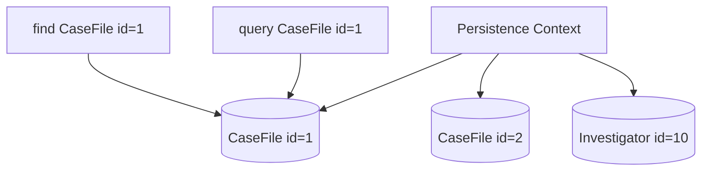
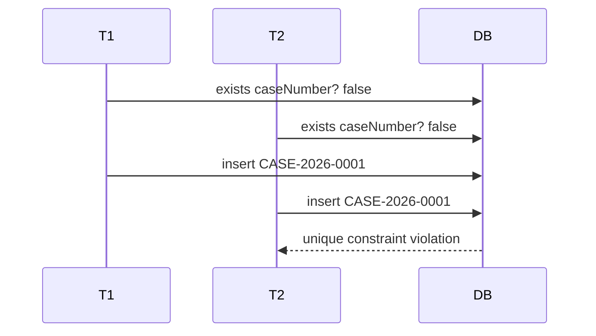

------
title: Learn Java Persistence, Database Integration, JPA, Hibernate ORM & EclipseLink - Part 006
description: Identity, primary key, generated value, natural key, composite key, UUID, sequence, equality, hashCode, dan failure mode entity identity pada JPA/Hibernate/EclipseLink.
series: learn-java-persistence
seriesTitle: Learn Java Persistence, Database Integration, JPA, Hibernate ORM & EclipseLink
order: 6
partTitle: Identity, Primary Keys, Natural Keys, equals/hashCode
tags:
- java
- persistence
- jpa
- jakarta-persistence
- hibernate
- eclipselink
- identity
- primary-key
- natural-key
- equals
- hashcode
- uuid
- sequence
- series
date: 2026-06-27
---

# Identity, Primary Keys, Natural Keys, equals/hashCode

> Target part ini: memahami identity sebagai konsep berlapis: **object identity**, **persistence identity**, **business identity**, dan **collection identity**. Setelah part ini, kamu harus bisa memilih strategi primary key, natural key, dan `equals/hashCode` dengan sadar terhadap lifecycle, batching, distributed systems, dan correctness.

Entity identity adalah salah satu topik JPA yang terlihat sederhana tetapi menyebabkan banyak bug jangka panjang.

Contoh pertanyaan yang harus bisa dijawab:

- Apakah dua entity dengan id sama selalu `equals()`?
- Apakah entity baru aman dimasukkan ke `HashSet` sebelum `persist()`?
- Apakah generated database id baik untuk equality?
- Kapan natural key lebih tepat?
- Apakah UUID selalu lebih baik dari sequence?
- Mengapa `GenerationType.IDENTITY` bisa mengganggu batching?
- Bagaimana composite key mempengaruhi model domain?

Jawaban yang benar bergantung pada mental model identity, bukan selera framework.

---

## 1. Empat Jenis Identity

Dalam persistence, “sama” bisa berarti empat hal berbeda.

| Identity | Pertanyaan | Contoh |
|---|---|---|
| Object identity | Apakah ini object Java yang sama di heap? | `a == b` |
| Persistence identity | Apakah mewakili row database yang sama? | `case_file.id = ?` |
| Business identity | Apakah mewakili konsep bisnis yang sama? | `caseNumber = CASE-2026-0001` |
| Collection identity | Apakah dianggap duplicate di `Set`/`Map`? | `equals/hashCode` |

JPA persistence context menjamin:

> Dalam satu persistence context, satu persistence identity direpresentasikan oleh satu object instance.

Artinya:

```java
CaseFile a = em.find(CaseFile.class, id);
CaseFile b = em.find(CaseFile.class, id);

assert a == b;
```

Tetapi di luar persistence context yang sama:

```java
CaseFile a = serviceA.load(id); // detached from transaction A
CaseFile b = serviceB.load(id); // detached from transaction B

assert a != b;
```

Apakah `a.equals(b)` harus true? Itu keputusan desain.

---

## 2. Identity Map dan Persistence Context

Persistence context berfungsi sebagai identity map.



Jika row yang sama dimuat lewat `find()` dan query, provider mengembalikan instance yang sama selama masih dalam persistence context yang sama.

Konsekuensi:

- `==` cukup di dalam persistence context yang sama;
- `equals()` menjadi penting saat entity keluar boundary, masuk collection, cache, test, atau dibandingkan lintas transaction;
- equality tidak boleh merusak lifecycle transition.

---

## 3. Primary Key Bukan Selalu Business Key

Primary key adalah identity database. Business key adalah identity domain.

Contoh:

```text
Database identity: id = 8f6e5c7a-...
Business identity: caseNumber = CASE-2026-0001
```

Keduanya bisa sama, tetapi sering lebih baik dipisahkan.

Mengapa?

Primary key harus:

- stabil selamanya;
- kecil/efisien untuk foreign key;
- cocok untuk indexing;
- tidak berubah saat aturan bisnis berubah;
- tidak membawa makna yang nanti menjadi salah.

Business key harus:

- bermakna bagi manusia/proses;
- mengikuti aturan domain;
- mungkin punya format, periode, jurisdiction, atau sequence bisnis;
- mungkin perlu uniqueness scoped;
- mungkin berubah karena koreksi/legal process.

Dalam regulatory system, `caseNumber` mungkin terlihat stabil, tetapi format dan scope-nya bisa berubah:

```text
CASE-2026-0001
ID-JKT-ENF-2026-0001
OJK/ENF/2026/0001
```

Karena itu surrogate key sering lebih aman sebagai PK.

---

## 4. Recommended Default for Production Systems

Default yang sering aman untuk sistem enterprise modern:

```java
@Id
@GeneratedValue(strategy = GenerationType.UUID)
private UUID id;

@Column(nullable = false, unique = true, updatable = false)
private String caseNumber;
```

Dengan caveat:

- UUID bagus untuk distributed creation dan tidak butuh round-trip sequence;
- UUID random bisa kurang locality-friendly untuk index tertentu;
- database-specific UUID type lebih baik daripada string 36 char jika tersedia;
- untuk write-heavy relational monolith, sequence numeric masih sangat kuat;
- natural/business key tetap diberi unique constraint.

Tidak ada strategi universal. Ada trade-off.

---

## 5. Primary Key Strategy Overview

| Strategy | Kapan cocok | Trade-off |
|---|---|---|
| Assigned | Key datang dari external system | Butuh validation kuat, collision risk |
| `IDENTITY` | DB auto-increment sederhana | Insert timing lebih awal, batching terbatas |
| `SEQUENCE` | DB mendukung sequence | Sangat baik untuk batching jika allocation tepat |
| `TABLE` | DB tanpa sequence | Biasanya lebih lambat, jarang direkomendasikan |
| UUID | Distributed id, offline creation | Index locality/storage perlu diperhatikan |
| Composite key | Identity memang gabungan kolom | Model lebih kompleks, equality wajib rapi |
| Natural key as PK | Business key benar-benar immutable | Risk saat aturan bisnis berubah |

---

## 6. `GenerationType.IDENTITY`

Contoh:

```java
@Id
@GeneratedValue(strategy = GenerationType.IDENTITY)
private Long id;
```

Database menghasilkan id saat insert.

Implication:

- provider sering perlu melakukan INSERT lebih awal untuk mendapatkan id;
- batching insert bisa terganggu;
- id belum tersedia sebelum insert;
- mudah dipahami tetapi tidak selalu optimal.

Lifecycle impact:

```java
CaseFile caseFile = new CaseFile("CASE-2026-0001");
em.persist(caseFile);

Long id = caseFile.getId(); // may require insert timing depending provider/db
```

Dalam Hibernate, identity generation historically membatasi kemampuan delayed insert batching karena id baru diketahui setelah database insert.

Gunakan `IDENTITY` jika database convention dan simplicity lebih penting daripada high-volume insert batching.

---

## 7. `GenerationType.SEQUENCE`

Contoh:

```java
@Id
@GeneratedValue(strategy = GenerationType.SEQUENCE, generator = "case_file_seq")
@SequenceGenerator(
    name = "case_file_seq",
    sequenceName = "case_file_seq",
    allocationSize = 50
)
private Long id;
```

Sequence memungkinkan provider mengambil blok id sebelum insert.

Benefits:

- lebih batch-friendly;
- provider bisa melakukan write-behind lebih optimal;
- id bisa tersedia sebelum row insert;
- cocok untuk high-throughput relational workloads.

Trade-off:

- butuh database sequence;
- allocation size harus selaras dengan migration DDL;
- gap id normal dan tidak boleh dianggap error;
- sequence number bukan business sequence.

Important rule:

> Jangan memakai primary key sequence sebagai nomor kasus bisnis.

PK sequence boleh punya gap. Nomor kasus bisnis mungkin punya aturan hukum/audit yang berbeda.

---

## 8. UUID Strategy

Jakarta Persistence modern mendukung UUID generation strategy.

```java
@Id
@GeneratedValue(strategy = GenerationType.UUID)
private UUID id;
```

Kapan cocok:

- service perlu membuat id sebelum flush;
- distributed system;
- event/outbox correlation;
- aggregate id diekspos ke API;
- menghindari id enumeration;
- integration antar service.

Caveat:

- random UUID kurang ramah index locality;
- storage sebagai `CHAR(36)` boros dibanding native UUID/binary;
- sort by UUID tidak bermakna waktu;
- beberapa database punya UUID v7/time-ordered support yang lebih baik, tetapi portability perlu dicek.

Production recommendation:

- gunakan database native UUID type jika memungkinkan;
- jangan jadikan UUID sebagai business number;
- gunakan business key terpisah untuk human-facing identifier;
- benchmark index/write pattern jika table sangat besar.

---

## 9. Assigned Identifier

Assigned id:

```java
@Id
private String externalId;
```

Cocok ketika external system memiliki authoritative id:

```text
national_license_id
external_complaint_id
regulator_reference_number
```

Risk:

- external id bisa berubah format;
- external id bisa tidak globally unique;
- reconciliation bisa membutuhkan alias/history;
- testing lebih sulit jika id rules kompleks.

Jika id external adalah business fact, sering lebih baik:

```java
@Id
@GeneratedValue(strategy = GenerationType.UUID)
private UUID id;

@Column(nullable = false)
private String externalReference;
```

lalu unique constraint sesuai scope:

```java
@Table(
    name = "external_case_ref",
    uniqueConstraints = @UniqueConstraint(
        name = "uk_external_case_ref_source_ref",
        columnNames = {"source_system", "external_reference"}
    )
)
```

---

## 10. Natural Key

Natural key adalah key yang berasal dari domain.

Contoh:

```java
@Column(nullable = false, unique = true, updatable = false)
private String caseNumber;
```

Natural key yang baik:

- unik;
- immutable;
- tersedia saat object dibuat;
- pendek/normalizable;
- tidak mengandung field volatile;
- tidak bergantung pada data yang bisa dikoreksi.

Natural key buruk:

- email jika user bisa mengubah email;
- nama orang;
- nomor dokumen yang bisa diperbaiki;
- status + tanggal;
- field yang dihasilkan setelah approval;
- text free-form.

Dalam Hibernate, natural id bisa dimodelkan eksplisit dengan `@NaturalId` untuk lookup dan caching tertentu.

```java
@NaturalId
@Column(nullable = false, unique = true, updatable = false)
private String caseNumber;
```

Tetapi ini provider-specific. Spec-level JPA tidak memiliki natural id API setara Hibernate.

---

## 11. Business Key vs Natural ID vs Unique Constraint

Jangan mencampur istilah:

| Concept | Level | Example |
|---|---|---|
| Business key | Domain concept | case number identifies case in workflow |
| Natural id | ORM/provider concept | Hibernate `@NaturalId` |
| Unique constraint | Database constraint | `unique(case_number)` |
| Primary key | Relational identity | `id uuid primary key` |

Satu field bisa memenuhi beberapa peran, tetapi setiap peran punya konsekuensi berbeda.

Recommended pattern:

```java
@Id
@GeneratedValue(strategy = GenerationType.UUID)
private UUID id;

@NaturalId // if Hibernate-specific optimization is accepted
@Column(nullable = false, unique = true, updatable = false)
private String caseNumber;
```

Jika portability ke EclipseLink penting, jangan membuat domain correctness bergantung pada `@NaturalId`.

---

## 12. Composite Primary Key

Composite key berarti primary key terdiri dari beberapa kolom.

Contoh domain:

```text
SanctionLimit(id: jurisdiction_code + sanction_type + effective_date)
```

JPA mendukung dengan:

- `@EmbeddedId`;
- `@IdClass`.

Contoh `@EmbeddedId`:

```java
@Embeddable
public class SanctionLimitId implements Serializable {

    private String jurisdictionCode;
    private String sanctionType;
    private LocalDate effectiveDate;

    protected SanctionLimitId() {}

    public SanctionLimitId(String jurisdictionCode, String sanctionType, LocalDate effectiveDate) {
        this.jurisdictionCode = jurisdictionCode;
        this.sanctionType = sanctionType;
        this.effectiveDate = effectiveDate;
    }

    @Override
    public boolean equals(Object o) {
        if (this == o) return true;
        if (!(o instanceof SanctionLimitId that)) return false;
        return Objects.equals(jurisdictionCode, that.jurisdictionCode)
            && Objects.equals(sanctionType, that.sanctionType)
            && Objects.equals(effectiveDate, that.effectiveDate);
    }

    @Override
    public int hashCode() {
        return Objects.hash(jurisdictionCode, sanctionType, effectiveDate);
    }
}
```

```java
@Entity
public class SanctionLimit {

    @EmbeddedId
    private SanctionLimitId id;

    @Column(nullable = false)
    private BigDecimal amount;
}
```

Composite key cocok untuk reference data yang identity-nya memang domain-composite dan immutable.

Tidak cocok jika hanya karena “database lama begitu”. Untuk legacy schema, kadang tetap harus dilakukan, tetapi sadari cost-nya.

---

## 13. Composite Key Cost

Composite key mempengaruhi:

- foreign key menjadi lebih besar;
- association mapping lebih verbose;
- `equals/hashCode` wajib benar;
- DTO/API id lebih kompleks;
- query parameter lebih banyak;
- cache key lebih berat;
- migration lebih sulit jika salah satu komponen berubah.

Composite key tidak salah. Tetapi ia harus justified.

Default enterprise aggregate biasanya lebih sederhana dengan surrogate PK + unique constraint domain.

---

## 14. Equality Problem in JPA

Java equality kontrak:

- reflexive;
- symmetric;
- transitive;
- consistent;
- `hashCode` consistent with `equals`;
- object yang berada dalam hash collection tidak boleh berubah hash-nya secara efektif.

JPA entity menantang kontrak ini karena:

- id bisa `null` sebelum persist;
- id bisa baru tersedia saat flush;
- object bisa pindah state new/managed/detached;
- proxy subclass bisa mempengaruhi `getClass()`;
- business fields bisa mutable;
- entity bisa dibandingkan lintas persistence context.

---

## 15. Strategy 1: Do Not Override `equals/hashCode`

Default Object equality:

```java
// no equals/hashCode override
```

Pros:

- aman untuk mutable entity;
- tidak ada hash change karena generated id;
- cocok jika entity tidak dipakai lintas persistence context dalam Set/Map;
- sederhana.

Cons:

- dua detached instances untuk row sama tidak equal;
- test mungkin perlu compare id/manual assertion;
- collection de-duplication by identity database tidak terjadi.

Kapan acceptable:

- entity hanya dimanipulasi dalam transaction;
- tidak digunakan sebagai key Map;
- tidak disimpan dalam Set lintas boundary;
- domain logic tidak bergantung pada entity equality.

Untuk banyak aplikasi CRUD transactional, default equality lebih aman daripada override buruk.

---

## 16. Strategy 2: Immutable Business Key Equality

Jika entity punya immutable natural/business key yang tersedia sejak construction:

```java
@Entity
public class CaseFile {

    @Id
    @GeneratedValue(strategy = GenerationType.UUID)
    private UUID id;

    @Column(nullable = false, unique = true, updatable = false)
    private String caseNumber;

    protected CaseFile() {}

    public CaseFile(String caseNumber) {
        this.caseNumber = requireValidCaseNumber(caseNumber);
    }

    @Override
    public boolean equals(Object o) {
        if (this == o) return true;
        if (!(o instanceof CaseFile that)) return false;
        return Objects.equals(caseNumber, that.caseNumber);
    }

    @Override
    public int hashCode() {
        return Objects.hash(caseNumber);
    }
}
```

Pros:

- stable before and after persist;
- two instances for same business key are equal;
- good for Sets if key immutable;
- aligns with domain identity.

Cons:

- only valid if business key truly immutable;
- business key uniqueness must be enforced in DB;
- if key assignment delayed, not safe;
- proxy class handling still needs care.

This is often the cleanest strategy when a strong immutable natural key exists.

---

## 17. Strategy 3: Generated ID Equality

Naive version:

```java
@Override
public boolean equals(Object o) {
    if (this == o) return true;
    if (!(o instanceof CaseFile that)) return false;
    return Objects.equals(id, that.id);
}

@Override
public int hashCode() {
    return Objects.hash(id);
}
```

Problem:

```java
CaseFile c = new CaseFile("CASE-2026-0001");
Set<CaseFile> set = new HashSet<>();
set.add(c);

em.persist(c); // id changes from null to UUID

set.contains(c); // may be false because hash changed
```

If hashCode depends on generated id and id changes while object is in hash collection, collection behavior breaks.

---

## 18. Safer Generated ID Equality Pattern

A safer pattern sometimes used:

```java
@Override
public boolean equals(Object o) {
    if (this == o) return true;
    if (!(o instanceof CaseFile that)) return false;
    return id != null && Objects.equals(id, that.id);
}

@Override
public int hashCode() {
    return getClass().hashCode();
}
```

Meaning:

- new entities are only equal to themselves;
- persisted/detached entities with same non-null id are equal;
- hashCode is stable across id assignment.

Trade-off:

- hash distribution is poor if many objects of same class in large hash collections;
- proxy class issues if `getClass()` differs;
- not ideal for huge in-memory Sets;
- acceptable for many domain use cases where entity Sets are small.

Proxy-aware version may require provider-specific helper in Hibernate, for example using Hibernate class resolution. That reduces portability.

---

## 19. Proxy Problem

JPA providers can return proxies for lazy references.

```java
CaseFile ref = em.getReference(CaseFile.class, id);
```

Runtime class may not be exactly `CaseFile.class`.

If equality uses strict `getClass()`:

```java
if (getClass() != o.getClass()) return false;
```

then proxy and real entity might compare false even for same id, depending provider/proxy mechanism.

If equality uses `instanceof`, inheritance can create symmetry problems in polymorphic hierarchies.

Rule:

> Equality strategy must be chosen with proxy and inheritance strategy in mind.

For simple final-ish entity hierarchies with no polymorphic equality, `instanceof` business-key equality is often acceptable. For complex inheritance, prefer avoiding entity equality in domain collections unless carefully designed.

---

## 20. Equality with Inheritance

Suppose:

```java
@Entity
@Inheritance(strategy = InheritanceType.SINGLE_TABLE)
public abstract class RegulatoryParty { ... }

@Entity
public class IndividualParty extends RegulatoryParty { ... }

@Entity
public class OrganizationParty extends RegulatoryParty { ... }
```

Should an individual and organization with same id be equal?

At database level, id may be unique across hierarchy. At domain level, types differ.

Potential policies:

1. equality at root entity level by id;
2. equality per concrete class;
3. avoid overriding equality in hierarchy;
4. use separate value object identity outside entity.

There is no universal answer. The wrong answer is accidental inheritance equality.

---

## 21. Entity as Map Key Anti-Pattern

Bad:

```java
Map<CaseFile, RiskScore> scores = new HashMap<>();
```

Better:

```java
Map<UUID, RiskScore> scoresByCaseId = new HashMap<>();
```

or:

```java
Map<CaseNumber, RiskScore> scoresByCaseNumber = new HashMap<>();
```

Entity is mutable and lifecycle-dependent. Key objects should be stable and small.

Use value objects for keys.

---

## 22. Entity in `Set` Anti-Pattern

JPA mappings often use `Set` by habit:

```java
@OneToMany(mappedBy = "caseFile")
private Set<CaseNote> notes = new HashSet<>();
```

But `Set` depends on `equals/hashCode`.

If child entity id is generated, adding new children before id assignment can be risky if equality/hash changes.

Often better:

```java
@OneToMany(mappedBy = "caseFile")
@OrderBy("createdAt ASC")
private List<CaseNote> notes = new ArrayList<>();
```

Use `Set` only when domain truly requires uniqueness and equality is stable.

---

## 23. Business Key Value Object

Rather than raw string:

```java
private String caseNumber;
```

Use embeddable value object:

```java
@Embeddable
public class CaseNumber implements Serializable {

    @Column(name = "case_number", nullable = false, updatable = false)
    private String value;

    protected CaseNumber() {}

    public CaseNumber(String value) {
        this.value = normalizeAndValidate(value);
    }

    public String value() {
        return value;
    }

    @Override
    public boolean equals(Object o) {
        if (this == o) return true;
        if (!(o instanceof CaseNumber that)) return false;
        return Objects.equals(value, that.value);
    }

    @Override
    public int hashCode() {
        return Objects.hash(value);
    }
}
```

Then:

```java
@Embedded
@AttributeOverride(name = "value", column = @Column(name = "case_number", nullable = false, unique = true, updatable = false))
private CaseNumber caseNumber;
```

Benefit:

- validation centralized;
- equality stable;
- domain language stronger;
- API avoids primitive obsession;
- map keys can use `CaseNumber` instead of `CaseFile`.

---

## 24. ID Exposure in API

Should API expose primary key?

Options:

| Option | Example | Notes |
|---|---|---|
| Expose UUID PK | `/cases/{uuid}` | Common, stable, low enumeration risk |
| Expose business key | `/cases/CASE-2026-0001` | Human-friendly, may leak structure |
| Expose opaque public id | `/cases/case_abc123` | Decouples DB id from API |
| Expose both | response has `id` and `caseNumber` | Often practical |

For regulatory case systems:

- internal links often use UUID;
- human documents use case number;
- audit/export uses both;
- external integrations may need source-specific references.

Do not let URL design accidentally redefine database identity.

---

## 25. Database Constraints Are Non-Negotiable

JPA annotations are not enough. Database must enforce identity.

```java
@Column(nullable = false, unique = true, updatable = false)
private String caseNumber;
```

DDL migration should contain:

```sql
alter table case_file
add constraint uk_case_file_case_number unique (case_number);
```

Why:

- concurrent transactions can bypass application-only checks;
- multiple services may write same table;
- bugs happen;
- data import scripts happen;
- operational repair scripts happen.

Application validation improves error messages. Database constraints preserve truth.

---

## 26. Unique Constraint and Race Condition

Bad:

```java
if (!existsByCaseNumber(caseNumber)) {
    em.persist(new CaseFile(caseNumber));
}
```

Two concurrent transactions can both pass `exists`.

Correct architecture:

1. validate for user-friendly feedback;
2. rely on unique constraint for correctness;
3. translate constraint violation into domain error.



Top 1% persistence engineering means designing for this race, not pretending it won't happen.

---

## 27. Optimistic Version Is Not Identity

`@Version` is for concurrency, not identity.

```java
@Version
private long version;
```

Do not put version in `equals/hashCode`.

Why:

- version changes on update;
- equality would change over time;
- hash collections break;
- two representations of same entity at different versions still refer to same identity.

Version answers:

> Which revision did you read?

Identity answers:

> Which entity is this?

---

## 28. ID Generation and Domain Events

If domain events need aggregate id at creation time, id strategy matters.

With UUID:

```java
CaseFile caseFile = new CaseFile(UUID.randomUUID(), caseNumber);
caseFile.recordEvent(new CaseOpened(caseFile.id()));
```

With DB identity:

```java
CaseFile caseFile = new CaseFile(caseNumber);
em.persist(caseFile);
em.flush(); // maybe needed before id available
caseFile.recordEvent(new CaseOpened(caseFile.getId()));
```

Flush just to get id can harm transaction design.

Alternative:

- use application-assigned UUID;
- use sequence allocation;
- use event without id until outbox mapping;
- separate internal event creation from persisted outbox row.

For event-driven systems, id timing is architectural.

---

## 29. Application-Assigned UUID

Instead of provider-generated UUID:

```java
@Id
private UUID id;

public CaseFile(CaseNumber caseNumber) {
    this.id = UUID.randomUUID();
    this.caseNumber = caseNumber;
}
```

Pros:

- id available immediately;
- no provider generation timing;
- domain events can reference id;
- easier aggregate factory.

Cons:

- application responsible for id assignment;
- tests must not accidentally reuse ids;
- database still enforces primary key.

This pattern is common in DDD-style systems.

---

## 30. Persistence Identity and Multi-Tenancy

In multi-tenant systems, identity may be scoped.

Option A: globally unique id:

```text
case_file.id UUID primary key
case_file.tenant_id UUID not null
```

Option B: tenant-scoped business key:

```sql
unique (tenant_id, case_number)
```

Do not assume business key is globally unique.

Java model:

```java
@Table(
    name = "case_file",
    uniqueConstraints = @UniqueConstraint(
        name = "uk_case_file_tenant_case_number",
        columnNames = {"tenant_id", "case_number"}
    )
)
```

Equality should not accidentally compare only `caseNumber` if same case number can exist in different tenants.

Possible business key value:

```java
public record TenantCaseNumber(UUID tenantId, String caseNumber) {}
```

---

## 31. Identity in Legacy Database

Legacy schemas often have:

- no primary key;
- composite natural key;
- mutable key columns;
- surrogate key not exposed to app;
- triggers generating ids;
- views masquerading as tables.

JPA requires entity identity. If table has no stable key, it is not a good entity candidate.

Options:

1. add surrogate key if possible;
2. map as read-only projection/view;
3. use native SQL/JDBC for edge cases;
4. model composite key carefully;
5. introduce integration table with stable id.

Do not force unstable legacy rows into mutable entities unless you accept broken identity semantics.

---

## 32. Decision Matrix: Key Strategy

| Context | Recommended Key Strategy |
|---|---|
| New service, distributed ids, API exposure | UUID PK + unique business key |
| High-throughput single RDBMS write workload | Sequence numeric PK + unique business key |
| Reference data with immutable composite identity | `@EmbeddedId` |
| External system authoritative id | Surrogate PK + external ref unique by source, unless truly immutable/global |
| Legacy auto-increment DB | `IDENTITY`, with batching trade-off accepted |
| Domain event created before persistence | Application-assigned UUID or sequence allocation |
| Human-facing case number | Separate business key, not PK sequence |

---

## 33. Decision Matrix: Equality Strategy

| Context | Recommended Equality |
|---|---|
| Entity never used outside transaction collections | Do not override |
| Immutable natural key available at construction | Business key equality |
| Generated id only, detached comparison needed | Non-null id equality + stable hash strategy |
| Large hash collections of entities | Avoid entity keys; use id/value object keys |
| Entity inheritance/proxies complex | Avoid equality override or design provider-aware strategy carefully |
| Child collection requires uniqueness | Use immutable child business key or database unique constraint |

---

## 34. Recommended Patterns

### Pattern A: Surrogate UUID + Business Key + No Entity Equality

```java
@Entity
public class CaseFile {

    @Id
    @GeneratedValue(strategy = GenerationType.UUID)
    private UUID id;

    @Column(nullable = false, unique = true, updatable = false)
    private String caseNumber;

    protected CaseFile() {}

    public CaseFile(String caseNumber) {
        this.caseNumber = validate(caseNumber);
    }
}
```

Use ids/value objects in collections and comparisons.

### Pattern B: Surrogate UUID + Immutable Business Key Equality

```java
@Override
public boolean equals(Object o) {
    if (this == o) return true;
    if (!(o instanceof CaseFile that)) return false;
    return Objects.equals(caseNumber, that.caseNumber);
}

@Override
public int hashCode() {
    return Objects.hash(caseNumber);
}
```

Only if `caseNumber` is immutable, unique, and assigned at construction.

### Pattern C: Generated ID Equality with Stable Hash

```java
@Override
public boolean equals(Object o) {
    if (this == o) return true;
    if (!(o instanceof CaseFile that)) return false;
    return id != null && Objects.equals(id, that.id);
}

@Override
public int hashCode() {
    return CaseFile.class.hashCode();
}
```

Accept trade-offs and document them.

---

## 35. Anti-Patterns

### Anti-Pattern 1: Mutable Field Equality

```java
@Override
public int hashCode() {
    return Objects.hash(status);
}
```

`status` changes. Hash breaks.

### Anti-Pattern 2: All Fields Equality

```java
return Objects.equals(id, that.id)
    && Objects.equals(status, that.status)
    && Objects.equals(description, that.description)
    && Objects.equals(updatedAt, that.updatedAt);
```

This is value-object equality, not entity equality.

### Anti-Pattern 3: Nullable ID Equality Treating Two New Entities as Equal

```java
return Objects.equals(id, that.id);
```

If both ids are null, two new entities compare equal. Wrong.

### Anti-Pattern 4: Entity as Cache Key

```java
cache.get(caseFile)
```

Use id:

```java
cache.get(caseFile.getId())
```

### Anti-Pattern 5: PK as Human Sequence

```text
case id 1001 means case number 1001
```

Database id allocation gaps, rollback, migration, and sharding make this invalid.

---

## 36. Testing Identity Behavior

Write tests for equality if you override it.

```java
@Test
void generatedIdEntityShouldNotTreatTwoNewEntitiesAsEqual() {
    CaseFile a = new CaseFile("CASE-2026-0001");
    CaseFile b = new CaseFile("CASE-2026-0002");

    assertThat(a).isNotEqualTo(b);
}
```

Test hash stability:

```java
@Test
void hashCodeShouldNotChangeAfterPersist() {
    CaseFile c = new CaseFile("CASE-2026-0001");
    int before = c.hashCode();

    em.persist(c);
    em.flush();

    int after = c.hashCode();
    assertThat(after).isEqualTo(before);
}
```

If this fails, do not put new entities in hash collections.

---

## 37. Practice Lab 006

### Lab A: Choose Key Strategy

For each entity, choose key strategy:

| Entity | Suggested Strategy |
|---|---|
| `CaseFile` | UUID PK + unique `caseNumber` |
| `Investigator` | UUID PK + unique employee/user reference |
| `SanctionLimit` reference data | Composite key or surrogate PK + unique natural key |
| `CaseEvent` append-only log | UUID PK or sequence PK; never mutable business key |
| `ExternalComplaintRef` | UUID PK + unique `(sourceSystem, externalReference)` |

### Lab B: Evaluate Equality

Should `CaseFile.equals()` use `status`?

Answer: no. Status is mutable and not identity.

Should it use `caseNumber`?

Answer: only if case number is immutable, unique in correct scope, and assigned at construction.

Should it use `id`?

Answer: possible, but avoid hashCode based directly on generated id if id changes after object enters hash collection.

### Lab C: Multi-Tenant Case Number

If tenant A and tenant B can both have `CASE-2026-0001`, what is wrong with this?

```java
@Override
public boolean equals(Object o) {
    return o instanceof CaseFile that
        && Objects.equals(caseNumber, that.caseNumber);
}
```

It ignores tenant scope. Equality would treat different tenant cases as same.

---

## 38. Architecture Review Checklist

Before approving identity design, ask:

- What is the database primary key?
- What is the business key?
- Is the business key immutable?
- Is uniqueness globally scoped or tenant/jurisdiction scoped?
- Is uniqueness enforced by database constraint?
- When is id assigned: construction, persist, flush, or commit?
- Does id timing affect domain events or outbox?
- Does equality depend on mutable fields?
- Can two new entities compare equal accidentally?
- Can hashCode change while object is in `HashSet`/`HashMap`?
- Are entities used as Map keys where id/value-object keys would be better?
- Does provider proxying affect equality?
- Does inheritance affect equality symmetry?
- Are composite keys justified by domain, not just legacy inertia?

---

## 39. Key Takeaways

Identity design is not annotation selection. It is a consistency decision.

Strong defaults:

1. Prefer surrogate primary key for aggregates.
2. Model business key separately and enforce uniqueness in database.
3. Do not use mutable fields in `equals/hashCode`.
4. Avoid entity as key in `Map` or large `Set`.
5. Use value objects for business identifiers.
6. Treat `@Version` as concurrency metadata, not identity.
7. Choose id generation with batching, event timing, and distributed creation in mind.
8. Test equality if you override it.

The highest-leverage rule:

> Entity identity must remain stable across lifecycle transitions. If equality changes when an entity moves from new to managed to detached, your model will eventually fail in collections, tests, caches, or detached workflows.

---

## References

- Jakarta Persistence 3.2 Specification: https://jakarta.ee/specifications/persistence/3.2/jakarta-persistence-spec-3.2
- Jakarta Persistence 3.2 API Documentation: https://jakarta.ee/specifications/persistence/3.2/apidocs/
- Hibernate ORM User Guide: https://docs.hibernate.org/orm/
- Hibernate ORM 7 Introduction/User Guide materials: https://docs.hibernate.org/orm/7.1/introduction/html_single/
- EclipseLink 5.0 Release Notes: https://eclipse.dev/eclipselink/releases/5.0.html
