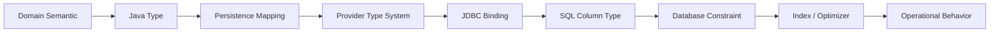

------
title: Learn Java Persistence, Database Integration, JPA, Hibernate ORM & EclipseLink - Part 007
description: Mapping dasar dan type system Jakarta Persistence/JPA untuk mendesain kolom, tipe, enum, temporal, converter, LOB, dan constraint dengan mental model production-grade.
series: learn-java-persistence
seriesTitle: Learn Java Persistence, Database Integration, JPA, Hibernate ORM & EclipseLink
order: 7
partTitle: Basic Mapping and Type System
tags:
- java
- persistence
- jpa
- jakarta-persistence
- hibernate
- eclipselink
- orm
- mapping
- type-system
- database-integration
- series
date: 2026-06-27
---

# Basic Mapping and Type System

> Target part ini: kamu mampu melihat setiap field entity bukan sebagai “property Java yang diberi anotasi”, tetapi sebagai **kontrak lintas-layer** antara domain semantic, Java type, Jakarta Persistence mapping, provider type system, JDBC binding, SQL type, constraint database, index, migration, dan observability.

Mapping dasar sering diremehkan karena tampak mudah:

```java
@Column(nullable = false, length = 100)
private String title;
```

Tetapi di sistem production, field sederhana bisa menyebabkan bug serius:

- enum berubah urutan lalu data lama salah arti;
- `BigDecimal` tanpa precision/scale membuat uang tidak konsisten;
- timestamp memakai timezone ambigu;
- `String` terlalu panjang lalu silent truncation atau migration gagal;
- `boolean` tidak cocok dengan legacy `Y/N` atau `0/1`;
- `@Lob` dianggap lazy padahal provider/database tidak memperlakukannya begitu;
- converter dipakai untuk menyembunyikan domain rule, tetapi query dan index menjadi sulit;
- database default dianggap sama dengan Java default;
- nullability di Java, Bean Validation, dan database tidak selaras.

Bagian ini membangun fondasi sebelum kita masuk ke association, aggregate, query, flush, dan performance.

---

## 1. Kaufman Framing

### 1.1 Deconstruct the Skill

Skill “basic mapping” terdiri dari sub-skill berikut:

1. membaca field entity sebagai kontrak data;
2. memilih Java type yang mewakili semantic domain dengan akurat;
3. memilih SQL type yang stabil terhadap migration dan query;
4. menyelaraskan nullability di domain, API, persistence, dan database;
5. membedakan mapping portable Jakarta Persistence dari provider-specific mapping;
6. mendesain enum dan code table agar aman terhadap evolusi;
7. menangani temporal value tanpa bug timezone;
8. memakai `AttributeConverter` tanpa menyembunyikan model yang seharusnya eksplisit;
9. mengevaluasi kapan value object harus menjadi embeddable, converter, entity, atau reference data;
10. menguji hasil mapping dengan DDL, SQL bind parameter, dan round-trip persistence.

### 1.2 Learn Enough to Self-Correct

Setelah membaca part ini, kamu harus bisa menjawab:

- Field ini nullable karena domain mengizinkan kosong, atau karena migration belum siap?
- Enum ini aman jika value baru ditambahkan?
- Apakah tipe Java ini punya representasi SQL yang deterministik?
- Apakah provider akan bind nilai ini sebagai tipe yang index-friendly?
- Apakah database constraint memperkuat invariant domain, atau justru bertentangan?
- Apakah mapping ini portable di Hibernate dan EclipseLink?
- Apakah ada value object tersembunyi di balik primitive field?

### 1.3 Practice Deliberately

Latihan inti part ini: ambil satu entity regulatory case, lalu lakukan review field-by-field. Untuk setiap field, tulis:

```text
Domain meaning:
Java type:
Jakarta Persistence mapping:
Database type:
Nullability:
Uniqueness:
Index expectation:
Migration risk:
Provider-specific behavior:
Failure mode:
```

Jika kamu tidak bisa mengisi satu baris, mapping itu belum cukup dipahami.

---

## 2. Mental Model: Field Mapping is a Contract

Entity field melewati beberapa lapisan:



Contoh field:

```java
@Column(name = "penalty_amount", precision = 19, scale = 2, nullable = false)
private BigDecimal penaltyAmount;
```

Field ini bukan sekadar angka.

Ia menyatakan:

- domain menyimpan nilai monetary;
- Java memakai `BigDecimal`, bukan `double`;
- database menyimpan decimal fixed precision;
- `null` tidak valid;
- query dan aggregation harus memperlakukan nilai ini sebagai numeric exact;
- migration harus menjaga precision/scale;
- API tidak boleh kehilangan scale;
- test harus memverifikasi round-trip value.

Mapping buruk biasanya terjadi saat engineer hanya memikirkan Java type dan lupa layer lain.

---

## 3. Basic Attribute Mapping

Jakarta Persistence memetakan persistent field/property non-relational sebagai basic attribute.

Contoh minimal:

```java
@Entity
@Table(name = "enforcement_case")
public class EnforcementCase {

    @Id
    @GeneratedValue(strategy = GenerationType.SEQUENCE, generator = "enforcement_case_seq")
    @SequenceGenerator(name = "enforcement_case_seq", sequenceName = "enforcement_case_seq", allocationSize = 50)
    private Long id;

    @Column(name = "case_number", nullable = false, length = 40, unique = true)
    private String caseNumber;

    @Column(name = "title", nullable = false, length = 200)
    private String title;

    @Column(name = "risk_score", nullable = false)
    private Integer riskScore;

    @Column(name = "created_at", nullable = false, updatable = false)
    private Instant createdAt;
}
```

Important: mapping adalah public contract terhadap database schema. Mengubah mapping bukan refactor biasa. Itu adalah data migration decision.

---

## 4. `@Basic`: Small Annotation, Big Misunderstanding

`@Basic` dapat menyatakan dua hal utama:

```java
@Basic(optional = false, fetch = FetchType.LAZY)
private String summary;
```

### 4.1 `optional`

`optional = false` berarti attribute tidak boleh null menurut metadata persistence. Tetapi ini bukan pengganti database `NOT NULL`.

Gunakan pembagian berikut:

| Layer | Fungsi |
|---|---|
| Java constructor/factory | Mencegah object invalid dibuat |
| Bean Validation | Validasi input/application boundary |
| Jakarta Persistence metadata | Metadata persistence dan provider hint |
| Database constraint | Penjaga terakhir terhadap corrupt data |

Untuk invariant kuat, jangan hanya pakai satu layer.

```java
@Column(name = "case_number", nullable = false, length = 40)
private String caseNumber;
```

Jika memakai Bean Validation:

```java
@NotBlank
@Size(max = 40)
@Column(name = "case_number", nullable = false, length = 40)
private String caseNumber;
```

Catatan: Bean Validation dan database constraint punya tujuan berbeda. Bean Validation memberi error aplikasi yang lebih baik. Database constraint menjaga integritas data walaupun ada bug aplikasi, batch job, SQL manual, atau service lain.

### 4.2 `fetch = LAZY` pada Basic Attribute

`FetchType.LAZY` pada basic attribute adalah hint. Provider mungkin memerlukan bytecode enhancement/weaving agar lazy basic field benar-benar bekerja.

Jangan mendesain sistem yang bergantung pada lazy basic field untuk correctness.

Untuk field besar:

- pisahkan ke table/entity lain jika aksesnya berbeda;
- gunakan projection untuk read path;
- hindari memuat `@Lob` bersama aggregate utama;
- observasi SQL aktual, bukan asumsi.

---

## 5. `@Column`: Contract to Relational Schema

`@Column` adalah anotasi paling sering dipakai dan paling sering disalahgunakan.

```java
@Column(
    name = "case_number",
    nullable = false,
    unique = true,
    length = 40,
    insertable = true,
    updatable = false
)
private String caseNumber;
```

### 5.1 `name`

Gunakan nama eksplisit untuk schema yang penting.

```java
@Column(name = "case_number")
private String caseNumber;
```

Implicit naming strategy berguna, tetapi untuk sistem regulasi, audit, dan data warehouse, nama eksplisit sering lebih defensible.

### 5.2 `nullable`

`nullable = false` harus berarti domain tidak pernah menerima null.

Anti-pattern:

```java
@Column(nullable = false)
private String closedReason;
```

Padahal case baru belum closed. Ini akan memaksa fake value seperti `"N/A"`, lalu data analytics rusak.

Lebih baik:

```java
@Column(name = "closed_reason", length = 500)
private String closedReason;
```

atau model eksplisit:

```java
@Enumerated(EnumType.STRING)
@Column(name = "status", nullable = false, length = 40)
private CaseStatus status;

@Column(name = "closed_reason", length = 500)
private String closedReason;
```

Invariant “closed case must have reason” tidak cukup diekspresikan oleh `nullable=false` pada satu kolom. Ia adalah cross-field invariant.

### 5.3 `unique`

`unique = true` berguna untuk DDL generation sederhana, tetapi di production biasanya lebih baik mendefinisikan unique constraint di `@Table` atau migration.

```java
@Table(
    name = "enforcement_case",
    uniqueConstraints = {
        @UniqueConstraint(
            name = "uk_enforcement_case_case_number",
            columnNames = "case_number"
        )
    }
)
@Entity
public class EnforcementCase {
    // ...
}
```

Kenapa?

- constraint punya nama stabil;
- migration tool bisa mengelola perubahan;
- composite uniqueness lebih eksplisit;
- error handling bisa memetakan constraint name ke domain error.

### 5.4 `insertable` dan `updatable`

`insertable = false` atau `updatable = false` berarti provider tidak akan menyertakan kolom itu dalam SQL insert/update.

Gunakan untuk:

- database-generated column;
- view/read-only projection entity;
- duplicated foreign key read model;
- audit column yang dikendalikan trigger;
- column yang dimiliki mapping lain.

Contoh:

```java
@Column(name = "created_at", nullable = false, updatable = false)
private Instant createdAt;
```

Tetapi jangan salah paham: `updatable = false` bukan security boundary. Itu hanya instruksi SQL generation provider.

### 5.5 `length`, `precision`, `scale`

Default sering tidak cukup.

```java
@Column(name = "title", nullable = false, length = 200)
private String title;

@Column(name = "penalty_amount", nullable = false, precision = 19, scale = 2)
private BigDecimal penaltyAmount;
```

Aturan praktis:

- selalu tentukan `length` untuk string domain penting;
- selalu tentukan `precision` dan `scale` untuk `BigDecimal` yang masuk ke laporan, uang, persentase, atau scoring;
- jangan mengandalkan default provider untuk schema production;
- validasi panjang di application boundary juga, bukan hanya database.

---

## 6. Access Type: Field vs Property

Jakarta Persistence bisa membaca state lewat field atau getter/setter.

Jika `@Id` diletakkan di field, default access adalah field access:

```java
@Id
private Long id;
```

Jika `@Id` diletakkan di getter, default access adalah property access:

```java
@Id
public Long getId() {
    return id;
}
```

### 6.1 Field Access

Field access umum dipakai untuk domain model karena:

- setter bisa dibatasi;
- invariant bisa dijaga lewat method domain;
- provider tidak perlu melewati getter yang punya logic;
- object lebih mudah dibuat immutable-ish.

```java
@Entity
@Access(AccessType.FIELD)
public class EnforcementCase {

    @Id
    private Long id;

    private String caseNumber;

    protected EnforcementCase() {
    }

    public EnforcementCase(String caseNumber) {
        this.caseNumber = requireValidCaseNumber(caseNumber);
    }
}
```

### 6.2 Property Access

Property access berguna saat:

- model legacy menggunakan getter/setter logic;
- field internal berbeda dari exposed property;
- framework tertentu bergantung pada getter.

Tetapi property access lebih mudah menimbulkan side effect jika getter/setter tidak murni.

### 6.3 Jangan Campur Tanpa Alasan

Campuran field/property access dapat membuat mapping sulit dibaca.

Gunakan `@Access` eksplisit jika memang perlu:

```java
@Access(AccessType.FIELD)
@Entity
public class CaseDocument {

    @Id
    private Long id;

    @Transient
    private byte[] cachedHash;

    @Access(AccessType.PROPERTY)
    @Column(name = "document_hash", nullable = false, length = 64)
    public String getDocumentHash() {
        return calculateOrReturnHash();
    }
}
```

Prinsip: default satu access style per entity.

---

## 7. `@Transient` vs Java `transient`

Ada dua konsep berbeda:

```java
@Transient
private RiskBand computedRiskBand;

private transient byte[] temporaryBuffer;
```

- `jakarta.persistence.Transient` berarti attribute tidak persistent.
- Java `transient` berarti field tidak ikut Java serialization.

Jangan mengandalkan Java `transient` sebagai dokumentasi persistence. Gunakan `@Transient` untuk intent persistence.

Computed field sebaiknya:

- pure;
- bisa dihitung dari persistent state;
- tidak membawa state business yang harus durable;
- tidak menyebabkan query/filter logic tersembunyi.

---

## 8. String Mapping

String tampak sederhana, tetapi punya dimensi:

- max length;
- Unicode support;
- collation;
- case sensitivity;
- trimming;
- indexing;
- full-text search;
- storage cost;
- semantic: code, label, free text, normalized key, JSON fragment.

### 8.1 Short Code

```java
@Column(name = "case_number", nullable = false, length = 40, updatable = false)
private String caseNumber;
```

Short code biasanya:

- immutable setelah dibuat;
- unique;
- indexed;
- case-normalized;
- tidak boleh memiliki whitespace ambigu.

Gunakan factory/domain method:

```java
public static CaseNumber of(String raw) {
    String normalized = raw == null ? null : raw.trim().toUpperCase(Locale.ROOT);
    if (normalized == null || !normalized.matches("EC-[0-9]{4}-[0-9]{6}")) {
        throw new IllegalArgumentException("Invalid case number");
    }
    return new CaseNumber(normalized);
}
```

Nanti value object `CaseNumber` akan kita desain sebagai embeddable/converter.

### 8.2 Human Text

```java
@Column(name = "summary", nullable = false, length = 2000)
private String summary;
```

Human text membutuhkan keputusan:

- apakah boleh newline?
- apakah disanitasi?
- apakah disimpan sebagai plain text atau rich text?
- apakah perlu full-text search?
- apakah masuk audit trail?
- apakah versi lama perlu dipertahankan?

### 8.3 `@Lob` untuk Text Besar

```java
@Lob
@Column(name = "finding_detail", nullable = false)
private String findingDetail;
```

`@Lob` tidak otomatis berarti pilihan terbaik.

Pertimbangkan:

- apakah field sering dibaca bersama row utama?
- apakah field perlu di-index full-text?
- apakah field menyebabkan entity terlalu berat?
- apakah provider benar-benar lazy-load field tersebut?
- apakah database menyimpan LOB out-of-line?

Untuk regulatory case, dokumen besar sering lebih baik menjadi entity/table terpisah atau object storage metadata, bukan field LOB di aggregate utama.

---

## 9. Numeric Mapping

### 9.1 Integer and Long

Gunakan `Integer`/`Long` object wrapper jika nilai bisa null secara lifecycle. Gunakan primitive hanya jika nilai selalu ada sejak object dibuat.

```java
@Column(name = "risk_score", nullable = false)
private int riskScore;
```

Primitive aman jika constructor menjamin nilai valid.

```java
public EnforcementCase(String caseNumber, int riskScore) {
    this.caseNumber = requireValidCaseNumber(caseNumber);
    this.riskScore = requireRiskScore(riskScore);
}
```

### 9.2 BigDecimal

Jangan gunakan `double` untuk uang, denda, exposure, persentase yang harus deterministik, atau nilai regulatory reporting.

```java
@Column(name = "recommended_penalty", nullable = false, precision = 19, scale = 2)
private BigDecimal recommendedPenalty;
```

Tetapkan policy:

- rounding mode;
- scale normalization;
- currency handling;
- min/max domain;
- database precision/scale;
- serialization format.

Anti-pattern:

```java
@Column(nullable = false)
private BigDecimal amount;
```

Tanpa precision/scale, schema bisa berbeda antar provider/database dan migration menjadi tidak eksplisit.

### 9.3 Percentage, Ratio, Score

Jangan menyimpan `0.15`, `15`, dan `1500` tanpa semantic.

Gunakan nama kolom jelas:

```java
@Column(name = "risk_score_points", nullable = false)
private int riskScorePoints;

@Column(name = "penalty_ratio_basis_points", nullable = false)
private int penaltyRatioBasisPoints;
```

Untuk persentase regulatory, basis points sering lebih stabil daripada decimal floating semantics.

---

## 10. Boolean Mapping

Boolean punya representasi database berbeda:

- `BOOLEAN` native;
- `BIT`;
- `SMALLINT` 0/1;
- `CHAR(1)` `Y/N`;
- `VARCHAR` `true/false`;
- legacy code.

Portable mapping:

```java
@Column(name = "urgent", nullable = false)
private boolean urgent;
```

Untuk legacy `Y/N`, gunakan converter:

```java
@Converter(autoApply = false)
public class YesNoConverter implements AttributeConverter<Boolean, String> {

    @Override
    public String convertToDatabaseColumn(Boolean value) {
        if (value == null) {
            return null;
        }
        return value ? "Y" : "N";
    }

    @Override
    public Boolean convertToEntityAttribute(String value) {
        if (value == null) {
            return null;
        }
        return switch (value) {
            case "Y" -> true;
            case "N" -> false;
            default -> throw new IllegalArgumentException("Invalid boolean code: " + value);
        };
    }
}
```

```java
@Convert(converter = YesNoConverter.class)
@Column(name = "urgent_yn", nullable = false, length = 1)
private Boolean urgent;
```

Catatan: jika column nullable false, pertimbangkan primitive `boolean`; jika converter menerima `Boolean`, tetap tangani null untuk robustness.

---

## 11. Enum Mapping

Enum adalah area high-risk.

### 11.1 `EnumType.ORDINAL`: Avoid by Default

```java
@Enumerated(EnumType.ORDINAL)
private CaseStatus status;
```

Ini menyimpan ordinal enum: `0`, `1`, `2`, ...

Risiko:

- menambah enum di tengah mengubah arti data;
- reorder enum merusak data historis;
- database tidak self-describing;
- analytics sulit;
- migration risk tinggi.

Default engineering rule: jangan pakai ordinal untuk domain status production.

### 11.2 `EnumType.STRING`: Better, But Not Perfect

```java
@Enumerated(EnumType.STRING)
@Column(name = "status", nullable = false, length = 40)
private CaseStatus status;
```

Lebih aman karena database menyimpan nama enum:

```text
OPEN
UNDER_REVIEW
ESCALATED
CLOSED
```

Tetapi masih ada risiko:

- rename enum constant butuh migration;
- string panjang;
- nama Java menjadi database contract;
- localization tidak boleh masuk enum name.

### 11.3 Stable Code Mapping

Untuk domain regulatory, sering lebih baik punya stable external code:

```java
public enum CaseStatus {
    OPEN("OPEN"),
    UNDER_REVIEW("REVIEW"),
    ESCALATED("ESC"),
    CLOSED("CLOSED");

    private final String code;

    CaseStatus(String code) {
        this.code = code;
    }

    public String code() {
        return code;
    }

    public static CaseStatus fromCode(String code) {
        for (CaseStatus status : values()) {
            if (status.code.equals(code)) {
                return status;
            }
        }
        throw new IllegalArgumentException("Unknown case status code: " + code);
    }
}
```

Dengan converter:

```java
@Converter(autoApply = true)
public class CaseStatusConverter implements AttributeConverter<CaseStatus, String> {

    @Override
    public String convertToDatabaseColumn(CaseStatus attribute) {
        return attribute == null ? null : attribute.code();
    }

    @Override
    public CaseStatus convertToEntityAttribute(String dbData) {
        return dbData == null ? null : CaseStatus.fromCode(dbData);
    }
}
```

```java
@Column(name = "status", nullable = false, length = 20)
private CaseStatus status;
```

### 11.4 Jakarta Persistence 3.2 `@EnumeratedValue`

Jakarta Persistence 3.2 memperkenalkan cara standar untuk mendefinisikan value enum yang disimpan di database melalui `@EnumeratedValue`.

Contoh konseptual:

```java
public enum CasePriority {
    LOW("L"),
    MEDIUM("M"),
    HIGH("H"),
    CRITICAL("C");

    @EnumeratedValue
    private final String code;

    CasePriority(String code) {
        this.code = code;
    }
}
```

Ini mengurangi kebutuhan converter sederhana untuk enum-code mapping. Tetapi tetap evaluasi dukungan provider, readability, migration plan, dan database constraint.

### 11.5 Enum vs Reference Table

Gunakan enum jika:

- daftar nilai kecil;
- jarang berubah;
- bagian dari logic aplikasi;
- deployment code boleh mengatur evolusi nilai.

Gunakan reference table jika:

- nilai dikelola business/admin;
- butuh effective date;
- butuh localization;
- butuh metadata tambahan;
- butuh soft-deactivation;
- nilai sering berubah tanpa redeploy.

Contoh reference data:

```text
violation_type
- code
- label
- severity
- effective_from
- effective_to
- active
```

Jangan memaksakan enum untuk taxonomy regulatory yang dikelola regulasi dan bisa berubah.

---

## 12. Temporal Mapping

Temporal bugs sering mahal karena terlihat benar sampai audit, SLA, atau reporting gagal.

### 12.1 Prefer `java.time`

Gunakan Java Time API:

| Semantic | Java Type | Contoh |
|---|---|---|
| Timestamp instant global | `Instant` | event creation time |
| Local business date | `LocalDate` | due date, filing date |
| Local wall-clock time | `LocalTime` | office cutoff time |
| Local date-time without zone | `LocalDateTime` | legacy local timestamp |
| Offset-aware timestamp | `OffsetDateTime` | external event with offset |
| Zoned rule-based time | `ZonedDateTime` | scheduling across DST zones |

### 12.2 `Instant` untuk Audit Timestamp

```java
@Column(name = "created_at", nullable = false, updatable = false)
private Instant createdAt;

@Column(name = "updated_at", nullable = false)
private Instant updatedAt;
```

`Instant` cocok untuk:

- created/updated time;
- event occurrence timestamp;
- ordering global;
- audit log;
- integration messages.

Tetapi database type harus jelas. Misalnya PostgreSQL `timestamp with time zone` menyimpan instant-like semantics, sedangkan database lain bisa berbeda.

### 12.3 `LocalDate` untuk Business Date

```java
@Column(name = "filing_date", nullable = false)
private LocalDate filingDate;
```

`LocalDate` cocok untuk tanggal yang tidak punya jam:

- filing date;
- due date;
- effective date;
- birth date;
- reporting date.

Jangan pakai `Instant` untuk business date hanya karena “lebih modern”. Jika regulasi berkata “deadline 30 Juni 2026”, itu bukan instant sampai kamu mendefinisikan timezone dan cutoff rule.

### 12.4 `LocalDateTime` is Dangerous Without Context

```java
@Column(name = "submitted_at_local", nullable = false)
private LocalDateTime submittedAtLocal;
```

`LocalDateTime` tidak punya timezone/offset. Ia cocok untuk legacy atau jika timezone ditentukan oleh field lain.

Jika digunakan, dokumentasikan:

- timezone apa yang diasumsikan;
- apakah ada DST;
- bagaimana membandingkan antar region;
- bagaimana serialization API dilakukan.

### 12.5 Avoid Legacy `Date`/`Calendar` for New Code

`java.util.Date` dan `Calendar` masih muncul di code lama, tetapi untuk model baru, gunakan `java.time`. Jakarta Persistence modern mendukung banyak tipe Java Time.

---

## 13. Binary and LOB Mapping

### 13.1 Small Binary

```java
@Column(name = "document_sha256", nullable = false, length = 32)
private byte[] documentSha256;
```

Untuk hash/fingerprint, byte array fixed length bisa tepat. Tetapi hex string juga bisa lebih mudah untuk observability.

```java
@Column(name = "document_sha256_hex", nullable = false, length = 64)
private String documentSha256Hex;
```

Pilih berdasarkan:

- storage efficiency;
- readability;
- indexing;
- interoperability;
- query/reporting needs.

### 13.2 Large Binary

```java
@Lob
@Column(name = "document_content")
private byte[] documentContent;
```

Ini jarang desain terbaik untuk dokumen besar.

Alternatif:

```java
@Entity
@Table(name = "case_document")
public class CaseDocument {

    @Id
    private Long id;

    @ManyToOne(fetch = FetchType.LAZY, optional = false)
    @JoinColumn(name = "case_id", nullable = false)
    private EnforcementCase enforcementCase;

    @Column(name = "storage_key", nullable = false, length = 500)
    private String storageKey;

    @Column(name = "sha256_hex", nullable = false, length = 64)
    private String sha256Hex;

    @Column(name = "content_type", nullable = false, length = 100)
    private String contentType;

    @Column(name = "size_bytes", nullable = false)
    private long sizeBytes;
}
```

Di banyak sistem, database menyimpan metadata dan object storage menyimpan konten.

### 13.3 LOB Lazy Loading

Jangan asumsikan `@Basic(fetch = LAZY)` pada LOB bekerja tanpa konfigurasi provider.

```java
@Lob
@Basic(fetch = FetchType.LAZY)
private String fullNarrative;
```

Pastikan dengan:

- SQL log;
- provider enhancement/weaving config;
- integration test;
- memory profiling.

---

## 14. AttributeConverter

`AttributeConverter<X, Y>` mengubah antara domain type `X` dan database column type `Y`.

```java
@Converter(autoApply = true)
public class CaseNumberConverter implements AttributeConverter<CaseNumber, String> {

    @Override
    public String convertToDatabaseColumn(CaseNumber attribute) {
        return attribute == null ? null : attribute.value();
    }

    @Override
    public CaseNumber convertToEntityAttribute(String dbData) {
        return dbData == null ? null : CaseNumber.of(dbData);
    }
}
```

```java
@Column(name = "case_number", nullable = false, length = 40, updatable = false)
private CaseNumber caseNumber;
```

### 14.1 Good Uses

Attribute converter cocok untuk:

- simple domain scalar wrapper;
- stable enum code mapping;
- `Y/N` legacy boolean;
- normalized string code;
- encrypted-at-rest simple field, dengan sangat hati-hati;
- compact value encoded ke satu column.

### 14.2 Bad Uses

Jangan gunakan converter untuk menyembunyikan:

- complex object graph;
- JSON blob yang harus di-query relationally;
- business rule yang butuh table constraint;
- reference data yang butuh lifecycle;
- value yang butuh multi-column representation;
- data yang harus di-index dalam beberapa dimensi.

Anti-pattern:

```java
@Convert(converter = ViolationDetailsJsonConverter.class)
@Column(name = "violation_details_json", nullable = false)
private ViolationDetails violationDetails;
```

Ini mungkin valid untuk event snapshot atau audit payload. Tetapi jika `ViolationDetails` sering di-filter, di-join, divalidasi, atau dilaporkan, JSON converter menjadi technical debt.

### 14.3 Converter and Query Semantics

Converter memengaruhi binding parameter.

```java
TypedQuery<EnforcementCase> query = em.createQuery(
    "select c from EnforcementCase c where c.caseNumber = :caseNumber",
    EnforcementCase.class
);
query.setParameter("caseNumber", CaseNumber.of("EC-2026-000123"));
```

Provider harus mengubah `CaseNumber` ke `String` saat bind. Tetap observasi SQL dan parameter binding, terutama untuk custom type, enum, dan database-specific type.

### 14.4 `autoApply`

```java
@Converter(autoApply = true)
public class CaseNumberConverter implements AttributeConverter<CaseNumber, String> {
    // ...
}
```

`autoApply = true` mengurangi anotasi berulang, tetapi bisa mengejutkan jika type yang sama digunakan untuk beberapa kolom dengan format berbeda.

Gunakan auto-apply untuk type yang punya satu representasi global. Gunakan `@Convert` eksplisit jika representasi bergantung pada context.

---

## 15. Provider Type Systems

Jakarta Persistence mendefinisikan portable mapping. Provider seperti Hibernate dan EclipseLink punya type system lebih kaya.

### 15.1 Hibernate

Hibernate punya mekanisme untuk:

- basic type registry;
- JDBC type descriptor;
- Java type descriptor;
- custom type;
- `@JdbcTypeCode` untuk mapping eksplisit ke kode SQL/JDBC tertentu;
- support provider-specific untuk JSON, ARRAY, UUID, INET, dan tipe database tertentu tergantung dialect.

Contoh provider-specific:

```java
@JdbcTypeCode(SqlTypes.JSON)
@Column(name = "metadata", columnDefinition = "jsonb")
private CaseMetadata metadata;
```

Ini kuat, tetapi tidak portable. Gunakan hanya setelah sadar trade-off.

### 15.2 EclipseLink

EclipseLink juga menyediakan extension untuk converter, transformation mapping, object type converter, serialized object mapping, dan descriptor customization.

Provider extension bisa sangat berguna pada legacy schema, tetapi harus diberi boundary:

- letakkan di infrastructure layer;
- dokumentasikan vendor dependency;
- test provider-specific behavior;
- jangan mengklaim portability jika sudah memakai extension.

### 15.3 Portability Rule

Gunakan tiga level berikut:

```text
Level 1: Pure Jakarta Persistence mapping
Level 2: Provider hint/annotation untuk performance atau compatibility
Level 3: Provider-specific type/custom SQL yang mengikat desain ke provider/database
```

Tidak salah memakai Level 3. Yang salah adalah tidak sadar bahwa kamu sudah meninggalkan portability.

---

## 16. Database Defaults and Generated Values

Database default sering terlihat menarik:

```sql
created_at timestamp not null default current_timestamp
```

Tetapi jika entity punya field:

```java
@Column(name = "created_at", nullable = false, updatable = false)
private Instant createdAt;
```

Pertanyaan penting:

- apakah Java mengisi nilai sebelum insert?
- apakah database mengisi nilai?
- apakah provider tahu nilai hasil generated column setelah insert?
- apakah perlu `refresh`?
- apakah audit timestamp harus berasal dari app clock atau database clock?
- bagaimana test mengontrol waktu?

### 16.1 Application-Assigned Audit Time

```java
@PrePersist
void prePersist() {
    Instant now = Instant.now();
    this.createdAt = now;
    this.updatedAt = now;
}

@PreUpdate
void preUpdate() {
    this.updatedAt = Instant.now();
}
```

Sederhana, tetapi clock app bisa berbeda antar node.

### 16.2 Database-Assigned Audit Time

Database lebih konsisten untuk satu database cluster, tetapi entity state di memory bisa tidak langsung tahu nilai.

Jika memakai trigger/default, pastikan:

- field tidak dikirim saat insert/update jika perlu;
- provider tahu generated column jika ingin membaca balik;
- test memverifikasi nilai setelah flush/refresh;
- aplikasi tidak bergantung pada nilai sebelum tersedia.

---

## 17. Column Definition: Use Sparingly

```java
@Column(name = "metadata", columnDefinition = "jsonb")
private String metadata;
```

`columnDefinition` membuat DDL provider mengandung SQL literal database-specific.

Gunakan saat:

- schema generation hanya untuk dev/test;
- database type tidak bisa diekspresikan portable;
- migration tool tetap sumber kebenaran production;
- vendor lock-in diterima.

Jangan gunakan `columnDefinition` sebagai pengganti migration yang terkelola.

---

## 18. Nullability as Lifecycle Design

Null tidak selalu buruk. Null buruk jika artinya tidak jelas.

Contoh:

```java
@Column(name = "assigned_investigator_id")
private Long assignedInvestigatorId;
```

Null bisa berarti:

- belum ditugaskan;
- assignment dihapus;
- data migration belum lengkap;
- investigator external tidak ditemukan;
- user tidak punya akses melihat assignment;
- bug.

Domain harus membedakan jika maknanya berbeda.

### 18.1 State-Dependent Nullability

```java
public enum CaseStatus {
    DRAFT,
    OPEN,
    ASSIGNED,
    CLOSED
}
```

`assignedInvestigator` mungkin null saat `DRAFT` atau `OPEN`, tetapi wajib saat `ASSIGNED`.

Ini bukan sekadar column-level nullability. Ini state machine invariant.

```java
public void assignTo(Investigator investigator) {
    if (status == CaseStatus.CLOSED) {
        throw new IllegalStateException("Closed case cannot be assigned");
    }
    this.assignedInvestigator = Objects.requireNonNull(investigator);
    this.status = CaseStatus.ASSIGNED;
}
```

Database bisa memperkuat dengan check constraint jika schema mendukung:

```sql
check (
    status <> 'ASSIGNED'
    or assigned_investigator_id is not null
)
```

JPA mapping saja tidak cukup untuk cross-field invariant.

---

## 19. Mapping Regulatory Enforcement Case

Contoh mapping dasar:

```java
@Entity
@Table(
    name = "enforcement_case",
    uniqueConstraints = {
        @UniqueConstraint(
            name = "uk_enforcement_case_case_number",
            columnNames = "case_number"
        )
    },
    indexes = {
        @Index(name = "ix_enforcement_case_status", columnList = "status"),
        @Index(name = "ix_enforcement_case_created_at", columnList = "created_at")
    }
)
@Access(AccessType.FIELD)
public class EnforcementCase {

    @Id
    @GeneratedValue(strategy = GenerationType.SEQUENCE, generator = "enforcement_case_seq")
    @SequenceGenerator(
        name = "enforcement_case_seq",
        sequenceName = "enforcement_case_seq",
        allocationSize = 50
    )
    private Long id;

    @Column(name = "case_number", nullable = false, length = 40, updatable = false)
    private String caseNumber;

    @Column(name = "title", nullable = false, length = 200)
    private String title;

    @Column(name = "summary", nullable = false, length = 2000)
    private String summary;

    @Enumerated(EnumType.STRING)
    @Column(name = "status", nullable = false, length = 40)
    private CaseStatus status;

    @Enumerated(EnumType.STRING)
    @Column(name = "priority", nullable = false, length = 20)
    private CasePriority priority;

    @Column(name = "risk_score", nullable = false)
    private int riskScore;

    @Column(name = "recommended_penalty", precision = 19, scale = 2)
    private BigDecimal recommendedPenalty;

    @Column(name = "filing_date", nullable = false)
    private LocalDate filingDate;

    @Column(name = "due_date")
    private LocalDate dueDate;

    @Column(name = "created_at", nullable = false, updatable = false)
    private Instant createdAt;

    @Column(name = "updated_at", nullable = false)
    private Instant updatedAt;

    protected EnforcementCase() {
    }

    public EnforcementCase(String caseNumber, String title, String summary, LocalDate filingDate) {
        this.caseNumber = requireCaseNumber(caseNumber);
        this.title = requireTitle(title);
        this.summary = requireSummary(summary);
        this.filingDate = Objects.requireNonNull(filingDate);
        this.status = CaseStatus.OPEN;
        this.priority = CasePriority.MEDIUM;
        this.riskScore = 0;
    }

    @PrePersist
    void prePersist() {
        Instant now = Instant.now();
        this.createdAt = now;
        this.updatedAt = now;
    }

    @PreUpdate
    void preUpdate() {
        this.updatedAt = Instant.now();
    }
}
```

Review:

- `caseNumber` immutable dan unique;
- `title` dan `summary` punya length eksplisit;
- status/priority string enum, bukan ordinal;
- monetary value memakai `BigDecimal` dengan precision/scale;
- filing/due date memakai `LocalDate`, bukan timestamp;
- audit timestamp memakai `Instant`;
- lifecycle defaults ada di constructor/pre-persist;
- indexes dideklarasikan sebagai metadata, tetapi production migration tetap harus menjadi source of truth.

---

## 20. DDL Generation vs Migration Reality

Jakarta Persistence dapat membantu generate schema, tetapi production-grade system biasanya memakai migration tool seperti Flyway atau Liquibase.

Gunakan JPA DDL generation untuk:

- local prototype;
- test schema cepat;
- membandingkan expected schema;
- smoke test mapping.

Gunakan migration untuk:

- production schema;
- named constraints;
- index strategy;
- partial indexes;
- check constraints;
- database-specific types;
- online migration;
- rollback/forward strategy;
- auditability.

Mapping entity tetap penting sebagai executable documentation, tetapi database migration adalah kontrak operasional.

---

## 21. Anti-Patterns

### 21.1 Primitive Obsession

```java
private String caseNumber;
private String officerEmail;
private String status;
private String priority;
```

Ini membuat domain rule tersebar.

Lebih baik:

```java
private CaseNumber caseNumber;
private EmailAddress officerEmail;
private CaseStatus status;
private CasePriority priority;
```

Tetapi mapping-nya harus jelas: converter, embeddable, atau entity?

### 21.2 Enum Ordinal Persistence

```java
@Enumerated(EnumType.ORDINAL)
private CaseStatus status;
```

Hampir selalu buruk untuk domain status.

### 21.3 Nullable Everything

```java
@Column
private String title;

@Column
private String status;

@Column
private Instant createdAt;
```

Ini menyerahkan invariant ke harapan manusia.

### 21.4 Database Default Without Entity Awareness

```java
@Column(name = "created_at", insertable = false, updatable = false)
private Instant createdAt;
```

Jika aplikasi membaca `createdAt` sebelum refresh, nilainya bisa null di memory.

### 21.5 `columnDefinition` Everywhere

```java
@Column(columnDefinition = "varchar(255) default 'OPEN'")
private String status;
```

Ini mencampur mapping metadata dengan migration logic dan membuat portability turun.

### 21.6 Overusing AttributeConverter for Complex Data

Jika data perlu di-query, di-index, di-join, atau divalidasi relationally, jangan sembunyikan dalam converter opaque.

---

## 22. Testing Basic Mapping

Minimal test untuk mapping dasar:

```java
@Test
void shouldPersistAndLoadCaseWithStableTypes() {
    EnforcementCase c = new EnforcementCase(
        "EC-2026-000001",
        "Unauthorized disclosure investigation",
        "Initial case opened from supervisory report",
        LocalDate.of(2026, 6, 27)
    );

    entityManager.persist(c);
    entityManager.flush();
    entityManager.clear();

    EnforcementCase loaded = entityManager
        .createQuery(
            "select c from EnforcementCase c where c.caseNumber = :caseNumber",
            EnforcementCase.class
        )
        .setParameter("caseNumber", "EC-2026-000001")
        .getSingleResult();

    assertThat(loaded.getCaseNumber()).isEqualTo("EC-2026-000001");
    assertThat(loaded.getFilingDate()).isEqualTo(LocalDate.of(2026, 6, 27));
    assertThat(loaded.getCreatedAt()).isNotNull();
}
```

Tambahkan test untuk:

- max length violation;
- null violation;
- enum round-trip;
- converter invalid database value;
- temporal round-trip;
- precision/scale round-trip;
- database constraint name mapping;
- generated audit columns.

---

## 23. Mapping Review Checklist

Untuk setiap field, jawab:

```text
1. Apa semantic domain field ini?
2. Apakah Java type-nya merepresentasikan semantic itu?
3. Apakah null punya satu arti jelas?
4. Apakah database nullability sama dengan invariant domain?
5. Apakah length/precision/scale eksplisit?
6. Apakah enum mapping aman terhadap evolusi?
7. Apakah timestamp/date type sesuai semantic waktu?
8. Apakah converter diperlukan atau hanya menyembunyikan desain buruk?
9. Apakah field perlu index?
10. Apakah field sering dibaca bersama entity utama?
11. Apakah field harus immutable setelah insert?
12. Apakah mapping portable atau provider-specific?
13. Apakah migration production sudah menguatkan mapping ini?
14. Apakah test memverifikasi round-trip dan constraint?
```

Jika review ini terasa berat, itu normal. Persistence engineering memang bukan sekadar menulis anotasi.

---

## 24. Baeldung-Style Practical Rule Set

Gunakan rule berikut sebagai default:

1. Pakai `EnumType.STRING`, bukan `ORDINAL`, kecuali ada alasan kuat dan migration terkendali.
2. Pakai `BigDecimal` dengan `precision` dan `scale` untuk monetary/exact numeric.
3. Pakai `java.time`, bukan `Date`/`Calendar`, untuk model baru.
4. Pakai `LocalDate` untuk business date, `Instant` untuk audit timestamp.
5. Tentukan `length` untuk string domain penting.
6. Jangan percaya lazy basic/LOB tanpa observability.
7. Jangan simpan complex queryable data dalam converter opaque.
8. Gunakan converter untuk scalar value object yang punya satu representasi column.
9. Jangan campur field/property access tanpa `@Access` eksplisit.
10. Jadikan migration tool sebagai source of truth untuk production schema.

---

## 25. Mini Lab: Field-by-Field Hardening

Ambil entity berikut:

```java
@Entity
public class Complaint {
    @Id
    @GeneratedValue
    private Long id;

    private String number;
    private String status;
    private String description;
    private double penalty;
    private Date submittedAt;
    private Boolean urgent;
}
```

Tugas:

1. Ubah `number` menjadi immutable case/complaint number dengan length dan uniqueness.
2. Ubah `status` menjadi enum atau reference table decision.
3. Ubah `description` dengan length atau table terpisah jika besar.
4. Ubah `penalty` menjadi `BigDecimal` dengan precision/scale.
5. Ubah `submittedAt` menjadi `Instant` atau `LocalDate`, sesuai semantic.
6. Putuskan apakah `urgent` nullable.
7. Tambahkan constructor/factory yang menjaga invariant.
8. Tambahkan `@PrePersist` untuk audit jika perlu.
9. Tulis migration SQL yang sesuai.
10. Tulis test round-trip.

Hasil yang bagus bukan entity dengan anotasi paling banyak, tetapi entity yang paling jelas kontraknya.

---

## 26. Key Takeaways

Basic mapping adalah fondasi semua hal lanjutan dalam JPA. Fetch plan, dirty checking, transaction, cache, dan query performance akan kacau jika mapping dasar tidak solid.

Mental model utama:

```text
Field != just Java property
Field = domain semantic + Java type + persistence mapping + provider type + JDBC binding + SQL column + constraint + operational behavior
```

Engineer top-tier tidak bertanya “anotasinya apa?”, tetapi:

- apa invariant-nya?
- siapa sumber kebenarannya?
- bagaimana nilai ini berevolusi?
- bagaimana data lama tetap valid?
- bagaimana query dan index memperlakukan field ini?
- apa yang terjadi saat provider flush?
- bagaimana saya membuktikan mapping ini benar?

Di part berikutnya, kita naik satu level: dari field scalar menuju **embeddable, value object, dan Java records**. Ini adalah cara mengurangi primitive obsession tanpa langsung membuat entity dan relationship yang berlebihan.
