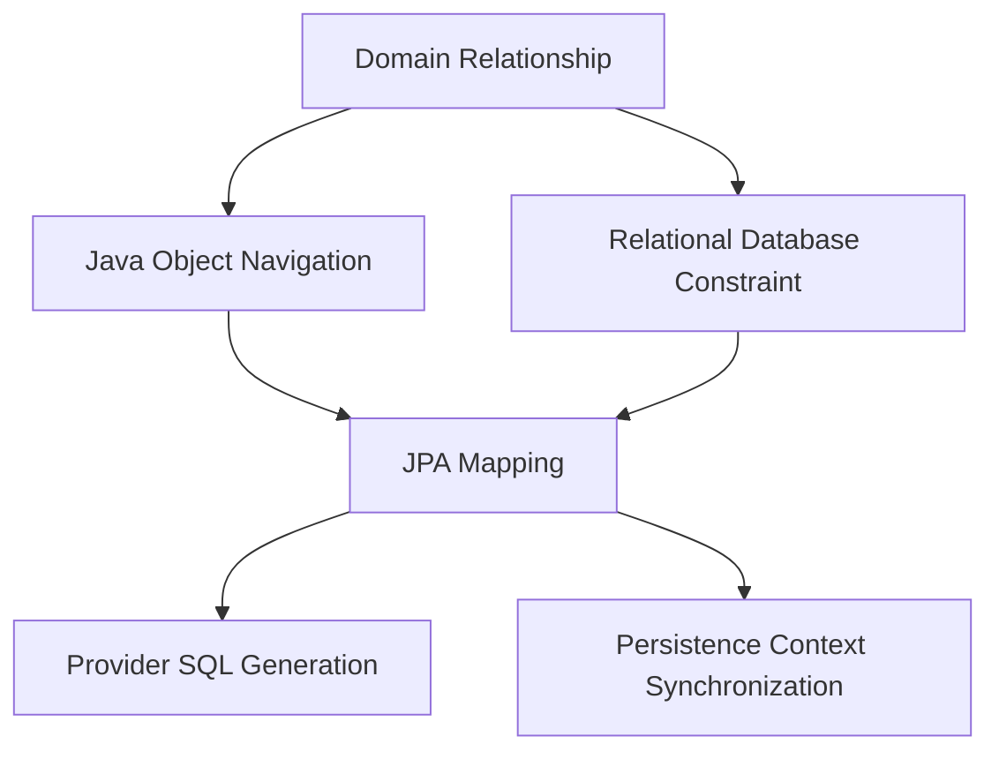
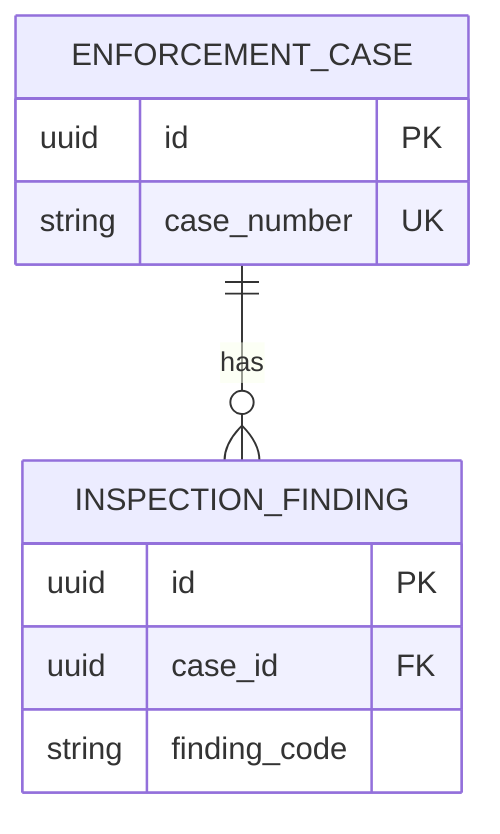
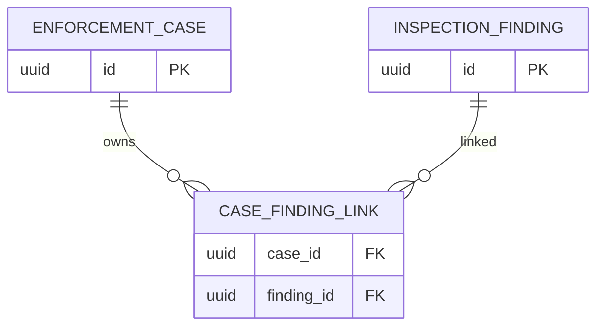
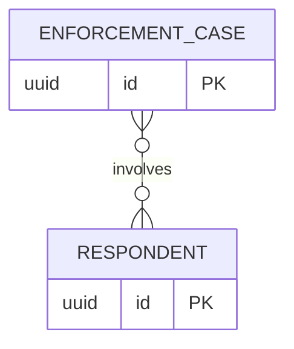
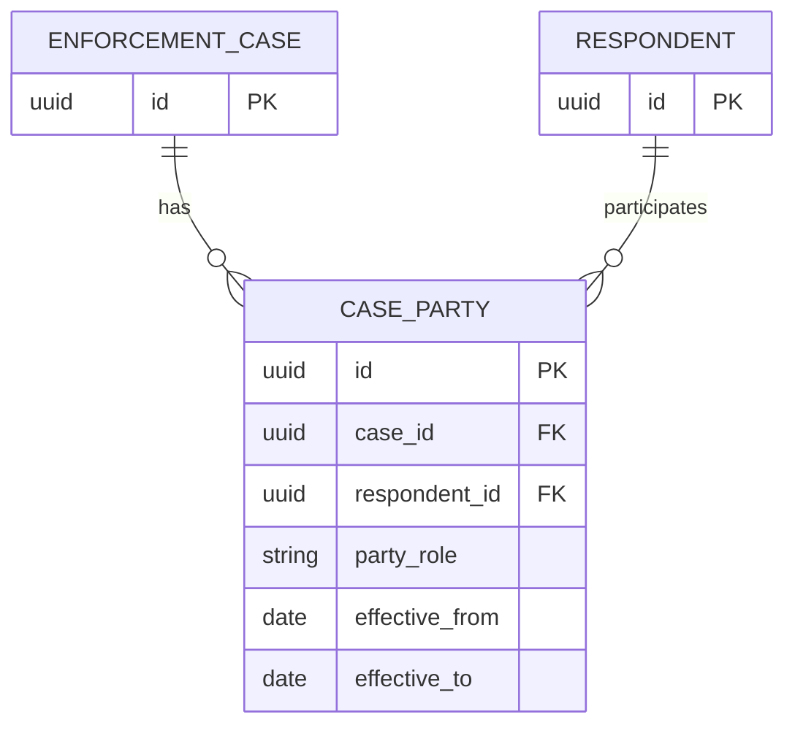
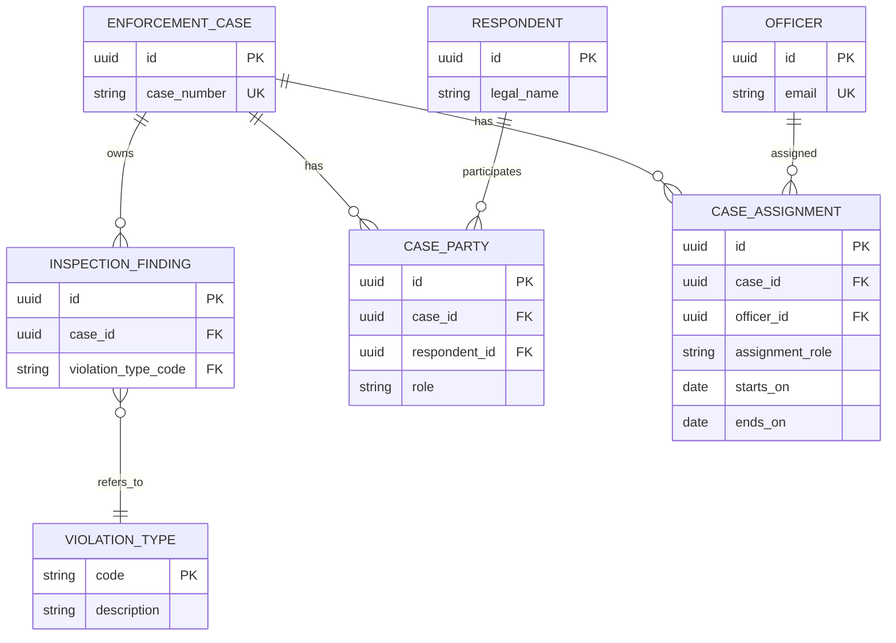
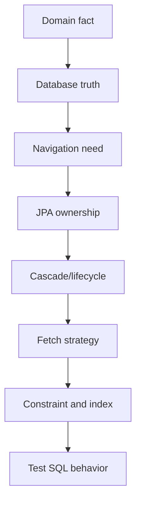

------
title: Learn Java Persistence, Database Integration, JPA, Hibernate ORM & EclipseLink - Part 009
description: Association modelling inti di Jakarta Persistence/JPA: OneToOne, ManyToOne, OneToMany, ManyToMany, owning side, inverse side, JoinColumn, JoinTable, cascade, orphan removal, dan failure mode mapping relasi.
series: learn-java-persistence
seriesTitle: Learn Java Persistence, Database Integration, JPA, Hibernate ORM & EclipseLink
order: 9
partTitle: Association Modelling Core
tags:
- java
- persistence
- jpa
- jakarta-persistence
- hibernate
- eclipselink
- orm
- association
- relationship-mapping
- database-integration
- series
date: 2026-06-27
---

# Association Modelling Core

> Target part ini: kamu mampu memodelkan relasi antar entity secara sadar: mana relasi Java, mana foreign key database, mana owning side JPA, mana inverse side, mana lifecycle ownership, mana sekadar navigasi, dan mana yang sebaiknya tidak dimodelkan sebagai association sama sekali.

Pada level basic, association sering diajarkan sebagai empat anotasi:

```java
@OneToOne
@OneToMany
@ManyToOne
@ManyToMany
```

Pada level production, cara berpikir seperti itu terlalu dangkal.

Relasi persistence bukan hanya “A punya B”. Relasi persistence adalah gabungan dari beberapa keputusan yang berbeda:

1. cardinality domain;
2. arah navigasi object;
3. foreign key atau join table di database;
4. owning side dalam JPA;
5. lifecycle ownership;
6. cascade behavior;
7. nullability dan constraint;
8. fetch behavior;
9. concurrency boundary;
10. serialization/API boundary;
11. delete semantics;
12. migration impact;
13. performance impact.

Top 1% engineer tidak bertanya, “Pakai `@OneToMany` atau `@ManyToMany`?” terlebih dahulu. Mereka bertanya:

> “Apa fakta relasional yang harus dijaga database, dan object navigation apa yang benar-benar dibutuhkan use case?”

---

## 1. Kaufman Framing

### 1.1 Deconstruct the Skill

Menguasai association modelling berarti mampu:

1. membedakan **domain relationship**, **object reference**, dan **database relationship**;
2. menentukan owning side berdasarkan kolom yang menyimpan foreign key atau join table;
3. membuat bidirectional association yang konsisten di memory;
4. memakai helper method untuk menjaga kedua sisi relasi;
5. memilih antara unidirectional dan bidirectional mapping;
6. memilih antara foreign key dan join table;
7. menghindari `@ManyToMany` ketika relasi sebenarnya punya atribut;
8. memahami default fetch dan cascade, lalu tidak bergantung buta padanya;
9. membedakan cascade JPA dan database `ON DELETE CASCADE`;
10. membuat constraint database yang konsisten dengan mapping JPA;
11. mendesain relasi agar tidak menghasilkan N+1, cartesian explosion, atau accidental graph loading;
12. membaca SQL yang dihasilkan provider untuk memverifikasi desain.

### 1.2 Learn Enough to Self-Correct

Untuk setiap association, tanyakan:

- Relasi ini butuh navigasi dari sisi mana?
- Siapa yang menyimpan foreign key?
- Siapa owning side menurut JPA?
- Apakah relasi optional atau mandatory?
- Apakah database punya `NOT NULL`, `UNIQUE`, dan foreign key yang sesuai?
- Apakah parent benar-benar memiliki lifecycle child?
- Apakah delete parent harus delete child?
- Apakah remove dari collection harus delete row child?
- Apakah relasi ini perlu cascade persist?
- Apakah cascade remove aman?
- Apakah relasi ini collection besar?
- Apakah collection ini akan sering dimodifikasi?
- Apakah association ini akan dipakai untuk read API atau write command?
- Apakah ini sebenarnya query, bukan object navigation?

### 1.3 Practice Deliberately

Latihan part ini memakai domain **regulatory enforcement case management**.

Kita akan memodelkan:

- `EnforcementCase`;
- `Respondent`;
- `CaseAssignment`;
- `InspectionFinding`;
- `EvidenceItem`;
- `ViolationType`;
- `CaseNote`.

Bukan karena domain ini rumit, tetapi karena ia punya karakter yang realistis:

- ada entity inti berumur panjang;
- ada child entity yang dimiliki case;
- ada reference data;
- ada relasi many-to-many semu;
- ada relasi historis;
- ada relasi audit-like;
- ada relasi yang tidak boleh dihapus walau parent berubah;
- ada collection yang bisa membesar.

---

## 2. Mental Model: Three Different Relationships

JPA association sering membingungkan karena satu anotasi terlihat seperti mewakili semua hal. Padahal minimal ada tiga layer relasi.



### 2.1 Domain Relationship

Domain relationship menjawab:

> “Dalam bisnis, apa hubungan antara dua konsep ini?”

Contoh:

- satu enforcement case punya banyak finding;
- satu finding mengacu ke satu violation type;
- satu case bisa punya banyak respondent;
- satu respondent bisa muncul di banyak case;
- satu assignment menghubungkan case, officer, role, dan periode waktu.

Domain relationship tidak otomatis berarti harus ada Java association dua arah.

### 2.2 Java Object Navigation

Object navigation menjawab:

> “Dari object ini, apakah kode perlu langsung menelusuri object lain?”

Contoh:

```java
caseFile.getFindings()
finding.getCaseFile()
finding.getViolationType()
```

Navigasi itu convenience. Ia bukan kebenaran database. Terlalu banyak navigasi membuat entity menjadi graph global.

### 2.3 Relational Database Constraint

Relational constraint menjawab:

> “Kolom apa yang membuktikan relasi ini benar?”

Contoh:

```sql
inspection_finding.case_id references enforcement_case(id)
inspection_finding.violation_type_code references violation_type(code)
case_assignment.case_id references enforcement_case(id)
```

Database tidak mengenal object reference. Database mengenal foreign key, unique constraint, check constraint, join table, index, dan transaction isolation.

### 2.4 JPA Mapping

JPA mapping menjembatani object navigation dan relational constraint.

```java
@ManyToOne(fetch = FetchType.LAZY, optional = false)
@JoinColumn(name = "case_id", nullable = false)
private EnforcementCase caseFile;
```

Mapping di atas menyatakan:

- Java field `caseFile` menunjuk ke `EnforcementCase`;
- foreign key ada di table `inspection_finding`;
- kolom bernama `case_id`;
- secara object, association tidak optional;
- secara DDL, kolom tidak nullable;
- fetching diminta lazy.

Itu beberapa keputusan sekaligus. Jangan biarkan anotasi pendek menyembunyikan konsekuensi desainnya.

---

## 3. Relationship Design Matrix

Sebelum memilih anotasi, isi matrix berikut.

| Pertanyaan | Contoh Jawaban | Dampak Mapping |
|---|---|---|
| Apakah relasi one atau many? | Case punya many finding | `@OneToMany` dari case, `@ManyToOne` dari finding |
| FK berada di table mana? | `inspection_finding.case_id` | owning side adalah finding |
| Apakah navigasi dua arah perlu? | Case perlu list finding, finding perlu case | bidirectional |
| Apakah child hidup tanpa parent? | Finding tidak hidup tanpa case | kandidat `cascade` + `orphanRemoval` |
| Apakah child boleh dipindah parent? | Finding tidak boleh dipindah case | enforce via domain method |
| Apakah collection besar? | Finding biasanya kecil, note bisa besar | note jangan selalu dimap sebagai navigasi |
| Apakah delete parent delete child? | finding ya, note audit mungkin tidak | cascade berbeda per relasi |
| Apakah relasi punya atribut? | assignment punya role dan periode | association entity, bukan `@ManyToMany` |
| Apakah relasi read-only reference? | violation type | `@ManyToOne`, no cascade remove |
| Apakah constraint database sesuai? | `NOT NULL`, FK, unique | migration wajib eksplisit |

Jangan lompat ke anotasi sebelum matrix ini jelas.

---

## 4. Owning Side: The Most Misunderstood Concept

Dalam JPA, owning side bukan berarti “pemilik bisnis”. Owning side berarti:

> Sisi association yang perubahan field-nya dipakai provider untuk menulis foreign key atau join table.

### 4.1 Example: Case to Finding

Relational truth:

```sql
create table enforcement_case (
    id uuid primary key,
    case_number varchar(64) not null unique
);

create table inspection_finding (
    id uuid primary key,
    case_id uuid not null references enforcement_case(id),
    finding_code varchar(64) not null
);
```

Foreign key ada di `inspection_finding.case_id`.

Maka owning side JPA adalah `InspectionFinding.caseFile`.

```java
@Entity
@Table(name = "inspection_finding")
public class InspectionFinding {

    @Id
    private UUID id;

    @ManyToOne(fetch = FetchType.LAZY, optional = false)
    @JoinColumn(name = "case_id", nullable = false)
    private EnforcementCase caseFile;
}
```

Sisi `EnforcementCase.findings` hanyalah inverse side:

```java
@Entity
@Table(name = "enforcement_case")
public class EnforcementCase {

    @Id
    private UUID id;

    @OneToMany(mappedBy = "caseFile")
    private List<InspectionFinding> findings = new ArrayList<>();
}
```

`mappedBy = "caseFile"` berarti:

> “Kolom relasi tidak dikelola dari sini. Lihat field `caseFile` di entity lawan.”

### 4.2 Common Bug: Update Only Inverse Side

Bug:

```java
caseFile.getFindings().add(finding);
```

Jika `finding.setCaseFile(caseFile)` tidak dipanggil, owning side belum berubah. Provider boleh tidak menulis `case_id` sesuai harapan.

Solusi: helper method.

```java
public class EnforcementCase {

    @OneToMany(mappedBy = "caseFile", cascade = CascadeType.ALL, orphanRemoval = true)
    private final List<InspectionFinding> findings = new ArrayList<>();

    public void addFinding(InspectionFinding finding) {
        Objects.requireNonNull(finding, "finding must not be null");
        findings.add(finding);
        finding.assignToCase(this);
    }

    public void removeFinding(InspectionFinding finding) {
        if (findings.remove(finding)) {
            finding.unassignFromCase();
        }
    }
}
```

Child side:

```java
public class InspectionFinding {

    @ManyToOne(fetch = FetchType.LAZY, optional = false)
    @JoinColumn(name = "case_id", nullable = false, updatable = false)
    private EnforcementCase caseFile;

    void assignToCase(EnforcementCase caseFile) {
        if (this.caseFile != null && this.caseFile != caseFile) {
            throw new IllegalStateException("Finding cannot be moved to another case");
        }
        this.caseFile = Objects.requireNonNull(caseFile);
    }

    void unassignFromCase() {
        this.caseFile = null;
    }
}
```

Catatan: `nullable = false` dan `orphanRemoval = true` harus konsisten. Jika remove dari collection membuat child orphan, provider akan delete child. Jika tidak ada `orphanRemoval`, provider mungkin mencoba nulling FK, yang gagal bila FK `NOT NULL`.

---

## 5. `@ManyToOne`: The Workhorse Association

Dalam model relasional, many-to-one adalah mapping paling natural karena foreign key berada di sisi “many”.

Contoh:

```java
@Entity
@Table(name = "inspection_finding")
public class InspectionFinding {

    @Id
    private UUID id;

    @ManyToOne(fetch = FetchType.LAZY, optional = false)
    @JoinColumn(name = "case_id", nullable = false)
    private EnforcementCase caseFile;

    @ManyToOne(fetch = FetchType.LAZY, optional = false)
    @JoinColumn(name = "violation_type_code", nullable = false)
    private ViolationType violationType;
}
```

### 5.1 When to Use

Gunakan `@ManyToOne` ketika:

- entity ini punya FK ke parent/reference entity;
- banyak row child dapat menunjuk ke satu row parent;
- navigasi dari child ke parent dibutuhkan;
- referential integrity penting;
- query sering memfilter berdasarkan parent/reference.

### 5.2 Fetch Strategy

Secara spesifikasi, to-one association seperti `@ManyToOne` default-nya eager. Dalam sistem production, bias desain yang lebih aman adalah eksplisitkan `LAZY` kecuali benar-benar reference data kecil yang selalu dibutuhkan.

```java
@ManyToOne(fetch = FetchType.LAZY, optional = false)
@JoinColumn(name = "case_id", nullable = false)
private EnforcementCase caseFile;
```

Kenapa?

Karena eager default pada banyak to-one bisa menghasilkan query tambahan tak terlihat atau join besar. Fetch plan sebaiknya dikontrol per use case, bukan melekat permanen ke model.

### 5.3 Optionality

`optional = false` adalah metadata object model JPA. `nullable = false` adalah metadata DDL column.

Gunakan keduanya jika relasi benar-benar wajib:

```java
@ManyToOne(fetch = FetchType.LAZY, optional = false)
@JoinColumn(name = "case_id", nullable = false)
private EnforcementCase caseFile;
```

Jangan mengandalkan satu saja.

### 5.4 Cascade on ManyToOne: Usually No

Ini anti-pattern umum:

```java
@ManyToOne(cascade = CascadeType.ALL)
private ViolationType violationType;
```

Jika `ViolationType` adalah reference data, child tidak boleh melakukan cascade persist/remove ke reference data.

Lebih aman:

```java
@ManyToOne(fetch = FetchType.LAZY, optional = false)
@JoinColumn(name = "violation_type_code", nullable = false)
private ViolationType violationType;
```

Cascade dari child ke parent/reference sering menghasilkan efek samping berbahaya:

- menyimpan reference data tidak sengaja;
- menghapus parent saat child dihapus;
- mengubah lifecycle entity yang seharusnya independen;
- membuat transaction boundary tidak jelas.

Rule of thumb:

> Cascade biasanya mengalir dari aggregate root ke owned child, bukan dari child ke parent, dan bukan ke reference data.

---

## 6. `@OneToMany`: Collection Navigation, Not Foreign Key Ownership

`@OneToMany` sering dianggap sebagai “parent punya children”. Itu benar secara domain, tetapi belum tentu benar secara database ownership.

### 6.1 Bidirectional One-to-Many

Mapping production paling umum:

```java
@Entity
@Table(name = "enforcement_case")
public class EnforcementCase {

    @Id
    private UUID id;

    @OneToMany(mappedBy = "caseFile", cascade = CascadeType.ALL, orphanRemoval = true)
    private List<InspectionFinding> findings = new ArrayList<>();
}
```

```java
@Entity
@Table(name = "inspection_finding")
public class InspectionFinding {

    @Id
    private UUID id;

    @ManyToOne(fetch = FetchType.LAZY, optional = false)
    @JoinColumn(name = "case_id", nullable = false)
    private EnforcementCase caseFile;
}
```

Relational shape:



### 6.2 Unidirectional One-to-Many with Join Table

JPA bisa memetakan unidirectional one-to-many melalui join table:

```java
@OneToMany(cascade = CascadeType.ALL)
@JoinTable(
    name = "case_finding_link",
    joinColumns = @JoinColumn(name = "case_id"),
    inverseJoinColumns = @JoinColumn(name = "finding_id")
)
private List<InspectionFinding> findings = new ArrayList<>();
```

Ini valid, tetapi sering tidak ideal karena menambah table hanya untuk relasi yang sebenarnya bisa dinyatakan dengan FK di child.

Relational shape:



### 6.3 Unidirectional One-to-Many with Join Column

Beberapa desain memakai FK child tanpa back-reference:

```java
@OneToMany(cascade = CascadeType.ALL, orphanRemoval = true)
@JoinColumn(name = "case_id", nullable = false)
private List<InspectionFinding> findings = new ArrayList<>();
```

Ini membuat parent side mengelola FK child. Secara domain bisa terlihat bersih, tetapi provider behavior dan SQL update bisa berbeda dibanding bidirectional mapping. Untuk collection besar atau write-heavy, verifikasi SQL dengan teliti.

### 6.4 Collection Size Risk

`@OneToMany` berarti ada kemungkinan collection di-load, di-diff, atau dimutasi sebagai satu unit. Untuk collection yang bisa besar, jangan asal map sebagai collection navigable.

Contoh buruk:

```java
@OneToMany(mappedBy = "caseFile")
private List<CaseNote> notes = new ArrayList<>();
```

Jika `CaseNote` bisa ribuan row, lebih baik query eksplisit:

```java
interface CaseNoteRepository {
    Page<CaseNoteSummary> findByCaseId(UUID caseId, Pageable pageable);
}
```

Entity root tidak harus punya collection untuk semua relasi.

---

## 7. `@OneToOne`: Rarer Than People Think

One-to-one secara domain sering berarti “satu object punya detail object”. Namun di database, one-to-one harus dibuktikan dengan constraint.

Ada beberapa bentuk.

### 7.1 Unique Foreign Key

```sql
create table case_risk_profile (
    id uuid primary key,
    case_id uuid not null unique references enforcement_case(id),
    risk_level varchar(32) not null
);
```

Mapping:

```java
@Entity
@Table(name = "case_risk_profile")
public class CaseRiskProfile {

    @Id
    private UUID id;

    @OneToOne(fetch = FetchType.LAZY, optional = false)
    @JoinColumn(name = "case_id", nullable = false, unique = true)
    private EnforcementCase caseFile;
}
```

Inverse side:

```java
@OneToOne(mappedBy = "caseFile", cascade = CascadeType.ALL, orphanRemoval = true)
private CaseRiskProfile riskProfile;
```

### 7.2 Shared Primary Key with `@MapsId`

Jika detail row benar-benar bergantung pada parent dan menggunakan id yang sama:

```sql
create table enforcement_case (
    id uuid primary key
);

create table case_risk_profile (
    case_id uuid primary key references enforcement_case(id),
    risk_level varchar(32) not null
);
```

Mapping:

```java
@Entity
@Table(name = "case_risk_profile")
public class CaseRiskProfile {

    @Id
    private UUID id;

    @MapsId
    @OneToOne(fetch = FetchType.LAZY, optional = false)
    @JoinColumn(name = "case_id", nullable = false)
    private EnforcementCase caseFile;
}
```

`@MapsId` berarti id child dipinjam dari parent association.

### 7.3 When Not to Use One-to-One

Jangan memakai `@OneToOne` hanya karena ingin memecah class besar.

Jika data selalu dimuat bersama, mungkin embeddable lebih cocok.

Jika data punya lifecycle dan permission berbeda, entity terpisah masuk akal.

Jika relasi bisa berubah menjadi one-to-many secara historis, jangan kunci sebagai one-to-one terlalu dini.

Contoh:

- current risk profile mungkin one-to-one;
- risk assessment history adalah one-to-many;
- active assignment mungkin one-to-one secara business rule, tetapi assignment history one-to-many.

---

## 8. `@ManyToMany`: Usually a Smell in Enterprise Systems

`@ManyToMany` terlihat praktis.

```java
@ManyToMany
@JoinTable(
    name = "case_respondent",
    joinColumns = @JoinColumn(name = "case_id"),
    inverseJoinColumns = @JoinColumn(name = "respondent_id")
)
private Set<Respondent> respondents = new HashSet<>();
```

Relational shape:



Masalahnya: banyak relasi many-to-many di sistem nyata punya atribut.

Contoh `case_respondent` biasanya punya:

- role: primary respondent, related party, legal representative;
- join date;
- exit date;
- status;
- representation basis;
- confidentiality flag;
- audit information.

Begitu join row punya atribut, ia bukan lagi sekadar join table. Ia adalah entity.

### 8.1 Prefer Association Entity

```java
@Entity
@Table(name = "case_party")
public class CaseParty {

    @Id
    private UUID id;

    @ManyToOne(fetch = FetchType.LAZY, optional = false)
    @JoinColumn(name = "case_id", nullable = false)
    private EnforcementCase caseFile;

    @ManyToOne(fetch = FetchType.LAZY, optional = false)
    @JoinColumn(name = "respondent_id", nullable = false)
    private Respondent respondent;

    @Enumerated(EnumType.STRING)
    @Column(name = "party_role", nullable = false, length = 64)
    private CasePartyRole role;

    @Embedded
    private EffectivePeriod effectivePeriod;
}
```

Parent:

```java
@OneToMany(mappedBy = "caseFile", cascade = CascadeType.ALL, orphanRemoval = true)
private Set<CaseParty> parties = new HashSet<>();
```

Relational shape:



### 8.2 Benefits of Association Entity

Association entity memberi:

- tempat untuk atribut relasi;
- lifecycle jelas;
- audit lebih mudah;
- constraint lebih kuat;
- query lebih fleksibel;
- delete semantics lebih aman;
- future-proofing saat business rule bertambah.

Rule of thumb:

> Di enterprise/regulatory systems, `@ManyToMany` langsung jarang benar. Mayoritas berubah menjadi association entity.

---

## 9. Directionality: Unidirectional vs Bidirectional

Directionality adalah keputusan navigasi object, bukan database.

### 9.1 Unidirectional Many-to-One

```java
@Entity
class InspectionFinding {

    @ManyToOne(fetch = FetchType.LAZY, optional = false)
    @JoinColumn(name = "case_id", nullable = false)
    private EnforcementCase caseFile;
}
```

Tidak ada `caseFile.getFindings()`.

Cocok jika:

- use case sering bergerak dari finding ke case;
- list finding selalu dipaging/query terpisah;
- root tidak perlu collection in-memory;
- ingin mengurangi graph complexity.

### 9.2 Bidirectional One-to-Many

```java
class EnforcementCase {
    @OneToMany(mappedBy = "caseFile")
    private List<InspectionFinding> findings = new ArrayList<>();
}

class InspectionFinding {
    @ManyToOne(fetch = FetchType.LAZY)
    private EnforcementCase caseFile;
}
```

Cocok jika:

- aggregate root perlu memvalidasi/mengelola child;
- child count relatif kecil;
- mutation child dilakukan melalui root;
- lifecycle child dimiliki root.

### 9.3 Bidirectional Cost

Bidirectional association menambah kewajiban:

- menjaga kedua sisi konsisten;
- membuat helper method;
- menghindari recursive `toString`;
- menghindari recursive JSON serialization;
- berhati-hati dengan `equals/hashCode`;
- memahami owning side;
- memahami loading behavior.

Jangan membuat bidirectional association hanya agar “lengkap”.

---

## 10. Cascade: Propagating EntityManager Operations

Cascade JPA berarti operasi persistence pada satu entity dipropagasi ke entity terkait.

```java
@OneToMany(mappedBy = "caseFile", cascade = CascadeType.ALL)
private List<InspectionFinding> findings = new ArrayList<>();
```

Jika `caseFile` dipersist, findings ikut dipersist. Jika `caseFile` diremove, findings ikut diremove.

### 10.1 Cascade Types

| Cascade Type | Makna | Use Case Umum | Risiko |
|---|---|---|---|
| `PERSIST` | child ikut persist | new aggregate root dengan new child | menyimpan object yang tidak sengaja ikut graph |
| `MERGE` | detached child ikut merge | jarang perlu jika command model jelas | merge graph besar tak terkendali |
| `REMOVE` | child ikut remove | owned child | fatal jika child/reference shared |
| `REFRESH` | child ikut refresh | jarang | overwrite state in-memory |
| `DETACH` | child ikut detach | extended context tertentu | surprise detached graph |
| `ALL` | semua operasi | owned child kecil | terlalu luas jika tidak benar-benar owned |

### 10.2 Cascade Is Not Lifecycle Ownership by Itself

Cascade hanyalah propagation rule. Lifecycle ownership adalah keputusan domain.

Misalnya:

```java
@ManyToOne(cascade = CascadeType.ALL)
private Respondent respondent;
```

Ini buruk jika respondent bisa muncul di banyak case. Menghapus case dapat menghapus respondent yang masih dipakai case lain.

### 10.3 Safe Cascade Direction

Lebih aman:

```java
@Entity
class EnforcementCase {

    @OneToMany(mappedBy = "caseFile", cascade = CascadeType.ALL, orphanRemoval = true)
    private List<InspectionFinding> findings = new ArrayList<>();
}
```

Karena finding tidak bermakna tanpa case.

Tidak aman:

```java
@Entity
class InspectionFinding {

    @ManyToOne(cascade = CascadeType.ALL)
    private EnforcementCase caseFile;
}
```

Child tidak boleh mengontrol lifecycle parent.

---

## 11. Orphan Removal

`orphanRemoval = true` berarti entity child yang dilepas dari association parent akan dihapus.

```java
@OneToMany(mappedBy = "caseFile", cascade = CascadeType.ALL, orphanRemoval = true)
private List<InspectionFinding> findings = new ArrayList<>();
```

Jika:

```java
caseFile.removeFinding(finding);
```

maka provider akan menghapus `finding`, bukan hanya nulling FK.

### 11.1 Good Use Case

Gunakan untuk child yang benar-benar owned:

- inspection finding dalam draft case;
- case risk scoring detail;
- line item dalam calculation draft;
- attachment metadata yang lifecycle-nya mengikuti owner.

### 11.2 Bad Use Case

Jangan gunakan untuk:

- respondent;
- officer/user;
- violation type;
- reference data;
- entity yang bisa direferensikan parent lain;
- audit record yang harus dipertahankan.

### 11.3 Orphan Removal vs Cascade Remove

| Mechanism | Trigger | Effect |
|---|---|---|
| `CascadeType.REMOVE` | parent diremove | child ikut diremove |
| `orphanRemoval = true` | child dilepas dari parent association | child diremove |

Biasanya owned child memakai keduanya:

```java
cascade = CascadeType.ALL, orphanRemoval = true
```

Tapi jangan copy-paste. Pastikan lifecycle ownership benar.

---

## 12. JoinColumn and JoinTable

### 12.1 `@JoinColumn`

`@JoinColumn` memetakan foreign key column.

```java
@ManyToOne(fetch = FetchType.LAZY, optional = false)
@JoinColumn(
    name = "case_id",
    referencedColumnName = "id",
    nullable = false,
    foreignKey = @ForeignKey(name = "fk_finding_case")
)
private EnforcementCase caseFile;
```

Gunakan nama constraint eksplisit pada sistem yang migration/audit-friendly.

### 12.2 `@JoinTable`

`@JoinTable` memetakan table penghubung.

```java
@ManyToMany
@JoinTable(
    name = "case_tag",
    joinColumns = @JoinColumn(name = "case_id"),
    inverseJoinColumns = @JoinColumn(name = "tag_id")
)
private Set<Tag> tags = new HashSet<>();
```

Cocok untuk link sederhana tanpa atribut. Begitu link punya atribut, jadikan association entity.

### 12.3 Constraint Is Not Optional

Mapping tanpa constraint database adalah janji yang tidak dijaga.

Jangan puas dengan:

```java
@JoinColumn(name = "case_id")
```

Pastikan migration punya:

```sql
alter table inspection_finding
    add constraint fk_finding_case
    foreign key (case_id)
    references enforcement_case(id);

create index ix_finding_case_id
    on inspection_finding(case_id);
```

Foreign key menjaga integritas. Index menjaga query join dan delete/update parent tetap sehat.

---

## 13. Association and Fetching: Mapping Is Not Fetch Plan

Association mapping menjawab “relasi apa yang ada”. Fetch plan menjawab “data apa yang dibutuhkan use case sekarang”.

Jangan campur.

Buruk:

```java
@OneToMany(fetch = FetchType.EAGER, mappedBy = "caseFile")
private List<InspectionFinding> findings;
```

Ini membuat semua load `EnforcementCase` membawa findings, meskipun use case hanya butuh case number.

Lebih baik:

```java
@OneToMany(mappedBy = "caseFile")
private List<InspectionFinding> findings = new ArrayList<>();
```

Lalu query use-case-specific:

```java
select c
from EnforcementCase c
left join fetch c.findings
where c.id = :id
```

Atau entity graph pada part berikutnya.

Rule:

> Mapping harus stabil. Fetching harus use-case-specific.

---

## 14. Association and Serialization Boundary

Entity association tidak boleh langsung menjadi API contract.

Contoh berbahaya:

```java
@RestController
class CaseController {

    @GetMapping("/cases/{id}")
    EnforcementCase get(@PathVariable UUID id) {
        return repository.findById(id).orElseThrow();
    }
}
```

Risiko:

- lazy loading saat serialization;
- infinite recursion bidirectional association;
- overexposed internal field;
- accidental N+1;
- persistence context leak;
- API shape dikontrol mapping ORM, bukan use case.

Gunakan projection/DTO:

```java
public record CaseDetailResponse(
    UUID id,
    String caseNumber,
    List<FindingResponse> findings
) {}
```

Persistence association adalah internal model. API model adalah contract eksternal.

---

## 15. Domain Lab: Enforcement Case Associations

Kita modelkan subset domain.



### 15.1 EnforcementCase

```java
@Entity
@Table(name = "enforcement_case")
public class EnforcementCase {

    @Id
    private UUID id;

    @Column(name = "case_number", nullable = false, unique = true, length = 64)
    private String caseNumber;

    @OneToMany(mappedBy = "caseFile", cascade = CascadeType.ALL, orphanRemoval = true)
    private final List<InspectionFinding> findings = new ArrayList<>();

    @OneToMany(mappedBy = "caseFile", cascade = CascadeType.ALL, orphanRemoval = true)
    private final Set<CaseParty> parties = new HashSet<>();

    @OneToMany(mappedBy = "caseFile", cascade = CascadeType.ALL, orphanRemoval = true)
    private final List<CaseAssignment> assignments = new ArrayList<>();

    protected EnforcementCase() {
    }

    public EnforcementCase(UUID id, String caseNumber) {
        this.id = Objects.requireNonNull(id);
        this.caseNumber = requireValidCaseNumber(caseNumber);
    }

    public void addFinding(InspectionFinding finding) {
        findings.add(Objects.requireNonNull(finding));
        finding.assignTo(this);
    }

    public void removeFinding(InspectionFinding finding) {
        if (findings.remove(finding)) {
            finding.unassign();
        }
    }

    public void addParty(CaseParty party) {
        parties.add(Objects.requireNonNull(party));
        party.assignTo(this);
    }

    public void assignOfficer(CaseAssignment assignment) {
        assignments.add(Objects.requireNonNull(assignment));
        assignment.assignTo(this);
    }

    private static String requireValidCaseNumber(String value) {
        if (value == null || value.isBlank()) {
            throw new IllegalArgumentException("caseNumber must not be blank");
        }
        return value;
    }
}
```

### 15.2 InspectionFinding

```java
@Entity
@Table(name = "inspection_finding")
public class InspectionFinding {

    @Id
    private UUID id;

    @ManyToOne(fetch = FetchType.LAZY, optional = false)
    @JoinColumn(name = "case_id", nullable = false)
    private EnforcementCase caseFile;

    @ManyToOne(fetch = FetchType.LAZY, optional = false)
    @JoinColumn(name = "violation_type_code", nullable = false)
    private ViolationType violationType;

    @Column(name = "summary", nullable = false, length = 500)
    private String summary;

    protected InspectionFinding() {
    }

    public InspectionFinding(UUID id, ViolationType violationType, String summary) {
        this.id = Objects.requireNonNull(id);
        this.violationType = Objects.requireNonNull(violationType);
        this.summary = requireNonBlank(summary);
    }

    void assignTo(EnforcementCase caseFile) {
        this.caseFile = Objects.requireNonNull(caseFile);
    }

    void unassign() {
        this.caseFile = null;
    }

    private static String requireNonBlank(String value) {
        if (value == null || value.isBlank()) {
            throw new IllegalArgumentException("value must not be blank");
        }
        return value;
    }
}
```

### 15.3 CaseParty as Association Entity

```java
@Entity
@Table(
    name = "case_party",
    uniqueConstraints = @UniqueConstraint(
        name = "uk_case_party_role_active",
        columnNames = {"case_id", "respondent_id", "party_role"}
    )
)
public class CaseParty {

    @Id
    private UUID id;

    @ManyToOne(fetch = FetchType.LAZY, optional = false)
    @JoinColumn(name = "case_id", nullable = false)
    private EnforcementCase caseFile;

    @ManyToOne(fetch = FetchType.LAZY, optional = false)
    @JoinColumn(name = "respondent_id", nullable = false)
    private Respondent respondent;

    @Enumerated(EnumType.STRING)
    @Column(name = "party_role", nullable = false, length = 64)
    private CasePartyRole role;

    @Embedded
    private EffectivePeriod effectivePeriod;

    protected CaseParty() {
    }

    public CaseParty(
        UUID id,
        Respondent respondent,
        CasePartyRole role,
        EffectivePeriod effectivePeriod
    ) {
        this.id = Objects.requireNonNull(id);
        this.respondent = Objects.requireNonNull(respondent);
        this.role = Objects.requireNonNull(role);
        this.effectivePeriod = Objects.requireNonNull(effectivePeriod);
    }

    void assignTo(EnforcementCase caseFile) {
        this.caseFile = Objects.requireNonNull(caseFile);
    }
}
```

---

## 16. Failure Modes

### 16.1 Inconsistent Bidirectional Association

Symptom:

- collection berisi child;
- child FK tidak berubah;
- SQL insert/update tidak sesuai;
- child hilang setelah reload.

Cause:

```java
caseFile.getFindings().add(finding);
```

Owning side tidak di-set.

Fix:

```java
caseFile.addFinding(finding);
```

### 16.2 Cascade Remove to Shared Entity

Symptom:

- delete satu case menghapus respondent/reference data;
- FK violation di case lain;
- production incident.

Cause:

```java
@ManyToOne(cascade = CascadeType.ALL)
private Respondent respondent;
```

Fix:

- remove cascade;
- jadikan association entity;
- delete shared entity hanya melalui dedicated lifecycle.

### 16.3 Large Collection Load

Symptom:

- endpoint detail case lambat;
- memory naik;
- query banyak;
- serialization timeout.

Cause:

```java
@OneToMany(fetch = FetchType.EAGER)
private List<CaseNote> notes;
```

Fix:

- lazy mapping;
- query notes separately with pagination;
- use projection/read model.

### 16.4 ManyToMany Cannot Evolve

Symptom:

- butuh menambahkan role/status/tanggal ke join table;
- mapping sulit diubah;
- migration rumit;
- API sudah expose direct many-to-many.

Cause:

```java
@ManyToMany
private Set<Respondent> respondents;
```

Fix:

```java
@OneToMany(mappedBy = "caseFile")
private Set<CaseParty> parties;
```

### 16.5 Misaligned Optionality

Symptom:

- JPA mengizinkan null tetapi DB menolak;
- atau DB mengizinkan orphan tetapi domain tidak.

Cause:

```java
@ManyToOne(optional = true)
@JoinColumn(nullable = false)
private EnforcementCase caseFile;
```

Fix:

- align `optional` and `nullable`;
- enforce constructor/domain method invariant;
- migration constraint eksplisit.

---

## 17. Anti-Patterns

### 17.1 Bidirectional Everywhere

Tidak semua association perlu dua arah.

Buruk:

```java
Officer -> assignments -> case -> assignments -> officer -> ...
```

Akibat:

- graph cycle;
- serialization loop;
- mental overhead;
- accidental loading;
- complex equality.

### 17.2 Cascade All Everywhere

`CascadeType.ALL` bukan default yang aman. Ia hanya aman jika lifecycle ownership benar.

### 17.3 Mapping Query Need as Object Graph

Jika use case hanya butuh “count findings by severity”, jangan tambahkan collection demi query.

Gunakan query:

```java
select f.severity, count(f)
from InspectionFinding f
where f.caseFile.id = :caseId
group by f.severity
```

### 17.4 ManyToMany for Rich Link

Jika link punya atribut atau aturan, ia entity.

### 17.5 Entity Association for External Identifier

Kadang relasi ke sistem eksternal tidak harus association entity.

Misalnya:

```java
@Column(name = "external_registry_id")
private String externalRegistryId;
```

Lebih baik daripada membuat pseudo-entity yang tidak dikelola database lokal.

---

## 18. Review Checklist

Untuk setiap association, review ini:

### Domain

- Apakah relasi ini fakta domain atau convenience query?
- Apakah relasi ini punya lifecycle ownership?
- Apakah child bisa hidup tanpa parent?
- Apakah relasi punya atribut?
- Apakah relasi historis atau hanya current state?

### Mapping

- Apakah owning side benar?
- Apakah `mappedBy` mengarah ke field yang benar?
- Apakah helper method menjaga dua sisi?
- Apakah fetch explicit?
- Apakah cascade minimal?
- Apakah orphan removal hanya untuk owned child?

### Database

- Apakah FK ada?
- Apakah FK indexed?
- Apakah nullability sesuai domain?
- Apakah unique constraint membuktikan one-to-one?
- Apakah join table punya unique constraint?
- Apakah migration eksplisit, bukan hanya generated DDL?

### Runtime

- Apakah collection bisa besar?
- Apakah relasi rawan N+1?
- Apakah serialization aman?
- Apakah delete behavior diuji?
- Apakah SQL insert/update/delete sudah dilihat?

---

## 19. Practice Lab

### Exercise 1: Map Case to Findings

Buat mapping:

- `EnforcementCase` punya many `InspectionFinding`;
- finding wajib punya case;
- finding tidak boleh hidup tanpa case;
- remove finding dari case harus delete row;
- case delete harus delete finding.

Validasi:

- persist case dengan 2 finding;
- remove 1 finding;
- flush;
- pastikan SQL delete muncul;
- reload case;
- pastikan tinggal 1 finding.

### Exercise 2: Replace ManyToMany

Mulai dari:

```java
@ManyToMany
private Set<Respondent> respondents;
```

Refactor menjadi:

```java
@OneToMany(mappedBy = "caseFile")
private Set<CaseParty> parties;
```

Tambahkan:

- role;
- effective period;
- uniqueness constraint;
- query active parties.

### Exercise 3: Detect Wrong Cascade

Cari association yang memakai `CascadeType.ALL`. Untuk setiap satu, jawab:

- Apakah child benar-benar owned?
- Apakah child shared?
- Apa yang terjadi saat parent dihapus?
- Apakah remove dari collection harus delete row?
- Apakah cascade merge diperlukan?

### Exercise 4: Remove Useless Bidirectionality

Ambil model yang punya banyak bidirectional association. Hapus navigasi yang tidak dipakai command/use case. Ganti dengan repository query atau projection.

---

## 20. Mental Model Summary

Association modelling yang baik mengikuti urutan ini:



Ingat invariant utama:

1. Owning side adalah sisi yang menulis FK/join table, bukan selalu parent domain.
2. Bidirectional association wajib dijaga konsisten di memory.
3. `@ManyToOne` adalah mapping paling natural untuk FK child-to-parent.
4. `@OneToMany` adalah collection navigation, bukan bukti ownership database.
5. `@ManyToMany` langsung sering kalah oleh association entity.
6. Cascade adalah propagation rule, bukan domain ownership.
7. Orphan removal hanya aman untuk child yang benar-benar owned.
8. Mapping bukan fetch plan.
9. Entity association bukan API contract.
10. Constraint database adalah bagian dari desain persistence, bukan detail opsional.

Jika kamu mampu menjelaskan association dengan matrix domain/object/database/runtime, kamu sudah keluar dari level “hafal anotasi” dan mulai mendesain persistence model secara profesional.

---

## 21. References

- Jakarta Persistence 3.2 Specification, sections on relationship mapping, entity relationships, cascade, and orphan removal.
- Jakarta Persistence 3.2 API documentation for `@OneToMany`, `@ManyToOne`, `@OneToOne`, `@ManyToMany`, `@JoinColumn`, `@JoinTable`, and cascade annotations.
- Hibernate ORM User Guide, chapters on domain model associations, collections, fetching, and cascading.
- EclipseLink Documentation and project release notes for Jakarta Persistence 3.2 compatibility.
