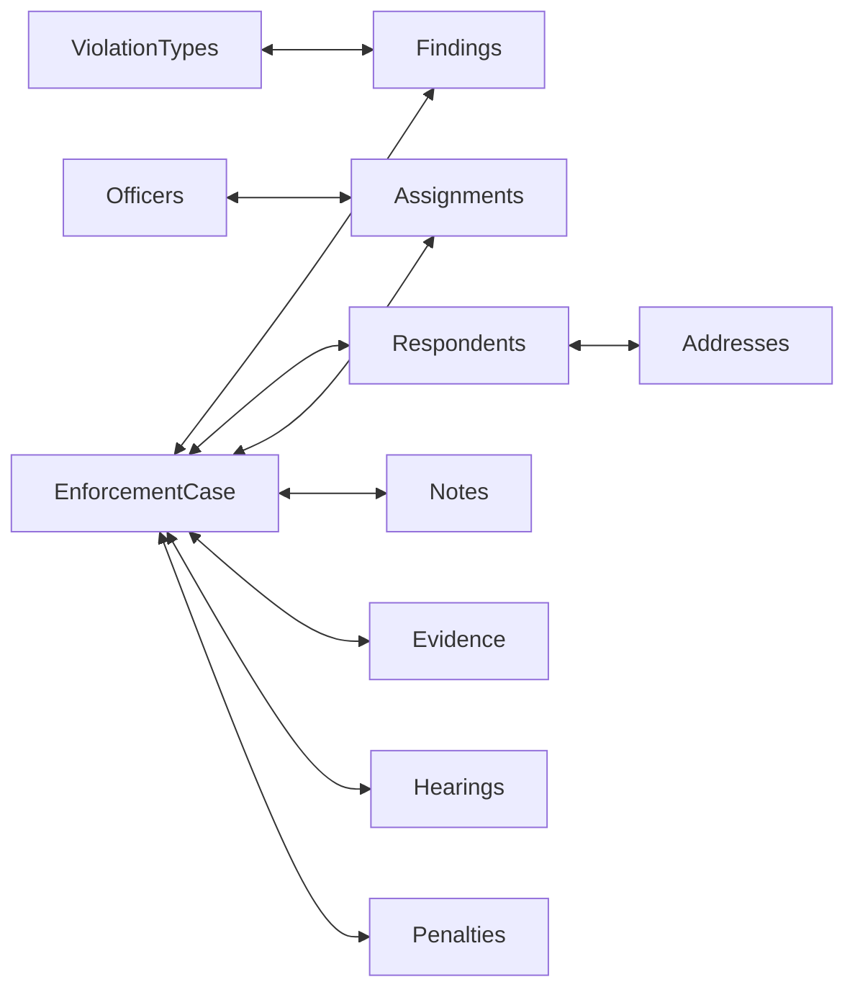
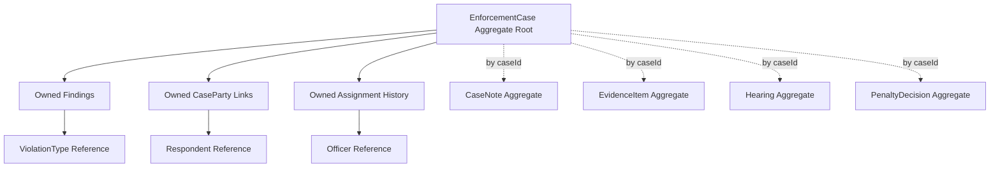
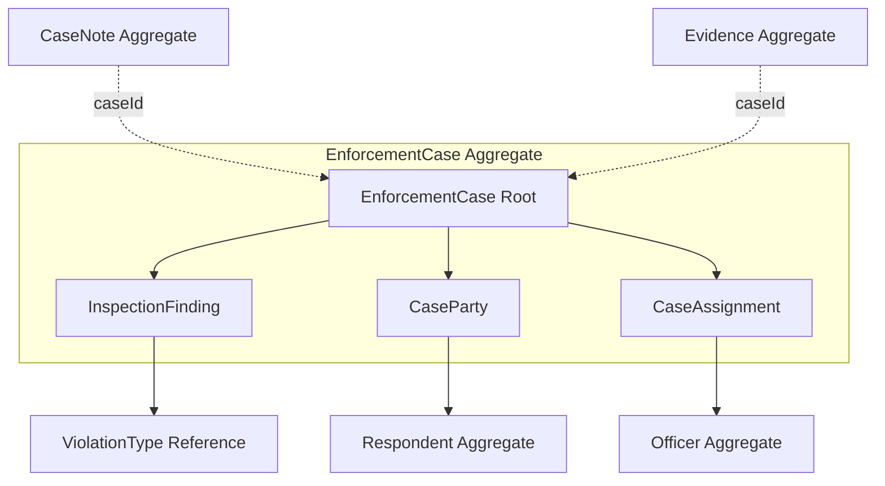
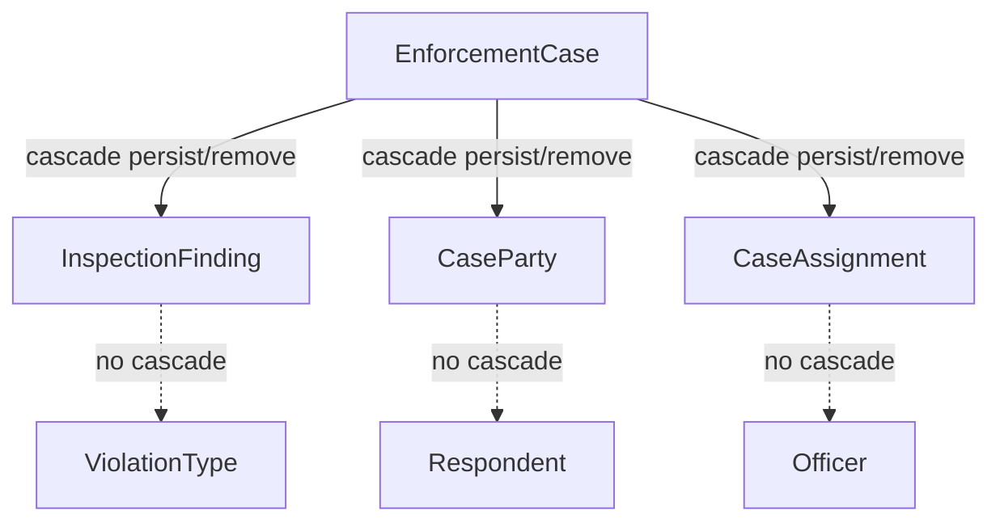
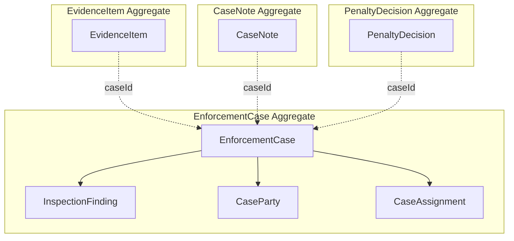
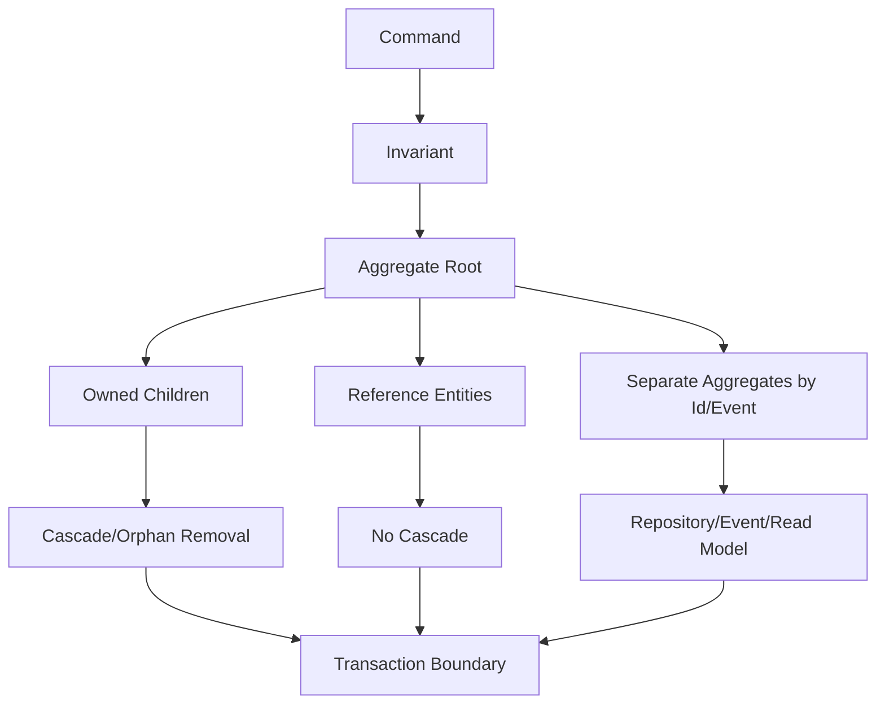

------
title: Learn Java Persistence, Database Integration, JPA, Hibernate ORM & EclipseLink - Part 010
description: Aggregate boundaries dan object graph design untuk persistence model: root, child entity, reference entity, cascade boundary, transactional consistency, graph explosion, dan command-oriented modelling.
series: learn-java-persistence
seriesTitle: Learn Java Persistence, Database Integration, JPA, Hibernate ORM & EclipseLink
order: 10
partTitle: Aggregate Boundaries and Object Graph Design
tags:
- java
- persistence
- jpa
- jakarta-persistence
- hibernate
- eclipselink
- orm
- aggregate
- ddd
- object-graph
- transactional-boundary
- series
date: 2026-06-27
---

# Aggregate Boundaries and Object Graph Design

> Target part ini: kamu mampu membedakan association graph dari aggregate boundary, menentukan root dan child entity, membatasi cascade secara aman, menghindari object graph raksasa, dan mendesain persistence model yang selaras dengan transactional consistency.

Part sebelumnya membahas association modelling. Tetapi association bukan aggregate.

Ini salah satu kesalahan paling mahal dalam sistem enterprise:

> “Karena entity A berelasi dengan B, maka A harus punya field B, B harus punya field A, dan semua harus cascade.”

Itu bukan desain domain. Itu graph sprawl.

Di production, object graph yang terlalu luas menyebabkan:

- accidental lazy loading;
- N+1 query;
- transaction terlalu besar;
- memory pressure;
- cascade berbahaya;
- dirty checking mahal;
- delete tak terduga;
- conflict optimistic locking meningkat;
- API overexposure;
- sulit testing;
- domain invariant tersebar;
- incident saat satu operasi kecil menyentuh banyak table.

Aggregate boundary adalah cara untuk membatasi semua itu.

---

## 1. Kaufman Framing

### 1.1 Deconstruct the Skill

Menguasai aggregate boundary berarti mampu:

1. membedakan entity, value object, aggregate root, child entity, dan reference entity;
2. menentukan consistency boundary berdasarkan invariant, bukan berdasarkan ERD;
3. membatasi object graph agar sesuai command use case;
4. menempatkan cascade hanya di dalam lifecycle boundary;
5. membuat mutation method di root, bukan membiarkan child dimodifikasi bebas;
6. menghindari collection besar di root;
7. memisahkan write model dan read model ketika diperlukan;
8. memakai id reference daripada entity association saat boundary harus longgar;
9. memahami efek boundary terhadap transaction, locking, cache, dan fetch plan;
10. membuat checklist architecture review untuk persistence model.

### 1.2 Learn Enough to Self-Correct

Untuk setiap entity graph, tanyakan:

- Apa aggregate root-nya?
- Invariant apa yang harus dijaga atomically?
- Entity mana yang tidak boleh diubah tanpa root?
- Entity mana yang hanya reference/shared?
- Relasi mana yang harus cascade?
- Relasi mana yang hanya lookup?
- Collection mana yang bisa tumbuh tanpa batas?
- Mutation mana yang harus command-specific?
- Apakah satu transaction menyentuh terlalu banyak aggregate?
- Apakah read API memaksa write aggregate menjadi terlalu besar?
- Apakah entity association dipakai untuk menggantikan query?
- Apakah object graph ini bisa dijelaskan tanpa membuka seluruh ERD?

### 1.3 Practice Deliberately

Latihan part ini: desain ulang model enforcement case.

Naive graph:



Aggregate-oriented design:



Perbedaannya bukan kosmetik. Yang kedua membuat boundary write, lock, fetch, dan lifecycle lebih terkendali.

---

## 2. Aggregate Is a Consistency Boundary

Aggregate bukan sekadar “parent dengan children”. Aggregate adalah boundary di mana invariant harus dijaga konsisten dalam satu transaction.

Contoh invariant:

- satu case hanya boleh punya satu primary respondent aktif;
- finding tidak boleh dibuat untuk case yang sudah closed;
- assignment officer tidak boleh overlap untuk role yang sama;
- recommended penalty harus didasarkan pada finding yang masih active;
- finding tidak boleh mengacu ke violation type yang inactive;
- case tidak boleh closed jika mandatory review belum selesai.

Jika invariant harus dijaga atomically bersama beberapa object, object itu mungkin berada dalam aggregate yang sama.

Jika object hanya perlu direferensikan, tidak harus satu aggregate.

### 2.1 Aggregate Root

Aggregate root adalah satu-satunya entry point mutation aggregate.

```java
caseFile.addFinding(...);
caseFile.assignOfficer(...);
caseFile.addPrimaryRespondent(...);
caseFile.close(...);
```

Bukan:

```java
finding.setCaseFile(caseFile);
assignment.setRole(role);
caseFile.getParties().add(party);
```

Root menjaga invariant. Collection getter mentah biasanya membocorkan boundary.

### 2.2 Child Entity

Child entity punya identity, tetapi lifecycle-nya berada di bawah root.

Contoh:

- `InspectionFinding` punya id karena perlu direferensikan, diubah, diaudit, dan mungkin punya child sendiri;
- tetapi finding tidak bermakna tanpa case;
- finding tidak boleh dipindahkan bebas ke case lain;
- finding dibuat/dihapus melalui `EnforcementCase`.

### 2.3 Value Object

Value object tidak punya identity sendiri dan diganti sebagai satu kesatuan.

Contoh:

```java
@Embedded
private Money recommendedPenalty;

@Embedded
private EffectivePeriod effectivePeriod;
```

### 2.4 Reference Entity

Reference entity punya lifecycle sendiri dan tidak dimiliki aggregate.

Contoh:

- `ViolationType`;
- `Respondent`;
- `Officer`;
- `RegulatoryRegion`;
- `LegalInstrument`.

Reference entity biasanya tidak di-cascade dari aggregate yang menggunakannya.

```java
@ManyToOne(fetch = FetchType.LAZY, optional = false)
@JoinColumn(name = "violation_type_code", nullable = false)
private ViolationType violationType;
```

No cascade.

---

## 3. Association Graph vs Aggregate Boundary

ERD bisa menunjukkan ratusan relationship. Aggregate boundary memilih subset yang boleh dimutasi bersama.



Arti diagram:

- `InspectionFinding`, `CaseParty`, `CaseAssignment` dimiliki root `EnforcementCase`;
- `Respondent`, `Officer`, `ViolationType` direferensikan, bukan dimiliki;
- `CaseNote` dan `EvidenceItem` mungkin punya aggregate sendiri, hanya menyimpan `caseId` atau `ManyToOne` tanpa cascade.

### 3.1 Why Not Put Everything Under Case?

Karena case adalah pusat domain. Hampir semua entity punya hubungan dengan case. Jika semua dimasukkan ke aggregate `EnforcementCase`, maka case berubah menjadi monster.

Gejala monster aggregate:

- class root punya puluhan collection;
- setiap endpoint detail case rawan load besar;
- setiap update case menyentuh graph luas;
- optimistic lock conflict tinggi;
- cascade sulit dipahami;
- test fixture sangat besar;
- developer takut mengubah mapping;
- query performance tidak bisa diprediksi.

Aggregate bukan “semua yang berhubungan”. Aggregate adalah “semua yang harus konsisten bersama”.

---

## 4. Designing Aggregate Boundaries

### 4.1 Start from Commands, Not Tables

Jangan mulai dari ERD. Mulai dari command.

Contoh command:

- `OpenCase`;
- `AddFinding`;
- `ClassifyFinding`;
- `AddRespondentToCase`;
- `AssignOfficer`;
- `CloseCase`;
- `AddCaseNote`;
- `UploadEvidence`;
- `ScheduleHearing`;
- `IssuePenaltyDecision`.

Untuk setiap command, jawab:

- aggregate root apa yang di-load?
- object apa yang perlu dimutasi?
- invariant apa yang dicek?
- data referensi apa yang hanya dibaca?
- apakah butuh transaction lintas aggregate?

### 4.2 Command Matrix

| Command | Root | Owned Mutation | Reference Read | Separate Aggregate? |
|---|---|---|---|---|
| `OpenCase` | `EnforcementCase` | initial parties/assignments | respondent/officer | no |
| `AddFinding` | `EnforcementCase` | `InspectionFinding` | violation type | no |
| `AssignOfficer` | `EnforcementCase` | `CaseAssignment` | officer | no |
| `AddCaseNote` | `CaseNote` or `EnforcementCase` | note row | case status | often separate |
| `UploadEvidence` | `EvidenceItem` | evidence metadata | case status | often separate |
| `ScheduleHearing` | `Hearing` | hearing schedule | case status/officer | often separate |
| `IssuePenaltyDecision` | `PenaltyDecision` | penalty decision | case findings | often separate or process-controlled |

Insight:

- Not every operation about a case must load `EnforcementCase` aggregate with all children.
- Some operations only need `caseId` plus validation that case exists/status allows operation.
- Some operations need a separate aggregate with eventual consistency or domain event.

---

## 5. Persistence Mapping for Aggregate Root

### 5.1 Root Owns Small, Invariant-Relevant Children

```java
@Entity
@Table(name = "enforcement_case")
public class EnforcementCase {

    @Id
    private UUID id;

    @Version
    private long version;

    @Column(name = "case_number", nullable = false, unique = true, length = 64)
    private String caseNumber;

    @Enumerated(EnumType.STRING)
    @Column(name = "status", nullable = false, length = 32)
    private CaseStatus status;

    @OneToMany(mappedBy = "caseFile", cascade = CascadeType.ALL, orphanRemoval = true)
    private final List<InspectionFinding> findings = new ArrayList<>();

    @OneToMany(mappedBy = "caseFile", cascade = CascadeType.ALL, orphanRemoval = true)
    private final Set<CaseParty> parties = new HashSet<>();

    @OneToMany(mappedBy = "caseFile", cascade = CascadeType.ALL, orphanRemoval = true)
    private final List<CaseAssignment> assignments = new ArrayList<>();

    protected EnforcementCase() {
    }

    public void addFinding(UUID findingId, ViolationType violationType, String summary) {
        requireOpenForModification();
        InspectionFinding finding = new InspectionFinding(findingId, violationType, summary);
        findings.add(finding);
        finding.assignTo(this);
    }

    public void addPrimaryRespondent(UUID partyId, Respondent respondent, EffectivePeriod period) {
        requireOpenForModification();
        ensureNoActivePrimaryRespondent(period);

        CaseParty party = CaseParty.primaryRespondent(partyId, respondent, period);
        parties.add(party);
        party.assignTo(this);
    }

    public void assignOfficer(UUID assignmentId, Officer officer, AssignmentRole role, EffectivePeriod period) {
        requireOpenForModification();
        ensureNoOverlappingAssignment(role, period);

        CaseAssignment assignment = new CaseAssignment(assignmentId, officer, role, period);
        assignments.add(assignment);
        assignment.assignTo(this);
    }

    public void close(CaseClosureReason reason) {
        if (findings.isEmpty()) {
            throw new IllegalStateException("Cannot close case without findings");
        }
        if (!hasActivePrimaryRespondent()) {
            throw new IllegalStateException("Cannot close case without active primary respondent");
        }
        this.status = CaseStatus.CLOSED;
    }

    private void requireOpenForModification() {
        if (status == CaseStatus.CLOSED) {
            throw new IllegalStateException("Closed case cannot be modified");
        }
    }
}
```

Perhatikan:

- mutation lewat method root;
- collection tidak diekspos mutable;
- invariant berada dekat dengan data yang dijaga;
- owned child memakai cascade dan orphan removal;
- reference entity seperti `Respondent`, `Officer`, `ViolationType` tidak dimiliki.

### 5.2 Expose Read-Only Views

Hindari getter mutable:

```java
public List<InspectionFinding> getFindings() {
    return findings;
}
```

Lebih aman:

```java
public List<InspectionFinding> findings() {
    return Collections.unmodifiableList(findings);
}
```

Atau expose projection domain:

```java
public int findingCount() {
    return findings.size();
}

public boolean hasFindingFor(ViolationTypeCode code) {
    return findings.stream().anyMatch(f -> f.hasViolationType(code));
}
```

### 5.3 Do Not Expose Child Setters Publicly

Child entity tidak boleh punya public setter yang melewati root invariant.

Buruk:

```java
finding.setViolationType(type);
finding.setSeverity(severity);
finding.setCaseFile(otherCase);
```

Lebih baik:

```java
caseFile.reclassifyFinding(findingId, newType, reason);
```

Root mengontrol apakah reclassification diizinkan.

---

## 6. Cascade Boundary

Cascade harus mengikuti lifecycle boundary.



### 6.1 Good Cascade

```java
@OneToMany(mappedBy = "caseFile", cascade = CascadeType.ALL, orphanRemoval = true)
private List<InspectionFinding> findings = new ArrayList<>();
```

Finding is owned.

### 6.2 Bad Cascade

```java
@ManyToOne(cascade = CascadeType.ALL)
private Officer officer;
```

Officer is shared/reference.

### 6.3 Cascade Decision Table

| Target Entity | Owned by Root? | Shared? | Cascade Persist? | Cascade Remove? | Orphan Removal? |
|---|---:|---:|---:|---:|---:|
| `InspectionFinding` | yes | no | yes | yes | yes |
| `CaseParty` | yes | no | yes | yes | yes |
| `CaseAssignment` | yes | no | yes | yes | yes |
| `Respondent` | no | yes | no | no | no |
| `Officer` | no | yes | no | no | no |
| `ViolationType` | no | yes | no | no | no |
| `CaseNote` | maybe separate | no/shared by caseId | usually no from case | no from case | no |
| `EvidenceItem` | often separate | no/shared by caseId | no from case | no from case | no |

---

## 7. Object Graph Explosion

Object graph explosion terjadi ketika satu root membuka terlalu banyak relasi.

### 7.1 Example

```java
@Entity
class EnforcementCase {

    @OneToMany(mappedBy = "caseFile")
    private List<InspectionFinding> findings;

    @OneToMany(mappedBy = "caseFile")
    private List<CaseNote> notes;

    @OneToMany(mappedBy = "caseFile")
    private List<EvidenceItem> evidenceItems;

    @OneToMany(mappedBy = "caseFile")
    private List<Hearing> hearings;

    @OneToMany(mappedBy = "caseFile")
    private List<PenaltyDecision> penaltyDecisions;

    @OneToMany(mappedBy = "caseFile")
    private List<AuditEvent> auditEvents;
}
```

Ini tampak lengkap, tetapi sulit dikendalikan.

### 7.2 Failure Modes

- Fetch detail case tanpa sengaja load notes/evidence/audit.
- JSON serializer menyentuh lazy collection.
- Debugger memanggil `toString` dan memicu load.
- Dirty checking memeriksa collection besar.
- Remove case punya delete cascade ambigu.
- Optimistic lock conflict meningkat karena banyak command update root.

### 7.3 Better Boundary

```java
@Entity
class EnforcementCase {

    @OneToMany(mappedBy = "caseFile", cascade = CascadeType.ALL, orphanRemoval = true)
    private List<InspectionFinding> findings;

    @OneToMany(mappedBy = "caseFile", cascade = CascadeType.ALL, orphanRemoval = true)
    private Set<CaseParty> parties;

    @OneToMany(mappedBy = "caseFile", cascade = CascadeType.ALL, orphanRemoval = true)
    private List<CaseAssignment> assignments;
}
```

Separate aggregate:

```java
@Entity
@Table(name = "case_note")
class CaseNote {

    @Id
    private UUID id;

    @Column(name = "case_id", nullable = false)
    private UUID caseId;

    @Column(name = "body", nullable = false, length = 4000)
    private String body;
}
```

Atau `ManyToOne` tanpa cascade jika navigation penting:

```java
@ManyToOne(fetch = FetchType.LAZY, optional = false)
@JoinColumn(name = "case_id", nullable = false)
private EnforcementCase caseFile;
```

Tapi jangan jadikan `caseFile.getNotes()` sebagai collection root jika notes besar dan paginated.

---

## 8. Reference by Entity vs Reference by Id

Tidak semua relasi database harus object association.

### 8.1 Entity Association

```java
@ManyToOne(fetch = FetchType.LAZY, optional = false)
@JoinColumn(name = "case_id", nullable = false)
private EnforcementCase caseFile;
```

Kelebihan:

- referential integrity natural;
- query JPQL path lebih ekspresif;
- provider bisa join/fetch;
- object navigation tersedia.

Kekurangan:

- lazy/proxy complexity;
- potential graph loading;
- serialization risk;
- persistence context coupling.

### 8.2 Id Reference

```java
@Column(name = "case_id", nullable = false)
private UUID caseId;
```

Kelebihan:

- boundary lebih tegas;
- tidak ada accidental graph navigation;
- cocok untuk separate aggregate;
- cocok untuk event/outbox/read model;
- mudah untuk write-heavy append-only data.

Kekurangan:

- JPQL relationship path hilang;
- referential integrity harus tetap dibuat di migration jika database sama;
- application harus eksplisit load data terkait jika perlu.

### 8.3 Decision Rule

Gunakan entity association jika:

- object navigation adalah bagian dari invariant/mutation;
- lifecycle terkait;
- relation sering di-join dalam write model;
- aggregate boundary memang dekat.

Gunakan id reference jika:

- target adalah aggregate lain;
- relasi hanya untuk correlation;
- collection target besar;
- operasi append-only;
- service boundary berbeda;
- ingin mencegah graph traversal.

---

## 9. Transaction Boundary

Aggregate boundary seharusnya mendekati transaction boundary.

```java
@Transactional
public void addFinding(AddFindingCommand command) {
    EnforcementCase caseFile = caseRepository.getForUpdate(command.caseId());
    ViolationType violationType = violationTypeRepository.getActive(command.violationTypeCode());

    caseFile.addFinding(
        command.findingId(),
        violationType,
        command.summary()
    );
}
```

Satu transaction:

- load root;
- load reference data;
- mutate root-owned child;
- flush.

Tidak perlu load notes, evidence, hearings, audit events.

### 9.1 Cross-Aggregate Transaction Smell

```java
@Transactional
public void closeCaseAndDeactivateRespondent(UUID caseId, UUID respondentId) {
    EnforcementCase caseFile = caseRepository.get(caseId);
    Respondent respondent = respondentRepository.get(respondentId);

    caseFile.close(...);
    respondent.deactivate(...);
}
```

Mungkin valid, tetapi perlu dipertanyakan:

- Apakah ini satu invariant kuat?
- Apakah respondent lifecycle benar-benar tergantung case?
- Apa dampaknya ke case lain?
- Apakah butuh domain event/process manager?

### 9.2 Domain Event Alternative

```java
caseFile.close(reason);
domainEvents.publish(new CaseClosed(caseFile.id(), reason));
```

Consumer lain:

```java
@EventListener
void on(CaseClosed event) {
    penaltyWorkflow.startClosureReview(event.caseId());
}
```

Untuk reliability, event sering dipersist dengan outbox pattern. Detail outbox akan dibahas di part domain-driven persistence patterns.

---

## 10. Optimistic Locking and Aggregate Size

Jika root punya `@Version`, setiap update root meningkatkan version.

```java
@Version
private long version;
```

Ini baik untuk consistency. Tetapi jika semua command update root yang sama, conflict naik.

Contoh:

- officer A menambahkan note;
- officer B mengupload evidence;
- officer C mengubah assignment;
- officer D menambah finding.

Jika note/evidence/finding semuanya dianggap bagian dari root yang sama dan selalu update `EnforcementCase`, conflict bisa tinggi.

### 10.1 Boundary Reduces Conflicts

Pisahkan append-heavy operations:

- `CaseNote` aggregate sendiri;
- `EvidenceItem` aggregate sendiri;
- `AuditEvent` append-only;
- `EnforcementCase` root untuk invariant inti.

### 10.2 Child Updates and Versioning

Provider behavior untuk apakah perubahan child meningkatkan version parent bisa bergantung mapping dan konfigurasi. Jangan asumsikan. Jika business rule mengharuskan parent version naik saat child berubah, desain eksplisit:

- update field parent seperti `lastModifiedAt`;
- gunakan optimistic lock mode yang sesuai;
- atau letakkan version pada child aggregate;
- atau desain command agar conflict yang dibutuhkan memang terjadi.

Ingat: optimistic locking adalah concurrency contract. Bukan dekorasi.

---

## 11. Fetch Plan Boundary

Aggregate boundary tidak berarti selalu fetch seluruh aggregate.

Misalnya `EnforcementCase` punya findings, parties, assignments. Tapi use case berbeda butuh subset berbeda.

### 11.1 Command Fetch

Untuk `AddFinding`, mungkin cukup load case saja dan reference violation type.

```java
select c
from EnforcementCase c
where c.id = :caseId
```

Jika invariant butuh existing findings:

```java
select c
from EnforcementCase c
left join fetch c.findings
where c.id = :caseId
```

### 11.2 Read Fetch

Untuk case detail page:

```java
select new com.acme.caseapp.CaseDetailView(
    c.id,
    c.caseNumber,
    c.status
)
from EnforcementCase c
where c.id = :caseId
```

Lalu findings/notes/evidence dipaging terpisah.

### 11.3 Avoid Fetch All by Default

Buruk:

```java
@OneToMany(fetch = FetchType.EAGER)
private List<InspectionFinding> findings;
```

Aggregate boundary bukan alasan untuk eager fetch.

Rule:

> Aggregate defines mutation consistency. Fetch plan defines data access shape.

---

## 12. Read Model vs Write Model

JPA entity sering dipakai untuk dua hal:

- write model: menjaga invariant dan mutation;
- read model: melayani tampilan/query/report.

Jika kebutuhan read kompleks, jangan paksa write aggregate menjadi read model raksasa.

### 12.1 Write Model

```java
caseFile.addFinding(...);
caseFile.assignOfficer(...);
caseFile.close(...);
```

Fokus:

- invariant;
- lifecycle;
- transaction;
- consistency;
- mutation safety.

### 12.2 Read Model

```java
public record CaseDashboardRow(
    UUID caseId,
    String caseNumber,
    String status,
    long findingCount,
    long noteCount,
    String primaryRespondentName,
    String assignedOfficerEmail
) {}
```

Query:

```java
select new com.acme.caseapp.CaseDashboardRow(
    c.id,
    c.caseNumber,
    c.status,
    count(distinct f.id),
    count(distinct n.id),
    r.legalName,
    o.email
)
from EnforcementCase c
left join c.findings f
left join CaseNote n on n.caseId = c.id
left join c.parties p
left join p.respondent r
left join c.assignments a
left join a.officer o
where c.status = :status
group by c.id, c.caseNumber, c.status, r.legalName, o.email
```

Atau gunakan database view/materialized view/read table jika lebih cocok.

### 12.3 Why This Matters

Jika read model memaksa entity mapping:

- semua dashboard field dimasukkan ke root;
- association ditambah hanya untuk display;
- fetch menjadi tidak terkendali;
- aggregate boundary kabur;
- write transaction membayar biaya read model.

Pisahkan saat kompleksitas menuntut.

---

## 13. Boundary Patterns

### 13.1 Root-Owned Children

Gunakan ketika child tidak hidup tanpa root.

```java
@OneToMany(mappedBy = "caseFile", cascade = CascadeType.ALL, orphanRemoval = true)
private List<InspectionFinding> findings;
```

### 13.2 Association Entity

Gunakan ketika relasi punya atribut.

```java
class CaseParty {
    private EnforcementCase caseFile;
    private Respondent respondent;
    private CasePartyRole role;
    private EffectivePeriod effectivePeriod;
}
```

### 13.3 Id Reference to Other Aggregate

Gunakan untuk separate aggregate.

```java
class EvidenceItem {
    private UUID caseId;
    private StorageObjectKey objectKey;
}
```

### 13.4 Reference Data Association

Gunakan to-one lazy no cascade.

```java
@ManyToOne(fetch = FetchType.LAZY, optional = false)
private ViolationType violationType;
```

### 13.5 Domain Service for Cross-Aggregate Rule

Jika rule butuh beberapa aggregate tetapi tidak ada satu root natural:

```java
public class CaseClosureService {

    public void closeCase(UUID caseId) {
        EnforcementCase caseFile = caseRepository.get(caseId);
        ReviewStatus reviewStatus = reviewRepository.statusFor(caseId);
        PenaltyStatus penaltyStatus = penaltyRepository.statusFor(caseId);

        caseFile.closeIfAllowed(reviewStatus, penaltyStatus);
    }
}
```

Hati-hati: domain service bukan tempat membuang semua logic. Ia orchestration untuk rule lintas boundary.

---

## 14. Anti-Patterns

### 14.1 Aggregate Root as Database Row Owner for Everything

```java
class EnforcementCase {
    private List<CaseNote> notes;
    private List<EvidenceItem> evidence;
    private List<AuditEvent> auditEvents;
    private List<Hearing> hearings;
    private List<Document> documents;
}
```

Jika root memiliki semua collection karena “semuanya punya case_id”, boundary sudah hilang.

### 14.2 Public Mutable Collections

```java
caseFile.getFindings().clear();
```

Ini melewati invariant.

### 14.3 Setter-Driven Domain

```java
caseFile.setStatus(CLOSED);
caseFile.setClosedAt(now);
caseFile.setClosureReason(reason);
```

Lebih baik:

```java
caseFile.close(reason, now);
```

### 14.4 Cascade Across Aggregates

```java
@OneToMany(cascade = CascadeType.ALL)
private List<EvidenceItem> evidenceItems;
```

Jika evidence lifecycle, storage lifecycle, permission, dan audit berbeda, jangan cascade dari case.

### 14.5 Read Requirement Pollutes Write Aggregate

Menambahkan association hanya agar dashboard mudah dibuat adalah desain yang buruk.

### 14.6 One Transaction to Rule Them All

Transaction besar terlihat konsisten, tetapi bisa memperbesar lock duration, conflict, deadlock risk, dan blast radius.

---

## 15. Regulatory Case Study

### 15.1 Requirement

Sistem harus mendukung:

1. membuat case;
2. menambah finding;
3. menambah respondent;
4. assign officer;
5. upload evidence;
6. add case notes;
7. close case;
8. issue penalty decision.

### 15.2 Naive Model

```java
@Entity
class EnforcementCase {
    @OneToMany(cascade = CascadeType.ALL)
    private List<InspectionFinding> findings;

    @ManyToMany(cascade = CascadeType.ALL)
    private Set<Respondent> respondents;

    @OneToMany(cascade = CascadeType.ALL)
    private List<EvidenceItem> evidence;

    @OneToMany(cascade = CascadeType.ALL)
    private List<CaseNote> notes;

    @OneToMany(cascade = CascadeType.ALL)
    private List<PenaltyDecision> penalties;
}
```

Problems:

- `Respondent` is shared but cascaded;
- evidence might have external storage lifecycle;
- notes can grow indefinitely;
- penalty decision may require approval workflow;
- many-to-many cannot store respondent role;
- root becomes overloaded;
- fetch plan unpredictable.

### 15.3 Improved Boundary



### 15.4 Command Implementations

#### Add Finding

```java
@Transactional
public void addFinding(AddFindingCommand command) {
    EnforcementCase caseFile = caseRepository.get(command.caseId());
    ViolationType violationType = violationTypeRepository.getActive(command.violationTypeCode());

    caseFile.addFinding(
        command.findingId(),
        violationType,
        command.summary()
    );
}
```

#### Add Note

```java
@Transactional
public void addNote(AddCaseNoteCommand command) {
    CaseStatus status = caseRepository.getStatus(command.caseId());
    if (status == CaseStatus.CLOSED && !command.isPostClosureAllowed()) {
        throw new IllegalStateException("Cannot add this note type to a closed case");
    }

    CaseNote note = CaseNote.create(
        command.noteId(),
        command.caseId(),
        command.authorId(),
        command.body()
    );

    caseNoteRepository.save(note);
}
```

No need to load full `EnforcementCase` aggregate.

#### Upload Evidence

```java
@Transactional
public void registerEvidence(RegisterEvidenceCommand command) {
    caseRepository.ensureAcceptsEvidence(command.caseId());

    EvidenceItem item = EvidenceItem.register(
        command.evidenceId(),
        command.caseId(),
        command.storageKey(),
        command.classification()
    );

    evidenceRepository.save(item);
}
```

Evidence storage lifecycle might involve object storage and malware scan. It should not be a simple cascaded child unless domain truly demands it.

---

## 16. Database Constraint Alignment

Aggregate boundary does not replace database constraints.

### 16.1 Owned Child FK

```sql
alter table inspection_finding
    add constraint fk_finding_case
    foreign key (case_id)
    references enforcement_case(id);

create index ix_finding_case_id
    on inspection_finding(case_id);
```

### 16.2 One Active Primary Respondent

This may need partial unique index depending on database:

```sql
create unique index uk_case_one_active_primary_respondent
    on case_party(case_id)
    where party_role = 'PRIMARY_RESPONDENT'
      and effective_to is null;
```

JPA annotations may not express every production-grade constraint portably. Use migrations.

### 16.3 Assignment Overlap

Temporal overlap constraints may require:

- exclusion constraint in PostgreSQL;
- trigger;
- application-level check with locking;
- serialized command processing;
- custom validation table.

Do not pretend an annotation can solve all invariants.

---

## 17. Testing Aggregate Boundaries

### 17.1 Persistence Behavior Test

Test that owned child cascades:

```java
@Test
void persistsOwnedFindingWithCase() {
    EnforcementCase caseFile = new EnforcementCase(caseId, "CASE-2026-0001");
    ViolationType type = entityManager.getReference(ViolationType.class, "AML_REPORTING");

    caseFile.addFinding(findingId, type, "Late suspicious activity report");

    entityManager.persist(caseFile);
    entityManager.flush();
    entityManager.clear();

    EnforcementCase loaded = entityManager.find(EnforcementCase.class, caseId);
    assertThat(loaded.findings()).hasSize(1);
}
```

### 17.2 Orphan Removal Test

```java
@Test
void removingFindingDeletesOwnedRow() {
    EnforcementCase caseFile = fixtures.caseWithFinding();
    UUID findingId = caseFile.findings().getFirst().id();

    caseFile.removeFinding(findingId);

    entityManager.flush();
    entityManager.clear();

    InspectionFinding deleted = entityManager.find(InspectionFinding.class, findingId);
    assertThat(deleted).isNull();
}
```

### 17.3 Boundary Test

Test that deleting case does not delete shared respondent/reference data:

```java
@Test
void deletingCaseDoesNotDeleteRespondent() {
    EnforcementCase caseFile = fixtures.caseWithRespondent();
    UUID respondentId = fixtures.respondentId();

    entityManager.remove(caseFile);
    entityManager.flush();
    entityManager.clear();

    Respondent respondent = entityManager.find(Respondent.class, respondentId);
    assertThat(respondent).isNotNull();
}
```

### 17.4 SQL Shape Test

Enable SQL logging/statistics and assert:

- command loads only required aggregate parts;
- no unexpected eager collection;
- no cascade delete to shared entity;
- no join explosion;
- no N+1 in critical path.

---

## 18. Architecture Review Checklist

### Aggregate Boundary

- Apa root-nya?
- Invariant apa yang dijaga root?
- Child mana yang benar-benar owned?
- Entity mana yang shared/reference?
- Collection mana yang bisa tumbuh besar?
- Operation mana yang append-only?
- Apakah read model memengaruhi write aggregate?

### Mapping

- Cascade hanya di dalam aggregate?
- Orphan removal hanya untuk owned child?
- To-one reference no cascade?
- Large collection tidak dipasang sebagai eager?
- Association entity dipakai untuk rich relation?
- Id reference dipakai saat boundary lebih tepat?

### Transaction

- Satu command load berapa aggregate?
- Apakah transaction terlalu besar?
- Apakah optimistic lock conflict wajar?
- Apakah cross-aggregate invariant butuh process manager/event?
- Apakah retry strategy dibutuhkan?

### Database

- Constraint invariant penting ada di database jika memungkinkan?
- FK dan index selaras dengan boundary?
- Unique/partial/exclusion constraint dipakai jika perlu?
- Migration tidak bergantung pada generated DDL?

### Runtime

- Fetch plan eksplisit per use case?
- SQL sudah diamati?
- Serialization tidak menyentuh entity graph langsung?
- Monitoring bisa mendeteksi query explosion?
- Test fixture tidak memaksa graph besar untuk operasi kecil?

---

## 19. Deliberate Practice Plan

### Practice 1: Draw Existing Graph

Ambil modul persistence nyata. Gambar semua entity association.

Tandai:

- owned child;
- reference entity;
- separate aggregate;
- read-only relation;
- collection besar;
- cascade boundary;
- suspicious many-to-many.

### Practice 2: Command-Based Boundary

Pilih lima command write. Untuk setiap command, tulis:

```text
Command:
Root loaded:
Children mutated:
References read:
Invariants checked:
Expected SQL count:
Expected locks/version changes:
```

### Practice 3: Cascade Audit

Cari semua `cascade = CascadeType.ALL`. Klasifikasikan:

- safe owned child;
- suspicious shared entity;
- unnecessary cascade merge;
- dangerous cascade remove.

### Practice 4: Large Collection Removal

Cari collection yang bisa lebih dari 100 row. Pertanyakan apakah collection harus ada di root. Jika tidak, ganti dengan paginated repository query.

### Practice 5: Read Model Extraction

Ambil endpoint dashboard/detail page. Jika endpoint memaksa fetch graph besar, buat projection query atau read model terpisah.

---

## 20. Mental Model Summary

Aggregate boundary adalah cara mengendalikan persistence complexity.



Pegang invariant berikut:

1. Association graph bukan aggregate boundary.
2. Aggregate adalah transactional consistency boundary.
3. Root mengontrol mutation child.
4. Cascade mengikuti lifecycle ownership, bukan convenience.
5. Reference entity tidak dihapus oleh aggregate yang memakai reference itu.
6. Collection besar sering lebih cocok query/pagination daripada root field.
7. Entity association bukan solusi untuk semua relationship.
8. Id reference adalah alat boundary, bukan anti-pattern otomatis.
9. Read model tidak harus sama dengan write aggregate.
10. Database constraint tetap diperlukan untuk invariant yang bisa diekspresikan di database.

Jika kamu bisa melihat ERD lalu memotongnya menjadi aggregate boundary, command boundary, fetch boundary, dan transaction boundary, kamu mulai mendekati level engineer yang mampu menjaga persistence model tetap sehat bertahun-tahun.

---

## 21. References

- Jakarta Persistence 3.2 Specification, sections on entity relationships, cascades, lifecycle, versioning, and mapping metadata.
- Jakarta Persistence 3.2 API documentation for relationship annotations and lifecycle/cascade semantics.
- Hibernate ORM User Guide, chapters on associations, collections, cascading, fetching, and optimistic locking.
- EclipseLink documentation for provider behavior, weaving, shared cache, and Jakarta Persistence compatibility.
- Domain-Driven Design aggregate modelling literature, applied here only as architectural modelling guidance, not as a replacement for Jakarta Persistence semantics.
