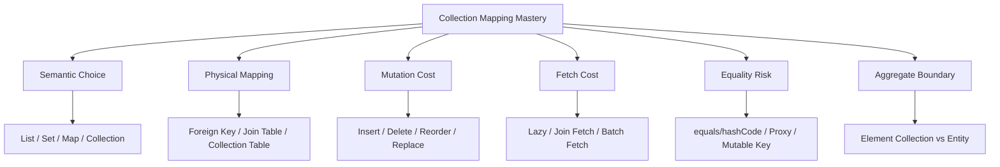
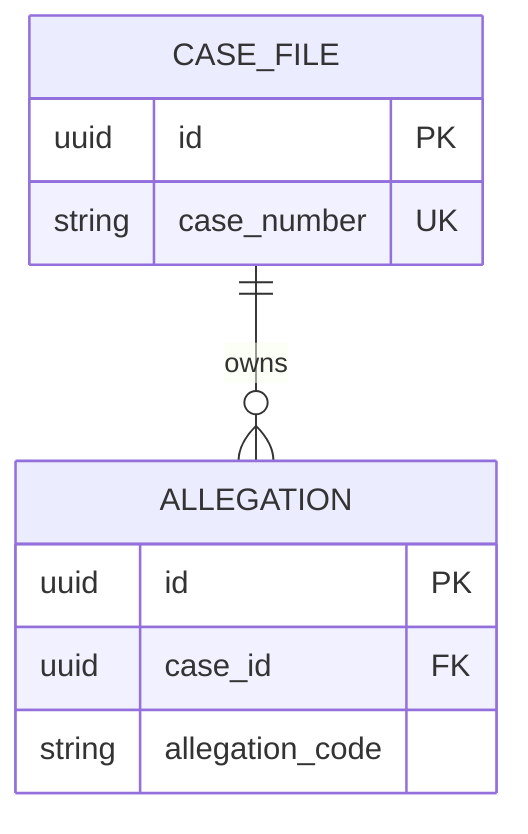
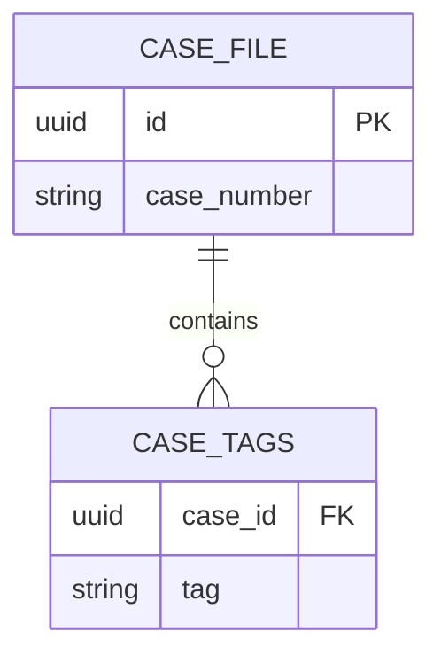
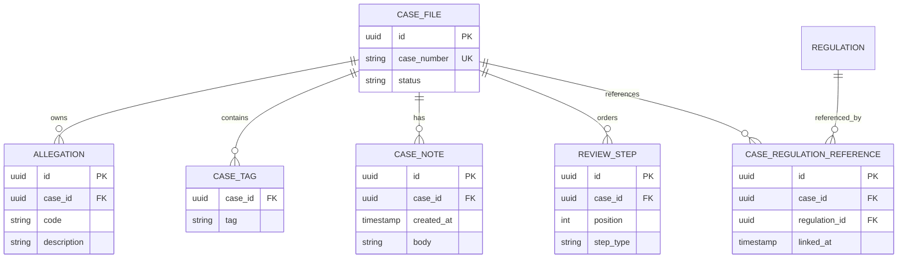

------
title: Learn Java Persistence, Database Integration, JPA, Hibernate ORM & EclipseLink - Part 011
description: Collection mapping dalam Jakarta Persistence dan Hibernate: List, Set, Map, bag semantics, ordering, element collection, mutation cost, dan review checklist untuk production-grade persistence model.
series: learn-java-persistence
seriesTitle: Learn Java Persistence, Database Integration, JPA, Hibernate ORM & EclipseLink
order: 11
partTitle: Collection Mapping: List, Set, Map, Bags, Ordering
tags:
- java
- persistence
- jpa
- jakarta-persistence
- hibernate
- eclipselink
- orm
- collection-mapping
- elementcollection
- list
- set
- map
- ordercolumn
- series
date: 2026-06-27
---

# Collection Mapping: List, Set, Map, Bags, Ordering

> Target part ini: kamu mampu memilih bentuk collection mapping berdasarkan semantic domain, bukan kebiasaan Java; memahami biaya SQL dari `List`, `Set`, `Map`, `@OrderColumn`, `@OrderBy`, `@ElementCollection`; dan mengenali kapan collection entity harus dinaikkan menjadi entity penuh.

Part sebelumnya membahas aggregate boundary. Part ini mempersempit satu area yang sering diremehkan: **collection**.

Dalam Java, collection terlihat seperti field biasa:

```java
private List<Violation> violations;
```

Dalam database, collection hampir selalu berarti **relasi antar-row**, **join table**, **foreign key**, **index column**, **map key column**, atau **collection table**.

Itu berarti keputusan `List` vs `Set` vs `Map` bukan hanya keputusan API. Itu keputusan:

- semantic domain,
- constraint database,
- flush behavior,
- dirty checking,
- duplicate handling,
- SQL mutation cost,
- fetch plan,
- locking/concurrency impact,
- dan migration risk.

Engineer biasa bertanya:

> “Pakai `List` atau `Set`?”

Engineer yang matang bertanya:

> “Domain membutuhkan urutan stabil, uniqueness, lookup by key, containment value, atau historical sequence?”

---

## 1. Kaufman Framing

Menurut pendekatan Josh Kaufman, kita tidak mulai dari hafalan annotation. Kita pecah skill menjadi sub-skill yang bisa dilatih:



Kamu akan dianggap menguasai collection mapping jika bisa menjelaskan **SQL apa yang mungkin terjadi** saat satu elemen ditambah, dihapus, diganti posisi, atau diganti key.

---

## 2. Core Mental Model

Collection dalam JPA bukan “array yang disimpan di kolom”. Collection adalah **view Java atas struktur relasional**.

Ada dua kategori besar:

```mermaid
flowchart LR
    A[JPA Collection] --> B[Association Collection]
    A --> C[Element Collection]

    B --> B1[Collection of Entities]
    B --> B2@OneToMany / ManyToMany]
    B --> B3[Target has identity]

    C --> C1[Collection of Basic/Embeddable]
    C --> C2[@ElementCollection]
    C --> C3[No independent identity]
```

### 2.1 Association collection

Association collection berisi entity lain.

Contoh:

```java
@OneToMany(mappedBy = "caseFile")
private Set<Allegation> allegations = new HashSet<>();
```

`Allegation` punya identity sendiri. Ia bisa punya lifecycle, audit, versioning, query, dan constraint sendiri.

### 2.2 Element collection

Element collection berisi basic value atau embeddable.

Contoh:

```java
@ElementCollection
@CollectionTable(
    name = "case_tags",
    joinColumns = @JoinColumn(name = "case_id")
)
@Column(name = "tag")
private Set<String> tags = new HashSet<>();
```

`String tag` tidak punya identity sendiri. Ia hidup sebagai bagian dari owner.

Jakarta Persistence mendefinisikan `@ElementCollection` sebagai collection atas basic type atau embeddable class yang dipetakan melalui collection table. `@CollectionTable` digunakan untuk menentukan tabel collection tersebut.

---

## 3. Decision Table: Jangan Mulai dari Annotation

Mulai dari pertanyaan domain.

| Kebutuhan Domain | Struktur Java | Mapping Umum | Catatan |
|---|---|---|---|
| Tidak boleh duplicate, urutan tidak penting | `Set<T>` | FK/join table/collection table | Butuh `equals/hashCode` aman |
| Urutan historis/stabil penting | `List<T>` + `@OrderColumn` | Index column | Reordering bisa mahal |
| Urutan tampilan berdasarkan atribut | `List<T>`/`Set<T>` + `@OrderBy` | SQL `ORDER BY` | Tidak menyimpan posisi |
| Lookup by key/domain code | `Map<K,V>` | `@MapKey`, `@MapKeyColumn`, `@MapKeyJoinColumn` | Key mutability berbahaya |
| Value kecil milik owner | `Set<Embeddable>`/`List<Embeddable>` | `@ElementCollection` | Jangan untuk high-churn audit |
| Child punya lifecycle/audit sendiri | `Set<Entity>` | `@OneToMany` | Biasanya entity penuh |
| Relasi many-to-many punya metadata | Association entity | Dua `@ManyToOne` | Hindari bare `@ManyToMany` |

Rule praktis:

> Pilih collection berdasarkan invariant domain, bukan berdasarkan kenyamanan coding.

---

## 4. `Collection` vs `List` vs `Set` vs `Map`

### 4.1 `Collection<T>`

`Collection<T>` memberi semantic paling lemah.

```java
@OneToMany(mappedBy = "caseFile")
private Collection<Allegation> allegations = new ArrayList<>();
```

Masalah:

- tidak menyatakan uniqueness,
- tidak menyatakan urutan,
- tidak menyatakan lookup key,
- reviewer tidak tahu invariant domain.

Gunakan hanya jika kamu benar-benar ingin semantic minimal. Dalam domain model production, `Collection<T>` biasanya terlalu kabur.

---

### 4.2 `List<T>`

`List<T>` berarti ada urutan di Java. Tetapi pertanyaan pentingnya:

> Apakah urutan itu disimpan sebagai state domain, atau hanya sorting saat query?

Ada dua model:

```java
@OneToMany(mappedBy = "caseFile")
@OrderBy("createdAt ASC")
private List<CaseNote> notes = new ArrayList<>();
```

vs

```java
@OneToMany(mappedBy = "caseFile", cascade = CascadeType.ALL, orphanRemoval = true)
@OrderColumn(name = "position")
private List<ReviewStep> reviewSteps = new ArrayList<>();
```

`@OrderBy`:

- tidak menyimpan posisi list,
- memakai ordering berbasis atribut/kolom target,
- cocok untuk tampilan stabil berdasarkan `createdAt`, `sequenceNumber`, `name`, dsb.

`@OrderColumn`:

- menyimpan posisi list di kolom khusus,
- provider menjaga index agar contiguous/non-sparse,
- posisi pertama bernilai `0`,
- reorder bisa menghasilkan banyak `UPDATE`.

Jakarta Persistence API mendeskripsikan `@OrderColumn` sebagai order column integral yang dipelihara provider agar urutannya contiguous dan dimulai dari index `0`.

#### Kapan `@OrderColumn` cocok?

Cocok jika urutan adalah bagian dari domain.

Contoh:

- workflow step manual,
- checklist review dengan posisi eksplisit,
- escalation rule priority,
- document section ordering.

Tidak cocok jika urutan hanya untuk display.

Untuk `CaseNote`, lebih baik:

```java
@OneToMany(mappedBy = "caseFile")
@OrderBy("createdAt DESC")
private List<CaseNote> notes = new ArrayList<>();
```

Karena note tidak “dipindah posisi”; note punya timestamp.

---

### 4.3 Hibernate Bag Semantics

Dalam Hibernate, `List` tanpa `@OrderColumn` sering berperilaku sebagai **bag**: collection yang boleh duplicate dan tidak punya index persistent.

```java
@OneToMany(mappedBy = "caseFile")
private List<Attachment> attachments = new ArrayList<>();
```

Secara Java terlihat seperti `List`, tetapi secara persistent bukan ordered list. Ia lebih dekat ke “bag of rows”.

Konsekuensi:

- duplicate bisa mungkin secara collection semantic,
- posisi tidak dijamin sebagai state database,
- beberapa fetch join atas multiple bag dapat bermasalah di Hibernate,
- replacement/mutation dapat menghasilkan SQL kurang intuitif.

Mental model:

| Java Type | Persistent Semantic |
|---|---|
| `List` tanpa order column | Bag-like collection |
| `List` + `@OrderColumn` | Indexed persistent list |
| `List` + `@OrderBy` | Query-sorted collection |

Jangan menganggap semua `List` punya arti sama.

---

### 4.4 `Set<T>`

`Set<T>` menyatakan uniqueness di Java.

```java
@OneToMany(mappedBy = "caseFile", cascade = CascadeType.ALL, orphanRemoval = true)
private Set<ViolationFinding> findings = new HashSet<>();
```

Keunggulan:

- tidak ada duplicate di memory,
- cocok untuk child entity tanpa urutan domain,
- sering lebih aman daripada bag untuk association child.

Tapi ada syarat besar:

> `equals/hashCode` harus stabil.

Jika entity menggunakan generated database id dan id baru tersedia setelah persist/flush, entity yang sudah masuk `HashSet` bisa berubah hash-nya.

Contoh rawan:

```java
@Override
public boolean equals(Object o) {
    if (this == o) return true;
    if (!(o instanceof ViolationFinding other)) return false;
    return Objects.equals(id, other.id);
}

@Override
public int hashCode() {
    return Objects.hash(id);
}
```

Jika `id == null` saat entity dimasukkan ke `HashSet`, lalu id berubah setelah persist, hash bucket berubah secara logis. Ini bisa membuat `contains`, `remove`, dan dirty checking collection sulit diprediksi.

Strategi yang lebih aman sering berupa:

- gunakan immutable natural key yang benar-benar stabil,
- atau gunakan class-based hash code untuk entity dengan generated id,
- atau hindari memasukkan transient entity ke hash-based collection sebelum identity stabil,
- atau kelola child dengan helper method dan constraint database.

Part 006 sudah membahas identity/equality lebih detail. Di part ini, poin pentingnya: **`Set` adalah semantic contract, bukan default aman.**

---

### 4.5 `Map<K,V>`

`Map` berguna ketika domain butuh lookup by key.

Contoh:

```java
@ElementCollection
@CollectionTable(
    name = "case_attributes",
    joinColumns = @JoinColumn(name = "case_id")
)
@MapKeyColumn(name = "attribute_key")
@Column(name = "attribute_value")
private Map<String, String> attributes = new HashMap<>();
```

Cocok untuk:

- localized labels,
- dynamic attributes yang terkendali,
- per-channel notification settings,
- rule configuration keyed by code.

Namun `Map` juga rawan disalahgunakan menjadi pseudo-JSON schema tanpa governance.

Jika key dan value punya domain richness, naikkan menjadi entity:

```java
@Entity
@Table(name = "case_attribute")
public class CaseAttribute {
    @EmbeddedId
    private CaseAttributeId id;

    @ManyToOne(fetch = FetchType.LAZY)
    @MapsId("caseId")
    private CaseFile caseFile;

    @Column(nullable = false)
    private String value;
}
```

Jakarta Persistence menyediakan beberapa annotation map key seperti `@MapKeyColumn` untuk kolom key, `@MapKey` untuk memakai atribut entity target sebagai key, dan `@MapKeyJoinColumn` untuk key berupa entity.

---

## 5. Physical Mapping Patterns

### 5.1 One-to-many dengan foreign key di child

```java
@Entity
public class CaseFile {
    @OneToMany(mappedBy = "caseFile", cascade = CascadeType.ALL, orphanRemoval = true)
    private Set<Allegation> allegations = new HashSet<>();
}

@Entity
public class Allegation {
    @ManyToOne(fetch = FetchType.LAZY, optional = false)
    @JoinColumn(name = "case_id", nullable = false)
    private CaseFile caseFile;
}
```

Physical model:



Ini biasanya model paling jelas untuk child entity.

Kelebihan:

- child table punya FK eksplisit,
- bisa enforce `NOT NULL`,
- bisa indexing by parent,
- child bisa di-query sendiri,
- cascade/orphan removal cocok untuk aggregate child.

---

### 5.2 One-to-many unidirectional dengan join table

```java
@OneToMany(cascade = CascadeType.ALL)
@JoinTable(
    name = "case_violation",
    joinColumns = @JoinColumn(name = "case_id"),
    inverseJoinColumns = @JoinColumn(name = "violation_id")
)
private Set<Violation> violations = new HashSet<>();
```

Kadang berguna, tetapi sering lebih kompleks dari yang dibutuhkan.

Kekurangan:

- extra table,
- extra join,
- uniqueness constraint harus eksplisit,
- ownership lifecycle bisa kurang jelas,
- mutation collection bisa lebih mahal.

Gunakan jika memang relationship table adalah bagian natural dari schema atau kamu tidak bisa menaruh FK di child.

---

### 5.3 Many-to-many bare mapping

```java
@ManyToMany
@JoinTable(
    name = "case_regulation",
    joinColumns = @JoinColumn(name = "case_id"),
    inverseJoinColumns = @JoinColumn(name = "regulation_id")
)
private Set<Regulation> regulations = new HashSet<>();
```

Ini terlihat nyaman, tetapi sering terlalu miskin.

Pertanyaan review:

- Apakah relasi punya `createdAt`?
- Apakah relasi punya `createdBy`?
- Apakah relasi punya status?
- Apakah relasi bisa dicabut?
- Apakah relasi butuh audit?
- Apakah relasi punya alasan/keterangan?

Jika ya, gunakan association entity:

```java
@Entity
@Table(name = "case_regulation_reference")
public class CaseRegulationReference {
    @ManyToOne(fetch = FetchType.LAZY, optional = false)
    @JoinColumn(name = "case_id", nullable = false)
    private CaseFile caseFile;

    @ManyToOne(fetch = FetchType.LAZY, optional = false)
    @JoinColumn(name = "regulation_id", nullable = false)
    private Regulation regulation;

    @Column(nullable = false)
    private Instant linkedAt;

    @Column(nullable = false)
    private String linkedBy;
}
```

Dalam regulatory system, bare `@ManyToMany` jarang bertahan lama karena audit dan defensibility biasanya muncul belakangan.

---

## 6. Element Collection: Value Containment

`@ElementCollection` cocok untuk value kecil yang tidak punya identity independen.

### 6.1 Basic value collection

```java
@ElementCollection
@CollectionTable(
    name = "case_tags",
    joinColumns = @JoinColumn(name = "case_id")
)
@Column(name = "tag", nullable = false, length = 80)
private Set<String> tags = new HashSet<>();
```

Physical model:



Recommended database constraint:

```sql
alter table case_tags
add constraint uk_case_tags_case_id_tag unique (case_id, tag);
```

Tanpa unique constraint, `Set` hanya mencegah duplicate di memory. Database tetap bisa menyimpan duplicate jika ada bug, migration, atau write path lain.

---

### 6.2 Embeddable collection

```java
@Embeddable
public record ExternalReference(
    String sourceSystem,
    String externalId
) {}

@ElementCollection
@CollectionTable(
    name = "case_external_reference",
    joinColumns = @JoinColumn(name = "case_id")
)
private Set<ExternalReference> externalReferences = new HashSet<>();
```

Cocok jika:

- value kecil,
- immutable,
- tidak punya lifecycle sendiri,
- tidak perlu query kompleks secara independen,
- tidak perlu audit per item.

Naikkan menjadi entity jika:

- item perlu `createdAt`, `createdBy`, `version`, status,
- item perlu soft delete,
- item perlu referenced by entity lain,
- item perlu permission atau workflow sendiri,
- mutation volume tinggi.

---

## 7. Ordering: `@OrderBy` vs `@OrderColumn`

Ini salah satu keputusan paling penting dalam collection mapping.

### 7.1 `@OrderBy`

```java
@OneToMany(mappedBy = "caseFile")
@OrderBy("createdAt ASC")
private List<CaseNote> notes = new ArrayList<>();
```

Semantic:

- order dihitung saat load,
- tidak menyimpan index list,
- perubahan `createdAt` mengubah order,
- bagus untuk chronological display.

SQL kira-kira:

```sql
select *
from case_note
where case_id = ?
order by created_at asc;
```

### 7.2 `@OrderColumn`

```java
@OneToMany(mappedBy = "caseFile", cascade = CascadeType.ALL, orphanRemoval = true)
@OrderColumn(name = "step_position")
private List<ReviewStep> steps = new ArrayList<>();
```

Semantic:

- posisi adalah state persistence,
- provider memelihara index,
- reorder bisa update banyak row,
- cocok untuk sequence eksplisit.

Jika kamu memindahkan item dari posisi 10 ke posisi 1, provider mungkin perlu update banyak `step_position`.

Trade-off:

| Aspect | `@OrderBy` | `@OrderColumn` |
|---|---|---|
| Menyimpan posisi? | Tidak | Ya |
| Cocok untuk timeline? | Ya | Tidak selalu |
| Cocok untuk manual ordering? | Tidak | Ya |
| Reorder cost | Tidak ada state reorder | Bisa mahal |
| Constraint index | Berdasarkan sort column | Perlu position column |

Rule:

> Jika user/domain bisa drag-and-drop urutan, gunakan `@OrderColumn` atau explicit `position`. Jika urutan berasal dari atribut, gunakan `@OrderBy`.

---

## 8. Mutation Cost Model

Collection mapping harus dipahami dari operasi mutasi.

### 8.1 Add one child

```java
caseFile.addAllegation(new Allegation("UNLICENSED_ACTIVITY"));
```

Expected SQL:

```sql
insert into allegation (id, case_id, allegation_code, ...)
values (?, ?, ?, ...);
```

Sederhana jika association FK jelas.

---

### 8.2 Remove one child dengan orphan removal

```java
caseFile.removeAllegation(allegation);
```

Expected SQL:

```sql
delete from allegation where id = ?;
```

Jika tanpa orphan removal, provider mungkin hanya memutus FK:

```sql
update allegation set case_id = null where id = ?;
```

Ini bisa gagal jika FK `NOT NULL`, atau lebih buruk: menghasilkan orphan logical.

---

### 8.3 Replace whole collection

Rawan:

```java
caseFile.setAllegations(new HashSet<>(incomingAllegations));
```

Risiko:

- provider melihat collection wrapper diganti,
- orphan detection tidak sesuai harapan,
- delete/insert massal,
- `PersistentObjectException`, detached entity issue,
- audit noise.

Lebih aman:

```java
public void replaceAllegations(Collection<AllegationDraft> drafts) {
    this.allegations.clear();
    drafts.forEach(draft -> addAllegation(Allegation.from(draft)));
}
```

Namun untuk high-volume collection, `clear + add` juga bisa mahal. Gunakan diff algorithm:

```java
public void reconcileAllegations(Collection<AllegationDraft> drafts) {
    Map<String, Allegation> existingByCode = allegations.stream()
        .collect(Collectors.toMap(Allegation::code, Function.identity()));

    Set<String> incomingCodes = drafts.stream()
        .map(AllegationDraft::code)
        .collect(Collectors.toSet());

    allegations.removeIf(existing -> !incomingCodes.contains(existing.code()));

    for (AllegationDraft draft : drafts) {
        existingByCode.computeIfAbsent(draft.code(), code -> {
            Allegation allegation = Allegation.from(draft);
            addAllegation(allegation);
            return allegation;
        });
    }
}
```

Diffing adalah pattern penting untuk collection besar.

---

### 8.4 Reorder list

```java
Collections.swap(reviewSteps, 0, 5);
```

Dengan `@OrderColumn`, provider harus menjaga posisi persistent. Ini bisa menghasilkan beberapa `UPDATE`.

Jika reorder sering dan collection besar, pertimbangkan explicit `position` field dengan command khusus:

```java
@Entity
public class ReviewStep {
    @Column(nullable = false)
    private int position;
}
```

Lalu optimasi update posisi secara eksplisit, mungkin memakai native SQL/bulk update jika perlu.

---

## 9. Helper Methods: Jangan Biarkan Relasi Inkonsisten

Bidirectional association harus dijaga di dua sisi.

Buruk:

```java
caseFile.getAllegations().add(allegation);
```

Jika `allegation.caseFile` tidak diset, owning side tidak berubah.

Baik:

```java
public class CaseFile {
    @OneToMany(mappedBy = "caseFile", cascade = CascadeType.ALL, orphanRemoval = true)
    private Set<Allegation> allegations = new HashSet<>();

    public void addAllegation(Allegation allegation) {
        allegations.add(allegation);
        allegation.assignTo(this);
    }

    public void removeAllegation(Allegation allegation) {
        if (allegations.remove(allegation)) {
            allegation.unassign();
        }
    }
}

public class Allegation {
    @ManyToOne(fetch = FetchType.LAZY, optional = false)
    private CaseFile caseFile;

    void assignTo(CaseFile caseFile) {
        this.caseFile = Objects.requireNonNull(caseFile);
    }

    void unassign() {
        this.caseFile = null;
    }
}
```

Ingat: **owning side menentukan database update**. Pada mapping di atas, owning side adalah `Allegation.caseFile`.

---

## 10. Collection Exposure: Jangan Return Mutable Internal Collection Sembarangan

Buruk:

```java
public Set<Allegation> getAllegations() {
    return allegations;
}
```

Caller bisa melakukan:

```java
caseFile.getAllegations().clear();
```

Dan tiba-tiba semua child menjadi orphan/delete.

Lebih baik:

```java
public Set<Allegation> allegations() {
    return Collections.unmodifiableSet(allegations);
}

public void addAllegation(Allegation allegation) {
    // invariant checks here
}
```

Dalam entity JPA, getter/setter publik bukan kewajiban absolut. Provider bisa memakai field access. Domain method lebih aman untuk mutation.

---

## 11. Lazy Collection and Fetch Cost

Collection hampir selalu harus `LAZY` secara default.

```java
@OneToMany(mappedBy = "caseFile", fetch = FetchType.LAZY)
private Set<Allegation> allegations = new HashSet<>();
```

Masalah muncul saat serialization atau mapping DTO dilakukan di luar transaction:

```java
return caseFile.allegations().stream()
    .map(AllegationDto::from)
    .toList();
```

Jika persistence context sudah closed, lazy initialization gagal pada provider seperti Hibernate.

Solusi bukan “jadikan EAGER”. Solusi yang benar:

- tentukan use-case fetch plan,
- gunakan join fetch/entity graph/batch fetch,
- mapping DTO di application service dalam transaction read boundary,
- jangan expose entity langsung ke REST response.

Fetch plan dibahas lebih dalam di Part 017 dan Part 018.

---

## 12. Collection Mapping di Regulatory Case Management

Kita gunakan domain lab:



Recommended mapping choices:

| Domain Concept | Collection Choice | Reason |
|---|---|---|
| Allegations | `Set<Allegation>` | No duplicate allegation child; child has identity |
| Tags | `Set<String>` with `@ElementCollection` | Value collection, no independent lifecycle |
| Notes | `List<CaseNote>` with `@OrderBy("createdAt ASC")` | Timeline based on timestamp |
| Review steps | `List<ReviewStep>` with explicit position/`@OrderColumn` | Order is domain state |
| Regulation references | `Set<CaseRegulationReference>` | Join relation has metadata/audit |

---

## 13. Common Pitfalls

### Pitfall 1: Using `List` everywhere

```java
@OneToMany(mappedBy = "caseFile")
private List<Allegation> allegations;
```

Why bad:

- duplicate allowed,
- order unclear,
- Hibernate bag semantics possible,
- multiple bag fetching can become painful.

Better:

```java
private Set<Allegation> allegations;
```

Or explicit `List` only if order matters.

---

### Pitfall 2: Bare `@ManyToMany` for auditable relationship

Bad:

```java
@ManyToMany
private Set<Regulation> regulations;
```

Better:

```java
@OneToMany(mappedBy = "caseFile", cascade = CascadeType.ALL, orphanRemoval = true)
private Set<CaseRegulationReference> regulationReferences;
```

Because enforcement systems usually need who/when/why.

---

### Pitfall 3: `@ElementCollection` for high-volume mutable history

Bad:

```java
@ElementCollection
private List<StatusChange> statusHistory;
```

If status history is legally important, auditable, queryable, and append-only, make it an entity:

```java
@Entity
public class CaseStatusEvent {
    @ManyToOne(fetch = FetchType.LAZY, optional = false)
    private CaseFile caseFile;

    @Column(nullable = false)
    private String fromStatus;

    @Column(nullable = false)
    private String toStatus;

    @Column(nullable = false)
    private Instant occurredAt;
}
```

---

### Pitfall 4: Using mutable object as `Map` key

Bad:

```java
private Map<OfficerAssignmentKey, OfficerAssignment> assignments;
```

If `OfficerAssignmentKey` has mutable fields, lookup can break.

Map key must be stable. Prefer simple immutable key such as code/string/enum, or use entity with unique constraint.

---

### Pitfall 5: Relying only on Java collection semantics

`Set<String>` prevents duplicate while entity is managed in one persistence context. It does not replace database constraint.

Always enforce important invariants in DB:

```sql
alter table case_tags
add constraint uk_case_tag unique (case_id, tag);
```

Production persistence requires both:

- Java model invariant,
- database invariant.

---

## 14. Provider Notes: Hibernate vs EclipseLink

### Hibernate

Hibernate has strong collection machinery: persistent wrappers, dirty checking, collection persisters, bag/list/set semantics, batch/subselect fetching, and bytecode enhancement options.

Important Hibernate-specific concerns:

- bag semantics for unordered `List`,
- multiple bag fetch limitations,
- collection dirty checking and snapshot cost,
- batch fetching for lazy collections,
- extra-lazy collection options in older/advanced mappings,
- collection cache invalidation complexity.

### EclipseLink

EclipseLink uses its own UnitOfWork/change tracking model and weaving. It supports Jakarta Persistence collection mappings and also provider-specific features such as fetch groups and indirection.

Important EclipseLink concerns:

- weaving/proxy behavior,
- shared cache behavior,
- change tracking strategy,
- mapping portability when using extensions.

Provider-specific optimization is acceptable, but isolate it. Do not scatter provider hints across domain entities unless you intentionally accept migration cost.

---

## 15. Review Checklist

Gunakan checklist ini saat review entity collection mapping:

1. Apakah collection membutuhkan uniqueness, order, key lookup, atau hanya containment?
2. Jika memakai `List`, apakah order disimpan (`@OrderColumn`) atau hanya query sorting (`@OrderBy`)?
3. Jika memakai `Set`, apakah `equals/hashCode` aman untuk entity lifecycle dan proxy?
4. Jika memakai `Map`, apakah key immutable dan constraint database jelas?
5. Apakah collection adalah association entity atau element collection?
6. Apakah `@ElementCollection` dipakai hanya untuk value kecil tanpa lifecycle independen?
7. Apakah bare `@ManyToMany` benar-benar cukup tanpa metadata/audit?
8. Apakah helper method menjaga kedua sisi bidirectional association?
9. Apakah invariant penting juga ditegakkan di database constraint?
10. Apakah mutation high-volume membutuhkan diff algorithm, bulk operation, atau explicit command?
11. Apakah collection lazy by default?
12. Apakah fetch plan use-case sudah dirancang, bukan bergantung pada accidental lazy loading?

---

## 16. Deliberate Practice

### Exercise 1: Convert naive mapping

Refactor mapping ini:

```java
@Entity
public class CaseFile {
    @ManyToMany
    private List<Regulation> regulations;

    @OneToMany
    private List<CaseNote> notes;

    @ElementCollection
    private List<String> tags;
}
```

Target:

- `Regulation` reference menjadi association entity,
- `notes` punya order semantic jelas,
- `tags` menjadi set dengan collection table dan unique constraint,
- semua mutation lewat domain method.

### Exercise 2: Predict SQL

Untuk `ReviewStep` dengan `@OrderColumn`, prediksi SQL saat:

1. tambah step di akhir,
2. hapus step di tengah,
3. pindah step terakhir ke awal.

Tidak perlu tepat 100% per provider. Yang penting kamu bisa menjelaskan kategori operasi: insert, delete, update position, select snapshot.

### Exercise 3: Decide element collection vs entity

Untuk setiap concept berikut, pilih `@ElementCollection` atau entity:

- case tags,
- external system references,
- status history,
- evidence attachments,
- legal basis references,
- notification channels,
- SLA breach records.

Jelaskan invariant dan query/audit requirement.

---

## 17. Summary

Collection mapping adalah tempat object model dan relational model bertabrakan secara halus.

Inti part ini:

- `List`, `Set`, dan `Map` adalah domain semantic, bukan sekadar container.
- `@ElementCollection` cocok untuk contained value, bukan entity yang malu-malu.
- `@OrderBy` dan `@OrderColumn` menyelesaikan masalah berbeda.
- Hibernate `List` tanpa order column dapat berperilaku sebagai bag-like collection.
- `Set` membutuhkan equality yang stabil.
- `Map` membutuhkan key yang stabil.
- Bare `@ManyToMany` sering gagal untuk domain enterprise yang butuh audit.
- Collection mutation harus dipahami dari SQL cost dan consistency impact.

Part berikutnya membahas inheritance dan polymorphic persistence: kapan inheritance membantu, kapan justru menutup masalah relational modelling dengan abstraksi object-oriented yang mahal.

---

## References

- Jakarta Persistence 3.2 Specification: https://jakarta.ee/specifications/persistence/3.2/jakarta-persistence-spec-3.2
- Jakarta Persistence 3.2 `ElementCollection`: https://jakarta.ee/specifications/persistence/3.2/apidocs/jakarta.persistence/jakarta/persistence/elementcollection
- Jakarta Persistence 3.2 `MapKeyColumn`: https://jakarta.ee/specifications/persistence/3.2/apidocs/jakarta.persistence/jakarta/persistence/mapkeycolumn
- Jakarta Persistence `OrderColumn` API documentation: https://jakarta.ee/specifications/persistence/4.0/apidocs/jakarta.persistence/jakarta/persistence/ordercolumn
- Hibernate ORM User Guide: https://docs.hibernate.org/stable/orm/userguide/html_single/
