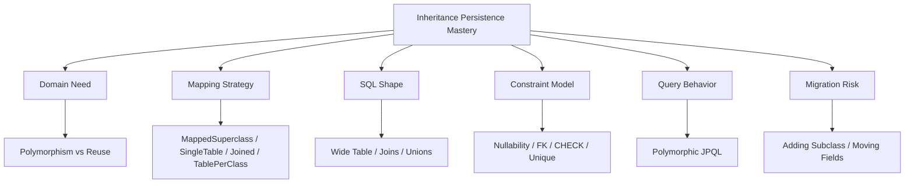
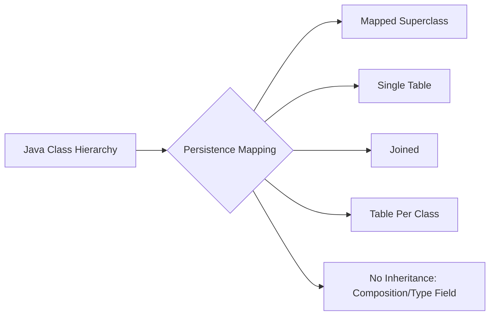
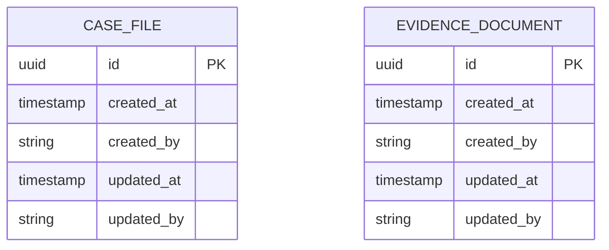
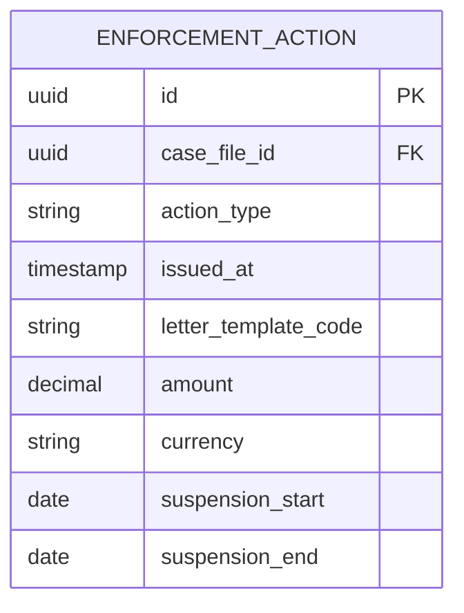
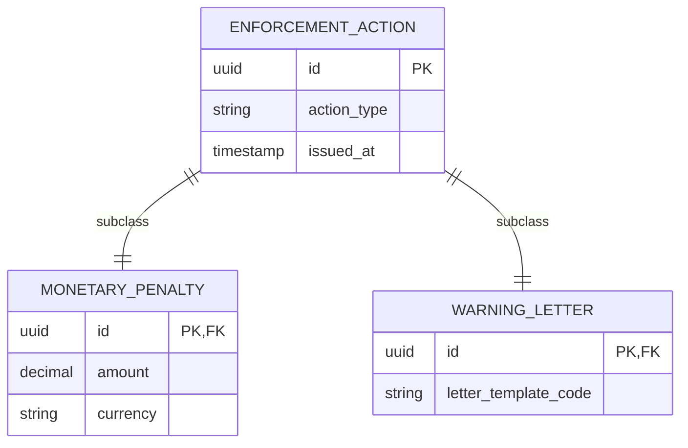
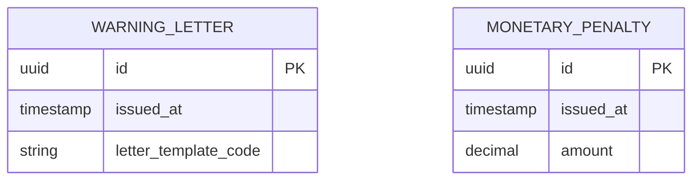
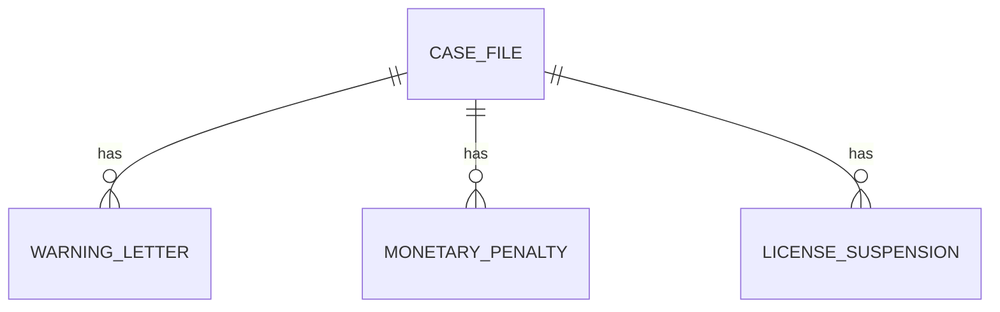
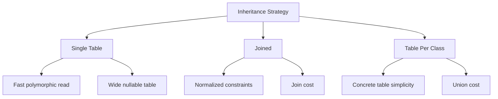

------
title: Learn Java Persistence, Database Integration, JPA, Hibernate ORM & EclipseLink - Part 012
description: Inheritance dan polymorphic persistence dalam Jakarta Persistence: mapped superclass, single table, joined, table-per-class, discriminator, polymorphic query, constraint trade-off, dan anti-pattern desain.
series: learn-java-persistence
seriesTitle: Learn Java Persistence, Database Integration, JPA, Hibernate ORM & EclipseLink
order: 12
partTitle: Inheritance and Polymorphic Persistence
tags:
- java
- persistence
- jpa
- jakarta-persistence
- hibernate
- eclipselink
- orm
- inheritance
- polymorphism
- discriminator
- mapped-superclass
- single-table
- joined
- table-per-class
- series
date: 2026-06-27
---

# Inheritance and Polymorphic Persistence

> Target part ini: kamu mampu memilih strategi inheritance persistence secara sadar, memahami dampak SQL dan constraint-nya, membedakan inheritance domain dari reuse field, dan tahu kapan composition lebih baik daripada polymorphic entity hierarchy.

Inheritance adalah fitur yang menggoda.

Di Java, inheritance tampak natural:

```java
abstract class EnforcementAction { }
class WarningLetter extends EnforcementAction { }
class MonetaryPenalty extends EnforcementAction { }
class LicenseSuspension extends EnforcementAction { }
```

Namun database relasional tidak punya object inheritance sebagai konsep utama. Database punya table, row, foreign key, check constraint, unique constraint, index, join, dan transaction.

Maka pertanyaan desainnya bukan:

> “Bagaimana cara mapping inheritance ini?”

Pertanyaan yang lebih matang:

> “Apakah domain ini benar-benar membutuhkan polymorphic persistence, atau hanya butuh shared fields, composition, atau explicit type field?”

---

## 1. Kaufman Framing

Skill inheritance mapping perlu didekonstruksi menjadi lima sub-skill:



Tujuan part ini bukan agar kamu selalu memakai inheritance. Justru sebaliknya: kamu harus tahu kapan **tidak** memakainya.

---

## 2. Object Inheritance vs Relational Reality

Object-oriented inheritance menyatakan:

- subclass adalah subtype,
- subclass mewarisi field/method,
- polymorphic dispatch terjadi di runtime,
- collection bisa berisi supertype.

Relational model menyatakan:

- data ada di table,
- row punya kolom,
- constraint berlaku per table,
- query menggabungkan table dengan join/union,
- index didesain atas kolom nyata.

Mapping inheritance berarti memilih bentuk kompromi.



Tidak ada strategi yang selalu terbaik. Masing-masing menukar:

- normalization,
- query speed,
- nullability,
- schema clarity,
- insert/update cost,
- polymorphic query cost,
- migration complexity.

---

## 3. Jakarta Persistence Inheritance Strategies

Jakarta Persistence menyediakan annotation utama:

```java
@Inheritance(strategy = InheritanceType.SINGLE_TABLE)
```

Strategi standar:

- `SINGLE_TABLE`,
- `JOINED`,
- `TABLE_PER_CLASS`.

Selain itu ada:

- `@MappedSuperclass`, bukan entity inheritance strategy penuh,
- `@DiscriminatorColumn`,
- `@DiscriminatorValue`.

Jakarta Persistence mendefinisikan discriminator column untuk strategi `SINGLE_TABLE` dan `JOINED`, dan mapping strategy/discriminator ditentukan di root hierarchy atau sub-hierarchy yang menerapkan strategi berbeda.

---

## 4. Strategy 1: `@MappedSuperclass`

`@MappedSuperclass` bukan entity. Ia tidak punya table sendiri dan tidak bisa di-query polymorphically.

Contoh:

```java
@MappedSuperclass
public abstract class AuditedEntity {
    @Column(nullable = false, updatable = false)
    private Instant createdAt;

    @Column(nullable = false, updatable = false)
    private String createdBy;

    @Column(nullable = false)
    private Instant updatedAt;

    @Column(nullable = false)
    private String updatedBy;
}

@Entity
@Table(name = "case_file")
public class CaseFile extends AuditedEntity {
    @Id
    private UUID id;
}

@Entity
@Table(name = "evidence_document")
public class EvidenceDocument extends AuditedEntity {
    @Id
    private UUID id;
}
```

Physical result:



### 4.1 When to use

Gunakan `@MappedSuperclass` untuk:

- common audit fields,
- common id/version fields,
- shared technical metadata,
- reducing repeated mapping boilerplate.

### 4.2 When not to use

Jangan gunakan jika kamu butuh:

- query `select a from AuditedEntity a`,
- association ke superclass,
- polymorphic collection,
- shared table identity.

`@MappedSuperclass` adalah reuse mapping, bukan polymorphic persistence.

---

## 5. Strategy 2: `SINGLE_TABLE`

Semua subclass disimpan dalam satu table.

```java
@Entity
@Table(name = "enforcement_action")
@Inheritance(strategy = InheritanceType.SINGLE_TABLE)
@DiscriminatorColumn(name = "action_type")
public abstract class EnforcementAction {
    @Id
    private UUID id;

    @ManyToOne(fetch = FetchType.LAZY, optional = false)
    private CaseFile caseFile;

    @Column(nullable = false)
    private Instant issuedAt;
}

@Entity
@DiscriminatorValue("WARNING_LETTER")
public class WarningLetter extends EnforcementAction {
    private String letterTemplateCode;
}

@Entity
@DiscriminatorValue("MONETARY_PENALTY")
public class MonetaryPenalty extends EnforcementAction {
    private BigDecimal amount;
    private String currency;
}

@Entity
@DiscriminatorValue("LICENSE_SUSPENSION")
public class LicenseSuspension extends EnforcementAction {
    private LocalDate suspensionStart;
    private LocalDate suspensionEnd;
}
```

Physical model:



### 5.1 Strengths

`SINGLE_TABLE` biasanya paling cepat untuk polymorphic query.

```jpql
select a
from EnforcementAction a
where a.caseFile.id = :caseId
```

SQL kira-kira:

```sql
select *
from enforcement_action
where case_file_id = ?;
```

Kelebihan:

- no join untuk polymorphic load,
- simple insert satu table,
- mudah query semua subtype,
- cocok jika field subclass tidak terlalu banyak,
- cocok untuk hierarchy stabil.

### 5.2 Weaknesses

Kekurangan utama: table menjadi wide dan banyak nullable column.

Contoh:

- `amount` hanya valid untuk `MONETARY_PENALTY`,
- `letter_template_code` hanya valid untuk `WARNING_LETTER`,
- `suspension_start` hanya valid untuk `LICENSE_SUSPENSION`.

Database constraint menjadi lebih sulit. Kamu mungkin butuh check constraint:

```sql
alter table enforcement_action
add constraint chk_monetary_penalty_fields
check (
    action_type <> 'MONETARY_PENALTY'
    or (amount is not null and currency is not null)
);
```

Tanpa constraint, table bisa menyimpan row invalid secara domain.

### 5.3 Use `SINGLE_TABLE` when

- hierarchy kecil dan stabil,
- subtype field sedikit,
- polymorphic reads sering,
- query performance penting,
- nullable subtype columns masih bisa diterima,
- database check constraint bisa menjaga invariant.

### 5.4 Avoid `SINGLE_TABLE` when

- subtype sangat banyak,
- field subtype sangat berbeda,
- constraint subtype kompleks,
- table akan menjadi wide dumping ground,
- setiap subtype punya lifecycle sangat berbeda.

---

## 6. Strategy 3: `JOINED`

Base fields disimpan di root table. Subclass fields disimpan di table masing-masing.

```java
@Entity
@Table(name = "enforcement_action")
@Inheritance(strategy = InheritanceType.JOINED)
@DiscriminatorColumn(name = "action_type")
public abstract class EnforcementAction {
    @Id
    private UUID id;

    @Column(nullable = false)
    private Instant issuedAt;
}

@Entity
@Table(name = "monetary_penalty")
@DiscriminatorValue("MONETARY_PENALTY")
public class MonetaryPenalty extends EnforcementAction {
    @Column(nullable = false)
    private BigDecimal amount;

    @Column(nullable = false)
    private String currency;
}
```

Physical model:



### 6.1 Strengths

- normalized structure,
- subtype-specific columns can be `NOT NULL`,
- schema lebih ekspresif,
- subclass fields tidak mencemari root table.

### 6.2 Weaknesses

Polymorphic queries biasanya butuh join.

```jpql
select a
from EnforcementAction a
where a.issuedAt >= :from
```

Provider mungkin menghasilkan SQL dengan joins ke subclass tables, tergantung query dan load plan.

Kekurangan:

- read polymorphic lebih mahal,
- insert subclass perlu insert ke root + subclass table,
- query tuning lebih kompleks,
- hierarchy dalam bisa menghasilkan banyak join.

### 6.3 Use `JOINED` when

- subtype punya banyak field khusus,
- database constraint subtype penting,
- hierarchy tidak terlalu dalam,
- polymorphic reads tidak ekstrem atau bisa dioptimasi,
- schema clarity lebih penting dari raw read speed.

### 6.4 Avoid `JOINED` when

- polymorphic listing sangat sering dan latency critical,
- hierarchy dalam dan luas,
- database sudah join-heavy,
- application sering mengambil semua subtype fields sekaligus.

---

## 7. Strategy 4: `TABLE_PER_CLASS`

Setiap concrete class punya table sendiri. Base class tidak punya table untuk semua row bersama.

```java
@Entity
@Inheritance(strategy = InheritanceType.TABLE_PER_CLASS)
public abstract class EnforcementAction {
    @Id
    private UUID id;

    private Instant issuedAt;
}

@Entity
@Table(name = "warning_letter")
public class WarningLetter extends EnforcementAction {
    private String letterTemplateCode;
}

@Entity
@Table(name = "monetary_penalty")
public class MonetaryPenalty extends EnforcementAction {
    private BigDecimal amount;
}
```

Physical model:



Polymorphic query often requires `UNION`.

```sql
select id, issued_at, 'WARNING_LETTER' as type
from warning_letter
union all
select id, issued_at, 'MONETARY_PENALTY' as type
from monetary_penalty;
```

### 7.1 Strengths

- no nullable subtype columns,
- no join to subclass table,
- each concrete table can have strong constraints.

### 7.2 Weaknesses

- polymorphic query can be expensive,
- global uniqueness/id strategy can be tricky,
- association to base type can be awkward,
- duplicate columns across tables,
- schema evolution repeated per subclass.

### 7.3 Use cautiously

`TABLE_PER_CLASS` is usually the least common choice in enterprise JPA models. Consider it only when:

- polymorphic queries are rare,
- concrete subtype tables are truly independent,
- shared fields are few,
- union cost is acceptable,
- you understand provider SQL generation.

---

## 8. Strategy 5: No Entity Inheritance

Often the best persistence inheritance strategy is **no inheritance**.

### 8.1 Explicit type field

```java
@Entity
@Table(name = "enforcement_action")
public class EnforcementAction {
    @Id
    private UUID id;

    @Enumerated(EnumType.STRING)
    @Column(nullable = false)
    private EnforcementActionType type;

    @Embedded
    private MonetaryPenaltyDetails monetaryPenaltyDetails;

    @Embedded
    private WarningLetterDetails warningLetterDetails;
}
```

This resembles single table but without Java subclass hierarchy.

Use when behavior is not truly polymorphic and you mostly need data classification.

### 8.2 Composition with detail table

```java
@Entity
public class EnforcementAction {
    @Id
    private UUID id;

    @Enumerated(EnumType.STRING)
    private EnforcementActionType type;

    @OneToOne(mappedBy = "action", cascade = CascadeType.ALL, orphanRemoval = true)
    private MonetaryPenaltyDetail monetaryPenaltyDetail;
}
```

This can be clearer when one type has complex detail but you do not want a full inheritance hierarchy.

### 8.3 Separate aggregates

Sometimes `WarningLetter`, `MonetaryPenalty`, and `LicenseSuspension` are not subclasses. They are separate aggregate concepts that share a reference to `CaseFile`.



This is often better if:

- lifecycle differs,
- permissions differ,
- workflow differs,
- audit/legal rules differ,
- commands differ significantly.

---

## 9. Polymorphic Queries

JPQL can query root type:

```jpql
select a
from EnforcementAction a
where a.caseFile.id = :caseId
```

It can also query subtype:

```jpql
select p
from MonetaryPenalty p
where p.amount > :threshold
```

And use type expressions:

```jpql
select a
from EnforcementAction a
where type(a) = MonetaryPenalty
```

Polymorphic query is convenient, but the SQL cost depends on mapping strategy.

| Strategy | Root Query Shape |
|---|---|
| `SINGLE_TABLE` | One table scan/seek with discriminator |
| `JOINED` | Root table plus joins/subclass resolution |
| `TABLE_PER_CLASS` | Union across concrete tables |
| `@MappedSuperclass` | Not queryable as root entity |

This is why inheritance strategy is a query design decision, not only an object design decision.

---

## 10. Discriminator Design

Discriminator column stores subtype identity.

```java
@DiscriminatorColumn(name = "action_type")
@DiscriminatorValue("MONETARY_PENALTY")
```

Recommendations:

- use stable business-readable values,
- avoid Java class names as discriminator values,
- make column length explicit,
- index discriminator if frequently filtered,
- consider check constraint for allowed values,
- document migration when adding subtype.

Bad:

```java
@DiscriminatorValue("com.company.enforcement.MonetaryPenalty")
```

Better:

```java
@DiscriminatorValue("MONETARY_PENALTY")
```

Because class names change. Legal/regulatory data outlives refactoring.

---

## 11. Constraint Model by Strategy

### 11.1 `SINGLE_TABLE` constraint problem

Subtype fields are usually nullable at database level because other subtypes do not use them.

Example invalid row:

| id | action_type | amount | currency | letter_template_code |
|---|---|---:|---|---|
| 1 | MONETARY_PENALTY | null | null | null |

Java constructor may prevent this, but database must also defend.

Use check constraints:

```sql
alter table enforcement_action
add constraint chk_penalty_required_fields
check (
    action_type <> 'MONETARY_PENALTY'
    or (amount is not null and currency is not null)
);
```

### 11.2 `JOINED` constraint advantage

Subtype table can enforce:

```sql
alter table monetary_penalty
alter column amount set not null;
```

Because every row in `monetary_penalty` is a monetary penalty.

### 11.3 `TABLE_PER_CLASS` constraint advantage and duplication

Each concrete table can be strict, but common constraints/indexes must be repeated.

---

## 12. Performance Model



### 12.1 Single table performance

Usually best for:

- list screens across all subtypes,
- filtering by parent id and type,
- simple dashboards,
- event/action feeds.

Index example:

```sql
create index idx_action_case_type_issued
on enforcement_action(case_file_id, action_type, issued_at desc);
```

### 12.2 Joined performance

Better for:

- subtype-heavy detail pages,
- strict data model,
- subtype-specific queries.

But root polymorphic query may need careful pagination/testing.

### 12.3 Table-per-class performance

Can be fine for concrete subtype queries, but polymorphic query often pays union cost. Avoid for hot polymorphic screens unless proven acceptable.

---

## 13. Inheritance and Associations

Association to root type:

```java
@ManyToOne(fetch = FetchType.LAZY)
private EnforcementAction action;
```

This is convenient if many things can refer to any action subtype.

But ask:

- Does the reference truly accept all subtypes?
- Are permissions same for all subtypes?
- Are lifecycle constraints same?
- Does the UI treat them uniformly?

If not, association to root type may be too broad.

Example risk:

```java
@Entity
public class PaymentSchedule {
    @OneToOne(fetch = FetchType.LAZY)
    private EnforcementAction action;
}
```

A payment schedule only makes sense for `MonetaryPenalty`, not `WarningLetter`.

Better:

```java
@OneToOne(fetch = FetchType.LAZY, optional = false)
private MonetaryPenalty penalty;
```

Type specificity is a domain invariant.

---

## 14. Inheritance and Domain Behavior

Inheritance is more defensible when behavior truly varies by subtype.

```java
public abstract class EnforcementAction {
    public abstract boolean requiresSupervisorApproval();
}

public class WarningLetter extends EnforcementAction {
    @Override
    public boolean requiresSupervisorApproval() {
        return false;
    }
}

public class MonetaryPenalty extends EnforcementAction {
    @Override
    public boolean requiresSupervisorApproval() {
        return amount.compareTo(new BigDecimal("10000")) > 0;
    }
}
```

But be careful: persistence entities are not always the best place for complex policy logic. In regulatory systems, rules may be versioned, configurable, explainable, and auditable. That may belong in policy/rule services, not subclass methods.

If behavior changes frequently by regulation version, inheritance can freeze a dynamic policy into Java class hierarchy.

---

## 15. Provider-Specific Notes

### 15.1 Hibernate

Hibernate supports standard JPA inheritance strategies and also has non-portable features such as discriminator formulas and specific discriminator options.

Use provider-specific inheritance extensions only when:

- there is a clear measured need,
- portability is not required,
- behavior is covered by integration tests,
- architecture review accepts the lock-in.

### 15.2 EclipseLink

EclipseLink supports standard Jakarta Persistence inheritance strategies and has its own descriptor/weaving/cache mechanics. As with Hibernate, provider-specific features should be isolated and tested.

### 15.3 Portability rule

If you write:

```java
entityManager.unwrap(Session.class)
```

or use provider annotations, you are no longer purely programming to Jakarta Persistence. That may be fine, but it must be intentional.

---

## 16. Anti-Patterns

### Anti-pattern 1: Inheritance for field reuse only

Bad:

```java
@Entity
@Inheritance(strategy = InheritanceType.JOINED)
public abstract class BaseThing {
    private Instant createdAt;
}
```

If you only need common fields, use `@MappedSuperclass` or embeddable audit component.

---

### Anti-pattern 2: Deep hierarchy

```text
Action
  -> AdministrativeAction
      -> FinancialAdministrativeAction
          -> Penalty
              -> LateFilingPenalty
```

Deep persistence hierarchy causes:

- join explosion,
- unclear table ownership,
- fragile queries,
- hard migrations,
- difficult onboarding.

Prefer flatter hierarchy plus composition.

---

### Anti-pattern 3: `SINGLE_TABLE` dumping ground

A single table with 80 subtype columns and weak constraints is not an elegant polymorphic model. It is usually schema debt.

Warning signs:

- many columns named `*_detail`,
- most columns nullable,
- check constraints absent,
- subtype-specific indexes piling up,
- developers afraid to add subtype.

---

### Anti-pattern 4: Subclass per status

Bad:

```java
class DraftCase extends CaseFile {}
class SubmittedCase extends CaseFile {}
class ClosedCase extends CaseFile {}
```

Status is usually state, not type.

Use state machine/status field/event history:

```java
@Enumerated(EnumType.STRING)
private CaseStatus status;
```

Persistence inheritance is not a replacement for lifecycle modelling.

---

### Anti-pattern 5: Subclass per tenant/regulator

Bad:

```java
class FinancialServicesCase extends CaseFile {}
class HealthAuthorityCase extends CaseFile {}
class EnvironmentCase extends CaseFile {}
```

If behavior differs by regulator or jurisdiction, prefer policy/configuration/strategy services and explicit attributes. Class hierarchy for institutional variation usually becomes unmaintainable.

---

## 17. Regulatory Case Study

Suppose enforcement system has actions:

- warning letter,
- monetary penalty,
- license suspension,
- remediation order.

### Option A: `SINGLE_TABLE`

Good if:

- all actions appear in one chronological feed,
- action fields are moderately similar,
- subtype-specific fields are few,
- reports often query across all actions.

### Option B: `JOINED`

Good if:

- monetary penalty has many financial fields,
- license suspension has many licensing fields,
- each subtype has strong not-null constraints,
- detail pages are subtype-specific.

### Option C: Separate aggregates

Good if:

- monetary penalties have payment schedules,
- suspensions have appeal lifecycle,
- warning letters have template workflow,
- each has different permissions and case milestones.

Decision:

If actions are mostly events in a common feed, use `SINGLE_TABLE` with check constraints.
If actions are rich business processes, avoid forcing them into one inheritance hierarchy. Model them as separate aggregates linked to `CaseFile` and perhaps expose a read model for unified timeline.

Unified timeline can be a projection:

```sql
create view case_action_timeline as
select case_id, issued_at, 'WARNING_LETTER' as action_type, id
from warning_letter
union all
select case_id, issued_at, 'MONETARY_PENALTY' as action_type, id
from monetary_penalty
union all
select case_id, issued_at, 'LICENSE_SUSPENSION' as action_type, id
from license_suspension;
```

This is often better than distorting write model for read convenience.

---

## 18. Migration Considerations

Inheritance mappings are expensive to change later.

### Adding subtype to `SINGLE_TABLE`

Usually requires:

- add nullable columns,
- add discriminator value,
- add check constraints,
- update read/write code,
- update indexes/reports.

### Moving from `SINGLE_TABLE` to `JOINED`

Requires:

- create subtype tables,
- backfill rows by discriminator,
- migrate constraints,
- adjust queries/indexes,
- validate row counts,
- deploy provider mapping change carefully.

### Moving from inheritance to composition

Usually requires larger application refactor because associations and JPQL queries may target root type.

Rule:

> Choose inheritance only when the shape is stable enough to deserve schema-level commitment.

---

## 19. Decision Framework

Use this decision tree:

```mermaid
flowchart TD
    A[Need shared concept?] -->|No| Z[Separate entities]
    A -->|Yes| B[Need polymorphic query/association?]
    B -->|No| C[@MappedSuperclass or Embeddable]
    B -->|Yes| D[Subtype fields similar and few?]
    D -->|Yes| E[SINGLE_TABLE]
    D -->|No| F[Need strong subtype constraints?]
    F -->|Yes| G[JOINED]
    F -->|No| H[Consider composition or TABLE_PER_CLASS only with proof]
```

Compact rule:

| Situation | Prefer |
|---|---|
| Shared audit/id fields only | `@MappedSuperclass` |
| Simple stable polymorphic hierarchy | `SINGLE_TABLE` |
| Rich subtype fields and strict constraints | `JOINED` |
| Rare polymorphism, independent concrete tables | `TABLE_PER_CLASS` cautiously |
| Different lifecycle/workflow/permissions | Separate aggregates/composition |
| Status/state variation | State field/state machine, not inheritance |

---

## 20. Testing Inheritance Mapping

Minimum tests:

1. Persist each subtype.
2. Query root type and assert subtype materialization.
3. Query subtype directly.
4. Verify discriminator values.
5. Verify database constraints reject invalid subtype rows.
6. Verify pagination/sorting on root queries.
7. Verify indexes through execution plan for hot queries.
8. Verify serialization/DTO mapping does not accidentally initialize excessive subclass graph.

Example:

```java
@Test
void shouldLoadActionsPolymorphically() {
    CaseFile caseFile = persistCaseWith(
        new WarningLetter("WL-001"),
        new MonetaryPenalty(new BigDecimal("5000"), "USD")
    );

    List<EnforcementAction> actions = entityManager.createQuery("""
        select a
        from EnforcementAction a
        where a.caseFile = :caseFile
        order by a.issuedAt asc
        """, EnforcementAction.class)
        .setParameter("caseFile", caseFile)
        .getResultList();

    assertThat(actions)
        .extracting(action -> action.getClass().getSimpleName())
        .containsExactly("WarningLetter", "MonetaryPenalty");
}
```

---

## 21. Review Checklist

Ask these questions before approving inheritance mapping:

1. Is this true subtype polymorphism or just field reuse?
2. Does the base type need to be queried?
3. Do associations need to reference the base type?
4. Are subtype fields few and stable?
5. Are subtype constraints important at database level?
6. Is the table likely to become wide and sparse?
7. How expensive is root polymorphic query?
8. How often are new subtypes added?
9. Does each subtype have different lifecycle/workflow/permission?
10. Is status being mistaken for type?
11. Are discriminator values stable and business-readable?
12. Are database constraints/indexes designed for the chosen strategy?
13. Is provider-specific behavior isolated?
14. Is there a migration path if the hierarchy is wrong?

---

## 22. Deliberate Practice

### Exercise 1: Choose a strategy

For each hierarchy, choose mapping strategy and justify:

1. `AuditedEntity -> CaseFile, EvidenceDocument, OfficerAssignment`
2. `EnforcementAction -> WarningLetter, MonetaryPenalty, LicenseSuspension`
3. `CaseFile -> DraftCase, SubmittedCase, ClosedCase`
4. `Party -> IndividualParty, OrganizationParty`
5. `Notification -> EmailNotification, SmsNotification, PortalNotification`

Expected reasoning:

- audit base: `@MappedSuperclass`,
- action: depends on lifecycle/detail richness,
- case status: no inheritance,
- party: maybe single table/joined depending fields/constraints,
- notification: often single table or separate message outbox records.

### Exercise 2: Constraint design

Design check constraints for `SINGLE_TABLE` `enforcement_action`:

- monetary penalty requires amount/currency,
- warning letter requires template code,
- suspension requires start/end date and start <= end.

### Exercise 3: Query cost

For each strategy, predict SQL shape for:

```jpql
select a from EnforcementAction a where a.caseFile.id = :caseId
```

Then explain index strategy.

---

## 23. Summary

Inheritance mapping is a schema decision disguised as an object modelling decision.

Key takeaways:

- `@MappedSuperclass` is for mapping reuse, not polymorphic persistence.
- `SINGLE_TABLE` is often fastest for polymorphic reads but creates nullable subtype columns.
- `JOINED` gives better normalization and subtype constraints but introduces join cost.
- `TABLE_PER_CLASS` can require union queries and should be used cautiously.
- Status, tenant, jurisdiction, and workflow variation are usually not good inheritance axes.
- For regulatory systems, auditability and legal defensibility often favor explicit schema and constraints over elegant class hierarchies.
- Always choose inheritance strategy by query shape, constraint model, lifecycle, and migration risk.

Part berikutnya membahas schema generation and migration boundary: kapan JPA boleh membuat schema, kapan harus berhenti, dan bagaimana menjaga drift antara model Java dan database production.

---

## References

- Jakarta Persistence 3.2 Specification: https://jakarta.ee/specifications/persistence/3.2/jakarta-persistence-spec-3.2
- Jakarta Persistence `DiscriminatorColumn` API documentation: https://jakarta.ee/specifications/persistence/3.1/apidocs/jakarta.persistence/jakarta/persistence/discriminatorcolumn
- Hibernate ORM User Guide: https://docs.hibernate.org/stable/orm/userguide/html_single/
- Hibernate ORM inheritance mapping documentation: https://docs.hibernate.org/orm/5.1/userguide/html_single/chapters/domain/inheritance.html
