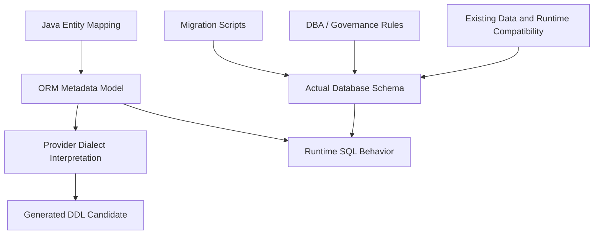
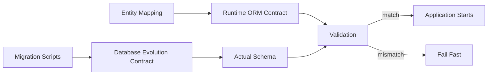
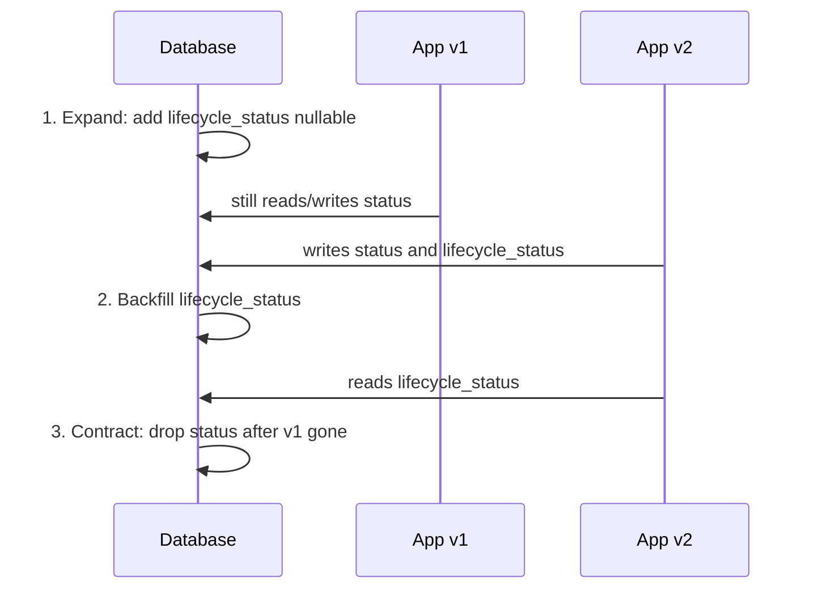
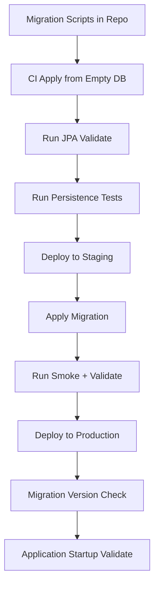
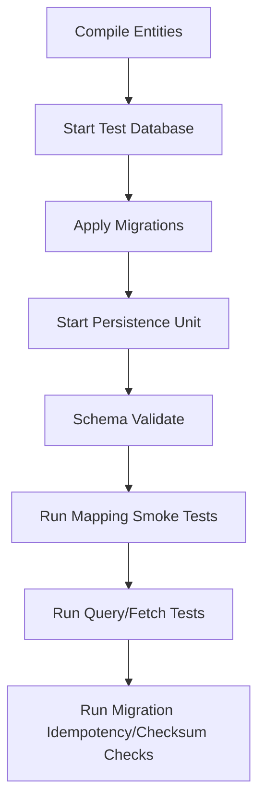
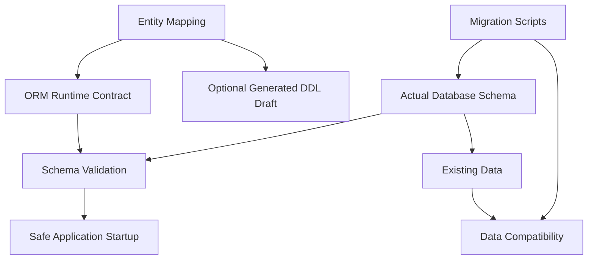

------
title: Learn Java Persistence, Database Integration, JPA, Hibernate ORM & EclipseLink - Part 013
description: Batas sehat antara JPA schema generation dan database migration: DDL generation, schema validation, Flyway/Liquibase boundary, drift detection, startup safety, dan migration playbook untuk sistem production.
series: learn-java-persistence
seriesTitle: Learn Java Persistence, Database Integration, JPA, Hibernate ORM & EclipseLink
order: 13
partTitle: Schema Generation vs Database Migration Boundary
tags:
- java
- persistence
- jpa
- jakarta-persistence
- hibernate
- eclipselink
- orm
- schema-generation
- migration
- flyway
- liquibase
- ddl
- production-readiness
- series
date: 2026-06-27
---

# Schema Generation vs Database Migration Boundary

> Target part ini: kamu mampu menentukan batas yang aman antara entity mapping, schema generation, migration tool, dan database governance. Setelah part ini, kamu tidak lagi melihat `ddl-auto=update` sebagai convenience kecil, tetapi sebagai keputusan operasional yang dapat mengubah data contract production.

Di seri JDBC sebelumnya, kita sudah membahas SQL, transaction, connection, dan migration dari sisi database integration. Part ini tidak mengulang itu. Fokus kita di sini lebih spesifik:

- bagaimana ORM memandang schema,
- kapan JPA/Hibernate/EclipseLink boleh menghasilkan DDL,
- kapan DDL harus dikelola migration tool,
- bagaimana mencegah schema drift,
- bagaimana melakukan review mapping dari perspektif production safety.

Dalam sistem regulatory atau enforcement lifecycle, schema bukan hanya detail teknis. Schema adalah bagian dari **audit contract**. Kolom `decision_date`, `case_status`, `violation_code`, `effective_from`, `appeal_deadline`, dan `version` sering memiliki konsekuensi hukum, reporting, dan operational SLA. Karena itu, perubahan schema harus bisa dijelaskan, direview, diuji, dan direkonstruksi.

## 1. Mental Model: Entity Mapping Is Not the Schema

Kesalahan pertama banyak engineer adalah menyamakan entity class dengan schema database.

```java
@Entity
@Table(name = "enforcement_case")
public class EnforcementCase {

    @Id
    @GeneratedValue(strategy = GenerationType.SEQUENCE)
    private Long id;

    @Column(nullable = false, length = 64)
    private String caseNumber;

    @Enumerated(EnumType.STRING)
    @Column(nullable = false, length = 32)
    private CaseStatus status;
}
```

Kode di atas adalah **mapping model**, bukan database design final.

Mapping menyatakan:

- entity mana yang dipersist,
- table mana yang digunakan,
- kolom mana yang dibaca/ditulis provider,
- constraint apa yang dapat dihasilkan provider bila schema generation aktif,
- tipe Java apa yang dikonversi menjadi tipe database.

Namun schema database final juga dipengaruhi oleh:

- vendor database,
- dialect provider,
- naming strategy,
- migration history,
- DBA/security policy,
- index strategy,
- partitioning,
- default values,
- triggers,
- generated columns,
- partial indexes,
- check constraints,
- grants,
- replication/CDC requirement,
- backward compatibility antar versi aplikasi.

Jadi mental model yang benar:



Entity mapping adalah **input penting**, tetapi bukan satu-satunya sumber kebenaran.

## 2. The Boundary: Who Owns the Schema?

Pertanyaan arsitekturalnya bukan “bisa generate schema atau tidak?”. Pertanyaan yang lebih tepat:

> Siapa owner perubahan schema di environment tertentu?

Ada tiga mode umum.

| Environment | Schema Owner | ORM Role | Migration Role |
|---|---|---|---|
| Local spike/prototype | Developer / ORM | Generate/drop cepat | Opsional |
| Automated test | Test setup | Generate disposable schema atau apply migration | Sangat berguna untuk fidelity |
| Shared dev/staging/prod | Migration process | Validate mapping terhadap schema | Source of truth |
| Regulated production | Controlled migration pipeline | Validate only, never mutate silently | Mandatory, auditable |

Untuk sistem production serius, rule sehatnya:

> ORM boleh memahami schema. ORM tidak boleh diam-diam menjadi schema migration authority.

## 3. JPA Schema Generation: What It Is Good For

Jakarta Persistence mendefinisikan mekanisme schema generation. Provider dapat membuat database objects dari metadata persistence. Ini berguna, tetapi scope-nya harus dibatasi.

Kegunaan sehat:

1. **Learning dan local experimentation**

   Kamu ingin cepat melihat bagaimana mapping diterjemahkan menjadi table, column, FK, atau join table.

2. **Disposable integration test**

   Untuk test tertentu, schema bisa dibuat ulang dari entity agar cepat dan isolated.

3. **DDL inspection**

   Generate script ke file, lalu review hasilnya sebagai draft, bukan langsung apply ke production.

4. **Provider behavior exploration**

   Misalnya membandingkan DDL Hibernate vs EclipseLink untuk mapping yang sama.

5. **Mapping sanity check**

   Melihat apakah annotation menghasilkan asumsi schema yang masuk akal.

Yang tidak cocok:

- production migration otomatis,
- schema evolution lintas versi aplikasi,
- data migration,
- zero-downtime migration,
- complex index strategy,
- partial indexes,
- vendor-specific DDL kompleks,
- controlled rollback/roll-forward,
- change approval/audit trail.

## 4. Hibernate `ddl-auto`: Convenience with Teeth

Di ekosistem Spring Boot/Hibernate, banyak engineer mengenal property:

```properties
spring.jpa.hibernate.ddl-auto=update
```

atau Hibernate native setting seperti:

```properties
hibernate.hbm2ddl.auto=update
```

Nilai umum:

| Mode | Makna Praktis | Risiko |
|---|---|---|
| `none` | Tidak melakukan DDL | Aman, tetapi tidak validasi |
| `validate` | Validasi mapping terhadap schema | Aman untuk production startup guard |
| `update` | Mencoba mengubah schema agar cocok | Berbahaya untuk shared/prod |
| `create` | Membuat schema baru | Menghapus asumsi schema existing |
| `create-drop` | Buat saat startup, drop saat shutdown | Hanya untuk disposable test/dev |

`update` terlihat menarik karena menghemat migration script. Tetapi ia bermasalah karena:

- tidak memahami intent bisnis,
- tidak bisa menulis data migration yang aman,
- sulit menjamin backward compatibility,
- bisa gagal diam-diam pada constraint tertentu,
- bisa menghasilkan perubahan berbeda antar dialect/provider,
- tidak menjadi artefak reviewable yang jelas,
- tidak cocok untuk multi-instance deployment.

Contoh: kamu mengubah enum dari:

```java
public enum CaseStatus {
    DRAFT,
    UNDER_REVIEW,
    CLOSED
}
```

menjadi:

```java
public enum CaseStatus {
    DRAFT,
    UNDER_REVIEW,
    DECISION_ISSUED,
    CLOSED
}
```

Bila enum dipersist sebagai string, schema mungkin tidak berubah. Tetapi data semantics berubah. Migration tool mungkin perlu:

- backfill status lama,
- menambah check constraint,
- menyesuaikan reporting view,
- menyesuaikan downstream CDC consumer,
- menambah compatibility window.

ORM `update` tidak tahu itu.

## 5. Schema Generation vs Migration Tool

Perbedaan utamanya:

| Concern | JPA Schema Generation | Flyway/Liquibase-Style Migration |
|---|---|---|
| Source | Entity metadata | Versioned change scripts |
| Intent | Derive structure | Declare explicit change |
| Reviewability | Rendah jika auto-apply | Tinggi |
| Data migration | Sangat terbatas | Bisa eksplisit |
| Rollout control | Lemah | Kuat |
| Audit trail | Lemah | Kuat |
| Vendor-specific feature | Terbatas/dialect-driven | Bisa optimal |
| Production suitability | Validate only | Ya |

Top 1% engineer tidak bertanya “mana yang lebih modern?”. Mereka memisahkan concern:

- entity mapping mendefinisikan **runtime object-relational contract**,
- migration mendefinisikan **database evolution contract**,
- validation mendeteksi **contract mismatch** saat startup/test.



## 6. Recommended Production Policy

Untuk sistem production, gunakan policy berikut sebagai baseline.

```properties
# Production-like environments
spring.jpa.hibernate.ddl-auto=validate
```

atau disable DDL mutation dan jalankan migration eksplisit sebelum aplikasi menerima traffic.

### Policy Matrix

| Environment | Recommended Setting | Reason |
|---|---|---|
| Local scratch | `create-drop` atau `create` | Cepat, disposable |
| Local development shared DB | `validate` + migration | Meniru production discipline |
| Unit test pure domain | No DB | Tidak perlu ORM |
| Integration test disposable | Migration-first atau generate schema tergantung target test | Pilih fidelity vs speed |
| CI persistence tests | Apply migrations + validate | Menangkap drift |
| Staging | Migration + validate | Production rehearsal |
| Production | Migration + validate | Controlled, auditable |

## 7. Entity Annotation Is Not Enough for DDL Quality

Annotation seperti `@Column(nullable = false, length = 64)` membantu, tetapi tidak cukup.

```java
@Column(nullable = false, length = 64, unique = true)
private String caseNumber;
```

Ini bisa menghasilkan unique constraint. Tetapi production-grade design juga membutuhkan pertanyaan:

- Apakah unique constraint case-sensitive?
- Apakah `caseNumber` perlu normalized column?
- Apakah uniqueness berlaku global atau per tenant/regulator?
- Apakah soft-deleted case tetap menahan uniqueness?
- Apakah import legacy data punya duplicate sementara?
- Apakah query lookup butuh covering index?
- Apakah constraint name stabil dan readable?

DDL generated dari annotation mungkin tidak cukup mengekspresikan semua itu.

### Better Migration Example

```sql
ALTER TABLE enforcement_case
    ADD COLUMN case_number_normalized VARCHAR(64);

UPDATE enforcement_case
SET case_number_normalized = UPPER(TRIM(case_number))
WHERE case_number_normalized IS NULL;

ALTER TABLE enforcement_case
    ALTER COLUMN case_number_normalized SET NOT NULL;

CREATE UNIQUE INDEX ux_enforcement_case_regulator_case_number_norm
    ON enforcement_case (regulator_id, case_number_normalized)
    WHERE deleted_at IS NULL;
```

Mapping entity-nya kemudian mengikuti schema contract:

```java
@Column(name = "case_number", nullable = false, length = 64)
private String caseNumber;

@Column(name = "case_number_normalized", nullable = false, length = 64, updatable = false)
private String normalizedCaseNumber;
```

## 8. Naming Strategy: Silent Source of Drift

Provider bisa mengubah nama table/column dari Java identifier melalui naming strategy.

```java
private String caseNumber;
```

Bisa menjadi:

- `caseNumber`,
- `case_number`,
- `CASE_NUMBER`,
- quoted identifier dengan case-sensitive behavior.

Dalam sistem besar, naming strategy harus dianggap bagian dari platform contract.

Checklist:

- Apakah semua table/column eksplisit di annotation?
- Apakah constraint/index names eksplisit di migration?
- Apakah quoted identifier dihindari kecuali wajib?
- Apakah naming strategy sama antara local, CI, staging, production?
- Apakah provider upgrade dapat mengubah default naming behavior?

Untuk entity penting, lebih baik eksplisit:

```java
@Entity
@Table(name = "enforcement_case")
public class EnforcementCase {

    @Column(name = "case_number", nullable = false, length = 64)
    private String caseNumber;
}
```

Ini bukan verbosity buruk. Ini mengurangi ambiguity kontrak.

## 9. Schema Validation: Useful but Not Omniscient

`validate` sangat berguna untuk fail fast ketika mapping dan schema tidak cocok. Namun validasi provider biasanya tidak menangkap semua hal.

Dapat menangkap:

- table hilang,
- column hilang,
- tipe dasar tidak cocok pada beberapa provider/dialect,
- sequence/table generator hilang,
- beberapa mismatch nullability/length tergantung provider.

Tidak selalu menangkap:

- index tidak optimal,
- query plan buruk,
- check constraint missing,
- uniqueness semantic salah,
- partial index tidak ada,
- FK deferrability,
- trigger behavior,
- permission/grant issue,
- data-level incompatibility,
- backward compatibility antar versi aplikasi.

Jadi validation adalah guardrail, bukan governance penuh.

## 10. Migration as Application Contract

Migration harus diperlakukan seperti kode production.

Contoh struktur:

```text
src/main/resources/db/migration/
  V001__create_enforcement_case.sql
  V002__create_party_and_case_party.sql
  V003__add_case_status_history.sql
  V004__backfill_case_status_history.sql
  V005__add_optimistic_version_columns.sql
```

Migration yang baik memiliki properti:

- deterministic,
- idempotency dipahami walau tidak selalu idempotent secara teknis,
- kecil dan reviewable,
- punya urutan eksplisit,
- bisa dijalankan di CI,
- punya rollback/roll-forward strategy,
- memisahkan DDL dan data backfill berat jika perlu,
- mendokumentasikan asumsi data.

## 11. Forward-Compatible Migration Pattern

Untuk deployment multi-instance, aplikasi versi lama dan baru sering berjalan bersamaan. Ini membuat migration harus compatible.

Bad pattern:

```sql
ALTER TABLE enforcement_case
    RENAME COLUMN status TO lifecycle_status;
```

Jika aplikasi lama masih membaca `status`, instance lama akan gagal.

Better expand-contract pattern:



### Expand-Contract Steps

1. **Expand**: add new nullable column/table/index.
2. **Dual write/read compatibility**: new application can operate with old data.
3. **Backfill**: migrate existing rows.
4. **Switch read path**: new app relies on new structure.
5. **Contract**: remove old structure after all old app versions are gone.

Ini sangat penting dalam regulated workflows karena downtime dan data inconsistency bisa berdampak pada SLA, legal deadlines, atau audit chronology.

## 12. Data Migration Is Not Schema Migration Only

DDL mudah terlihat. Data semantics lebih berbahaya.

Contoh business change:

Sebelumnya:

```text
case.status = CLOSED
```

Sekarang diturunkan menjadi:

```text
case.lifecycle_status = DECISION_FINAL
case.enforcement_outcome = WARNING_ISSUED
case.appeal_state = NOT_APPEALED
```

Migration bukan hanya menambah kolom. Kamu harus mendefinisikan mapping historis:

| Old State | New Lifecycle | New Outcome | New Appeal State | Ambiguity |
|---|---|---|---|---|
| `DRAFT` | `DRAFT` | `NULL` | `NULL` | Low |
| `UNDER_REVIEW` | `ACTIVE_REVIEW` | `NULL` | `NULL` | Low |
| `CLOSED` | `DECISION_FINAL` | Unknown | Unknown | High |

Untuk ambiguous migration, jangan pura-pura deterministic. Buat explicit remediation:

- create temporary audit table,
- mark rows requiring manual classification,
- expose reconciliation dashboard,
- block final constraint until remediation selesai,
- record migration decision rationale.

## 13. JPA 3.2 Schema Improvements: Useful but Still Not a Migration Strategy

Jakarta Persistence 3.2 menambahkan beberapa kemampuan terkait schema/metadata, misalnya API dan annotation member yang memperkaya DDL generation seperti comments/check constraints pada area tertentu. Ini berguna untuk memperjelas metadata mapping.

Namun prinsipnya tetap:

> Kemampuan DDL generation yang lebih kaya tidak otomatis mengubah ORM menjadi migration governance system.

Gunakan fitur schema metadata untuk:

- dokumentasi mapping,
- local/test schema generation,
- DDL draft,
- provider comparison,
- validation support.

Tetap gunakan migration pipeline untuk:

- production evolution,
- data backfill,
- index tuning,
- zero-downtime rollout,
- audit trail.

## 14. Hibernate vs EclipseLink: Provider DDL Differences

Mapping yang sama dapat menghasilkan DDL berbeda.

```java
@Entity
@Table(name = "case_event")
public class CaseEvent {

    @Id
    @GeneratedValue(strategy = GenerationType.SEQUENCE)
    private Long id;

    @Column(nullable = false, length = 32)
    private String eventType;

    @Lob
    private String payload;
}
```

Perbedaan yang mungkin muncul:

- tipe LOB,
- sequence naming,
- default allocation size handling,
- FK names,
- index/constraint names,
- quoted identifier behavior,
- enum type mapping,
- timestamp precision,
- DDL ordering.

Ini bukan berarti salah satu provider “salah”. Ini berarti schema generation adalah hasil interpretasi provider+dialect. Jika schema harus stabil, migration script harus menjadi source of truth.

## 15. Schema Drift

Schema drift terjadi ketika actual database schema berbeda dari schema yang diasumsikan aplikasi.

Penyebab umum:

- manual hotfix langsung di DB,
- migration gagal sebagian,
- environment tidak menjalankan migration yang sama,
- branch migration conflict,
- provider auto-update pernah aktif,
- DBA menambah constraint/index tanpa sinkronisasi repo,
- multi-service berbagi database tanpa ownership jelas.

Dampaknya:

- runtime error saat query,
- optimistic lock tidak bekerja,
- constraint violation tak terduga,
- performance regression,
- data loss karena column nullable/default berbeda,
- test hijau tetapi production gagal.

## 16. Drift Detection Strategy

Minimum viable drift detection:

1. CI menjalankan migration dari kosong.
2. CI menjalankan aplikasi dengan schema validation.
3. CI menjalankan persistence integration tests.
4. Staging menjalankan migration yang sama.
5. Production startup melakukan validation.
6. Observability menangkap SQL error dan migration version.

Lebih matang:

- schema snapshot comparison,
- database introspection diff,
- migration checksum validation,
- production read-only schema audit job,
- migration ownership policy,
- blocking deploy jika migration pending/failed.



## 17. Mapping Review: Table Design

Ketika review entity, jangan hanya review Java class. Review table design.

Contoh:

```java
@Entity
@Table(name = "case_assignment")
public class CaseAssignment {

    @Id
    private UUID id;

    @ManyToOne(optional = false, fetch = FetchType.LAZY)
    @JoinColumn(name = "case_id", nullable = false)
    private EnforcementCase enforcementCase;

    @Column(name = "assignee_user_id", nullable = false)
    private UUID assigneeUserId;

    @Column(name = "assigned_at", nullable = false)
    private Instant assignedAt;
}
```

Review questions:

- Apakah `case_assignment` append-only atau mutable?
- Apakah satu case boleh punya banyak assignment aktif?
- Bagaimana menandai assignment ended?
- Apakah perlu unique partial index untuk active assignment?
- Apakah `assignee_user_id` FK ke local table atau external IAM reference?
- Apakah `assigned_at` menggunakan database clock atau application clock?
- Apakah time zone policy jelas?

Possible migration:

```sql
CREATE TABLE case_assignment (
    id UUID PRIMARY KEY,
    case_id BIGINT NOT NULL REFERENCES enforcement_case(id),
    assignee_user_id UUID NOT NULL,
    assigned_at TIMESTAMP WITH TIME ZONE NOT NULL,
    unassigned_at TIMESTAMP WITH TIME ZONE NULL,
    assignment_reason VARCHAR(128) NOT NULL,
    version BIGINT NOT NULL DEFAULT 0
);

CREATE UNIQUE INDEX ux_case_assignment_one_active
    ON case_assignment(case_id)
    WHERE unassigned_at IS NULL;
```

JPA annotation tidak cukup untuk partial unique index ini secara portable. Migration script harus memegang contract.

## 18. Constraint Design: Application vs Database

Ada dua jenis invariant:

1. **Application invariant**: butuh domain logic kompleks.
2. **Database invariant**: harus dijaga bahkan jika aplikasi bug, batch job, atau integration path lain menulis data.

Contoh database invariant:

- `case_number` not null,
- `status` tidak boleh di luar allowed values,
- `appeal_deadline >= decision_date`,
- satu active assignment per case,
- FK decision ke case harus valid,
- version column tidak null.

Contoh application invariant:

- case hanya boleh masuk `DECISION_ISSUED` jika review lengkap,
- penalty amount harus sesuai statutory cap berdasarkan violation type,
- appeal deadline dihitung berbeda per jurisdiction,
- escalation membutuhkan supervisor approval.

Database tidak harus memuat semua rule. Tetapi rule yang murah dan universal sebaiknya ditaruh di database juga.

## 19. Index Design Is Query-Driven, Not Entity-Driven

Entity mapping tidak tahu semua query critical.

Contoh query:

```java
select c
from EnforcementCase c
where c.status = :status
  and c.assignedOfficeId = :officeId
  and c.createdAt >= :from
order by c.createdAt desc
```

Index candidate:

```sql
CREATE INDEX ix_case_status_office_created_at
    ON enforcement_case(status, assigned_office_id, created_at DESC);
```

Tapi index yang benar bergantung pada:

- cardinality `status`,
- selectivity `assigned_office_id`,
- distribution `created_at`,
- pagination strategy,
- database optimizer,
- query frequency,
- write overhead.

Jangan menambahkan index hanya karena ada field. Tambahkan index karena ada query path yang jelas.

## 20. Enum Migration Strategy

Enum persistence sangat sering menimbulkan schema/data issue.

Rule dari part type mapping:

- hindari `EnumType.ORDINAL` untuk long-lived data,
- gunakan string atau explicit stable code,
- treat enum rename as data migration,
- jangan hapus enum value tanpa cleanup strategy.

Contoh stable code:

```java
public enum CaseStatus {
    DRAFT("DRAFT"),
    UNDER_REVIEW("UNDER_REVIEW"),
    DECISION_ISSUED("DECISION_ISSUED"),
    CLOSED("CLOSED");

    private final String code;

    CaseStatus(String code) {
        this.code = code;
    }

    public String code() {
        return code;
    }
}
```

Converter:

```java
@Converter(autoApply = true)
public class CaseStatusConverter implements AttributeConverter<CaseStatus, String> {

    @Override
    public String convertToDatabaseColumn(CaseStatus attribute) {
        return attribute == null ? null : attribute.code();
    }

    @Override
    public CaseStatus convertToEntityAttribute(String dbData) {
        if (dbData == null) {
            return null;
        }
        return Arrays.stream(CaseStatus.values())
            .filter(status -> status.code().equals(dbData))
            .findFirst()
            .orElseThrow(() -> new IllegalArgumentException("Unknown case status: " + dbData));
    }
}
```

Migration untuk enum change bisa berupa:

```sql
ALTER TABLE enforcement_case
    DROP CONSTRAINT IF EXISTS ck_enforcement_case_status;

ALTER TABLE enforcement_case
    ADD CONSTRAINT ck_enforcement_case_status
    CHECK (status IN ('DRAFT', 'UNDER_REVIEW', 'DECISION_ISSUED', 'CLOSED'));
```

## 21. Temporal Column Migration

Time fields sering tampak sederhana tetapi berisiko.

Bad:

```java
@Column(nullable = false)
private LocalDateTime decisionIssuedAt;
```

Masalah:

- time zone tidak jelas,
- audit event sulit dikorelasikan antar region,
- daylight saving issue untuk beberapa jurisdiction,
- database/session timezone dapat mempengaruhi interpretasi.

Better for instant event:

```java
@Column(name = "decision_issued_at", nullable = false)
private Instant decisionIssuedAt;
```

Migration harus eksplisit:

```sql
ALTER TABLE enforcement_decision
    ADD COLUMN decision_issued_at TIMESTAMP WITH TIME ZONE;
```

Untuk due date legal yang berbasis tanggal lokal, gunakan `LocalDate` dan simpan jurisdiction/time zone separately jika perlu.

```java
@Column(name = "appeal_deadline_date", nullable = false)
private LocalDate appealDeadlineDate;

@Column(name = "jurisdiction_zone", nullable = false, length = 64)
private String jurisdictionZone;
```

## 22. Sequence and Identifier Migration

Identifier generation bukan hanya annotation.

```java
@Id
@GeneratedValue(strategy = GenerationType.SEQUENCE, generator = "case_id_seq")
@SequenceGenerator(name = "case_id_seq", sequenceName = "case_id_seq", allocationSize = 50)
private Long id;
```

Database migration:

```sql
CREATE SEQUENCE case_id_seq START WITH 1 INCREMENT BY 50;
```

Review points:

- Apakah sequence increment cocok dengan allocation size?
- Apakah sequence name stabil?
- Apakah migration dari existing table memperhatikan max(id)?
- Apakah multi-node insertion aman?
- Apakah batch insert diuntungkan?
- Apakah ID exposure ke public API aman?

Jika mismatch, provider bisa menghasilkan gap lebih besar, contention, atau bahkan collision pada kondisi tertentu.

## 23. Multi-Tenant Schema Considerations

Dalam sistem regulatory, tenancy bisa berupa:

- regulator,
- jurisdiction,
- agency,
- business unit,
- data classification boundary.

Schema strategy bisa:

| Strategy | Description | Migration Impact |
|---|---|---|
| Shared schema, tenant column | Semua tenant di table sama | Migration sederhana, row-level isolation perlu kuat |
| Separate schema per tenant | Tiap tenant punya schema | Migration harus iterate banyak schema |
| Separate database per tenant | Isolation kuat | Migration orchestration kompleks |

JPA mapping sering tidak cukup mengekspresikan operational complexity tenancy. Migration pipeline harus tahu scope tenant.

## 24. Migration Failure Modes

### 24.1 App Starts Before Migration

Aplikasi baru membaca kolom yang belum ada.

Symptom:

```text
column lifecycle_status does not exist
```

Mitigation:

- deploy order: migration before app,
- startup schema validation,
- readiness gate,
- migration version check.

### 24.2 Migration Locks Hot Table

DDL memblokir write path.

Mitigation:

- online DDL jika database mendukung,
- add nullable column dulu,
- backfill batch kecil,
- create index concurrently jika supported,
- run during controlled window,
- monitor locks.

### 24.3 Backfill Breaks Business Semantics

Data lama tidak bisa dipetakan deterministic.

Mitigation:

- classify ambiguous rows,
- manual remediation workflow,
- write audit table,
- do not invent false precision.

### 24.4 ORM Mapping Deployed Too Early

Entity berubah ke new column sementara old app masih write old column.

Mitigation:

- expand-contract,
- dual read/write,
- feature flag,
- compatibility tests.

## 25. Persistence CI Pipeline

Minimal CI for this series:



Example smoke test concept:

```java
@Test
void persistenceMappingShouldStartAgainstMigratedSchema() {
    EntityManager em = entityManagerFactory.createEntityManager();

    em.getTransaction().begin();
    EnforcementCase c = EnforcementCase.open(
        CaseNumber.of("REG-2026-0001"),
        RegulatorId.of("OJK")
    );
    em.persist(c);
    em.getTransaction().commit();

    em.clear();

    EnforcementCase found = em.find(EnforcementCase.class, c.id());
    assertThat(found.caseNumber().value()).isEqualTo("REG-2026-0001");
}
```

Tujuannya bukan test business logic. Tujuannya memastikan mapping dan schema benar-benar cocok.

## 26. Migration Review Checklist

Untuk setiap PR yang mengubah entity mapping:

### Mapping Change

- [ ] Table/column name eksplisit?
- [ ] Nullability sesuai invariant domain?
- [ ] Length/precision/scale eksplisit untuk data penting?
- [ ] Enum persistence aman?
- [ ] Temporal type sesuai semantic time?
- [ ] ID generation cocok dengan DB object?
- [ ] Association punya FK/index yang tepat?
- [ ] Cascade tidak memicu delete/update tak sengaja?

### Migration Change

- [ ] Ada migration script versioned?
- [ ] Migration bisa dijalankan dari empty database?
- [ ] Migration compatible dengan rolling deployment?
- [ ] Ada backfill untuk existing data?
- [ ] Ada constraint/index yang dibutuhkan query/invariant?
- [ ] Migration performance aman untuk data volume production?
- [ ] Roll-forward plan jelas?
- [ ] Test menjalankan migration + schema validation?

### Operational Change

- [ ] Apakah perlu deployment order khusus?
- [ ] Apakah perlu feature flag?
- [ ] Apakah migration bisa lock table besar?
- [ ] Apakah downstream consumer terpengaruh?
- [ ] Apakah audit/reporting view perlu update?
- [ ] Apakah data retention/privacy policy terpengaruh?

## 27. Lab: Enforcement Case Schema Evolution

### Initial Entity

```java
@Entity
@Table(name = "enforcement_case")
public class EnforcementCase {

    @Id
    @GeneratedValue(strategy = GenerationType.SEQUENCE, generator = "case_id_seq")
    @SequenceGenerator(name = "case_id_seq", sequenceName = "case_id_seq", allocationSize = 50)
    private Long id;

    @Column(name = "case_number", nullable = false, length = 64)
    private String caseNumber;

    @Enumerated(EnumType.STRING)
    @Column(name = "status", nullable = false, length = 32)
    private CaseStatus status;

    @Version
    @Column(name = "version", nullable = false)
    private long version;
}
```

### Migration V001

```sql
CREATE SEQUENCE case_id_seq START WITH 1 INCREMENT BY 50;

CREATE TABLE enforcement_case (
    id BIGINT PRIMARY KEY,
    case_number VARCHAR(64) NOT NULL,
    status VARCHAR(32) NOT NULL,
    version BIGINT NOT NULL,
    created_at TIMESTAMP WITH TIME ZONE NOT NULL,
    CONSTRAINT ck_enforcement_case_status
        CHECK (status IN ('DRAFT', 'UNDER_REVIEW', 'DECISION_ISSUED', 'CLOSED'))
);

CREATE UNIQUE INDEX ux_enforcement_case_case_number
    ON enforcement_case(case_number);
```

### New Requirement

Regulator wants case number uniqueness per regulator, not globally.

Bad instant change:

```sql
DROP INDEX ux_enforcement_case_case_number;
CREATE UNIQUE INDEX ux_case_regulator_case_number
    ON enforcement_case(regulator_id, case_number);
```

Problem: `regulator_id` does not exist, existing data ambiguous, old app cannot write it.

Better plan:

1. Add nullable `regulator_id`.
2. Deploy app that writes regulator_id for new cases.
3. Backfill existing cases from legacy source.
4. Validate no null remains.
5. Add new unique index.
6. Drop old unique index.
7. Mark `regulator_id` not null.

```sql
ALTER TABLE enforcement_case
    ADD COLUMN regulator_id VARCHAR(64);
```

Later:

```sql
UPDATE enforcement_case ec
SET regulator_id = legacy.regulator_id
FROM legacy_case_mapping legacy
WHERE legacy.case_number = ec.case_number
  AND ec.regulator_id IS NULL;
```

Then:

```sql
ALTER TABLE enforcement_case
    ALTER COLUMN regulator_id SET NOT NULL;

CREATE UNIQUE INDEX ux_enforcement_case_regulator_case_number
    ON enforcement_case(regulator_id, case_number);

DROP INDEX ux_enforcement_case_case_number;
```

## 28. Common Anti-Patterns

### Anti-Pattern 1: Production `ddl-auto=update`

Convenient until it changes schema in a way no one reviewed.

Replacement:

- migration scripts,
- `validate`,
- CI drift checks.

### Anti-Pattern 2: Entity-Only Database Design

Designing schema only by writing Java classes.

Replacement:

- entity + migration + query plan review.

### Anti-Pattern 3: Ignoring Existing Data

Adding not-null column without backfill plan.

Replacement:

- add nullable,
- backfill,
- validate,
- enforce not-null.

### Anti-Pattern 4: Renaming Columns in One Step

Breaks rolling deployments.

Replacement:

- expand-contract.

### Anti-Pattern 5: No Migration Tests

Migrations only tested manually.

Replacement:

- CI apply migrations from empty DB,
- run schema validation,
- run representative persistence tests.

### Anti-Pattern 6: Indexes from Fields, Not Queries

Adding indexes for every column.

Replacement:

- query-driven index design,
- execution plan validation,
- write overhead measurement.

## 29. Decision Framework

Use JPA schema generation when:

- database is disposable,
- you are learning/exploring provider DDL,
- test speed matters more than migration fidelity,
- generated DDL is only a draft.

Use migration tool when:

- schema outlives a test run,
- production/staging/shared dev involved,
- existing data matters,
- rollback/roll-forward matters,
- compliance/audit matters,
- deployment has more than one app instance,
- database uses vendor-specific features.

Use validation always when:

- application starts against externally managed schema,
- CI wants to catch mapping drift,
- provider upgrade might alter assumptions.

## 30. Kaufman Practice: 90-Minute Schema Boundary Drill

### Drill Goal

Build intuition for mapping vs migration drift.

### Setup

Create a small module with:

- `EnforcementCase`,
- `CaseAssignment`,
- `CaseStatusHistory`,
- migration scripts,
- test database.

### Tasks

1. Start with migration V001.
2. Run JPA validation.
3. Add field `regulatorId` to entity only.
4. Observe validation/runtime failure.
5. Add migration V002 nullable.
6. Add backfill migration V003.
7. Add not-null and unique index migration V004.
8. Write test proving old rows and new rows work.
9. Document rollout order.

### Debrief Questions

- Which changes were mapping-only?
- Which required database migration?
- Which required data migration?
- Which were incompatible with rolling deployment?
- Which invariants belong in database?
- Which belong in application?

## 31. Final Mental Model

Schema generation is a **translator** from mapping metadata to possible DDL.

Migration is a **governed evolution history** of actual database state.

Validation is a **runtime contract check** between mapping and schema.

Top-tier persistence engineering requires all three, but with different authority levels.



## 32. Summary

Kita sudah memisahkan tiga concern yang sering tercampur:

1. **Mapping**: bagaimana Java object dibaca/ditulis oleh ORM.
2. **Schema**: struktur aktual database yang menyimpan data.
3. **Migration**: sejarah perubahan schema dan data secara eksplisit.

Rule paling penting:

> Di production, entity mapping boleh menjadi contract runtime, tetapi migration scripts harus menjadi contract evolusi database.

Di part berikutnya, kita masuk ke JPQL. Setelah schema boundary jelas, query language akan lebih mudah dipahami: JPQL bukan SQL string dengan nama entity; JPQL adalah query terhadap persistence model yang diterjemahkan provider menjadi SQL aktual.
