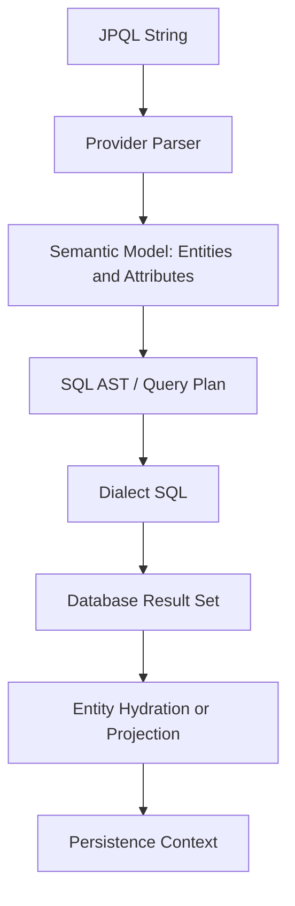
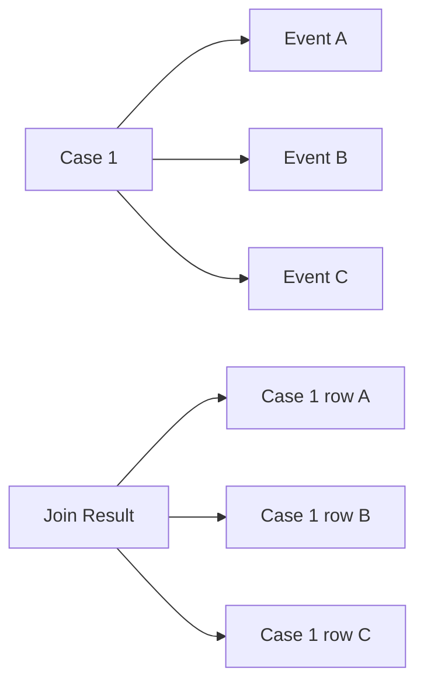

------
title: Learn Java Persistence, Database Integration, JPA, Hibernate ORM & EclipseLink - Part 014
description: Fondasi JPQL sebagai query language berbasis entity model: select, path expression, join, parameter binding, projection, aggregate, bulk update/delete, pagination, dan semantic traps.
series: learn-java-persistence
seriesTitle: Learn Java Persistence, Database Integration, JPA, Hibernate ORM & EclipseLink
order: 14
partTitle: JPQL Foundation
tags:
- java
- persistence
- jpa
- jakarta-persistence
- hibernate
- eclipselink
- orm
- jpql
- query
- entity-query
- sql
- projection
- bulk-update
- series
date: 2026-06-27
---

# JPQL Foundation

> Target part ini: kamu mampu membaca dan menulis JPQL dengan mental model yang benar: JPQL berjalan di atas entity model, bukan table model. Kamu juga mampu mengenali kapan JPQL tepat, kapan projection lebih aman, kapan native SQL lebih jujur, dan failure mode apa yang muncul dari join/fetch/bulk operation.

JPQL sering diajarkan sebagai “SQL untuk JPA”. Itu setengah benar dan setengah berbahaya.

JPQL memang mirip SQL secara sintaks. Tetapi semantic-nya berbeda:

- JPQL memakai **entity name**, bukan table name.
- JPQL memakai **field/property name**, bukan column name.
- JPQL mengembalikan **entity instance atau projection**, bukan row mentah.
- JPQL join mengikuti **association mapping**, bukan hanya FK manual.
- JPQL dieksekusi melalui provider yang menerjemahkannya ke SQL sesuai dialect.
- JPQL entity result dapat masuk ke persistence context dan menjadi managed.

Mental model:



JPQL bukan pengganti pemahaman SQL. JPQL adalah abstraction layer di atas relational querying. Kamu tetap harus memahami SQL yang dihasilkan.

## 1. Lab Domain

Kita akan memakai domain regulatory/enforcement case management.

```java
@Entity
@Table(name = "enforcement_case")
public class EnforcementCase {

    @Id
    private Long id;

    @Column(name = "case_number", nullable = false, length = 64)
    private String caseNumber;

    @Enumerated(EnumType.STRING)
    @Column(name = "status", nullable = false, length = 32)
    private CaseStatus status;

    @Column(name = "regulator_id", nullable = false, length = 64)
    private String regulatorId;

    @Column(name = "created_at", nullable = false)
    private Instant createdAt;

    @ManyToOne(fetch = FetchType.LAZY, optional = false)
    @JoinColumn(name = "subject_party_id", nullable = false)
    private Party subjectParty;

    @OneToMany(mappedBy = "enforcementCase")
    private Set<CaseEvent> events = new HashSet<>();
}
```

```java
@Entity
@Table(name = "party")
public class Party {

    @Id
    private Long id;

    @Column(name = "legal_name", nullable = false)
    private String legalName;

    @Column(name = "registration_number", nullable = false)
    private String registrationNumber;
}
```

```java
@Entity
@Table(name = "case_event")
public class CaseEvent {

    @Id
    private Long id;

    @ManyToOne(fetch = FetchType.LAZY, optional = false)
    @JoinColumn(name = "case_id", nullable = false)
    private EnforcementCase enforcementCase;

    @Enumerated(EnumType.STRING)
    @Column(name = "event_type", nullable = false, length = 64)
    private CaseEventType eventType;

    @Column(name = "occurred_at", nullable = false)
    private Instant occurredAt;
}
```

## 2. JPQL Uses Entity Names

Basic query:

```java
TypedQuery<EnforcementCase> query = entityManager.createQuery(
    "select c from EnforcementCase c where c.status = :status",
    EnforcementCase.class
);
query.setParameter("status", CaseStatus.UNDER_REVIEW);

List<EnforcementCase> cases = query.getResultList();
```

JPQL:

```sql
select c
from EnforcementCase c
where c.status = :status
```

SQL generated might look like:

```sql
select
    ec.id,
    ec.case_number,
    ec.status,
    ec.regulator_id,
    ec.created_at,
    ec.subject_party_id
from enforcement_case ec
where ec.status = ?
```

Perhatikan perbedaan:

| JPQL | SQL |
|---|---|
| `EnforcementCase` | `enforcement_case` |
| `c.status` | `ec.status` |
| `:status` | bind parameter `?` |
| returns entity | returns row columns hydrated into entity |

## 3. Always Prefer TypedQuery for Entity/DTO Result

Bad:

```java
Query query = entityManager.createQuery(
    "select c from EnforcementCase c where c.status = :status"
);
List result = query.getResultList();
```

Better:

```java
TypedQuery<EnforcementCase> query = entityManager.createQuery(
    "select c from EnforcementCase c where c.status = :status",
    EnforcementCase.class
);
```

Benefit:

- compile-time result expectation,
- fewer casts,
- clearer repository contract,
- easier refactoring,
- less accidental scalar/entity mismatch.

## 4. Parameter Binding

Never concatenate user input into JPQL.

Bad:

```java
String jpql = "select c from EnforcementCase c where c.caseNumber = '" + caseNumber + "'";
```

Better:

```java
TypedQuery<EnforcementCase> query = entityManager.createQuery(
    "select c from EnforcementCase c where c.caseNumber = :caseNumber",
    EnforcementCase.class
);
query.setParameter("caseNumber", caseNumber);
```

Named parameters are usually clearer than positional parameters.

```java
query.setParameter("regulatorId", regulatorId);
query.setParameter("status", CaseStatus.UNDER_REVIEW);
```

Instead of:

```java
query.setParameter(1, regulatorId);
query.setParameter(2, CaseStatus.UNDER_REVIEW);
```

## 5. Path Expressions

JPQL path expression navigates entity attributes.

```sql
select c
from EnforcementCase c
where c.subjectParty.registrationNumber = :registrationNumber
```

This navigates:

```text
EnforcementCase.subjectParty.registrationNumber
```

Provider translates association navigation into join SQL.

But be careful: path expression is not free. It may imply joins.

Equivalent explicit join:

```sql
select c
from EnforcementCase c
join c.subjectParty p
where p.registrationNumber = :registrationNumber
```

This is usually clearer for non-trivial queries.

## 6. Explicit Joins

### 6.1 Many-to-One Join

```java
TypedQuery<EnforcementCase> query = entityManager.createQuery(
    """
    select c
    from EnforcementCase c
    join c.subjectParty p
    where p.registrationNumber = :registrationNumber
    """,
    EnforcementCase.class
);
```

This returns cases, not parties.

### 6.2 One-to-Many Join

```java
TypedQuery<EnforcementCase> query = entityManager.createQuery(
    """
    select distinct c
    from EnforcementCase c
    join c.events e
    where e.eventType = :eventType
    """,
    EnforcementCase.class
);
```

Why `distinct`?

A case can have many events. SQL result may contain duplicate case rows. JPQL `distinct` helps ensure distinct entity results. But note: provider behavior can involve both SQL `DISTINCT` and in-memory de-duplication depending on query shape/provider.

Mental model:



Without `distinct`, the Java list may contain repeated references to the same managed entity.

## 7. Inner Join vs Left Join

Inner join:

```sql
select c
from EnforcementCase c
join c.events e
where e.eventType = :eventType
```

Only cases with matching events appear.

Left join:

```sql
select c
from EnforcementCase c
left join c.events e
where e is null
```

This can find cases with no events, depending on query shape.

More common:

```sql
select c
from EnforcementCase c
left join c.events e
where e.eventType = :eventType or e is null
```

But be careful: predicates on the joined entity in the `where` clause may effectively turn a left join into an inner join.

Better when supported by JPQL join condition syntax:

```sql
select c
from EnforcementCase c
left join c.events e on e.eventType = :eventType
where e is null
```

Use generated SQL inspection to verify the intended semantics.

## 8. Fetch Join Is Not Normal Join

Normal join filters or correlates data. It does not necessarily initialize association.

```sql
select c
from EnforcementCase c
join c.subjectParty p
where p.registrationNumber = :registrationNumber
```

`c.subjectParty` may still be lazy proxy depending on provider behavior and selected data.

Fetch join tells provider to load association in same query:

```sql
select c
from EnforcementCase c
join fetch c.subjectParty
where c.status = :status
```

Use fetch join to solve specific fetch-plan needs, not as default.

Important limitations:

- fetch joining multiple collections can explode rows,
- pagination with collection fetch join is dangerous/provider-specific,
- fetch join changes loaded graph,
- fetch join can defeat lazy boundary if overused.

Fetch planning gets a full dedicated part later. For now, remember:

> `join` is query semantics. `join fetch` is query semantics plus loading strategy.

## 9. Filtering with `where`

Simple predicates:

```sql
select c
from EnforcementCase c
where c.status = :status
```

Multiple predicates:

```sql
select c
from EnforcementCase c
where c.status = :status
  and c.regulatorId = :regulatorId
  and c.createdAt >= :from
```

String functions:

```sql
select p
from Party p
where lower(p.legalName) like lower(concat('%', :keyword, '%'))
```

Caution: functions on columns can make normal indexes unusable unless expression indexes exist.

Better for search-heavy fields:

- normalized column,
- dedicated search index,
- full-text search,
- external search engine,
- database-specific index.

## 10. Null Semantics

Bad:

```sql
where c.closedAt = null
```

Correct:

```sql
where c.closedAt is null
```

Not null:

```sql
where c.closedAt is not null
```

Null semantics matter for optional lifecycle dates:

```sql
select c
from EnforcementCase c
where c.closedAt is null
  and c.status <> :closed
```

Potential invariant smell: if `closedAt is null` and `status <> CLOSED` must always align, consider database check constraint or stronger domain model.

## 11. Boolean Expressions

JPQL supports boolean fields, but database representation varies.

```sql
select c
from EnforcementCase c
where c.escalated = true
```

or:

```sql
select c
from EnforcementCase c
where c.escalated = :escalated
```

Parameter form is often easier for dynamic queries.

## 12. Ordering

```sql
select c
from EnforcementCase c
where c.status = :status
order by c.createdAt desc
```

Jakarta Persistence 3.2 improves sorting expressiveness, including more explicit handling for null ordering and scalar expressions in order clauses. Still, portability must be verified across providers/dialects when using advanced ordering.

Example:

```sql
select p
from Party p
order by lower(p.legalName) asc
```

Performance warning: `order by lower(p.legalName)` may require expression index or sort operation.

## 13. Pagination

JPQL pagination is applied through query API:

```java
List<EnforcementCase> page = entityManager.createQuery(
        """
        select c
        from EnforcementCase c
        where c.status = :status
        order by c.createdAt desc, c.id desc
        """,
        EnforcementCase.class
    )
    .setParameter("status", CaseStatus.UNDER_REVIEW)
    .setFirstResult(0)
    .setMaxResults(50)
    .getResultList();
```

Always order deterministically.

Bad:

```sql
order by c.createdAt desc
```

If multiple cases have same timestamp, rows can shift between pages.

Better:

```sql
order by c.createdAt desc, c.id desc
```

Offset pagination problem:

- expensive on deep pages,
- unstable under concurrent inserts,
- duplicates/missing rows possible.

For high-volume audit/event feeds, prefer keyset pagination:

```sql
select e
from CaseEvent e
where e.occurredAt < :lastOccurredAt
   or (e.occurredAt = :lastOccurredAt and e.id < :lastId)
order by e.occurredAt desc, e.id desc
```

## 14. Projection: Entity vs DTO Result

Returning entities is not always right.

Entity result:

```sql
select c
from EnforcementCase c
where c.status = :status
```

Use when:

- caller will modify entity,
- aggregate command requires invariants,
- persistence context identity matters,
- associations may be navigated within transaction.

DTO projection:

```java
public record CaseSummaryView(
    Long id,
    String caseNumber,
    CaseStatus status,
    String partyLegalName,
    Instant createdAt
) {}
```

JPQL constructor expression:

```java
TypedQuery<CaseSummaryView> query = entityManager.createQuery(
    """
    select new com.example.caseapp.CaseSummaryView(
        c.id,
        c.caseNumber,
        c.status,
        p.legalName,
        c.createdAt
    )
    from EnforcementCase c
    join c.subjectParty p
    where c.regulatorId = :regulatorId
    order by c.createdAt desc, c.id desc
    """,
    CaseSummaryView.class
);
```

Use projection when:

- read-only screen/API,
- list page,
- reporting view,
- partial data needed,
- avoiding accidental lazy loading,
- avoiding persistence context bloat.

Rule:

> Commands usually load aggregates. Queries often return projections.

## 15. Scalar Result

Count:

```java
Long count = entityManager.createQuery(
    """
    select count(c)
    from EnforcementCase c
    where c.status = :status
    """,
    Long.class
).setParameter("status", CaseStatus.UNDER_REVIEW)
 .getSingleResult();
```

Multiple scalar values:

```java
List<Object[]> rows = entityManager.createQuery(
    """
    select c.status, count(c)
    from EnforcementCase c
    group by c.status
    """,
    Object[].class
).getResultList();
```

Better: constructor projection.

```java
public record CaseStatusCount(CaseStatus status, long count) {}
```

```java
List<CaseStatusCount> rows = entityManager.createQuery(
    """
    select new com.example.caseapp.CaseStatusCount(c.status, count(c))
    from EnforcementCase c
    group by c.status
    """,
    CaseStatusCount.class
).getResultList();
```

## 16. Aggregation

Example: count cases by regulator and status.

```sql
select c.regulatorId, c.status, count(c)
from EnforcementCase c
group by c.regulatorId, c.status
order by c.regulatorId asc, c.status asc
```

With `having`:

```sql
select c.regulatorId, count(c)
from EnforcementCase c
group by c.regulatorId
having count(c) > :threshold
```

Aggregation is often better as projection. Do not hydrate thousands of entities just to count them in Java.

Bad:

```java
List<EnforcementCase> cases = query.getResultList();
long count = cases.size();
```

Better:

```sql
select count(c)
from EnforcementCase c
where c.status = :status
```

## 17. Subqueries

Example: cases with at least one decision-issued event.

```sql
select c
from EnforcementCase c
where exists (
    select e.id
    from CaseEvent e
    where e.enforcementCase = c
      and e.eventType = :eventType
)
```

Subqueries are useful when join duplication is awkward.

Compare:

```sql
select distinct c
from EnforcementCase c
join c.events e
where e.eventType = :eventType
```

vs:

```sql
select c
from EnforcementCase c
where exists (
    select e.id
    from CaseEvent e
    where e.enforcementCase = c
      and e.eventType = :eventType
)
```

The SQL optimizer may handle them differently. Inspect actual execution plans for critical queries.

## 18. `in` Predicates

```sql
select c
from EnforcementCase c
where c.status in :statuses
```

Java:

```java
query.setParameter("statuses", List.of(
    CaseStatus.UNDER_REVIEW,
    CaseStatus.DECISION_ISSUED
));
```

Watch out:

- empty list handling can be provider/framework-specific,
- very large lists can hurt query planning,
- database parameter limit may be hit.

For large filters, consider:

- temporary table,
- join to persisted filter table,
- batch chunks,
- database-specific array binding,
- native SQL.

## 19. `like` and Escaping

Search by case number prefix:

```sql
select c
from EnforcementCase c
where c.caseNumber like :prefix
```

```java
query.setParameter("prefix", "REG-2026-%");
```

For user search input, escape wildcard characters intentionally.

Bad:

```java
query.setParameter("keyword", "%" + userInput + "%");
```

If user input contains `%` or `_`, it changes meaning.

Better approach:

- escape `%` and `_`,
- use JPQL `escape` if applicable,
- normalize search fields,
- use full-text search for real search requirements.

## 20. Named Queries

Named query:

```java
@Entity
@NamedQuery(
    name = "EnforcementCase.findOpenByRegulator",
    query = """
        select c
        from EnforcementCase c
        where c.regulatorId = :regulatorId
          and c.status <> com.example.CaseStatus.CLOSED
        order by c.createdAt desc, c.id desc
    """
)
public class EnforcementCase {
    // ...
}
```

Use named queries when:

- query is stable,
- query is reused,
- startup validation is desired,
- naming as domain operation improves readability.

Avoid named query overload when:

- query is only used once,
- dynamic composition is required,
- it hides important use-case-specific fetch/projection decisions.

## 21. Bulk Update and Delete

JPQL supports bulk update/delete.

Example:

```java
int updated = entityManager.createQuery(
    """
    update EnforcementCase c
    set c.status = :newStatus
    where c.status = :oldStatus
      and c.createdAt < :cutoff
    """
)
.setParameter("newStatus", CaseStatus.CLOSED)
.setParameter("oldStatus", CaseStatus.UNDER_REVIEW)
.setParameter("cutoff", cutoff)
.executeUpdate();
```

Important:

> Bulk JPQL operations bypass normal entity lifecycle mechanics for already loaded entities.

Consequences:

- persistence context may contain stale managed entities,
- lifecycle callbacks are not applied like per-entity operations,
- optimistic version handling may not behave like aggregate command unless explicitly included,
- domain invariants can be bypassed,
- audit/event generation can be skipped.

Safer pattern:

```java
int updated = entityManager.createQuery(
    """
    update EnforcementCase c
    set c.status = :newStatus,
        c.version = c.version + 1
    where c.status = :oldStatus
      and c.createdAt < :cutoff
    """
)
.setParameter("newStatus", CaseStatus.CLOSED)
.setParameter("oldStatus", CaseStatus.UNDER_REVIEW)
.setParameter("cutoff", cutoff)
.executeUpdate();

entityManager.clear();
```

Still, ask whether bulk update is appropriate for domain data. For enforcement cases, changing status usually requires audit trail and domain event, so per-aggregate command may be safer even if slower.

## 22. Flush Interaction Before Query

JPQL query execution may trigger flush depending on flush mode and transaction state.

Example:

```java
caseEntity.changeStatus(CaseStatus.DECISION_ISSUED);

List<EnforcementCase> openCases = entityManager.createQuery(
    "select c from EnforcementCase c where c.status = :status",
    EnforcementCase.class
).setParameter("status", CaseStatus.UNDER_REVIEW)
 .getResultList();
```

Before executing query, provider may flush pending change so query sees consistent database state.

This can surprise you if pending changes violate constraints.

Symptom:

```text
ConstraintViolationException thrown from query.getResultList()
```

Not because query is wrong, but because query triggered flush.

Part 019 will go deep into flush/dirty checking. For now:

> A JPQL select is not always read-only from the perspective of the persistence context. It can cause pending writes to flush.

## 23. `getSingleResult` Trap

```java
EnforcementCase c = entityManager.createQuery(
    "select c from EnforcementCase c where c.caseNumber = :caseNumber",
    EnforcementCase.class
).setParameter("caseNumber", caseNumber)
 .getSingleResult();
```

Possible outcomes:

- exactly one result: returns entity,
- no result: throws `NoResultException`,
- multiple results: throws `NonUniqueResultException`.

For optional lookup:

```java
List<EnforcementCase> results = entityManager.createQuery(
    "select c from EnforcementCase c where c.caseNumber = :caseNumber",
    EnforcementCase.class
).setParameter("caseNumber", caseNumber)
 .setMaxResults(2)
 .getResultList();

if (results.isEmpty()) {
    return Optional.empty();
}
if (results.size() > 1) {
    throw new IllegalStateException("Duplicate case number: " + caseNumber);
}
return Optional.of(results.get(0));
```

Repository frameworks often provide nicer optional APIs, but the underlying semantics remain important.

## 24. Entity Result and Persistence Context Identity

If a JPQL query returns an entity whose identity is already managed, provider returns the managed instance.

```java
EnforcementCase a = entityManager.find(EnforcementCase.class, 100L);

EnforcementCase b = entityManager.createQuery(
    "select c from EnforcementCase c where c.id = :id",
    EnforcementCase.class
).setParameter("id", 100L)
 .getSingleResult();

assert a == b;
```

This matters because:

- query result may reflect in-memory changes not yet committed,
- repeated queries do not necessarily create new objects,
- stale persistence context can affect perceived result,
- large query result can bloat persistence context.

For read-heavy projection screens, DTO projection avoids unnecessary managed entities.

## 25. Query Hints

JPA query hints allow provider-specific or standard behavior tuning.

Example:

```java
TypedQuery<EnforcementCase> query = entityManager.createQuery(
    "select c from EnforcementCase c where c.status = :status",
    EnforcementCase.class
);
query.setHint("org.hibernate.readOnly", true);
```

Provider-specific hints are escape hatches. They can be valuable, but document them.

Review questions:

- Is the hint standard or provider-specific?
- What happens under EclipseLink?
- Is the hint performance-critical?
- Is there a test/metric proving benefit?
- Is portability intentionally sacrificed?

## 26. JPQL vs Native SQL

Use JPQL when:

- querying entity model,
- portability matters,
- association mapping helps,
- result is entity/DTO simple projection,
- query is not heavily vendor-specific.

Use native SQL when:

- query needs window functions not expressible/portable enough,
- recursive CTE,
- vendor-specific index/operator,
- complex reporting,
- database-specific locking,
- performance-critical query needs exact SQL shape,
- query crosses read models not mapped as entities.

Top engineers do not force JPQL everywhere. They choose the honest abstraction.

## 27. JPQL Semantic Traps

### Trap 1: Thinking JPQL Uses Table Names

Wrong:

```sql
select * from enforcement_case
```

JPQL:

```sql
select c from EnforcementCase c
```

### Trap 2: Join Without Understanding Multiplicity

```sql
select c
from EnforcementCase c
join c.events e
```

Can duplicate cases in result list.

### Trap 3: Fetch Join Everywhere

Solves N+1 locally but can create row explosion globally.

### Trap 4: Entity Result for List Screens

Loads full managed entities when DTO would be cheaper and safer.

### Trap 5: Bulk Update for Domain Transitions

Bypasses aggregate invariants/audit/events.

### Trap 6: Pagination Without Deterministic Order

Unstable pages under concurrent writes.

### Trap 7: Ignoring Generated SQL

JPQL that looks clean may generate terrible SQL.

## 28. Query Design Review Checklist

For every JPQL query, ask:

### Semantic

- [ ] Is result entity, DTO, scalar, or aggregate?
- [ ] Does caller intend to modify result?
- [ ] Does query preserve aggregate boundary?
- [ ] Are predicates aligned with domain invariant?
- [ ] Does query accidentally bypass authorization/tenant filter?

### Mapping

- [ ] Are joins based on correct association?
- [ ] Can multiplicity duplicate root rows?
- [ ] Is `distinct` needed?
- [ ] Is fetch join necessary or harmful?
- [ ] Are lazy associations accessed after transaction?

### Performance

- [ ] What SQL is generated?
- [ ] Is there a matching index?
- [ ] Does ordering require sort?
- [ ] Is pagination stable?
- [ ] Is result size bounded?
- [ ] Does query bloat persistence context?

### Correctness

- [ ] Are parameters bound safely?
- [ ] Are null semantics correct?
- [ ] Are enums mapped safely?
- [ ] Does bulk operation need version/audit/event handling?
- [ ] Does query run under expected flush mode?

## 29. Lab: Build a Case Search Repository

### Requirement

Build a search endpoint for enforcement officers:

- filter by regulator,
- optional status,
- optional party registration number,
- sort newest first,
- return list projection,
- stable pagination.

### DTO

```java
public record CaseSearchResult(
    Long id,
    String caseNumber,
    CaseStatus status,
    String partyLegalName,
    Instant createdAt
) {}
```

### JPQL

```java
public List<CaseSearchResult> search(
    String regulatorId,
    CaseStatus status,
    String partyRegistrationNumber,
    Instant beforeCreatedAt,
    Long beforeId,
    int limit
) {
    String jpql = """
        select new com.example.caseapp.CaseSearchResult(
            c.id,
            c.caseNumber,
            c.status,
            p.legalName,
            c.createdAt
        )
        from EnforcementCase c
        join c.subjectParty p
        where c.regulatorId = :regulatorId
          and (:status is null or c.status = :status)
          and (:partyRegistrationNumber is null or p.registrationNumber = :partyRegistrationNumber)
          and (
              :beforeCreatedAt is null
              or c.createdAt < :beforeCreatedAt
              or (c.createdAt = :beforeCreatedAt and c.id < :beforeId)
          )
        order by c.createdAt desc, c.id desc
        """;

    return entityManager.createQuery(jpql, CaseSearchResult.class)
        .setParameter("regulatorId", regulatorId)
        .setParameter("status", status)
        .setParameter("partyRegistrationNumber", partyRegistrationNumber)
        .setParameter("beforeCreatedAt", beforeCreatedAt)
        .setParameter("beforeId", beforeId)
        .setMaxResults(limit)
        .getResultList();
}
```

### Review

This query is good because:

- returns projection, not managed aggregate,
- bounds result size,
- orders deterministically,
- uses association join intentionally,
- avoids collection fetch join,
- supports keyset pagination.

Potential issues:

- optional filter pattern may hurt index usage,
- dynamic query construction may produce better SQL,
- tenant/regulator authorization must not rely only on caller input,
- `beforeId` null handling must be tested,
- `createdAt` precision must match database column.

This motivates Part 015: Criteria API and type-safe dynamic query construction.

## 30. Kaufman Practice: 2-Hour JPQL Drill

### Drill 1: Entity Query

Write query:

- find cases by status,
- order by createdAt desc/id desc,
- inspect generated SQL,
- verify index usage.

### Drill 2: Association Query

Write query:

- find cases by party registration number,
- use explicit join,
- compare path expression vs explicit join SQL.

### Drill 3: Collection Multiplicity

Write query:

- find cases having event type `DECISION_ISSUED`,
- run with and without `distinct`,
- inspect Java result list.

### Drill 4: Projection

Write DTO projection for case list screen.

Measure:

- number of selected columns,
- persistence context size,
- lazy loading behavior.

### Drill 5: Bulk Operation

Perform bulk update in test.

Then:

- load entity before update,
- execute bulk update,
- observe stale managed entity,
- call `clear`,
- reload and compare.

## 31. Summary

JPQL is powerful because it lets you query the domain persistence model instead of raw tables. But that power has boundaries.

Core mental model:

- JPQL names entities and attributes.
- Provider translates JPQL to SQL.
- Entity results interact with persistence context.
- Joins can multiply rows.
- Fetch joins alter loading plan.
- Projection is often better for read screens.
- Bulk operations bypass normal aggregate lifecycle.
- Generated SQL remains the final truth for performance.

Part berikutnya akan membahas **Criteria API and Type-Safe Query Construction**. Tujuannya bukan mengganti semua JPQL string, tetapi memahami kapan dynamic query composition membutuhkan model yang lebih aman daripada string concatenation.
