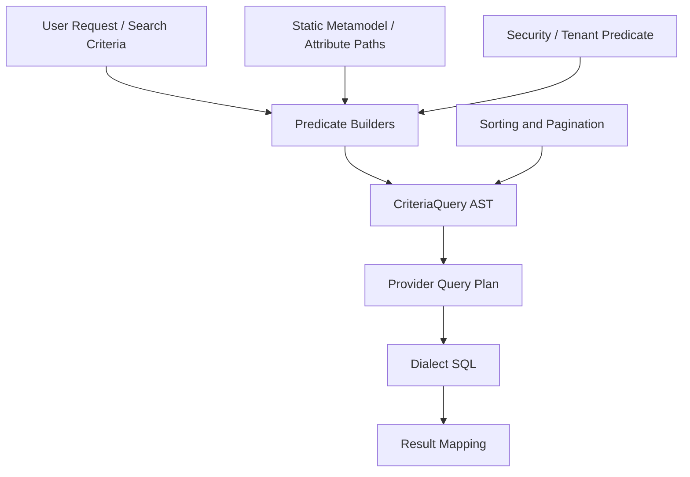
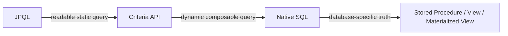

------
title: Learn Java Persistence, Database Integration, JPA, Hibernate ORM & EclipseLink - Part 015
description: Criteria API dan query construction yang type-aware: CriteriaBuilder, CriteriaQuery, Root, Join, Predicate composition, dynamic filtering, pagination, sorting, count query, Specification pattern, dan failure modes.
series: learn-java-persistence
seriesTitle: Learn Java Persistence, Database Integration, JPA, Hibernate ORM & EclipseLink
order: 15
partTitle: Criteria API and Type-Safe Query Construction
tags:
- java
- persistence
- jpa
- jakarta-persistence
- criteria-api
- criteriaquery
- criteriabuilder
- dynamic-query
- specification-pattern
- hibernate
- eclipselink
- orm
- query
- series
date: 2026-06-27
---

# Criteria API and Type-Safe Query Construction

> Target part ini: kamu mampu menggunakan Criteria API bukan sebagai “JPQL yang lebih verbose”, tetapi sebagai mekanisme membangun query secara programatik, composable, refactor-friendly, dan aman untuk use case dynamic search/filtering. Kamu juga mampu mengenali kapan Criteria API layak dipakai, kapan JPQL lebih jujur, dan kapan native SQL lebih tepat.

Criteria API sering dibenci karena verbose. Kritik itu valid, tetapi kurang lengkap.

Criteria API bukan dibuat untuk menggantikan semua JPQL. Criteria API paling bernilai ketika query harus dibangun dari kondisi yang berubah-ubah:

- search form dengan banyak optional filters;
- authorization predicate yang harus selalu dipasang;
- reusable business predicates;
- sorting/pagination dinamis;
- report query yang komposisinya tergantung user input;
- library/repository abstraction yang tidak boleh menyusun string JPQL secara manual.

Mental model yang benar:



Criteria API adalah **query AST builder**. Ia bukan string concatenation. Kamu menyusun object graph yang merepresentasikan query, lalu provider menerjemahkannya menjadi SQL.

## 1. Posisi Criteria API dalam Skill Map

Dari part sebelumnya:

- JPQL cocok untuk query yang eksplisit, stabil, dan mudah dibaca.
- Criteria API cocok untuk query yang dinamis dan perlu komposisi.
- Native SQL cocok ketika abstraction leak sudah terlalu besar.

Criteria API berada di tengah:



Jangan memakai Criteria API hanya karena “type-safe” jika query-nya statis dan sederhana. Kamu akan membayar biaya readability tanpa mendapatkan manfaat komposisi.

Contoh query statis yang lebih baik ditulis JPQL:

```java
@Query("""
    select c
    from EnforcementCase c
    where c.status = :status
      and c.regulatorId = :regulatorId
    order by c.createdAt desc
""")
List<EnforcementCase> findRecentCases(
        CaseStatus status,
        String regulatorId
);
```

Contoh query dinamis yang layak memakai Criteria API:

```text
Search cases by:
- regulatorId: mandatory
- status: optional
- severity: optional
- assigned officer: optional
- createdAt range: optional
- has open escalation: optional
- sort by createdAt, severity, or SLA deadline
```

Jika memakai JPQL string concatenation, query seperti ini rawan error, injection risk jika salah binding, dan sulit diuji sebagai komponen predicate.

## 2. Konsep Inti Criteria API

Objek utama:

| Concept | Peran | Analogi JPQL |
|---|---|---|
| `CriteriaBuilder` | Factory untuk query, predicate, expression, ordering | parser/helper query |
| `CriteriaQuery<T>` | Query top-level dengan result type `T` | `select ...` |
| `Root<T>` | Entity root pada `from` clause | `from EnforcementCase c` |
| `Join<X, Y>` | Join ke association | `join c.assignments a` |
| `Path<T>` | Path ke attribute | `c.status`, `c.createdAt` |
| `Predicate` | Boolean condition | `where ...` |
| `Expression<T>` | Computed expression | `lower(c.caseNumber)` |
| `Order` | Ordering expression | `order by ...` |
| `Subquery<T>` | Nested query | `exists (...)` |

Skeleton dasar:

```java
CriteriaBuilder cb = entityManager.getCriteriaBuilder();

CriteriaQuery<EnforcementCase> cq = cb.createQuery(EnforcementCase.class);
Root<EnforcementCase> root = cq.from(EnforcementCase.class);

cq.select(root)
  .where(cb.equal(root.get("status"), CaseStatus.OPEN))
  .orderBy(cb.desc(root.get("createdAt")));

List<EnforcementCase> result = entityManager
        .createQuery(cq)
        .setMaxResults(50)
        .getResultList();
```

Ini valid, tetapi belum ideal karena memakai string attribute name. Nanti kita bahas static metamodel dan abstraction agar query lebih refactor-friendly.

## 3. Lab Domain

Kita gunakan potongan domain regulatory/enforcement:

```java
@Entity
@Table(name = "enforcement_case")
public class EnforcementCase {

    @Id
    private Long id;

    @Column(name = "case_number", nullable = false, length = 64)
    private String caseNumber;

    @Enumerated(EnumType.STRING)
    @Column(name = "status", nullable = false, length = 32)
    private CaseStatus status;

    @Enumerated(EnumType.STRING)
    @Column(name = "severity", nullable = false, length = 32)
    private CaseSeverity severity;

    @Column(name = "regulator_id", nullable = false, length = 64)
    private String regulatorId;

    @Column(name = "created_at", nullable = false)
    private Instant createdAt;

    @OneToMany(mappedBy = "enforcementCase")
    private Set<CaseAssignment> assignments = new HashSet<>();

    @OneToMany(mappedBy = "enforcementCase")
    private Set<Escalation> escalations = new HashSet<>();
}
```

```java
@Entity
@Table(name = "case_assignment")
public class CaseAssignment {

    @Id
    private Long id;

    @ManyToOne(fetch = FetchType.LAZY, optional = false)
    @JoinColumn(name = "case_id", nullable = false)
    private EnforcementCase enforcementCase;

    @Column(name = "officer_id", nullable = false, length = 64)
    private String officerId;

    @Column(name = "active", nullable = false)
    private boolean active;
}
```

```java
@Entity
@Table(name = "escalation")
public class Escalation {

    @Id
    private Long id;

    @ManyToOne(fetch = FetchType.LAZY, optional = false)
    @JoinColumn(name = "case_id", nullable = false)
    private EnforcementCase enforcementCase;

    @Enumerated(EnumType.STRING)
    @Column(name = "status", nullable = false, length = 32)
    private EscalationStatus status;

    @Column(name = "opened_at", nullable = false)
    private Instant openedAt;
}
```

Search DTO:

```java
public record CaseSearchCriteria(
        String regulatorId,
        Set<CaseStatus> statuses,
        Set<CaseSeverity> severities,
        String assignedOfficerId,
        Instant createdFrom,
        Instant createdTo,
        Boolean hasOpenEscalation,
        String freeText,
        CaseSort sort,
        int page,
        int size
) {}
```

Rule penting:

- `regulatorId` mandatory karena data harus tenant/regulator-scoped.
- filter lain optional.
- authorization predicate tidak boleh optional.
- sorting hanya boleh berdasarkan whitelist.

## 4. Query Minimal dengan Criteria API

```java
public List<EnforcementCase> findOpenCases(String regulatorId) {
    CriteriaBuilder cb = entityManager.getCriteriaBuilder();
    CriteriaQuery<EnforcementCase> cq = cb.createQuery(EnforcementCase.class);
    Root<EnforcementCase> c = cq.from(EnforcementCase.class);

    Predicate byRegulator = cb.equal(c.get("regulatorId"), regulatorId);
    Predicate open = cb.equal(c.get("status"), CaseStatus.OPEN);

    cq.select(c)
      .where(cb.and(byRegulator, open))
      .orderBy(cb.desc(c.get("createdAt")));

    return entityManager.createQuery(cq)
            .setMaxResults(100)
            .getResultList();
}
```

SQL yang mungkin dihasilkan provider:

```sql
select c.*
from enforcement_case c
where c.regulator_id = ?
  and c.status = ?
order by c.created_at desc
fetch first ? rows only
```

Kamu tidak boleh menganggap SQL persis sama antar provider/dialect. Yang harus diuji adalah semantic, parameter binding, execution plan, index usage, dan jumlah query.

## 5. Problem String Attribute Names

Ini rapuh:

```java
c.get("regulatorId")
```

Jika field rename menjadi `authorityId`, compiler tidak membantu.

Solusi umum:

1. static metamodel;
2. constant attribute names;
3. query DSL external;
4. repository method kecil yang teruji;
5. Spring Data Specification sebagai adapter;
6. Hibernate-specific HQL model atau third-party DSL jika diperlukan.

Static metamodel contoh:

```java
@StaticMetamodel(EnforcementCase.class)
public abstract class EnforcementCase_ {
    public static volatile SingularAttribute<EnforcementCase, Long> id;
    public static volatile SingularAttribute<EnforcementCase, String> caseNumber;
    public static volatile SingularAttribute<EnforcementCase, CaseStatus> status;
    public static volatile SingularAttribute<EnforcementCase, CaseSeverity> severity;
    public static volatile SingularAttribute<EnforcementCase, String> regulatorId;
    public static volatile SingularAttribute<EnforcementCase, Instant> createdAt;
    public static volatile SetAttribute<EnforcementCase, CaseAssignment> assignments;
    public static volatile SetAttribute<EnforcementCase, Escalation> escalations;
}
```

Query:

```java
Predicate byRegulator = cb.equal(c.get(EnforcementCase_.regulatorId), regulatorId);
Predicate open = cb.equal(c.get(EnforcementCase_.status), CaseStatus.OPEN);
```

Trade-off:

| Approach | Kelebihan | Kekurangan |
|---|---|---|
| String path | sederhana | rename tidak aman |
| Static metamodel | compiler-aware | perlu annotation processing |
| Constants | ringan | masih tidak type-rich |
| QueryDSL/jOOQ | expressive | dependency dan model tambahan |
| Spring Specification | composable | masih Criteria API di bawahnya |

Untuk internal platform besar, static metamodel atau DSL yang konsisten biasanya lebih baik daripada raw string path tersebar di banyak repository.

## 6. Dynamic Predicate Composition

Jangan membangun query dengan nested `if` yang sulit diuji.

Bad:

```java
if (criteria.statuses() != null) {
    if (criteria.createdFrom() != null) {
        if (criteria.assignedOfficerId() != null) {
            // query construction grows sideways
        }
    }
}
```

Better: kumpulkan predicate secara linear.

```java
public List<EnforcementCase> search(CaseSearchCriteria criteria) {
    CriteriaBuilder cb = entityManager.getCriteriaBuilder();
    CriteriaQuery<EnforcementCase> cq = cb.createQuery(EnforcementCase.class);
    Root<EnforcementCase> c = cq.from(EnforcementCase.class);

    List<Predicate> predicates = new ArrayList<>();

    predicates.add(cb.equal(c.get(EnforcementCase_.regulatorId), criteria.regulatorId()));

    if (criteria.statuses() != null && !criteria.statuses().isEmpty()) {
        predicates.add(c.get(EnforcementCase_.status).in(criteria.statuses()));
    }

    if (criteria.severities() != null && !criteria.severities().isEmpty()) {
        predicates.add(c.get(EnforcementCase_.severity).in(criteria.severities()));
    }

    if (criteria.createdFrom() != null) {
        predicates.add(cb.greaterThanOrEqualTo(
                c.get(EnforcementCase_.createdAt),
                criteria.createdFrom()
        ));
    }

    if (criteria.createdTo() != null) {
        predicates.add(cb.lessThan(
                c.get(EnforcementCase_.createdAt),
                criteria.createdTo()
        ));
    }

    cq.select(c)
      .where(predicates.toArray(Predicate[]::new))
      .orderBy(order(criteria.sort(), cb, c));

    return entityManager.createQuery(cq)
            .setFirstResult(criteria.page() * criteria.size())
            .setMaxResults(criteria.size())
            .getResultList();
}
```

Order whitelist:

```java
private Order order(CaseSort sort, CriteriaBuilder cb, Root<EnforcementCase> c) {
    return switch (sort == null ? CaseSort.NEWEST : sort) {
        case NEWEST -> cb.desc(c.get(EnforcementCase_.createdAt));
        case OLDEST -> cb.asc(c.get(EnforcementCase_.createdAt));
        case SEVERITY_DESC -> cb.desc(c.get(EnforcementCase_.severity));
        case CASE_NUMBER_ASC -> cb.asc(c.get(EnforcementCase_.caseNumber));
    };
}
```

Invariant:

> Dynamic filtering boleh fleksibel. Dynamic column/path selection tidak boleh bebas dari user input tanpa whitelist.

## 7. Reusable Predicate Builders

Kita bisa ubah filter menjadi fungsi kecil.

```java
@FunctionalInterface
public interface CriteriaPredicate<T> {
    Optional<Predicate> toPredicate(
            Root<T> root,
            CriteriaQuery<?> query,
            CriteriaBuilder cb
    );
}
```

Contoh builder:

```java
public static CriteriaPredicate<EnforcementCase> belongsToRegulator(String regulatorId) {
    return (root, query, cb) -> Optional.of(
            cb.equal(root.get(EnforcementCase_.regulatorId), regulatorId)
    );
}

public static CriteriaPredicate<EnforcementCase> hasAnyStatus(Set<CaseStatus> statuses) {
    return (root, query, cb) -> {
        if (statuses == null || statuses.isEmpty()) {
            return Optional.empty();
        }
        return Optional.of(root.get(EnforcementCase_.status).in(statuses));
    };
}

public static CriteriaPredicate<EnforcementCase> createdFrom(Instant from) {
    return (root, query, cb) -> from == null
            ? Optional.empty()
            : Optional.of(cb.greaterThanOrEqualTo(root.get(EnforcementCase_.createdAt), from));
}
```

Composition:

```java
List<CriteriaPredicate<EnforcementCase>> filters = List.of(
        belongsToRegulator(criteria.regulatorId()),
        hasAnyStatus(criteria.statuses()),
        createdFrom(criteria.createdFrom())
);

List<Predicate> predicates = filters.stream()
        .map(filter -> filter.toPredicate(c, cq, cb))
        .flatMap(Optional::stream)
        .toList();
```

Ini membuat predicate bisa dites sebagai unit kecil, meskipun integration test tetap dibutuhkan untuk SQL dan provider behavior.

## 8. Spring Data Specification Bridge

Jika menggunakan Spring Data JPA, konsep yang sama muncul sebagai `Specification<T>`.

```java
public final class CaseSpecifications {

    private CaseSpecifications() {}

    public static Specification<EnforcementCase> belongsToRegulator(String regulatorId) {
        return (root, query, cb) ->
                cb.equal(root.get(EnforcementCase_.regulatorId), regulatorId);
    }

    public static Specification<EnforcementCase> hasAnyStatus(Set<CaseStatus> statuses) {
        return (root, query, cb) -> {
            if (statuses == null || statuses.isEmpty()) {
                return cb.conjunction();
            }
            return root.get(EnforcementCase_.status).in(statuses);
        };
    }

    public static Specification<EnforcementCase> createdBetween(Instant from, Instant to) {
        return (root, query, cb) -> {
            List<Predicate> predicates = new ArrayList<>();
            if (from != null) {
                predicates.add(cb.greaterThanOrEqualTo(root.get(EnforcementCase_.createdAt), from));
            }
            if (to != null) {
                predicates.add(cb.lessThan(root.get(EnforcementCase_.createdAt), to));
            }
            return cb.and(predicates.toArray(Predicate[]::new));
        };
    }
}
```

Usage:

```java
Specification<EnforcementCase> spec = Specification
        .where(CaseSpecifications.belongsToRegulator(criteria.regulatorId()))
        .and(CaseSpecifications.hasAnyStatus(criteria.statuses()))
        .and(CaseSpecifications.createdBetween(criteria.createdFrom(), criteria.createdTo()));

Page<EnforcementCase> page = repository.findAll(spec, pageable);
```

Peringatan:

- Specification mudah menjadi “predicate soup”.
- Jangan letakkan business workflow rule kompleks di Specification.
- Specification bagus untuk filtering; buruk untuk command validation dan aggregate invariant.
- Always-on predicate seperti regulator/tenant/security harus dipasang di satu tempat yang tidak mudah lupa.

## 9. Join dalam Criteria API

JPQL:

```jpql
select distinct c
from EnforcementCase c
join c.assignments a
where a.officerId = :officerId
  and a.active = true
```

Criteria:

```java
CriteriaBuilder cb = entityManager.getCriteriaBuilder();
CriteriaQuery<EnforcementCase> cq = cb.createQuery(EnforcementCase.class);
Root<EnforcementCase> c = cq.from(EnforcementCase.class);

Join<EnforcementCase, CaseAssignment> a = c.join(EnforcementCase_.assignments);

cq.select(c)
  .distinct(true)
  .where(
      cb.equal(a.get(CaseAssignment_.officerId), officerId),
      cb.isTrue(a.get(CaseAssignment_.active))
  );
```

Kenapa `distinct(true)`?

Karena join ke collection dapat menghasilkan duplicate parent row pada SQL result. Provider dapat melakukan deduplication entity, tetapi query result list bisa tetap membutuhkan `distinct` agar semantic jelas.

### Join Type

```java
Join<EnforcementCase, Escalation> e = c.join(
        EnforcementCase_.escalations,
        JoinType.LEFT
);
```

Use case:

- `INNER JOIN`: hanya parent yang punya child matching.
- `LEFT JOIN`: parent tetap muncul walau child tidak ada.
- `LEFT JOIN` + predicate di `where` bisa berubah secara efektif menjadi inner join jika tidak hati-hati.

Contoh jebakan:

```java
Join<EnforcementCase, Escalation> e = c.join(EnforcementCase_.escalations, JoinType.LEFT);

cq.where(cb.equal(e.get(Escalation_.status), EscalationStatus.OPEN));
```

Secara semantic, parent tanpa escalation akan tersingkir karena predicate di `where`. Jika tujuanmu mencari case tanpa open escalation, gunakan `exists/not exists` atau predicate null-aware.

## 10. Exists Subquery

Untuk filter “case yang punya open escalation”, `exists` sering lebih jujur daripada join.

```java
CriteriaBuilder cb = entityManager.getCriteriaBuilder();
CriteriaQuery<EnforcementCase> cq = cb.createQuery(EnforcementCase.class);
Root<EnforcementCase> c = cq.from(EnforcementCase.class);

Subquery<Long> sq = cq.subquery(Long.class);
Root<Escalation> e = sq.from(Escalation.class);

sq.select(e.get(Escalation_.id))
  .where(
      cb.equal(e.get(Escalation_.enforcementCase), c),
      cb.equal(e.get(Escalation_.status), EscalationStatus.OPEN)
  );

cq.select(c)
  .where(
      cb.equal(c.get(EnforcementCase_.regulatorId), regulatorId),
      cb.exists(sq)
  );
```

SQL shape:

```sql
select c.*
from enforcement_case c
where c.regulator_id = ?
  and exists (
      select 1
      from escalation e
      where e.case_id = c.id
        and e.status = ?
  )
```

Rule of thumb:

- gunakan join jika data child diperlukan untuk result/filter sederhana;
- gunakan exists jika hanya mengecek keberadaan child;
- gunakan not exists untuk absence condition;
- bandingkan execution plan pada data nyata.

## 11. Projection dengan Criteria API

Entity result:

```java
CriteriaQuery<EnforcementCase> cq = cb.createQuery(EnforcementCase.class);
```

DTO projection:

```java
public record CaseSummary(
        Long id,
        String caseNumber,
        CaseStatus status,
        CaseSeverity severity,
        Instant createdAt
) {}
```

Criteria projection:

```java
CriteriaQuery<CaseSummary> cq = cb.createQuery(CaseSummary.class);
Root<EnforcementCase> c = cq.from(EnforcementCase.class);

cq.select(cb.construct(
        CaseSummary.class,
        c.get(EnforcementCase_.id),
        c.get(EnforcementCase_.caseNumber),
        c.get(EnforcementCase_.status),
        c.get(EnforcementCase_.severity),
        c.get(EnforcementCase_.createdAt)
));

cq.where(cb.equal(c.get(EnforcementCase_.regulatorId), regulatorId));
```

Use DTO projection ketika:

- result read-only;
- endpoint hanya butuh subset column;
- aggregate terlalu besar;
- ingin menghindari lazy loading dari serialized entity;
- query melintasi banyak aggregate untuk read model.

Jangan pakai entity jika sebenarnya hanya butuh view.

## 12. Tuple Projection

Tuple cocok untuk query ad-hoc internal, tetapi kurang ideal untuk API boundary.

```java
CriteriaQuery<Tuple> cq = cb.createTupleQuery();
Root<EnforcementCase> c = cq.from(EnforcementCase.class);

cq.multiselect(
        c.get(EnforcementCase_.status).alias("status"),
        cb.count(c).alias("total")
);

cq.groupBy(c.get(EnforcementCase_.status));

List<Tuple> rows = entityManager.createQuery(cq).getResultList();

for (Tuple row : rows) {
    CaseStatus status = row.get("status", CaseStatus.class);
    Long total = row.get("total", Long.class);
}
```

Risiko:

- alias typo runtime error;
- weak contract;
- sulit refactor;
- tidak cocok untuk public service boundary.

Untuk reporting serius, lebih baik gunakan explicit record/DTO projection.

## 13. Aggregation and Grouping

Contoh dashboard jumlah case per severity:

```java
public record SeverityCount(CaseSeverity severity, long total) {}

public List<SeverityCount> countBySeverity(String regulatorId) {
    CriteriaBuilder cb = entityManager.getCriteriaBuilder();
    CriteriaQuery<SeverityCount> cq = cb.createQuery(SeverityCount.class);
    Root<EnforcementCase> c = cq.from(EnforcementCase.class);

    cq.select(cb.construct(
            SeverityCount.class,
            c.get(EnforcementCase_.severity),
            cb.count(c)
    ));

    cq.where(cb.equal(c.get(EnforcementCase_.regulatorId), regulatorId));
    cq.groupBy(c.get(EnforcementCase_.severity));
    cq.orderBy(cb.desc(cb.count(c)));

    return entityManager.createQuery(cq).getResultList();
}
```

Peringatan:

- Grouping berdasarkan enum/string harus cocok dengan database cardinality.
- Aggregation query biasanya read model, bukan aggregate mutation model.
- Jangan hydrate entity besar hanya untuk menghitung.

## 14. Count Query untuk Pagination

Pagination butuh dua query:

1. content query;
2. count query.

Content:

```java
CriteriaQuery<CaseSummary> content = cb.createQuery(CaseSummary.class);
Root<EnforcementCase> c = content.from(EnforcementCase.class);

List<Predicate> predicates = buildPredicates(criteria, cb, content, c);

content.select(cb.construct(
        CaseSummary.class,
        c.get(EnforcementCase_.id),
        c.get(EnforcementCase_.caseNumber),
        c.get(EnforcementCase_.status),
        c.get(EnforcementCase_.severity),
        c.get(EnforcementCase_.createdAt)
));
content.where(predicates.toArray(Predicate[]::new));
content.orderBy(order(criteria.sort(), cb, c));

List<CaseSummary> items = entityManager.createQuery(content)
        .setFirstResult(criteria.page() * criteria.size())
        .setMaxResults(criteria.size())
        .getResultList();
```

Count:

```java
CriteriaQuery<Long> count = cb.createQuery(Long.class);
Root<EnforcementCase> countRoot = count.from(EnforcementCase.class);

List<Predicate> countPredicates = buildPredicates(criteria, cb, count, countRoot);

count.select(cb.count(countRoot));
count.where(countPredicates.toArray(Predicate[]::new));

Long total = entityManager.createQuery(count).getSingleResult();
```

Kenapa tidak reuse `Predicate` object dari content query?

Karena predicate terkait dengan root/query tertentu. Reuse semantic builder, bukan reuse instance predicate.

Rule:

> Build predicate twice from same specification, once for content root and once for count root.

## 15. Fetch Join dengan Criteria API

Criteria API punya `fetch`:

```java
CriteriaQuery<EnforcementCase> cq = cb.createQuery(EnforcementCase.class);
Root<EnforcementCase> c = cq.from(EnforcementCase.class);

c.fetch(EnforcementCase_.assignments, JoinType.LEFT);

cq.select(c)
  .distinct(true)
  .where(cb.equal(c.get(EnforcementCase_.regulatorId), regulatorId));
```

Kapan fetch join tepat?

- Query mengembalikan entity aggregate root.
- Use case memang butuh association itu segera.
- Result size terkontrol.
- Tidak dipakai untuk pagination collection fetch join secara sembarangan.

Peringatan besar:

> Pagination + collection fetch join adalah kombinasi berisiko. SQL row multiplication membuat page boundary tidak selalu sama dengan parent boundary. Provider mungkin melakukan in-memory pagination atau memberi warning/error tergantung konfigurasi/version.

Better options:

1. Query IDs page terlebih dahulu.
2. Fetch details by IDs dengan fetch join/entity graph.
3. Gunakan DTO projection untuk list view.
4. Gunakan batch fetching provider-specific untuk lazy associations.

Two-step pattern:

```java
List<Long> ids = findCaseIds(criteria);
List<EnforcementCase> cases = findCasesWithAssignments(ids);
```

## 16. Bulk Update/Delete Criteria

Criteria API juga punya `CriteriaUpdate` dan `CriteriaDelete`.

Contoh bulk update:

```java
CriteriaBuilder cb = entityManager.getCriteriaBuilder();
CriteriaUpdate<EnforcementCase> update = cb.createCriteriaUpdate(EnforcementCase.class);
Root<EnforcementCase> c = update.from(EnforcementCase.class);

update.set(c.get(EnforcementCase_.status), CaseStatus.CLOSED)
      .where(
          cb.equal(c.get(EnforcementCase_.regulatorId), regulatorId),
          cb.lessThan(c.get(EnforcementCase_.createdAt), cutoff)
      );

int affected = entityManager.createQuery(update).executeUpdate();
```

Critical invariant:

> Bulk update/delete bypasses managed entity state synchronization. Persistence context may become stale.

Setelah bulk operation:

```java
entityManager.clear();
```

atau pastikan operation berjalan di transaction/persistence context terpisah.

Jangan bulk update entity yang sedang dikelola lalu berharap object in-memory ikut berubah.

## 17. Predicate Semantics: `conjunction` and `disjunction`

`cb.conjunction()` berarti predicate always true.

```java
return cb.conjunction();
```

`cb.disjunction()` berarti predicate always false.

```java
return cb.disjunction();
```

Use cases:

- optional filter kosong: `conjunction()`;
- invalid empty `IN` untuk required filter: `disjunction()`;
- authorization denies all: `disjunction()`.

Contoh:

```java
public static Specification<EnforcementCase> hasVisibleRegulators(Set<String> regulatorIds) {
    return (root, query, cb) -> {
        if (regulatorIds == null || regulatorIds.isEmpty()) {
            return cb.disjunction();
        }
        return root.get(EnforcementCase_.regulatorId).in(regulatorIds);
    };
}
```

Ini lebih aman daripada menghapus predicate dan tanpa sengaja membuka semua data.

## 18. Free Text Search: Be Honest

Criteria API bisa membuat `like`:

```java
String pattern = "%" + escapeLike(criteria.freeText().toLowerCase(Locale.ROOT)) + "%";

Predicate caseNumberLike = cb.like(
        cb.lower(c.get(EnforcementCase_.caseNumber)),
        pattern,
        '\\'
);
```

Tetapi free text search sering lebih baik memakai:

- database full-text index;
- search engine;
- provider-specific function;
- generated/search column;
- native SQL.

Jangan berpura-pura `lower(column) like '%term%'` adalah production-grade search pada dataset besar.

Minimal helper:

```java
private static String escapeLike(String input) {
    return input
            .replace("\\", "\\\\")
            .replace("%", "\\%")
            .replace("_", "\\_");
}
```

Even then, check index behavior. Leading wildcard usually kills normal B-tree index usage.

## 19. Database Functions

Criteria API menyediakan `function` untuk fungsi database.

```java
Expression<String> normalizedCaseNumber = cb.function(
        "lower",
        String.class,
        c.get(EnforcementCase_.caseNumber)
);
```

Atau function khusus:

```java
Expression<Boolean> matches = cb.function(
        "case_search_matches",
        Boolean.class,
        c.get(EnforcementCase_.id),
        cb.literal(criteria.freeText())
);
```

Trade-off:

- portable Criteria API turun menjadi database-specific call;
- masih lebih aman daripada string concatenation;
- test harus mencakup dialect target;
- migration antar database menjadi lebih mahal.

Decision rule:

> Jika function adalah bagian core business query dan tidak portable, dokumentasikan sebagai deliberate database dependency, bukan accidental provider behavior.

## 20. Security and Tenant Predicate as Non-Optional

Dalam regulatory system, data leak lintas regulator adalah insiden serius.

Jangan mengandalkan caller untuk selalu mengisi predicate.

Bad:

```java
repository.search(criteria); // maybe regulatorId is null
```

Better:

```java
public Page<CaseSummary> searchVisibleCases(
        CaseSearchCriteria criteria,
        CaseVisibilityScope scope
) {
    requireNonNull(scope);
    requireNonEmpty(scope.regulatorIds());

    // always add visibility predicate
}
```

Visibility scope:

```java
public record CaseVisibilityScope(
        String userId,
        Set<String> regulatorIds,
        Set<String> permissions
) {}
```

Predicate:

```java
private Predicate visibleTo(
        CaseVisibilityScope scope,
        Root<EnforcementCase> c,
        CriteriaBuilder cb
) {
    if (scope.regulatorIds().isEmpty()) {
        return cb.disjunction();
    }
    return c.get(EnforcementCase_.regulatorId).in(scope.regulatorIds());
}
```

Invariant:

> Security predicate belongs in repository/query boundary, not in controller convenience code.

## 21. Sorting: Never Trust Raw Client Input

Bad:

```java
cq.orderBy(cb.asc(c.get(request.sortField())));
```

This is not SQL injection in the same way as string SQL, but it is still a contract and availability risk:

- unknown attribute runtime error;
- sorting by unindexed column;
- sorting by sensitive derived path;
- accidental join explosion;
- unstable pagination.

Whitelist:

```java
public enum CaseSort {
    NEWEST,
    OLDEST,
    SEVERITY_DESC,
    SLA_DEADLINE_ASC,
    CASE_NUMBER_ASC
}
```

Mapping:

```java
private List<Order> orders(CaseSort sort, CriteriaBuilder cb, Root<EnforcementCase> c) {
    return switch (sort == null ? CaseSort.NEWEST : sort) {
        case NEWEST -> List.of(
                cb.desc(c.get(EnforcementCase_.createdAt)),
                cb.desc(c.get(EnforcementCase_.id))
        );
        case OLDEST -> List.of(
                cb.asc(c.get(EnforcementCase_.createdAt)),
                cb.asc(c.get(EnforcementCase_.id))
        );
        case SEVERITY_DESC -> List.of(
                cb.desc(c.get(EnforcementCase_.severity)),
                cb.desc(c.get(EnforcementCase_.createdAt)),
                cb.desc(c.get(EnforcementCase_.id))
        );
        case CASE_NUMBER_ASC -> List.of(
                cb.asc(c.get(EnforcementCase_.caseNumber)),
                cb.asc(c.get(EnforcementCase_.id))
        );
        case SLA_DEADLINE_ASC -> List.of(
                cb.asc(c.get("slaDeadlineAt")),
                cb.asc(c.get(EnforcementCase_.id))
        );
    };
}
```

Always include deterministic tie-breaker such as `id` for stable pagination.

## 22. Offset Pagination vs Keyset Pagination

Criteria API often pairs with offset pagination:

```java
query.setFirstResult(page * size);
query.setMaxResults(size);
```

This is simple but can degrade for deep pages.

For high-volume case queues, keyset pagination is often better:

```text
where (created_at, id) < (:lastCreatedAt, :lastId)
order by created_at desc, id desc
limit :size
```

Criteria version:

```java
Predicate beforeLastCreated = cb.lessThan(
        c.get(EnforcementCase_.createdAt),
        cursor.createdAt()
);

Predicate sameCreatedLowerId = cb.and(
        cb.equal(c.get(EnforcementCase_.createdAt), cursor.createdAt()),
        cb.lessThan(c.get(EnforcementCase_.id), cursor.id())
);

Predicate seek = cb.or(beforeLastCreated, sameCreatedLowerId);
```

Use keyset when:

- queue can be large;
- users scroll forward;
- sort order is stable;
- you have composite index matching order.

Use offset when:

- result set is small;
- random page access matters;
- simplicity matters more than deep-page performance.

## 23. Query Object Pattern

For complex search, avoid putting all Criteria code in repository method.

```java
public final class CaseSearchQuery {

    private final EntityManager entityManager;

    public CaseSearchQuery(EntityManager entityManager) {
        this.entityManager = entityManager;
    }

    public PageResult<CaseSummary> execute(
            CaseSearchCriteria criteria,
            CaseVisibilityScope scope
    ) {
        CriteriaBuilder cb = entityManager.getCriteriaBuilder();

        List<CaseSummary> items = fetchItems(criteria, scope, cb);
        long total = count(criteria, scope, cb);

        return new PageResult<>(items, total, criteria.page(), criteria.size());
    }
}
```

Repository becomes thin:

```java
public PageResult<CaseSummary> search(CaseSearchCriteria criteria, CaseVisibilityScope scope) {
    return new CaseSearchQuery(entityManager).execute(criteria, scope);
}
```

Benefits:

- query logic is cohesive;
- easier integration tests;
- separate methods for predicates/order/projection/count;
- avoids god repository;
- search query becomes reviewable artifact.

## 24. Criteria API Testing Strategy

Do not unit test CriteriaBuilder mocks. That creates low-value tests.

Better test layers:

### 24.1 Predicate Policy Unit Tests

Test pure decisions:

```java
@Test
void emptyVisibilityScopeDeniesAll() {
    CaseVisibilityScope scope = new CaseVisibilityScope("u1", Set.of(), Set.of());
    assertThat(scope.regulatorIds()).isEmpty();
}
```

### 24.2 Integration Tests with Testcontainers

Test actual query behavior:

```java
@Test
void searchFiltersByRegulatorAndStatus() {
    seed.caseFor("REG-A", CaseStatus.OPEN);
    seed.caseFor("REG-B", CaseStatus.OPEN);
    seed.caseFor("REG-A", CaseStatus.CLOSED);

    PageResult<CaseSummary> result = repository.search(
            new CaseSearchCriteria(
                    "REG-A",
                    Set.of(CaseStatus.OPEN),
                    null,
                    null,
                    null,
                    null,
                    null,
                    null,
                    CaseSort.NEWEST,
                    0,
                    20
            ),
            scopeFor("REG-A")
    );

    assertThat(result.items()).hasSize(1);
    assertThat(result.items().getFirst().status()).isEqualTo(CaseStatus.OPEN);
}
```

### 24.3 SQL Shape Tests

Enable SQL logging/statistics for targeted tests:

- assert no unexpected N+1;
- assert count query does not fetch join collection;
- assert pagination is applied;
- inspect execution plan in performance tests.

Do not overfit tests to exact SQL string unless you deliberately own dialect/provider version.

## 25. Provider Notes: Hibernate and EclipseLink

### Hibernate

Hibernate supports Jakarta Criteria API and also has provider-specific query capabilities. Criteria queries still go through Hibernate query planning and SQL generation. Hibernate behavior around fetch join pagination, query hints, plan caching, and SQL generation should be validated on the version you run in production.

Useful operational checks:

- enable Hibernate SQL logging for development;
- enable statistics in controlled environments;
- verify generated SQL after provider upgrades;
- track query plan cache pressure for highly dynamic query shapes;
- avoid generating thousands of structurally unique queries when parameters would suffice.

### EclipseLink

EclipseLink supports Jakarta Criteria API and has its own expression/fetch group/query hint ecosystem. If portability matters, keep Criteria code within spec APIs unless a provider-specific feature is intentionally adopted.

Portability warning:

> Criteria API is standardized; generated SQL, fetch behavior, hints, function support, and performance characteristics are provider/dialect-specific.

## 26. Common Failure Modes

| Failure Mode | Symptom | Root Cause | Correction |
|---|---|---|---|
| Criteria everywhere | Code unreadable | API used for static queries | Use JPQL for stable queries |
| String path typo | Runtime error | No metamodel | Static metamodel/constants/tests |
| Missing security predicate | Cross-tenant data leak | Optional scope filter | Non-optional visibility scope |
| Empty `IN` bug | SQL error or unexpected result | Empty collection not handled | `disjunction()` or skip by rule |
| Join duplicates | Duplicate parent results | Collection join row multiplication | `distinct`, exists, or DTO |
| Fetch join pagination bug | Wrong page/performance issue | Parent row vs SQL row mismatch | two-step fetch or DTO |
| Count query wrong | inflated total | join duplicates | `countDistinct` or exists |
| Predicate instance reuse | provider/runtime error | predicate tied to root/query | reuse builder, not predicate instance |
| Dynamic sort abuse | slow query or error | user controls path | enum whitelist |
| Like search slow | full table scan | leading wildcard/lower function | full-text index/search system |
| Bulk stale state | entity memory inconsistent | bulk bypasses context | clear context/isolated transaction |

## 27. Design Checklist

Before approving a Criteria API query, ask:

1. Is the query genuinely dynamic enough to justify Criteria API?
2. Are mandatory security/tenant predicates impossible to forget?
3. Are user-controlled filters parameterized and validated?
4. Is sorting whitelisted and deterministic?
5. Does pagination have a stable tie-breaker?
6. Does the count query match content query semantics?
7. Are joins necessary, or would `exists` be cleaner?
8. Are collection fetch joins avoided with pagination?
9. Are projections used for read models instead of hydrating huge entities?
10. Is generated SQL inspected on realistic data?
11. Are indexes aligned with predicates and order?
12. Are provider-specific functions documented as deliberate dependencies?
13. Is the query tested with the same database family as production?

## 28. Practice Lab

### Lab 1: Build Dynamic Case Search

Implement:

```java
PageResult<CaseSummary> searchCases(
        CaseSearchCriteria criteria,
        CaseVisibilityScope scope
);
```

Requirements:

- mandatory visibility predicate;
- optional status/severity/date filters;
- optional active officer filter;
- optional open escalation filter using `exists`;
- DTO projection;
- stable sorting;
- offset pagination;
- separate count query.

### Lab 2: Add Keyset Pagination

Add:

```java
CursorPage<CaseSummary> searchCasesAfter(
        CaseSearchCriteria criteria,
        CaseVisibilityScope scope,
        CaseCursor cursor
);
```

Requirements:

- sort by `createdAt desc, id desc`;
- cursor contains last `createdAt` and `id`;
- no offset;
- index recommendation documented.

### Lab 3: Compare JPQL vs Criteria

Write the same query in JPQL and Criteria:

- query readability;
- ease of dynamic composition;
- generated SQL;
- failure modes;
- test complexity.

## 29. Mental Model Summary

Criteria API is not “better JPQL”. It is a programmatic query model.

Use it when query shape is dynamic, predicates are composable, or framework abstractions need to build queries safely. Avoid it when query is static and JPQL is clearer.

The top 1% persistence engineer does not ask, “Can I build this query with Criteria API?”

They ask:

- What is the semantic shape of the query?
- Is the result an aggregate, a projection, or a report row?
- What predicates are mandatory for safety?
- What SQL shape will this produce?
- Will this still perform on realistic data?
- Is this query readable enough to review under incident pressure?

## References

- Jakarta Persistence 3.2 Specification
- Jakarta Persistence Criteria API Javadocs: `CriteriaBuilder`, `CriteriaQuery`, `Root`, `Join`, `Predicate`, `CriteriaUpdate`, `CriteriaDelete`
- Jakarta EE Tutorial: Criteria API overview
- Hibernate ORM User Guide: query, criteria, fetching, SQL generation, query plan behavior
- EclipseLink Documentation: JPA Criteria, query hints, fetch groups, provider extensions
