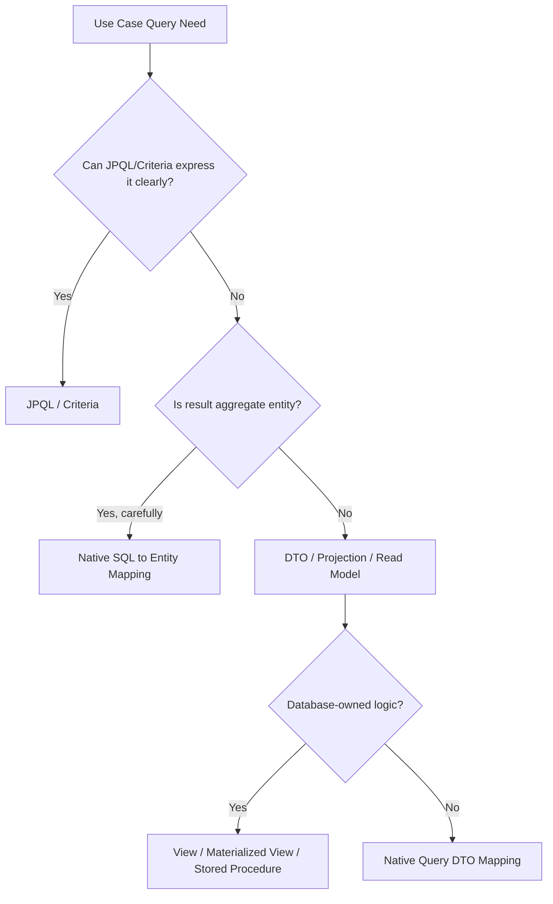
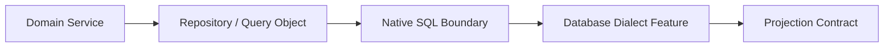

------
title: Learn Java Persistence, Database Integration, JPA, Hibernate ORM & EclipseLink - Part 016
description: Native SQL, stored procedures, and projection models sebagai escape hatch yang terkontrol: createNativeQuery, SqlResultSetMapping, ConstructorResult, DTO/read model, stored procedure boundary, database-specific features, dan anti-pattern.
series: learn-java-persistence
seriesTitle: Learn Java Persistence, Database Integration, JPA, Hibernate ORM & EclipseLink
order: 16
partTitle: Native SQL, Stored Procedures, and Projection Models
tags:
- java
- persistence
- jpa
- jakarta-persistence
- native-sql
- stored-procedure
- projection
- dto
- sqlresultsetmapping
- constructorresult
- hibernate
- eclipselink
- orm
- query
- series
date: 2026-06-27
---

# Native SQL, Stored Procedures, and Projection Models

> Target part ini: kamu mampu menggunakan native SQL dan stored procedure sebagai escape hatch yang terkendali, bukan sebagai jalan pintas acak. Kamu juga mampu memilih antara entity result, DTO projection, interface/read model, database view, stored procedure, dan provider-specific mapping berdasarkan konsekuensi arsitekturalnya.

JPA/JPQL/Criteria memberi abstraction di atas database. Tetapi production systems tidak hidup di dunia abstraction murni.

Ada saatnya native SQL lebih jujur:

- query memakai window function;
- recursive query;
- full-text search;
- CTE kompleks;
- query plan harus sangat spesifik;
- database view/materialized view sudah menjadi contract;
- reporting/read model lintas aggregate;
- stored procedure sudah menjadi governance boundary;
- migration dari legacy database;
- vendor-specific feature adalah keputusan sadar.

Native SQL bukan kegagalan ORM. Native SQL menjadi masalah ketika dipakai tanpa boundary, tanpa mapping contract, tanpa test, dan tanpa observability.

Mental model:



Native query design starts by asking: **what is the result contract?**

## 1. Native SQL as Explicit Boundary

Native SQL should be treated as a boundary crossing:



The repository/query object must hide:

- table names;
- column aliases;
- dialect syntax;
- result set mapping;
- stored procedure parameter mechanics.

The service layer should see:

```java
List<CaseQueueRow> findQueue(CaseQueueFilter filter, CaseVisibilityScope scope);
```

not:

```java
List<Object[]> findByNativeSql(String sql, Map<String, Object> params);
```

## 2. Use Case Taxonomy

| Use Case | Preferred Query Style | Reason |
|---|---|---|
| Load aggregate by ID | EntityManager/JPQL | lifecycle + identity map |
| Dynamic search over entity fields | Criteria/Specification | composable predicates |
| Simple static entity query | JPQL | readable and portable |
| API list view | DTO projection | avoids unnecessary entity hydration |
| Dashboard aggregation | JPQL/Criteria/native depending complexity | result is read model |
| Full-text search | native SQL/search engine | database/search-specific |
| Window ranking | native SQL | JPQL cannot express all shapes cleanly |
| Recursive hierarchy | native SQL/CTE | database feature |
| Legacy DB procedure | StoredProcedureQuery | database-owned contract |
| Heavy operational report | view/materialized view/native SQL | stable read contract |

Native SQL should usually return **projection**, not managed entities, unless you have a strong reason.

## 3. Lab Domain

We continue with regulatory/enforcement case management.

Queue screen requirements:

- show visible cases for officer;
- include current status/severity;
- include number of open escalations;
- include latest escalation time;
- include rank by SLA deadline;
- support regulator scope;
- return read-only rows.

DTO:

```java
public record CaseQueueRow(
        Long caseId,
        String caseNumber,
        CaseStatus status,
        CaseSeverity severity,
        Instant createdAt,
        Instant slaDeadlineAt,
        long openEscalationCount,
        Instant latestEscalationAt,
        int queueRank
) {}
```

This is not an aggregate. This is a read model.

Do not load `EnforcementCase` entities and walk lazy collections just to render this table.

## 4. Basic Native Query

```java
@SuppressWarnings("unchecked")
public List<Object[]> findRawRows(String regulatorId) {
    return entityManager.createNativeQuery("""
            select
                c.id,
                c.case_number,
                c.status,
                c.severity,
                c.created_at
            from enforcement_case c
            where c.regulator_id = :regulatorId
            order by c.created_at desc
            """)
            .setParameter("regulatorId", regulatorId)
            .setMaxResults(50)
            .getResultList();
}
```

This works, but `Object[]` is a weak contract.

Problems:

- index-based access is fragile;
- numeric types may vary by driver/dialect;
- enum conversion manual;
- timestamp conversion manual;
- service layer can become polluted;
- refactoring column order breaks code silently.

Use `Object[]` only inside a small adapter and convert immediately.

```java
private CaseQueueRow map(Object[] row) {
    return new CaseQueueRow(
            ((Number) row[0]).longValue(),
            (String) row[1],
            CaseStatus.valueOf((String) row[2]),
            CaseSeverity.valueOf((String) row[3]),
            ((Timestamp) row[4]).toInstant(),
            ((Timestamp) row[5]).toInstant(),
            ((Number) row[6]).longValue(),
            row[7] == null ? null : ((Timestamp) row[7]).toInstant(),
            ((Number) row[8]).intValue()
    );
}
```

Better: make mapping explicit with aliases or result set mapping.

## 5. Native Query to Entity

JPA allows native query returning entity class:

```java
List<EnforcementCase> cases = entityManager
        .createNativeQuery("""
            select c.*
            from enforcement_case c
            where c.regulator_id = :regulatorId
            order by c.created_at desc
            """, EnforcementCase.class)
        .setParameter("regulatorId", regulatorId)
        .getResultList();
```

Use with caution.

Entity native result is appropriate when:

- selected columns fully satisfy entity mapping;
- result rows represent one entity type cleanly;
- you want managed entities;
- query is still aggregate-oriented;
- no partial entity illusion.

Avoid:

```sql
select c.id, c.case_number
from enforcement_case c
```

mapped to `EnforcementCase.class`.

Partial entity hydration is dangerous because entity invariants and persistence context assumptions may be violated. If you need partial data, return DTO projection.

## 6. DTO Projection with Manual Mapping

For complex native SQL, manual mapping can be the most explicit and maintainable.

```java
public List<CaseQueueRow> findQueue(CaseQueueFilter filter, CaseVisibilityScope scope) {
    Query query = entityManager.createNativeQuery("""
            select
                c.id as case_id,
                c.case_number as case_number,
                c.status as status,
                c.severity as severity,
                c.created_at as created_at,
                c.sla_deadline_at as sla_deadline_at,
                count(e.id) filter (where e.status = 'OPEN') as open_escalation_count,
                max(e.opened_at) as latest_escalation_at,
                dense_rank() over (
                    order by c.sla_deadline_at asc, c.id asc
                ) as queue_rank
            from enforcement_case c
            left join escalation e on e.case_id = c.id
            where c.regulator_id = any(:regulatorIds)
            group by
                c.id,
                c.case_number,
                c.status,
                c.severity,
                c.created_at,
                c.sla_deadline_at
            order by c.sla_deadline_at asc, c.id asc
            limit :limit
            offset :offset
            """);

    query.setParameter("regulatorIds", scope.regulatorIds().toArray(String[]::new));
    query.setParameter("limit", filter.size());
    query.setParameter("offset", filter.page() * filter.size());

    @SuppressWarnings("unchecked")
    List<Object[]> rows = query.getResultList();

    return rows.stream()
            .map(this::mapCaseQueueRow)
            .toList();
}
```

This example is PostgreSQL-flavored:

- `filter (where ...)`;
- `any(:regulatorIds)`;
- `dense_rank()`;
- `limit/offset`.

That is fine if PostgreSQL is an explicit platform choice. It is not portable JPQL.

Document that dependency.

## 7. `@SqlResultSetMapping`

Jakarta Persistence supports result set mappings.

Example:

```java
@SqlResultSetMapping(
    name = "CaseQueueRowMapping",
    classes = @ConstructorResult(
        targetClass = CaseQueueRow.class,
        columns = {
            @ColumnResult(name = "case_id", type = Long.class),
            @ColumnResult(name = "case_number", type = String.class),
            @ColumnResult(name = "status", type = String.class),
            @ColumnResult(name = "severity", type = String.class),
            @ColumnResult(name = "created_at", type = Instant.class),
            @ColumnResult(name = "sla_deadline_at", type = Instant.class),
            @ColumnResult(name = "open_escalation_count", type = Long.class),
            @ColumnResult(name = "latest_escalation_at", type = Instant.class),
            @ColumnResult(name = "queue_rank", type = Integer.class)
        }
    )
)
@Entity
@Table(name = "enforcement_case")
public class EnforcementCase {
    @Id
    private Long id;
}
```

Then:

```java
@SuppressWarnings("unchecked")
public List<CaseQueueRow> findQueueRows(String regulatorId) {
    return entityManager
            .createNativeQuery("""
                select
                    c.id as case_id,
                    c.case_number as case_number,
                    c.status as status,
                    c.severity as severity,
                    c.created_at as created_at,
                    c.sla_deadline_at as sla_deadline_at,
                    0 as open_escalation_count,
                    null as latest_escalation_at,
                    1 as queue_rank
                from enforcement_case c
                where c.regulator_id = :regulatorId
                """, "CaseQueueRowMapping")
            .setParameter("regulatorId", regulatorId)
            .getResultList();
}
```

Important caveat:

- constructor parameter order matters;
- enum conversion may need manual handling if mapping from string to enum is not supported as desired;
- `Instant` mapping from native result depends on provider/driver behavior;
- `@SqlResultSetMapping` lives on entity/mapped superclass metadata, which can feel awkward for read-model-only mappings.

For many teams, manual mapping inside a query object is clearer than annotation-heavy global mappings.

## 8. Named Native Query

```java
@NamedNativeQuery(
    name = "EnforcementCase.findQueueRows",
    query = """
        select
            c.id as case_id,
            c.case_number as case_number,
            c.status as status,
            c.severity as severity,
            c.created_at as created_at,
            c.sla_deadline_at as sla_deadline_at,
            count(e.id) as open_escalation_count,
            max(e.opened_at) as latest_escalation_at,
            dense_rank() over (order by c.sla_deadline_at asc, c.id asc) as queue_rank
        from enforcement_case c
        left join escalation e
            on e.case_id = c.id
           and e.status = 'OPEN'
        where c.regulator_id = :regulatorId
        group by
            c.id,
            c.case_number,
            c.status,
            c.severity,
            c.created_at,
            c.sla_deadline_at
        order by c.sla_deadline_at asc, c.id asc
        """,
    resultSetMapping = "CaseQueueRowMapping"
)
```

Use named native query when:

- query is stable and reused;
- mapping is part of persistence metadata;
- startup validation is valuable;
- you want query names discoverable.

Avoid when:

- query is highly dynamic;
- query depends on runtime-composed filters;
- annotation placement makes ownership unclear.

## 9. Projection Models

Projection is not one thing.

| Projection Type | Example | Use Case |
|---|---|---|
| Entity | `EnforcementCase` | aggregate mutation/read with lifecycle |
| DTO record | `CaseSummary` | API/read model |
| Tuple/Object[] | `Object[]` | internal adapter only |
| Interface projection | Spring Data interface | simple read query |
| Database view entity | `@Immutable CaseQueueView` | stable read model |
| Materialized view | `case_queue_mv` | heavy report/query acceleration |
| Stored procedure result | cursor/result set | DB-owned workflow/report |

The key question:

> Is this result meant to be modified as domain state, or consumed as read-only information?

If read-only, projection is usually better than entity.

## 10. Database View as Read Model

A database view can become a stable contract:

```sql
create view case_queue_view as
select
    c.id as case_id,
    c.case_number,
    c.status,
    c.severity,
    c.created_at,
    c.sla_deadline_at,
    count(e.id) filter (where e.status = 'OPEN') as open_escalation_count,
    max(e.opened_at) as latest_escalation_at
from enforcement_case c
left join escalation e on e.case_id = c.id
group by
    c.id,
    c.case_number,
    c.status,
    c.severity,
    c.created_at,
    c.sla_deadline_at;
```

Map as read-only entity/provider-specific immutable model:

```java
@Entity
@Table(name = "case_queue_view")
@org.hibernate.annotations.Immutable
public class CaseQueueView {

    @Id
    @Column(name = "case_id")
    private Long caseId;

    @Column(name = "case_number")
    private String caseNumber;

    @Enumerated(EnumType.STRING)
    @Column(name = "status")
    private CaseStatus status;

    @Enumerated(EnumType.STRING)
    @Column(name = "severity")
    private CaseSeverity severity;

    @Column(name = "open_escalation_count")
    private long openEscalationCount;
}
```

Portability note:

- JPA has no standard `@Immutable` entity annotation.
- Hibernate provides `@Immutable`.
- EclipseLink has its own read-only/query hint mechanisms.
- You can also enforce read-only by code conventions and database permissions.

Use database view when:

- read model is stable;
- query is shared across services/reports;
- SQL complexity should be database-owned;
- operational DBAs need direct visibility;
- read model can be versioned through migrations.

Avoid when:

- business logic becomes hidden and untested;
- view changes frequently with UI experiments;
- ownership between app and database team is unclear.

## 11. Materialized View

Materialized view trades freshness for speed.

Good for:

- heavy dashboard;
- daily/monthly regulatory reports;
- high-cost aggregation;
- read-mostly datasets.

Questions before using:

1. How stale may data be?
2. Who refreshes it?
3. Is refresh blocking or concurrent?
4. What happens during refresh failure?
5. Is the materialized view part of migration lifecycle?
6. Are consumers aware of freshness semantics?

Materialized view should expose freshness:

```sql
select
    report_date,
    generated_at,
    regulator_id,
    open_case_count,
    breached_sla_count
from regulator_case_daily_mv;
```

Service contract:

```java
public record DailyRegulatorCaseReport(
        LocalDate reportDate,
        Instant generatedAt,
        String regulatorId,
        long openCaseCount,
        long breachedSlaCount
) {}
```

Freshness is part of the model, not an implementation detail.

## 12. Stored Procedure Boundary

Stored procedure can be valid when:

- database already owns critical logic;
- legacy system contract exists;
- batch/reporting logic is database-centered;
- privilege/security boundary is in DB;
- data movement should stay inside database;
- procedure is versioned and tested.

Stored procedure is dangerous when:

- used to hide business logic nobody wants to model;
- app and DB procedure deploy independently without contract tests;
- procedure mutates many tables invisibly;
- transaction semantics are unclear;
- result schema is undocumented.

JPA API:

```java
StoredProcedureQuery query = entityManager
        .createStoredProcedureQuery("close_stale_cases");

query.registerStoredProcedureParameter("p_regulator_id", String.class, ParameterMode.IN);
query.registerStoredProcedureParameter("p_cutoff", Timestamp.class, ParameterMode.IN);
query.registerStoredProcedureParameter("p_closed_count", Integer.class, ParameterMode.OUT);

query.setParameter("p_regulator_id", regulatorId);
query.setParameter("p_cutoff", Timestamp.from(cutoff));

query.execute();

Integer closedCount = (Integer) query.getOutputParameterValue("p_closed_count");
```

Named stored procedure:

```java
@NamedStoredProcedureQuery(
    name = "CaseProcedures.closeStaleCases",
    procedureName = "close_stale_cases",
    parameters = {
        @StoredProcedureParameter(
            name = "p_regulator_id",
            mode = ParameterMode.IN,
            type = String.class
        ),
        @StoredProcedureParameter(
            name = "p_cutoff",
            mode = ParameterMode.IN,
            type = Timestamp.class
        ),
        @StoredProcedureParameter(
            name = "p_closed_count",
            mode = ParameterMode.OUT,
            type = Integer.class
        )
    }
)
@Entity
class EnforcementCase {
    @Id
    private Long id;
}
```

Usage:

```java
StoredProcedureQuery query = entityManager
        .createNamedStoredProcedureQuery("CaseProcedures.closeStaleCases");
```

## 13. Stored Procedure Transaction Semantics

Never call a mutating stored procedure without answering:

1. Is it executed inside the application transaction?
2. Does the procedure commit internally?
3. Does it lock rows?
4. What isolation level is expected?
5. What happens on partial failure?
6. Does it bypass entity lifecycle events?
7. Does it make persistence context stale?

If procedure mutates tables mapped by JPA, assume managed entities may become stale.

```java
procedure.execute();
entityManager.clear();
```

or run procedure in a separate transactional boundary.

Invariant:

> Database-side mutation is invisible to currently managed entity instances unless refreshed or cleared.

## 14. Result Set from Stored Procedure

Stored procedure may return result set depending on database/provider support.

```java
StoredProcedureQuery query = entityManager
        .createStoredProcedureQuery("find_case_queue", "CaseQueueRowMapping");

query.registerStoredProcedureParameter("p_regulator_id", String.class, ParameterMode.IN);
query.setParameter("p_regulator_id", regulatorId);

@SuppressWarnings("unchecked")
List<CaseQueueRow> rows = query.getResultList();
```

Portability caveat:

Stored procedure result set behavior is one of the least portable parts of JPA usage. Test against production database and provider.

## 15. Native Query Parameter Binding

Always bind parameters.

Good:

```java
entityManager.createNativeQuery("""
        select *
        from enforcement_case
        where regulator_id = :regulatorId
        """)
        .setParameter("regulatorId", regulatorId);
```

Bad:

```java
String sql = "select * from enforcement_case where regulator_id = '" + regulatorId + "'";
```

Dynamic SQL still needs controlled composition.

Safe-ish pattern:

```java
StringBuilder sql = new StringBuilder("""
        select c.id, c.case_number, c.status
        from enforcement_case c
        where c.regulator_id = :regulatorId
        """);

Map<String, Object> params = new HashMap<>();
params.put("regulatorId", regulatorId);

if (filter.statuses() != null && !filter.statuses().isEmpty()) {
    sql.append(" and c.status in (:statuses)");
    params.put("statuses", filter.statuses().stream().map(Enum::name).toList());
}

Query query = entityManager.createNativeQuery(sql.toString());
params.forEach(query::setParameter);
```

Caveat:

- collection binding in native queries may be provider-specific;
- array binding is dialect/driver-specific;
- for complex dynamic native SQL, consider a dedicated SQL DSL or jOOQ.

## 16. Column Alias Contract

In native SQL projection, aliases are your API.

Bad:

```sql
select c.id, c.case_number, count(e.id)
```

Better:

```sql
select
    c.id as case_id,
    c.case_number as case_number,
    count(e.id) as open_escalation_count
```

Rules:

- alias every projected column;
- use stable snake_case aliases matching mapping code;
- avoid provider-generated aliases;
- avoid duplicate alias names;
- treat alias changes as breaking changes.

Mapping helper:

```java
public final class RowReader {

    private final Object[] row;
    private final Map<String, Integer> index;

    public RowReader(Object[] row, Map<String, Integer> index) {
        this.row = row;
        this.index = index;
    }

    public Long longValue(String alias) {
        Object value = row[index.get(alias)];
        return value == null ? null : ((Number) value).longValue();
    }
}
```

In practice, if you need robust alias-based mapping often, use a projection framework or SQL library.

## 17. Enum and Temporal Mapping in Native Results

JPQL understands mapped enum attributes. Native SQL returns database values.

Enum stored as string:

```java
CaseStatus status = CaseStatus.valueOf((String) row[2]);
```

Enum stored as code:

```java
CaseStatus status = CaseStatus.fromCode((String) row[2]);
```

Temporal values:

```java
private Instant toInstant(Object value) {
    if (value == null) {
        return null;
    }
    if (value instanceof Instant instant) {
        return instant;
    }
    if (value instanceof Timestamp timestamp) {
        return timestamp.toInstant();
    }
    if (value instanceof OffsetDateTime odt) {
        return odt.toInstant();
    }
    throw new IllegalArgumentException("Unsupported timestamp type: " + value.getClass());
}
```

Do not assume every driver returns the same Java type for timestamp/native expressions.

## 18. Entity Result + Join Columns

Native query can map multiple entities, but complexity rises quickly.

Example idea:

```sql
select
    c.id as c_id,
    c.case_number as c_case_number,
    a.id as a_id,
    a.officer_id as a_officer_id
from enforcement_case c
join case_assignment a on a.case_id = c.id
```

Mapping this to multiple managed entities requires explicit `@SqlResultSetMapping` with `@EntityResult` and `@FieldResult`.

This is useful for specialized cases but often less maintainable than:

- entity query with fetch plan;
- DTO projection;
- two-step load;
- view-based read model.

Rule:

> Multi-entity native result mapping should be rare and heavily tested.

## 19. Native SQL and Persistence Context

Native query returning entity participates in persistence context identity resolution.

```java
EnforcementCase a = entityManager.find(EnforcementCase.class, 1L);

EnforcementCase b = (EnforcementCase) entityManager
        .createNativeQuery("select * from enforcement_case where id = :id", EnforcementCase.class)
        .setParameter("id", 1L)
        .getSingleResult();

assert a == b;
```

But native update/delete does not synchronize managed state automatically.

```java
entityManager.createNativeQuery("""
        update enforcement_case
        set status = 'CLOSED'
        where id = :id
        """)
        .setParameter("id", id)
        .executeUpdate();

// managed entity may still show old status
entityManager.clear();
```

Same principle as JPQL bulk operations.

## 20. Native SQL and Flush

Before executing a query, provider may flush pending changes depending on flush mode and transaction context.

Problem scenario:

```java
caseEntity.changeStatus(CaseStatus.UNDER_REVIEW);

List<CaseQueueRow> rows = nativeQueueQuery();
```

Questions:

- should queue query see pending changes?
- will provider flush before native query?
- does native query touch tables affected by pending changes?
- is flush mode `AUTO` or `COMMIT`?

For critical consistency, do not rely on vague assumptions. Explicitly flush if needed:

```java
entityManager.flush();
List<CaseQueueRow> rows = nativeQueueQuery();
```

Or isolate read query in separate transaction.

## 21. SQL Injection and Dynamic Identifiers

Parameter binding handles values, not identifiers.

This cannot be parameterized normally:

```sql
order by :sortColumn
```

Safe approach:

```java
String orderBy = switch (sort) {
    case SLA_DEADLINE_ASC -> "c.sla_deadline_at asc, c.id asc";
    case CREATED_DESC -> "c.created_at desc, c.id desc";
    case SEVERITY_DESC -> "c.severity desc, c.created_at desc, c.id desc";
};

String sql = """
        select ...
        from enforcement_case c
        where c.regulator_id = :regulatorId
        order by %s
        """.formatted(orderBy);
```

Only interpolate strings produced by internal whitelist, never raw user input.

## 22. Read Model Repository

Separate aggregate repository from read model query repository.

```java
public interface EnforcementCaseRepository {
    Optional<EnforcementCase> findById(CaseId id);
    void save(EnforcementCase enforcementCase);
}
```

```java
public interface CaseQueueReadRepository {
    CursorPage<CaseQueueRow> findQueue(CaseQueueFilter filter, CaseVisibilityScope scope);
    List<CaseSeverityCount> countBySeverity(String regulatorId);
}
```

Why separate?

- aggregate repository preserves domain model;
- read repository can use native SQL/views/projections;
- service layer understands intent;
- mutation and reporting concerns do not pollute each other.

This is not necessarily CQRS with separate databases. It is simply a clean persistence boundary.

## 23. Native SQL Review Checklist

Before merging native SQL:

1. Is native SQL actually justified?
2. Is database/dialect dependency documented?
3. Is the result contract entity, DTO, view, or procedure output?
4. Are all values parameter-bound?
5. Are dynamic identifiers whitelisted?
6. Are all columns explicitly aliased?
7. Is enum/time/numeric conversion tested?
8. Is the query covered by integration tests on production-like database?
9. Is the execution plan reviewed on realistic data volume?
10. Are indexes aligned with predicates/order/grouping?
11. Does it interact safely with persistence context flush/staleness?
12. Is transaction behavior clear?
13. Is authorization/tenant filtering mandatory?
14. Is the query owned by a cohesive query object/repository?
15. Is there an observability story for slow query diagnosis?

## 24. Stored Procedure Review Checklist

Before adopting a stored procedure:

1. Who owns the procedure: app team, DB team, vendor, legacy platform?
2. How is it versioned and migrated?
3. What are input/output contracts?
4. Does it return result sets, output params, or both?
5. Does it mutate data?
6. Does it commit internally?
7. What locks does it take?
8. What isolation level does it assume?
9. Does it bypass JPA lifecycle/callback/audit logic?
10. How is it tested in CI?
11. How are errors mapped to application exceptions?
12. How is performance observed?
13. What is the fallback/rollback strategy?

Stored procedure is acceptable when it is a clear contract. It is not acceptable as a hiding place for unreviewed business logic.

## 25. Pattern: Native Query Object

```java
public final class CaseQueueNativeQuery {

    private final EntityManager entityManager;

    public CaseQueueNativeQuery(EntityManager entityManager) {
        this.entityManager = entityManager;
    }

    public CursorPage<CaseQueueRow> execute(
            CaseQueueFilter filter,
            CaseVisibilityScope scope
    ) {
        requireVisibleScope(scope);

        Query query = entityManager.createNativeQuery(sql(filter));
        bind(query, filter, scope);

        @SuppressWarnings("unchecked")
        List<Object[]> rows = query.getResultList();

        List<CaseQueueRow> items = rows.stream()
                .map(this::map)
                .toList();

        return CursorPage.from(items, filter.size(), CaseQueueRow::cursor);
    }

    private String sql(CaseQueueFilter filter) {
        return """
            select
                c.id as case_id,
                c.case_number as case_number,
                c.status as status,
                c.severity as severity,
                c.created_at as created_at,
                c.sla_deadline_at as sla_deadline_at,
                count(e.id) filter (where e.status = 'OPEN') as open_escalation_count,
                max(e.opened_at) as latest_escalation_at,
                dense_rank() over (order by c.sla_deadline_at asc, c.id asc) as queue_rank
            from enforcement_case c
            left join escalation e on e.case_id = c.id
            where c.regulator_id = any(:regulatorIds)
            group by
                c.id,
                c.case_number,
                c.status,
                c.severity,
                c.created_at,
                c.sla_deadline_at
            order by c.sla_deadline_at asc, c.id asc
            limit :limit
            """;
    }

    private void bind(Query query, CaseQueueFilter filter, CaseVisibilityScope scope) {
        query.setParameter("regulatorIds", scope.regulatorIds().toArray(String[]::new));
        query.setParameter("limit", filter.size() + 1);
    }

    private CaseQueueRow map(Object[] row) {
        return new CaseQueueRow(
                asLong(row[0]),
                asString(row[1]),
                CaseStatus.valueOf(asString(row[2])),
                CaseSeverity.valueOf(asString(row[3])),
                asInstant(row[4]),
                asInstant(row[5]),
                asLong(row[6]),
                asInstant(row[7]),
                asInteger(row[8])
        );
    }
}
```

This isolates native complexity.

## 26. Anti-Patterns

### 26.1 `Object[]` Escapes Repository

Bad:

```java
List<Object[]> rows = repository.findDashboardRows();
```

Correction:

```java
List<DashboardRow> rows = repository.findDashboardRows();
```

### 26.2 Native SQL for Everything

If every query is native SQL, you might not need JPA for that module. Consider jOOQ, JDBC template, or a dedicated read model layer.

### 26.3 Entity Mapping for Read-Only Reports

Hydrating large entity graphs for dashboards is often a performance smell.

### 26.4 Stored Procedure as Business Logic Dump

A procedure that mutates fifteen tables and returns vague status codes is an operational liability unless strongly governed.

### 26.5 Hidden Vendor Lock-In

Vendor-specific SQL is fine. Undocumented vendor-specific SQL is not.

### 26.6 Missing Tenant Predicate

Native SQL bypasses any ORM-level filter you forgot to apply unless provider-specific filters are integrated carefully. Always enforce scope.

### 26.7 Unreviewed Execution Plan

Native SQL gives power. With power comes the responsibility to inspect actual plans.

## 27. Native SQL vs jOOQ vs JPA

For complex SQL-heavy modules, ask whether JPA native query is still the right tool.

| Need | JPA Native Query | jOOQ | JDBC Template |
|---|---|---|---|
| Occasional escape hatch | good | maybe overkill | okay |
| Complex SQL DSL | weak | excellent | manual |
| Type-safe SQL | limited | strong | weak |
| Entity lifecycle | good when mapping entity | not focus | none |
| Projection mapping | moderate | strong | manual |
| Provider integration | good | separate | separate |

A top engineer does not force one persistence tool to solve every problem.

## 28. Observability

Native SQL must be observable:

- log slow queries;
- tag repository/query name;
- capture bind parameter shape safely;
- track row count;
- inspect execution plan;
- monitor lock wait/deadlock;
- add query timeout for risky reports;
- separate OLTP queries from reporting workload where needed.

Example hint/timeout may be provider-specific:

```java
entityManager.createNativeQuery(sql)
        .setHint("jakarta.persistence.query.timeout", 5_000);
```

Provider support and units should be verified.

## 29. Practice Lab

### Lab 1: Queue Read Model

Implement `CaseQueueReadRepository` using native SQL.

Requirements:

- DTO result only;
- mandatory regulator scope;
- open escalation count;
- latest escalation timestamp;
- stable ordering;
- limit + one extra row for cursor pagination;
- integration test with production-like database;
- execution plan documented.

### Lab 2: View Mapping

Create `case_queue_view` migration and map it as read-only model.

Compare:

- native SQL in app;
- database view;
- materialized view.

Evaluate:

- ownership;
- performance;
- freshness;
- deploy complexity;
- portability.

### Lab 3: Stored Procedure Contract

Create a procedure `close_stale_cases`.

Requirements:

- input regulator ID and cutoff;
- output affected count;
- integration test rollback behavior;
- verify managed entity staleness after call;
- document transaction semantics.

## 30. Mental Model Summary

Native SQL is not the opposite of good persistence design. Unbounded native SQL is.

Use native SQL when it expresses the database truth more clearly than JPQL/Criteria. But wrap it in a strong contract:

- cohesive repository/query object;
- explicit projection;
- mandatory authorization predicate;
- parameter binding;
- alias discipline;
- integration tests;
- execution plan review;
- documented dialect dependency.

Stored procedures are not inherently bad. They are high-governance boundaries. Treat them like external APIs inside your database: version them, test them, monitor them, and document their transaction behavior.

The advanced persistence engineer is fluent in both ORM and SQL. They do not worship abstraction, and they do not bypass it casually.

## References

- Jakarta Persistence 3.2 Specification
- Jakarta Persistence API Javadocs: `EntityManager#createNativeQuery`, `SqlResultSetMapping`, `ConstructorResult`, `ColumnResult`, `NamedNativeQuery`, `StoredProcedureQuery`, `NamedStoredProcedureQuery`
- Hibernate ORM User Guide: native SQL queries, result set mappings, immutable/read-only models, query hints
- EclipseLink Documentation: native queries, stored procedures, result set mappings, query hints
- PostgreSQL documentation: window functions, aggregate filter clause, views/materialized views, execution plans
