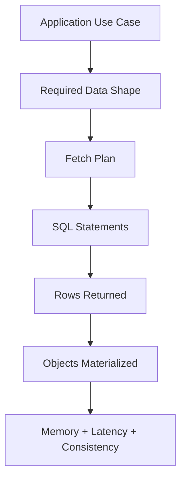
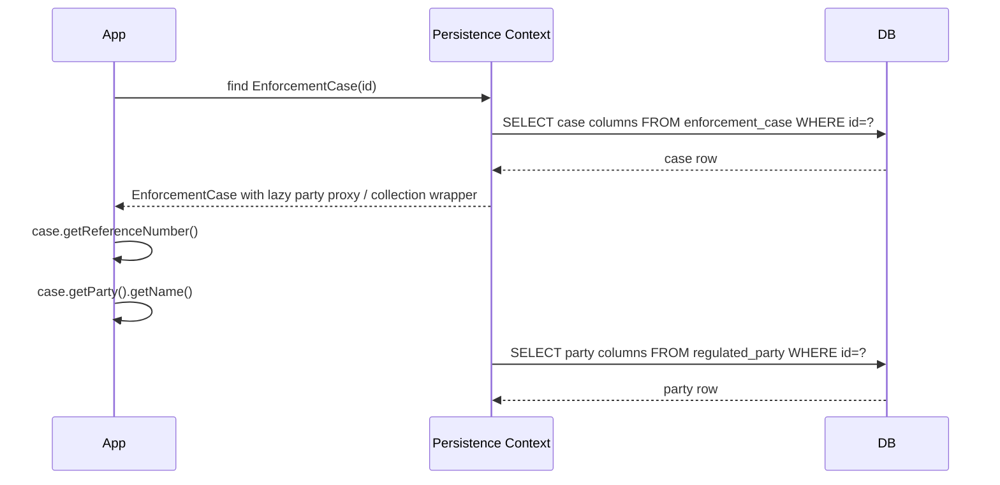
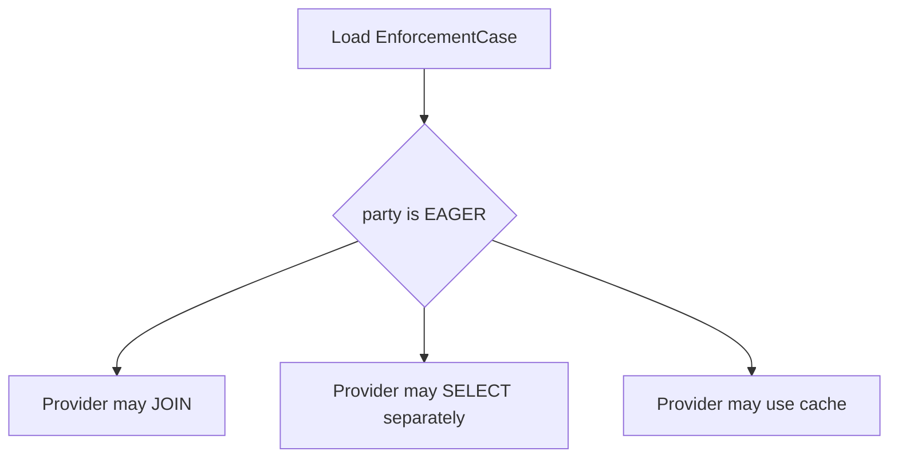
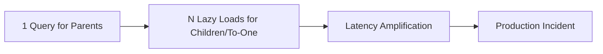
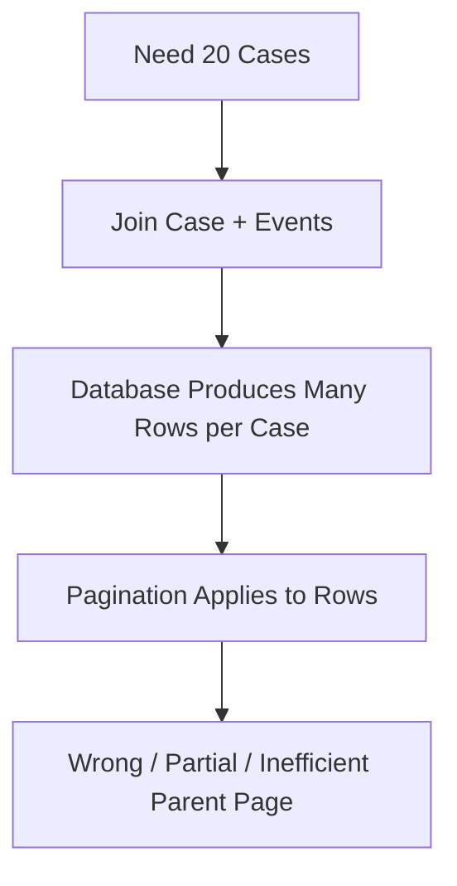
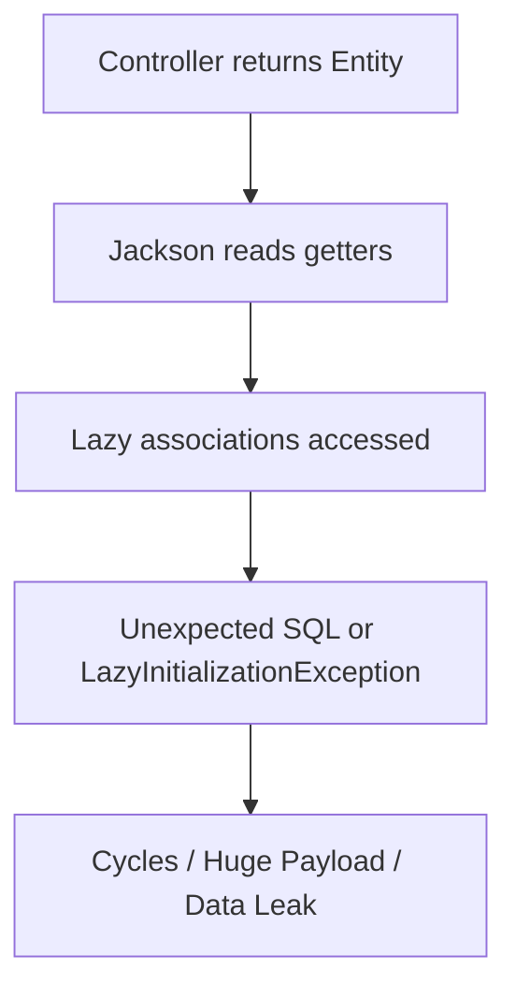
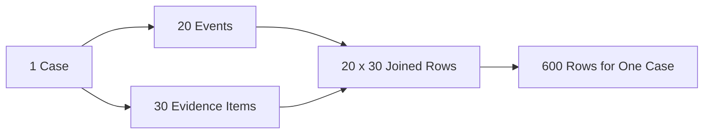

------
title: Learn Java Persistence, Database Integration, JPA, Hibernate ORM & EclipseLink - Part 017
description: Fetching strategy secara production-grade: lazy, eager, proxy, N+1, join fetch, batch fetch, subselect fetch, pagination trap, Open Session in View, dan cara merancang fetch plan berbasis use case.
series: learn-java-persistence
seriesTitle: Learn Java Persistence, Database Integration, JPA, Hibernate ORM & EclipseLink
order: 17
partTitle: Fetching: Lazy, Eager, and N+1 Failure Modes
tags:
- java
- persistence
- jpa
- jakarta-persistence
- hibernate
- eclipselink
- orm
- fetching
- lazy-loading
- eager-loading
- n-plus-one
- fetch-join
- batch-fetch
- subselect-fetch
- performance
- sql
- series
date: 2026-06-27
---

# Fetching: Lazy, Eager, and N+1 Failure Modes

> Target part ini: kamu mampu membaca object graph sebagai **query plan**, bukan hanya relasi Java. Kamu mampu memilih lazy, eager, join fetch, batch fetch, subselect fetch, projection, atau explicit query berdasarkan use case, cardinality, transaction boundary, dan risiko production.

Fetching adalah salah satu area paling sering disalahpahami di JPA/Hibernate/EclipseLink.

Banyak engineer mengira annotation seperti `FetchType.LAZY` atau `FetchType.EAGER` adalah detail kecil di entity. Di production, fetch strategy menentukan:

- jumlah SQL yang dieksekusi;
- ukuran result set;
- memory pressure;
- latency endpoint;
- lock duration;
- connection hold time;
- serialization behavior;
- transaction boundary;
- correctness data yang dibaca;
- apakah sistem tumbang saat data membesar.

Mental model utama:



ORM tidak menghapus kebutuhan desain query. ORM hanya memindahkan desain query dari SQL eksplisit ke kombinasi mapping, persistence context, query, dan provider behavior.

## 1. Fetching Is Not Mapping

Kesalahan besar: menganggap association mapping sama dengan fetch plan.

Mapping menjawab:

> Entity ini berhubungan dengan tabel/row lain melalui foreign key atau join table apa?

Fetch plan menjawab:

> Untuk use case ini, data apa yang harus di-load sekarang, data apa yang boleh ditunda, dan data apa yang tidak boleh disentuh sama sekali?

Contoh domain regulatory enforcement:

```java
@Entity
public class EnforcementCase {
    @Id
    private UUID id;

    @ManyToOne(fetch = FetchType.LAZY)
    private RegulatedParty party;

    @OneToMany(mappedBy = "enforcementCase")
    private List<CaseEvent> events = new ArrayList<>();

    @OneToMany(mappedBy = "enforcementCase")
    private List<EvidenceItem> evidenceItems = new ArrayList<>();
}
```

Mapping di atas tidak otomatis berarti setiap kali `EnforcementCase` dibaca, semua `party`, `events`, dan `evidenceItems` harus ikut dibaca.

Use case berbeda membutuhkan bentuk data berbeda:

| Use Case | Data Dibutuhkan | Fetch Strategy Sehat |
|---|---|---|
| Case list page | id, reference number, status, party name | DTO projection / join minimal |
| Case detail header | case + party | join fetch `party` |
| Timeline tab | case + events ordered | query khusus events |
| Evidence tab | case + evidence summary | query khusus evidence |
| Export full dossier | full graph terkontrol | staged loading / batch / streaming |

Satu mapping, banyak fetch plan.

## 2. Default Fetch Semantics in JPA

JPA memiliki default fetch yang sering mengejutkan:

| Association | Default JPA Fetch |
|---|---|
| `@ManyToOne` | `EAGER` |
| `@OneToOne` | `EAGER` |
| `@OneToMany` | `LAZY` |
| `@ManyToMany` | `LAZY` |
| `@ElementCollection` | `LAZY` |
| Basic attribute | `EAGER` |

Production guideline:

```java
@ManyToOne(fetch = FetchType.LAZY)
private RegulatedParty party;

@OneToOne(fetch = FetchType.LAZY)
private CaseRiskAssessment riskAssessment;
```

Default `EAGER` pada to-one association hampir selalu terlalu agresif untuk sistem besar.

Tetapi ada nuance penting:

- `LAZY` adalah hint/contract yang bergantung pada provider capability;
- to-one lazy biasanya memakai proxy atau bytecode enhancement;
- final class/final method/access pattern bisa mengganggu lazy loading pada provider tertentu;
- di luar persistence context aktif, lazy access bisa gagal;
- eager tidak selalu berarti single join; provider bisa memakai select tambahan.

## 3. Lazy Loading Mental Model

Lazy loading berarti association belum di-load saat entity root di-load. Provider menyisipkan placeholder:



Lazy loading is not free. It delays a SQL decision until field access.

That can be good:

- avoid loading unused graph;
- keep generic entity queries cheap;
- separate use-case data needs;
- reduce memory for simple workflows.

It can be dangerous:

- SQL happens in unexpected layer;
- serialization triggers database access;
- view rendering triggers N+1;
- lazy access outside transaction fails;
- security/authorization checks accidentally load sensitive data;
- performance becomes data-dependent.

## 4. Eager Loading Mental Model

`EAGER` means provider must load the association when entity is loaded.

But implementation may vary:



This matters because developers often assume:

```java
@ManyToOne(fetch = FetchType.EAGER)
private RegulatedParty party;
```

means:

```sql
select c.*, p.*
from enforcement_case c
join regulated_party p on p.id = c.party_id
where c.id = ?
```

Not necessarily. Provider may issue:

```sql
select * from enforcement_case where id = ?;
select * from regulated_party where id = ?;
```

Eager is a **requirement to load**, not a precise SQL plan.

Production rule:

> Do not use mapping-level `EAGER` as a performance optimization. Use query-level fetch plan.

## 5. The N+1 Problem

N+1 is not a Hibernate bug. It is a mismatch between access pattern and fetch plan.

Classic example:

```java
List<EnforcementCase> cases = em.createQuery("""
    select c
    from EnforcementCase c
    where c.status = :status
    order by c.openedAt desc
    """, EnforcementCase.class)
    .setParameter("status", CaseStatus.OPEN)
    .setMaxResults(50)
    .getResultList();

for (EnforcementCase c : cases) {
    System.out.println(c.getParty().getLegalName());
}
```

Potential SQL:

```sql
select *
from enforcement_case
where status = 'OPEN'
order by opened_at desc
limit 50;

select * from regulated_party where id = ?; -- repeated up to 50 times
```

The problem is not exactly “51 queries”. The real problem is:

- latency amplification;
- connection occupancy;
- database round trips;
- unpredictable load as row count grows;
- failure under high concurrency;
- hidden cost in harmless-looking getter access.

N+1 shape:



## 6. Detecting N+1 Early

Enable SQL visibility during development and integration tests.

Hibernate-oriented settings often used in non-production diagnostics:

```properties
hibernate.show_sql=false
hibernate.format_sql=true
hibernate.highlight_sql=true
hibernate.generate_statistics=true
```

Prefer structured SQL logging via logging framework rather than raw `show_sql` in serious environments.

Example test assertion pattern:

```java
@Test
void caseListShouldNotTriggerNPlusOne() {
    statistics.clear();

    caseQueryService.listOpenCases();

    long statements = statistics.getPrepareStatementCount();
    assertThat(statements).isLessThanOrEqualTo(2);
}
```

Do not rely only on local manual observation. N+1 must be regression-tested for critical paths.

## 7. Solution 1: Join Fetch

JPQL `join fetch` tells provider to load association in the same query.

```java
List<EnforcementCase> cases = em.createQuery("""
    select c
    from EnforcementCase c
    join fetch c.party
    where c.status = :status
    order by c.openedAt desc
    """, EnforcementCase.class)
    .setParameter("status", CaseStatus.OPEN)
    .getResultList();
```

Possible SQL:

```sql
select c.*, p.*
from enforcement_case c
join regulated_party p on p.id = c.party_id
where c.status = ?
order by c.opened_at desc;
```

Good fit:

- to-one association needed immediately;
- low-to-moderate cardinality;
- detail page header;
- list query needing a few related attributes;
- avoiding N+1 for `@ManyToOne`.

Danger:

- join fetching large collections;
- duplicate root rows;
- pagination with collection fetch;
- cartesian product when multiple collections are fetched;
- over-fetching large graphs.

## 8. Join Fetch and Duplicate Roots

When fetching a collection:

```java
List<EnforcementCase> cases = em.createQuery("""
    select c
    from EnforcementCase c
    left join fetch c.events
    where c.id = :id
    """, EnforcementCase.class)
    .setParameter("id", caseId)
    .getResultList();
```

SQL returns one row per `(case, event)` pair.

For one case with 10 events:

| case_id | event_id |
|---|---|
| C1 | E1 |
| C1 | E2 |
| C1 | E3 |
| ... | ... |

Provider de-duplicates managed entity instances in persistence context, but Java result list semantics and SQL row count still matter.

Use `distinct` in JPQL when appropriate:

```java
select distinct c
from EnforcementCase c
left join fetch c.events
where c.id = :id
```

Important nuance: JPQL `distinct` has object-level meaning. Provider may also push SQL `distinct`, which can be expensive with many columns. Know provider behavior and query plan.

## 9. The Pagination Trap

This is one of the most dangerous production pitfalls:

```java
List<EnforcementCase> cases = em.createQuery("""
    select c
    from EnforcementCase c
    left join fetch c.events
    order by c.openedAt desc
    """, EnforcementCase.class)
    .setFirstResult(0)
    .setMaxResults(20)
    .getResultList();
```

Problem: SQL row pagination happens over joined rows, not logical parent entities.

If one case has many events, it can consume most of the page.

Conceptual failure:



Safer pattern: two-step pagination.

Step 1: page root IDs.

```java
List<UUID> ids = em.createQuery("""
    select c.id
    from EnforcementCase c
    where c.status = :status
    order by c.openedAt desc
    """, UUID.class)
    .setParameter("status", CaseStatus.OPEN)
    .setFirstResult(page * size)
    .setMaxResults(size)
    .getResultList();
```

Step 2: fetch graph for those IDs.

```java
List<EnforcementCase> cases = em.createQuery("""
    select distinct c
    from EnforcementCase c
    left join fetch c.party
    left join fetch c.events
    where c.id in :ids
    """, EnforcementCase.class)
    .setParameter("ids", ids)
    .getResultList();
```

Then restore ordering in application if needed.

For high-scale pagination, prefer keyset pagination and projections.

## 10. Solution 2: Batch Fetching

Batch fetching reduces N+1 by grouping lazy loads.

Conceptually:

```sql
select * from enforcement_case where status = 'OPEN' limit 50;

select *
from regulated_party
where id in (?, ?, ?, ?, ?, ?, ?, ?, ?, ?);
```

Hibernate example:

```java
@ManyToOne(fetch = FetchType.LAZY)
@BatchSize(size = 32)
private RegulatedParty party;
```

Or global setting:

```properties
hibernate.default_batch_fetch_size=32
```

Good fit:

- lazy associations are accessed for many parents;
- join fetch would create too much row duplication;
- association may or may not be accessed;
- to-one and collections where batching is supported;
- general-purpose mitigation for N+1.

Trade-offs:

- still multiple SQL statements;
- `IN` clause size matters;
- ordering of access affects batching;
- provider-specific behavior;
- too-large batch size may hurt plans/cache.

Batch fetching is often a better default safety net than aggressive eager mapping.

## 11. Solution 3: Subselect Fetching

Hibernate supports subselect-style collection fetching for certain cases.

Conceptually:

```sql
select *
from enforcement_case
where status = 'OPEN';

select *
from case_event
where enforcement_case_id in (
    select id
    from enforcement_case
    where status = 'OPEN'
);
```

This can be useful when:

- a parent result set is loaded;
- many collections are accessed;
- parent query is stable and not too broad;
- collection loading should be grouped.

Risk:

- broad parent query can load too much;
- complex original queries can produce awkward subselects;
- provider-specific;
- harder to reason about than explicit query.

Use subselect fetching deliberately, not as magic.

## 12. Solution 4: Projection Instead of Entity Graph

For list/read-only views, loading entities may be the wrong abstraction.

```java
public record CaseListRow(
    UUID id,
    String referenceNumber,
    CaseStatus status,
    String partyName,
    Instant openedAt
) {}
```

JPQL constructor projection:

```java
List<CaseListRow> rows = em.createQuery("""
    select new com.example.caseapp.CaseListRow(
        c.id,
        c.referenceNumber,
        c.status,
        p.legalName,
        c.openedAt
    )
    from EnforcementCase c
    join c.party p
    where c.status = :status
    order by c.openedAt desc
    """, CaseListRow.class)
    .setParameter("status", CaseStatus.OPEN)
    .setMaxResults(50)
    .getResultList();
```

Projection wins when:

- UI/API needs a flat shape;
- no update is intended;
- only a subset of columns is needed;
- aggregate graph is large;
- query joins multiple aggregate boundaries;
- response shape differs from domain model.

Do not turn every query into entity loading. In high-read systems, projection is often the cleanest fetch strategy.

## 13. Solution 5: Explicit Child Query

Sometimes the best fetch plan is not one query.

For case detail with separate tabs:

```java
EnforcementCaseHeader header = caseQueries.getHeader(caseId);
List<CaseEventRow> timeline = caseQueries.getTimeline(caseId);
List<EvidenceRow> evidence = caseQueries.getEvidence(caseId);
```

This is not inefficient by default. It can be superior because:

- each query has a clear result shape;
- pagination per tab is possible;
- authorization can be different per sub-resource;
- one large cartesian query is avoided;
- caching can be per view;
- frontend does not force full aggregate loading.

Top engineers do not worship “one SQL query”. They optimize for correct data shape, predictable cost, and maintainability.

## 14. Fetch Strategy Decision Table

| Situation | Prefer | Avoid |
|---|---|---|
| Load one aggregate with small to-one dependencies | `join fetch` to-one | Mapping-level eager everywhere |
| Load list page with summary data | DTO projection | Entity graph + serialization |
| Load one parent + moderate child collection | join fetch collection or separate child query | Multiple collection fetch joins |
| Paginate parent list | ID page + fetch, projection, keyset | Collection fetch join + offset pagination |
| Optional related data rarely used | lazy + batch | eager |
| Many parents access same to-one | batch fetch | N+1 lazy select |
| Large export | streaming/staged queries | one enormous object graph |
| Complex reporting | native SQL/view/projection | forcing entity model |

## 15. Fetching and Serialization

A common REST/API failure:

```java
@GetMapping("/cases/{id}")
public EnforcementCase getCase(@PathVariable UUID id) {
    return repository.findById(id).orElseThrow();
}
```

Then JSON serializer walks the graph:



Problems:

- lazy loading during serialization;
- infinite recursion in bidirectional association;
- leaking internal fields;
- unstable API contract;
- accidental N+1;
- transaction boundary ambiguity.

Production guideline:

> Entities are persistence models, not API response contracts.

Use DTO/read models for APIs.

## 16. LazyInitializationException Mental Model

Typical Hibernate failure:

```java
@Transactional
public EnforcementCase loadCase(UUID id) {
    return em.find(EnforcementCase.class, id);
}

// Later, outside transaction/persistence context
case.getEvents().size();
```

The entity is detached. Lazy collection wrapper needs a live persistence context to load data. It cannot.

This failure is not fixed by blindly enabling Open Session in View. The better question is:

> Why did this layer receive a partially loaded entity and then try to navigate persistence behavior outside a use-case boundary?

Fix options:

- fetch required data inside service transaction;
- return DTO;
- use explicit query;
- use entity graph;
- redesign boundary;
- avoid entity crossing serialization/UI boundary.

## 17. Open Session in View: Why It Feels Convenient

Open Session in View keeps persistence context open through web rendering/serialization.

Benefit:

- lazy loading works in controller/view;
- fewer explicit fetch decisions initially;
- rapid CRUD prototypes feel easy.

Cost:

- SQL can happen in view layer;
- transaction boundary becomes misleading;
- connection may be held too long depending configuration;
- N+1 hides until production;
- API shape controls database access;
- business service no longer owns data requirements;
- failures appear as latency spikes, not compile errors.

For serious systems, prefer explicit fetch plans and DTO boundaries.

Open Session in View is not always evil, but it is a dangerous default for complex production systems.

## 18. Multiple Collection Fetch Join Problem

Suppose:

```java
select c
from EnforcementCase c
left join fetch c.events
left join fetch c.evidenceItems
where c.id = :id
```

If case has 20 events and 30 evidence items, SQL may produce 600 joined rows.



This is not just duplication. It can cause:

- memory amplification;
- slow result materialization;
- duplicate collection elements depending collection type/provider;
- Hibernate multiple bag fetch exception in certain mappings;
- long database CPU time.

Better patterns:

- fetch one collection at a time;
- use separate queries;
- use batch/subselect fetch;
- use DTO projection per tab;
- remodel collections if they are independent views.

## 19. Fetching and Persistence Context Identity

When multiple queries load the same entity in one persistence context, they resolve to the same Java object.

```java
EnforcementCase a = em.find(EnforcementCase.class, id);
EnforcementCase b = em.createQuery("""
    select c
    from EnforcementCase c
    join fetch c.party
    where c.id = :id
    """, EnforcementCase.class)
    .setParameter("id", id)
    .getSingleResult();

assert a == b;
```

This identity map helps consistency, but it also means fetch decisions accumulate.

If `b` loads `party`, then `a.getParty()` may no longer trigger SQL because it is now loaded in the same context.

This can make tests pass accidentally if they reuse one transaction/persistence context too broadly.

## 20. Fetching and Dirty Checking

Loading more entities means dirty checking more entities.

Even if you only intend to read, managed entities remain tracked.

Risks:

- memory increases;
- flush has more objects to inspect;
- accidental mutation becomes database update;
- long transactions become expensive.

For read-only flows:

- use DTO projection;
- use query hints/read-only mode where supported;
- keep transaction short;
- avoid loading huge graphs as managed entities;
- clear persistence context during batch processing.

## 21. Fetch Plan as Use-Case Contract

A mature repository/query design names fetch needs explicitly.

Bad:

```java
Optional<EnforcementCase> findById(UUID id);
```

Ambiguous. Which graph?

Better:

```java
Optional<EnforcementCase> findCaseForAssignment(UUID id);
Optional<CaseDetailView> findCaseDetail(UUID id);
List<CaseListRow> findOpenCaseRows(CaseFilter filter, PageRequest page);
List<CaseEventRow> findTimeline(UUID caseId, TimelinePage page);
```

The method name states the use case. The fetch plan becomes part of the contract.

## 22. Practical Fetch Plan Catalogue

For an enforcement lifecycle platform, define canonical fetch plans:

| Fetch Plan | Description |
|---|---|
| `CASE_HEADER` | case scalar fields + party summary |
| `CASE_ASSIGNMENT` | case + assignee + team + current state |
| `CASE_TIMELINE` | case id + timeline events page |
| `CASE_EVIDENCE_SUMMARY` | evidence summary rows only |
| `CASE_DECISION_DRAFTING` | case + allegations + current findings + responsible officers |
| `CASE_EXPORT_DOSSIER` | staged export graph with memory limits |
| `CASE_AUDIT_REVIEW` | immutable audit read model, usually projection/native query |

This prevents every developer from inventing ad-hoc fetch behavior.

## 23. Provider Notes: Hibernate

Hibernate-specific concepts often encountered:

- proxies for lazy to-one;
- persistent collection wrappers;
- `@BatchSize`;
- `hibernate.default_batch_fetch_size`;
- `@Fetch(FetchMode.SUBSELECT)`;
- bytecode enhancement;
- `JOIN FETCH` behavior;
- multiple bag fetch limitation;
- statistics API;
- fetch profiles;
- read-only query hints/session modes.

Hibernate is powerful, but top engineers keep a portability ledger:

```md
Provider-specific decision:
- What Hibernate feature are we using?
- Why is standard JPA insufficient?
- What test protects the behavior?
- What migration cost would this create?
- Is the performance win worth the lock-in?
```

## 24. Provider Notes: EclipseLink

EclipseLink has its own advanced fetching concepts, including:

- weaving for lazy behavior;
- join fetching hints;
- batch reading;
- fetch groups;
- shared cache behavior;
- descriptor-level customization.

Do not assume Hibernate annotations or behavior transfer to EclipseLink. Keep standard JPA fetch plans where portability matters, and isolate provider-specific hints behind repository/query objects.

## 25. Anti-Patterns

### 25.1 EAGER Everywhere

```java
@ManyToOne(fetch = FetchType.EAGER)
@OneToMany(fetch = FetchType.EAGER)
```

Usually creates:

- unpredictable query trees;
- memory blow-up;
- slow list queries;
- hidden joins/selects;
- serialization explosions.

### 25.2 Generic `findAll()` on Entity Graphs

```java
List<EnforcementCase> findAll();
```

In production, “all” is rarely a use case.

### 25.3 Returning Entities from API

This couples API shape to persistence graph and makes lazy loading a serialization side effect.

### 25.4 Fetch Join as Universal Fix

Join fetch fixes some N+1 cases, but can create cartesian products, pagination bugs, and memory amplification.

### 25.5 Ignoring SQL Because “ORM Handles It”

ORM emits SQL. The database executes SQL. The query planner does not care that Java code looked clean.

## 26. Review Checklist

Use this checklist during PR/design review:

```md
## Fetch Plan Review

Use case:
- What data shape is actually required?
- Is this read-only or update-capable?
- Is the result paginated?
- What is the expected cardinality?

Mapping:
- Are to-one associations explicitly LAZY where appropriate?
- Are collection associations lazy by default?
- Are cascade and fetch being confused?

Query:
- Is N+1 possible?
- Are collection fetch joins combined with pagination?
- Are multiple collections fetched in one query?
- Would projection be simpler?
- Is order deterministic?

Boundary:
- Does entity escape transaction boundary?
- Does JSON serialization touch lazy associations?
- Is Open Session in View hiding the issue?

Observability:
- Is SQL count tested for critical path?
- Are slow queries visible?
- Is provider-specific behavior documented?
```

## 27. Practice Lab

### Lab A: Detect N+1

Create:

- 50 `EnforcementCase` rows;
- 50 different `RegulatedParty` rows;
- list query for open cases;
- loop accessing party name.

Measure statement count.

Expected observation:

- baseline: 1 + N statements;
- with join fetch: 1 statement;
- with batch fetch: fewer grouped statements.

### Lab B: Pagination Trap

Create:

- 30 cases;
- case #1 has 100 events;
- others have 1 event.

Run collection fetch join with `setMaxResults(20)`.

Observe:

- generated SQL;
- provider warnings;
- result correctness;
- memory behavior.

Then implement two-step ID pagination.

### Lab C: API Serialization Boundary

Return an entity from controller and serialize it.

Observe:

- lazy loading;
- recursion risk;
- payload size;
- transaction boundary.

Then replace with DTO projection.

## 28. Mental Compression

Fetching mastery can be compressed into five invariants:

1. Mapping is not fetch plan.
2. Lazy delays SQL; it does not remove SQL.
3. Eager requires loading; it does not guarantee optimal SQL.
4. Join fetch reduces round trips but can multiply rows.
5. Projection is often the best fetch strategy for read use cases.

## 29. What Top 1% Engineers Do Differently

They do not ask:

> Should this association be lazy or eager?

They ask:

> What are the canonical data shapes of this system, what are their cardinalities, which ones are update-capable, which ones are read models, and how do we make SQL cost observable and regression-tested?

That shift turns fetching from annotation guessing into architecture.

## 30. Key Takeaways

- Fetching is a use-case decision, not merely an annotation decision.
- Prefer `LAZY` mapping defaults, especially for associations, then define explicit fetch plans.
- N+1 is caused by mismatch between access pattern and fetch plan.
- Join fetch is powerful for to-one and controlled small graphs, dangerous for large collections and pagination.
- Batch/subselect fetching can mitigate lazy loading costs but are provider-sensitive.
- DTO/projection is often the cleanest solution for list and API read models.
- Do not let JSON serialization become your query planner.
- Critical fetch paths must have SQL count/latency tests.

Selanjutnya: **Part 018 — Entity Graphs and Explicit Fetch Plans**.
