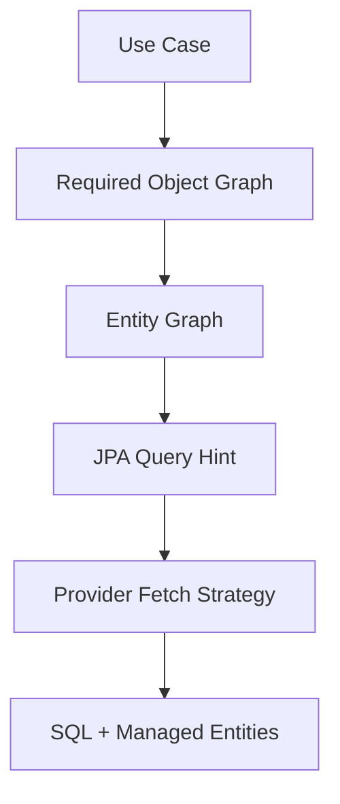
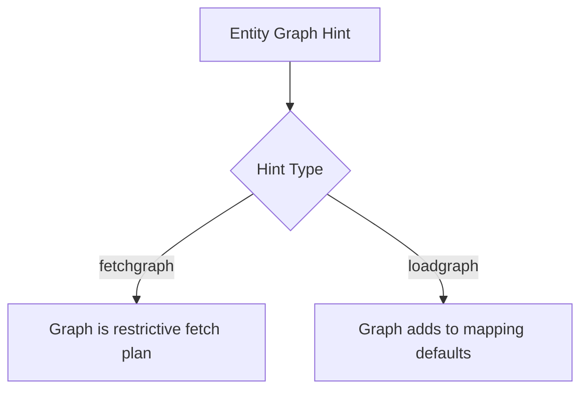
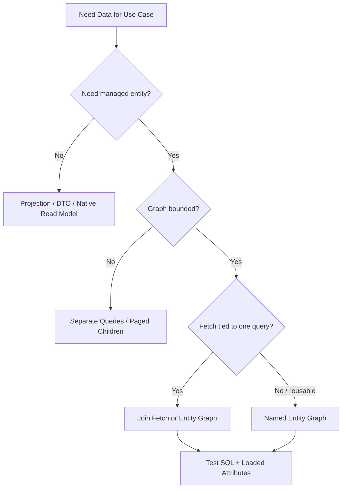

------
title: Learn Java Persistence, Database Integration, JPA, Hibernate ORM & EclipseLink - Part 018
description: Entity graph dan explicit fetch plan untuk membentuk object graph per use case: NamedEntityGraph, dynamic graph, fetchgraph vs loadgraph, subgraph, provider hints, repository contract, dan testing.
series: learn-java-persistence
seriesTitle: Learn Java Persistence, Database Integration, JPA, Hibernate ORM & EclipseLink
order: 18
partTitle: Entity Graphs and Explicit Fetch Plans
tags:
- java
- persistence
- jpa
- jakarta-persistence
- hibernate
- eclipselink
- orm
- entity-graph
- named-entity-graph
- fetch-plan
- fetchgraph
- loadgraph
- n-plus-one
- performance
- repository
- series
date: 2026-06-27
---

# Entity Graphs and Explicit Fetch Plans

> Target part ini: kamu mampu menggunakan entity graph sebagai fetch plan eksplisit per use case, bukan sebagai dekorasi annotation. Kamu juga mampu memutuskan kapan entity graph lebih tepat daripada join fetch, projection, batch fetch, atau query khusus.

Di part sebelumnya kita memisahkan mapping dari fetch plan.

Sekarang kita masuk ke mekanisme standar JPA untuk mendefinisikan fetch plan secara eksplisit: **entity graph**.

Entity graph menjawab:

> Untuk root entity tertentu, attribute/association apa yang harus dianggap bagian dari graph ketika query dieksekusi?

Mental model:



Entity graph tidak menggantikan query. Entity graph melengkapi query dengan instruksi fetch.

## 1. Why Entity Graph Exists

JPQL `join fetch` kuat, tetapi punya masalah:

- fetch instruction tercampur dengan filter/query logic;
- sulit reuse antar query;
- query menjadi panjang;
- multiple fetch joins mudah menimbulkan cartesian product;
- named use-case fetch plan tidak terlihat sebagai artefak sendiri;
- repository method sulit mengekspresikan variasi graph tanpa duplikasi query.

Entity graph memberi cara untuk mengekspresikan:

```md
For EnforcementCase detail header, load:
- party
- currentAssignee
- currentWorkflowState

Do not load:
- events
- evidenceItems
- full audit trail
```

Sebagai artefak fetch plan.

## 2. Entity Graph Is Still Entity Loading

Entity graph tetap menghasilkan managed entities.

Ini berarti:

- entity masuk persistence context;
- dirty checking berlaku;
- identity map berlaku;
- lazy association lain tetap mungkin ada;
- entity graph bukan DTO;
- entity graph bukan column projection;
- entity graph bukan read model boundary.

Gunakan entity graph ketika use case memang butuh entity/aggregate yang akan dimodifikasi atau diproses sebagai domain object.

Untuk API list/read-only, projection sering lebih tepat.

## 3. Basic Named Entity Graph

Contoh entity:

```java
@Entity
@NamedEntityGraph(
    name = "EnforcementCase.assignment",
    attributeNodes = {
        @NamedAttributeNode("party"),
        @NamedAttributeNode("currentAssignee"),
        @NamedAttributeNode("workflowState")
    }
)
public class EnforcementCase {
    @Id
    private UUID id;

    @ManyToOne(fetch = FetchType.LAZY)
    private RegulatedParty party;

    @ManyToOne(fetch = FetchType.LAZY)
    private Officer currentAssignee;

    @Embedded
    private WorkflowState workflowState;

    @OneToMany(mappedBy = "enforcementCase")
    private List<CaseEvent> events = new ArrayList<>();
}
```

Usage:

```java
EntityGraph<?> graph = em.getEntityGraph("EnforcementCase.assignment");

EnforcementCase c = em.createQuery("""
    select c
    from EnforcementCase c
    where c.id = :id
    """, EnforcementCase.class)
    .setParameter("id", caseId)
    .setHint("jakarta.persistence.fetchgraph", graph)
    .getSingleResult();
```

The query selects the root. The graph tells provider which attributes should be fetched.

## 4. `fetchgraph` vs `loadgraph`

JPA defines two important hints:

| Hint | Meaning |
|---|---|
| `jakarta.persistence.fetchgraph` | Attributes in graph are treated as eager; attributes not in graph are treated as lazy, subject to provider/spec constraints. |
| `jakarta.persistence.loadgraph` | Attributes in graph are treated as eager; attributes not in graph keep their mapping default. |

Mental model:



In production, prefer `fetchgraph` when you want explicit control.

Use `loadgraph` when:

- mapping defaults are intentional;
- graph only adds a few required associations;
- you are transitioning legacy eager mappings gradually.

Be careful: provider behavior around default eager attributes and bytecode enhancement can vary in subtle ways. Test what matters.

## 5. Dynamic Entity Graph

Named graphs are good for canonical fetch plans. Dynamic graphs are good for query-specific composition.

```java
EntityGraph<EnforcementCase> graph = em.createEntityGraph(EnforcementCase.class);
graph.addAttributeNodes("party", "currentAssignee");

EnforcementCase c = em.find(
    EnforcementCase.class,
    caseId,
    Map.of("jakarta.persistence.fetchgraph", graph)
);
```

Dynamic graph benefits:

- no annotation noise;
- fetch plan can be built near query object;
- conditional use cases;
- easier to test in repository layer;
- useful for framework integration.

Risk:

- string attribute names;
- hidden duplication;
- graph variants proliferate;
- harder to discover than named graphs;
- can become another form of ad-hoc fetch plan sprawl.

## 6. Subgraphs

Subgraph lets you fetch nested associations.

```java
@NamedEntityGraph(
    name = "EnforcementCase.detail",
    attributeNodes = {
        @NamedAttributeNode("party"),
        @NamedAttributeNode(value = "events", subgraph = "events-with-author")
    },
    subgraphs = {
        @NamedSubgraph(
            name = "events-with-author",
            attributeNodes = {
                @NamedAttributeNode("createdBy")
            }
        )
    }
)
@Entity
public class EnforcementCase {
    // ...
}
```

This means:

- load case;
- load party;
- load events;
- for each event, load createdBy.

Subgraphs are powerful, but they can silently create large graphs.

Before adding a subgraph, ask:

- how many child rows exist per parent?
- is pagination needed?
- is the nested association to-one or to-many?
- is this for command handling or read-only display?
- would a projection be safer?

## 7. Entity Graph and Collections

Entity graph can include collections:

```java
graph.addAttributeNodes("events");
```

But including collection in graph does not magically eliminate row multiplication. Provider may use join, secondary select, batch, or other strategy.

Guideline:

| Collection Size | Entity Graph Suitability |
|---|---|
| Small bounded collection | Usually acceptable |
| Medium collection needed for command | Maybe, test SQL |
| Large unbounded collection | Avoid; use query/pagination |
| Multiple collections | Usually avoid in one graph |
| Audit/event history | Prefer paged read model |

Entity graph expresses **what** to fetch, not always exactly **how**.

Provider still chooses SQL strategy unless provider-specific hints are used.

## 8. Entity Graph vs Join Fetch

| Dimension | Entity Graph | Join Fetch |
|---|---|---|
| Standard JPA | Yes | Yes |
| Fetch plan reuse | Strong | Weak unless query reused |
| Query readability | Cleaner | Fetch logic mixed into JPQL |
| Precise SQL shape | Less explicit | More explicit but provider still matters |
| Dynamic composition | Possible | Possible through string/query builder |
| Collection pagination risk | Still possible | Very visible and common |
| Works with `find` | Yes | No, query only |
| Good for canonical aggregate load | Yes | Yes, if simple |

Use join fetch when query and fetch are tightly coupled and SQL shape matters.

Use entity graph when fetch plan is a reusable use-case contract.

## 9. Entity Graph vs Projection

Entity graph loads entities. Projection loads a data shape.

Use entity graph:

- command use case will mutate aggregate;
- business logic needs entity methods/invariants;
- persistence context identity matters;
- association graph is bounded;
- dirty checking is desired.

Use projection:

- API/list/read-only use case;
- data crosses aggregate boundaries;
- only subset of columns needed;
- result shape is not domain object;
- pagination/reporting/export;
- performance needs narrow select.

Bad pattern:

```java
EntityGraph<?> graph = ...full detail graph...
EnforcementCase entity = repository.findWithGraph(id);
return mapper.toResponse(entity);
```

If the whole purpose is response mapping, ask whether a direct projection would be simpler and cheaper.

## 10. Repository Contract Design

Avoid exposing generic graph knobs to application service without discipline.

Weak design:

```java
Optional<EnforcementCase> findById(UUID id, String graphName);
```

This leaks persistence details upward.

Better:

```java
interface EnforcementCaseRepository {
    Optional<EnforcementCase> findForAssignment(UUID id);
    Optional<EnforcementCase> findForDecisionDrafting(UUID id);
    Optional<EnforcementCase> findForStatusTransition(UUID id);
}
```

Internally:

```java
public Optional<EnforcementCase> findForAssignment(UUID id) {
    EntityGraph<?> graph = em.getEntityGraph("EnforcementCase.assignment");

    return em.createQuery("""
        select c
        from EnforcementCase c
        where c.id = :id
        """, EnforcementCase.class)
        .setParameter("id", id)
        .setHint("jakarta.persistence.fetchgraph", graph)
        .getResultStream()
        .findFirst();
}
```

Repository method should name domain intent, not ORM mechanism.

## 11. Spring Data JPA Integration

Spring Data JPA supports entity graph usage through annotation-style repository methods.

Example:

```java
@EntityGraph(
    attributePaths = {"party", "currentAssignee", "workflowState"},
    type = EntityGraph.EntityGraphType.FETCH
)
Optional<EnforcementCase> findForAssignmentById(UUID id);
```

This is convenient, but watch for:

- method name explosion;
- graph hidden behind derived query;
- accidental use on paged collection queries;
- lack of SQL observability;
- mixing entity graph with projections without clarity.

For complex queries, prefer explicit `@Query` plus entity graph or custom repository implementation.

## 12. Named Graph Catalogue

For a serious system, define a small catalogue of canonical graphs.

Example:

```md
## EnforcementCase Entity Graphs

### EnforcementCase.assignment
Purpose: Load data needed to assign or reassign a case.
Attributes:
- party
- currentAssignee
- workflowState
Bounded collections: none
Allowed use cases:
- AssignCaseCommand
- ReassignCaseCommand
Not allowed:
- API case detail response
- export
- audit review

### EnforcementCase.decisionDrafting
Purpose: Load data required for drafting an enforcement decision.
Attributes:
- party
- currentAssignee
- activeAllegations
- riskAssessment
Bounded collections:
- activeAllegations only
Risk:
- do not add evidenceItems; evidence must be paged separately
```

This catalogue can live in engineering handbook, code comments, or ADRs.

## 13. Fetch Plan Governance

Fetch plans are architecture decisions because they affect production cost.

Govern them like API contracts:

- name them by use case;
- limit number of canonical variants;
- document cardinality assumptions;
- test statement count;
- test result size;
- review SQL plan for critical paths;
- isolate provider-specific hints;
- keep API DTOs separate.

Decision record example:

```md
# ADR: Case Detail Fetch Plan

Decision:
- Case detail endpoint will use DTO projections, not entity graph.

Reason:
- events and evidence are unbounded;
- endpoint has tabbed UI;
- authorization differs per section;
- collection fetch joins created row multiplication;
- entity graph loaded too much mutable state.

Consequences:
- command handlers still use entity graph for bounded aggregate mutation;
- read model queries are tested separately;
- no entity returned from controller.
```

## 14. Entity Graph and `find`

Entity graph can be passed to `find`:

```java
EntityGraph<?> graph = em.getEntityGraph("EnforcementCase.assignment");

EnforcementCase c = em.find(
    EnforcementCase.class,
    id,
    Map.of("jakarta.persistence.fetchgraph", graph)
);
```

This is useful for primary-key aggregate loading.

But remember:

- `find` cannot express filters;
- authorization constraints may need query predicates;
- soft-delete filters may be provider-specific;
- multi-tenant constraints may need framework/provider integration;
- cache interaction may affect SQL observation.

For regulated systems, never assume `find(id)` alone satisfies access control or tenant boundary.

## 15. Entity Graph and Caching

Entity graph interacts with first-level and second-level cache.

Scenario:

```java
EnforcementCase c1 = em.find(EnforcementCase.class, id);

EntityGraph<?> graph = em.getEntityGraph("EnforcementCase.assignment");
EnforcementCase c2 = em.find(
    EnforcementCase.class,
    id,
    Map.of("jakarta.persistence.fetchgraph", graph)
);
```

Because persistence context already contains `c1`, provider may return same managed instance. Graph behavior can be affected by what is already loaded.

Testing implication:

- isolate tests with fresh persistence context;
- clear persistence context before asserting graph behavior;
- avoid broad transaction-scoped tests that mask lazy loads;
- observe SQL statements.

Second-level cache can further change apparent SQL behavior. Test both cold-cache and warm-cache scenarios for critical fetch plans.

## 16. Entity Graph and Locking

If a use case uses locking:

```java
EnforcementCase c = em.find(
    EnforcementCase.class,
    id,
    LockModeType.OPTIMISTIC,
    Map.of("jakarta.persistence.fetchgraph", graph)
);
```

Be explicit about what is locked and what is merely fetched.

Optimistic locking usually protects versioned entity updates, not all associated rows. Loading a graph does not automatically make the entire object graph concurrency-safe.

For aggregate mutation, ask:

- which row owns the version?
- do child changes increment root version?
- does provider detect collection changes as version changes?
- should child entities have independent versions?
- is database constraint also needed?

Fetch plan and consistency plan are related but not identical.

## 17. Entity Graph and Partial Loading Myth

Entity graph is not a column-level partial loading mechanism.

If you need only:

- `id`;
- `referenceNumber`;
- `status`;
- `partyName`;

use projection.

Entity graph operates on attributes/associations of entities. Basic fields are generally loaded as part of entity state unless lazy basic attribute enhancement is configured and supported.

Do not use entity graph to pretend entity loading is cheap like DTO projection.

## 18. Common Failure Modes

### 18.1 Graph Too Broad

```java
@NamedEntityGraph(
    name = "EnforcementCase.everything",
    attributeNodes = {
        @NamedAttributeNode("party"),
        @NamedAttributeNode("events"),
        @NamedAttributeNode("evidenceItems"),
        @NamedAttributeNode("auditEntries"),
        @NamedAttributeNode("decisions")
    }
)
```

This is not a fetch plan. It is an incident plan.

### 18.2 Graph Used to Feed API Response

If graph exists only because serializer/mapper wants data, consider projection.

### 18.3 Graph Name Not Tied to Use Case

Bad names:

- `withParty`
- `full`
- `detailed`
- `caseGraph1`

Better names:

- `EnforcementCase.assignment`
- `EnforcementCase.statusTransition`
- `EnforcementCase.decisionDrafting`

### 18.4 Adding Collection Without Cardinality Review

Never add a to-many attribute to entity graph without asking cardinality and pagination questions.

### 18.5 Testing in Warm Persistence Context

A test may pass because another query already loaded association.

Use:

```java
em.flush();
em.clear();
```

before testing fetch behavior.

## 19. Testing Entity Graphs

Test at three levels.

### 19.1 Semantic Test

```java
@Test
void findForAssignmentLoadsRequiredAssociations() {
    em.flush();
    em.clear();

    EnforcementCase c = repository.findForAssignment(caseId).orElseThrow();

    assertThat(Persistence.getPersistenceUtil().isLoaded(c, "party")).isTrue();
    assertThat(Persistence.getPersistenceUtil().isLoaded(c, "currentAssignee")).isTrue();
    assertThat(Persistence.getPersistenceUtil().isLoaded(c, "events")).isFalse();
}
```

### 19.2 SQL Count Test

```java
@Test
void findForAssignmentDoesNotTriggerNPlusOne() {
    statistics.clear();
    em.clear();

    repository.findCasesForAssignmentQueue();

    assertThat(statistics.getPrepareStatementCount()).isLessThanOrEqualTo(2);
}
```

### 19.3 Cardinality Test

Seed:

- case with 100 events;
- case with 100 evidence items;
- case with multiple officers.

Assert graph still does not load unbounded collections.

## 20. Entity Graph Decision Framework



Use entity graph when all are true:

- root entity is meaningful;
- use case benefits from managed graph;
- graph is bounded;
- graph can be named by business intent;
- SQL behavior is tested;
- API serialization is not driving the graph blindly.

## 21. Practical Pattern: Graph Registry

For larger systems, centralize graph names:

```java
public final class EnforcementCaseGraphs {
    private EnforcementCaseGraphs() {}

    public static final String ASSIGNMENT = "EnforcementCase.assignment";
    public static final String STATUS_TRANSITION = "EnforcementCase.statusTransition";
    public static final String DECISION_DRAFTING = "EnforcementCase.decisionDrafting";
}
```

Repository:

```java
EntityGraph<?> graph = em.getEntityGraph(EnforcementCaseGraphs.ASSIGNMENT);
```

This avoids typo-prone strings scattered across code.

For Spring Data JPA, keep graph names in constants if annotation constraints allow, or use custom repositories for complex use cases.

## 22. Practical Pattern: Query Object with Graph

```java
public final class FindCaseForDecisionDraftingQuery {
    private final EntityManager em;

    public Optional<EnforcementCase> execute(UUID caseId) {
        EntityGraph<?> graph = em.getEntityGraph("EnforcementCase.decisionDrafting");

        return em.createQuery("""
            select c
            from EnforcementCase c
            where c.id = :caseId
              and c.deleted = false
            """, EnforcementCase.class)
            .setParameter("caseId", caseId)
            .setHint("jakarta.persistence.fetchgraph", graph)
            .getResultStream()
            .findFirst();
    }
}
```

This pattern is better than cramming every query into a generic repository interface.

## 23. Practical Pattern: Graph + Authorization Predicate

In regulated systems, loading by ID is often insufficient.

```java
public Optional<EnforcementCase> findForOfficer(UUID caseId, UUID officerId) {
    EntityGraph<?> graph = em.getEntityGraph("EnforcementCase.assignment");

    return em.createQuery("""
        select c
        from EnforcementCase c
        join c.assignedTeam t
        join t.members m
        where c.id = :caseId
          and m.id = :officerId
        """, EnforcementCase.class)
        .setParameter("caseId", caseId)
        .setParameter("officerId", officerId)
        .setHint("jakarta.persistence.fetchgraph", graph)
        .getResultStream()
        .findFirst();
}
```

Graph controls fetch. Query controls eligibility.

Do not confuse them.

## 24. Practical Pattern: Command Graph vs Read Model

For status transition:

```java
@Transactional
public void escalateCase(UUID caseId, EscalationReason reason) {
    EnforcementCase c = repository.findForStatusTransition(caseId)
        .orElseThrow();

    c.escalate(reason, clock.instant());
}
```

The graph should include only what domain method needs:

- current status;
- current assignee/team;
- active escalation policy reference;
- version;
- bounded active holds if part of invariant.

It should not include:

- full event history;
- all evidence;
- all audit entries;
- response DTO fields.

For case detail page, use read model queries.

## 25. Performance Review Example

Bad entity graph:

```md
Graph: EnforcementCase.detail
Attributes:
- party
- currentAssignee
- workflowState
- events
- evidenceItems
- auditEntries
- decisions

Used by:
- GET /cases/{id}
- export
- decision drafting
```

Review verdict:

- graph name too generic;
- multiple unbounded collections;
- mixed read and command use cases;
- no cardinality contract;
- likely cartesian explosion;
- API and command paths coupled.

Refactor:

```md
Graph: EnforcementCase.decisionDrafting
Attributes:
- party
- currentAssignee
- workflowState
- activeAllegations
- riskAssessment

Read model queries:
- CaseDetailHeaderQuery
- CaseTimelineQuery
- CaseEvidencePageQuery
- CaseDecisionHistoryQuery
```

## 26. Provider-Specific Considerations

### Hibernate

Hibernate supports standard entity graphs and has additional fetching features such as batch size, fetch profiles, bytecode enhancement, and provider-specific hints.

Important notes:

- SQL shape may differ from expectation;
- graph + pagination + collection still needs care;
- multiple collection loading may hit provider limitations;
- statistics API is valuable for tests;
- query plan cache and graph variants can matter at scale.

### EclipseLink

EclipseLink supports standard JPA entity graphs and also has fetch groups, batch reading, join fetch hints, weaving, and shared cache behavior.

Important notes:

- weaving affects lazy behavior;
- fetch group behavior is provider-specific;
- shared cache can hide database access;
- test graph behavior under intended runtime configuration.

## 27. Entity Graph Checklist

```md
## Entity Graph Review

Name:
- Is graph named by use case, not by fields?
- Is the graph discoverable?

Scope:
- Is root entity appropriate?
- Does use case need managed entity?
- Would projection be better?

Cardinality:
- Are to-many associations bounded?
- Are multiple collections included?
- Is pagination required?

Boundary:
- Is graph used for command, query, or API response?
- Does entity escape transaction boundary?
- Are authorization/tenant predicates handled separately?

Performance:
- Has SQL been observed?
- Is statement count tested?
- Is row multiplication tested?
- Does cache mask behavior?

Provider:
- Is behavior standard JPA or provider-specific?
- Are provider-specific assumptions documented?
```

## 28. Practice Lab

### Lab A: Named Graph for Assignment

Create `EnforcementCase.assignment` graph:

- `party`;
- `currentAssignee`;
- `workflowState`.

Test:

- those attributes are loaded;
- `events` is not loaded;
- statement count is bounded.

### Lab B: Dynamic Graph Variant

Build dynamic graph for decision drafting:

- `party`;
- `riskAssessment`;
- `activeAllegations`.

Compare with named graph:

- readability;
- testability;
- reuse;
- discoverability.

### Lab C: Entity Graph vs Projection

Implement same case detail header using:

1. entity graph;
2. JPQL DTO projection.

Compare:

- selected columns;
- number of managed entities;
- dirty checking risk;
- API mapping complexity;
- SQL plan.

### Lab D: Cache Masking

Run graph test twice:

1. cold persistence context;
2. warm persistence context;
3. after second-level cache enabled if applicable.

Observe how SQL count changes.

## 29. Mental Compression

Entity graph mastery can be compressed into six rules:

1. Entity graph is a fetch plan for entity loading, not a DTO mechanism.
2. Name graphs by use case, not by association list.
3. Use `fetchgraph` for explicit control; use `loadgraph` for additive loading.
4. Be suspicious of to-many attributes inside graphs.
5. Test loaded attributes and SQL count in a fresh persistence context.
6. If the use case is read-only/API-shaped, projection may be better.

## 30. Key Takeaways

- Entity graph separates fetch plan from JPQL query text.
- `NamedEntityGraph` is good for canonical, reusable use-case graphs.
- Dynamic graph is useful but can sprawl without governance.
- `fetchgraph` and `loadgraph` express different intent.
- Entity graph still loads managed entities and participates in dirty checking.
- Entity graph is not a replacement for projection, pagination, or read models.
- Collection attributes inside graphs require cardinality review.
- Provider behavior must be observed, not assumed.

Selanjutnya: **Part 019 — Flush, Dirty Checking, and Write-Behind**.
