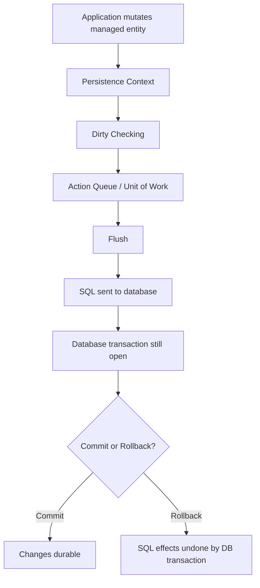
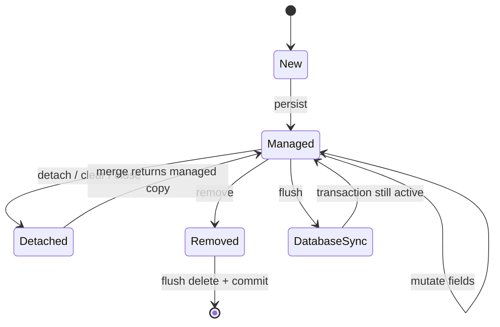
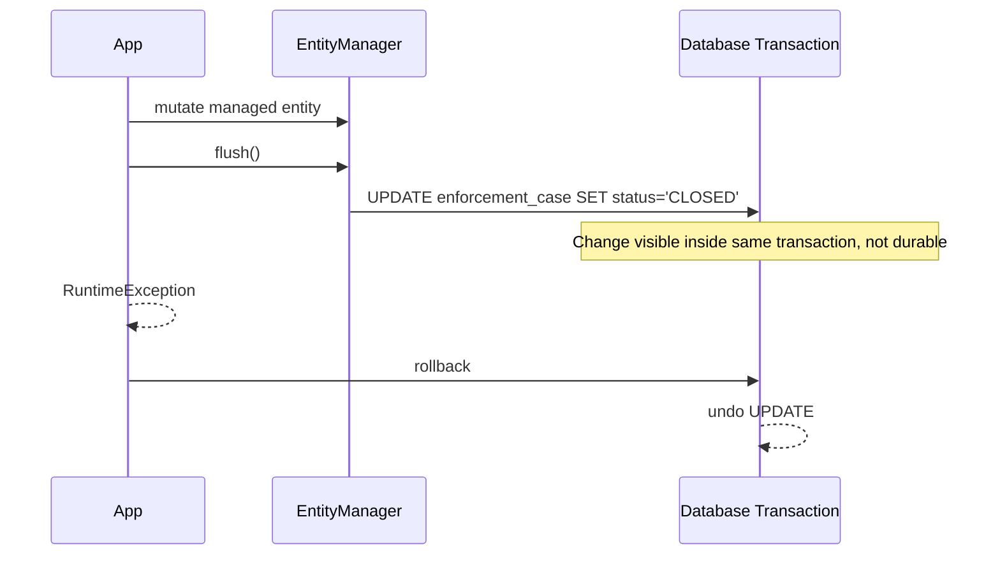
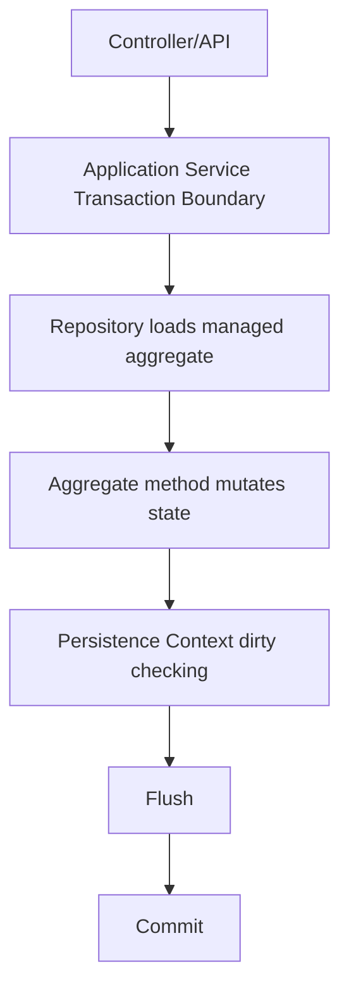
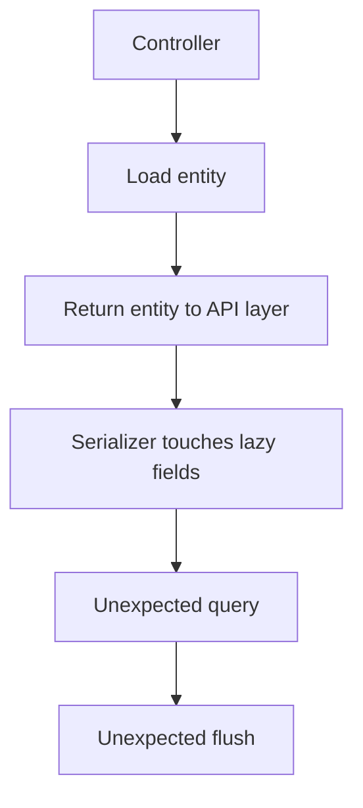

------
title: Learn Java Persistence, Database Integration, JPA, Hibernate ORM & EclipseLink - Part 019
description: Flush, dirty checking, write-behind, action queue, SQL ordering, flush mode, identifier strategy, bulk operation hazards, batching, observability, dan failure modelling pada write path ORM.
series: learn-java-persistence
seriesTitle: Learn Java Persistence, Database Integration, JPA, Hibernate ORM & EclipseLink
order: 19
partTitle: Flush, Dirty Checking, and Write-Behind
tags:
- java
- persistence
- jpa
- jakarta-persistence
- hibernate
- eclipselink
- orm
- flush
- dirty-checking
- write-behind
- unit-of-work
- transaction
- action-queue
- performance
- batching
- series
date: 2026-06-27
---

# Flush, Dirty Checking, and Write-Behind

> Target part ini: kamu mampu menjelaskan dan mengendalikan kapan perubahan entity berubah menjadi SQL, mengapa perubahan managed entity tidak membutuhkan `update()`, mengapa `flush()` bukan `commit()`, dan bagaimana write path ORM bisa gagal secara halus di production.

Di part sebelumnya kita membahas **fetch plan**: bagaimana data dibaca.

Sekarang kita masuk ke sisi yang sering lebih berbahaya: **write path**.

Dalam persistence modern, menulis ke database bukan berarti setiap perubahan object langsung menjadi SQL.

Di JPA/Hibernate/EclipseLink, perubahan biasanya melewati beberapa lapisan:

1. object Java berubah;
2. persistence context mendeteksi perubahan;
3. provider membuat rencana SQL;
4. SQL dieksekusi ketika flush;
5. database transaction commit atau rollback.

Ini terlihat sederhana, tetapi di sinilah banyak bug production muncul:

- data berubah padahal tidak ada repository `save()`;
- SQL muncul sebelum method selesai;
- validasi constraint gagal di query, bukan di commit;
- bulk update membuat entity dalam memory stale;
- `flush()` dianggap sama dengan `commit()`;
- batch import memakan memory karena persistence context tidak pernah dibersihkan;
- `IDENTITY` id membuat insert keluar lebih awal daripada yang diperkirakan;
- `equals()`/mutable value object membuat dirty checking tidak stabil;
- audit/event dikirim sebelum transaksi benar-benar berhasil.

Part ini sengaja membongkar ORM dari sisi **mechanics**, bukan hanya annotation.

---

## 1. Kaufman Framing

Menurut pendekatan Josh Kaufman, skill kompleks harus dipecah menjadi sub-skill kecil yang bisa dilatih dan dikoreksi cepat.

Untuk flush/dirty checking/write-behind, sub-skill utamanya adalah:

| Sub-skill | Pertanyaan yang harus bisa dijawab |
|---|---|
| Dirty checking | Bagaimana provider tahu entity berubah? |
| Flush trigger | Kapan SQL dikirim ke database? |
| Write-behind | Mengapa operasi Java tidak selalu langsung menjadi SQL? |
| SQL ordering | Mengapa urutan SQL berbeda dari urutan kode? |
| Flush mode | Bagaimana query, commit, dan explicit flush memengaruhi write path? |
| Identifier strategy | Mengapa id generation bisa memaksa insert lebih awal? |
| Persistence context hygiene | Kapan perlu `clear()`, `detach()`, batch flush, atau read-only mode? |
| Failure diagnosis | Bagaimana membuktikan SQL keluar dari mana dan kenapa? |

Output yang kita kejar bukan “hafal `flush()`”.

Outputnya adalah kemampuan melihat kode service dan memperkirakan:

- apakah SQL akan keluar;
- kapan SQL akan keluar;
- SQL apa yang mungkin keluar;
- entity mana yang akan ikut berubah;
- kapan constraint violation muncul;
- apakah database state sudah berubah atau baru persistence context state;
- apakah rollback masih bisa membatalkan perubahan.

---

## 2. Mental Model: Persistence Context sebagai Write Buffer

Persistence context bukan database.

Persistence context adalah **working set terkelola**.

Ia menyimpan:

- entity instance yang managed;
- identity map;
- snapshot nilai saat entity diload;
- informasi collection wrapper;
- rencana operasi insert/update/delete;
- association state;
- provider-specific metadata.

Pada write path, persistence context berperan seperti kombinasi:

1. **identity map**;
2. **change detector**;
3. **unit-of-work buffer**;
4. **SQL planner**.

Diagram sederhana:



Hal paling penting:

> `flush()` menyinkronkan persistence context ke database transaction, tetapi belum membuat perubahan durable sampai transaction commit.

Dengan kata lain:

- sebelum flush: perubahan ada di memory provider;
- setelah flush sebelum commit: SQL sudah dieksekusi, tetapi masih dalam transaction;
- setelah commit: perubahan menjadi durable;
- setelah rollback: perubahan database dibatalkan, tetapi object Java mungkin tetap berisi nilai yang sudah dimutasi.

---

## 3. Vocabulary yang Harus Presisi

### 3.1 Dirty Checking

**Dirty checking** adalah mekanisme provider untuk mendeteksi managed entity yang berubah sejak diload atau sejak snapshot terakhir.

Contoh:

```java
@Transactional
public void assignOfficer(UUID caseId, UUID officerId) {
    EnforcementCase caze = em.find(EnforcementCase.class, caseId);
    Officer officer = em.getReference(Officer.class, officerId);

    caze.assignOfficer(officer);

    // Tidak ada em.update(caze)
    // Jika caze managed, provider akan mendeteksi perubahan saat flush.
}
```

Tidak ada method `update()` standar JPA untuk managed entity.

Perubahan biasa pada managed entity cukup dilakukan melalui mutasi object.

### 3.2 Flush

**Flush** adalah proses sinkronisasi persistence context ke database.

Flush dapat menghasilkan:

- `INSERT`;
- `UPDATE`;
- `DELETE`;
- SQL untuk join table;
- SQL untuk collection table;
- SQL untuk version update;
- SQL untuk association changes.

Flush tidak sama dengan commit.

### 3.3 Write-Behind

**Write-behind** berarti operasi object tidak langsung dikirim sebagai SQL.

Provider menunda dan mengelompokkan operasi sampai flush.

Manfaatnya:

- menghindari SQL berulang untuk perubahan object yang sama;
- memungkinkan ordering agar foreign key tidak rusak;
- memungkinkan JDBC batching;
- menghindari intermediate state yang tidak perlu terlihat di database;
- memberi provider kesempatan mengoptimalkan update.

### 3.4 Action Queue

Dalam Hibernate, rencana write disimpan dalam struktur internal yang sering disebut **action queue**.

Secara konseptual, ini berisi operasi seperti:

- entity insert action;
- entity update action;
- entity delete action;
- collection recreate action;
- collection remove action;
- collection update action;
- orphan removal action.

Nama internal provider bisa berbeda, tetapi mental modelnya sama:

> ORM tidak hanya “langsung menulis”; ia menyusun rencana perubahan.

### 3.5 Commit

**Commit** adalah operasi transaction database.

Commit membuat SQL yang sudah dieksekusi dalam transaction menjadi durable.

Provider biasanya melakukan flush sebelum commit.

### 3.6 Rollback

Rollback membatalkan perubahan database dalam transaction.

Tetapi rollback tidak otomatis mengembalikan semua object Java ke nilai lama secara intuitif.

Setelah rollback, entity instance yang masih kamu pegang dapat berisi state yang tidak lagi sesuai database.

Karena itu, setelah rollback pada flow kompleks, jangan reuse entity instance secara sembarangan.

---

## 4. Core Invariant

Ingat invariant ini:

> Dalam satu persistence context, managed entity adalah sumber perubahan. Database baru disinkronkan ketika flush. Durability baru terjadi ketika commit.

Implikasi:

```java
@Transactional
public void changeStatus(UUID caseId) {
    EnforcementCase caze = em.find(EnforcementCase.class, caseId);
    caze.markUnderInvestigation();

    // Belum tentu ada SQL update di sini.

    boolean exists = querySomething();

    // Query ini bisa memicu flush jika provider perlu menjaga semantic query.

    caze.addNote("follow-up required");

    // Update final mungkin terjadi saat commit.
}
```

Kode procedural tidak sama dengan urutan SQL.

---

## 5. Lifecycle Positioning

Flush hanya relevan untuk entity yang berada dalam state **managed** atau operasi yang sudah dijadwalkan atas entity managed.



Perubahan pada detached entity tidak otomatis masuk ke database.

```java
EnforcementCase detached = loadInOldTransaction(caseId);
detached.markEscalated();

// Tidak ada persistence context yang mengelola detached object ini.
// Perubahan tidak akan otomatis dipersist.
```

Untuk detached entity, kamu perlu:

- reload managed entity lalu apply command; atau
- `merge()` dan gunakan return value; atau
- desain ulang boundary agar entity tidak keluar dari transactional command.

---

## 6. Dirty Checking Step by Step

Secara konseptual, ketika entity diload:

```java
EnforcementCase caze = em.find(EnforcementCase.class, id);
```

Provider menyimpan:

- entity instance;
- identifier;
- loaded state snapshot;
- version value;
- association/collection wrappers;
- metadata mapping.

Ketika object berubah:

```java
caze.changePriority(Priority.HIGH);
caze.assignOfficer(officer);
```

Provider belum tentu langsung melakukan apa pun.

Saat flush:

1. provider mengevaluasi managed entities;
2. membandingkan current state dengan loaded snapshot;
3. menentukan property mana yang dirty;
4. membangun SQL update/insert/delete;
5. mengurutkan action;
6. menjalankan SQL lewat JDBC connection;
7. memperbarui snapshot/version jika berhasil.

Pseudocode konseptual:

```java
for (ManagedEntity entry : persistenceContext.managedEntities()) {
    Object[] loaded = entry.loadedState();
    Object[] current = entry.currentState();

    if (isDirty(loaded, current)) {
        actionQueue.add(new EntityUpdateAction(entry));
    }
}

actionQueue.sortForForeignKeysAndBatching();
actionQueue.execute(jdbcConnection);
```

Ini bukan kode provider sebenarnya, tetapi cukup untuk mental model.

---

## 7. Dirty Checking Bukan Magic, tapi Contract

Dirty checking bekerja baik jika entity mematuhi contract:

- state berubah melalui field/property yang dimapping;
- mutable value diketahui provider;
- collection dimutasi melalui wrapper managed;
- access type konsisten;
- converter/type tidak menyembunyikan mutability;
- equals/hashCode tidak membuat collection semantics kacau;
- entity tidak dimutasi dari thread lain;
- persistence context tidak dipakai di luar boundary yang benar.

Contoh aman:

```java
@Entity
public class EnforcementCase {
    @Id
    private UUID id;

    @Enumerated(EnumType.STRING)
    private CaseStatus status;

    @Version
    private long version;

    public void markUnderInvestigation() {
        if (status != CaseStatus.OPEN) {
            throw new IllegalStateException("Only OPEN case can enter investigation");
        }
        this.status = CaseStatus.UNDER_INVESTIGATION;
    }
}
```

Contoh berisiko:

```java
@Entity
public class EnforcementCase {
    @Convert(converter = JsonMapConverter.class)
    private Map<String, Object> metadata = new HashMap<>();

    public Map<String, Object> metadata() {
        return metadata;
    }
}
```

Jika `metadata` dimutasi in-place:

```java
caze.metadata().put("risk", "high");
```

provider mungkin tidak selalu punya informasi optimal untuk mendeteksi perubahan dengan benar, tergantung converter/type/mutability handling.

Lebih aman:

```java
public void putMetadata(String key, Object value) {
    Map<String, Object> copy = new LinkedHashMap<>(metadata);
    copy.put(key, value);
    this.metadata = copy;
}
```

Atau gunakan provider-specific custom type yang mendefinisikan mutability plan dengan jelas.

---

## 8. Snapshot-Based vs Enhanced Dirty Tracking

Ada dua mental model dirty checking:

### 8.1 Snapshot-Based

Provider membandingkan current state dengan snapshot.

Kelebihan:

- sederhana;
- portable secara konsep;
- tidak perlu bytecode enhancement untuk basic use case.

Kekurangan:

- perlu menyimpan loaded snapshot;
- flush bisa mahal untuk persistence context besar;
- mutable object butuh deep copy atau mutability contract;
- perubahan kecil tetap bisa memerlukan inspeksi banyak property.

### 8.2 Enhanced Dirty Tracking

Provider dapat memakai bytecode enhancement/weaving untuk menandai property yang berubah saat setter/field write terjadi.

Kelebihan:

- dirty detection lebih efisien;
- bisa mengurangi biaya snapshot comparison;
- membantu lazy attribute dan association management tertentu.

Kekurangan:

- provider-specific;
- build/runtime instrumentation perlu dikelola;
- debugging bisa lebih sulit;
- portability turun.

Prinsip arsitektur:

> Gunakan semantic entity yang benar lebih dulu. Optimasi dirty tracking setelah observability menunjukkan flush cost bermasalah.

---

## 9. Flush Trigger

Flush dapat terjadi pada beberapa kondisi.

### 9.1 Commit

Kasus paling umum:

```java
@Transactional
public void closeCase(UUID caseId) {
    EnforcementCase caze = em.find(EnforcementCase.class, caseId);
    caze.close();
}
```

Ketika transaction commit, provider melakukan flush agar perubahan masuk ke database sebelum commit.

### 9.2 Explicit `flush()`

```java
caze.close();
em.flush();
```

Explicit flush memaksa sinkronisasi saat itu juga.

Gunakan dengan alasan jelas:

- ingin constraint violation muncul lebih awal;
- ingin mendapatkan database-generated value tertentu;
- ingin memecah batch import secara terkontrol;
- ingin memastikan SQL sudah dikirim sebelum native query tertentu;
- ingin menguji SQL behavior dalam test.

Jangan gunakan `flush()` sebagai ritual setelah setiap `save()`.

### 9.3 Query Execution dengan `AUTO`

Default flush mode JPA adalah `AUTO`.

Dengan mode ini, provider dapat flush sebelum query jika hasil query bisa dipengaruhi perubahan yang belum diflush.

Contoh:

```java
caze.markEscalated();

Long count = em.createQuery("""
    select count(c)
    from EnforcementCase c
    where c.status = :status
    """, Long.class)
    .setParameter("status", CaseStatus.ESCALATED)
    .getSingleResult();
```

Agar query count benar, provider mungkin perlu flush perubahan status sebelum query.

### 9.4 Native Query

Native query lebih sulit dianalisis provider karena SQL string tidak selalu bisa dipetakan ke entity/table overlap secara sempurna.

Praktik aman:

- explicit `flush()` sebelum native query yang perlu melihat perubahan managed entity;
- atau pisahkan read native query dari write transaction;
- atau gunakan JPQL/Criteria jika semantic entity lebih penting.

### 9.5 Provider/Framework Operation

Beberapa operasi framework dapat memicu flush:

- repository `saveAndFlush`;
- transaction synchronization;
- query method tertentu;
- lifecycle event;
- provider-specific operation;
- constraint validation phase tergantung integrasi.

Jangan membangun desain yang bergantung pada “flush tidak akan terjadi sampai akhir method”.

Desain yang benar harus tahan terhadap flush lebih awal selama transaction masih konsisten.

---

## 10. Flush Mode

JPA mendefinisikan flush mode standar:

| Flush mode | Makna praktis |
|---|---|
| `AUTO` | Provider menjaga query consistency dengan melakukan flush saat diperlukan. Ini default. |
| `COMMIT` | Flush terutama terjadi saat commit. Query sebelum commit tidak selalu melihat unflushed changes di database. |

Contoh:

```java
em.setFlushMode(FlushModeType.COMMIT);
```

Atau per query:

```java
List<CaseSummary> summaries = em.createQuery(jpql, CaseSummary.class)
    .setFlushMode(FlushModeType.COMMIT)
    .getResultList();
```

Gunakan `COMMIT` dengan hati-hati.

Ia dapat membantu read query tidak memicu flush yang tidak diinginkan, tetapi juga bisa membuat query result tidak sesuai dengan perubahan in-memory yang belum diflush.

Provider seperti Hibernate punya flush mode tambahan, misalnya manual-oriented mode, tetapi itu bukan portable JPA contract.

---

## 11. Flush Bukan Commit

Ini harus ditanam kuat.

```java
@Transactional
public void demo(UUID caseId) {
    EnforcementCase caze = em.find(EnforcementCase.class, caseId);
    caze.close();

    em.flush();

    throw new RuntimeException("boom");
}
```

Apa yang terjadi?

1. `UPDATE` mungkin sudah dikirim ke database saat `flush()`.
2. Exception menyebabkan transaction rollback.
3. Database membatalkan update.
4. Object `caze` dalam memory tetap berstatus closed selama object itu masih kamu pegang.

Mental model:



Jika setelah rollback kamu menggunakan object tersebut untuk membuat response/event, bisa terjadi inkonsistensi.

---

## 12. `persist()` Tidak Selalu Langsung Insert

Contoh:

```java
EnforcementCase caze = new EnforcementCase(...);
em.persist(caze);

// Belum tentu INSERT sudah dikirim.
```

Dengan sequence/UUID/application-assigned id, provider bisa menunda insert sampai flush.

Tetapi dengan identity column, provider sering perlu melakukan insert lebih awal untuk mendapatkan generated id.

Prinsip:

| Identifier strategy | Dampak write-behind |
|---|---|
| UUID assigned in app | Insert bisa ditunda. |
| Sequence | Provider bisa mengambil sequence value lebih awal, insert tetap bisa dibatch/ditunda. |
| Identity | Insert sering harus keluar lebih awal untuk memperoleh id. |
| Table generator | Biasanya lebih mahal dan jarang ideal untuk high-throughput systems. |

Implikasi untuk performance:

- identity strategy dapat mengurangi kemampuan batching insert;
- sequence dengan allocation size tepat biasanya lebih ramah batching;
- UUID memberi decoupling dari database-generated id tetapi memengaruhi index locality jika tidak didesain.

---

## 13. Write-Behind Example

Kode:

```java
@Transactional
public UUID openCase(OpenCaseCommand command) {
    EnforcementCase caze = EnforcementCase.open(
        command.partyId(),
        command.category(),
        command.openedBy()
    );

    caze.addStatusHistory(CaseStatus.OPEN, command.openedBy());
    caze.assignRiskScore(RiskScore.initial(command.riskSignals()));

    em.persist(caze);

    return caze.id();
}
```

Possible SQL saat flush:

```sql
insert into enforcement_case (...);
insert into case_status_history (...);
insert into risk_assessment (...);
```

Urutan kode tidak selalu sama dengan urutan SQL.

Provider bisa mengurutkan SQL agar foreign key valid.

---

## 14. SQL Ordering

Provider perlu mengurutkan SQL berdasarkan:

- foreign key constraints;
- entity dependency;
- collection table operations;
- orphan removal;
- batching opportunity;
- versioned updates;
- joined inheritance tables;
- secondary tables;
- cascade graph.

Contoh domain:

```java
CaseDocument doc = new CaseDocument(...);
caze.attachDocument(doc);

caze.removeAllegation(oldAllegation);
caze.addAllegation(newAllegation);
```

Flush mungkin perlu menjalankan:

1. insert new allegation;
2. update document FK;
3. delete join table rows;
4. insert join table rows;
5. delete orphan allegations;
6. update case version.

Jika kamu melihat SQL ordering yang berbeda dari urutan method call, itu normal.

Yang perlu diuji adalah invariant database tetap benar.

---

## 15. Constraint Violation Timing

Constraint violation bisa muncul saat flush, bukan hanya commit.

Contoh:

```java
caze.assignOfficer(null); // column nullable=false

em.createQuery("select count(c) from EnforcementCase c", Long.class)
  .getSingleResult();
```

Jika query memicu flush, constraint violation dapat muncul di query line.

Ini membuat stack trace tampak membingungkan:

> “Kenapa select count menyebabkan NOT NULL violation?”

Jawabannya:

> Bukan select-nya yang melanggar constraint. Query memicu flush pending update sebelum select.

Praktik debugging:

- aktifkan SQL logging;
- cari SQL sebelum exception;
- cek flush trigger;
- cek dirty entity dalam persistence context;
- cek apakah query menggunakan `AUTO` flush mode.

---

## 16. Dirty Checking dan Setter Trap

Setter publik yang terlalu bebas membuat dirty checking sulit dikontrol.

Buruk:

```java
@Entity
public class EnforcementCase {
    public void setStatus(CaseStatus status) {
        this.status = status;
    }
}
```

Masalah:

- semua service bisa mengubah status tanpa invariant;
- perubahan otomatis persisted jika managed;
- tidak ada audit/status history;
- transition invalid sulit dicegah;
- dirty checking membuat bug diam-diam.

Lebih baik:

```java
public void escalate(EscalationReason reason, Actor actor) {
    if (!status.canEscalate()) {
        throw new InvalidCaseTransition(status, CaseStatus.ESCALATED);
    }

    this.status = CaseStatus.ESCALATED;
    this.escalationReason = reason;
    this.statusHistory.add(CaseStatusHistory.escalated(id, reason, actor));
}
```

ORM akan tetap mendeteksi perubahan, tetapi perubahan sekarang melewati domain method.

---

## 17. Collection Dirty Checking

Collection persistent bukan collection biasa.

Provider biasanya mengganti collection dengan wrapper managed.

```java
@OneToMany(mappedBy = "caze", cascade = CascadeType.ALL, orphanRemoval = true)
private List<CaseNote> notes = new ArrayList<>();
```

Ketika entity managed, `notes` bisa menjadi provider-managed collection.

Aman:

```java
public void addNote(String text, Actor actor) {
    CaseNote note = new CaseNote(this, text, actor);
    notes.add(note);
}
```

Berisiko:

```java
public void replaceNotes(List<CaseNote> newNotes) {
    this.notes = newNotes;
}
```

Mengganti collection instance dapat mengganggu wrapper provider dan menyebabkan:

- orphan removal behavior tidak sesuai harapan;
- collection recreate berlebihan;
- delete/insert banyak row;
- exception provider-specific;
- dirty checking tidak stabil.

Lebih aman:

```java
public void replaceNotes(List<CaseNote> newNotes) {
    this.notes.clear();
    for (CaseNote note : newNotes) {
        addExistingNote(note);
    }
}
```

Namun untuk collection besar, replace-all juga bisa mahal.

Gunakan diffing command jika cardinality tinggi.

---

## 18. Embeddable Dirty Checking

Embeddable biasanya dianggap bagian dari owning entity.

```java
@Embedded
private CaseClassification classification;
```

Jika embeddable immutable:

```java
public void reclassify(CaseClassification newClassification) {
    this.classification = newClassification;
}
```

Dirty checking mudah.

Jika embeddable mutable:

```java
this.classification.setSeverity(Severity.HIGH);
```

Provider perlu mendeteksi perubahan nested object.

Ini biasanya bisa, tetapi lebih sulit dikontrol.

Untuk domain high-integrity, value object immutable lebih mudah dipikirkan.

---

## 19. AttributeConverter dan Mutability

`AttributeConverter<X, Y>` mengubah nilai entity menjadi nilai database dan sebaliknya.

Contoh:

```java
@Converter
public class CaseFlagsConverter implements AttributeConverter<CaseFlags, String> {
    @Override
    public String convertToDatabaseColumn(CaseFlags attribute) {
        return attribute == null ? null : attribute.toCompactString();
    }

    @Override
    public CaseFlags convertToEntityAttribute(String dbData) {
        return dbData == null ? null : CaseFlags.parse(dbData);
    }
}
```

Jika `CaseFlags` immutable, dirty checking lebih aman.

Jika `CaseFlags` mutable, provider perlu tahu kapan object berubah.

Rule:

> Untuk converter custom, default-kan value type sebagai immutable.

---

## 20. Bulk JPQL Bypasses Persistence Context

Bulk update/delete adalah exception penting.

```java
int updated = em.createQuery("""
    update EnforcementCase c
    set c.status = :closed
    where c.status = :stale
    """)
    .setParameter("closed", CaseStatus.CLOSED)
    .setParameter("stale", CaseStatus.STALE)
    .executeUpdate();
```

Bulk operation langsung dieksekusi ke database.

Ia tidak memanggil domain method.

Ia tidak menyinkronkan managed entity yang sudah ada di persistence context.

Contoh bahaya:

```java
EnforcementCase caze = em.find(EnforcementCase.class, id);

em.createQuery("""
    update EnforcementCase c
    set c.status = :closed
    where c.id = :id
    """)
    .setParameter("closed", CaseStatus.CLOSED)
    .setParameter("id", id)
    .executeUpdate();

// caze.status mungkin masih nilai lama di memory.
```

Setelah bulk operation:

```java
em.clear();
```

atau reload entity yang relevan.

Rule:

> Bulk operation adalah database-level operation. Perlakukan seperti native SQL dari sisi persistence context consistency.

---

## 21. `refresh()` Setelah Flush

`refresh()` mengambil ulang state dari database dan menimpa entity managed.

```java
em.flush();
em.refresh(caze);
```

Gunakan untuk:

- database trigger/populated column;
- generated column;
- default database yang baru terlihat setelah insert/update;
- debugging state mismatch.

Jangan gunakan `refresh()` untuk menyembunyikan desain state yang tidak jelas.

Jika domain membutuhkan database-generated value, representasikan itu secara eksplisit.

---

## 22. `clear()` Setelah Flush

`clear()` melepaskan semua managed entity dari persistence context.

Dalam batch import:

```java
for (int i = 0; i < rows.size(); i++) {
    em.persist(map(rows.get(i)));

    if (i % 100 == 0) {
        em.flush();
        em.clear();
    }
}
```

Kenapa?

- mencegah persistence context tumbuh besar;
- mengurangi dirty checking cost;
- mengurangi memory pressure;
- membuat batch processing lebih stabil.

Tetapi hati-hati:

- setelah `clear()`, entity menjadi detached;
- association ke entity lama mungkin detached;
- lazy loading tidak bisa dilakukan;
- command object harus membawa id/value, bukan entity reference managed lama.

---

## 23. Batch Insert/Update

Batching efektif jika:

- SQL shape sama;
- identifier strategy mendukung batching;
- flush dilakukan periodik;
- persistence context tidak membengkak;
- order inserts/updates mendukung grouping;
- driver dan database mendukung batching;
- versioned batching dikonfigurasi dengan benar jika diperlukan.

Contoh batch import enforcement signals:

```java
@Transactional
public ImportResult importSignals(List<SignalRow> rows) {
    int count = 0;

    for (SignalRow row : rows) {
        CaseSignal signal = CaseSignal.from(row);
        em.persist(signal);

        count++;

        if (count % 500 == 0) {
            em.flush();
            em.clear();
        }
    }

    return new ImportResult(count);
}
```

Jangan memproses ratusan ribu row dalam satu persistence context tanpa flush/clear.

---

## 24. Update Storm

Update storm terjadi ketika perubahan kecil menyebabkan banyak SQL update.

Contoh penyebab:

- cascade terlalu luas;
- collection replace-all;
- bidirectional sync salah;
- mutable embeddable sering berubah;
- parent version berubah untuk setiap child operation;
- dirty checking mendeteksi field yang sebenarnya tidak berubah;
- `@DynamicUpdate` tidak digunakan ketika update payload sangat lebar;
- audit listener mengubah banyak field.

Diagnosis:

1. hitung SQL per use case;
2. pisahkan insert/update/delete;
3. cek entity mana yang berubah;
4. cek apakah dirty field benar;
5. cek collection operation;
6. cek cascade graph;
7. cek version increments;
8. cek listener/interceptor.

---

## 25. `@DynamicUpdate` dan Trade-off

Hibernate punya `@DynamicUpdate` untuk membuat SQL update hanya berisi column yang berubah.

Contoh:

```java
@DynamicUpdate
@Entity
public class EnforcementCase {
    // many columns
}
```

Manfaat:

- mengurangi payload update untuk table sangat lebar;
- mengurangi false conflict pada database trigger tertentu;
- dapat membantu legacy schema.

Trade-off:

- provider-specific;
- SQL shape lebih bervariasi;
- prepared statement reuse/batching bisa berkurang;
- tidak mengganti desain aggregate yang buruk.

Rule:

> Jangan jadikan `@DynamicUpdate` default. Gunakan setelah observability menunjukkan update lebar adalah masalah nyata.

---

## 26. Read-Your-Writes

Dalam persistence context yang sama, kamu bisa melihat perubahan object walau belum flush.

```java
caze.markEscalated();

assert caze.status() == CaseStatus.ESCALATED;
```

Tetapi query database mungkin membutuhkan flush agar hasilnya konsisten.

```java
Long escalated = em.createQuery("""
    select count(c)
    from EnforcementCase c
    where c.status = :status
    """, Long.class)
    .setParameter("status", CaseStatus.ESCALATED)
    .getSingleResult();
```

Dengan `AUTO`, provider dapat flush sebelum query.

Dengan `COMMIT`, query mungkin tidak melihat unflushed changes.

Jangan campurkan object-state reasoning dan database-query reasoning tanpa sadar.

---

## 27. Flush dan Lazy Loading

Lazy loading dapat memicu query.

Query dapat memicu flush.

Artinya, lazy access dapat secara tidak langsung menyebabkan pending changes diflush.

Contoh:

```java
caze.markEscalated();

// Access lazy collection
int noteCount = caze.notes().size();
```

Jika provider menjalankan SQL untuk load collection, flush bisa terjadi sebelum query collection.

Konsekuensi:

- constraint violation muncul saat akses collection;
- SQL update muncul di lokasi yang tidak intuitif;
- debugging terlihat aneh.

Rule:

> Jangan mutasi aggregate lalu melakukan eksplorasi lazy graph secara acak dalam transaction yang sama.

Bentuk command path dan read path dengan jelas.

---

## 28. Flush dan Domain Events

Jangan publish event eksternal hanya karena `flush()` berhasil.

```java
caze.close();
em.flush();
eventBus.publish(new CaseClosedEvent(caze.id())); // berbahaya jika transaction rollback
```

Jika transaction rollback setelah event terkirim, external system percaya case closed padahal database rollback.

Solusi umum:

- transactional outbox;
- after-commit hook;
- transaction synchronization;
- domain event dikumpulkan lalu dipersist sebagai outbox row dalam transaction yang sama.

Preview:

```java
caze.close();
outboxRepository.append(CaseClosedIntegrationEvent.from(caze));
```

Outbox row ikut commit/rollback bersama aggregate.

---

## 29. Lifecycle Callback Timing

Callback seperti `@PrePersist`, `@PreUpdate`, `@PostPersist`, `@PostUpdate` terkait dengan flush lifecycle.

Contoh:

```java
@PreUpdate
void touchUpdatedAt() {
    this.updatedAt = Instant.now();
}
```

Gunakan callback untuk hal teknis sederhana:

- timestamp;
- audit metadata lokal;
- normalization kecil.

Jangan gunakan callback untuk:

- memanggil remote service;
- menjalankan query kompleks;
- publish message;
- mengubah aggregate lain;
- membuat side effect yang bergantung pada commit.

Callback berjalan dalam mekanisme persistence, bukan orchestration layer.

---

## 30. Auditing dan Dirty Checking

Audit field umum:

```java
@Column(nullable = false)
private Instant createdAt;

@Column(nullable = false)
private Instant updatedAt;
```

Jika `updatedAt` selalu diubah di `@PreUpdate`, maka setiap dirty update akan mengubah timestamp.

Masalah muncul jika audit mechanism sendiri membuat entity dirty padahal tidak ada business change.

Contoh anti-pattern:

```java
@PreUpdate
void preUpdate() {
    this.lastTouchedAt = Instant.now();
}
```

Jika entity dianggap dirty karena alasan teknis, timestamp berubah; timestamp berubah membuat update pasti terjadi; observability menjadi noisy.

Gunakan audit secara disiplin:

- audit business change;
- audit technical access secara terpisah jika perlu;
- jangan jadikan setiap load menjadi update;
- pastikan listener tidak memicu mutation chain.

---

## 31. Flush dan Optimistic Version

Jika entity memakai `@Version`, update biasanya menyertakan version check.

```sql
update enforcement_case
set status = ?, version = ?
where id = ? and version = ?
```

Jika row count 0, provider mendeteksi optimistic lock failure.

Version increment terjadi pada flush/update, tetapi durability tetap saat commit.

Implication:

- flush dapat mendeteksi conflict lebih awal;
- conflict tetap harus ditangani di transaction boundary;
- retry logic harus mengulang command dari awal, bukan reuse entity lama.

Part berikutnya akan masuk lebih dalam ke locking.

---

## 32. Persistence Context Size dan Flush Cost

Flush cost cenderung naik seiring jumlah managed entity.

Penyebab:

- dirty checking harus mengevaluasi banyak entity;
- collection wrapper perlu diperiksa;
- action queue membesar;
- memory snapshot membesar;
- cascading operation lebih mahal;
- SQL batching bisa tertahan oleh graph kompleks.

Anti-pattern:

```java
@Transactional
public void processAllCases() {
    List<EnforcementCase> cases = em.createQuery(
        "select c from EnforcementCase c", EnforcementCase.class
    ).getResultList();

    for (EnforcementCase caze : cases) {
        caze.recalculateRisk();
    }
}
```

Jika table besar, ini buruk.

Alternatif:

- paginate by id/keyset;
- process chunk;
- flush/clear per chunk;
- use bulk SQL jika invariant sederhana;
- use stateless/session provider-specific untuk ETL;
- move heavy computation outside transaction.

---

## 33. Repository `save()` Misconception

Dalam Spring Data JPA, banyak developer menganggap:

> Perubahan hanya persisted jika memanggil `repository.save(entity)`.

Itu salah untuk managed entity.

Contoh:

```java
@Transactional
public void close(UUID id) {
    EnforcementCase caze = repository.findById(id).orElseThrow();
    caze.close();

    // repository.save(caze) tidak wajib jika caze managed.
}
```

`save()` pada managed entity sering redundant.

Lebih buruk, jika entity detached, `save()` biasanya berujung `merge()` semantics, yang punya risiko overwrite jika object tidak lengkap.

Command service lebih baik:

```java
@Transactional
public void close(UUID id, Actor actor) {
    EnforcementCase caze = repository.getForUpdateOrThrow(id);
    caze.close(actor);
}
```

Repository bertugas load aggregate. Aggregate method mengubah state. Transaction commit/flush menyimpan.

---

## 34. Merge dan Dirty Checking

`merge()` tidak membuat detached instance menjadi managed.

Ia menyalin state detached ke managed instance dan mengembalikan managed instance.

```java
EnforcementCase managed = em.merge(detached);
```

Jika kamu mengabaikan return value:

```java
em.merge(detached);
detached.close(); // detached tetap detached
```

Perubahan setelah `merge()` pada detached object tidak otomatis persisted.

Selain itu, merge pada graph besar dapat:

- menyalin null ke managed entity;
- memicu select tambahan;
- cascade ke association tidak diinginkan;
- overwrite state concurrent;
- menghasilkan update lebar.

Untuk command domain, lebih aman reload managed aggregate lalu apply command.

---

## 35. Flush Safety in Layered Architecture

Desain layer yang sehat:



Desain yang rawan:



Boundary harus jelas:

- entity dimutasi hanya dalam application service transaction;
- DTO digunakan keluar boundary;
- query/read model tidak membawa entity managed ke layer yang tidak perlu;
- serialization tidak menyentuh managed object graph.

---

## 36. Flush Observability

Untuk menguasai ORM, kamu harus bisa membuktikan, bukan menebak.

Observability minimal:

- SQL logging;
- bind parameter logging di local/test;
- Hibernate statistics;
- datasource-proxy/p6spy/logging driver;
- integration test SQL count;
- database execution plan;
- transaction boundary log;
- slow query log;
- connection pool metrics.

Contoh test expectation:

```java
@Test
void closeCaseShouldIssueSingleUpdate() {
    sqlRecorder.clear();

    service.closeCase(caseId, actor);

    assertThat(sqlRecorder.updates("enforcement_case")).hasSize(1);
    assertThat(sqlRecorder.inserts("case_status_history")).hasSize(1);
}
```

Test seperti ini tidak harus ada untuk semua use case, tetapi wajib untuk jalur kritis.

---

## 37. Diagnosing Unexpected Update

Jika entity ter-update padahal tidak diharapkan:

1. aktifkan SQL dan parameter;
2. identifikasi table dan column yang berubah;
3. cari managed entity terkait;
4. cek setter/domain method yang dipanggil;
5. cek lifecycle callback;
6. cek audit listener;
7. cek collection mutation;
8. cek converter mutable value;
9. cek merge graph;
10. cek flush trigger.

Pertanyaan utama:

> Siapa yang membuat entity dirty?

Bukan:

> Siapa yang memanggil save?

Karena pada ORM, `save()` bukan satu-satunya write trigger.

---

## 38. Diagnosing Missing Update

Jika perubahan tidak masuk database:

1. apakah entity managed?
2. apakah transaction aktif?
3. apakah method transactional benar-benar diproxy?
4. apakah perubahan terjadi setelah detach/clear?
5. apakah kamu mengubah detached object setelah `merge()` tetapi mengabaikan return value?
6. apakah field dimapping?
7. apakah access type salah?
8. apakah converter menyimpan nilai yang sama?
9. apakah transaction rollback?
10. apakah test memakai rollback default?

Contoh:

```java
@Transactional
public void bug(UUID id) {
    EnforcementCase detached = externalLoad(id);
    em.merge(detached);
    detached.close();
}
```

Fix:

```java
@Transactional
public void fixed(UUID id) {
    EnforcementCase managed = em.find(EnforcementCase.class, id);
    managed.close();
}
```

Atau:

```java
EnforcementCase managed = em.merge(detached);
managed.close();
```

Tetapi reload-and-apply-command biasanya lebih eksplisit.

---

## 39. Native SQL and Staleness

Native SQL update tidak mengubah entity managed dalam persistence context.

```java
EnforcementCase caze = em.find(EnforcementCase.class, id);

jdbcTemplate.update("""
    update enforcement_case
    set status = 'CLOSED'
    where id = ?
    """, id);

// caze.status masih bisa nilai lama.
```

Solusi:

- jangan campur native write dan managed entity dalam persistence context yang sama;
- `flush()` sebelum native write jika perlu;
- `clear()` setelah native write;
- reload entity;
- gunakan bulk operation dalam boundary khusus.

---

## 40. Stored Procedure and Flush

Stored procedure yang membaca atau menulis table entity perlu boundary jelas.

Sebelum memanggil stored procedure yang membaca perubahan entity:

```java
em.flush();
storedProcedure.execute();
```

Setelah stored procedure menulis table entity:

```java
storedProcedure.execute();
em.clear();
```

Jika tidak, persistence context bisa stale atau overwrite hasil procedure saat flush berikutnya.

---

## 41. Multi-Step Command Example

Domain command:

> Assign officer, update risk, create status history, create outbox event.

```java
@Transactional
public void assignOfficer(AssignOfficerCommand command) {
    EnforcementCase caze = caseRepository.get(command.caseId());
    Officer officer = officerRepository.getReference(command.officerId());

    caze.assignOfficer(officer, command.assignedBy());
    caze.recalculateRisk(riskPolicy);

    outbox.append(CaseOfficerAssignedEvent.from(caze, officer));
}
```

Possible write-behind actions:

- update `enforcement_case.assigned_officer_id`;
- update `enforcement_case.risk_score`;
- insert `case_status_history`;
- insert `outbox_event`;
- update version.

Tidak perlu repository `save(caze)` jika `caze` managed.

Yang penting:

- semua perubahan dalam transaction yang sama;
- outbox row ikut transaction;
- external event dispatcher membaca outbox setelah commit;
- SQL count dan ordering diamati di integration test.

---

## 42. Failure Mode: Flush Before Validation Complete

Anti-pattern:

```java
@Transactional
public void process(Command command) {
    EnforcementCase caze = em.find(EnforcementCase.class, command.caseId());
    caze.applyPartial(command.partialData());

    boolean duplicate = duplicateChecker.exists(command.externalReference());

    if (duplicate) {
        throw new DuplicateCaseException();
    }

    caze.finalize(command.finalData());
}
```

Jika `duplicateChecker.exists()` menjalankan query, query dapat memicu flush atas partial invalid state.

Fix:

- validasi dulu sebelum mutasi managed entity;
- gunakan command object immutable;
- gunakan local variables untuk intermediate state;
- mutasi aggregate setelah semua precondition siap;
- atau pakai flush mode/query boundary dengan sangat sadar.

Lebih baik:

```java
@Transactional
public void process(Command command) {
    if (duplicateChecker.exists(command.externalReference())) {
        throw new DuplicateCaseException();
    }

    EnforcementCase caze = em.find(EnforcementCase.class, command.caseId());
    caze.apply(command);
}
```

---

## 43. Failure Mode: Transactional Read Mutates Entity

Read use case yang mengembalikan detail case tanpa sengaja memutasi entity:

```java
@Transactional(readOnly = true)
public CaseDetail detail(UUID id) {
    EnforcementCase caze = em.find(EnforcementCase.class, id);
    caze.markViewedBy(currentUser); // mutation dalam read method
    return mapper.toDetail(caze);
}
```

Masalah:

- read path menjadi write path;
- dirty checking bisa menghasilkan update;
- read-only transaction tidak selalu jaminan mutasi tidak terjadi;
- audit menjadi noisy;
- cache invalidation kacau.

Pisahkan:

- query detail read-only;
- command mark viewed jika memang business event;
- atau tulis access log ke storage khusus.

---

## 44. Failure Mode: Entity Escapes Transaction

```java
public EnforcementCase load(UUID id) {
    return repository.findById(id).orElseThrow();
}

public void later(EnforcementCase caze) {
    caze.close(); // detached mutation
}
```

Perubahan tidak otomatis persisted.

Jangan jadikan entity sebagai DTO keluar transaction boundary.

Gunakan:

```java
public CaseDetail loadDetail(UUID id) {
    return queryRepository.findDetail(id);
}
```

Dan command:

```java
@Transactional
public void close(UUID id) {
    EnforcementCase caze = repository.get(id);
    caze.close();
}
```

---

## 45. Failure Mode: Large Persistence Context

Anti-pattern batch:

```java
@Transactional
public void importRows(List<Row> rows) {
    for (Row row : rows) {
        em.persist(map(row));
    }
}
```

Jika `rows` besar:

- memory naik;
- dirty checking mahal;
- flush besar sulit di-debug;
- rollback mahal;
- lock/transaction terlalu panjang;
- batch SQL tidak optimal.

Fix:

```java
@Transactional
public void importRows(List<Row> rows) {
    int i = 0;
    for (Row row : rows) {
        em.persist(map(row));
        if (++i % 500 == 0) {
            em.flush();
            em.clear();
        }
    }
}
```

Untuk dataset sangat besar, pertimbangkan:

- chunk transaction terpisah;
- staging table;
- COPY/load utility;
- native batch;
- provider stateless session;
- event-driven ingestion.

---

## 46. Failure Mode: Hidden Flush in Query Method

```java
@Transactional
public void escalate(UUID id) {
    EnforcementCase caze = repository.get(id);
    caze.setStatus(null); // bug

    List<CaseNote> notes = noteRepository.findRecentNotes(id);
}
```

`findRecentNotes` bisa memicu flush.

Exception muncul saat query notes.

Root cause tetap mutation invalid sebelumnya.

Debugging yang benar:

- cari SQL update sebelum select notes;
- cek dirty entity;
- cek stack sebelum query;
- jangan menyalahkan query repository.

---

## 47. Failure Mode: Multiple Flushes in One Command

Multiple flush tidak selalu salah, tetapi sering indikasi desain buruk.

Contoh:

```java
em.persist(caze);
em.flush();

callStoredProcedure(caze.id());
em.flush();

caze.applyProcedureResult(...);
em.flush();
```

Pertanyaan review:

- apakah stored procedure wajib ada?
- apakah procedure bisa dipanggil setelah commit?
- apakah use case terlalu besar?
- apakah database-generated id memaksa flush?
- apakah command bisa dipecah?
- apakah outbox lebih tepat?
- apakah state intermediate valid?

Explicit flush harus punya alasan operasional yang bisa dijelaskan.

---

## 48. Recommended Service Pattern

Untuk command biasa:

```java
@Transactional
public void command(Command input) {
    // 1. Validate cheap/precondition input.
    // 2. Load aggregate root.
    // 3. Load references by id if needed.
    // 4. Invoke domain method.
    // 5. Append outbox/domain persistence side effects.
    // 6. Let transaction commit trigger flush.
}
```

Contoh:

```java
@Transactional
public void closeCase(CloseCaseCommand command) {
    EnforcementCase caze = caseRepository.get(command.caseId());

    ClosureDecision decision = closurePolicy.evaluate(caze, command.reason());

    caze.close(decision, command.actor());
    outbox.append(CaseClosedEvent.from(caze));
}
```

Tidak ada explicit `flush()` kecuali ada alasan:

- constraint early detection;
- chunk batch;
- native/stored procedure boundary;
- test observability;
- generated database value.

---

## 49. Flush Review Checklist

Gunakan checklist ini saat review PR:

```text
[ ] Apakah entity yang dimutasi managed?
[ ] Apakah ada mutasi sebelum validasi/query yang bisa memicu flush?
[ ] Apakah explicit flush punya alasan jelas?
[ ] Apakah flush dianggap commit? Jika ya, salah.
[ ] Apakah bulk/native update membuat persistence context stale?
[ ] Apakah collection diganti instance-nya atau dimutasi lewat helper method?
[ ] Apakah converter/value object immutable?
[ ] Apakah merge digunakan pada detached graph besar?
[ ] Apakah batch process punya flush/clear cadence?
[ ] Apakah SQL count untuk use case kritis diuji?
[ ] Apakah event eksternal menunggu commit/outbox?
[ ] Apakah id strategy mengganggu batching?
[ ] Apakah lazy access setelah mutation bisa memicu flush tidak terduga?
```

---

## 50. Lab A: Prove Flush Is Not Commit

Buat test:

```java
@Test
void flushShouldNotCommit() {
    UUID id = tx.execute(status -> {
        EnforcementCase caze = repository.get(caseId);
        caze.close(actor);
        em.flush();
        status.setRollbackOnly();
        return caze.id();
    });

    EnforcementCase reloaded = repository.get(id);
    assertThat(reloaded.status()).isNotEqualTo(CaseStatus.CLOSED);
}
```

Observasi:

- SQL update muncul;
- transaction rollback;
- reload dari transaction baru melihat state lama.

---

## 51. Lab B: Hidden Flush Before Query

Buat method:

```java
@Transactional
public void invalidThenQuery(UUID id) {
    EnforcementCase caze = em.find(EnforcementCase.class, id);
    caze.breakInvariantForExperiment();

    em.createQuery("select count(c) from EnforcementCase c", Long.class)
      .getSingleResult();
}
```

Ekspektasi:

- query dapat memicu flush;
- constraint violation muncul sebelum select selesai;
- stack trace mengarah ke query line.

Tugas:

- ubah flush mode ke `COMMIT`;
- bandingkan behavior;
- jangan jadikan `COMMIT` sebagai fix utama;
- fix utama adalah jangan mutasi invalid state sebelum query.

---

## 52. Lab C: Batch Import Memory

Import 10.000 `CaseSignal`.

Versi 1:

```java
for (row : rows) {
    em.persist(map(row));
}
```

Versi 2:

```java
int i = 0;
for (row : rows) {
    em.persist(map(row));
    if (++i % 500 == 0) {
        em.flush();
        em.clear();
    }
}
```

Bandingkan:

- memory usage;
- flush duration;
- SQL batching;
- transaction duration;
- error recovery difficulty.

---

## 53. Lab D: Bulk Update Staleness

```java
@Transactional
public void bulkStale(UUID id) {
    EnforcementCase caze = em.find(EnforcementCase.class, id);

    em.createQuery("""
        update EnforcementCase c
        set c.status = :closed
        where c.id = :id
        """)
        .setParameter("closed", CaseStatus.CLOSED)
        .setParameter("id", id)
        .executeUpdate();

    assertThat(caze.status()).isNotEqualTo(CaseStatus.CLOSED);
}
```

Tambahkan:

```java
em.clear();
EnforcementCase reloaded = em.find(EnforcementCase.class, id);
assertThat(reloaded.status()).isEqualTo(CaseStatus.CLOSED);
```

---

## 54. Lab E: Managed Mutation Without Save

```java
@Transactional
public void closeWithoutSave(UUID id) {
    EnforcementCase caze = repository.findById(id).orElseThrow();
    caze.close(actor);
}
```

Test bahwa database berubah setelah commit.

Lalu tambahkan `repository.save(caze)` dan bandingkan SQL.

Tujuan:

- membuktikan `save()` tidak wajib untuk managed entity;
- memahami kapan `save()` memanggil persist vs merge;
- melihat potensi SQL tambahan.

---

## 55. Lab F: Mutable Converter Trap

Buat `CaseMetadata` mutable dengan converter JSON/string.

Test:

```java
caze.metadata().put("risk", "high");
```

Observasi apakah SQL update terjadi.

Lalu ubah menjadi immutable replace:

```java
caze.replaceMetadata(caze.metadata().with("risk", "high"));
```

Bandingkan dirty checking behavior.

---

## 56. Decision Matrix: Kapan Explicit Flush?

| Situasi | Explicit flush? | Catatan |
|---|---:|---|
| Command biasa dengan managed aggregate | Tidak | Biarkan commit memicu flush. |
| Perlu constraint violation sebelum side effect lokal | Ya, hati-hati | Tetap jangan publish eksternal sebelum commit. |
| Batch import besar | Ya, periodik | Biasanya bersama `clear()`. |
| Native query perlu melihat perubahan entity | Ya | Atau pisahkan boundary. |
| Stored procedure membaca pending changes | Ya | Setelah procedure write, pertimbangkan `clear()`. |
| Test ingin memaksa SQL | Ya | Bagus untuk mendeteksi mapping/constraint issue. |
| Mengira flush = commit | Tidak | Salah mental model. |
| Menutup LazyInitializationException | Tidak | Fix boundary/fetch plan. |
| Setiap repository save | Tidak | Biasanya cargo cult. |

---

## 57. Production Symptoms and Likely Causes

| Symptom | Kemungkinan penyebab |
|---|---|
| Constraint violation muncul di query read | Query memicu flush pending invalid mutation. |
| Banyak update tanpa save | Managed entity dimutasi; dirty checking bekerja. |
| Data tidak berubah | Entity detached, transaction tidak aktif, rollback, merge return value diabaikan. |
| Memory naik saat import | Persistence context terlalu besar; tidak flush/clear. |
| Native SQL update tidak terlihat | Persistence context stale. |
| Event terkirim tapi data rollback | Event dipublish sebelum commit; tidak pakai outbox/after commit. |
| Insert keluar sebelum akhir method | Identity id generation atau explicit flush/query trigger. |
| Update semua row/column terlalu banyak | Dirty checking/cascade/collection replace/dynamic update trade-off. |
| Optimistic lock muncul lebih awal | Flush mendeteksi version conflict sebelum commit. |

---

## 58. Top 1% Mental Model

Engineer biasa bertanya:

> “Haruskah saya panggil save?”

Engineer kuat bertanya:

> “Entity ini managed atau detached?”

Engineer biasa bertanya:

> “Kenapa query ini error?”

Engineer kuat bertanya:

> “Apakah query ini memicu flush atas dirty state sebelumnya?”

Engineer biasa bertanya:

> “Kenapa SQL order beda dari kode?”

Engineer kuat bertanya:

> “Provider sedang mengurutkan action queue untuk FK, batching, dan collection operations.”

Engineer biasa bertanya:

> “Flush sudah aman kan?”

Engineer kuat bertanya:

> “Apakah transaction sudah commit? Apakah side effect eksternal sudah menunggu commit?”

---

## 59. Mental Compression

Flush, dirty checking, dan write-behind bisa dikompresi menjadi tujuh aturan:

1. Managed entity mutation adalah write intent.
2. Dirty checking mendeteksi mutation saat flush.
3. Write-behind menunda SQL untuk ordering dan batching.
4. Flush mengirim SQL, tetapi bukan commit.
5. Query dapat memicu flush.
6. Bulk/native write bypass persistence context.
7. Setelah rollback/bulk/native/clear, jangan percaya object lama tanpa memahami state-nya.

---

## 60. Key Takeaways

- Persistence context adalah working set dan write buffer, bukan database.
- Perubahan pada managed entity tidak membutuhkan `update()` manual.
- `flush()` menyinkronkan perubahan ke database transaction, tetapi durability baru terjadi saat commit.
- Query dengan flush mode `AUTO` dapat memicu flush sebelum query dijalankan.
- Constraint violation sering muncul di lokasi query karena pending mutation diflush.
- Write-behind memungkinkan SQL ordering dan batching, tetapi membuat urutan SQL tidak sama dengan urutan kode.
- Identifier strategy memengaruhi kemampuan provider menunda insert dan melakukan batching.
- Bulk JPQL/native SQL bypass persistence context dan dapat membuat entity managed stale.
- Batch processing besar butuh flush/clear cadence.
- Explicit flush harus punya alasan yang bisa dijelaskan, bukan cargo cult.
- Event eksternal tidak boleh dipublish hanya karena flush berhasil; tunggu commit atau gunakan outbox.

Selanjutnya: **Part 020 — Transactions and Consistency Boundaries**.
