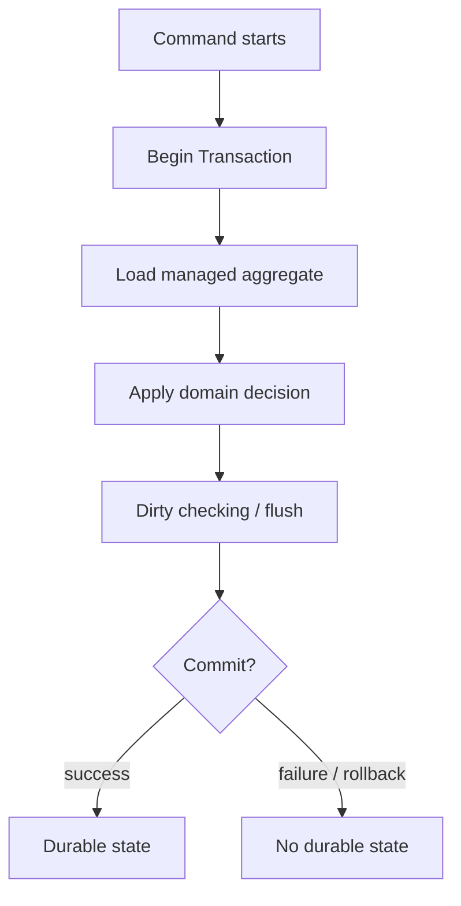
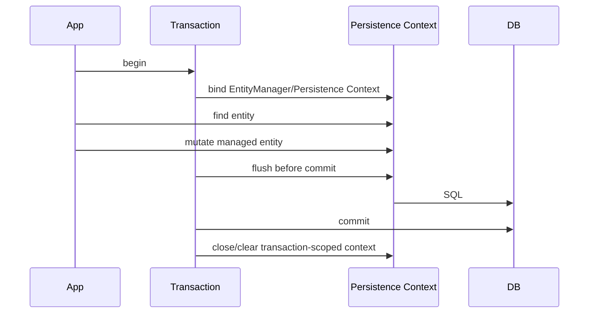
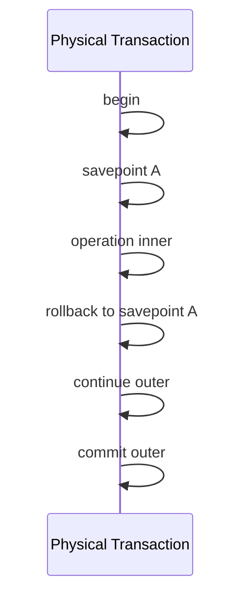
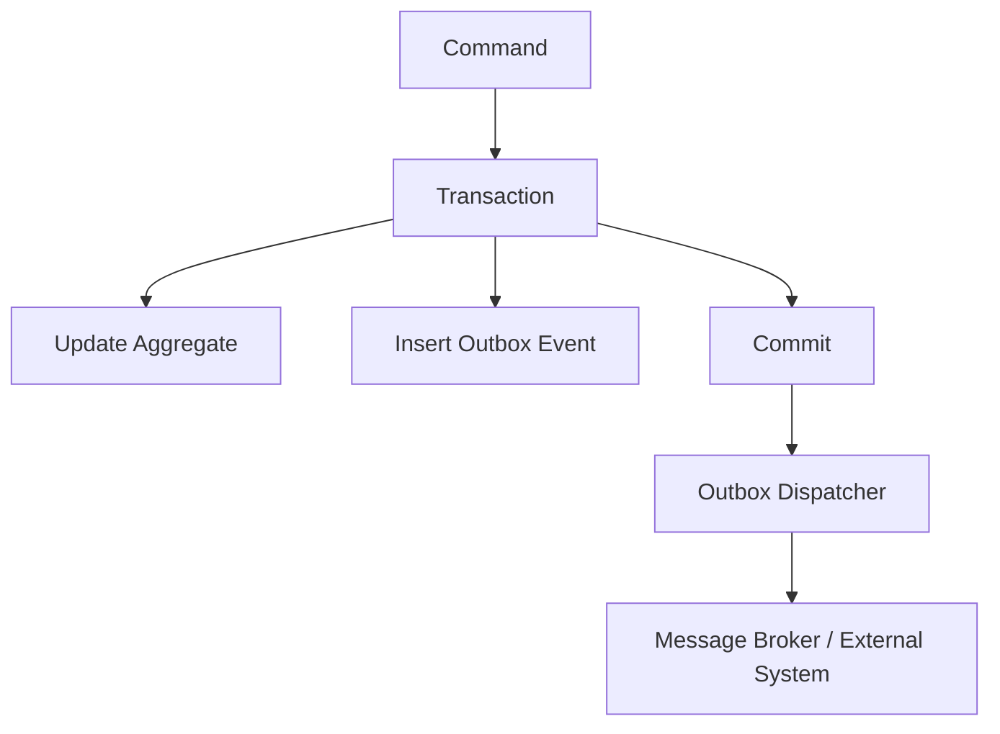
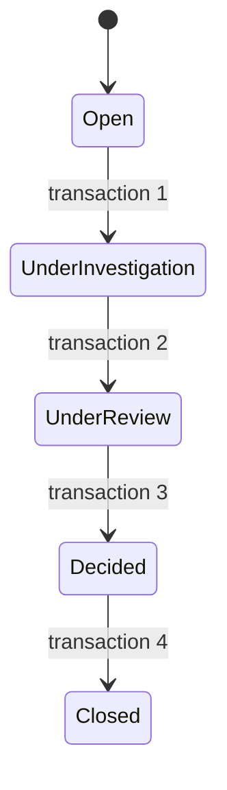

------
title: Learn Java Persistence, Database Integration, JPA, Hibernate ORM & EclipseLink - Part 020
description: Transaction boundary, consistency scope, resource-local vs JTA, Spring @Transactional, propagation, read-only semantics, rollback, long transaction risks, outbox boundary, dan testing traps pada aplikasi JPA.
series: learn-java-persistence
seriesTitle: Learn Java Persistence, Database Integration, JPA, Hibernate ORM & EclipseLink
order: 20
partTitle: Transactions and Consistency Boundaries
tags:
- java
- persistence
- jpa
- jakarta-persistence
- hibernate
- eclipselink
- orm
- transaction
- consistency
- spring
- jta
- jakarta-ee
- rollback
- propagation
- outbox
- testing
- series
date: 2026-06-27
---

# Transactions and Consistency Boundaries

> Target part ini: kamu mampu menentukan batas transaksi yang benar untuk command persistence, membedakan transaction boundary dari method boundary, memahami resource-local/JTA/Spring transaction, dan mendesain consistency scope yang tidak bocor ke external system.

Part sebelumnya membahas **flush**.

Sekarang kita membahas wadah yang membuat flush bermakna: **transaction**.

Tanpa transaction model yang benar, JPA menjadi sumber bug halus:

- data setengah berubah;
- event terkirim padahal database rollback;
- query membaca state stale;
- `@Transactional` tidak aktif karena self-invocation;
- `readOnly=true` dianggap larangan write padahal sering hanya hint/optimization;
- repository call punya transaksi sendiri-sendiri sehingga invariant aggregate pecah;
- `REQUIRES_NEW` dipakai untuk audit tetapi membuat audit commit saat command utama gagal;
- test hijau karena rollback test menyembunyikan flush/commit issue;
- long transaction memegang lock/connection terlalu lama.

Part ini bukan pengulangan dasar JDBC transaction.

Kita fokus pada **bagaimana transaction berinteraksi dengan persistence context, ORM, provider, framework, dan domain consistency**.

---

## 1. Kaufman Framing

Skill transaction dalam JPA harus dipecah menjadi sub-skill berikut:

| Sub-skill | Pertanyaan yang harus bisa dijawab |
|---|---|
| Transaction boundary | Kapan transaction mulai dan selesai? |
| Consistency boundary | Invariant apa yang harus benar pada commit? |
| Persistence context scope | Entity managed hidup selama apa? |
| Propagation | Apa yang terjadi jika method transactional memanggil method transactional lain? |
| Rollback semantics | Exception apa yang membatalkan transaction? |
| Flush interaction | Kapan SQL keluar sebelum commit? |
| Read-only behavior | Apakah read-only benar-benar mencegah write? |
| External side effects | Bagaimana mencegah message/email terkirim sebelum commit? |
| Testing traps | Apakah test benar-benar menguji commit behavior? |
| Long-running risk | Apakah transaction memegang connection/lock terlalu lama? |

Tujuan akhirnya:

> Kamu bisa melihat use case dan menggambar consistency envelope-nya sebelum menulis annotation.

---

## 2. Mental Model: Transaction sebagai Consistency Envelope

Transaction bukan sekadar annotation.

Transaction adalah **envelope** tempat beberapa perubahan harus berhasil atau gagal sebagai satu unit.



Pertanyaan utama:

> Invariant apa yang harus benar jika transaction commit?

Contoh regulatory/enforcement domain:

Command:

> Close case after final decision.

Invariant commit:

- `enforcement_case.status = CLOSED`;
- final decision recorded;
- closing actor recorded;
- open tasks cancelled or marked irrelevant;
- outbox event `CaseClosed` inserted;
- version incremented;
- no active enforcement action remains in invalid state.

Semua itu idealnya berada dalam satu transaction jika berada dalam database boundary yang sama.

---

## 3. Transaction Boundary vs Method Boundary

Tidak semua method harus transactional.

Tidak semua transactional method adalah consistency boundary.

Buruk:

```java
@Service
public class CaseService {
    public void closeCase(UUID id) {
        updateStatus(id);
        insertHistory(id);
        cancelTasks(id);
    }

    @Transactional
    public void updateStatus(UUID id) { ... }

    @Transactional
    public void insertHistory(UUID id) { ... }

    @Transactional
    public void cancelTasks(UUID id) { ... }
}
```

Masalah:

- tiap operation bisa commit sendiri-sendiri;
- invariant case closure tidak atomic;
- self-invocation pada Spring dapat membuat annotation tidak berlaku;
- rollback partial sulit dipulihkan.

Lebih baik:

```java
@Service
public class CloseCaseService {
    @Transactional
    public void closeCase(CloseCaseCommand command) {
        EnforcementCase caze = caseRepository.get(command.caseId());
        caze.close(command.decision(), command.actor());
        taskRepository.cancelOpenTasksForCase(command.caseId());
        outbox.append(CaseClosedEvent.from(caze));
    }
}
```

Satu application service method menjadi consistency boundary.

---

## 4. Persistence Context dan Transaction

Persistence context dan transaction terkait erat, tetapi bukan konsep yang sama.

Persistence context:

- menyimpan managed entities;
- melakukan identity map;
- dirty checking;
- write-behind.

Transaction:

- menentukan atomicity;
- commit/rollback;
- database isolation;
- lock lifecycle;
- connection/resource lifecycle.

Dalam aplikasi umum Spring/Jakarta EE, persistence context biasanya transaction-scoped.



Namun ada variasi:

- extended persistence context di Jakarta EE stateful scenarios;
- Open Session in View;
- manually managed EntityManager;
- provider/framework-specific scope;
- reactive/non-blocking persistence models.

Untuk mayoritas command service backend:

> Gunakan transaction-scoped persistence context. Jangan biarkan managed entity hidup melewati boundary aplikasi.

---

## 5. Resource-Local Transaction

Resource-local transaction digunakan ketika aplikasi mengelola `EntityTransaction` sendiri.

Contoh standalone:

```java
EntityManager em = emf.createEntityManager();
EntityTransaction tx = em.getTransaction();

try {
    tx.begin();

    EnforcementCase caze = em.find(EnforcementCase.class, id);
    caze.close(actor);

    tx.commit();
} catch (RuntimeException ex) {
    if (tx.isActive()) {
        tx.rollback();
    }
    throw ex;
} finally {
    em.close();
}
```

Resource-local cocok untuk:

- standalone tools;
- simple batch process;
- tests tanpa container;
- command line migration utilities;
- small applications.

Risiko:

- boilerplate rollback;
- mudah lupa close;
- sulit koordinasi banyak resource;
- tidak sebersih declarative transaction;
- error handling manual.

---

## 6. JTA / Container-Managed Transaction

JTA/container-managed transaction digunakan dalam Jakarta EE atau environment yang mengoordinasikan transaction antar resource.

Contoh konseptual:

```java
@ApplicationScoped
public class CloseCaseService {
    @Transactional
    public void close(CloseCaseCommand command) {
        EnforcementCase caze = em.find(EnforcementCase.class, command.caseId());
        caze.close(command.actor());
    }
}
```

Container/framework mengelola:

- transaction begin;
- persistence context binding;
- commit;
- rollback;
- resource enlistment;
- exception semantics.

JTA berguna jika ada kebutuhan koordinasi resource, tetapi distributed transaction tidak boleh dianggap default solusi microservices.

Untuk arsitektur modern, cross-service consistency biasanya lebih sering memakai:

- outbox;
- saga/process manager;
- idempotent consumers;
- retry;
- compensating action;
- eventual consistency.

---

## 7. Spring `@Transactional` Mental Model

Di Spring, `@Transactional` biasanya bekerja melalui proxy/AOP.

Artinya:

- annotation efektif saat method dipanggil melalui proxy Spring;
- self-invocation dalam class yang sama sering tidak melewati proxy;
- method visibility dan proxy mode memengaruhi behavior;
- transaction boundary sebaiknya di application service layer;
- repository method dapat transactional, tetapi jangan jadikan repository sebagai consistency boundary utama.

Anti-pattern self-invocation:

```java
@Service
public class CaseService {
    public void close(UUID id) {
        doClose(id); // self call, transactional proxy bisa tidak aktif
    }

    @Transactional
    public void doClose(UUID id) {
        ...
    }
}
```

Lebih baik:

```java
@Service
public class CaseService {
    @Transactional
    public void close(UUID id) {
        ...
    }
}
```

Atau pisahkan ke service lain jika memang perlu boundary berbeda.

---

## 8. Default Transaction Placement

Rule praktis:

> Letakkan transaction di application service command boundary, bukan di setiap repository method.

Contoh:

```java
@Transactional
public void escalateCase(EscalateCaseCommand command) {
    EnforcementCase caze = caseRepository.get(command.caseId());
    EscalationPolicy policy = policyRepository.getCurrentPolicy();

    caze.escalate(policy, command.reason(), command.actor());

    outbox.append(CaseEscalatedEvent.from(caze));
}
```

Repository:

```java
public EnforcementCase get(UUID id) {
    return em.find(EnforcementCase.class, id);
}
```

Repository tidak perlu membuka transaction sendiri jika sudah dipanggil dari service transactional.

---

## 9. Transaction Propagation

Propagation menentukan apa yang terjadi ketika method transactional dipanggil di dalam existing transaction.

Spring propagation umum:

| Propagation | Mental model | Use case |
|---|---|---|
| `REQUIRED` | Ikut transaction existing, atau buat baru jika belum ada. | Default command service. |
| `REQUIRES_NEW` | Suspend transaction existing, buat transaction baru. | Jarang; audit/outbox tertentu dengan konsekuensi jelas. |
| `MANDATORY` | Harus sudah ada transaction. | Repository internal yang tidak boleh dipakai di luar service boundary. |
| `SUPPORTS` | Ikut transaction jika ada, kalau tidak jalan non-transactional. | Read helper tertentu. |
| `NOT_SUPPORTED` | Suspend transaction, jalan tanpa transaction. | Operasi non-transactional/long-running yang tidak boleh tahan lock. |
| `NEVER` | Gagal jika ada transaction. | Guard untuk operasi yang tidak boleh transactional. |
| `NESTED` | Savepoint dalam transaction jika didukung. | Rare; partial rollback dalam satu physical transaction. |

Jangan memakai propagation untuk menambal desain boundary yang tidak jelas.

---

## 10. `REQUIRED`: Default yang Sehat

```java
@Transactional(propagation = Propagation.REQUIRED)
public void assignOfficer(AssignOfficerCommand command) {
    EnforcementCase caze = caseRepository.get(command.caseId());
    Officer officer = officerRepository.getReference(command.officerId());
    caze.assignOfficer(officer, command.actor());
}
```

Jika dipanggil dari transaction existing, ikut transaction itu.

Jika tidak ada, buat baru.

Ini cocok untuk mayoritas command service.

Namun hati-hati jika command service memanggil command service lain.

Jika dua use case berbeda digabung dalam satu transaction tanpa disadari, consistency scope bisa terlalu besar.

---

## 11. `REQUIRES_NEW`: Pisau Tajam

```java
@Transactional(propagation = Propagation.REQUIRES_NEW)
public void recordAudit(AuditEntry entry) {
    em.persist(entry);
}
```

`REQUIRES_NEW` membuat transaction baru dan mensuspend outer transaction.

Manfaat:

- audit/log tertentu tetap commit walau outer rollback;
- retry lokal;
- independent side effect database;
- boundary teknis tertentu.

Bahaya:

- audit bisa commit untuk business action yang rollback;
- inner transaction tidak melihat uncommitted outer changes;
- connection tambahan dibutuhkan;
- deadlock/lock ordering lebih rumit;
- semantic consistency mudah pecah.

Contoh buruk:

```java
@Transactional
public void closeCase(UUID id) {
    EnforcementCase caze = repository.get(id);
    caze.close(actor);

    auditService.recordCaseClosed(id); // REQUIRES_NEW

    throw new RuntimeException("rollback main transaction");
}
```

Hasil:

- audit case closed commit;
- case tidak closed karena outer rollback.

Mungkin ini diinginkan untuk technical audit “attempted close”.

Tetapi jika audit berarti “case was closed”, ini salah.

---

## 12. `NESTED` dan Savepoint

`NESTED` biasanya memakai savepoint dalam transaction yang sama jika resource manager mendukung.

Mental model:



Gunakan jarang.

Untuk domain command, partial rollback sering membuat invariant sulit dipahami.

Lebih baik pecah command atau gunakan explicit compensation jika memang process-level, bukan database-level.

---

## 13. Read-Only Transactions

`readOnly=true` bukan jaminan universal bahwa write mustahil.

Di banyak framework/provider, read-only dipakai sebagai:

- hint ke transaction manager;
- flush mode optimization;
- provider optimization;
- database-level read-only mode jika didukung/configured;
- dokumentasi intent.

Contoh:

```java
@Transactional(readOnly = true)
public CaseDetail getDetail(UUID id) {
    return queryRepository.findDetail(id);
}
```

Read-only harus dipakai untuk read path karena:

- memperjelas intent;
- bisa mengurangi flush overhead;
- bisa membantu routing read replica jika infrastructure mendukung;
- mencegah accidental write jika dikombinasikan dengan guard.

Tetapi jangan mengandalkan read-only saja untuk enforce invariants.

Buruk:

```java
@Transactional(readOnly = true)
public CaseDetail getDetail(UUID id) {
    EnforcementCase caze = repository.get(id);
    caze.markViewedBy(currentUser); // mutation
    return mapper.toDetail(caze);
}
```

Fix:

- jangan mutasi entity dalam read method;
- gunakan projection DTO;
- pisahkan “mark viewed” sebagai command;
- aktifkan guard/testing untuk SQL count pada read use case.

---

## 14. Isolation: Database vs Persistence Context

Database isolation level mengatur visibility antar transaction di database.

Persistence context mengatur identity dan cached state dalam transaction/application context.

Keduanya bisa membuat efek seperti repeatable read.

Contoh:

```java
EnforcementCase first = em.find(EnforcementCase.class, id);

// Transaction lain mengubah row dan commit.

EnforcementCase second = em.find(EnforcementCase.class, id);

assert first == second;
```

Dalam persistence context yang sama, `find()` kedua mengembalikan instance yang sama.

Bahkan jika database row berubah oleh transaction lain, kamu bisa tetap melihat state lama karena first-level cache.

Jika butuh state terbaru:

```java
em.refresh(first);
```

atau gunakan transaction baru/read model yang tepat.

Jangan mengira setiap `find()` selalu query database.

---

## 15. Staleness Within Transaction

Staleness bisa datang dari:

- first-level cache;
- second-level cache;
- query cache;
- native/bulk update;
- database trigger;
- concurrent transaction;
- read replica lag;
- long transaction;
- detached object.

Transaction bukan magic anti-stale.

Ia hanya memberi consistency guarantee sesuai isolation dan resource boundary.

Untuk high-integrity command:

- gunakan optimistic version;
- gunakan pessimistic lock jika perlu;
- validasi invariant di database jika kritis;
- desain retry;
- jangan pakai long-running detached entity sebagai source of truth.

---

## 16. Command Transaction Pattern

Template sehat:

```java
@Transactional
public Result handle(Command command) {
    // 1. Parse and validate command shape outside entity mutation.
    // 2. Load aggregate root.
    // 3. Load reference entities if needed.
    // 4. Apply domain decision.
    // 5. Persist side effects inside same DB boundary, usually outbox.
    // 6. Return DTO/result, not managed entity.
}
```

Contoh:

```java
@Transactional
public CloseCaseResult close(CloseCaseCommand command) {
    EnforcementCase caze = caseRepository.get(command.caseId());

    ClosureDecision decision = closurePolicy.evaluate(caze, command.reason());

    caze.close(decision, command.actor());
    outbox.append(CaseClosedEvent.from(caze));

    return CloseCaseResult.accepted(caze.id(), caze.version());
}
```

Return DTO sederhana.

Jangan return managed entity ke web/controller layer.

---

## 17. Query Transaction Pattern

Read use case idealnya:

```java
@Transactional(readOnly = true)
public CaseDetail detail(UUID id) {
    return caseQueryRepository.findDetail(id);
}
```

Query repository dapat memakai:

- DTO projection;
- JPQL constructor expression;
- Criteria projection;
- native SQL read model;
- entity graph jika memang ingin managed graph;
- read replica routing jika infrastructure mendukung.

Untuk read-heavy application, jangan semua query memuat aggregate root managed penuh.

Read path bukan command path.

---

## 18. Transaction Boundary and Aggregate Boundary

Aggregate boundary biasanya menjadi default consistency boundary.

Jika satu command mengubah satu aggregate:

```java
@Transactional
public void updateRisk(UpdateRiskCommand command) {
    EnforcementCase caze = caseRepository.get(command.caseId());
    caze.updateRisk(command.signals(), riskPolicy);
}
```

Jika command mengubah banyak aggregate:

```java
@Transactional
public void bulkEscalate(List<UUID> caseIds) {
    for (UUID id : caseIds) {
        EnforcementCase caze = caseRepository.get(id);
        caze.escalate(...);
    }
}
```

Pertanyaan review:

- apakah semua case harus atomic bersama?
- apakah rollback satu case harus rollback semua?
- apakah transaction terlalu panjang?
- apakah lock terlalu banyak?
- apakah batching lebih tepat?
- apakah process manager/event-driven lebih aman?

Untuk banyak aggregate, atomic transaction sering bukan pilihan terbaik.

---

## 19. Cross-Database / Cross-Service Consistency

JPA transaction tidak otomatis mencakup service lain.

Anti-pattern:

```java
@Transactional
public void closeCase(UUID id) {
    EnforcementCase caze = repository.get(id);
    caze.close(actor);

    paymentClient.refundPenalty(id); // external call inside transaction
    notificationClient.sendCaseClosed(id);
}
```

Masalah:

- external call tidak rollback bersama DB;
- transaction memegang connection selama network call;
- retry dapat menduplikasi side effect;
- timeout membuat state ambigu;
- lock duration meningkat.

Lebih baik:

```java
@Transactional
public void closeCase(UUID id) {
    EnforcementCase caze = repository.get(id);
    caze.close(actor);

    outbox.append(CaseClosedEvent.from(caze));
}
```

Dispatcher setelah commit mengirim event.

Consumer harus idempotent.

---

## 20. Transactional Outbox Boundary

Transactional outbox menyimpan integration event sebagai row dalam transaction yang sama dengan aggregate change.



Manfaat:

- aggregate change dan event record atomic;
- event tidak hilang setelah commit;
- event tidak terkirim jika rollback;
- dispatcher bisa retry;
- consumer bisa idempotent.

Outbox bukan solusi semua hal, tetapi hampir selalu lebih aman daripada publish langsung dalam transaction.

---

## 21. Rollback Semantics

Di Java/Spring, rollback behavior tergantung transaction manager dan exception type.

Secara umum di Spring declarative transaction:

- unchecked exception biasanya rollback;
- checked exception tidak selalu rollback kecuali dikonfigurasi;
- `rollbackFor` bisa digunakan;
- transaction bisa ditandai rollback-only;
- inner method dapat menyebabkan outer commit gagal dengan rollback-only marker.

Contoh eksplisit:

```java
@Transactional(rollbackFor = CaseClosureException.class)
public void close(CloseCaseCommand command) throws CaseClosureException {
    ...
}
```

Prinsip:

> Jangan bergantung pada kebetulan exception type untuk domain-critical rollback. Buat rollback semantics eksplisit untuk checked domain exceptions.

---

## 22. Rollback-Only Marker

Kasus umum:

```java
@Transactional
public void process() {
    try {
        innerService.doSomethingTransactional();
    } catch (Exception ignored) {
        // attempt to continue
    }

    repository.save(...);
}
```

Jika inner operation menandai transaction rollback-only, outer method mungkin terlihat lanjut tetapi commit akan gagal.

Gejala:

- semua kode selesai;
- commit akhir melempar exception;
- perubahan tidak durable;
- developer bingung karena exception awal sudah ditangkap.

Rule:

> Jangan menelan exception transactional tanpa memahami status transaction.

Jika ingin isolate failure, desain boundary eksplisit:

- separate transaction dengan konsekuensi jelas;
- savepoint jika tepat;
- retry command;
- process item-by-item dengan transaction per item;
- outbox/async processing.

---

## 23. Transaction Per Repository Call Anti-Pattern

Buruk:

```java
public void close(UUID id) {
    caseRepository.updateStatus(id, CLOSED);      // tx 1
    historyRepository.insertClosed(id);           // tx 2
    taskRepository.cancelTasks(id);               // tx 3
}
```

Jika tx 2 gagal, status sudah closed tanpa history.

Lebih baik:

```java
@Transactional
public void close(UUID id) {
    caseRepository.updateStatus(id, CLOSED);
    historyRepository.insertClosed(id);
    taskRepository.cancelTasks(id);
}
```

Lebih baik lagi, jika memakai aggregate:

```java
@Transactional
public void close(UUID id) {
    EnforcementCase caze = caseRepository.get(id);
    caze.close(actor);
    taskRepository.cancelTasksForCase(id);
}
```

---

## 24. Transaction Too Large Anti-Pattern

Kebalikan dari transaction terlalu kecil adalah transaction terlalu besar.

Buruk:

```java
@Transactional
public void nightlyRegulatorySync() {
    List<ExternalRecord> records = externalClient.fetchAll();

    for (ExternalRecord record : records) {
        process(record);
    }

    reportClient.sendSummary();
}
```

Masalah:

- network call dalam transaction;
- connection ditahan lama;
- lock lama;
- rollback besar;
- memory persistence context membengkak;
- sulit retry partial failure;
- external summary terkirim sebelum commit.

Lebih baik:

- fetch external data di luar transaction;
- process chunk dengan transaction pendek;
- persist outbox/report request;
- dispatch setelah commit;
- idempotent processing.

---

## 25. Long Conversation vs Short Transaction

Business process bisa panjang.

Database transaction harus pendek.

Contoh process:

1. investigator opens case;
2. supervisor reviews;
3. respondent submits evidence;
4. officer updates recommendation;
5. committee decides;
6. case closed.

Ini bisa berlangsung minggu/bulan.

Jangan simpan database transaction selama process ini.

Gunakan:

- state machine persisted;
- optimistic version;
- command per transition;
- domain events;
- task/workflow engine jika perlu;
- process manager/saga;
- audit log.

Setiap transition punya transaction pendek.



---

## 26. Open Session in View Transaction Trap

Open Session in View membiarkan persistence context terbuka sampai view/API serialization.

Masalah:

- lazy loading terjadi di presentation layer;
- query tersebar dan sulit dihitung;
- transaction boundary kabur;
- accidental flush bisa terjadi;
- API response shape mengendalikan persistence behavior;
- connection/resource dapat tertahan lebih lama tergantung konfigurasi.

Untuk high-integrity backend, lebih aman:

- disable OSIV untuk API services;
- query DTO/projection untuk read path;
- explicit fetch plan/entity graph jika perlu;
- map entity ke DTO di service boundary;
- pastikan SQL count diuji.

---

## 27. Transaction and Connection Acquisition

Transaction aktif tidak selalu berarti database connection langsung diambil saat method masuk.

Framework/provider bisa mengambil connection lazily saat operasi database pertama.

Namun dari perspektif desain:

- jangan taruh CPU/network work besar dalam transactional method;
- jangan mengandalkan lazy connection acquisition untuk membenarkan boundary lebar;
- transaction annotation tetap berarti unit kerja semantic;
- database operation pertama dapat memegang resource sampai commit.

Struktur lebih baik:

```java
public void handle(Command command) {
    ValidatedInput input = validator.validate(command); // outside tx if expensive/no DB
    transactionalHandler.apply(input);
}

@Transactional
public void apply(ValidatedInput input) {
    ... DB work ...
}
```

Tetapi hati-hati: memecah service demi transaction proxy harus dilakukan dengan sadar, bukan membuat spaghetti service.

---

## 28. External Call Placement

Rule keras:

> Jangan melakukan remote call lambat/tidak idempotent di tengah transaction database kecuali kamu benar-benar menerima konsekuensinya.

Buruk:

```java
@Transactional
public void imposeSanction(UUID caseId) {
    EnforcementCase caze = repository.get(caseId);
    caze.imposeSanction();

    externalRegistryClient.registerSanction(caseId); // network call
}
```

Lebih baik:

```java
@Transactional
public void imposeSanction(UUID caseId) {
    EnforcementCase caze = repository.get(caseId);
    caze.imposeSanction();
    outbox.append(SanctionImposedEvent.from(caze));
}
```

Dispatcher:

```java
public void dispatch(OutboxEvent event) {
    externalRegistryClient.registerSanction(event.caseId());
    outbox.markDispatched(event.id());
}
```

Dengan retry dan idempotency.

---

## 29. Transactional Events

Framework seperti Spring punya transactional event listener.

Pola:

- collect domain event during transaction;
- publish internal application event;
- listener runs after commit;
- external side effect occurs only if commit succeeds.

Namun untuk reliable integration, outbox tetap lebih kuat karena event tersimpan durable.

After-commit listener tanpa outbox masih bisa hilang jika process crash setelah commit sebelum publish eksternal.

Decision:

| Need | Pattern |
|---|---|
| Local in-memory side effect after commit | Transactional event listener cukup. |
| Reliable external message | Transactional outbox. |
| Cross-service consistency | Outbox + idempotent consumer/process manager. |
| Immediate external synchronous response | Rethink boundary; maybe reservation/confirm pattern. |

---

## 30. Exception Handling Pattern

Buruk:

```java
@Transactional
public void handle(Command command) {
    try {
        caze.apply(command);
    } catch (Exception ex) {
        log.warn("ignored", ex);
    }
}
```

Masalah:

- invalid state bisa tetap diflush;
- transaction bisa rollback-only;
- caller menerima sukses palsu;
- invariant tidak jelas.

Lebih baik:

```java
@Transactional
public void handle(Command command) {
    EnforcementCase caze = repository.get(command.caseId());
    caze.apply(command); // let domain exception abort transaction
}
```

Untuk partial failure per item:

```java
public ImportReport importRows(List<Row> rows) {
    ImportReport report = new ImportReport();

    for (Row row : rows) {
        try {
            rowImportTransaction.importOne(row);
            report.success(row.id());
        } catch (Exception ex) {
            report.failure(row.id(), ex.getMessage());
        }
    }

    return report;
}

@Transactional
public void importOne(Row row) {
    ...
}
```

Setiap item punya transaction sendiri.

---

## 31. Testing Trap: `@Transactional` Test Rollback

Banyak test framework menjalankan test dengan transaction lalu rollback setelah test.

Manfaat:

- database bersih;
- test mudah;
- cepat.

Bahaya:

- commit behavior tidak diuji;
- constraint yang deferred sampai commit bisa tidak terlihat jika tidak flush;
- after-commit hook tidak jalan seperti production;
- outbox dispatcher tidak diuji;
- LazyInitializationException bisa tersembunyi karena persistence context test tetap terbuka;
- entity masih managed saat assertion sehingga tidak membuktikan reload dari DB.

Untuk persistence test kritis:

```java
em.flush();
em.clear();

EnforcementCase reloaded = em.find(EnforcementCase.class, id);
assertThat(reloaded.status()).isEqualTo(CLOSED);
```

Untuk commit behavior:

- gunakan transaction template;
- end transaction explicitly;
- run assertion in new transaction;
- test outbox after commit.

---

## 32. Testing Trap: False Positive Managed State

Test buruk:

```java
@Transactional
@Test
void closeCase() {
    service.closeCase(caseId);

    EnforcementCase caze = repository.get(caseId);
    assertThat(caze.status()).isEqualTo(CLOSED);
}
```

Jika `repository.get` mengembalikan entity yang sama dari persistence context, test bisa hijau bahkan jika flush/commit mapping bermasalah.

Lebih baik:

```java
service.closeCase(caseId);

em.flush();
em.clear();

EnforcementCase reloaded = repository.get(caseId);
assertThat(reloaded.status()).isEqualTo(CLOSED);
```

Atau assert di transaction baru.

---

## 33. Testing Trap: Read-Only Query Writes

Untuk query service read-only, test SQL count:

```java
@Test
void detailShouldNotWrite() {
    sqlRecorder.clear();

    CaseDetail detail = queryService.detail(caseId);

    assertThat(sqlRecorder.insertCount()).isZero();
    assertThat(sqlRecorder.updateCount()).isZero();
    assertThat(sqlRecorder.deleteCount()).isZero();
}
```

Ini menangkap:

- accidental audit update;
- setter mutation during mapping;
- lazy collection initialization that mutates order column;
- read method yang menulis lastViewed;
- lifecycle callback yang terlalu agresif.

---

## 34. Transaction Boundary with Locks

Locking akan dibahas detail di Part 021, tetapi boundary transaksi sudah perlu dipahami.

Pessimistic lock hidup sampai transaction selesai.

```java
@Transactional
public void assignOfficer(UUID caseId, UUID officerId) {
    EnforcementCase caze = em.find(
        EnforcementCase.class,
        caseId,
        LockModeType.PESSIMISTIC_WRITE
    );

    caze.assignOfficer(em.getReference(Officer.class, officerId));
}
```

Jika transaction terlalu panjang, lock terlalu lama.

Optimistic lock conflict biasanya terdeteksi saat flush/commit.

Retry harus mengulang transaction dari awal.

Jangan retry dengan entity lama.

---

## 35. Transaction Boundary and Versioning

Dengan `@Version`, consistency boundary mencakup expected version.

API command sebaiknya membawa version jika user mengedit stale data:

```java
public record UpdateCaseCommand(
    UUID caseId,
    long expectedVersion,
    CasePatch patch,
    Actor actor
) {}
```

Dalam transaction:

```java
@Transactional
public void update(UpdateCaseCommand command) {
    EnforcementCase caze = repository.get(command.caseId());
    caze.assertVersion(command.expectedVersion());
    caze.apply(command.patch(), command.actor());
}
```

Atau rely on provider version check saat flush.

Untuk user-facing concurrency, explicit expected version memberi error yang lebih domain-friendly.

---

## 36. Transaction Boundary and Validation

Validasi dibagi menjadi:

| Validation type | Boundary |
|---|---|
| Syntax/shape validation | Sebelum transaction jika tidak butuh DB. |
| Authorization | Sebelum atau awal transaction, tergantung butuh DB state. |
| Existence check | Dalam transaction jika hasilnya memengaruhi command. |
| Domain invariant | Dalam aggregate method. |
| Cross-aggregate invariant | Dalam service/domain policy + database constraints jika kritis. |
| Uniqueness | Database constraint sebagai final guard. |

Jangan melakukan mutation managed entity sebelum semua precondition penting siap jika query precondition bisa memicu flush.

---

## 37. Transaction Boundary and Database Constraints

Database constraints adalah bagian dari consistency design, bukan musuh ORM.

Gunakan constraints untuk invariant yang harus benar walau aplikasi bug:

- primary key;
- unique key;
- foreign key;
- not null;
- check constraint;
- exclusion constraint jika database mendukung;
- partial unique index jika cocok.

JPA validation/domain validation memberi error lebih awal dan lebih ramah.

Database constraint memberi guard terakhir.

Keduanya saling melengkapi.

---

## 38. Transaction and Idempotency

Retry bisa terjadi karena:

- optimistic lock;
- deadlock;
- timeout;
- network error;
- duplicate message;
- user double submit.

Transaction boundary harus dipadukan dengan idempotency.

Contoh command:

```java
public record CloseCaseCommand(
    UUID commandId,
    UUID caseId,
    ClosureDecision decision,
    Actor actor
) {}
```

Dalam transaction:

```java
@Transactional
public CloseCaseResult close(CloseCaseCommand command) {
    if (processedCommandRepository.exists(command.commandId())) {
        return processedCommandRepository.result(command.commandId());
    }

    EnforcementCase caze = repository.get(command.caseId());
    caze.close(command.decision(), command.actor());

    processedCommandRepository.record(command.commandId(), caze.id());
    outbox.append(CaseClosedEvent.from(caze, command.commandId()));

    return CloseCaseResult.closed(caze.id());
}
```

Unique constraint pada `command_id` menjadi final guard.

---

## 39. Transaction and Read Replica

Jika aplikasi memakai read replica:

- write transaction commit di primary;
- read berikutnya ke replica bisa stale;
- read-your-write tidak otomatis terjamin;
- transaction read-only routing perlu sadar consistency requirement.

Untuk command result:

- return data dari aggregate managed/primary transaction;
- atau force read from primary after write;
- atau accept eventual consistency dan desain UI accordingly.

Jangan menganggap `@Transactional(readOnly=true)` selalu aman diarahkan ke replica.

Beberapa read membutuhkan strong consistency.

---

## 40. Transaction and Cache

First-level cache selalu dalam persistence context.

Second-level/query cache dapat melampaui transaction.

Consistency review:

- apakah cache invalidated saat commit?
- apakah native/bulk update menginvalidasi cache?
- apakah read-only cache region benar-benar immutable?
- apakah query cache dipakai untuk data frequently changing?
- apakah transaction rollback meninggalkan cache artifact? Provider biasanya mengelola ini, tetapi native bypass bisa mengganggu.

Part caching sudah dibahas nanti lebih detail di Part 022, tetapi transaction boundary tetap memengaruhi cache consistency.

---

## 41. Transaction Boundary and Streaming

Streaming large result dalam transaction bisa berbahaya.

```java
@Transactional(readOnly = true)
public void exportCases(OutputStream out) {
    caseRepository.streamAllOpenCases().forEach(row -> write(out, row));
}
```

Risiko:

- transaction panjang;
- cursor/connection terbuka lama;
- client download lambat menahan DB resource;
- timeout;
- memory/flush mode issue;
- lock/isolation effects.

Alternatif:

- page/keyset query chunk;
- write to file/object storage async;
- export job dengan checkpoint;
- separate read model;
- database copy/export utility.

---

## 42. Transaction Boundary and Pagination Updates

Memproses sambil update dengan offset pagination bisa skip/duplicate row.

Buruk:

```java
for (int page = 0; ; page++) {
    List<Case> cases = findOpenCases(page, 100);
    if (cases.isEmpty()) break;
    cases.forEach(Case::close);
}
```

Jika update mengubah filter/sort, halaman berikutnya berubah.

Lebih baik:

- keyset pagination by immutable key;
- select ids first;
- chunk by id range;
- mark processing state;
- use SKIP LOCKED if appropriate and database supports;
- process queue/outbox.

---

## 43. Transaction and Time

Jangan campur waktu aplikasi dan waktu database tanpa sadar.

Options:

- set `createdAt/updatedAt` di aplikasi menggunakan injected `Clock`;
- gunakan database default/trigger;
- gunakan provider timestamp annotation jika acceptable;
- konsisten untuk audit/legal defensibility.

Untuk regulatory systems, audit time harus jelas:

- event occurred time;
- recorded time;
- effective time;
- database commit time jika tersedia;
- actor/timezone/source.

Transaction commit order bisa berbeda dari event occurred order.

Representasikan dengan eksplisit.

---

## 44. Transaction and Security Context

Audit actor harus ditangkap saat command dieksekusi.

Jangan biarkan entity/lifecycle callback mengambil security context secara tersembunyi tanpa testability.

Lebih baik:

```java
caze.close(decision, ActorRef.from(currentUser));
```

Daripada:

```java
@PreUpdate
void audit() {
    this.updatedBy = SecurityContextHolder.getContext().getAuthentication().getName();
}
```

Callback bisa dipakai, tetapi regulatory defensibility sering lebih baik jika actor adalah bagian eksplisit dari command.

---

## 45. Transaction and Authorization

Authorization yang bergantung pada current DB state sebaiknya berada dalam atau dekat transaction boundary.

Contoh:

```java
@Transactional
public void approveCase(ApproveCaseCommand command) {
    EnforcementCase caze = repository.get(command.caseId());

    authorizationPolicy.assertCanApprove(command.actor(), caze);

    caze.approve(command.actor());
}
```

Jika authorization dilakukan terlalu awal dengan stale read, state bisa berubah sebelum mutation.

Untuk high-risk action, gunakan version/lock sesuai kebutuhan.

---

## 46. Transaction Boundary in Modular Architecture

Dalam modular monolith:

- satu database transaction bisa mencakup beberapa module internal;
- tetapi module boundary tetap perlu jelas;
- jangan expose entity antar module sembarangan;
- gunakan application service/API internal;
- outbox/domain events untuk decoupling jika module lifecycle berbeda.

Contoh:

```java
@Transactional
public void closeCase(CloseCaseCommand command) {
    caseModule.close(command);
    taskModule.cancelTasksForCase(command.caseId());
    outbox.append(...);
}
```

Pastikan tidak ada module melakukan `REQUIRES_NEW` diam-diam kecuali contract-nya eksplisit.

---

## 47. Transaction Boundary in Microservices

Dalam microservices:

- transaction lokal hanya mencakup database service tersebut;
- cross-service invariant tidak atomic secara database;
- workflow harus menerima eventual consistency;
- gunakan idempotency, outbox, inbox, retry, compensation;
- jangan mengandalkan distributed transaction kecuali environment benar-benar mendukung dan trade-off diterima.

Persistence engineer top-level harus bisa berkata:

> “Ini bukan masalah annotation. Ini masalah consistency model.”

---

## 48. Decision Matrix: Transaction Scope

| Use case | Recommended transaction scope |
|---|---|
| Create/update one aggregate | One command transaction. |
| Update aggregate + outbox | Same transaction. |
| Read DTO detail | Read-only transaction or no transaction depending stack, but explicit read boundary. |
| Export huge dataset | Avoid one long transaction; chunk/job/read model. |
| Batch import many rows | Chunk transaction or flush/clear cadence. |
| External API call after DB change | Outbox/after commit, not inside transaction. |
| Audit attempted action | Separate transaction may be okay if semantics says attempted, not succeeded. |
| Multi-aggregate all-or-nothing small operation | One transaction if lock/time acceptable. |
| Multi-aggregate large operation | Process manager/chunk/event-driven. |
| Cross-service workflow | Local transaction + outbox/saga/idempotency. |

---

## 49. Review Checklist

```text
[ ] What is the business consistency boundary?
[ ] Does one transaction cover exactly that boundary?
[ ] Are repository calls accidentally committing independently?
[ ] Is transaction placed on application service command method?
[ ] Are entities returned outside transaction boundary?
[ ] Are remote calls avoided inside transaction?
[ ] Are outbox rows committed with aggregate changes?
[ ] Is read-only method truly read-only by SQL count?
[ ] Are rollback rules explicit for checked domain exceptions?
[ ] Is propagation default REQUIRED unless justified?
[ ] Is REQUIRES_NEW used only with documented semantics?
[ ] Could self-invocation bypass transaction proxy?
[ ] Are large imports chunked or flush/clear controlled?
[ ] Do tests assert after flush/clear or new transaction?
[ ] Is isolation/locking sufficient for concurrent updates?
[ ] Are database constraints present for critical invariants?
[ ] Are side effects idempotent and retry-safe?
```

---

## 50. Lab A: Transaction Per Command

Implement command:

```java
public record CloseCaseCommand(UUID caseId, ClosureDecision decision, Actor actor) {}
```

Service:

```java
@Transactional
public void close(CloseCaseCommand command) {
    EnforcementCase caze = repository.get(command.caseId());
    caze.close(command.decision(), command.actor());
    taskRepository.cancelOpenTasks(command.caseId());
    outbox.append(CaseClosedEvent.from(caze));
}
```

Test:

- success commits all changes;
- exception after `caze.close()` rolls back case/status/task/outbox;
- assert in new transaction.

---

## 51. Lab B: REQUIRES_NEW Audit Semantics

Create audit service:

```java
@Transactional(propagation = Propagation.REQUIRES_NEW)
public void record(AuditEntry entry) {
    em.persist(entry);
}
```

Call inside command then throw exception.

Observe:

- audit committed;
- main aggregate rolled back.

Rename audit event:

- from `CaseClosedAudit`;
- to `CaseCloseAttemptedAudit`.

Lesson:

> Transaction propagation changes business truth. Name records accordingly.

---

## 52. Lab C: Read-Only Write Detection

Write a read query service that accidentally mutates entity.

Test SQL recorder:

```java
assertThat(sqlRecorder.updateCount()).isZero();
```

Then fix with DTO projection.

Goal:

- prove read-only annotation alone is not enough as architecture guard;
- enforce read/write separation with tests.

---

## 53. Lab D: Self-Invocation

Create service:

```java
public void outer(UUID id) {
    inner(id);
}

@Transactional
public void inner(UUID id) {
    ...
}
```

Observe whether transaction active in your Spring configuration.

Then move `@Transactional` to `outer` or separate service bean.

Lesson:

> Transaction annotation is runtime infrastructure, not a magic keyword.

---

## 54. Lab E: Transactional Test False Positive

Test managed state vs committed state.

1. Mutate entity in transactional test.
2. Assert without `flush/clear`.
3. Break mapping intentionally.
4. Observe false positive.
5. Add `flush/clear` or new transaction assertion.

Goal:

> A persistence test is not credible until it proves database state, not just managed object state.

---

## 55. Lab F: Outbox Atomicity

Within one transaction:

```java
caze.escalate(...);
outbox.append(CaseEscalatedEvent.from(caze));
```

Test:

- success: aggregate updated, outbox row exists;
- rollback: neither aggregate update nor outbox row exists;
- dispatcher only sends committed outbox row.

This is the minimum reliable integration pattern.

---

## 56. Failure Mode Map

| Failure | Root cause | Better model |
|---|---|---|
| Partial data update | Transaction too small | One transaction per command consistency boundary. |
| Lock timeout | Transaction too large/slow | Short transaction, no remote call inside. |
| Event sent but DB rolled back | Side effect before commit | Outbox/after-commit. |
| Audit lies | `REQUIRES_NEW` semantics misunderstood | Distinguish attempted vs succeeded audit. |
| Read endpoint writes | Managed entity mutated in read path | DTO projection/read model. |
| Test passes but production fails | Test asserts managed state only | Flush/clear/new transaction assertion. |
| No transaction active | Self-invocation/proxy issue | Put boundary on external service method. |
| Rollback not triggered | Checked exception/default rules | Explicit rollback rules. |
| Stale entity | Persistence context cache/native update/long tx | Refresh/clear/new transaction/versioning. |
| Batch job crashes late | Huge transaction | Chunked transaction/checkpoint. |

---

## 57. Top 1% Heuristics

A strong persistence engineer does not ask first:

> “Where should I put `@Transactional`?”

They ask:

> “What state must become true atomically?”

They do not ask:

> “Can I call this API inside transaction?”

They ask:

> “What happens if this API succeeds and database rolls back, or database commits and API times out?”

They do not ask:

> “Why did test pass?”

They ask:

> “Did test assert committed database state from a fresh persistence context?”

They do not ask:

> “Should audit use `REQUIRES_NEW`?”

They ask:

> “Is this audit recording attempted action or committed business fact?”

---

## 58. Mental Compression

Transaction mastery in JPA can be compressed into eight rules:

1. Transaction is a consistency envelope, not just an annotation.
2. Put transaction boundaries on application command services.
3. Persistence context state and database committed state are different things.
4. Flush sends SQL; commit makes it durable.
5. Propagation changes business truth; default to `REQUIRED`.
6. `readOnly=true` expresses intent/optimization, not universal write prevention.
7. Do not perform unreliable external side effects inside DB transaction.
8. Test committed state, rollback behavior, and after-commit behavior explicitly.

---

## 59. Key Takeaways

- Transaction boundary should match business consistency boundary.
- Persistence context is usually transaction-scoped in typical service-layer JPA applications.
- Resource-local transaction is manually controlled; JTA/container/Spring transactions are declarative/infrastructure-managed.
- `@Transactional` in Spring is proxy-based in common configurations; self-invocation can bypass it.
- `REQUIRED` is the sane default for command services; `REQUIRES_NEW` is a sharp tool with business consequences.
- Read-only transaction is useful but should not be the only guard against accidental writes.
- Database isolation and persistence context caching are different consistency mechanisms.
- External side effects should usually happen after commit or through transactional outbox.
- Tests must flush/clear or assert in a new transaction to prove database state.
- Long-running business processes should use short transactions per transition, not one long database transaction.

Selanjutnya: **Part 021 — Locking, Concurrency, and Isolation**.
