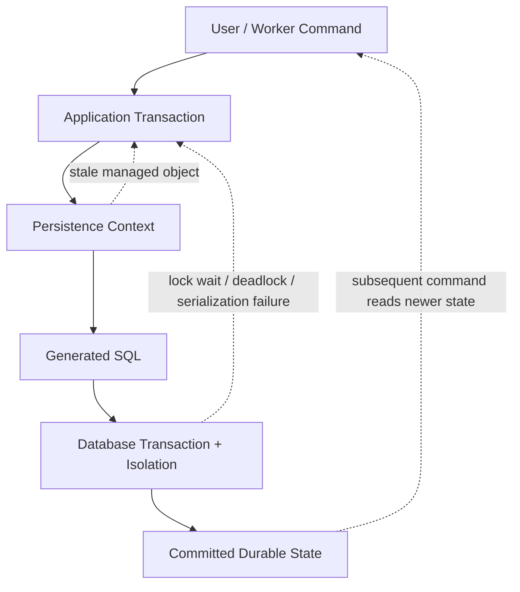
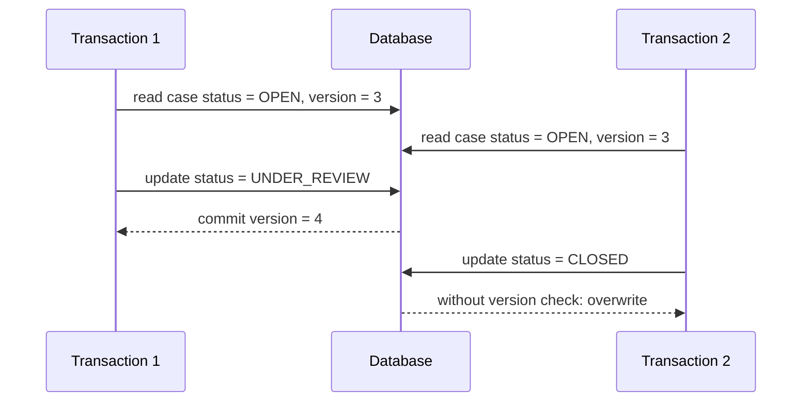
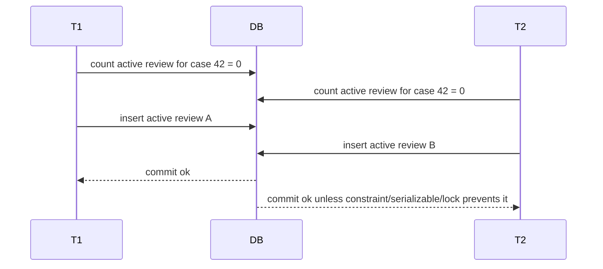
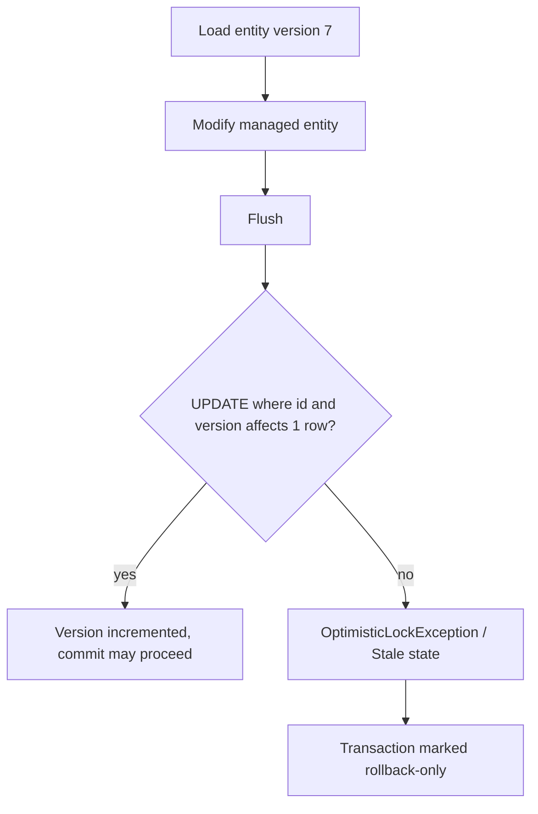
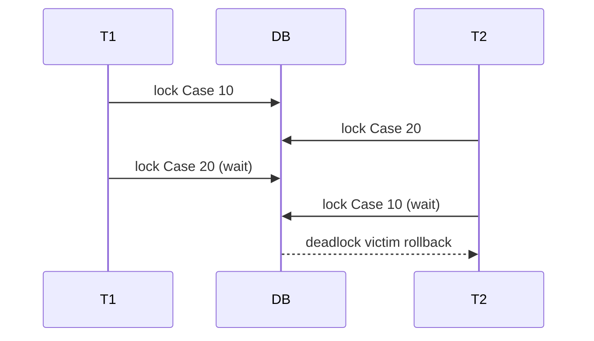

------
title: Learn Java Persistence, Database Integration, JPA, Hibernate ORM & EclipseLink - Part 021
description: Locking, concurrency control, isolation interaction, optimistic and pessimistic locking, versioning, retry design, and consistency failure modelling for advanced Java persistence systems.
series: learn-java-persistence
seriesTitle: Learn Java Persistence, Database Integration, JPA, Hibernate ORM & EclipseLink
order: 21
partTitle: Locking, Concurrency, and Isolation
tags:
  - java
  - jakarta-persistence
  - jpa
  - hibernate
  - eclipselink
  - locking
  - concurrency
  - transactions
  - database
  - persistence
  - advanced
  - series
date: 2026-06-27
---

# Part 021 — Locking, Concurrency, and Isolation

> Target: setelah membaca part ini, kamu tidak hanya tahu cara menulis `@Version` atau `LockModeType.PESSIMISTIC_WRITE`. Kamu harus bisa mendesain **consistency boundary** untuk aggregate, memilih optimistic vs pessimistic locking, membaca failure mode dari SQL/transaction behavior, dan membuat retry policy yang defensible untuk sistem production.

Materi ini melanjutkan Part 020 tentang transaction boundary. Kita tidak mengulang dasar isolation level dari seri JDBC. Fokus kita adalah bagaimana isolation database berinteraksi dengan **Jakarta Persistence**, **Hibernate ORM**, **EclipseLink**, object graph, flush, detached entity, dan aggregate design.

Referensi utama:

- Jakarta Persistence 3.2 Specification dan API.
- Jakarta EE Tutorial: locking dan second-level cache.
- Hibernate ORM 7.x User Guide.
- EclipseLink 5.x release/documentation untuk provider notes.

---

## 1. Kaufman Framing: Apa Skill Kecil yang Harus Dikuasai?

Josh Kaufman menekankan deconstruction: pecah skill besar menjadi sub-skill kecil yang bisa dilatih. Untuk concurrency persistence, skill besarnya bukan “hafal lock mode”. Skill besarnya adalah:

> Mampu menjamin bahwa dua atau lebih transaction yang berjalan bersamaan tidak merusak invariant domain.

Skill ini bisa dipecah menjadi tujuh sub-skill:

1. Mengidentifikasi **shared mutable data**.
2. Membedakan **database isolation guarantee** vs **application-level invariant**.
3. Memilih optimistic, pessimistic, atau constraint-based control.
4. Mendesain `@Version` placement pada aggregate.
5. Menentukan retry policy yang aman.
6. Menangani detached object dan stale command.
7. Membuktikan dengan test bahwa lost update, double action, dan write skew tidak lolos.

Kita akan terus memakai domain lab:

> Regulatory enforcement case management.

Contoh aggregate:

- `EnforcementCase`
- `CaseAssignment`
- `CaseDecision`
- `PenaltyAssessment`
- `EvidenceRecord`
- `EscalationReview`

Concurrency di domain ini nyata:

- Dua officer mencoba assign case yang sama.
- Supervisor approve case sementara investigator masih mengubah evidence.
- Penalty calculation dijalankan berdasarkan snapshot lama.
- Bulk job menutup case expired sementara user sedang submit remediation.
- Event outbox menerbitkan event dari state yang ternyata rollback.

---

## 2. Mental Model: Concurrency Bukan Hanya Lock

Concurrency persistence selalu berada di lima lapisan:



Kesalahan umum adalah mengira satu lapisan otomatis menyelesaikan semua masalah.

| Lapisan | Menjamin | Tidak Menjamin |
|---|---|---|
| Persistence context | Identity map dalam satu context | Konsistensi global antar transaction |
| `@Version` | Deteksi konflik update pada row/entity berversi | Semua invariant multi-row |
| Database isolation | Aturan visibilitas read/write di database | Semantik domain seperti “hanya satu active assignment” |
| Pessimistic lock | Blocking atau gagal cepat terhadap akses tertentu | Desain lock order yang bebas deadlock |
| Unique constraint | Mencegah duplikasi state tertentu | User experience atau retry logic |
| Application retry | Recovery dari konflik sementara | Operasi non-idempotent yang sudah punya side effect eksternal |

**Ingat invariant utama:**

> ORM tidak menghilangkan kebutuhan concurrency modelling. ORM hanya menyediakan mekanisme untuk mengekspresikan sebagian strategi concurrency di level entity.

---

## 3. Jenis Konflik yang Harus Bisa Kamu Kenali

### 3.1 Lost Update

Dua transaction membaca state yang sama, lalu keduanya update. Update kedua menimpa update pertama tanpa menyadari perubahan.



Dengan optimistic locking:

```sql
update enforcement_case
set status = ?, version = ?
where id = ? and version = ?
```

Jika `version` lama tidak cocok, row count `0`, provider melempar optimistic lock exception.

### 3.2 Dirty Read

Transaction membaca data yang belum commit. Umumnya dicegah oleh isolation default database modern. Jarang menjadi masalah langsung di Jakarta Persistence, tetapi bisa muncul pada konfigurasi database yang terlalu lemah atau native SQL dengan isolation rendah.

### 3.3 Non-Repeatable Read

Transaction membaca row yang sama dua kali dan mendapat nilai berbeda karena transaction lain commit di antaranya.

Di persistence context, ini bisa tersembunyi karena `find()` kedua bisa mengembalikan managed instance lama dari first-level cache. Artinya:

```java
Case c1 = em.find(Case.class, id);
// transaction lain commit perubahan
Case c2 = em.find(Case.class, id); // biasanya instance yang sama dari persistence context
```

Aplikasi mungkin mengira database tidak berubah, padahal hanya membaca cache level pertama.

### 3.4 Phantom Read

Transaction menjalankan query range dua kali, dan query kedua melihat row tambahan/hilang karena transaction lain commit.

Contoh:

```sql
select * from case_assignment
where case_id = ? and active = true;
```

Transaction pertama melihat tidak ada active assignment. Transaction kedua insert active assignment. Transaction pertama kemudian insert juga. Jika tidak ada unique constraint, invariant rusak.

### 3.5 Write Skew

Dua transaction membaca kondisi bersama, lalu menulis row berbeda sehingga invariant global rusak.

Contoh invariant:

> Maksimal satu `EscalationReview` aktif per case.

Tanpa unique partial index atau pessimistic lock pada parent aggregate, dua transaction bisa sama-sama melihat “belum ada review aktif”, lalu insert row berbeda.



**Pelajaran:** `@Version` pada child row tidak cukup jika konflik terjadi pada kondisi multi-row.

---

## 4. Optimistic Locking

Optimistic locking cocok ketika konflik jarang terjadi tetapi correctness tetap penting.

Mental model:

> Jangan block lebih awal. Deteksi saat write/flush/commit bahwa data yang dibaca sudah berubah.

### 4.1 `@Version`

Jakarta Persistence menggunakan `@Version` untuk optimistic concurrency control.

```java
import jakarta.persistence.*;

@Entity
@Table(name = "enforcement_case")
public class EnforcementCase {

    @Id
    @GeneratedValue(strategy = GenerationType.SEQUENCE, generator = "case_seq")
    private Long id;

    @Version
    @Column(nullable = false)
    private long version;

    @Enumerated(EnumType.STRING)
    @Column(nullable = false)
    private CaseStatus status;

    @Column(nullable = false)
    private String assignedUnit;

    protected EnforcementCase() {
    }

    public void escalate(String reason) {
        if (status != CaseStatus.OPEN && status != CaseStatus.UNDER_REVIEW) {
            throw new IllegalStateException("Only open or under-review cases can be escalated");
        }
        this.status = CaseStatus.ESCALATED;
    }
}
```

Allowed version types are provider/spec defined; common portable choices are numeric types such as `int`, `Integer`, `long`, `Long`, `short`, `Short`, and timestamp-like types where supported. For high-throughput systems, numeric versions are usually easier to reason about than timestamps.

### 4.2 Apa yang Terjadi Saat Update?

Misalnya entity version `7` di-load lalu dimodifikasi.

Provider akan menghasilkan update kira-kira seperti:

```sql
update enforcement_case
set status = ?, assigned_unit = ?, version = 8
where id = ? and version = 7;
```

Jika row count `1`, update berhasil.

Jika row count `0`, artinya:

- row tidak ada; atau
- version sudah berubah; atau
- database trigger/condition membuat row tidak match.

Provider akan melempar optimistic lock exception.



### 4.3 Kapan Exception Muncul?

Optimistic locking exception bisa muncul pada:

- explicit `flush()`;
- query yang memicu flush;
- transaction commit;
- explicit `lock()`;
- `refresh()` dengan lock;
- provider-specific internal synchronization.

Karena exception bisa muncul di commit, jangan taruh side effect eksternal sebelum commit.

Buruk:

```java
@Transactional
public void closeCase(Long caseId) {
    EnforcementCase c = em.find(EnforcementCase.class, caseId);
    c.close();

    notificationClient.sendCaseClosed(c.getId()); // side effect sebelum commit
}
```

Lebih aman:

```java
@Transactional
public void closeCase(Long caseId) {
    EnforcementCase c = em.find(EnforcementCase.class, caseId);
    c.close();
    outbox.publish(new CaseClosedEvent(c.getId()));
}
```

Event keluar setelah transaction commit melalui outbox processor.

---

## 5. Optimistic Lock Modes

Jakarta Persistence menyediakan lock mode optimistik:

| Lock Mode | Mental Model | Use Case |
|---|---|---|
| `OPTIMISTIC` / `READ` | Pastikan entity tidak berubah sebelum transaction selesai | Read decision yang harus valid saat commit |
| `OPTIMISTIC_FORCE_INCREMENT` / `WRITE` | Pastikan entity tidak berubah dan paksa version naik | Parent aggregate harus berubah secara logical walau field parent tidak berubah |

`READ` dan `WRITE` adalah synonym lama; nama yang lebih jelas adalah `OPTIMISTIC` dan `OPTIMISTIC_FORCE_INCREMENT`.

### 5.1 `OPTIMISTIC`

Misalnya supervisor membaca case dan ingin membuat keputusan berdasarkan state case. Entity belum tentu dimodifikasi, tetapi keputusan harus gagal jika case berubah sebelum commit.

```java
@Transactional
public void approveEscalation(Long caseId, String note) {
    EnforcementCase c = em.find(
        EnforcementCase.class,
        caseId,
        LockModeType.OPTIMISTIC
    );

    c.approveEscalation(note);
}
```

### 5.2 `OPTIMISTIC_FORCE_INCREMENT`

Contoh: menambah child entity harus membuat version parent naik karena parent aggregate berubah secara logical.

```java
@Transactional
public void addEvidence(Long caseId, EvidenceCommand command) {
    EnforcementCase c = em.find(
        EnforcementCase.class,
        caseId,
        LockModeType.OPTIMISTIC_FORCE_INCREMENT
    );

    c.addEvidence(command.filename(), command.sha256());
}
```

Kenapa ini penting?

Jika version hanya ada di parent dan child insert tidak membuat parent update, transaction lain bisa membuat keputusan berdasarkan version parent yang sama, padahal evidence sudah berubah.

**Aggregate-level invariant:**

> Jika child collection memengaruhi keputusan aggregate, perubahan child harus ikut mengubah concurrency token aggregate.

---

## 6. Retry Design untuk Optimistic Locking

Optimistic locking tanpa retry policy sering membuat UX buruk. Tetapi retry sembarangan bisa merusak correctness.

### 6.1 Retry Aman Jika Command Idempotent dan Re-evaluable

Retry aman ketika command bisa dibaca ulang, divalidasi ulang, dan diterapkan ke state terbaru.

```java
public final class CloseCaseCommand {
    private final Long caseId;
    private final String reason;
    private final String commandId; // idempotency key
}
```

Service:

```java
public void closeCaseWithRetry(CloseCaseCommand command) {
    retryOptimisticConflict(3, () -> {
        transactionalExecutor.execute(() -> {
            EnforcementCase c = em.find(EnforcementCase.class, command.caseId());
            c.close(command.reason(), command.commandId());
            outbox.publish(new CaseClosedEvent(command.caseId(), command.commandId()));
        });
    });
}
```

Tapi perhatikan: transaction baru harus dibuat untuk setiap retry. Setelah optimistic conflict, transaction lama rollback-only.

### 6.2 Retry Tidak Aman Jika Ada Side Effect Non-Idempotent

Contoh buruk:

- kirim email langsung;
- charge payment;
- call external sanction registry;
- publish Kafka event sebelum commit;
- generate irreversible document number tanpa idempotency key.

Jika harus retry, semua side effect harus dipindahkan ke outbox, idempotency table, atau post-commit hook yang benar-benar aman.

### 6.3 Retry Bukan Jawaban untuk Konflik Semantik

Jika dua user mengedit field yang sama, retry otomatis mungkin menimpa intent user. Untuk UI edit form, lebih baik tampilkan conflict resolution:

- nilai lama yang user lihat;
- nilai terbaru di database;
- perubahan yang user coba buat;
- pilihan merge/manual override.

---

## 7. Pessimistic Locking

Pessimistic locking cocok ketika konflik sering terjadi atau biaya conflict resolution terlalu tinggi.

Mental model:

> Ambil lock lebih awal. Transaction lain harus menunggu atau gagal.

Lock mode utama:

| Lock Mode | Mental Model | Typical SQL |
|---|---|---|
| `PESSIMISTIC_READ` | Prevent conflicting writes while allowing compatible reads if database supports | `SELECT ... FOR SHARE` atau variant DB |
| `PESSIMISTIC_WRITE` | Prevent read/write conflicts requiring exclusive row access | `SELECT ... FOR UPDATE` |
| `PESSIMISTIC_FORCE_INCREMENT` | Pessimistic lock plus version increment | Provider-specific SQL/update combo |

### 7.1 Example: Assign Case Atomically

```java
@Transactional
public void assignCase(Long caseId, String unit) {
    EnforcementCase c = em.find(
        EnforcementCase.class,
        caseId,
        LockModeType.PESSIMISTIC_WRITE
    );

    c.assignTo(unit);
}
```

Provider biasanya menerjemahkan ke SQL row lock. Bentuk SQL tergantung database dialect.

### 7.2 Lock Timeout

Pessimistic lock tanpa timeout bisa membuat request menggantung terlalu lama.

```java
Map<String, Object> hints = Map.of(
    "jakarta.persistence.lock.timeout", 2_000 // milliseconds, provider/database dependent
);

EnforcementCase c = em.find(
    EnforcementCase.class,
    caseId,
    LockModeType.PESSIMISTIC_WRITE,
    hints
);
```

Policy timeout harus disesuaikan dengan use case:

| Use Case | Timeout Strategy |
|---|---|
| UI request | pendek, return conflict/busy message |
| background reconciler | retry dengan backoff |
| maintenance job | mungkin lebih panjang, tapi observability wajib |
| high-contention queue claim | gunakan DB-specific atomic claim pattern, bukan entity lock umum |

### 7.3 Pessimistic Lock Tidak Sama dengan Distributed Lock

`PESSIMISTIC_WRITE` mengunci row di database transaction. Ini tidak otomatis menjadi distributed lock untuk resource eksternal.

Jika command juga menyentuh:

- file storage;
- external registry;
- message broker;
- distributed cache;
- remote service;

maka lock database hanya melindungi database state, bukan sistem eksternal.

---

## 8. Deadlock: Locking yang Benar Bisa Tetap Gagal

Deadlock terjadi ketika dua transaction memegang lock berbeda dan saling menunggu.



### 8.1 Lock Ordering

Jika perlu mengunci banyak entity, selalu lock dalam urutan deterministik.

```java
@Transactional
public void mergeCases(Long leftId, Long rightId) {
    List<Long> ids = Stream.of(leftId, rightId).sorted().toList();

    EnforcementCase first = em.find(
        EnforcementCase.class,
        ids.get(0),
        LockModeType.PESSIMISTIC_WRITE
    );

    EnforcementCase second = em.find(
        EnforcementCase.class,
        ids.get(1),
        LockModeType.PESSIMISTIC_WRITE
    );

    // perform merge
}
```

### 8.2 Keep Lock Scope Small

Pessimistic transaction harus pendek:

- jangan call remote service di dalam lock;
- jangan generate file besar di dalam lock;
- jangan melakukan report query panjang sambil memegang lock;
- jangan menunggu user input di dalam transaction.

---

## 9. Isolation Level Interaction

`@Version` dan isolation level adalah mekanisme berbeda.

| Mechanism | Bekerja di | Mendeteksi/Mencegah |
|---|---|---|
| `@Version` | Entity row update | Lost update pada entity berversi |
| Read committed | DB transaction visibility | Dirty read |
| Repeatable read | DB snapshot/locks tergantung DB | Non-repeatable read, sebagian phantom tergantung DB |
| Serializable | DB schedule equivalence | Banyak anomaly, dengan cost/abort lebih tinggi |
| Unique constraint | DB write validation | Duplicate invariant |
| Pessimistic lock | DB row/range lock | Concurrent modification pada locked resource |

### 9.1 `@Version` Tetap Berguna pada Isolation Tinggi

Bahkan pada repeatable read, optimistic version membantu:

- memberikan conflict signal domain-level;
- membuat update check eksplisit;
- melindungi detached edit form;
- membuat retry policy jelas;
- kompatibel dengan provider-level optimistic locking.

### 9.2 Serializable Bukan Pengganti Domain Constraint

Serializable bisa mencegah banyak anomaly, tetapi tidak otomatis menggantikan:

- unique constraint;
- foreign key;
- check constraint;
- explicit domain validation;
- idempotency key.

Untuk invariant penting, gunakan database constraint bila bisa.

Contoh PostgreSQL partial unique index:

```sql
create unique index uq_active_assignment_per_case
on case_assignment(case_id)
where active = true;
```

JPA mapping tidak sepenuhnya portable untuk partial index. Ini bagian dari migration boundary, bukan entity annotation semata.

---

## 10. Version Placement pada Aggregate

Pertanyaan desain paling penting:

> Entity mana yang harus memiliki `@Version`?

### 10.1 Root Version

Untuk aggregate kecil, version di root biasanya cukup.

```java
@Entity
public class EnforcementCase {
    @Id
    private Long id;

    @Version
    private long version;

    @OneToMany(mappedBy = "enforcementCase", cascade = CascadeType.ALL, orphanRemoval = true)
    private List<EvidenceRecord> evidenceRecords = new ArrayList<>();
}
```

Namun child changes harus menaikkan root version bila child memengaruhi aggregate invariant.

Options:

1. Ubah field root seperti `lastModifiedAt`.
2. Gunakan `OPTIMISTIC_FORCE_INCREMENT` saat command mengubah child.
3. Simpan child sebagai value collection jika cocok.
4. Beri version pada child juga, tetapi jangan mengira itu otomatis melindungi root invariant.

### 10.2 Child Version

Child version berguna jika child bisa diedit independently.

```java
@Entity
public class EvidenceRecord {
    @Id
    private Long id;

    @Version
    private long version;

    @ManyToOne(optional = false, fetch = FetchType.LAZY)
    private EnforcementCase enforcementCase;
}
```

Tapi jika command “approve case” bergantung pada seluruh evidence set, version child saja tidak cukup.

### 10.3 Aggregate Token Pattern

Kadang root version saja tidak cukup ekspresif. Kamu bisa membuat explicit aggregate token:

```java
@Column(nullable = false)
private long evidenceRevision;

public void addEvidence(EvidenceRecord evidence) {
    evidenceRecords.add(evidence);
    evidence.attachTo(this);
    evidenceRevision++;
}
```

Ini berguna jika UI ingin tahu bagian mana yang berubah:

- case header revision;
- evidence revision;
- assignment revision;
- penalty revision.

Tapi jangan membuat revision token berlebihan tanpa kebutuhan observability/UX.

---

## 11. Detached Entity dan Stale Command

Detached entity adalah sumber konflik yang sering tersembunyi.

Flow umum web app:

1. User membuka edit form.
2. Entity/DTO dikirim ke browser.
3. User menunggu 20 menit.
4. User submit perubahan.
5. Server merge/update state lama.

Jika form tidak membawa version, conflict tidak bisa dideteksi dengan baik.

DTO command harus membawa version yang user lihat:

```java
public record UpdateCaseSummaryCommand(
    Long caseId,
    long expectedVersion,
    String summary
) {}
```

Service:

```java
@Transactional
public void updateSummary(UpdateCaseSummaryCommand command) {
    EnforcementCase c = em.find(EnforcementCase.class, command.caseId());

    if (c.version() != command.expectedVersion()) {
        throw new StaleCaseCommandException(command.caseId());
    }

    c.updateSummary(command.summary());
}
```

Atau gunakan provider-level optimistic lock dengan detached merge, tetapi explicit expected version sering lebih jelas untuk API contract.

### 11.1 Jangan Percaya `merge()` sebagai Conflict Resolver

`merge()` menyalin state detached ke managed instance. Ia tidak tahu field mana yang user sengaja ubah vs field mana yang hanya stale snapshot.

Anti-pattern:

```java
@Transactional
public EnforcementCase update(EnforcementCase detached) {
    return em.merge(detached); // overwrites too much
}
```

Lebih baik command-specific update:

```java
@Transactional
public void updatePriority(UpdatePriorityCommand command) {
    EnforcementCase c = em.find(EnforcementCase.class, command.caseId());
    c.changePriority(command.priority(), command.expectedVersion());
}
```

---

## 12. Locking dan Query

Lock tidak hanya lewat `find()`. Query juga bisa diberi lock mode.

```java
List<EnforcementCase> cases = em.createQuery("""
    select c
    from EnforcementCase c
    where c.status = :status
    order by c.createdAt
    """, EnforcementCase.class)
    .setParameter("status", CaseStatus.READY_FOR_ASSIGNMENT)
    .setMaxResults(10)
    .setLockMode(LockModeType.PESSIMISTIC_WRITE)
    .getResultList();
```

Namun hati-hati:

- lock behavior dengan pagination tergantung SQL dialect;
- join fetch plus lock bisa mengunci lebih banyak row dari yang kamu kira;
- lock pada query kompleks bisa menghasilkan execution plan buruk;
- lock timeout harus disetel;
- work queue lebih baik memakai pattern atomic claim database-specific bila high throughput.

### 12.1 Work Claim Pattern

Untuk background worker yang claim case:

```sql
update enforcement_case
set status = 'PROCESSING', claimed_by = ?, claimed_at = current_timestamp
where id = (
    select id
    from enforcement_case
    where status = 'READY'
    order by created_at
    fetch first 1 row only
)
```

Banyak database punya fitur seperti `SKIP LOCKED`. Itu bukan portable Jakarta Persistence, tetapi sering lebih tepat untuk queue-like workload. Gunakan native SQL dengan migration/testing yang jelas.

---

## 13. Bulk Update dan Version Bypass

JPQL bulk update/delete tidak berjalan seperti update managed entity biasa.

Contoh:

```java
int updated = em.createQuery("""
    update EnforcementCase c
    set c.status = :expired
    where c.deadline < :now
      and c.status = :open
    """)
    .setParameter("expired", CaseStatus.EXPIRED)
    .setParameter("open", CaseStatus.OPEN)
    .setParameter("now", now)
    .executeUpdate();
```

Risiko:

- persistence context bisa stale;
- lifecycle callback tidak dipanggil per entity;
- entity version mungkin tidak dinaikkan kecuali query eksplisit melakukan itu;
- second-level cache invalidation provider-specific;
- domain invariant method dilewati.

Jika bulk update menyentuh entity berversi, pertimbangkan explicit version increment:

```java
int updated = em.createQuery("""
    update EnforcementCase c
    set c.status = :expired,
        c.version = c.version + 1
    where c.deadline < :now
      and c.status = :open
    """)
    .setParameter("expired", CaseStatus.EXPIRED)
    .setParameter("open", CaseStatus.OPEN)
    .setParameter("now", now)
    .executeUpdate();
```

Setelah bulk operation:

```java
em.clear();
```

Atau pastikan bulk operation berjalan di transaction/persistence context terpisah.

---

## 14. Constraint-Based Concurrency

Tidak semua concurrency harus diselesaikan dengan lock. Database constraint sering lebih kuat, lebih sederhana, dan lebih defensible.

### 14.1 Unique Constraint untuk Idempotency

```sql
create unique index uq_case_command_id
on case_command_log(command_id);
```

```java
@Entity
@Table(
    name = "case_command_log",
    uniqueConstraints = @UniqueConstraint(name = "uq_case_command_id", columnNames = "command_id")
)
public class CaseCommandLog {
    @Id
    private Long id;

    @Column(name = "command_id", nullable = false, updatable = false)
    private String commandId;
}
```

Jika duplicate command masuk, database menolak. Aplikasi bisa mengubah exception menjadi idempotent success atau conflict.

### 14.2 Check Constraint untuk State Validity

Beberapa invariant sederhana bisa diletakkan di database:

```sql
alter table penalty_assessment
add constraint ck_penalty_amount_non_negative
check (amount >= 0);
```

JPA bukan pengganti database constraints. Entity validation adalah early feedback; constraint database adalah final guard.

---

## 15. Provider Notes: Hibernate ORM

Hibernate menggunakan version column untuk optimistic locking dan menghasilkan SQL update/delete dengan predicate version. Beberapa behavior yang perlu diperhatikan:

### 15.1 Dirty Checking dan Version Increment

Version biasanya naik saat entity dianggap dirty. Jika hanya child collection berubah, apakah root version naik bergantung mapping dan operation. Jangan mengandalkan asumsi; buat test SQL.

### 15.2 `@OptimisticLock`

Hibernate punya annotation extension seperti `@org.hibernate.annotations.OptimisticLock` untuk mengecualikan field tertentu dari optimistic locking atau mengatur behavior lebih detail.

Gunakan hanya jika:

- kamu paham portability cost;
- ada alasan performa/semantik jelas;
- test menunjukkan behavior sesuai.

### 15.3 Versionless Optimistic Locking

Hibernate mendukung beberapa strategi optimistic locking tanpa `@Version` melalui extension, tetapi untuk aplikasi portable dan production-critical, `@Version` eksplisit lebih mudah diaudit.

### 15.4 Pessimistic Lock SQL Tergantung Dialect

`PESSIMISTIC_WRITE` dapat menjadi `FOR UPDATE`, `FOR UPDATE NOWAIT`, atau variasi lain berdasarkan hint, dialect, dan database.

Jangan review locking hanya dari kode Java. Review juga generated SQL dan database behavior.

---

## 16. Provider Notes: EclipseLink

EclipseLink menggunakan konsep UnitOfWork dan memiliki fitur caching/locking yang luas. Untuk locking:

- `@Version` tetap jalur portable.
- Pessimistic lock behavior tetap bergantung database platform.
- EclipseLink extensions bisa mengatur cache isolation dan refresh behavior yang berinteraksi dengan concurrency.

Jika target portability Hibernate ↔ EclipseLink penting:

1. Gunakan Jakarta Persistence lock modes terlebih dahulu.
2. Hindari provider extension untuk invariant utama.
3. Buat provider compatibility test untuk lock timeout, generated SQL, dan exception translation.

---

## 17. Exception Handling

Exception locking harus diterjemahkan ke error domain/API yang benar.

| Exception/Condition | Meaning | Typical Response |
|---|---|---|
| Optimistic conflict | State berubah sejak dibaca | 409 Conflict / retry if safe |
| Pessimistic lock timeout | Resource sedang dipakai | 409/423/503 depending context |
| Deadlock victim | Database memilih transaction rollback | retry with backoff if idempotent |
| Constraint violation | Invariant database dilanggar | 409 or validation error |
| Serialization failure | Isolation conflict | retry whole transaction if safe |

Jangan expose exception provider langsung ke client.

```java
try {
    service.approve(command);
} catch (OptimisticLockException ex) {
    throw new ConflictException("Case was modified by another transaction. Please reload.");
}
```

Di Spring, exception bisa diterjemahkan menjadi `ObjectOptimisticLockingFailureException`, `CannotAcquireLockException`, `DeadlockLoserDataAccessException`, atau `DataIntegrityViolationException` tergantung stack.

---

## 18. Observability untuk Concurrency

Concurrency bug sulit direproduksi. Observability harus didesain sejak awal.

Minimal metrics:

- optimistic lock conflict count by entity/use case;
- pessimistic lock timeout count;
- deadlock count;
- retry attempts;
- retry exhausted;
- transaction duration;
- lock wait duration jika database expose;
- duplicate command/idempotency conflict;
- stale form submission count.

Log event minimal:

```json
{
  "event": "optimistic_lock_conflict",
  "entity": "EnforcementCase",
  "entityId": 42,
  "command": "ApproveEscalation",
  "expectedVersion": 11,
  "actualVersionKnown": false,
  "correlationId": "..."
}
```

Jangan log full entity atau evidence content bila ada data sensitif.

---

## 19. Testing Concurrency

Unit test biasa tidak cukup. Kamu perlu integration test dengan database nyata.

### 19.1 Two-Transaction Test

Pseudo-structure:

```java
@Test
void concurrentCloseShouldProduceOptimisticConflict() throws Exception {
    Long caseId = fixture.openCase();

    CountDownLatch bothLoaded = new CountDownLatch(2);
    CountDownLatch allowCommit = new CountDownLatch(1);

    Future<?> t1 = executor.submit(() -> tx.execute(() -> {
        EnforcementCase c = em.find(EnforcementCase.class, caseId);
        bothLoaded.countDown();
        bothLoaded.await();
        c.close("first");
    }));

    Future<?> t2 = executor.submit(() -> tx.execute(() -> {
        EnforcementCase c = em.find(EnforcementCase.class, caseId);
        bothLoaded.countDown();
        bothLoaded.await();
        c.close("second");
    }));

    assertThatOneFailsWithOptimisticConflict(t1, t2);
}
```

Important:

- gunakan real DB via Testcontainers;
- gunakan transaction terpisah;
- jangan pakai same `EntityManager`;
- assert final state;
- assert event/outbox tidak double-published.

### 19.2 Write Skew Test

Buat dua transaction yang sama-sama melihat “tidak ada active review”, lalu insert. Test harus membuktikan unique constraint atau locking mencegah double active review.

---

## 20. Decision Matrix

| Situation | Recommended Strategy |
|---|---|
| Low contention entity edit | `@Version` optimistic locking |
| High contention single row | Pessimistic lock with timeout or atomic SQL |
| Multi-row uniqueness invariant | Unique constraint / partial unique index |
| Queue claim | Native atomic claim with DB-specific locking |
| Detached UI edit | DTO carries expected version |
| Child modification affects aggregate decision | Root version increment / force increment |
| External side effect after state change | Outbox/idempotency, not direct call before commit |
| Frequent deadlocks | Deterministic lock ordering, shorter transactions |
| Bulk status update | Explicit version increment, clear persistence context |
| Provider portability required | Stick to Jakarta lock modes and integration tests |

---

## 21. Anti-Patterns

### 21.1 No Version Column on Mutable Aggregate

Mutable aggregate without version means lost update is likely under concurrent edits.

### 21.2 Catching Optimistic Conflict and Continuing Same Transaction

After optimistic conflict, transaction is usually rollback-only. Continuing work is unsafe.

### 21.3 Retrying Non-Idempotent Operations

Retrying after sending external side effects creates duplicates.

### 21.4 Pessimistic Lock Around Remote Calls

Locks held while waiting on network create throughput collapse and deadlock risk.

### 21.5 Assuming Isolation Solves Domain Invariant

Isolation helps, but domain invariants still need explicit model/constraint.

### 21.6 `merge()` of Full Detached Entity from API

This can overwrite concurrent changes and blur user intent.

---

## 22. Deliberate Practice Lab

Implement the following exercises in the regulatory case lab.

### Lab 1 — Lost Update Protection

1. Add `@Version` to `EnforcementCase`.
2. Write two concurrent transactions changing case priority.
3. Assert one succeeds and one fails.
4. Add API mapping to `409 Conflict`.

### Lab 2 — Aggregate Child Revision

1. Add evidence to a case in one transaction.
2. Approve case in another transaction based on old version.
3. Decide whether evidence addition should force root version increment.
4. Implement and test.

### Lab 3 — Active Assignment Invariant

1. Model `CaseAssignment`.
2. Ensure only one active assignment per case.
3. Try solving with application check only.
4. Prove it fails under concurrency.
5. Add database constraint or parent lock.

### Lab 4 — Pessimistic Lock Timeout

1. Transaction A locks a case and sleeps.
2. Transaction B attempts `PESSIMISTIC_WRITE` with short timeout.
3. Assert timeout behavior and exception mapping.

### Lab 5 — Deadlock Reproduction

1. Transaction A locks case 1 then case 2.
2. Transaction B locks case 2 then case 1.
3. Observe deadlock.
4. Fix with deterministic ordering.

---

## 23. Review Checklist

Before approving persistence code that modifies shared data, ask:

- What domain invariant can be broken by concurrent commands?
- Is there a version column on mutable aggregate roots?
- Does child modification need to increment parent aggregate version?
- Are detached commands carrying expected version?
- Are retries idempotent?
- Are external side effects delayed until after commit via outbox?
- Is any pessimistic lock held while doing remote I/O?
- Is there deterministic lock ordering for multi-entity operations?
- Are multi-row invariants protected by database constraints or stronger locking?
- Do integration tests use real concurrent transactions?
- Are lock conflicts observable in metrics/logs?

---

## 24. Mental Model Summary

```mermaid
flowchart LR
    A[Invariant] --> B{Single entity?}
    B -->|yes| C[@Version optimistic locking]
    B -->|no| D{Can database constraint express it?}
    D -->|yes| E[Constraint + exception mapping]
    D -->|no| F{High contention?}
    F -->|yes| G[Pessimistic lock / atomic SQL]
    F -->|no| H[Optimistic aggregate token + retry/conflict UX]

    C --> I[Test with two transactions]
    E --> I
    G --> I
    H --> I
```

Top 1% persistence engineers do not ask “which lock annotation should I use?” first. They ask:

1. What invariant must survive concurrency?
2. What state did the command observe?
3. What state does the command modify?
4. Where is the conflict detected?
5. What is the recovery path?
6. Can this be proven with an integration test?

That is the difference between API usage and concurrency design.
