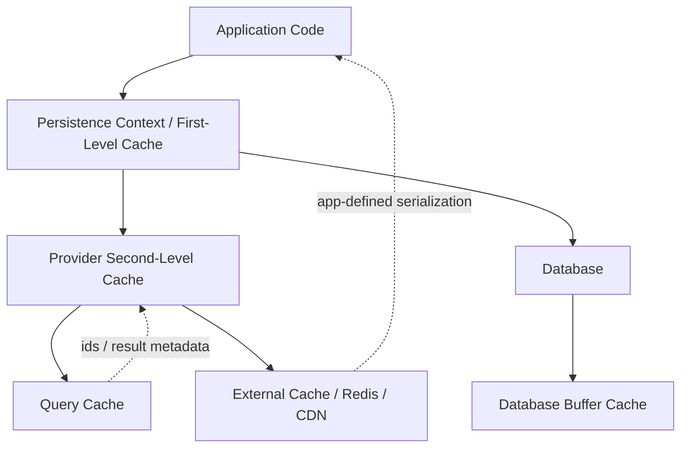
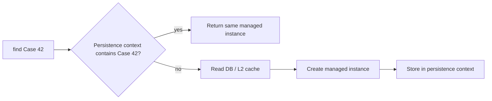
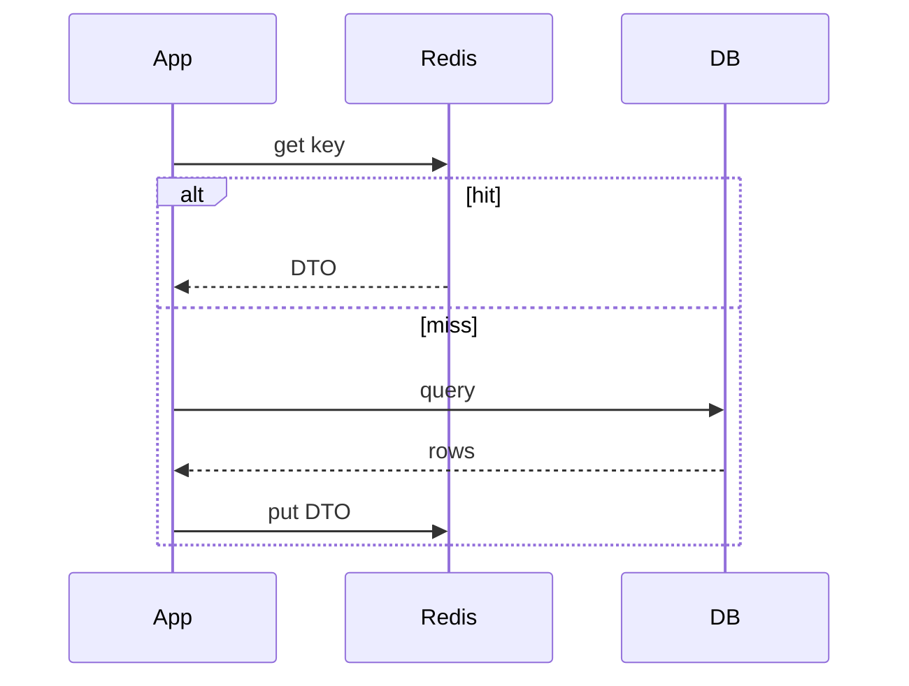
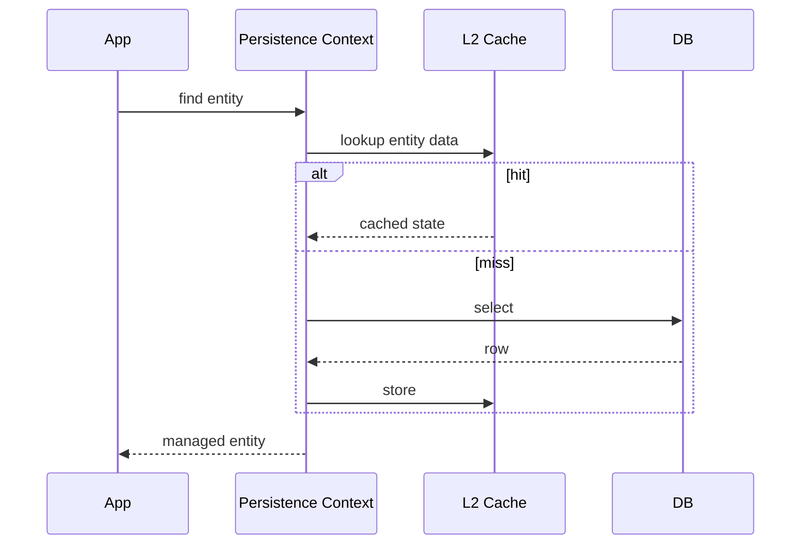
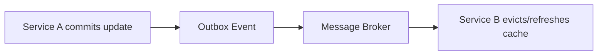
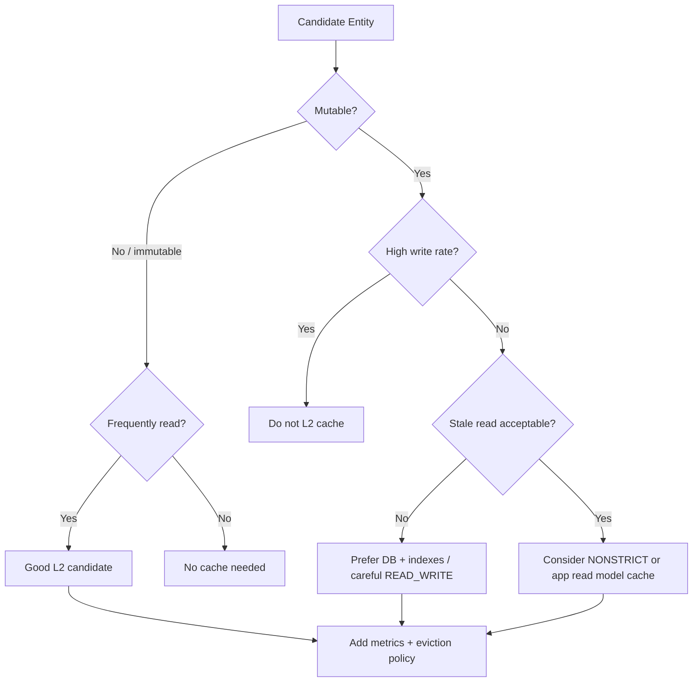
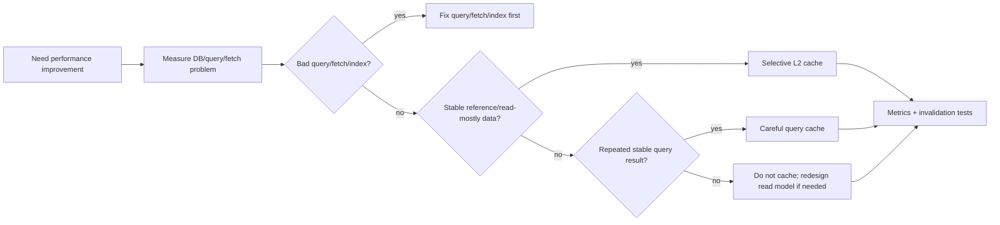

------
title: Learn Java Persistence, Database Integration, JPA, Hibernate ORM & EclipseLink - Part 022
description: First-level cache, second-level cache, query cache, cache invalidation, cache consistency, Hibernate/EclipseLink cache behavior, and production caching decision models for Java persistence.
series: learn-java-persistence
seriesTitle: Learn Java Persistence, Database Integration, JPA, Hibernate ORM & EclipseLink
order: 22
partTitle: Caching: First-Level, Second-Level, Query Cache
tags:
  - java
  - jakarta-persistence
  - jpa
  - hibernate
  - eclipselink
  - cache
  - second-level-cache
  - query-cache
  - persistence
  - performance
  - advanced
  - series
date: 2026-06-27
---

# Part 022 — Caching: First-Level, Second-Level, Query Cache

> Target: setelah membaca part ini, kamu bisa membedakan cache yang selalu ada, cache yang optional, cache yang provider-specific, dan cache yang sebaiknya tidak dipakai. Kamu juga harus bisa menilai apakah caching mempercepat sistem atau justru menyembunyikan stale data, invalidation bug, dan consistency failure.

Caching di persistence layer sering dibahas sebagai performance optimization. Untuk sistem production, framing yang lebih akurat adalah:

> Cache adalah salinan state dengan freshness contract tertentu.

Jika contract-nya tidak jelas, cache bukan optimization. Cache adalah sumber bug.

---

## 1. Kaufman Framing: Sub-Skill Caching Persistence

Skill besar:

> Mampu menggunakan cache persistence untuk mengurangi database load tanpa merusak consistency, observability, dan operational predictability.

Sub-skill yang perlu dilatih:

1. Membedakan first-level cache, second-level cache, query cache, application cache, dan database cache.
2. Mengetahui cache mana yang wajib ada menurut model JPA dan mana yang optional/provider-specific.
3. Memilih entity yang layak cache berdasarkan mutability, read/write ratio, dan freshness need.
4. Mendesain invalidation strategy.
5. Menghindari caching untuk aggregate yang high-churn atau security-sensitive.
6. Mengukur hit ratio, stale read, eviction, dan DB load sebelum/sesudah caching.
7. Menulis test untuk external update, bulk update, multi-node cache, dan query cache staleness.

---

## 2. Mental Model: Cache Layers di Aplikasi Persistence



Jangan mencampur lapisan ini.

| Cache | Scope | Owner | Standard? | Stores | Typical Risk |
|---|---|---|---|---|---|
| First-level cache | One persistence context | JPA provider | Core behavior | Managed entity instances | stale within long context |
| Second-level cache | EntityManagerFactory/session factory | Provider | Optional | entity data, sometimes collections | stale across transactions/nodes |
| Query cache | Provider/cache integration | Provider-specific mostly | Not portable as behavior | query result ids/scalars | invalidation complexity |
| Application cache | App/service | Application | no | DTO/read model/custom objects | duplicate consistency policy |
| DB buffer cache | Database instance | Database | no | pages/blocks | invisible to app |

**Invariant:**

> First-level cache is a consistency mechanism inside a persistence context. Second-level cache is a performance mechanism across persistence contexts.

---

## 3. First-Level Cache: Persistence Context Cache

First-level cache adalah identity map di dalam persistence context. Ia tidak optional.

Dalam satu persistence context:

```java
EnforcementCase a = em.find(EnforcementCase.class, 42L);
EnforcementCase b = em.find(EnforcementCase.class, 42L);

assert a == b;
```

Provider mengembalikan instance managed yang sama.

### 3.1 Apa yang Dicache?

First-level cache menyimpan managed entity instances dan snapshots yang diperlukan untuk dirty checking.



### 3.2 First-Level Cache Bisa Membuat Read Tampak Stale

```java
Case c1 = em.find(Case.class, id);

// external transaction updates same row

Case c2 = em.find(Case.class, id); // same object as c1, not database refresh
```

Untuk force reload:

```java
em.refresh(c1);
```

Atau:

```java
em.clear();
Case reloaded = em.find(Case.class, id);
```

Namun `clear()` melepas semua managed entity; jangan gunakan sembarangan dalam business transaction.

### 3.3 Long Persistence Context Risk

Long persistence context membuat:

- memory naik;
- dirty checking mahal;
- stale state lebih lama;
- flush surprise lebih mungkin;
- entity graph sulit dikontrol.

Untuk batch processing:

```java
for (int i = 0; i < items.size(); i++) {
    process(items.get(i));

    if (i % 100 == 0) {
        em.flush();
        em.clear();
    }
}
```

Ini bukan optimization kecil. Ini mencegah persistence context menjadi memory sink.

---

## 4. Second-Level Cache: Optional Shared Entity Data Cache

Second-level cache berada di luar persistence context dan biasanya scoped ke `EntityManagerFactory`/`SessionFactory`.

Jakarta Persistence mendefinisikan konsep shared cache mode, tetapi provider tidak wajib mendukung second-level cache. Jadi portable application tidak boleh mengasumsikan L2 cache selalu ada.

### 4.1 Shared Cache Mode

Mode standar:

| Mode | Meaning |
|---|---|
| `ALL` | semua entity data dapat dicache |
| `NONE` | tidak ada entity yang dicache |
| `ENABLE_SELECTIVE` | hanya entity dengan `@Cacheable` yang dicache |
| `DISABLE_SELECTIVE` | semua entity kecuali `@Cacheable(false)` dicache |
| `UNSPECIFIED` | provider default |

Rekomendasi production umum:

```xml
<shared-cache-mode>ENABLE_SELECTIVE</shared-cache-mode>
```

Lalu hanya cache entity yang benar-benar layak.

```java
@Cacheable
@Entity
@Table(name = "reference_violation_type")
public class ViolationType {
    @Id
    private String code;

    @Column(nullable = false)
    private String label;
}
```

### 4.2 Entity yang Cocok untuk L2 Cache

Cocok:

- reference data jarang berubah;
- lookup table;
- immutable catalog;
- configuration versioned by release;
- high read, low write;
- tidak security-sensitive per request;
- tidak sering diupdate oleh external system.

Kurang cocok:

- `EnforcementCase` yang sering berubah;
- assignment active;
- workflow state;
- payment/penalty amount mutable;
- entity dengan visibility berbeda per user;
- entity yang sering diubah batch job/native SQL;
- data yang diupdate di luar aplikasi tanpa cache coordination.

### 4.3 L2 Cache Tidak Menyimpan Object Graph Seperti Java

Provider seperti Hibernate menyimpan entity cache dalam bentuk data terdehidrasi/representasi nilai, bukan managed object graph penuh. Relasi biasanya direpresentasikan sebagai foreign key/id, bukan object reference live.

Ini penting karena:

- L2 cache hit tetap perlu rehydrate managed entity dalam persistence context;
- lazy relation tetap punya behavior tersendiri;
- collection cache adalah region berbeda;
- update parent tidak otomatis berarti semua query/collection cache aman.

---

## 5. Cache Retrieve Mode dan Store Mode

Jakarta Persistence mendefinisikan hints untuk mengontrol interaksi dengan shared cache.

### 5.1 Retrieve Mode

`CacheRetrieveMode.USE`:

```java
Map<String, Object> hints = Map.of(
    "jakarta.persistence.cache.retrieveMode", CacheRetrieveMode.USE
);

ViolationType type = em.find(ViolationType.class, "AML", hints);
```

`USE` berarti provider boleh membaca dari cache.

`CacheRetrieveMode.BYPASS`:

```java
Map<String, Object> hints = Map.of(
    "jakarta.persistence.cache.retrieveMode", CacheRetrieveMode.BYPASS
);

ViolationType type = em.find(ViolationType.class, "AML", hints);
```

`BYPASS` berarti read melewati shared cache dan membaca database.

### 5.2 Store Mode

`CacheStoreMode.USE`: boleh menyimpan/update cache.

`CacheStoreMode.BYPASS`: jangan simpan result ke cache.

`CacheStoreMode.REFRESH`: refresh cache dari database.

Contoh:

```java
Map<String, Object> hints = Map.of(
    "jakarta.persistence.cache.retrieveMode", CacheRetrieveMode.BYPASS,
    "jakarta.persistence.cache.storeMode", CacheStoreMode.REFRESH
);

ViolationType type = em.find(ViolationType.class, "AML", hints);
```

Use case:

- admin baru mengubah reference data;
- aplikasi ingin reload authoritative value;
- background sync menyegarkan cache.

---

## 6. Cache API

`EntityManagerFactory` menyediakan akses ke cache.

```java
Cache cache = emf.getCache();

boolean cached = cache.contains(ViolationType.class, "AML");
cache.evict(ViolationType.class, "AML");
cache.evict(ViolationType.class);
cache.evictAll();
```

Gunakan evict secara hati-hati. `evictAll()` di production bisa menyebabkan thundering herd ke database.

Lebih baik:

- evict per entity id;
- evict region/entity type;
- rolling refresh;
- warm-up terkontrol;
- cache coordination antar node.

---

## 7. Hibernate Second-Level Cache

Hibernate second-level cache tidak otomatis berarti semua entity dicache. Konfigurasi umum:

```properties
hibernate.cache.use_second_level_cache=true
hibernate.cache.use_query_cache=false
jakarta.persistence.sharedCache.mode=ENABLE_SELECTIVE
```

Dengan annotation Hibernate-specific:

```java
@Cacheable
@org.hibernate.annotations.Cache(
    usage = org.hibernate.annotations.CacheConcurrencyStrategy.READ_ONLY,
    region = "reference.violationType"
)
@Entity
public class ViolationType {
    @Id
    private String code;
}
```

### 7.1 Cache Concurrency Strategy

| Strategy | Use Case | Risk |
|---|---|---|
| `READ_ONLY` | immutable/reference data | update tidak cocok |
| `READ_WRITE` | mutable but needs stronger consistency | overhead lebih tinggi |
| `NONSTRICT_READ_WRITE` | rare updates, stale read acceptable | stale read possible |
| `TRANSACTIONAL` | JTA/transactional cache integration | infrastructure complexity |

Default yang aman untuk reference data adalah `READ_ONLY`. Untuk mutable entity, jangan aktifkan cache hanya karena ingin cepat. Buktikan dulu read/write ratio dan freshness requirement.

### 7.2 Region Design

Cache region harus diberi nama berdasarkan domain dan mutability.

Contoh baik:

```text
reference.violationType
reference.jurisdiction
case.readMostlyPolicySnapshot
```

Contoh buruk:

```text
default
entities
cache1
```

Region naming memudahkan:

- metric per domain;
- evict targeted;
- capacity planning;
- incident debugging.

### 7.3 Direct Reference Cache Entries

Hibernate punya optimization untuk immutable entity agar menyimpan reference langsung. Ini hanya aman untuk immutable/read-only entity. Jangan gunakan untuk mutable aggregate.

---

## 8. Query Cache

Query cache berbeda dari entity cache.

Mental model:

> Query cache biasanya menyimpan hasil query sebagai daftar id/scalar result, bukan entity managed object final.

Jika query cache mengembalikan id, provider tetap perlu:

1. mengambil entity dari first-level cache;
2. atau L2 cache;
3. atau database.

### 8.1 Kapan Query Cache Layak?

Layak:

- query parameter terbatas;
- result relatif stabil;
- sering dipanggil;
- underlying tables jarang berubah;
- result set tidak besar;
- invalidation dapat diterima.

Tidak layak:

- search screen dengan banyak kombinasi filter;
- high-cardinality parameter seperti user text search;
- rapidly changing workflow state;
- pagination atas data yang sering berubah;
- per-user permission heavy query;
- query yang murah dan sudah dilayani DB buffer cache.

### 8.2 Hibernate Query Cache Example

```java
List<ViolationType> types = em.createQuery("""
    select v
    from ViolationType v
    where v.active = true
    order by v.label
    """, ViolationType.class)
    .setHint("org.hibernate.cacheable", true)
    .setHint("org.hibernate.cacheRegion", "query.reference.activeViolationTypes")
    .getResultList();
```

Query cache memerlukan L2 cache configuration yang benar. Jangan aktifkan secara global lalu berharap semua query menjadi cepat.

### 8.3 Query Cache Staleness

Query cache invalidation sulit karena query result bergantung pada table set, parameter, timestamp, dan provider strategy.

Contoh:

```sql
select c
from EnforcementCase c
where c.status = 'OPEN'
order by c.createdAt
```

Jika satu case berubah status, query result cached harus invalid. Pada high-churn table, invalidation bisa terlalu sering sehingga query cache tidak berguna.

---

## 9. Collection Cache

Collection cache menyimpan membership collection, biasanya id child atau element values.

Contoh:

```java
@OneToMany(mappedBy = "caseFile")
@org.hibernate.annotations.Cache(
    usage = CacheConcurrencyStrategy.READ_WRITE,
    region = "case.evidenceRecords"
)
private List<EvidenceRecord> evidenceRecords;
```

Hati-hati:

- collection cache sangat sensitif terhadap perubahan owning side;
- bidirectional association yang tidak disinkronkan bisa menyebabkan stale collection cache;
- high-churn collection tidak cocok;
- ordering collection membuat invalidation lebih sering;
- cache parent entity tidak otomatis berarti collection-nya cached.

Untuk aggregate mutable seperti evidence list, collection cache sering bukan pilihan pertama.

---

## 10. Natural ID Cache

Hibernate mendukung natural id cache untuk lookup berdasarkan business key.

Contoh:

```java
@Entity
@Cacheable
@org.hibernate.annotations.Cache(usage = CacheConcurrencyStrategy.READ_ONLY)
public class Jurisdiction {
    @Id
    private Long id;

    @org.hibernate.annotations.NaturalId
    @Column(nullable = false, unique = true, updatable = false)
    private String code;
}
```

Natural id cache cocok untuk immutable lookup.

Tidak cocok jika natural key sering berubah. Natural key yang mutable adalah design smell untuk caching.

---

## 11. EclipseLink Cache Model

EclipseLink historically memiliki cache yang kuat di level shared session/server session. EclipseLink 5.0 menargetkan Jakarta EE 11 dan Jakarta Persistence 3.2, serta menyoroti improved caching mechanisms.

Konsep penting:

- shared cache dapat dikontrol per entity;
- cache isolation bisa berbeda;
- refresh/invalidation policy tersedia;
- cache coordination penting pada cluster;
- weaving/change tracking dapat memengaruhi performa dan dirty detection.

Contoh annotation EclipseLink-specific:

```java
@org.eclipse.persistence.annotations.Cache(
    type = org.eclipse.persistence.annotations.CacheType.FULL,
    isolation = org.eclipse.persistence.config.CacheIsolationType.SHARED
)
@Entity
public class ViolationType {
    @Id
    private String code;
}
```

Gunakan provider extension hanya jika:

- provider terkunci secara arsitektural;
- migration cost diterima;
- behavior ditest;
- fallback portability tidak dibutuhkan.

---

## 12. Cache Consistency Patterns

### 12.1 Cache-Aside vs Provider-Managed Cache

Application cache-aside:



Provider-managed L2 cache:



Perbedaan utama:

| Aspect | Cache-Aside | L2 Cache |
|---|---|---|
| Data shape | DTO/custom | entity state |
| Owner | application | provider |
| Serialization | app-defined | provider/cache provider |
| Invalidation | app-defined | provider + cache strategy |
| Transaction awareness | manual | integrated to provider semantics |

Jangan memakai keduanya untuk data yang sama tanpa ownership jelas.

### 12.2 Read-Through Reference Cache

Untuk reference data:

- cache entity via L2;
- expose DTO immutable;
- refresh lewat admin operation;
- evict targeted region on update.

### 12.3 Event-Driven Invalidation

Jika data diupdate oleh beberapa service, pakai domain event untuk invalidation.



Tetapi event-driven invalidation bersifat eventually consistent. Tentukan toleransi stale read.

### 12.4 Versioned Cache Key

Untuk read model/DTO cache, gunakan version di key:

```text
case-summary:{caseId}:v{caseVersion}
```

Jika version naik, key berubah. Ini menghindari explicit invalidation untuk beberapa use case, tetapi bisa meningkatkan storage sampai TTL membersihkan key lama.

---

## 13. External Writers dan Native SQL

L2 cache berbahaya jika database diubah di luar provider:

- script manual;
- ETL job;
- batch process native SQL;
- service lain;
- database trigger;
- stored procedure;
- direct admin update.

Jika external update terjadi, cache harus:

1. di-bypass;
2. di-refresh;
3. di-evict;
4. atau dinonaktifkan untuk entity tersebut.

### 13.1 Native Update in Same Application

```java
int updated = em.createNativeQuery("""
    update violation_type
    set label = ?
    where code = ?
    """)
    .setParameter(1, "Anti-Money Laundering")
    .setParameter(2, "AML")
    .executeUpdate();

em.getEntityManagerFactory()
  .getCache()
  .evict(ViolationType.class, "AML");
```

Jangan lupa persistence context juga bisa stale:

```java
em.clear();
```

Atau refresh managed instance tertentu.

---

## 14. Security dan Multi-Tenancy

Cache bisa menyebabkan data leak jika key/region tidak memperhitungkan tenant/security boundary.

### 14.1 Tenant Boundary

Jika multi-tenant by discriminator column, cache key harus tenant-aware. Provider mungkin mendukung tenant-aware cache key, tetapi kamu harus verify.

Risk:

```text
tenant A requests Case id=42
tenant B requests Case id=42
cache key only uses id=42
```

Jika tenant tidak termasuk key, data leak.

### 14.2 Permission-Sensitive Data

Jangan cache entity/DTO yang output-nya tergantung user permission tanpa memasukkan permission context ke key atau memisahkan cache layer.

Contoh buruk:

```text
case-detail:{caseId}
```

Jika officer dan supervisor melihat field berbeda, cache DTO tunggal bisa bocor.

Lebih aman:

```text
case-detail:{caseId}:role:{role}:policyVersion:{policyVersion}
```

Tetapi key explosion bisa terjadi. Kadang jawabannya: jangan cache response itu.

---

## 15. Cache Stampede dan Warm-Up

Cache stampede terjadi saat banyak request miss bersamaan dan semua menghantam database.

Mitigation:

- TTL jitter;
- single-flight/load lock;
- background refresh;
- warm-up saat deploy;
- rate limit;
- bounded concurrency;
- stale-while-revalidate untuk read model tertentu.

Untuk provider L2 cache, stampede bisa terjadi setelah `evictAll()` atau rolling restart.

Jangan melakukan `evictAll()` tanpa memahami traffic pattern.

---

## 16. Observability

Cache tanpa metric adalah blind optimization.

Metric minimal:

- L2 hit count;
- L2 miss count;
- L2 put count;
- eviction count;
- query cache hit/miss/put;
- collection cache hit/miss;
- cache region size;
- cache memory usage;
- DB query count per request;
- stale read incidents;
- cache load time;
- cache provider errors.

Hibernate statistics dapat membantu mengamati second-level/query cache jika diaktifkan sesuai environment.

Contoh log struktur:

```json
{
  "event": "cache_region_evicted",
  "region": "reference.violationType",
  "reason": "admin_reference_data_update",
  "entityId": "AML",
  "correlationId": "..."
}
```

Jangan hanya ukur latency rata-rata. Ukur p95/p99 dan database load. Cache bisa memperbaiki average tetapi memperburuk tail latency saat stampede.

---

## 17. Decision Framework: Haruskah Entity Ini Dicache?



### 17.1 Entity Cache Scorecard

| Question | Good Sign | Bad Sign |
|---|---|---|
| How often updated? | rarely | frequently |
| How often read? | often | rarely |
| Is stale read acceptable? | yes/minor | no/legal/financial risk |
| Is data external-updated? | no | yes |
| Is tenant/security-sensitive? | no/simple | yes/complex |
| Is entity large? | small | huge BLOB/graph |
| Is query already fast? | no | yes, cache unnecessary |
| Can we evict precisely? | yes | no |

---

## 18. Common Anti-Patterns

### 18.1 Caching Mutable Workflow State

`EnforcementCase.status` changes often and drives legal workflow. Caching it broadly can produce stale decisions.

### 18.2 Enabling Query Cache Globally

Most dynamic queries are poor query cache candidates. Global query cache often adds overhead and invalidation churn.

### 18.3 Caching Huge Object Graphs

Cache entity does not mean cache whole aggregate graph. Trying to cache everything usually creates memory pressure and stale collection risk.

### 18.4 Using L2 Cache to Hide Bad Queries

If query lacks index or fetch plan is wrong, cache may hide the issue until cold start, eviction, or new workload.

Fix query/index/fetch first. Cache second.

### 18.5 Ignoring External Writes

If another system updates the same table, L2 cache can serve old data unless coordinated.

### 18.6 Mixing DTO Cache and Entity Cache Without Ownership

If both application Redis cache and provider L2 cache store overlapping data, invalidation becomes unclear.

### 18.7 `evictAll()` as Routine Operation

This can create database load spike and poor tail latency.

---

## 19. Testing Cache Behavior

### 19.1 L2 Hit Test

1. Clear statistics.
2. Load entity in transaction A.
3. Close transaction/persistence context.
4. Load same entity in transaction B.
5. Assert database select count or cache hit metric.

### 19.2 Stale Read Test

1. Load cacheable entity.
2. Update table externally via native SQL or separate connection.
3. Load entity again.
4. Verify whether stale value appears.
5. Apply bypass/refresh/evict strategy.
6. Test again.

### 19.3 Query Cache Invalidation Test

1. Execute cacheable query.
2. Execute again, assert cache hit.
3. Insert/update row that should affect result.
4. Execute query again.
5. Assert result correctness and observe invalidation behavior.

### 19.4 Multi-Node Simulation

If running cluster:

- node A loads cache;
- node B updates entity;
- node A reads again;
- assert coordination/TTL/event invalidation works.

If you cannot test multi-node behavior, do not claim cache is cluster-safe.

---

## 20. Production Rollout Strategy

Do not enable broad caching in one big release.

Safer rollout:

1. Identify one immutable/reference entity.
2. Add metrics baseline before caching.
3. Enable `ENABLE_SELECTIVE`.
4. Add `@Cacheable` and provider cache annotation.
5. Load test cold/warm cache.
6. Validate memory usage.
7. Validate deploy/restart behavior.
8. Add targeted eviction endpoint/admin action if needed.
9. Monitor hit ratio and DB load.
10. Expand only after proving benefit.

Rollback plan:

- set shared cache mode to `NONE` or disable provider property;
- evict affected regions;
- remove query cache hints;
- ensure database can handle fallback load.

---

## 21. Practical Configuration Example: Hibernate + Reference Data

```properties
jakarta.persistence.sharedCache.mode=ENABLE_SELECTIVE
hibernate.cache.use_second_level_cache=true
hibernate.cache.use_query_cache=true
hibernate.cache.region_prefix=regulatory-case-platform
hibernate.generate_statistics=true
```

Entity:

```java
@Cacheable
@org.hibernate.annotations.Cache(
    usage = CacheConcurrencyStrategy.READ_ONLY,
    region = "reference.violationType"
)
@Entity
@Table(name = "violation_type")
public class ViolationType {

    @Id
    @Column(length = 64)
    private String code;

    @Column(nullable = false)
    private String label;

    @Column(nullable = false)
    private boolean active;

    protected ViolationType() {
    }
}
```

Query:

```java
public List<ViolationType> activeViolationTypes() {
    return em.createQuery("""
        select v
        from ViolationType v
        where v.active = true
        order by v.label
        """, ViolationType.class)
        .setHint("org.hibernate.cacheable", true)
        .setHint("org.hibernate.cacheRegion", "query.reference.activeViolationTypes")
        .getResultList();
}
```

Admin update:

```java
@Transactional
public void renameViolationType(String code, String label) {
    ViolationType type = em.find(ViolationType.class, code);
    type.rename(label);

    // If READ_ONLY cache, updating this entity is not suitable.
    // Use maintenance workflow, region eviction, or avoid READ_ONLY for mutable ref data.
}
```

If reference data can change at runtime, choose strategy carefully:

- use `READ_WRITE`; or
- disable L2 for that entity; or
- perform controlled maintenance update with full eviction; or
- version reference data by release.

---

## 22. Practical Configuration Example: Cache Bypass for Authoritative Read

```java
public ViolationType authoritativeViolationType(String code) {
    Map<String, Object> hints = Map.of(
        "jakarta.persistence.cache.retrieveMode", CacheRetrieveMode.BYPASS,
        "jakarta.persistence.cache.storeMode", CacheStoreMode.REFRESH
    );

    return em.find(ViolationType.class, code, hints);
}
```

Use this for:

- admin confirmation after update;
- reconciliation job;
- external change sync;
- cache repair operation.

Do not use bypass everywhere. If every read bypasses cache, cache has no value.

---

## 23. Cache and Fetch Plans

Second-level cache does not remove need for fetch planning.

Bad assumption:

> “We enabled L2 cache, so N+1 is fine.”

Reality:

- first request after cold start still hits database;
- association traversal can still cause many L2 lookups or SQL queries;
- query cache may cache ids, not fully hydrated graph;
- collection cache must be configured separately;
- large graph caching increases memory pressure.

Fix fetch plan first:

1. projection for read screens;
2. entity graph or join fetch for use-case aggregate load;
3. batch fetch for controlled lazy traversal;
4. cache for stable reference data.

---

## 24. Cache and Transaction Boundaries

Cache visibility follows transaction/provider semantics. Do not assume uncommitted data becomes visible to other transactions through L2 cache.

Important cases:

- transaction rollback should not publish cache state;
- update may evict/soft-lock cache region until commit;
- read-write strategies may use locks/timestamps;
- transactional cache requires compatible transaction manager/cache provider;
- nonstrict strategy may allow temporary stale reads.

For regulatory systems, stale read tolerance must be explicit. Some stale reads are acceptable for reference labels. Stale workflow decisions are usually not acceptable.

---

## 25. Deliberate Practice Lab

### Lab 1 — First-Level Cache Visibility

1. Load `EnforcementCase` in transaction A.
2. Update same row in transaction B.
3. In transaction A, call `find()` again.
4. Observe same managed instance.
5. Use `refresh()` and compare behavior.

### Lab 2 — Reference Entity L2 Cache

1. Mark `ViolationType` as cacheable.
2. Load it twice in separate transactions.
3. Verify second-level cache hit via statistics.
4. Disable cache and compare query count.

### Lab 3 — External Update Staleness

1. Load cacheable `ViolationType`.
2. Update table with native SQL outside EntityManager.
3. Load again.
4. Apply `BYPASS + REFRESH` or `evict()`.
5. Verify corrected behavior.

### Lab 4 — Query Cache Candidate

1. Cache active violation types query.
2. Measure hit ratio.
3. Change one violation type active flag.
4. Observe invalidation.
5. Decide whether query cache is worth it.

### Lab 5 — Security-Sensitive DTO Cache

1. Build `CaseDetailDto` with fields depending on role.
2. Cache by `caseId` only.
3. Demonstrate role leakage risk.
4. Fix key or disable cache.

---

## 26. Review Checklist

Before enabling persistence cache, ask:

- Which cache layer are we using: L1, L2, query, app, or DB?
- Is the entity immutable or mutable?
- What is read/write ratio?
- What stale read duration is acceptable?
- Can database be updated outside provider?
- Is data tenant/security-sensitive?
- Is invalidation targeted and tested?
- Is query cache actually beneficial for this query shape?
- Are cache metrics enabled?
- What happens after `evictAll()` or cold restart?
- Is there a rollback plan?
- Are multi-node semantics tested?
- Are we caching to hide bad SQL/fetch design?

---

## 27. Mental Model Summary



Top 1% persistence engineers treat cache as a contract, not magic.

They ask:

1. What exact state is cached?
2. Who is allowed to mutate the source of truth?
3. How does cache learn about mutation?
4. How stale may the answer be?
5. What is the blast radius of stale data?
6. How will we observe hit/miss/staleness?
7. How do we safely turn it off?

If those questions do not have answers, cache should not be enabled yet.
