------
title: Learn Java Persistence, Database Integration, JPA, Hibernate ORM & EclipseLink - Part 023
description: Hibernate ORM internals: Session, SessionFactory, persistence context internals, entity entries, action queue, proxies, bytecode enhancement, persisters, dialects, query pipeline, JDBC coordination, and production debugging mental models.
series: learn-java-persistence
seriesTitle: Learn Java Persistence, Database Integration, JPA, Hibernate ORM & EclipseLink
order: 23
partTitle: Hibernate ORM Internals
tags:
  - java
  - jakarta-persistence
  - jpa
  - hibernate
  - hibernate-orm
  - session
  - persistence-context
  - dirty-checking
  - proxy
  - bytecode-enhancement
  - dialect
  - performance
  - advanced
  - series
date: 2026-06-27
---

# Part 023 — Hibernate ORM Internals

> Target: setelah membaca part ini, kamu tidak hanya bisa memakai Hibernate lewat `EntityManager`, tetapi bisa menjelaskan *kenapa* SQL tertentu muncul, *kenapa* update terjadi saat flush, *kenapa* proxy gagal di luar transaction, *kenapa* query memicu flush, dan *kenapa* mapping kecil bisa mengubah performa sistem secara besar.

Hibernate adalah provider Jakarta Persistence, tetapi Hibernate juga punya native API, runtime metamodel, event system, type system, action queue, persister layer, JDBC coordination, dialect abstraction, query engine, dan bytecode enhancer. Untuk menjadi engineer persistence kelas atas, kamu tidak harus menghafal semua internal class. Namun kamu harus punya mental model yang cukup kuat untuk membaca gejala production dan menelusuri penyebabnya secara deterministik.

Part ini memakai gaya belajar Kaufman:

1. **Deconstruct**: pecah Hibernate menjadi subsystem yang bisa dipahami.
2. **Learn enough to self-correct**: pahami invariant runtime yang bisa dipakai untuk debugging.
3. **Remove barriers**: siapkan observability, log, metrics, dan eksperimen kecil.
4. **Practice deliberately**: gunakan lab regulatory case management untuk menguji flush, proxy, dirty checking, batching, dan dialect behavior.

---

## 1. Posisi Hibernate dalam Stack Persistence

Secara arsitektur, Hibernate duduk di antara domain object dan database. Dari sisi aplikasi, kamu bisa masuk melalui Jakarta Persistence API (`EntityManager`) atau native API (`Session`). Dari sisi bawah, Hibernate berbicara ke database melalui JDBC, connection provider, transaction coordinator, SQL AST, dialect, dan type binding.

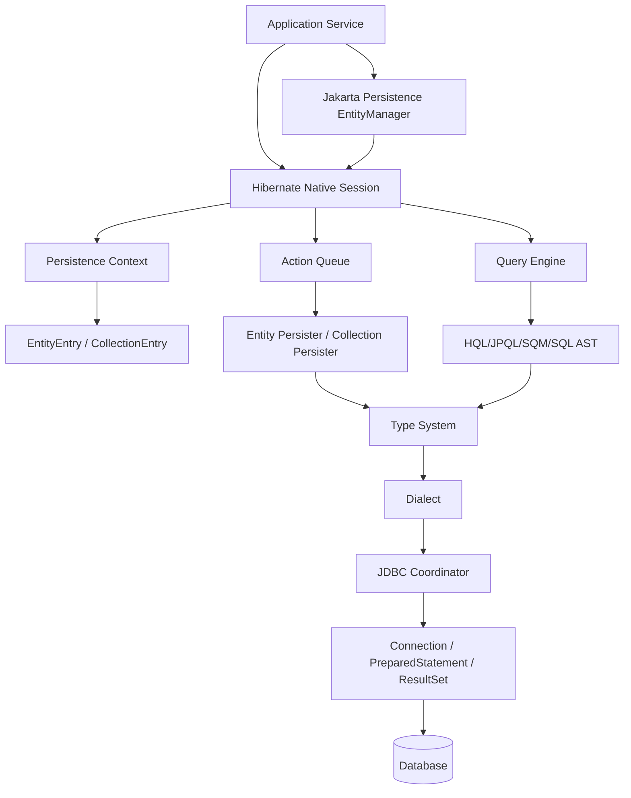

Mental model penting:

> Hibernate bukan “magic that saves objects”. Hibernate adalah state synchronization engine yang menerjemahkan perubahan object graph menjadi operasi SQL berdasarkan mapping metadata, persistence context state, query plan, transaction boundary, dan database dialect.

---

## 2. API Layer: `EntityManager` vs `Session`

Dalam modern Hibernate, `Session` adalah native API yang secara konseptual sepadan dengan `EntityManager`. Banyak aplikasi memakai `EntityManager` karena portable. Namun pada saat debugging atau memakai fitur Hibernate-specific, kamu sering perlu `unwrap` ke `Session`.

```java
import jakarta.persistence.EntityManager;
import org.hibernate.Session;

public final class HibernateAccess {
    public static Session session(EntityManager entityManager) {
        return entityManager.unwrap(Session.class);
    }
}
```

Gunakan `EntityManager` saat:

- fitur yang dipakai cukup dalam standar Jakarta Persistence;
- portability antar provider penting;
- tim ingin API surface lebih kecil;
- framework seperti Spring Data JPA sudah membungkus operasi utama.

Gunakan `Session`/Hibernate API saat:

- perlu `StatelessSession`;
- perlu filter Hibernate;
- perlu natural id API;
- perlu Hibernate-specific query hints;
- perlu custom type/dialect behavior;
- perlu statistik/observability provider-specific;
- perlu batch processing yang lebih eksplisit.

Rule praktis:

> Tulis domain dan repository contract seportable mungkin, tetapi jangan pura-pura portable ketika desain production memang bergantung pada provider behavior.

---

## 3. `SessionFactory`: Runtime Metamodel dan Shared Infrastructure

`SessionFactory` adalah object berat, thread-safe, biasanya satu per persistence unit/database. Ia menyimpan metadata mapping, persister, type registry, query plan infrastructure, second-level cache integration, service registry, dan connection/transaction coordination setup.

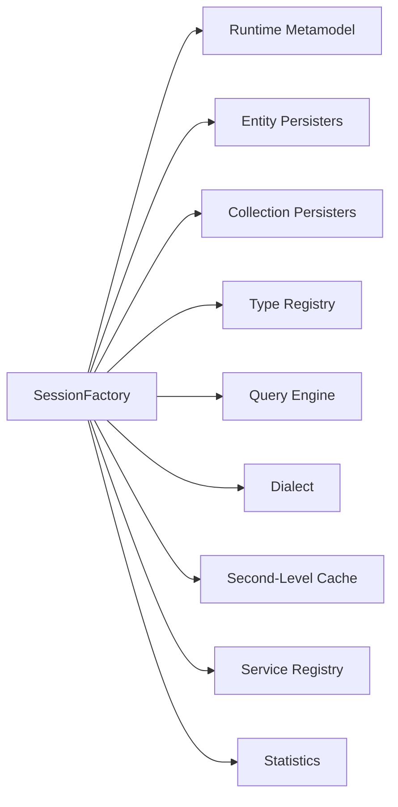

### 3.1 Invariant `SessionFactory`

- Mahal dibuat, murah dipakai berulang.
- Thread-safe untuk dibagikan ke banyak thread.
- Tidak menyimpan first-level cache request/user-specific.
- Membawa interpretasi final mapping setelah annotation/XML/convention/provider extension diproses.
- Jika metadata salah, sebagian error baru muncul saat bootstrap, sebagian saat query/flush.

### 3.2 Production implication

Startup validation penting. Jangan membiarkan mapping invalid baru ketahuan di endpoint pertama yang menyentuh entity tersebut.

Contoh konfigurasi Spring Boot yang sering dipakai untuk fail fast:

```properties
spring.jpa.hibernate.ddl-auto=validate
spring.jpa.open-in-view=false
spring.jpa.properties.hibernate.generate_statistics=true
spring.jpa.properties.hibernate.jdbc.batch_size=50
spring.jpa.properties.hibernate.order_inserts=true
spring.jpa.properties.hibernate.order_updates=true
```

Catatan: `generate_statistics=true` berguna untuk environment observability/performance test, tetapi perlu diukur overhead-nya untuk production traffic besar.

---

## 4. `Session`: Unit of Work Stateful

`Session` adalah unit-of-work stateful. Di JPA, hal yang sama terlihat sebagai `EntityManager` dengan persistence context.

Satu `Session` biasanya hidup selama satu transaction/request/use case. Ia bukan singleton dan bukan thread-safe.

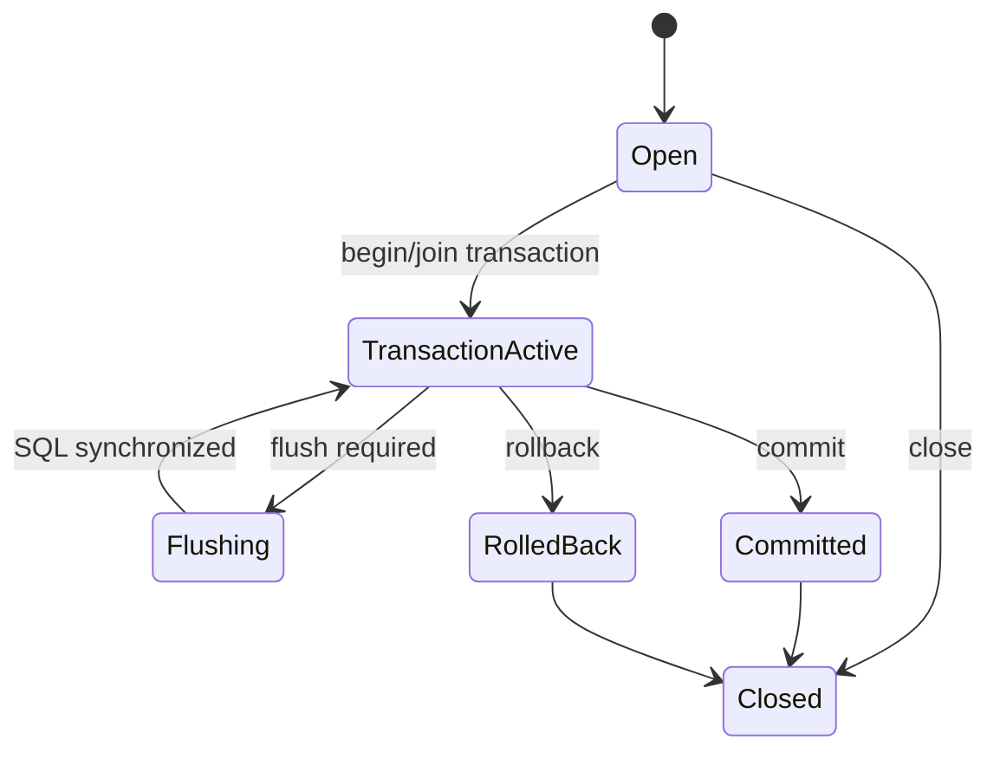

### 4.1 Apa yang disimpan `Session`?

Secara praktis, `Session` menyimpan:

- persistence context;
- entity identity map;
- entity snapshots;
- entity status;
- collection state;
- pending actions;
- JDBC coordination state;
- enabled filters;
- fetch/profile settings;
- transaction synchronization hooks.

### 4.2 Kesalahan arsitektur umum

```java
// Anti-pattern: Session disimpan sebagai field singleton service
public class BadService {
    private final Session session;

    public BadService(Session session) {
        this.session = session;
    }
}
```

Problem:

- `Session` tidak thread-safe;
- first-level cache bocor antar use case;
- entity lama bisa stale;
- memory tumbuh karena managed entity tidak pernah dilepas;
- transaction boundary menjadi tidak jelas.

Versi sehat:

```java
@Service
public class CaseCommandService {
    private final EntityManager entityManager;

    public CaseCommandService(EntityManager entityManager) {
        this.entityManager = entityManager;
    }

    @Transactional
    public void assignInvestigator(UUID caseId, UUID investigatorId) {
        EnforcementCase enforcementCase = entityManager.find(EnforcementCase.class, caseId);
        enforcementCase.assignInvestigator(investigatorId);
    }
}
```

Dalam Spring, injected `EntityManager` biasanya proxy yang mengarah ke transaction-bound persistence context, bukan raw `Session` singleton.

---

## 5. Persistence Context Internals

Persistence context adalah working set entity yang sedang dikelola. Di Hibernate, ini bukan sekadar map ID ke object; ia juga menyimpan metadata state.

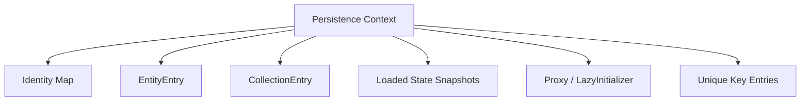

### 5.1 Identity Map

Identity map menjamin bahwa dalam satu persistence context, satu database row untuk entity type dan ID tertentu direpresentasikan oleh satu Java object instance.

```java
EnforcementCase a = entityManager.find(EnforcementCase.class, caseId);
EnforcementCase b = entityManager.find(EnforcementCase.class, caseId);

assert a == b; // true dalam persistence context yang sama
```

Ini penting untuk:

- menjaga object graph konsisten;
- menghindari konflik dua object berbeda untuk row yang sama;
- memungkinkan dirty checking berbasis snapshot;
- mengurangi query berulang untuk `find` by primary key.

Namun identity map bukan guarantee freshness global. Jika database diubah transaction lain setelah entity masuk persistence context, object yang sudah managed tidak otomatis berubah.

### 5.2 Entity Entry

Untuk setiap managed entity, Hibernate menyimpan semacam metadata internal:

- entity status: managed/read-only/deleted/loading;
- loaded state snapshot;
- version;
- lock mode;
- persister reference;
- identifier;
- loaded database state untuk dirty checking.

Kamu tidak perlu memanggil class internalnya, tetapi harus memahami konsekuensinya:

> Managed entity bukan hanya object. Ia object plus bookkeeping state di persistence context.

### 5.3 Snapshot Dirty Checking

Default dirty checking membandingkan current property values dengan snapshot yang diambil saat load/flush sebelumnya.

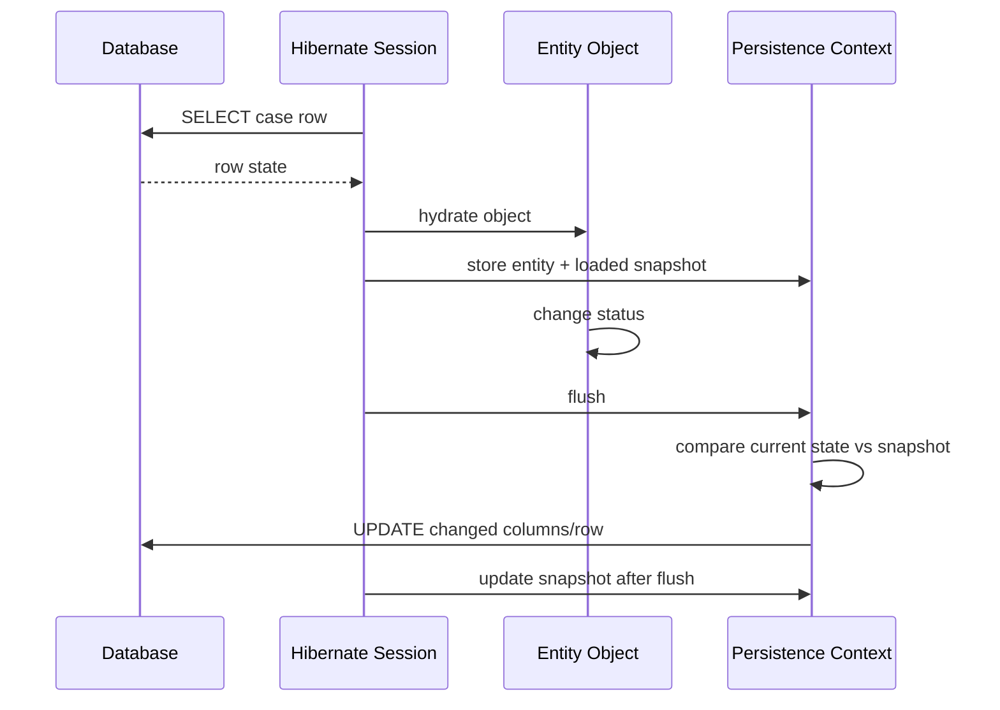

Implikasi:

- setter tidak harus dipanggil untuk dirty checking; perubahan field bisa cukup jika access type field;
- perubahan mutable value object bisa sulit dilacak jika type/mutability plan salah;
- read-only entity/query bisa mengurangi overhead snapshot;
- bytecode enhancement bisa mengubah mekanisme tracking.

---

## 6. Action Queue: Write-Behind Engine

Saat kamu memanggil `persist`, `remove`, atau mengubah managed entity, Hibernate tidak selalu langsung mengirim SQL. Hibernate mencatat operasi yang nanti dieksekusi saat flush.

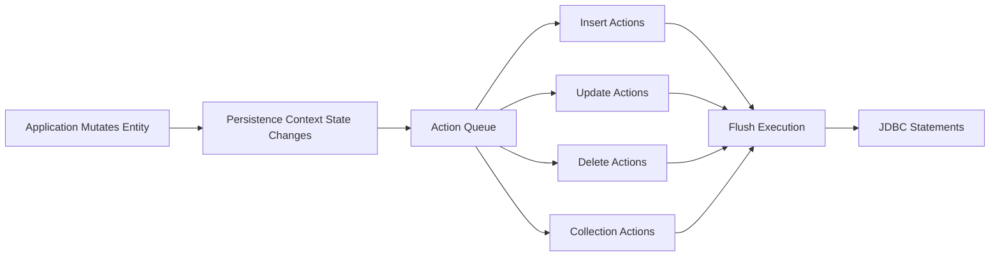

### 6.1 Kenapa action queue ada?

Action queue memungkinkan Hibernate:

- mengurutkan SQL agar foreign key constraint tidak rusak;
- melakukan batching insert/update/delete;
- menggabungkan perubahan sebelum flush;
- menghindari SQL yang tidak perlu;
- mengelola collection table mutation;
- menyelaraskan cascade operation.

### 6.2 Contoh efek write-behind

```java
@Transactional
public UUID openCase(OpenCaseCommand command) {
    EnforcementCase c = EnforcementCase.open(command.referenceNo());
    entityManager.persist(c);

    // Belum tentu INSERT sudah dikirim, tergantung ID strategy dan flush trigger.
    c.assignRiskScore(RiskScore.high());

    return c.id();
}
```

Jika ID memakai sequence/UUID, insert bisa ditunda hingga flush. Jika memakai identity column, provider sering harus melakukan insert lebih awal untuk mendapatkan generated ID.

### 6.3 SQL ordering

Konfigurasi Hibernate:

```properties
hibernate.order_inserts=true
hibernate.order_updates=true
hibernate.jdbc.batch_size=50
```

Manfaat:

- meningkatkan batch hit rate;
- mengurangi round trip;
- membantu update ordering yang lebih deterministik.

Trade-off:

- SQL order tidak selalu sama dengan urutan mutasi object;
- log lebih sulit dikorelasikan dengan baris kode;
- constraint edge case tetap harus diuji.

---

## 7. Flush Event Pipeline

Flush adalah sinkronisasi persistence context ke database dalam transaction aktif. Pada Hibernate, flush melibatkan dirty checking, cascade flush, collection dirty checking, action queue population, SQL execution, dan cache synchronization.

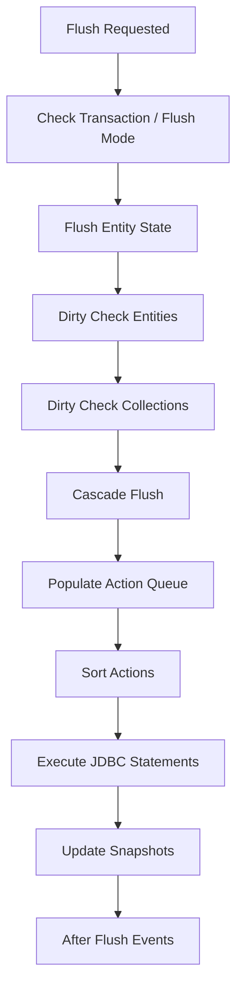

### 7.1 Flush bukan commit

Flush mengirim SQL ke database, tetapi commit menentukan apakah transaction durable.

```java
@Transactional
public void risky(UUID caseId) {
    EnforcementCase c = entityManager.find(EnforcementCase.class, caseId);
    c.close("duplicate");

    entityManager.flush(); // SQL UPDATE bisa dikirim di sini

    throw new RuntimeException("rollback"); // UPDATE dibatalkan oleh rollback
}
```

### 7.2 Query-triggered flush

Dengan flush mode `AUTO`, query bisa memicu flush jika hasil query mungkin dipengaruhi oleh perubahan pending.

```java
caseEntity.markEscalated();

Long count = entityManager.createQuery("""
    select count(c)
    from EnforcementCase c
    where c.status = :status
""", Long.class)
.setParameter("status", CaseStatus.ESCALATED)
.getSingleResult();
```

Hibernate boleh flush sebelum query agar hasil query konsisten dengan perubahan dalam persistence context.

### 7.3 Debugging unexpected flush

Checklist:

- Apakah query dieksekusi di tengah command method?
- Apakah flush mode `AUTO`?
- Apakah entity dirty tanpa disadari akibat setter, mapper, atau bidirectional sync?
- Apakah cascade menyebabkan child ikut dirty?
- Apakah repository memanggil `saveAndFlush`?
- Apakah validation/audit listener memicu perubahan tambahan?

---

## 8. Entity Persister dan Collection Persister

Persister adalah komponen runtime yang tahu bagaimana entity atau collection dipetakan ke database.

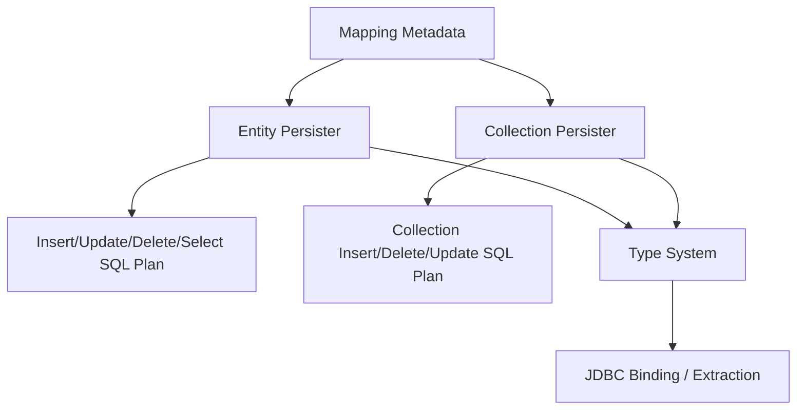

### 8.1 Entity persister menjawab pertanyaan

- Table mana yang dipakai?
- Column mana untuk field tertentu?
- Apakah entity versioned?
- Apakah inheritance strategy apa?
- Bagaimana identifier dibuat?
- Apakah dynamic insert/update dipakai?
- SQL apa untuk load by ID?
- Bagaimana optimistic lock predicate dibuat?

### 8.2 Collection persister menjawab pertanyaan

- Collection disimpan di foreign key child, join table, atau collection table?
- Apakah ordered list butuh order column?
- Apakah collection adalah bag, set, list, map?
- Bagaimana Hibernate mendeteksi perubahan collection?
- SQL apa untuk delete orphan?
- SQL apa untuk recreate collection rows?

### 8.3 Mapping kecil, dampak besar

Contoh `List` tanpa `@OrderColumn` pada Hibernate sering berperilaku sebagai bag. Bag tidak punya identity per element di collection table. Kombinasi beberapa bag fetch join bisa menjadi masalah karena Hibernate sulit membangun hasil yang deterministik dari result set join Cartesian.

Desain collection harus menjawab:

- Apakah order persistent atau hanya sort tampilan?
- Apakah duplicate diizinkan?
- Apakah child punya identity sendiri?
- Apakah collection sering dimutasi sebagian atau diganti seluruhnya?
- Apakah collection perlu difetch bersama root?

---

## 9. Proxy dan Lazy Loading

Hibernate memakai proxy untuk lazy loading entity association tertentu. Proxy adalah object pengganti yang membawa identifier dan `LazyInitializer`; data baru dimuat saat property non-ID diakses.

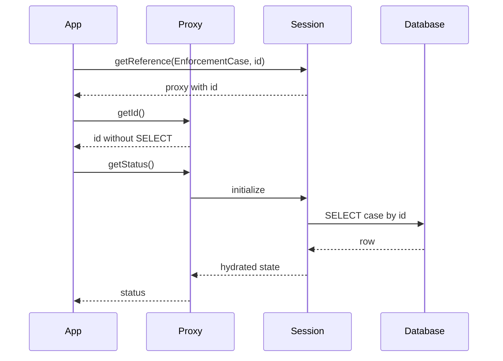

### 9.1 Proxy invariant

- Proxy butuh open session/persistence context untuk initialize.
- Access ID biasanya tidak perlu initialize.
- Access business property biasanya memicu SELECT.
- `equals`, `hashCode`, dan `toString` bisa tidak sengaja initialize proxy.
- Serialization boundary sering menjadi tempat lazy loading error.

### 9.2 `getReference` vs `find`

```java
@Transactional
public void attachViolation(UUID caseId, UUID regulationId) {
    EnforcementCase c = entityManager.find(EnforcementCase.class, caseId);
    Regulation r = entityManager.getReference(Regulation.class, regulationId);

    c.attachViolation(r);
}
```

`getReference` berguna saat kamu hanya butuh FK reference tanpa membaca row target. Namun jika ID tidak ada, error bisa muncul belakangan saat proxy diinitialize atau flush constraint gagal.

### 9.3 Proxy failure mode

```java
public CaseDto load(UUID id) {
    EnforcementCase c = repository.findById(id).orElseThrow();
    return new CaseDto(c.id(), c.getInvestigator().getName());
}
```

Jika method tidak transactional dan association lazy, `getInvestigator().getName()` bisa gagal tergantung apakah session masih terbuka. Menyalakan Open Session in View hanya memindahkan masalah ke layer web: query bisa muncul saat rendering/serialization.

Versi sehat:

```java
@Transactional(readOnly = true)
public CaseDto load(UUID id) {
    EnforcementCase c = caseRepository.findDetailedById(id)
        .orElseThrow();

    return CaseDto.from(c);
}
```

Repository harus menyatakan fetch plan yang diperlukan use case.

---

## 10. Bytecode Enhancement

Hibernate bisa melakukan bytecode enhancement pada entity class untuk mendukung kemampuan seperti lazy attribute loading, association management, dan enhanced dirty tracking.

Tanpa enhancement, Hibernate biasanya mengandalkan proxy untuk lazy entity association dan snapshot comparison untuk dirty checking. Dengan enhancement, entity class bisa diinstrumentasi agar field access/change tracking lebih eksplisit.

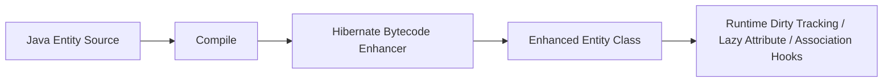

### 10.1 Kenapa enhancement penting?

- Dirty checking bisa lebih efisien untuk entity besar.
- Lazy basic attribute lebih memungkinkan.
- Bidirectional association management bisa dibantu.
- Build-time optimization penting untuk runtime seperti Quarkus.

### 10.2 Maven example

```xml
<plugin>
    <groupId>org.hibernate.orm.tooling</groupId>
    <artifactId>hibernate-enhance-maven-plugin</artifactId>
    <version>${hibernate.version}</version>
    <executions>
        <execution>
            <configuration>
                <enableLazyInitialization>true</enableLazyInitialization>
                <enableDirtyTracking>true</enableDirtyTracking>
                <enableAssociationManagement>true</enableAssociationManagement>
            </configuration>
            <goals>
                <goal>enhance</goal>
            </goals>
        </execution>
    </executions>
</plugin>
```

### 10.3 Review rule

Jangan mengaktifkan enhancement sebagai “performance checkbox” tanpa test. Ukur:

- apakah dirty checking memang bottleneck;
- apakah entity punya banyak column;
- apakah runtime/framework sudah melakukan enhancement;
- apakah tooling test dan IDE build konsisten;
- apakah serialization/proxy/equals behavior tetap aman.

---

## 11. Hibernate Type System

Hibernate type system menjembatani Java type, JDBC type, SQL type, mutability, comparison, literal rendering, binding, extraction, dan DDL generation.

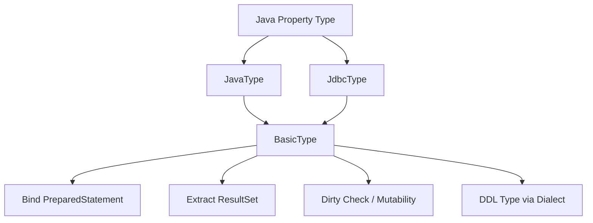

### 11.1 Kenapa type system penting?

Karena bug type mapping sering tidak terlihat di Java code:

- `BigDecimal` scale berubah sehingga dirty terus;
- enum ordinal rusak setelah enum diurutkan ulang;
- JSON column dianggap mutable tetapi dirty checking tidak tepat;
- `OffsetDateTime` tersimpan dengan timezone interpretation berbeda;
- UUID disimpan sebagai `CHAR`, `BINARY`, atau native UUID tergantung dialect;
- custom type tidak punya mutability plan yang benar.

### 11.2 AttributeConverter vs Hibernate custom type

`AttributeConverter` cocok untuk conversion sederhana:

```java
@Converter(autoApply = true)
public class CaseReferenceConverter implements AttributeConverter<CaseReference, String> {
    @Override
    public String convertToDatabaseColumn(CaseReference attribute) {
        return attribute == null ? null : attribute.value();
    }

    @Override
    public CaseReference convertToEntityAttribute(String dbData) {
        return dbData == null ? null : new CaseReference(dbData);
    }
}
```

Hibernate custom type diperlukan saat:

- butuh kontrol JDBC type detail;
- mapping multi-column;
- JSON/XML/native database type;
- custom mutability;
- custom literal rendering;
- dialect-specific behavior.

Rule:

> Pakai standar dulu. Turun ke Hibernate type saat conversion bukan sekadar transformasi nilai, tetapi bagian dari kontrak storage.

---

## 12. Dialect: Database-Specific Behavior Layer

Dialect membuat Hibernate memahami variasi SQL antar database.

Dialect memengaruhi:

- pagination syntax;
- sequence/identity support;
- lock syntax;
- generated columns;
- boolean mapping;
- UUID mapping;
- JSON support;
- DDL type names;
- function rendering;
- timestamp precision;
- quoting rules.

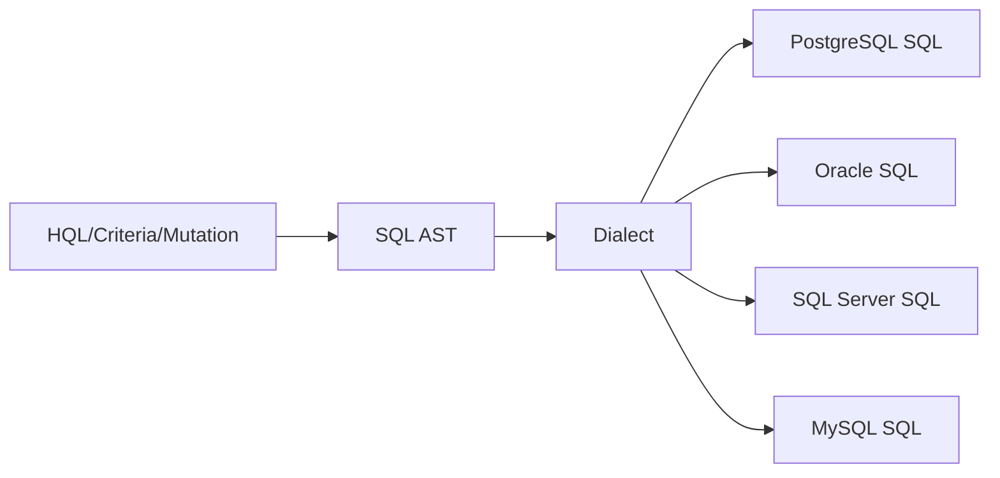

### 12.1 Dialect is not a portability guarantee

Dialect mengurangi variasi SQL, tetapi tidak menghapus perbedaan database.

Contoh perbedaan nyata:

- isolation behavior berbeda;
- lock wait timeout berbeda;
- deadlock detection berbeda;
- `timestamp with time zone` semantics berbeda;
- JSON indexing berbeda;
- sequence caching berbeda;
- constraint deferrability tidak universal;
- pagination + ordering optimization berbeda.

### 12.2 Production rule

Jika sistem production menarget satu database, optimalkan dengan sadar untuk database itu. Portability tetap bernilai pada API boundary, tetapi performa dan correctness harus diuji pada database target.

---

## 13. Query Engine: HQL/JPQL to SQL

Hibernate query pipeline modern melewati beberapa representasi internal sebelum SQL dieksekusi.

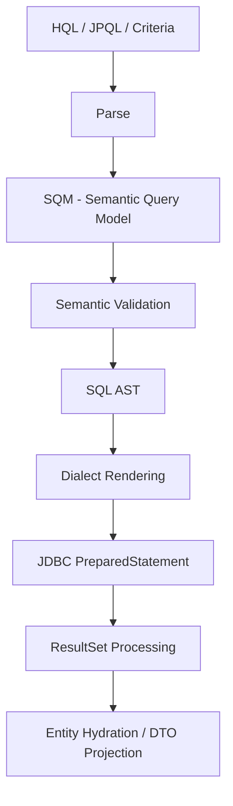

### 13.1 Query plan implication

HQL ini:

```java
select c
from EnforcementCase c
join fetch c.violations v
where c.status = :status
```

bukan sekadar string SQL. Hibernate perlu:

- resolve `EnforcementCase` ke entity metadata;
- resolve `violations` ke association mapping;
- menentukan join table/FK;
- menentukan column list;
- membangun result graph;
- deduplicate root entity jika join menghasilkan multiple rows;
- mengisi persistence context;
- memperhatikan pagination/fetch join restriction.

### 13.2 DTO projection vs entity query

Entity query:

```java
select c from EnforcementCase c where c.status = :status
```

Menghasilkan managed entities, masuk persistence context, dirty-checkable.

DTO projection:

```java
select new com.acme.CaseSummary(c.id, c.referenceNo, c.status)
from EnforcementCase c
where c.status = :status
```

Tidak managed, tidak masuk persistence context sebagai entity instance, cocok untuk read model.

Rule:

> Jika hasil query dipakai untuk command mutation, entity query masuk akal. Jika hasil query dipakai untuk layar/report/API read-only, projection sering lebih aman dan lebih murah.

---

## 14. Hydration dan Materialization

Saat result set kembali dari JDBC, Hibernate melakukan hydration: membaca column, mengonversi via type system, membangun entity/DTO, dan mendaftarkan entity ke persistence context.

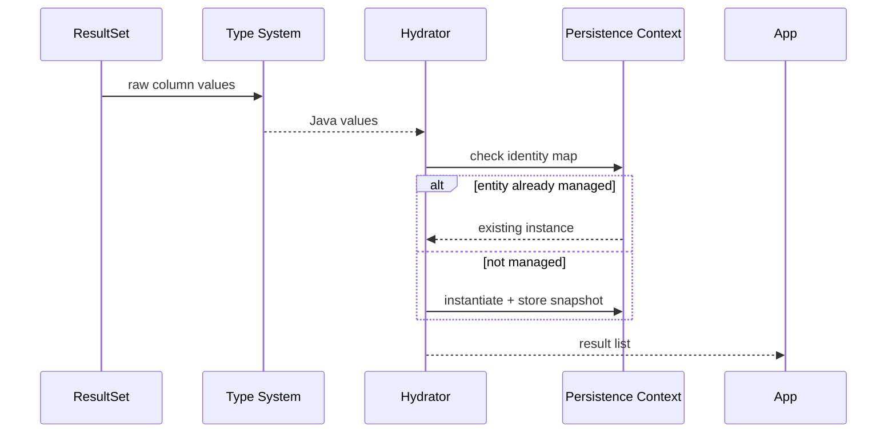

### 14.1 Duplicate row effect

Join fetch collection bisa menghasilkan beberapa row untuk root yang sama:

| case_id | case_ref | violation_id |
|---|---|---|
| C1 | CASE-001 | V1 |
| C1 | CASE-001 | V2 |
| C1 | CASE-001 | V3 |

Hibernate harus mengembalikan satu `EnforcementCase` object dengan tiga violations, bukan tiga `EnforcementCase` object berbeda. Identity map membantu, tetapi result list duplicate root masih bisa muncul tergantung query dan distinct handling.

---

## 15. JDBC Coordination

Hibernate tetap memakai JDBC di bawahnya. Ia mengelola logical connection, statement preparation, parameter binding, batch, result set extraction, dan transaction synchronization.

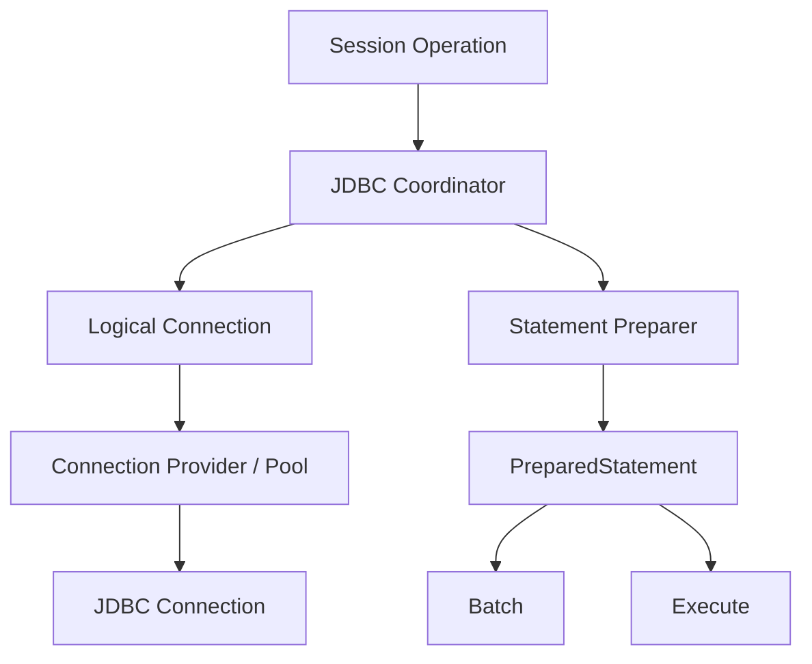

### 15.1 Connection acquisition timing

Connection tidak selalu diambil saat `Session` dibuat. Ia bisa diambil saat operasi database pertama. Di Spring, transaction boundary bisa dimulai sebelum connection benar-benar digunakan.

Implikasi:

- method `@Transactional` yang hanya menghitung di memory belum tentu memakai connection;
- query pertama menentukan kapan connection dipinjam dari pool;
- long transaction + delayed query tetap bisa menahan resource setelah query pertama;
- lazy loading di akhir request bisa memperpanjang connection hold time.

### 15.2 Batch interaction

Hibernate batching terjadi di JDBC statement layer. Batch efektif jika:

- SQL shape sama;
- statement order mendukung grouping;
- ID strategy tidak memaksa immediate insert;
- flush/clear dilakukan periodik untuk batch besar;
- driver/database mendukung batching dengan baik.

Contoh batch insert command:

```java
@Transactional
public void importEvents(List<CaseEventImportRow> rows) {
    int i = 0;

    for (CaseEventImportRow row : rows) {
        entityManager.persist(CaseEvent.from(row));

        if (++i % 50 == 0) {
            entityManager.flush();
            entityManager.clear();
        }
    }
}
```

Ini bukan hanya performance optimization. `clear()` mencegah persistence context tumbuh tanpa batas.

---

## 16. Event System dan Interceptors

Hibernate memiliki event system internal untuk load, save, update, delete, flush, dirty check, pre/post insert/update/delete, dan lifecycle integration.

Jakarta Persistence lifecycle callback (`@PrePersist`, `@PostLoad`, dst.) adalah API standar. Hibernate event listener/interceptor adalah extension yang lebih kuat tetapi lebih provider-specific.

### 16.1 Lifecycle callback standard

```java
@Entity
public class EnforcementCase {
    @PrePersist
    void prePersist() {
        this.createdAt = Instant.now();
    }

    @PreUpdate
    void preUpdate() {
        this.updatedAt = Instant.now();
    }
}
```

### 16.2 Kapan jangan memakai lifecycle callback?

Hindari callback untuk:

- business workflow besar;
- query tambahan kompleks;
- integrasi remote service;
- publish event eksternal langsung;
- mutation entity lain yang sulit dilacak;
- logic yang butuh current user tetapi context-nya tidak eksplisit.

Lebih baik:

- domain method untuk business rule;
- application service untuk orchestration;
- outbox untuk event eksternal;
- auditing framework untuk audit sederhana.

### 16.3 Hibernate event listener use case

Masuk akal untuk:

- audit provider-level;
- multitenancy enforcement;
- soft-delete infrastructure;
- domain event extraction;
- security guard yang seragam;
- observability hooks.

Namun provider event system menambah coupling ke Hibernate. Dokumentasikan dengan jelas.

---

## 17. Statistics dan Observability Internals

Hibernate menyediakan statistik untuk melihat behavior runtime.

Contoh akses:

```java
SessionFactory sessionFactory = entityManagerFactory.unwrap(SessionFactory.class);
Statistics statistics = sessionFactory.getStatistics();

long queryCount = statistics.getQueryExecutionCount();
long entityLoadCount = statistics.getEntityLoadCount();
long collectionFetchCount = statistics.getCollectionFetchCount();
```

Metric yang penting:

- query execution count;
- query execution max time;
- entity load/fetch count;
- collection load/fetch count;
- second-level cache hit/miss/put;
- flush count;
- optimistic failure count;
- prepared statement count;
- transaction count.

### 17.1 Reading symptoms

| Symptom | Kemungkinan penyebab |
|---|---|
| Query count tinggi per request | N+1, lazy loading di mapper/serializer, loop repository call |
| Flush count tinggi | `saveAndFlush`, query-triggered flush, transaction boundary terlalu besar |
| Entity load tinggi untuk endpoint list | Entity query dipakai untuk read model yang butuh projection |
| Collection fetch tinggi | Lazy collection diakses berulang tanpa fetch plan |
| L2 miss tinggi | Cache region salah, invalidation tinggi, key diversity terlalu besar |
| Statement count tidak turun saat batch enabled | SQL shape berbeda, IDENTITY strategy, flush terlalu sering |

---

## 18. Debugging SQL: Dari Gejala ke Penyebab

Logging yang berguna:

```properties
# SQL statement
logging.level.org.hibernate.SQL=DEBUG

# Parameter binding, nama logger bisa berubah antar versi; validasi di stack kamu.
logging.level.org.hibernate.orm.jdbc.bind=TRACE

# Statistics
spring.jpa.properties.hibernate.generate_statistics=true
logging.level.org.hibernate.stat=DEBUG
```

Jangan berhenti di “SQL-nya apa”. Tanyakan:

1. Use case apa yang memicu SQL?
2. Entity/association mana yang diload?
3. Apakah SQL berasal dari query eksplisit, lazy loading, flush, cascade, atau collection initialization?
4. Apakah SQL terjadi sebelum atau setelah transaction boundary yang diharapkan?
5. Apakah jumlah SQL linear terhadap jumlah row? Jika iya, curigai N+1.
6. Apakah UPDATE terjadi walau user tidak mengubah data? Curigai dirty checking, mutable type, mapper, audit timestamp, atau bidirectional helper.

---

## 19. Hibernate Internals dengan Regulatory Case Domain

Kita pakai domain sederhana:

```java
@Entity
@Table(name = "enforcement_case")
public class EnforcementCase {
    @Id
    private UUID id;

    @Version
    private long version;

    @Column(nullable = false, unique = true, length = 64)
    private String referenceNo;

    @Enumerated(EnumType.STRING)
    @Column(nullable = false, length = 32)
    private CaseStatus status;

    @ManyToOne(fetch = FetchType.LAZY)
    @JoinColumn(name = "investigator_id")
    private Investigator investigator;

    @OneToMany(mappedBy = "enforcementCase", cascade = CascadeType.ALL, orphanRemoval = true)
    private final List<CaseViolation> violations = new ArrayList<>();

    protected EnforcementCase() {
    }

    public static EnforcementCase open(String referenceNo) {
        EnforcementCase c = new EnforcementCase();
        c.id = UUID.randomUUID();
        c.referenceNo = referenceNo;
        c.status = CaseStatus.OPEN;
        return c;
    }

    public void assignInvestigator(Investigator investigator) {
        if (status == CaseStatus.CLOSED) {
            throw new IllegalStateException("Closed case cannot be reassigned");
        }
        this.investigator = investigator;
    }

    public void addViolation(Regulation regulation, String narrative) {
        this.violations.add(new CaseViolation(this, regulation, narrative));
    }
}
```

### 19.1 Apa yang terjadi saat command berjalan?

```java
@Transactional
public void recordViolation(UUID caseId, UUID regulationId, String narrative) {
    EnforcementCase c = entityManager.find(EnforcementCase.class, caseId);
    Regulation r = entityManager.getReference(Regulation.class, regulationId);

    c.addViolation(r, narrative);
}
```

Runtime path:

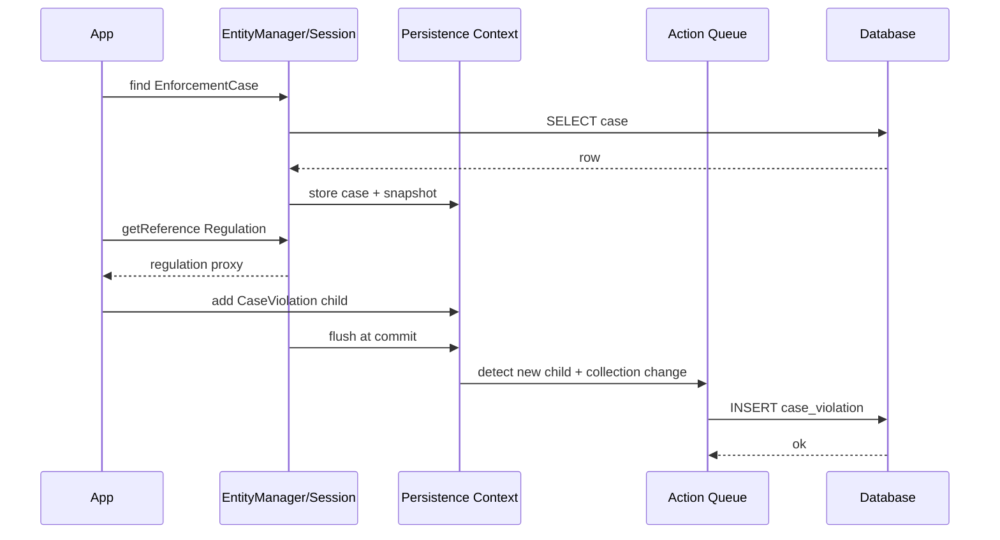

Potential hidden SQL:

- `find` loads case;
- `getReference` may not load regulation;
- adding child may not load entire collection if helper does not inspect it heavily;
- flush inserts child;
- FK constraint validates regulation exists;
- version update on parent depends mapping/optimistic lock strategy and collection versioning behavior.

---

## 20. Common Internal Failure Modes

### 20.1 Dirty update caused by mapper

```java
@Transactional
public void updateCase(UUID id, UpdateCaseRequest request) {
    EnforcementCase c = entityManager.find(EnforcementCase.class, id);
    mapper.copyAllFields(request, c); // dangerous
}
```

Jika mapper menulis nilai sama, normal snapshot dirty checking seharusnya tidak update. Tetapi update bisa tetap terjadi jika:

- setter mengubah derived field;
- audit timestamp berubah;
- collection diganti instance baru;
- mutable type dianggap dirty;
- custom converter/type tidak punya equality/mutability benar;
- `@DynamicUpdate`/enhancement behavior berbeda dari asumsi.

### 20.2 Lazy loading in `toString`

```java
@Override
public String toString() {
    return "Case{" + referenceNo + ", investigator=" + investigator.getName() + "}";
}
```

Logging entity bisa memicu SELECT atau `LazyInitializationException`. Jangan letakkan association lazy dalam `toString`, `equals`, atau `hashCode`.

### 20.3 Accidental collection recreation

```java
public void replaceViolations(List<CaseViolation> newViolations) {
    this.violations.clear();
    this.violations.addAll(newViolations);
}
```

Untuk collection dengan orphan removal, ini bisa berarti delete semua child lalu insert ulang, bukan diff cerdas sesuai business identity. Gunakan command method eksplisit:

```java
public void withdrawViolation(UUID violationId, String reason) {
    CaseViolation violation = findViolation(violationId);
    violation.withdraw(reason);
}
```

### 20.4 Batch import memory blow-up

```java
@Transactional
public void badImport(List<Row> rows) {
    for (Row row : rows) {
        entityManager.persist(CaseEvent.from(row));
    }
}
```

Jika rows berjumlah ratusan ribu, persistence context menyimpan semua managed entity sampai commit. Solusi: flush/clear chunk, atau gunakan `StatelessSession` untuk use case yang memang cocok.

---

## 21. Design Invariants untuk Hibernate Production

Gunakan invariant berikut saat review:

1. **Session scope invariant**: satu `Session` untuk satu use case/transaction, bukan singleton.
2. **Persistence context invariant**: object managed adalah working copy, bukan real-time database view.
3. **Flush invariant**: SQL write terjadi saat flush, bukan selalu saat method dipanggil.
4. **Identity invariant**: satu row = satu object instance dalam persistence context yang sama.
5. **Proxy invariant**: lazy proxy butuh persistence context terbuka untuk initialize.
6. **Mapping invariant**: mapping menentukan SQL shape lebih kuat daripada repository code.
7. **Dialect invariant**: SQL final bergantung database target.
8. **Batch invariant**: batching butuh SQL shape sama dan flush order mendukung.
9. **Cache invariant**: first-level cache selalu ada; second-level/query cache optional dan punya freshness risk.
10. **Provider invariant**: Hibernate-specific fitur harus dinyatakan sebagai keputusan arsitektur, bukan kebetulan implementation leak.

---

## 22. Observability Checklist

Untuk endpoint command:

- Berapa query sebelum flush?
- Berapa SQL saat flush?
- Apakah ada SELECT tambahan setelah mutation?
- Apakah ada UPDATE entity yang tidak diubah?
- Apakah parent version berubah sesuai ekspektasi?
- Apakah batch insert/update terjadi?
- Apakah flush terjadi sekali atau berkali-kali?
- Apakah transaction memegang connection terlalu lama?

Untuk endpoint query/read:

- Apakah menggunakan entity atau projection?
- Apakah jumlah query stabil saat jumlah row naik?
- Apakah collection lazy terakses di mapper?
- Apakah fetch join memecahkan pagination?
- Apakah result set Cartesian terlalu besar?
- Apakah persistence context memuat terlalu banyak entity untuk read-only endpoint?

---

## 23. Mini Lab: Trace One Use Case End-to-End

### 23.1 Task

Implementasikan use case:

> Close enforcement case jika semua mandatory actions selesai, tulis closure note, dan publish outbox event.

### 23.2 Entity sketch

```java
@Entity
public class EnforcementCase {
    @Id
    private UUID id;

    @Version
    private long version;

    @Enumerated(EnumType.STRING)
    private CaseStatus status;

    @OneToMany(mappedBy = "enforcementCase", cascade = CascadeType.ALL, orphanRemoval = true)
    private List<CaseAction> actions = new ArrayList<>();

    public void close(String note) {
        if (actions.stream().anyMatch(CaseAction::isMandatoryAndOpen)) {
            throw new IllegalStateException("Mandatory action still open");
        }
        this.status = CaseStatus.CLOSED;
        // note omitted for brevity
    }
}
```

### 23.3 Questions yang harus kamu jawab dari log

1. Query apa yang meload case?
2. Apakah actions difetch bersama case atau lazy?
3. Jika lazy, kapan SELECT actions terjadi?
4. Apakah close mengubah hanya case table atau juga action table?
5. Apakah version column berubah?
6. Apakah outbox event diinsert dalam transaction yang sama?
7. Apakah flush terjadi sebelum query validasi?
8. Apakah SQL order aman terhadap FK?
9. Apakah ada hidden N+1 jika action punya `assignee` lazy?
10. Apakah endpoint read setelah close perlu refresh atau cukup new transaction?

---

## 24. Mental Model Ringkas

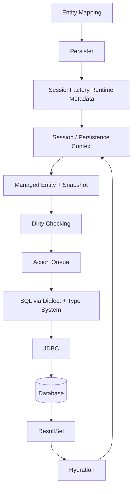

Kalimat kunci:

> Untuk memahami Hibernate, ikuti state: object state, persistence context state, action queue state, SQL state, database transaction state, dan cache state. Bug production biasanya muncul saat salah satu state ini diasumsikan sama padahal tidak.

---

## 25. Self-Correction Drill

Jawab tanpa melihat dokumentasi:

1. Kenapa dua kali `find` ID yang sama dalam transaction yang sama tidak selalu mengirim dua SELECT?
2. Kenapa `persist` tidak selalu langsung INSERT?
3. Kenapa query bisa memicu flush?
4. Kenapa `getReference` bisa tidak SELECT?
5. Kenapa `LazyInitializationException` bukan sekadar masalah annotation fetch?
6. Kenapa collection `List` bisa lebih mahal daripada dugaan?
7. Kenapa `@DynamicUpdate` bukan solusi umum untuk dirty update?
8. Kenapa IDENTITY strategy bisa mengurangi batch insert?
9. Kenapa native SQL update bisa membuat persistence context stale?
10. Kenapa `Session` tidak boleh disimpan sebagai singleton?

Jika kamu bisa menjawab semua dengan mekanisme internal, kamu siap masuk ke fitur advanced Hibernate.

---

## 26. References

- Hibernate ORM Javadocs: `SessionFactory`, `Session`, `StatelessSession`, `Cache`, `Filter`, `Query`, `NativeQuery`, `HibernateCriteriaBuilder`.
- Hibernate ORM Introduction/User Guide: stateful vs stateless session, organizing persistence logic, Hibernate 7 programming model.
- Jakarta Persistence 3.2 Specification: `EntityManager`, persistence context, lifecycle, query, locking, cache, schema generation.
- Hibernate ORM User Guide: persistence context, flushing, fetching, batching, caching, multitenancy, Envers, custom types.
