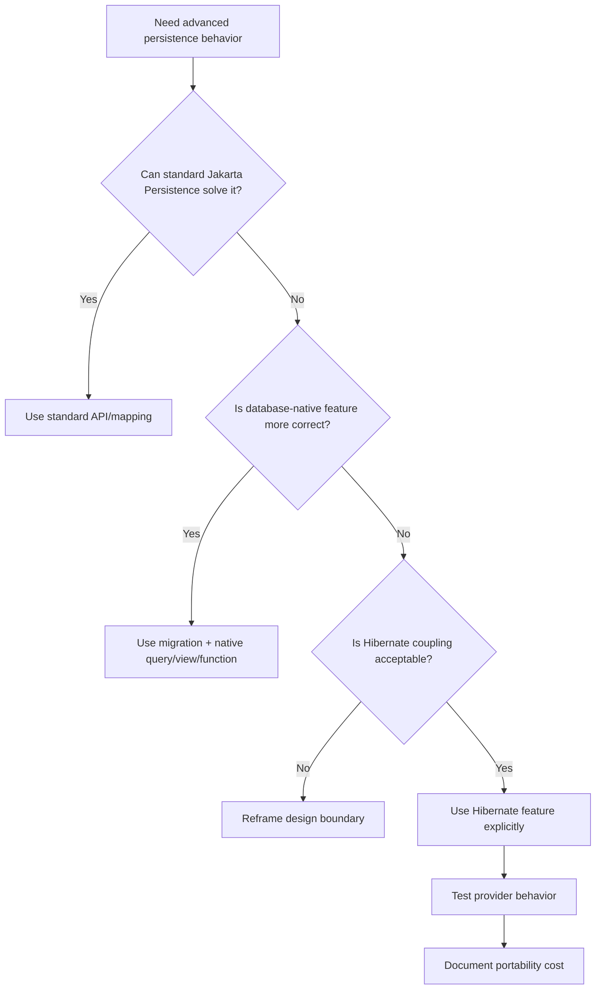
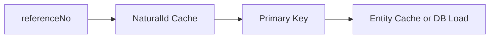
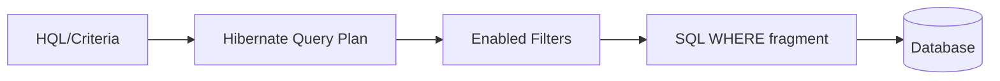
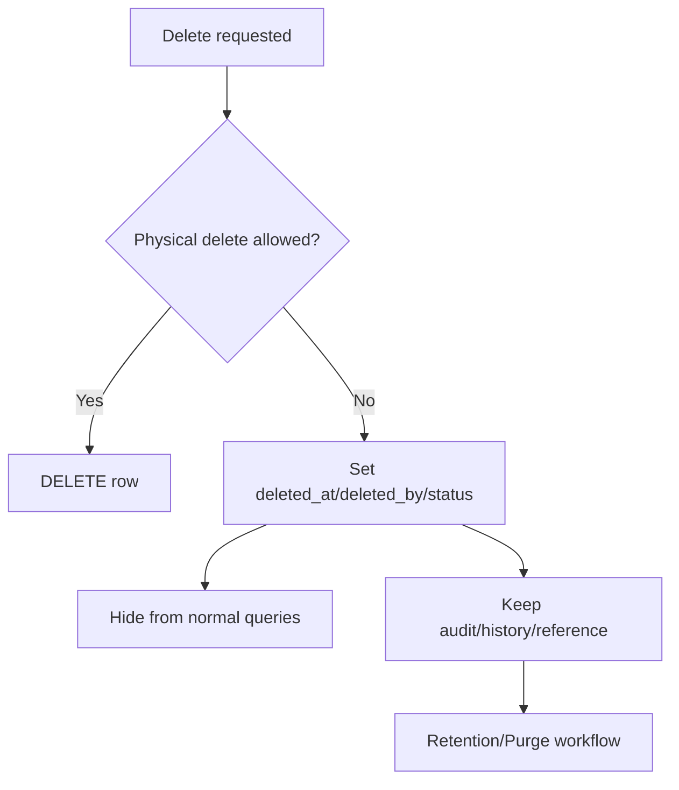
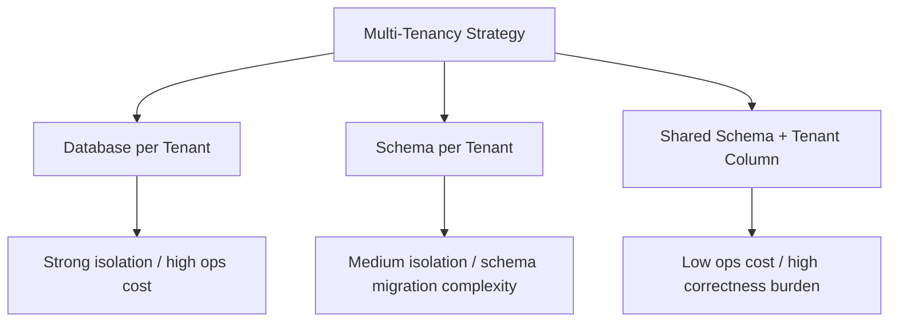
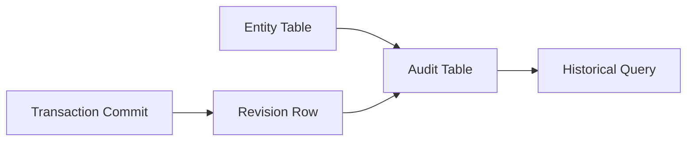
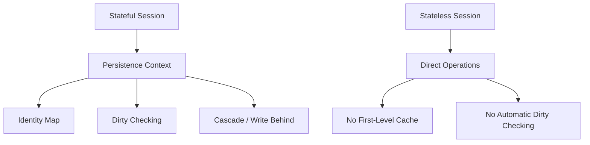
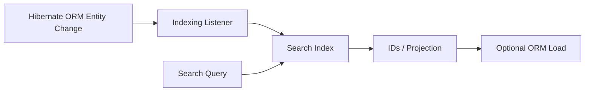
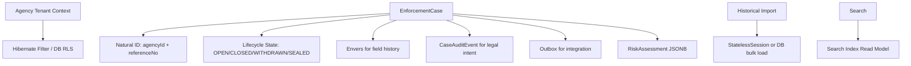
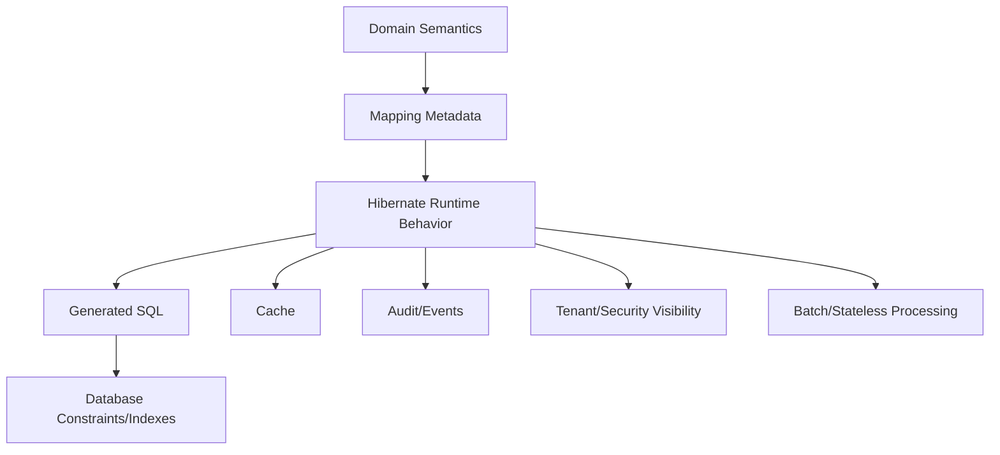

------
title: Learn Java Persistence, Database Integration, JPA, Hibernate ORM & EclipseLink - Part 024
description: Hibernate advanced features: natural id, filters, soft delete, custom types, JSON mapping, multi-tenancy, Envers auditing, stateless session, batch processing, interceptors, and production-grade provider extension strategy.
series: learn-java-persistence
seriesTitle: Learn Java Persistence, Database Integration, JPA, Hibernate ORM & EclipseLink
order: 24
partTitle: Hibernate Advanced Features
tags:
  - java
  - jakarta-persistence
  - jpa
  - hibernate
  - hibernate-orm
  - natural-id
  - filters
  - soft-delete
  - envers
  - multitenancy
  - stateless-session
  - custom-types
  - batch-processing
  - advanced
  - series
date: 2026-06-27
---

# Part 024 — Hibernate Advanced Features

> Target: setelah membaca part ini, kamu bisa memakai fitur Hibernate-specific secara sadar: kapan fitur itu menyelesaikan masalah nyata, kapan ia membuat coupling yang layak diterima, dan kapan ia justru menyembunyikan desain persistence yang salah.

Fitur advanced Hibernate bukan badge senioritas. Fitur advanced adalah alat untuk mengatasi gap antara standar Jakarta Persistence dan kebutuhan production: natural lookup, row-level visibility, soft delete, audit history, custom database type, multi-tenancy, batch ingestion, stateless processing, dan event integration.

Prinsip utama:

> Provider-specific feature harus menjadi keputusan arsitektur eksplisit, bukan efek samping library yang kebetulan tersedia.

---

## 1. Extension Strategy: Kapan Keluar dari Standar JPA?

Sebelum memakai fitur Hibernate-specific, jawab empat pertanyaan:

1. Apakah Jakarta Persistence standar cukup?
2. Apakah solusi SQL/database-native lebih tepat?
3. Apakah coupling ke Hibernate bisa diterima dalam horizon maintenance sistem?
4. Apakah behavior fitur bisa dites dan diobservasi?



Kategori coupling:

| Kategori | Contoh | Risiko |
|---|---|---|
| Low coupling | query hint minor, statistics, unwrap for diagnostics | mudah diganti |
| Medium coupling | `@NaturalId`, batch hints, custom Hibernate type | butuh migration plan |
| High coupling | filters for security, Envers audit model, multitenancy SPI, event listeners | arsitektur bergantung provider |

Rule:

> Semakin invisible fitur itu bagi application code, semakin besar kewajiban observability dan testing-nya.

---

## 2. Natural ID

Natural ID adalah identifier bisnis yang unik dan stabil, misalnya `caseReferenceNo`, `regulationCode`, atau `licenseNumber`. Primary key tetap bisa surrogate UUID/sequence, tetapi natural id dipakai untuk lookup domain.

```java
@Entity
@Table(name = "enforcement_case")
public class EnforcementCase {
    @Id
    private UUID id;

    @NaturalId(mutable = false)
    @Column(nullable = false, unique = true, length = 64)
    private String referenceNo;
}
```

Lookup via Hibernate API:

```java
Session session = entityManager.unwrap(Session.class);

EnforcementCase c = session
    .byNaturalId(EnforcementCase.class)
    .using("referenceNo", "CASE-2026-000012")
    .load();
```

### 2.1 Kapan natural id layak?

Gunakan natural id saat:

- business key benar-benar unik;
- key relatif immutable;
- lookup by key sering terjadi;
- domain berbicara dengan key itu;
- database punya unique constraint;
- key bukan PII sensitif yang sebaiknya tidak sering diekspos.

Hindari natural id saat:

- key bisa berubah karena koreksi data;
- key berasal dari sistem eksternal yang tidak reliable;
- uniqueness hanya berlaku conditional/temporal;
- key terlalu panjang/komposit dan jarang dicari;
- key mengandung data yang bisa dihapus/dirotasi.

### 2.2 Natural ID cache

Hibernate dapat mengoptimalkan lookup natural id dengan natural id cache. Namun cache hanya aman jika:

- natural id immutable atau perubahan dikontrol ketat;
- update lewat Hibernate, bukan external writer liar;
- invalidation region benar;
- uniqueness constraint tetap ada di database.

Cache bukan pengganti constraint.



### 2.3 Failure mode

```java
@NaturalId(mutable = true)
private String referenceNo;
```

Mutable natural id tampak fleksibel, tetapi membuat cache, audit, URL, integration event, dan reconciliation lebih rumit. Untuk regulatory case, biasanya lebih baik:

- primary immutable case reference;
- correction alias table jika reference pernah salah;
- audit trail untuk correction;
- redirect/lookup alias untuk backward compatibility.

---

## 3. Hibernate Filters

Filter adalah mekanisme Hibernate untuk menambahkan condition dinamis pada query entity/collection. Use case umum:

- tenant isolation;
- effective date filtering;
- security visibility;
- soft visibility;
- regional partition;
- data access policy.

Contoh:

```java
@Entity
@FilterDef(
    name = "tenantFilter",
    parameters = @ParamDef(name = "tenantId", type = String.class)
)
@Filter(
    name = "tenantFilter",
    condition = "tenant_id = :tenantId"
)
public class EnforcementCase {
    @Id
    private UUID id;

    @Column(name = "tenant_id", nullable = false)
    private String tenantId;
}
```

Enable filter:

```java
Session session = entityManager.unwrap(Session.class);
session.enableFilter("tenantFilter")
    .setParameter("tenantId", currentTenant.id());
```

### 3.1 Filter mental model

Filter bukan Java predicate setelah data diload. Filter memengaruhi SQL yang digenerate Hibernate.



### 3.2 Filter sebagai security boundary?

Hati-hati. Filter bisa membantu enforcement, tetapi security yang benar membutuhkan defense-in-depth:

- filter wajib enable sebelum query;
- test memastikan filter aktif di semua entry point;
- native query harus menangani tenant/security sendiri;
- background job harus punya tenant context eksplisit;
- database row-level security bisa lebih kuat untuk high-stakes tenant isolation;
- admin bypass harus eksplisit dan diaudit.

Anti-pattern:

```java
// Dangerous: some repository methods run before tenant filter is enabled.
public List<EnforcementCase> findOpenCases() {
    return entityManager.createQuery("select c from EnforcementCase c", EnforcementCase.class)
        .getResultList();
}
```

Better pattern:

- enable filter at transaction/request boundary;
- fail closed jika tenant context missing;
- integration test semua repository path;
- add database constraint/index on tenant columns;
- avoid static global tenant context yang bocor antar thread.

---

## 4. Soft Delete

Soft delete berarti row tidak dihapus secara fisik; row diberi marker seperti `deleted_at`, `deleted_by`, atau status `DELETED`.

Motivasi:

- audit/regulatory retention;
- undo/restore;
- legal hold;
- referential history;
- asynchronous purge.

Namun soft delete bukan hanya annotation. Ia mengubah semantics seluruh model.



### 4.1 Classic Hibernate approach

Secara tradisional, Hibernate memakai custom SQL delete dan where/filter clause.

```java
@Entity
@SQLDelete(sql = "update enforcement_case set deleted_at = current_timestamp where id = ? and version = ?")
@Where(clause = "deleted_at is null")
public class EnforcementCase {
    @Id
    private UUID id;

    @Version
    private long version;

    @Column(name = "deleted_at")
    private Instant deletedAt;
}
```

Catatan: annotation dan behavior detail bisa berbeda antar versi Hibernate. Pada versi modern, Hibernate juga menyediakan dukungan soft delete yang lebih eksplisit. Validasi API yang dipakai sesuai versi project.

### 4.2 Soft delete decision model

Soft delete cocok untuk:

- entity yang punya kewajiban retention;
- reference dari audit/event/history;
- entity yang user boleh restore;
- deletion yang secara domain berarti deactivation.

Physical delete cocok untuk:

- temporary staging rows;
- child rows tanpa nilai historis;
- data yang wajib dihapus karena policy privacy;
- data turunan yang bisa direbuild.

### 4.3 Failure modes

| Failure | Dampak |
|---|---|
| Unique constraint tidak memperhitungkan deleted row | user tidak bisa membuat key baru setelah delete |
| Association masih melihat deleted child | API menampilkan data tersembunyi |
| Native query lupa filter deleted | data bocor |
| Count/report mencampur active dan deleted | angka regulatory salah |
| Cascade remove berubah menjadi soft delete massal | data tampak hilang tanpa expected workflow |
| No purge strategy | table tumbuh tanpa batas |

### 4.4 Better regulatory model

Untuk enforcement case, sering lebih benar memakai lifecycle state daripada generic soft delete:

```java
public enum CaseStatus {
    DRAFT,
    OPEN,
    UNDER_REVIEW,
    CLOSED,
    WITHDRAWN,
    SEALED
}
```

`WITHDRAWN` atau `SEALED` membawa meaning domain yang lebih kaya daripada `deleted_at`. Soft delete tetap bisa dipakai untuk technical deletion, tetapi jangan menggantikan lifecycle modelling.

---

## 5. Custom Types dan JSON Mapping

JPA `AttributeConverter` cukup untuk conversion sederhana. Hibernate custom type atau annotation provider-specific diperlukan saat storage type tidak sederhana, misalnya JSON, array, range, encrypted value, atau database-specific enum.

### 5.1 JSON example concept

Misalnya `RiskAssessment` disimpan sebagai JSONB di PostgreSQL.

```java
@Entity
public class EnforcementCase {
    @Id
    private UUID id;

    @JdbcTypeCode(SqlTypes.JSON)
    @Column(name = "risk_assessment", columnDefinition = "jsonb")
    private RiskAssessment riskAssessment;
}
```

Contoh di atas Hibernate-specific. Ia praktis, tetapi membuat mapping bergantung pada Hibernate dan database target.

### 5.2 Kapan JSON column cocok?

Cocok untuk:

- atribut semi-structured yang dibaca sebagai unit;
- snapshot eksternal;
- form dynamic yang schema-nya berubah;
- audit payload;
- risk scoring details yang tidak sering di-query relational.

Tidak cocok untuk:

- field yang sering difilter/sort/join;
- business invariant yang butuh constraint relational kuat;
- data yang perlu referential integrity;
- report aggregate besar tanpa index strategy;
- data yang sering partial update.

### 5.3 Mutability issue

Jika object JSON mutable, dirty checking harus tahu apakah value berubah. Pastikan:

- value object immutable bila memungkinkan;
- equals/hashCode benar;
- custom type punya mutability plan benar;
- test memastikan perubahan nested field terdeteksi atau sengaja tidak didukung.

Better design:

```java
public record RiskAssessment(
    RiskLevel level,
    BigDecimal score,
    List<String> factors
) {
    public RiskAssessment {
        factors = List.copyOf(factors);
    }
}
```

---

## 6. Multi-Tenancy

Multi-tenancy berarti satu aplikasi melayani banyak tenant dengan isolasi data tertentu.

Model utama:

| Model | Deskripsi | Kelebihan | Risiko |
|---|---|---|---|
| Database per tenant | tenant punya database sendiri | isolasi kuat | operasi/migration kompleks |
| Schema per tenant | tenant punya schema sendiri | isolasi sedang | connection/schema switching |
| Shared schema + tenant column | semua tenant di table sama | operasional sederhana | isolation bug berbahaya |



### 6.1 Hibernate support

Hibernate menyediakan kemampuan multi-tenancy provider-specific. Detail implementasi bergantung versi dan strategi. Konsep umumnya:

- resolve current tenant identifier;
- provide tenant-aware connection/schema;
- ensure queries/mutations target tenant yang benar;
- integrate with cache key/region strategy;
- test tenant switching dan leakage.

### 6.2 Shared schema danger

Shared schema dengan `tenant_id` paling mudah secara operasi, tetapi paling rawan:

```sql
select * from enforcement_case where status = 'OPEN';
```

Jika query lupa `tenant_id`, data tenant lain bocor.

Defense-in-depth:

- tenant_id NOT NULL di semua tenant-owned table;
- composite indexes `(tenant_id, business_key)`;
- unique constraint scoped by tenant;
- Hibernate filter atau discriminator strategy;
- database row-level security jika tersedia;
- integration tests yang membuat dua tenant dengan overlapping IDs/business keys;
- cache key harus tenant-aware;
- logs/audit harus menyertakan tenant.

### 6.3 Regulatory note

Untuk sistem enforcement/regulatory, tenant tidak selalu sama dengan customer. Tenant bisa berarti jurisdiction, agency, business unit, region, or legal partition. Salah modelling tenant boundary bisa membuat data retention, access control, dan audit defensibility gagal.

---

## 7. Envers Auditing

Hibernate Envers adalah module untuk entity auditing/versioning. Ia menyimpan revision history sehingga kamu bisa melihat state entity pada revision tertentu.

Use case:

- audit perubahan entity;
- reconstruct historical state;
- compliance investigation;
- “who changed what and when”;
- compare revisions.

```java
@Entity
@Audited
public class EnforcementCase {
    @Id
    private UUID id;

    private String referenceNo;

    @Enumerated(EnumType.STRING)
    private CaseStatus status;
}
```

### 7.1 Mental model Envers



Biasanya ada:

- revision table;
- audit table per audited entity;
- revision number/timestamp;
- operation type;
- copied audited columns.

### 7.2 Envers vs domain event vs outbox

| Kebutuhan | Pilihan lebih cocok |
|---|---|
| Lihat perubahan field entity | Envers |
| Publish event ke sistem lain | Outbox |
| Jelaskan business decision | Domain event / case note |
| Legal audit with actor/reason | Custom audit model + Envers optional |
| Rebuild projection | Outbox/domain event lebih cocok |

Envers merekam state change. Ia tidak otomatis menjelaskan *mengapa* business decision terjadi.

Untuk regulatory system, audit defensibility biasanya butuh:

- actor;
- role;
- timestamp;
- reason;
- command/request id;
- source channel;
- before/after;
- case lifecycle context;
- legal basis;
- immutable event/case note.

Envers bisa menjadi komponen, bukan keseluruhan audit story.

### 7.3 Envers failure modes

| Failure | Dampak |
|---|---|
| Audit semua entity tanpa seleksi | storage tumbuh cepat |
| Tidak audit relation penting | history tidak bisa direkonstruksi |
| Tidak menyimpan actor/reason | audit tidak defensible |
| Bulk/native update bypass audit expectation | history bolong |
| Purge audit tanpa retention policy | compliance risk |
| Menganggap Envers = event sourcing | model konseptual salah |

---

## 8. StatelessSession

`StatelessSession` adalah Hibernate API untuk operasi tanpa first-level cache/persistence context stateful. Ia tidak melakukan dirty checking seperti stateful `Session`. Operasi lebih eksplisit dan cocok untuk sebagian batch workload.



### 8.1 Kapan `StatelessSession` cocok?

- batch insert/update besar;
- ETL/import/export;
- streaming processing;
- maintenance job;
- data correction script;
- workload yang tidak butuh object graph consistency;
- operasi yang lebih nyaman direct-row style tetapi masih memakai mapping Hibernate.

### 8.2 Kapan tidak cocok?

- aggregate command dengan invariant kompleks;
- cascade lifecycle yang diandalkan;
- dirty checking otomatis;
- object graph navigation;
- domain method yang mengandalkan managed state;
- consistency dalam satu persistence context.

### 8.3 Example concept

```java
SessionFactory sessionFactory = entityManagerFactory.unwrap(SessionFactory.class);

try (StatelessSession session = sessionFactory.openStatelessSession()) {
    Transaction tx = session.beginTransaction();

    for (CaseEventArchiveRow row : rows) {
        session.insert(CaseEventArchive.from(row));
    }

    tx.commit();
}
```

Rule:

> `StatelessSession` bukan “faster EntityManager”. Ia programming model berbeda. Pakai saat kamu memang ingin menghindari persistence context, bukan saat kamu belum paham persistence context.

---

## 9. Batch Processing Patterns

Batch processing dengan Hibernate sering gagal bukan karena Hibernate lambat, tetapi karena persistence context dan JDBC batch tidak dikelola.

### 9.1 Stateful batch pattern

```java
@Transactional
public void importCaseEvents(List<CaseEventImportRow> rows) {
    int batchSize = 50;

    for (int i = 0; i < rows.size(); i++) {
        entityManager.persist(CaseEvent.from(rows.get(i)));

        if (i > 0 && i % batchSize == 0) {
            entityManager.flush();
            entityManager.clear();
        }
    }
}
```

Configuration:

```properties
hibernate.jdbc.batch_size=50
hibernate.order_inserts=true
hibernate.order_updates=true
```

### 9.2 Batch update with cursor/stream

```java
@Transactional
public void recomputeRiskScores() {
    List<UUID> ids = entityManager.createQuery("""
        select c.id
        from EnforcementCase c
        where c.status = :status
    """, UUID.class)
    .setParameter("status", CaseStatus.OPEN)
    .getResultList();

    int i = 0;
    for (UUID id : ids) {
        EnforcementCase c = entityManager.find(EnforcementCase.class, id);
        c.recomputeRiskScore();

        if (++i % 50 == 0) {
            entityManager.flush();
            entityManager.clear();
        }
    }
}
```

This is safe but may still load many entities. For very large datasets, prefer chunked ID windows:

```sql
where id > :lastId
order by id
limit :chunkSize
```

or database-native batch update when business rule can be expressed in SQL.

### 9.3 Bulk HQL update caveat

```java
int updated = entityManager.createQuery("""
    update EnforcementCase c
    set c.status = :closed
    where c.status = :ready
""")
.setParameter("closed", CaseStatus.CLOSED)
.setParameter("ready", CaseStatus.READY_TO_CLOSE)
.executeUpdate();
```

Bulk operation bypasses normal per-entity lifecycle:

- managed entities can become stale;
- lifecycle callbacks may not run as expected;
- optimistic version handling requires care;
- Envers/domain events may not capture intended business semantics;
- caches may need invalidation.

After bulk update, commonly:

```java
entityManager.clear();
```

---

## 10. Dynamic Insert, Dynamic Update, Select Before Update

Hibernate-specific annotations can influence generated SQL.

### 10.1 `@DynamicUpdate`

`@DynamicUpdate` generates update SQL containing only changed columns.

Potential benefit:

- reduce write traffic for wide table;
- avoid touching columns with database triggers;
- reduce contention on certain storage engines;
- improve audit readability in some DB log systems.

Cost:

- more SQL shapes;
- less statement cache/batch reuse;
- not a fix for bad command modelling;
- can hide accidental dirty changes.

Use only after measuring.

### 10.2 `@DynamicInsert`

`@DynamicInsert` includes only non-null columns in INSERT, allowing database defaults to apply.

But database defaults plus entity state can be tricky:

- Java object may not know generated default until refresh;
- business logic after persist may see null;
- behavior differs from application-assigned default;
- migration/default changes affect runtime semantics.

Rule:

> Prefer application-level explicit default for domain invariant. Use database default for technical timestamps, legacy integration, or independent safety net.

---

## 11. Custom SQL and Database Functions

Hibernate lets you use native SQL, custom SQL fragments, SQL functions, and dialect extension. Use this when database capability is part of the design.

Use cases:

- full-text search;
- JSON path query;
- geospatial search;
- temporal/range overlap;
- database-specific lock hints;
- advanced window functions;
- recursive CTE;
- materialized view refresh.

Decision rule:

- If result is read model/report: native query/projection is often fine.
- If result mutates aggregate: prefer entity command unless SQL expresses invariant more safely.
- If database feature is core: isolate it behind repository/port and test on target DB.

Example native projection:

```java
public record InvestigatorLoad(UUID investigatorId, long openCases, long overdueActions) {}
```

```java
List<InvestigatorLoad> loads = entityManager.createNativeQuery("""
    select investigator_id, count(*) as open_cases,
           count(*) filter (where due_at < current_timestamp) as overdue_actions
    from enforcement_case_action
    where status = 'OPEN'
    group by investigator_id
""")
.getResultList()
.stream()
.map(row -> {
    Object[] r = (Object[]) row;
    return new InvestigatorLoad((UUID) r[0], ((Number) r[1]).longValue(), ((Number) r[2]).longValue());
})
.toList();
```

Wrap raw `Object[]` mapping carefully. For stable production code, prefer explicit mapping abstraction or framework support.

---

## 12. Interceptors, Event Listeners, and Integrators

Hibernate extension points can hook into runtime behavior.

Use cases:

- auditing metadata;
- tenant enforcement;
- security checks;
- automatic domain event collection;
- custom validation;
- observability/tracing;
- SQL statement inspection.

### 12.1 StatementInspector

A common lightweight extension is inspecting SQL.

```java
public class CorrelationStatementInspector implements StatementInspector {
    @Override
    public String inspect(String sql) {
        String correlationId = Correlation.currentId();
        return "/* correlation=" + correlationId + " */ " + sql;
    }
}
```

Potential benefit:

- correlate SQL to request;
- tag workload;
- support database-side tracing.

Risks:

- leaking sensitive data into SQL comments/logs;
- breaking statement cache if comments vary too much;
- increased log noise.

### 12.2 Event listener caution

Event listeners are powerful but invisible to normal service code. That means:

- keep them small;
- avoid remote calls;
- document side effects;
- test them explicitly;
- avoid hidden business workflow;
- ensure ordering with transaction commit is correct.

---

## 13. Immutable Entities and Read-Only Models

Hibernate supports read-only/immutable modelling. This is useful for:

- lookup/reference data;
- database views;
- historical snapshots;
- materialized views;
- append-only audit/event rows.

Example:

```java
@Entity
@Immutable
@Table(name = "regulation_view")
public class RegulationView {
    @Id
    private UUID id;

    private String code;
    private String title;
}
```

Benefits:

- communicates no-update intent;
- can reduce dirty checking overhead;
- protects accidental writes at ORM level.

Still enforce at database level if correctness matters:

- revoke update permissions;
- use view without update rule;
- separate read-only datasource/user;
- migration guard.

---

## 14. Advanced Fetching: Fetch Profiles and Batch Fetch

Hibernate has provider-specific fetch tuning beyond standard entity graph.

Options include:

- batch fetching;
- subselect fetching;
- fetch profiles;
- fetch size hints;
- read-only query hints;
- query cache hints;
- association-specific tuning.

### 14.1 Batch fetching mental model

If lazy associations are initialized for many parent entities, batch fetching can group them:

```text
Without batch fetch:
SELECT investigator WHERE id = ?
SELECT investigator WHERE id = ?
SELECT investigator WHERE id = ?

With batch fetch:
SELECT investigator WHERE id IN (?, ?, ?)
```

Useful for controlled graph traversal. Not a substitute for explicit read model when endpoint needs large denormalized data.

### 14.2 Fetch tuning decision

| Problem | Better first tool |
|---|---|
| Detail page needs small graph | join fetch/entity graph |
| List page needs summary | DTO projection |
| Several lazy many-to-one accessed after list | batch fetch |
| Large report | native SQL/read model |
| Multiple collections needed | split queries/projection |
| API serialization triggers lazy load | map inside transaction with explicit fetch plan |

---

## 15. Hibernate Search Boundary

Hibernate Search integrates entity model with full-text search backends such as Lucene/Elasticsearch/OpenSearch depending version/setup. It is not the same as Hibernate ORM querying.

Use it when:

- full-text search is core;
- relevance scoring matters;
- phrase/prefix/fuzzy matching needed;
- search index is acceptable as eventually consistent read model.

Do not use it to replace relational constraints or transactional lookup.

Architecture:



Key issue:

> Search index is a read model. Treat consistency and reindexing as operational concerns.

---

## 16. Second-Level Cache Advanced Strategy

From Part 022, we know L2 cache is optional. Hibernate advanced usage adds region strategy, concurrency strategy, collection cache, natural-id cache, and query cache.

### 16.1 Cache region design

Group by semantics:

- reference data region;
- tenant-specific region;
- rarely changing lookup region;
- high-write domain entity should often not be cached;
- collection cache only if collection changes rarely.

### 16.2 Cache and multi-tenancy

Tenant leakage via cache is catastrophic. Ensure:

- cache key includes tenant if shared infrastructure;
- region separation if needed;
- native updates evict relevant regions;
- tests query same ID/business key under different tenants;
- admin/global queries do not poison tenant cache.

---

## 17. Provider-Specific Annotations Review

Common Hibernate annotations/features and design posture:

| Feature | Use when | Be careful because |
|---|---|---|
| `@NaturalId` | stable business lookup | mutable key/cache complexity |
| `@Filter` | dynamic SQL visibility | must be enabled everywhere |
| `@SQLDelete`/soft delete support | domain retention/hiding | native queries/report/unique constraints |
| `@DynamicUpdate` | measured wide-table update issue | hurts batching/statement cache |
| `@Immutable` | read-only reference/view | DB must still enforce if critical |
| `@BatchSize` | lazy access grouping | can hide need for projection |
| `@Fetch` | provider fetch tuning | portability loss |
| `@JdbcTypeCode` | JSON/native DB type | DB/provider coupling |
| Envers `@Audited` | field/state history | not a full business audit |
| `StatelessSession` | batch/direct operations | no stateful unit-of-work semantics |

---

## 18. Anti-Patterns with Advanced Hibernate

### 18.1 Filter as hidden global policy without tests

A tenant filter enabled by web interceptor but not by async job creates leakage.

### 18.2 Soft delete everywhere

Soft delete on every table creates:

- bloated tables;
- broken uniqueness;
- confusing reports;
- hidden association bugs;
- no actual retention governance.

### 18.3 Envers as event sourcing

Envers stores revisions, not domain events. It does not automatically encode intent, command causality, or integration semantics.

### 18.4 JSON for relational data

Putting everything in JSON avoids modelling work temporarily but moves cost to query, constraints, index, migration, and correctness.

### 18.5 StatelessSession for domain commands

Using stateless session for aggregate mutation often bypasses the exact invariants you wanted ORM to protect.

### 18.6 `@DynamicUpdate` as universal fix

It may reduce columns in SQL but does not fix accidental mutation, poor command design, or wrong transaction boundary.

---

## 19. Advanced Feature Selection Matrix

| Need | Standard JPA | Hibernate Feature | Database Native | Recommended framing |
|---|---|---|---|---|
| Lookup by business key | unique constraint + query | `@NaturalId` | unique index | Natural id if frequent/stable |
| Tenant isolation | manual predicates | filter/multitenancy | RLS/schema/db per tenant | Defense-in-depth |
| Hide deleted rows | status predicates | soft delete annotations/filter | views/RLS | Prefer lifecycle state when domainful |
| Audit history | callbacks | Envers | triggers/audit tables | Match legal audit requirement |
| JSON storage | converter/string | `@JdbcTypeCode` | JSONB/native functions | Use for semi-structured data |
| High-volume import | flush/clear | `StatelessSession` | COPY/bulk load | Choose based on invariant needs |
| Full-text search | LIKE | Hibernate Search | search engine | Treat as read model |
| Custom SQL function | native query | function registration/dialect | DB function | Isolate behind repository |

---

## 20. Regulatory Case Management Architecture Example

Scenario:

- enforcement cases are tenant-scoped by agency;
- case reference is natural id within agency;
- case cannot be physically deleted after submission;
- field changes must be auditable;
- full-text search over narratives is required;
- import job loads millions of historical events;
- risk assessment payload changes schema frequently.

Potential design:



Key design decisions:

1. Natural id is composite: `(agency_id, reference_no)`.
2. Tenant isolation is not only Hibernate filter; database policies/indexes reinforce it.
3. Soft delete is not used for submitted cases; lifecycle state models withdrawal/sealing.
4. Envers captures structural state history.
5. `CaseAuditEvent` captures actor/reason/legal basis.
6. Outbox publishes integration events after commit.
7. Search index is eventually consistent and rebuildable.
8. Historical import uses stateless/bulk path, not aggregate command path.
9. JSONB is used for risk assessment details, not core relational invariants.

---

## 21. Testing Advanced Hibernate Features

### 21.1 Natural ID tests

- lookup by natural id returns correct entity;
- duplicate natural id rejected by database;
- natural id cache does not return stale value after controlled update;
- tenant-scoped natural id does not cross tenant.

### 21.2 Filter tests

- query under tenant A never returns tenant B;
- native query has explicit tenant predicate;
- async job without tenant fails closed;
- admin bypass is explicit and audited;
- cache does not leak filtered data.

### 21.3 Soft delete tests

- repository normal query hides deleted row;
- admin query can see deleted row when intended;
- unique constraints behave as expected;
- associations do not expose deleted child;
- reports choose active vs all semantics explicitly.

### 21.4 Envers tests

- revision created on expected changes;
- actor/reason captured if customized;
- relation history reconstructable;
- bulk update behavior documented;
- audit table growth monitored.

### 21.5 Stateless/batch tests

- memory stays bounded;
- expected batch count observed;
- no lifecycle callback assumption violated;
- failure halfway has recovery strategy;
- idempotency key prevents duplicate import.

---

## 22. Observability for Advanced Features

Add dashboards/alerts around:

- Hibernate query count per endpoint;
- batch size effectiveness;
- second-level cache hit/miss/put;
- natural id lookup count/cache hit;
- filter enablement failures;
- audit row growth;
- outbox lag;
- tenant leakage test canaries;
- import throughput and failure rate;
- deadlock/lock timeout count;
- slow query plan changes after adding filters/soft delete predicates.

SQL comment tagging can help:

```properties
hibernate.use_sql_comments=true
```

But avoid placing sensitive information in SQL comments.

---

## 23. Production Review Checklist

Before accepting Hibernate-specific feature:

- [ ] Is the feature documented as provider-specific?
- [ ] Is there a fallback/migration plan if provider changes?
- [ ] Is database schema/index/constraint aligned?
- [ ] Is behavior covered by integration tests on target DB?
- [ ] Does it interact safely with L2/query cache?
- [ ] Does it interact safely with native SQL/bulk updates?
- [ ] Does it preserve tenant/security boundaries?
- [ ] Does it preserve audit/compliance requirements?
- [ ] Is observability available?
- [ ] Is operational failure mode understood?

---

## 24. Mini Lab: Design an Advanced Persistence Strategy

### 24.1 Problem

Design persistence for this use case:

> A regulator operates across multiple agencies. Each agency has cases with unique references. Cases can be sealed, withdrawn, or closed, but submitted cases cannot be physically deleted. Investigators need fast lookup by reference, full-text search over narratives, and audit history for every status change. A nightly import loads legacy case events.

### 24.2 Expected answer structure

Write:

1. Entity model decisions.
2. Natural id design.
3. Tenant isolation strategy.
4. Delete/lifecycle strategy.
5. Audit strategy: Envers vs custom audit event.
6. Search strategy.
7. Batch import strategy.
8. Cache strategy.
9. Database constraints/indexes.
10. Test/observability plan.

### 24.3 Example answer summary

- Use surrogate UUID primary key.
- Use `(agency_id, reference_no)` unique constraint and Hibernate natural id if lookup is frequent.
- Use agency tenant context with Hibernate filter plus DB-level constraints/RLS if risk warrants.
- Model `SEALED` and `WITHDRAWN` as lifecycle states, not generic delete.
- Use Envers for field-level revision history and `CaseAuditEvent` for legal reason/actor/command trace.
- Use search index as read model for narratives.
- Use `StatelessSession` or database-native bulk load for legacy events after validating invariants.
- Avoid L2 cache for mutable cases; consider cache for stable reference data.
- Add integration tests for tenant leakage, audit revisions, natural key uniqueness, and import idempotency.

---

## 25. Final Mental Model

Hibernate advanced features are not independent tricks. They modify one or more of these layers:



A top-level persistence engineer asks:

- Which layer owns the invariant?
- Which layer only optimizes access?
- Which layer hides data?
- Which layer records history?
- Which layer enforces security?
- Which layer can be bypassed by native SQL, bulk update, import job, or external writer?

If you cannot answer these questions, the feature is not ready for production.

---

## 26. Self-Correction Drill

1. When is `@NaturalId` better than a normal JPQL query by unique column?
2. Why is natural id cache not a replacement for unique constraint?
3. Why can Hibernate filter be dangerous as the only tenant security control?
4. Why is soft delete a domain modelling decision, not just a mapping annotation?
5. When is JSON column appropriate in an entity?
6. Why is Envers not the same as event sourcing?
7. When should you prefer `StatelessSession` over stateful `Session`?
8. What breaks when bulk HQL update is used on audited/versioned entities?
9. Why can `@DynamicUpdate` hurt batching?
10. How would you test tenant leakage with L2 cache enabled?

---

## 27. References

- Hibernate ORM Javadocs: native API, `Session`, `SessionFactory`, `StatelessSession`, `Cache`, `Filter`, `Query`, `NativeQuery`, `SchemaManager`.
- Hibernate ORM Introduction/User Guide: stateful vs stateless sessions, Hibernate 7 programming model, persistence contexts, querying, caching, batching, multitenancy.
- Hibernate ORM User Guide sections for natural ids, filters, soft delete/custom SQL, custom types, Envers, batching, caching, multitenancy.
- Jakarta Persistence 3.2 Specification: standard baseline for entity lifecycle, mapping, query, locking, cache, and provider portability boundaries.
