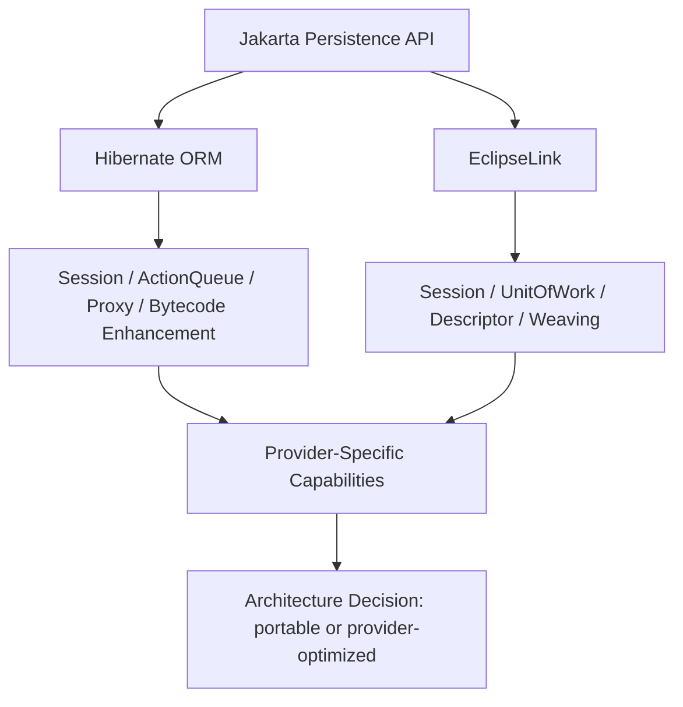
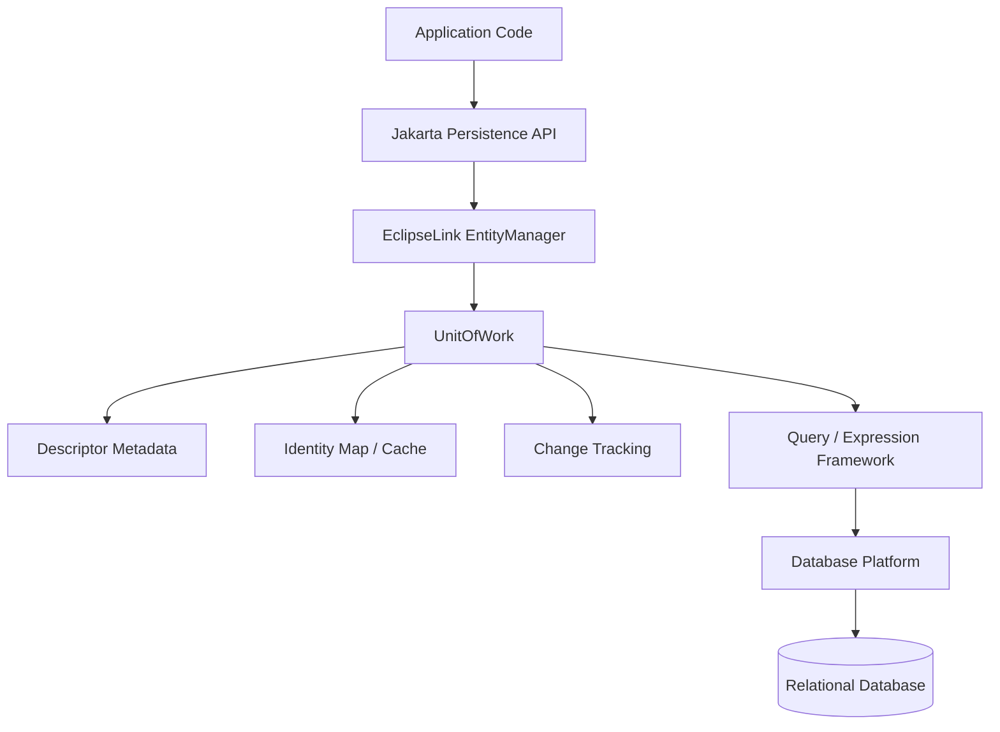
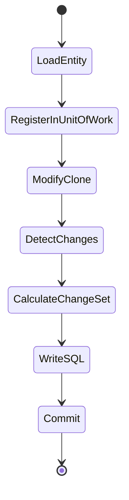
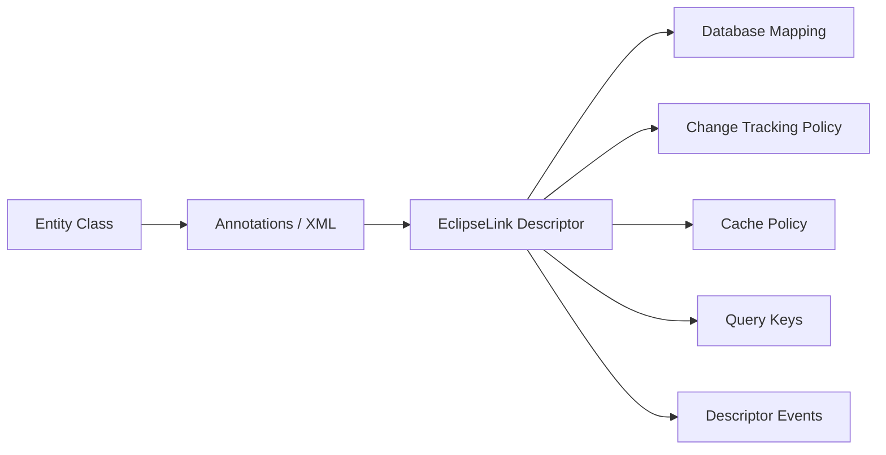
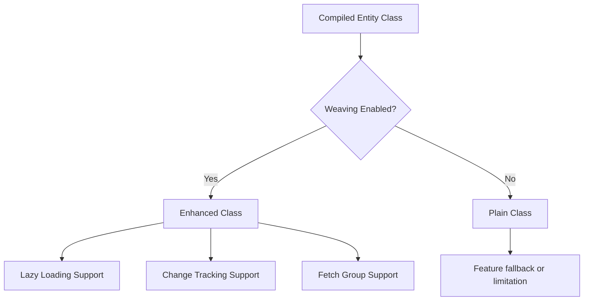
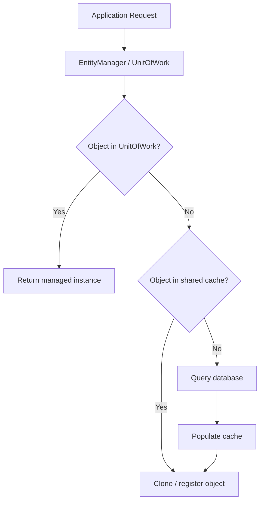
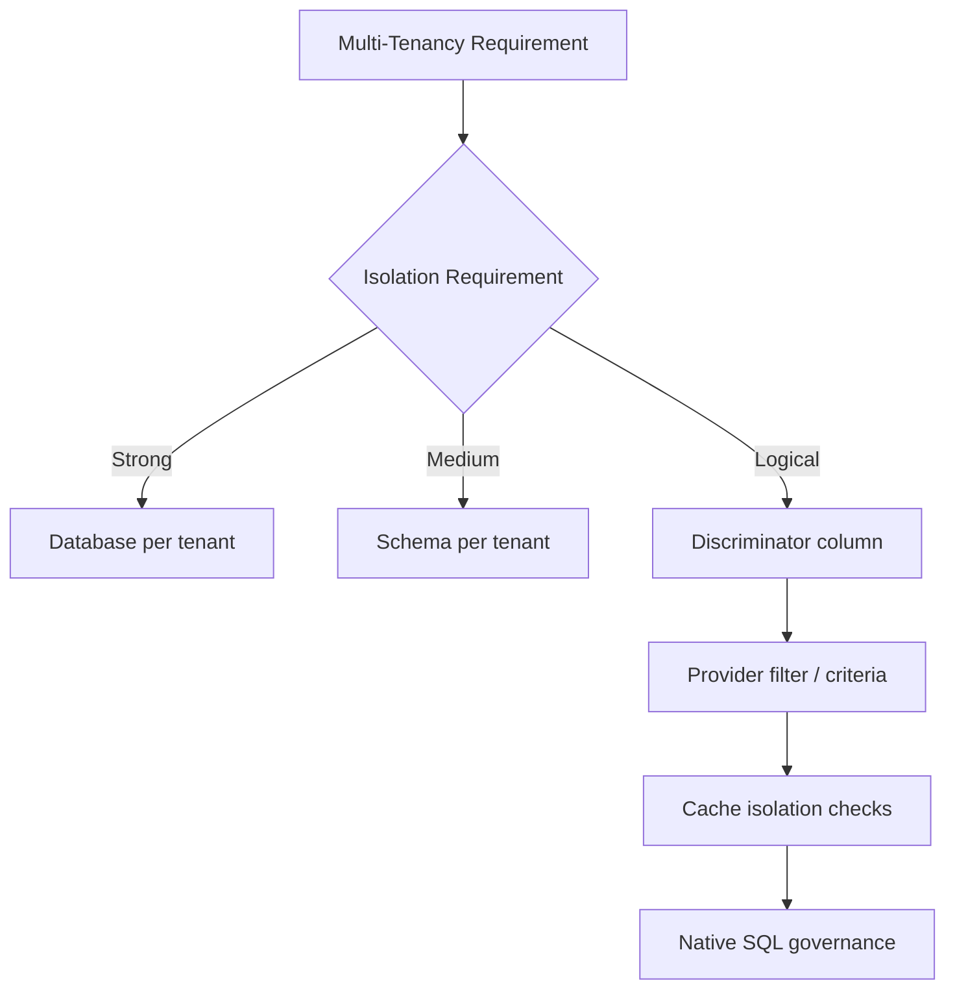

------
title: Learn Java Persistence, Database Integration, JPA, Hibernate ORM & EclipseLink - Part 025
description: EclipseLink internals and extensions: sessions, UnitOfWork, descriptors, weaving, indirection, change tracking, shared cache, fetch groups, query hints, descriptor customizers, and production portability trade-offs.
series: learn-java-persistence
seriesTitle: Learn Java Persistence, Database Integration, JPA, Hibernate ORM & EclipseLink
order: 25
partTitle: EclipseLink Internals and Extensions
tags:
  - java
  - jakarta-persistence
  - jpa
  - eclipselink
  - orm
  - unit-of-work
  - weaving
  - descriptor
  - cache
  - fetch-group
  - provider-internals
  - advanced
  - series
date: 2026-06-27
---

# Part 025 — EclipseLink Internals and Extensions

> Target: setelah membaca part ini, kamu bisa membaca EclipseLink bukan sekadar sebagai “provider JPA selain Hibernate”, tetapi sebagai runtime persistence dengan model internal sendiri: session, `UnitOfWork`, descriptor, weaving, indirection, change tracking, shared cache, fetch group, dan extension point.

EclipseLink sering muncul di sistem Jakarta EE karena historisnya kuat di application server, TopLink lineage, object-level cache, descriptor customization, weaving, dan integrasi enterprise. Untuk engineer top-tier, penting memahami dua hal sekaligus:

1. **Kontrak standar tetap Jakarta Persistence.**
2. **Behavior provider tetap menentukan performa, caching, lazy loading, change tracking, SQL generation, dan extension boundary.**

EclipseLink bukan Hibernate dengan nama kelas berbeda. Ia punya vocabulary internal sendiri. Jika kita memaksakan mental model Hibernate secara penuh ke EclipseLink, kita akan salah membaca cache, fetch group, weaving, dan customization layer.

---

## 1. Positioning EclipseLink dalam Seri Ini

Kita memakai EclipseLink untuk tiga tujuan:

1. Membandingkan mental model provider terhadap Hibernate.
2. Memahami portability cost dari fitur provider-specific.
3. Menguji apakah desain persistence kita benar-benar bergantung pada standar atau diam-diam bergantung pada implementation detail.



EclipseLink 5.x penting karena diarahkan ke Jakarta EE 11 dan Jakarta Persistence 3.2. Namun prinsip part ini tidak bergantung buta ke angka versi. Yang kita cari adalah mental model runtime.

---

## 2. Vocabulary Map: JPA vs EclipseLink Internals

| Konsep standar | Istilah EclipseLink yang relevan | Intuisi |
|---|---|---|
| `EntityManagerFactory` | `Session`, `ServerSession`, persistence unit runtime | Factory/configuration runtime untuk mapping dan koneksi |
| `EntityManager` | client session / `UnitOfWork` facade | Work area untuk operasi persistence |
| Persistence context | `UnitOfWork` identity map + clone model | Working set berisi object terkelola |
| Entity metadata | descriptor / `ClassDescriptor` | Metadata mapping untuk class entity |
| Attribute mapping | database mapping | Mapping field/property ke column/relationship |
| Lazy association | indirection / value holder / weaving | Reference tertunda yang dimuat ketika dipakai |
| Dirty checking | change tracking policy | Cara provider mendeteksi perubahan object |
| Second-level/shared cache | identity map / object cache | Cache object antar operation/session |
| Fetch plan | fetch group / attribute group / join/batch hints | Kontrol atribut/relasi yang dimuat |
| Provider extension | annotations, query hints, customizers, events | Escape hatch di luar spesifikasi |

Rule:

> Kalau Hibernate sering dibaca dari `Session` dan action queue, EclipseLink sering lebih mudah dibaca dari descriptor, `UnitOfWork`, cache, dan weaving.

---

## 3. Core Runtime Model

Secara konseptual, EclipseLink punya beberapa layer:



Layer-layer ini menjawab pertanyaan berbeda:

| Pertanyaan | Layer yang menjawab |
|---|---|
| Class Java ini mapped ke table apa? | Descriptor |
| Attribute ini column biasa, embedded, atau relationship? | Database mapping |
| Object ini sudah pernah dimuat dalam working set? | `UnitOfWork` identity map |
| Apa yang berubah sejak object dimuat? | Change tracking |
| Apakah association ini harus lazy? | Weaving + indirection |
| Query ini diterjemahkan menjadi SQL apa? | Query/expression + platform |
| Object ini boleh dibaca dari cache? | Shared cache/identity map policy |

---

## 4. Session dan UnitOfWork

Dalam JPA, kita berbicara tentang `EntityManager` dan persistence context. Dalam EclipseLink, konsep internal pentingnya adalah **session** dan **UnitOfWork**.

### 4.1 Apa itu Session?

Session menyimpan runtime metadata, connection/login configuration, descriptor, platform, cache, dan service-level behavior. Untuk aplikasi, kita biasanya tidak memegang session langsung, tetapi `EntityManagerFactory`/`EntityManager` akan berada di atas mekanisme ini.

Mental model:

```text
Persistence Unit Runtime
  -> descriptors
  -> database platform
  -> cache configuration
  -> query settings
  -> connection/session behavior
```

Jangan samakan session EclipseLink dengan HTTP session atau user session.

### 4.2 Apa itu UnitOfWork?

`UnitOfWork` adalah area kerja untuk perubahan object. Ia menjaga object yang sedang dipakai, melacak perubahan, lalu mengirim perubahan ke database ketika commit/flush sesuai lifecycle JPA.



Intuisi penting:

> EclipseLink historisnya kuat dengan konsep clone/working copy: object dalam unit kerja dapat diperlakukan sebagai representasi yang dikelola, lalu perubahan dihitung dan ditulis sebagai change set.

Dari sisi application code, efeknya mirip JPA persistence context: object managed berubah otomatis tanpa perlu `save()` eksplisit. Namun internals-nya penting ketika kita men-debug change tracking, cache identity, dan weaving.

---

## 5. Descriptor: Metadata sebagai Pusat Semesta Mapping

Descriptor adalah metadata yang menjelaskan bagaimana class Java dipetakan ke database. Jika JPA annotation adalah deklarasi di source code, descriptor adalah representasi runtime yang dipakai provider.

Descriptor menjawab:

1. Table utama entity.
2. Primary key mapping.
3. Attribute-to-column mapping.
4. Relationship mapping.
5. Inheritance strategy.
6. Change tracking policy.
7. Cache policy.
8. Fetch group/fetching behavior.
9. Event listeners/customizer.
10. Optimistic locking policy.



### 5.1 Kenapa Descriptor Penting?

Karena banyak fitur EclipseLink bekerja dengan memodifikasi descriptor, bukan hanya menambah annotation sederhana.

Contoh extension point:

```java
import org.eclipse.persistence.config.DescriptorCustomizer;
import org.eclipse.persistence.descriptors.ClassDescriptor;

public class EnforcementCaseDescriptorCustomizer implements DescriptorCustomizer {
    @Override
    public void customize(ClassDescriptor descriptor) {
        descriptor.setAlias("EnforcementCase");
        // advanced customization should be small, documented, and tested
    }
}
```

Lalu dipasang:

```java
import org.eclipse.persistence.annotations.Customizer;

@Entity
@Customizer(EnforcementCaseDescriptorCustomizer.class)
public class EnforcementCase {
    @Id
    private UUID id;
}
```

Guideline:

> Descriptor customizer adalah tool tajam. Gunakan untuk behavior yang tidak bisa diekspresikan dengan Jakarta Persistence standar, bukan untuk menyembunyikan mapping yang tidak dipahami tim.

---

## 6. Weaving: Lazy Loading, Change Tracking, Fetch Groups

EclipseLink menggunakan **weaving** untuk menambahkan behavior persistence ke entity classes. Weaving bisa dynamic atau static tergantung runtime.

Weaving dapat dipakai untuk:

1. Lazy loading.
2. Change tracking.
3. Fetch groups.
4. Internal optimization.



### 6.1 Dynamic Weaving

Dynamic weaving terjadi saat class dimuat oleh classloader dan provider bisa mengubah bytecode runtime.

Cocok untuk:

1. Application server/Jakarta EE environment.
2. Local development yang mendukung instrumentation.
3. Runtime yang tidak membatasi class transformation.

### 6.2 Static Weaving

Static weaving dilakukan saat build/package time.

Cocok untuk:

1. Runtime yang membatasi dynamic instrumentation.
2. Deployment yang ingin startup predictable.
3. Native-image atau constrained runtime scenarios.
4. Compliance-sensitive systems yang ingin artifact deterministik.

### 6.3 Kapan Weaving Menjadi Masalah?

| Gejala | Kemungkinan akar masalah |
|---|---|
| Lazy loading tidak bekerja sesuai harapan | class tidak terweave, final method/class, access pattern salah |
| Change tracking terlalu mahal | policy tidak sesuai, object graph terlalu besar |
| Fetch group tidak diterapkan | weaving/fetch group config tidak aktif |
| Behavior beda antara test dan production | dynamic weaving aktif di satu runtime, tidak aktif di runtime lain |
| Native-image failure | bytecode enhancement/proxying tidak kompatibel tanpa konfigurasi |

Rule:

> Jika memakai EclipseLink advanced feature yang bergantung pada weaving, masukkan weaving ke test matrix. Jangan hanya dites di satu runtime lokal.

---

## 7. Indirection dan Lazy Loading

EclipseLink memakai konsep **indirection** untuk lazy relationship. Alih-alih langsung memuat target object/collection, provider memasang holder/proxy-like mechanism yang mengambil data saat diakses.

```java
@Entity
public class EnforcementCase {
    @Id
    private UUID id;

    @ManyToOne(fetch = FetchType.LAZY)
    private RegulatedParty regulatedParty;

    @OneToMany(mappedBy = "enforcementCase", fetch = FetchType.LAZY)
    private List<CaseEvent> events = new ArrayList<>();
}
```

Mental model:

```text
case.regulatedParty != necessarily loaded party
case.events != necessarily loaded event rows
```

Jangan desain service layer yang bergantung pada “nanti lazy loading saja”. Lazy loading harus tetap tunduk pada fetch plan per use case.

### 7.1 Lazy Loading Failure Modes

| Failure mode | Penyebab | Mitigasi |
|---|---|---|
| Lazy relation gagal setelah transaction boundary | entity detached / context closed | projection atau explicit fetch plan |
| N+1 query | akses lazy collection dalam loop | entity graph, batch fetch, explicit query |
| Serialization explosion | serializer menyentuh lazy relation | DTO boundary, ignore relation, projection |
| Security leak | lazy relation terbuka tanpa authorization shaping | use-case query + DTO |
| Test false confidence | test transaction terlalu panjang | test service boundary sebenarnya |

---

## 8. Change Tracking Policies

EclipseLink dapat melacak perubahan entity dengan beberapa pendekatan. Detail implementasinya dapat dipengaruhi weaving dan configuration.

Secara mental, ada tiga style umum:

| Style | Intuisi | Trade-off |
|---|---|---|
| Deferred/diff-based | bandingkan state lama vs baru saat commit/flush | sederhana, bisa mahal untuk graph besar |
| Attribute change tracking | field/property memberitahu provider saat berubah | efisien, butuh enhancement/weaving |
| Object change tracking | object-level notification | berguna untuk kasus khusus |

Contoh domain:

```java
@Entity
public class EnforcementCase {
    @Id
    private UUID id;

    @Version
    private long version;

    @Enumerated(EnumType.STRING)
    private CaseStatus status;

    private Instant statusChangedAt;

    public void escalate(Instant now) {
        if (status != CaseStatus.UNDER_REVIEW) {
            throw new IllegalStateException("Only under-review cases can be escalated");
        }
        this.status = CaseStatus.ESCALATED;
        this.statusChangedAt = now;
    }
}
```

Dari application code, perubahan terjadi lewat method domain. Dari provider, pertanyaannya:

1. Bagaimana perubahan `status` terdeteksi?
2. Kapan SQL `UPDATE` disusun?
3. Apakah change tracking melihat perubahan pada embeddable nested?
4. Apakah direct field mutation via reflection/library terdeteksi?
5. Apakah bytecode weaving aktif di runtime test dan production?

Checklist review:

```text
[ ] Entity mutation terjadi lewat method domain, bukan setter liar
[ ] Embeddable mutation strategy jelas: immutable replace atau mutable tracked
[ ] Tests memverifikasi SQL update yang diharapkan
[ ] No hidden mutation after flush boundary
[ ] Weaving behavior sama di CI dan production
```

---

## 9. Shared Cache dan Identity Map

EclipseLink punya object-level cache yang kuat. Cache ini dapat meningkatkan performa, tetapi juga bisa menciptakan stale-read jika external writer, bulk SQL, atau multi-node invalidation tidak dikontrol.



### 9.1 Cache Layers

| Layer | Scope | Kegunaan | Risiko |
|---|---|---|---|
| UnitOfWork/local cache | satu persistence context | identity consistency selama transaksi | stale jika bulk/native update dalam context sama |
| Shared object cache | lintas operation/session | mengurangi query untuk reference data | stale jika invalidation lemah |
| Query result caching | query tertentu | mempercepat lookup tertentu | invalidation sangat sulit |
| External cache | Redis/Caffeine/etc. | distributed caching/domain cache | double cache consistency problem |

### 9.2 Kapan Shared Cache Cocok?

Cocok untuk:

1. Reference data jarang berubah.
2. Regulation code table.
3. Country/region mapping.
4. Static lookup values.
5. Read-mostly entity dengan invalidation jelas.

Berbahaya untuk:

1. Enforcement case aktif.
2. Payment/penalty balance.
3. Assignment ownership.
4. SLA counters.
5. Security/permission state yang sering berubah.
6. Data yang diubah oleh batch job/native SQL/external service.

### 9.3 EclipseLink Cache Annotation

Contoh provider-specific:

```java
import org.eclipse.persistence.annotations.Cache;
import org.eclipse.persistence.config.CacheIsolationType;

@Entity
@Cache(isolation = CacheIsolationType.ISOLATED)
public class EnforcementCase {
    @Id
    private UUID id;
}
```

Contoh read-mostly reference data:

```java
@Entity
@jakarta.persistence.Cacheable(true)
public class RegulationCode {
    @Id
    private String code;

    private String title;
}
```

Guideline:

> Default cache policy harus ditentukan per kategori data, bukan dibiarkan sebagai efek samping provider.

---

## 10. Fetch Groups dan Attribute Groups

Fetch group memungkinkan provider memuat subset attribute entity. Ini berbeda dari projection DTO:

| Teknik | Return type | Managed? | Cocok untuk |
|---|---|---|---|
| DTO projection | DTO/record | Tidak | API/read model |
| Entity graph | Entity | Ya | use-case fetch relationship |
| Fetch group | Entity dengan subset attribute | Ya, provider-specific behavior | advanced performance tuning |
| Native projection | DTO/scalar | Tidak | SQL khusus |

Contoh konseptual:

```java
import org.eclipse.persistence.queries.FetchGroup;

FetchGroup group = new FetchGroup("caseSummary");
group.addAttribute("id");
group.addAttribute("caseNumber");
group.addAttribute("status");
```

Prinsip:

> Fetch group adalah advanced optimization. Jangan dipakai untuk menggantikan desain read model yang jelas.

Failure mode:

1. Entity dianggap fully-loaded padahal hanya sebagian field.
2. Business method menyentuh attribute yang tidak dimuat.
3. Serialization memicu load tambahan.
4. Behavior sulit diprediksi oleh engineer baru.
5. Provider portability turun drastis.

Use case valid:

1. Entity sangat lebar.
2. Ada high-volume read path internal.
3. Attribute subset stabil.
4. Team memahami provider behavior.
5. Observability SQL jelas.

---

## 11. Query Hints EclipseLink

Query hints adalah cara relatif ringan memakai provider feature tanpa mengubah domain model.

Contoh pattern:

```java
TypedQuery<EnforcementCase> query = entityManager.createQuery("""
    select c
    from EnforcementCase c
    where c.status = :status
    order by c.createdAt desc
    """, EnforcementCase.class);

query.setParameter("status", CaseStatus.UNDER_REVIEW);
query.setHint("eclipselink.batch", "c.regulatedParty");
```

Catatan:

1. Hint string raw mudah typo.
2. Hint provider-specific bisa diabaikan atau gagal tergantung provider/runtime.
3. Hint harus berada dekat query atau dibungkus dalam repository method yang jelas.
4. Hint tidak boleh menyembunyikan business semantics.

### 11.1 Hint Governance

Buat registry internal:

```java
public final class JpaProviderHints {
    private JpaProviderHints() {}

    public static final class EclipseLink {
        private EclipseLink() {}
        public static final String BATCH = "eclipselink.batch";
        public static final String FETCH_GROUP = "eclipselink.fetch-group";
        public static final String CACHE_USAGE = "eclipselink.cache-usage";
    }
}
```

Lalu:

```java
query.setHint(JpaProviderHints.EclipseLink.BATCH, "c.regulatedParty");
```

Lebih baik lagi, jangan biarkan service layer tahu hint provider:

```java
public interface CaseQueryOptions {
    boolean includeParty();
    boolean includeLatestEvent();
}
```

Repository implementation yang menerjemahkan option ke provider-specific hints.

---

## 12. Join Fetch, Batch Fetch, dan Fetch Plan di EclipseLink

EclipseLink memiliki extension untuk join fetch dan batch fetch. Secara konsep:

| Teknik | Cara kerja | Cocok untuk | Risiko |
|---|---|---|---|
| Join fetch | ambil relation lewat join SQL | many-to-one/small relation | duplicate row, pagination trap |
| Batch fetch | kumpulkan id lalu load relation dalam batch | N+1 mitigation | perlu tuning batch size/pattern |
| Entity graph | standar Jakarta Persistence | use-case fetch plan portable | provider behavior tetap perlu dites |
| Fetch group | subset attribute | entity sangat lebar | provider-specific complexity |

Contoh provider-specific annotation:

```java
import org.eclipse.persistence.annotations.BatchFetch;
import org.eclipse.persistence.annotations.BatchFetchType;

@OneToMany(mappedBy = "enforcementCase")
@BatchFetch(BatchFetchType.IN)
private List<CaseEvent> events = new ArrayList<>();
```

Pertanyaan review:

```text
[ ] Apakah relation ini selalu dibutuhkan di semua use case?
[ ] Kalau tidak, mengapa annotation global dipakai?
[ ] Apakah entity graph lebih tepat?
[ ] Apakah DTO projection lebih aman?
[ ] Apakah pagination terpengaruh?
[ ] Apakah SQL aktual sudah diamati?
```

---

## 13. Private Ownership vs Orphan Removal

EclipseLink punya konsep `@PrivateOwned` yang historis mirip “child object dimiliki eksklusif oleh parent”. Dalam Jakarta Persistence standar, kita biasanya memakai `orphanRemoval = true` dan cascade yang tepat.

Contoh standar:

```java
@OneToMany(
    mappedBy = "enforcementCase",
    cascade = CascadeType.ALL,
    orphanRemoval = true
)
private List<CaseNote> notes = new ArrayList<>();
```

Provider-specific:

```java
import org.eclipse.persistence.annotations.PrivateOwned;

@OneToMany(mappedBy = "enforcementCase", cascade = CascadeType.ALL)
@PrivateOwned
private List<CaseNote> notes = new ArrayList<>();
```

Guideline:

> Untuk desain baru, mulai dari standar `orphanRemoval`. Pakai `@PrivateOwned` hanya jika ada alasan EclipseLink-specific yang jelas dan dites.

---

## 14. Additional Criteria untuk Row-Level Filtering

EclipseLink menyediakan fitur seperti additional criteria untuk menambahkan predicate otomatis pada query entity tertentu. Ini sering dipakai untuk soft delete, tenant filtering, atau visibility rule.

Contoh konseptual:

```java
import org.eclipse.persistence.annotations.AdditionalCriteria;

@Entity
@AdditionalCriteria("this.deleted = false")
public class EnforcementCase {
    @Id
    private UUID id;

    private boolean deleted;
}
```

Ini terlihat nyaman, tetapi berbahaya jika dipakai tanpa governance.

### 14.1 Risiko Hidden Predicate

| Risiko | Dampak |
|---|---|
| Query tidak terlihat lengkap di repository | debugging sulit |
| Native SQL bisa bypass | data leak / inconsistent behavior |
| Admin/reporting path butuh bypass | makin banyak escape hatch |
| Migration ke provider lain sulit | lock-in annotation |
| Predicate security disangka authorization lengkap | false sense of safety |

Rule:

> Hidden predicate boleh untuk invariant teknis seperti soft delete, tetapi jangan jadikan satu-satunya authorization layer untuk data sensitif.

---

## 15. Descriptor Events dan Lifecycle Hooks

Jakarta Persistence punya lifecycle callback standar seperti `@PrePersist`, `@PostLoad`, `@PreUpdate`. EclipseLink menyediakan descriptor event mechanism yang lebih rendah level.

Gunakan provider event jika:

1. Butuh integrasi internal provider.
2. Tidak cukup dengan JPA callback.
3. Perlu memodifikasi descriptor/session behavior.
4. Ada cross-cutting persistence concern yang benar-benar teknis.

Jangan gunakan event untuk:

1. Business workflow.
2. Domain event publik.
3. External service call langsung.
4. Authorization check utama.
5. Mengubah entity graph besar secara implisit.

Contoh anti-pattern:

```java
@PreUpdate
void preUpdate() {
    externalNotificationClient.send(...); // buruk
}
```

Kenapa buruk?

1. Callback bisa terjadi saat flush yang tidak diperkirakan.
2. Transaction bisa rollback setelah external call terkirim.
3. Retry bisa mengirim event ganda.
4. Test sulit.

Gunakan outbox pattern untuk external side effect.

---

## 16. EclipseLink di Jakarta EE Runtime

EclipseLink sering dipakai dalam container-managed persistence.

```java
@ApplicationScoped
public class CaseRepository {
    @PersistenceContext
    private EntityManager em;

    public Optional<EnforcementCase> findById(UUID id) {
        return Optional.ofNullable(em.find(EnforcementCase.class, id));
    }
}
```

Dalam container:

1. `EntityManager` sering transaction-scoped.
2. Transaction boundary dikelola container/JTA.
3. Weaving bisa dibantu runtime.
4. Provider integration bisa berbeda dari standalone Java SE.
5. Shared cache behavior perlu dipahami per deployment topology.

Checklist:

```text
[ ] Persistence unit eksplisit menyebut provider jika diperlukan
[ ] Transaction type sesuai runtime: JTA vs RESOURCE_LOCAL
[ ] Weaving mode diketahui
[ ] Shared cache policy diketahui
[ ] SQL logging/statistics bisa dinyalakan di non-prod
[ ] Provider-specific properties terdokumentasi
```

---

## 17. EclipseLink di Spring Boot / Non-Jakarta EE Runtime

Spring Boot default populer biasanya Hibernate, tetapi EclipseLink bisa digunakan dengan konfigurasi custom. Jika memilih EclipseLink, jangan mengasumsikan semua Spring Data JPA examples berbasis Hibernate berlaku sama.

Area yang perlu dites:

1. Lazy loading behavior.
2. DDL generation/validation.
3. Transaction proxy boundary.
4. Entity graph support.
5. Batch fetch hints.
6. Exception translation.
7. SQL logging.
8. Weaving/static weaving setup.

Rule:

> Jika stack utama ecosystem/framework condong ke Hibernate, memakai EclipseLink adalah keputusan architecture-level, bukan dependency swap.

---

## 18. Provider-Specific Properties

Contoh `persistence.xml` konseptual:

```xml
<persistence-unit name="case-management" transaction-type="JTA">
    <provider>org.eclipse.persistence.jpa.PersistenceProvider</provider>

    <jta-data-source>java:jboss/datasources/CaseDS</jta-data-source>

    <properties>
        <property name="eclipselink.logging.level.sql" value="FINE"/>
        <property name="eclipselink.logging.parameters" value="true"/>
        <property name="eclipselink.weaving" value="true"/>
        <property name="jakarta.persistence.schema-generation.database.action" value="none"/>
    </properties>
</persistence-unit>
```

Production warning:

1. SQL parameter logging bisa leak sensitive data.
2. Logging level tinggi bisa mahal.
3. Weaving setting bisa berbeda antar runtime.
4. Schema generation jangan dipakai untuk migrasi production.
5. Cache settings harus eksplisit untuk critical entities.

---

## 19. Soft Delete dengan EclipseLink

Ada beberapa cara:

| Approach | Portability | Risiko |
|---|---:|---|
| Explicit `where deleted=false` di repository | tinggi | mudah lupa |
| Entity graph/projection khusus active records | tinggi | butuh disiplin |
| EclipseLink additional criteria | rendah-sedang | hidden predicate |
| Database view | sedang | write path perlu desain |
| Database row-level security | database-specific | operational complexity |

Contoh standar-ish explicit query:

```java
public List<EnforcementCase> findActiveByParty(UUID partyId) {
    return em.createQuery("""
        select c
        from EnforcementCase c
        where c.regulatedParty.id = :partyId
          and c.deleted = false
        order by c.createdAt desc
        """, EnforcementCase.class)
        .setParameter("partyId", partyId)
        .getResultList();
}
```

Contoh provider-specific hidden criteria bisa lebih ringkas, tetapi wajib ada test:

```java
@Test
void normalQueriesDoNotReturnDeletedCases() {
    // seed active + deleted
    // query repository
    // assert deleted not returned
}

@Test
void adminQueryCanExplicitlyAccessDeletedCasesThroughDedicatedPath() {
    // verify bypass path is explicit and audited
}
```

---

## 20. Multitenancy dan Data Isolation

EclipseLink memiliki extension untuk multitenant mapping. Namun multitenancy bukan hanya annotation.

Pertanyaan architecture-level:

1. Tenant isolation pakai database terpisah, schema terpisah, atau discriminator column?
2. Apakah tenant id bagian dari primary/unique constraints?
3. Apakah native query bisa bypass tenant filter?
4. Apakah cache dipisahkan per tenant?
5. Apakah admin cross-tenant query diizinkan?
6. Apakah audit menyimpan tenant id?
7. Apakah backup/restore per tenant dibutuhkan?



Rule:

> Annotation-based multitenancy tidak boleh menjadi satu-satunya control untuk high-risk regulatory data. Database constraints, query governance, cache policy, and tests harus ikut desain.

---

## 21. EclipseLink vs Hibernate: Mental Model Comparison

| Area | Hibernate | EclipseLink |
|---|---|---|
| Native work unit term | `Session` | `UnitOfWork` |
| Metadata concept | persister/metamodel | descriptor |
| Lazy mechanism | proxy/enhancement/collections | indirection/weaving |
| Change tracking | dirty checking/enhancement | change tracking policies/weaving |
| Cache vocabulary | first-level, second-level, query cache | unit-of-work/local + shared object cache |
| Extension style | annotations, SPI, events, types | annotations, descriptors, customizers, sessions |
| Common strength | ecosystem, Spring default, rich features | Jakarta EE lineage, descriptors, cache/weaving model |
| Portability risk | high for filters/types/Envers/etc. | high for descriptors/fetch groups/cache/customizers |

Takeaway:

> Provider differences are not cosmetic. They change how you debug, tune, and explain persistence behavior during incidents.

---

## 22. Observability untuk EclipseLink

Minimal observability:

1. SQL statement logging di non-production.
2. Parameter logging dengan redaction policy.
3. Query count per request/use case.
4. Slow query log dari database.
5. Cache hit/miss jika shared cache aktif.
6. Transaction duration.
7. Lock wait/deadlock signal.
8. Weaving enabled/disabled signal saat startup.
9. Provider version di startup log.

Contoh startup log yang berguna:

```text
Persistence provider: EclipseLink 5.x
Jakarta Persistence: 3.2
Persistence unit: case-management
Transaction type: JTA
Weaving: enabled
Shared cache: selective
Schema generation: none
SQL logging: disabled in prod
```

Kalau log startup tidak bisa menjawab ini, incident debugging akan lambat.

---

## 23. Testing Provider Behavior

Testing portability bukan berarti semua test harus jalan di dua provider. Tetapi provider-specific behavior harus punya tests eksplisit.

### 23.1 Test Matrix

| Test type | Fokus |
|---|---|
| Mapping smoke test | semua entity bisa bootstrap |
| SQL shape test | query penting menghasilkan jumlah SQL wajar |
| Cache behavior test | shared cache tidak menyebabkan stale decision |
| Weaving test | lazy/fetch group/change tracking aktif |
| Migration test | schema cocok dengan entity mapping |
| Provider extension test | hint/customizer/annotation bekerja sesuai kontrak |

Contoh test pseudo:

```java
@Test
void batchFetchLoadsCaseEventsWithoutNPlusOne() {
    QueryCounter counter = sqlCounter.start();

    List<EnforcementCase> cases = repository.findOpenCasesWithEvents();
    cases.forEach(c -> c.getEvents().size());

    assertThat(counter.statementCount()).isLessThanOrEqualTo(3);
}
```

Rule:

> Jika sebuah annotation/hint dipakai untuk performa, test-nya harus memverifikasi behavior performa, bukan hanya correctness data.

---

## 24. Common EclipseLink Pitfalls

| Pitfall | Gejala | Pencegahan |
|---|---|---|
| Menganggap EclipseLink sama dengan Hibernate | behavior lazy/cache/query beda | provider-specific learning path |
| Weaving tidak konsisten | test pass, prod fail atau sebaliknya | test weaving mode |
| Shared cache dipakai untuk mutable data | stale decisions | selective cache policy |
| Hidden criteria untuk security | data leak via native/bypass path | security layer eksplisit |
| Descriptor customizer terlalu banyak | mapping tidak terbaca | ADR + tests + minimal use |
| Provider hints tersebar di service layer | lock-in tidak terkendali | repository/provider adapter |
| Fetch group menggantikan DTO | partial entity confusion | DTO untuk API/read model |
| Cache + multitenancy tidak diuji | cross-tenant leak | tenant-aware cache tests |
| Static weaving lupa di pipeline | lazy/change tracking beda | CI build check |
| SQL logging tanpa redaction | sensitive data leak | logging policy |

---

## 25. Design Review: Kapan Memilih EclipseLink?

EclipseLink cocok jika:

1. Runtime utama Jakarta EE dan provider ini terintegrasi baik.
2. Tim memahami descriptor/weaving/cache model.
3. Shared object cache/fetch group/customizer memberi benefit nyata.
4. Aplikasi butuh provider behavior yang sudah divalidasi di target platform.
5. Ada governance untuk provider-specific features.

Hibernate lebih praktis jika:

1. Stack utama Spring Boot/Spring Data JPA.
2. Tim sudah punya Hibernate expertise.
3. Fitur Hibernate-specific seperti Envers/filter/type/multiload lebih relevan.
4. Ecosystem integration lebih penting daripada provider portability.

Provider portability penting jika:

1. Produk/library dipakai banyak runtime.
2. Deployment target belum tetap.
3. Organization ingin menghindari lock-in.
4. Long-lived regulatory system harus tahan pergantian platform.

---

## 26. Regulatory Case Management Lab

Kita gunakan model:

```java
@Entity
public class EnforcementCase {
    @Id
    private UUID id;

    @Version
    private long version;

    @Enumerated(EnumType.STRING)
    private CaseStatus status;

    @ManyToOne(fetch = FetchType.LAZY)
    private RegulatedParty regulatedParty;

    @OneToMany(mappedBy = "enforcementCase", cascade = CascadeType.ALL, orphanRemoval = true)
    private List<CaseEvent> events = new ArrayList<>();
}
```

Latihan:

1. Jalankan query daftar case aktif.
2. Akses `regulatedParty` di loop.
3. Observasi N+1.
4. Tambahkan entity graph standar.
5. Bandingkan dengan batch fetch hint EclipseLink.
6. Aktifkan shared cache untuk `RegulationCode`.
7. Jangan cache `EnforcementCase` aktif.
8. Tambahkan soft delete explicit predicate.
9. Eksperimen dengan additional criteria.
10. Tulis ADR untuk memilih explicit predicate vs provider criteria.

Expected learning:

> Kamu tidak hanya tahu annotation EclipseLink. Kamu bisa menjelaskan konsekuensinya terhadap SQL, cache, lazy loading, testability, dan portability.

---

## 27. Architecture Decision Record Template

Gunakan template ini saat memakai EclipseLink-specific feature:

```md
# ADR: Use EclipseLink <feature> for <use case>

## Context
What problem cannot be solved cleanly with Jakarta Persistence standard API?

## Decision
We will use <EclipseLink feature> in <bounded module/repository>.

## Alternatives Considered
- Standard JPA approach
- Native SQL/database approach
- Hibernate/provider-neutral approach
- Application-level implementation

## Consequences
Positive:
- ...

Negative:
- Provider lock-in
- Test requirements
- Migration cost

## Guardrails
- Feature is isolated in repository/provider adapter
- SQL/cache behavior is tested
- Production observability is enabled
- Migration notes are documented

## Exit Strategy
How to remove or replace this feature if provider changes?
```

---

## 28. Mastery Checklist

Kamu siap lanjut jika bisa menjawab tanpa membuka dokumentasi:

```text
[ ] Apa perbedaan JPA persistence context dan EclipseLink UnitOfWork?
[ ] Apa fungsi descriptor dalam EclipseLink?
[ ] Apa risiko descriptor customizer?
[ ] Apa itu weaving dan fitur apa yang bergantung padanya?
[ ] Kenapa lazy loading harus dites lintas runtime?
[ ] Apa beda shared object cache dengan local persistence context?
[ ] Entity mana yang aman dicache dan mana yang tidak?
[ ] Apa beda entity graph, fetch group, DTO projection, dan batch fetch?
[ ] Kenapa hidden criteria berbahaya untuk security?
[ ] Bagaimana mengisolasi query hints provider-specific?
[ ] Bagaimana menguji provider-specific performance behavior?
[ ] Kapan EclipseLink adalah pilihan rasional dibanding Hibernate?
```

---

## 29. Ringkasan

EclipseLink harus dipahami sebagai provider dengan runtime model sendiri. Kata kunci utamanya: **session, UnitOfWork, descriptor, weaving, indirection, change tracking, shared cache, fetch group, query hints, and customizers**.

Standar Jakarta Persistence memberi kontrak minimum. EclipseLink memberi capability tambahan. Engineer senior tahu cara memakai capability itu tanpa kehilangan kendali arsitektur.

Prinsip akhir:

> Pakai standar untuk default. Pakai provider extension ketika ada benefit nyata. Isolasi extension. Test behavior-nya. Dokumentasikan portability cost-nya.

Di part berikutnya, kita akan membahas strategi umum **provider portability and escape hatches**: bagaimana menulis persistence layer yang tetap pragmatis tanpa menjadi tawanan satu provider atau satu database.

---

## References

- Jakarta Persistence 3.2 Specification — https://jakarta.ee/specifications/persistence/3.2/
- EclipseLink 5.0 Release — https://eclipse.dev/eclipselink/releases/5.0.html
- EclipseLink Releases — https://github.com/eclipse-ee4j/eclipselink/releases
- EclipseLink JPA Extensions Reference — https://eclipse.dev/eclipselink/documentation/4.0/jpa/extensions/jpa-extensions.html
- EclipseLink Weaving Concepts — https://eclipse.dev/eclipselink/documentation/2.7/concepts/app_dev005.htm
