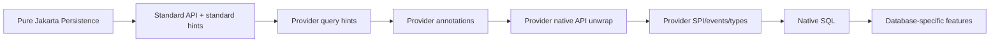
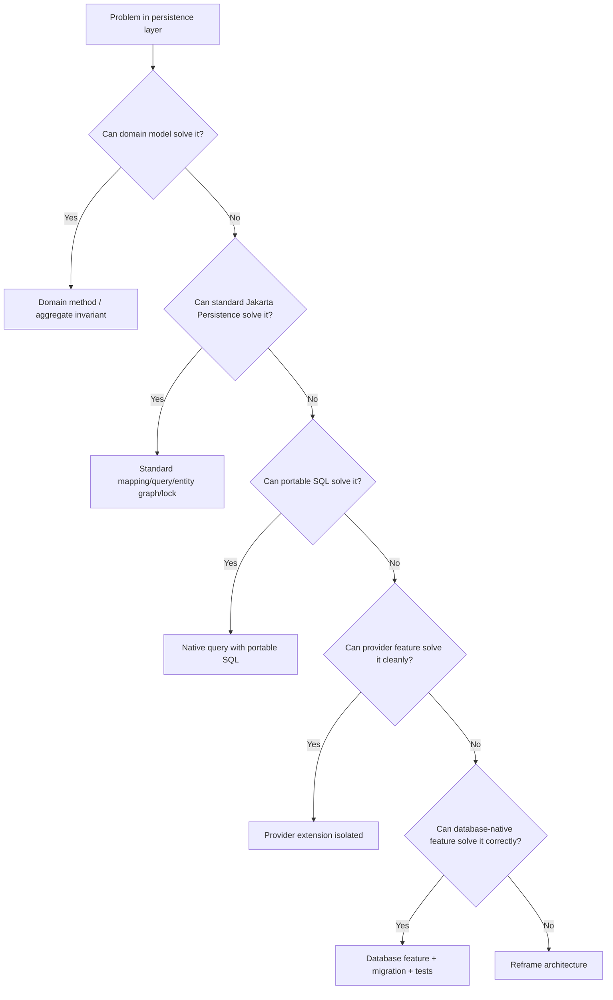
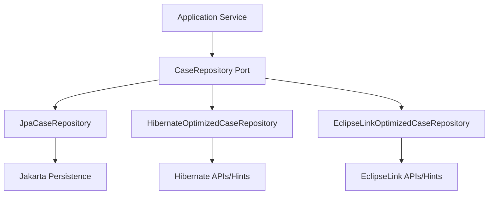
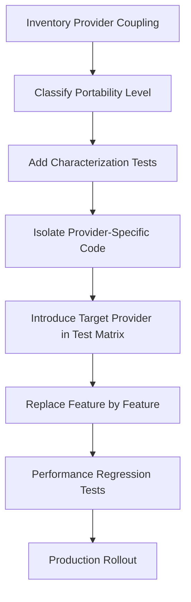

------
title: Learn Java Persistence, Database Integration, JPA, Hibernate ORM & EclipseLink - Part 026
description: Provider portability and escape hatches: when to stay within Jakarta Persistence, when to use provider extensions, when to drop to SQL, how to isolate lock-in, and how to design migration-safe persistence boundaries.
series: learn-java-persistence
seriesTitle: Learn Java Persistence, Database Integration, JPA, Hibernate ORM & EclipseLink
order: 26
partTitle: Provider Portability and Escape Hatches
tags:
  - java
  - jakarta-persistence
  - jpa
  - hibernate
  - eclipselink
  - portability
  - escape-hatch
  - architecture
  - provider-specific
  - native-sql
  - migration
  - advanced
  - series
date: 2026-06-27
---

# Part 026 — Provider Portability and Escape Hatches

> Target: setelah membaca part ini, kamu bisa membuat keputusan sadar: kapan tetap di Jakarta Persistence standar, kapan memakai fitur provider seperti Hibernate/EclipseLink, kapan turun ke SQL/database-native, dan bagaimana mengisolasi lock-in agar sistem tetap bisa dirawat selama bertahun-tahun.

Portability bukan tujuan absolut. Sistem production tidak menang karena “100% portable” jika performanya buruk, query-nya tidak ekspresif, atau domain constraint-nya bocor. Sebaliknya, sistem juga tidak sehat jika setiap repository penuh annotation/hint provider tanpa struktur.

Tujuan kita:

> Maksimalkan clarity, correctness, performance, and operability. Minimalkan lock-in yang tidak disadari.

---

## 1. Mental Model: Portability adalah Spectrum

Jangan berpikir binary: portable atau tidak. Portability adalah spectrum.



Semakin ke kanan:

1. Capability biasanya naik.
2. Portability turun.
3. Test burden naik.
4. Documentation obligation naik.
5. Migration cost naik.

Tidak ada yang salah dengan sisi kanan. Yang salah adalah tidak sadar sedang berada di sisi kanan.

---

## 2. Decision Frame: Empat Kontrak Persistence

Setiap persistence decision menyentuh empat kontrak:

| Kontrak | Pertanyaan |
|---|---|
| Domain contract | Invariant bisnis apa yang harus benar? |
| Persistence contract | State apa yang harus disimpan dan dimuat? |
| Provider contract | Behavior ORM apa yang diasumsikan? |
| Database contract | Constraint, index, lock, SQL feature apa yang dipakai? |

Contoh regulatory case escalation:

```text
Domain contract:
Only UNDER_REVIEW cases can be escalated.

Persistence contract:
Case status and statusChangedAt must be saved atomically.

Provider contract:
Optimistic version update must detect concurrent status modification.

Database contract:
case_id primary key, version column, status constraint/index exist.
```

Jika kamu tidak bisa memisahkan empat kontrak ini, kamu akan sulit menentukan apakah sebuah solusi harus memakai JPA, provider feature, atau database feature.

---

## 3. The Escape Hatch Ladder

Gunakan ladder ini dari atas ke bawah. Jangan langsung turun ke provider/database-specific feature kecuali ada alasan.



Rule:

> Escape hatch yang benar bukan yang paling canggih. Escape hatch yang benar adalah yang paling lokal, paling jelas, paling bisa dites, dan paling mudah dihapus.

---

## 4. Level 0: Pure Jakarta Persistence

Tetap di standar jika kebutuhan bisa diekspresikan dengan:

1. Entity mapping standar.
2. JPQL.
3. Criteria API.
4. Entity graph.
5. Standard locking.
6. Standard lifecycle callback.
7. Standard `AttributeConverter`.
8. Standard cache annotations/modes.
9. Standard schema validation/generation properties.

Contoh portable:

```java
@Entity
public class EnforcementCase {
    @Id
    private UUID id;

    @Version
    private long version;

    @Enumerated(EnumType.STRING)
    private CaseStatus status;

    @ManyToOne(fetch = FetchType.LAZY)
    private RegulatedParty regulatedParty;
}
```

Portable query:

```java
public List<EnforcementCase> findOpenCases(UUID partyId) {
    return em.createQuery("""
        select c
        from EnforcementCase c
        where c.regulatedParty.id = :partyId
          and c.status in :statuses
        order by c.createdAt desc
        """, EnforcementCase.class)
        .setParameter("partyId", partyId)
        .setParameter("statuses", List.of(CaseStatus.NEW, CaseStatus.UNDER_REVIEW))
        .getResultList();
}
```

Use standard first when:

1. Query shape is simple.
2. Performance is acceptable.
3. Behavior is clear.
4. Team knowledge is broad.
5. Provider migration is plausible.

---

## 5. Level 1: Standard API with Provider Behavior Awareness

Kadang kode kita terlihat standar, tetapi behavior-nya tetap provider-specific.

Contoh:

```java
@ManyToOne(fetch = FetchType.LAZY)
private RegulatedParty regulatedParty;
```

Secara standar, kita mendeklarasikan lazy. Tetapi implementasi lazy loading, proxy/enhancement/weaving, dan edge case-nya berbeda antar provider.

Contoh lain:

```java
@EntityGraph(attributePaths = {"regulatedParty", "latestAssessment"})
List<EnforcementCase> findByStatus(CaseStatus status);
```

Entity graph standar, tetapi SQL shape bisa berbeda antar provider.

Guideline:

> Kode portable tetap perlu integration test di provider target. Portability API tidak menjamin identical SQL/performance behavior.

---

## 6. Level 2: Query Hints

Query hints adalah escape hatch ringan.

Contoh standard-ish provider hint:

```java
TypedQuery<EnforcementCase> query = em.createQuery("""
    select c
    from EnforcementCase c
    where c.status = :status
    """, EnforcementCase.class);

query.setParameter("status", CaseStatus.UNDER_REVIEW);
query.setHint("org.hibernate.readOnly", true);
```

Atau EclipseLink:

```java
query.setHint("eclipselink.batch", "c.regulatedParty");
```

Masalah:

1. String hint raw mudah typo.
2. Hint bisa tersebar tanpa governance.
3. Behavior provider berbeda.
4. Hint sering tidak terlihat di code review sebagai architecture decision.

### 6.1 Hint Isolation Pattern

Jangan lakukan ini di service:

```java
caseRepository.findOpenCases()
    .setHint("eclipselink.batch", "c.events"); // bocor ke layer salah
```

Buat repository method yang menyatakan kebutuhan use case:

```java
public interface CaseReadRepository {
    List<CaseSummaryRow> findOpenCaseSummaries(CaseSummaryFetchPlan fetchPlan);
}
```

Implementation provider-specific:

```java
final class EclipseLinkCaseReadRepository implements CaseReadRepository {
    @PersistenceContext
    private EntityManager em;

    @Override
    public List<CaseSummaryRow> findOpenCaseSummaries(CaseSummaryFetchPlan fetchPlan) {
        TypedQuery<CaseSummaryRow> query = em.createQuery("""
            select new com.example.CaseSummaryRow(
                c.id,
                c.caseNumber,
                c.status,
                p.legalName
            )
            from EnforcementCase c
            join c.regulatedParty p
            where c.status in :statuses
            order by c.createdAt desc
            """, CaseSummaryRow.class);

        query.setParameter("statuses", List.of(CaseStatus.NEW, CaseStatus.UNDER_REVIEW));
        return query.getResultList();
    }
}
```

Notice: sometimes a provider hint is avoided by choosing a better projection.

---

## 7. Level 3: Provider Annotations

Provider annotations change domain model source code.

Hibernate examples:

```java
@org.hibernate.annotations.NaturalId
private String caseNumber;
```

```java
@org.hibernate.annotations.SoftDelete
private boolean deleted;
```

EclipseLink examples:

```java
@org.eclipse.persistence.annotations.BatchFetch
private List<CaseEvent> events;
```

```java
@org.eclipse.persistence.annotations.AdditionalCriteria("this.deleted = false")
public class EnforcementCase { }
```

Provider annotations are not bad. But they are more invasive than query hints because the entity class now depends on provider package.

### 7.1 Annotation Decision Checklist

```text
[ ] Does standard Jakarta Persistence lack this capability?
[ ] Is this behavior truly part of the entity model, not one query use case?
[ ] Will all runtimes use this provider?
[ ] Is migration cost acceptable?
[ ] Is SQL/cache behavior tested?
[ ] Is the provider package allowed in domain module?
[ ] Is there an ADR explaining the choice?
```

Rule:

> Provider annotation on entity is a stronger commitment than provider hint in repository.

---

## 8. Level 4: `unwrap` to Native Provider API

Jakarta Persistence allows access to provider-specific APIs via `unwrap`.

Hibernate example:

```java
import org.hibernate.Session;

Session session = em.unwrap(Session.class);

List<EnforcementCase> cases = session
    .byMultipleIds(EnforcementCase.class)
    .multiLoad(ids);
```

EclipseLink example conceptually:

```java
import org.eclipse.persistence.jpa.JpaEntityManager;

JpaEntityManager eclipselinkEm = em.unwrap(JpaEntityManager.class);
```

`unwrap` is acceptable for:

1. Diagnostics.
2. Batch loading feature not available in standard JPA.
3. Accessing provider statistics/session behavior.
4. Controlled infrastructure-level feature.

Avoid `unwrap` in:

1. Domain services.
2. Application use cases.
3. Controllers/API layer.
4. Shared library API.
5. Code paths where provider migration is likely.

### 8.1 Native API Adapter Pattern

```java
public interface CaseBulkLoader {
    Map<UUID, EnforcementCase> loadByIds(Collection<UUID> ids);
}
```

Hibernate implementation:

```java
final class HibernateCaseBulkLoader implements CaseBulkLoader {
    private final EntityManager em;

    HibernateCaseBulkLoader(EntityManager em) {
        this.em = em;
    }

    @Override
    public Map<UUID, EnforcementCase> loadByIds(Collection<UUID> ids) {
        Session session = em.unwrap(Session.class);

        return session.byMultipleIds(EnforcementCase.class)
            .multiLoad(new ArrayList<>(ids))
            .stream()
            .collect(Collectors.toMap(EnforcementCase::getId, Function.identity()));
    }
}
```

Portable fallback:

```java
final class JpaCaseBulkLoader implements CaseBulkLoader {
    private final EntityManager em;

    @Override
    public Map<UUID, EnforcementCase> loadByIds(Collection<UUID> ids) {
        return em.createQuery("""
            select c
            from EnforcementCase c
            where c.id in :ids
            """, EnforcementCase.class)
            .setParameter("ids", ids)
            .getResultStream()
            .collect(Collectors.toMap(EnforcementCase::getId, Function.identity()));
    }
}
```

Provider feature is isolated behind a small interface.

---

## 9. Level 5: Provider SPI, Events, and Custom Types

Provider SPI gives power and risk.

Examples:

| Provider | Feature category | Typical use |
|---|---|---|
| Hibernate | custom type | JSON, array, database-specific type |
| Hibernate | event listener/interceptor | audit/internal persistence hook |
| Hibernate | multitenancy SPI | tenant connection/schema strategy |
| EclipseLink | descriptor customizer | mapping/cache/custom behavior |
| EclipseLink | session customizer | runtime session configuration |
| EclipseLink | descriptor events | persistence lifecycle integration |

SPI usage requires stronger guardrails:

1. Dedicated infrastructure module.
2. Provider-specific tests.
3. Startup validation.
4. Monitoring/logging.
5. Version upgrade test plan.
6. ADR.
7. Rollback/disable strategy.

Anti-pattern:

```text
Business rule hidden in provider event listener.
```

Why bad?

1. Rule is invisible to application flow.
2. Hard to test without provider runtime.
3. Flush timing controls execution.
4. Bulk/native operations may bypass it.
5. Migration breaks semantics.

Provider SPI should implement persistence mechanics, not business policy.

---

## 10. Level 6: Native SQL

Native SQL is often the correct tool. Use it when:

1. Query shape is relational, not object graph oriented.
2. Window functions, CTEs, recursive queries, lateral joins, or vendor functions are needed.
3. Reporting/read model query is complex.
4. Bulk operation is intentional.
5. Database optimizer needs precise SQL.
6. ORM-generated SQL is unstable or inefficient.

Example DTO projection:

```java
public record CaseAgingBucketRow(
    String region,
    String status,
    long count,
    BigDecimal averageAgeDays
) {}
```

```java
@SuppressWarnings("unchecked")
public List<CaseAgingBucketRow> findCaseAgingBuckets() {
    List<Object[]> rows = em.createNativeQuery("""
        select
            p.region as region,
            c.status as status,
            count(*) as case_count,
            avg(extract(day from current_timestamp - c.created_at)) as avg_age_days
        from enforcement_case c
        join regulated_party p on p.id = c.party_id
        where c.closed_at is null
        group by p.region, c.status
        order by p.region, c.status
        """).getResultList();

    return rows.stream()
        .map(r -> new CaseAgingBucketRow(
            (String) r[0],
            (String) r[1],
            ((Number) r[2]).longValue(),
            toBigDecimal(r[3])
        ))
        .toList();
}
```

But prefer explicit row mapping helper rather than scattering `Object[]` casts.

### 10.1 Native SQL Boundary Rules

```text
[ ] Native SQL returns DTO/projection unless entity identity semantics are required
[ ] SQL file/name is stable and searchable
[ ] Parameters are bound, not concatenated
[ ] Result mapping is tested
[ ] Database indexes support the SQL
[ ] Query plan is reviewed for critical paths
[ ] Persistence context staleness after bulk/native write is handled
[ ] Vendor-specific syntax is documented
```

---

## 11. Level 7: Database-Specific Features

Database features may be more correct than ORM features.

Examples:

| Need | Database feature candidate |
|---|---|
| Prevent duplicate active license | partial unique index |
| Fast case search | full-text index/search extension |
| Audit immutable history | trigger + append-only table, or app outbox/audit table |
| Enforce valid state transition | check constraint plus app logic, sometimes trigger |
| Multi-tenant isolation | schema/database per tenant, RLS |
| Time-series event reporting | partitioning/materialized views |
| Concurrent queue claiming | `select ... for update skip locked` |

Example partial unique index:

```sql
create unique index uq_active_license_number
on regulated_license (license_number)
where revoked_at is null;
```

This cannot be represented portably in JPA mapping. That is fine. Put it in migration.

Rule:

> If the database is the only place that can guarantee an invariant under concurrency, use the database.

---

## 12. Portability Taxonomy

Classify every non-standard decision.

| Category | Example | Migration difficulty | Governance |
|---|---|---:|---|
| P0: Pure standard | JPQL, `@EntityGraph`, `@Version` | low | normal review |
| P1: Standard API, provider behavior sensitive | lazy loading, entity graph SQL shape | low-medium | integration tests |
| P2: Provider hint | batch/fetch/cache hint | medium | repository isolation |
| P3: Provider annotation | `@NaturalId`, `@BatchFetch` | medium-high | ADR + tests |
| P4: Native provider API | `unwrap(Session.class)` | high | adapter interface |
| P5: Provider SPI | custom type/listener/customizer | high | infra module + ADR |
| D1: Portable native SQL | ANSI-ish SQL projection | medium | SQL tests |
| D2: Database-specific SQL | CTE/window/vendor functions | medium-high | migration docs |
| D3: Database infrastructure feature | RLS/partitioning/triggers | high | ops + DBA ownership |

Add this category to code review notes or ADR.

---

## 13. Architecture Pattern: Persistence Port + Provider Adapter

Use ports for behavior that may vary by provider.



Example:

```java
public interface CaseAssignmentRepository {
    Optional<CaseAssignmentView> findCurrentAssignment(UUID caseId);
    void assignCase(UUID caseId, UUID officerId, Instant assignedAt);
}
```

Application service does not know whether implementation uses:

1. JPQL.
2. Entity graph.
3. Native SQL.
4. Hibernate hint.
5. EclipseLink descriptor trick.
6. Database function.

This isolation keeps the application stable while persistence implementation evolves.

---

## 14. Anti-Pattern: Generic Repository Everywhere

A generic repository seems portable:

```java
public interface GenericRepository<T, ID> {
    T save(T entity);
    Optional<T> findById(ID id);
    List<T> findAll();
    void delete(T entity);
}
```

But for complex persistence it hides the wrong things:

1. Fetch plan.
2. Locking mode.
3. Transaction expectation.
4. Projection shape.
5. Consistency boundary.
6. Bulk operation semantics.
7. Provider-specific optimization.

Better:

```java
public interface EnforcementCaseRepository {
    Optional<EnforcementCase> findForCommand(UUID caseId, LockIntent lockIntent);
    List<CaseQueueRow> findQueueRows(CaseQueueFilter filter, PageRequest page);
    void appendEvent(UUID caseId, CaseEvent event);
    boolean tryEscalate(UUID caseId, long expectedVersion, Instant now);
}
```

This interface expresses use cases, not CRUD mechanics.

---

## 15. Fetch Plan Portability

Fetch plan is where portability often lies.

| Requirement | Portable option | Provider-specific option | Better alternative sometimes |
|---|---|---|---|
| Load parent + many-to-one | JPQL join fetch/entity graph | provider join hint | DTO projection |
| Avoid N+1 for collections | entity graph/manual query | batch fetch/subselect fetch | explicit child query |
| Large read-only table | DTO projection | read-only entity/cache hint | materialized view |
| Wide entity subset | DTO projection | fetch group | read model table |
| API response shape | DTO projection | lazy loading serialization | never serialize entity |

Rule:

> Fetch plan should be use-case explicit. Provider defaults are not architecture.

---

## 16. Locking Portability

Standard JPA supports optimistic and pessimistic locks, but real behavior depends on database and provider SQL generation.

Portable baseline:

```java
EnforcementCase c = em.find(
    EnforcementCase.class,
    caseId,
    LockModeType.OPTIMISTIC
);
```

Pessimistic:

```java
EnforcementCase c = em.find(
    EnforcementCase.class,
    caseId,
    LockModeType.PESSIMISTIC_WRITE,
    Map.of("jakarta.persistence.lock.timeout", 1_000)
);
```

Provider/database-specific variations:

1. Lock timeout support.
2. `nowait` semantics.
3. `skip locked` queue processing.
4. Deadlock detection timing.
5. Lock scope across joined tables.

For queue claiming, native SQL may be clearer:

```sql
select id
from enforcement_case
where status = 'UNDER_REVIEW'
order by priority desc, created_at asc
for update skip locked
limit 50;
```

This is not portable across all databases, but it may be the correct operational design.

---

## 17. Bulk Write Portability

JPQL bulk update/delete is standard, but bypasses persistence context state synchronization semantics.

Example:

```java
int updated = em.createQuery("""
    update EnforcementCase c
    set c.status = :expired
    where c.status = :pending
      and c.responseDueAt < :now
    """)
    .setParameter("expired", CaseStatus.EXPIRED)
    .setParameter("pending", CaseStatus.PENDING_RESPONSE)
    .setParameter("now", now)
    .executeUpdate();
```

After bulk update:

```java
em.clear();
```

or ensure no affected entity remains managed.

Native bulk write may be needed for:

1. Large updates.
2. Join-based updates.
3. Partition-aware updates.
4. Database-specific performance.
5. Returning updated rows.

Rule:

> Bulk write is already an escape hatch from object-level unit-of-work. Treat it like a separate consistency operation.

---

## 18. Type Mapping Portability

Type mapping is a common lock-in source.

| Type need | Portable approach | Provider/database-specific approach |
|---|---|---|
| Enum | `EnumType.STRING` | database enum type |
| Money | embeddable amount/currency | custom type |
| JSON | string + converter | JSON/JSONB custom type |
| Array | element collection | database array type |
| Range | embeddable start/end | database range type |
| Geography | lat/long embeddable | PostGIS geometry |

Example portable money:

```java
@Embeddable
public record MoneyAmount(
    BigDecimal amount,
    String currency
) {}
```

Example provider/database-specific JSON can be valid, but isolate:

```java
@Entity
public class CaseRiskSnapshot {
    @Id
    private UUID id;

    // provider-specific mapping should be documented
    private RiskAssessmentPayload payload;
}
```

Ask:

```text
[ ] Is this field queried by database?
[ ] Is indexing needed?
[ ] Is schema evolution controlled?
[ ] Is JSON structure versioned?
[ ] Can this be an owned child table instead?
```

---

## 19. Cache Portability

Jakarta Persistence defines cache interfaces and annotations, but provider cache behavior varies widely.

Portable-ish:

```java
@Cacheable(true)
@Entity
public class RegulationCode {
    @Id
    private String code;
}
```

Provider-specific:

```java
@org.hibernate.annotations.Cache(usage = CacheConcurrencyStrategy.READ_ONLY)
```

```java
@org.eclipse.persistence.annotations.Cache
```

Cache decisions must be based on data volatility, not annotation convenience.

| Data | Cache? | Reason |
|---|---|---|
| Regulation code | yes, usually | low volatility |
| Enforcement case | usually no | active mutable workflow |
| Case assignment | no | correctness/security-sensitive |
| User permission | dangerous | stale authorization risk |
| Audit event | rarely needed | append-only, query-specific |

---

## 20. Exception Portability

Different providers throw different exception subclasses/wrapping. Frameworks like Spring translate many persistence exceptions, but not all semantics become portable.

Design guideline:

1. Translate persistence exceptions at repository/application boundary.
2. Do not expose provider exception to domain layer.
3. Detect constraint violations by stable constraint names if possible.
4. Treat optimistic lock exception as retryable or conflict response.
5. Treat unknown persistence exception as transaction-failed and discard context.

Example:

```java
public final class DuplicateCaseNumberException extends RuntimeException {
    public DuplicateCaseNumberException(String caseNumber, Throwable cause) {
        super("Duplicate case number: " + caseNumber, cause);
    }
}
```

Repository boundary:

```java
try {
    em.persist(caseEntity);
    em.flush();
} catch (PersistenceException ex) {
    if (isUniqueConstraintViolation(ex, "uq_enforcement_case_case_number")) {
        throw new DuplicateCaseNumberException(caseEntity.getCaseNumber(), ex);
    }
    throw ex;
}
```

---

## 21. Migration Strategy Between Providers

Provider migration is rarely simple. Plan by categories.

### 21.1 Inventory

Search for:

```text
org.hibernate
org.eclipse.persistence
hibernate.
eclipselink.
unwrap(
setHint(
@NamedNativeQuery
@SqlResultSetMapping
@Formula
@Filter
@NaturalId
@BatchFetch
@AdditionalCriteria
@Customizer
```

Classify each hit:

| Finding | Category | Action |
|---|---|---|
| Provider import in entity | P3 | replace or isolate |
| Provider hint in repository | P2 | map to target equivalent or remove |
| `unwrap` in service | P4 leak | move behind adapter |
| Native SQL | D1/D2 | verify dialect compatibility |
| Custom type | P5/D2 | rewrite mapping |
| Cache annotation | P3 | redesign cache policy |

### 21.2 Migration Phases



Characterization tests are critical. Before changing provider, freeze expected behavior:

1. SQL count for key use cases.
2. Result shape.
3. Lazy loading behavior.
4. Lock conflict behavior.
5. Cache invalidation behavior.
6. Exception translation.
7. Transaction rollback behavior.

---

## 22. Database Migration vs Provider Migration

Do not mix provider migration and database migration unless forced.

Provider migration changes:

1. SQL generation.
2. Fetch behavior.
3. Lazy loading.
4. Cache behavior.
5. Exception types.
6. DDL generation/validation behavior.
7. Query parser behavior.

Database migration changes:

1. SQL dialect.
2. Type mapping.
3. Locking behavior.
4. Index behavior.
5. Constraint behavior.
6. Transaction isolation semantics.
7. Execution plans.

Doing both at once creates too many variables.

Rule:

> First stabilize schema and behavior. Then change provider. Or first change provider on same database. Avoid double migration.

---

## 23. The Provider Boundary Package

Organize code to reveal coupling.

```text
com.example.caseapp.persistence
  ├── model/                 # entities, mostly standard JPA
  ├── repository/            # repository ports/interfaces
  ├── jpa/                   # standard JPA implementations
  ├── hibernate/             # Hibernate-specific adapters
  ├── eclipselink/           # EclipseLink-specific adapters
  ├── nativequery/           # SQL projections/read models
  └── migration/             # Flyway/Liquibase scripts
```

Build rule examples:

```text
[ ] domain package must not import jakarta.persistence if using strict persistence ignorance
[ ] application package must not import org.hibernate or org.eclipse.persistence
[ ] provider package may import provider APIs
[ ] entity package may import provider annotations only with ADR exception
[ ] repository implementation owns query hints
```

Even if you allow JPA annotations in entities, still prevent provider imports from spreading casually.

---

## 24. Testing Strategy for Escape Hatches

| Escape hatch | Required test |
|---|---|
| Query hint | SQL count/shape test |
| Provider annotation | mapping bootstrap + behavior test |
| Native API unwrap | adapter unit/integration test |
| Custom type | round-trip persistence test |
| Native SQL projection | result mapping + plan review |
| Bulk update | stale context test |
| Database constraint | migration test + violation test |
| Cache | stale/read consistency test |
| Locking | concurrent transaction test |

Example stale context test:

```java
@Test
void bulkUpdateRequiresClearingPersistenceContext() {
    EnforcementCase c = em.find(EnforcementCase.class, caseId);

    int updated = em.createQuery("""
        update EnforcementCase c
        set c.status = :closed
        where c.id = :id
        """)
        .setParameter("closed", CaseStatus.CLOSED)
        .setParameter("id", caseId)
        .executeUpdate();

    assertThat(updated).isEqualTo(1);

    // c may still hold stale in-memory state here
    em.clear();

    EnforcementCase reloaded = em.find(EnforcementCase.class, caseId);
    assertThat(reloaded.getStatus()).isEqualTo(CaseStatus.CLOSED);
}
```

---

## 25. Operational Review Before Using an Escape Hatch

Ask operational questions, not only code questions.

```text
[ ] Can on-call engineers see the SQL?
[ ] Can we identify slow queries by repository/use case?
[ ] Are lock waits/deadlocks observable?
[ ] Does the feature behave the same in CI and production?
[ ] Does it depend on bytecode enhancement/weaving?
[ ] Does it affect cache invalidation?
[ ] Does it affect transaction boundary?
[ ] Does it leak sensitive data in logs?
[ ] Can it be disabled or rolled back?
[ ] Does it have upgrade notes?
```

A feature that cannot be operated is not production-ready.

---

## 26. Case Study: Assignment Queue Claiming

Requirement:

> Officers claim the next eligible enforcement case. Two officers must not claim the same case.

### Option A: Pure JPA optimistic update

```java
@Transactional
public boolean tryAssign(UUID caseId, UUID officerId) {
    EnforcementCase c = em.find(EnforcementCase.class, caseId, LockModeType.OPTIMISTIC);

    if (!c.canBeAssigned()) {
        return false;
    }

    c.assignTo(officerId, clock.instant());
    return true;
}
```

Pros:

1. Portable.
2. Simple.
3. Good for low contention.

Cons:

1. Requires selecting candidate first.
2. Under high contention, many optimistic failures.
3. Queue fairness harder.

### Option B: Pessimistic lock

```java
EnforcementCase c = em.find(
    EnforcementCase.class,
    caseId,
    LockModeType.PESSIMISTIC_WRITE
);
```

Pros:

1. Standard API.
2. Prevents concurrent modification.

Cons:

1. Blocking behavior database-dependent.
2. Deadlock/timeout handling required.
3. Not ideal for “claim next N” queue.

### Option C: Native SQL `skip locked`

```sql
select id
from enforcement_case
where status = 'READY_FOR_ASSIGNMENT'
order by priority desc, created_at asc
for update skip locked
limit 1;
```

Pros:

1. Excellent for concurrent queue claiming.
2. Database handles row contention.
3. Operationally clear if DB supports it.

Cons:

1. Database-specific.
2. Needs dialect-specific tests.
3. Repository implementation is not portable.

Decision:

For high-throughput queue claiming, Option C may be the correct engineering choice. The portability cost is acceptable if isolated behind `CaseAssignmentRepository` and documented.

---

## 27. Case Study: Soft Delete

Requirement:

> Normal users must not see deleted cases. Auditors can see deleted cases. Deleted cases must remain for retention.

### Option A: Explicit predicate

```java
where c.deleted = false
```

Pros: portable, visible.

Cons: easy to forget.

### Option B: Provider hidden filter/criteria

Hibernate filter or EclipseLink additional criteria.

Pros: automatic.

Cons: hidden, bypass risk, provider lock-in.

### Option C: Database view

```sql
create view active_enforcement_case as
select *
from enforcement_case
where deleted = false;
```

Pros: central read abstraction.

Cons: write path and mapping complexity.

### Option D: Database row-level security

Pros: strong central enforcement.

Cons: database-specific and operationally complex.

Recommended design for regulatory systems:

1. Explicit repository methods for normal vs auditor views.
2. Database constraints/audit logging for retention.
3. Optional provider filter only as defense-in-depth, not sole security control.
4. Tests for bypass paths.

---

## 28. Case Study: JSON Risk Snapshot

Requirement:

> Store risk engine output exactly as produced, but query selected fields for operational dashboards.

Options:

| Option | Pros | Cons |
|---|---|---|
| Store JSON as text | portable | weak query/indexing |
| Provider custom JSON type | convenient | provider/db coupling |
| JSONB database type | strong query/index | database-specific |
| Normalize selected fields + raw JSON | balanced | more schema |

Recommended:

```text
risk_snapshot
  id
  case_id
  engine_version
  score
  category
  payload_json
  created_at
```

Use normalized columns for fields used in query/filter/index. Store raw JSON for audit/replay. This is better than making all analytics depend on provider JSON mapping.

---

## 29. Practical Decision Matrix

| Problem | Default | Escalate when | Likely escape hatch |
|---|---|---|---|
| Simple CRUD | standard JPA | performance issue | fetch plan/projection |
| API list response | DTO projection | complex SQL needed | native SQL projection |
| N+1 many-to-one | entity graph/join fetch | provider supports better batching | provider batch hint |
| N+1 collection | explicit child query | repeated pattern | batch/subselect provider feature |
| Queue claiming | optimistic locking | high contention | native `skip locked` |
| Soft delete | explicit predicate | consistency across many queries | provider filter/view/RLS |
| Audit history | app audit/outbox | deep entity history needed | Envers/database audit |
| JSON storage | text/converter | query/index JSON fields | DB JSON type/custom type |
| Multi-tenancy | schema/db strategy | logical tenant only | provider/database tenant feature |
| Complex reporting | projection | optimizer needs exact SQL | native SQL/materialized view |

---

## 30. Review Smells

Red flags in code review:

```text
[ ] Service layer calls entityManager.unwrap(...)
[ ] Controller accesses lazy entity graph
[ ] Provider hint string appears in many classes
[ ] Entity imports both Hibernate and EclipseLink packages
[ ] Native SQL writes without em.clear() or context boundary
[ ] Soft delete is hidden but no bypass/security tests exist
[ ] Cache annotation exists on mutable workflow entity
[ ] Generic repository returns entities for all read APIs
[ ] DTO projection duplicates business logic
[ ] Database constraint absent for concurrency-critical invariant
[ ] Provider-specific feature has no ADR
[ ] Test suite only validates happy-path data, not SQL/locking/cache behavior
```

---

## 31. Migration-Safe Coding Rules

Adopt these rules for long-lived systems:

1. Keep provider imports out of application services.
2. Keep provider hints inside repository implementation.
3. Prefer DTO projections for read APIs.
4. Prefer entity loading for command use cases.
5. Use database constraints for concurrency-critical invariants.
6. Treat cache as optimization, not source of truth.
7. Use native SQL for relational/reporting queries that ORM expresses poorly.
8. Name constraints explicitly in migrations.
9. Add characterization tests before provider upgrades.
10. Document every P3+ portability decision.

---

## 32. Top 1% Engineer Heuristic

A top engineer does not say:

> “Never use provider-specific features.”

They say:

> “What invariant are we protecting, what is the lowest-cost mechanism that protects it under production conditions, and where do we isolate the coupling?”

That is the difference between dogma and engineering.

---

## 33. Mastery Checklist

Kamu siap lanjut jika bisa menjawab:

```text
[ ] Apa bedanya API portability dan behavior portability?
[ ] Apa tujuh level escape hatch dari standar JPA ke database-specific feature?
[ ] Kapan provider hint lebih baik daripada provider annotation?
[ ] Kenapa unwrap harus diisolasi?
[ ] Kapan native SQL lebih benar daripada JPQL?
[ ] Kapan database constraint lebih benar daripada domain validation saja?
[ ] Bagaimana mengklasifikasikan provider coupling P0-P5/D1-D3?
[ ] Bagaimana membuat migration inventory dari Hibernate/EclipseLink coupling?
[ ] Kenapa generic repository bisa merusak fetch/lock semantics?
[ ] Apa test wajib untuk cache/locking/native SQL/custom type?
[ ] Bagaimana mendesain queue claiming yang benar di bawah concurrency?
[ ] Bagaimana soft delete seharusnya didesain untuk regulatory audit?
```

---

## 34. Ringkasan

Portability adalah alat, bukan agama. Jakarta Persistence memberi kontrak standar yang sangat berguna. Hibernate dan EclipseLink memberi fitur kuat yang sering diperlukan. Database memberi constraint dan capability yang kadang paling benar untuk menjaga data.

Urutan berpikirnya:

1. Pahami invariant.
2. Coba domain model.
3. Coba standar JPA.
4. Coba query/fetch plan portable.
5. Pakai provider feature jika benefit jelas.
6. Pakai native SQL/database feature jika itu mekanisme paling benar.
7. Isolasi coupling.
8. Test behavior.
9. Dokumentasikan exit strategy.

Prinsip akhir:

> Escape hatch yang sehat adalah escape hatch yang terlihat, terlokalisasi, dites, dan punya alasan arsitektur.

Di part berikutnya, kita akan masuk ke **Spring Data JPA and Repository Abstractions**: bagaimana abstraction membantu produktivitas, kapan ia menyembunyikan semantics penting, dan bagaimana mendesain repository yang tidak menjadi CRUD façade yang menipu.

---

## References

- Jakarta Persistence 3.2 Specification — https://jakarta.ee/specifications/persistence/3.2/
- Jakarta Persistence 3.2 API — https://jakarta.ee/specifications/persistence/3.2/apidocs/
- Hibernate ORM User Guide — https://docs.hibernate.org/stable/orm/userguide/html_single/
- EclipseLink JPA Extensions Reference — https://eclipse.dev/eclipselink/documentation/4.0/jpa/extensions/jpa-extensions.html
- EclipseLink 5.0 Release — https://eclipse.dev/eclipselink/releases/5.0.html
