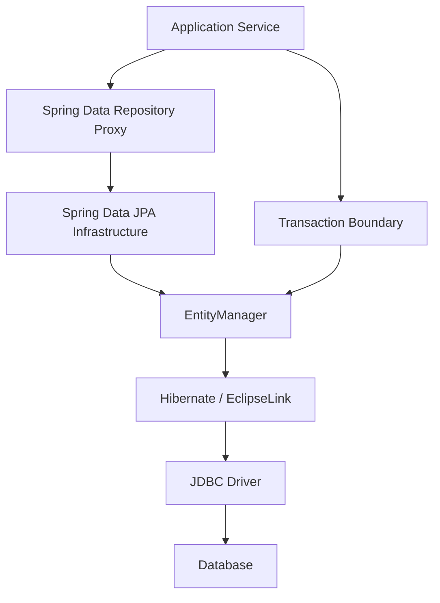
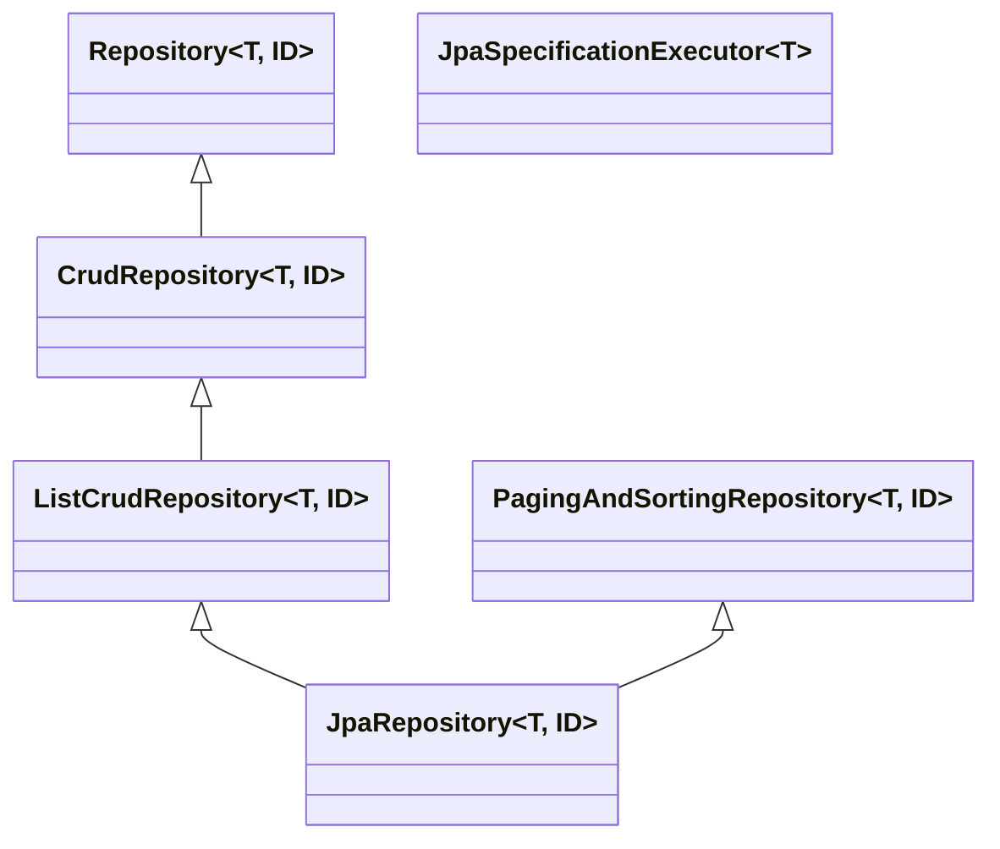

------
title: Learn Java Persistence, Database Integration, JPA, Hibernate ORM & EclipseLink - Part 027
description: Spring Data JPA as a repository abstraction: what it gives, what it hides, how query derivation, specifications, projections, transactions, auditing, locking, pagination, and custom repositories should be used in production-grade persistence design.
series: learn-java-persistence
seriesTitle: Learn Java Persistence, Database Integration, JPA, Hibernate ORM & EclipseLink
order: 27
partTitle: Spring Data JPA and Repository Abstractions
tags:
  - java
  - jakarta-persistence
  - jpa
  - spring-data-jpa
  - repository
  - specification
  - projections
  - pagination
  - transaction
  - architecture
  - advanced
  - series
date: 2026-06-27
---

# Part 027 — Spring Data JPA and Repository Abstractions

> Target: setelah membaca part ini, kamu bisa memakai Spring Data JPA sebagai productivity layer tanpa kehilangan kontrol atas transaction boundary, query semantics, fetch plan, aggregate boundary, provider behavior, dan database performance.

Spring Data JPA bukan ORM baru. Ia adalah abstraction layer di atas Jakarta Persistence provider seperti Hibernate atau EclipseLink. Ia sangat produktif karena membuat repository interface, query method, pagination, projection, auditing, dan custom implementation menjadi konsisten.

Tetapi abstraction yang produktif bisa menjadi berbahaya jika developer lupa bahwa di bawahnya tetap ada:

1. persistence context,
2. flush,
3. dirty checking,
4. JPQL/SQL,
5. transaction,
6. lock,
7. fetch plan,
8. provider-specific behavior,
9. database constraint.

Prinsip utama part ini:

> Spring Data JPA boleh menyederhanakan kode akses data, tetapi tidak boleh menyembunyikan desain persistence.

---

## 1. Mental Model: Spring Data JPA sebagai Adapter, Bukan Domain Layer

Spring Data JPA berada di antara application service dan Jakarta Persistence provider.



Jadi ketika kamu menulis:

```java
caseRepository.findByStatus(CaseStatus.UNDER_REVIEW);
```

itu bukan “method biasa”. Itu adalah deklarasi query yang akan diterjemahkan menjadi operasi persistence.

Lapisan yang terlibat:

| Layer | Tanggung Jawab |
|---|---|
| Repository interface | Kontrak akses data yang dilihat application service |
| Spring Data proxy | Membuat implementasi runtime untuk method repository |
| Query derivation / declared query | Menentukan JPQL/SQL yang dieksekusi |
| `EntityManager` | Mengelola persistence context, query, flush, lifecycle |
| Provider | Menerjemahkan entity/query menjadi SQL |
| Database | Menjamin constraint, lock, isolation, index, durability |

Failure mode terjadi ketika developer memperlakukan repository method seperti collection in-memory.

Repository method bukan:

```text
filter Java List
```

Repository method adalah:

```text
query contract + transaction participation + flush interaction + fetch behavior + database execution plan
```

---

## 2. What Spring Data JPA Actually Provides

Spring Data JPA menyediakan repository support untuk Jakarta Persistence API. Secara praktis, ia menyediakan:

1. repository interface implementation,
2. CRUD method,
3. pagination dan sorting,
4. query method derivation,
5. `@Query` untuk JPQL/native SQL,
6. projection,
7. specification,
8. query by example,
9. auditing,
10. locking metadata,
11. custom repository fragment,
12. integration dengan Spring transaction management.

Tetapi Spring Data JPA tidak menghilangkan kebutuhan memahami JPA.

Ia tidak otomatis menyelesaikan:

1. N+1 query,
2. wrong aggregate boundary,
3. wrong cascade,
4. detached entity bugs,
5. over-fetching,
6. under-fetching,
7. bad indexing,
8. race condition,
9. stale cache,
10. schema drift.

Jangan menjadikan Spring Data JPA sebagai alasan untuk berhenti membaca SQL log.

---

## 3. Repository Interface Hierarchy

Spring Data menyediakan beberapa level repository abstraction.



Secara desain:

| Interface | Kapan Dipakai |
|---|---|
| `Repository<T, ID>` | Ketika ingin expose method sangat terbatas |
| `CrudRepository<T, ID>` | CRUD dasar, tetapi hati-hati terlalu banyak method terbuka |
| `ListCrudRepository<T, ID>` | Varian yang mengembalikan `List` untuk beberapa operasi |
| `PagingAndSortingRepository<T, ID>` | Query page/sort sederhana |
| `JpaRepository<T, ID>` | Fitur JPA-specific seperti flush, batch delete, references |
| `JpaSpecificationExecutor<T>` | Dynamic criteria query composition |

Untuk production system, default terbaik sering bukan “pakai `JpaRepository` untuk semua entity”, melainkan:

```java
public interface CaseRepository extends Repository<EnforcementCase, CaseId> {

    Optional<EnforcementCase> findById(CaseId id);

    boolean existsByReferenceNo(CaseReferenceNo referenceNo);

    @Query("""
        select c
        from EnforcementCase c
        where c.status = :status
          and c.assignedTeamId = :teamId
        order by c.priority desc, c.createdAt asc
        """)
    List<EnforcementCase> findQueue(
            @Param("status") CaseStatus status,
            @Param("teamId") TeamId teamId,
            Pageable pageable
    );

    EnforcementCase save(EnforcementCase entity);
}
```

Kenapa membatasi method?

Karena repository adalah contract. Jika semua caller bisa memanggil `deleteAll`, `findAll`, `flush`, atau `saveAndFlush`, kamu kehilangan governance.

Top 1% persistence engineer tidak hanya bertanya “bisa dipanggil atau tidak?”. Mereka bertanya:

> Apakah method ini boleh menjadi bagian dari domain persistence contract?

---

## 4. Repository Bukan Pengganti Aggregate Boundary

Kesalahan umum:

```java
interface CaseNoteRepository extends JpaRepository<CaseNote, Long> {}
interface CaseAttachmentRepository extends JpaRepository<CaseAttachment, Long> {}
interface CaseStatusHistoryRepository extends JpaRepository<CaseStatusHistory, Long> {}
interface EnforcementCaseRepository extends JpaRepository<EnforcementCase, Long> {}
```

Jika `CaseNote`, `CaseAttachment`, dan `CaseStatusHistory` adalah child dalam aggregate `EnforcementCase`, repository publik untuk semuanya bisa merusak invariant.

Contoh invariant:

```text
Case note hanya boleh ditambah jika case belum CLOSED.
Status history harus selalu dibuat ketika case status berubah.
Attachment classified harus melewati virus scan dan access policy.
```

Jika child repository bisa dipanggil langsung, application service lain bisa bypass root invariant.

Desain yang lebih sehat:

```java
public interface EnforcementCaseRepository extends Repository<EnforcementCase, CaseId> {

    Optional<EnforcementCase> findById(CaseId id);

    EnforcementCase save(EnforcementCase enforcementCase);

    @Query("""
        select c
        from EnforcementCase c
        where c.status = :status
        order by c.createdAt asc
        """)
    Page<CaseQueueRow> findQueueRows(
            @Param("status") CaseStatus status,
            Pageable pageable
    );
}
```

Child mutation dilakukan melalui aggregate root:

```java
@Transactional
public void addNote(CaseId caseId, AddNoteCommand command) {
    EnforcementCase c = caseRepository.findById(caseId)
            .orElseThrow(() -> new CaseNotFoundException(caseId));

    c.addNote(command.authorId(), command.body(), clock.instant());

    // save() optional from pure JPA dirty checking perspective
    // but explicit save keeps repository abstraction consistent
    caseRepository.save(c);
}
```

Rule:

> Repository publik sebaiknya mengikuti aggregate root, bukan setiap table.

---

## 5. `save()` Is Not Always Insert, Not Always Update

Spring Data JPA `save()` terlihat sederhana:

```java
T saved = repository.save(entity);
```

Namun semantiknya bergantung pada apakah entity dianggap new atau existing.

Secara konsep, implementasi repository JPA akan memilih `persist` atau `merge` berdasarkan strategi deteksi new entity.

Konsekuensinya:

| Kondisi | Kemungkinan Operasi | Risiko |
|---|---|---|
| Entity baru tanpa id | `persist` | id generated setelah persist/flush tergantung strategy |
| Entity dengan id assigned | bisa dianggap existing | salah merge jika deteksi new buruk |
| Detached entity | `merge` | return value managed, argument tetap detached |
| Managed entity | tidak perlu save dari perspektif JPA | save bisa membingungkan intent |

Bug klasik:

```java
EnforcementCase detached = request.toEntity();
caseRepository.save(detached);
detached.escalate(); // BUG: detached object may not be managed result
```

Lebih aman:

```java
EnforcementCase managed = caseRepository.save(detached);
managed.escalate(...);
```

Tetapi desain yang lebih baik untuk update command adalah load-then-mutate:

```java
@Transactional
public void escalate(CaseId caseId, EscalateCaseCommand command) {
    EnforcementCase c = caseRepository.findById(caseId)
            .orElseThrow(() -> new CaseNotFoundException(caseId));

    c.escalate(command.reason(), command.actorId(), clock.instant());
}
```

Kenapa?

Karena update business command bukan “replace row”. Update business command adalah “mutate aggregate yang sudah ada sambil menjaga invariant”.

---

## 6. Query Derivation: Useful, But Keep It Boring

Spring Data JPA bisa membuat query dari nama method:

```java
List<EnforcementCase> findByStatusAndAssignedTeamIdOrderByCreatedAtAsc(
        CaseStatus status,
        TeamId teamId
);
```

Ini bagus untuk query sederhana.

Namun query derivation menjadi buruk ketika nama method berubah menjadi DSL panjang:

```java
findByStatusInAndAssignedTeamIdAndPriorityGreaterThanAndCreatedAtBeforeAndClosedAtIsNullOrderByPriorityDescCreatedAtAsc(...)
```

Rule praktis:

| Query | Teknik |
|---|---|
| 1–2 predicate sederhana | Derived method |
| Query domain penting | `@Query` dengan JPQL eksplisit |
| Query dinamis banyak filter | Specification / Criteria builder |
| Query read-heavy shape khusus | Projection / native SQL / view |
| Query performa kritikal | Explicit JPQL/native SQL + execution plan test |

Derived query cocok untuk:

```java
boolean existsByReferenceNo(CaseReferenceNo referenceNo);

Optional<EnforcementCase> findByReferenceNo(CaseReferenceNo referenceNo);

List<EnforcementCase> findTop50ByStatusOrderByCreatedAtAsc(CaseStatus status);
```

Derived query kurang cocok untuk:

1. complex join,
2. conditional filter,
3. query dengan fetch plan eksplisit,
4. query yang harus dioptimasi dengan index tertentu,
5. query yang punya meaning bisnis penting.

---

## 7. Declared JPQL with `@Query`

Untuk query yang punya makna bisnis, gunakan `@Query` agar intent terlihat.

```java
public interface EnforcementCaseRepository extends Repository<EnforcementCase, CaseId> {

    @Query("""
        select c
        from EnforcementCase c
        join c.assignedTeam t
        where c.status = :status
          and t.id = :teamId
          and c.riskScore >= :minimumRiskScore
        order by c.riskScore desc, c.createdAt asc
        """)
    Page<EnforcementCase> findHighRiskQueue(
            @Param("status") CaseStatus status,
            @Param("teamId") TeamId teamId,
            @Param("minimumRiskScore") int minimumRiskScore,
            Pageable pageable
    );
}
```

Keuntungan:

1. query explicit,
2. lebih mudah direview,
3. lebih mudah dites,
4. lebih mudah dikaitkan ke execution plan,
5. menghindari method name yang terlalu panjang.

Risiko:

1. tetap string-based,
2. refactor field tidak selalu aman,
3. count query untuk pagination kompleks bisa salah/mahal,
4. fetch join dengan paging berbahaya,
5. projection harus dijaga kompatibilitasnya.

Untuk paging dengan query kompleks, sering lebih baik tulis `countQuery` eksplisit.

```java
@Query(
    value = """
        select c
        from EnforcementCase c
        where c.status = :status
          and c.createdAt < :before
        order by c.createdAt asc
        """,
    countQuery = """
        select count(c)
        from EnforcementCase c
        where c.status = :status
          and c.createdAt < :before
        """
)
Page<EnforcementCase> findBacklog(
        @Param("status") CaseStatus status,
        @Param("before") Instant before,
        Pageable pageable
);
```

---

## 8. Native Query in Spring Data JPA

Native query boleh dipakai, tapi jangan menjadi default.

```java
@Query(
    value = """
        select
            c.id as caseId,
            c.reference_no as referenceNo,
            c.status as status,
            c.risk_score as riskScore,
            count(a.id) as openAlertCount
        from enforcement_case c
        left join alert a on a.case_id = c.id and a.status = 'OPEN'
        where c.assigned_team_id = :teamId
        group by c.id, c.reference_no, c.status, c.risk_score
        order by c.risk_score desc
        """,
    nativeQuery = true
)
List<CaseQueueNativeRow> findQueueNative(@Param("teamId") UUID teamId);
```

Gunakan native SQL ketika:

1. JPQL tidak mampu mengekspresikan query dengan jelas,
2. membutuhkan database-specific function,
3. butuh window function/CTE kompleks,
4. query read model lebih dekat ke SQL daripada entity graph,
5. performance plan harus sangat eksplisit.

Jangan gunakan native SQL untuk menutupi mapping yang buruk.

Decision rule:

```text
JPQL first for entity-centric queries.
Projection/native SQL for read models.
Database-native feature for correctness/performance only when justified.
```

---

## 9. Projections: Jangan Selalu Load Entity

Spring Data JPA mendukung projection. Ini penting untuk read endpoint, list screen, report, dashboard, dan queue.

Masalah umum:

```java
Page<EnforcementCase> page = caseRepository.findByStatus(UNDER_REVIEW, pageable);
return page.map(CaseListResponse::fromEntity);
```

Jika response hanya butuh 8 kolom, load entity penuh bisa menyebabkan:

1. over-fetching,
2. lazy initialization risk,
3. accidental N+1,
4. serialization leak,
5. persistence context bloat.

Gunakan projection:

```java
public record CaseQueueRow(
        UUID id,
        String referenceNo,
        CaseStatus status,
        int riskScore,
        Instant createdAt
) {}
```

JPQL constructor projection:

```java
@Query("""
    select new com.acme.caseapp.CaseQueueRow(
        c.id,
        c.referenceNo,
        c.status,
        c.riskScore,
        c.createdAt
    )
    from EnforcementCase c
    where c.status = :status
    order by c.riskScore desc, c.createdAt asc
    """)
Page<CaseQueueRow> findQueueRows(
        @Param("status") CaseStatus status,
        Pageable pageable
);
```

Projection choice:

| Projection | Cocok Untuk | Risiko |
|---|---|---|
| Entity | command/update use case | over-fetching untuk read API |
| Interface projection | simple read model | runtime proxy, nested projection can trigger joins |
| Record/class DTO | explicit response model | constructor coupling |
| Native projection | SQL-heavy read model | alias/type mapping risk |
| Database view | stable reporting/read model | migration/versioning overhead |

Rule:

> Command path load aggregate. Query path return projection.

---

## 10. Pagination: Offset Is Not Always Enough

Spring Data membuat paging mudah:

```java
Page<CaseQueueRow> page = repository.findQueueRows(status, PageRequest.of(0, 50));
```

Tetapi pagination punya konsekuensi.

`Page<T>` biasanya butuh count query.

```text
select data rows
select count(...)
```

Untuk list screen kecil, ini baik. Untuk table besar dengan filter kompleks, count query bisa sangat mahal.

Alternatif:

| Return Type | Arti |
|---|---|
| `Page<T>` | Data + total count |
| `Slice<T>` | Data + apakah ada next page |
| `List<T>` | Data saja |
| keyset/cursor model | Stable pagination untuk dataset besar |

Untuk queue regulatory yang terus berubah, offset pagination bisa tidak stabil:

```text
Page 1 loaded at 10:00:00
New high priority case inserted at 10:00:01
Page 2 loaded at 10:00:02
Rows can shift
```

Keyset pagination lebih stabil:

```java
@Query("""
    select new com.acme.caseapp.CaseQueueRow(
        c.id, c.referenceNo, c.status, c.riskScore, c.createdAt
    )
    from EnforcementCase c
    where c.status = :status
      and (
           c.riskScore < :lastRiskScore
        or (c.riskScore = :lastRiskScore and c.createdAt > :lastCreatedAt)
        or (c.riskScore = :lastRiskScore and c.createdAt = :lastCreatedAt and c.id > :lastId)
      )
    order by c.riskScore desc, c.createdAt asc, c.id asc
    """)
List<CaseQueueRow> findNextQueuePage(
        @Param("status") CaseStatus status,
        @Param("lastRiskScore") int lastRiskScore,
        @Param("lastCreatedAt") Instant lastCreatedAt,
        @Param("lastId") UUID lastId,
        Pageable limit
);
```

Key invariant:

> Ordering untuk pagination harus deterministic.

Jangan order hanya berdasarkan kolom non-unique seperti `createdAt`.

Tambahkan tie-breaker seperti `id`.

---

## 11. Sorting: Whitelist, Jangan Terima Field Mentah

Anti-pattern:

```java
@GetMapping("/cases")
Page<CaseQueueRow> search(@RequestParam String sort) {
    return repository.search(PageRequest.of(0, 50, Sort.by(sort)));
}
```

Masalah:

1. expose internal field name,
2. field mungkin bukan indexed,
3. nested property bisa menyebabkan join tak terduga,
4. sort tidak sesuai domain semantics,
5. raw sort menjadi contract API yang sulit diubah.

Lebih baik:

```java
public enum CaseQueueSort {
    RISK_DESC,
    OLDEST_FIRST,
    DEADLINE_ASC
}

public Sort toSort(CaseQueueSort sort) {
    return switch (sort) {
        case RISK_DESC -> Sort.by(
                Sort.Order.desc("riskScore"),
                Sort.Order.asc("createdAt"),
                Sort.Order.asc("id")
        );
        case OLDEST_FIRST -> Sort.by(
                Sort.Order.asc("createdAt"),
                Sort.Order.asc("id")
        );
        case DEADLINE_ASC -> Sort.by(
                Sort.Order.asc("dueAt"),
                Sort.Order.asc("id")
        );
    };
}
```

Sort bukan UI detail. Sort adalah database execution contract.

---

## 12. Specification Pattern in Spring Data JPA

`JpaSpecificationExecutor` memungkinkan dynamic query composition di atas Criteria API.

```java
public interface EnforcementCaseRepository
        extends Repository<EnforcementCase, CaseId>,
                JpaSpecificationExecutor<EnforcementCase> {

    EnforcementCase save(EnforcementCase entity);
}
```

Specification:

```java
public final class CaseSpecifications {

    private CaseSpecifications() {}

    public static Specification<EnforcementCase> hasStatus(CaseStatus status) {
        return (root, query, cb) -> status == null
                ? cb.conjunction()
                : cb.equal(root.get("status"), status);
    }

    public static Specification<EnforcementCase> assignedToTeam(UUID teamId) {
        return (root, query, cb) -> teamId == null
                ? cb.conjunction()
                : cb.equal(root.get("assignedTeamId"), teamId);
    }

    public static Specification<EnforcementCase> createdBetween(
            Instant from,
            Instant to
    ) {
        return (root, query, cb) -> {
            List<Predicate> predicates = new ArrayList<>();
            if (from != null) {
                predicates.add(cb.greaterThanOrEqualTo(root.get("createdAt"), from));
            }
            if (to != null) {
                predicates.add(cb.lessThan(root.get("createdAt"), to));
            }
            return cb.and(predicates.toArray(Predicate[]::new));
        };
    }
}
```

Composition:

```java
Specification<EnforcementCase> spec = Specification
        .where(CaseSpecifications.hasStatus(filter.status()))
        .and(CaseSpecifications.assignedToTeam(filter.teamId()))
        .and(CaseSpecifications.createdBetween(filter.from(), filter.to()));

Page<EnforcementCase> result = repository.findAll(spec, pageable);
```

Specification cocok untuk:

1. search screen,
2. admin filtering,
3. optional predicates,
4. reusable predicates,
5. controlled dynamic query.

Specification kurang cocok untuk:

1. highly optimized reporting query,
2. query yang butuh window function,
3. query dengan fetch plan kompleks,
4. projection-first read model jika API repository tidak mendukung dengan jelas,
5. query yang harus sangat stabil dan direview sebagai SQL plan.

---

## 13. Specification Governance

Specification bisa menjadi anti-pattern jika semua predicate tersebar tanpa kontrol.

Anti-pattern:

```java
Specification<EnforcementCase> spec = (root, query, cb) -> {
    // 200 lines of dynamic branching
};
```

Lebih baik pisahkan tiga layer:

```text
API Filter DTO
    ↓ validate + normalize
Domain Query Object
    ↓ convert
Specification Builder
    ↓ execute
Repository
```

Contoh:

```java
public record CaseSearchCriteria(
        Optional<CaseStatus> status,
        Optional<UUID> teamId,
        Optional<Instant> createdFrom,
        Optional<Instant> createdTo,
        CaseQueueSort sort
) {
    public CaseSearchCriteria {
        if (createdFrom.isPresent() && createdTo.isPresent()
                && !createdFrom.get().isBefore(createdTo.get())) {
            throw new IllegalArgumentException("createdFrom must be before createdTo");
        }
    }
}
```

Repository sebaiknya tidak menerima request DTO mentah.

```java
public Page<CaseQueueRow> search(CaseSearchCriteria criteria, Pageable pageable) {
    Specification<EnforcementCase> spec = CaseSpecBuilder.from(criteria);
    return repository.findAll(spec, pageable).map(CaseQueueRow::fromEntity);
}
```

Namun hati-hati: `.map(CaseQueueRow::fromEntity)` tetap load entity. Untuk read-heavy endpoint, custom repository dengan Criteria projection bisa lebih tepat.

---

## 14. Entity Graph in Spring Data JPA

Spring Data JPA mendukung entity graph melalui annotation repository method.

```java
@EntityGraph(attributePaths = {"assignedOfficer", "classification"})
Optional<EnforcementCase> findDetailedById(CaseId id);
```

Gunakan untuk use case yang membutuhkan entity root dengan association tertentu.

Jangan gunakan satu `findById` global yang selalu fetch semua relasi.

Lebih baik:

```java
Optional<EnforcementCase> findById(CaseId id);

@EntityGraph(attributePaths = {"notes", "attachments"})
@Query("select c from EnforcementCase c where c.id = :id")
Optional<EnforcementCase> findForCaseFileReview(@Param("id") CaseId id);

@EntityGraph(attributePaths = {"assignedOfficer", "riskAssessment"})
@Query("select c from EnforcementCase c where c.id = :id")
Optional<EnforcementCase> findForEscalationDecision(@Param("id") CaseId id);
```

Fetch plan harus dinamai berdasarkan use case, bukan struktur teknis.

Buruk:

```java
findWithNotesAndAttachmentsAndOfficerAndTeamById
```

Lebih baik:

```java
findForCaseFileReview
findForEscalationDecision
findForSupervisorDashboard
```

---

## 15. Locking Metadata

Spring Data JPA memungkinkan lock mode pada query method.

```java
@Lock(LockModeType.OPTIMISTIC_FORCE_INCREMENT)
@Query("select c from EnforcementCase c where c.id = :id")
Optional<EnforcementCase> findForEscalationUpdate(@Param("id") CaseId id);
```

Pessimistic example:

```java
@Lock(LockModeType.PESSIMISTIC_WRITE)
@QueryHints({
    @QueryHint(name = "jakarta.persistence.lock.timeout", value = "3000")
})
@Query("select q from WorkQueueItem q where q.id = :id")
Optional<WorkQueueItem> findForClaim(@Param("id") UUID id);
```

Review question:

1. Apakah lock benar-benar diperlukan?
2. Apakah lock mode sesuai failure mode?
3. Apakah timeout dikontrol?
4. Apakah index mendukung lock query?
5. Apakah retry policy ada?
6. Apakah deadlock dimonitor?

Jangan menambahkan `@Lock` karena “takut race condition”. Lock harus menjawab conflict scenario spesifik.

---

## 16. `@Modifying`: Bulk Update/Delete Bukan Entity Mutation

Spring Data JPA memakai `@Modifying` untuk query update/delete.

```java
@Modifying(clearAutomatically = true, flushAutomatically = true)
@Query("""
    update EnforcementCase c
    set c.status = :newStatus,
        c.updatedAt = :now
    where c.status = :oldStatus
      and c.createdAt < :cutoff
    """)
int expireOldCases(
        @Param("oldStatus") CaseStatus oldStatus,
        @Param("newStatus") CaseStatus newStatus,
        @Param("cutoff") Instant cutoff,
        @Param("now") Instant now
);
```

Bulk update bypasses normal entity lifecycle semantics:

1. dirty checking tidak dipakai,
2. entity callbacks bisa tidak berjalan seperti mutation biasa,
3. persistence context bisa stale,
4. optimistic version bisa tidak otomatis naik kecuali query mengubahnya,
5. domain invariant bisa dibypass.

Gunakan bulk operation untuk:

1. maintenance job,
2. administrative batch,
3. state transition massal yang sederhana,
4. expiry/cleanup,
5. performance-sensitive update yang sudah diproteksi constraint/test.

Jangan gunakan bulk update untuk command domain yang kompleks.

---

## 17. Transaction Boundary: Service First, Repository Second

Spring Data JPA punya transactional defaults. Tetapi boundary terbaik biasanya berada di application service.

```java
@Service
public class CaseEscalationService {

    private final EnforcementCaseRepository caseRepository;
    private final OutboxRepository outboxRepository;
    private final Clock clock;

    @Transactional
    public void escalate(CaseId caseId, EscalateCaseCommand command) {
        EnforcementCase c = caseRepository.findForEscalationDecision(caseId)
                .orElseThrow(() -> new CaseNotFoundException(caseId));

        CaseEscalated event = c.escalate(
                command.reason(),
                command.actorId(),
                clock.instant()
        );

        outboxRepository.save(OutboxMessage.from(event));
    }
}
```

Kenapa service-level transaction?

Karena unit of work biasanya mencakup lebih dari satu repository call:

1. load aggregate,
2. validate invariant,
3. mutate state,
4. append history,
5. write outbox,
6. maybe update queue row,
7. commit atomically.

Jika transaction hanya di repository method, kamu bisa punya beberapa persistence context/transaction yang tidak membentuk satu consistency boundary.

Rule:

> Repository adalah persistence operation boundary. Service adalah business unit-of-work boundary.

---

## 18. Read-Only Transaction Is a Hint, Not a Guardrail

`@Transactional(readOnly = true)` berguna untuk query.

```java
@Transactional(readOnly = true)
public Page<CaseQueueRow> search(CaseSearchCriteria criteria, Pageable pageable) {
    return caseReadRepository.search(criteria, pageable);
}
```

Namun jangan mengira read-only transaction otomatis mencegah semua write di semua database/provider configuration.

Gunakan read-only sebagai:

1. intent signal,
2. provider optimization hint,
3. driver/database hint jika didukung,
4. review marker.

Jangan gunakan read-only sebagai security policy.

Security dan write permission harus dikontrol di application authorization dan database privilege/constraint bila perlu.

---

## 19. Custom Repository Fragment

Ketika query terlalu kompleks untuk derived method/`@Query`/Specification, buat custom repository fragment.

Interface:

```java
public interface CaseSearchRepository {

    Page<CaseQueueRow> search(CaseSearchCriteria criteria, Pageable pageable);
}
```

Main repository:

```java
public interface EnforcementCaseRepository
        extends Repository<EnforcementCase, CaseId>, CaseSearchRepository {

    Optional<EnforcementCase> findById(CaseId id);

    EnforcementCase save(EnforcementCase c);
}
```

Implementation:

```java
@Repository
class CaseSearchRepositoryImpl implements CaseSearchRepository {

    @PersistenceContext
    private EntityManager entityManager;

    @Override
    public Page<CaseQueueRow> search(CaseSearchCriteria criteria, Pageable pageable) {
        CriteriaBuilder cb = entityManager.getCriteriaBuilder();

        CriteriaQuery<CaseQueueRow> query = cb.createQuery(CaseQueueRow.class);
        Root<EnforcementCase> root = query.from(EnforcementCase.class);

        List<Predicate> predicates = new ArrayList<>();
        criteria.status().ifPresent(status ->
                predicates.add(cb.equal(root.get("status"), status))
        );
        criteria.teamId().ifPresent(teamId ->
                predicates.add(cb.equal(root.get("assignedTeamId"), teamId))
        );

        query.select(cb.construct(
                CaseQueueRow.class,
                root.get("id"),
                root.get("referenceNo"),
                root.get("status"),
                root.get("riskScore"),
                root.get("createdAt")
        ));

        query.where(predicates.toArray(Predicate[]::new));
        query.orderBy(toOrders(criteria.sort(), root, cb));

        List<CaseQueueRow> rows = entityManager.createQuery(query)
                .setFirstResult((int) pageable.getOffset())
                .setMaxResults(pageable.getPageSize())
                .getResultList();

        long total = count(criteria);

        return new PageImpl<>(rows, pageable, total);
    }
}
```

Ini memberi kontrol penuh atas:

1. projection,
2. predicates,
3. count query,
4. hints,
5. fetch plan,
6. lock mode,
7. pagination.

Custom fragment adalah escape hatch yang lebih sehat daripada menjejalkan semua query ke nama method panjang.

---

## 20. Auditing: Useful Metadata, Not Domain History

Spring Data JPA auditing bisa mengisi metadata seperti:

1. created by,
2. created date,
3. last modified by,
4. last modified date.

Contoh:

```java
@Entity
@EntityListeners(AuditingEntityListener.class)
public class EnforcementCase {

    @CreatedDate
    private Instant createdAt;

    @LastModifiedDate
    private Instant updatedAt;

    @CreatedBy
    private UserId createdBy;

    @LastModifiedBy
    private UserId updatedBy;
}
```

Auditing cocok untuk technical metadata.

Tidak cukup untuk regulatory defensibility.

Untuk enforcement lifecycle, kamu biasanya butuh explicit domain history:

```java
@Entity
public class CaseStatusHistory {

    @Id
    private UUID id;

    @ManyToOne(optional = false)
    private EnforcementCase enforcementCase;

    @Enumerated(EnumType.STRING)
    private CaseStatus fromStatus;

    @Enumerated(EnumType.STRING)
    private CaseStatus toStatus;

    private String reason;
    private UserId actorId;
    private Instant changedAt;
}
```

Perbedaannya:

| Auditing | Domain History |
|---|---|
| Technical metadata | Business/legal evidence |
| Last change only | Full lifecycle trail |
| Generic | Domain-specific reason/actor/context |
| Bisa otomatis | Harus intentional |

Rule:

> Jangan mengganti audit trail domain dengan auditing annotation generik.

---

## 21. Domain Events from Aggregate Roots

Spring Data mendukung publikasi event dari aggregate root melalui mekanisme domain events. Ini berguna, tetapi harus dipakai dengan hati-hati.

Contoh conceptual aggregate:

```java
public class EnforcementCase extends AbstractAggregateRoot<EnforcementCase> {

    public void escalate(EscalationReason reason, UserId actorId, Instant now) {
        if (status != CaseStatus.UNDER_REVIEW) {
            throw new IllegalStateException("Only under-review case can be escalated");
        }

        status = CaseStatus.ESCALATED;
        escalatedAt = now;

        registerEvent(new CaseEscalated(id, reason, actorId, now));
    }
}
```

Caution:

1. domain event publication timing matters,
2. transaction commit timing matters,
3. listener failure semantics must be known,
4. external side effects should usually use outbox,
5. event should not become hidden persistence side effect.

Untuk integration event ke Kafka/SQS/RabbitMQ, gunakan outbox, bukan publish langsung dari transaction tanpa durability boundary.

---

## 22. Null Handling and Optional

Repository method harus jelas soal absence.

Good:

```java
Optional<EnforcementCase> findByReferenceNo(CaseReferenceNo referenceNo);

boolean existsByReferenceNo(CaseReferenceNo referenceNo);
```

Less good:

```java
EnforcementCase findByReferenceNo(String referenceNo); // null? exception? unique?
```

Rule:

1. `Optional<T>` untuk single result yang boleh tidak ada.
2. `List<T>` untuk multi result; empty list lebih baik daripada null.
3. Throw domain exception di service, bukan repository.
4. Jangan pakai `Optional` untuk collection.
5. Unique expectation harus didukung database unique constraint.

---

## 23. Exception Translation

Spring menerjemahkan banyak persistence exception menjadi hierarchy `DataAccessException`.

Ini membantu portability di service layer, tetapi jangan kehilangan detail operasional.

Contoh service:

```java
try {
    caseRepository.save(c);
} catch (DataIntegrityViolationException ex) {
    throw new DuplicateCaseReferenceException(c.referenceNo(), ex);
}
```

Jangan leak exception provider ke API.

Namun untuk observability, log root cause:

1. SQL state,
2. constraint name,
3. lock timeout/deadlock,
4. optimistic lock conflict,
5. connection acquisition failure.

Exception translation bukan pengganti domain error mapping.

---

## 24. Repository Method Naming as Architecture Documentation

Nama method repository harus menjelaskan use case persistence.

Buruk:

```java
findByIdWithAllRelations
getCaseData
query1
searchComplex
```

Lebih baik:

```java
findForEscalationDecision
findForCaseFileReview
findQueueRowsForSupervisor
claimNextAssignableCase
existsOpenCaseForSubject
```

Nama method yang baik mengungkap:

1. intent,
2. consistency need,
3. read/write path,
4. fetch plan,
5. lock expectation bila ada.

---

## 25. Anti-Patterns

### 25.1 Repository per Table

Jika semua table punya repository publik, aggregate invariant bocor.

### 25.2 `JpaRepository` Everywhere

Membuka terlalu banyak method mutasi tanpa governance.

### 25.3 `save()` as Update Command

Menerima entity dari request lalu `save()` berarti mengganti state tanpa invariant load.

### 25.4 Derived Query Name as Business Logic

Method name raksasa sulit direview dan rawan salah.

### 25.5 Entity Return for Every Read Endpoint

Over-fetching dan serialization leak.

### 25.6 Pageable Without Deterministic Sort

Pagination tidak stabil.

### 25.7 Dynamic Sort from Raw Request Field

Membocorkan internal model dan memicu query tidak terkontrol.

### 25.8 `@Transactional` Only on Repository

Unit of work bisnis bisa terpecah.

### 25.9 `@Modifying` for Domain State Transitions

Bulk update membypass aggregate invariant.

### 25.10 Hidden Fetch Plan

Method tampak sederhana tetapi diam-diam memicu query besar/N+1.

---

## 26. Production Repository Checklist

Gunakan checklist ini saat review repository.

| Area | Pertanyaan |
|---|---|
| Aggregate | Apakah repository hanya expose aggregate root? |
| Contract | Apakah method name menjelaskan use case? |
| Query | Apakah query sederhana, eksplisit, dan bisa direview? |
| Fetch | Apakah fetch plan jelas? |
| Projection | Apakah read endpoint perlu entity penuh? |
| Transaction | Apakah service mengontrol unit-of-work? |
| Locking | Apakah lock mode sesuai conflict scenario? |
| Pagination | Apakah ordering deterministic? |
| Sorting | Apakah sort whitelisted? |
| Bulk update | Apakah stale persistence context ditangani? |
| Exception | Apakah persistence exception dipetakan ke domain error? |
| Test | Apakah SQL/log/plan/query count diuji? |

---

## 27. Lab: Regulatory Case Queue Repository

Kita desain repository untuk case queue.

Requirement:

1. supervisor melihat queue by status/team,
2. rows harus ringan,
3. sorting terbatas,
4. update case harus lewat aggregate root,
5. claim case harus concurrency-safe,
6. audit domain harus explicit.

Entity root:

```java
@Entity
@Table(name = "enforcement_case")
public class EnforcementCase {

    @Id
    private UUID id;

    @Version
    private long version;

    @Column(nullable = false, unique = true)
    private String referenceNo;

    @Enumerated(EnumType.STRING)
    @Column(nullable = false)
    private CaseStatus status;

    @Column(nullable = false)
    private UUID assignedTeamId;

    @Column(nullable = false)
    private int riskScore;

    @Column(nullable = false)
    private Instant createdAt;

    private UUID assignedOfficerId;

    public void claimBy(UserId officerId, Instant now) {
        if (status != CaseStatus.UNDER_REVIEW) {
            throw new IllegalStateException("Only under-review case can be claimed");
        }
        if (assignedOfficerId != null) {
            throw new IllegalStateException("Case already assigned");
        }
        assignedOfficerId = officerId.value();
        status = CaseStatus.ASSIGNED;
    }
}
```

Projection:

```java
public record CaseQueueRow(
        UUID id,
        String referenceNo,
        CaseStatus status,
        UUID assignedTeamId,
        int riskScore,
        Instant createdAt
) {}
```

Repository:

```java
public interface EnforcementCaseRepository
        extends Repository<EnforcementCase, UUID>, CaseQueueSearchRepository {

    Optional<EnforcementCase> findById(UUID id);

    @Lock(LockModeType.OPTIMISTIC)
    @Query("select c from EnforcementCase c where c.id = :id")
    Optional<EnforcementCase> findForUpdate(@Param("id") UUID id);

    boolean existsByReferenceNo(String referenceNo);

    EnforcementCase save(EnforcementCase enforcementCase);
}
```

Custom search:

```java
public interface CaseQueueSearchRepository {
    Page<CaseQueueRow> searchQueue(CaseQueueCriteria criteria, Pageable pageable);
}
```

Service:

```java
@Service
public class CaseClaimService {

    private final EnforcementCaseRepository repository;
    private final Clock clock;

    @Transactional
    public void claim(UUID caseId, UserId officerId) {
        EnforcementCase c = repository.findForUpdate(caseId)
                .orElseThrow(() -> new CaseNotFoundException(caseId));

        c.claimBy(officerId, clock.instant());
    }
}
```

Why this is healthy:

1. command path loads aggregate,
2. query path returns projection,
3. transaction boundary is service-level,
4. concurrency uses version/lock intentionally,
5. repository does not expose child tables,
6. queue read model can be optimized independently.

---

## 28. Testing Spring Data JPA Repositories

Repository tests harus memakai database realistis, bukan hanya H2 mode default, jika production DB berbeda.

Test focus:

1. query correctness,
2. mapping correctness,
3. pagination stability,
4. projection mapping,
5. lock behavior where feasible,
6. transaction semantics,
7. bulk update stale context behavior,
8. query count for performance-sensitive methods,
9. database constraint behavior.

Example with `@DataJpaTest` conceptually:

```java
@DataJpaTest
class EnforcementCaseRepositoryTest {

    @Autowired
    EnforcementCaseRepository repository;

    @Autowired
    TestEntityManager entityManager;

    @Test
    void finds_queue_rows_with_deterministic_order() {
        // arrange fixture
        // flush and clear to avoid false positives from persistence context
        entityManager.flush();
        entityManager.clear();

        Page<CaseQueueRow> rows = repository.searchQueue(
                new CaseQueueCriteria(CaseStatus.UNDER_REVIEW, teamId),
                PageRequest.of(0, 20)
        );

        assertThat(rows.getContent())
                .extracting(CaseQueueRow::referenceNo)
                .containsExactly("CASE-001", "CASE-002");
    }
}
```

Important:

> Always flush and clear in repository tests when you want to verify database behavior, not persistence-context illusion.

---

## 29. Observability

For production-grade Spring Data JPA, observe:

1. SQL statements,
2. query count per request,
3. slow query logs,
4. execution plans for critical queries,
5. connection acquisition time,
6. transaction duration,
7. optimistic lock failures,
8. deadlocks and lock timeouts,
9. batch job row counts,
10. repository method latency.

Map logs to repository method names. If a method called `findQueueRowsForSupervisor` produces 300 SQL statements, the name becomes a diagnosis anchor.

---

## 30. Decision Matrix

| Problem | Prefer |
|---|---|
| Simple lookup by unique field | Derived query |
| Business-critical query | `@Query` JPQL |
| Optional filters | Specification/custom Criteria |
| Read-only API list | DTO projection |
| Complex report | Native SQL/view |
| Update aggregate | Load aggregate + mutate |
| Mass expiry | `@Modifying` bulk update with clear/flush control |
| Concurrency conflict | `@Version` + retry or explicit lock |
| Queue claim | Locking or atomic database operation, tested under contention |
| Audit metadata | Spring Data auditing |
| Legal/domain history | Explicit history entity/event |

---

## 31. Final Mental Model

Spring Data JPA gives you a concise persistence contract surface.

But correctness still comes from:

1. aggregate boundary,
2. explicit transaction boundary,
3. query clarity,
4. fetch plan control,
5. database constraints,
6. provider understanding,
7. testing against real database behavior.

The best Spring Data JPA code looks boring:

1. repository interfaces are small,
2. method names express use cases,
3. complex queries are explicit,
4. read paths use projections,
5. command paths load aggregates,
6. dynamic filters are structured,
7. transaction boundary lives in service,
8. provider/database escape hatches are isolated.

If repository code looks magical, it is probably hiding operational risk.

---

## 32. Kaufman Practice Drill

Untuk menguasai part ini, lakukan drill berikut.

### Drill 1 — Repository Surface Reduction

Ambil repository existing yang extends `JpaRepository`. Kurangi public method surface dengan mengganti ke `Repository<T, ID>` dan expose hanya method yang benar-benar dipakai.

Target:

1. caller tidak bisa `deleteAll`,
2. caller tidak bisa `findAll` tanpa alasan,
3. method name menjadi use-case driven.

### Drill 2 — Entity Read to Projection

Ambil satu endpoint list yang return entity. Ubah ke DTO/record projection.

Measure:

1. jumlah SQL,
2. kolom yang dipilih,
3. latency,
4. memory allocation,
5. serialization output.

### Drill 3 — Derived Query Refactor

Ambil method derived query paling panjang. Refactor menjadi `@Query` atau Specification.

Review:

1. readability,
2. testability,
3. execution plan,
4. count query.

### Drill 4 — Transaction Boundary Audit

Cari service yang memanggil beberapa repository tanpa `@Transactional`. Tentukan apakah operasi tersebut harus atomic.

### Drill 5 — Flush/Clear Repository Test

Tambahkan `flush()` dan `clear()` pada repository test untuk memastikan test tidak lulus karena first-level cache.

---

## 33. Ringkasan

Spring Data JPA adalah abstraction yang sangat berguna, tetapi bukan pengganti pemahaman JPA.

Gunakan Spring Data JPA untuk:

1. memperjelas repository contract,
2. mengurangi boilerplate,
3. membangun query sederhana dengan cepat,
4. menyediakan projection/pagination/specification,
5. mengintegrasikan transaction dan auditing.

Jangan gunakan Spring Data JPA untuk menyembunyikan:

1. aggregate boundary yang salah,
2. query yang tidak direview,
3. fetch plan yang tidak jelas,
4. transaction boundary yang kabur,
5. bulk update yang membypass invariant,
6. performance problem yang seharusnya terlihat di SQL.

Pada level top 1%, pertanyaannya bukan “bisa pakai repository?”. Pertanyaannya:

> Apakah repository ini menyatakan kontrak persistence yang benar, minimal, observable, testable, dan stabil terhadap perubahan domain?

---

## References

- [Spring Data JPA Reference Documentation](https://docs.spring.io/spring-data/jpa/reference/index.html)
- [Spring Data JPA Transactionality](https://docs.spring.io/spring-data/jpa/reference/jpa/transactions.html)
- [Spring Data JPA Locking](https://docs.spring.io/spring-data/jpa/reference/jpa/locking.html)
- [Spring Data JPA Auditing](https://docs.spring.io/spring-data/jpa/reference/auditing.html)
- [Jakarta Persistence 3.2 EntityManager API](https://jakarta.ee/specifications/persistence/3.2/apidocs/jakarta.persistence/jakarta/persistence/entitymanager)
