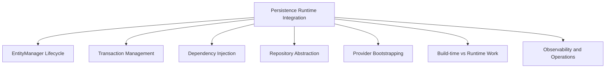
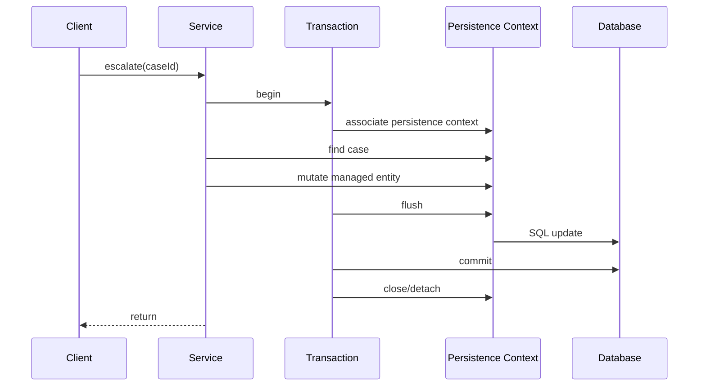
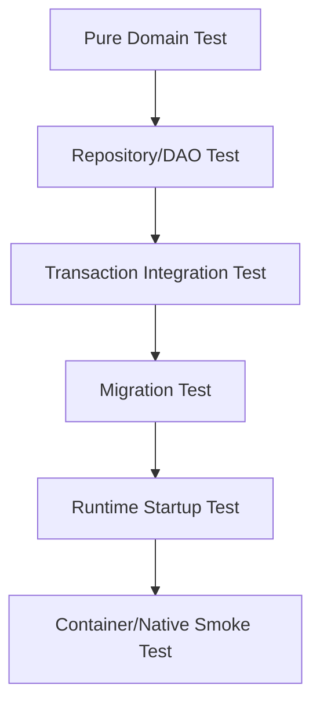
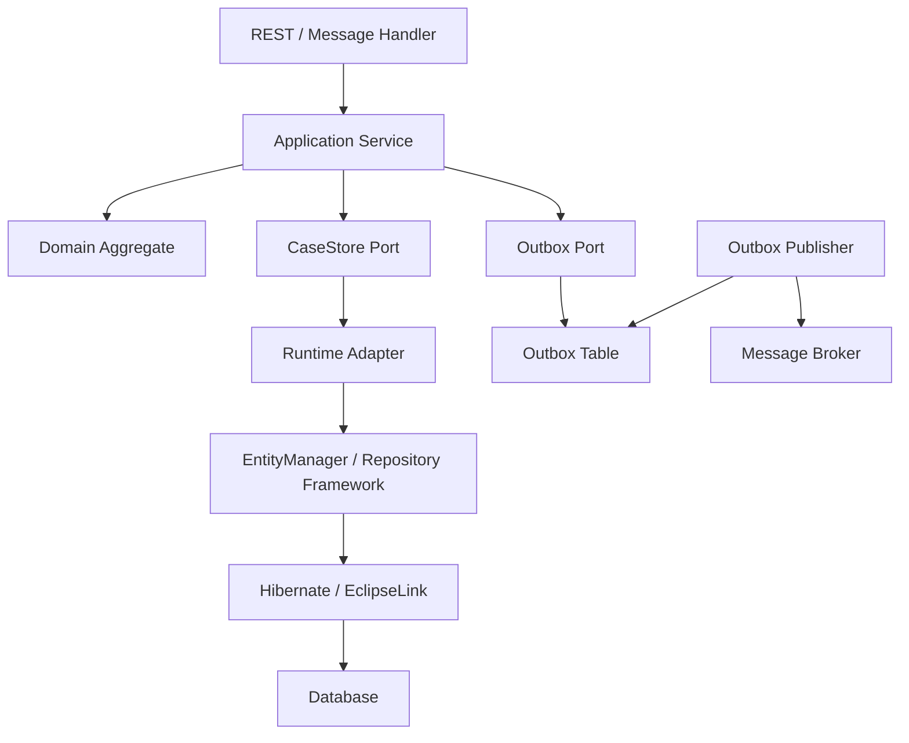

------
title: Learn Java Persistence, Database Integration, JPA, Hibernate ORM & EclipseLink - Part 028
description: Runtime integration for Jakarta EE, Quarkus, Micronaut, and Spring-style environments: container-managed EntityManager, CDI, transactions, build-time enhancement, Panache, Micronaut Data AOT repositories, native-image implications, and integration architecture.
series: learn-java-persistence
seriesTitle: Learn Java Persistence, Database Integration, JPA, Hibernate ORM & EclipseLink
order: 28
partTitle: Jakarta EE, Quarkus, Micronaut, and Runtime Integration
tags:
  - java
  - jakarta-ee
  - jakarta-persistence
  - jpa
  - hibernate
  - quarkus
  - micronaut
  - spring
  - cdi
  - transactions
  - native-image
  - runtime
  - architecture
  - advanced
  - series
date: 2026-06-27
---

# Part 028 — Jakarta EE, Quarkus, Micronaut, and Runtime Integration

> Target: setelah membaca part ini, kamu bisa menilai konsekuensi persistence runtime: apakah `EntityManager` dikelola container, Spring, Quarkus, atau Micronaut; bagaimana transaction boundary dibentuk; bagaimana repository dihasilkan; kapan build-time optimization membantu; dan di mana abstraction bisa mengubah failure mode.

Sampai part sebelumnya, kita banyak membahas JPA sebagai model konseptual dan provider behavior. Sekarang kita bahas environment tempat JPA berjalan.

Runtime matters.

Entity mapping yang sama bisa memiliki karakter operasional berbeda ketika dijalankan di:

1. Jakarta EE application server,
2. Spring Boot,
3. Quarkus,
4. Micronaut,
5. standalone Java SE,
6. native image,
7. serverless/container autoscaling environment.

Pertanyaan penting bukan hanya:

```text
Apakah entity mapping benar?
```

Tetapi juga:

```text
Siapa yang membuat EntityManager?
Siapa yang membuka transaction?
Kapan persistence context dimulai dan berakhir?
Apakah query dibuat runtime atau compile time?
Apakah lazy loading bekerja setelah method service selesai?
Apakah reflection/proxy/bytecode enhancement tersedia?
Apakah native image mengubah asumsi?
```

---

## 1. Runtime Integration Mental Model

Semua runtime integration dapat dipahami melalui enam axis:



| Axis | Pertanyaan |
|---|---|
| EntityManager lifecycle | Application-managed, container-managed, request-bound, transaction-bound, extended? |
| Transaction management | Resource-local, JTA, Spring `@Transactional`, CDI interceptor, framework annotation? |
| DI | CDI, Spring container, Micronaut context, manual wiring? |
| Repository abstraction | Plain JPA, Spring Data, Panache, Micronaut Data, custom? |
| Provider bootstrapping | Runtime scanning, build-time augmentation, native-image metadata? |
| Build-time vs runtime work | Query derivation/reflection/proxy generated kapan? |
| Operations | Metrics, SQL logs, health checks, migration, pool integration, startup validation? |

Top 1% engineer tidak memilih framework hanya berdasarkan syntax. Mereka memilih berdasarkan failure model.

---

## 2. Baseline: Plain Jakarta Persistence in Java SE

Sebelum framework, pahami manual bootstrap.

```java
EntityManagerFactory emf = Persistence.createEntityManagerFactory("case-pu");
EntityManager em = emf.createEntityManager();
EntityTransaction tx = em.getTransaction();

try {
    tx.begin();

    EnforcementCase c = em.find(EnforcementCase.class, caseId);
    c.escalate(reason, actorId, Instant.now());

    tx.commit();
} catch (RuntimeException ex) {
    if (tx.isActive()) {
        tx.rollback();
    }
    throw ex;
} finally {
    em.close();
    emf.close();
}
```

Ini verbose, tetapi sangat edukatif.

Di sini kamu melihat semua tanggung jawab:

1. membuat `EntityManagerFactory`,
2. membuat `EntityManager`,
3. membuka transaction,
4. commit/rollback,
5. menutup resource.

Framework mengotomasi hal ini. Tetapi automation tidak menghapus konsepnya.

---

## 3. Jakarta EE Runtime Model

Di Jakarta EE, persistence biasanya container-managed.

Konsep utama:

1. `EntityManager` di-inject oleh container,
2. transaction biasanya JTA/container-managed,
3. CDI/EJB/Jakarta Transactions mengatur boundary,
4. provider di-bootstrap oleh application server/runtime,
5. persistence unit didefinisikan di `persistence.xml` atau runtime config.

Contoh:

```java
@ApplicationScoped
public class CaseEscalationService {

    @PersistenceContext
    private EntityManager entityManager;

    @Transactional
    public void escalate(UUID caseId, EscalationReason reason, UserId actorId) {
        EnforcementCase c = entityManager.find(EnforcementCase.class, caseId);
        if (c == null) {
            throw new CaseNotFoundException(caseId);
        }

        c.escalate(reason, actorId, Instant.now());
    }
}
```

Dalam model ini, developer tidak memanggil `em.close()` pada injected `EntityManager`. Container mengelola lifecycle.

---

## 4. Transaction-Scoped vs Extended Persistence Context

Jakarta Persistence mengenal persistence context yang umumnya transaction-scoped, dan juga extended persistence context dalam konteks tertentu.

### Transaction-Scoped Persistence Context

Ini model paling umum.

```text
transaction begins
    persistence context associated
    entities loaded/managed
    flush before commit
transaction commits/rolls back
    persistence context ends
managed entities become detached
```

Diagram:



Cocok untuk stateless service operation.

### Extended Persistence Context

Extended context bertahan melewati satu transaction, historisnya sering dikaitkan dengan stateful conversational components.

Risiko:

1. memory retention,
2. stale entity state,
3. hidden long conversation,
4. conflict muncul terlambat,
5. sulit diskalakan horizontal,
6. buruk untuk stateless HTTP service modern.

Untuk microservice/backend stateless, transaction-scoped persistence context hampir selalu lebih sehat.

---

## 5. Jakarta EE Integration Strengths and Risks

Strengths:

1. standard programming model,
2. JTA integration matang,
3. container-managed resources,
4. CDI integration,
5. cocok untuk enterprise environment,
6. portability di dalam Jakarta ecosystem.

Risks:

1. application server behavior berbeda,
2. classloading complexity,
3. provider version dikontrol runtime/server,
4. configuration bisa tersebar,
5. debugging bootstrapping lebih kompleks,
6. startup/runtime logs harus dipahami.

Review question:

> Apakah kita mengandalkan behavior Jakarta Persistence standar, atau behavior application server tertentu?

---

## 6. Spring Boot Runtime Model

Spring Boot bukan Jakarta EE container penuh, tetapi menyediakan container dan integration model yang sangat populer.

Karakteristik:

1. dependency injection via Spring container,
2. transaction via Spring `@Transactional`,
3. `EntityManager` biasanya di-bind ke transaction/thread,
4. Spring Data JPA dapat membuat repository proxy,
5. Boot auto-configuration mengatur datasource, JPA provider, transaction manager,
6. integration dengan Flyway/Liquibase, Actuator, metrics, health check.

Typical service:

```java
@Service
public class CaseClosureService {

    private final EnforcementCaseRepository repository;
    private final OutboxRepository outboxRepository;
    private final Clock clock;

    @Transactional
    public void closeCase(UUID caseId, CloseCaseCommand command) {
        EnforcementCase c = repository.findForClosure(caseId)
                .orElseThrow(() -> new CaseNotFoundException(caseId));

        CaseClosed event = c.close(command.reason(), command.actorId(), clock.instant());
        outboxRepository.save(OutboxMessage.from(event));
    }
}
```

Spring strength adalah operational ecosystem.

Spring risk adalah terlalu mudah membuat persistence magical:

1. repository method tampak seperti method lokal,
2. transaction proxy self-invocation trap,
3. Open Session in View bisa menyembunyikan lazy loading boundary,
4. auto-configuration bisa membuat developer tidak tahu provider setting,
5. test slice bisa berbeda dari production.

---

## 7. Quarkus Runtime Model

Quarkus dirancang untuk cloud-native Java dengan banyak pekerjaan dilakukan saat build time. Dalam konteks persistence, Quarkus menyediakan integration dengan Hibernate ORM dan Panache.

Mental model:

```mermaid
flowchart TD
    A[Quarkus Build Time Augmentation] --> B[Entity Discovery]
    A --> C[Hibernate ORM Bootstrap Metadata]
    A --> D[Reflection Registration / Native Support]
    E[Runtime] --> F[CDI Bean]
    F --> G[@Transactional]
    G --> H[Hibernate Session / EntityManager]
    H --> I[Database]
```

Quarkus mencoba memindahkan sebanyak mungkin kerja dari runtime ke build time.

Konsekuensi:

1. startup lebih cepat,
2. runtime footprint bisa lebih kecil,
3. native-image support lebih realistis,
4. build-time errors bisa muncul lebih awal,
5. dynamic behavior yang bergantung reflection perlu lebih disiplin,
6. framework extension menentukan bagaimana provider di-bootstrap.

---

## 8. Quarkus Hibernate ORM with Panache

Panache adalah simplification layer di atas Hibernate ORM di Quarkus.

Ada dua gaya utama:

1. Active Record style,
2. Repository style.

### Active Record Style

```java
@Entity
public class EnforcementCase extends PanacheEntityBase {

    @Id
    public UUID id;

    public String referenceNo;

    @Enumerated(EnumType.STRING)
    public CaseStatus status;

    public static List<EnforcementCase> findUnderReview() {
        return list("status", CaseStatus.UNDER_REVIEW);
    }
}
```

Keuntungan:

1. ringkas,
2. cepat untuk CRUD sederhana,
3. cocok untuk small app/prototype,
4. idiom Quarkus.

Risiko:

1. entity mengandung query persistence,
2. domain model bercampur Active Record,
3. testing aggregate murni lebih sulit,
4. layer boundary kurang jelas,
5. tidak ideal untuk domain kompleks/regulatory.

### Repository Style

```java
@ApplicationScoped
public class EnforcementCaseRepository implements PanacheRepositoryBase<EnforcementCase, UUID> {

    public Optional<EnforcementCase> findByReferenceNo(String referenceNo) {
        return find("referenceNo", referenceNo).firstResultOptional();
    }

    public List<EnforcementCase> findUnderReviewForTeam(UUID teamId) {
        return list("status = ?1 and assignedTeamId = ?2",
                CaseStatus.UNDER_REVIEW,
                teamId);
    }
}
```

Untuk complex enterprise domain, repository style biasanya lebih mudah dijaga.

Rule:

> Active Record nyaman untuk data-centric/simple model. Repository style lebih aman untuk aggregate-rich/domain-heavy model.

---

## 9. Quarkus Transaction Boundary

Quarkus memakai CDI/interceptor style transaction annotation.

```java
@ApplicationScoped
public class CaseEscalationService {

    private final EnforcementCaseRepository repository;

    public CaseEscalationService(EnforcementCaseRepository repository) {
        this.repository = repository;
    }

    @Transactional
    public void escalate(UUID caseId, EscalationReason reason, UserId actorId) {
        EnforcementCase c = repository.findByIdOptional(caseId)
                .orElseThrow(() -> new CaseNotFoundException(caseId));

        c.escalate(reason, actorId, Instant.now());
    }
}
```

Review points:

1. transaction boundary tetap di service,
2. jangan taruh semua logic di entity static methods,
3. jangan lupa lazy loading boundary,
4. observe SQL dan transaction duration,
5. native image membutuhkan extension support/metadata yang benar,
6. testing sebaiknya memakai database realistis.

---

## 10. Quarkus and Native Image Implications

Native image mengubah asumsi Java runtime:

1. reflection harus diketahui/terdaftar,
2. dynamic proxy harus didukung,
3. classpath scanning runtime harus dikurangi,
4. initialization timing penting,
5. bytecode enhancement/instrumentation harus compatible,
6. driver/provider extension harus native-ready.

Quarkus extension membantu banyak hal ini secara build time.

Namun sebagai persistence engineer, kamu tetap harus bertanya:

1. Apakah entity/projection/DTO dipakai reflection?
2. Apakah custom type/provider extension native-compatible?
3. Apakah migration tool berjalan di startup atau pipeline?
4. Apakah observability tetap lengkap dalam native executable?
5. Apakah startup cepat mengorbankan warm query plan/cache behavior?

Native image bukan “gratis cepat”. Ia adalah runtime model berbeda.

---

## 11. Micronaut Runtime Model

Micronaut menekankan compile-time dependency injection dan ahead-of-time processing. Dalam persistence, Micronaut Data adalah repository/data access toolkit yang melakukan banyak pekerjaan saat compile time.

Micronaut Data berbeda dari Spring Data dalam satu hal penting:

> Query repository interface diusahakan diproses saat compilation time, bukan diterjemahkan sepenuhnya via runtime proxy/reflection.

Konsekuensi:

1. beberapa error query bisa muncul saat compile,
2. runtime overhead lebih kecil,
3. stack trace bisa lebih sederhana,
4. memory footprint bisa lebih kecil,
5. native image lebih natural,
6. tetapi model programming dan fitur tidak identik dengan Spring Data.

---

## 12. Micronaut Data with JPA/Hibernate

Conceptual repository:

```java
@Repository
public interface EnforcementCaseRepository extends CrudRepository<EnforcementCase, UUID> {

    Optional<EnforcementCase> findByReferenceNo(String referenceNo);

    List<EnforcementCase> findByStatusAndAssignedTeamId(
            CaseStatus status,
            UUID assignedTeamId
    );

    @Query("""
        select c
        from EnforcementCase c
        where c.status = :status
        order by c.riskScore desc, c.createdAt asc
        """)
    List<EnforcementCase> findQueue(CaseStatus status, Pageable pageable);
}
```

Micronaut Data can target multiple backends, including JPA/Hibernate, SQL/JDBC/R2DBC, MongoDB, and others depending on module.

The important design point:

> Micronaut Data may generate repository implementation/query metadata at compile time, but if the backend is JPA/Hibernate, the same JPA provider semantics still apply.

So you still need to understand:

1. persistence context,
2. entity lifecycle,
3. dirty checking,
4. flush,
5. transaction,
6. lazy loading,
7. provider-specific behavior,
8. database execution plan.

Compile-time repository generation reduces one kind of runtime magic. It does not eliminate ORM semantics.

---

## 13. Micronaut Transactions

Micronaut supports transaction annotations/integration depending on selected modules.

Typical shape:

```java
@Singleton
public class CaseAssignmentService {

    private final EnforcementCaseRepository repository;
    private final Clock clock;

    public CaseAssignmentService(
            EnforcementCaseRepository repository,
            Clock clock
    ) {
        this.repository = repository;
        this.clock = clock;
    }

    @Transactional
    public void assign(UUID caseId, UserId officerId) {
        EnforcementCase c = repository.findById(caseId)
                .orElseThrow(() -> new CaseNotFoundException(caseId));

        c.assignTo(officerId, clock.instant());
    }
}
```

Same invariant:

> Put business unit-of-work transaction boundary at service level, not randomly inside repository.

---

## 14. Runtime Matrix

| Concern | Jakarta EE | Spring Boot | Quarkus | Micronaut |
|---|---|---|---|---|
| DI model | CDI | Spring container | CDI/Arc | Micronaut DI |
| Transaction | JTA/Jakarta Transactions | Spring transaction abstraction | Jakarta Transactions/CDI interceptor style | Micronaut transaction integration |
| Repository style | Plain JPA/custom | Spring Data JPA common | Panache/custom/JPA | Micronaut Data/custom/JPA |
| Bootstrapping | Container/server | Auto-config runtime | Build-time augmentation | Compile-time DI/data processing |
| Native image | Depends on stack | Possible but more constraints | Strong focus | Strong focus |
| Best fit | Standard enterprise/container | Broad ecosystem/productivity | Cloud-native fast startup | AOT/low reflection services |
| Main risk | Server/provider coupling | Magic/proxy/OSIV/test drift | Active Record overuse/native constraints | Feature differences/compile-time model assumptions |

No runtime is universally best.

Choose based on:

1. team familiarity,
2. operational platform,
3. startup/memory requirements,
4. ecosystem integrations,
5. transaction needs,
6. migration strategy,
7. observability maturity,
8. domain complexity.

---

## 15. EntityManager Injection Patterns

### Jakarta EE / CDI Style

```java
@ApplicationScoped
public class CaseQueryDao {

    @PersistenceContext
    EntityManager em;

    public List<CaseQueueRow> findQueue(CaseStatus status) {
        return em.createQuery("""
            select new com.acme.CaseQueueRow(
                c.id, c.referenceNo, c.status, c.riskScore, c.createdAt
            )
            from EnforcementCase c
            where c.status = :status
            order by c.riskScore desc, c.createdAt asc
            """, CaseQueueRow.class)
            .setParameter("status", status)
            .getResultList();
    }
}
```

### Spring Style

```java
@Repository
public class CaseQueryDao {

    @PersistenceContext
    private EntityManager em;

    @Transactional(readOnly = true)
    public List<CaseQueueRow> findQueue(CaseStatus status) {
        return em.createQuery("""
            select new com.acme.CaseQueueRow(
                c.id, c.referenceNo, c.status, c.riskScore, c.createdAt
            )
            from EnforcementCase c
            where c.status = :status
            order by c.riskScore desc, c.createdAt asc
            """, CaseQueueRow.class)
            .setParameter("status", status)
            .getResultList();
    }
}
```

### Quarkus Style

```java
@ApplicationScoped
public class CaseQueryDao {

    @Inject
    EntityManager em;

    public List<CaseQueueRow> findQueue(CaseStatus status) {
        return em.createQuery("""
            select new com.acme.CaseQueueRow(
                c.id, c.referenceNo, c.status, c.riskScore, c.createdAt
            )
            from EnforcementCase c
            where c.status = :status
            order by c.riskScore desc, c.createdAt asc
            """, CaseQueueRow.class)
            .setParameter("status", status)
            .getResultList();
    }
}
```

Pattern sama, lifecycle manager berbeda.

---

## 16. Avoid Framework-Specific Domain Pollution

Entity domain sebaiknya tidak terlalu tergantung framework repository.

Caution with Active Record:

```java
@Entity
public class EnforcementCase extends PanacheEntity {

    public static List<EnforcementCase> findUrgent() {
        return list("priority", Priority.URGENT);
    }
}
```

Untuk simple app, acceptable.

Untuk regulatory domain kompleks, domain model yang lebih bersih:

```java
@Entity
public class EnforcementCase {

    @Id
    private UUID id;

    @Version
    private long version;

    public CaseEscalated escalate(EscalationReason reason, UserId actorId, Instant now) {
        ensureCanEscalate();
        this.status = CaseStatus.ESCALATED;
        this.escalatedAt = now;
        return new CaseEscalated(id, reason, actorId, now);
    }
}
```

Persistence query di repository/DAO:

```java
public interface EnforcementCaseRepository {
    Optional<EnforcementCase> findForEscalation(UUID id);
    void save(EnforcementCase c);
}
```

Domain object fokus pada invariant. Framework integration fokus pada persistence.

---

## 17. Ports and Adapters for Persistence Runtime

Untuk menjaga runtime flexibility, gunakan port internal.

```java
public interface CaseStore {

    Optional<EnforcementCase> findForEscalation(CaseId id);

    void save(EnforcementCase enforcementCase);

    Page<CaseQueueRow> searchQueue(CaseQueueCriteria criteria, PageRequest page);
}
```

Spring adapter:

```java
@Component
class JpaCaseStore implements CaseStore {

    private final EnforcementCaseRepository repository;

    @Override
    public Optional<EnforcementCase> findForEscalation(CaseId id) {
        return repository.findForEscalation(id.value());
    }

    @Override
    public void save(EnforcementCase enforcementCase) {
        repository.save(enforcementCase);
    }
}
```

Quarkus adapter:

```java
@ApplicationScoped
class PanacheCaseStore implements CaseStore {

    private final EnforcementCasePanacheRepository repository;

    @Override
    public Optional<EnforcementCase> findForEscalation(CaseId id) {
        return repository.find("id", id.value()).firstResultOptional();
    }
}
```

Keuntungan:

1. application service tidak tahu Spring Data/Panache/Micronaut Data,
2. migration lebih feasible,
3. testing domain service lebih mudah,
4. provider/runtime-specific code terisolasi,
5. contract persistence lebih eksplisit.

Tidak semua aplikasi butuh port ekstra. Tetapi untuk domain besar/regulatory/long-lived system, pattern ini sering membayar sendiri.

---

## 18. Reactive Persistence Warning

JPA tradisional adalah blocking persistence model.

Jika runtime menyediakan reactive stack, jangan asumsikan JPA otomatis reactive.

Masalah mencampur blocking JPA dengan reactive event loop:

1. thread event loop bisa terblokir,
2. connection usage tidak sesuai model reactive,
3. transaction context propagation berbeda,
4. lazy loading menjadi lebih problematik,
5. backpressure tidak otomatis berlaku ke JDBC.

Jika butuh reactive persistence, gunakan stack yang memang reactive seperti Hibernate Reactive atau R2DBC, dan pahami bahwa semantics-nya tidak identik dengan blocking JPA.

Rule:

> Jangan bungkus blocking JPA dengan reactive type lalu menyebutnya reactive architecture.

---

## 19. Native Image and Reflection Checklist

Jika menargetkan native image, review:

| Area | Pertanyaan |
|---|---|
| Entity discovery | Apakah semua entity diketahui build time? |
| Proxies | Apakah lazy proxy/enhancement supported? |
| Reflection | Apakah DTO/projection/custom type butuh reflection config? |
| Driver | Apakah JDBC driver native-compatible? |
| Migration | Apakah Flyway/Liquibase berjalan sesuai lifecycle? |
| Timezone/locale | Apakah runtime image membawa data yang dibutuhkan? |
| Observability | Apakah metrics/logging/tracing tetap aktif? |
| Provider extension | Apakah custom Hibernate/EclipseLink extension compatible? |

Native image cocok jika:

1. startup cepat penting,
2. memory footprint penting,
3. deployment sangat elastis,
4. framework support matang,
5. test pipeline mengeksekusi native binary.

Native image kurang cocok jika:

1. sangat banyak dynamic plugin/reflection,
2. provider extension custom belum compatible,
3. debugging runtime masih bergantung JVM dynamic behavior,
4. team belum siap menambah build/test complexity.

---

## 20. Migration and Schema Lifecycle per Runtime

Persistence runtime tidak boleh mengambil alih schema governance sembarangan.

Production rule:

```text
Entity mapping validates schema.
Migration tool changes schema.
Runtime should not surprise-generate production DDL.
```

Typical production setting:

1. Flyway/Liquibase runs in deployment pipeline or controlled startup phase,
2. Hibernate `ddl-auto`/schema generation set to validate/none,
3. migration is reviewed,
4. rollback/forward fix strategy exists,
5. schema drift is detected,
6. integration tests run migrations from empty database.

Framework-specific caution:

| Runtime | Risk |
|---|---|
| Spring Boot | dev-friendly `ddl-auto` setting leaking to production |
| Jakarta EE | server-managed datasource/persistence.xml mismatch |
| Quarkus | dev services convenience hiding production config needs |
| Micronaut | compile-time data model passing while migration missing actual index/constraint |

---

## 21. Testing Runtime Integration

Test layers:



### Domain Test

No JPA required.

```java
@Test
void only_under_review_case_can_be_escalated() {
    EnforcementCase c = EnforcementCase.closedCase(...);
    assertThatThrownBy(() -> c.escalate(reason, actor, now))
            .isInstanceOf(InvalidCaseTransitionException.class);
}
```

### Repository Test

Use actual database engine or Testcontainers.

Verify:

1. query result,
2. mapping,
3. constraints,
4. flush/clear behavior,
5. projections,
6. pagination,
7. query count.

### Transaction Integration Test

Verify service boundary:

1. rollback on exception,
2. outbox saved atomically,
3. optimistic lock conflict,
4. no lazy loading outside boundary,
5. retry policy.

### Runtime Startup Test

Verify:

1. app starts with production-like config,
2. migrations applied,
3. `EntityManagerFactory` boots,
4. schema validates,
5. health check passes,
6. metrics exposed.

### Native Smoke Test

If native image target:

1. build native executable,
2. run repository tests against it if possible,
3. execute critical use cases,
4. verify logging/metrics,
5. test migrations,
6. test reflection-sensitive projections.

---

## 22. Observability Integration

At runtime, persistence problems show as operational symptoms.

Observe:

| Symptom | Possible Cause |
|---|---|
| High p95 latency | slow query, connection wait, lock wait, N+1 |
| High connection pool usage | long transaction, missing pagination, batch job contention |
| Deadlocks | inconsistent lock ordering, missing index, broad update |
| Optimistic lock spikes | hotspot aggregate, retry storm, bad UX conflict model |
| Startup failure | schema mismatch, migration missing, provider config error |
| Memory growth | large persistence context, streaming misuse, cache misuse |
| Native-only failure | reflection/proxy/custom type not registered/supported |

Minimum metrics:

1. datasource pool active/idle/pending,
2. query latency,
3. transaction duration,
4. slow SQL logs,
5. Hibernate statistics for selected environments,
6. migration status,
7. lock timeout/deadlock counts,
8. optimistic lock conflict counts.

---

## 23. Runtime Selection Decision Frame

Choose runtime using explicit criteria.

| Criterion | Prefer |
|---|---|
| Broad ecosystem, mature enterprise integration | Spring Boot |
| Jakarta standard/container alignment | Jakarta EE |
| Fast startup, cloud-native, build-time Hibernate integration | Quarkus |
| Compile-time DI/query generation, low reflection | Micronaut |
| Maximum control/small tool | Plain JPA/custom |

But for persistence-heavy systems, ask deeper questions:

1. Which runtime gives best transaction clarity?
2. Which runtime makes SQL/query count easiest to observe?
3. Which runtime supports our provider version lifecycle?
4. Which runtime supports our migration discipline?
5. Which runtime makes test environment closest to production?
6. Which runtime reduces accidental lazy loading?
7. Which runtime our team can debug under incident pressure?

Framework choice is not only developer experience. It is incident experience.

---

## 24. Regulatory Case Management Architecture Example

Target architecture:



Application service:

```java
public class EscalateCaseUseCase {

    private final CaseStore caseStore;
    private final OutboxStore outboxStore;
    private final Clock clock;

    @Transactional
    public void handle(EscalateCaseCommand command) {
        EnforcementCase c = caseStore.findForEscalation(command.caseId())
                .orElseThrow(() -> new CaseNotFoundException(command.caseId()));

        CaseEscalated event = c.escalate(
                command.reason(),
                command.actorId(),
                clock.instant()
        );

        caseStore.save(c);
        outboxStore.append(event);
    }
}
```

Adapter can be Spring Data, Quarkus Panache, Micronaut Data, or plain JPA.

The domain use case should not care.

This matters because regulatory systems often live long enough to outlive framework fashion.

---

## 25. Anti-Patterns

### 25.1 Runtime-Driven Domain Model

Domain entity extends framework base class everywhere, making future migration difficult.

### 25.2 Transaction Boundary by Accident

Relying on repository method transaction defaults instead of service-level consistency design.

### 25.3 Native Image Without Native Tests

Building native binary but only testing JVM mode.

### 25.4 Panache Active Record for Complex Aggregates

Convenient but can blur aggregate/persistence boundary.

### 25.5 Spring OSIV Hiding Lazy Loading

API serialization silently executes SQL outside intended service boundary.

### 25.6 Compile-Time Repository Confidence Without SQL Plan Review

Micronaut Data compile-time validation does not prove query performance.

### 25.7 Jakarta EE Server Coupling by Accident

Using server-specific provider/resource behavior while claiming portability.

### 25.8 Dev Services / Auto Config Leaking Assumptions

Development convenience hides production datasource, migration, security, or pool settings.

---

## 26. Architecture Review Checklist

| Area | Questions |
|---|---|
| EntityManager | Who creates it? When does it close? Is it transaction-scoped? |
| Transaction | Where is business unit of work declared? |
| Repository | Is framework-specific code isolated? |
| Domain | Does domain model depend on persistence framework? |
| Query | Are critical queries explicit and observable? |
| Fetch | Does runtime hide lazy loading outside service? |
| Migration | Who owns schema changes? |
| Provider | Who controls Hibernate/EclipseLink version? |
| Native | Are native constraints tested? |
| Observability | Can we diagnose SQL, transaction, lock, pool issues? |
| Tests | Do tests use production-like DB and runtime config? |
| Operations | Is startup validation deterministic? |

---

## 27. Kaufman Practice Drill

### Drill 1 — Runtime Lifecycle Trace

For your current application, trace one request:

```text
HTTP handler
→ service method
→ transaction begins
→ repository/entity manager call
→ SQL statements
→ flush
→ commit
→ persistence context closes
→ response serialization
```

Find where lazy loading could occur.

### Drill 2 — Transaction Boundary Audit

List all service methods that mutate state. Confirm each has explicit unit-of-work transaction boundary.

### Drill 3 — Framework Lock-In Map

Classify persistence code:

| Code | Pure domain | Jakarta Persistence | Provider-specific | Framework-specific | Database-specific |
|---|---:|---:|---:|---:|---:|
| `EnforcementCase` | ✅ | maybe | maybe | maybe | no |
| `CaseRepository` | no | ✅ | maybe | ✅ | maybe |
| `CaseSearchDao` | no | ✅ | maybe | maybe | ✅ |

Goal: know where lock-in exists.

### Drill 4 — Native Readiness Review

If using Quarkus/Micronaut/native image, identify:

1. custom Hibernate types,
2. reflection-heavy DTO mapping,
3. dynamic class loading,
4. provider extensions,
5. migration runtime assumptions.

### Drill 5 — Replace Adapter Thought Experiment

Ask:

> If we moved from Spring Data JPA to plain EntityManager or Quarkus Panache, what application service code would change?

If answer is “almost everything”, persistence framework is leaking too deeply.

---

## 28. Final Mental Model

Jakarta Persistence defines the persistence semantics. Providers implement and extend them. Runtime frameworks decide how those semantics are bootstrapped, injected, transacted, optimized, and observed.

A mature persistence architecture separates:

1. domain invariant,
2. application unit of work,
3. persistence port,
4. runtime adapter,
5. provider escape hatch,
6. database contract.

Frameworks are tools. Runtime is an operating environment. Persistence correctness remains your responsibility.

The strongest architecture is not framework-neutral in a naive way. It is framework-aware and boundary-disciplined.

---

## 29. Ringkasan

Di part ini kita melihat bahwa runtime integration menentukan:

1. lifecycle `EntityManager`,
2. transaction boundary,
3. repository generation,
4. provider bootstrap,
5. build-time/runtime trade-off,
6. native-image constraints,
7. testing strategy,
8. observability.

Jakarta EE memberi standard container model. Spring Boot memberi ecosystem dan productivity. Quarkus memberi build-time augmentation dan Panache. Micronaut memberi compile-time DI/data approach. Semua tetap harus menghormati JPA semantics.

Top 1% engineer tidak bertanya “framework mana paling keren?”. Mereka bertanya:

> Framework mana yang membuat correctness, performance, operability, and failure diagnosis paling jelas untuk sistem ini?

---

## References

- [Jakarta Persistence 3.2 EntityManager API](https://jakarta.ee/specifications/persistence/3.2/apidocs/jakarta.persistence/jakarta/persistence/entitymanager)
- [Jakarta CDI Specifications](https://jakarta.ee/specifications/cdi/)
- [Spring Data JPA Reference Documentation](https://docs.spring.io/spring-data/jpa/reference/index.html)
- [Quarkus Hibernate ORM with Panache Guide](https://quarkus.io/guides/hibernate-orm-panache)
- [Micronaut Data Reference Guide](https://micronaut-projects.github.io/micronaut-data/latest/guide/)
