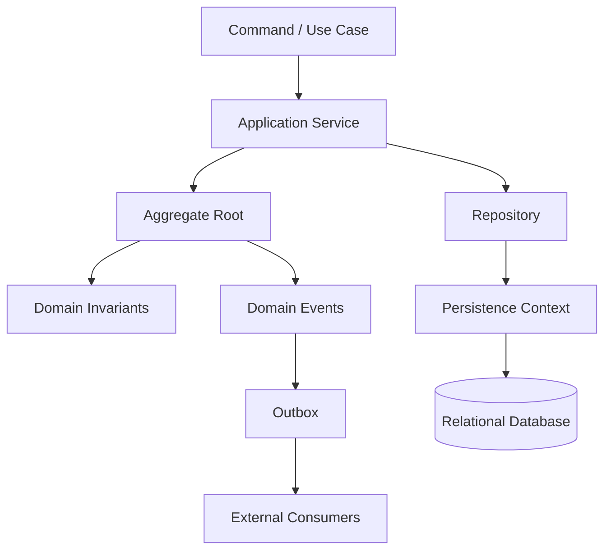
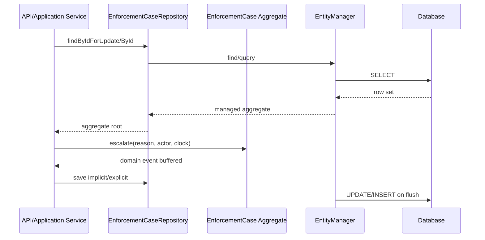
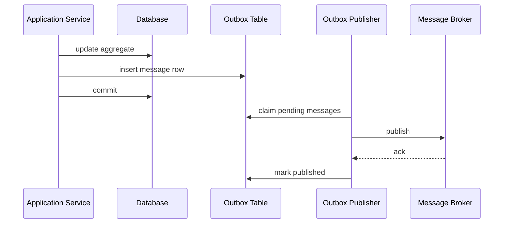
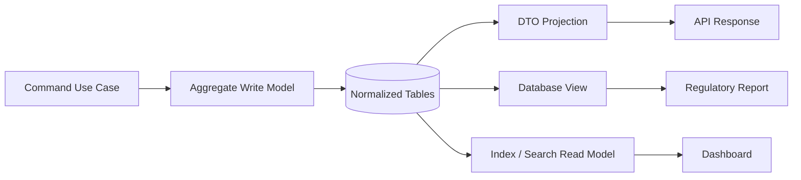
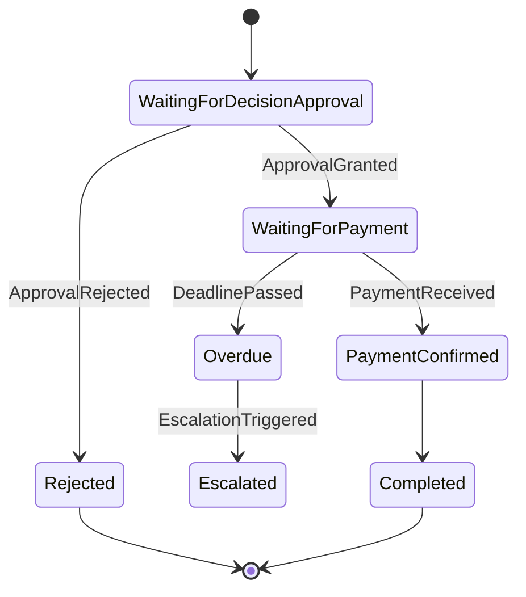
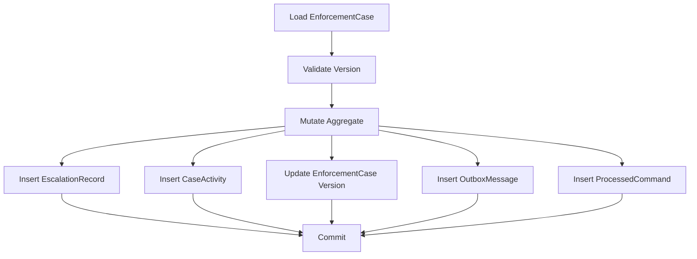

------
title: Learn Java Persistence, Database Integration, JPA, Hibernate ORM & EclipseLink - Part 029
description: Domain-driven persistence patterns for Java Persistence: aggregate repository, domain events, outbox, anti-corruption layer, persistence ignorance, rich vs anemic model, and consistency-oriented design.
series: learn-java-persistence
seriesTitle: Learn Java Persistence, Database Integration, JPA, Hibernate ORM & EclipseLink
order: 29
partTitle: Domain-Driven Persistence Patterns
tags:
- java
- jakarta-persistence
- jpa
- hibernate
- eclipselink
- ddd
- persistence
- architecture
- repository
- outbox
- domain-events
date: 2026-06-27
---

# Part 029 — Domain-Driven Persistence Patterns

> Target utama part ini: kamu tidak hanya bisa memetakan entity ke tabel, tetapi mampu menentukan **persistence boundary** yang menjaga domain tetap benar, transaction tetap pendek, write model tetap konsisten, dan integrasi eksternal tidak merusak invariants.

ORM sering gagal bukan karena `@Entity` salah, tetapi karena desain domain dan boundary persistence salah. JPA/Hibernate/EclipseLink hanya mengeksekusi keputusan desain yang sudah dibuat. Jika aggregate terlalu besar, cascade terlalu luas, transaction menyeberang sistem eksternal, atau repository hanya menjadi wrapper CRUD tanpa invariants, sistem akan tampak berjalan di awal tetapi rapuh saat concurrency, audit, migration, dan scale mulai muncul.

Part ini membahas pola persistence berbasis domain. Fokusnya bukan DDD sebagai teori luas, tetapi bagaimana menerapkan pola domain pada **Java Persistence** secara operasional.

---

## 1. Mental Model: Persistence Is a Domain Boundary, Not a Storage Detail

Ada dua cara salah memahami persistence:

1. Persistence sebagai detail teknis kecil: “nanti tinggal pakai repository dan save.”
2. Persistence sebagai pusat domain: “semua entity database adalah domain model.”

Keduanya ekstrem. Dalam sistem serius, persistence adalah **boundary yang menerjemahkan state domain menjadi durable state** dengan constraints tertentu:

- relational database punya transaction, constraint, index, isolation, lock, dan query optimizer;
- domain model punya invariants, lifecycle, command, event, dan rules;
- ORM punya persistence context, dirty checking, lazy loading, flush ordering, identity map, dan provider-specific behavior;
- service/application layer punya use case, authorization, idempotency, retry, dan integration boundary.

Persistence design yang matang menjawab pertanyaan ini:

> “State apa yang harus berubah secara atomik, siapa yang berhak mengubahnya, invariant apa yang harus dijaga, dan kapan perubahan itu boleh terlihat oleh sistem lain?”



Top 1% engineer tidak bertanya “apakah ini bisa di-`save()`?”. Mereka bertanya:

- Apakah aggregate boundary sudah benar?
- Apakah transaction boundary sama dengan consistency boundary?
- Apakah repository menjaga invariant atau hanya memudahkan CRUD?
- Apakah event keluar setelah commit atau sebelum commit?
- Apakah query read model memaksa write model menjadi terlalu besar?
- Apakah integration failure bisa membuat database dan message broker inconsistent?

---

## 2. Running Domain: Regulatory Enforcement Case Management

Agar materi tidak abstrak, kita pakai domain konsisten:

- `EnforcementCase` — kasus regulatory enforcement.
- `CaseSubject` — entitas/orang yang diselidiki.
- `Allegation` — dugaan pelanggaran.
- `EvidenceItem` — bukti.
- `CaseStage` — fase lifecycle: intake, assessment, investigation, decision, appeal, closure.
- `Escalation` — eskalasi kasus.
- `EnforcementAction` — tindakan: warning, fine, suspension, remediation order.
- `CaseEvent` — event domain.
- `OutboxMessage` — durable integration message.

Contoh command:

```java
public record EscalateCaseCommand(
        UUID caseId,
        String reason,
        UUID escalatedBy,
        long expectedVersion
) {}
```

Invariants:

- Closed case tidak boleh dieskalasi.
- Case hanya bisa masuk investigation jika assessment complete.
- Enforcement action hanya bisa diterbitkan jika case berada di decision stage.
- Fine amount harus punya currency dan tidak boleh negatif.
- Setiap escalation harus punya actor, reason, timestamp.
- Event eksternal tidak boleh dipublish jika transaction database gagal.

---

## 3. Pattern: Aggregate Root as Consistency Gate

Aggregate adalah boundary konsistensi. Aggregate root adalah satu-satunya objek yang boleh mengontrol perubahan internal aggregate.

Dalam persistence, aggregate root biasanya menjadi entry point repository.

```java
@Entity
@Table(name = "enforcement_case")
public class EnforcementCase {

    @Id
    private UUID id;

    @Version
    private long version;

    @Enumerated(EnumType.STRING)
    @Column(nullable = false)
    private CaseStage stage;

    @Enumerated(EnumType.STRING)
    @Column(nullable = false)
    private CaseStatus status;

    @OneToMany(mappedBy = "caseRef", cascade = CascadeType.ALL, orphanRemoval = true)
    private final List<EscalationRecord> escalations = new ArrayList<>();

    @Transient
    private final List<DomainEvent> domainEvents = new ArrayList<>();

    protected EnforcementCase() {
        // JPA constructor
    }

    public void escalate(String reason, UUID actorId, Clock clock) {
        if (status == CaseStatus.CLOSED) {
            throw new DomainRuleViolation("Closed case cannot be escalated");
        }
        if (stage == CaseStage.INTAKE) {
            throw new DomainRuleViolation("Intake case must be assessed before escalation");
        }

        EscalationRecord record = EscalationRecord.create(this, reason, actorId, clock.instant());
        escalations.add(record);

        domainEvents.add(new CaseEscalated(id, reason, actorId, clock.instant()));
    }

    public List<DomainEvent> pullDomainEvents() {
        List<DomainEvent> copy = List.copyOf(domainEvents);
        domainEvents.clear();
        return copy;
    }
}
```

Yang penting bukan anotasinya. Yang penting adalah **mutation path**:



### Invariant

Child entity tidak boleh dimutasi langsung dari luar aggregate root.

Buruk:

```java
caseEntity.getEscalations().add(new EscalationRecord(...));
```

Lebih baik:

```java
caseEntity.escalate(reason, actorId, clock);
```

Mengapa? Karena method aggregate bisa:

- memvalidasi state;
- mengontrol transition;
- membuat audit/event;
- menjaga bidirectional association;
- menjaga collection consistency;
- menghindari invalid object graph.

---

## 4. Pattern: Repository per Aggregate Root

Repository bukan sekadar DAO. Repository adalah collection-like abstraction untuk aggregate roots.

Repository yang sehat:

- expose use-case-oriented query untuk aggregate root;
- menyembunyikan provider detail dari application service;
- menjaga fetch plan yang dibutuhkan command;
- tidak expose `EntityManager` secara liar;
- tidak membuat semua entity punya generic CRUD repository;
- tidak membuat child entity bisa disimpan sendiri jika lifecycle-nya milik aggregate.

```java
public interface EnforcementCaseRepository {

    Optional<EnforcementCase> findForCommand(UUID caseId);

    Optional<EnforcementCase> findForDecision(UUID caseId);

    boolean existsOpenCaseForSubject(UUID subjectId);

    void add(EnforcementCase enforcementCase);
}
```

Implementasi JPA:

```java
@Repository
class JpaEnforcementCaseRepository implements EnforcementCaseRepository {

    @PersistenceContext
    private EntityManager em;

    @Override
    public Optional<EnforcementCase> findForCommand(UUID caseId) {
        EntityGraph<?> graph = em.getEntityGraph("EnforcementCase.commandGraph");
        return Optional.ofNullable(em.find(
                EnforcementCase.class,
                caseId,
                Map.of("jakarta.persistence.fetchgraph", graph)
        ));
    }

    @Override
    public Optional<EnforcementCase> findForDecision(UUID caseId) {
        return em.createQuery("""
                select c
                from EnforcementCase c
                left join fetch c.allegations
                left join fetch c.actions
                where c.id = :caseId
                """, EnforcementCase.class)
                .setParameter("caseId", caseId)
                .getResultStream()
                .findFirst();
    }

    @Override
    public boolean existsOpenCaseForSubject(UUID subjectId) {
        return em.createQuery("""
                select count(c.id)
                from EnforcementCase c
                where c.subject.id = :subjectId
                  and c.status <> :closed
                """, Long.class)
                .setParameter("subjectId", subjectId)
                .setParameter("closed", CaseStatus.CLOSED)
                .getSingleResult() > 0;
    }

    @Override
    public void add(EnforcementCase enforcementCase) {
        em.persist(enforcementCase);
    }
}
```

### Repository Design Rules

| Rule | Rationale |
|---|---|
| Repository belongs to aggregate root | Prevents child entity lifecycle leakage. |
| Do not expose `saveAllEverything()` as default mental model | Bulk persistence can bypass invariants and hide transaction size. |
| Query methods should reveal intent | `findForDecision()` is better than generic `findById()` when fetch plan matters. |
| Repository should not own business decisions | It loads and stores aggregates; domain rules live in aggregate/application service. |
| Repository should not publish external messages | Message publication belongs after durable commit, usually through outbox. |

---

## 5. Pattern: Application Service as Transaction Script Coordinator

Application service coordinates use case. It should not become a place where all domain rules are written imperatively.

```java
@Service
public class EscalateCaseUseCase {

    private final EnforcementCaseRepository cases;
    private final Outbox outbox;
    private final Clock clock;

    @Transactional
    public void handle(EscalateCaseCommand command) {
        EnforcementCase enforcementCase = cases.findForCommand(command.caseId())
                .orElseThrow(() -> new NotFoundException("Case not found"));

        enforcementCase.requireVersion(command.expectedVersion());
        enforcementCase.escalate(command.reason(), command.escalatedBy(), clock);

        outbox.enqueueAll(enforcementCase.pullDomainEvents());
    }
}
```

Application service bertanggung jawab untuk:

- membuka transaction boundary;
- load aggregate dengan fetch plan yang sesuai;
- memanggil behavior domain;
- mengubah domain event menjadi durable outbox record;
- mengatur idempotency command jika dibutuhkan;
- menerapkan authorization/use-case policy yang bukan invariant entity murni.

Application service tidak seharusnya:

- mengubah internal child collection langsung;
- menyusun business rule tersebar dalam `if` panjang setiap use case;
- memanggil REST API eksternal di tengah transaction database;
- menyimpan entity unrelated dalam satu transaction tanpa consistency reason;
- mengembalikan managed entity ke presentation layer.

---

## 6. Pattern: Domain Events without Premature Messaging

Domain event adalah fakta domain yang sudah terjadi dalam aggregate.

Contoh:

```java
public sealed interface DomainEvent permits CaseEscalated, CaseClosed, EnforcementActionIssued {
    UUID aggregateId();
    Instant occurredAt();
}

public record CaseEscalated(
        UUID aggregateId,
        String reason,
        UUID escalatedBy,
        Instant occurredAt
) implements DomainEvent {}
```

Domain event bukan selalu message broker event. Ada tiga level:

| Level | Meaning | Example |
|---|---|---|
| In-memory domain event | Fakta internal dalam transaction | `CaseEscalated` buffered in aggregate |
| Durable outbox message | Event disimpan di DB yang sama dengan aggregate | row in `outbox_message` |
| Integration event | Message yang dipublish ke Kafka/Rabbit/SNS/etc | `case.escalated.v1` |

Jangan langsung publish dari aggregate.

Buruk:

```java
public void escalate(...) {
    validate();
    broker.publish(new CaseEscalated(...)); // wrong boundary
    this.stage = CaseStage.INVESTIGATION;
}
```

Masalah:

- aggregate menjadi tergantung infrastructure;
- message bisa terkirim sebelum commit;
- rollback database tidak membatalkan message broker;
- retry bisa menggandakan message;
- test domain jadi berat.

Lebih baik:

```java
public void escalate(...) {
    validate();
    this.stage = CaseStage.INVESTIGATION;
    domainEvents.add(new CaseEscalated(id, reason, actorId, clock.instant()));
}
```

Lalu application service menyimpan outbox record dalam transaction yang sama.

---

## 7. Pattern: Transactional Outbox

Transactional outbox menyelesaikan masalah klasik:

> Database commit berhasil, tetapi publish message gagal. Atau message berhasil dipublish, tetapi database rollback.

Solusinya: simpan event sebagai row di database yang sama dalam transaction yang sama, lalu worker terpisah mempublish message.



Entity outbox:

```java
@Entity
@Table(name = "outbox_message")
public class OutboxMessage {

    @Id
    private UUID id;

    @Column(nullable = false)
    private UUID aggregateId;

    @Column(nullable = false)
    private String aggregateType;

    @Column(nullable = false)
    private String eventType;

    @Column(nullable = false)
    private String eventVersion;

    @Lob
    @Column(nullable = false)
    private String payloadJson;

    @Enumerated(EnumType.STRING)
    @Column(nullable = false)
    private OutboxStatus status;

    @Column(nullable = false)
    private Instant createdAt;

    private Instant publishedAt;

    @Version
    private long version;

    protected OutboxMessage() {}

    public static OutboxMessage from(DomainEvent event, EventSerializer serializer) {
        OutboxMessage message = new OutboxMessage();
        message.id = UUID.randomUUID();
        message.aggregateId = event.aggregateId();
        message.aggregateType = serializer.aggregateType(event);
        message.eventType = serializer.eventType(event);
        message.eventVersion = serializer.version(event);
        message.payloadJson = serializer.toJson(event);
        message.status = OutboxStatus.PENDING;
        message.createdAt = event.occurredAt();
        return message;
    }
}
```

Outbox port:

```java
public interface Outbox {
    void enqueueAll(List<DomainEvent> events);
}

@Repository
class JpaOutbox implements Outbox {

    @PersistenceContext
    private EntityManager em;

    private final EventSerializer serializer;

    @Override
    public void enqueueAll(List<DomainEvent> events) {
        for (DomainEvent event : events) {
            em.persist(OutboxMessage.from(event, serializer));
        }
    }
}
```

### Claiming Messages Safely

Outbox worker harus aman saat multi-instance. Claiming bisa memakai database-specific locking.

PostgreSQL-style query biasanya memakai `FOR UPDATE SKIP LOCKED`. Ini native SQL dan bukan portable JPA.

```java
public List<OutboxMessage> claimBatch(int size, UUID workerId) {
    return em.createNativeQuery("""
            select *
            from outbox_message
            where status = 'PENDING'
            order by created_at
            for update skip locked
            limit ?
            """, OutboxMessage.class)
            .setParameter(1, size)
            .getResultList();
}
```

Ini contoh escape hatch yang sah. Jangan memaksakan portability jika kebutuhan concurrency memerlukan fitur database.

### Outbox Invariants

| Invariant | Reason |
|---|---|
| Outbox insert berada dalam transaction yang sama dengan aggregate mutation | Prevents database-message inconsistency. |
| Message payload immutable setelah dibuat | Consumers need replayable fact. |
| Consumer harus idempotent | Publisher retry can duplicate delivery. |
| Outbox worker tidak boleh menghapus row terlalu cepat | Audit/replay/debugging. |
| Event schema harus versioned | Consumers evolve independently. |
| Claiming harus concurrent-safe | Multiple workers must not publish same row unintentionally. |

---

## 8. Pattern: Idempotent Command Handling

Dalam distributed system, command bisa dikirim ulang:

- HTTP client retry;
- message redelivery;
- scheduler retry;
- user double-click;
- timeout ambiguity.

Persistence layer harus membantu idempotency.

Contoh table:

```sql
create table processed_command (
    command_id uuid primary key,
    command_type varchar(120) not null,
    aggregate_id uuid not null,
    processed_at timestamp not null,
    result_reference varchar(200)
);
```

JPA entity:

```java
@Entity
@Table(name = "processed_command")
public class ProcessedCommand {
    @Id
    private UUID commandId;

    @Column(nullable = false)
    private String commandType;

    @Column(nullable = false)
    private UUID aggregateId;

    @Column(nullable = false)
    private Instant processedAt;

    protected ProcessedCommand() {}

    public ProcessedCommand(UUID commandId, String commandType, UUID aggregateId, Instant processedAt) {
        this.commandId = commandId;
        this.commandType = commandType;
        this.aggregateId = aggregateId;
        this.processedAt = processedAt;
    }
}
```

Use case:

```java
@Transactional
public void handle(EscalateCaseCommand command) {
    if (processedCommands.exists(command.commandId())) {
        return;
    }

    EnforcementCase enforcementCase = cases.findForCommand(command.caseId())
            .orElseThrow(NotFoundException::new);

    enforcementCase.escalate(command.reason(), command.actorId(), clock);
    outbox.enqueueAll(enforcementCase.pullDomainEvents());

    processedCommands.add(new ProcessedCommand(
            command.commandId(),
            "EscalateCaseCommand",
            command.caseId(),
            clock.instant()
    ));
}
```

Tapi ada race condition jika dua thread memproses command yang sama. Solusi yang lebih kuat adalah database unique constraint pada `command_id`. Application code menangani duplicate key sebagai “already processed”.

---

## 9. Pattern: Persistence Ignorance with Practical Compromise

Persistence ignorance berarti domain model tidak bergantung berlebihan pada infrastructure persistence. Namun JPA punya syarat praktis:

- entity butuh constructor no-arg minimal protected;
- entity class tidak final dalam banyak setup proxy-based;
- field/access strategy harus konsisten;
- lazy loading memakai proxy/weaving;
- collection field sering diganti provider;
- lifecycle callback harus hati-hati.

Jadi target realistisnya bukan “domain sepenuhnya tidak tahu persistence”. Targetnya:

> Domain model boleh memiliki anotasi mapping, tetapi behavior domain tidak boleh bergantung pada `EntityManager`, SQL, transaction API, broker, HTTP client, atau framework repository.

Baik:

```java
@Entity
public class EnforcementCase {
    public void close(ClosureReason reason, UUID actorId, Clock clock) {
        if (!canClose()) {
            throw new DomainRuleViolation("Case cannot be closed yet");
        }
        this.status = CaseStatus.CLOSED;
        this.closedAt = clock.instant();
        this.closedBy = actorId;
    }
}
```

Buruk:

```java
@Entity
public class EnforcementCase {
    @Autowired
    private NotificationClient notificationClient;

    public void close(...) {
        this.status = CaseStatus.CLOSED;
        notificationClient.notifyCaseClosed(id); // infrastructure leak
    }
}
```

### Practical Compromise Checklist

| Concern | Acceptable in Entity? | Reason |
|---|---:|---|
| `@Entity`, `@Column`, `@OneToMany` | Yes | Mapping metadata. |
| `EntityManager` | No | Infrastructure operation. |
| `@Autowired` service | No | Entity lifecycle not managed by Spring. |
| Domain validation | Yes | Core behavior. |
| Cross-aggregate query | No | Repository/application concern. |
| Domain event buffering | Yes, with care | Fact capture without publishing. |
| JSON serialization annotation | Usually no | API shape leak. |
| Database-specific SQL | No | Repository/provider adapter concern. |

---

## 10. Pattern: Rich Domain Model vs Anemic Model

Anemic model:

```java
@Entity
public class EnforcementCase {
    public UUID id;
    public CaseStage stage;
    public CaseStatus status;
    public List<EscalationRecord> escalations;
}
```

Service becomes procedural god object:

```java
@Transactional
public void escalate(UUID caseId, String reason) {
    EnforcementCase c = repo.findById(caseId).orElseThrow();
    if (c.status == CLOSED) throw ...;
    if (c.stage == INTAKE) throw ...;
    c.escalations.add(...);
    c.stage = INVESTIGATION;
    repo.save(c);
}
```

Rich model:

```java
@Transactional
public void escalate(EscalateCaseCommand command) {
    EnforcementCase c = repo.findForCommand(command.caseId()).orElseThrow();
    c.escalate(command.reason(), command.escalatedBy(), clock);
    outbox.enqueueAll(c.pullDomainEvents());
}
```

Rich model bukan berarti semua logic masuk entity. Gunakan pembagian berikut:

| Logic Type | Best Location |
|---|---|
| Invariant internal aggregate | Aggregate root/entity/value object |
| Use-case coordination | Application service |
| Authorization | Application service / policy service |
| Cross-aggregate existence check | Domain service/application service + repository |
| External integration | Infrastructure adapter |
| Read-only report composition | Query service/read model |
| Workflow orchestration panjang | Process manager / BPM / saga, not entity |

### Domain Service

Jika rule membutuhkan lebih dari satu aggregate, jangan memaksa masuk entity.

```java
public class CaseEscalationPolicy {

    public void assertCanEscalate(EnforcementCase enforcementCase,
                                 SubjectRiskProfile riskProfile,
                                 EscalationLimit limit) {
        if (riskProfile.isLowRisk() && limit.monthlyEscalationsExceeded()) {
            throw new DomainRuleViolation("Low-risk subject escalation limit exceeded");
        }
        enforcementCase.assertCanEscalate();
    }
}
```

Domain service bisa pure Java. Data loading tetap di application service/repository.

---

## 11. Pattern: Anti-Corruption Layer for External Schemas

External systems jarang punya model yang sama dengan domain internal:

- CRM memakai `customer`;
- regulatory registry memakai `regulated_entity`;
- payment system memakai `account`;
- document management memakai `folder` dan `artifact`;
- legacy case system memakai status string bebas.

Jangan langsung menjadikan payload eksternal sebagai JPA entity domain.

Buruk:

```java
@Entity
public class ExternalRegistryCasePayload {
    @Id
    private String registryCaseNumber;
    private String rawStatus;
    private String rawSeverity;
    // domain now shaped by external payload
}
```

Lebih baik:

```java
public interface RegistryGateway {
    RegistrySubjectSnapshot fetchSubject(UUID subjectId);
}

public record RegistrySubjectSnapshot(
        UUID subjectId,
        String legalName,
        RiskClassification riskClassification,
        boolean licenseActive
) {}
```

Mapping eksternal ke domain dilakukan di adapter/ACL:

```java
@Component
class RegistryAntiCorruptionAdapter implements RegistryGateway {

    private final RegistryClient client;
    private final RegistryMapper mapper;

    @Override
    public RegistrySubjectSnapshot fetchSubject(UUID subjectId) {
        RegistryResponse response = client.getSubject(subjectId);
        return mapper.toSnapshot(response);
    }
}
```

Persistence implication:

- store external reference id jika dibutuhkan;
- jangan store seluruh external payload sebagai entity domain kecuali memang perlu audit snapshot;
- jika perlu snapshot, jadikan immutable audit/read model, bukan aggregate behavior model;
- mapping error harus eksplisit;
- version external contract harus dicatat.

---

## 12. Pattern: Read Model Separate from Write Model

JPA entity untuk write model tidak selalu cocok untuk query/report/API response.

Write model fokus:

- consistency;
- invariants;
- lifecycle;
- transaction mutation;
- aggregate boundary.

Read model fokus:

- projection;
- filtering;
- sorting;
- pagination;
- denormalized shape;
- performance;
- API contract.

Jika API membutuhkan case dashboard:

```java
public record CaseDashboardRow(
        UUID caseId,
        String referenceNumber,
        String subjectName,
        CaseStage stage,
        CaseStatus status,
        long openAllegationCount,
        Instant lastActivityAt
) {}
```

Gunakan query projection:

```java
public List<CaseDashboardRow> findDashboard(CaseDashboardFilter filter, PageRequest page) {
    return em.createQuery("""
            select new com.example.caseapp.CaseDashboardRow(
                c.id,
                c.referenceNumber,
                s.legalName,
                c.stage,
                c.status,
                count(a.id),
                max(act.occurredAt)
            )
            from EnforcementCase c
            join c.subject s
            left join c.allegations a
            left join c.activities act
            where c.status <> :closed
            group by c.id, c.referenceNumber, s.legalName, c.stage, c.status
            order by max(act.occurredAt) desc
            """, CaseDashboardRow.class)
            .setParameter("closed", CaseStatus.CLOSED)
            .setFirstResult(page.offset())
            .setMaxResults(page.size())
            .getResultList();
}
```

Jangan memaksa aggregate graph dibuka hanya untuk dashboard.



---

## 13. Pattern: Explicit State Machine Persistence

Regulatory systems sering punya lifecycle kompleks. Jangan biarkan status berubah bebas lewat setter.

Buruk:

```java
caseEntity.setStatus(CaseStatus.CLOSED);
```

Baik:

```java
caseEntity.close(reason, actorId, clock);
```

State transition table:

| Current Stage | Command | Next Stage | Guard |
|---|---|---|---|
| INTAKE | assess | ASSESSMENT | intake complete |
| ASSESSMENT | openInvestigation | INVESTIGATION | risk threshold met |
| INVESTIGATION | submitDecision | DECISION | evidence review complete |
| DECISION | issueAction | ACTION | action approved |
| ACTION | close | CLOSED | obligations fulfilled |
| CLOSED | reopen | INVESTIGATION | appeal accepted |

Implementation:

```java
public void submitDecision(DecisionDraft draft, UUID actorId, Clock clock) {
    requireStage(CaseStage.INVESTIGATION);
    draft.validateCompleteness();

    this.stage = CaseStage.DECISION;
    this.decisionSubmittedAt = clock.instant();
    this.decisionSubmittedBy = actorId;

    domainEvents.add(new CaseDecisionSubmitted(id, actorId, clock.instant()));
}

private void requireStage(CaseStage expected) {
    if (this.stage != expected) {
        throw new DomainRuleViolation("Expected stage " + expected + " but was " + this.stage);
    }
}
```

Persistence consequences:

- `@Version` harus ditempatkan pada aggregate root untuk detect concurrent transition;
- historical transitions bisa disimpan sebagai child audit entity atau append-only event table;
- current state perlu column indexed;
- transition reason/actor/timestamp jangan hanya di log aplikasi;
- transition command harus idempotent jika bisa dipanggil dari queue/API retry.

---

## 14. Pattern: Audit Trail as Domain Fact, Not Logging Side Effect

Regulatory defensibility butuh audit trail yang durable, queryable, dan explainable.

Application log tidak cukup karena:

- log retention mungkin terbatas;
- log tidak transactionally consistent dengan aggregate;
- log sulit di-query per case;
- log bisa hilang dari business backup;
- log bukan domain artifact.

Model audit:

```java
@Entity
@Table(name = "case_activity")
public class CaseActivity {

    @Id
    private UUID id;

    @ManyToOne(fetch = FetchType.LAZY, optional = false)
    @JoinColumn(name = "case_id", nullable = false)
    private EnforcementCase caseRef;

    @Enumerated(EnumType.STRING)
    @Column(nullable = false)
    private ActivityType type;

    @Column(nullable = false)
    private UUID actorId;

    @Column(nullable = false)
    private Instant occurredAt;

    @Column(nullable = false, length = 1000)
    private String summary;

    protected CaseActivity() {}
}
```

Design decision:

| Option | Use When | Warning |
|---|---|---|
| Child audit records inside aggregate | Audit tightly tied to aggregate mutation | Collection can grow large. Do not fetch eagerly. |
| Separate append-only audit table | High-volume audit/reporting | Keep transaction consistency with command. |
| Hibernate Envers | Entity revision audit is needed | Not always enough for domain explanation. |
| Outbox replay | Integration event audit | Not a replacement for internal decision audit. |

For enforcement systems, audit records should often be **domain activity**, not merely technical entity revision.

---

## 15. Pattern: Policy Object for Complex Rules

Jika aggregate method mulai terlalu panjang, extract policy object. Policy object harus pure, deterministic, dan testable.

```java
public final class EnforcementActionPolicy {

    public void validateCanIssueFine(EnforcementCase c, FineProposal fine) {
        if (c.stage() != CaseStage.DECISION) {
            throw new DomainRuleViolation("Fine can only be issued in decision stage");
        }
        if (!c.hasSubstantiatedAllegation()) {
            throw new DomainRuleViolation("Fine requires substantiated allegation");
        }
        if (fine.amount().isNegativeOrZero()) {
            throw new DomainRuleViolation("Fine amount must be positive");
        }
    }
}
```

Application service:

```java
@Transactional
public void issueFine(IssueFineCommand command) {
    EnforcementCase c = cases.findForDecision(command.caseId()).orElseThrow();
    FineProposal proposal = FineProposal.of(command.amount(), command.currency());

    actionPolicy.validateCanIssueFine(c, proposal);
    c.issueFine(proposal, command.actorId(), clock);

    outbox.enqueueAll(c.pullDomainEvents());
}
```

Policy object menjaga domain tetap ekspresif tanpa membuat entity menjadi “god entity”.

---

## 16. Pattern: Specification for Domain Rule vs Query Specification

Hati-hati dengan istilah “Specification”. Ada dua varian:

1. Domain specification: rule boolean atas domain object.
2. Query specification: predicate query, misalnya Spring Data JPA `Specification<T>`.

Domain specification:

```java
public interface DomainSpecification<T> {
    boolean isSatisfiedBy(T candidate);
}

public final class CaseEligibleForEscalation implements DomainSpecification<EnforcementCase> {
    @Override
    public boolean isSatisfiedBy(EnforcementCase c) {
        return c.status() != CaseStatus.CLOSED
                && c.stage().allowsEscalation()
                && c.hasActiveAllegation();
    }
}
```

Query specification:

```java
public static Specification<EnforcementCase> openCasesForSubject(UUID subjectId) {
    return (root, query, cb) -> cb.and(
            cb.equal(root.get("subject").get("id"), subjectId),
            cb.notEqual(root.get("status"), CaseStatus.CLOSED)
    );
}
```

Jangan menyamakan keduanya secara buta. Query specification berjalan di database dan harus mempertimbangkan SQL translation. Domain specification berjalan di memory dan bisa memakai behavior domain.

Rule of thumb:

- Gunakan query specification untuk filtering candidates.
- Gunakan domain specification/aggregate method untuk final invariant enforcement.
- Jangan hanya mengandalkan query predicate untuk menjaga business invariant.

---

## 17. Pattern: Saga / Process Manager Boundary

Beberapa workflow terlalu panjang untuk satu aggregate dan satu transaction:

- case escalation butuh approval beberapa pihak;
- payment/fine collection via external payment provider;
- remediation order punya deadline dan reminder;
- appeal bisa reopen case;
- external registry update asynchronous.

Jangan jadikan entity JPA sebagai workflow engine.

Gunakan process manager/saga:



Process manager bisa memiliki state persistent sendiri:

```java
@Entity
@Table(name = "fine_collection_process")
public class FineCollectionProcess {

    @Id
    private UUID id;

    @Column(nullable = false)
    private UUID caseId;

    @Column(nullable = false)
    private UUID actionId;

    @Enumerated(EnumType.STRING)
    @Column(nullable = false)
    private FineCollectionState state;

    @Column(nullable = false)
    private Instant deadline;

    @Version
    private long version;
}
```

Boundary:

- Aggregate enforces local invariant.
- Process manager coordinates long-running steps.
- Outbox/inbox handles messaging reliability.
- Scheduler handles time-based transitions.
- Database transaction remains short.

---

## 18. Pattern: Inbox for Message Consumers

Outbox solves reliable publication. Inbox solves reliable consumption.

Consumer can receive duplicate messages. Store processed message id.

```sql
create table inbox_message (
    message_id varchar(200) primary key,
    source varchar(120) not null,
    received_at timestamp not null,
    processed_at timestamp
);
```

Handling:

```java
@Transactional
public void handle(ExternalRegistryUpdated event) {
    if (!inbox.tryStart(event.messageId(), "registry")) {
        return;
    }

    Subject subject = subjects.findByExternalId(event.subjectId()).orElseThrow();
    subject.applyRegistrySnapshot(event.toSnapshot(), clock);

    outbox.enqueueAll(subject.pullDomainEvents());
    inbox.markProcessed(event.messageId());
}
```

Again: rely on unique constraint, not only pre-check.

---

## 19. Pattern: Optimistic Offline Lock in Command DTO

For user-driven regulatory workflows, stale updates are common:

- analyst opens case page;
- supervisor changes stage;
- analyst submits old form;
- without version check, analyst overwrites newer decision.

Expose aggregate version in command/read model:

```java
public record CaseDetailView(
        UUID caseId,
        long version,
        CaseStage stage,
        CaseStatus status,
        List<AllegationView> allegations
) {}
```

Command includes expected version:

```java
public record SubmitDecisionCommand(
        UUID caseId,
        long expectedVersion,
        DecisionDraft draft,
        UUID actorId
) {}
```

Aggregate/application checks:

```java
public void requireVersion(long expectedVersion) {
    if (this.version != expectedVersion) {
        throw new StaleAggregateException(id, expectedVersion, this.version);
    }
}
```

Database `@Version` still protects flush-time concurrency. Explicit expected version gives better user-facing error before accidental overwrite.

---

## 20. Pattern: Persistence Adapter for Bounded Contexts

Dalam sistem besar, bounded contexts tidak harus share entity.

Buruk:

```java
// Enforcement module imports Licensing JPA entity directly
@ManyToOne
private License license;
```

Masalah:

- schema coupling;
- lifecycle coupling;
- transaction coupling;
- deployment coupling;
- hidden fetch/cascade impact;
- migration sulit.

Lebih baik:

```java
@Embeddable
public record LicenseReference(
        UUID licenseId,
        String licenseNumber
) {}
```

Domain hanya menyimpan reference/snapshot yang diperlukan.

```java
@Entity
public class EnforcementCase {

    @Embedded
    private LicenseReference licenseReference;
}
```

Jika butuh validasi license aktif, lakukan via port:

```java
public interface LicenseStatusPort {
    LicenseStatusSnapshot getStatus(UUID licenseId);
}
```

Persistence boundary menjadi lebih stabil.

---

## 21. Capstone Design: Escalate Case with Outbox and Audit

Application service:

```java
@Service
public class EscalateCaseHandler {

    private final EnforcementCaseRepository cases;
    private final ProcessedCommandRepository processedCommands;
    private final Outbox outbox;
    private final Clock clock;

    @Transactional
    public void handle(EscalateCaseCommand command) {
        if (processedCommands.alreadyProcessed(command.commandId())) {
            return;
        }

        EnforcementCase c = cases.findForCommand(command.caseId())
                .orElseThrow(() -> new NotFoundException("Case not found"));

        c.requireVersion(command.expectedVersion());
        c.escalate(command.reason(), command.escalatedBy(), clock);

        outbox.enqueueAll(c.pullDomainEvents());
        processedCommands.record(command.commandId(), command.caseId(), clock.instant());
    }
}
```

Aggregate:

```java
public void escalate(String reason, UUID actorId, Clock clock) {
    assertCanEscalate();

    EscalationRecord escalation = EscalationRecord.create(this, reason, actorId, clock.instant());
    this.escalations.add(escalation);
    this.activities.add(CaseActivity.escalated(this, reason, actorId, clock.instant()));

    this.domainEvents.add(new CaseEscalated(this.id, reason, actorId, clock.instant()));
}
```

Database effects in one transaction:



This design gives:

- aggregate invariant enforcement;
- optimistic concurrency;
- audit durability;
- idempotent command processing;
- reliable event publication;
- short transaction;
- no external call inside database transaction.

---

## 22. Review Checklist

Use this checklist during architecture review.

### Aggregate Boundary

- Does every mutable child have a clear owner?
- Can a child entity be saved independently? Should it?
- Is the aggregate small enough to load for command handling?
- Are cross-aggregate references represented by id/reference instead of object graph where appropriate?
- Does `@Version` sit where concurrency matters?

### Repository

- Is there one repository per aggregate root?
- Are repository methods use-case-oriented?
- Is fetch plan explicit for command use cases?
- Does repository hide provider-specific details from application service?
- Are child repositories avoided when child lifecycle belongs to root?

### Transaction Boundary

- Is transaction boundary aligned with consistency boundary?
- Are external calls outside DB transaction?
- Are long-running processes modelled as saga/process manager?
- Is retry behavior safe?
- Is rollback behavior understood?

### Events and Integration

- Are domain events captured before outbox conversion?
- Are outbox rows inserted in same transaction as aggregate mutation?
- Are integration event schemas versioned?
- Are consumers idempotent?
- Is replay/audit strategy defined?

### Read Model

- Are dashboard/report queries separated from aggregate loading?
- Are projections used where mutation behavior is unnecessary?
- Are pagination and sorting stable?
- Are API DTOs detached from entity graph?

---

## 23. Common Failure Modes

| Failure | Root Cause | Fix |
|---|---|---|
| Aggregate loads huge graph | Aggregate boundary too broad or read model mixed with write model | Split read model, reduce aggregate, explicit fetch plan. |
| Events published but DB rolled back | Direct broker publish inside transaction | Transactional outbox. |
| Duplicate processing | No idempotency key / inbox | Unique command/message id table. |
| Child entity modified bypassing invariant | Public mutable collection or child repository | Encapsulate collection, root method only. |
| Service has all business rules | Anemic domain | Move local invariants into aggregate/value objects. |
| Entity depends on Spring bean | Infrastructure leak | Use domain events/policies/application service. |
| Dashboard triggers N+1 | API returns entity graph | Projection/read model. |
| External model pollutes domain | No anti-corruption layer | Port/adapter and snapshot/reference model. |
| Workflow transaction too long | Entity used as process engine | Saga/process manager. |

---

## 24. Deliberate Practice

### Exercise 1 — Aggregate Boundary Review

Given these entities:

- `EnforcementCase`
- `EvidenceItem`
- `DocumentFile`
- `CaseSubject`
- `OfficerAssignment`
- `FinePayment`
- `Appeal`

Classify each as:

- same aggregate child;
- separate aggregate;
- reference entity;
- read model;
- external context reference.

Explain why.

### Exercise 2 — Outbox Refactor

Refactor this anti-pattern:

```java
@Transactional
public void closeCase(UUID caseId) {
    EnforcementCase c = repo.findById(caseId).orElseThrow();
    c.setStatus(CLOSED);
    repo.save(c);
    broker.publish(new CaseClosed(caseId));
}
```

Target design:

- aggregate method;
- domain event;
- outbox row;
- no external publish inside transaction;
- idempotent command.

### Exercise 3 — Read Model Split

A REST endpoint returns `EnforcementCase` entity with lazy-loaded `allegations`, `actions`, `activities`, and `subject`. Redesign it using projection DTOs and separate command repository.

---

## 25. Key Takeaways

- JPA entity design is domain design plus relational persistence design, not annotation decoration.
- Aggregate root controls consistency boundary.
- Repository should represent aggregate collection, not generic table gateway.
- Domain event is not automatically an integration message.
- Transactional outbox is the default serious answer for reliable DB-to-broker publication.
- Read model and write model should often diverge.
- Persistence ignorance is a direction, not a fantasy; practical JPA compromises are acceptable if infrastructure does not invade domain behavior.
- Long-running workflows belong to process managers/sagas, not giant entity transactions.
- In regulated systems, audit is a domain artifact, not just a log line.

Next: Part 030 turns these patterns around and studies the most damaging JPA/Hibernate/EclipseLink anti-patterns and common pitfalls.
