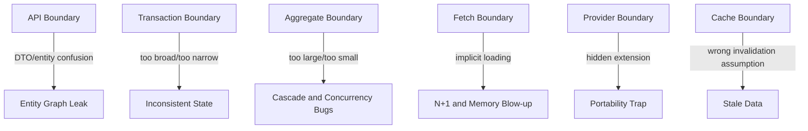
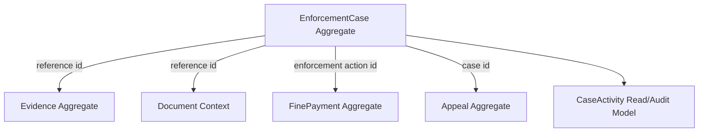

------
title: Learn Java Persistence, Database Integration, JPA, Hibernate ORM & EclipseLink - Part 030
description: Anti-patterns and common pitfalls in Java Persistence, JPA, Hibernate ORM, and EclipseLink: god entities, cascade abuse, merge abuse, DTO/entity confusion, N+1, transaction leaks, caching bugs, and portability traps.
series: learn-java-persistence
seriesTitle: Learn Java Persistence, Database Integration, JPA, Hibernate ORM & EclipseLink
order: 30
partTitle: Anti-Patterns and Common Pitfalls
tags:
- java
- jakarta-persistence
- jpa
- hibernate
- eclipselink
- orm
- anti-patterns
- pitfalls
- production
- architecture
date: 2026-06-27
---

# Part 030 — Anti-Patterns and Common Pitfalls

> Target utama part ini: mampu mengenali desain persistence yang tampak produktif di awal tetapi berubah menjadi sumber data corruption, N+1, inconsistent transaction, memory blow-up, deadlock, migration pain, dan API/domain coupling.

Anti-pattern persistence jarang muncul sebagai error compile. Biasanya muncul sebagai:

- query mendadak ratusan saat traffic naik;
- `LazyInitializationException` atau lazy loading di serializer;
- duplicate row atau missing update;
- entity “berhasil disimpan” tetapi state salah;
- cache mengembalikan data stale;
- transaction terlalu panjang;
- database lock wait;
- migration susah karena entity terlalu mirip API;
- test pass tetapi production gagal.

Part ini adalah katalog failure. Setiap anti-pattern dijelaskan dengan gejala, akar masalah, contoh buruk, desain yang lebih baik, dan checklist deteksi.

---

## 1. Mental Model: ORM Anti-Patterns Are Boundary Bugs

Sebagian besar pitfall JPA/Hibernate/EclipseLink bisa dilacak ke boundary yang salah:



JPA bukan sekadar persistence API. Ia adalah runtime state manager. Anti-pattern muncul ketika developer memperlakukannya sebagai:

- JSON serializer;
- remote object graph loader;
- generic CRUD engine;
- schema migration tool;
- workflow engine;
- distributed cache;
- message broker;
- magic transaction manager.

---

## 2. Anti-Pattern: God Entity

### Symptom

Satu entity punya terlalu banyak field, terlalu banyak association, terlalu banyak lifecycle, dan menjadi pusat semua use case.

```java
@Entity
public class EnforcementCase {
    @OneToMany(mappedBy = "caseRef", cascade = CascadeType.ALL)
    private List<Allegation> allegations;

    @OneToMany(mappedBy = "caseRef", cascade = CascadeType.ALL)
    private List<EvidenceItem> evidence;

    @OneToMany(mappedBy = "caseRef", cascade = CascadeType.ALL)
    private List<DocumentFile> documents;

    @OneToMany(mappedBy = "caseRef", cascade = CascadeType.ALL)
    private List<Payment> payments;

    @OneToMany(mappedBy = "caseRef", cascade = CascadeType.ALL)
    private List<Appeal> appeals;

    @OneToMany(mappedBy = "caseRef", cascade = CascadeType.ALL)
    private List<ActivityLog> activities;

    // 80 more fields and methods
}
```

### Root Cause

Developer menganggap semua yang punya `case_id` harus menjadi bagian dari aggregate yang sama.

Relational foreign key bukan aggregate boundary.

### Consequences

- command kecil memuat graph besar;
- dirty checking mahal;
- cascade tidak terkendali;
- optimistic lock conflict meningkat;
- fetch plan sulit;
- serialization risk tinggi;
- migration lebih sulit;
- entity menjadi dumping ground.

### Better Design

Pisahkan berdasarkan lifecycle dan consistency.



Use reference/value object:

```java
@Embeddable
public record CaseReference(UUID caseId, String referenceNumber) {}
```

### Detection Checklist

- Does one entity have more than 5 collection associations?
- Does every endpoint start by loading the same root entity?
- Are unrelated lifecycle changes causing optimistic lock conflicts?
- Are some child rows never needed for command handling?
- Does `cascade = ALL` appear on almost every relation?

If yes, suspect god entity.

---

## 3. Anti-Pattern: Bidirectional Everywhere

### Symptom

Every relation is bidirectional “just in case”.

```java
@Entity
public class Officer {
    @OneToMany(mappedBy = "assignedOfficer")
    private List<EnforcementCase> assignedCases;
}

@Entity
public class EnforcementCase {
    @ManyToOne
    private Officer assignedOfficer;
}
```

### Root Cause

Developer confuses navigability in Java with queryability in SQL.

You do not need `officer.getAssignedCases()` to query cases by officer.

### Consequences

- graph cycles;
- JSON recursion;
- helper method complexity;
- stale in-memory sides if not synchronized;
- accidental cascade temptation;
- more dirty checking;
- harder equality/toString.

### Better Design

Default to unidirectional unless domain behavior needs both directions.

```java
@Entity
public class EnforcementCase {
    @ManyToOne(fetch = FetchType.LAZY, optional = false)
    @JoinColumn(name = "assigned_officer_id", nullable = false)
    private Officer assignedOfficer;
}
```

Query instead of navigation:

```java
public List<EnforcementCaseSummary> findCasesAssignedTo(UUID officerId) {
    return em.createQuery("""
            select new com.example.EnforcementCaseSummary(c.id, c.referenceNumber, c.stage)
            from EnforcementCase c
            where c.assignedOfficer.id = :officerId
            order by c.createdAt desc
            """, EnforcementCaseSummary.class)
            .setParameter("officerId", officerId)
            .getResultList();
}
```

---

## 4. Anti-Pattern: Cascade-All Abuse

### Symptom

`cascade = CascadeType.ALL` copied everywhere.

```java
@ManyToOne(fetch = FetchType.LAZY, cascade = CascadeType.ALL)
@JoinColumn(name = "subject_id")
private CaseSubject subject;
```

### Root Cause

Cascade is treated as “save convenience” instead of lifecycle ownership.

### Consequences

- saving case accidentally saves/updates subject;
- deleting case deletes shared reference data;
- detached graph merge updates too much;
- persistence boundary becomes invisible;
- data corruption risk.

### Correct Rule

Cascade only when parent owns child lifecycle.

| Relationship | Cascade? | Reason |
|---|---:|---|
| `EnforcementCase -> EscalationRecord` | Usually yes | Child cannot exist without case. |
| `EnforcementCase -> CaseSubject` | Usually no | Subject has independent lifecycle. |
| `Order -> OrderLine` | Usually yes | Line belongs to order. |
| `Payment -> CustomerAccount` | No | Account independent. |
| `Case -> Officer` | No | Officer independent. |

Better:

```java
@ManyToOne(fetch = FetchType.LAZY, optional = false)
@JoinColumn(name = "subject_id", nullable = false)
private CaseSubject subject;

@OneToMany(mappedBy = "caseRef", cascade = CascadeType.ALL, orphanRemoval = true)
private List<EscalationRecord> escalations = new ArrayList<>();
```

### Review Question

If the parent is deleted, should the child be deleted too?

If answer is “no” or “not always”, do not use `CascadeType.REMOVE`/`ALL` blindly.

---

## 5. Anti-Pattern: Orphan Removal Misunderstood

### Symptom

Removing an item from collection unexpectedly deletes row.

```java
@OneToMany(mappedBy = "caseRef", cascade = CascadeType.ALL, orphanRemoval = true)
private List<EvidenceItem> evidenceItems;
```

```java
caseEntity.getEvidenceItems().remove(item); // DELETE row at flush
```

### Root Cause

`orphanRemoval = true` means child removed from parent collection becomes orphan and is deleted.

### Correct Use

Use it for private-owned child entities:

- order line;
- escalation record;
- embedded-like child row;
- internal aggregate member.

Avoid for independently meaningful records:

- evidence artifact with retention obligation;
- audit activity;
- payment transaction;
- legal document;
- external registry snapshot.

### Safer Alternative

Use explicit state:

```java
public void markEvidenceWithdrawn(EvidenceItem item, UUID actorId, Clock clock) {
    item.withdraw(actorId, clock.instant());
}
```

Instead of physical deletion.

---

## 6. Anti-Pattern: Public Mutable Collections

### Symptom

Entity exposes internal collection directly.

```java
public List<EscalationRecord> getEscalations() {
    return escalations;
}
```

External code mutates aggregate without rules.

```java
caseEntity.getEscalations().clear();
```

### Consequences

- invariants bypassed;
- orphan removal deletes rows accidentally;
- bidirectional association not maintained;
- audit/domain event missing;
- transaction side effects invisible.

### Better Design

```java
public List<EscalationRecord> escalations() {
    return Collections.unmodifiableList(escalations);
}

public void escalate(String reason, UUID actorId, Clock clock) {
    assertCanEscalate();
    EscalationRecord record = EscalationRecord.create(this, reason, actorId, clock.instant());
    escalations.add(record);
    domainEvents.add(new CaseEscalated(id, reason, actorId, clock.instant()));
}
```

---

## 7. Anti-Pattern: Blind `merge()`

### Symptom

Detached entity from API is merged directly.

```java
@PutMapping("/cases/{id}")
@Transactional
public void update(@RequestBody EnforcementCase requestBody) {
    em.merge(requestBody);
}
```

### Root Cause

`merge()` copies state from detached object into a managed instance. It is not a safe “update this JSON” operation.

### Consequences

- client can overwrite fields it should not control;
- missing JSON fields may become null depending mapping layer;
- associations can be replaced accidentally;
- stale data overwrites current data;
- cascade merge walks large graph;
- security boundary collapses.

### Better Design

Use command DTO and load managed aggregate.

```java
public record UpdateCasePriorityCommand(
        UUID caseId,
        long expectedVersion,
        CasePriority priority,
        UUID actorId
) {}
```

```java
@Transactional
public void updatePriority(UpdateCasePriorityCommand command) {
    EnforcementCase c = cases.findForCommand(command.caseId()).orElseThrow();
    c.requireVersion(command.expectedVersion());
    c.changePriority(command.priority(), command.actorId(), clock);
    outbox.enqueueAll(c.pullDomainEvents());
}
```

### When `merge()` Is Acceptable

- controlled offline editing with complete aggregate snapshot;
- internal batch process with trusted object graph;
- provider/session boundary transfer where semantics are understood.

Even then, use carefully and prefer returned managed instance:

```java
EnforcementCase managed = em.merge(detached);
// use managed, not detached
```

---

## 8. Anti-Pattern: Ignoring Return Value of `merge()`

### Symptom

```java
@Transactional
public void update(EnforcementCase detached) {
    em.merge(detached);
    detached.close(...); // modifies detached object, not managed copy
}
```

### Consequence

Changes after `merge()` on detached instance are ignored.

### Correct

```java
@Transactional
public void update(EnforcementCase detached) {
    EnforcementCase managed = em.merge(detached);
    managed.close(...);
}
```

Better: avoid detached entity command altogether.

---

## 9. Anti-Pattern: Entity as API DTO

### Symptom

REST endpoint returns JPA entity directly.

```java
@GetMapping("/cases/{id}")
public EnforcementCase get(@PathVariable UUID id) {
    return repo.findById(id).orElseThrow();
}
```

### Root Cause

Developer uses entity as transport model.

### Consequences

- lazy loading during serialization;
- N+1 query storm;
- cyclic references;
- leaks internal fields;
- API contract tied to database schema;
- accidental writes via request body;
- security exposure.

### Better Design

Use query projection/read DTO.

```java
public record CaseDetailResponse(
        UUID id,
        String referenceNumber,
        CaseStage stage,
        CaseStatus status,
        SubjectSummary subject,
        List<AllegationSummary> allegations,
        long version
) {}
```

Repository/query service returns DTO.

---

## 10. Anti-Pattern: Open Session in View as Architecture Crutch

### Symptom

Lazy loading works in controller/view because persistence context remains open through web request.

### Why It Feels Good

- fewer `LazyInitializationException` errors;
- less explicit fetch planning;
- faster prototyping.

### Why It Hurts

- query execution leaks into serialization/view;
- N+1 hidden until production;
- transaction boundary becomes conceptually unclear;
- response shape controls DB access accidentally;
- database connection can be held longer;
- performance debugging becomes harder.

### Better Design

Close persistence boundary in service/query layer and return DTO.

```java
@Transactional(readOnly = true)
public CaseDetailResponse getCaseDetail(UUID caseId) {
    return caseQueries.findCaseDetail(caseId)
            .orElseThrow(NotFoundException::new);
}
```

If using entities internally, fetch what is needed explicitly before leaving transaction.

---

## 11. Anti-Pattern: EAGER as LazyInitialization Fix

### Symptom

```java
@OneToMany(fetch = FetchType.EAGER)
private List<Allegation> allegations;
```

### Root Cause

`EAGER` is used to avoid lazy loading errors.

### Consequences

- every load brings association even when not needed;
- impossible to make it lazy per query;
- query explosion or large joins;
- pagination issues;
- memory pressure;
- unpredictable provider strategy.

### Better Design

Keep associations lazy by default and design fetch plan per use case:

- JPQL join fetch;
- entity graph;
- DTO projection;
- explicit second query;
- batch fetching for repeated lazy access.

---

## 12. Anti-Pattern: N+1 Denial

### Symptom

Code looks innocent:

```java
List<EnforcementCase> cases = em.createQuery("""
        select c from EnforcementCase c
        where c.status = :status
        """, EnforcementCase.class)
        .setParameter("status", CaseStatus.OPEN)
        .getResultList();

for (EnforcementCase c : cases) {
    System.out.println(c.subject().legalName());
}
```

SQL:

```text
select * from enforcement_case where status = ?
select * from case_subject where id = ?
select * from case_subject where id = ?
select * from case_subject where id = ?
...
```

### Root Cause

Accessing lazy association in loop without fetch plan.

### Better Options

Join fetch for aggregate use:

```java
select c
from EnforcementCase c
join fetch c.subject
where c.status = :status
```

Projection for read API:

```java
select new com.example.CaseRow(c.id, c.referenceNumber, s.legalName)
from EnforcementCase c
join c.subject s
where c.status = :status
```

Batch fetch if repeated association access is unavoidable and provider supports it:

```java
@BatchSize(size = 50) // Hibernate-specific
@ManyToOne(fetch = FetchType.LAZY)
private CaseSubject subject;
```

### Detection

- Enable SQL logging in development.
- Use Hibernate statistics in tests.
- Assert query count for important endpoints.
- Inspect production slow query/DB metrics.

---

## 13. Anti-Pattern: Multiple Collection Join Fetch

### Symptom

```java
select c
from EnforcementCase c
left join fetch c.allegations
left join fetch c.evidenceItems
left join fetch c.activities
where c.id = :id
```

### Root Cause

Trying to load several to-many collections in one query.

### Consequences

Cartesian product.

If case has:

- 5 allegations;
- 10 evidence items;
- 20 activities;

The query can produce 5 × 10 × 20 = 1000 rows for one case.

### Better Design

- load aggregate core first;
- fetch one collection if truly needed;
- load other collections with separate queries;
- use DTO projections;
- use batch/subselect fetch provider features;
- split endpoint/read model.

---

## 14. Anti-Pattern: Pagination with Collection Fetch Join

### Symptom

```java
select c
from EnforcementCase c
left join fetch c.allegations
order by c.createdAt desc
```

Then:

```java
query.setFirstResult(0);
query.setMaxResults(20);
```

### Root Cause

Pagination applies to SQL rows, but collection fetch join duplicates root rows.

### Consequences

- wrong page size;
- in-memory pagination warning/error;
- missing/duplicated root entities;
- poor performance.

### Better Design

Two-step pagination:

1. Page root ids.
2. Fetch graph by ids.

```java
List<UUID> ids = em.createQuery("""
        select c.id
        from EnforcementCase c
        where c.status = :status
        order by c.createdAt desc
        """, UUID.class)
        .setParameter("status", CaseStatus.OPEN)
        .setFirstResult(page.offset())
        .setMaxResults(page.size())
        .getResultList();
```

Then:

```java
List<EnforcementCase> cases = em.createQuery("""
        select distinct c
        from EnforcementCase c
        left join fetch c.allegations
        where c.id in :ids
        """, EnforcementCase.class)
        .setParameter("ids", ids)
        .getResultList();
```

For dashboards, prefer projection.

---

## 15. Anti-Pattern: `findAll()` in Production Paths

### Symptom

```java
List<EnforcementCase> cases = repository.findAll();
```

### Root Cause

Repository convenience leaks into production use case.

### Consequences

- unbounded memory;
- huge transaction/persistence context;
- accidental lazy loading;
- long database locks or snapshots;
- unstable response time.

### Better Design

- pagination;
- streaming with careful transaction scope;
- keyset pagination;
- batch processing with flush/clear;
- explicit filters;
- database-side aggregation.

```java
public Slice<CaseDashboardRow> findOpenCases(CaseFilter filter, PageRequest page) {
    // bounded query only
}
```

Review smell: any production endpoint or job using `findAll()` deserves scrutiny.

---

## 16. Anti-Pattern: Persistence Context as Batch Buffer Forever

### Symptom

Batch job persists 1 million entities in one transaction without clearing.

```java
@Transactional
public void importRows(List<Row> rows) {
    for (Row row : rows) {
        em.persist(map(row));
    }
}
```

### Consequences

- first-level cache grows indefinitely;
- dirty checking cost grows;
- memory blow-up;
- huge rollback segment;
- long locks;
- transaction timeout.

### Better Design

Chunk processing:

```java
public void importRows(List<Row> rows) {
    int count = 0;
    for (Row row : rows) {
        em.persist(map(row));
        count++;
        if (count % 1000 == 0) {
            em.flush();
            em.clear();
        }
    }
}
```

Even better: separate transaction per chunk.

For very large stateless operations, consider provider-specific stateless session or JDBC bulk loader.

---

## 17. Anti-Pattern: Transaction Too Wide

### Symptom

```java
@Transactional
public void processCase(UUID caseId) {
    EnforcementCase c = repo.findById(caseId).orElseThrow();
    ExternalRiskScore score = riskClient.fetch(c.subjectId());
    c.applyRiskScore(score);
    documentClient.generateReport(c.id());
    repo.save(c);
}
```

### Root Cause

Transaction includes external I/O.

### Consequences

- database connection held while waiting for network;
- lock duration increases;
- retries ambiguous;
- external side effects cannot roll back;
- throughput collapses under latency.

### Better Design

Separate phases:

1. Fetch external data before transaction if safe.
2. Open transaction.
3. Mutate aggregate and outbox.
4. Commit.
5. Publish/side effects asynchronously.

```java
public void processCase(UUID caseId) {
    ExternalRiskScore score = riskClient.fetchByCase(caseId);

    transactionTemplate.executeWithoutResult(status -> {
        EnforcementCase c = repo.findForCommand(caseId).orElseThrow();
        c.applyRiskScore(score, clock);
        outbox.enqueueAll(c.pullDomainEvents());
    });
}
```

If external data must be consistent at point of mutation, store snapshot metadata and design compensation/retry.

---

## 18. Anti-Pattern: Transaction Too Narrow

### Symptom

```java
EnforcementCase c = repo.findById(caseId).orElseThrow();
c.escalate(...);
repo.save(c);
```

But each repository method has separate transaction or no transaction.

### Consequences

- entity detached unexpectedly;
- lazy loading fails;
- no atomicity across changes;
- dirty checking may not run;
- inconsistent writes.

### Better Design

Transaction at use-case boundary:

```java
@Transactional
public void escalate(EscalateCaseCommand command) {
    EnforcementCase c = cases.findForCommand(command.caseId()).orElseThrow();
    c.escalate(command.reason(), command.actorId(), clock);
    outbox.enqueueAll(c.pullDomainEvents());
}
```

---

## 19. Anti-Pattern: Self-Invocation Transaction Trap

### Symptom

In proxy-based frameworks, method calls inside same class may bypass transactional proxy.

```java
@Service
public class CaseService {

    public void outer() {
        inner(); // may not apply @Transactional proxy behavior
    }

    @Transactional
    public void inner() {
        // expected transaction
    }
}
```

### Better Design

- put transaction on public use-case entry method;
- avoid relying on internal proxy calls;
- use separate collaborator if propagation boundary is intentional;
- use programmatic transaction template when needed.

---

## 20. Anti-Pattern: Read-Only Transaction Misunderstood

### Symptom

Developer assumes `readOnly = true` guarantees no database write.

```java
@Transactional(readOnly = true)
public CaseDetailResponse getCase(UUID id) {
    EnforcementCase c = repo.findById(id).orElseThrow();
    c.markViewed(); // mutation inside read-only method
    return mapper.toResponse(c);
}
```

### Root Cause

Read-only is often optimization/hint, not business guardrail.

### Better Design

- do not mutate in query service;
- separate command from query;
- tests should detect unexpected update SQL;
- use immutable DTO projections for reads.

---

## 21. Anti-Pattern: Bulk Update without Persistence Context Awareness

### Symptom

```java
@Transactional
public void closeOldCases() {
    List<EnforcementCase> cases = findOldOpenCases();

    em.createQuery("""
            update EnforcementCase c
            set c.status = :closed
            where c.createdAt < :cutoff
            """)
            .setParameter("closed", CaseStatus.CLOSED)
            .setParameter("cutoff", cutoff)
            .executeUpdate();

    cases.get(0).escalate(...); // stale managed state
}
```

### Root Cause

JPQL bulk update/delete bypasses managed entity state and lifecycle callbacks.

### Consequences

- persistence context stale;
- version not updated unless manually handled;
- domain events not emitted;
- audit missing;
- callbacks not run.

### Better Design

After bulk operation:

```java
em.clear();
```

But more importantly, ask whether bulk operation should bypass domain behavior. For regulatory lifecycle transitions, often no.

Use bulk update for technical maintenance where acceptable:

- mark expired tokens;
- archive old read-model rows;
- update denormalized counters with controlled process;
- cleanup temporary data.

Do not use it casually for domain transitions requiring audit/event.

---

## 22. Anti-Pattern: equals/hashCode Based on Mutable Fields

### Symptom

```java
@Override
public boolean equals(Object o) {
    return Objects.equals(referenceNumber, ((EnforcementCase) o).referenceNumber)
            && status == ((EnforcementCase) o).status;
}

@Override
public int hashCode() {
    return Objects.hash(referenceNumber, status);
}
```

Then `status` changes while entity is inside `HashSet`.

### Consequences

- entity becomes unfindable in hash collection;
- collection diffing breaks;
- duplicate insert/delete behavior;
- subtle bugs in sets/maps.

### Better Design

Use stable natural key if immutable, or carefully use id once assigned. Avoid mutable fields.

```java
@Override
public final boolean equals(Object o) {
    if (this == o) return true;
    if (!(o instanceof EnforcementCase other)) return false;
    return id != null && id.equals(other.id);
}

@Override
public final int hashCode() {
    return getClass().hashCode();
}
```

This is not the only valid strategy, but it avoids hash change after id assignment. Proxy/inheritance rules must be reviewed for your provider.

---

## 23. Anti-Pattern: Lombok `@Data` on Entity

### Symptom

```java
@Data
@Entity
public class EnforcementCase {
    @OneToMany(mappedBy = "caseRef")
    private List<Allegation> allegations;
}
```

### Root Cause

`@Data` generates getters, setters, `equals`, `hashCode`, and `toString` without ORM semantics.

### Consequences

- `toString()` triggers lazy loading or recursion;
- `equals/hashCode` includes mutable/lazy fields;
- setters expose invalid mutation paths;
- bidirectional association recursion;
- security leak in logs.

### Better Design

Use explicit methods. If using Lombok, use narrowly:

```java
@Getter
@NoArgsConstructor(access = AccessLevel.PROTECTED)
@Entity
public class EnforcementCase {
    // no @Data
}
```

Still review generated methods.

---

## 24. Anti-Pattern: Database Constraint Avoidance

### Symptom

All rules are only in Java validation.

```java
if (repository.existsByReferenceNumber(ref)) {
    throw new DuplicateReferenceException();
}
caseRepository.add(new EnforcementCase(ref));
```

No unique constraint in database.

### Root Cause

Developer trusts application checks under concurrency.

### Consequences

Race condition:

```text
T1: exists(ref) -> false
T2: exists(ref) -> false
T1: insert ref
T2: insert ref
```

### Better Design

Use database constraints plus friendly error handling.

```sql
alter table enforcement_case
add constraint uk_enforcement_case_reference unique (reference_number);
```

Application may still pre-check for UX, but database is final authority.

---

## 25. Anti-Pattern: Enum Ordinal Mapping

### Symptom

```java
@Enumerated(EnumType.ORDINAL)
private CaseStage stage;
```

### Root Cause

Default or compact storage preference.

### Consequences

Reordering enum constants corrupts meaning.

```java
public enum CaseStage {
    INTAKE, ASSESSMENT, INVESTIGATION
}
```

Later:

```java
public enum CaseStage {
    INTAKE, TRIAGE, ASSESSMENT, INVESTIGATION
}
```

Existing ordinal values now mean different things.

### Better Design

```java
@Enumerated(EnumType.STRING)
@Column(nullable = false, length = 40)
private CaseStage stage;
```

For stable external code values, use `AttributeConverter`.

---

## 26. Anti-Pattern: Time Zone Ambiguity

### Symptom

Using `LocalDateTime` for event/audit timestamps.

```java
private LocalDateTime escalatedAt;
```

### Root Cause

Local date-time is convenient but lacks instant/offset semantics.

### Consequences

- ambiguous audit time;
- timezone conversion bugs;
- daylight saving issues;
- cross-region reporting errors.

### Better Design

For event/audit timestamps, use `Instant`.

```java
@Column(nullable = false)
private Instant escalatedAt;
```

Use `LocalDate` for calendar date concepts such as filing date/deadline date when business meaning is date-only.

---

## 27. Anti-Pattern: Database Default Surprise

### Symptom

Database has default value, but JPA inserts null.

```sql
status varchar(40) default 'OPEN' not null
```

Entity:

```java
@Column(nullable = false)
private CaseStatus status;
```

If entity field is null and provider includes column in insert, database default may not apply.

### Better Design

Initialize in domain constructor/factory.

```java
public static EnforcementCase openNew(...) {
    EnforcementCase c = new EnforcementCase();
    c.status = CaseStatus.OPEN;
    c.stage = CaseStage.INTAKE;
    return c;
}
```

Use database defaults for external writes/migration safety, not as primary domain initialization.

---

## 28. Anti-Pattern: Hidden Provider Dependency

### Symptom

Codebase claims provider portability but uses provider-specific annotations everywhere without isolation.

```java
@BatchSize(size = 50)
@Where(clause = "deleted = false")
@Filter(name = "tenantFilter")
@Entity
public class EnforcementCase { ... }
```

### Root Cause

Provider feature used as convenience without architectural decision.

### Consequences

- migration to EclipseLink/other provider expensive;
- test behavior differs;
- team forgets what is standard vs provider-specific;
- native-image/runtime integration harder.

### Better Design

Provider-specific features are allowed, but make them explicit:

- document decision;
- isolate in infrastructure where possible;
- add provider behavior tests;
- expose standard repository contract;
- avoid mixing provider-specific features into core domain unless accepted.

Use an escape hatch consciously, not accidentally.

---

## 29. Anti-Pattern: Soft Delete as Just a Boolean

### Symptom

```java
private boolean deleted;
```

Queries manually remember:

```java
where c.deleted = false
```

### Root Cause

Soft delete is treated as a field, not lifecycle policy.

### Consequences

- some queries forget filter;
- unique constraints become tricky;
- associations reference deleted records;
- audit semantics unclear;
- restore behavior undefined;
- cache may return deleted entities.

### Better Design

Define policy:

- What does delete mean legally?
- Who can see deleted records?
- Are deleted records restorable?
- Do unique constraints apply to deleted rows?
- Should delete emit domain event?
- Should delete cascade to private children?
- Should read models include/exclude deleted rows?

Implementation options:

- explicit status enum;
- repository methods always filter active records;
- database partial indexes where supported;
- provider-specific soft delete annotation/filter if accepted;
- audit record for deletion.

For regulated systems, “delete” is often “withdraw”, “void”, “supersede”, or “archive”, not physical delete.

---

## 30. Anti-Pattern: Second-Level Cache as Performance Silver Bullet

### Symptom

Enable second-level cache globally to make slow system fast.

### Root Cause

Caching is applied before query/model problem is understood.

### Consequences

- stale data;
- invalidation complexity;
- multi-node consistency issues;
- memory pressure;
- security/tenant leakage risk;
- hides inefficient access pattern temporarily.

### Better Decision

Cache only data that is:

- read often;
- changes rarely;
- acceptable if slightly stale or has clear invalidation;
- not tenant/security sensitive unless keying is correct;
- measured with hit/miss metrics.

Good candidates:

- reference data;
- code lists;
- mostly static configuration;
- small lookup tables.

Bad candidates:

- frequently changing case state;
- workflow tasks;
- authorization-sensitive records;
- high-cardinality dashboard queries.

---

## 31. Anti-Pattern: Query Cache Misuse

### Symptom

Enable query cache for dynamic dashboard queries.

### Root Cause

Misunderstanding what query cache stores: usually result identifiers/scalars keyed by query + parameters, with invalidation complexity.

### Consequences

- low hit rate;
- high invalidation churn;
- memory waste;
- stale assumptions;
- little benefit.

### Better Design

For dashboard/report performance:

- DTO projection;
- proper indexes;
- materialized view;
- denormalized read model;
- search index;
- query plan tuning;
- pagination/keyset pagination.

Use query cache only after measuring stable repeated queries.

---

## 32. Anti-Pattern: Lazy Loading in `equals`, `hashCode`, or `toString`

### Symptom

```java
@Override
public String toString() {
    return "Case{" + subject.getLegalName() + ", allegations=" + allegations + "}";
}
```

### Consequences

- logs trigger SQL;
- detached entity throws lazy loading error;
- recursive toString;
- security leak;
- performance cliff.

### Better Design

Keep these methods minimal and do not traverse associations.

```java
@Override
public String toString() {
    return "EnforcementCase{id=" + id + ", referenceNumber='" + referenceNumber + "'}";
}
```

---

## 33. Anti-Pattern: Entity Listener with Heavy Dependencies

### Symptom

```java
@PostPersist
public void afterPersist() {
    emailClient.send(...);
}
```

### Root Cause

Lifecycle callbacks used for business workflow/integration.

### Consequences

- external side effect before commit completion;
- hidden transaction behavior;
- test complexity;
- dependency injection issues;
- retry/rollback mismatch.

### Better Use

Lifecycle callbacks are acceptable for local technical metadata:

```java
@PrePersist
void prePersist() {
    this.createdAt = Instant.now(clock); // even this is tricky if clock injection unavailable
}
```

In practice, prefer application service or auditing infrastructure for anything non-trivial.

For integration, use domain event + outbox.

---

## 34. Anti-Pattern: Entity Graph as Universal Solution

### Symptom

Every query gets a huge entity graph.

```java
@NamedEntityGraph(
    name = "case.everything",
    attributeNodes = {
        @NamedAttributeNode("subject"),
        @NamedAttributeNode("allegations"),
        @NamedAttributeNode("evidenceItems"),
        @NamedAttributeNode("activities"),
        @NamedAttributeNode("actions"),
        @NamedAttributeNode("appeals")
    }
)
```

### Root Cause

Entity graph is used to avoid thinking about use-case-specific data shape.

### Consequences

- large graph load;
- Cartesian product or multiple selects;
- memory pressure;
- accidental mutation of read data;
- DTO still needed.

### Better Design

Name graphs by use case:

```java
@NamedEntityGraph(
    name = "EnforcementCase.commandEscalation",
    attributeNodes = {
        @NamedAttributeNode("subject"),
        @NamedAttributeNode("escalations")
    }
)
```

For read-only API, projection may be better.

---

## 35. Anti-Pattern: Entity Inheritance for Every Taxonomy

### Symptom

Every variation becomes subclass.

```java
@Entity
@Inheritance(strategy = InheritanceType.JOINED)
public abstract class EnforcementAction { ... }

@Entity
public class FineAction extends EnforcementAction { ... }

@Entity
public class WarningAction extends EnforcementAction { ... }

@Entity
public class SuspensionAction extends EnforcementAction { ... }
```

This may be valid. But it becomes anti-pattern when taxonomy changes often or behavior is mostly data-driven.

### Consequences

- schema evolution pain;
- polymorphic query cost;
- joins everywhere;
- hard-to-change class hierarchy;
- null columns or table explosion.

### Alternative

Use type + components/value objects where appropriate.

```java
@Entity
public class EnforcementAction {
    @Enumerated(EnumType.STRING)
    private EnforcementActionType type;

    @Embedded
    private FineDetails fineDetails;

    @Embedded
    private SuspensionDetails suspensionDetails;
}
```

Or separate aggregate per action type if lifecycle diverges strongly.

---

## 36. Anti-Pattern: Many-to-Many as Domain Shortcut

### Symptom

```java
@ManyToMany
@JoinTable(name = "case_officer")
private Set<Officer> officers;
```

### Root Cause

Join table treated as invisible technical detail.

### Consequences

Often the association later needs attributes:

- assigned role;
- assigned at;
- assigned by;
- active/inactive;
- conflict-of-interest flag;
- workload share.

Then many-to-many becomes painful.

### Better Design

Use association entity.

```java
@Entity
@Table(name = "case_assignment")
public class CaseAssignment {

    @Id
    private UUID id;

    @ManyToOne(fetch = FetchType.LAZY, optional = false)
    private EnforcementCase caseRef;

    @ManyToOne(fetch = FetchType.LAZY, optional = false)
    private Officer officer;

    @Enumerated(EnumType.STRING)
    private AssignmentRole role;

    private Instant assignedAt;
    private UUID assignedBy;
}
```

Default rule: if relation can have metadata, lifecycle, audit, or domain meaning, model the join table explicitly.

---

## 37. Anti-Pattern: No Observability for Persistence

### Symptom

Production issue occurs, but team cannot answer:

- How many queries did endpoint execute?
- Which query is slow?
- Did N+1 happen?
- How many entities loaded?
- How often optimistic lock fails?
- What is cache hit ratio?
- Is connection pool exhausted?
- Which transaction timed out?

### Better Design

Minimum observability:

- SQL slow query logging;
- application metrics for repository/query methods;
- Hibernate statistics in non-prod/perf tests;
- connection pool metrics;
- transaction timeout metrics;
- deadlock/lock wait monitoring;
- query plan capture for critical queries;
- query count tests for known endpoints.

---

## 38. Anti-Pattern: Test Transaction Illusion

### Symptom

Tests pass because framework wraps each test in rollback transaction.

```java
@Transactional
@SpringBootTest
class CaseRepositoryTest { ... }
```

### Hidden Problems

- commit-time constraints not observed;
- outbox worker behavior not tested;
- transaction propagation differs from production;
- lazy loading works because transaction stays open;
- flush not forced;
- database triggers/defaults not observed until flush/commit.

### Better Testing

- force `flush()` and `clear()` in repository tests;
- test behavior after commit where relevant;
- use Testcontainers or production-like database;
- assert SQL count for fetch-sensitive paths;
- test optimistic lock with separate transactions;
- test migration scripts.

Example:

```java
em.flush();
em.clear();

EnforcementCase reloaded = em.find(EnforcementCase.class, caseId);
assertThat(reloaded.status()).isEqualTo(CaseStatus.ESCALATED);
```

---

## 39. Anti-Pattern: Schema Generation in Production

### Symptom

Application auto-updates production schema from entities.

### Root Cause

DDL generation is treated as migration management.

### Consequences

- uncontrolled schema changes;
- data loss risk;
- no review/audit;
- environment drift;
- rollback difficult;
- provider-generated DDL may not match operational standards.

### Better Design

- use migration tool;
- validate schema on startup;
- generate DDL only for local/dev aid;
- review migrations like code;
- test migrations against production-like data;
- use expand-contract for zero/low downtime.

---

## 40. Anti-Pattern: Ignoring Database Indexes Because “ORM Handles It”

### Symptom

Query is written in JPQL and assumed optimized.

```java
select c
from EnforcementCase c
where c.status = :status
  and c.stage = :stage
  and c.createdAt between :from and :to
order by c.createdAt desc
```

No supporting index.

### Root Cause

ORM abstraction hides SQL, but database still executes SQL.

### Better Design

Design indexes around actual query patterns:

```sql
create index ix_case_status_stage_created_at
on enforcement_case(status, stage, created_at desc);
```

Review:

- filter columns;
- sort columns;
- join columns;
- uniqueness constraints;
- partial indexes if supported;
- cardinality/selectivity;
- write overhead.

ORM does not remove physical database design.

---

## 41. Anti-Pattern: Treating Persistence Exceptions as Generic 500

### Symptom

All database exceptions become internal server error.

### Better Classification

| Failure | Typical Meaning | User/System Response |
|---|---|---|
| Optimistic lock failure | Stale update | Return conflict/retry guidance. |
| Unique constraint violation | Duplicate command/business key | Return conflict/idempotent success. |
| Foreign key violation | Invalid reference or ordering bug | Usually application/data integrity error. |
| Deadlock/lock timeout | Concurrency contention | Retry if operation is idempotent. |
| Query timeout | Performance/resource issue | Fail fast, alert, tune. |
| Connection exhaustion | Capacity/leak | Incident response. |

Design exception translation close to infrastructure, but expose domain-meaningful errors upward.

---

## 42. Anti-Pattern: No Concurrency Story

### Symptom

No `@Version`, no unique constraints for invariants, no retry strategy, no idempotency key.

### Consequences

- lost updates;
- duplicate actions;
- inconsistent workflow state;
- hard-to-debug race bugs;
- user overwrites another user’s decision.

### Better Design

Minimum concurrency strategy:

- `@Version` on mutable aggregate roots;
- expected version in update commands;
- unique constraints for uniqueness invariants;
- idempotency table for retryable commands;
- pessimistic lock only for narrow high-contention cases;
- retry policy only for safe idempotent operations;
- tests using concurrent transactions.

---

## 43. Anti-Pattern: Hiding Expensive Work Behind Repository `save()`

### Symptom

`save()` triggers massive cascade, dirty checking, events, and queries.

```java
caseRepository.save(caseEntity);
```

Looks cheap. Actually mutates graph of hundreds of objects.

### Better Design

Make use-case mutation explicit.

```java
caseEntity.escalate(reason, actorId, clock);
```

Avoid generic service methods:

```java
saveCase(EnforcementCase c)
updateCase(EnforcementCase c)
processCase(EnforcementCase c)
```

Prefer command-specific use cases:

```java
escalateCase(EscalateCaseCommand command)
submitDecision(SubmitDecisionCommand command)
closeCase(CloseCaseCommand command)
```

---

## 44. Anti-Pattern: Repository Returns Managed Entity to Unbounded Caller

### Symptom

A managed entity escapes service layer and is mutated unpredictably before transaction ends.

### Root Cause

No clear application boundary.

### Better Design

- Keep transaction/use case small.
- Return DTO/read model from query service.
- Do not pass managed entities to async tasks.
- Do not store managed entities in session/cache/static fields.
- Do not expose entities to UI layer.

---

## 45. Anti-Pattern: Async with Managed Entity

### Symptom

```java
EnforcementCase c = repo.findById(caseId).orElseThrow();
executor.submit(() -> notificationService.send(c));
```

### Consequences

- entity detached in another thread;
- lazy loading failure;
- non-thread-safe persistence context;
- stale data;
- serialization surprises.

### Better Design

Pass immutable DTO/id.

```java
UUID caseId = c.id();
executor.submit(() -> notificationService.sendCaseNotification(caseId));
```

Or use outbox event.

---

## 46. Anti-Pattern: Multi-Tenant Filter Leakage

### Symptom

Tenant isolation implemented only as application-level predicate that some queries forget.

```java
where c.tenantId = :tenantId
```

### Consequences

- cross-tenant data exposure;
- cache leakage;
- security incident;
- audit failure.

### Better Design

Layer defenses:

- tenant id in schema/table and indexes;
- repository/query base predicates;
- provider filters if accepted;
- database row-level security if appropriate;
- tenant-aware cache keys;
- security tests that attempt cross-tenant access;
- avoid global shared second-level cache for tenant-sensitive entities unless configured correctly.

---

## 47. Anti-Pattern: Treating Native SQL as Failure

### Symptom

Team avoids native SQL even for database-native problems.

### Root Cause

False portability purity.

### Consequences

- worse performance;
- awkward JPQL;
- poor locking semantics;
- missed database features;
- unreadable Criteria hacks.

### Better View

Native SQL is valid when:

- query is reporting/analytics heavy;
- database-specific lock is required;
- CTE/window function/JSON operator is needed;
- batch update is intentionally set-based;
- projection/read model does not need entity lifecycle.

Rules:

- isolate native SQL in repository/query adapter;
- test against real database;
- document portability decision;
- do not return managed entities for complex native result unless mapping is clear;
- keep domain invariants outside native bulk updates unless deliberate.

---

## 48. Anti-Pattern: No Migration Path for Event/Payload Schema

### Symptom

Outbox payload stores JSON without version.

```json
{
  "caseId": "...",
  "reason": "..."
}
```

Later consumer needs new fields and old messages break.

### Better Design

Version event schema.

```json
{
  "eventType": "case.escalated",
  "eventVersion": "1",
  "occurredAt": "2026-06-27T10:15:30Z",
  "data": {
    "caseId": "...",
    "reason": "..."
  }
}
```

Store `event_type` and `event_version` as columns too.

---

## 49. Anti-Pattern: Overusing Entity Callbacks for Audit

### Symptom

Audit logic in `@PreUpdate` tries to detect business changes.

### Problem

Entity callbacks know technical lifecycle, not use-case intent.

A status changed from `OPEN` to `CLOSED`, but callback may not know:

- who did it;
- why;
- through which command;
- what approval was attached;
- whether notification needed.

### Better Design

Use domain method/application service for domain audit.

```java
public void close(ClosureReason reason, UUID actorId, Clock clock) {
    requireCanClose();
    this.status = CaseStatus.CLOSED;
    this.activities.add(CaseActivity.closed(this, reason, actorId, clock.instant()));
    this.domainEvents.add(new CaseClosed(id, reason.code(), actorId, clock.instant()));
}
```

Use callbacks only for technical audit like `updatedAt` if your framework supports it safely.

---

## 50. Anti-Pattern: Treating Provider Upgrade as Dependency Bump Only

### Symptom

Hibernate/EclipseLink version changed without persistence regression tests.

### Risks

- SQL generation changes;
- fetch strategy behavior changes;
- dialect changes;
- schema generation changes;
- lazy/proxy behavior changes;
- query parser stricter;
- deprecated provider features removed;
- bytecode enhancement differences.

### Better Upgrade Plan

- run repository integration tests on real database;
- compare SQL for critical paths;
- run query count tests;
- validate schema;
- test migration scripts;
- test lazy loading/proxy behavior;
- test second-level cache if used;
- test batch jobs;
- review provider migration guide.

---

## 51. Production Pitfall Diagnosis Matrix

| Symptom | Likely Cause | First Checks |
|---|---|---|
| Sudden many queries | N+1 lazy access | SQL logs, query count, serializer access. |
| Endpoint memory spike | huge graph fetch / `findAll()` | heap dump, loaded entity count, query result size. |
| Duplicate business key | missing DB unique constraint | schema constraints, race path. |
| Stale update | missing optimistic lock/expected version | `@Version`, command version. |
| Deadlock | inconsistent update order / wide transaction | DB deadlock report, transaction scope. |
| Slow flush | huge persistence context / dirty checking | entity count, batch size, flush timing. |
| Missing audit | bulk update/callback misuse | update path, domain event path. |
| Lazy exception | entity escaped transaction | service boundary, DTO mapping. |
| Data leaked across tenant | filter/cache bug | tenant predicate, cache key, tests. |
| Message published without DB state | broker call inside transaction | outbox design. |

---

## 52. Architecture Review Heuristics

Ask these questions before approving persistence-heavy code.

### Entity Design

- Does this entity represent domain behavior or only table shape?
- Are mutable fields guarded by methods?
- Are collections encapsulated?
- Are equality/hash rules stable?
- Are lazy associations excluded from `toString`, equality, and logs?

### Mapping

- Is cascade aligned with lifecycle ownership?
- Is orphan removal safe legally/domain-wise?
- Are enums stored safely?
- Are timestamps semantically correct?
- Are nullability and constraints enforced in DB too?

### Query

- Is fetch plan explicit?
- Is pagination safe?
- Are projections used for read endpoints?
- Are indexes designed for query patterns?
- Are native SQL decisions isolated and tested?

### Transaction

- Is transaction at use-case boundary?
- Does it avoid external I/O?
- Is retry/idempotency defined?
- Is optimistic locking in place?
- Are bulk operations allowed to bypass domain rules?

### Integration

- Are messages published via outbox?
- Are consumers idempotent?
- Are event schemas versioned?
- Is tenant/security boundary enforced below the API layer?

---

## 53. Refactoring Playbook

### From Entity-as-DTO to Projection

1. Create response DTO.
2. Add query method returning DTO/projection.
3. Stop exposing entity from controller.
4. Disable/avoid OSIV reliance.
5. Add query count test.

### From Cascade-All to Lifecycle Ownership

1. List every cascade relation.
2. Classify child as private-owned or independent.
3. Remove cascade from independent references.
4. Add explicit save/repository for independent aggregates.
5. Add deletion tests.

### From Anemic Service to Aggregate Behavior

1. Identify repeated rule checks in services.
2. Move local invariant into aggregate method.
3. Encapsulate setters/collections.
4. Add domain method tests.
5. Keep orchestration in application service.

### From Direct Publish to Outbox

1. Add outbox table/entity.
2. Capture domain events in aggregate.
3. Persist outbox rows in same transaction.
4. Add publisher worker.
5. Make consumer idempotent.
6. Add retry/dead-letter/observability.

### From `findAll()` Batch to Chunked Processing

1. Replace unbounded query with keyset/page query.
2. Process fixed-size chunks.
3. Flush/clear or separate transactions per chunk.
4. Measure memory and SQL batch behavior.
5. Add resume/idempotency marker.

---

## 54. Deliberate Practice

### Exercise 1 — Identify Anti-Patterns

Review this code:

```java
@Data
@Entity
public class EnforcementCase {
    @Id
    private UUID id;

    @Enumerated(EnumType.ORDINAL)
    private CaseStatus status;

    @ManyToOne(cascade = CascadeType.ALL, fetch = FetchType.EAGER)
    private CaseSubject subject;

    @OneToMany(mappedBy = "caseRef", cascade = CascadeType.ALL, orphanRemoval = true, fetch = FetchType.EAGER)
    private List<EvidenceItem> evidenceItems;
}
```

Find at least 8 issues and propose a corrected design.

### Exercise 2 — Fix Transaction Boundary

Refactor:

```java
@Transactional
public void issueFine(UUID caseId) {
    EnforcementCase c = repo.findById(caseId).orElseThrow();
    RiskScore score = externalRiskClient.fetch(c.subject().externalId());
    c.issueFine(score);
    paymentClient.createInvoice(c.id());
    kafka.publish(new FineIssued(c.id()));
}
```

Target:

- no external side effects inside DB transaction;
- clear snapshot handling;
- outbox event;
- idempotency;
- optimistic version.

### Exercise 3 — N+1 Test

Write an integration test that fails if case dashboard query performs more than 2 SQL statements for 20 rows.

### Exercise 4 — Bulk Update Review

A team proposes:

```java
update EnforcementCase c set c.status = CLOSED where c.deadline < :now
```

Decide whether it is acceptable. Consider audit, events, versioning, legal defensibility, and retry.

---

## 55. Key Takeaways

- Most ORM anti-patterns are boundary mistakes, not annotation mistakes.
- `CascadeType.ALL`, `EAGER`, `merge()`, `findAll()`, entity-as-DTO, and public collections are productivity traps.
- Lazy loading should be controlled by use-case fetch plans, not accidentally triggered by serializers/logging.
- Transaction boundary should be wide enough for consistency but narrow enough to avoid external I/O and long locks.
- Database constraints are part of domain correctness under concurrency.
- Bulk operations, callbacks, cache, and native SQL are powerful but bypass parts of the entity lifecycle; use them deliberately.
- Production-grade persistence requires observability: query count, slow query, pool metrics, lock waits, optimistic failure rate, and cache metrics.
- A mature persistence architecture is explicit about aggregate, transaction, fetch, provider, cache, and integration boundaries.

Next: Part 031 moves from anti-pattern recognition to **performance engineering and observability**: SQL logging, execution plans, Hibernate statistics, metrics, slow query diagnosis, pool interaction, and regression detection.
