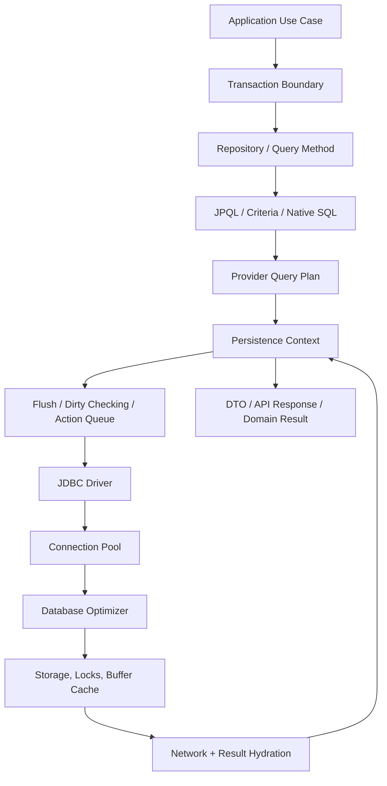
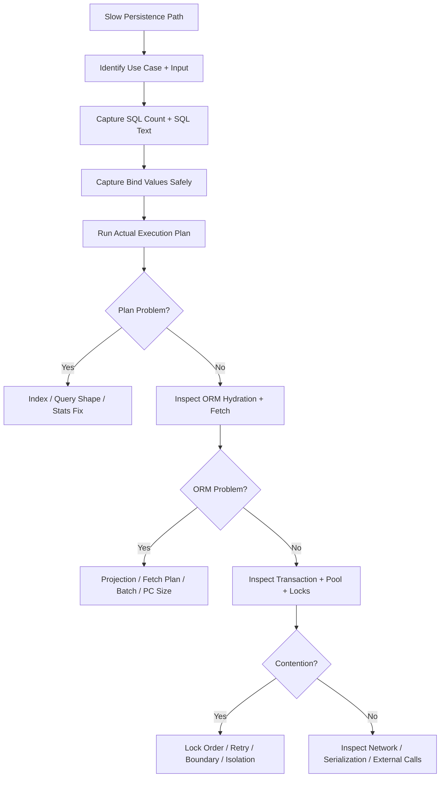
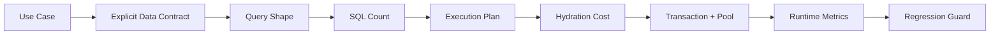

# Part 031 — Performance Engineering and Observability

Top-tier persistence engineering is not “making JPA fast”. It is the ability to explain, measure, and control the path from a domain operation to database work.

A slow persistence path is almost never caused by one isolated line. It is usually the combined result of:

- an aggregate boundary that loads too much;
- a fetch plan that is implicit;
- a query that looks innocent in JPQL but expands into expensive SQL;
- a transaction that holds resources too long;
- a connection pool that hides backpressure until saturation;
- an index strategy that does not match the access pattern;
- a cache that improves averages but worsens tail latency or consistency;
- missing observability, so the team guesses instead of proving.

This part focuses on the diagnostic and engineering layer. We will not repeat JDBC fundamentals or SQL basics from the previous `learn-java-sql-jdbc` series. Instead, we will connect ORM-level behavior to production-level signals.

---

## 1. Kaufman Framing: What Skill Are We Practicing?

Josh Kaufman’s useful move is to deconstruct a skill into small subskills and practice the parts that create useful feedback. For persistence performance, the useful subskills are not “memorize annotations”. They are:

| Subskill | You can do it when... |
|---|---|
| SQL visibility | You can map a service method to exact SQL statements, bind values, row counts, and timing. |
| Fetch diagnosis | You can prove whether a path has N+1, over-fetching, cartesian expansion, or lazy boundary failure. |
| Query plan reasoning | You can inspect the actual database plan and explain index use, join order, row estimate error, and sort/hash cost. |
| Transaction profiling | You can identify transaction duration, lock wait, connection hold time, and flush timing. |
| ORM metrics interpretation | You can interpret entity load/fetch counts, collection fetch counts, flush count, second-level cache hit/miss, and query cache behavior. |
| Regression protection | You can write tests or automated checks that fail when query count, latency, or plan shape regresses. |

The practice target is simple:

> Given one business use case, produce a persistence performance report that explains what was loaded, what SQL ran, why it ran, how long it took, what indexes were used, and what should change.

---

## 2. The Persistence Performance Stack

An ORM operation passes through several layers. Performance work fails when we optimize one layer while ignoring the others.



A top 1% engineer asks:

1. What is the unit of work?
2. What exact SQL was executed?
3. How many rows were read, joined, sorted, locked, and returned?
4. How many Java objects were hydrated?
5. Was the persistence context used as a working set or accidentally as an in-memory database?
6. Did this transaction hold a connection while doing non-database work?
7. Would this path still behave under 10x data and 10x concurrency?

---

## 3. Performance Is a Contract, Not a Feeling

A persistence path should have explicit expectations.

Example use case:

> Load an enforcement case detail page for an officer.

Poor contract:

> It should be fast.

Better contract:

```txt
Use case: GET /cases/{caseId}/detail
Expected data:
- Case header
- Respondent summary
- Current lifecycle state
- Latest 20 case events
- Open obligations count
- Assigned officer names

Performance contract:
- P95 < 150 ms excluding network from client to API gateway
- <= 5 SQL statements
- No unbounded collection load
- No lazy load during JSON serialization
- Query plan must use case_id indexes for event and obligation lookup
- No write flush expected
- Connection hold time < 60 ms under normal conditions
```

A performance contract forces design choices. Without it, every discussion becomes taste-based.

---

## 4. First Observation Layer: SQL Logging

SQL logging is the first tool, not the final tool.

For Hibernate, useful categories are typically:

```properties
# SQL statement text
org.hibernate.SQL=DEBUG

# Bind parameters; exact logger names differ by Hibernate generation/configuration
org.hibernate.orm.jdbc.bind=TRACE

# Slow query log can also be configured through Hibernate settings
```

For Spring Boot applications, a development-only configuration might look like:

```properties
spring.jpa.show-sql=false
spring.jpa.properties.hibernate.format_sql=true
logging.level.org.hibernate.SQL=DEBUG
logging.level.org.hibernate.orm.jdbc.bind=TRACE
```

Avoid relying on `show_sql=true` for serious work. It prints SQL to stdout and does not integrate well with structured logging, correlation IDs, or production log controls.

### What SQL logging can reveal

SQL logging is good for:

- N+1 query detection;
- unexpected flush before a query;
- missing `join fetch` or graph;
- accidental eager relationship loading;
- bulk update/delete statements;
- unexpected insert/update ordering;
- excessive select-before-update behavior;
- bind value mismatch, especially enum/string/id types.

SQL logging is not enough for:

- actual query execution plan;
- lock wait time;
- index selectivity;
- row estimate error;
- database CPU vs IO split;
- connection pool contention;
- hydration cost in Java.

---

## 5. Query Count Is a Cheap Early Warning

Query count is not the same as performance, but it is an excellent regression signal.

Bad:

```txt
GET /cases/123/detail
SQL count: 143
```

Better:

```txt
GET /cases/123/detail
SQL count: 4
1. Case header + respondent
2. Latest 20 events
3. Open obligation count
4. Assigned officers
```

A query count budget helps catch N+1 before production.

### Example test pattern

The implementation differs by stack, but the idea is stable:

```java
@Test
void caseDetailShouldNotRegressIntoNPlusOne() {
    seedCaseWithEventsOfficersAndObligations();

    queryCounter.reset();

    CaseDetailView result = caseQueryService.getCaseDetail(caseId);

    assertThat(result.caseId()).isEqualTo(caseId);
    assertThat(queryCounter.count()).isLessThanOrEqualTo(5);
}
```

This is not a replacement for plan analysis. It is a guardrail.

---

## 6. Second Observation Layer: Provider Statistics

SQL logs answer “what statements ran?” Provider statistics answer “how did the ORM behave?”

For Hibernate, statistics can expose signals such as:

- session open/close counts;
- transaction count;
- flush count;
- entity load/fetch/insert/update/delete count;
- collection load/fetch/recreate/remove/update count;
- query execution count and time;
- second-level cache hit/miss/put count;
- natural-id cache statistics;
- optimistic failure count.

Development or test configuration can enable statistics:

```properties
spring.jpa.properties.hibernate.generate_statistics=true
```

Then inspect statistics via `SessionFactory`:

```java
SessionFactory sessionFactory = entityManagerFactory.unwrap(SessionFactory.class);
Statistics stats = sessionFactory.getStatistics();

long entityLoadCount = stats.getEntityLoadCount();
long collectionFetchCount = stats.getCollectionFetchCount();
long queryExecutionCount = stats.getQueryExecutionCount();
long flushCount = stats.getFlushCount();
```

### How to read common Hibernate statistics

| Signal | Interpretation |
|---|---|
| High entity load count | Query hydrates too many managed entities; consider projection/read model. |
| High collection fetch count | Likely lazy collection N+1. |
| High flush count | Transaction/query boundaries may trigger repeated flush. |
| High query execution count | N+1, looped repository calls, or bad service orchestration. |
| Low L2 cache hit with high put | Cache churn; probably caching wrong data. |
| High optimistic failure count | Contention on aggregate root/version; review command design. |

### EclipseLink observability

EclipseLink has its own logging, profiling, query monitor, cache metrics, and session-level diagnostics. The exact integration depends on runtime. The same interpretation principle applies:

- observe SQL;
- observe cache hits/misses;
- observe UnitOfWork changes;
- observe query execution time;
- observe object build/hydration cost;
- compare provider-level behavior against database-level truth.

Do not compare Hibernate and EclipseLink only by final response time. Compare their SQL shape, change tracking behavior, fetch behavior, cache policy, and transaction interaction.

---

## 7. Third Observation Layer: Database Execution Plans

ORM metrics tell you how the application behaved. Execution plans tell you how the database executed the query.

For each important query, inspect:

- access method: index scan, sequential/table scan, bitmap scan;
- join type: nested loop, hash join, merge join;
- join order;
- estimated rows vs actual rows;
- sort/hash spill;
- filter predicates;
- index condition vs residual filter;
- lock behavior;
- buffer/cache usage where available.

### Example: suspicious JPQL

```java
@Query("""
    select c
    from EnforcementCase c
    join fetch c.events e
    where c.status = :status
    order by e.occurredAt desc
""")
List<EnforcementCase> findOpenCasesWithEvents(CaseStatus status);
```

This looks compact, but it may be wrong because:

- it can multiply case rows by event rows;
- ordering by event timestamp can force expensive sort;
- it may hydrate many duplicate root rows;
- pagination becomes unsafe;
- the UI probably needs latest event summary, not every event entity.

Better design:

```java
@Query("""
    select new com.example.caseview.CaseListRow(
        c.id,
        c.referenceNo,
        c.status,
        r.name,
        latest.occurredAt
    )
    from EnforcementCase c
    join c.respondent r
    left join CaseLatestEvent latest on latest.caseId = c.id
    where c.status = :status
    order by latest.occurredAt desc nulls last
""")
List<CaseListRow> findOpenCaseRows(CaseStatus status, Pageable pageable);
```

The exact JPQL support for `join ... on`, null ordering, or database view mapping may differ by provider/database. The design principle is stable: list screens are often read models, not aggregate loads.

---

## 8. Hydration Cost: The Hidden Java-Side Tax

SQL time is not the whole story. ORM also pays Java-side cost:

- result set traversal;
- entity instantiation;
- identifier resolution;
- persistence context registration;
- proxy creation;
- collection wrapper creation;
- dirty-checking snapshot creation;
- second-level cache interaction;
- bytecode-enhanced tracking;
- DTO mapping;
- JSON serialization later.

A query returning 10,000 rows can be fast at the database but expensive in Java if it hydrates a large managed object graph.

### Entity query vs projection

Entity query:

```java
List<EnforcementCase> cases = entityManager.createQuery("""
    select c
    from EnforcementCase c
    join fetch c.respondent
    where c.status = :status
""", EnforcementCase.class)
.setParameter("status", CaseStatus.OPEN)
.getResultList();
```

Projection query:

```java
List<CaseQueueRow> rows = entityManager.createQuery("""
    select new com.example.CaseQueueRow(
        c.id,
        c.referenceNo,
        r.displayName,
        c.priority,
        c.lastUpdatedAt
    )
    from EnforcementCase c
    join c.respondent r
    where c.status = :status
""", CaseQueueRow.class)
.setParameter("status", CaseStatus.OPEN)
.getResultList();
```

Use entity queries when you intend to operate on managed domain state. Use projections when you need a read view.

A common performance bug is loading entities for read-only list screens and then serializing them into DTOs. That pays both ORM hydration and mapping cost while exposing lazy-loading risk.

---

## 9. Persistence Context Size Matters

The persistence context is an identity map and unit-of-work working set. It is not a general cache.

Large persistence contexts cause:

- higher memory usage;
- slower dirty checking;
- stale managed state;
- accidental writes during flush;
- harder reasoning about changes;
- long GC pauses in batch jobs;
- subtle bugs after bulk/native operations.

### Batch processing pattern

Bad:

```java
@Transactional
public void reclassifyCases(List<UUID> caseIds) {
    for (UUID caseId : caseIds) {
        EnforcementCase c = entityManager.find(EnforcementCase.class, caseId);
        c.reclassify();
    }
}
```

This keeps every loaded case managed until transaction end.

Better when processing large sets:

```java
@Transactional
public void reclassifyCases(List<UUID> caseIds) {
    int batchSize = 100;

    for (int i = 0; i < caseIds.size(); i++) {
        EnforcementCase c = entityManager.find(EnforcementCase.class, caseIds.get(i));
        c.reclassify();

        if (i > 0 && i % batchSize == 0) {
            entityManager.flush();
            entityManager.clear();
        }
    }
}
```

Caveat: after `clear()`, all previously managed references are detached. Your algorithm must not depend on them remaining managed.

---

## 10. Flush Timing as a Performance Variable

Flush is not just correctness. It also affects performance.

Unexpected flush can occur before a query when flush mode is `AUTO` and the provider decides pending changes may affect query results.

Example:

```java
@Transactional
public CaseSummary updateAndRead(UUID caseId) {
    EnforcementCase c = entityManager.find(EnforcementCase.class, caseId);
    c.markReviewed();

    // This query may trigger flush before execution.
    return caseSummaryRepository.findSummary(caseId);
}
```

Signals:

- update SQL appears before read query;
- flush count increases;
- lock is acquired earlier than expected;
- connection hold time grows;
- deadlock probability changes.

Design options:

| Option | Use when |
|---|---|
| Split command and query | Read model does not need uncommitted state. |
| Explicit flush | You want failure early before side effects. |
| Reorder reads before writes | The query does not depend on mutation. |
| Use projection from managed entity | You already have the needed state. |
| Separate transaction | You need different consistency boundary. |

Do not set `FlushModeType.COMMIT` globally to hide a design problem. It can create stale query semantics.

---

## 11. Connection Pool Interaction

The connection pool is often where persistence problems become visible.

Important distinction:

- transaction duration is how long the unit of work is active;
- connection hold time is how long a physical connection is borrowed;
- query time is how long SQL execution takes;
- lock wait time is how long the database waits for conflicting locks;
- application time inside transaction is business logic, remote call, serialization, or CPU work while the transaction remains open.

A service can have short SQL time but long connection hold time if it performs non-database work inside the transaction.

Bad:

```java
@Transactional
public void closeCase(UUID caseId) {
    EnforcementCase c = repository.getRequired(caseId);
    c.close(clock.now());

    externalDocumentService.generateClosurePacket(c.id()); // remote call inside transaction

    outboxRepository.append(CaseClosedEvent.from(c));
}
```

Better:

```java
@Transactional
public void closeCase(UUID caseId) {
    EnforcementCase c = repository.getRequired(caseId);
    c.close(clock.now());
    outboxRepository.append(CaseClosedEvent.from(c));
}
```

Then generate closure packet asynchronously from the outbox event, or outside the persistence transaction if business rules allow.

### Pool metrics to track

| Metric | Meaning |
|---|---|
| Active connections | Connections currently borrowed. |
| Idle connections | Available capacity. |
| Pending threads | Requests waiting for a connection. |
| Acquisition time | Time to borrow connection. |
| Usage/hold time | Time connection stays borrowed. |
| Timeout count | Pool exhaustion symptom. |
| Max lifetime / eviction | Connection churn or DB/network instability. |

If pending threads rise while DB CPU is low, suspect connection leaks, long transactions, remote calls inside transactions, or pool undersizing. If pending threads rise while DB CPU/IO is high, suspect slow queries, missing indexes, locks, or overloaded database.

---

## 12. Lock Wait and Deadlock Observability

Persistence performance is not only latency. It is also waiting.

Symptoms of lock contention:

- intermittent spikes, not constant slowness;
- deadlock exceptions;
- lock timeout exceptions;
- high transaction duration but normal CPU;
- optimistic lock failures during common commands;
- queue processors stepping on the same rows.

Common ORM-level causes:

- transaction updates rows in inconsistent order;
- aggregate is too coarse and versioned at a hot root;
- pessimistic locking used for long workflows;
- flush happens earlier than expected;
- batch job updates many rows without chunking;
- missing index causes update/delete to scan and lock more rows than intended.

### Consistent update order

If a command updates multiple aggregates, use deterministic ordering:

```java
List<UUID> sortedIds = caseIds.stream()
    .sorted()
    .toList();

for (UUID id : sortedIds) {
    EnforcementCase c = entityManager.find(
        EnforcementCase.class,
        id,
        LockModeType.OPTIMISTIC_FORCE_INCREMENT
    );
    c.recalculateRiskScore();
}
```

This does not remove all deadlocks, but it reduces avoidable order-inversion.

---

## 13. Index Design From ORM Access Patterns

Index design should be driven by real access patterns, not by entity fields.

Entity:

```java
@Entity
@Table(name = "enforcement_case")
public class EnforcementCase {
    @Id
    private UUID id;

    @Column(nullable = false, unique = true)
    private String referenceNo;

    @Enumerated(EnumType.STRING)
    @Column(nullable = false)
    private CaseStatus status;

    @Column(nullable = false)
    private Instant lastUpdatedAt;

    @ManyToOne(fetch = FetchType.LAZY, optional = false)
    private Officer assignedOfficer;
}
```

Possible access patterns:

| Use case | Query shape | Candidate index |
|---|---|---|
| Find by reference number | `where reference_no = ?` | unique index on `reference_no` |
| Officer queue | `where assigned_officer_id = ? and status = ? order by last_updated_at desc` | composite index on `(assigned_officer_id, status, last_updated_at desc)` |
| Open high-priority cases | `where status = ? and priority = ? order by risk_score desc` | composite index matching filter/order |
| Aging report | `where status = ? and opened_at < ?` | composite/partial index depending DB |

The ORM mapping tells you column names and relationship joins. It does not automatically create the right production indexes.

### Index review checklist

For each repository query:

1. What is the expected cardinality?
2. What filters are equality filters?
3. What filters are range filters?
4. What is the ordering?
5. Does pagination use offset or keyset?
6. Does the query join via foreign keys with indexes on child tables?
7. Does the index match actual tenant/security filters?
8. Are soft-delete filters included in common indexes?
9. Are enum/status values highly skewed?
10. Does the database actually use the index in the plan?

---

## 14. Pagination Performance: Offset vs Keyset

Offset pagination becomes expensive for deep pages because the database may still scan/sort skipped rows.

Offset style:

```sql
select *
from enforcement_case
where status = 'OPEN'
order by last_updated_at desc, id desc
offset 100000 limit 50
```

Keyset style:

```sql
select *
from enforcement_case
where status = 'OPEN'
  and (
      last_updated_at < :lastSeenUpdatedAt
      or (last_updated_at = :lastSeenUpdatedAt and id < :lastSeenId)
  )
order by last_updated_at desc, id desc
limit 50
```

In JPA, keyset pagination is often implemented through JPQL/Criteria/native SQL depending on complexity.

Use offset pagination when:

- users need page numbers;
- result set is small;
- administrative usage is low volume;
- deep pages are not common.

Use keyset/cursor pagination when:

- feed/queue style navigation;
- high volume;
- stable sort key exists;
- deep traversal matters;
- low tail latency matters.

---

## 15. Read-Only Optimization

Read-only paths should not accidentally pay write-path costs.

Options:

| Layer | Technique |
|---|---|
| Transaction | Mark transaction read-only where framework/provider uses it meaningfully. |
| Query | Use projection instead of entity when no mutation is needed. |
| Hibernate | Read-only query/session hints can reduce dirty-checking overhead. |
| Database | Route to read replica when consistency allows. |
| API | Avoid lazy serialization by returning explicit DTOs. |

Example:

```java
@Transactional(readOnly = true)
public List<CaseQueueRow> getOfficerQueue(UUID officerId) {
    return caseQueryRepository.findQueueRows(officerId);
}
```

Read-only is not magic. It does not make a bad query good. It communicates intent and may enable optimizations depending on framework/provider/database.

---

## 16. Observability Fields for Persistence Spans

Distributed tracing is useful only if spans include meaningful persistence attributes.

For important repository/service operations, capture:

```txt
operation = caseQueryService.getOfficerQueue
transaction.readOnly = true
jpa.provider = hibernate
sql.statement.count = 3
sql.slowest.duration.ms = 28
entity.load.count = 0
collection.fetch.count = 0
projection.type = CaseQueueRow
connection.acquire.ms = 2
connection.hold.ms = 41
db.lock.wait.ms = 0
result.row.count = 50
case.status = OPEN
pagination.mode = KEYSET
```

Avoid high-cardinality tags such as raw SQL with bind values, user names, or case reference numbers in metrics labels. Put detailed SQL in logs/traces with controlled retention and redaction.

---

## 17. Metrics Taxonomy

A production-grade persistence dashboard separates symptoms from causes.

### Application-level metrics

- endpoint latency P50/P95/P99;
- use-case latency;
- error rate by exception type;
- transaction duration;
- query count per request;
- response size;
- batch job throughput;
- queue lag.

### ORM-level metrics

- entity load count;
- collection fetch count;
- flush count;
- optimistic failure count;
- second-level cache hit/miss;
- query cache hit/miss;
- slow query count.

### Pool-level metrics

- active/idle/pending connections;
- acquisition latency;
- timeout count;
- connection usage time;
- connection creation/eviction.

### Database-level metrics

- query latency;
- CPU/IO;
- lock waits;
- deadlocks;
- buffer cache hit ratio;
- temporary file/spill usage;
- replication lag;
- table/index bloat where relevant;
- slow query log.

A dashboard that only shows endpoint latency tells you something is wrong, not why.

---

## 18. Slow Query Diagnosis Workflow

Use a consistent diagnosis workflow.



Do not start with random annotation changes. Start by making the path observable.

---

## 19. Common Performance Smells and Better Responses

| Smell | Weak response | Better response |
|---|---|---|
| N+1 | Set everything eager | Define fetch plan/projection per use case. |
| Slow list page | Add cache | Inspect query plan, index, row count, projection. |
| Pool exhaustion | Increase pool size | Measure connection hold time and DB capacity first. |
| Lazy exception | Enable Open Session in View | Return DTO/projection or load explicit graph inside transaction. |
| Batch job OOM | Increase heap | Chunk, flush/clear, use stateless session/native batch where appropriate. |
| Deadlocks | Retry forever | Fix update order, index scans, transaction width, lock mode. |
| Slow writes | Disable dirty checking | Inspect aggregate size, flush frequency, indexes, cascades. |
| Cache misses | Increase cache size | Verify data is cacheable and access pattern has locality. |

---

## 20. Regression Detection

Persistence regressions often happen through innocent changes:

- adding a field to a DTO that triggers a lazy load;
- adding `toString()` that touches lazy association;
- changing `List` screen query to return entities;
- adding `@EntityGraph` too broadly;
- changing collection from `Set` to `List` and creating bag behavior;
- adding cascade to relationship;
- changing transaction boundary;
- adding security/tenant filter without index;
- enabling soft delete but not updating indexes.

Protect against this with:

1. Query count tests for critical use cases.
2. Integration tests with realistic row volume.
3. Migration tests that verify indexes exist.
4. Slow query threshold in test/staging.
5. Baseline execution plans for critical queries.
6. Load tests for hot paths.
7. Dashboards with ORM + pool + DB metrics.
8. Code review checklist.

---

## 21. Performance Review Checklist

Before approving a persistence-heavy change, ask:

### Query shape

- What SQL will this produce?
- How many SQL statements per use case?
- Are there loops that call repository methods?
- Are joins explicit and bounded?
- Is pagination safe?
- Are projections used for read screens?

### Fetching

- What associations are loaded?
- Is lazy loading possible outside transaction?
- Are multiple collections fetch-joined?
- Is the graph explicit per use case?
- Does serialization touch entities?

### Transaction

- How long is the transaction open?
- Are remote calls inside transaction?
- Does flush happen at expected time?
- Are writes ordered deterministically?
- Is retry behavior defined?

### Database

- Are indexes aligned with filters/order/join?
- Have actual plans been inspected?
- Are row estimates reasonable?
- Are soft-delete/tenant/security predicates indexed?
- Is lock behavior known?

### Runtime

- What happens under 10x data?
- What happens under 10x concurrency?
- What metrics will alert us?
- How do we reproduce and diagnose incidents?

---

## 22. Lab: Performance Report for Case Queue

Implement or simulate this use case:

```txt
Use case: officer opens their enforcement queue
Input: officerId, status=OPEN, page size=50
Output:
- case id
- reference number
- respondent name
- current state
- priority
- last activity timestamp
- SLA breach flag
```

### Bad baseline

```java
@Transactional(readOnly = true)
public List<CaseQueueItemDto> getQueue(UUID officerId) {
    return caseRepository.findByAssignedOfficerIdAndStatus(officerId, CaseStatus.OPEN)
        .stream()
        .map(c -> new CaseQueueItemDto(
            c.getId(),
            c.getReferenceNo(),
            c.getRespondent().getDisplayName(),
            c.getCurrentState().name(),
            c.getPriority(),
            c.getEvents().stream()
                .max(Comparator.comparing(CaseEvent::getOccurredAt))
                .map(CaseEvent::getOccurredAt)
                .orElse(null),
            c.isSlaBreached(clock.now())
        ))
        .toList();
}
```

Likely problems:

- loads entities for read-only list;
- lazy loads respondent;
- lazy loads events per case;
- calculates latest event in Java;
- loads unbounded event collections;
- query count grows with result size;
- persistence context fills with unnecessary entities.

### Better shape

```java
public record CaseQueueRow(
    UUID caseId,
    String referenceNo,
    String respondentName,
    CaseState currentState,
    CasePriority priority,
    Instant lastActivityAt,
    boolean slaBreached
) {}
```

```java
@Query("""
    select new com.example.CaseQueueRow(
        c.id,
        c.referenceNo,
        r.displayName,
        c.currentState,
        c.priority,
        latest.occurredAt,
        case when c.slaDueAt < :now then true else false end
    )
    from EnforcementCase c
    join c.respondent r
    left join CaseLatestActivity latest on latest.caseId = c.id
    where c.assignedOfficer.id = :officerId
      and c.status = :status
    order by c.priority desc, latest.occurredAt desc, c.id desc
""")
List<CaseQueueRow> findQueueRows(
    UUID officerId,
    CaseStatus status,
    Instant now,
    Pageable pageable
);
```

Possible persistence report:

```txt
Use case: officer queue
SQL count: 1
Rows returned: 50
Entity load count: 0
Collection fetch count: 0
Flush count: 0
Projection: CaseQueueRow
Pagination: offset for admin UI; keyset recommended for high-volume queue
Indexes needed:
- enforcement_case(assigned_officer_id, status, priority, id)
- case_latest_activity(case_id)
Risks:
- priority ordering may require DB-specific index strategy
- CaseLatestActivity view must be maintained correctly
```

---

## 23. Mental Model Summary

Performance engineering is the discipline of making persistence behavior visible and bounded.



The most important shift is this:

> Do not ask whether JPA is fast. Ask whether this use case has an explicit persistence contract and whether runtime evidence proves the implementation satisfies it.

---

## 24. Mastery Checklist

You are ready to move on when you can:

- predict SQL count for a service method;
- detect N+1 from logs and from tests;
- explain execution plan basics for critical queries;
- distinguish SQL time from hydration time;
- explain transaction duration vs connection hold time;
- identify when projection is better than entity loading;
- spot bad cache candidates;
- define query count and latency budgets;
- instrument Hibernate/EclipseLink behavior;
- write a persistence performance review for a production path.

---

## References

- Jakarta Persistence 3.2 Specification and API
- Hibernate ORM User Guide and Javadocs
- EclipseLink Documentation
- Spring Data JPA Reference Documentation
- Database vendor documentation for execution plans and indexing

