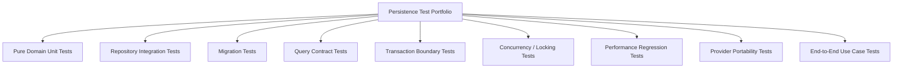
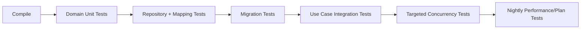
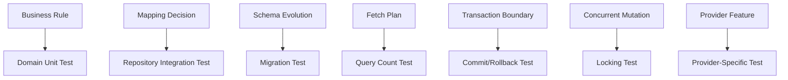

# Part 032 — Testing Persistence Code

Persistence tests are not about proving that JPA works. JPA already works. They are about proving that your mapping, query, transaction boundary, migration, provider behavior, and database assumptions are correct for your system.

A weak persistence test says:

> `repository.save(entity)` does not throw.

A strong persistence test says:

> Given a realistic database schema, provider configuration, transaction boundary, and data shape, this use case loads exactly the needed data, enforces invariants, handles concurrency, survives migration, and fails predictably when assumptions are violated.

This part builds a testing model for serious persistence code.

---

## 1. Kaufman Framing: Practice With Fast Feedback

For persistence, the “learn enough to self-correct” loop requires tests that reveal the actual runtime behavior.

You need feedback on:

- mapping correctness;
- schema compatibility;
- query semantics;
- fetch behavior;
- transaction behavior;
- locking behavior;
- provider-specific behavior;
- migration safety;
- performance regression;
- data integrity and invariants.

Unit tests alone cannot provide this feedback because many persistence bugs appear only when Java, provider, JDBC, SQL dialect, schema, indexes, transaction isolation, and database constraints meet.

The efficient approach is a layered test portfolio.

---

## 2. Persistence Test Portfolio



Each test type answers a different question.

| Test type | Question answered |
|---|---|
| Pure domain unit test | Does the aggregate enforce business rules without persistence noise? |
| Repository integration test | Does mapping/query work against the real database dialect? |
| Migration test | Can schema changes apply cleanly and preserve expected constraints? |
| Query contract test | Does the query return exactly the intended shape and semantics? |
| Transaction boundary test | Does commit/rollback/flush behavior match expectations? |
| Concurrency test | What happens under conflicting updates or lock contention? |
| Performance regression test | Did SQL count, fetch behavior, or latency regress? |
| Provider portability test | Are we depending on Hibernate/EclipseLink-specific behavior? |
| End-to-end use case test | Does the application behavior work across layers? |

Do not force one test type to answer every question.

---

## 3. What Not to Test

Avoid tests that duplicate the framework:

```java
@Test
void saveShouldSave() {
    repository.save(new EnforcementCase(...));
    assertThat(repository.findAll()).hasSize(1);
}
```

This is usually too shallow. It mostly verifies that Spring Data/JPA can insert a row.

Better tests check your decisions:

- `referenceNo` uniqueness is enforced;
- `CaseStatus` is stored as string, not ordinal;
- orphan removal deletes child events only where intended;
- aggregate query does not load unbounded child collections;
- optimistic locking fails for stale update;
- migration creates index required by queue query;
- soft delete filter does not leak deleted cases;
- native query projection maps correctly;
- transaction rollback removes outbox row if aggregate update fails.

---

## 4. Unit Tests Still Matter: Keep Domain Logic Out of the Database

A common error is testing all domain behavior only through repositories. That makes tests slow and hides whether business logic is coupled to persistence.

Domain behavior should be testable without JPA:

```java
@Test
void closingCaseRequiresAllObligationsResolved() {
    EnforcementCase c = EnforcementCase.open(referenceNo, respondentId, officerId);
    c.addObligation(Obligation.requireDocument("License copy"));

    assertThatThrownBy(() -> c.close(clock.now()))
        .isInstanceOf(UnresolvedObligationException.class);
}
```

This test should not need:

- `EntityManager`;
- Spring context;
- database;
- transaction;
- lazy loading;
- repository;
- migration.

If your aggregate cannot be tested without persistence, your model may be too persistence-coupled.

---

## 5. Repository Integration Tests

Repository tests should run against the database dialect you use in production whenever possible.

In modern Java systems, this often means Testcontainers or an equivalent ephemeral real database.

Why not only H2?

- SQL dialect differences;
- JSON/array/enum behavior differences;
- timestamp precision differences;
- lock behavior differences;
- index and plan differences;
- constraint behavior differences;
- transaction isolation differences;
- native SQL differences.

H2 can be useful for fast smoke tests, but it is not a substitute for dialect-real integration tests for serious persistence code.

### Example Spring `@DataJpaTest` with real database shape

```java
@DataJpaTest
@AutoConfigureTestDatabase(replace = AutoConfigureTestDatabase.Replace.NONE)
class EnforcementCaseRepositoryTest {

    @Autowired EnforcementCaseRepository repository;
    @Autowired TestEntityManager testEntityManager;

    @Test
    void findsOpenCasesForOfficerOrderedByPriority() {
        UUID officerId = seedOfficer();
        seedCase(officerId, CaseStatus.OPEN, CasePriority.LOW);
        seedCase(officerId, CaseStatus.OPEN, CasePriority.HIGH);
        seedCase(officerId, CaseStatus.CLOSED, CasePriority.CRITICAL);

        List<CaseQueueRow> rows = repository.findQueueRows(
            officerId,
            CaseStatus.OPEN,
            Instant.now(),
            PageRequest.of(0, 10)
        );

        assertThat(rows)
            .extracting(CaseQueueRow::priority)
            .containsExactly(CasePriority.HIGH, CasePriority.LOW);
    }
}
```

This test checks query semantics, not just framework wiring.

---

## 6. Testcontainers Baseline Pattern

A typical pattern:

```java
@Testcontainers
@SpringBootTest
class PersistenceIntegrationTest {

    @Container
    static PostgreSQLContainer<?> postgres = new PostgreSQLContainer<>("postgres:16")
        .withDatabaseName("case_test")
        .withUsername("test")
        .withPassword("test");

    @DynamicPropertySource
    static void configure(DynamicPropertyRegistry registry) {
        registry.add("spring.datasource.url", postgres::getJdbcUrl);
        registry.add("spring.datasource.username", postgres::getUsername);
        registry.add("spring.datasource.password", postgres::getPassword);
    }
}
```

For maintainability, hide container configuration in a base class or test fixture module.

Important:

- use the same database family as production;
- run migrations, not schema auto-create, for migration-sensitive tests;
- keep containers reusable in local development if your tooling supports it;
- seed data intentionally;
- avoid tests depending on execution order;
- clean database state deterministically.

---

## 7. Migration Tests

Migration tests verify that schema evolution is safe.

At minimum, test:

1. migrations apply from empty database;
2. migrations apply from previous production-like state;
3. required indexes and constraints exist;
4. destructive changes are controlled;
5. enum/type changes are safe;
6. backfill scripts are idempotent or explicitly one-time;
7. application mapping matches migrated schema.

### Empty database migration test

```java
@Test
void flywayMigrationsApplyOnEmptyDatabase() {
    Flyway flyway = Flyway.configure()
        .dataSource(dataSource)
        .locations("classpath:db/migration")
        .load();

    flyway.clean();
    flyway.migrate();

    assertThat(flyway.info().current().getVersion().getVersion())
        .isEqualTo("42");
}
```

Be careful with `clean()` in real environments. It belongs only in isolated test databases.

### Schema validation test

```properties
spring.jpa.hibernate.ddl-auto=validate
```

A validation test should fail if entity mappings no longer match the migrated schema.

---

## 8. Constraint Tests

Database constraints are part of the domain’s defensive perimeter.

Example invariant:

> `case_reference_no` must be globally unique.

Test it:

```java
@Test
void caseReferenceNumberIsUnique() {
    repository.saveAndFlush(EnforcementCase.open("CASE-2026-0001", respondentId, officerId));

    EnforcementCase duplicate = EnforcementCase.open("CASE-2026-0001", respondentId, officerId);

    assertThatThrownBy(() -> repository.saveAndFlush(duplicate))
        .isInstanceOf(DataIntegrityViolationException.class);
}
```

Why `saveAndFlush()`?

Because constraint violations may appear only on flush/commit. Without flush, the test can falsely pass.

Test constraints for:

- unique business keys;
- non-null required fields;
- foreign key constraints;
- check constraints;
- partial uniqueness if supported by database;
- optimistic version column existence;
- tenant boundary columns;
- soft delete uniqueness strategy.

---

## 9. Query Contract Tests

A query contract test verifies the semantic result shape.

Example:

```java
@Test
void queueQueryExcludesClosedAndDeletedCases() {
    UUID officerId = seedOfficer();
    seedCase(officerId, CaseStatus.OPEN, false);
    seedCase(officerId, CaseStatus.CLOSED, false);
    seedCase(officerId, CaseStatus.OPEN, true); // soft-deleted

    List<CaseQueueRow> rows = repository.findQueueRows(
        officerId,
        CaseStatus.OPEN,
        clock.instant(),
        PageRequest.of(0, 20)
    );

    assertThat(rows).hasSize(1);
}
```

Good query tests include edge cases:

- no rows;
- one row;
- duplicate join rows;
- null optional association;
- deleted/archived rows;
- tenant isolation;
- boundary timestamps;
- pagination tie-breaker;
- multiple statuses;
- permission filters.

---

## 10. Fetch Behavior Tests

Fetch regressions are common. A DTO field addition can quietly create N+1.

Use a query counter, Hibernate statistics, datasource proxy, or SQL capture tool.

```java
@Test
void caseDetailUsesBoundedNumberOfQueries() {
    UUID caseId = seedCaseDetailGraph();

    sqlCounter.reset();

    CaseDetailView detail = caseDetailService.getCaseDetail(caseId);

    assertThat(detail.caseId()).isEqualTo(caseId);
    assertThat(sqlCounter.statementCount()).isLessThanOrEqualTo(5);
}
```

This type of test should focus on critical use cases, not every repository method.

### What to assert

- maximum SQL count;
- no lazy load during serialization;
- no unbounded collection load;
- no unexpected flush;
- no entity load for projection queries;
- expected result cardinality.

---

## 11. Transaction Boundary Tests

Transaction behavior is easy to misunderstand because many tests run inside a test-managed transaction that rolls back by default.

### The rollback illusion

In Spring tests, `@Transactional` on a test method often means:

- the test runs in one transaction;
- data is rolled back after the test;
- lazy loading may work because the transaction is still open;
- commit-time failures may not appear unless flushed;
- production transaction boundaries may not be reproduced.

Bad test:

```java
@Test
@Transactional
void detailLoadsSuccessfully() {
    CaseDetailView view = service.getCaseDetail(caseId);
    assertThat(view.events()).isNotEmpty();
}
```

This may hide lazy boundary problems.

Better:

```java
@Test
void detailDoesNotRequireOpenPersistenceContextAfterServiceReturns() {
    CaseDetailView view = service.getCaseDetail(caseId);

    assertThatCode(() -> objectMapper.writeValueAsString(view))
        .doesNotThrowAnyException();
}
```

The service should return a DTO/read model that does not require a live persistence context.

---

## 12. Commit-Time Failure Tests

Some failures happen at commit, not at method call.

Examples:

- foreign key violation;
- unique constraint violation;
- deferred constraint;
- optimistic lock conflict;
- trigger failure;
- database check constraint;
- flush ordering issue.

Use explicit transaction control when needed.

```java
@Test
void duplicateReferenceFailsAtTransactionBoundary() {
    assertThatThrownBy(() -> transactionTemplate.executeWithoutResult(status -> {
        repository.save(EnforcementCase.open("CASE-001", respondentId, officerId));
        repository.save(EnforcementCase.open("CASE-001", respondentId, officerId));
        entityManager.flush();
    })).isInstanceOf(DataIntegrityViolationException.class);
}
```

The important part is not the exact exception wrapper, which may vary by framework/provider. The important part is that the invariant is enforced by the database and visible to the application.

---

## 13. Optimistic Locking Tests

Optimistic locking must be tested with separate persistence contexts.

Bad:

```java
@Test
@Transactional
void optimisticLockingWorks() {
    EnforcementCase a = repository.findById(caseId).orElseThrow();
    EnforcementCase b = repository.findById(caseId).orElseThrow();

    a.close(now);
    b.changePriority(HIGH);

    repository.saveAndFlush(a);
    repository.saveAndFlush(b); // may not simulate separate transactions correctly
}
```

Better:

```java
@Test
void staleUpdateFailsWithOptimisticLock() {
    UUID caseId = seedOpenCase();

    EnforcementCase first = transactionTemplate.execute(status ->
        repository.findById(caseId).orElseThrow()
    );

    EnforcementCase second = transactionTemplate.execute(status ->
        repository.findById(caseId).orElseThrow()
    );

    transactionTemplate.executeWithoutResult(status -> {
        EnforcementCase managed = entityManager.merge(first);
        managed.changePriority(CasePriority.HIGH);
    });

    assertThatThrownBy(() -> transactionTemplate.executeWithoutResult(status -> {
        EnforcementCase managed = entityManager.merge(second);
        managed.close(clock.instant());
        entityManager.flush();
    })).isInstanceOfAny(OptimisticLockException.class, ObjectOptimisticLockingFailureException.class);
}
```

The exact exception type depends on whether you observe Jakarta Persistence, Hibernate, or Spring translation layer.

---

## 14. Pessimistic Locking Tests

Pessimistic locking tests require true concurrency. They are harder and should be targeted.

Example scenario:

> Two officers attempt to claim the same case. Only one should succeed.

```java
@Test
void onlyOneOfficerCanClaimCase() throws Exception {
    UUID caseId = seedUnassignedCase();
    ExecutorService executor = Executors.newFixedThreadPool(2);
    CountDownLatch ready = new CountDownLatch(2);
    CountDownLatch start = new CountDownLatch(1);

    Callable<Boolean> claim = () -> {
        ready.countDown();
        start.await();
        return claimService.tryClaim(caseId, UUID.randomUUID());
    };

    Future<Boolean> a = executor.submit(claim);
    Future<Boolean> b = executor.submit(claim);

    ready.await();
    start.countDown();

    List<Boolean> results = List.of(a.get(), b.get());

    assertThat(results).containsExactlyInAnyOrder(true, false);
}
```

This verifies use-case semantics. You can separately verify whether the implementation uses pessimistic lock, optimistic lock, database unique constraint, or atomic update.

---

## 15. Atomic Update Tests

Sometimes the best concurrency control is one SQL statement.

Example:

```java
@Modifying
@Query("""
    update EnforcementCase c
    set c.assignedOfficerId = :officerId,
        c.status = 'ASSIGNED'
    where c.id = :caseId
      and c.assignedOfficerId is null
      and c.status = 'UNASSIGNED'
""")
int tryClaim(UUID caseId, UUID officerId);
```

Test:

```java
@Test
void claimIsAtomic() {
    UUID caseId = seedUnassignedCase();

    int first = repository.tryClaim(caseId, officerA);
    int second = repository.tryClaim(caseId, officerB);

    assertThat(first + second).isEqualTo(1);
}
```

For high-contention workflows, row-count based atomic update is often simpler than loading an entity, locking it, mutating it, and flushing it.

---

## 16. Provider Behavior Tests

If you depend on provider-specific behavior, test it explicitly.

Examples:

- Hibernate soft delete annotation behavior;
- Hibernate filters;
- Hibernate natural id cache;
- bytecode enhancement dirty tracking;
- `StatelessSession` batch behavior;
- EclipseLink fetch groups;
- EclipseLink weaving;
- provider-specific query hints;
- custom JSON type mapping;
- custom SQL function registration.

Test naming should make provider coupling visible:

```java
class HibernateSoftDeleteBehaviorTest {
    @Test
    void softDeletedCaseIsExcludedFromRepositoryQuery() {
        // provider-specific assertion
    }
}
```

This is better than hiding provider assumptions inside generic repository tests.

---

## 17. Portability Tests

Most teams do not run the full suite against multiple JPA providers. But if portability is a real requirement, test it intentionally.

A provider portability suite should focus on:

- standard JPA mappings;
- JPQL semantics;
- lifecycle callbacks;
- cascade/orphan behavior;
- locking behavior;
- schema validation;
- entity graph behavior;
- converter behavior;
- known extension boundaries.

Avoid pretending provider portability is free. It is a tested constraint or it is an aspiration.

---

## 18. Fixture Strategy

Persistence tests become painful when data setup is noisy.

Bad fixture style:

```java
var c = new EnforcementCase();
c.setA(...);
c.setB(...);
c.setC(...);
// 80 lines later...
```

Better:

```java
UUID caseId = fixtures.caseFile()
    .open()
    .assignedTo(officerId)
    .withRespondent("Acme Finance Ltd")
    .withEvent("CASE_OPENED", instant("2026-06-01T10:00:00Z"))
    .withOpenObligation("Submit license copy")
    .persist();
```

A good fixture builder:

- creates valid defaults;
- makes important differences explicit;
- hides irrelevant noise;
- persists through repositories/entity manager intentionally;
- supports boundary cases;
- avoids global mutable state;
- keeps generated identifiers accessible;
- can create realistic data volume.

---

## 19. Data Cleanup Strategy

Common cleanup strategies:

| Strategy | Pros | Cons |
|---|---|---|
| Transaction rollback per test | Fast, simple | Hides commit/lazy behavior; not suitable for all tests. |
| Truncate tables after test | Real commits visible | Requires FK ordering or cascade truncate. |
| Recreate schema/container | Very clean | Slower. |
| Per-test schema | Isolated | More setup complexity. |
| Test data namespacing | Useful for shared env | Risky, not ideal for CI correctness. |

For persistence-heavy systems, mix strategies:

- fast repository tests can use rollback;
- migration and transaction tests should commit;
- concurrency tests should use committed data;
- destructive tests should use isolated database/container.

---

## 20. Testing Time, IDs, and Determinism

Persistence tests should not depend on wall-clock timing or random ordering.

Use injected clock:

```java
Clock fixedClock = Clock.fixed(
    Instant.parse("2026-06-27T10:00:00Z"),
    ZoneOffset.UTC
);
```

Use deterministic IDs where helpful:

```java
UUID caseId = UUID.fromString("00000000-0000-0000-0000-000000000101");
```

Always define ordering in queries that tests assert:

```java
order by c.priority desc, c.createdAt asc, c.id asc
```

Without deterministic ordering, tests can pass locally and fail in CI or after database upgrade.

---

## 21. Testing Bulk Operations

Bulk JPQL/native operations bypass normal managed entity synchronization. Tests must prove that stale state is handled.

Example:

```java
@Test
void bulkCloseDoesNotLeaveStaleManagedState() {
    UUID caseId = seedOpenCase();

    transactionTemplate.executeWithoutResult(status -> {
        EnforcementCase c = entityManager.find(EnforcementCase.class, caseId);

        int updated = repository.bulkCloseAgedCases(clock.instant());
        assertThat(updated).isEqualTo(1);

        entityManager.clear();

        EnforcementCase reloaded = entityManager.find(EnforcementCase.class, caseId);
        assertThat(reloaded.status()).isEqualTo(CaseStatus.CLOSED);
    });
}
```

If your code performs bulk operations, test:

- row count;
- version behavior;
- stale persistence context handling;
- second-level cache invalidation;
- audit/outbox implications;
- tenant/security filters.

---

## 22. Testing Outbox Persistence

For domain-event/outbox patterns, test the atomicity contract.

```java
@Test
void closingCaseWritesOutboxInSameTransaction() {
    UUID caseId = seedOpenCaseWithResolvedObligations();

    caseCommandService.closeCase(caseId, officerId);

    EnforcementCase c = caseRepository.getRequired(caseId);
    List<OutboxMessage> messages = outboxRepository.findByAggregateId(caseId);

    assertThat(c.status()).isEqualTo(CaseStatus.CLOSED);
    assertThat(messages)
        .extracting(OutboxMessage::type)
        .contains("CaseClosed");
}
```

Then test rollback:

```java
@Test
void outboxIsRolledBackWhenCaseCloseFails() {
    UUID caseId = seedOpenCaseWithUnresolvedObligations();

    assertThatThrownBy(() -> caseCommandService.closeCase(caseId, officerId))
        .isInstanceOf(UnresolvedObligationException.class);

    assertThat(outboxRepository.findByAggregateId(caseId)).isEmpty();
}
```

The point is not to test the message broker. The point is to prove database atomicity between aggregate mutation and outbox persistence.

---

## 23. Testing Multi-Tenancy and Security Filters

If persistence enforces tenant/security boundaries, test leakage directly.

```java
@Test
void officerCannotReadCaseFromAnotherTenant() {
    UUID tenantA = seedTenant("A");
    UUID tenantB = seedTenant("B");
    UUID caseInB = seedCase(tenantB);

    securityContext.asTenant(tenantA);

    Optional<CaseDetailView> result = caseQueryService.findCaseDetail(caseInB);

    assertThat(result).isEmpty();
}
```

Also test:

- joins do not bypass tenant filter;
- native queries include tenant predicate;
- count queries match data queries;
- soft-deleted rows are not visible;
- admin override is explicit;
- indexes support tenant predicates.

Security filters that are not tested will eventually leak.

---

## 24. Testing Serialization Boundary

Entities should rarely cross API serialization boundaries. Test that returned DTOs serialize without lazy loading.

```java
@Test
void caseDetailViewSerializesAfterTransactionClosed() throws Exception {
    UUID caseId = seedCaseDetailGraph();

    CaseDetailView view = caseDetailService.getCaseDetail(caseId);

    String json = objectMapper.writeValueAsString(view);

    assertThat(json).contains("referenceNo");
}
```

This catches:

- lazy association access during serialization;
- accidental entity returned in DTO;
- recursive bidirectional graph serialization;
- missing projection fields;
- unexpected provider proxy leakage.

---

## 25. Testing Query Plans and Indexes

Not every query needs plan testing. Critical queries do.

At minimum, migration/integration tests can assert index existence.

Example pseudo-test:

```java
@Test
void queueIndexExists() {
    boolean exists = indexInspector.exists(
        "enforcement_case",
        "idx_case_officer_status_priority_updated"
    );

    assertThat(exists).isTrue();
}
```

For highly critical paths, capture execution plan in staging or CI with realistic data. Be careful: execution plans can vary by database version, statistics, and row count. Avoid brittle exact-plan assertions unless you control the environment tightly.

Better assert high-level plan properties:

- no sequential scan on large table for common query;
- expected index is used;
- row estimate is within reasonable range;
- no large sort spill;
- join row cardinality is bounded.

---

## 26. Performance Regression Tests

Performance tests are expensive. Use them selectively.

Good candidates:

- officer queue;
- case detail page;
- batch assignment job;
- SLA recalculation;
- audit report export;
- outbox polling;
- case search.

Measure:

- SQL count;
- row count;
- entity load count;
- collection fetch count;
- execution time with realistic data;
- memory/persistence context growth for batch;
- connection pool behavior under concurrency.

Example guard:

```java
@Test
void queueQueryDoesNotHydrateEntities() {
    statistics.clear();

    caseQueryService.getOfficerQueue(officerId, PageRequest.of(0, 50));

    assertThat(statistics.getEntityLoadCount()).isZero();
    assertThat(statistics.getCollectionFetchCount()).isZero();
}
```

This is valid if the query is meant to be DTO projection-only.

---

## 27. Test Smells

| Smell | Why it is dangerous |
|---|---|
| Every persistence test is `@Transactional` rollback | Hides commit and lazy boundary behavior. |
| H2 only | Misses real dialect, lock, index, and native SQL behavior. |
| Tests assert only non-null result | Does not verify semantics. |
| No explicit flush in constraint tests | Constraint failure may not appear. |
| Global test fixtures | Hidden coupling and order dependence. |
| Tests use production-size Spring context for simple repository behavior | Slow feedback. |
| No query count checks on critical views | N+1 regressions slip through. |
| No concurrency tests for contested commands | Locking design is unproven. |
| Native SQL not tested | Mapping can silently break on column alias/type changes. |
| Provider-specific assumptions unnamed | Migration risk is hidden. |

---

## 28. Recommended Test Suite Structure

```txt
src/test/java
  com.example.caseapp
    domain
      EnforcementCaseTest.java
      ObligationTest.java
    persistence
      EnforcementCaseMappingTest.java
      EnforcementCaseRepositoryTest.java
      CaseQueueQueryTest.java
      CaseDetailFetchPlanTest.java
      MigrationValidationTest.java
      OptimisticLockingTest.java
      CaseClaimConcurrencyTest.java
      OutboxPersistenceTest.java
      HibernateSoftDeleteBehaviorTest.java
    application
      CloseCaseUseCaseTest.java
      AssignOfficerUseCaseTest.java
    support
      PersistenceTestBase.java
      DatabaseFixtures.java
      SqlCounter.java
      IndexInspector.java
```

Separate domain tests from persistence tests. This keeps feedback fast and clarifies what each test proves.

---

## 29. CI Strategy

A pragmatic CI pipeline:



Not every expensive test must run on every local edit. But critical migration, mapping, and repository tests should run before merge.

Suggested split:

| Stage | Run frequency |
|---|---|
| Domain unit tests | Every edit/local/PR |
| Repository integration tests | PR |
| Migration tests | PR |
| Query count tests | PR for critical paths |
| Concurrency tests | PR or nightly depending stability |
| Performance/load tests | Nightly/staging/release gate |
| Cross-provider tests | Only when portability is required |

---

## 30. Lab: Test the Enforcement Case Detail Use Case

Target use case:

```txt
GET /cases/{caseId}/detail
Must return:
- case header
- respondent summary
- current lifecycle state
- latest 20 events
- open obligation count
- assigned officers

Persistence contract:
- No entity leaks to API
- No lazy loading during serialization
- <= 5 SQL statements
- no unbounded event collection load
- transaction read-only
- missing case returns empty/not found
- soft-deleted case not visible
```

Write tests:

1. `returnsExpectedCaseDetailShape()`
2. `doesNotExposeSoftDeletedCase()`
3. `serializesAfterTransactionClosed()`
4. `usesBoundedNumberOfQueries()`
5. `doesNotLoadAllEvents()`
6. `returnsOpenObligationCountCorrectly()`
7. `usesReadOnlyTransaction()` if your framework exposes this reliably
8. `caseDetailQueryStillWorksAfterMigrationValidation()`

Example query-count test:

```java
@Test
void caseDetailUsesBoundedSql() {
    UUID caseId = fixtures.caseFile()
        .open()
        .withRespondent("Acme Finance Ltd")
        .withEvents(100)
        .withOpenObligations(3)
        .persist();

    sqlCounter.reset();

    CaseDetailView view = service.getCaseDetail(caseId).orElseThrow();

    assertThat(view.events()).hasSize(20);
    assertThat(view.openObligationCount()).isEqualTo(3);
    assertThat(sqlCounter.statementCount()).isLessThanOrEqualTo(5);
}
```

---

## 31. Mental Model Summary

Persistence testing should prove contracts at the right layer.



The key shift:

> Do not write persistence tests to prove the framework. Write them to prove your assumptions about mapping, SQL, transactions, constraints, concurrency, and production behavior.

---

## 32. Mastery Checklist

You are ready to move on when you can:

- decide when a unit test is enough and when a real database is required;
- test repository queries against the production database dialect;
- run migrations in tests and validate entity mappings against schema;
- test database constraints by forcing flush/commit;
- detect N+1 with automated query count checks;
- write optimistic locking tests using separate persistence contexts;
- write targeted pessimistic/atomic concurrency tests;
- avoid rollback illusions in transaction tests;
- build maintainable database fixtures;
- test provider-specific behavior explicitly;
- protect critical persistence paths from performance regression.

---

## References

- Jakarta Persistence 3.2 Specification and API
- Hibernate ORM User Guide and Statistics API documentation
- EclipseLink Documentation
- Spring Data JPA Reference Documentation
- Spring Framework Transaction Management Documentation
- Testcontainers Documentation
- Flyway and Liquibase Documentation

