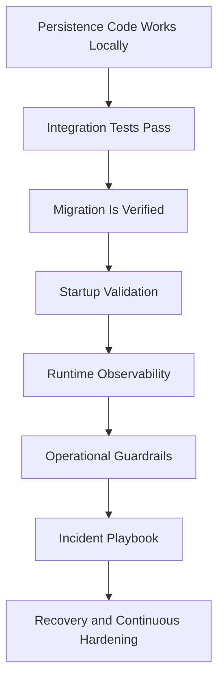
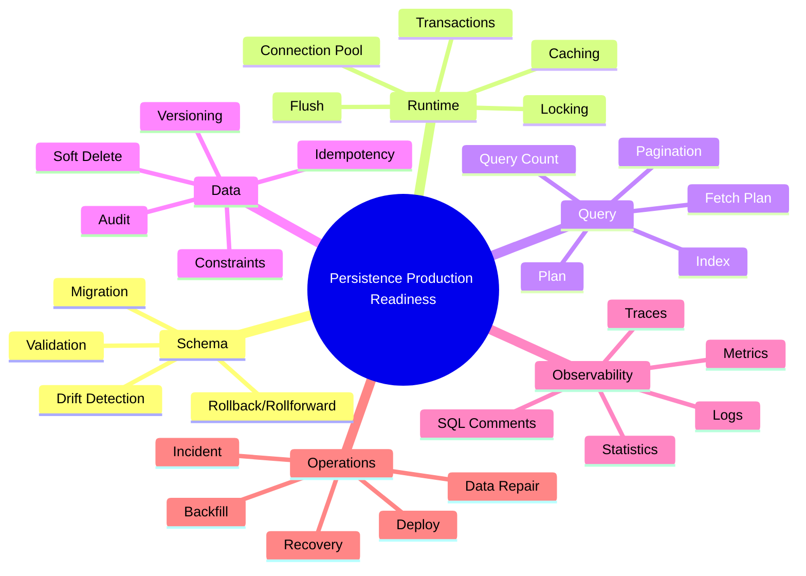
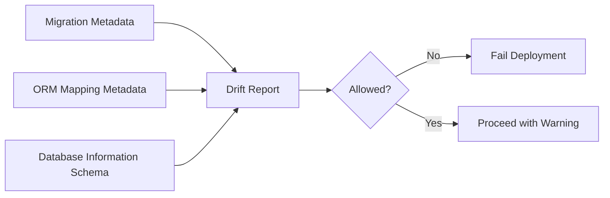
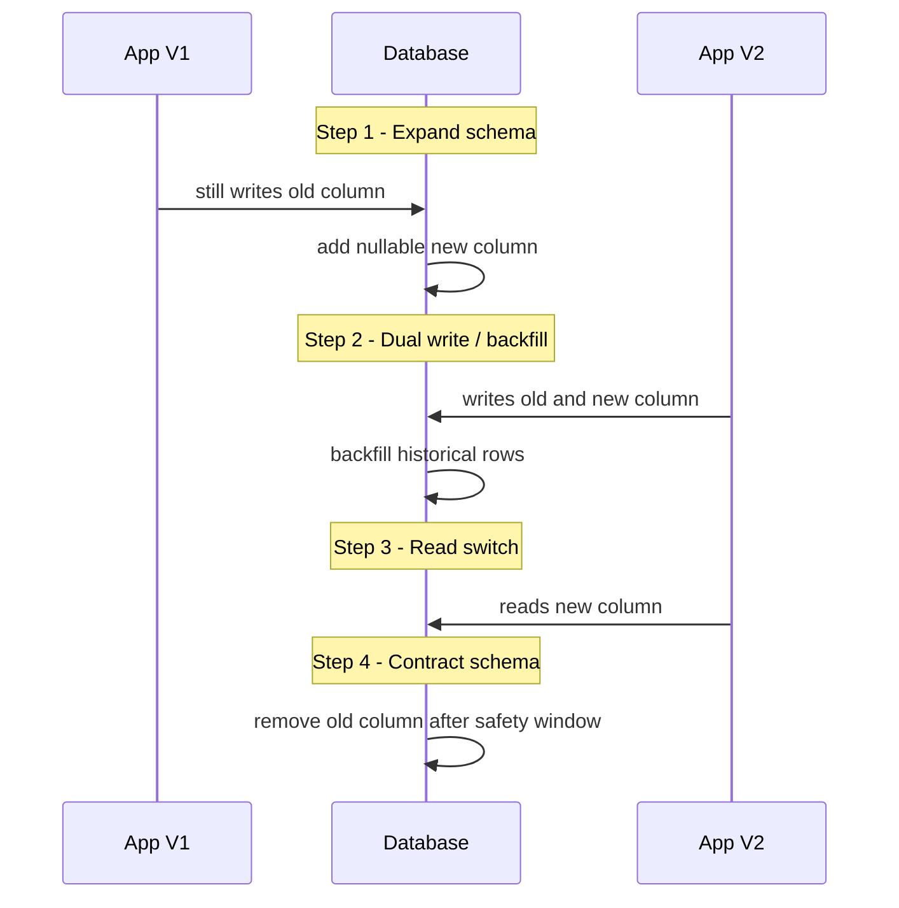
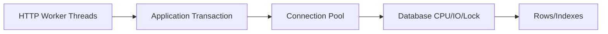
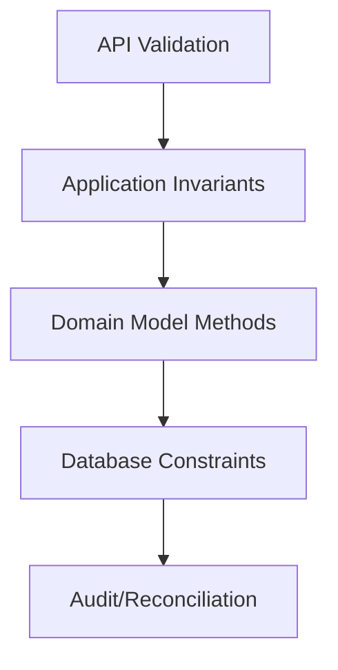
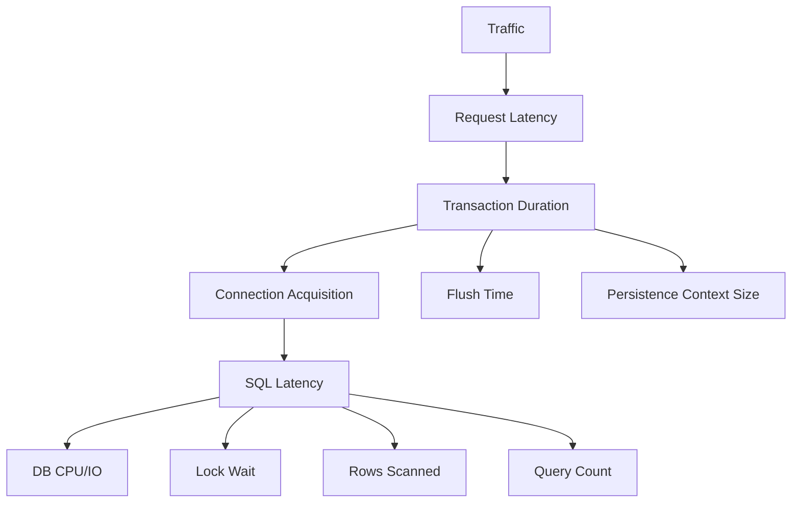
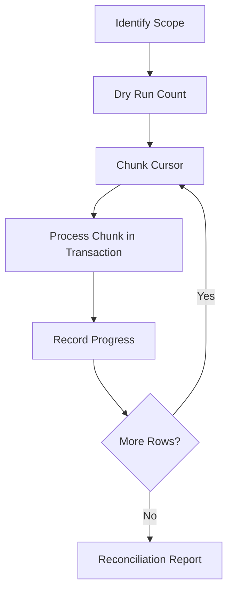
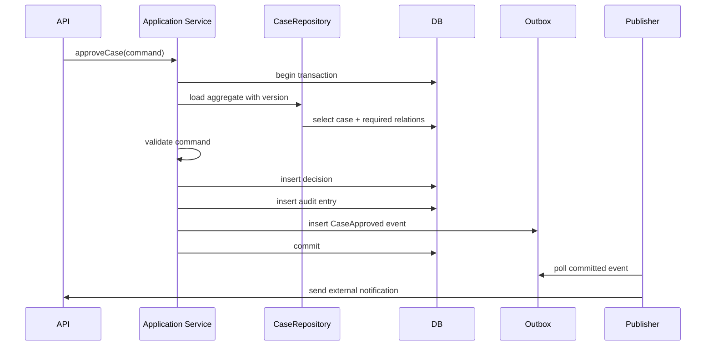

------
title: Learn Java Persistence, Database Integration, JPA, Hibernate ORM & EclipseLink - Part 033
description: Production readiness playbook untuk Java persistence: startup validation, migration safety, connection exhaustion, deadlock handling, observability, operational guardrails, incident checklist, dan release governance.
series: learn-java-persistence
seriesTitle: Learn Java Persistence, Database Integration, JPA, Hibernate ORM & EclipseLink
order: 33
partTitle: Production Readiness Playbook
tags:
- java
- persistence
- jpa
- jakarta-persistence
- hibernate
- eclipselink
- production
- reliability
- observability
- database
date: 2026-06-27
---

# Part 033 — Production Readiness Playbook

## 1. Tujuan Pembelajaran

Di part sebelumnya kita sudah membahas mapping, query, transaction, locking, caching, provider internals, framework integration, domain-driven persistence pattern, anti-pattern, performance engineering, dan testing.

Part ini menjawab pertanyaan berbeda:

> Bagaimana memastikan persistence layer siap berjalan di production, aman saat release, bisa didiagnosis saat incident, dan tidak menjadi sumber silent data corruption?

Production readiness bukan hanya soal “test pass”. Persistence layer berhubungan langsung dengan data permanen, constraint bisnis, auditability, concurrency, compliance, dan recovery. Bug di layer ini sering lebih mahal daripada bug di UI karena efeknya bisa menetap di database.

Target setelah part ini:

1. Mampu membuat checklist production readiness untuk persistence layer.
2. Mampu membedakan failure yang boleh terjadi, harus dicegah, dan harus dipulihkan.
3. Mampu merancang startup validation, schema validation, migration safety, dan rollback strategy.
4. Mampu mendeteksi connection exhaustion, deadlock, lock wait, N+1, slow query, dan persistence context blow-up.
5. Mampu membuat operational playbook yang bisa dipakai tim saat incident.
6. Mampu mereview persistence design dari sudut data correctness, runtime stability, dan operability.

---

## 2. Kaufman Lens: Dari “Bisa Coding” ke “Siap Operasi”

Dalam kerangka Josh Kaufman, tahap akhir skill acquisition bukan menambah daftar API, tetapi menghilangkan hambatan praktik dan mempercepat feedback loop.

Pada persistence layer, feedback loop production sering terlambat:

- query lambat baru terasa saat data besar,
- deadlock baru muncul saat traffic paralel,
- schema drift baru ketahuan saat deploy,
- cache stale baru terlihat setelah external writer masuk,
- constraint kurang kuat baru terlihat setelah data kotor masuk,
- rollback migration baru diuji saat incident.

Karena itu, production readiness harus mengubah persistence dari “kode yang berjalan” menjadi “sistem yang bisa dijalankan, diamati, diperbaiki, dan diaudit”.



---

## 3. Core Production Invariant

Persistence layer production-ready jika memenuhi invariant berikut:

> Setiap perubahan data penting harus punya model konsistensi yang jelas, constraint yang cukup, transaction boundary yang eksplisit, query behavior yang terukur, migration path yang aman, dan observability yang memungkinkan diagnosis tanpa menebak.

Invariant ini dapat dipecah menjadi tujuh area:

| Area | Pertanyaan Utama |
|---|---|
| Data correctness | Apakah data invalid bisa masuk? |
| Transaction correctness | Apakah perubahan atomik benar-benar atomik? |
| Concurrency correctness | Apakah race condition punya strategi? |
| Query safety | Apakah query tetap aman saat data membesar? |
| Migration safety | Apakah perubahan schema bisa dirilis tanpa menghentikan sistem? |
| Runtime stability | Apakah pool, transaction, dan flush behavior terkendali? |
| Operability | Apakah tim bisa mendiagnosis dan recover saat gagal? |

---

## 4. Production Readiness Map



---

## 5. Startup Validation

Startup validation adalah mekanisme untuk menolak aplikasi hidup jika environment tidak memenuhi kontrak minimum.

Contoh kontrak:

- database reachable,
- schema version sesuai,
- entity mapping valid terhadap schema,
- required extension tersedia,
- migration sudah diterapkan,
- index penting ada,
- required lock timeout setting ada,
- connection pool bisa membuat koneksi,
- provider configuration konsisten,
- dialect benar.

### 5.1 Apa yang Harus Divalidasi Saat Startup?

| Check | Tujuan |
|---|---|
| Connectivity check | memastikan aplikasi bisa membuka koneksi |
| Migration version check | memastikan schema berada pada versi yang didukung |
| ORM schema validation | memastikan mapping tidak drift dari schema |
| Required table/index check | memastikan query kritis tidak berjalan tanpa index |
| Provider setting check | memastikan environment tidak memakai default berbahaya |
| Cache config check | memastikan region/cache provider sesuai |
| Timezone check | mencegah timestamp semantics berbeda |
| Isolation/lock timeout check | mencegah thread menggantung saat contention |

### 5.2 Schema Validation Bukan Migration

ORM schema validation menjawab:

> Apakah mapping entity kompatibel dengan database saat ini?

Migration menjawab:

> Bagaimana database diubah dari versi lama ke versi baru?

Jangan mengganti migration dengan schema auto-update di production. Auto-update mudah terlihat praktis, tetapi sulit diaudit, sulit direview, dan tidak cocok untuk perubahan destructive.

### 5.3 Contoh Startup Validation Policy

```yaml
persistence:
  startup:
    failOnSchemaMismatch: true
    failOnPendingMigration: true
    failOnUnknownMigration: true
    requireTimezone: UTC
    requireLockTimeoutMs: 5000
    requireStatementTimeoutMs: 30000
    requireSqlCommenting: true
```

Policy ini bukan standar Jakarta Persistence. Ini contoh governance internal yang bisa diimplementasikan via framework configuration, migration tool, health check, atau custom startup validator.

---

## 6. Schema Drift Detection

Schema drift terjadi saat database production berbeda dari kontrak yang diasumsikan aplikasi.

Sumber drift:

1. hotfix manual di database,
2. migration gagal sebagian,
3. migration diterapkan di environment yang salah,
4. branch berbeda menghasilkan migration conflict,
5. ORM mapping berubah tanpa migration,
6. rollback aplikasi tanpa rollback schema,
7. multiple services menulis schema yang sama.

### 6.1 Drift yang Berbahaya

| Drift | Dampak |
|---|---|
| missing column | aplikasi gagal saat query/flush |
| nullable mismatch | data invalid bisa masuk atau flush gagal |
| type mismatch | truncation, conversion error, wrong comparison |
| missing index | slow query dan lock amplification |
| missing constraint | data corruption |
| different default | behavior berbeda antar environment |
| changed FK cascade | delete/update berdampak tidak terduga |

### 6.2 Drift Detection Layer



### 6.3 Practical Drift Checklist

Sebelum release:

- migration sudah direview,
- migration sudah dijalankan di database clone,
- generated SQL dari ORM sudah dibandingkan secara sampling,
- constraint penting ada di database, bukan hanya di Java,
- index untuk query kritis sudah ada,
- rollback/rollforward path diketahui,
- data backfill sudah diuji,
- downtime requirement eksplisit.

---

## 7. Migration Safety

Migration production bukan sekadar `ALTER TABLE`.

Migration adalah perubahan kontrak data di sistem berjalan.

### 7.1 Expand-Contract Pattern

Untuk sistem besar, gunakan pola expand-contract:



### 7.2 Migration Types

| Type | Risk | Example |
|---|---:|---|
| additive nullable column | low | add optional metadata |
| additive table | low | add outbox table |
| index creation | medium | can lock table depending DB |
| backfill | medium/high | can cause write amplification |
| not-null constraint | medium/high | requires clean data |
| type change | high | conversion risk |
| column rename | high | breaks old app version |
| table split | high | requires compatibility phase |
| destructive drop | very high | irreversible without backup |

### 7.3 Safe Migration Rule

> A migration is production-safe only if it is compatible with both the currently running application and the next application version, unless downtime is explicitly planned.

### 7.4 Migration Review Template

```md
## Migration Review

### Purpose
What business or technical capability requires this schema change?

### Compatibility
- Compatible with current app version?
- Compatible with next app version?
- Requires dual-write?
- Requires read switch?

### Data Safety
- Is existing data valid?
- Is backfill required?
- Is the migration idempotent?
- What happens if migration is interrupted?

### Performance
- Does it scan a large table?
- Does it lock writes?
- Does it require online index creation?
- Has it been tested against production-like volume?

### Rollback / Rollforward
- Can we rollback?
- If not, what is the rollforward fix?
- What backup/snapshot exists?

### Observability
- What metric/log tells us it is safe?
- What alert detects failure?
```

---

## 8. Connection Pool Readiness

Persistence incident yang sangat umum adalah connection exhaustion.

Connection exhaustion terjadi saat semua koneksi database habis dipakai atau menunggu terlalu lama.

### 8.1 Penyebab Umum

- transaction terlalu panjang,
- query lambat,
- lock wait,
- deadlock retry storm,
- connection leak,
- pool terlalu kecil,
- pool terlalu besar dan membebani database,
- thread pool jauh lebih besar dari pool database,
- N+1 query menyebabkan connection hold time panjang,
- external service call dilakukan di dalam transaction,
- batch processing tidak melakukan flush/clear dan commit per chunk.

### 8.2 Pool Sizing Mental Model

Pool size bukan semakin besar semakin baik.

Pool mengontrol concurrency database. Jika pool lebih besar dari kapasitas database, bottleneck berpindah ke database dan latency memburuk.



Kapasitas efektif dipengaruhi:

- query time,
- transaction duration,
- database CPU,
- disk IO,
- lock contention,
- network latency,
- number of app instances,
- maximum database connections,
- background jobs.

### 8.3 Connection Pool Metrics

Wajib punya:

| Metric | Arti |
|---|---|
| active connections | koneksi sedang dipakai |
| idle connections | koneksi siap dipakai |
| pending/waiting threads | thread menunggu koneksi |
| acquisition time | waktu mendapatkan koneksi |
| usage/hold time | durasi koneksi dipakai |
| timeout count | jumlah gagal mendapatkan koneksi |
| max lifetime eviction | koneksi diganti karena lifetime |
| leak detection | indikasi koneksi terlalu lama dipakai |

### 8.4 Red Flags

- pending threads > 0 secara stabil,
- acquisition p95 naik,
- active connections selalu mendekati max,
- slow query naik bersamaan dengan pool exhaustion,
- timeout terjadi saat traffic normal,
- batch job mengambil semua koneksi,
- request latency mengikuti connection acquisition time.

### 8.5 Guardrail

- jangan panggil external API di dalam transaction,
- pakai timeout untuk query dan transaction,
- pisahkan pool OLTP dan batch jika perlu,
- batasi concurrency job,
- observasi pool per service instance,
- gunakan read-only transaction untuk read path,
- monitor connection hold time, bukan hanya query time.

---

## 9. Transaction Readiness

Transaction production-ready jika:

1. boundary-nya eksplisit,
2. durasinya pendek,
3. tidak mencampur IO eksternal,
4. rollback semantics jelas,
5. concurrency behavior diketahui,
6. idempotency tersedia untuk retry,
7. commit-time failure dipertimbangkan.

### 9.1 Transaction Boundary Smell

| Smell | Risiko |
|---|---|
| transaction membungkus HTTP call keluar | lock dan connection tertahan |
| transaction membungkus loop besar | persistence context membesar |
| repository method membuka transaction sendiri-sendiri | consistency pecah |
| read query tanpa timeout | thread bisa menggantung |
| long-running report di OLTP transaction | pool starvation |
| catch exception tanpa rollback | partial state membingungkan |
| async event dikirim sebelum commit | event phantom |

### 9.2 Correct Boundary Example

Buruk:

```java
@Transactional
public void approveCase(UUID caseId) {
    EnforcementCase c = repository.get(caseId);
    c.approve();

    externalNotificationClient.notifyApproval(c.id()); // IO eksternal di dalam transaction
}
```

Lebih baik:

```java
@Transactional
public void approveCase(UUID caseId) {
    EnforcementCase c = repository.get(caseId);
    c.approve();

    outbox.record(CaseApprovedEvent.from(c));
}
```

Lalu publisher terpisah membaca outbox setelah commit.

### 9.3 Transaction Timeout

Setiap transaction path kritis sebaiknya punya timeout yang masuk akal.

Timeout yang terlalu besar menyembunyikan masalah. Timeout yang terlalu kecil menciptakan false failure.

Pertimbangkan:

- p95 normal latency,
- database lock timeout,
- statement timeout,
- external SLA,
- retry strategy,
- user-facing latency budget.

---

## 10. Locking and Deadlock Readiness

Deadlock bukan selalu bug. Dalam sistem concurrent, deadlock bisa terjadi saat beberapa transaction mengunci resource dengan urutan berbeda. Yang penting adalah desain mengurangi probabilitas dan aplikasi punya strategi recovery.

### 10.1 Common Deadlock Sources

- update dua aggregate dalam urutan berbeda,
- batch job dan OLTP update baris sama,
- missing index pada FK atau predicate update,
- update parent dan child dengan order berbeda,
- pessimistic lock terlalu luas,
- flush mengeluarkan SQL dalam order yang tidak diprediksi developer,
- cascading update/delete pada graph besar.

### 10.2 Lock Ordering Rule

Jika satu transaction harus mengubah beberapa resource, gunakan deterministic lock order.

Contoh:

```java
List<UUID> sortedCaseIds = caseIds.stream()
    .sorted()
    .toList();

for (UUID id : sortedCaseIds) {
    repository.lockForUpdate(id);
}
```

### 10.3 Retry Policy

Deadlock dan optimistic conflict bisa diretry jika operasi idempotent dan side effect eksternal tidak terjadi di dalam transaction.

Retry perlu:

- max attempts,
- backoff,
- jitter,
- idempotency key,
- metrics,
- clear error classification.

### 10.4 Deadlock Incident Checklist

Saat deadlock spike:

1. Ambil deadlock graph dari database.
2. Identifikasi query yang terlibat.
3. Cek index pada predicate dan FK.
4. Cek transaction boundary dan durasi.
5. Cek urutan update resource.
6. Cek batch job overlap.
7. Cek release terbaru yang mengubah flush/order/cascade/query.
8. Tambahkan retry jika konflik memang transient.
9. Tambahkan deterministic ordering jika urutan lock tidak stabil.
10. Tambahkan index atau pecah transaction jika lock terlalu luas.

---

## 11. Query Readiness

Query production-ready jika:

- query count diketahui,
- execution plan stabil,
- index tersedia,
- pagination aman,
- fetch plan eksplisit,
- result cardinality dipahami,
- timeout tersedia,
- query tidak memuat object graph berlebihan,
- query punya test kontrak.

### 11.1 Query Budget

Untuk use case kritis, tetapkan query budget.

Contoh:

| Use Case | Max Query Count | Max Rows Hydrated | Notes |
|---|---:|---:|---|
| Case detail page | 5 | 200 | use entity graph/projection |
| Case list page | 2 | 50 | count query separate |
| Approve case command | 4 | 20 | lock aggregate root |
| Nightly escalation job | chunked | 500/chunk | keyset pagination |

Budget bukan dogma. Budget adalah alarm awal.

### 11.2 Query Cardinality

Sebelum query dirilis, jawab:

- berapa row maksimal yang mungkin dikembalikan?
- apakah predicate selective?
- apakah index mengikuti predicate dan sort?
- apakah join memperbanyak row?
- apakah pagination terjadi di database atau memory?
- apakah fetch join menduplikasi root?
- apakah data size akan tumbuh linear terhadap tenant/case/time?

### 11.3 Slow Query Readiness

Setiap slow query incident harus bisa ditelusuri dengan:

- query text,
- bind parameter shape,
- execution plan,
- row estimate vs actual rows,
- index used,
- lock wait,
- connection acquisition time,
- transaction id/correlation id,
- endpoint/job source,
- release version.

### 11.4 SQL Comments

Banyak provider dan framework dapat menambahkan komentar SQL. Gunakan untuk menghubungkan SQL ke use case.

Contoh konsep:

```sql
/* usecase=case-detail repository=CaseReadRepository method=findDetail */
select ...
```

Komentar jangan mengandung data sensitif.

---

## 12. Fetch Plan Readiness

Fetch plan yang buruk adalah sumber latency dan memory blow-up.

### 12.1 Fetch Plan Checklist

Untuk setiap use case:

- apakah memakai entity atau projection?
- association mana yang wajib dimuat?
- association mana yang tidak boleh dimuat?
- apakah lazy access bisa terjadi setelah transaction selesai?
- apakah serializer bisa memicu lazy loading?
- apakah collection lebih dari satu di-fetch join?
- apakah pagination digabung dengan collection fetch?
- apakah query count diuji?
- apakah result row multiplication dipahami?

### 12.2 Boundary Rule

> Do not let API serialization define your persistence fetch plan.

Fetch plan harus ditentukan oleh application/use-case layer, bukan oleh JSON serializer yang menyentuh getter entity.

---

## 13. Persistence Context Readiness

Persistence context adalah working set. Jika working set membesar tanpa kontrol, memory dan flush time akan memburuk.

### 13.1 Risk Pattern

```java
@Transactional
public void reprocessAllCases() {
    repository.findAll().forEach(caseEntity -> {
        caseEntity.recalculateRisk();
    });
}
```

Masalah:

- semua entity masuk persistence context,
- dirty checking membesar,
- flush di akhir sangat mahal,
- transaction panjang,
- lock/connection hold time panjang,
- rollback besar.

### 13.2 Chunked Batch Pattern

```java
public void reprocessAllCases() {
    UUID cursor = null;

    while (true) {
        List<UUID> ids = repository.nextIds(cursor, 500);
        if (ids.isEmpty()) {
            return;
        }

        transactionTemplate.executeWithoutResult(status -> {
            List<EnforcementCase> cases = repository.findByIds(ids);
            cases.forEach(EnforcementCase::recalculateRisk);
        });

        cursor = ids.get(ids.size() - 1);
    }
}
```

Dalam batch besar, gunakan:

- pagination stabil,
- chunked transaction,
- flush/clear jika memakai raw EntityManager,
- idempotency,
- progress marker,
- throttling,
- separate pool bila perlu,
- observability per chunk.

---

## 14. Caching Readiness

Cache membuat sistem lebih cepat saat benar dan lebih membingungkan saat salah.

### 14.1 Cache Decision Checklist

Sebelum mengaktifkan second-level cache/query cache:

- apakah data read-mostly?
- apakah external writer ada?
- apakah stale data dapat diterima?
- apakah tenant/security boundary aman?
- apakah invalidation jelas?
- apakah cache hit ratio akan diukur?
- apakah ada memory budget?
- apakah eviction policy sesuai?
- apakah cache region dipisahkan per data type?
- apakah query cache invalidation behavior dipahami?

### 14.2 Cache Incident Signs

- user melihat data lama,
- node A dan node B berbeda,
- external update tidak terlihat,
- memory naik setelah cache enable,
- query cache hit rendah tetapi invalidation tinggi,
- cache stampede saat eviction,
- permission leak karena cache key kurang tenant/security context.

### 14.3 Rule

> Never cache data whose correctness contract you cannot describe.

---

## 15. Data Correctness Guardrails

Persistence layer production-ready tidak hanya mengandalkan Java validation.

Gunakan pertahanan berlapis:



### 15.1 Database Constraint yang Wajib Dipertimbangkan

| Constraint | Tujuan |
|---|---|
| primary key | identity |
| foreign key | referential integrity |
| unique constraint | business uniqueness |
| not null | required field |
| check constraint | bounded domain |
| exclusion constraint | overlap prevention, if supported |
| trigger/generated column | special DB-side invariant |
| version column | optimistic concurrency |
| partial unique index | conditional uniqueness, if supported |

### 15.2 Java Validation vs Database Constraint

Java validation bagus untuk UX dan early rejection.

Database constraint wajib untuk correctness final.

Jika hanya Java yang memvalidasi, concurrent request, batch job, manual script, atau service lain bisa memasukkan data invalid.

---

## 16. Audit and Compliance Readiness

Untuk sistem regulatory/enforcement, audit bukan fitur tambahan. Audit adalah bagian dari defensibility.

### 16.1 Audit Questions

Untuk setiap perubahan penting:

- siapa yang melakukan?
- kapan dilakukan?
- dari state apa ke state apa?
- alasan atau legal basis apa?
- request/correlation id apa?
- command apa yang memicu?
- apakah perubahan berasal dari manusia, job, atau integration?
- apakah data lama masih bisa direkonstruksi?
- apakah audit tahan terhadap retry?
- apakah audit tidak hilang saat transaction rollback?

### 16.2 Audit Design Options

| Approach | Kelebihan | Risiko |
|---|---|---|
| audit columns | sederhana | tidak menyimpan history detail |
| audit table per entity | queryable | perlu konsistensi mapping |
| event sourcing | lengkap | kompleks dan butuh discipline tinggi |
| Hibernate Envers | cepat untuk Hibernate | provider-specific |
| database trigger audit | menangkap semua writer | logic tersebar di DB |
| outbox event audit | cocok integrasi | perlu consumer/replay discipline |

### 16.3 Audit Invariant

> Audit record must be committed atomically with the state change it explains, unless the architecture explicitly supports eventual audit with reconciliation.

---

## 17. Soft Delete Readiness

Soft delete sering terlihat sederhana tetapi punya efek luas.

### 17.1 Pertanyaan Sebelum Soft Delete

- apakah data harus benar-benar tidak terlihat?
- apakah unique constraint harus mengecualikan deleted row?
- apakah FK ke deleted row masih valid?
- apakah restore didukung?
- apakah audit/history sudah cukup tanpa soft delete?
- apakah query native/projection juga memfilter deleted row?
- apakah report harus melihat deleted row?
- apakah cache invalidation aman?
- apakah provider-specific annotation akan mengunci portabilitas?

### 17.2 Soft Delete Failure

Contoh umum:

```sql
select * from enforcement_case where reference_no = ?
```

Query native ini lupa `deleted = false`, sementara JPQL repository lain sudah memfilter. Akibatnya data yang harus tersembunyi muncul di path tertentu.

### 17.3 Rule

> Soft delete is a data visibility policy, not just a boolean column.

---

## 18. Multi-Tenancy Readiness

Multi-tenancy persistence punya risiko correctness dan security.

### 18.1 Model Multi-Tenancy

| Model | Kelebihan | Risiko |
|---|---|---|
| shared schema + tenant_id | sederhana, murah | setiap query harus benar filter tenant |
| schema per tenant | isolasi lebih baik | migration lebih kompleks |
| database per tenant | isolasi kuat | operasional lebih mahal |
| hybrid | fleksibel | kompleksitas tinggi |

### 18.2 Tenant Guardrails

- tenant id harus bagian dari security context,
- jangan menerima tenant id mentah dari request tanpa otorisasi,
- semua query harus tenant-aware,
- unique constraint perlu tenant scope,
- cache key harus tenant-aware,
- batch job harus eksplisit tenant,
- migration harus tenant-safe,
- audit harus menyimpan tenant context.

### 18.3 Review Smell

Jika ada repository method seperti ini:

```java
Optional<EnforcementCase> findByReferenceNo(String referenceNo);
```

Pada sistem multi-tenant, ini smell. Biasanya harus:

```java
Optional<EnforcementCase> findByTenantIdAndReferenceNo(TenantId tenantId, String referenceNo);
```

Atau tenant filtering dikelola oleh provider/filter yang diuji ketat.

---

## 19. Security and Sensitive Data Readiness

Persistence layer memegang data sensitif.

### 19.1 Checklist

- field sensitif tidak muncul di log SQL bind parameter,
- query comment tidak mengandung PII,
- audit tidak menyimpan rahasia tanpa masking,
- encryption-at-rest dipahami sebagai DB concern,
- application-level encryption dipakai jika threat model butuh,
- search/indexing atas encrypted data dipahami trade-off-nya,
- backup retention sesuai policy,
- delete/anonymization policy jelas,
- cache tidak menyimpan data di boundary salah,
- test fixture tidak memakai data production mentah.

### 19.2 Data Classification

Setiap entity penting sebaiknya punya klasifikasi:

| Classification | Example |
|---|---|
| public | reference catalog |
| internal | workflow status |
| confidential | case evidence metadata |
| restricted | personal identifier |
| secret | credential/token |

Klasifikasi menentukan logging, caching, masking, audit, retention, dan access control.

---

## 20. Release Readiness Checklist

Gunakan checklist ini sebelum deploy persistence-related change.

### 20.1 Mapping and Entity

- [ ] Entity mapping tidak menyebabkan unbounded cascade.
- [ ] `equals/hashCode` aman untuk lifecycle entity.
- [ ] Collection helper method menjaga dua sisi relasi.
- [ ] Lazy association tidak bocor ke serializer.
- [ ] Enum tidak memakai ordinal untuk data jangka panjang.
- [ ] Timezone semantics jelas.
- [ ] Soft delete/filter policy konsisten.
- [ ] Multi-tenant boundary aman.

### 20.2 Query

- [ ] Query count diukur.
- [ ] Execution plan dicek untuk query kritis.
- [ ] Index mendukung predicate dan sort.
- [ ] Pagination tidak memakai collection fetch join.
- [ ] Projection digunakan untuk read-heavy list.
- [ ] Query timeout tersedia.
- [ ] Native query punya mapping contract.
- [ ] Bulk update/delete mengelola stale persistence context.

### 20.3 Transaction

- [ ] Transaction boundary di application service.
- [ ] Tidak ada external IO di dalam transaction.
- [ ] Timeout ditetapkan.
- [ ] Retry hanya untuk operasi idempotent.
- [ ] Commit-time failure dipertimbangkan.
- [ ] Event eksternal memakai outbox atau after-commit hook yang aman.
- [ ] Locking strategy jelas.

### 20.4 Migration

- [ ] Migration compatible dengan current dan next app version.
- [ ] Backfill diuji dengan volume realistis.
- [ ] Index creation online jika database membutuhkan.
- [ ] Rollforward/rollback diketahui.
- [ ] Schema validation aktif.
- [ ] Pending migration menggagalkan startup/deploy.
- [ ] Data repair script direview.

### 20.5 Observability

- [ ] SQL logging bisa diaktifkan aman.
- [ ] Slow query tersedia.
- [ ] Metrics pool tersedia.
- [ ] Metrics transaction/query/flush tersedia.
- [ ] Correlation id menghubungkan request ke SQL.
- [ ] Alert untuk pool exhaustion/deadlock/slow query.
- [ ] Dashboard persistence tersedia.

---

## 21. Runtime Dashboard

Dashboard persistence minimal:



### 21.1 Suggested Metrics

| Category | Metrics |
|---|---|
| connection pool | active, idle, pending, acquisition time, timeout |
| transaction | duration, rollback count, timeout count |
| ORM | entity load count, flush count, dirty count, L2 hit/miss |
| query | count, latency, rows returned, slow query count |
| lock | lock wait, deadlock, optimistic conflict |
| migration | version, pending migration, failure |
| cache | hit ratio, eviction, invalidation |
| batch | chunk duration, rows processed, failure/retry |

---

## 22. Incident Playbook: Connection Exhaustion

### 22.1 Symptoms

- request latency naik,
- pool acquisition timeout,
- active connections maksimum,
- pending threads naik,
- database CPU/IO tinggi atau lock wait tinggi,
- thread dump menunjukkan banyak thread menunggu connection.

### 22.2 Triage

1. Apakah active connection selalu max?
2. Apakah pending thread naik?
3. Apakah query lambat naik?
4. Apakah lock wait/deadlock naik?
5. Apakah ada job baru?
6. Apakah release baru mengubah fetch/query?
7. Apakah external dependency lambat di dalam transaction?
8. Apakah database max connection tercapai?

### 22.3 Mitigation

- hentikan batch job non-kritis,
- turunkan concurrency worker,
- aktifkan degraded mode untuk endpoint berat,
- rollback release jika regression jelas,
- kill query/transaction panjang jika aman,
- tambahkan index jika missing dan bisa dilakukan online,
- scale read replica untuk read path jika sesuai,
- jangan langsung menaikkan pool tanpa memahami DB capacity.

### 22.4 Root Cause Candidates

| Signal | Kandidat |
|---|---|
| query latency tinggi | missing index, bad plan, data growth |
| lock wait tinggi | contention, batch overlap, pessimistic lock |
| acquisition time tinggi | pool exhaustion |
| DB CPU tinggi | too many queries, scan, sort/hash join |
| thread blocked external HTTP | transaction membungkus external call |
| heap naik | persistence context blow-up |

---

## 23. Incident Playbook: Slow Query Regression

### 23.1 Triage

1. Identifikasi query text dan source use case.
2. Ambil bind parameter sample.
3. Bandingkan execution plan sebelum/sesudah.
4. Cek row estimate vs actual.
5. Cek index used.
6. Cek statistik database.
7. Cek perubahan data cardinality.
8. Cek release yang mengubah query/fetch/pagination.
9. Cek apakah query count naik.
10. Cek apakah cache behavior berubah.

### 23.2 Common Causes

- missing index,
- index tidak cocok dengan predicate/sort,
- parameter skew,
- join fetch memperbesar row,
- query count naik karena N+1,
- count query mahal,
- pagination offset makin dalam,
- generated SQL berubah setelah provider upgrade,
- stale database statistics,
- implicit cast membuat index tidak dipakai.

### 23.3 Remediation

- tambah/ubah index,
- ubah query shape,
- gunakan keyset pagination,
- pakai projection,
- pecah query,
- batasi fetch graph,
- update database statistics,
- tambahkan query hint hanya jika benar-benar perlu,
- set timeout,
- tambahkan regression test query count/plan.

---

## 24. Incident Playbook: Data Corruption

Data corruption harus ditangani lebih hati-hati daripada outage biasa.

### 24.1 First Response

- hentikan writer yang diduga salah,
- jangan langsung menjalankan script repair tanpa snapshot,
- ambil backup/snapshot,
- identifikasi scope data terdampak,
- simpan audit/log terkait,
- buat read-only report dampak,
- komunikasikan uncertainty,
- rancang repair idempotent,
- uji repair di clone,
- jalankan repair dengan logging.

### 24.2 Classification

| Type | Example |
|---|---|
| missing data | event tidak tercatat |
| duplicate data | idempotency gagal |
| invalid state | case `CLOSED` tapi masih punya active task |
| broken reference | FK tidak ada atau logical reference invalid |
| stale denormalized data | read model tidak sinkron |
| wrong tenant | data masuk tenant lain |
| audit mismatch | status berubah tanpa audit event |

### 24.3 Repair Script Checklist

- idempotent,
- dry-run mode,
- logs before/after value,
- bounded by explicit criteria,
- no broad `update all`,
- transaction chunked,
- reviewed by second engineer,
- tested on clone,
- has rollback/compensating script,
- emits reconciliation report.

---

## 25. Incident Playbook: Migration Failure

### 25.1 Failure Modes

- syntax incompatible dengan DB version,
- lock timeout,
- disk full,
- partial migration,
- data violates new constraint,
- migration order conflict,
- app version deployed before migration,
- migration destructive and rollback needed.

### 25.2 Response

1. Stop deploy pipeline.
2. Identify migration version reached.
3. Determine if migration is fully applied, partially applied, or failed before mutation.
4. Do not rerun blindly.
5. Inspect migration metadata table.
6. Decide rollback, repair, or rollforward.
7. If partial DDL is non-transactional, document actual state.
8. Restore from snapshot only if data loss/structural inconsistency cannot be repaired safely.
9. Add regression test for failure condition.

### 25.3 Rollback vs Rollforward

Pada banyak database, rollback DDL tidak selalu sederhana. Karena itu, production migration lebih sering memakai rollforward.

Rollback aplikasi bisa aman jika schema expand bersifat backward-compatible.

---

## 26. Incident Playbook: Optimistic Conflict Spike

### 26.1 Symptoms

- banyak `OptimisticLockException`,
- user melihat “data changed by another transaction”,
- retry count naik,
- endpoint update tertentu gagal,
- job bersaing dengan user action.

### 26.2 Diagnosis

- aggregate mana yang sering konflik?
- apakah version field terlalu kasar?
- apakah command menyentuh root untuk perubahan kecil?
- apakah batch job update entity sama?
- apakah user screen stale terlalu lama?
- apakah retry aman?
- apakah conflict adalah business conflict yang harus ditampilkan, bukan diretry?

### 26.3 Remediation

- tambahkan user-facing conflict resolution,
- ubah aggregate boundary,
- pindahkan counter/statistic ke atomic update,
- pisahkan hot field,
- gunakan command idempotency,
- schedule batch di window berbeda,
- gunakan pessimistic lock hanya untuk bagian yang memang perlu.

---

## 27. Batch Job Readiness

Batch job sering menjadi sumber incident karena bekerja di volume besar dan berjalan di luar request path.

### 27.1 Batch Checklist

- bounded query,
- stable pagination,
- chunked transaction,
- progress marker,
- idempotency,
- retry/backoff,
- max concurrency,
- separate pool jika perlu,
- timeout,
- observability per chunk,
- safe stop/resume,
- rate limiting,
- dry run,
- data reconciliation,
- no unbounded persistence context.

### 27.2 Stable Pagination

Offset pagination buruk untuk data yang berubah dan table besar.

Lebih aman:

```sql
where id > :lastSeenId
order by id
limit :chunkSize
```

Atau gunakan cursor berdasarkan key yang stabil.

---

## 28. Backfill Readiness

Backfill adalah batch migration data.

### 28.1 Backfill Risks

- mengunci table,
- menambah replication lag,
- membebani connection pool,
- membuat cache stale,
- mengubah row yang sedang dipakai user,
- gagal di tengah,
- tidak idempotent,
- menghasilkan data inconsistent karena logic berubah.

### 28.2 Backfill Design



### 28.3 Backfill Guardrails

- chunk small enough,
- sleep/throttle,
- progress table,
- retry per chunk,
- dead-letter failed row,
- compare before/after counts,
- run during low traffic,
- monitor DB health,
- stop safely if thresholds exceeded.

---

## 29. Provider Upgrade Readiness

Upgrade Hibernate/EclipseLink bukan library upgrade biasa. Provider mempengaruhi SQL generation, flush order, dirty checking, query parsing, dialect behavior, and lazy loading.

### 29.1 Provider Upgrade Checklist

- baca migration guide,
- run full persistence tests,
- compare generated SQL for critical queries,
- compare query count,
- validate schema,
- test lazy loading/proxy behavior,
- test custom types/converters,
- test second-level cache,
- test batch insert/update,
- test native queries,
- test locking behavior,
- test provider-specific annotations,
- run performance baseline,
- deploy canary.

### 29.2 SQL Snapshot Testing

Untuk query kritis, simpan baseline:

- query count,
- SQL shape,
- execution plan hash jika feasible,
- p95 latency di dataset realistis.

Jangan membuat test terlalu rapuh terhadap formatting SQL, tetapi cukup kuat untuk mendeteksi perubahan join/fetch/pagination.

---

## 30. Data Retention and Archival

Production persistence harus punya jawaban untuk data yang terus tumbuh.

### 30.1 Retention Questions

- data apa yang wajib disimpan?
- berapa lama?
- kapan boleh dihapus/anonymize?
- apa efek terhadap audit/legal hold?
- apakah archival read diperlukan?
- apakah archived data masih dipakai query?
- apakah foreign key memungkinkan deletion?
- apakah cache/search/read model ikut dibersihkan?

### 30.2 Archival Pattern

| Pattern | Cocok Untuk |
|---|---|
| partition by time | table besar time-series |
| archive table | data lama jarang dibaca |
| cold storage export | compliance retention |
| anonymization | privacy requirement |
| logical closure | data masih dibutuhkan untuk audit |
| event snapshot | event-sourced/history-heavy system |

---

## 31. Production Readiness Review Format

Gunakan format berikut untuk review desain persistence.

```md
# Persistence Production Readiness Review

## Scope
Entity, repository, service, migration, and use cases affected.

## Data Model
- Entities changed:
- Tables changed:
- Constraints:
- Indexes:
- Multi-tenant impact:
- Audit impact:

## Transaction Model
- Transaction boundary:
- Isolation expectation:
- Locking strategy:
- Retry/idempotency:
- External side effects:

## Query Model
- Critical queries:
- Fetch plan:
- Query count:
- Pagination:
- Execution plan:
- Timeout:

## Migration Model
- Migration type:
- Expand-contract required:
- Backfill:
- Rollback/rollforward:
- Drift validation:

## Observability
- Logs:
- Metrics:
- Traces:
- Dashboards:
- Alerts:

## Failure Modes
- Expected failures:
- Mitigation:
- Recovery:
- Data repair plan:

## Decision
Approved / Approved with conditions / Rejected
```

---

## 32. Regulatory Case Management Example

Kita pakai domain:

- `EnforcementCase`,
- `CaseAssignment`,
- `CaseDecision`,
- `EvidenceItem`,
- `AuditEntry`,
- `OutboxMessage`.

### 32.1 Use Case: Approve Enforcement Decision

Requirements:

- only assigned reviewer can approve,
- case must be in `UNDER_REVIEW`,
- decision must be recorded,
- audit entry must be committed atomically,
- external notification must be sent after commit,
- concurrent approvals must not create duplicate decision,
- query must not load all evidence blobs,
- operation must finish under latency budget.

### 32.2 Production-Ready Design



### 32.3 Readiness Questions

- Is there a unique constraint preventing two active decisions for one case?
- Is `@Version` on the aggregate root?
- Does approval load only required data?
- Is notification outside DB transaction?
- Is outbox idempotent?
- Does audit include actor, command id, old state, new state?
- Is optimistic conflict mapped to user-friendly response?
- Is transaction timeout set?
- Does test verify duplicate approval under concurrency?
- Does migration add constraint safely to existing data?

---

## 33. Production Readiness Maturity Levels

| Level | Characteristics |
|---:|---|
| 1 | Persistence works locally; no operational guarantees |
| 2 | Integration tests and migrations exist |
| 3 | Query count, transaction boundary, and schema validation are controlled |
| 4 | Observability, incident playbooks, and release checks exist |
| 5 | Persistence design is reviewed through failure modelling and data correctness invariants |

Top 1% engineer tidak hanya tahu annotation. Mereka tahu konsekuensi annotation di runtime, saat data besar, saat deploy gagal, saat dua user update bersamaan, dan saat audit harus dipertanggungjawabkan.

---

## 34. Common Production Failure Matrix

| Failure | Prevention | Detection | Recovery |
|---|---|---|---|
| schema mismatch | migration validation | startup failure | rollforward/fix migration |
| missing index | query review | slow query alert | online index |
| N+1 | query count test | query count metric | fetch plan/projection |
| connection exhaustion | pool sizing/timeouts | pool metrics | reduce concurrency/fix slow query |
| deadlock | lock order/index | DB deadlock logs | retry/backoff/design fix |
| optimistic conflict | version/idempotency | exception metric | retry/user resolution |
| stale cache | invalidation policy | cache metric/user report | evict/disable cache |
| data corruption | DB constraints/audit | reconciliation | repair script |
| migration partial failure | dry run/snapshot | migration metadata | rollforward/repair |
| batch blow-up | chunking | memory/transaction metrics | stop/resume chunked |

---

## 35. Final Checklist

A persistence layer is ready for production when all of this is true:

- [ ] Schema is managed by migration, not uncontrolled auto-update.
- [ ] Startup fails on incompatible schema.
- [ ] Critical queries have measured plans.
- [ ] Fetch plans are explicit per use case.
- [ ] Transaction boundaries are short and intentional.
- [ ] External IO is not inside DB transaction.
- [ ] Concurrency strategy is defined.
- [ ] Database constraints enforce critical invariants.
- [ ] Connection pool metrics are monitored.
- [ ] Deadlock/lock wait/slow query alerts exist.
- [ ] Batch jobs are chunked and resumable.
- [ ] Backfills are idempotent and observable.
- [ ] Audit data is committed atomically with state changes.
- [ ] Cache usage has consistency policy.
- [ ] Provider upgrades have regression testing.
- [ ] Incident playbooks exist and are known by the team.

---

## 36. Ringkasan

Production readiness adalah titik di mana persistence layer tidak lagi hanya dilihat sebagai code-level abstraction, tetapi sebagai operational system.

Mental model penting:

1. Schema adalah kontrak jangka panjang.
2. Migration adalah release engineering.
3. Transaction adalah consistency envelope.
4. Connection pool adalah concurrency gate.
5. Query plan adalah runtime truth.
6. Cache adalah consistency risk.
7. Audit adalah defensibility mechanism.
8. Observability adalah syarat diagnosis.
9. Incident playbook adalah bagian dari desain.
10. Recovery harus dirancang sebelum failure terjadi.

Pada part berikutnya, kita akan menutup seri dengan capstone: architecture review dan mastery exercise yang menggabungkan semua konsep dari Part 001 sampai Part 033.

---

## 37. Latihan

### Latihan 1 — Release Review

Ambil satu migration nyata atau hipotetis:

- tambah kolom wajib,
- tambah index,
- ubah enum,
- tambah unique constraint,
- split table.

Tulis review:

- compatibility,
- backfill,
- locking risk,
- rollback/rollforward,
- query impact,
- test plan.

### Latihan 2 — Incident Simulation

Simulasikan connection exhaustion:

- query lambat,
- pool active max,
- pending threads naik.

Tulis:

- triage steps,
- metrics yang dicek,
- temporary mitigation,
- permanent fix.

### Latihan 3 — Data Corruption Drill

Buat skenario:

- duplicate decision record,
- missing audit entry,
- wrong tenant assignment.

Tulis repair plan:

- scope detection,
- snapshot,
- dry run,
- repair script,
- reconciliation.

### Latihan 4 — Dashboard Design

Buat dashboard persistence untuk service enforcement:

- connection metrics,
- query latency,
- transaction duration,
- deadlock count,
- optimistic conflict count,
- migration version,
- batch progress,
- outbox lag.

---

## 38. Mastery Rubric

Kamu menguasai part ini jika bisa:

- menjelaskan mengapa schema auto-update berbahaya di production,
- membuat expand-contract migration plan,
- mendiagnosis connection exhaustion tanpa menebak,
- membedakan slow query karena missing index vs lock wait,
- membuat retry strategy untuk deadlock/optimistic conflict,
- menulis checklist release persistence,
- mendesain audit yang defensible,
- membuat incident playbook persistence,
- menilai apakah cache aman untuk data tertentu,
- menjelaskan bagaimana persistence layer gagal pada volume besar.

