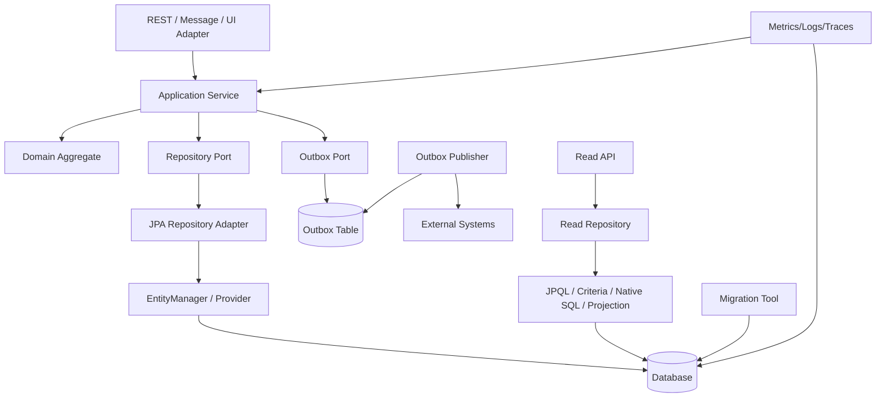
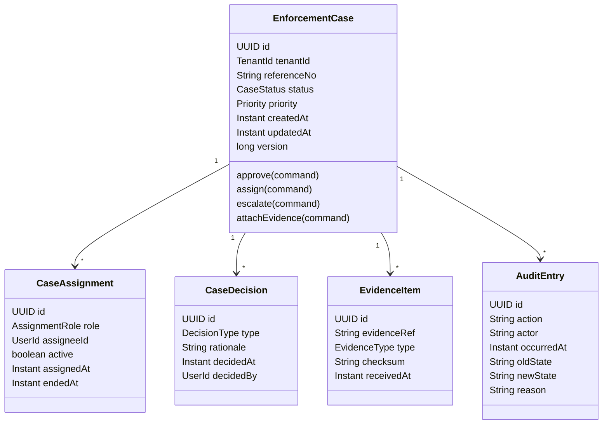
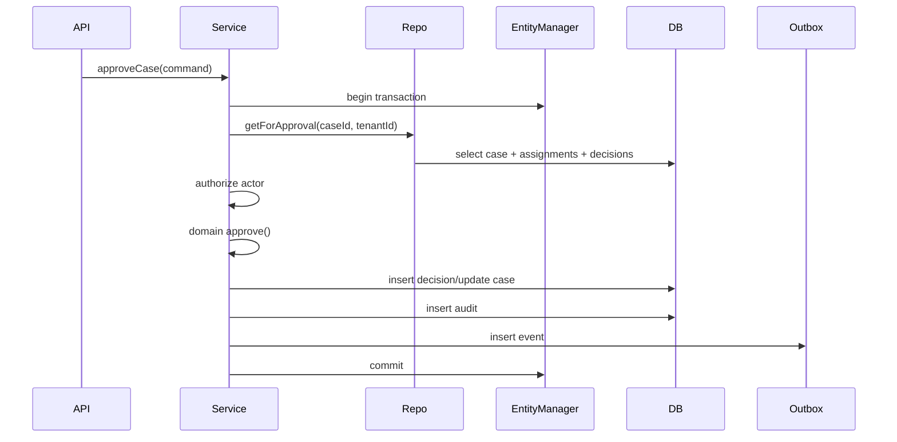
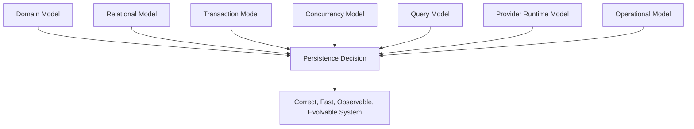

------
title: Learn Java Persistence, Database Integration, JPA, Hibernate ORM & EclipseLink - Part 034
description: Capstone architecture review dan mastery exercise untuk Java persistence: end-to-end case study, design review checklist, failure modelling, performance tuning lab, provider decision, dan final mastery rubric.
series: learn-java-persistence
seriesTitle: Learn Java Persistence, Database Integration, JPA, Hibernate ORM & EclipseLink
order: 34
partTitle: Architecture Review and Mastery Capstone
tags:
- java
- persistence
- jpa
- jakarta-persistence
- hibernate
- eclipselink
- architecture
- capstone
- mastery
- database
date: 2026-06-27
---

# Part 034 — Architecture Review and Mastery Capstone

## 1. Tujuan Pembelajaran

Ini adalah part terakhir seri `learn-java-persistence`.

Part ini bukan menambah annotation baru. Tujuannya adalah menguji apakah seluruh skill persistence sudah menjadi kemampuan desain, diagnosis, dan decision-making.

Setelah menyelesaikan part ini, kamu harus mampu:

1. Mendesain persistence layer untuk domain kompleks.
2. Membaca requirement dan mengubahnya menjadi model data, aggregate, query, transaction, dan migration plan.
3. Mereview desain ORM secara struktural, bukan berdasarkan preferensi.
4. Mengidentifikasi failure mode sebelum production.
5. Menentukan kapan memakai JPA standard, provider-specific feature, native SQL, database feature, atau pattern arsitektur terpisah.
6. Membuat performance tuning plan yang berbasis evidence.
7. Menilai apakah persistence implementation siap untuk tim engineering level tinggi.

---

## 2. Capstone Scenario

Domain: regulatory enforcement lifecycle management.

Sistem harus mengelola:

- intake laporan,
- pembentukan enforcement case,
- assignment investigator,
- evidence collection,
- legal review,
- escalation,
- decision,
- appeal,
- audit trail,
- external notification,
- reporting,
- retention/archival.

### 2.1 Core Requirements

1. Case memiliki lifecycle state.
2. Case bisa punya banyak assignment, evidence, note, decision, dan audit entry.
3. Hanya satu active assignment per role.
4. Hanya satu final decision per case.
5. Evidence metadata sering dibaca, tetapi binary/blob tidak boleh selalu dimuat.
6. Case list harus cepat dengan filter status, priority, assignee, due date, dan tenant.
7. Approval harus atomic dengan audit.
8. External notification harus dikirim setelah commit.
9. Concurrent update harus dicegah atau diselesaikan dengan conflict handling.
10. Semua perubahan penting harus auditable.
11. Sistem multi-tenant.
12. Backfill dan migration harus aman.
13. Query/report besar tidak boleh mengganggu OLTP path.
14. Data retention berbeda untuk draft, closed case, appealed case, dan archived case.

### 2.2 Non-Functional Requirements

| Requirement | Target |
|---|---|
| correctness | no invalid lifecycle transition committed |
| auditability | all state-changing commands produce audit |
| latency | case detail and command path predictable |
| scalability | case list and escalation job scale with data growth |
| operability | DB/persistence incident diagnosable |
| portability | core remains Jakarta Persistence portable where practical |
| extensibility | provider-specific features isolated |
| compliance | tenant boundary, retention, and audit defensible |

---

## 3. High-Level Persistence Architecture



### 3.1 Design Principle

> Persistence architecture should separate command correctness, read efficiency, integration reliability, and operational observability.

Jangan memaksa satu entity graph melayani semua kebutuhan:

- command mutation,
- detail page,
- list page,
- reporting,
- audit,
- integration event,
- batch escalation.

Masing-masing punya shape data dan consistency requirement berbeda.

---

## 4. Proposed Aggregate Model

### 4.1 Aggregate Candidate



### 4.2 Do We Put Everything in One Aggregate?

Tidak otomatis.

Walaupun diagram menunjukkan semua terhubung ke case, tidak semua harus berada dalam satu loaded aggregate setiap saat.

Pertanyaan desain:

| Relationship | Aggregate Child? | Alasan |
|---|---|---|
| active assignment | yes, for command path | invariant active assignment per role |
| final decision | yes, for approval path | uniqueness and lifecycle correctness |
| evidence metadata | maybe | if small and needed for command checks |
| evidence binary | no | blob/reference boundary |
| audit entries | usually append-only separate | can grow unbounded |
| comments/notes | often separate | high volume, independent lifecycle |
| read model | no | optimized projection |

### 4.3 Aggregate Boundary Rule

> Put inside the aggregate only the state needed to enforce synchronous consistency invariants.

Jika data tidak diperlukan untuk memutuskan command saat ini, jangan otomatis memuatnya dalam aggregate command path.

---

## 5. Entity Mapping Sketch

### 5.1 EnforcementCase

```java
@Entity
@Table(
    name = "enforcement_case",
    uniqueConstraints = {
        @UniqueConstraint(
            name = "uk_case_tenant_reference",
            columnNames = {"tenant_id", "reference_no"}
        )
    },
    indexes = {
        @Index(name = "ix_case_tenant_status_due", columnList = "tenant_id,status,due_at"),
        @Index(name = "ix_case_tenant_assignee", columnList = "tenant_id,current_assignee_id")
    }
)
public class EnforcementCase {

    @Id
    private UUID id;

    @Column(name = "tenant_id", nullable = false, updatable = false)
    private UUID tenantId;

    @Column(name = "reference_no", nullable = false, updatable = false, length = 64)
    private String referenceNo;

    @Enumerated(EnumType.STRING)
    @Column(nullable = false, length = 40)
    private CaseStatus status;

    @Enumerated(EnumType.STRING)
    @Column(nullable = false, length = 40)
    private Priority priority;

    @Version
    private long version;

    @OneToMany(
        mappedBy = "enforcementCase",
        cascade = CascadeType.ALL,
        orphanRemoval = true
    )
    private Set<CaseAssignment> assignments = new LinkedHashSet<>();

    @OneToMany(
        mappedBy = "enforcementCase",
        cascade = CascadeType.ALL,
        orphanRemoval = true
    )
    private Set<CaseDecision> decisions = new LinkedHashSet<>();

    protected EnforcementCase() {
    }

    public void approve(ApproveCaseCommand command) {
        requireStatus(CaseStatus.UNDER_REVIEW);
        requireNoFinalDecision();

        this.decisions.add(CaseDecision.finalDecision(this, command));
        this.status = CaseStatus.APPROVED;
    }
}
```

### 5.2 Design Notes

- `tenantId + referenceNo` unique menjaga business identity.
- `@Version` menjaga optimistic concurrency.
- `EnumType.STRING` menghindari ordinal trap.
- collection private dan dimutasi via method domain.
- `AuditEntry` tidak harus menjadi child mutable collection jika unbounded.
- Evidence binary tidak berada di entity ini; simpan reference/checksum/metadata.

---

## 6. Database Constraints

ORM mapping bukan pengganti database constraints.

### 6.1 Required Constraints

```sql
alter table enforcement_case
    add constraint uk_case_tenant_reference
    unique (tenant_id, reference_no);

alter table case_decision
    add constraint fk_decision_case
    foreign key (case_id) references enforcement_case(id);

-- Conceptual example; exact syntax depends on database.
-- Enforce only one final decision per case.
create unique index uk_final_decision_per_case
    on case_decision(case_id)
    where decision_category = 'FINAL';

-- Enforce only one active assignment per role per case.
create unique index uk_active_assignment_per_role
    on case_assignment(case_id, role)
    where active = true;
```

### 6.2 Why Constraints Matter

Application code can fail under concurrency.

Example:

1. Transaction A checks no final decision.
2. Transaction B checks no final decision.
3. Both insert final decision.
4. Without unique constraint, data corrupts.
5. With unique constraint, one transaction fails and can be mapped to conflict.

Correctness-critical invariant should have database backing if possible.

---

## 7. Command Path Design

### 7.1 Approve Case



### 7.2 Repository Method Contract

```java
public interface EnforcementCaseRepository {
    EnforcementCase getForApproval(TenantId tenantId, CaseId caseId);
    Optional<EnforcementCase> findByReference(TenantId tenantId, CaseReference reference);
    void save(EnforcementCase enforcementCase);
}
```

`getForApproval` bukan generic `findById`. Namanya menyatakan fetch plan dan intent.

### 7.3 Transaction Boundary

```java
@Transactional(timeout = 5)
public void approveCase(ApproveCaseCommand command) {
    EnforcementCase c = cases.getForApproval(command.tenantId(), command.caseId());

    authorization.requireCanApprove(command.actor(), c);

    CaseStatus oldStatus = c.status();

    c.approve(command);

    audit.record(AuditEntry.caseStatusChanged(
        c.id(),
        oldStatus,
        c.status(),
        command.actor(),
        command.reason()
    ));

    outbox.record(CaseApprovedEvent.from(c, command.commandId()));
}
```

### 7.4 Why This Works

- transaction boundary is application service,
- aggregate enforces lifecycle,
- DB constraint enforces duplicate prevention,
- audit and state change commit together,
- outbox decouples external notification,
- optimistic version detects stale update,
- tenant id is part of access path.

---

## 8. Query Path Design

### 8.1 Case List

Case list should not load aggregates.

Use projection:

```java
public record CaseListItem(
    UUID id,
    String referenceNo,
    String status,
    String priority,
    UUID currentAssigneeId,
    Instant dueAt
) {
}
```

JPQL:

```java
select new com.example.CaseListItem(
    c.id,
    c.referenceNo,
    c.status,
    c.priority,
    c.currentAssigneeId,
    c.dueAt
)
from EnforcementCase c
where c.tenantId = :tenantId
  and (:status is null or c.status = :status)
  and (:assigneeId is null or c.currentAssigneeId = :assigneeId)
  and (:dueBefore is null or c.dueAt < :dueBefore)
order by c.dueAt asc, c.id asc
```

### 8.2 Case Detail

Case detail may use projection or entity graph depending on use case.

Options:

| Option | Use When |
|---|---|
| DTO projection | read-only detail, stable shape |
| entity graph | command/detail uses entity and limited associations |
| separate queries | multiple collections, avoid row explosion |
| native SQL | highly tuned report/query |
| materialized view | heavy dashboard/report |

### 8.3 Report Query

Do not reuse command aggregate for report.

Reports often need:

- aggregation,
- grouping,
- time windows,
- large scans,
- read replica,
- native SQL,
- materialized view,
- async generation.

Trying to force reports through entity graphs creates memory and performance problems.

---

## 9. Fetch Plan Review

### 9.1 For `approveCase`

Need:

- case root,
- assignments relevant for authorization,
- existing final decisions.

Do not need:

- all audit entries,
- evidence binary,
- all comments,
- all historical assignments,
- large note collections.

### 9.2 Fetch Plan Design

```java
@NamedEntityGraph(
    name = "EnforcementCase.forApproval",
    attributeNodes = {
        @NamedAttributeNode("assignments"),
        @NamedAttributeNode("decisions")
    }
)
@Entity
public class EnforcementCase {
    // ...
}
```

Or explicit JPQL:

```java
select distinct c
from EnforcementCase c
left join fetch c.assignments a
left join fetch c.decisions d
where c.tenantId = :tenantId
  and c.id = :id
```

Caution: multiple collection fetch joins can explode rows. If collections are large, prefer separate queries or targeted query.

### 9.3 Review Questions

- Is the collection bounded?
- Is `distinct` masking row multiplication?
- Is pagination involved?
- Is this fetch plan used only for one use case?
- Is query count tested?
- Is there a DTO alternative?

---

## 10. Transaction and Locking Review

### 10.1 Command Consistency Matrix

| Command | Consistency Need | Strategy |
|---|---|---|
| create case | unique reference | unique constraint |
| assign investigator | one active assignment per role | aggregate method + partial unique index |
| approve case | no duplicate final decision | optimistic lock + unique constraint |
| escalate case | state transition correctness | version + domain invariant |
| add evidence | checksum uniqueness maybe | unique constraint if required |
| close case | final state atomic with audit | transaction + audit insert |
| send notification | after commit only | outbox |

### 10.2 Optimistic vs Pessimistic

Default: optimistic locking.

Use pessimistic lock if:

- conflict rate is high,
- operation must serialize short critical section,
- retry cost is too expensive,
- business requires explicit reservation,
- DB supports lock timeout and monitoring.

Avoid pessimistic lock if:

- transaction does external IO,
- user think-time involved,
- report query path,
- long batch chunk,
- lock order is unclear.

---

## 11. Outbox Review

### 11.1 Outbox Table

```sql
create table outbox_message (
    id uuid primary key,
    aggregate_type varchar(80) not null,
    aggregate_id uuid not null,
    event_type varchar(120) not null,
    event_key varchar(160) not null,
    payload jsonb not null,
    status varchar(40) not null,
    created_at timestamp not null,
    published_at timestamp null
);

create unique index uk_outbox_event_key
    on outbox_message(event_key);
```

### 11.2 Outbox Invariant

> If a database state change requires an external side effect, write an outbox message in the same transaction as the state change.

### 11.3 Publisher

Publisher should be:

- idempotent,
- chunked,
- retryable,
- observable,
- safe for multiple workers,
- bounded by lock timeout,
- able to dead-letter poison messages.

---

## 12. Audit Review

### 12.1 Audit Entry Design

```java
@Entity
@Table(name = "case_audit_entry")
public class CaseAuditEntry {

    @Id
    private UUID id;

    @Column(nullable = false)
    private UUID tenantId;

    @Column(nullable = false)
    private UUID caseId;

    @Column(nullable = false, length = 80)
    private String action;

    @Column(nullable = false)
    private String actorId;

    @Column(nullable = false)
    private Instant occurredAt;

    @Column(length = 80)
    private String oldStatus;

    @Column(length = 80)
    private String newStatus;

    @Column(length = 2000)
    private String reason;

    @Column(nullable = false)
    private UUID commandId;
}
```

### 12.2 Audit Invariants

- audit committed atomically with command,
- audit includes actor,
- audit includes command id,
- audit includes old and new state where applicable,
- audit is append-only,
- audit query path is separate from command aggregate,
- audit table indexed by tenant/case/time.

---

## 13. Multi-Tenancy Review

### 13.1 Tenant Boundary

Tenant id must appear in:

- root entity,
- unique constraints,
- query predicates,
- audit entries,
- outbox messages,
- cache keys,
- logs/traces,
- background jobs,
- reporting filters.

### 13.2 Common Failure

```java
entityManager.find(EnforcementCase.class, caseId);
```

This loads by primary key only. If API receives `caseId` from user, tenant authorization must still be checked.

Safer repository contract:

```java
Optional<EnforcementCase> findByTenantIdAndId(TenantId tenantId, CaseId caseId);
```

Or enforce tenant filter/provider-level strategy with strong tests.

---

## 14. Migration Plan for Capstone

Suppose we need to add appeal support.

### 14.1 New Requirement

- A closed case can be appealed.
- Appeal has status: `SUBMITTED`, `ACCEPTED`, `REJECTED`, `WITHDRAWN`.
- Only one active appeal per case.
- Appeal submission must create audit and outbox event.
- Case list must show whether active appeal exists.

### 14.2 Schema Expand

```sql
create table case_appeal (
    id uuid primary key,
    tenant_id uuid not null,
    case_id uuid not null,
    status varchar(40) not null,
    submitted_by uuid not null,
    submitted_at timestamp not null,
    reason varchar(2000) not null,
    version bigint not null,
    constraint fk_appeal_case
        foreign key (case_id) references enforcement_case(id)
);

create unique index uk_active_appeal_per_case
    on case_appeal(case_id)
    where status in ('SUBMITTED', 'ACCEPTED');
```

### 14.3 Application Versioning

Step 1:

- create table nullable/additive,
- deploy code that can write appeal,
- old code still compatible.

Step 2:

- add read model field or view,
- backfill if needed,
- switch UI/API read path.

Step 3:

- enforce stricter constraint if delayed,
- clean obsolete fields if any.

### 14.4 Migration Review

- Is new table additive? yes.
- Does old app break? no, if old app ignores table.
- Is unique active appeal enforced? yes.
- Is status enum string? yes.
- Is case list index adjusted? maybe.
- Is audit table changed? maybe no if generic action model.
- Is outbox event type added? yes.
- Are consumers forward-compatible? must be checked.

---

## 15. Provider Decision Review

### 15.1 Jakarta Persistence Standard First

Use standard Jakarta Persistence when:

- feature is covered by spec,
- performance is acceptable,
- portability matters,
- team familiarity matters,
- behavior is testable.

Examples:

- basic mapping,
- association mapping,
- JPQL,
- Criteria,
- entity graphs,
- optimistic locking,
- lifecycle callbacks,
- converters.

### 15.2 Hibernate-Specific Features

Use Hibernate-specific features when:

- they solve real production need,
- they are isolated,
- migration cost is accepted,
- behavior is covered by tests.

Examples:

- natural id cache,
- advanced batch/fetch tuning,
- filters,
- Envers,
- soft delete annotation,
- custom JSON type mapping,
- stateless session,
- multi-tenancy support,
- bytecode enhancement optimization.

### 15.3 EclipseLink-Specific Features

Use EclipseLink-specific features when:

- running in EclipseLink/Jakarta EE environment,
- descriptor/fetch group/weaving feature is useful,
- shared cache behavior is understood,
- provider lock-in is accepted.

### 15.4 Native SQL/Database Feature

Use native SQL/database feature when:

- query is report/analytics-heavy,
- DB-specific index/function is necessary,
- JPQL produces poor SQL,
- concurrency claim pattern needs DB-specific locking,
- window function/materialized view helps significantly.

### 15.5 Decision Record Template

```md
# Persistence Decision Record

## Context
What problem are we solving?

## Options
1. Standard Jakarta Persistence
2. Provider-specific feature
3. Native SQL
4. Database object/view/procedure
5. Separate read model/service

## Decision
Chosen option and reason.

## Consequences
- Portability:
- Testing:
- Migration:
- Observability:
- Failure modes:

## Escape Plan
How do we move away if this becomes painful?
```

---

## 16. Performance Tuning Lab

### 16.1 Lab Setup

Scenario:

- case list endpoint p95 increased from 120 ms to 1800 ms,
- database CPU high,
- query count increased,
- connection pool pending threads appear,
- recent release added filter by assignee and evidence count.

### 16.2 Evidence Collection

Collect:

- endpoint trace,
- query count per request,
- SQL text,
- bind parameter sample,
- execution plan,
- rows scanned,
- rows returned,
- pool acquisition time,
- transaction duration,
- heap allocation/hydration count,
- release diff.

### 16.3 Possible Findings

#### Finding A — N+1 Evidence Count

List page renders evidence count by accessing lazy collection:

```java
item.getEvidenceItems().size()
```

Fix:

- projection with precomputed count,
- correlated subquery if acceptable,
- separate aggregate count query,
- materialized read model for heavy path.

#### Finding B — Missing Index

New predicate:

```sql
where tenant_id = ?
  and current_assignee_id = ?
  and status = ?
order by due_at
```

Needs index matching tenant, assignee/status, due date depending cardinality and DB planner.

#### Finding C — Offset Pagination Deep Page

Offset page 2000 scans too many rows.

Fix:

- keyset pagination,
- cursor using `(due_at, id)`,
- restrict maximum offset,
- export/report async.

#### Finding D — Fetch Join Row Explosion

Query joins multiple collections for list page.

Fix:

- DTO projection,
- remove collection fetch,
- fetch detail separately,
- use query budget test.

### 16.4 Tuning Rule

> Do not tune persistence by guessing annotation changes. Tune by measuring query shape, row cardinality, execution plan, and transaction behavior.

---

## 17. Failure Modelling Lab

### 17.1 Failure Table

| Failure | Design Defense | Test |
|---|---|---|
| duplicate final decision | unique constraint + version | concurrent approval test |
| missing notification | outbox | kill publisher/retry test |
| audit missing | same transaction insert | command audit test |
| stale update | `@Version` | detached stale entity test |
| tenant leak | tenant predicate/filter | cross-tenant access test |
| N+1 | fetch plan/projection | query count test |
| migration partial failure | expand-contract | migration dry run |
| connection exhaustion | timeouts/chunking | load test |
| deadlock | lock order/index/retry | concurrent update test |
| cache stale | invalidation/disable | external update test |

### 17.2 How to Think

For every command:

1. What state does it read?
2. What state does it write?
3. What invariant must hold at commit?
4. What if another transaction changes the same data?
5. What if DB constraint rejects commit?
6. What if app crashes after commit but before notification?
7. What if notification sends twice?
8. What if migration is halfway deployed?
9. What if query is run with 100x data?
10. What metric proves it works?

---

## 18. Architecture Review Checklist

### 18.1 Domain Model

- [ ] Aggregate roots are explicit.
- [ ] Child entities are not exposed as independent repositories unless intended.
- [ ] Value objects are modelled as embeddables where appropriate.
- [ ] Identity strategy is clear.
- [ ] Equality strategy is safe.
- [ ] Lifecycle transitions are methods, not random setters.
- [ ] Domain invariants are enforced inside model or application service.
- [ ] Database constraints back correctness-critical invariants.

### 18.2 Mapping

- [ ] Access type is consistent.
- [ ] Enum uses string for long-lived data.
- [ ] Money/decimal precision explicit.
- [ ] Time fields use clear timezone semantics.
- [ ] LOB/blob not loaded accidentally.
- [ ] Associations are minimal and intentional.
- [ ] `@ManyToMany` is avoided for lifecycle-rich relationships.
- [ ] Cascades do not cross aggregate boundary.
- [ ] Orphan removal is used only for true owned children.
- [ ] Collections are private and controlled.

### 18.3 Query

- [ ] Query shape matches use case.
- [ ] Command path does not use report query.
- [ ] List path uses projection.
- [ ] Detail path has explicit fetch plan.
- [ ] Query count tested.
- [ ] Pagination is safe.
- [ ] Indexes match predicates/sorts.
- [ ] Native SQL has mapping contract.
- [ ] Bulk update clears or avoids stale context.

### 18.4 Transaction

- [ ] Boundary is application service.
- [ ] Transaction is not too wide.
- [ ] External IO outside transaction.
- [ ] Timeout configured.
- [ ] Retry policy exists where appropriate.
- [ ] Idempotency key exists for retried commands.
- [ ] Lock mode is intentional.
- [ ] Isolation assumption documented.

### 18.5 Provider and Framework

- [ ] Standard JPA used where sufficient.
- [ ] Provider-specific features isolated.
- [ ] `unwrap` usage documented.
- [ ] Spring Data repository methods do not hide aggregate boundaries.
- [ ] Quarkus/Micronaut/Jakarta EE lifecycle assumptions understood.
- [ ] Provider upgrade tests exist.

### 18.6 Production

- [ ] Migration plan reviewed.
- [ ] Startup schema validation enabled.
- [ ] Pool metrics monitored.
- [ ] Slow query observability exists.
- [ ] Deadlock/lock wait alerts exist.
- [ ] Audit/reconciliation exists.
- [ ] Batch jobs are chunked/resumable.
- [ ] Data repair plan exists for critical invariants.

---

## 19. Capstone Implementation Exercise

Build a small but realistic persistence module.

### 19.1 Entities

Implement:

- `EnforcementCase`,
- `CaseAssignment`,
- `CaseDecision`,
- `EvidenceItem`,
- `CaseAuditEntry`,
- `OutboxMessage`.

### 19.2 Commands

Implement:

- create case,
- assign investigator,
- submit evidence metadata,
- approve case,
- reject case,
- escalate overdue case,
- submit appeal.

### 19.3 Read Models

Implement:

- case list projection,
- case detail projection,
- case audit timeline,
- overdue case query,
- active assignment query.

### 19.4 Tests

Required tests:

- mapping boots against real database,
- migration applies from empty schema,
- create case unique reference,
- concurrent approve prevents duplicate final decision,
- audit committed with approval,
- outbox written with approval,
- query count for case detail,
- list pagination stable,
- tenant isolation,
- optimistic stale update,
- native/report query mapping,
- batch escalation chunking.

### 19.5 Observability

Add:

- SQL logging toggle,
- query count test helper,
- connection pool metrics,
- slow query threshold,
- transaction duration metric,
- outbox lag metric,
- migration version health.

---

## 20. Example Test: Concurrent Approval

```java
@Test
void concurrentApprovalCreatesOnlyOneFinalDecision() throws Exception {
    UUID caseId = fixture.createCaseUnderReview();

    ExecutorService executor = Executors.newFixedThreadPool(2);
    CountDownLatch ready = new CountDownLatch(2);
    CountDownLatch start = new CountDownLatch(1);

    Callable<Result> approval = () -> {
        ready.countDown();
        start.await();

        try {
            service.approveCase(new ApproveCaseCommand(caseId, actorId(), commandId()));
            return Result.success();
        } catch (OptimisticLockException | DataIntegrityViolationException ex) {
            return Result.conflict();
        }
    };

    Future<Result> a = executor.submit(approval);
    Future<Result> b = executor.submit(approval);

    ready.await();
    start.countDown();

    List<Result> results = List.of(a.get(), b.get());

    assertThat(results).containsExactlyInAnyOrder(Result.success(), Result.conflict());
    assertThat(decisionRepository.countFinalDecisions(caseId)).isEqualTo(1);
    assertThat(auditRepository.countApprovalAudits(caseId)).isEqualTo(1);
}
```

The exact exception type depends on provider/framework/database. The test intent matters more than the specific exception class.

---

## 21. Example Test: Query Count Budget

```java
@Test
void caseDetailDoesNotTriggerNPlusOne() {
    fixture.createCaseWithAssignmentsEvidenceAndDecisions();

    queryCounter.reset();

    CaseDetail detail = readRepository.getCaseDetail(tenantId, caseId);

    assertThat(detail.evidence()).hasSize(10);
    assertThat(queryCounter.count()).isLessThanOrEqualTo(4);
}
```

Query count tests should be used for critical paths, not every repository method. Too many brittle tests can slow refactoring.

---

## 22. Example Test: Migration Compatibility

```java
@Test
void migrationsApplyFromPreviousProductionVersion() {
    Database db = databaseCloneFrom("production-schema-v42");

    migrationTool.applyPending(db);

    assertThat(db.schemaVersion()).isEqualTo("v43");
    assertThat(startupValidator.validate(db)).isSuccessful();
}
```

For serious systems, test migrations from:

- empty schema,
- previous production schema,
- schema with representative data,
- schema with dirty/edge data,
- rollback/rollforward scenario if supported.

---

## 23. Design Smell Catalog

### 23.1 Entity Smells

| Smell | Meaning |
|---|---|
| entity has 80 fields | missing boundaries or value objects |
| every relation is bidirectional | navigation convenience over model discipline |
| `CascadeType.ALL` everywhere | lifecycle ownership unclear |
| entity used as API response | persistence boundary leaks |
| `@Data` on entity | equality/toString/lazy-loading hazards |
| public setters for all fields | domain invariants bypassed |
| enum ordinal | data changes break meaning |
| no version on mutable aggregate | lost update risk |

### 23.2 Query Smells

| Smell | Meaning |
|---|---|
| `findAll()` in production path | unbounded query |
| eager fetch to fix lazy problem | query shape hidden |
| collection fetch join + pagination | wrong/expensive pagination risk |
| native SQL without test | mapping drift risk |
| dynamic sort from request directly | SQL injection/invalid plan risk |
| report through entity graph | hydration overhead |
| query cache on volatile data | invalidation churn |

### 23.3 Transaction Smells

| Smell | Meaning |
|---|---|
| external HTTP in transaction | connection/lock held too long |
| transaction per repository call | aggregate consistency broken |
| giant batch transaction | memory/lock/rollback risk |
| catch and ignore persistence exception | corrupted workflow |
| retry without idempotency | duplicate side effects |
| no timeout | hanging resource risk |

### 23.4 Migration Smells

| Smell | Meaning |
|---|---|
| production `ddl-auto=update` | uncontrolled schema mutation |
| destructive migration in one deploy | no compatibility window |
| add not-null without backfill | deploy failure risk |
| rename column directly | old app break |
| no migration test with data | hidden constraint/data issue |
| manual hotfix not recorded | drift |

---

## 24. Final Mental Model

Persistence mastery is the ability to keep these models in your head simultaneously:



A beginner asks:

> What annotation do I need?

A competent engineer asks:

> What mapping represents this relationship?

A senior engineer asks:

> What are the transaction, query, and migration consequences?

A top-tier engineer asks:

> What invariant must hold under concurrency, failure, deployment, and future schema evolution?

---

## 25. Mastery Rubric

### Level 1 — API Familiarity

You can:

- create entities,
- use repositories,
- write JPQL,
- configure transactions,
- run migrations.

But you may still be surprised by flush, lazy loading, N+1, merge, and transaction boundaries.

### Level 2 — Correct Usage

You can:

- model associations safely,
- avoid common cascade mistakes,
- use projection for list views,
- write integration tests,
- use optimistic locking,
- distinguish entity from DTO.

### Level 3 — Runtime Understanding

You can:

- explain persistence context behavior,
- predict flush,
- diagnose N+1,
- understand dirty checking,
- reason about connection pool pressure,
- evaluate fetch plans,
- read generated SQL.

### Level 4 — Production Engineering

You can:

- design migration safely,
- review query plans,
- handle deadlocks,
- design batch processing,
- build observability,
- write incident playbooks,
- protect audit/tenant boundaries.

### Level 5 — Architecture Mastery

You can:

- choose between ORM, native SQL, read model, database feature, and separate service,
- isolate provider-specific optimizations,
- model aggregate boundaries for correctness,
- design for concurrency and failure,
- evolve schema without breaking production,
- teach the mental model to others.

---

## 26. Final Self-Assessment Questions

Jawab tanpa melihat materi:

1. Apa perbedaan object identity, persistence identity, dan business identity?
2. Mengapa `merge()` sering disalahgunakan?
3. Kapan `flush()` bisa terjadi sebelum commit?
4. Mengapa `@OneToMany` bukan berarti parent otomatis mengontrol FK?
5. Mengapa `CascadeType.ALL` berbahaya di aggregate boundary yang salah?
6. Mengapa list endpoint sebaiknya tidak mengembalikan entity graph?
7. Apa risiko collection fetch join dengan pagination?
8. Apa bedanya `fetchgraph` dan `loadgraph`?
9. Mengapa database constraint tetap dibutuhkan walau domain model valid?
10. Apa yang terjadi jika bulk update dijalankan saat persistence context berisi entity terkait?
11. Kapan optimistic lock tidak cukup?
12. Bagaimana mendesain retry yang aman?
13. Mengapa external notification harus memakai outbox?
14. Bagaimana mendiagnosis connection exhaustion?
15. Bagaimana membedakan query lambat karena missing index vs lock wait?
16. Apa risiko second-level cache pada multi-tenant data?
17. Bagaimana melakukan expand-contract migration?
18. Mengapa provider upgrade harus diuji terhadap SQL shape?
19. Kapan native SQL lebih baik daripada JPQL?
20. Bagaimana menentukan aggregate boundary yang benar?

Jika bisa menjawab dengan reasoning dan contoh, bukan hafalan, kamu sudah berada pada level yang sangat kuat.

---

## 27. Final Capstone Review Output

Untuk menyelesaikan seri ini, hasilkan dokumen review untuk capstone kamu sendiri:

```md
# Java Persistence Capstone Review

## Domain
Describe the domain and critical invariants.

## Aggregate Model
List aggregate roots, child entities, value objects, and references.

## Mapping Strategy
Explain identity, associations, cascades, collections, inheritance if any.

## Query Strategy
List command queries, read projections, report queries, and native SQL.

## Transaction Strategy
Define transaction boundaries, locking, retry, and idempotency.

## Migration Strategy
Describe schema versioning, expand-contract, backfill, and rollback.

## Provider Strategy
Define standard JPA use, Hibernate/EclipseLink extensions, and native DB usage.

## Observability Strategy
Define metrics, logs, traces, SQL visibility, and dashboards.

## Failure Model
List top 10 failures and mitigations.

## Production Readiness Decision
Approve / reject / approve with conditions.
```

---

## 28. Seri Selesai

Seri **Learn Java Persistence, Database Integration, JPA, Hibernate ORM & EclipseLink** selesai di **Part 034**.

Total part:

1. Kaufman Skill Map
2. Persistence Mental Model
3. JPA to Jakarta Persistence Landscape
4. EntityManager and Persistence Context
5. Entity Lifecycle
6. Identity and Equality
7. Basic Mapping and Type System
8. Embeddables and Value Objects
9. Association Modelling
10. Aggregate Boundaries
11. Collection Mapping
12. Inheritance and Polymorphism
13. Schema Generation and Migration Boundary
14. JPQL Foundation
15. Criteria API
16. Native SQL, Stored Procedures, Projection
17. Fetching and N+1
18. Entity Graphs
19. Flush and Dirty Checking
20. Transactions
21. Locking and Isolation
22. Caching
23. Hibernate Internals
24. Hibernate Advanced Features
25. EclipseLink Internals
26. Provider Portability
27. Spring Data JPA
28. Jakarta EE, Quarkus, Micronaut
29. Domain-Driven Persistence Patterns
30. Anti-Patterns and Pitfalls
31. Performance Engineering and Observability
32. Testing Persistence Code
33. Production Readiness Playbook
34. Architecture Review and Mastery Capstone

---

## 29. What Comes Next

Setelah seri ini, materi lanjutan yang paling masuk akal:

1. **Advanced Database Architecture for Java Engineers**  
   Indexing, query planner, MVCC, locking internals, partitioning, replication, backup/recovery, database observability.

2. **Event-Driven Architecture with Java**  
   Outbox, CDC, Kafka, ordering, idempotency, saga/process manager, exactly-once myth, replay, schema evolution.

3. **Enterprise Workflow and Case Management Architecture**  
   State machine, BPMN, escalation, auditability, regulatory defensibility, task assignment, lifecycle modelling.

4. **Distributed Consistency and Reliability Patterns**  
   Transactional boundary, compensating action, deduplication, retries, circuit breaker, timeout, backpressure, failure modelling.

5. **Production Performance Engineering for JVM Services**  
   Profiling, GC, JFR, async-profiler, DB latency, pool tuning, load testing, capacity model.

---

## 30. Closing Principle

Persistence engineering is not about making objects “save themselves”.

It is about preserving truth across time.

The database remembers what your code once believed. That is why persistence design must be correct, observable, evolvable, and defensible.

