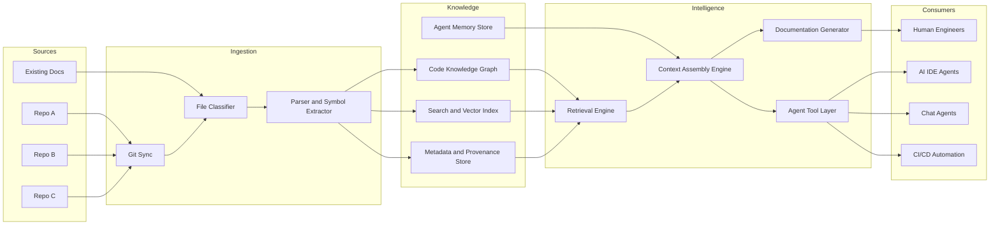
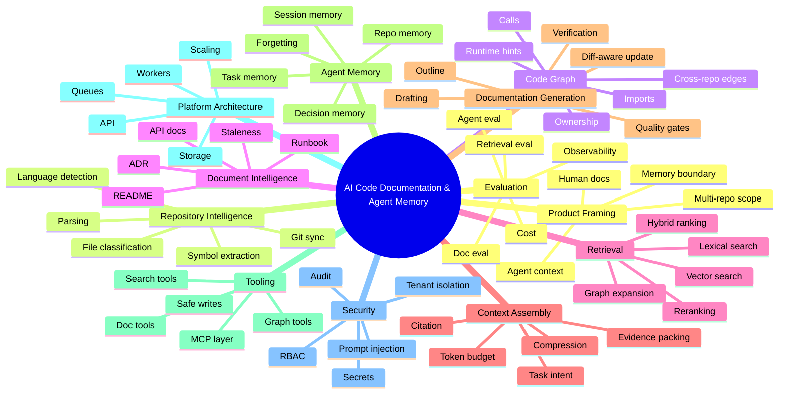
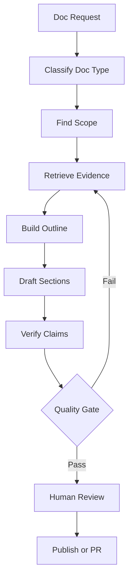
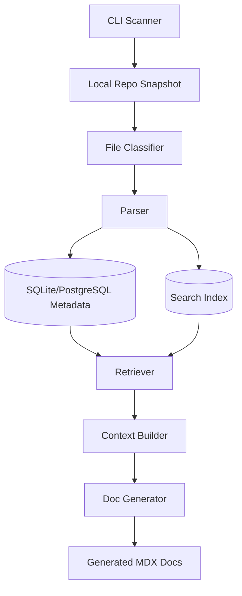
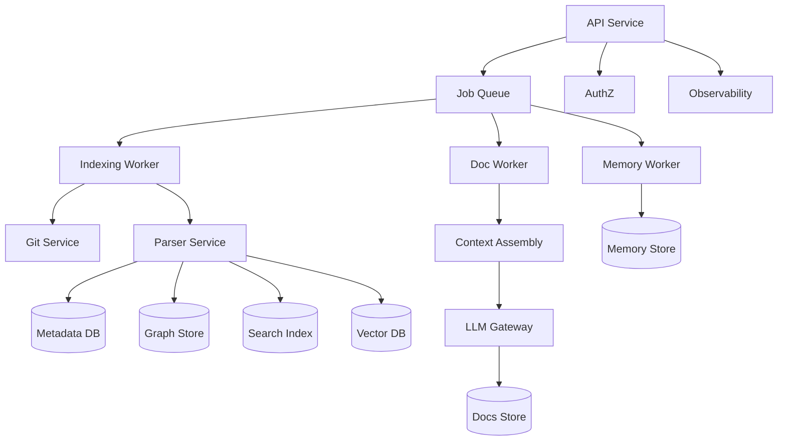

------
title: Learn AI Code Documentation & Agent Memory Platform - Part 001
description: Kaufman skill map untuk membangun AI tools yang mampu scan repository, menulis dokumentasi kode, dan menyediakan context/memory untuk human dan AI agents.
series: learn-ai-code-documentation-agent-memory
seriesTitle: Learn AI Code Documentation & Agent Memory Platform
order: 1
partTitle: Kaufman Skill Map
tags:
- ai
- code-intelligence
- documentation
- agent-memory
- repository-analysis
- software-architecture
date: 2026-07-02
---

# Part 001 — Kaufman Skill Map

## 1. Tujuan Part Ini

Kita tidak sedang belajar "AI untuk dokumentasi" secara generik.

Kita sedang membangun kemampuan untuk mendesain dan mengimplementasikan **platform code intelligence** yang bisa:

1. membaca satu atau banyak repository,
2. memahami struktur dan dependency kode,
3. mengekstrak knowledge yang bisa dipercaya,
4. menghasilkan dokumentasi yang punya evidence,
5. menyediakan context/memory yang bisa dipakai AI agents,
6. menjaga permission, provenance, auditability, dan freshness.

Target skill-nya bukan:

> "Bisa membuat chatbot yang membaca README."

Target skill-nya adalah:

> "Bisa membangun sistem produksi yang mengubah repository menjadi living knowledge base untuk manusia dan AI agents."

Part ini adalah peta skill. Kita akan memecah skill besar menjadi subskill kecil yang bisa dilatih, diuji, dan dikoreksi.

---

## 2. Cara Membaca Seri Ini

Seri ini mengikuti prinsip rapid skill acquisition dari Josh Kaufman:

| Prinsip | Adaptasi untuk Seri Ini |
|---|---|
| Tentukan target performa | Definisikan sistem akhir yang ingin dibangun, bukan sekadar daftar teknologi. |
| Pecah skill besar | Repository ingestion, parsing, graph, retrieval, doc generation, memory, agent tools, governance. |
| Belajar cukup untuk koreksi diri | Fokus pada konsep yang membuat kita bisa mendeteksi desain buruk. |
| Hilangkan friction | Gunakan pipeline kecil, repo contoh, schema jelas, dan checklist evaluasi. |
| Latihan sengaja | Setiap fase punya deliverable konkret, bukan hanya bacaan. |

Kaufman bukan framework untuk menjadi world-class dalam 20 jam. Dia adalah framework untuk melewati fase awal yang membingungkan secara efektif. Untuk level top engineer, 20 jam pertama digunakan untuk membangun mental model, feedback loop, dan arah praktik yang benar.

---

## 3. Problem yang Sebenarnya

Banyak organisasi punya masalah dokumentasi, tapi akar masalahnya bukan "kurang orang menulis docs".

Akar masalahnya biasanya:

1. kode berubah lebih cepat daripada dokumentasi,
2. dokumentasi tidak punya provenance,
3. ownership tidak jelas,
4. dependency lintas service tidak terpetakan,
5. AI agents diberi context yang terlalu besar, terlalu lama, atau salah,
6. knowledge tersebar di repo, wiki, ticket, ADR, chat, dan kepala engineer senior,
7. tidak ada mekanisme otomatis untuk mendeteksi stale knowledge.

Sistem yang kita bangun harus memperlakukan repository sebagai **source of truth yang perlu diinterpretasi**, bukan sebagai kumpulan file teks.

---

## 4. North Star Capability

Di akhir seri, kita ingin mampu membangun sistem dengan kemampuan seperti ini:



Sistem tersebut harus bisa menjawab pertanyaan seperti:

- "Service mana yang memanggil endpoint ini?"
- "Dokumentasi modul ini stale atau masih cocok dengan kode?"
- "Apa impact jika schema event ini berubah?"
- "Apa context minimal yang harus diberikan ke agent sebelum memodifikasi module pricing?"
- "Kenapa agent menyimpulkan class ini bertanggung jawab atas order validation?"
- "Source evidence mana yang mendukung dokumentasi ini?"
- "Apakah user ini boleh melihat memory lintas repository?"
- "Bagaimana cara regenerate docs hanya untuk file yang berubah?"

---

## 5. Skill Utama yang Kita Bangun

Skill besar ini bisa dipecah menjadi 12 domain.



Setiap domain punya failure mode. Top engineer tidak hanya tahu "cara membuat", tetapi juga tahu "cara sistem ini gagal".

---

## 6. Domain 1 — Product Framing

### 6.1 Pertanyaan Dasar

Sebelum coding, kita harus menjawab:

| Pertanyaan | Kenapa Penting |
|---|---|
| Untuk siapa dokumentasi dibuat? | Human docs dan agent context punya bentuk berbeda. |
| Apakah output harus human-readable, machine-readable, atau keduanya? | Format, metadata, dan lifecycle akan berbeda. |
| Apakah repository adalah source tunggal? | Banyak knowledge penting ada di docs, ticket, ADR, dan runtime. |
| Apakah sistem boleh menulis balik ke repo? | Mengubah threat model dan approval workflow. |
| Apakah multi-tenant? | Mengubah storage, permission, indexing, dan audit. |

### 6.2 Kesalahan Umum

Kesalahan paling sering adalah langsung membangun chatbot repo.

Masalahnya:

1. chatbot tidak otomatis memahami repository,
2. search tidak sama dengan understanding,
3. summarization tidak sama dengan documentation,
4. memory tidak sama dengan cache,
5. generated docs tanpa provenance sulit dipercaya,
6. agent context tanpa permission boundary berbahaya.

### 6.3 Target Product Shape

Product shape minimal:

```txt
Repository -> Parse -> Index -> Retrieve -> Assemble Context -> Generate Docs/Agent Context
```

Product shape production-grade:

```txt
Repository + Docs + Runtime Metadata
    -> Incremental Ingestion
    -> Classification
    -> Symbol Extraction
    -> Graph Construction
    -> Hybrid Indexing
    -> Provenance Store
    -> Context Assembly
    -> Documentation/Agent Memory
    -> Evaluation
    -> Human Review
    -> Audit
```

---

## 7. Domain 2 — Repository Intelligence

Repository bukan sekadar folder.

Repository adalah kombinasi:

- source code,
- tests,
- build configuration,
- infrastructure-as-code,
- schemas,
- migrations,
- documentation,
- generated artifacts,
- CI/CD metadata,
- ownership metadata,
- dependency descriptors.

### 7.1 Objek Penting

| Objek | Contoh | Fungsi |
|---|---|---|
| Repository | `billing-service` | Boundary versioning dan ownership. |
| Commit | SHA tertentu | Snapshot evidence. |
| Branch | `main`, `release/1.9` | Context versi. |
| File | `src/main/java/...` | Unit dasar ingestion. |
| Code unit | class/function/method | Unit semantik. |
| Symbol | `OrderService.validate()` | Anchor knowledge. |
| Dependency | import/call/schema | Edge antar unit. |
| Document | README/ADR/runbook | Knowledge eksplisit. |

### 7.2 Skill yang Harus Dikuasai

Kita harus bisa:

1. melakukan clone/fetch secara aman,
2. membaca snapshot repository pada commit tertentu,
3. mengabaikan file yang tidak relevan,
4. mendeteksi generated/vendor code,
5. memproses monorepo dan polyrepo,
6. menyimpan fingerprint file,
7. melakukan incremental indexing,
8. mengidentifikasi perubahan yang memengaruhi docs/memory.

### 7.3 Failure Mode

| Failure | Dampak |
|---|---|
| Semua file diindeks membabi buta | Cost tinggi, noise tinggi, retrieval buruk. |
| Generated code dianggap source utama | Docs menjadi panjang dan misleading. |
| Tidak commit-aware | Evidence tidak reproducible. |
| Tidak incremental | Indexing lambat dan mahal. |
| Tidak mendeteksi rename/move | Knowledge graph kehilangan continuity. |

---

## 8. Domain 3 — Parsing dan Symbol Extraction

Untuk memahami kode, kita butuh lebih dari regex.

Regex bisa berguna untuk pre-filter, tetapi tidak cukup untuk:

- nested class,
- overloaded method,
- decorator/annotation,
- import alias,
- generic type,
- multiline signature,
- language-specific syntax,
- relation antar symbol.

Parser struktural seperti Tree-sitter berguna karena dapat membangun concrete syntax tree dan mendukung incremental parsing. Namun parser saja tidak otomatis memberi semantic understanding penuh. Kita tetap perlu layer symbol extraction, resolver, dan graph builder.

### 8.1 AST, CST, dan Semantic Model

| Layer | Isi | Kegunaan |
|---|---|---|
| Raw text | bytes/string file | Storage, diff, fallback. |
| Tokens | keyword, identifier, operator | Lexical search, syntax highlighting. |
| CST | struktur syntax konkret | Query syntax tree, extract nodes. |
| AST | struktur lebih abstrak | Reasoning language-aware. |
| Symbol model | class, method, function, route | Unit knowledge. |
| Semantic graph | calls, owns, depends-on | Impact analysis dan context. |

### 8.2 Symbol yang Perlu Diekstrak

Untuk platform multi-language, minimal extract:

| Symbol | Java | TypeScript | Go | Python |
|---|---|---|---|---|
| Module/package | package | module path | package | module |
| Type | class/interface/record/enum | class/interface/type | struct/interface | class |
| Function | method/function | function/method | func/method | function/method |
| API endpoint | annotation/router | route handler | router handler | route decorator |
| Data schema | DTO/entity/record | interface/type/zod | struct | pydantic/dataclass |
| Test | JUnit test | Jest test | Go test | pytest/unittest |
| Config | properties/yaml | env/config | yaml/toml | yaml/env |

### 8.3 Skill Correction

Kita tahu parser layer kita buruk jika:

1. symbol identity berubah setiap run,
2. method overloaded tidak bisa dibedakan,
3. file move membuat symbol dianggap hilang dan baru,
4. generated code mendominasi graph,
5. cross-file reference tidak bisa dilacak,
6. docs menyebut function yang tidak ada.

---

## 9. Domain 4 — Code Knowledge Graph

Knowledge graph adalah struktur relasi antar entitas kode.

Bukan semua problem butuh graph database. Yang penting adalah **graph model**.

### 9.1 Node Dasar

| Node | Contoh |
|---|---|
| Repository | `order-service` |
| Package/module | `com.acme.order` |
| File | `OrderController.java` |
| Symbol | `OrderController.createOrder` |
| API endpoint | `POST /orders` |
| Database table | `orders` |
| Event topic | `order.created` |
| Document | `docs/order-flow.md` |
| Owner | `team-order-platform` |

### 9.2 Edge Dasar

| Edge | Arti |
|---|---|
| `CONTAINS` | repo contains file, file contains symbol |
| `IMPORTS` | file imports module |
| `CALLS` | function calls function |
| `IMPLEMENTS` | class implements interface |
| `EXPOSES` | controller exposes endpoint |
| `READS_TABLE` | function reads database table |
| `WRITES_TABLE` | function writes database table |
| `PUBLISHES_EVENT` | code publishes event |
| `CONSUMES_EVENT` | code consumes event |
| `DOCUMENTED_BY` | symbol documented by document |
| `OWNED_BY` | repo/symbol owned by team |

### 9.3 Kenapa Graph Penting

Graph memungkinkan pertanyaan seperti:

- "Apa upstream/downstream service dari module ini?"
- "Dokumen apa yang menjelaskan symbol ini?"
- "Jika event ini berubah, consumer mana terdampak?"
- "Apa entry point yang akhirnya memanggil function ini?"
- "Apa path dependency dari frontend ke database table?"

Vector search bisa menemukan teks mirip. Graph bisa menjelaskan struktur.

Keduanya saling melengkapi.

---

## 10. Domain 5 — Document Intelligence

Dokumentasi bukan output akhir saja. Dokumentasi juga input knowledge.

Kita harus membaca:

- README,
- ADR,
- runbook,
- API docs,
- changelog,
- architecture decision,
- onboarding docs,
- code comments,
- inline annotations,
- examples,
- migration guides.

### 10.1 Masalah Utama Docs

| Problem | Contoh |
|---|---|
| Stale | README menyebut endpoint lama. |
| Duplicate | Dua docs menjelaskan flow berbeda. |
| Vague | "This service handles orders" tanpa boundary. |
| No evidence | Tidak ada link ke kode atau commit. |
| Mixed audience | Onboarding, API docs, dan runbook bercampur. |

### 10.2 Output Docs yang Baik

Dokumentasi yang baik untuk sistem ini harus:

1. punya audience jelas,
2. punya scope jelas,
3. punya source evidence,
4. bisa di-regenerate sebagian,
5. punya freshness metadata,
6. bisa diverifikasi terhadap kode,
7. tidak menyembunyikan uncertainty.

Contoh metadata dokumentasi:

```yaml
docId: order-service.module.order-validation
docType: module-doc
audience:
  - backend-engineer
  - ai-agent
source:
  repository: order-service
  commit: 6f41ab2
  symbols:
    - com.acme.order.validation.OrderValidator
    - com.acme.order.validation.RuleRegistry
confidence: 0.86
freshness:
  generatedAt: 2026-07-02T00:00:00Z
  lastCodeChange: 2026-06-29T10:13:00Z
  staleRisk: low
review:
  required: true
  reviewer: team-order-platform
```

---

## 11. Domain 6 — Retrieval

Retrieval adalah bagian yang sering diremehkan.

LLM tidak bisa menghasilkan docs akurat jika context yang diberikan salah. Karena itu, kualitas retrieval sering lebih penting daripada kualitas prompt.

### 11.1 Jenis Retrieval

| Retrieval | Kuat untuk | Lemah untuk |
|---|---|---|
| Exact search | symbol, endpoint, filename | query konseptual |
| BM25/lexical | keyword, identifier | sinonim, intent |
| Vector search | konsep dan deskripsi | exact identifier |
| Graph traversal | dependency dan impact | fuzzy discovery |
| Hybrid retrieval | kasus nyata | kompleksitas tuning |

### 11.2 Retrieval yang Bagus

Retrieval yang bagus harus mempertimbangkan:

1. query intent,
2. exact symbol match,
3. file path relevance,
4. graph proximity,
5. ownership,
6. recency,
7. commit/version,
8. document quality,
9. permission,
10. token budget.

### 11.3 Failure Mode

| Failure | Gejala |
|---|---|
| Over-retrieval | Context terlalu besar, LLM bingung. |
| Under-retrieval | Output hallucinated karena evidence kurang. |
| Wrong version | Docs menjelaskan branch yang salah. |
| No provenance | Tidak bisa audit jawaban. |
| Permission leak | User melihat repo yang tidak berhak diakses. |

---

## 12. Domain 7 — Context Assembly

Context assembly adalah proses memilih, merapikan, dan mengemas evidence sebelum diberikan ke model atau agent.

Ini bukan sekadar concatenate hasil search.

### 12.1 Input

- user task,
- repo scope,
- branch/commit,
- retrieved chunks,
- graph neighbors,
- existing docs,
- memory,
- permission context,
- token budget.

### 12.2 Output

- context pack untuk LLM,
- citation map,
- uncertainty notes,
- allowed tool list,
- task-specific memory,
- rejected context reason.

Contoh context pack:

```yaml
task: "Generate module documentation for order validation"
repository: order-service
commit: 6f41ab2
tokenBudget: 12000
evidence:
  - id: src-main-java-order-OrderValidator
    kind: symbol
    path: src/main/java/com/acme/order/validation/OrderValidator.java
    lines: [12, 144]
    relevance: 0.93
  - id: docs-adr-validation-rules
    kind: document
    path: docs/adr/012-validation-rules.md
    relevance: 0.81
memory:
  - id: team-order-platform-validation-convention
    kind: repo-memory
    confidence: 0.77
constraints:
  - "Do not mention deprecated endpoint unless evidence says it is still used."
  - "Cite all generated claims."
```

### 12.3 Context Assembly Invariant

Setiap claim penting dalam output harus bisa ditelusuri ke:

1. source file,
2. source span,
3. commit/version,
4. retrieval path,
5. confidence score.

Jika tidak, claim tersebut harus ditulis sebagai uncertainty atau tidak ditulis.

---

## 13. Domain 8 — Documentation Generation

Documentation generation bukan satu prompt.

Pipeline production-grade biasanya lebih mirip:



### 13.1 Jenis Dokumentasi

| Doc Type | Tujuan |
|---|---|
| Repository overview | Menjelaskan peran repo dan cara menjalankannya. |
| Module docs | Menjelaskan subdomain atau package. |
| API docs | Menjelaskan endpoint, request/response, error. |
| Architecture docs | Menjelaskan boundary, dependency, decision. |
| Runbook | Menjelaskan operasi dan troubleshooting. |
| ADR | Menjelaskan keputusan dan trade-off. |
| Agent context docs | Ringkasan compact untuk AI agents. |
| Impact docs | Menjelaskan dampak perubahan. |

### 13.2 Kualitas Dokumentasi

Dokumentasi yang bagus bukan yang paling panjang.

Dokumentasi yang bagus adalah yang:

1. akurat,
2. cukup lengkap untuk audience-nya,
3. punya boundary,
4. tidak mengulang,
5. mudah diverifikasi,
6. mudah diperbarui,
7. menyebut uncertainty,
8. punya link ke evidence.

---

## 14. Domain 9 — Agent Memory

Memory bukan sekadar "riwayat chat".

Untuk sistem ini, memory adalah knowledge yang disimpan agar agent tidak mengulang eksplorasi repository yang sama setiap run.

### 14.1 Jenis Memory

| Memory | Isi | Lifecycle |
|---|---|---|
| Session memory | Percakapan saat ini | Pendek |
| Task memory | Tujuan dan constraint task | Selama task |
| Repo memory | Fakta stabil tentang repo | Menengah |
| Decision memory | Alasan arsitektural | Panjang |
| User preference | Style dan preference user/team | Menengah/panjang |
| Evaluation memory | Failure sebelumnya | Menengah |

### 14.2 Memory yang Aman

Memory harus punya:

1. source,
2. confidence,
3. expiry/revision policy,
4. permission scope,
5. conflict handling,
6. deletion path.

Contoh memory record:

```yaml
memoryId: repo.order-service.validation-rules-location
scope:
  type: repository
  repository: order-service
content: "Validation rules are centralized in RuleRegistry and invoked through OrderValidator."
evidence:
  - repository: order-service
    commit: 6f41ab2
    path: src/main/java/com/acme/order/validation/RuleRegistry.java
confidence: 0.82
validFromCommit: 6f41ab2
expiresWhen:
  - fileChanged: src/main/java/com/acme/order/validation/RuleRegistry.java
  - symbolDeleted: com.acme.order.validation.RuleRegistry
access:
  teams:
    - team-order-platform
```

### 14.3 Failure Mode Memory

| Failure | Dampak |
|---|---|
| Memory tanpa evidence | Agent percaya pada fakta palsu. |
| Memory tidak expire | Agent memakai knowledge lama. |
| Memory lintas tenant bocor | Security incident. |
| Memory menyimpan secret | Data leakage. |
| Memory conflict tidak ditangani | Output tidak konsisten. |

---

## 15. Domain 10 — Agent Tooling

Agent perlu tool untuk membaca repo knowledge.

Tapi tool harus dibatasi.

Tool yang terlalu kuat dapat menyebabkan:

- data exfiltration,
- destructive write,
- prompt injection,
- privilege escalation,
- runaway cost,
- unpredictable side effect.

### 15.1 Tool Minimal

| Tool | Read/Write | Fungsi |
|---|---|---|
| `search_code` | read | Search lexical/semantic di repo. |
| `get_symbol` | read | Ambil detail symbol. |
| `get_callers` | read | Ambil caller graph. |
| `get_dependencies` | read | Ambil dependency graph. |
| `get_docs` | read | Ambil docs terkait. |
| `assemble_context` | read | Buat context pack. |
| `propose_doc_update` | write-proposed | Buat patch docs tanpa langsung commit. |
| `record_memory_candidate` | write-proposed | Ajukan memory baru untuk review. |

### 15.2 Tool Boundary

Untuk production, pisahkan:

1. read-only tools,
2. write proposal tools,
3. write execution tools,
4. admin tools.

Default agent harus read-only. Write harus melalui approval.

---

## 16. Domain 11 — Security dan Governance

AI code platform membawa risiko yang berbeda dari search engine biasa.

Risiko utama:

1. repository berisi secret,
2. prompt injection dari file/docs,
3. generated documentation menyebarkan detail internal,
4. agent tool memanggil resource yang salah,
5. memory menyimpan data yang harusnya tidak disimpan,
6. user mendapatkan context dari repo yang tidak boleh diakses,
7. output tidak bisa diaudit.

### 16.1 Security Invariant

Beberapa invariant yang tidak boleh dilanggar:

| Invariant | Arti |
|---|---|
| Access follows source | Jika user tidak boleh membaca repo, user tidak boleh membaca index/memory turunannya. |
| Generated output inherits sensitivity | Docs hasil generate tetap mengikuti sensitivity source. |
| Tools are least-privilege | Agent hanya punya tool sesuai task. |
| Evidence is auditable | Claim penting harus punya source. |
| Secrets are blocked | Secret tidak boleh masuk docs/memory/context. |
| Writes require approval | Agent tidak boleh push perubahan tanpa workflow eksplisit. |

---

## 17. Domain 12 — Evaluation dan Observability

Tanpa evaluasi, sistem ini hanya demo.

Kita perlu mengukur:

1. retrieval quality,
2. documentation accuracy,
3. hallucination rate,
4. stale doc detection,
5. memory usefulness,
6. context compression quality,
7. agent task success,
8. latency,
9. cost,
10. permission correctness.

### 17.1 Evaluasi Minimal

| Area | Test |
|---|---|
| Retrieval | Query known symbol harus return file benar. |
| Graph | Caller/callee graph cocok dengan fixture. |
| Docs | Generated docs tidak menyebut symbol palsu. |
| Memory | Memory expire ketika file berubah. |
| Security | User tanpa permission tidak melihat chunk. |
| Prompt injection | Instruksi di source file tidak mengubah system behavior. |
| Cost | Indexing tidak melebihi budget per repo. |

### 17.2 Observability Minimal

Setiap run harus punya trace:

```yaml
runId: docgen-20260702-001
task: generate-module-doc
repository: order-service
commit: 6f41ab2
steps:
  - name: classify-doc-type
    latencyMs: 31
  - name: retrieve-evidence
    latencyMs: 420
    retrievedChunks: 18
  - name: assemble-context
    latencyMs: 88
    tokenCount: 9412
  - name: generate-draft
    latencyMs: 7340
  - name: verify-claims
    latencyMs: 920
quality:
  evidenceCoverage: 0.84
  unsupportedClaims: 1
  staleRisk: low
cost:
  embeddingTokens: 0
  generationTokens: 11821
```

---

## 18. The First 20 Hours Plan

Berikut rencana 20 jam pertama untuk membangun momentum yang benar.

### 18.1 Jam 0–2 — Product Boundary

Deliverable:

- tulis 5 use case utama,
- tulis 5 anti-goals,
- pilih 1 repo contoh,
- pilih doc type pertama,
- tentukan output minimal.

Checklist:

- Apakah targetnya human docs atau agent context?
- Apakah sistem read-only?
- Apakah scope hanya main branch?
- Apakah output perlu commit SHA?
- Apakah docs akan ditulis ke file?

### 18.2 Jam 2–5 — Repo Scanner

Deliverable:

- clone/fetch repo,
- list files,
- classify file,
- hitung fingerprint,
- simpan metadata file.

Minimal schema:

```sql
CREATE TABLE repositories (
    id TEXT PRIMARY KEY,
    name TEXT NOT NULL,
    remote_url TEXT NOT NULL,
    default_branch TEXT NOT NULL
);

CREATE TABLE repository_snapshots (
    id TEXT PRIMARY KEY,
    repository_id TEXT NOT NULL,
    commit_sha TEXT NOT NULL,
    scanned_at TIMESTAMP NOT NULL
);

CREATE TABLE files (
    id TEXT PRIMARY KEY,
    snapshot_id TEXT NOT NULL,
    path TEXT NOT NULL,
    language TEXT,
    kind TEXT NOT NULL,
    sha256 TEXT NOT NULL,
    size_bytes BIGINT NOT NULL
);
```

### 18.3 Jam 5–8 — Symbol Extraction

Deliverable:

- parse 1 bahasa dulu,
- extract class/function/method,
- simpan range line,
- buat stable symbol ID.

Minimal symbol ID:

```txt
repo:{repoName}@{commit}:{language}:{path}:{symbolKind}:{qualifiedName}:{signatureHash}
```

### 18.4 Jam 8–11 — Basic Search

Deliverable:

- exact filename search,
- symbol search,
- lexical search,
- simple ranking.

Ranking awal:

```txt
score =
    exact_symbol_match * 10
  + path_match * 4
  + lexical_score * 3
  + recency_score * 1
```

### 18.5 Jam 11–14 — Context Pack

Deliverable:

- pilih top evidence,
- susun context berdasarkan token budget,
- sertakan source path dan line range,
- buang duplicate.

Context pack minimal:

```md
# Context Pack

Repository: order-service
Commit: 6f41ab2
Task: Generate module documentation for order validation

## Evidence 1
Source: src/main/java/.../OrderValidator.java:12-144

<code excerpt>

## Evidence 2
Source: docs/adr/012-validation-rules.md:1-80

<doc excerpt>
```

### 18.6 Jam 14–17 — Documentation Draft

Deliverable:

- generate module docs dari context pack,
- paksa output menyertakan evidence,
- pisahkan "known facts" dan "uncertainties".

Template output:

```md
# Order Validation Module

## Purpose

...

## Main Components

...

## Flow

...

## Evidence

- `OrderValidator.java:12-144`
- `RuleRegistry.java:9-88`

## Uncertainties

- The retry behavior is not visible in the provided code evidence.
```

### 18.7 Jam 17–20 — Quality Gate

Deliverable:

- cek unsupported claim,
- cek symbol disebut tapi tidak ada evidence,
- cek stale docs sederhana,
- simpan run trace.

Quality gate minimal:

```yaml
checks:
  - name: all-symbols-exist
    result: pass
  - name: evidence-required
    result: pass
  - name: unsupported-claims
    result: fail
    count: 2
```

---

## 19. Maturity Model

### Level 0 — Manual Prompting

Ciri:

- copy-paste file ke LLM,
- tidak ada index,
- tidak ada provenance,
- tidak ada eval.

Ini berguna untuk eksplorasi, tetapi tidak scalable.

### Level 1 — Repo-Aware Summarizer

Ciri:

- scan file,
- summarize per file,
- output docs kasar.

Masalah:

- duplicate,
- tidak graph-aware,
- sulit update incremental.

### Level 2 — Symbol-Aware Documentation

Ciri:

- extract symbols,
- generate docs per module/symbol,
- punya source references.

Ini sudah bisa dipakai untuk internal tools kecil.

### Level 3 — Retrieval-Augmented Code Knowledge

Ciri:

- hybrid retrieval,
- context assembly,
- evidence citation,
- doc quality gates.

Ini target MVP serius.

### Level 4 — Graph-Aware Multi-Repo Intelligence

Ciri:

- cross-repo graph,
- dependency impact,
- ownership-aware docs,
- multi-service context.

Ini level platform engineering.

### Level 5 — Agent Memory and Governance

Ciri:

- persistent memory,
- MCP/tooling,
- approval workflow,
- audit,
- evaluation,
- security boundary.

Ini target production-grade.

---

## 20. Design Principles

Gunakan prinsip ini sepanjang seri.

### 20.1 Evidence First

Jangan generate claim yang tidak bisa ditelusuri ke evidence.

Buruk:

```md
The service is highly scalable and follows best practices.
```

Lebih baik:

```md
The service uses Kafka consumers for asynchronous order events. Evidence: `OrderEventConsumer.java`.
```

### 20.2 Stable Identity

Setiap entity harus punya ID stabil:

- repository,
- snapshot,
- file,
- symbol,
- chunk,
- document,
- memory record.

Tanpa stable ID, incremental update akan rusak.

### 20.3 Incremental by Default

Jangan reindex seluruh dunia jika hanya satu file berubah.

Pipeline harus bisa menjawab:

- file mana berubah?
- symbol mana berubah?
- chunk mana invalid?
- docs mana terdampak?
- memory mana expired?
- graph edge mana perlu dihitung ulang?

### 20.4 Permission Inheritance

Index, docs, dan memory adalah turunan dari source. Mereka harus mewarisi access control source.

### 20.5 Human Review for Trust Boundary

AI boleh mengusulkan, tetapi perubahan ke repo/docs resmi sebaiknya melewati review.

### 20.6 Explicit Uncertainty

Jika evidence tidak cukup, sistem harus menyebut uncertainty.

Ini lebih baik daripada hallucination yang terdengar yakin.

---

## 21. Reference Architecture Minimal

Untuk tahap awal, kita bisa mulai dengan arsitektur sederhana:



Arsitektur ini cukup untuk belajar:

- ingestion,
- classification,
- parsing,
- metadata,
- search,
- context,
- doc generation.

Untuk production, kita akan upgrade menjadi:



---

## 22. Skill Checklist

Gunakan checklist ini untuk mengukur kesiapan.

### 22.1 Repository Layer

- [ ] Bisa clone/fetch repo pada branch tertentu.
- [ ] Bisa membaca snapshot commit tertentu.
- [ ] Bisa classify source/docs/config/generated/vendor.
- [ ] Bisa menghitung file fingerprint.
- [ ] Bisa incremental scan.

### 22.2 Parser Layer

- [ ] Bisa detect language.
- [ ] Bisa parse minimal satu bahasa.
- [ ] Bisa extract symbols dengan line range.
- [ ] Bisa membuat stable symbol ID.
- [ ] Bisa handle parser error.

### 22.3 Graph Layer

- [ ] Bisa model node/edge dasar.
- [ ] Bisa build containment graph.
- [ ] Bisa build import graph.
- [ ] Bisa query neighbor.
- [ ] Bisa explain evidence path.

### 22.4 Retrieval Layer

- [ ] Bisa exact search.
- [ ] Bisa lexical search.
- [ ] Bisa vector search.
- [ ] Bisa hybrid ranking.
- [ ] Bisa permission filtering.
- [ ] Bisa cite source.

### 22.5 Documentation Layer

- [ ] Bisa generate docs dari evidence.
- [ ] Bisa detect unsupported claim.
- [ ] Bisa regenerate docs terdampak.
- [ ] Bisa membuat diff/PR.
- [ ] Bisa human review.

### 22.6 Memory Layer

- [ ] Bisa simpan memory dengan evidence.
- [ ] Bisa expire memory saat source berubah.
- [ ] Bisa resolve conflict.
- [ ] Bisa scope memory berdasarkan permission.
- [ ] Bisa audit memory usage.

### 22.7 Agent Layer

- [ ] Bisa expose search tools.
- [ ] Bisa expose graph tools.
- [ ] Bisa assemble context untuk agent.
- [ ] Bisa membatasi tool berdasarkan task.
- [ ] Bisa trace agent tool usage.

---

## 23. Apa yang Membuat Engineer Menjadi Top 1% di Area Ini?

Bukan sekadar bisa memakai LLM API.

Pembeda utamanya:

| Skill | Engineer Biasa | Engineer Kuat |
|---|---|---|
| Retrieval | "Pakai vector DB" | Mendesain hybrid retrieval dengan graph, lexical, permission, dan reranking. |
| Documentation | "Suruh AI summarize" | Membangun evidence-based doc pipeline dengan quality gates. |
| Memory | "Simpan chat history" | Mendesain memory lifecycle, expiry, conflict, provenance, governance. |
| Agent tools | "Expose semua API" | Membuat least-privilege tool contract dengan approval boundary. |
| Security | "Filter secret" | Threat model prompt injection, repo poisoning, tool abuse, data inheritance. |
| Scale | "Index semua file" | Incremental indexing, chunk identity, backpressure, cost control. |
| Eval | "Coba manual" | Golden set, retrieval eval, doc eval, agent trace, regression. |

---

## 24. Latihan Praktis Setelah Part Ini

Sebelum lanjut ke Part 002, buat satu dokumen desain pendek.

### 24.1 Pilih Repository Contoh

Pilih repository yang punya:

- beberapa module,
- README,
- test,
- build config,
- minimal satu API atau CLI entry point.

Jangan mulai dari monorepo besar.

### 24.2 Tulis Use Case

Contoh:

```md
## Use Case 1 — Generate Module Documentation

Sebagai backend engineer, saya ingin sistem menghasilkan dokumentasi untuk module order validation dari source code dan ADR terkait, supaya engineer baru bisa memahami rule validation tanpa membaca semua file.
```

### 24.3 Tulis Anti-Goal

Contoh:

```md
## Anti-Goal

Sistem tidak akan otomatis push perubahan dokumentasi ke main branch tanpa review manusia.
```

### 24.4 Tulis Quality Bar

Contoh:

```md
## Quality Bar

Generated documentation harus:
- menyertakan source path,
- menyertakan line range,
- tidak menyebut symbol yang tidak ada,
- menyebut uncertainty jika evidence tidak cukup,
- lolos review engineer owner.
```

---

## 25. Ringkasan

Kita sudah memecah skill besar menjadi domain yang bisa dipelajari dan dibangun.

Mental model utama:

1. repository adalah source evidence,
2. parser mengubah file menjadi symbol,
3. graph mengubah symbol menjadi relation,
4. retrieval memilih evidence yang relevan,
5. context assembly mengemas evidence,
6. generator menulis docs berdasarkan evidence,
7. memory menyimpan knowledge yang bisa dipakai ulang,
8. tools mengekspos knowledge ke agent,
9. security menjaga access dan trust boundary,
10. evaluation memastikan sistem tidak menjadi demo palsu.

Part berikutnya akan membahas **Product Vision and Problem Boundary**: apa persisnya produk yang kita bangun, siapa user-nya, apa scope MVP-nya, dan batas mana yang tidak boleh dilanggar.
