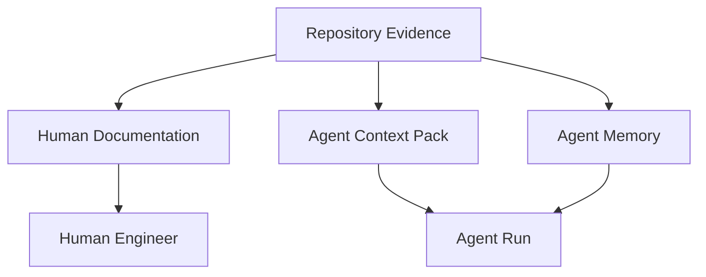
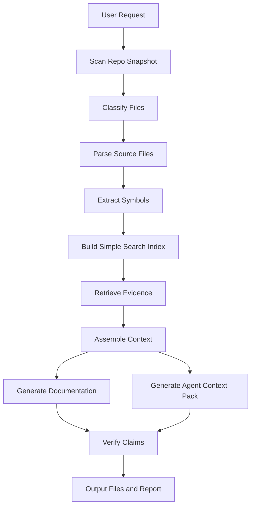
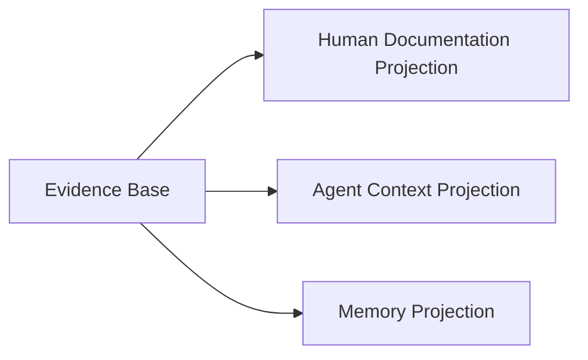
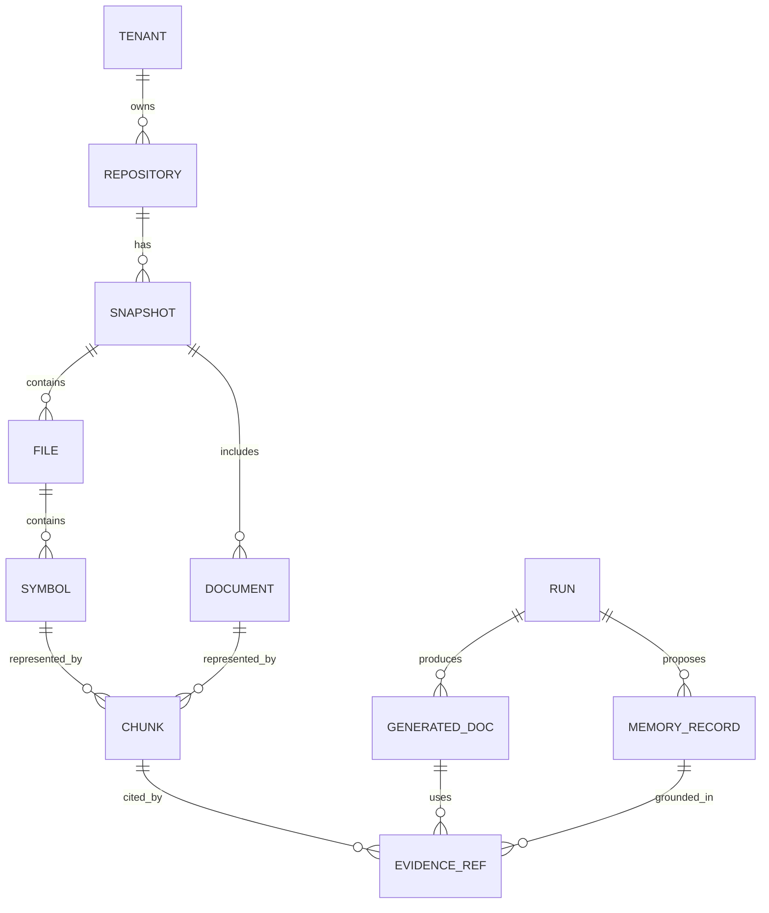
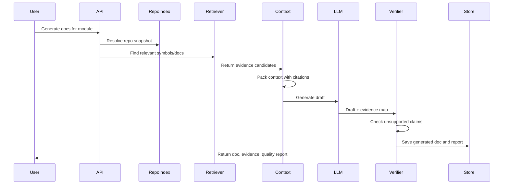
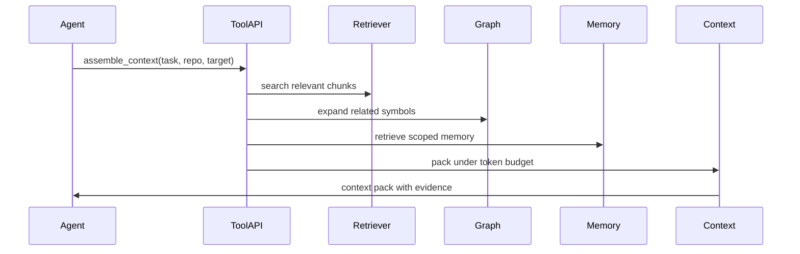
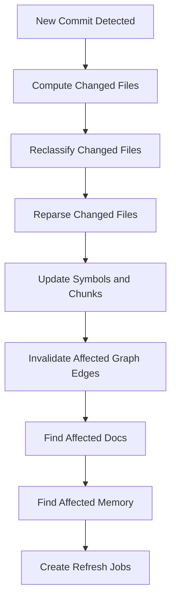
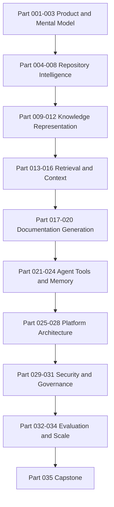

------
title: Learn AI Code Documentation & Agent Memory Platform - Part 002
description: Product vision dan problem boundary untuk platform AI code documentation, repository intelligence, dan agent context/memory.
series: learn-ai-code-documentation-agent-memory
seriesTitle: Learn AI Code Documentation & Agent Memory Platform
order: 2
partTitle: Product Vision and Problem Boundary
tags:
- ai
- product-architecture
- code-intelligence
- documentation
- agent-memory
- repository-analysis
- software-architecture
date: 2026-07-02
---

# Part 002 — Product Vision and Problem Boundary

## 1. Tujuan Part Ini

Part 001 memetakan skill.

Part ini mengunci **batas produk**.

Ini penting karena proyek seperti ini mudah melebar. Dalam satu minggu, scope bisa berubah dari "generate docs dari repo" menjadi:

- chatbot,
- code search,
- service catalog,
- AI coding agent,
- docs portal,
- observability platform,
- knowledge graph,
- enterprise governance system,
- compliance archive,
- CI automation,
- IDE extension.

Semua itu mungkin relevan. Tapi jika semua dibangun sekaligus, produk akan gagal.

Part ini menjawab:

1. Apa produk yang sebenarnya kita bangun?
2. Siapa user-nya?
3. Apa problem yang diselesaikan?
4. Apa yang sengaja tidak diselesaikan?
5. Apa MVP yang masuk akal?
6. Bagaimana membedakan human documentation, AI context, dan agent memory?
7. Apa invariant produk yang tidak boleh dilanggar?

---

## 2. Definisi Produk

Produk yang kita bangun adalah:

> Platform repository intelligence yang mengubah satu atau banyak repository menjadi dokumentasi manusia dan context/memory terstruktur untuk AI agents, dengan provenance, permission, freshness, dan evaluasi kualitas.

Definisi tersebut sengaja panjang karena setiap kata penting.

| Frasa | Arti |
|---|---|
| Platform | Bukan script sekali jalan. Ada lifecycle, API, storage, jobs, auth, eval. |
| Repository intelligence | Tidak sekadar membaca file. Sistem memahami struktur, symbol, dependency, dan docs. |
| Satu atau banyak repository | Harus bisa mulai single-repo, lalu berevolusi ke multi-repo. |
| Dokumentasi manusia | Output yang bisa dibaca engineer. |
| Context/memory AI agents | Output yang compact, task-aware, dan machine-consumable. |
| Provenance | Setiap claim penting punya evidence. |
| Permission | Access mengikuti source repository. |
| Freshness | Knowledge bisa stale dan harus dideteksi. |
| Evaluasi kualitas | Sistem harus bisa diuji, bukan hanya terlihat pintar. |

---

## 3. Problem Statement

Problem statement yang tepat:

> Software teams cannot reliably keep human documentation and AI agent context synchronized with fast-changing codebases across repositories, because code knowledge is fragmented, unstated, stale, and difficult to retrieve with provenance.

Mari kita pecah.

### 3.1 Code Knowledge Fragmented

Knowledge tersebar di:

- source code,
- tests,
- config,
- README,
- ADR,
- API specs,
- DB migrations,
- CI files,
- deployment manifests,
- ticket,
- incident notes,
- chat,
- tribal knowledge.

Repository memang penting, tetapi repository bukan satu-satunya knowledge source. Namun untuk seri ini, repository menjadi starting point karena paling dekat dengan source of truth teknis.

### 3.2 Code Knowledge Often Unstated

Banyak hal penting tidak tertulis eksplisit.

Contoh:

- module mana yang menjadi entry point,
- flow validasi,
- dependency antar service,
- convention error handling,
- ownership implicit,
- lifecycle entity,
- retry behavior,
- idempotency assumption,
- transactional boundary.

Sistem harus bisa menginferensi sebagian, tetapi tetap harus menandai confidence dan evidence.

### 3.3 Documentation Becomes Stale

Docs stale karena:

1. kode berubah,
2. docs tidak ikut diupdate,
3. ownership berubah,
4. API berubah,
5. dependency berubah,
6. runtime behavior berubah,
7. docs duplicate dan bertentangan.

Karena itu, generated docs harus punya freshness metadata.

### 3.4 AI Agents Need Better Context

AI agent yang buruk sering bukan karena modelnya lemah, tetapi karena context-nya buruk.

Context buruk biasanya:

- terlalu besar,
- terlalu kecil,
- tidak relevan,
- stale,
- tidak punya source,
- mencampur repo yang salah,
- melanggar permission,
- tidak sesuai task.

Produk ini harus menjadi context provider, bukan hanya document generator.

---

## 4. User Persona

### 4.1 Backend Engineer

Butuh:

- memahami module cepat,
- mencari flow request/event,
- tahu impact perubahan,
- update docs tanpa membaca seluruh repo,
- memberi context ke AI coding assistant.

Contoh pertanyaan:

```txt
Explain how order validation works and which classes I should inspect before changing validation rules.
```

### 4.2 Tech Lead / Staff Engineer

Butuh:

- dependency map,
- ownership map,
- cross-repo impact,
- architecture consistency,
- stale docs report,
- onboarding path.

Contoh pertanyaan:

```txt
Which services depend on the legacy pricing contract, and which docs need to be updated if we remove it?
```

### 4.3 Platform Engineer

Butuh:

- scalable indexing,
- permission model,
- integration with Git provider,
- API/tool layer,
- observability,
- cost control.

Contoh pertanyaan:

```txt
How do we index 800 repositories incrementally without leaking private repository data across teams?
```

### 4.4 AI Agent

Butuh:

- compact task context,
- safe tools,
- exact symbol references,
- write boundary,
- memory,
- evidence.

Contoh request:

```json
{
  "task": "modify order validation rule",
  "repo": "order-service",
  "branch": "feature/new-rule",
  "neededContext": [
    "relevant symbols",
    "tests",
    "architecture constraints",
    "recent memory"
  ]
}
```

### 4.5 Engineering Manager

Butuh:

- documentation coverage,
- onboarding quality,
- risk visibility,
- ownership gap,
- process metrics.

Contoh pertanyaan:

```txt
Which critical services have stale runbooks or no architecture docs?
```

---

## 5. Job To Be Done

Kita bisa menulis JTBD seperti ini:

### 5.1 Human Documentation JTBD

> Ketika engineer perlu memahami area kode yang tidak familiar, mereka ingin dokumentasi yang akurat, ringkas, dan bisa diverifikasi, supaya bisa membuat perubahan tanpa membaca seluruh repository.

### 5.2 Agent Context JTBD

> Ketika AI agent diminta melakukan task engineering, agent membutuhkan context yang relevan, compact, dan permission-safe, supaya bisa bertindak dengan lebih akurat dan tidak melakukan eksplorasi berulang.

### 5.3 Maintenance JTBD

> Ketika kode berubah, tim ingin tahu knowledge mana yang stale, supaya dokumentasi dan memory tetap sinkron dengan source.

### 5.4 Governance JTBD

> Ketika sistem menghasilkan knowledge turunan dari private repository, organisasi perlu memastikan akses, audit, dan provenance tetap sesuai aturan.

---

## 6. Tiga Output Produk yang Berbeda

Jangan campur tiga output ini.



### 6.1 Human Documentation

Karakteristik:

- readable,
- naratif,
- durable,
- bisa direview,
- cocok untuk onboarding,
- punya heading dan struktur,
- bisa dipublish ke docs portal/repo.

Contoh:

```md
# Order Validation Module

The order validation module verifies order eligibility before quote conversion...
```

### 6.2 Agent Context Pack

Karakteristik:

- task-specific,
- compact,
- evidence-dense,
- boleh tidak indah dibaca,
- punya source path,
- disusun untuk token budget.

Contoh:

```yaml
task: update-validation-rule
context:
  - symbol: OrderValidator.validate
    path: src/main/java/.../OrderValidator.java
    reason: primary validation entry point
  - symbol: RuleRegistry
    path: src/main/java/.../RuleRegistry.java
    reason: rule registration source
constraints:
  - update tests in OrderValidatorTest
  - preserve idempotency behavior
```

### 6.3 Agent Memory

Karakteristik:

- reusable,
- scoped,
- versioned,
- expires,
- conflict-aware,
- permission-aware.

Contoh:

```yaml
memory:
  type: repo_convention
  scope: order-service
  statement: "Validation rules are registered through RuleRegistry, not instantiated directly in controllers."
  evidence:
    - path: src/main/java/.../RuleRegistry.java
      commit: 6f41ab2
  expiresWhen:
    - symbolChanged: RuleRegistry
```

### 6.4 Perbandingan

| Dimensi | Human Docs | Agent Context | Agent Memory |
|---|---|---|---|
| Audience | Engineer | Agent run | Future agent runs |
| Format | Markdown/MDX | YAML/JSON/structured text | Structured records |
| Lifecycle | Days/months | Minutes/hours | Days/months |
| Style | Naratif | Dense | Atomic |
| Evidence | Required | Required | Required |
| Token optimized | Tidak utama | Ya | Ya |
| Review | Human review | Runtime validation | Governance/revision |

---

## 7. Scope MVP

MVP harus kecil tapi benar secara arsitektur.

### 7.1 MVP Goal

> Given one repository at one commit, generate evidence-based module documentation and agent context pack for a selected module.

Itu cukup.

Jangan mulai dengan multi-repo enterprise platform.

### 7.2 MVP Input

Input minimal:

```yaml
repository:
  name: order-service
  url: git@github.com:acme/order-service.git
  branch: main
  commit: 6f41ab2
target:
  type: module
  path: src/main/java/com/acme/order/validation
output:
  - human_doc
  - agent_context_pack
```

### 7.3 MVP Output

Output minimal:

1. generated module documentation,
2. context pack,
3. evidence list,
4. unsupported claim report,
5. run trace.

### 7.4 MVP Non-Goals

MVP tidak melakukan:

- automatic PR merge,
- full multi-repo indexing,
- runtime tracing,
- IDE plugin,
- complex graph database,
- admin dashboard,
- fine-tuning model,
- autonomous code modification.

### 7.5 MVP Architecture



---

## 8. Product Boundary

### 8.1 In Scope

| Capability | MVP | Later |
|---|---:|---:|
| Single repo scan | Yes | Yes |
| File classification | Yes | Yes |
| Language detection | Basic | Advanced |
| Symbol extraction | One/two languages | Multi-language |
| Module documentation | Yes | Yes |
| Agent context pack | Yes | Yes |
| Evidence metadata | Yes | Yes |
| Unsupported claim check | Basic | Advanced |
| Multi-repo graph | No | Yes |
| MCP server | No | Yes |
| Memory store | Basic candidate | Yes |
| RBAC | Basic local | Enterprise |
| UI portal | No | Optional |
| IDE extension | No | Optional |

### 8.2 Out of Scope Awal

| Out of Scope | Kenapa |
|---|---|
| Autonomous code writing | Terlalu besar; butuh sandbox, tests, approval, patch strategy. |
| Fine-tuning LLM | Retrieval dan context lebih penting untuk MVP. |
| Full static analysis compiler-level | Mahal dan language-specific. Mulai dari useful approximation. |
| Full enterprise service catalog | Nanti setelah repository model stabil. |
| Runtime observability ingestion | Penting, tapi bukan fondasi awal. |
| Auto-delete/modify memory tanpa policy | Risky. Harus ada governance. |

---

## 9. Single-Repo vs Multi-Repo

### 9.1 Single-Repo

Single-repo cocok untuk MVP.

Kelebihan:

- lebih mudah dipahami,
- permission sederhana,
- indexing murah,
- graph lebih kecil,
- quality gate lebih mudah.

Kelemahan:

- tidak melihat cross-service impact,
- dependency eksternal hanya terlihat sebagian,
- ownership lintas platform tidak terlihat.

### 9.2 Multi-Repo

Multi-repo diperlukan untuk platform nyata.

Kelebihan:

- bisa impact analysis lintas service,
- bisa service dependency docs,
- bisa platform-level onboarding,
- bisa identify duplicate logic,
- bisa cross-team ownership map.

Kelemahan:

- permission kompleks,
- indexing mahal,
- graph identity lebih sulit,
- version alignment sulit,
- duplicate/conflicting knowledge lebih sering,
- blast radius security lebih besar.

### 9.3 Strategi Evolusi

Jangan desain MVP yang single-repo-only secara permanen.

Desain dari awal dengan field:

```yaml
repositoryId: string
snapshotId: string
commitSha: string
tenantId: string
visibility: string
sourceSystem: git
```

Dengan begitu, sistem bisa mulai single-repo tetapi tidak harus dibongkar ulang saat masuk multi-repo.

---

## 10. Human Docs vs AI Context: Design Tension

Satu kesalahan umum adalah menggunakan dokumen yang sama untuk manusia dan AI agent.

Itu tidak selalu tepat.

### 10.1 Human Docs Perlu Narasi

Human docs butuh:

- background,
- conceptual explanation,
- diagrams,
- examples,
- trade-off,
- links,
- onboarding flow.

### 10.2 Agent Context Perlu Presisi

Agent context butuh:

- exact files,
- relevant symbols,
- constraints,
- tests,
- known pitfalls,
- allowed tools,
- compact evidence.

### 10.3 Solusi

Gunakan satu evidence base, tetapi generate dua projection:



Evidence base sama. Format output berbeda.

---

## 11. Agent Memory Boundary

Memory adalah area paling mudah disalahdesain.

### 11.1 Memory Bukan Cache

Cache:

- mempercepat akses,
- bisa dihapus kapan saja,
- tidak perlu semantic meaning.

Memory:

- menyimpan knowledge,
- memengaruhi perilaku agent,
- harus punya scope,
- harus punya governance.

### 11.2 Memory Bukan Dokumentasi

Dokumentasi biasanya naratif.

Memory harus atomic dan actionable.

Buruk:

```yaml
memory: "Order service is complicated and has many validation rules."
```

Lebih baik:

```yaml
memory:
  statement: "Order validation rules are registered in RuleRegistry."
  scope: repository:order-service
  evidence:
    - path: src/main/java/com/acme/order/validation/RuleRegistry.java
  confidence: 0.84
```

### 11.3 Memory Bukan Ground Truth

Ground truth tetap source.

Memory adalah derived knowledge. Jika source berubah, memory harus direvalidasi.

Invariant:

```txt
No memory should outlive the source evidence that invalidates it.
```

---

## 12. Core Product Invariants

Invariant adalah aturan yang harus benar di semua kondisi.

### 12.1 Evidence Invariant

```txt
Every important generated claim must be traceable to source evidence or marked as uncertain.
```

Implikasi:

- output harus punya citation map,
- context pack harus menyimpan source span,
- quality gate harus bisa menemukan unsupported claims.

### 12.2 Permission Invariant

```txt
Derived knowledge must not be more visible than its source.
```

Implikasi:

- index mengikuti ACL repo,
- memory mengikuti ACL source,
- docs mengikuti classification source,
- search harus filter by permission sebelum atau saat retrieval.

### 12.3 Freshness Invariant

```txt
Generated knowledge must know which source version it represents.
```

Implikasi:

- setiap docs punya commit SHA,
- setiap memory punya evidence version,
- perubahan file harus bisa invalidate chunk/docs/memory.

### 12.4 Reproducibility Invariant

```txt
A generated output should be reproducible from its source snapshot and generation metadata.
```

Implikasi:

- simpan model/prompt/template version,
- simpan retrieved evidence ID,
- simpan commit,
- simpan output metadata.

### 12.5 Safe Write Invariant

```txt
The system may propose changes, but official writes require explicit workflow and approval.
```

Implikasi:

- default read-only,
- generated docs sebagai draft,
- PR bukan direct push,
- memory candidate sebelum memory active.

---

## 13. Product Data Model Awal

Kita butuh data model sebelum coding.

### 13.1 Core Entities



### 13.2 Entity Definition

| Entity | Description |
|---|---|
| Tenant | Organization/workspace boundary. |
| Repository | Git repository identity. |
| Snapshot | Specific commit/branch scan result. |
| File | File metadata at snapshot. |
| Symbol | Extracted code entity. |
| Document | Existing source docs. |
| Chunk | Search/retrieval unit. |
| EvidenceRef | Reference to source span. |
| GeneratedDoc | AI-produced documentation. |
| MemoryRecord | Persistent knowledge candidate/active record. |
| Run | Execution trace for indexing/doc generation. |

### 13.3 Why `Snapshot` Matters

Tanpa snapshot, kita tidak tahu docs menjelaskan versi mana.

Bad schema:

```sql
docs(repository_id, content)
```

Better schema:

```sql
docs(repository_id, snapshot_id, commit_sha, content, generated_at)
```

Best schema eventually:

```sql
generated_docs(
    id,
    tenant_id,
    repository_id,
    snapshot_id,
    commit_sha,
    doc_type,
    target_entity_id,
    generator_version,
    context_pack_id,
    content,
    quality_score,
    review_state,
    created_at
)
```

---

## 14. Product Workflows

### 14.1 Generate Module Documentation



### 14.2 Generate Agent Context Pack



### 14.3 Update After Commit



---

## 15. Key User Stories

### 15.1 Engineer: Understand Module

```gherkin
Given a repository has been indexed
And I select a module path
When I request module documentation
Then the system generates a document explaining purpose, components, flow, dependencies, and known uncertainties
And every major claim includes source evidence
```

### 15.2 Agent: Get Task Context

```gherkin
Given an AI agent needs to modify a validation rule
When it requests context for the task
Then the system returns relevant symbols, tests, docs, constraints, and memory
And the context does not include unauthorized repositories
```

### 15.3 Tech Lead: Detect Stale Docs

```gherkin
Given source code changed after docs were generated
When I request stale documentation report
Then the system lists docs whose evidence changed
And explains which files or symbols caused staleness
```

### 15.4 Platform Engineer: Audit Output

```gherkin
Given a generated document exists
When I inspect its generation run
Then I can see repository commit, retrieved chunks, model/template version, quality checks, and reviewer state
```

---

## 16. Quality Bar

### 16.1 Functional Quality

The system should:

- scan repository consistently,
- extract useful symbols,
- retrieve relevant evidence,
- generate docs with citations,
- build agent context packs,
- detect unsupported claims,
- preserve source version metadata.

### 16.2 Non-Functional Quality

The system should be:

- reproducible,
- incremental,
- permission-aware,
- observable,
- cost-aware,
- reviewable,
- extensible.

### 16.3 Product Quality Metrics

| Metric | Meaning |
|---|---|
| Evidence coverage | Percentage of generated claims supported by evidence. |
| Unsupported claim count | Claims without evidence. |
| Retrieval precision@k | Relevance of top retrieved chunks. |
| Stale doc count | Docs whose source evidence changed. |
| Context token efficiency | Useful evidence per token. |
| Memory invalidation accuracy | Whether stale memory is detected. |
| Permission violation count | Must be zero. |
| Human acceptance rate | Docs accepted without major rewrite. |

---

## 17. Architecture Boundary

### 17.1 What Belongs in Core

Core platform:

- repository scanner,
- file classifier,
- parser/symbol extractor,
- metadata store,
- search/retrieval,
- context assembler,
- doc generator,
- memory manager,
- quality gate,
- API.

### 17.2 What Belongs in Integrations

Integrations:

- GitHub/GitLab/Bitbucket connector,
- Slack/Teams notification,
- docs portal publishing,
- IDE extension,
- CI/CD hook,
- MCP server,
- issue tracker sync.

### 17.3 Why This Boundary Matters

Core should not depend on GitHub-specific assumptions.

Bad:

```txt
PullRequestDocumentationGenerator
```

Better:

```txt
DocumentationGenerationService
  input: RepositorySnapshot, TargetScope, DocType
  output: GeneratedDocDraft
```

Then GitHub PR integration becomes adapter.

---

## 18. API Surface Awal

Kita belum mendesain OpenAPI penuh, tetapi kita bisa menetapkan API shape.

### 18.1 Repository API

```http
POST /repositories
GET /repositories/{repositoryId}
POST /repositories/{repositoryId}/sync
GET /repositories/{repositoryId}/snapshots
```

### 18.2 Search API

```http
POST /search
POST /symbols/search
GET /symbols/{symbolId}
GET /symbols/{symbolId}/neighbors
```

### 18.3 Documentation API

```http
POST /documentation/generate
GET /documentation/{docId}
GET /documentation/{docId}/evidence
POST /documentation/{docId}/review
```

### 18.4 Context API

```http
POST /context/assemble
GET /context-packs/{contextPackId}
```

### 18.5 Memory API

```http
POST /memory/candidates
GET /memory/search
POST /memory/{memoryId}/approve
POST /memory/{memoryId}/invalidate
```

### 18.6 Run API

```http
GET /runs/{runId}
GET /runs/{runId}/trace
GET /runs/{runId}/quality-report
```

---

## 19. Request/Response Examples

### 19.1 Generate Documentation Request

```json
{
  "repositoryId": "repo_order_service",
  "snapshot": {
    "branch": "main",
    "commitSha": "6f41ab2"
  },
  "target": {
    "type": "module",
    "path": "src/main/java/com/acme/order/validation"
  },
  "docType": "module_documentation",
  "audience": ["backend_engineer", "ai_agent"],
  "options": {
    "includeMermaid": true,
    "requireEvidence": true,
    "maxTokens": 12000
  }
}
```

### 19.2 Generate Documentation Response

```json
{
  "docId": "doc_01J...",
  "runId": "run_01J...",
  "status": "draft",
  "quality": {
    "evidenceCoverage": 0.87,
    "unsupportedClaimCount": 1,
    "staleRisk": "low"
  },
  "outputs": {
    "markdownPath": "generated/order-validation.md",
    "evidencePath": "generated/order-validation.evidence.json"
  }
}
```

### 19.3 Assemble Agent Context Request

```json
{
  "repositoryId": "repo_order_service",
  "branch": "main",
  "task": {
    "type": "code_change",
    "description": "Add a validation rule for corporate orders"
  },
  "target": {
    "symbol": "com.acme.order.validation.OrderValidator"
  },
  "budget": {
    "maxTokens": 8000
  },
  "include": {
    "tests": true,
    "memory": true,
    "docs": true,
    "graphNeighbors": true
  }
}
```

### 19.4 Assemble Agent Context Response

```json
{
  "contextPackId": "ctx_01J...",
  "tokenEstimate": 7420,
  "evidence": [
    {
      "kind": "symbol",
      "path": "src/main/java/com/acme/order/validation/OrderValidator.java",
      "lines": [12, 144],
      "reason": "Primary validation entry point"
    },
    {
      "kind": "test",
      "path": "src/test/java/com/acme/order/validation/OrderValidatorTest.java",
      "lines": [20, 188],
      "reason": "Relevant test coverage"
    }
  ],
  "memory": [
    {
      "memoryId": "mem_order_validation_rule_registry",
      "statement": "Rules are registered through RuleRegistry."
    }
  ],
  "warnings": [
    "No ADR was found for corporate order validation."
  ]
}
```

---

## 20. Deployment Boundary

MVP bisa berjalan lokal.

Production butuh service boundary.

### 20.1 Local MVP

```txt
CLI + local repo + local metadata DB + generated files
```

Kelebihan:

- cepat,
- mudah debug,
- murah,
- cocok untuk belajar.

Kekurangan:

- tidak multi-user,
- permission sederhana,
- tidak ada worker scaling,
- tidak ada audit kuat.

### 20.2 Team Deployment

```txt
API service + worker + shared database + object storage + search index
```

Kelebihan:

- bisa dipakai tim,
- ada shared index,
- bisa punya review workflow.

Kekurangan:

- auth dan permission mulai serius,
- cost perlu dikontrol,
- job retry perlu benar.

### 20.3 Enterprise Deployment

```txt
Multi-tenant API + distributed workers + graph/vector/search stores + audit + policy engine
```

Kelebihan:

- multi-team,
- multi-repo,
- governance,
- observability.

Kekurangan:

- kompleks,
- butuh platform team,
- failure mode lebih banyak.

---

## 21. Technology-Agnostic First

Seri ini akan membahas teknologi, tetapi produk tidak boleh tergantung pada satu vendor.

### 21.1 Abstraction yang Harus Ada

| Area | Abstraction |
|---|---|
| Git provider | `RepositoryProvider` |
| Parser | `LanguageParser` |
| Embedding | `EmbeddingProvider` |
| LLM | `GenerationProvider` |
| Vector store | `VectorIndex` |
| Search | `LexicalIndex` |
| Graph | `GraphRepository` |
| AuthZ | `PermissionEvaluator` |
| Memory | `MemoryStore` |

### 21.2 Contoh Interface

```java
public interface RepositoryProvider {
    RepositorySnapshot fetchSnapshot(RepositoryRef ref, SnapshotSelector selector);
}

public interface LanguageParser {
    boolean supports(Language language);
    ParseResult parse(SourceFile file);
}

public interface ContextAssembler {
    ContextPack assemble(ContextRequest request);
}

public interface DocumentationGenerator {
    GeneratedDocument generate(DocumentationRequest request, ContextPack context);
}
```

Desain ini membuat sistem bisa mulai sederhana, lalu mengganti implementasi tanpa membongkar domain model.

---

## 22. Risk Register

### 22.1 Product Risks

| Risk | Mitigation |
|---|---|
| Output tidak dipercaya | Evidence, citations, review workflow. |
| Docs terlalu verbose | Doc taxonomy dan audience-specific template. |
| Agent context terlalu besar | Token budget dan context ranking. |
| Scope melebar | MVP boundary dan anti-goals. |
| User tidak mau review | Buat diff kecil dan quality report jelas. |

### 22.2 Technical Risks

| Risk | Mitigation |
|---|---|
| Parser gagal di banyak bahasa | Plugin parser dan fallback lexical. |
| Indexing mahal | Incremental scan, batching, cache. |
| Retrieval buruk | Hybrid search, graph expansion, eval. |
| Memory stale | Invalidation policy. |
| Multi-repo identity kacau | Stable IDs dan canonical naming. |

### 22.3 Security Risks

| Risk | Mitigation |
|---|---|
| Secret leakage | Secret scanning before indexing/context. |
| Prompt injection dari repo | Treat repo content as untrusted data. |
| Permission leak | Source-derived ACL. |
| Dangerous tools | Least-privilege and read-only default. |
| Memory contamination | Review and provenance. |

---

## 23. The Product Contract

Kita bisa menulis product contract seperti ini:

```txt
The platform will not claim to understand code unless it can point to evidence.
The platform will not expose derived knowledge to users who cannot access the source.
The platform will not treat generated documentation as official without review.
The platform will not keep memory active after its source evidence is invalidated.
The platform will not optimize for model cleverness over retrieval correctness.
```

Ini bukan slogan. Ini constraint desain.

---

## 24. Recommended MVP Milestones

### Milestone 1 — Repository Snapshot

Output:

- repository metadata,
- file list,
- file classification,
- fingerprint.

### Milestone 2 — Symbol Index

Output:

- extracted symbols,
- line ranges,
- stable IDs,
- basic symbol search.

### Milestone 3 — Evidence Retrieval

Output:

- retrieve relevant files/symbols/docs,
- simple ranking,
- evidence list.

### Milestone 4 — Context Pack

Output:

- structured context pack,
- token budget,
- citation map.

### Milestone 5 — Documentation Draft

Output:

- module docs,
- source evidence section,
- uncertainty section.

### Milestone 6 — Quality Report

Output:

- unsupported claims,
- stale risk,
- missing docs,
- reviewer checklist.

### Milestone 7 — Memory Candidate

Output:

- proposed memory records,
- evidence,
- expiry policy,
- approval state.

---

## 25. Example End-to-End MVP Scenario

### 25.1 Input

```txt
Repository: order-service
Target: src/main/java/com/acme/order/validation
Doc Type: Module Documentation
Audience: Backend Engineer
```

### 25.2 System Action

1. Resolve commit.
2. Classify files under target path.
3. Parse source files.
4. Extract symbols.
5. Find tests.
6. Find ADR/README references.
7. Retrieve evidence.
8. Assemble context.
9. Generate docs.
10. Verify claims.
11. Produce output.

### 25.3 Output Files

```txt
generated/
  order-validation.module-doc.md
  order-validation.agent-context.yaml
  order-validation.evidence.json
  order-validation.quality-report.yaml
```

### 25.4 Quality Report Example

```yaml
docId: doc_order_validation
repository: order-service
commit: 6f41ab2
quality:
  evidenceCoverage: 0.88
  unsupportedClaims:
    - claim: "Validation rules are loaded dynamically from database."
      reason: "No evidence found in retrieved context."
  missingEvidence:
    - "Retry behavior"
  staleRisk: low
review:
  required: true
  suggestedReviewer: team-order-platform
```

---

## 26. Decision Records untuk Produk

Sejak awal, tulis keputusan penting sebagai ADR.

### ADR 001 — Evidence Required for Generated Claims

```md
# ADR 001 — Evidence Required for Generated Claims

## Status

Accepted

## Context

Generated documentation can sound correct while being unsupported by code evidence.

## Decision

Every major generated claim must be linked to source evidence or marked as uncertain.

## Consequences

- Context assembly must preserve source spans.
- Documentation output must include evidence.
- Verification pipeline must check unsupported claims.
```

### ADR 002 — Default Read-Only Agent Tools

```md
# ADR 002 — Default Read-Only Agent Tools

## Status

Accepted

## Context

Agent tools that can write to repositories, memory, or external systems increase risk.

## Decision

All agent tools are read-only by default. Write operations must produce proposals that require approval.

## Consequences

- Safer MVP.
- More explicit review process.
- Slightly slower automation.
```

---

## 27. What We Will Build Across the Series

Seri ini akan bergerak dari MVP menuju platform.



---

## 28. What We Will Not Optimize Yet

Untuk menjaga fokus, jangan optimasi ini terlalu awal:

| Jangan Optimasi Dulu | Alasan |
|---|---|
| Model selection | Retrieval dan evidence lebih fundamental. |
| UI cantik | Core pipeline harus benar dulu. |
| Multi-language sempurna | Mulai dari 1–2 bahasa. |
| Graph database pilihan | Model graph lebih penting dari storage awal. |
| Agent autonomy | Context quality dulu. |
| Complex permissions | Mulai dengan source-derived model sederhana. |
| Massive scale | Desain incremental, tapi implementasi bertahap. |

---

## 29. Common Misframing

### 29.1 "Ini hanya RAG untuk kode"

Kurang tepat.

RAG adalah bagian retrieval. Produk ini juga mencakup:

- parsing,
- symbol identity,
- graph,
- documentation lifecycle,
- memory lifecycle,
- permission,
- quality gates,
- audit.

### 29.2 "Vector DB akan menyelesaikan semuanya"

Tidak.

Vector search lemah untuk exact identifier, versioning, permission, dan structural relation. Kita butuh hybrid retrieval.

### 29.3 "Docs bisa langsung digenerate dari semua file"

Bisa, tapi hasilnya sering buruk.

Lebih baik:

1. pilih target,
2. retrieve evidence,
3. assemble context,
4. generate draft,
5. verify claims.

### 29.4 "Memory sama dengan menyimpan summary"

Tidak.

Memory harus atomic, scoped, evidence-based, dan bisa expire.

### 29.5 "Agent boleh membaca semua repo supaya pintar"

Tidak.

Agent harus mengikuti permission user/task. Context yang tidak boleh dilihat user juga tidak boleh diberikan ke agent atas nama user.

---

## 30. Exit Criteria Part Ini

Kita siap lanjut jika sudah jelas:

- produk bukan chatbot repo biasa,
- MVP adalah single-repo evidence-based doc/context generator,
- human docs, agent context, dan memory adalah output berbeda,
- source evidence adalah pusat trust,
- permission harus diwariskan dari source,
- freshness harus eksplisit,
- write operation harus melalui approval,
- multi-repo adalah evolusi, bukan titik awal.

---

## 31. Ringkasan

Product boundary yang baik membuat engineering decision lebih mudah.

Untuk seri ini, produk final adalah:

> Repository intelligence platform untuk menghasilkan human documentation dan AI agent context/memory berbasis source evidence.

MVP yang benar:

> Single-repo, commit-aware, module-level documentation dan agent context pack dengan evidence, quality report, dan memory candidate.

Hal yang tidak boleh dikorbankan:

1. evidence,
2. permission,
3. freshness,
4. reproducibility,
5. safe write boundary.

Part berikutnya akan membangun **System Mental Model**: bagaimana memandang repository sebagai evidence database, code sebagai graph, dokumentasi sebagai projection, dan memory sebagai derived knowledge yang punya lifecycle.
