------
title: Learn AI Code Documentation & Agent Memory Platform - Part 003
description: Mental model sistem end-to-end untuk memandang repository sebagai evidence database, code sebagai graph, docs sebagai projection, dan memory sebagai derived knowledge yang punya lifecycle.
series: learn-ai-code-documentation-agent-memory
seriesTitle: Learn AI Code Documentation & Agent Memory Platform
order: 3
partTitle: System Mental Model
tags:
- ai
- code-intelligence
- documentation
- agent-memory
- system-design
- knowledge-graph
- software-architecture
date: 2026-07-02
---

# Part 003 — System Mental Model

## 1. Tujuan Part Ini

Part 001 memetakan skill. Part 002 mengunci batas produk.

Part ini membangun **mental model sistem**.

Kita perlu mental model yang kuat karena platform ini berada di persimpangan beberapa dunia:

1. static code analysis,
2. search engine,
3. knowledge graph,
4. documentation system,
5. AI context provider,
6. agent memory,
7. platform engineering,
8. security and governance.

Tanpa mental model yang jelas, desain akan cepat menjadi kumpulan komponen yang tampak modern tetapi tidak koheren:

```txt
Git clone + embeddings + vector DB + LLM + chatbot = terlihat canggih, tetapi rapuh.
```

Mental model yang kita inginkan:

```txt
Repository snapshot -> evidence model -> graph/index -> context projection -> docs/memory/tools -> evaluation feedback loop
```

Kita tidak sedang membangun "AI wrapper" di atas repository. Kita sedang membangun **sistem transformasi knowledge** yang punya versioning, provenance, permission, dan lifecycle.

---

## 2. Four Core Ideas

Seluruh seri ini bisa dipahami melalui empat ide besar.

| Ide | Makna |
|---|---|
| Repository as Evidence Database | Repository adalah sumber evidence yang harus dibaca per snapshot/commit. |
| Code as Graph | Kode bukan teks linear; kode adalah jaringan symbol, dependency, call, config, schema, dan runtime boundary. |
| Documentation as Projection | Dokumentasi adalah projection dari evidence untuk audience tertentu, bukan ground truth utama. |
| Memory as Derived Knowledge | Memory adalah knowledge turunan yang harus punya evidence, scope, confidence, expiry, dan governance. |

Keempat ide ini menjadi dasar semua keputusan desain.

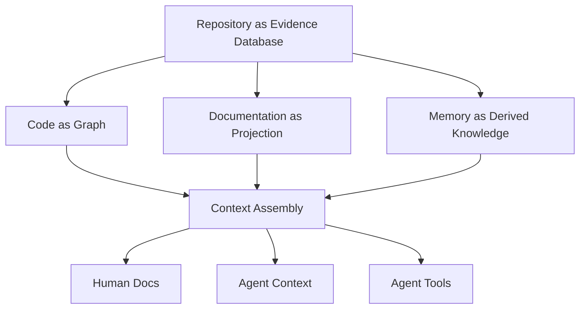

---

## 3. Repository as Evidence Database

Repository sering diperlakukan sebagai folder file. Untuk sistem ini, itu terlalu dangkal.

Repository harus dipandang sebagai **database evidence yang versioned**.

### 3.1 Apa Maksudnya Evidence Database?

Repository berisi evidence tentang sistem:

| Evidence | Contoh | Apa yang Bisa Disimpulkan |
|---|---|---|
| Source code | `OrderValidator.java` | business logic, flow, dependency, invariant. |
| Tests | `OrderValidatorTest.java` | expected behavior, edge cases, regression boundary. |
| API specs | `openapi.yaml` | external contract, request/response, error model. |
| Migrations | `V42__add_order_status.sql` | data model evolution. |
| Config | `application.yaml` | feature flag, endpoint, topic, timeout. |
| CI files | `.github/workflows/build.yml` | build/test/release process. |
| IaC | `deployment.yaml`, `terraform.tf` | runtime topology, resources, dependencies. |
| Docs | README, ADR, runbook | explicit human explanation. |
| CODEOWNERS | `CODEOWNERS` | ownership boundary. |

Semua ini adalah evidence, tetapi tidak semua evidence punya tingkat kepercayaan yang sama.

### 3.2 Evidence Hierarchy

Beberapa source lebih dekat ke ground truth teknis daripada yang lain.

| Evidence Type | Reliability | Catatan |
|---|---:|---|
| Current source code | Tinggi | Menjelaskan implementasi saat ini. |
| Tests | Tinggi-menengah | Menjelaskan intended behavior, tetapi coverage bisa kurang. |
| API/schema | Tinggi jika enforced | Kuat jika dipakai di build/runtime. |
| Config/deployment | Tinggi untuk runtime hints | Perlu branch/environment context. |
| ADR | Menengah | Menjelaskan keputusan, bisa stale. |
| README/docs | Menengah-rendah | Berguna, tetapi mudah stale. |
| Comments | Bervariasi | Bisa sangat berguna atau misleading. |
| Generated docs lama | Rendah sampai diverifikasi | Harus dilihat sebagai derived output. |

Prinsipnya:

```txt
Documentation should be grounded in evidence, but evidence itself has confidence levels.
```

### 3.3 Snapshot Matters

Repository berubah. Karena itu evidence harus selalu terikat ke snapshot.

Bad mental model:

```txt
repo/order-service/src/OrderValidator.java
```

Better mental model:

```txt
repository=order-service
commit=6f41ab2
path=src/main/java/com/acme/order/validation/OrderValidator.java
lines=12-144
contentHash=sha256:...
```

Tanpa commit, kita tidak bisa menjawab:

- docs ini menjelaskan versi kode mana?
- memory ini masih valid atau tidak?
- evidence berubah sejak docs digenerate?
- output bisa direproduksi?
- claim ini berasal dari branch apa?

### 3.4 Evidence Object

Kita akan sering memakai konsep `EvidenceRef`.

```yaml
kind: source_span
repositoryId: repo_order_service
snapshotId: snap_main_6f41ab2
commitSha: 6f41ab2
path: src/main/java/com/acme/order/validation/OrderValidator.java
language: java
startLine: 12
endLine: 144
contentHash: sha256:9b1c...
symbolId: sym_order_validator_validate
confidence: 0.93
```

`EvidenceRef` adalah dasar untuk:

- citation,
- quality gate,
- audit,
- memory expiry,
- stale docs detection,
- review workflow.

---

## 4. Code as Graph

Kode memang tersimpan sebagai teks, tetapi sistem software bekerja sebagai jaringan relasi.

Jika kita hanya melihat file sebagai potongan teks, kita kehilangan struktur penting.

### 4.1 Teks vs Struktur

Contoh query:

```txt
Where is order validation performed?
```

Lexical search bisa menemukan kata `validation`. Tetapi jawaban yang benar mungkin tersebar di:

- controller yang menerima request,
- service yang memanggil validator,
- registry rule,
- DTO annotation,
- test case,
- config feature flag,
- ADR validasi,
- schema status order.

Mental model graph membantu menemukan jalur tersebut.

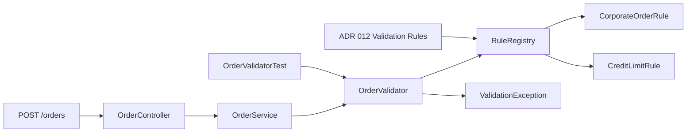

### 4.2 Graph Bukan Berarti Harus Graph Database

Poin penting:

```txt
Graph model lebih penting daripada graph database.
```

Untuk MVP, graph bisa disimpan di tabel relational:

```sql
CREATE TABLE code_nodes (
    id TEXT PRIMARY KEY,
    type TEXT NOT NULL,
    repository_id TEXT NOT NULL,
    snapshot_id TEXT NOT NULL,
    stable_key TEXT NOT NULL,
    display_name TEXT NOT NULL,
    metadata_json TEXT NOT NULL
);

CREATE TABLE code_edges (
    id TEXT PRIMARY KEY,
    source_node_id TEXT NOT NULL,
    target_node_id TEXT NOT NULL,
    type TEXT NOT NULL,
    confidence REAL NOT NULL,
    evidence_json TEXT NOT NULL
);
```

Graph database baru penting jika:

- traversal makin kompleks,
- multi-hop query sering,
- volume edge besar,
- graph analytics dibutuhkan,
- query pattern tidak nyaman di SQL.

### 4.3 Node Types

Minimal node types:

| Node Type | Contoh |
|---|---|
| `repository` | `order-service` |
| `snapshot` | `main@6f41ab2` |
| `file` | `OrderValidator.java` |
| `package` | `com.acme.order.validation` |
| `symbol` | `OrderValidator.validate(Order)` |
| `endpoint` | `POST /orders` |
| `schema` | `OrderCreatedEvent` |
| `database_table` | `orders` |
| `document` | `docs/adr/012-validation-rules.md` |
| `team` | `team-order-platform` |
| `memory` | `repo.order-service.validation.rules-location` |

### 4.4 Edge Types

Minimal edge types:

| Edge Type | Arti |
|---|---|
| `CONTAINS` | repository contains file, file contains symbol. |
| `IMPORTS` | file imports module/package. |
| `CALLS` | symbol calls symbol. |
| `IMPLEMENTS` | type implements interface. |
| `EXTENDS` | type extends type. |
| `EXPOSES` | symbol exposes API endpoint. |
| `READS` | code reads config/table/resource. |
| `WRITES` | code writes table/resource. |
| `PUBLISHES` | code publishes event. |
| `CONSUMES` | code consumes event. |
| `TESTS` | test symbol tests production symbol. |
| `DOCUMENTS` | document explains symbol/module. |
| `OWNED_BY` | repo/file/symbol owned by team. |
| `DERIVED_FROM` | docs/memory derived from evidence. |

### 4.5 Confidence on Edges

Tidak semua edge sama kuat.

| Edge | Confidence | Contoh |
|---|---:|---|
| File contains symbol | 0.99 | Parser result. |
| Import relation | 0.95 | Static import statement. |
| Direct method call | 0.70–0.95 | Tergantung language/resolution. |
| Endpoint mapping | 0.80–0.98 | Annotation/router detection. |
| Document explains symbol | 0.50–0.90 | Based on links/text similarity. |
| Ownership inferred from path | 0.40–0.80 | CODEOWNERS/path convention. |

Graph harus menyimpan confidence agar context assembly bisa memilih evidence dengan bijak.

---

## 5. Documentation as Projection

Dokumentasi bukan ground truth. Dokumentasi adalah projection dari evidence untuk audience dan tujuan tertentu.

### 5.1 Projection Mental Model

Satu evidence base bisa menghasilkan banyak bentuk dokumentasi.

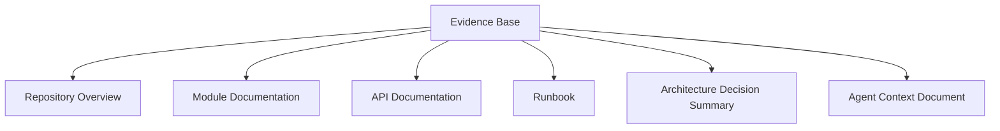

Contoh evidence sama:

- `OrderController.java`,
- `OrderService.java`,
- `OrderValidator.java`,
- `OrderValidatorTest.java`,
- `openapi.yaml`,
- `ADR-012-validation-rules.md`.

Bisa diproyeksikan menjadi:

1. onboarding docs untuk engineer baru,
2. module docs untuk backend engineer,
3. agent context untuk task perubahan validasi,
4. impact analysis untuk tech lead,
5. runbook troubleshooting order rejection.

### 5.2 Audience Changes Everything

| Audience | Butuh |
|---|---|
| New engineer | Big picture, setup, flow, glossary. |
| Senior engineer | Boundary, invariants, trade-off, edge cases. |
| Tech lead | Ownership, coupling, risk, dependency. |
| SRE | Runtime behavior, alerts, rollback, failure mode. |
| AI agent | Exact files, symbols, tests, constraints, tool calls. |

Karena itu, satu "summary repo" tidak cukup.

### 5.3 Documentation Should Be Regenerable

Jika docs adalah projection, maka docs harus bisa diregenerate saat evidence berubah.

Untuk itu setiap generated doc harus tahu:

```yaml
docId: doc_order_validation_module
projectionType: module_documentation
target:
  type: path
  path: src/main/java/com/acme/order/validation
sourceSnapshot:
  repositoryId: repo_order_service
  commitSha: 6f41ab2
evidenceRefs:
  - ev_001
  - ev_002
generator:
  templateVersion: module-doc-v3
  modelProfile: default-doc-writer
quality:
  evidenceCoverage: 0.88
  unsupportedClaims: 1
```

### 5.4 Docs Can Be Wrong

Karena docs adalah projection, docs bisa salah jika:

- evidence salah,
- retrieval salah,
- context assembly salah,
- generation salah,
- verification lemah,
- source berubah setelah generate,
- human edit membuat docs menyimpang.

Sistem harus memperlakukan docs sebagai object dengan lifecycle, bukan teks final abadi.

---

## 6. Memory as Derived Knowledge

Memory adalah hasil ekstraksi knowledge yang disimpan agar agent bisa bekerja lebih baik di masa depan.

Tetapi memory berbahaya jika salah.

### 6.1 Memory Is Not Truth

Memory bukan ground truth.

```txt
Source evidence > verified docs > active memory > candidate memory > model guess
```

Urutan trust ini penting.

Jika memory bertentangan dengan source evidence terbaru, memory harus kalah.

### 6.2 Memory Lifecycle

Memory punya lifecycle.

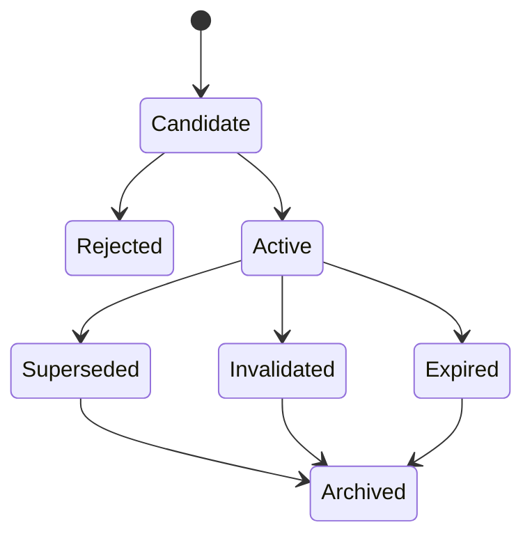

### 6.3 Memory Record Anatomy

```yaml
memoryId: mem_order_validation_registry
state: active
kind: repo_convention
scope:
  tenantId: acme
  repositoryId: repo_order_service
  visibility: team_order_platform
statement: "Validation rules are registered through RuleRegistry, not instantiated directly in controllers."
evidence:
  - repositoryId: repo_order_service
    commitSha: 6f41ab2
    path: src/main/java/com/acme/order/validation/RuleRegistry.java
    lines: [10, 92]
confidence: 0.86
createdBy:
  type: agent
  runId: run_20260702_001
review:
  state: approved
  reviewer: senior-engineer@example.com
validity:
  validFromCommit: 6f41ab2
  invalidationRules:
    - fileChanged: src/main/java/com/acme/order/validation/RuleRegistry.java
    - symbolDeleted: com.acme.order.validation.RuleRegistry
```

### 6.4 Types of Memory

| Memory Type | Example | Expiry Trigger |
|---|---|---|
| Repo convention | Rules registered via `RuleRegistry`. | Registry file changed. |
| Architecture decision | Service uses async event publication. | ADR changed or event publisher removed. |
| Testing convention | Validation tests live under `validation/*Test`. | Test path structure changed. |
| Domain glossary | `quote` means pre-order commercial offer. | Glossary/doc changed. |
| Known pitfall | Do not bypass idempotency key validation. | Related code/ADR changed. |
| User/team preference | Docs should include Mermaid diagrams. | Preference update. |

### 6.5 Memory Failure Modes

| Failure | Example | Mitigation |
|---|---|---|
| Stale memory | Agent uses old class name. | Invalidation rules. |
| Overgeneral memory | "All services use Kafka." | Scope memory precisely. |
| Secret memory | Token accidentally stored. | Secret scanning and memory policy. |
| Cross-tenant leak | Memory from private repo shown to other team. | ACL inheritance. |
| Conflicting memory | Two records say opposite things. | Conflict detection and precedence. |
| Unreviewed memory trusted too much | Candidate used as fact. | State-based retrieval weighting. |

---

## 7. The Evidence-to-Output Pipeline

Semua output berasal dari pipeline transformasi evidence.

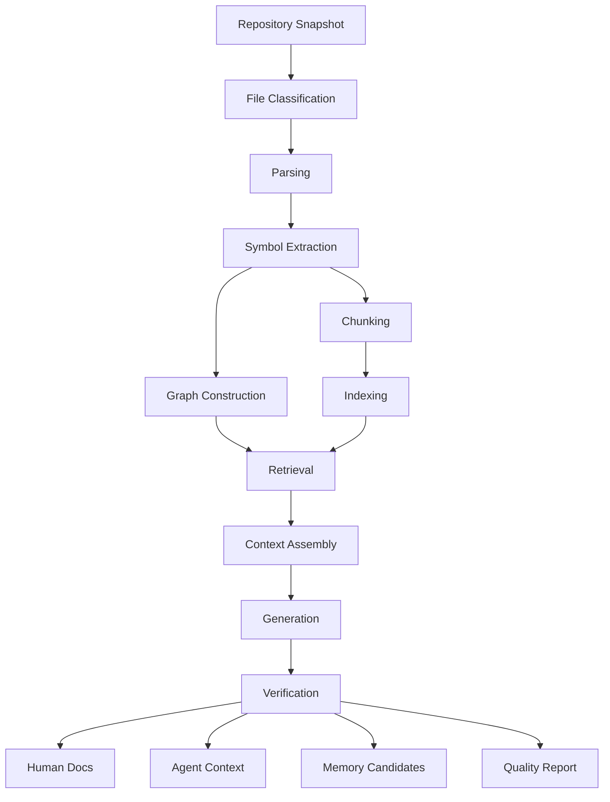

Setiap tahap harus mempertahankan metadata.

### 7.1 Metadata Propagation

Jika metadata hilang di tengah pipeline, provenance mati.

Minimal metadata:

```yaml
repositoryId: repo_order_service
snapshotId: snap_6f41ab2
commitSha: 6f41ab2
path: src/main/java/com/acme/order/validation/OrderValidator.java
language: java
fileHash: sha256:...
sourceSpan:
  startLine: 12
  endLine: 144
classification:
  fileKind: source
  generated: false
  vendored: false
permissions:
  visibility: private
  allowedTeams:
    - team-order-platform
```

### 7.2 Pipeline Contract

Setiap stage harus menerima dan menghasilkan object typed.

Bad:

```java
String process(String text)
```

Better:

```java
ParseResult parse(SourceFile file);
SymbolExtractionResult extract(ParseResult parseResult);
ContextPack assemble(ContextAssemblyRequest request);
GeneratedDocument generate(DocumentationRequest request, ContextPack context);
```

Object typed membuat sistem lebih testable, auditable, dan evolvable.

---

## 8. System Planes

Platform ini bisa dipahami sebagai beberapa plane.

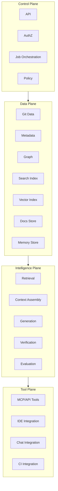

### 8.1 Control Plane

Bertanggung jawab atas:

- API,
- auth/authz,
- job lifecycle,
- scheduling,
- policy,
- quotas,
- audit.

### 8.2 Data Plane

Bertanggung jawab atas:

- raw snapshot metadata,
- parsed symbols,
- chunks,
- graph edges,
- indices,
- docs,
- memory.

### 8.3 Intelligence Plane

Bertanggung jawab atas:

- retrieval,
- context assembly,
- generation,
- verification,
- evaluation.

### 8.4 Tool Plane

Bertanggung jawab atas exposing capability ke:

- AI agents,
- IDE,
- chat,
- CI,
- docs portal.

Memisahkan plane membantu kita menghindari desain monolitik yang tidak jelas boundary-nya.

---

## 9. Read Path vs Write Path

Sistem ini punya read path dan write path yang berbeda.

### 9.1 Read Path

Read path menjawab pertanyaan atau menyediakan context.

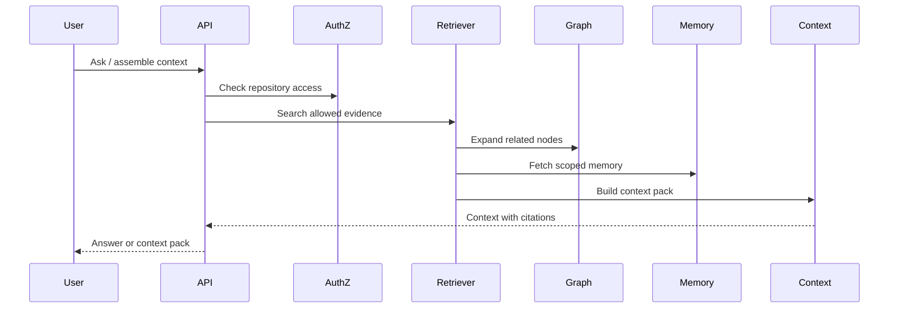

Read path harus cepat, permission-safe, dan traceable.

### 9.2 Write Path

Write path menghasilkan perubahan docs/memory/index.

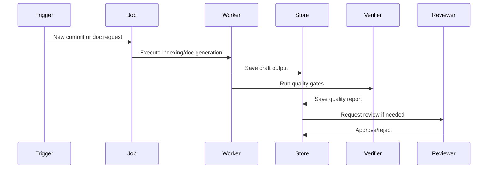

Write path harus idempotent, auditable, dan reviewable.

### 9.3 Why Separation Matters

Jika read dan write dicampur, kita akan mendapat masalah:

- query user memicu perubahan state yang tidak disengaja,
- agent tools menjadi terlalu berbahaya,
- audit sulit,
- retry menghasilkan duplicate output,
- permission check tidak konsisten.

Invariant:

```txt
Read tools must not mutate official knowledge state.
```

---

## 10. The Context Assembly Mental Model

Context assembly adalah pusat sistem AI.

LLM tidak langsung membaca database. LLM membaca context pack.

### 10.1 Context Pack as Deployment Artifact

Anggap context pack seperti deployment artifact untuk model.

Ia harus punya:

- input task,
- evidence,
- constraints,
- memory,
- token budget,
- source citations,
- rejected evidence,
- warnings,
- policy metadata.

```yaml
contextPackId: ctx_01J
purpose: documentation_generation
repositoryId: repo_order_service
commitSha: 6f41ab2
task: "Generate module docs for order validation"
budget:
  maxTokens: 12000
selectedEvidence:
  - ev_001
  - ev_002
  - ev_003
rejectedEvidence:
  - evidenceId: ev_099
    reason: "low relevance"
  - evidenceId: ev_100
    reason: "user lacks access"
constraints:
  - "Do not infer runtime behavior not present in evidence."
warnings:
  - "No runbook found for this module."
```

### 10.2 Context Assembly Steps

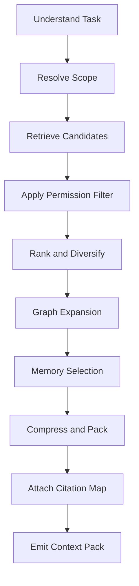

### 10.3 Context Is a Product

Context pack is not internal glue. It is a product surface.

Why?

1. agent quality depends on it,
2. audit depends on it,
3. cost depends on it,
4. security depends on it,
5. eval depends on it.

Jika context pack buruk, semua output downstream ikut buruk.

---

## 11. Freshness Mental Model

Freshness bukan timestamp saja.

Freshness menjawab:

```txt
Is this derived knowledge still valid for the source version being used?
```

### 11.1 Freshness Dimensions

| Dimension | Question |
|---|---|
| Source freshness | Apakah source evidence berubah? |
| Dependency freshness | Apakah dependency terkait berubah? |
| Doc freshness | Apakah generated doc lebih tua dari source? |
| Memory freshness | Apakah memory masih valid? |
| Index freshness | Apakah search index sesuai snapshot? |
| Runtime freshness | Apakah behavior runtime berubah tanpa code docs update? |

### 11.2 Invalidation Graph

Freshness dapat dimodelkan sebagai invalidation graph.

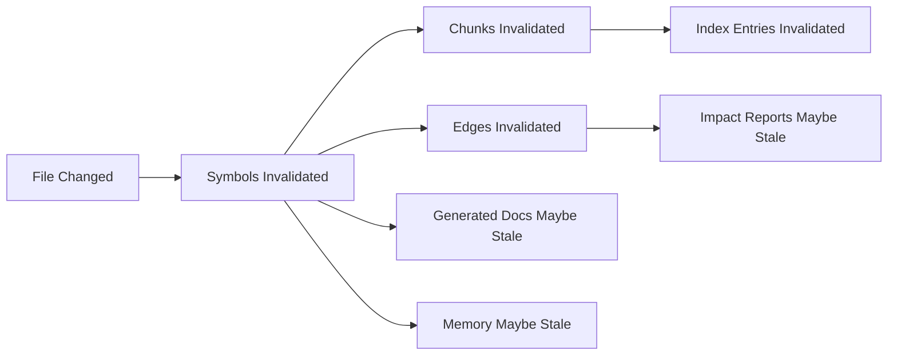

### 11.3 Invalidation Granularity

| Granularity | Pros | Cons |
|---|---|---|
| Repo-level | Simple | Reindex/regenerate terlalu banyak. |
| File-level | Reasonable MVP | Bisa miss symbol-level impact. |
| Symbol-level | Lebih presisi | Parser/resolver harus bagus. |
| Chunk-level | Efisien untuk retrieval | Perlu stable chunk identity. |
| Edge-level | Bagus untuk graph | Complexity tinggi. |

MVP bisa mulai file-level, tetapi data model harus siap symbol/chunk-level.

---

## 12. Trust Mental Model

Sistem ini akan menghasilkan teks yang tampak meyakinkan. Itu berbahaya jika trust tidak dimodelkan.

### 12.1 Trust Levels

| Level | Source | Treatment |
|---|---|---|
| L0 | Raw source code at commit | Highest technical evidence. |
| L1 | Parsed symbol/graph derived from source | Trusted if parser succeeded. |
| L2 | Existing docs with evidence | Useful but can be stale. |
| L3 | Generated docs verified by quality gates | Draft or reviewed artifact. |
| L4 | Active memory with evidence and review | Useful but must expire. |
| L5 | LLM inference without evidence | Must be marked uncertain or rejected. |

### 12.2 Claim Classification

Generated output should classify claims.

| Claim Type | Example | Evidence Needed |
|---|---|---|
| Direct code fact | `OrderValidator` calls `RuleRegistry`. | Source span/call edge. |
| Behavioral fact | Invalid order throws `ValidationException`. | Code + test. |
| Architectural claim | Validation is centralized. | Multiple source spans + docs. |
| Operational claim | Service retries failed events. | Config/runtime/runbook. |
| Recommendation | Add tests before changing rule. | Based on tests/convention. |
| Uncertainty | Retry behavior not found. | Evidence absence. |

### 12.3 Unsupported Claims

Unsupported claim bukan selalu bug. Kadang itu useful uncertainty.

Bad:

```md
The module retries failed validation using exponential backoff.
```

Better:

```md
The retrieved evidence does not show retry behavior for validation failures. The visible path throws `ValidationException` from `OrderValidator`.
```

---

## 13. Permission Mental Model

Permission adalah hal yang harus didesain dari awal.

Jika user tidak boleh membaca repo, user juga tidak boleh membaca:

- chunk hasil index repo,
- vector embedding metadata,
- generated docs dari repo,
- memory dari repo,
- graph edges dari repo,
- search snippets dari repo.

### 13.1 Derived Knowledge Inheritance

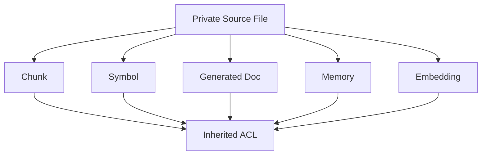

### 13.2 Permission Filtering Location

Permission filtering bisa dilakukan:

1. sebelum retrieval,
2. saat retrieval,
3. setelah retrieval.

Best practice: lakukan sedini mungkin dan tetap validasi setelahnya.

```txt
Candidate source set -> permission filter -> retrieval -> post-filter -> context assembly
```

Jangan melakukan vector search global lalu hanya menyembunyikan path. Snippet atau embedding-derived output bisa tetap membocorkan informasi.

### 13.3 Agent Permission

Agent tidak punya hak istimewa sendiri secara default.

```txt
Agent acts on behalf of a user or service identity.
```

Karena itu context assembly harus menerima identity:

```yaml
actor:
  type: user
  id: user_123
  teams:
    - team-order-platform
permissions:
  mode: inherited
```

---

## 14. System State Mental Model

Platform ini punya banyak state. State harus eksplisit.

### 14.1 State Categories

| State | Example |
|---|---|
| Source state | repo URL, branch, commit. |
| Ingestion state | scan status, file fingerprints. |
| Parse state | parse result, errors. |
| Index state | chunk index version. |
| Graph state | nodes/edges for snapshot. |
| Generated state | docs drafts, context packs. |
| Memory state | candidate/active/expired. |
| Review state | approved/rejected. |
| Eval state | quality scores. |
| Audit state | who did what when. |

### 14.2 Avoid Hidden State

Hidden state causes non-reproducible output.

Bad hidden state:

- latest branch implicitly used,
- prompt template changed but not recorded,
- model version changed but not recorded,
- memory selected but not logged,
- permissions evaluated but not stored,
- context compressed without citation map.

### 14.3 Run Record

Every important process should produce a `Run`.

```yaml
runId: run_docgen_20260702_001
kind: documentation_generation
actor: user_123
repositoryId: repo_order_service
snapshotId: snap_6f41ab2
startedAt: 2026-07-02T10:00:00Z
completedAt: 2026-07-02T10:01:23Z
inputs:
  docType: module_documentation
  targetPath: src/main/java/com/acme/order/validation
steps:
  - retrieve_evidence
  - assemble_context
  - generate_draft
  - verify_claims
outputs:
  docId: doc_123
  qualityReportId: qr_123
```

---

## 15. Cost Mental Model

AI systems fail not only from correctness issues, but also from cost explosion.

### 15.1 Cost Sources

| Cost | Driver |
|---|---|
| Git operations | repo size, frequency, network. |
| Parsing | file count, language complexity. |
| Embeddings | chunk count, reindex frequency. |
| Vector storage | chunk volume and dimensions. |
| LLM generation | context size and output length. |
| Reranking | candidate count. |
| Graph traversal | edge volume. |
| Observability | trace/log volume. |

### 15.2 Cost Control Principles

1. ignore irrelevant files early,
2. fingerprint files,
3. incremental parse,
4. stable chunk IDs,
5. embed only changed chunks,
6. cache context packs when valid,
7. cap retrieval candidates,
8. separate cheap verification from expensive generation,
9. batch jobs,
10. track cost per repo/team/run.

### 15.3 Cost Trace Example

```yaml
cost:
  gitFetchMs: 2300
  filesScanned: 1284
  filesParsed: 312
  chunksCreated: 944
  chunksEmbedded: 38
  retrievalCandidates: 120
  contextTokens: 10420
  outputTokens: 2100
  estimatedUsd: 0.18
```

---

## 16. Failure Mental Model

Top engineers model failure from the start.

### 16.1 Failure Taxonomy

| Layer | Failure |
|---|---|
| Git | clone failed, auth failed, branch missing. |
| Classification | generated/vendor file misclassified. |
| Parser | unsupported language, syntax error. |
| Symbol | unstable ID, missing symbols. |
| Graph | wrong edge, missing dependency. |
| Retrieval | irrelevant evidence, missing evidence. |
| Context | token overflow, permission leak. |
| Generation | hallucinated claim, style violation. |
| Verification | false pass, false fail. |
| Memory | stale, conflict, leak. |
| Job | retry duplicate, poison repo. |
| Storage | index inconsistency. |
| Security | secret leak, prompt injection. |

### 16.2 Graceful Degradation

Sistem harus bisa turun kualitas dengan aman.

| Failure | Safe Degradation |
|---|---|
| Parser fails | Use lexical fallback and mark confidence low. |
| Vector index unavailable | Use lexical search. |
| Graph unavailable | Generate docs with local evidence only. |
| Memory unavailable | Continue without memory. |
| Verification fails | Mark output draft blocked. |
| Permission uncertain | Deny by default. |
| Secret detected | Exclude from context and raise warning. |

### 16.3 Poison Repository

Poison repository adalah repo yang menyebabkan pipeline gagal berulang.

Penyebab:

- sangat besar,
- file binary besar,
- generated files banyak,
- parser crash,
- malicious content,
- corrupt encoding,
- path aneh,
- symlink loop.

Mitigation:

- file size cap,
- timeout,
- retry budget,
- quarantine state,
- per-repo circuit breaker,
- partial indexing.

---

## 17. Feedback Loop Mental Model

Platform ini harus belajar dari evaluasi, bukan dari asumsi.

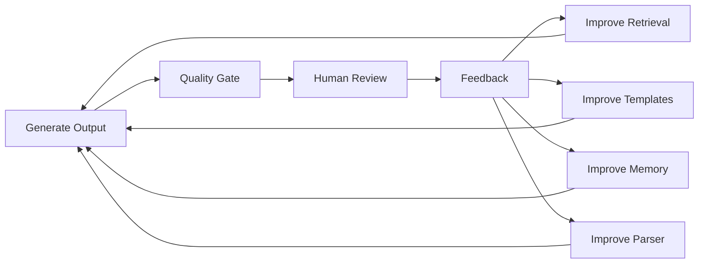

### 17.1 Feedback Types

| Feedback | Use |
|---|---|
| Human edit | Improve doc template and retrieval. |
| Rejected claim | Improve verification. |
| Missing evidence | Improve retriever/graph. |
| Stale memory | Improve invalidation. |
| Agent failed task | Improve context assembly. |
| High cost | Improve chunking/caching. |

### 17.2 Do Not Fine-Tune Too Early

Jika docs buruk, jangan langsung fine-tune.

Cek dulu:

1. Apakah evidence benar?
2. Apakah retrieval menemukan file relevan?
3. Apakah context pack terlalu besar?
4. Apakah prompt/template jelas?
5. Apakah output punya quality gate?
6. Apakah model diberi task yang ambiguous?

Seringkali masalahnya ada di pipeline, bukan model.

---

## 18. End-to-End Example

Kita ambil scenario:

```txt
Generate module documentation for order validation.
```

### 18.1 Input

```yaml
repository: order-service
branch: main
commit: 6f41ab2
targetPath: src/main/java/com/acme/order/validation
docType: module_documentation
audience: backend_engineer
```

### 18.2 Evidence Discovery

Sistem menemukan:

```txt
src/main/java/com/acme/order/validation/OrderValidator.java
src/main/java/com/acme/order/validation/RuleRegistry.java
src/main/java/com/acme/order/validation/rules/CreditLimitRule.java
src/test/java/com/acme/order/validation/OrderValidatorTest.java
docs/adr/012-validation-rules.md
```

### 18.3 Graph Relations

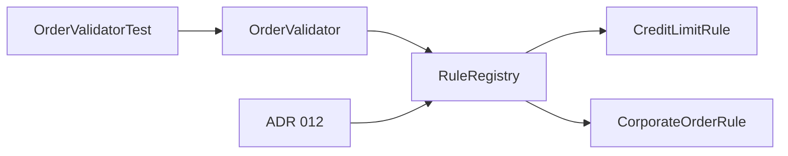

### 18.4 Context Pack

```yaml
evidence:
  - path: OrderValidator.java
    reason: primary entry point
  - path: RuleRegistry.java
    reason: rule registration
  - path: OrderValidatorTest.java
    reason: expected behavior
  - path: ADR-012-validation-rules.md
    reason: architecture decision
warnings:
  - no runbook found
  - no explicit retry behavior found
```

### 18.5 Generated Doc Claim

Claim:

```txt
Validation rules are centralized through RuleRegistry.
```

Evidence:

```yaml
- RuleRegistry.java:10-92
- OrderValidator.java:31-57
- ADR-012-validation-rules.md:12-34
```

### 18.6 Memory Candidate

```yaml
statement: "Validation rules are centralized through RuleRegistry."
scope: repository:order-service
evidence:
  - RuleRegistry.java:10-92
confidence: 0.86
expiresWhen:
  - fileChanged: RuleRegistry.java
  - symbolDeleted: RuleRegistry
```

---

## 19. Design Smells

Gunakan daftar ini untuk mendeteksi desain yang mulai salah.

### 19.1 Evidence Smells

- output tidak punya source path,
- docs tidak menyimpan commit SHA,
- generated claim tidak bisa dilacak,
- memory tidak punya evidence,
- graph edge tidak punya confidence.

### 19.2 Retrieval Smells

- selalu top-k vector tanpa reranking,
- exact symbol search tidak ada,
- permission filter dilakukan setelah model generate,
- context pack berisi terlalu banyak file,
- source docs lama lebih dominan daripada code terbaru.

### 19.3 Architecture Smells

- parser langsung memanggil LLM,
- job tidak idempotent,
- indexing selalu full scan,
- core domain tergantung GitHub-specific object,
- memory aktif tanpa review atau expiry.

### 19.4 Security Smells

- agent diberi semua tools,
- generated docs public by default,
- secret hanya difilter di output, bukan sebelum context,
- embedding global tidak punya ACL,
- repo content dianggap trusted instruction.

---

## 20. Practical Exercise

Sebelum lanjut ke Part 004, buat mental model untuk satu repository nyata.

### 20.1 Pilih Target

Pilih satu repository dan isi:

```yaml
repository: ...
primaryLanguage: ...
mainEntryPoints:
  - ...
importantModules:
  - ...
docs:
  - README.md
  - docs/...
config:
  - ...
tests:
  - ...
ownership:
  - ...
```

### 20.2 Tulis Evidence Map

```md
## Evidence Map

| Evidence | Path | Purpose | Reliability |
|---|---|---|---|
| Source | `src/...` | implementation | high |
| Tests | `test/...` | expected behavior | high-medium |
| README | `README.md` | onboarding | medium |
| ADR | `docs/adr/...` | decisions | medium |
```

### 20.3 Tulis Graph Candidate

```md
## Candidate Graph Nodes

- repository
- files
- packages
- classes/functions
- endpoints
- tables
- docs
- owners

## Candidate Graph Edges

- contains
- imports
- calls
- tests
- documents
- owned_by
```

### 20.4 Tulis Projection Plan

```md
## Projection Plan

Human docs:
- repository overview
- module docs
- runbook

Agent context:
- task context for code modification
- relevant files and tests
- constraints

Memory:
- repo conventions
- known pitfalls
- architecture decisions
```

---

## 21. Ringkasan

Mental model sistem ini:

1. repository adalah evidence database yang versioned,
2. code harus dipahami sebagai graph,
3. documentation adalah projection dari evidence,
4. memory adalah derived knowledge yang punya lifecycle,
5. context assembly adalah pusat kualitas AI,
6. permission diwariskan dari source,
7. freshness harus eksplisit,
8. read path dan write path harus dipisah,
9. setiap output penting harus bisa diaudit,
10. evaluasi adalah feedback loop utama.

Part berikutnya akan masuk ke fondasi implementasi pertama: **Repository Ingestion Pipeline**. Kita akan membahas clone/fetch, snapshot, branch, commit, monorepo/polyrepo, incremental sync, file fingerprint, job lifecycle, dan failure handling.
