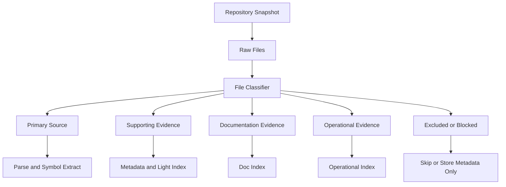
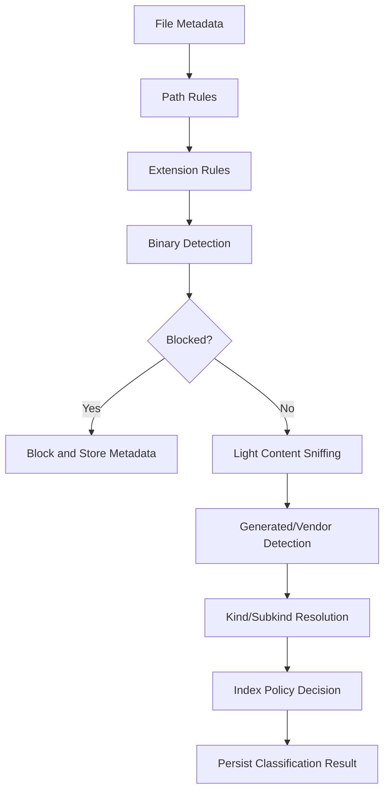
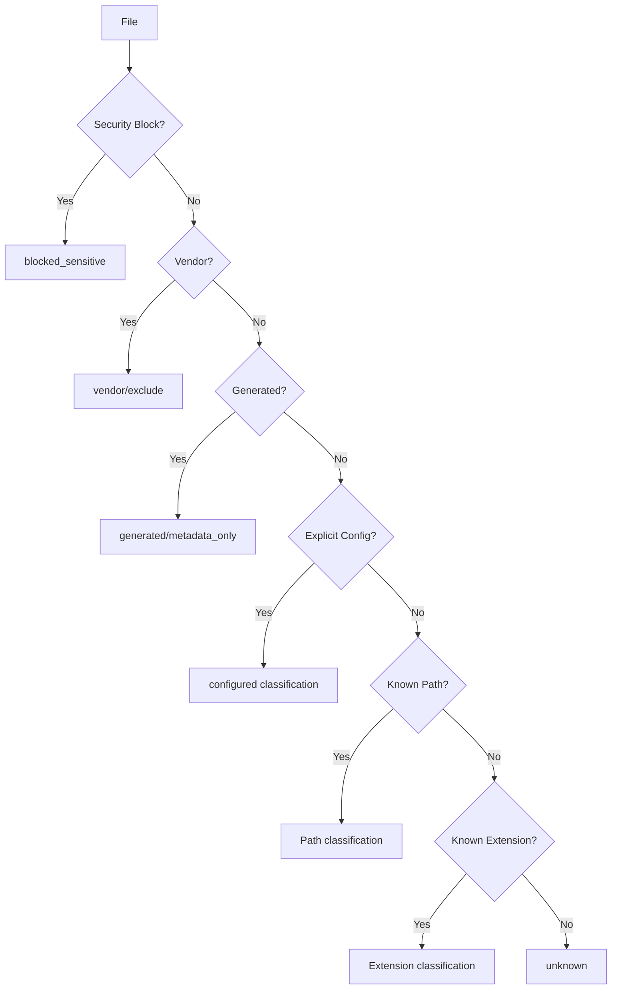

------
title: Learn AI Code Documentation & Agent Memory Platform - Part 005
description: Strategi file classification dan source boundary untuk membangun repository intelligence yang aman, akurat, incremental, dan tidak penuh noise.
series: learn-ai-code-documentation-agent-memory
seriesTitle: Learn AI Code Documentation & Agent Memory Platform
order: 5
partTitle: File Classification and Source Boundaries
tags:
- ai
- code-intelligence
- repository-analysis
- file-classification
- source-boundary
- documentation
- agent-memory
date: 2026-07-02
---

# Part 005 — File Classification and Source Boundaries

## 1. Tujuan Part Ini

Setelah repository berhasil di-ingest, masalah berikutnya adalah menentukan **file mana yang layak menjadi knowledge source**.

Ini terdengar sederhana, tetapi di sistem AI code documentation dan agent memory, kesalahan file classification akan merusak seluruh pipeline:

- generated code dianggap sebagai source of truth,
- dependency folder ikut diindeks,
- secrets masuk ke context,
- binary file menghabiskan resource,
- docs lama dianggap valid,
- test fixture dianggap business logic,
- file build output dianggap source,
- vendored code membuat retrieval noise,
- agent diberi context yang salah.

Part ini membahas cara membangun **file classification layer** dan **source boundary model**.

Targetnya:

1. memahami jenis file dalam repository,
2. mendesain taxonomy file yang berguna untuk retrieval/docs/memory,
3. membedakan source, generated, vendor, docs, config, test, infra, schema, migration, asset,
4. membuat policy mana yang diindeks, diringkas, diblokir, atau hanya disimpan metadata,
5. mendesain classifier yang deterministic, explainable, dan bisa diubah,
6. menghubungkan classification ke security, cost, retrieval, dan freshness.

---

## 2. Kenapa File Classification Sangat Penting

Repository modern bukan hanya source code.

Satu repository bisa berisi:

```txt
src/
test/
docs/
dist/
build/
target/
node_modules/
vendor/
migrations/
schemas/
openapi/
helm/
k8s/
terraform/
.github/
README.md
Dockerfile
package-lock.json
generated/
fixtures/
assets/
```

Jika semua file diperlakukan sama, sistem akan gagal.

### 2.1 Failure Mode Jika Tidak Ada Classification

| Failure | Contoh | Dampak |
|---|---|---|
| Noise tinggi | `node_modules` ikut masuk index | Search buruk, cost besar |
| Hallucinated docs | generated client dianggap business logic | Docs misleading |
| Secret leakage | `.env` masuk context agent | Security incident |
| Wrong ownership | vendored library dianggap milik tim | Ownership graph salah |
| Stale knowledge | docs lama tidak diberi freshness risk | Human/agent percaya knowledge salah |
| Cost explosion | lockfile besar di-embed | Token/embedding cost besar |
| Bad ranking | test fixture mengalahkan source utama | Retrieval tidak relevan |
| Parser failure | binary/minified file diparse | Worker lambat/gagal |

File classification adalah filter kualitas paling awal.

---

## 3. Mental Model: Repository sebagai Evidence Lake

Anggap repository sebagai **evidence lake**.

Tidak semua evidence punya nilai yang sama.



Kita tidak hanya bertanya:

> "File ini bahasa apa?"

Tapi juga:

> "File ini boleh digunakan untuk claim apa?"

Contoh:

| File | Boleh Mendukung Claim? | Catatan |
|---|---:|---|
| `OrderService.java` | Ya | Primary source |
| `OrderServiceTest.java` | Ya, untuk behavior/test expectation | Supporting source |
| `README.md` | Ya, tapi bisa stale | Documentation source |
| `openapi.yaml` | Ya, untuk API contract | Contract source |
| `target/generated-sources/...` | Biasanya tidak | Generated |
| `.env` | Tidak | Sensitive |
| `package-lock.json` | Terbatas | Dependency metadata, bukan docs naratif |
| `node_modules/...` | Tidak | Vendor/dependency |
| `dist/app.min.js` | Tidak | Build artifact |

---

## 4. Source Boundary

**Source boundary** adalah aturan tentang file mana yang dianggap sebagai sumber knowledge untuk suatu tujuan.

Boundary berbeda tergantung output.

### 4.1 Boundary untuk Human Documentation

Human documentation boleh menggunakan:

- source code utama,
- tests,
- README,
- ADR,
- OpenAPI specs,
- database migrations,
- config penting,
- deployment manifests,
- runbooks.

Tetapi harus hati-hati dengan:

- generated code,
- old docs,
- sample code,
- fixtures,
- vendored code,
- minified assets.

### 4.2 Boundary untuk Agent Context

Agent context harus lebih ketat.

Agent context boleh berisi:

- relevant source code,
- relevant tests,
- relevant contracts,
- current docs,
- current memory,
- constraints,
- nearby graph neighbors.

Agent context harus menghindari:

- secrets,
- huge lockfiles,
- irrelevant docs,
- generated artifacts,
- third-party code,
- stale memory,
- files outside permission scope.

### 4.3 Boundary untuk Agent Memory

Memory harus paling ketat.

Memory hanya boleh dibuat dari source yang:

1. punya evidence jelas,
2. bukan secret,
3. bukan generated noise,
4. punya scope,
5. bisa di-invalidate saat source berubah,
6. tidak berasal dari unreliable summary tanpa provenance.

Buruk:

```yaml
statement: "Billing service seems to use Stripe internally."
evidence:
  - path: README.md
confidence: 0.35
```

Lebih baik:

```yaml
statement: "Billing service creates Stripe payment intents in StripePaymentGateway."
evidence:
  - path: src/main/java/com/acme/billing/StripePaymentGateway.java
    lines: [18, 91]
confidence: 0.88
expiresWhen:
  - symbolChanged: com.acme.billing.StripePaymentGateway
```

---

## 5. File Taxonomy

Kita butuh taxonomy yang cukup detail tetapi tidak terlalu rumit.

### 5.1 Top-Level File Kind

| Kind | Arti |
|---|---|
| `source` | Source code utama |
| `test` | Test code |
| `documentation` | README, ADR, docs, markdown |
| `contract` | OpenAPI, AsyncAPI, protobuf, Avro, GraphQL schema |
| `schema` | DB schema, migration, JSON schema |
| `configuration` | app config, build config, framework config |
| `infrastructure` | Docker, Kubernetes, Terraform, Helm |
| `ci_cd` | GitHub Actions, GitLab CI, Jenkinsfile |
| `dependency_manifest` | pom.xml, package.json, go.mod, requirements.txt |
| `lockfile` | package-lock, yarn.lock, go.sum |
| `generated` | generated source/artifact |
| `vendor` | third-party vendored source |
| `asset` | image, css, static asset |
| `binary` | binary files |
| `secret_candidate` | file/path likely sensitive |
| `unknown` | tidak bisa diklasifikasi |

### 5.2 Subkind

Top-level kind saja tidak cukup. Tambahkan `subkind`.

Contoh:

```yaml
kind: documentation
subkind: adr
```

```yaml
kind: contract
subkind: openapi
```

```yaml
kind: infrastructure
subkind: kubernetes_manifest
```

```yaml
kind: configuration
subkind: spring_boot_config
```

```yaml
kind: source
subkind: java_application_code
```

### 5.3 Role dalam Knowledge

Selain kind, simpan `knowledgeRole`.

| Role | Arti |
|---|---|
| `primary_evidence` | Bisa mendukung claim utama |
| `supporting_evidence` | Mendukung claim terbatas |
| `operational_evidence` | Berguna untuk deployment/ops |
| `contract_evidence` | Berguna untuk API/schema claims |
| `metadata_only` | Simpan metadata, tidak masuk content index |
| `excluded` | Tidak diproses |
| `blocked_sensitive` | Diblokir karena security |

Contoh:

```yaml
path: src/main/java/com/acme/order/OrderService.java
kind: source
subkind: java_application_code
knowledgeRole: primary_evidence
indexPolicy: parse_and_index
```

```yaml
path: package-lock.json
kind: lockfile
subkind: npm_lockfile
knowledgeRole: metadata_only
indexPolicy: metadata_only
```

```yaml
path: .env
kind: secret_candidate
subkind: env_file
knowledgeRole: blocked_sensitive
indexPolicy: blocked
```

---

## 6. Index Policy

Classification harus menghasilkan keputusan operasional.

### 6.1 Policy Utama

| Policy | Arti |
|---|---|
| `parse_and_index` | Parse structurally, extract symbols, index chunks |
| `index_text` | Index text, tidak parse as code |
| `index_metadata_only` | Simpan metadata, tidak simpan content |
| `summarize_only` | Boleh dibuat summary terbatas |
| `exclude` | Skip |
| `block` | Jangan baca content; flag security |

### 6.2 Policy by Kind

| Kind | Default Policy | Catatan |
|---|---|---|
| `source` | `parse_and_index` | Kecuali generated/vendor |
| `test` | `parse_and_index` | Important for behavior |
| `documentation` | `index_text` | Perlu stale detection |
| `contract` | `parse_and_index` atau `index_text` | Bisa punya parser khusus |
| `schema` | `parse_and_index` atau `index_text` | Migration penting untuk data docs |
| `configuration` | `index_text` | Redact sensitive values |
| `infrastructure` | `index_text` | Berguna untuk deployment docs |
| `ci_cd` | `index_text` | Berguna untuk lifecycle docs |
| `dependency_manifest` | `index_text` | Berguna untuk stack/dependency |
| `lockfile` | `index_metadata_only` | Biasanya terlalu noisy |
| `generated` | `index_metadata_only` atau `exclude` | Jangan jadi primary evidence |
| `vendor` | `exclude` | Biasanya bukan source ownership |
| `asset` | `index_metadata_only` | Kecuali docs asset |
| `binary` | `index_metadata_only` | Jangan parse |
| `secret_candidate` | `block` | Jangan masuk context |
| `unknown` | `index_metadata_only` atau `exclude` | Tergantung policy |

---

## 7. Classification Signals

Classifier harus menggabungkan beberapa sinyal.

### 7.1 Path Signal

Path sangat kuat.

Contoh pattern:

```yaml
generated:
  - "**/generated/**"
  - "**/target/generated-sources/**"
  - "**/build/generated/**"
  - "**/.openapi-generator/**"

vendor:
  - "**/vendor/**"
  - "**/third_party/**"
  - "**/node_modules/**"

test:
  - "**/test/**"
  - "**/tests/**"
  - "**/__tests__/**"
  - "**/*Test.java"
  - "**/*.spec.ts"
  - "**/*.test.ts"

documentation:
  - "README.md"
  - "docs/**"
  - "**/*.md"
  - "**/*.mdx"
  - "**/adr/**"

ci_cd:
  - ".github/workflows/**"
  - ".gitlab-ci.yml"
  - "Jenkinsfile"

secret_candidate:
  - ".env"
  - ".env.*"
  - "**/secrets/**"
  - "**/*secret*"
  - "**/*credential*"
```

### 7.2 Extension Signal

| Extension | Candidate |
|---|---|
| `.java` | Java source |
| `.kt` | Kotlin source |
| `.go` | Go source |
| `.py` | Python source |
| `.ts` / `.tsx` | TypeScript |
| `.js` / `.jsx` | JavaScript |
| `.md` / `.mdx` | Documentation |
| `.yaml` / `.yml` | Config/contract/infra |
| `.json` | Config/schema/manifest |
| `.proto` | Protobuf contract |
| `.graphql` | GraphQL schema |
| `.sql` | DB migration/schema |
| `.tf` | Terraform |
| `.Dockerfile` / `Dockerfile` | Container build |
| `.png` / `.jpg` | Asset |
| `.jar` / `.zip` | Binary/artifact |

Extension saja tidak cukup. `yaml` bisa berarti:

- Kubernetes manifest,
- OpenAPI spec,
- GitHub Actions,
- Helm values,
- Spring config,
- generic config.

### 7.3 Content Signal

Content bisa mengidentifikasi subkind.

Contoh YAML:

```yaml
openapi: 3.0.3
info:
  title: Order API
```

=> `contract/openapi`

```yaml
apiVersion: apps/v1
kind: Deployment
metadata:
  name: order-service
```

=> `infrastructure/kubernetes_manifest`

```yaml
spring:
  datasource:
    url: jdbc:postgresql://...
```

=> `configuration/spring_boot_config`

### 7.4 Size Signal

File terlalu besar biasanya perlu special handling.

| Size | Treatment |
|---:|---|
| `< 256 KB` | Normal |
| `256 KB - 2 MB` | Chunk carefully |
| `2 MB - 10 MB` | Metadata + selective processing |
| `> 10 MB` | Metadata only by default |

Ukuran bukan aturan mutlak. File OpenAPI bisa besar tetapi penting. Lockfile bisa besar dan tidak cocok untuk semantic embedding.

### 7.5 Entropy dan Binary Signal

Binary detection penting.

Sinyal:

- contains null bytes,
- invalid UTF-8 ratio tinggi,
- high entropy,
- known binary extension,
- magic bytes.

Policy:

```txt
binary => metadata_only
```

Jangan mencoba parse binary sebagai text.

### 7.6 Generated Signal

Generated code bisa terdeteksi dari:

- path,
- file header,
- annotation,
- comments,
- tool markers.

Contoh marker:

```txt
// Code generated by ...
// <auto-generated>
// Generated by OpenAPI Generator
// This file was automatically generated
```

Generated code tidak selalu harus diabaikan. Kadang generated API client penting untuk integration docs. Tetapi default-nya jangan jadikan primary source untuk domain behavior.

---

## 8. Classification Result Schema

Buat classification result eksplisit.

```yaml
fileId: file_01J...
path: src/main/java/com/acme/order/OrderService.java
language: java
kind: source
subkind: java_application_code
knowledgeRole: primary_evidence
indexPolicy: parse_and_index
confidence: 0.96
signals:
  path:
    - "matches src/main/java/**"
  extension:
    - ".java"
  content:
    - "contains package declaration"
risk:
  sensitive: false
  generated: false
  vendor: false
  large: false
```

Contoh generated:

```yaml
fileId: file_01J...
path: target/generated-sources/openapi/src/main/java/com/acme/api/OrdersApi.java
language: java
kind: generated
subkind: openapi_generated_client
knowledgeRole: metadata_only
indexPolicy: index_metadata_only
confidence: 0.98
signals:
  path:
    - "matches **/generated-sources/**"
  content:
    - "contains Generated by OpenAPI Generator"
risk:
  sensitive: false
  generated: true
  vendor: false
  large: false
```

Contoh secret candidate:

```yaml
fileId: file_01J...
path: .env.production
language: dotenv
kind: secret_candidate
subkind: env_file
knowledgeRole: blocked_sensitive
indexPolicy: block
confidence: 0.99
signals:
  path:
    - "matches .env.*"
risk:
  sensitive: true
  generated: false
  vendor: false
  large: false
```

---

## 9. Classification Pipeline



### 9.1 Step 1 — Metadata

Input:

- path,
- file name,
- extension,
- size,
- executable bit,
- symlink info,
- sha256,
- last commit metadata.

### 9.2 Step 2 — Path Rules

Path rules cepat dan deterministic.

Gunakan ordered rules.

```yaml
rules:
  - id: block-env-files
    when:
      pathMatches:
        - ".env"
        - ".env.*"
    set:
      kind: secret_candidate
      indexPolicy: block
      priority: 1000

  - id: exclude-node-modules
    when:
      pathMatches:
        - "**/node_modules/**"
    set:
      kind: vendor
      indexPolicy: exclude
      priority: 900
```

### 9.3 Step 3 — Binary Detection

Jangan baca seluruh file besar. Ambil sample awal.

Pseudo-code:

```java
boolean looksBinary(byte[] sample) {
    int nullBytes = 0;
    int controlBytes = 0;

    for (byte b : sample) {
        int value = b & 0xff;
        if (value == 0) nullBytes++;
        if (value < 9 || (value > 13 && value < 32)) controlBytes++;
    }

    double nullRatio = nullBytes / (double) sample.length;
    double controlRatio = controlBytes / (double) sample.length;

    return nullRatio > 0.01 || controlRatio > 0.30;
}
```

### 9.4 Step 4 — Content Sniffing

Content sniffing harus ringan.

Jangan parse penuh di classifier. Parser penuh dilakukan setelah policy memutuskan file layak diproses.

Contoh sniff:

```java
record ContentSignals(
    boolean hasPackageDeclaration,
    boolean hasOpenApiRoot,
    boolean hasKubernetesApiVersion,
    boolean hasGeneratedMarker,
    boolean hasSecretLikeAssignment
) {}
```

### 9.5 Step 5 — Policy Decision

Policy decision menggabungkan:

1. kind,
2. subkind,
3. risk,
4. size,
5. repository settings,
6. tenant settings,
7. user override.

---

## 10. Rule Precedence

Classifier butuh precedence jelas.

Saran precedence:

1. explicit block rules,
2. security-sensitive rules,
3. vendor/dependency exclusion,
4. generated detection,
5. explicit repository config,
6. path conventions,
7. extension/language detection,
8. content sniffing,
9. fallback unknown.



Kenapa security paling atas?

Karena `.env.generated` tetap sensitive jika berisi secret. Jangan biarkan generated classification menurunkan severity.

---

## 11. Repository-Level Config

Tidak semua repository mengikuti convention yang sama.

Sediakan config file opsional:

```yaml
# .ai-docs.yml
classification:
  include:
    - "src/**"
    - "docs/**"
    - "openapi/**"
  exclude:
    - "src/generated/**"
    - "fixtures/large/**"
  sourceRoots:
    - "src/main/java"
    - "src/main/kotlin"
  testRoots:
    - "src/test/java"
  docsRoots:
    - "docs"
    - "adr"
  generatedRoots:
    - "target/generated-sources"
  sensitive:
    - "config/prod/**"
    - "**/*.pem"
```

### 11.1 Config Tidak Boleh Mengalahkan Security

Jika repo config bilang include `.env`, sistem tetap harus block.

```txt
security block > repository config
```

### 11.2 Config Harus Diaudit

Perubahan config bisa mengubah apa yang diindeks.

Simpan:

- config file path,
- commit,
- applied rules,
- classifier version.

---

## 12. Handling Common Repository Types

### 12.1 Java Maven/Gradle Repository

Typical paths:

```txt
src/main/java
src/main/kotlin
src/main/resources
src/test/java
pom.xml
build.gradle
target/
```

Policy:

| Path | Kind | Policy |
|---|---|---|
| `src/main/java/**` | source | parse_and_index |
| `src/test/java/**` | test | parse_and_index |
| `src/main/resources/application*.yml` | configuration | index_text with redaction |
| `pom.xml` | dependency_manifest | index_text |
| `target/**` | generated/build artifact | exclude or metadata_only |

### 12.2 Node/TypeScript Repository

Typical paths:

```txt
src/
test/
__tests__/
dist/
node_modules/
package.json
package-lock.json
tsconfig.json
```

Policy:

| Path | Kind | Policy |
|---|---|---|
| `src/**/*.ts` | source | parse_and_index |
| `*.test.ts`, `*.spec.ts` | test | parse_and_index |
| `package.json` | dependency_manifest | index_text |
| `package-lock.json` | lockfile | metadata_only |
| `node_modules/**` | vendor | exclude |
| `dist/**` | generated/build artifact | metadata_only/exclude |

### 12.3 Go Repository

Typical paths:

```txt
cmd/
internal/
pkg/
go.mod
go.sum
*_test.go
vendor/
```

Policy:

| Path | Kind | Policy |
|---|---|---|
| `cmd/**`, `internal/**`, `pkg/**` | source | parse_and_index |
| `*_test.go` | test | parse_and_index |
| `go.mod` | dependency_manifest | index_text |
| `go.sum` | lockfile | metadata_only |
| `vendor/**` | vendor | exclude |

### 12.4 Python Repository

Typical paths:

```txt
src/
tests/
requirements.txt
pyproject.toml
venv/
.venv/
```

Policy:

| Path | Kind | Policy |
|---|---|---|
| `src/**/*.py` | source | parse_and_index |
| `tests/**/*.py` | test | parse_and_index |
| `pyproject.toml` | dependency_manifest/configuration | index_text |
| `requirements.txt` | dependency_manifest | index_text |
| `venv/**`, `.venv/**` | vendor/environment | exclude |

---

## 13. Docs Classification

Markdown bukan selalu dokumentasi valid.

### 13.1 Documentation Subkind

| Subkind | Detection |
|---|---|
| `readme` | `README.md` |
| `adr` | path contains `adr`, title contains decision |
| `runbook` | path/title contains runbook, operations, troubleshoot |
| `api_doc` | path contains api/docs, endpoint references |
| `onboarding` | title/path contains onboarding/getting-started |
| `changelog` | `CHANGELOG.md`, release notes |
| `architecture` | path/title contains architecture/design |
| `contributing` | `CONTRIBUTING.md` |
| `generated_doc` | frontmatter or marker from system |

### 13.2 Stale Risk

Docs should receive stale risk score.

Signals:

- last modified much older than source files,
- references symbol/path that no longer exists,
- describes API not found in contract,
- says "TODO/update later",
- no evidence/provenance,
- generated by old generator version.

Example:

```yaml
path: docs/order-validation.md
kind: documentation
subkind: module_doc
staleRisk:
  level: medium
  reasons:
    - "References OrderRuleEngine, symbol not found"
    - "Last updated before major changes in validation package"
```

---

## 14. Sensitive File Handling

Security is not optional.

### 14.1 Sensitive Path Patterns

Common sensitive files:

```txt
.env
.env.*
*.pem
*.key
*.p12
*.jks
id_rsa
credentials.json
secrets.yml
application-prod.yml
kubeconfig
```

But path is not enough.

### 14.2 Secret-Like Content

Content signals:

- API key patterns,
- private key blocks,
- password assignments,
- tokens,
- connection strings,
- cloud credentials.

Policy:

1. detect,
2. block or redact,
3. store metadata only,
4. add security finding,
5. never include raw value in generated docs/context/memory.

### 14.3 Redaction Strategy

For config files, you may index structure after redaction.

Input:

```yaml
spring:
  datasource:
    url: jdbc:postgresql://prod-db:5432/orders
    password: supersecret
```

Redacted:

```yaml
spring:
  datasource:
    url: <REDACTED_CONNECTION_STRING>
    password: <REDACTED_SECRET>
```

But do not blindly include production hostnames if policy says environment details are sensitive.

---

## 15. Generated Code Handling

Generated code is tricky.

### 15.1 Do Not Always Exclude

Generated code can be useful when:

- no source schema is available,
- generated API interfaces are used as entry points,
- generated protobuf classes define message shapes,
- generated OpenAPI stubs show route contracts.

But prefer original source:

| Generated Artifact | Prefer |
|---|---|
| OpenAPI generated Java client | `openapi.yaml` |
| Protobuf generated class | `.proto` |
| GraphQL generated types | `.graphql` schema |
| JPA generated metamodel | entity source |
| Minified JS bundle | original TS/JS source |

### 15.2 Generated Policy

Suggested:

```yaml
generated:
  defaultPolicy: metadata_only
  allowAsSupportingEvidence:
    - openapi_server_interface
    - protobuf_generated_when_proto_missing
  neverPrimaryEvidence:
    - minified_bundle
    - compiled_output
    - dependency_generated
```

### 15.3 Generated Marker

Store generated marker:

```yaml
generated:
  detected: true
  generator: openapi-generator
  marker: "Generated by OpenAPI Generator"
  sourceCandidate:
    path: openapi/order-api.yaml
```

This helps retrieval choose original contract instead of generated code.

---

## 16. Vendor and Third-Party Code

Vendored code should not become product knowledge.

### 16.1 Vendor Signals

Paths:

```txt
vendor/
third_party/
node_modules/
.venv/
externals/
```

Metadata:

- package manager directories,
- license headers,
- external dependency source,
- submodule markers.

### 16.2 Why Exclude Vendor

Because it:

- increases index size,
- confuses ownership,
- pollutes graph,
- can expose licenses/security issues beyond scope,
- makes docs explain libraries instead of product code.

### 16.3 Exception

If repository intentionally vendors critical code that is modified by team, allow override:

```yaml
classification:
  vendorOverrides:
    - path: third_party/custom-rule-engine/**
      treatAs: source
      reason: "Internally modified fork used as product logic"
```

Require explicit reason.

---

## 17. Classification for Tests and Fixtures

Tests are valuable. Fixtures are mixed.

### 17.1 Tests as Supporting Evidence

Tests reveal behavior:

- expected errors,
- edge cases,
- examples,
- contracts,
- feature flags,
- regression scenarios.

Docs should cite tests for behavioral claims.

Example:

```md
Corporate orders require a tax ID. Evidence: `OrderValidatorTest.shouldRejectCorporateOrderWithoutTaxId`.
```

### 17.2 Fixtures

Fixtures can be:

- realistic examples,
- generated samples,
- large dumps,
- fake data,
- golden files.

Policy:

| Fixture Type | Policy |
|---|---|
| Small example fixture | index_text |
| Large JSON dump | metadata_only |
| Golden expected output | index_text if relevant |
| Sensitive-like fixture | redact/block |
| Generated fixture | metadata_only |

---

## 18. Classification for Contracts and Schemas

Contracts are high-value evidence.

### 18.1 API Contracts

Examples:

- OpenAPI,
- AsyncAPI,
- GraphQL,
- protobuf,
- gRPC service definition.

Use contracts for:

- endpoint docs,
- request/response schema,
- event docs,
- service boundary,
- backward compatibility.

### 18.2 Database Migrations

Migrations reveal:

- table names,
- columns,
- constraints,
- indexes,
- lifecycle changes.

But migration history can be long. Avoid embedding every migration blindly.

Strategy:

1. parse migration metadata,
2. extract table/column changes,
3. build schema timeline,
4. retrieve relevant migrations only.

### 18.3 Schema Evidence

Schema files are often more authoritative than docs.

If README says endpoint accepts field `customerId`, but OpenAPI says `accountId`, mark conflict.

---

## 19. Impact of Classification on Retrieval

Classification becomes ranking feature.

Example ranking boost:

```txt
score =
    lexical_score
  + exact_symbol_boost
  + source_kind_boost
  + path_relevance_boost
  + freshness_boost
  - generated_penalty
  - vendor_penalty
  - stale_doc_penalty
```

### 19.1 Retrieval Policy by Task

| Task | Preferred Evidence |
|---|---|
| Explain module | source, tests, README, ADR |
| Explain API | OpenAPI, controller, tests |
| Explain deployment | Dockerfile, k8s, Helm, CI |
| Explain data model | entity, migration, schema |
| Prepare agent code change | source, tests, memory, nearby symbols |
| Generate runbook | config, infra, CI, existing runbook |

---

## 20. Impact of Classification on Documentation

Documentation generator should know evidence type.

Example:

If evidence source is `source`, write:

```md
The validation entry point is `OrderValidator.validate`.
```

If evidence source is stale docs, write:

```md
Existing documentation mentions `OrderRuleEngine`, but no matching symbol was found in the indexed source. Treat this as potentially stale.
```

If evidence source is test:

```md
Tests indicate that corporate orders without tax IDs are rejected.
```

Do not give equal confidence to all evidence.

---

## 21. Impact of Classification on Memory

Memory should be created only from high-confidence evidence.

### 21.1 Memory Candidate Policy

Allow memory from:

- primary source,
- tests,
- contracts,
- reviewed docs,
- ADR.

Avoid memory from:

- unknown docs,
- stale docs,
- generated code,
- fixture,
- vendored code,
- low-confidence summary.

### 21.2 Memory Confidence

Example:

```yaml
confidence:
  base: 0.75
  modifiers:
    source_kind:
      source: +0.15
      test: +0.05
      stale_doc: -0.30
      generated: -0.20
    evidence_count:
      multiple_independent_sources: +0.10
```

---

## 22. Persisted Schema

### 22.1 Table: File Classification

```sql
CREATE TABLE file_classifications (
    file_id TEXT PRIMARY KEY,
    repository_id TEXT NOT NULL,
    snapshot_id TEXT NOT NULL,
    path TEXT NOT NULL,
    language TEXT,
    kind TEXT NOT NULL,
    subkind TEXT,
    knowledge_role TEXT NOT NULL,
    index_policy TEXT NOT NULL,
    confidence NUMERIC NOT NULL,
    is_sensitive BOOLEAN NOT NULL,
    is_generated BOOLEAN NOT NULL,
    is_vendor BOOLEAN NOT NULL,
    is_binary BOOLEAN NOT NULL,
    is_large BOOLEAN NOT NULL,
    classifier_version TEXT NOT NULL,
    created_at TIMESTAMP NOT NULL
);
```

### 22.2 Table: Classification Signals

```sql
CREATE TABLE file_classification_signals (
    id TEXT PRIMARY KEY,
    file_id TEXT NOT NULL,
    signal_type TEXT NOT NULL,
    signal_value TEXT NOT NULL,
    weight NUMERIC,
    created_at TIMESTAMP NOT NULL
);
```

### 22.3 Why Store Signals?

Because later we need to answer:

- kenapa file ini di-skip?
- kenapa file ini dianggap generated?
- kenapa docs ini stale?
- kenapa agent tidak menerima file ini sebagai context?

Explainability matters.

---

## 23. Classifier Design in Code

### 23.1 Domain Types

```java
public enum FileKind {
    SOURCE,
    TEST,
    DOCUMENTATION,
    CONTRACT,
    SCHEMA,
    CONFIGURATION,
    INFRASTRUCTURE,
    CI_CD,
    DEPENDENCY_MANIFEST,
    LOCKFILE,
    GENERATED,
    VENDOR,
    ASSET,
    BINARY,
    SECRET_CANDIDATE,
    UNKNOWN
}

public enum KnowledgeRole {
    PRIMARY_EVIDENCE,
    SUPPORTING_EVIDENCE,
    OPERATIONAL_EVIDENCE,
    CONTRACT_EVIDENCE,
    METADATA_ONLY,
    EXCLUDED,
    BLOCKED_SENSITIVE
}

public enum IndexPolicy {
    PARSE_AND_INDEX,
    INDEX_TEXT,
    INDEX_METADATA_ONLY,
    SUMMARIZE_ONLY,
    EXCLUDE,
    BLOCK
}
```

### 23.2 Classification Result

```java
public record FileClassification(
    String fileId,
    String path,
    String language,
    FileKind kind,
    String subkind,
    KnowledgeRole knowledgeRole,
    IndexPolicy indexPolicy,
    double confidence,
    RiskFlags risk,
    List<ClassificationSignal> signals,
    String classifierVersion
) {}

public record RiskFlags(
    boolean sensitive,
    boolean generated,
    boolean vendor,
    boolean binary,
    boolean large
) {}

public record ClassificationSignal(
    String type,
    String value,
    double weight
) {}
```

### 23.3 Classifier Interface

```java
public interface FileClassifier {
    FileClassification classify(FileMetadata metadata, ContentSample sample, ClassificationConfig config);
}
```

### 23.4 Rule-Based Implementation

```java
public final class RuleBasedFileClassifier implements FileClassifier {
    private final List<ClassificationRule> rules;

    public RuleBasedFileClassifier(List<ClassificationRule> rules) {
        this.rules = rules.stream()
            .sorted(Comparator.comparingInt(ClassificationRule::priority).reversed())
            .toList();
    }

    @Override
    public FileClassification classify(
            FileMetadata metadata,
            ContentSample sample,
            ClassificationConfig config
    ) {
        ClassificationBuilder builder = ClassificationBuilder.from(metadata);

        for (ClassificationRule rule : rules) {
            if (rule.matches(metadata, sample, config)) {
                rule.apply(builder);
                if (rule.terminal()) {
                    break;
                }
            }
        }

        return builder.finalizeDecision();
    }
}
```

---

## 24. Quality Tests for Classifier

Classifier must be tested like product logic.

### 24.1 Golden Fixtures

Create fixture repo:

```txt
fixtures/repo-classification/
  src/main/java/App.java
  src/test/java/AppTest.java
  docs/adr/001-use-postgres.md
  openapi/order.yaml
  target/generated-sources/ApiClient.java
  node_modules/lodash/index.js
  .env
  package-lock.json
  Dockerfile
  k8s/deployment.yaml
```

Expected results:

```yaml
- path: src/main/java/App.java
  kind: source
  indexPolicy: parse_and_index

- path: .env
  kind: secret_candidate
  indexPolicy: block

- path: node_modules/lodash/index.js
  kind: vendor
  indexPolicy: exclude
```

### 24.2 Regression Tests

Test cases:

- generated source under unusual path,
- docs under `src/docs`,
- OpenAPI YAML under root,
- Kubernetes YAML under `deploy`,
- `.env.example` should maybe be config/example, not always blocked,
- large markdown file,
- minified JS,
- symlink to sensitive file.

### 24.3 Metrics

Track:

| Metric | Why |
|---|---|
| files by kind | Understand repo shape |
| files blocked | Security visibility |
| files excluded | Cost/noise control |
| parseable files | Parser workload |
| unknown files | Classifier improvement |
| generated ratio | Identify codegen-heavy repos |

---

## 25. Edge Cases

### 25.1 `.env.example`

`.env.example` may be safe if values are placeholders.

But do not assume.

Policy:

- inspect content,
- redact secret-like values,
- classify as `configuration/example_env`,
- never treat as secret source of truth.

### 25.2 Minified JavaScript

Minified JS should be excluded or metadata-only.

Signals:

- very long lines,
- low whitespace ratio,
- `.min.js`,
- source map reference.

### 25.3 Symlinks

Symlinks can point outside repository.

Policy:

- record symlink,
- do not follow symlink outside allowed root by default,
- resolve safely,
- prevent path traversal.

### 25.4 Git Submodules

Submodules are separate repositories.

Do not silently merge identity.

Policy:

```yaml
submodule:
  treatAs: external_repository
  indexPolicy: depends_on_permission
```

### 25.5 Monorepo Packages

A monorepo may contain many logical projects.

Classification should detect source roots per package:

```txt
services/order-service/src
services/billing-service/src
libs/common/src
```

Store package/module boundary separately.

---

## 26. Practical Exercise

Build a file classifier for one repository.

### 26.1 Input

Generate file inventory:

```json
[
  {
    "path": "src/main/java/com/acme/order/OrderService.java",
    "sizeBytes": 4210,
    "sha256": "..."
  }
]
```

### 26.2 Output

Produce:

```json
[
  {
    "path": "src/main/java/com/acme/order/OrderService.java",
    "kind": "source",
    "subkind": "java_application_code",
    "knowledgeRole": "primary_evidence",
    "indexPolicy": "parse_and_index",
    "confidence": 0.96
  }
]
```

### 26.3 Acceptance Criteria

- `.env` is blocked,
- generated code is not primary evidence,
- tests are supporting evidence,
- README is documentation,
- OpenAPI is contract,
- lockfile is metadata only,
- unknown files are reported,
- every decision has reason signals.

---

## 27. Common Mistakes

### 27.1 Treating Extension as Truth

`.yaml` is not enough. It can be config, Kubernetes, OpenAPI, Helm, CI, or arbitrary data.

### 27.2 Indexing Everything

More content does not mean better retrieval. Noise destroys precision.

### 27.3 Ignoring Generated Code

Generated code can dominate Java/TypeScript repos. If indexed as primary source, docs become tool-centric instead of domain-centric.

### 27.4 Blocking Too Aggressively

If `.env.example` is always blocked, agent may miss required config variables. Better: redact and classify carefully.

### 27.5 No Explainability

When users ask "why did the system ignore this file?", you need stored signals.

---

## 28. Summary

File classification is not a preprocessing detail. It is a core architecture layer.

Key points:

1. repository contains many kinds of evidence,
2. not all files should be parsed or embedded,
3. classification affects retrieval, docs, memory, security, and cost,
4. source boundary must be explicit per use case,
5. generated/vendor/sensitive/large files need special handling,
6. classification must be deterministic and explainable,
7. policy result should drive downstream processing,
8. every classification decision should be persisted with signals.

Part berikutnya membahas **Language Detection and Parser Strategy**: bagaimana menentukan bahasa file, memilih parser, menangani parser failure, dan membangun strategi multi-language yang realistis.
