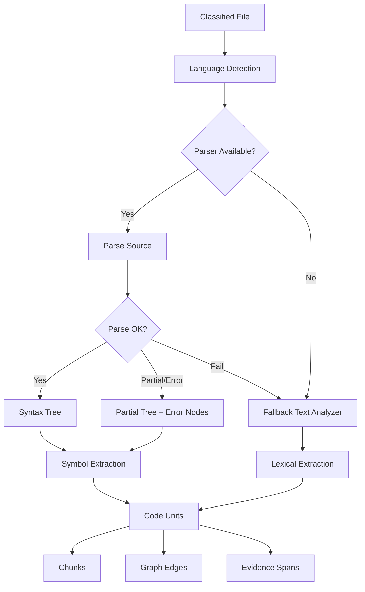
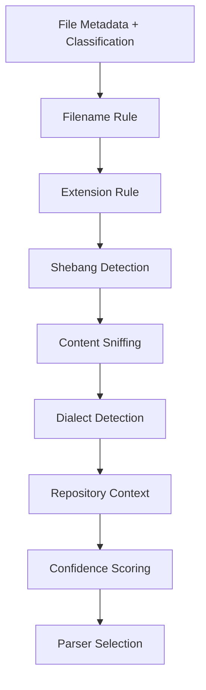
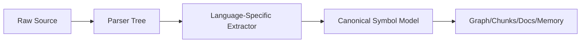
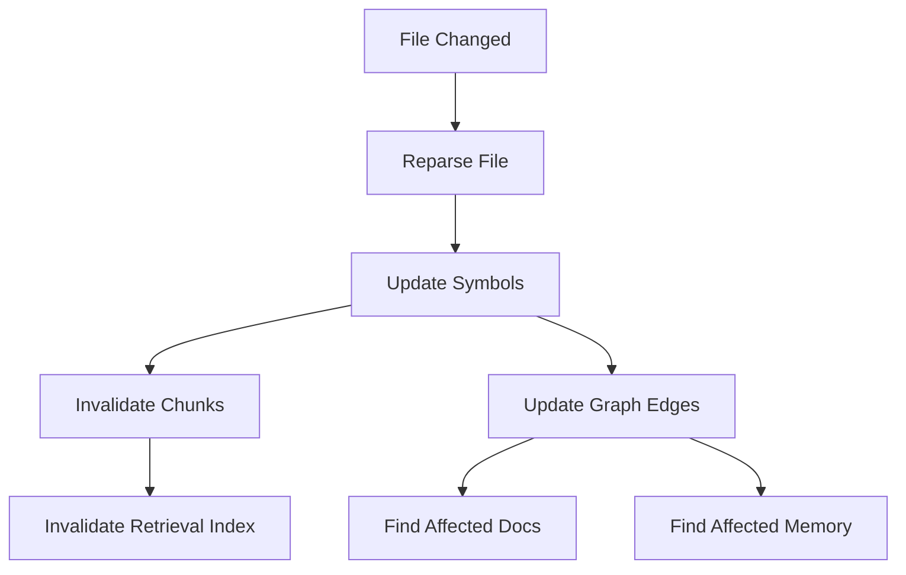

------
title: Learn AI Code Documentation & Agent Memory Platform - Part 006
description: Strategi language detection dan parser untuk membangun code intelligence multi-language yang stabil, incremental, dan tahan failure.
series: learn-ai-code-documentation-agent-memory
seriesTitle: Learn AI Code Documentation & Agent Memory Platform
order: 6
partTitle: Language Detection and Parser Strategy
tags:
- ai
- code-intelligence
- parser
- language-detection
- tree-sitter
- repository-analysis
- documentation
- agent-memory
date: 2026-07-02
---

# Part 006 — Language Detection and Parser Strategy

## 1. Tujuan Part Ini

Setelah file diklasifikasi, kita perlu menentukan:

1. bahasa file,
2. parser yang dipakai,
3. strategi fallback saat parsing gagal,
4. unit semantik yang akan diekstrak,
5. bagaimana parser bekerja secara incremental,
6. bagaimana hasil parsing menjadi dasar symbol, graph, retrieval, docs, dan memory.

Part ini membahas **language detection** dan **parser strategy** untuk sistem code intelligence.

Targetnya bukan membuat compiler. Targetnya adalah membangun parsing layer yang cukup akurat, stabil, dan scalable untuk:

- extract symbol,
- chunking berbasis struktur,
- dependency graph,
- API surface detection,
- doc generation,
- agent context assembly,
- memory grounding.

---

## 2. Parser Layer dalam Arsitektur



Parser bukan tujuan akhir. Parser adalah alat untuk menghasilkan **code units** dan **evidence spans**.

---

## 3. Language Detection: Kenapa Tidak Sesederhana Extension

File extension berguna, tapi tidak cukup.

Contoh:

| Path | Extension | Kemungkinan |
|---|---|---|
| `Dockerfile` | none | Dockerfile |
| `Jenkinsfile` | none | Groovy-like pipeline |
| `BUILD` | none | Bazel |
| `order.yaml` | `.yaml` | OpenAPI, Kubernetes, Helm, Spring config |
| `schema.sql` | `.sql` | migration, schema, seed |
| `index` | none | shell, text, binary |
| `foo.h` | `.h` | C, C++, Objective-C |
| `template.html` | `.html` | static HTML, template, Vue/Svelte fragment |
| `package.json` | `.json` | dependency manifest |
| `tsconfig.json` | `.json` | TypeScript config |

Language detection harus menggabungkan:

1. path,
2. filename,
3. extension,
4. content markers,
5. shebang,
6. repository context,
7. classification result,
8. parser availability.

---

## 4. Language Detection Output

Jangan hanya return string bahasa. Return structured result.

```yaml
path: src/main/java/com/acme/order/OrderService.java
detectedLanguage: java
confidence: 0.99
source:
  - extension: ".java"
  - content: "package declaration"
  - path: "src/main/java"
parser:
  parserId: tree-sitter-java
  mode: structural
```

Contoh ambiguous:

```yaml
path: deploy/order.yaml
detectedLanguage: yaml
semanticDialect: kubernetes
confidence: 0.91
source:
  - extension: ".yaml"
  - content: "apiVersion and kind"
parser:
  parserId: yaml-parser
  mode: structured_text
```

Contoh fallback:

```yaml
path: Jenkinsfile
detectedLanguage: groovy
semanticDialect: jenkins_pipeline
confidence: 0.82
parser:
  parserId: fallback-lexical
  mode: lexical
reason:
  - "No configured structural parser for Jenkins pipeline"
```

---

## 5. Language vs Dialect vs File Role

Pisahkan tiga hal:

| Concept | Contoh | Fungsi |
|---|---|---|
| Language | Java, YAML, SQL | Parser syntax |
| Dialect | Spring YAML, Kubernetes YAML, OpenAPI YAML | Semantic interpretation |
| File role | source, config, contract | Downstream policy |

Contoh:

```yaml
language: yaml
dialect: openapi
kind: contract
subkind: openapi
```

```yaml
language: yaml
dialect: kubernetes
kind: infrastructure
subkind: kubernetes_manifest
```

```yaml
language: yaml
dialect: spring_boot_config
kind: configuration
subkind: application_config
```

Parser YAML sama, tetapi semantic extractor berbeda.

---

## 6. Detection Pipeline



### 6.1 Filename Rule

Filename khusus:

| Filename | Language/Dialect |
|---|---|
| `Dockerfile` | dockerfile |
| `Jenkinsfile` | groovy/jenkins |
| `Makefile` | make |
| `pom.xml` | xml/maven |
| `build.gradle` | groovy/gradle |
| `build.gradle.kts` | kotlin/gradle |
| `go.mod` | gomod |
| `package.json` | json/npm_package |
| `tsconfig.json` | json/typescript_config |
| `.gitlab-ci.yml` | yaml/gitlab_ci |
| `docker-compose.yml` | yaml/docker_compose |

### 6.2 Extension Rule

Extension mapping:

```yaml
.java: java
.kt: kotlin
.go: go
.py: python
.ts: typescript
.tsx: tsx
.js: javascript
.jsx: jsx
.cs: csharp
.rb: ruby
.php: php
.rs: rust
.sql: sql
.proto: protobuf
.graphql: graphql
.yaml: yaml
.yml: yaml
.json: json
.xml: xml
.md: markdown
.mdx: mdx
.tf: terraform
```

### 6.3 Shebang

Shebang can override missing extension.

```bash
#!/usr/bin/env python3
```

```bash
#!/bin/bash
```

```bash
#!/usr/bin/env node
```

### 6.4 Content Sniffing

Examples:

```txt
package com.acme.order;
```

=> Java

```txt
syntax = "proto3";
```

=> Protobuf

```txt
openapi: 3.0.0
```

=> YAML/OpenAPI

```txt
apiVersion: apps/v1
kind: Deployment
```

=> YAML/Kubernetes

---

## 7. Parser Strategy

Parser strategy harus realistis.

Tidak semua bahasa perlu compiler-level semantic analysis dari hari pertama.

### 7.1 Parser Levels

| Level | Nama | Kemampuan |
|---|---|---|
| 0 | Metadata-only | Path, size, hash |
| 1 | Lexical | Token-ish extraction, regex safe |
| 2 | Structural | Syntax tree, symbol boundaries |
| 3 | Semantic-lite | Imports, declarations, annotations, route hints |
| 4 | Semantic-rich | Type resolution, call resolution, project model |
| 5 | Compiler-backed | Full language server/compiler integration |

MVP bisa mulai di level 2–3.

Untuk beberapa bahasa, level 4–5 mahal dan butuh effort besar.

### 7.2 Parser Selection Matrix

| File Type | MVP Parser | Later |
|---|---|---|
| Java | Tree-sitter / Java parser | JavaParser, Eclipse JDT, javac model |
| TypeScript | Tree-sitter | TypeScript compiler API |
| Go | Tree-sitter / go/parser | go/packages |
| Python | Tree-sitter / ast | type-aware analysis |
| YAML | YAML parser | dialect-specific validators |
| JSON | JSON parser | schema-aware extractor |
| SQL | SQL parser/basic | dialect-specific parser |
| Markdown | Markdown parser | MDX/doc AST |
| Proto | Protobuf parser | descriptor model |
| GraphQL | GraphQL parser | schema validation |

### 7.3 Tree-Sitter Role

Tree-sitter-style parsing is useful because:

- supports many languages,
- produces concrete syntax trees,
- can parse incomplete code reasonably,
- can be incremental,
- works well for editor-like code analysis,
- is good enough for symbol extraction and structural chunking.

But it does not automatically provide:

- full type resolution,
- build-aware classpath,
- macro expansion,
- dynamic dispatch resolution,
- framework semantics,
- cross-project dependency resolution.

So treat it as syntax foundation, not full semantic truth.

---

## 8. Parser Abstraction

Do not let product logic depend on one parser library.

### 8.1 Interface

```java
public interface SourceParser {
    ParserId parserId();

    boolean supports(LanguageDetection detection);

    ParseResult parse(ParseRequest request);
}
```

### 8.2 Parse Request

```java
public record ParseRequest(
    String repositoryId,
    String snapshotId,
    String fileId,
    String path,
    String content,
    LanguageDetection language,
    ParseOptions options
) {}
```

### 8.3 Parse Result

```java
public record ParseResult(
    String fileId,
    ParserId parserId,
    ParseStatus status,
    SyntaxTree tree,
    List<ParseDiagnostic> diagnostics,
    List<SourceSpan> errorSpans,
    ParserMetrics metrics
) {}

public enum ParseStatus {
    OK,
    PARTIAL,
    FAILED,
    SKIPPED
}
```

### 8.4 Why Include Diagnostics?

Because parser failure is normal.

You need diagnostics to answer:

- is the file invalid?
- is parser unsupported?
- is syntax too new?
- is file partial/generated?
- should fallback be used?
- should this affect quality score?

---

## 9. Syntax Tree vs Symbol Model

Never expose raw parser tree as your domain model.

Parser tree is library-specific and language-specific.

Instead:



### 9.1 Parser Tree

Example conceptual Java tree:

```txt
program
  package_declaration
  import_declaration
  class_declaration
    modifiers
    identifier
    class_body
      method_declaration
```

### 9.2 Canonical Symbol Model

```yaml
symbolId: sym_01J...
kind: method
language: java
qualifiedName: com.acme.order.OrderService.createOrder
signature: createOrder(CreateOrderRequest): Order
path: src/main/java/com/acme/order/OrderService.java
span:
  startLine: 34
  endLine: 78
modifiers:
  - public
annotations:
  - Transactional
parent:
  kind: class
  qualifiedName: com.acme.order.OrderService
```

The canonical model is what downstream systems should use.

---

## 10. Canonical Language Model

A multi-language system needs normalized concepts.

### 10.1 Code Unit Kinds

| Canonical Kind | Java | TypeScript | Go | Python |
|---|---|---|---|---|
| package/module | package | module | package | module |
| type | class/interface/record/enum | class/interface/type | struct/interface | class |
| function | function/static method | function | func | function |
| method | method | method | method receiver | method |
| field | field | property | field | attribute |
| constant | static final | const | const | constant |
| decorator/annotation | annotation | decorator | comment/struct tag | decorator |
| import | import | import | import | import |
| test | JUnit method | Jest test | `TestX` func | pytest/unittest |
| route | controller annotation | router registration | handler registration | decorator/router |

### 10.2 Canonical Symbol Fields

```yaml
symbol:
  id: string
  repositoryId: string
  snapshotId: string
  fileId: string
  language: string
  kind: string
  name: string
  qualifiedName: string
  signature: string
  signatureHash: string
  parentSymbolId: string?
  visibility: string?
  annotations: []
  modifiers: []
  span:
    startLine: int
    startColumn: int
    endLine: int
    endColumn: int
  bodySpan:
    startLine: int
    startColumn: int
    endLine: int
    endColumn: int
```

### 10.3 Stable Symbol ID

Stable symbol ID is critical.

Bad:

```txt
symbolId = random_uuid()
```

Better:

```txt
symbolId = hash(repositoryId, snapshotId, path, kind, qualifiedName, signatureHash)
```

But snapshot-bound ID changes every commit. For continuity, also store logical identity:

```txt
logicalSymbolId = hash(repositoryId, path_or_package, kind, qualifiedName, signatureHash_without_line)
```

You may need both:

| ID | Purpose |
|---|---|
| `symbolInstanceId` | Specific snapshot/commit |
| `logicalSymbolId` | Track same symbol across commits |

---

## 11. Parser Failure Is a First-Class Case

Do not assume parsing succeeds.

### 11.1 Failure Types

| Failure | Example | Handling |
|---|---|---|
| Unsupported language | `.ex` Elixir without parser | fallback lexical |
| Syntax error | broken branch | partial parse |
| New syntax | parser outdated | partial/fallback |
| Generated weird code | invalid formatting | lower confidence |
| Huge file | parser timeout | metadata/text only |
| Encoding issue | non-UTF file | skip or decode fallback |
| Mixed language | Vue/Svelte/MDX | multi-parser |

### 11.2 Parse Status

```yaml
status: partial
diagnostics:
  - severity: warning
    message: "Unexpected token near line 42"
fallbackUsed: false
confidence: 0.72
```

### 11.3 Downstream Impact

If parse is partial:

- symbol extraction confidence decreases,
- docs should avoid strong claims,
- retrieval can still use chunks,
- quality report should mention parser uncertainty.

Example generated docs note:

```md
Parser diagnostics were reported for `src/foo.ts`; documentation for that file may be incomplete.
```

---

## 12. Multi-Language Reality

Real repositories are mixed-language.

Example Java service:

```txt
src/main/java
src/main/resources/application.yml
src/test/java
pom.xml
Dockerfile
helm/templates/deployment.yaml
openapi/order-api.yaml
db/migration/V001__init.sql
.github/workflows/ci.yml
```

This is not "Java repo". It is a multi-language knowledge system.

### 12.1 Language Is Not Product Boundary

Product boundary is repo/module/service, not language.

A documentation request for "order-service" may need:

- Java source,
- OpenAPI,
- SQL migrations,
- YAML config,
- Dockerfile,
- Kubernetes manifest,
- CI workflow.

### 12.2 Parser Orchestration

Use parser registry:

```java
public final class ParserRegistry {
    private final List<SourceParser> parsers;

    public SourceParser select(LanguageDetection detection) {
        return parsers.stream()
            .filter(parser -> parser.supports(detection))
            .findFirst()
            .orElse(FallbackLexicalParser.INSTANCE);
    }
}
```

---

## 13. Structural Chunking Depends on Parser

Better chunks come from syntax boundaries.

### 13.1 Bad Chunking

Naive fixed-size chunk:

```txt
lines 1-200
lines 201-400
```

Problems:

- method split in half,
- imports separated from class,
- comments detached,
- retrieval gets incomplete context.

### 13.2 Better Chunking

Parser-aware chunks:

- class chunk,
- method chunk,
- function chunk,
- route handler chunk,
- test case chunk,
- schema chunk,
- config section chunk.

Example:

```yaml
chunk:
  kind: method
  symbol: com.acme.order.OrderService.createOrder
  path: src/main/java/com/acme/order/OrderService.java
  lines: [34, 78]
  includes:
    - leading comments
    - annotations
    - signature
    - body
```

### 13.3 Chunk Granularity

| Chunk Type | Good For | Risk |
|---|---|---|
| file | overview | too large |
| class | module docs | may exceed token |
| method/function | agent task | may miss context |
| block | fine retrieval | loses meaning |
| config section | ops docs | parser dependent |

Use hierarchy.

---

## 14. Language-Specific Extraction Examples

### 14.1 Java

Extract:

- package,
- imports,
- class/interface/record/enum,
- methods,
- fields,
- annotations,
- visibility,
- Spring annotations,
- JAX-RS annotations,
- tests.

Example:

```java
@RestController
@RequestMapping("/orders")
public class OrderController {
    @PostMapping
    public OrderResponse createOrder(@RequestBody CreateOrderRequest request) {
        return orderService.create(request);
    }
}
```

Canonical extraction:

```yaml
symbols:
  - kind: class
    qualifiedName: OrderController
    annotations: [RestController, RequestMapping]
  - kind: method
    qualifiedName: OrderController.createOrder
    annotations: [PostMapping]
routes:
  - method: POST
    path: /orders
    handler: OrderController.createOrder
```

### 14.2 TypeScript

Extract:

- imports/exports,
- functions,
- classes,
- interfaces/types,
- React components,
- route handlers,
- tests.

Example:

```ts
export async function createOrder(req: Request, res: Response) {
  const result = await orderService.create(req.body);
  res.json(result);
}
```

Canonical extraction:

```yaml
symbols:
  - kind: function
    qualifiedName: createOrder
    exported: true
dependencies:
  - orderService.create
```

### 14.3 Go

Extract:

- package,
- imports,
- funcs,
- receiver methods,
- structs,
- interfaces,
- tests.

Example:

```go
func (s *OrderService) Create(ctx context.Context, req CreateOrderRequest) (*Order, error) {
    return s.repo.Save(ctx, req)
}
```

Canonical extraction:

```yaml
symbols:
  - kind: method
    receiver: "*OrderService"
    qualifiedName: OrderService.Create
```

### 14.4 Python

Extract:

- imports,
- classes,
- functions,
- decorators,
- FastAPI/Flask routes,
- tests.

Example:

```python
@app.post("/orders")
def create_order(request: CreateOrderRequest):
    return order_service.create(request)
```

Canonical extraction:

```yaml
symbols:
  - kind: function
    qualifiedName: create_order
    decorators:
      - app.post("/orders")
routes:
  - method: POST
    path: /orders
    handler: create_order
```

---

## 15. Framework-Aware Extraction

Syntax parsing alone does not know frameworks.

For docs, framework hints are valuable.

### 15.1 Java Framework Hints

| Framework | Signal |
|---|---|
| Spring MVC | `@RestController`, `@RequestMapping`, `@GetMapping` |
| Spring Service | `@Service`, `@Component` |
| JPA | `@Entity`, `@Table`, `@Column` |
| JAX-RS | `@Path`, `@GET`, `@POST` |
| JUnit | `@Test`, `@ParameterizedTest` |

### 15.2 TypeScript Framework Hints

| Framework | Signal |
|---|---|
| Express | `router.get`, `app.post` |
| NestJS | `@Controller`, `@Get`, `@Post` |
| React | function component, JSX |
| Jest | `describe`, `it`, `test` |

### 15.3 Go Framework Hints

| Framework | Signal |
|---|---|
| net/http | `http.HandleFunc` |
| Gin | `router.GET`, `router.POST` |
| gRPC | generated service registration |
| testing | `func TestX(t *testing.T)` |

### 15.4 Python Framework Hints

| Framework | Signal |
|---|---|
| FastAPI | `@app.get`, `@router.post` |
| Flask | `@app.route` |
| Django | urls.py patterns |
| pytest | `test_` functions |

Framework extractors should be plugins, not hardcoded everywhere.

---

## 16. Parser Confidence

Every extracted fact should have confidence.

### 16.1 Confidence Inputs

| Signal | Impact |
|---|---|
| Parse status OK | High |
| Partial parse | Lower |
| Exact syntax node match | High |
| Regex fallback | Lower |
| Framework annotation clear | High |
| Dynamic registration | Lower |
| Generated code | Lower |
| Test evidence | Supporting |

Example:

```yaml
route:
  method: POST
  path: /orders
  handler: OrderController.createOrder
  confidence: 0.93
  evidence:
    - path: OrderController.java
      lines: [12, 19]
      extraction: spring_mvc_annotation
```

---

## 17. Incremental Parsing Strategy

Repository updates should not reparse everything.

### 17.1 Change Detection

Input:

- changed file path,
- old hash,
- new hash,
- classification,
- parser version.

Reparse if:

- content hash changed,
- parser version changed,
- classification policy changed,
- language detection changed,
- extractor version changed.

### 17.2 Parse Cache Key

```txt
parseCacheKey =
  hash(fileSha256, parserId, parserVersion, extractorVersion, parseOptions)
```

### 17.3 Invalidating Downstream

When parse result changes:



---

## 18. Mixed-Language Files

Some files contain multiple languages.

Examples:

- MDX: Markdown + JSX,
- Vue: HTML + JS/TS + CSS,
- Svelte: template + script + style,
- Jupyter notebook: JSON + code cells,
- SQL embedded in Java strings,
- Terraform with JSON/YAML snippets.

### 18.1 Strategy

| File Type | Strategy |
|---|---|
| MDX | parse markdown, extract code blocks and JSX if needed |
| Vue/Svelte | split blocks, parse script separately |
| Notebook | extract code cells and markdown cells |
| SQL in strings | optional heuristic extraction |
| Markdown code blocks | classify embedded code separately |

### 18.2 Embedded Code Span

Represent embedded code with parent relation:

```yaml
embeddedSource:
  parentFile: docs/examples.md
  language: java
  span:
    startLine: 22
    endLine: 48
  role: documentation_example
```

Do not confuse example code with production code.

---

## 19. Parser Diagnostics as Quality Signal

Diagnostics should flow to quality report.

Example:

```yaml
parseQuality:
  filesParsed: 182
  filesPartial: 4
  filesFailed: 2
  unsupportedLanguages:
    - elixir
  warnings:
    - "Partial parse for src/legacy/parser.ts"
```

Docs generated from partial parse should include lower confidence.

Agent context should prefer fully parsed evidence when possible.

---

## 20. Storage Model

### 20.1 Language Detection Table

```sql
CREATE TABLE language_detections (
    file_id TEXT PRIMARY KEY,
    repository_id TEXT NOT NULL,
    snapshot_id TEXT NOT NULL,
    path TEXT NOT NULL,
    language TEXT,
    dialect TEXT,
    confidence NUMERIC NOT NULL,
    detector_version TEXT NOT NULL,
    created_at TIMESTAMP NOT NULL
);
```

### 20.2 Parse Result Table

```sql
CREATE TABLE parse_results (
    file_id TEXT PRIMARY KEY,
    repository_id TEXT NOT NULL,
    snapshot_id TEXT NOT NULL,
    parser_id TEXT NOT NULL,
    parser_version TEXT NOT NULL,
    extractor_version TEXT NOT NULL,
    status TEXT NOT NULL,
    diagnostic_count INTEGER NOT NULL,
    parse_duration_ms INTEGER NOT NULL,
    created_at TIMESTAMP NOT NULL
);
```

### 20.3 Symbol Table

```sql
CREATE TABLE code_symbols (
    symbol_instance_id TEXT PRIMARY KEY,
    logical_symbol_id TEXT NOT NULL,
    repository_id TEXT NOT NULL,
    snapshot_id TEXT NOT NULL,
    file_id TEXT NOT NULL,
    language TEXT NOT NULL,
    kind TEXT NOT NULL,
    name TEXT NOT NULL,
    qualified_name TEXT NOT NULL,
    signature TEXT,
    signature_hash TEXT,
    parent_symbol_id TEXT,
    start_line INTEGER NOT NULL,
    start_column INTEGER NOT NULL,
    end_line INTEGER NOT NULL,
    end_column INTEGER NOT NULL,
    confidence NUMERIC NOT NULL
);
```

### 20.4 Diagnostics Table

```sql
CREATE TABLE parse_diagnostics (
    id TEXT PRIMARY KEY,
    file_id TEXT NOT NULL,
    severity TEXT NOT NULL,
    message TEXT NOT NULL,
    start_line INTEGER,
    start_column INTEGER,
    end_line INTEGER,
    end_column INTEGER
);
```

---

## 21. Parser Evaluation

Parser layer must be tested.

### 21.1 Golden Source Fixtures

Create small files for each language.

Example Java fixture:

```java
package com.acme.order;

import org.springframework.web.bind.annotation.PostMapping;
import org.springframework.web.bind.annotation.RestController;

@RestController
public class OrderController {
    @PostMapping("/orders")
    public OrderResponse createOrder(CreateOrderRequest request) {
        return null;
    }
}
```

Expected extraction:

```yaml
symbols:
  - kind: class
    name: OrderController
  - kind: method
    name: createOrder
routes:
  - method: POST
    path: /orders
```

### 21.2 Regression Cases

Test:

- nested class,
- overloaded methods,
- annotations/decorators,
- async functions,
- generics,
- receiver methods,
- multiline signatures,
- syntax errors,
- comments,
- generated files,
- mixed-language files.

### 21.3 Metrics

| Metric | Meaning |
|---|---|
| parse success rate | stability |
| partial parse rate | syntax/parser mismatch |
| symbol extraction count | coverage |
| extraction precision | correctness |
| extraction recall | completeness |
| parse latency | performance |
| parser timeout count | reliability |

---

## 22. Parser Performance

Parsing can become expensive in monorepos.

### 22.1 Optimization

- skip excluded files,
- sample before full read,
- size threshold,
- parse cache,
- incremental reparse,
- parallel workers,
- parser pool,
- timeout per file,
- memory limit per worker.

### 22.2 Timeout Policy

```yaml
parseTimeout:
  defaultMs: 3000
  largeFileMs: 8000
onTimeout:
  status: failed
  fallback: lexical
  indexPolicy: index_text_limited
```

### 22.3 Avoid One Bad File Killing the Job

Each file parse should be isolated.

Bad:

```txt
one parse exception fails entire repository scan
```

Good:

```txt
file parse fails -> diagnostic -> fallback -> continue job
```

---

## 23. Language Detection and Security

Do not trust file content.

Repo content can contain prompt injection or malicious text.

Parser should treat code/docs as data.

### 23.1 Parser Safety

- no code execution,
- no dependency install,
- no build execution by default,
- no external network,
- path sandboxing,
- timeout,
- memory limit.

### 23.2 Dangerous Temptation

Do not run:

```bash
npm install
mvn test
python setup.py
```

inside parsing pipeline unless you have a sandbox and explicit workflow.

Static parsing should be safe by default.

---

## 24. Parser Versioning

Parser output changes over time.

Store:

- parser ID,
- parser version,
- grammar version,
- extractor version,
- language detector version.

Why?

Because a doc generated from old parser may have different evidence quality.

Example:

```yaml
parser:
  id: tree-sitter-java
  version: 0.x
extractor:
  id: java-symbol-extractor
  version: 2026.07.02
```

If extractor improves, you may need reindex.

---

## 25. Parser Plugin Architecture

### 25.1 Plugin Contract

```java
public interface LanguagePlugin {
    Language language();

    SourceParser parser();

    SymbolExtractor symbolExtractor();

    ChunkExtractor chunkExtractor();

    Optional<FrameworkExtractor> frameworkExtractor();
}
```

### 25.2 Registry

```java
public final class LanguagePluginRegistry {
    private final Map<Language, LanguagePlugin> plugins;

    public Optional<LanguagePlugin> find(Language language) {
        return Optional.ofNullable(plugins.get(language));
    }
}
```

### 25.3 Benefits

- add language without changing core,
- test plugins independently,
- version extractors separately,
- support fallback,
- enable enterprise-specific framework extractors.

---

## 26. Fallback Lexical Parser

Fallback parser is not "garbage mode". It is controlled degradation.

### 26.1 What It Can Extract

- headings,
- imports by regex,
- function-like patterns,
- class-like patterns,
- comments,
- TODO markers,
- route-like strings,
- config keys.

### 26.2 What It Cannot Guarantee

- accurate nesting,
- type resolution,
- complete call graph,
- overloaded method distinction,
- framework semantics.

### 26.3 Mark Confidence

```yaml
symbol:
  kind: function
  name: maybeCreateOrder
  extractionMethod: lexical_fallback
  confidence: 0.42
```

Downstream should treat this differently from structural parse.

---

## 27. Build-Aware Analysis: Later, Not First

Compiler-backed analysis can improve accuracy.

For Java:

- classpath,
- annotation processing,
- overloaded method resolution,
- type hierarchy,
- dependency graph.

For TypeScript:

- tsconfig,
- type checker,
- module resolution,
- path aliases.

For Go:

- module packages,
- build tags,
- interface implementations.

But build-aware analysis requires:

- dependency resolution,
- build config,
- sandbox,
- environment,
- time,
- security controls.

Start with structural parsing. Add build-aware semantic layer only when needed.

---

## 28. Practical Exercise

Build parser pipeline for one language.

### 28.1 Minimal Input

```json
{
  "path": "src/main/java/com/acme/order/OrderService.java",
  "language": "java",
  "content": "..."
}
```

### 28.2 Minimal Output

```json
{
  "parseStatus": "OK",
  "symbols": [
    {
      "kind": "class",
      "qualifiedName": "com.acme.order.OrderService",
      "span": {
        "startLine": 7,
        "endLine": 91
      }
    },
    {
      "kind": "method",
      "qualifiedName": "com.acme.order.OrderService.createOrder",
      "span": {
        "startLine": 24,
        "endLine": 49
      }
    }
  ]
}
```

### 28.3 Acceptance Criteria

- detects language,
- selects parser,
- handles parser failure,
- extracts class/function/method,
- records source spans,
- produces stable IDs,
- stores diagnostics,
- has test fixtures.

---

## 29. Common Mistakes

### 29.1 Treating Parser Tree as Domain Model

Parser tree is not stable domain. Always map to canonical model.

### 29.2 Overbuilding Semantic Analysis Too Early

Full type resolution is expensive. MVP often needs symbol extraction and structural chunks first.

### 29.3 Ignoring Parser Errors

Syntax errors and partial parse are normal. Store diagnostics and degrade gracefully.

### 29.4 No Parser Version

Without parser/extractor version, you cannot explain why output changed after reindex.

### 29.5 No Confidence

Facts extracted via regex fallback should not have the same confidence as facts extracted from syntax tree.

### 29.6 Running Build Tools Unsafely

Static parsing should not execute project code or install dependencies by default.

---

## 30. Summary

Language detection and parser strategy form the foundation of code understanding.

Key points:

1. language detection combines filename, extension, content, shebang, dialect, and repository context,
2. language, dialect, and file role are different,
3. parser output must be mapped to a canonical symbol model,
4. parser failure is normal and must be represented,
5. structural parsing enables better chunking and evidence spans,
6. framework-aware extraction should be plugin-based,
7. parser results need confidence, diagnostics, and versioning,
8. incremental parsing and parse cache are essential for scale,
9. parser pipeline must never execute repository code by default,
10. start with semantic-lite extraction before compiler-backed analysis.

Part berikutnya membahas **Symbol Extraction and Code Units**: bagaimana mengubah syntax tree menjadi class, function, method, endpoint, test, schema, dan unit-unit knowledge yang bisa dipakai retrieval, graph, docs, dan agent memory.
