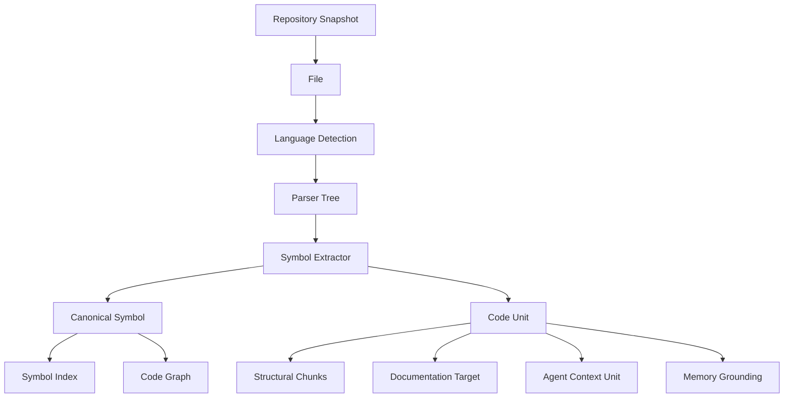
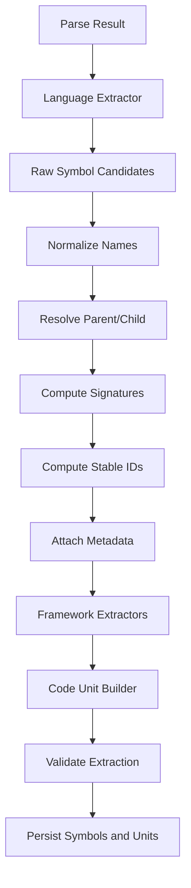
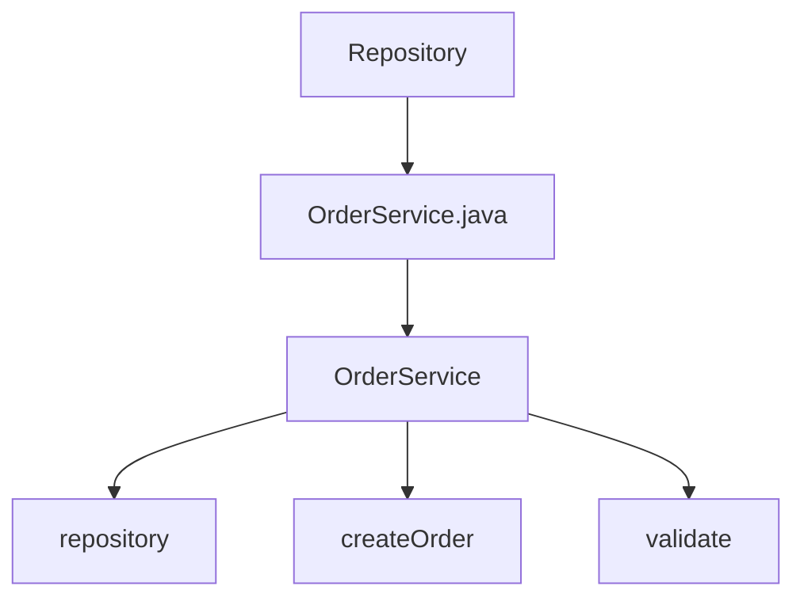

------
title: Learn AI Code Documentation & Agent Memory Platform - Part 007
description: Symbol extraction dan code unit modeling untuk mengubah repository source menjadi knowledge unit yang bisa dipakai retrieval, graph, documentation, dan agent memory.
series: learn-ai-code-documentation-agent-memory
seriesTitle: Learn AI Code Documentation & Agent Memory Platform
order: 7
partTitle: Symbol Extraction and Code Units
tags:
- ai
- code-intelligence
- symbol-extraction
- code-units
- repository-analysis
- documentation
- agent-memory
- software-architecture
date: 2026-07-02
---

# Part 007 — Symbol Extraction and Code Units

## 1. Tujuan Part Ini

Part 006 membahas language detection dan parser strategy.

Sekarang kita naik satu level: dari syntax tree menjadi **symbol** dan **code unit**.

Parser menjawab:

> "Struktur syntax file ini seperti apa?"

Symbol extraction menjawab:

> "Entitas bermakna apa yang ada di file ini, di mana lokasinya, bagaimana identitasnya, dan bagaimana entitas itu bisa dipakai sebagai evidence?"

Untuk platform AI code documentation dan agent memory, symbol extraction adalah salah satu fondasi paling penting. Tanpa symbol extraction yang baik, sistem akan jatuh ke mode "search file dan summarize". Itu tidak cukup untuk sistem production-grade.

Target part ini:

1. memahami perbedaan file, syntax node, symbol, code unit, chunk, dan evidence span,
2. mendesain canonical symbol model multi-language,
3. mengekstrak class, function, method, interface, module, route, test, schema, dan config unit,
4. membangun stable identity untuk symbol,
5. menangani overloaded method, nested symbol, anonymous function, decorator, annotation, dan generated code,
6. menghubungkan symbol extraction dengan retrieval, docs, graph, dan memory,
7. menyusun quality gate untuk memastikan extraction tidak menipu downstream system.

---

## 2. Kenapa Symbol Extraction Penting

LLM bisa membaca teks, tetapi platform engineering tidak boleh bergantung pada "model membaca semua file dan berharap paham".

Kita butuh struktur eksplisit.

Symbol extraction memungkinkan sistem menjawab:

- "File ini berisi class apa?"
- "Method mana yang menjadi entry point?"
- "Endpoint ini di-handle oleh symbol apa?"
- "Test mana yang menguji function ini?"
- "Docs mana yang menjelaskan module ini?"
- "Memory record ini harus invalidated jika symbol apa berubah?"
- "Agent perlu context dari method mana sebelum melakukan edit?"
- "Apakah generated docs menyebut symbol yang benar-benar ada?"

Tanpa symbol model, semua downstream menjadi fuzzy.

---

## 3. Mental Model: Dari File ke Knowledge Unit



### 3.1 File

File adalah unit storage.

Contoh:

```txt
src/main/java/com/acme/order/OrderService.java
```

File bisa berisi banyak symbol.

### 3.2 Syntax Node

Syntax node adalah output parser.

Contoh conceptual node:

```txt
class_declaration
method_declaration
annotation
import_declaration
```

Syntax node masih parser-specific.

### 3.3 Symbol

Symbol adalah entitas kode yang bisa dirujuk.

Contoh:

```txt
com.acme.order.OrderService
com.acme.order.OrderService.createOrder(CreateOrderRequest)
```

Symbol punya identity, kind, name, location, parent, signature, dan metadata.

### 3.4 Code Unit

Code unit adalah potongan knowledge yang meaningful untuk retrieval/docs/agent.

Tidak semua code unit adalah symbol. Contoh code unit:

- method,
- class,
- API endpoint,
- test case,
- config section,
- migration operation,
- OpenAPI operation,
- event schema,
- workflow step,
- route group.

### 3.5 Chunk

Chunk adalah unit indexing/retrieval.

Chunk bisa berasal dari symbol atau code unit, tetapi tidak harus identik. Satu class besar bisa dipecah menjadi beberapa chunks. Satu method kecil bisa digabung dengan komentar dan test terkait.

### 3.6 Evidence Span

Evidence span adalah lokasi source yang mendukung claim.

Contoh:

```yaml
path: src/main/java/com/acme/order/OrderService.java
startLine: 31
endLine: 74
```

Evidence span harus stable enough untuk audit.

---

## 4. Canonical Symbol Model

Multi-language platform butuh model symbol yang konsisten.

### 4.1 Minimal Fields

```yaml
symbol:
  symbolInstanceId: string
  logicalSymbolId: string
  repositoryId: string
  snapshotId: string
  fileId: string
  path: string
  language: string
  kind: string
  name: string
  qualifiedName: string
  signature: string?
  signatureHash: string?
  parentSymbolId: string?
  visibility: string?
  modifiers: []
  annotations: []
  decorators: []
  span:
    startLine: int
    startColumn: int
    endLine: int
    endColumn: int
  bodySpan:
    startLine: int
    startColumn: int
    endLine: int
    endColumn: int
  extraction:
    extractorId: string
    extractorVersion: string
    method: structural
    confidence: float
```

### 4.2 Symbol Instance vs Logical Symbol

Kita perlu dua identitas.

| ID | Scope | Tujuan |
|---|---|---|
| `symbolInstanceId` | Snapshot/commit tertentu | Evidence dan reproducibility |
| `logicalSymbolId` | Conceptual symbol lintas commit | Tracking continuity |

Contoh:

```txt
symbolInstanceId =
hash(repoId, snapshotId, path, kind, qualifiedName, signatureHash, spanHash)

logicalSymbolId =
hash(repoId, canonicalModule, kind, qualifiedName, signatureHash)
```

Kenapa perlu dua?

Jika commit berubah, line number bisa berubah. `symbolInstanceId` harus menunjuk snapshot spesifik. Tetapi untuk stale detection, kita ingin tahu bahwa `OrderService.createOrder` adalah symbol yang sama secara logical.

### 4.3 Qualified Name

Qualified name adalah nama symbol dalam konteks bahasa.

Contoh Java:

```txt
com.acme.order.OrderService.createOrder
```

Contoh TypeScript:

```txt
src/services/order.createOrder
```

Contoh Go:

```txt
github.com/acme/order/internal/service.(*OrderService).Create
```

Contoh Python:

```txt
order.service.OrderService.create_order
```

Qualified name harus cukup stable untuk retrieval dan graph.

---

## 5. Symbol Kind

### 5.1 Core Symbol Kinds

| Kind | Arti |
|---|---|
| `module` | Unit module/package/file-level namespace |
| `package` | Package namespace |
| `class` | Class |
| `interface` | Interface/protocol |
| `enum` | Enum |
| `record` | Record/data class |
| `struct` | Struct |
| `function` | Function standalone |
| `method` | Method attached to type/object |
| `constructor` | Constructor/init |
| `field` | Field/property |
| `constant` | Constant |
| `type_alias` | Type alias |
| `annotation` | Annotation/decorator definition |
| `route_handler` | API route handler |
| `test_case` | Test function/method |
| `schema` | Schema definition |
| `migration` | Migration unit |
| `config_section` | Config section |
| `workflow_step` | CI/CD workflow step |

### 5.2 Jangan Terlalu Language-Specific

Bad:

```txt
spring_rest_controller_method
nestjs_controller_method
fastapi_decorated_function
```

Better:

```yaml
kind: route_handler
framework:
  name: spring_mvc
  evidence: annotation
```

Core model tetap konsisten. Framework detail masuk metadata.

---

## 6. Code Unit Model

Symbol model menjelaskan entitas. Code unit model menjelaskan unit knowledge yang akan dipakai downstream.

### 6.1 Code Unit Fields

```yaml
codeUnit:
  codeUnitId: string
  repositoryId: string
  snapshotId: string
  fileId: string
  kind: method
  primarySymbolId: sym_01J...
  title: "OrderService.createOrder"
  purposeHint: "Creates order and persists it"
  path: src/main/java/com/acme/order/OrderService.java
  span:
    startLine: 31
    endLine: 74
  evidenceRole: primary
  indexPolicy: structural_chunk
  confidence: 0.91
```

### 6.2 Code Unit vs Symbol

| Case | Symbol | Code Unit |
|---|---|---|
| Java method | Yes | Yes |
| Class | Yes | Bisa satu code unit atau container |
| OpenAPI operation | Tidak selalu code symbol | Ya |
| YAML config section | Tidak | Ya |
| SQL migration operation | Tidak selalu | Ya |
| Markdown section | Tidak | Ya |
| Test case | Yes/Maybe | Ya |
| Event schema | Maybe | Ya |

### 6.3 Kenapa Code Unit Diperlukan

Karena docs dan agent context sering butuh unit yang bukan symbol compiler.

Contoh:

- `POST /orders` adalah API operation.
- `spring.datasource` adalah config section.
- `V004__add_order_status.sql` adalah migration.
- `Build Docker image` adalah workflow step.
- `Order created event` adalah schema concept.

Semua itu penting untuk documentation dan agent memory.

---

## 7. Extraction Pipeline



### 7.1 Raw Symbol Candidate

Raw candidate berasal dari syntax tree.

```yaml
candidate:
  syntaxNodeType: method_declaration
  name: createOrder
  kind: method
  span: [31, 74]
  rawSignature: "public Order createOrder(CreateOrderRequest request)"
```

### 7.2 Normalized Symbol

```yaml
symbol:
  kind: method
  name: createOrder
  qualifiedName: com.acme.order.OrderService.createOrder
  signature: createOrder(CreateOrderRequest): Order
  visibility: public
  modifiers: []
```

### 7.3 Code Unit

```yaml
codeUnit:
  kind: method
  primarySymbol: com.acme.order.OrderService.createOrder
  evidenceRole: primary
  chunkingStrategy: symbol_body_with_header
```

---

## 8. Language-Specific Symbol Extraction

### 8.1 Java Extraction

Java source example:

```java
package com.acme.order;

import org.springframework.stereotype.Service;

@Service
public class OrderService {
    private final OrderRepository repository;

    public Order createOrder(CreateOrderRequest request) {
        validate(request);
        return repository.save(Order.from(request));
    }

    private void validate(CreateOrderRequest request) {
        // validation
    }
}
```

Extract:

```yaml
symbols:
  - kind: package
    qualifiedName: com.acme.order

  - kind: class
    qualifiedName: com.acme.order.OrderService
    annotations:
      - Service
    visibility: public

  - kind: field
    qualifiedName: com.acme.order.OrderService.repository
    type: OrderRepository
    visibility: private

  - kind: method
    qualifiedName: com.acme.order.OrderService.createOrder
    signature: createOrder(CreateOrderRequest): Order
    visibility: public

  - kind: method
    qualifiedName: com.acme.order.OrderService.validate
    signature: validate(CreateOrderRequest): void
    visibility: private
```

Java-specific concerns:

| Concern | Handling |
|---|---|
| Package declaration | Prefix qualified name |
| Imports | Store dependency candidates |
| Overloaded methods | Include parameter types in signature |
| Annotations | Store normalized annotation names |
| Nested classes | Parent-child relation |
| Records | Treat as `record` kind |
| Lombok | Mark generated/implicit members as inferred, lower confidence |
| Spring/JAX-RS | Extract route/service/component hints |

### 8.2 TypeScript Extraction

Example:

```ts
export interface CreateOrderRequest {
  customerId: string;
}

export async function createOrder(request: CreateOrderRequest): Promise<Order> {
  return orderRepository.save(request);
}

export class OrderService {
  async cancelOrder(orderId: string): Promise<void> {
    await orderRepository.cancel(orderId);
  }
}
```

Extract:

```yaml
symbols:
  - kind: interface
    qualifiedName: CreateOrderRequest
    exported: true

  - kind: function
    qualifiedName: createOrder
    signature: createOrder(CreateOrderRequest): Promise<Order>
    exported: true

  - kind: class
    qualifiedName: OrderService
    exported: true

  - kind: method
    qualifiedName: OrderService.cancelOrder
    signature: cancelOrder(string): Promise<void>
```

TypeScript-specific concerns:

| Concern | Handling |
|---|---|
| Export/default export | Store export metadata |
| Type aliases | `type_alias` |
| Interfaces | `interface` |
| Arrow functions | Function if assigned to named const |
| Anonymous callbacks | Usually local code unit, not top-level symbol |
| React components | Framework extractor |
| Path aliases | Later semantic-lite/build-aware resolver |

### 8.3 Go Extraction

Example:

```go
package order

type OrderService struct {
    repo OrderRepository
}

func (s *OrderService) Create(ctx context.Context, req CreateOrderRequest) (*Order, error) {
    return s.repo.Save(ctx, req)
}
```

Extract:

```yaml
symbols:
  - kind: package
    qualifiedName: order

  - kind: struct
    qualifiedName: order.OrderService

  - kind: field
    qualifiedName: order.OrderService.repo
    type: OrderRepository

  - kind: method
    qualifiedName: order.(*OrderService).Create
    receiver: "*OrderService"
    signature: Create(context.Context, CreateOrderRequest): (*Order, error)
```

Go-specific concerns:

| Concern | Handling |
|---|---|
| Receiver methods | Include receiver in qualified name |
| Interfaces implicit implementation | Later semantic layer |
| Build tags | Store build constraint metadata |
| Test functions | `func TestX(t *testing.T)` as test_case |
| Package-level functions | `function` |

### 8.4 Python Extraction

Example:

```python
class OrderService:
    def create_order(self, request: CreateOrderRequest) -> Order:
        return self.repository.save(request)

@app.post("/orders")
def create_order_endpoint(request: CreateOrderRequest):
    return service.create_order(request)
```

Extract:

```yaml
symbols:
  - kind: class
    qualifiedName: order.service.OrderService

  - kind: method
    qualifiedName: order.service.OrderService.create_order
    signature: create_order(CreateOrderRequest): Order

  - kind: function
    qualifiedName: order.service.create_order_endpoint
    decorators:
      - app.post("/orders")

codeUnits:
  - kind: route_handler
    title: "POST /orders"
    primarySymbol: order.service.create_order_endpoint
```

Python-specific concerns:

| Concern | Handling |
|---|---|
| Dynamic typing | Signature may be partial |
| Decorators | Important metadata |
| Nested functions | Parent-child relation |
| Module path | Derived from repo root + package layout |
| Runtime monkey patching | Usually out of scope |
| FastAPI/Flask/Django | Framework extractor |

---

## 9. Framework-Aware Code Units

Many useful code units are framework concepts.

### 9.1 API Route Unit

Example Spring:

```java
@RestController
@RequestMapping("/orders")
class OrderController {
    @PostMapping
    OrderResponse createOrder(@RequestBody CreateOrderRequest request) {
        return service.create(request);
    }
}
```

Extract code unit:

```yaml
codeUnit:
  kind: api_operation
  title: "POST /orders"
  primarySymbol: com.acme.order.OrderController.createOrder
  framework: spring_mvc
  route:
    method: POST
    path: /orders
  evidence:
    - path: OrderController.java
      lines: [1, 8]
```

### 9.2 Test Case Unit

Example JUnit:

```java
@Test
void shouldRejectOrderWithoutCustomerId() {
    // ...
}
```

Extract:

```yaml
codeUnit:
  kind: test_case
  title: shouldRejectOrderWithoutCustomerId
  primarySymbol: OrderValidatorTest.shouldRejectOrderWithoutCustomerId
  testFramework: junit
  behaviorHint: "reject order without customer id"
```

### 9.3 Database Entity Unit

Example JPA:

```java
@Entity
@Table(name = "orders")
class OrderEntity {
    @Id
    private UUID id;
}
```

Extract:

```yaml
codeUnit:
  kind: data_entity
  title: "orders table entity"
  primarySymbol: OrderEntity
  framework: jpa
  storage:
    table: orders
```

### 9.4 Event Handler Unit

Example:

```java
@KafkaListener(topics = "order.created")
public void onOrderCreated(OrderCreated event) {
    // ...
}
```

Extract:

```yaml
codeUnit:
  kind: event_consumer
  title: "Consumes order.created"
  primarySymbol: OrderEventConsumer.onOrderCreated
  messaging:
    system: kafka
    topic: order.created
```

Framework-aware extraction is what turns "code parser" into "code intelligence".

---

## 10. Signature Design

Signature matters for overloaded methods, search, and stable IDs.

### 10.1 Signature Goals

A signature should:

1. distinguish overloads,
2. be stable across line changes,
3. include parameter shape,
4. include return type when available,
5. avoid noise from formatting,
6. be language-aware.

### 10.2 Java Signature

```txt
createOrder(CreateOrderRequest): Order
```

For overloaded:

```txt
findOrder(UUID): Optional<Order>
findOrder(String): Optional<Order>
```

### 10.3 TypeScript Signature

```txt
createOrder(CreateOrderRequest): Promise<Order>
```

If type unavailable:

```txt
createOrder(request): unknown
```

### 10.4 Python Signature

```txt
create_order(CreateOrderRequest): Order
```

If annotation missing:

```txt
create_order(request): unknown
```

### 10.5 Signature Hash

Use normalized signature:

```txt
method|com.acme.order.OrderService.createOrder|CreateOrderRequest|Order
```

Then hash.

Do not include whitespace or line number.

---

## 11. Parent-Child Relationship

Code structure is hierarchical.



### 11.1 Why Parent Matters

Parent helps:

- build qualified names,
- assemble context,
- generate docs,
- show navigation,
- chunk class with methods,
- invalidate docs when child changes.

### 11.2 Nested Symbols

Example Java:

```java
class Outer {
    class Inner {
        void run() {}
    }
}
```

Qualified names:

```txt
Outer
Outer.Inner
Outer.Inner.run
```

Example TypeScript:

```ts
function outer() {
  function inner() {}
}
```

Policy:

- top-level functions get normal symbols,
- nested functions can be local symbols,
- local symbols may be indexed but not always documented as API.

---

## 12. Symbol Visibility

Visibility affects documentation and agent context.

| Visibility | Java | TypeScript | Python |
|---|---|---|---|
| public | `public` | `export` | no underscore / public convention |
| private | `private` | `private` / not exported | `_name` convention |
| protected | `protected` | `protected` | convention only |
| package/internal | default/package | not exported/internal path | module convention |

### 12.1 Why Visibility Matters

Docs may prioritize public API.

Agent context for implementation may need private methods too.

Ranking example:

```txt
if task = "API documentation":
  boost public route handlers
  lower private helper methods

if task = "modify behavior":
  include private helpers called by target
```

---

## 13. Comments and Documentation Strings

Comments can be evidence, but weaker than executable code.

### 13.1 Extract Comment Metadata

For each symbol:

```yaml
comments:
  leading:
    text: "Creates an order after validation."
    span: [28, 30]
  inline: []
  docstring: null
```

### 13.2 Do Not Trust Comments Blindly

Comment may be stale.

If comment conflicts with code or tests, mark conflict.

Example:

```java
// Does not persist order
public Order createOrder(CreateOrderRequest request) {
    return repository.save(Order.from(request));
}
```

Docs should not repeat stale comment as truth.

### 13.3 Use Comments for Purpose Hints

Comments help with:

- purpose summary,
- domain vocabulary,
- parameter meaning,
- caveats,
- deprecation notes.

But mark source kind:

```yaml
evidenceType: comment
confidenceModifier: -0.10
```

---

## 14. Tests as Code Units

Tests are high-value behavior evidence.

### 14.1 Extract Test Cases

JUnit:

```java
@Test
void shouldRejectOrderWithoutCustomerId() {}
```

Jest:

```ts
it("rejects order without customer id", () => {})
```

Go:

```go
func TestRejectOrderWithoutCustomerId(t *testing.T) {}
```

Pytest:

```python
def test_reject_order_without_customer_id():
    pass
```

Canonical:

```yaml
codeUnit:
  kind: test_case
  title: "reject order without customer id"
  primarySymbol: OrderValidatorTest.shouldRejectOrderWithoutCustomerId
  targetHints:
    - OrderValidator
    - customerId
  behavior:
    expected: reject
```

### 14.2 Link Tests to Target Symbols

Heuristics:

- test class name matches target class,
- imports target symbol,
- calls target method,
- fixture names,
- assertion messages,
- package proximity.

Example:

```yaml
testRelation:
  testSymbol: OrderValidatorTest.shouldRejectOrderWithoutCustomerId
  targetSymbol: OrderValidator.validate
  confidence: 0.78
  evidence:
    - "test class name matches target class"
    - "method body calls validator.validate"
```

This becomes important for agent context: when modifying `OrderValidator`, include related tests.

---

## 15. Configuration and Schema Code Units

Not all knowledge is in source code.

### 15.1 Config Section Unit

Spring YAML:

```yaml
order:
  validation:
    max-items: 100
    corporate-tax-id-required: true
```

Extract:

```yaml
codeUnit:
  kind: config_section
  title: order.validation
  path: src/main/resources/application.yml
  keys:
    - order.validation.max-items
    - order.validation.corporate-tax-id-required
```

### 15.2 OpenAPI Operation Unit

```yaml
paths:
  /orders:
    post:
      operationId: createOrder
```

Extract:

```yaml
codeUnit:
  kind: api_operation
  title: "POST /orders"
  operationId: createOrder
  contract:
    requestSchema: CreateOrderRequest
    responseSchema: OrderResponse
```

### 15.3 SQL Migration Unit

```sql
ALTER TABLE orders ADD COLUMN status VARCHAR(32);
```

Extract:

```yaml
codeUnit:
  kind: migration_operation
  title: "Add orders.status"
  database:
    table: orders
    operation: add_column
    column: status
```

These units support API docs, data model docs, runbooks, and impact analysis.

---

## 16. Evidence Span Design

Every symbol and code unit needs spans.

### 16.1 Span Types

| Span | Meaning |
|---|---|
| `declarationSpan` | Signature/header/declaration |
| `bodySpan` | Body only |
| `fullSpan` | Comments + annotations + declaration + body |
| `docSpan` | Leading docs/comment |
| `nameSpan` | Identifier location |

Example:

```yaml
spans:
  declaration:
    startLine: 12
    endLine: 13
  body:
    startLine: 14
    endLine: 29
  full:
    startLine: 9
    endLine: 29
```

### 16.2 Why Multiple Spans

For context assembly:

- Agent changing method needs body.
- API docs may need declaration + annotation.
- Evidence citation may cite full span.
- Symbol search may show name span.

---

## 17. Symbol Extraction Confidence

Not all extracted symbols are equally reliable.

### 17.1 Confidence Inputs

| Signal | Impact |
|---|---|
| Structural parser OK | High |
| Partial parse | Medium |
| Regex fallback | Low |
| Clear framework annotation | High |
| Dynamic registration | Medium/low |
| Generated code | Lower |
| Unknown language | Low |
| Type info available | Higher |
| Ambiguous parent | Lower |

### 17.2 Example

```yaml
symbol:
  qualifiedName: OrderController.createOrder
  confidence: 0.94
  confidenceReasons:
    - "structural parser succeeded"
    - "method declaration node found"
    - "Spring route annotation found"
```

Fallback:

```yaml
symbol:
  qualifiedName: maybeCreateOrder
  confidence: 0.41
  confidenceReasons:
    - "regex fallback"
    - "no structural parser"
```

Downstream should use confidence for ranking and quality reports.

---

## 18. Handling Dynamic and Anonymous Code

### 18.1 Anonymous Functions

Example:

```ts
router.post("/orders", async (req, res) => {
  await service.create(req.body);
});
```

There is no named function.

Create synthetic code unit:

```yaml
codeUnit:
  kind: route_handler
  title: "POST /orders anonymous handler"
  syntheticName: "route_handler:POST:/orders"
  span: [12, 18]
  confidence: 0.79
```

### 18.2 Lambdas/Callbacks

Policy:

- if assigned to named variable, create symbol,
- if passed inline to framework route/event/test, create code unit,
- if local callback with no external relevance, maybe local unit only.

### 18.3 Dynamic Registration

Example:

```python
for route in routes:
    app.add_url_rule(route.path, route.handler)
```

Hard to statically resolve.

Extract:

```yaml
codeUnit:
  kind: dynamic_route_registration
  confidence: 0.45
  uncertainty:
    - "Route path and handler depend on runtime data"
```

Do not hallucinate exact routes.

---

## 19. De-duplication

Same conceptual thing can appear multiple times.

Example:

- OpenAPI operation `createOrder`,
- controller method `createOrder`,
- generated API interface `createOrder`,
- docs section "Create Order".

We need relation, not duplicate truth.

### 19.1 Canonical Target

For API operation, primary evidence may be contract or controller depending task.

```yaml
concept:
  kind: api_operation
  canonicalId: api:order-service:POST:/orders
evidence:
  - openapi.yaml#/paths/~1orders/post
  - OrderController.createOrder
  - OrdersApi.generatedInterface.createOrder
```

Generated interface should be supporting or metadata, not primary if OpenAPI exists.

### 19.2 Duplicate Detection Signals

- same route method/path,
- same operationId,
- same qualified name,
- same schema name,
- same file generated from contract,
- same test target.

---

## 20. Symbol Extraction and Retrieval

Symbol extraction improves retrieval dramatically.

### 20.1 Search Index Fields

Index symbol as structured fields:

```yaml
symbol:
  name: createOrder
  qualifiedName: com.acme.order.OrderService.createOrder
  kind: method
  path: src/main/java/com/acme/order/OrderService.java
  annotations:
    - Transactional
  comments:
    - "Creates order after validation"
  text:
    - declaration
    - body excerpt
```

### 20.2 Retrieval Boosts

| Query Intent | Boost |
|---|---|
| exact symbol name | symbol name |
| endpoint | route code unit |
| behavior | tests + implementation |
| config | config section |
| data model | entity + migration |
| architecture | class/module + ADR |

### 20.3 Example

Query:

```txt
where is order validation implemented?
```

Possible hits:

1. `OrderValidator.validate`
2. `OrderValidationRule`
3. `OrderValidatorTest`
4. ADR about validation rules
5. config `order.validation.*`

Without symbols, search may return README first. With symbols, system can return actual implementation.

---

## 21. Symbol Extraction and Documentation

Documentation should target code units.

### 21.1 Module Docs

Input:

```yaml
target:
  kind: package
  path: src/main/java/com/acme/order/validation
```

System gathers:

- classes,
- public methods,
- internal helper methods,
- related tests,
- configs,
- ADR,
- schema/contract.

### 21.2 API Docs

Input:

```yaml
target:
  kind: api_operation
  method: POST
  path: /orders
```

System gathers:

- route handler,
- request/response schema,
- service method,
- validation method,
- tests,
- OpenAPI contract.

### 21.3 Agent Context

Input:

```yaml
task: modify validation rule
targetSymbol: OrderValidator.validate
```

System gathers:

- target method,
- parent class,
- called helpers,
- related tests,
- config keys,
- memory records,
- known caveats.

---

## 22. Symbol Extraction and Memory

Memory must attach to stable targets.

Bad memory:

```yaml
statement: "Validation is in this file."
```

Better:

```yaml
statement: "Order validation entry point is OrderValidator.validate."
target:
  logicalSymbolId: sym_logical_order_validator_validate
evidence:
  - symbolInstanceId: sym_inst_6f41ab2_order_validator_validate
```

### 22.1 Invalidation

If logical symbol disappears:

```txt
invalidate memory
```

If symbol body changes significantly:

```txt
mark memory needs revalidation
```

If line number changes only:

```txt
update evidence span
```

---

## 23. Persistence Schema

### 23.1 Code Symbols

```sql
CREATE TABLE code_symbols (
    symbol_instance_id TEXT PRIMARY KEY,
    logical_symbol_id TEXT NOT NULL,
    repository_id TEXT NOT NULL,
    snapshot_id TEXT NOT NULL,
    file_id TEXT NOT NULL,
    path TEXT NOT NULL,
    language TEXT NOT NULL,
    kind TEXT NOT NULL,
    name TEXT NOT NULL,
    qualified_name TEXT NOT NULL,
    signature TEXT,
    signature_hash TEXT,
    parent_symbol_instance_id TEXT,
    visibility TEXT,
    confidence NUMERIC NOT NULL,
    extractor_id TEXT NOT NULL,
    extractor_version TEXT NOT NULL,
    start_line INTEGER NOT NULL,
    start_column INTEGER NOT NULL,
    end_line INTEGER NOT NULL,
    end_column INTEGER NOT NULL,
    body_start_line INTEGER,
    body_start_column INTEGER,
    body_end_line INTEGER,
    body_end_column INTEGER
);
```

### 23.2 Symbol Attributes

```sql
CREATE TABLE code_symbol_attributes (
    id TEXT PRIMARY KEY,
    symbol_instance_id TEXT NOT NULL,
    attribute_name TEXT NOT NULL,
    attribute_value TEXT NOT NULL
);
```

Examples:

```txt
annotation=Service
modifier=public
receiver=*OrderService
exported=true
```

### 23.3 Code Units

```sql
CREATE TABLE code_units (
    code_unit_id TEXT PRIMARY KEY,
    repository_id TEXT NOT NULL,
    snapshot_id TEXT NOT NULL,
    file_id TEXT NOT NULL,
    primary_symbol_instance_id TEXT,
    kind TEXT NOT NULL,
    title TEXT NOT NULL,
    path TEXT NOT NULL,
    evidence_role TEXT NOT NULL,
    confidence NUMERIC NOT NULL,
    start_line INTEGER NOT NULL,
    start_column INTEGER NOT NULL,
    end_line INTEGER NOT NULL,
    end_column INTEGER NOT NULL,
    extractor_id TEXT NOT NULL,
    extractor_version TEXT NOT NULL
);
```

### 23.4 Code Unit Attributes

```sql
CREATE TABLE code_unit_attributes (
    id TEXT PRIMARY KEY,
    code_unit_id TEXT NOT NULL,
    attribute_name TEXT NOT NULL,
    attribute_value TEXT NOT NULL
);
```

Examples:

```txt
http.method=POST
http.path=/orders
messaging.topic=order.created
database.table=orders
config.key=order.validation.max-items
```

---

## 24. Extraction Quality Gates

### 24.1 Structural Quality

Check:

- every symbol has valid span,
- child span is inside parent span,
- method belongs to class when language requires,
- end line >= start line,
- no duplicate symbol instance ID,
- logical ID stable for same symbol.

### 24.2 Semantic-Lite Quality

Check:

- route handler has method/path,
- test case has framework marker,
- entity has table name if annotation exists,
- import symbols have source path,
- generated code not primary evidence unless allowed.

### 24.3 Regression Quality

Use fixture repository.

Expected:

```yaml
expectedSymbols:
  - qualifiedName: com.acme.order.OrderService
    kind: class
  - qualifiedName: com.acme.order.OrderService.createOrder
    kind: method

expectedCodeUnits:
  - kind: api_operation
    title: POST /orders
  - kind: test_case
    title: shouldRejectOrderWithoutCustomerId
```

---

## 25. Practical Implementation Sketch

### 25.1 Extractor Interface

```java
public interface SymbolExtractor {
    boolean supports(LanguageDetection detection);

    SymbolExtractionResult extract(SymbolExtractionRequest request);
}
```

### 25.2 Request

```java
public record SymbolExtractionRequest(
    String repositoryId,
    String snapshotId,
    SourceFile file,
    LanguageDetection language,
    ParseResult parseResult,
    FileClassification classification
) {}
```

### 25.3 Result

```java
public record SymbolExtractionResult(
    List<CodeSymbol> symbols,
    List<CodeUnit> codeUnits,
    List<ExtractionDiagnostic> diagnostics,
    double confidence
) {}
```

### 25.4 Symbol Builder

```java
public final class CodeSymbolBuilder {
    private String repositoryId;
    private String snapshotId;
    private String fileId;
    private String language;
    private SymbolKind kind;
    private String name;
    private String qualifiedName;
    private String signature;
    private SourceSpan span;
    private SourceSpan bodySpan;
    private List<String> annotations = new ArrayList<>();
    private List<String> modifiers = new ArrayList<>();

    public CodeSymbol build(SymbolIdFactory idFactory) {
        String signatureHash = idFactory.signatureHash(signature);
        String logicalId = idFactory.logicalId(repositoryId, kind, qualifiedName, signatureHash);
        String instanceId = idFactory.instanceId(repositoryId, snapshotId, kind, qualifiedName, signatureHash, span);

        return new CodeSymbol(
            instanceId,
            logicalId,
            repositoryId,
            snapshotId,
            fileId,
            language,
            kind,
            name,
            qualifiedName,
            signature,
            signatureHash,
            span,
            bodySpan,
            annotations,
            modifiers
        );
    }
}
```

---

## 26. Edge Cases

### 26.1 Overloaded Methods

Java:

```java
Order find(UUID id) {}
Order find(String externalId) {}
```

Need distinct signatures.

### 26.2 Same Class Name in Different Packages

```txt
com.acme.order.OrderService
com.acme.billing.OrderService
```

Qualified name must include package/module.

### 26.3 Generated Partial Classes

Some ecosystems split class definitions.

Policy:

- store file-level symbol instances,
- link by logical identity if safe,
- mark partial/multi-file metadata.

### 26.4 TypeScript Barrel Exports

```ts
export * from "./order-service";
```

This is dependency/export info, not new implementation symbol.

### 26.5 Python Dynamic Attributes

Avoid inventing fields from runtime assignment unless evidence is clear.

### 26.6 Lombok

Java Lombok can generate getters/builders not visible in source.

Policy:

- do not create generated methods unless needed,
- store annotation hints,
- if build-aware layer later confirms, create inferred symbols with lower confidence.

---

## 27. Common Mistakes

### 27.1 Using Random IDs

Random IDs break incremental update and memory invalidation.

### 27.2 Treating File as Symbol

File is storage boundary, not semantic boundary.

### 27.3 Ignoring Tests

Tests are among the strongest behavior evidence.

### 27.4 Overtrusting Comments

Comments can be stale. Use them as hints, not absolute truth.

### 27.5 No Confidence

Extraction via fallback regex should not be ranked the same as parser-based extraction.

### 27.6 No Parent Relationship

Without parent-child relation, context assembly becomes messy.

### 27.7 No Framework Extraction

Plain syntax symbols miss route handlers, event listeners, entities, and test cases.

---

## 28. Exercise

Build symbol extraction for one language and one framework.

### 28.1 Input

Use a small Java Spring repository.

Include:

```txt
OrderController.java
OrderService.java
OrderValidator.java
OrderValidatorTest.java
application.yml
openapi.yaml
```

### 28.2 Output

Produce:

```txt
symbols.json
code-units.json
extraction-report.yaml
```

### 28.3 Acceptance Criteria

- classes extracted,
- methods extracted,
- route handler extracted,
- test case extracted,
- config section extracted,
- stable IDs generated,
- spans correct,
- generated/vendor files ignored,
- confidence stored,
- diagnostics stored.

### 28.4 Stretch Goal

Link route operation to service method using method call hints.

---

## 29. Summary

Symbol extraction converts parsed source into durable knowledge units.

Key points:

1. parser tree is not domain model,
2. canonical symbol model is required for multi-language systems,
3. symbol instance ID and logical symbol ID solve different problems,
4. code units extend beyond compiler symbols,
5. route handlers, tests, schemas, configs, migrations, and workflow steps are first-class knowledge,
6. spans make evidence auditable,
7. confidence and diagnostics protect downstream systems,
8. tests are behavior evidence,
9. symbol extraction powers retrieval, graph, docs, and memory,
10. framework-aware extraction is where code intelligence becomes useful.

Part berikutnya membahas **Dependency and Call Graph Modeling**: bagaimana symbol dan code unit dihubungkan menjadi graph dependency, import, call, route, event, schema, dan cross-repo relation.
