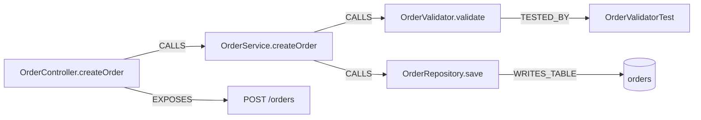
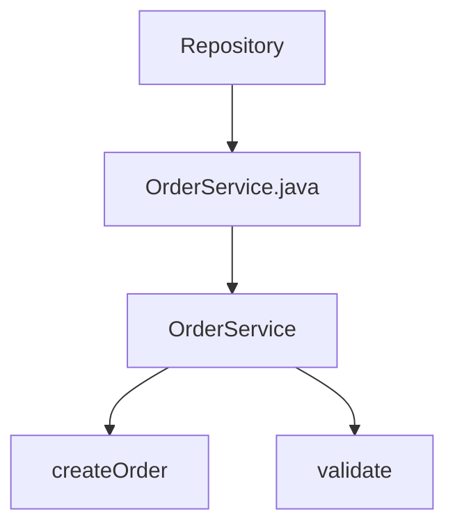
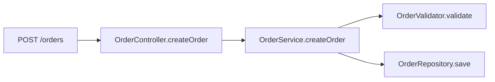
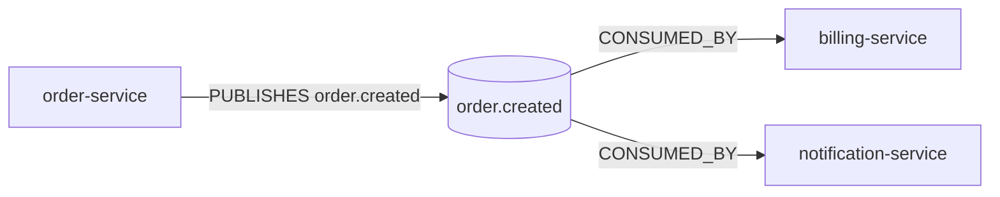
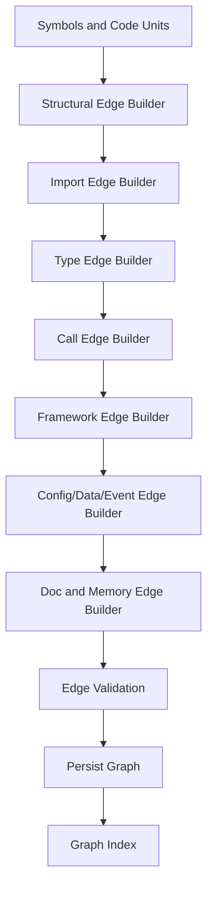
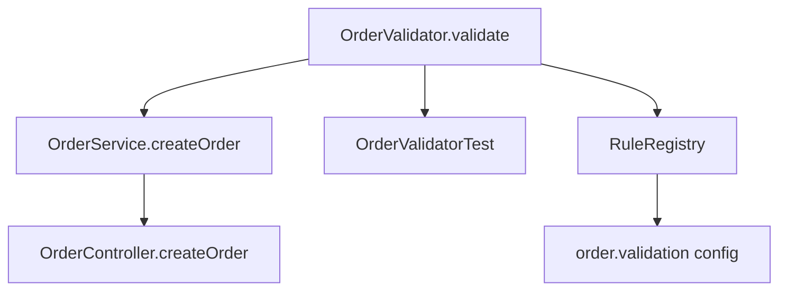
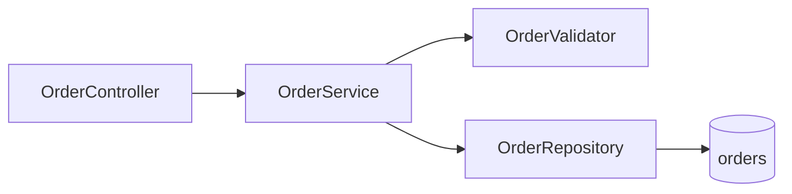

------
title: Learn AI Code Documentation & Agent Memory Platform - Part 008
description: Dependency graph dan call graph modeling untuk membangun repository intelligence, impact analysis, context expansion, documentation, dan agent memory lintas module/repository.
series: learn-ai-code-documentation-agent-memory
seriesTitle: Learn AI Code Documentation & Agent Memory Platform
order: 8
partTitle: Dependency and Call Graph Modeling
tags:
- ai
- code-intelligence
- dependency-graph
- call-graph
- repository-analysis
- impact-analysis
- documentation
- agent-memory
date: 2026-07-02
---

# Part 008 — Dependency and Call Graph Modeling

## 1. Tujuan Part Ini

Part 007 membahas symbol dan code unit. Sekarang kita menghubungkan unit-unit itu menjadi graph.

Dependency dan call graph menjawab pertanyaan yang tidak bisa dijawab oleh search biasa:

- "Jika method ini berubah, siapa yang terdampak?"
- "Endpoint ini akhirnya memanggil service apa?"
- "Class ini bergantung pada schema/event apa?"
- "Test mana yang harus dijalankan saat function ini berubah?"
- "Repository mana yang memakai contract ini?"
- "Docs mana yang stale karena symbol ini berubah?"
- "Context tambahan apa yang harus diberikan ke agent?"

Part ini membahas cara membangun graph yang cukup akurat untuk documentation, retrieval, agent context, dan impact analysis.

Kita tidak akan membangun compiler-perfect call graph dari awal. Targetnya adalah **useful, explainable, confidence-aware graph**.

---

## 2. Graph Mental Model

Graph adalah kumpulan node dan edge.



Graph memungkinkan traversal:

```txt
POST /orders
  -> OrderController.createOrder
  -> OrderService.createOrder
  -> OrderValidator.validate
  -> OrderRepository.save
  -> orders table
```

Itu jauh lebih berguna daripada sekadar menemukan file yang mengandung kata "order".

---

## 3. Graph untuk Apa?

### 3.1 Documentation

Graph membantu menulis docs:

- flow request,
- component relationship,
- dependency diagram,
- data flow,
- upstream/downstream impact,
- tests related to module,
- deployment relationship.

### 3.2 Agent Context

Graph membantu context expansion:

- include caller,
- include callee,
- include parent class,
- include related tests,
- include config,
- include schema,
- include event producer/consumer.

### 3.3 Memory

Memory perlu graph untuk invalidation:

- jika source symbol berubah, memory terkait harus dicek,
- jika contract berubah, cross-repo memory perlu expire,
- jika route handler berubah, API docs perlu refresh.

### 3.4 Impact Analysis

Graph menjawab:

```txt
What breaks if I change this?
```

Impact analysis tidak sempurna, tetapi graph confidence-aware bisa memberi useful approximation.

---

## 4. Node Types

Kita sudah punya symbols dan code units. Graph menambahkan relation.

### 4.1 Core Nodes

| Node Type | Example |
|---|---|
| `repository` | `order-service` |
| `snapshot` | commit `6f41ab2` |
| `file` | `OrderService.java` |
| `package` | `com.acme.order` |
| `symbol` | `OrderService.createOrder` |
| `code_unit` | `POST /orders` |
| `api_operation` | `POST /orders` |
| `event_topic` | `order.created` |
| `database_table` | `orders` |
| `config_key` | `order.validation.max-items` |
| `document` | `docs/order-flow.md` |
| `memory_record` | `mem_order_validation_entrypoint` |
| `test_case` | `shouldRejectOrderWithoutCustomerId` |
| `external_dependency` | `org.springframework:spring-web` |
| `team` | `team-order-platform` |

### 4.2 Derived Nodes

Some nodes do not exist directly as files.

Example:

```yaml
node:
  type: database_table
  id: dbtable:order-service:orders
  name: orders
  sourceEvidence:
    - migration: V001__create_orders.sql
    - entity: OrderEntity
```

Example:

```yaml
node:
  type: event_topic
  id: topic:order.created
  name: order.created
  sourceEvidence:
    - OrderEventProducer.publishCreated
```

---

## 5. Edge Types

### 5.1 Structural Edges

| Edge | Meaning |
|---|---|
| `CONTAINS` | repo contains file; file contains symbol |
| `DECLARES` | file declares symbol |
| `HAS_CHILD` | class has method |
| `BELONGS_TO` | symbol belongs to package/module |

### 5.2 Dependency Edges

| Edge | Meaning |
|---|---|
| `IMPORTS` | file imports package/module |
| `DEPENDS_ON` | symbol/module depends on another |
| `USES_TYPE` | symbol references type |
| `IMPLEMENTS` | class implements interface |
| `EXTENDS` | class extends class |
| `INSTANTIATES` | function creates object |
| `INJECTS` | framework injects dependency |

### 5.3 Execution Edges

| Edge | Meaning |
|---|---|
| `CALLS` | function/method calls another |
| `HANDLES` | route/event handled by symbol |
| `EXPOSES` | symbol exposes API operation |
| `PUBLISHES_EVENT` | symbol publishes event |
| `CONSUMES_EVENT` | symbol consumes event |
| `READS_TABLE` | symbol reads table |
| `WRITES_TABLE` | symbol writes table |
| `READS_CONFIG` | symbol reads config key |

### 5.4 Documentation and Memory Edges

| Edge | Meaning |
|---|---|
| `DOCUMENTED_BY` | symbol/code unit documented by doc |
| `MENTIONS` | doc mentions symbol |
| `GROUNDED_IN` | memory grounded in evidence |
| `GENERATED_FROM` | generated doc from evidence |
| `INVALIDATED_BY` | doc/memory invalidated by source change |

### 5.5 Ownership and Governance Edges

| Edge | Meaning |
|---|---|
| `OWNED_BY` | repo/symbol owned by team |
| `VISIBLE_TO` | knowledge visible to principal/team |
| `REVIEWED_BY` | generated doc reviewed by person/team |
| `APPROVED_BY` | memory/doc approved |

---

## 6. Edge Schema

Every edge needs metadata.

```yaml
edge:
  edgeId: edge_01J...
  sourceNodeId: sym_order_controller_create
  targetNodeId: sym_order_service_create
  type: CALLS
  repositoryId: order-service
  snapshotId: snap_6f41ab2
  confidence: 0.82
  extraction:
    method: static_syntax
    extractorId: java-call-extractor
    extractorVersion: 2026.07.02
  evidence:
    - path: src/main/java/com/acme/order/OrderController.java
      lines: [18, 18]
      text: "orderService.create(request)"
  attributes:
    callKind: method_call
    resolved: true
```

### 6.1 Required Edge Fields

| Field | Purpose |
|---|---|
| source node | traversal |
| target node | traversal |
| type | relation semantics |
| snapshot | versioning |
| confidence | ranking and warnings |
| evidence | audit |
| extraction method | explainability |
| attributes | relation-specific metadata |

---

## 7. Containment Graph

Start with containment graph. It is easiest and most reliable.



### 7.1 Edges

```yaml
- source: repository:order-service
  type: CONTAINS
  target: file:OrderService.java

- source: file:OrderService.java
  type: DECLARES
  target: symbol:OrderService

- source: symbol:OrderService
  type: HAS_CHILD
  target: symbol:OrderService.createOrder
```

### 7.2 Why It Matters

Containment graph powers:

- navigation,
- scope selection,
- module docs,
- file-to-symbol mapping,
- invalidation,
- permission inheritance.

### 7.3 Quality

Containment edges should have high confidence if parser succeeded.

---

## 8. Import Graph

Import graph is the next layer.

### 8.1 Example Java

```java
import com.acme.order.validation.OrderValidator;
import com.acme.order.repository.OrderRepository;
```

Edges:

```yaml
- source: file:OrderService.java
  type: IMPORTS
  target: package_or_symbol:com.acme.order.validation.OrderValidator
  confidence: 0.90
```

### 8.2 Import Resolution Levels

| Level | Meaning |
|---|---|
| raw import | store import string only |
| repo-local resolved | map to file/symbol in same repo |
| dependency resolved | map to external package |
| cross-repo resolved | map to symbol in another repo |
| build-aware resolved | resolved using compiler/build system |

MVP can start with raw + repo-local.

### 8.3 Import Graph Limitations

Import does not mean execution.

A file can import something but never call it. Use import graph for dependency hints, not behavioral proof.

---

## 9. Type and Inheritance Graph

### 9.1 Extends/Implements

Java:

```java
class OrderService implements CreateOrderUseCase {}
```

Edges:

```yaml
- source: OrderService
  type: IMPLEMENTS
  target: CreateOrderUseCase
```

### 9.2 Uses Type

Method:

```java
Order createOrder(CreateOrderRequest request)
```

Edges:

```yaml
- source: OrderService.createOrder
  type: USES_TYPE
  target: CreateOrderRequest

- source: OrderService.createOrder
  type: USES_TYPE
  target: Order
```

### 9.3 Why Type Graph Matters

It helps:

- API docs,
- schema docs,
- context expansion,
- impact analysis,
- finding DTO/entity usage,
- generating type-specific docs.

### 9.4 Caveat

Without full type resolver, some type references are ambiguous.

Represent unresolved target:

```yaml
target:
  kind: unresolved_type_reference
  name: Order
confidence: 0.55
```

Do not invent resolution.

---

## 10. Call Graph

Call graph is powerful but hard.

### 10.1 Static Call Extraction

Example:

```java
public Order createOrder(CreateOrderRequest request) {
    validator.validate(request);
    return repository.save(Order.from(request));
}
```

Potential edges:

```yaml
- source: OrderService.createOrder
  type: CALLS
  target: OrderValidator.validate
  confidence: 0.72

- source: OrderService.createOrder
  type: CALLS
  target: OrderRepository.save
  confidence: 0.67

- source: OrderService.createOrder
  type: CALLS
  target: Order.from
  confidence: 0.76
```

### 10.2 Call Resolution Difficulty

Why hard?

- dynamic dispatch,
- interface calls,
- dependency injection,
- overloaded methods,
- reflection,
- function pointers,
- higher-order functions,
- monkey patching,
- framework magic,
- runtime configuration.

### 10.3 Confidence-Aware Call Graph

Do not pretend perfect resolution.

Use confidence.

| Case | Confidence |
|---|---:|
| direct static method same file | high |
| direct method on known class | high/medium |
| injected interface with one implementation | medium |
| interface with many implementations | low/medium |
| reflection call | low |
| dynamic string handler | low |
| regex fallback | very low |

Example:

```yaml
edge:
  type: CALLS
  source: OrderService.createOrder
  target: OrderValidator.validate
  confidence: 0.72
  resolution:
    receiver: validator
    receiverType: OrderValidator
    methodName: validate
    resolvedBy:
      - field_type
      - constructor_injection
```

---

## 11. Dependency Injection Graph

Modern frameworks hide dependencies behind DI.

### 11.1 Constructor Injection

```java
@Service
class OrderService {
    private final OrderValidator validator;

    OrderService(OrderValidator validator) {
        this.validator = validator;
    }
}
```

Edges:

```yaml
- source: OrderService
  type: INJECTS
  target: OrderValidator
  confidence: 0.88
```

### 11.2 Spring Field Injection

```java
@Autowired
private OrderValidator validator;
```

Edges:

```yaml
- source: OrderService
  type: INJECTS
  target: OrderValidator
  confidence: 0.84
```

### 11.3 Interface Injection

```java
private final PaymentGateway gateway;
```

If implementations:

```txt
StripePaymentGateway implements PaymentGateway
AdyenPaymentGateway implements PaymentGateway
```

Represent possible targets:

```yaml
edge:
  source: OrderService
  type: INJECTS
  target: PaymentGateway
  confidence: 0.75

candidateImplementations:
  - StripePaymentGateway
  - AdyenPaymentGateway
```

Do not choose one unless config evidence supports it.

---

## 12. Route Graph

API routes are critical for docs and agent tasks.

### 12.1 Route to Handler

Spring:

```java
@PostMapping("/orders")
OrderResponse createOrder(...)
```

Edges:

```yaml
- source: api_operation:POST:/orders
  type: HANDLED_BY
  target: OrderController.createOrder
  confidence: 0.94
```

or inverse:

```yaml
- source: OrderController.createOrder
  type: EXPOSES
  target: api_operation:POST:/orders
```

### 12.2 Handler to Service Flow



This graph supports generated API docs and impact analysis.

### 12.3 Route Composition

Handle class-level + method-level paths.

```java
@RequestMapping("/api/v1")
class OrderController {
    @PostMapping("/orders")
}
```

Full path:

```txt
POST /api/v1/orders
```

Store evidence from both class and method annotations.

---

## 13. Event Graph

Event-driven systems need event edges.

### 13.1 Producer

```java
kafkaTemplate.send("order.created", event);
```

Edge:

```yaml
- source: OrderEventPublisher.publishCreated
  type: PUBLISHES_EVENT
  target: topic:order.created
  confidence: 0.81
```

### 13.2 Consumer

```java
@KafkaListener(topics = "order.created")
void onOrderCreated(OrderCreated event) {}
```

Edge:

```yaml
- source: OrderEventConsumer.onOrderCreated
  type: CONSUMES_EVENT
  target: topic:order.created
  confidence: 0.93
```

### 13.3 Cross-Repo Event Graph

If another repo consumes the same topic:



This is one of the strongest reasons to support multi-repo graph later.

---

## 14. Data Graph

### 14.1 Entity to Table

JPA:

```java
@Entity
@Table(name = "orders")
class OrderEntity {}
```

Edge:

```yaml
- source: OrderEntity
  type: MAPS_TO_TABLE
  target: dbtable:orders
```

### 14.2 Repository to Table

```java
interface OrderRepository extends JpaRepository<OrderEntity, UUID> {}
```

Edge:

```yaml
- source: OrderRepository
  type: ACCESSES_TABLE
  target: dbtable:orders
```

### 14.3 Method Read/Write

Harder.

Heuristics:

| Signal | Read/Write |
|---|---|
| `repository.find...` | read |
| `repository.save` | write |
| `repository.delete` | write |
| SQL `SELECT` | read |
| SQL `INSERT/UPDATE/DELETE` | write |
| migration `CREATE/ALTER/DROP` | schema write |

Represent confidence.

```yaml
edge:
  source: OrderService.createOrder
  type: WRITES_TABLE
  target: dbtable:orders
  confidence: 0.64
  reason:
    - "calls OrderRepository.save"
    - "OrderRepository maps to OrderEntity"
    - "OrderEntity maps to orders"
```

This is inferred through path, not a direct syntax edge.

---

## 15. Config Graph

Config affects behavior.

### 15.1 Config Key

YAML:

```yaml
order:
  validation:
    max-items: 100
```

Node:

```yaml
node:
  type: config_key
  id: config:order-service:order.validation.max-items
```

### 15.2 Code Reads Config

Java:

```java
@Value("${order.validation.max-items}")
private int maxItems;
```

Edge:

```yaml
- source: OrderValidator.maxItems
  type: READS_CONFIG
  target: config:order.validation.max-items
```

Spring Configuration Properties:

```java
@ConfigurationProperties(prefix = "order.validation")
class OrderValidationProperties {}
```

Edges:

```yaml
- source: OrderValidationProperties
  type: BINDS_CONFIG_PREFIX
  target: config_prefix:order.validation
```

### 15.3 Why Config Graph Matters

Docs can explain:

- feature flags,
- limits,
- environment behavior,
- operational knobs,
- config changes affecting modules.

Agents can include config when modifying behavior.

---

## 16. Test Graph

Tests should connect to target code.

### 16.1 Direct Call

```java
validator.validate(request);
```

Edge:

```yaml
- source: OrderValidatorTest.shouldRejectInvalidOrder
  type: TESTS
  target: OrderValidator.validate
```

### 16.2 Naming Heuristic

`OrderValidatorTest` likely tests `OrderValidator`.

```yaml
edge:
  type: TESTS
  confidence: 0.65
  reason:
    - "test class name matches target class"
```

### 16.3 Agent Context Use

If target symbol changes, include:

- direct tests,
- nearby tests,
- snapshot/golden tests,
- contract tests.

---

## 17. Documentation Graph

Docs and code must be linked.

### 17.1 Mentions

If docs mention `OrderValidator`:

```yaml
- source: doc:docs/order-validation.md
  type: MENTIONS
  target: symbol:OrderValidator
```

### 17.2 Documented By

If doc section is explicitly about symbol:

```yaml
- source: symbol:OrderValidator
  type: DOCUMENTED_BY
  target: doc:docs/order-validation.md
```

### 17.3 Generated From

Generated docs:

```yaml
- source: generated_doc:order-validation
  type: GENERATED_FROM
  target: symbol:OrderValidator.validate
```

### 17.4 Staleness

If symbol changed after doc generation:

```yaml
- source: generated_doc:order-validation
  type: MAY_BE_STALE_DUE_TO
  target: symbol:OrderValidator.validate
```

Docs should be treated as projections of evidence, not independent truth.

---

## 18. Memory Graph

Memory should be tied to source graph.

### 18.1 Grounding

```yaml
- source: memory:validation-entrypoint
  type: GROUNDED_IN
  target: symbol:OrderValidator.validate
```

### 18.2 Scope

```yaml
- source: memory:validation-entrypoint
  type: SCOPED_TO
  target: repository:order-service
```

### 18.3 Invalidation

If target changes:

```yaml
- source: memory:validation-entrypoint
  type: INVALIDATED_BY
  target: symbol:OrderValidator.validate
```

### 18.4 Retrieval

When agent asks about validation, graph can return memory records grounded in nearby symbols.

---

## 19. Graph Construction Pipeline



### 19.1 Order Matters

Build containment first, because other edges refer to contained nodes.

Suggested order:

1. repository/file containment,
2. symbol containment,
3. imports,
4. types,
5. framework concepts,
6. calls,
7. data/config/event,
8. docs/memory.

---

## 20. Call Resolution Strategy

### 20.1 Step-by-Step

For each call expression:

1. extract call name,
2. identify receiver,
3. find local variable/field,
4. infer type if available,
5. resolve candidate target symbols,
6. score candidates,
7. create edge if score passes threshold,
8. create unresolved call edge otherwise.

### 20.2 Example

```java
validator.validate(request);
```

Resolution:

```yaml
callExpression:
  receiver: validator
  method: validate
resolution:
  receiverField: OrderService.validator
  receiverType: OrderValidator
  candidate: OrderValidator.validate(CreateOrderRequest)
  confidence: 0.72
```

### 20.3 Unresolved Edge

```yaml
edge:
  source: OrderService.createOrder
  type: CALLS_UNRESOLVED
  target:
    name: validate
    receiver: validator
  confidence: 0.31
```

Unresolved edges are still useful for search and future reindexing.

---

## 21. Cross-Repository Graph

Cross-repo graph is advanced. Do not start here, but design for it.

### 21.1 Cross-Repo Relations

| Relation | Example |
|---|---|
| API provider/consumer | frontend calls backend endpoint |
| Event producer/consumer | order-service publishes, billing consumes |
| Shared schema | both use `order-created.proto` |
| Package dependency | service depends on internal library |
| Database sharing | two services access same table |
| Deployment dependency | service uses shared Helm chart |

### 21.2 Cross-Repo Identity

Need canonical IDs.

Example API:

```txt
api:http:POST:/orders
provider: order-service
consumer: checkout-service
```

Example event:

```txt
event:kafka:order.created
```

Example package:

```txt
pkg:maven:com.acme:common-order-model
```

### 21.3 Version Alignment

Cross-repo graph must care about version.

`billing-service` may consume `order.created` version 1 while `order-service` publishes version 2.

Store:

```yaml
edge:
  type: CONSUMES_EVENT
  versionConstraint: "1.x"
  sourceSnapshot: billing-service@abc123
  targetSnapshot: order-service@def456
```

---

## 22. Graph Confidence

Graph edges are not equally reliable.

### 22.1 Confidence Examples

| Edge | Confidence |
|---|---:|
| file contains class | 0.99 |
| class has method | 0.98 |
| method annotation exposes route | 0.94 |
| direct method call same class | 0.90 |
| constructor injection dependency | 0.86 |
| interface call with one implementation | 0.70 |
| string-based event publish | 0.65 |
| dynamic route registration | 0.40 |
| regex fallback call | 0.30 |

### 22.2 Confidence in Output

Docs should say:

```md
The request flow appears to call `OrderValidator.validate` through `OrderService.createOrder`.
```

when confidence is moderate.

For high confidence:

```md
`POST /orders` is handled by `OrderController.createOrder`.
```

Do not overstate uncertain graph edges.

---

## 23. Graph Storage Options

You do not need graph database on day one.

### 23.1 Relational Edge Table

```sql
CREATE TABLE graph_nodes (
    node_id TEXT PRIMARY KEY,
    repository_id TEXT,
    snapshot_id TEXT,
    node_type TEXT NOT NULL,
    display_name TEXT NOT NULL,
    source_ref TEXT,
    created_at TIMESTAMP NOT NULL
);

CREATE TABLE graph_edges (
    edge_id TEXT PRIMARY KEY,
    repository_id TEXT,
    snapshot_id TEXT,
    source_node_id TEXT NOT NULL,
    target_node_id TEXT NOT NULL,
    edge_type TEXT NOT NULL,
    confidence NUMERIC NOT NULL,
    extractor_id TEXT NOT NULL,
    extractor_version TEXT NOT NULL,
    created_at TIMESTAMP NOT NULL
);
```

### 23.2 Edge Evidence

```sql
CREATE TABLE graph_edge_evidence (
    id TEXT PRIMARY KEY,
    edge_id TEXT NOT NULL,
    path TEXT NOT NULL,
    start_line INTEGER,
    start_column INTEGER,
    end_line INTEGER,
    end_column INTEGER,
    evidence_text_hash TEXT
);
```

### 23.3 Attributes

```sql
CREATE TABLE graph_edge_attributes (
    id TEXT PRIMARY KEY,
    edge_id TEXT NOT NULL,
    attribute_name TEXT NOT NULL,
    attribute_value TEXT NOT NULL
);
```

### 23.4 When to Use Graph DB

Use graph DB when:

- traversal queries become complex,
- multi-hop impact analysis is frequent,
- graph size grows,
- interactive exploration matters,
- path queries dominate workload.

But the graph model is more important than storage choice.

---

## 24. Graph Query Patterns

### 24.1 Find Callers

```txt
incoming CALLS edges to symbol
```

Use for impact analysis.

### 24.2 Find Callees

```txt
outgoing CALLS edges from symbol
```

Use for context expansion.

### 24.3 Find Related Tests

```txt
incoming TESTS edges
```

Use for agent context.

### 24.4 Find API Flow

```txt
api_operation -> handler -> service -> repository -> table
```

Use for API docs.

### 24.5 Find Stale Docs

```txt
doc GENERATED_FROM symbol
where symbol changed after doc generation
```

Use for docs maintenance.

### 24.6 Find Memory Affected by Change

```txt
memory GROUNDED_IN symbol
where symbol body hash changed
```

Use for memory invalidation.

---

## 25. Context Expansion Using Graph

Retrieval finds starting points. Graph expands context.

### 25.1 Example

Task:

```txt
Modify order validation rule.
```

Initial hit:

```txt
OrderValidator.validate
```

Graph expansion:



Context pack includes:

- target method,
- parent class,
- direct callers,
- called helpers,
- related tests,
- config,
- docs/memory.

### 25.2 Expansion Budget

Do not expand graph without limit.

Use:

```yaml
maxDepth: 2
maxNodes: 30
edgeTypes:
  - CALLS
  - TESTS
  - READS_CONFIG
  - DOCUMENTED_BY
```

### 25.3 Ranking Expansion

Boost:

- direct neighbors,
- high confidence edges,
- same module,
- tests,
- docs with high freshness,
- memory with valid evidence.

Penalize:

- generated,
- vendor,
- low confidence,
- stale docs,
- huge nodes.

---

## 26. Impact Analysis

### 26.1 Change Types

| Change | Impact |
|---|---|
| method body changed | callers/tests/docs/memory |
| method signature changed | callers, API docs, compile impact |
| route changed | API consumers, docs, tests |
| event schema changed | producers/consumers |
| table schema changed | repositories, migrations, docs |
| config key changed | readers, runbooks |
| public type changed | downstream modules |

### 26.2 Impact Query

When symbol changes:

```txt
affected =
  incoming CALLS
  + incoming TESTS
  + DOCUMENTED_BY
  + memory GROUNDED_IN
  + type users
```

### 26.3 Impact Report Example

```yaml
change:
  symbol: OrderValidator.validate
  changeType: body_changed
affected:
  callers:
    - OrderService.createOrder
  tests:
    - OrderValidatorTest.shouldRejectInvalidOrder
  docs:
    - docs/order-validation.md
  memory:
    - mem_order_validation_entrypoint
recommendations:
  - run OrderValidatorTest
  - refresh order-validation docs
  - revalidate memory record
```

---

## 27. Graph and Documentation Generation

### 27.1 Flow Docs

Graph can generate flow sections.

Example output:

```md
## Request Flow

`POST /orders` is handled by `OrderController.createOrder`, which delegates to `OrderService.createOrder`. The service validates the request through `OrderValidator.validate` before saving the order through `OrderRepository.save`.
```

Each step should cite graph evidence.

### 27.2 Dependency Docs

Graph can generate module dependency table:

| Source | Relation | Target |
|---|---|---|
| OrderService | CALLS | OrderValidator |
| OrderService | CALLS | OrderRepository |
| OrderRepository | WRITES_TABLE | orders |

### 27.3 Diagrams

Graph can produce Mermaid diagrams.



---

## 28. Graph and Agent Memory

### 28.1 Memory Creation

A memory candidate should include graph grounding.

```yaml
statement: "Order creation validates requests before persistence."
evidenceGraph:
  - OrderController.createOrder CALLS OrderService.createOrder
  - OrderService.createOrder CALLS OrderValidator.validate
  - OrderService.createOrder CALLS OrderRepository.save
confidence: 0.79
```

### 28.2 Memory Invalidation

If any high-impact edge disappears:

```yaml
memoryState: needs_review
reason:
  - "CALLS edge OrderService.createOrder -> OrderValidator.validate no longer exists"
```

### 28.3 Memory Retrieval

When agent asks about `OrderService.createOrder`, retrieve memory grounded in:

- target symbol,
- callers,
- callees,
- docs,
- tests,
- related config.

---

## 29. Graph Quality Gates

### 29.1 Structural Gate

- all edge nodes exist,
- edge types are valid,
- no duplicate edge with same source/type/target/snapshot unless attributes differ,
- confidence within range,
- evidence exists for non-derived edges.

### 29.2 Resolution Gate

- direct calls should resolve when target is in same file,
- unresolved call ratio should be tracked,
- import resolution should not create impossible edges,
- generated/vendor nodes should not dominate graph.

### 29.3 Regression Gate

Fixture expected:

```yaml
edges:
  - source: OrderController.createOrder
    type: CALLS
    target: OrderService.createOrder

  - source: OrderService.createOrder
    type: CALLS
    target: OrderValidator.validate

  - source: OrderValidatorTest.shouldRejectInvalidOrder
    type: TESTS
    target: OrderValidator.validate
```

---

## 30. Performance and Scale

Graph building can be expensive.

### 30.1 Incremental Graph Update

When a file changes:

1. reparse file,
2. update symbols,
3. remove old edges from file/symbols,
4. rebuild local edges,
5. update cross-file resolution,
6. mark affected docs/memory.

Do not rebuild whole graph unless necessary.

### 30.2 Edge Partitioning

Partition edges by:

- tenant,
- repository,
- snapshot,
- edge type.

### 30.3 Caching

Cache:

- import resolution,
- symbol lookup by qualified name,
- route index,
- type index,
- package index.

### 30.4 Large Monorepo

For large repos:

- build package-level graph first,
- build symbol-level graph lazily,
- limit call graph depth,
- prioritize changed modules,
- keep confidence summaries.

---

## 31. Security and Governance

Graph can leak sensitive relationships.

Example:

- private repo depends on secret internal service,
- graph exposes table names,
- config keys reveal infra design,
- event topics reveal business operations.

Permission rule:

```txt
If a user cannot access the source evidence for an edge, the user cannot access that edge.
```

### 31.1 Derived Edge Visibility

Edge visibility should be intersection of source evidence visibility.

Example:

```yaml
edge:
  source: private-repo-symbol
  target: public-contract
visibility: private
```

Do not make it public just because target is public.

### 31.2 Secret Redaction

Do not create graph nodes for secret values.

Allowed:

```txt
config_key: payment.gateway.api-key
```

Blocked:

```txt
config_value: sk_live_xxx
```

---

## 32. Implementation Sketch

### 32.1 Edge Builder Interface

```java
public interface GraphEdgeBuilder {
    boolean supports(GraphBuildContext context);

    List<GraphEdge> build(GraphBuildContext context);
}
```

### 32.2 Context

```java
public record GraphBuildContext(
    String repositoryId,
    String snapshotId,
    List<CodeSymbol> symbols,
    List<CodeUnit> codeUnits,
    List<SourceFile> files,
    SymbolIndex symbolIndex,
    FileClassificationIndex classificationIndex
) {}
```

### 32.3 Edge

```java
public record GraphEdge(
    String edgeId,
    String sourceNodeId,
    String targetNodeId,
    GraphEdgeType type,
    double confidence,
    List<EvidenceRef> evidence,
    Map<String, String> attributes,
    String extractorId,
    String extractorVersion
) {}
```

### 32.4 Builder Chain

```java
List<GraphEdgeBuilder> builders = List.of(
    new ContainmentEdgeBuilder(),
    new ImportEdgeBuilder(),
    new TypeUsageEdgeBuilder(),
    new FrameworkRouteEdgeBuilder(),
    new StaticCallEdgeBuilder(),
    new TestRelationEdgeBuilder(),
    new ConfigUsageEdgeBuilder(),
    new DocumentationMentionEdgeBuilder()
);
```

---

## 33. Common Mistakes

### 33.1 Pretending Call Graph Is Perfect

Static call graph is approximate in many languages. Use confidence.

### 33.2 Building Only Call Graph

Call graph is not enough. Import, type, route, event, config, data, test, doc, and memory edges matter.

### 33.3 Ignoring Evidence

Graph edge without evidence is hard to trust.

### 33.4 No Versioning

Graph for commit A is not graph for commit B.

### 33.5 No Permission Model

Graph is derived knowledge and must inherit source permissions.

### 33.6 Over-Expanding Context

Graph traversal can explode. Always use budget and ranking.

### 33.7 Choosing Graph DB Too Early

Storage choice matters later. Graph model matters now.

---

## 34. Practical Exercise

Build graph for one module.

### 34.1 Input

Use extracted symbols from:

```txt
OrderController.java
OrderService.java
OrderValidator.java
OrderRepository.java
OrderValidatorTest.java
application.yml
```

### 34.2 Output

Produce:

```txt
graph-nodes.json
graph-edges.json
impact-report.yaml
```

### 34.3 Required Edges

- repository contains files,
- files declare symbols,
- class has methods,
- route handled by controller method,
- controller calls service,
- service calls validator,
- service calls repository,
- test tests validator,
- validator reads config if applicable.

### 34.4 Acceptance Criteria

- every edge has confidence,
- every non-structural edge has evidence,
- unresolved calls are represented,
- generated/vendor files excluded,
- graph query can find related tests for a target method,
- graph query can produce simple request flow.

---

## 35. Summary

Dependency and call graph modeling turns isolated symbols into system knowledge.

Key points:

1. graph is essential for impact analysis, context expansion, docs, and memory,
2. start with containment and import graph before advanced call graph,
3. call graph must be confidence-aware,
4. framework edges such as route/event/config/data are often more useful than raw calls,
5. graph edges require evidence, versioning, and permission,
6. unresolved edges are acceptable if represented honestly,
7. cross-repo graph is powerful but should come after single-repo graph works,
8. graph traversal must use budget and ranking,
9. graph supports stale docs and memory invalidation,
10. graph model matters more than graph database choice.

Part berikutnya masuk ke **Code Knowledge Graph Design**: bagaimana menyatukan node, edge, identity, provenance, versioning, graph schema, and query model menjadi knowledge graph yang tahan perubahan dan siap dipakai oleh retrieval, documentation, dan AI agents.
