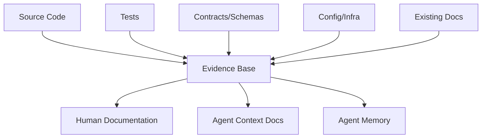
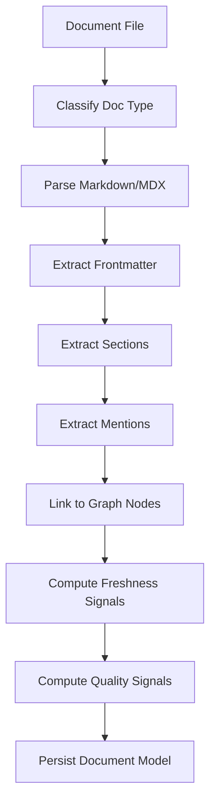
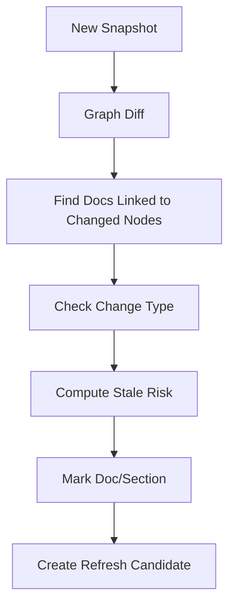
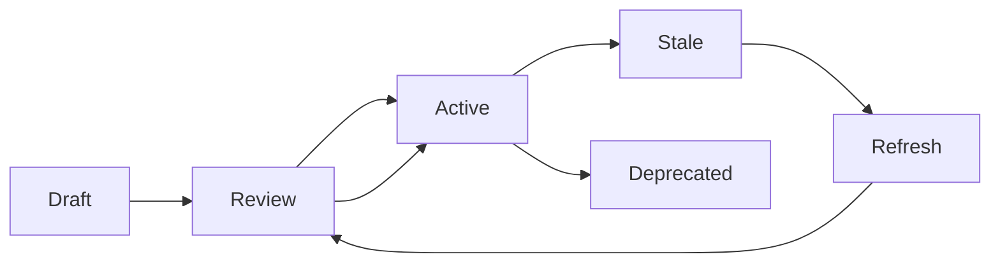
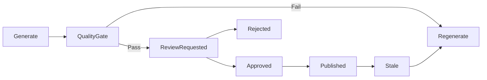
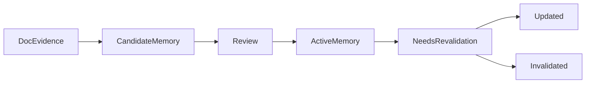

------
title: Learn AI Code Documentation & Agent Memory Platform - Part 010
description: Document knowledge model untuk membaca, mengklasifikasi, mengindeks, mengevaluasi, dan menjaga alignment antara dokumentasi manusia, source code, dan agent memory.
series: learn-ai-code-documentation-agent-memory
seriesTitle: Learn AI Code Documentation & Agent Memory Platform
order: 10
partTitle: Document Knowledge Model
tags:
- ai
- documentation
- document-knowledge
- code-intelligence
- repository-analysis
- stale-docs
- agent-memory
- software-architecture
date: 2026-07-02
---

# Part 010 — Document Knowledge Model

## 1. Tujuan Part Ini

Part 009 membahas code knowledge graph. Sekarang kita fokus pada dokumentasi sebagai knowledge source.

Dalam banyak organisasi, dokumentasi adalah campuran dari:

- README,
- ADR,
- runbook,
- API docs,
- onboarding docs,
- architecture notes,
- release notes,
- comments,
- generated docs,
- old docs,
- wrong docs,
- partial docs,
- duplicated docs.

Platform yang kita bangun tidak boleh memperlakukan semua dokumen sebagai kebenaran.

Dokumentasi harus dimodelkan sebagai **knowledge artifact** dengan:

- type,
- audience,
- scope,
- source,
- freshness,
- confidence,
- evidence,
- relationship to code,
- review status,
- lifecycle.

Target part ini:

1. membedakan document source dan generated document,
2. membuat document taxonomy,
3. mendesain document metadata,
4. menghubungkan docs ke code graph,
5. mendeteksi stale docs,
6. mengelola doc-code alignment,
7. mendukung retrieval dan context assembly berbasis dokumen,
8. membuat quality model untuk documentation,
9. membedakan human docs, agent docs, dan memory source.

---

## 2. Masalah Dokumentasi di Codebase Nyata

Dokumentasi jarang gagal karena orang tidak peduli. Ia gagal karena lifecycle-nya tidak terhubung ke source.

### 2.1 Common Failure Modes

| Failure | Contoh | Dampak |
|---|---|---|
| Stale docs | README menyebut endpoint lama | Engineer/agent salah |
| Duplicate docs | Dua docs menjelaskan flow berbeda | Konflik knowledge |
| Orphan docs | Docs tidak terkait module manapun | Sulit ditemukan |
| Unowned docs | Tidak ada reviewer | Tidak dipercaya |
| Vague docs | "handles orders" | Tidak actionable |
| No provenance | Tidak jelas source claim | Tidak auditable |
| Mixed audience | onboarding + runbook + API docs bercampur | Sulit dipakai |
| Generated but unreviewed | AI docs masuk repo tanpa review | Trust issue |
| Overly broad docs | satu file menjelaskan semuanya | Sulit update |
| No freshness metadata | tidak tahu docs mewakili versi apa | Risky |

### 2.2 AI Memperbesar Masalah Ini

AI bisa menghasilkan docs lebih cepat, tetapi juga bisa menghasilkan docs salah lebih cepat.

Karena itu, generated docs harus punya:

- evidence,
- source version,
- quality report,
- review state,
- stale detection.

---

## 3. Mental Model: Documentation as Projection

Dokumentasi bukan source of truth absolut. Dokumentasi adalah **projection** dari evidence.



Dokumentasi bisa menjadi input dan output.

- Existing docs adalah input evidence.
- Generated docs adalah output projection.
- Reviewed generated docs bisa menjadi stronger evidence later.
- Stale docs harus diturunkan confidence-nya.

---

## 4. Document Taxonomy

### 4.1 Primary Document Types

| Doc Type | Purpose |
|---|---|
| `readme` | Overview repo, setup, usage |
| `module_doc` | Explain module/package/component |
| `api_doc` | Explain API endpoints/contracts |
| `architecture_doc` | Explain structure, boundaries, dependencies |
| `adr` | Record architecture decisions |
| `runbook` | Operational procedures and troubleshooting |
| `onboarding_doc` | Help new engineers ramp up |
| `contributing_doc` | Development workflow |
| `release_note` | Describe release changes |
| `changelog` | Chronological changes |
| `design_doc` | Proposal/design before implementation |
| `generated_doc` | AI/system-generated documentation |
| `agent_context_doc` | Compact doc for AI agents |
| `memory_candidate_doc` | Candidate facts to convert into memory |

### 4.2 Supporting Document Types

| Doc Type | Purpose |
|---|---|
| `comment_doc` | Code comments/docstrings |
| `example_doc` | Usage examples |
| `faq_doc` | Common questions |
| `troubleshooting_doc` | Known issues and fixes |
| `migration_guide` | Upgrade/migration instructions |
| `security_doc` | Threat model/security guidance |
| `compliance_doc` | Compliance/audit guidance |
| `service_catalog_doc` | Ownership and service metadata |

### 4.3 Why Taxonomy Matters

Different docs have different trust, lifecycle, and retrieval behavior.

| Doc Type | Freshness Sensitivity | Review Need | Retrieval Use |
|---|---:|---:|---|
| README | medium | medium | repo overview |
| API docs | high | high | endpoint context |
| ADR | low/medium | high | decision context |
| Runbook | high | high | operations |
| Changelog | append-only | low/medium | timeline |
| Generated docs | high | high | derived explanation |
| Agent context doc | high | medium/high | agent run |

---

## 5. Document Metadata Model

Every document should have structured metadata.

### 5.1 Minimal Metadata

```yaml
document:
  documentId: doc_01J...
  repositoryId: order-service
  snapshotId: snap_6f41ab2
  path: docs/order-validation.md
  title: Order Validation
  docType: module_doc
  audience:
    - backend_engineer
  sourceKind: human_written
  language: markdown
  state: active
  visibility: private
```

### 5.2 Extended Metadata

```yaml
document:
  scope:
    type: module
    paths:
      - src/main/java/com/acme/order/validation
    symbols:
      - OrderValidator
      - RuleRegistry
  freshness:
    generatedAt: null
    lastReviewedAt: 2026-06-12T10:00:00Z
    sourceCommitSha: 6f41ab2
    staleRisk: medium
  quality:
    evidenceCoverage: 0.62
    unsupportedClaims: 3
    duplicateRisk: low
    conflictRisk: medium
  ownership:
    ownerTeam: team-order-platform
    reviewers:
      - alice@example.com
  provenance:
    generatedBy: null
    generatorVersion: null
    basedOnContextPack: null
```

### 5.3 Document State

| State | Meaning |
|---|---|
| `active` | Current useful doc |
| `draft` | Not official |
| `generated_draft` | AI-generated, not reviewed |
| `reviewed` | Human reviewed |
| `deprecated` | No longer recommended |
| `stale` | Source likely changed |
| `archived` | Historical |
| `conflicted` | Contradicts stronger evidence |
| `blocked_sensitive` | Contains sensitive content |

---

## 6. Document Source Kind

Not all docs are equal.

| Source Kind | Meaning |
|---|---|
| `human_written` | Written by human |
| `ai_generated` | Generated by AI |
| `ai_generated_reviewed` | AI-generated and human reviewed |
| `system_generated` | Generated deterministically from contract/schema |
| `external_imported` | Imported from external system |
| `comment_extracted` | Derived from code comments |
| `unknown` | Source unclear |

### 6.1 Trust Implication

| Source Kind | Default Trust |
|---|---:|
| human_written + recent + reviewed | high |
| ADR reviewed | high for decision context |
| system generated from OpenAPI | high for contract shape |
| AI generated reviewed | medium/high |
| AI generated unreviewed | medium/low |
| unknown old docs | low |
| stale docs | low |

Trust is not binary. It affects ranking and claim generation.

---

## 7. Document Scope

Docs must have scope.

### 7.1 Scope Types

| Scope Type | Example |
|---|---|
| repository | entire `order-service` |
| module | `src/main/java/.../validation` |
| package | `com.acme.order.validation` |
| symbol | `OrderValidator.validate` |
| api_operation | `POST /orders` |
| event | `order.created` |
| table | `orders` |
| config_prefix | `order.validation` |
| workflow | CI deploy workflow |
| cross_repository | order + billing services |

### 7.2 Scope Metadata

```yaml
scope:
  type: module
  repositoryId: order-service
  paths:
    - src/main/java/com/acme/order/validation
  logicalNodes:
    - symbol:OrderValidator
    - symbol:RuleRegistry
  graphNeighborhood:
    maxDepth: 1
```

### 7.3 Why Scope Matters

Scope enables:

- stale detection,
- retrieval filtering,
- reviewer assignment,
- doc coverage,
- regeneration,
- conflict detection,
- context assembly.

A doc without scope is hard to maintain.

---

## 8. Document Structure Model

Markdown is text, but we need structure.

### 8.1 Document Sections

Parse docs into sections.

```yaml
sections:
  - sectionId: sec_001
    heading: Purpose
    level: 2
    span: [5, 13]
  - sectionId: sec_002
    heading: Main Components
    level: 2
    span: [15, 42]
```

### 8.2 Section-Level Metadata

```yaml
section:
  heading: Main Components
  docTypeHint: component_explanation
  mentions:
    - OrderValidator
    - RuleRegistry
  evidenceRefs:
    - symbol:OrderValidator
  staleRisk: low
```

### 8.3 Why Section-Level Model

A whole doc may be partially stale.

Example:

- setup section current,
- architecture section stale,
- troubleshooting section still useful.

Regeneration should update section, not always full doc.

---

## 9. Document Parsing Pipeline



### 9.1 Frontmatter Extraction

Example:

```mdx
------
title: Order Validation
description: How order validation rules work
owner: team-order-platform
docType: module_doc
sourceCommit: 6f41ab2
---
```

### 9.2 Heading Extraction

Use headings to build section tree.

```md
# Order Validation
## Purpose
## Main Components
### OrderValidator
### RuleRegistry
## Flow
## Operational Notes
```

### 9.3 Mention Extraction

Detect:

- symbol names,
- file paths,
- endpoint paths,
- event topics,
- table names,
- config keys,
- ADR references,
- issue references.

Example:

```txt
OrderValidator.validate
src/main/java/com/acme/order/validation
POST /orders
order.created
orders
order.validation.max-items
```

---

## 10. Document-Code Linking

Docs become useful when linked to graph nodes.

### 10.1 Mention Edge

```yaml
edge:
  source: doc:docs/order-validation.md
  type: MENTIONS
  target: symbol:OrderValidator
  confidence: 0.74
```

### 10.2 Documentation Edge

If doc is clearly about symbol/module:

```yaml
edge:
  source: symbol:OrderValidator
  type: DOCUMENTED_BY
  target: doc:docs/order-validation.md
  confidence: 0.86
```

### 10.3 Generated From Edge

Generated docs:

```yaml
edge:
  source: generated_doc:order-validation
  type: GENERATED_FROM
  target: symbol:OrderValidator.validate
```

### 10.4 Link Confidence

| Signal | Confidence |
|---|---:|
| explicit metadata symbol ID | high |
| exact qualified name mention | high |
| file path mention | high |
| unique class name mention | medium/high |
| ambiguous simple name | medium/low |
| fuzzy semantic match | low |

### 10.5 Ambiguity Example

Doc mentions `OrderService`.

There may be:

- `com.acme.order.OrderService`,
- `com.acme.billing.OrderService`,
- generated `OrderService`.

Do not link blindly.

Represent candidates:

```yaml
mention:
  text: OrderService
  candidates:
    - com.acme.order.OrderService
    - com.acme.billing.OrderService
  resolution: ambiguous
  confidence: 0.42
```

---

## 11. Freshness Model

Freshness is not just last modified time.

### 11.1 Freshness Inputs

| Signal | Meaning |
|---|---|
| doc last modified | Human update timing |
| source evidence changed | Strong stale signal |
| mentioned symbol deleted | Strong stale signal |
| mentioned endpoint changed | Strong stale signal |
| generated source commit old | Medium/high signal |
| reviewer recent | Reduces stale risk |
| doc has no scope | Increases stale risk |
| doc references missing file | Strong stale signal |
| comments indicate TODO/outdated | Medium signal |

### 11.2 Stale Risk Levels

| Level | Meaning |
|---|---|
| `low` | Evidence still current |
| `medium` | Some linked source changed |
| `high` | Mentioned symbol/contract changed significantly |
| `critical` | Doc references deleted/renamed source or dangerous ops |
| `unknown` | No enough metadata |

### 11.3 Freshness Record

```yaml
freshness:
  staleRisk: high
  reasons:
    - type: mentioned_symbol_deleted
      target: OrderRuleEngine
    - type: source_changed_after_doc_review
      source: OrderValidator.java
      changedAt: 2026-06-30T12:00:00Z
  lastEvaluatedAt: 2026-07-02T00:00:00Z
```

### 11.4 Stale Detection Flow



---

## 12. Documentation Confidence

A document may be useful but not fully trustworthy.

### 12.1 Confidence Factors

| Factor | Impact |
|---|---|
| reviewed recently | positive |
| has source evidence | positive |
| generated from current commit | positive |
| mentions missing symbols | negative |
| conflicts with source | strong negative |
| old and unreviewed | negative |
| ambiguous scope | negative |
| owner exists | positive |
| doc type matches content | positive |

### 12.2 Confidence Example

```yaml
quality:
  confidence: 0.71
  factors:
    - "+ reviewed by team owner"
    - "+ links to OrderValidator"
    - "- source changed after review"
    - "- mentions missing OrderRuleEngine"
```

### 12.3 Use in Retrieval

High-confidence docs rank higher.

Low-confidence docs can still be retrieved but should be marked.

Example context:

```md
Existing documentation says validation uses `OrderRuleEngine`, but this symbol was not found in the current code graph. Treat as stale or uncertain.
```

---

## 13. Document Conflict Detection

Docs can disagree with code or with each other.

### 13.1 Conflict Types

| Conflict | Example |
|---|---|
| doc vs code | doc says endpoint `/order`, code exposes `/orders` |
| doc vs contract | README says field `customerId`, OpenAPI says `accountId` |
| doc vs doc | two docs describe different validation flow |
| doc vs memory | memory says RuleRegistry, doc says RuleEngine |
| generated vs reviewed | AI docs contradict reviewed ADR |

### 13.2 Conflict Record

```yaml
conflict:
  conflictId: conf_01J...
  type: doc_vs_code
  severity: high
  document: docs/order-api.md
  claim: "Create order endpoint is POST /order"
  contradicts:
    evidence:
      type: api_operation
      value: "POST /orders"
      source: OrderController.java
  status: open
```

### 13.3 Conflict Handling

| Conflict | Action |
|---|---|
| high confidence code contradicts doc | mark doc stale/conflicted |
| ADR contradicts code | flag architecture drift |
| generated doc contradicts reviewed doc | lower generated doc confidence |
| two old docs conflict | require review |

---

## 14. Claim-Level Modeling

For high-quality docs, model claims.

### 14.1 What Is a Claim?

A claim is a statement that can be supported or refuted.

Examples:

- "`POST /orders` is handled by `OrderController.createOrder`."
- "Order validation happens before persistence."
- "The service publishes `order.created` after saving."
- "The module uses `order.validation.max-items` config."

### 14.2 Claim Schema

```yaml
claim:
  claimId: claim_01J...
  documentId: doc_01J...
  sectionId: sec_002
  text: "Order validation happens before persistence."
  claimType: behavior
  support:
    evidenceRefs:
      - edge: OrderService.createOrder CALLS OrderValidator.validate
      - edge: OrderService.createOrder CALLS OrderRepository.save
  confidence: 0.78
  status: supported
```

### 14.3 Claim Status

| Status | Meaning |
|---|---|
| `supported` | Evidence supports claim |
| `unsupported` | No evidence found |
| `contradicted` | Evidence refutes claim |
| `uncertain` | Evidence weak/ambiguous |
| `stale` | Evidence changed |
| `not_evaluable` | Claim too vague |

### 14.4 Why Claim-Level Model Matters

It enables:

- unsupported claim detection,
- doc quality gates,
- precise stale detection,
- better human review,
- safer agent context,
- audit trail.

MVP may not need full claim extraction, but production-grade docs benefit from it.

---

## 15. Generated Document Model

Generated docs need more metadata than human docs.

### 15.1 Generated Doc Metadata

```yaml
generatedDocument:
  documentId: docgen_01J...
  docType: module_doc
  state: generated_draft
  repositoryId: order-service
  snapshotId: snap_6f41ab2
  sourceCommitSha: 6f41ab2
  target:
    type: module
    path: src/main/java/com/acme/order/validation
  generation:
    runId: run_01J...
    generatorVersion: docgen-module-v3
    promptTemplateVersion: module-doc-template-v2
    model: configured-via-provider
    contextPackId: ctx_01J...
  quality:
    evidenceCoverage: 0.86
    unsupportedClaimCount: 1
    conflictCount: 0
  review:
    state: pending
    requiredReviewer: team-order-platform
```

### 15.2 Generated Doc States

| State | Meaning |
|---|---|
| `generated_draft` | Created but not reviewed |
| `review_requested` | Waiting review |
| `approved` | Approved by human |
| `published` | Published to repo/portal |
| `rejected` | Not accepted |
| `superseded` | Replaced by newer generated doc |
| `stale` | Source changed |
| `archived` | Historical record |

### 15.3 Never Hide Generated Status

Readers and agents should know whether doc is generated and reviewed.

---

## 16. Agent Context Documents

Agent context docs are not normal documentation.

### 16.1 Purpose

Agent context docs are compact, task-aware knowledge packs.

They may include:

- key symbols,
- coding conventions,
- gotchas,
- related tests,
- dependency warnings,
- forbidden actions,
- current branch assumptions.

### 16.2 Example

```yaml
agentContextDoc:
  target: OrderValidator
  taskTypes:
    - modify_validation_rule
  context:
    entrypoints:
      - OrderValidator.validate
    tests:
      - OrderValidatorTest
    conventions:
      - "Add rules through RuleRegistry."
    warnings:
      - "Do not instantiate validation rules directly in controller."
  evidence:
    - RuleRegistry.java
    - OrderValidatorTest.java
```

### 16.3 Differences from Human Docs

| Human Docs | Agent Context Docs |
|---|---|
| narrative | compact |
| explanatory | operational |
| stable sections | task-specific |
| examples | exact constraints |
| broad context | minimal relevant context |
| pleasant reading | token-efficient |

---

## 17. Documentation Coverage

Coverage measures what is documented.

### 17.1 Coverage Dimensions

| Dimension | Example |
|---|---|
| repository coverage | repo has README |
| module coverage | module has module doc |
| API coverage | endpoints have docs |
| runbook coverage | service has runbook |
| ADR coverage | major decisions recorded |
| test-doc coverage | critical behavior has tests/docs |
| agent context coverage | modules have context docs |

### 17.2 Coverage Record

```yaml
coverage:
  repositoryId: order-service
  snapshotId: snap_6f41ab2
  modules:
    total: 12
    documented: 7
    stale: 2
  apiOperations:
    total: 18
    documented: 15
    stale: 1
  runbooks:
    required: true
    present: false
```

### 17.3 Coverage Is Not Quality

A repo can have 100% docs coverage and still have bad docs.

Coverage must be combined with:

- freshness,
- evidence coverage,
- review status,
- conflict count,
- usefulness feedback.

---

## 18. Documentation Quality Model

### 18.1 Quality Dimensions

| Dimension | Meaning |
|---|---|
| accuracy | Claims match evidence |
| completeness | Covers required scope |
| freshness | Represents current source |
| traceability | Claims cite evidence |
| clarity | Understandable |
| audience fit | Written for intended reader |
| maintainability | Easy to update |
| deduplication | Does not repeat/conflict |
| operational usefulness | Useful during incidents/tasks |
| agent usefulness | Useful for context assembly |

### 18.2 Quality Score Example

```yaml
quality:
  accuracy: 0.89
  completeness: 0.76
  freshness: 0.82
  traceability: 0.91
  clarity: 0.80
  audienceFit: 0.84
  maintainability: 0.73
  overall: 0.82
```

### 18.3 Avoid Fake Precision

Scores should support prioritization, not pretend perfect truth.

Use score bands:

| Band | Meaning |
|---|---|
| 0.90–1.00 | strong |
| 0.75–0.89 | good |
| 0.50–0.74 | needs review |
| below 0.50 | weak/risky |

---

## 19. Document Retrieval

Docs are retrieval candidates, but need ranking rules.

### 19.1 Retrieval Features

| Feature | Boost/Penalty |
|---|---|
| exact title match | boost |
| scope match | boost |
| linked to target symbol | boost |
| reviewed | boost |
| fresh | boost |
| generated unreviewed | penalty |
| stale/conflicted | penalty |
| old unknown source | penalty |
| same repo/module | boost |
| wrong audience | penalty |

### 19.2 Example Ranking

Query:

```txt
How does order validation work?
```

Candidates:

1. `docs/order-validation.md` — module doc, reviewed, linked to OrderValidator.
2. `OrderValidator.java` — source evidence.
3. `OrderValidatorTest.java` — behavior evidence.
4. `README.md` — broad overview.
5. old `docs/legacy-rule-engine.md` — stale/conflicted, lower rank.

### 19.3 Retrieval Output Should Include State

```yaml
document:
  path: docs/legacy-rule-engine.md
  staleRisk: high
  warning: "Mentions OrderRuleEngine, not found in current graph."
```

---

## 20. Document Chunking

Documents should be chunked by structure.

### 20.1 Bad Chunking

Fixed 1000 characters can split section meaning.

### 20.2 Better Chunking

Chunk by:

- heading section,
- subsection,
- list block,
- code block,
- table,
- frontmatter,
- ADR sections.

### 20.3 Section Chunk

```yaml
chunk:
  chunkId: docchunk_01J...
  documentId: doc_01J...
  sectionId: sec_main_components
  headingPath:
    - Order Validation
    - Main Components
  span: [15, 42]
  textHash: sha256:...
  linkedNodes:
    - symbol:OrderValidator
    - symbol:RuleRegistry
  staleRisk: low
```

### 20.4 Chunk Metadata

Include:

- doc type,
- section heading,
- audience,
- freshness,
- review state,
- linked graph nodes,
- source commit,
- generated status.

This improves retrieval and context assembly.

---

## 21. Documentation Lifecycle

### 21.1 Human-Written Docs

Lifecycle:



### 21.2 AI-Generated Docs

Lifecycle:



### 21.3 Memory Candidate Lifecycle

Some docs produce memory candidates.



---

## 22. Document Storage Schema

### 22.1 Documents

```sql
CREATE TABLE documents (
    document_id TEXT PRIMARY KEY,
    tenant_id TEXT NOT NULL,
    repository_id TEXT NOT NULL,
    snapshot_id TEXT,
    commit_sha TEXT,
    path TEXT NOT NULL,
    title TEXT NOT NULL,
    doc_type TEXT NOT NULL,
    source_kind TEXT NOT NULL,
    state TEXT NOT NULL,
    audience JSONB NOT NULL,
    visibility_scope TEXT NOT NULL,
    owner_team TEXT,
    created_at TIMESTAMP NOT NULL,
    updated_at TIMESTAMP NOT NULL
);
```

### 22.2 Document Sections

```sql
CREATE TABLE document_sections (
    section_id TEXT PRIMARY KEY,
    document_id TEXT NOT NULL,
    heading TEXT NOT NULL,
    heading_level INTEGER NOT NULL,
    heading_path JSONB NOT NULL,
    start_line INTEGER NOT NULL,
    end_line INTEGER NOT NULL,
    text_hash TEXT NOT NULL,
    stale_risk TEXT NOT NULL,
    quality_score NUMERIC
);
```

### 22.3 Document Links

```sql
CREATE TABLE document_graph_links (
    id TEXT PRIMARY KEY,
    document_id TEXT NOT NULL,
    section_id TEXT,
    graph_node_id TEXT NOT NULL,
    link_type TEXT NOT NULL,
    confidence NUMERIC NOT NULL,
    evidence_text TEXT,
    created_at TIMESTAMP NOT NULL
);
```

### 22.4 Generated Document Metadata

```sql
CREATE TABLE generated_document_metadata (
    document_id TEXT PRIMARY KEY,
    run_id TEXT NOT NULL,
    context_pack_id TEXT NOT NULL,
    generator_version TEXT NOT NULL,
    prompt_template_version TEXT NOT NULL,
    source_commit_sha TEXT NOT NULL,
    evidence_coverage NUMERIC NOT NULL,
    unsupported_claim_count INTEGER NOT NULL,
    conflict_count INTEGER NOT NULL,
    review_state TEXT NOT NULL
);
```

### 22.5 Document Freshness

```sql
CREATE TABLE document_freshness (
    document_id TEXT PRIMARY KEY,
    stale_risk TEXT NOT NULL,
    last_evaluated_at TIMESTAMP NOT NULL,
    reasons JSONB NOT NULL
);
```

---

## 23. Document Model API

### 23.1 Get Document

```http
GET /documents/{documentId}
```

### 23.2 Search Documents

```http
POST /documents/search
```

Request:

```json
{
  "repositoryId": "repo_order_service",
  "query": "order validation",
  "filters": {
    "docTypes": ["module_doc", "adr"],
    "excludeStale": false,
    "audience": "backend_engineer"
  }
}
```

### 23.3 Get Docs for Symbol

```http
GET /symbols/{symbolId}/documents
```

### 23.4 Freshness Report

```http
GET /repositories/{repositoryId}/documentation/freshness
```

### 23.5 Generate Refresh Candidates

```http
POST /documentation/refresh-candidates
```

---

## 24. Documentation Quality Gates

### 24.1 Generated Docs Gate

Before generated docs become reviewable:

- all major claims have evidence or uncertainty,
- no blocked-sensitive evidence,
- no generated/vendor source as primary evidence unless allowed,
- source commit stored,
- unsupported claim count under threshold,
- conflict count under threshold,
- doc has owner/reviewer.

### 24.2 Existing Docs Gate

For existing docs:

- doc type detected,
- scope inferred or unknown,
- stale risk computed,
- mentions linked to graph,
- conflicts flagged,
- unknown scope reported.

### 24.3 Agent Context Gate

Docs used in agent context must:

- be permission-safe,
- not be high stale risk unless marked,
- be relevant to task,
- have source links where possible,
- avoid long irrelevant prose.

---

## 25. Examples

### 25.1 README Model

```yaml
document:
  path: README.md
  docType: readme
  scope:
    type: repository
    repositoryId: order-service
  audience:
    - developer
  sections:
    - Overview
    - Local Development
    - API
    - Deployment
  staleRisk: medium
```

### 25.2 ADR Model

```yaml
document:
  path: docs/adr/012-validation-rules.md
  docType: adr
  scope:
    type: decision
    relatedNodes:
      - symbol:RuleRegistry
      - module:order.validation
  decision:
    status: accepted
    date: 2026-05-10
  staleRisk: low
```

ADR can stay valid even if implementation changes, but it may indicate architecture drift.

### 25.3 Runbook Model

```yaml
document:
  path: docs/runbooks/order-service.md
  docType: runbook
  scope:
    type: service
    repositoryId: order-service
  operational:
    severity: high
    systems:
      - order-service
      - postgres
      - kafka
  staleRisk: high
  reasons:
    - "Deployment manifest changed after last review"
```

### 25.4 Generated Module Doc

```yaml
document:
  path: generated/order-validation.md
  docType: module_doc
  sourceKind: ai_generated
  state: generated_draft
  scope:
    type: module
    paths:
      - src/main/java/com/acme/order/validation
  quality:
    evidenceCoverage: 0.88
    unsupportedClaimCount: 1
```

---

## 26. Document-Code Alignment

Alignment measures whether docs match code.

### 26.1 Alignment Checks

| Check | Example |
|---|---|
| symbol exists | doc mentions `OrderValidator` and symbol exists |
| file exists | doc references path that exists |
| endpoint matches | doc endpoint matches graph/API contract |
| config key exists | doc config key exists |
| event topic exists | doc event topic found |
| table exists | doc table in schema graph |
| flow matches | doc call flow matches graph |
| docs generated from current commit | source unchanged |

### 26.2 Alignment Report

```yaml
alignment:
  document: docs/order-validation.md
  status: partial
  checks:
    - name: mentioned-symbols-exist
      result: fail
      missing:
        - OrderRuleEngine
    - name: endpoints-match
      result: pass
    - name: source-freshness
      result: warn
      changedSources:
        - OrderValidator.java
```

### 26.3 Use in Review

Reviewers should see:

- what changed,
- what claims are unsupported,
- what source evidence was used,
- what sections are stale.

---

## 27. Document as Memory Source

Docs can feed memory, but only carefully.

### 27.1 Allowed Sources for Memory

Prefer:

- reviewed ADR,
- reviewed module docs,
- source-backed generated docs,
- runbook with owner,
- code comments with source support.

Avoid:

- stale docs,
- unreviewed AI docs,
- ambiguous README claims,
- old wiki imports,
- duplicated docs with conflicts.

### 27.2 Memory Candidate from Doc

```yaml
memoryCandidate:
  statement: "Validation rules should be registered through RuleRegistry."
  source:
    document: docs/adr/012-validation-rules.md
    section: Decision
  supportingEvidence:
    - symbol:RuleRegistry
  confidence: 0.78
  requiresReview: true
```

### 27.3 Memory Should Not Outlive Doc Evidence

If doc becomes stale or contradicted, memory should be revalidated.

---

## 28. Practical Exercise

Build document model for one repository.

### 28.1 Input

Use files:

```txt
README.md
docs/adr/012-validation-rules.md
docs/order-validation.md
docs/runbooks/order-service.md
src/main/java/com/acme/order/validation/OrderValidator.java
openapi/order-api.yaml
```

### 28.2 Output

Produce:

```txt
documents.json
document-sections.json
document-graph-links.json
document-freshness-report.yaml
document-alignment-report.yaml
```

### 28.3 Acceptance Criteria

- README classified as repository doc,
- ADR classified and linked to module/symbol,
- order-validation doc linked to `OrderValidator`,
- runbook classified as operational doc,
- stale mentions detected,
- generated docs have source metadata,
- docs can be retrieved by target symbol,
- stale docs are not used as high-confidence source.

---

## 29. Common Mistakes

### 29.1 Treating Docs as Always True

Docs are evidence, not truth. Code/contracts/tests may contradict them.

### 29.2 Ignoring Scope

Docs without scope cannot be maintained well.

### 29.3 No Section Model

Whole-doc stale marking is too coarse.

### 29.4 No Generated Metadata

AI-generated docs without generation metadata are hard to trust.

### 29.5 No Review State

Generated docs should not silently become official.

### 29.6 No Conflict Detection

Duplicate docs can contradict each other and poison retrieval.

### 29.7 Using Stale Docs in Agent Context

Agents can make bad changes if fed old docs without warnings.

---

## 30. Summary

Document knowledge model turns documentation into maintainable, queryable, auditable knowledge.

Key points:

1. documentation is both input and output,
2. docs are projections of evidence, not absolute truth,
3. doc taxonomy affects lifecycle, trust, and retrieval,
4. docs need scope, audience, freshness, quality, and ownership metadata,
5. section-level modeling enables partial stale detection,
6. document-code links power alignment and retrieval,
7. generated docs need run metadata, evidence, and review state,
8. stale/conflicted docs must be marked before entering agent context,
9. docs can feed memory only when evidence-backed and governed,
10. document quality is multi-dimensional: accuracy, freshness, traceability, clarity, and usefulness.

Part berikutnya membahas **Agent Context and Memory Model**: bagaimana membedakan session memory, task memory, repo memory, decision memory, dan long-term memory; bagaimana memory dibuat, direview, dipakai, dan di-invalidate.
