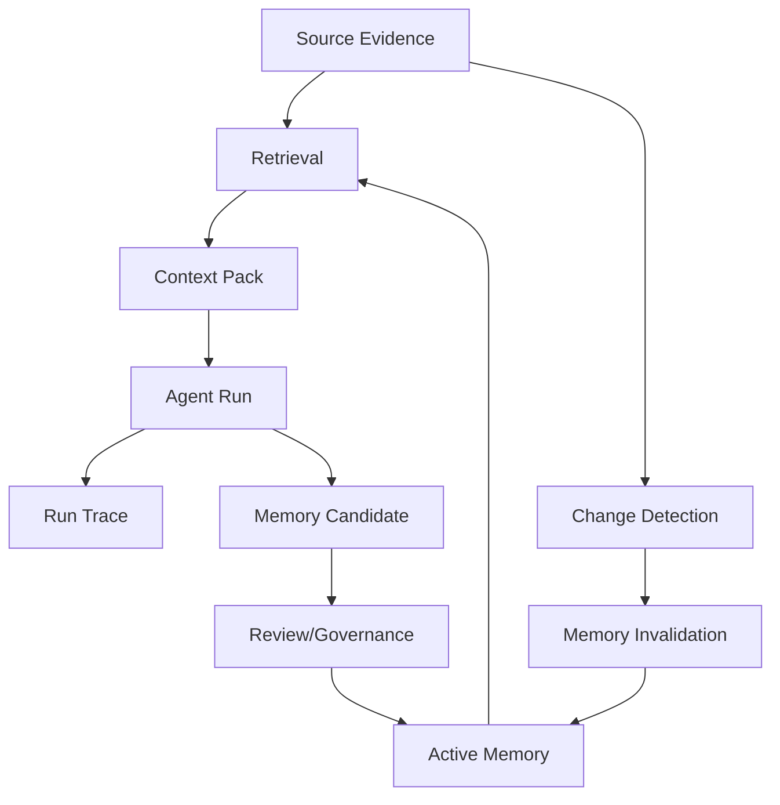
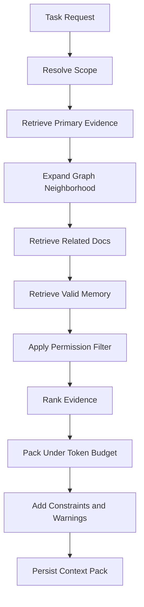
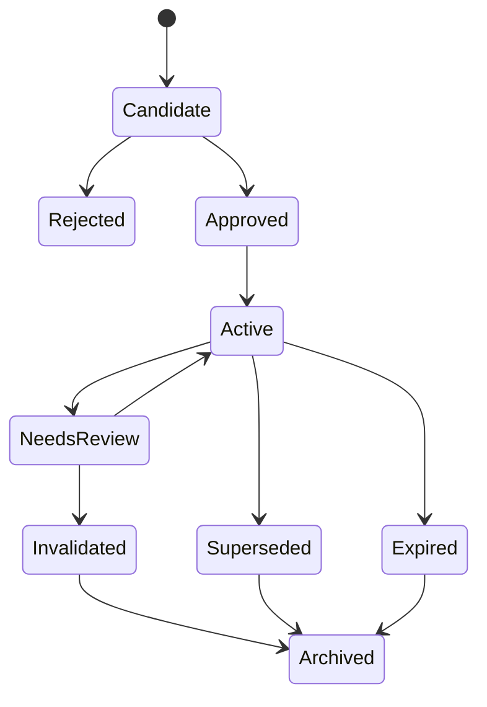
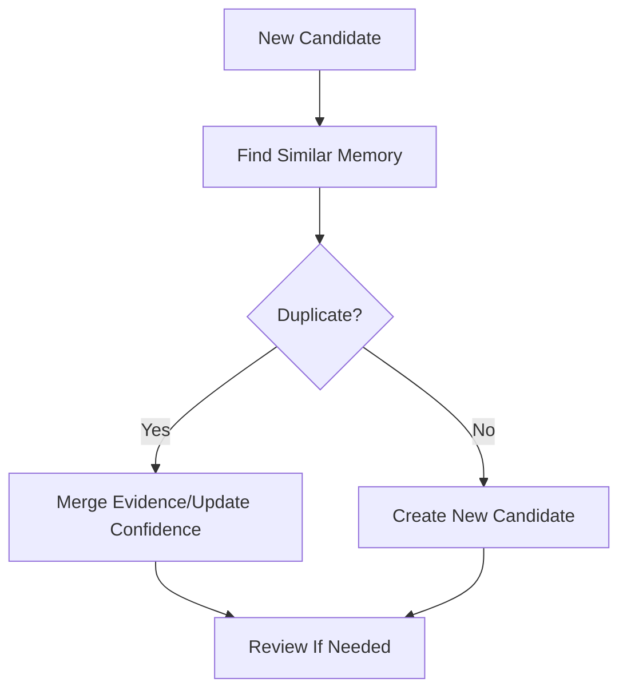

------
title: Learn AI Code Documentation & Agent Memory Platform - Part 011
description: Agent context dan memory model untuk membedakan session memory, task memory, repository memory, decision memory, dan long-term memory yang evidence-based, scoped, versioned, dan governable.
series: learn-ai-code-documentation-agent-memory
seriesTitle: Learn AI Code Documentation & Agent Memory Platform
order: 11
partTitle: Agent Context and Memory Model
tags:
- ai
- agent-memory
- agent-context
- code-intelligence
- repository-analysis
- documentation
- software-architecture
date: 2026-07-02
---

# Part 011 — Agent Context and Memory Model

## 1. Tujuan Part Ini

Part 010 membahas document knowledge model. Sekarang kita masuk ke bagian yang sering disalahpahami: **agent context** dan **agent memory**.

Dalam banyak sistem AI, istilah "memory" dipakai terlalu longgar. Kadang maksudnya chat history. Kadang maksudnya cache. Kadang maksudnya vector index. Kadang maksudnya user preference. Kadang maksudnya summary lama yang tidak pernah expire.

Untuk platform repository intelligence, definisi seperti itu berbahaya.

Kita butuh model yang jelas:

- context adalah input untuk run tertentu,
- memory adalah derived knowledge yang bisa dipakai lintas run,
- source of truth tetap repository, docs, contracts, tests, dan review record,
- memory harus punya evidence,
- memory harus punya scope,
- memory harus bisa expire,
- memory harus mengikuti permission,
- memory tidak boleh menjadi tempat sampah summary.

Target part ini:

1. membedakan context, cache, summary, knowledge, dan memory,
2. mendesain agent context pack,
3. membedakan session memory, task memory, repository memory, decision memory, user/team preference, dan evaluation memory,
4. membuat schema memory yang evidence-based,
5. mengatur lifecycle memory: candidate, review, active, stale, invalidated,
6. mendesain retrieval memory untuk agent,
7. menghindari memory contamination,
8. menghubungkan memory ke graph, docs, dan provenance,
9. membuat governance model untuk memory,
10. membuat quality gates agar memory tidak memperburuk agent.

---

## 2. Definisi Dasar

### 2.1 Context

Context adalah informasi yang diberikan ke model/agent untuk satu run atau satu step.

Contoh:

```yaml
context:
  task: "Modify order validation rule"
  targetSymbol: OrderValidator.validate
  evidence:
    - OrderValidator.java
    - OrderValidatorTest.java
  constraints:
    - "Do not modify controller directly"
```

Context biasanya:

- sementara,
- task-specific,
- token-budgeted,
- assembled dari evidence,
- tidak otomatis disimpan.

### 2.2 Memory

Memory adalah knowledge yang disimpan agar agent bisa menggunakannya di masa depan.

Contoh:

```yaml
memory:
  statement: "Validation rules are registered through RuleRegistry."
  scope: repository:order-service
  evidence:
    - RuleRegistry.java
  expiresWhen:
    - symbolChanged: RuleRegistry
```

Memory biasanya:

- persistent,
- scoped,
- evidence-based,
- versioned,
- governable,
- retrievable lintas run.

### 2.3 Cache

Cache mempercepat akses.

Contoh:

```txt
embedding result cache
parse result cache
retrieval result cache
```

Cache boleh dihapus tanpa kehilangan meaning. Memory tidak boleh diperlakukan seperti cache karena memory memengaruhi reasoning agent.

### 2.4 Summary

Summary adalah kompresi informasi.

Summary bisa menjadi input memory candidate, tetapi summary bukan otomatis memory.

Bad:

```yaml
memory: "Order service is complex and validates orders."
```

Good:

```yaml
memory:
  statement: "Order validation entry point is OrderValidator.validate."
  evidence:
    - symbol: OrderValidator.validate
```

---

## 3. Mental Model



Memory bukan jalan pintas untuk melewati evidence. Memory adalah knowledge turunan yang selalu bisa kembali ke evidence.

---

## 4. Kenapa Agent Memory Sulit

### 4.1 Memory Bisa Membantu

Memory bisa membuat agent:

- tidak mengulang eksplorasi repo,
- tahu convention lokal,
- tahu decision lama,
- tahu gotcha,
- tahu module ownership,
- tahu test strategy,
- tahu migration caveat.

### 4.2 Memory Bisa Merusak

Memory juga bisa membuat agent:

- percaya fakta lama,
- memakai convention yang sudah berubah,
- mencampur repo/tenant,
- menyimpan secret,
- mengulang kesalahan,
- mengabaikan source terbaru,
- memberi jawaban yakin tapi salah.

### 4.3 Prinsip Utama

```txt
Memory must never be more trusted than its source evidence.
```

Jika source berubah, memory harus direvalidasi.

---

## 5. Jenis-Jenis Memory

### 5.1 Session Memory

Session memory adalah konteks percakapan/run saat ini.

Contoh:

```yaml
sessionMemory:
  currentTask: "Generate docs for order validation module"
  userAskedFor: "Baeldung-style MDX"
  currentTarget: "src/main/java/com/acme/order/validation"
```

Karakteristik:

| Dimensi | Nilai |
|---|---|
| Lifetime | short |
| Scope | conversation/run |
| Evidence | user messages + run state |
| Persistent | biasanya tidak |
| Risk | medium |
| Use | continuity dalam run |

### 5.2 Task Memory

Task memory menyimpan state pengerjaan task.

Contoh:

```yaml
taskMemory:
  taskId: task_01J...
  plan:
    - retrieve validation symbols
    - inspect tests
    - generate module doc
  decisions:
    - "Use OrderValidator as main entry point"
  unresolved:
    - "Retry behavior not found"
```

Karakteristik:

| Dimensi | Nilai |
|---|---|
| Lifetime | selama task |
| Scope | task |
| Evidence | context + trace |
| Persistent | optional sampai task selesai |
| Use | multi-step agent workflow |

### 5.3 Repository Memory

Repository memory menyimpan fakta relatif stabil tentang repo.

Contoh:

```yaml
repoMemory:
  statement: "Order validation rules are registered through RuleRegistry."
  scope: repository:order-service
  evidence:
    - RuleRegistry.java
    - OrderValidator.java
```

Karakteristik:

| Dimensi | Nilai |
|---|---|
| Lifetime | medium |
| Scope | repository/module |
| Evidence | source code/docs/tests |
| Review | recommended |
| Expiry | source-change driven |
| Use | agent context lintas run |

### 5.4 Decision Memory

Decision memory menyimpan keputusan arsitektur atau trade-off.

Contoh:

```yaml
decisionMemory:
  statement: "Validation rules are centralized to avoid controller-level validation duplication."
  source:
    - docs/adr/012-validation-rules.md
  status: accepted
```

Karakteristik:

| Dimensi | Nilai |
|---|---|
| Lifetime | long |
| Scope | module/repo/org |
| Evidence | ADR/reviewed doc |
| Expiry | decision superseded |
| Use | architectural consistency |

### 5.5 User/Team Preference Memory

Preference memory menyimpan preferensi style/workflow.

Contoh:

```yaml
preferenceMemory:
  statement: "Team prefers module docs with Mermaid sequence diagrams and evidence table."
  scope: team:order-platform
  evidence:
    - user_feedback
  expiry: review_after_90_days
```

Karakteristik:

| Dimensi | Nilai |
|---|---|
| Lifetime | medium |
| Scope | user/team |
| Evidence | explicit feedback |
| Sensitive | can be |
| Use | output customization |

### 5.6 Evaluation Memory

Evaluation memory menyimpan failure dan lessons learned dari run sebelumnya.

Contoh:

```yaml
evaluationMemory:
  statement: "Previous doc generation for OrderValidator missed RuleRegistry tests."
  scope: repository:order-service
  evidence:
    - eval_run: run_01J...
  recommendation: "Always include RuleRegistryTest when generating validation docs."
```

Karakteristik:

| Dimensi | Nilai |
|---|---|
| Lifetime | medium |
| Scope | repo/task type |
| Evidence | eval trace |
| Use | improve future runs |
| Risk | can encode wrong fixes |

### 5.7 Organizational Memory

Organizational memory menyimpan kebijakan atau convention lintas repo.

Contoh:

```yaml
orgMemory:
  statement: "Services must document externally exposed Kafka topics in AsyncAPI."
  scope: org:acme
  evidence:
    - engineering-handbook/events.md
  reviewState: approved
```

Karakteristik:

| Dimensi | Nilai |
|---|---|
| Lifetime | long |
| Scope | org |
| Evidence | handbook/policy |
| Review | required |
| Use | governance and consistency |

---

## 6. Context vs Memory

### 6.1 Perbandingan

| Dimensi | Context | Memory |
|---|---|---|
| Lifetime | one run/step | cross-run |
| Scope | task-specific | scoped persistent |
| Source | retrieval/trace/user input | evidence-backed record |
| Token budget | yes | stored compactly |
| Review | not always | often required |
| Expiry | after run | policy-driven |
| Permission | required | required |
| Mutation | per run | controlled lifecycle |

### 6.2 Context Pack Bisa Berisi Memory

Context pack dapat menyertakan memory yang relevan.

```yaml
contextPack:
  evidence:
    - source code
    - tests
    - docs
  memory:
    - repo convention
    - decision memory
  warnings:
    - stale docs excluded
```

### 6.3 Memory Tidak Menggantikan Evidence

Jika memory mengatakan:

```txt
Validation rules use RuleRegistry.
```

Agent tetap harus mendapatkan evidence jika task-nya mengubah code di area itu.

Memory membantu menemukan evidence, bukan menggantikannya.

---

## 7. Agent Context Pack

Context pack adalah paket structured context untuk agent.

### 7.1 Tujuan

Context pack harus menjawab:

1. apa task-nya,
2. apa target-nya,
3. source evidence apa yang relevan,
4. memory apa yang valid,
5. constraints apa yang harus dipatuhi,
6. tools apa yang boleh dipakai,
7. uncertainty apa yang diketahui,
8. apa yang sengaja tidak disertakan.

### 7.2 Context Pack Schema

```yaml
contextPack:
  contextPackId: ctx_01J...
  task:
    type: code_change
    description: "Add validation rule for corporate orders"
  scope:
    tenantId: acme
    repositoryId: order-service
    snapshotId: snap_6f41ab2
    branch: main
    commitSha: 6f41ab2
  target:
    kind: symbol
    logicalSymbolId: OrderValidator.validate
  budget:
    maxTokens: 8000
    estimatedTokens: 7420
  evidence:
    - kind: source_symbol
      path: src/main/java/com/acme/order/validation/OrderValidator.java
      lines: [12, 144]
      reason: "Primary validation entry point"
      confidence: 0.94
    - kind: test_case
      path: src/test/java/com/acme/order/validation/OrderValidatorTest.java
      lines: [20, 188]
      reason: "Direct validation tests"
      confidence: 0.88
  memory:
    - memoryId: mem_rule_registry
      statement: "Rules are registered through RuleRegistry."
      confidence: 0.82
  constraints:
    - "Do not modify controller-level validation unless evidence shows controller owns rule."
    - "Update related tests."
  allowedTools:
    - search_code
    - get_symbol
    - get_tests
    - propose_patch
  warnings:
    - "No ADR found for corporate order validation."
  excluded:
    - path: docs/legacy-rule-engine.md
      reason: "stale; mentions missing symbol"
```

### 7.3 Context Pack as Artifact

Context pack should be persisted because it explains agent behavior.

When user asks:

> "Why did the agent change this file?"

The system can answer:

- context pack included file X,
- memory Y influenced decision,
- evidence Z supported claim,
- stale doc A was excluded.

---

## 8. Context Assembly Inputs

### 8.1 Query Intent

Different task types need different context.

| Task Type | Needed Context |
|---|---|
| explain module | source, docs, graph, examples |
| modify code | target symbol, callers, callees, tests, constraints |
| generate docs | evidence, docs, graph, freshness |
| review PR | changed files, impacted tests, docs, graph diff |
| debug issue | logs if available, code path, runbook, config |
| migrate API | contracts, consumers, tests, docs, changelog |

### 8.2 Scope

Scope includes:

- tenant,
- repository,
- branch/commit,
- module path,
- symbol,
- doc type,
- user permission.

### 8.3 Evidence Sources

Evidence can come from:

- source code,
- tests,
- contracts,
- schemas,
- docs,
- graph paths,
- memory,
- previous run traces,
- review comments.

### 8.4 Constraints

Constraints can come from:

- user instruction,
- policy,
- ADR,
- coding convention,
- task type,
- permission,
- tool capability.

---

## 9. Context Assembly Algorithm



### 9.1 Ranking Signals

| Signal | Effect |
|---|---|
| target symbol match | strong boost |
| direct test relation | strong boost |
| direct caller/callee | boost |
| source freshness | boost |
| reviewed docs | boost |
| memory confidence | boost |
| stale docs | penalty |
| generated/vendor | penalty |
| low confidence graph edge | penalty |
| outside task scope | penalty |

### 9.2 Packing Strategy

Suggested order for code change task:

1. task + constraints,
2. target symbol,
3. parent class/module,
4. directly related tests,
5. direct callers/callees,
6. config/schema/contracts,
7. valid memory,
8. relevant docs,
9. warnings/uncertainties.

### 9.3 Context Compression

Compression must preserve evidence.

Bad compression:

```txt
The validation module handles order validation.
```

Better compression:

```yaml
summary: "OrderValidator.validate is the primary validation entry point. It delegates rule lookup to RuleRegistry."
evidence:
  - OrderValidator.java:12-144
  - RuleRegistry.java:10-88
```

---

## 10. Memory Record Schema

### 10.1 Minimal Memory Record

```yaml
memory:
  memoryId: mem_01J...
  type: repo_convention
  scope:
    type: repository
    repositoryId: order-service
  statement: "Validation rules are registered through RuleRegistry."
  evidence:
    - repositoryId: order-service
      snapshotId: snap_6f41ab2
      path: src/main/java/com/acme/order/validation/RuleRegistry.java
      lines: [10, 88]
  confidence: 0.82
  state: active
```

### 10.2 Full Memory Record

```yaml
memory:
  memoryId: mem_01J...
  logicalMemoryId: memlog_order_validation_rule_registry
  type: repo_convention
  statement: "Validation rules are registered through RuleRegistry, not instantiated directly in controllers."
  normalizedStatement: "validation_rules_registered_through_rule_registry"
  scope:
    tenantId: acme
    repositoryId: order-service
    modulePath: src/main/java/com/acme/order/validation
    visibility: private
  grounding:
    graphNodes:
      - symbol:RuleRegistry
      - symbol:OrderValidator
    graphEdges:
      - OrderValidator.validate CALLS RuleRegistry.resolve
    evidenceRefs:
      - path: src/main/java/com/acme/order/validation/RuleRegistry.java
        commitSha: 6f41ab2
        lines: [10, 88]
  lifecycle:
    state: active
    createdAt: 2026-07-02T00:00:00Z
    lastValidatedAt: 2026-07-02T00:00:00Z
    expiresAt: null
    invalidationPolicy:
      - symbolChanged: RuleRegistry
      - symbolDeleted: RuleRegistry
      - graphEdgeRemoved: OrderValidator.validate CALLS RuleRegistry.resolve
  quality:
    confidence: 0.82
    sourceStrength: high
    reviewState: approved
    conflictState: none
  governance:
    createdBy: ai_system
    approvedBy: team-order-platform
    allowedUse:
      - context_assembly
      - documentation_generation
    prohibitedUse:
      - direct_code_change_without_evidence
```

---

## 11. Memory Types

### 11.1 Repository Convention

```yaml
type: repo_convention
statement: "All validation rules are registered through RuleRegistry."
```

Use for:

- local coding conventions,
- module patterns,
- test conventions,
- naming patterns.

### 11.2 Architecture Decision

```yaml
type: architecture_decision
statement: "Validation rules are centralized to avoid duplicated controller logic."
```

Source should usually be ADR or reviewed design doc.

### 11.3 Code Location

```yaml
type: code_location
statement: "Order creation entry point is OrderController.createOrder."
```

Useful for agent navigation.

### 11.4 Operational Knowledge

```yaml
type: operational
statement: "Order service uses order.validation.max-items to limit order item count."
```

Useful for runbooks and debugging.

### 11.5 Known Pitfall

```yaml
type: pitfall
statement: "Do not update generated OpenAPI client directly; update openapi/order-api.yaml."
```

Very useful for agents.

### 11.6 Test Strategy

```yaml
type: test_strategy
statement: "Validation changes should update OrderValidatorTest and RuleRegistryTest."
```

### 11.7 User/Team Preference

```yaml
type: preference
statement: "Team prefers generated module docs to include evidence tables."
```

Must come from explicit feedback or approved policy.

### 11.8 Evaluation Lesson

```yaml
type: evaluation_lesson
statement: "Previous retrieval missed RuleRegistryTest; include tests linked by naming and call graph."
```

---

## 12. Memory Scope

Scope prevents memory leakage and misuse.

### 12.1 Scope Dimensions

| Dimension | Examples |
|---|---|
| tenant | `acme` |
| organization | `acme-engineering` |
| team | `team-order-platform` |
| repository | `order-service` |
| module | `order.validation` |
| symbol | `OrderValidator.validate` |
| task type | `documentation_generation` |
| user | specific user preference |
| environment | dev/staging/prod |
| visibility | private/internal/public |

### 12.2 Scope Example

```yaml
scope:
  tenantId: acme
  repositoryId: order-service
  modulePath: src/main/java/com/acme/order/validation
  appliesTo:
    taskTypes:
      - code_change
      - documentation_generation
    branches:
      - main
  visibility:
    teams:
      - team-order-platform
```

### 12.3 Scope Invariant

```txt
Memory scope must be no broader than its evidence scope.
```

If evidence is from private repo, memory cannot be org-public unless reviewed and sanitized.

---

## 13. Memory Lifecycle



### 13.1 Candidate

Created by:

- agent run,
- doc generation,
- human suggestion,
- evaluation pipeline.

Candidate memory is not automatically used for high-trust tasks.

### 13.2 Approved

Approved by:

- human reviewer,
- policy rule,
- deterministic extraction with high confidence.

### 13.3 Active

Can be retrieved into context packs.

### 13.4 Needs Review

Triggered by:

- source changed,
- graph edge changed,
- conflict detected,
- confidence dropped,
- policy changed.

### 13.5 Invalidated

Memory should not be used except for audit/history.

### 13.6 Superseded

Replaced by newer memory.

### 13.7 Expired

Time-based or policy-based expiration.

---

## 14. Memory Invalidation

Memory must expire when source changes.

### 14.1 Invalidation Triggers

| Trigger | Example |
|---|---|
| file changed | `RuleRegistry.java` changed |
| symbol changed | `RuleRegistry.register` body changed |
| symbol deleted | `RuleRegistry` removed |
| graph edge removed | `OrderValidator` no longer calls `RuleRegistry` |
| doc stale | ADR superseded |
| conflict detected | source contradicts memory |
| permission changed | repo visibility changed |
| policy changed | memory type no longer allowed |
| age threshold | not reviewed in 180 days |

### 14.2 Invalidation Policy

```yaml
invalidationPolicy:
  sourceChange:
    - symbolChanged: RuleRegistry
    - fileChanged: src/main/java/com/acme/order/validation/RuleRegistry.java
  graphChange:
    - edgeRemoved: OrderValidator.validate CALLS RuleRegistry.resolve
  documentChange:
    - adrSuperseded: docs/adr/012-validation-rules.md
  time:
    reviewAfterDays: 90
```

### 14.3 Invalidation Result

```yaml
memory:
  memoryId: mem_rule_registry
  state: needs_review
  reason:
    - "Grounding symbol RuleRegistry changed in commit 9ab812c"
  action:
    - "revalidate from latest snapshot"
```

---

## 15. Memory Retrieval

Memory retrieval is different from document retrieval.

### 15.1 Query Inputs

```yaml
memoryQuery:
  taskType: code_change
  repositoryId: order-service
  targetSymbol: OrderValidator.validate
  userId: user_123
  maxRecords: 10
```

### 15.2 Filters

Filter by:

- permission,
- scope,
- state active,
- task applicability,
- confidence,
- freshness,
- conflict state,
- source version compatibility.

### 15.3 Ranking

```txt
memoryScore =
    scopeMatch * 4
  + targetGraphProximity * 3
  + confidence * 2
  + reviewBoost
  + recencyBoost
  - stalePenalty
  - conflictPenalty
```

### 15.4 Retrieval Output

```yaml
retrievedMemory:
  - memoryId: mem_rule_registry
    statement: "Validation rules are registered through RuleRegistry."
    reason: "Same module and direct graph relation to target symbol"
    confidence: 0.82
    evidence:
      - RuleRegistry.java:10-88
```

---

## 16. Memory Consolidation

Agents may create many overlapping memory candidates.

### 16.1 Duplicate Memory

Candidate 1:

```txt
Rules are registered through RuleRegistry.
```

Candidate 2:

```txt
Validation uses RuleRegistry as rule source.
```

Consolidate into one canonical memory.

### 16.2 Consolidation Process



### 16.3 Merge Rules

Merge only if:

- same scope,
- same core statement,
- non-conflicting evidence,
- compatible memory type.

Do not merge:

- one repo memory with org memory,
- one old stale memory with current active memory,
- similar text but different target symbol.

---

## 17. Memory Conflict Handling

### 17.1 Conflict Example

Memory A:

```txt
Validation rules are registered through RuleRegistry.
```

Memory B:

```txt
Validation rules are configured directly in OrderValidator.
```

If both active, agent may behave inconsistently.

### 17.2 Conflict Detection

Detect by:

- contradictory statements,
- same scope/type but different target,
- source graph changed,
- doc-code conflict,
- human review rejection.

### 17.3 Conflict Record

```yaml
conflict:
  conflictId: conf_mem_01J
  memoryIds:
    - mem_rule_registry
    - mem_order_validator_direct
  scope: repository:order-service
  severity: medium
  status: open
  resolution:
    required: human_review
```

### 17.4 Use Policy During Conflict

Default:

```txt
Do not retrieve conflicted memory into agent context unless explicitly marked as warning.
```

---

## 18. Memory and Secrets

Memory must never store secrets.

### 18.1 Prohibited Memory

Bad:

```yaml
statement: "Production DB password is supersecret"
```

Bad:

```yaml
statement: "Stripe API key starts with sk_live..."
```

### 18.2 Allowed Sanitized Memory

```yaml
statement: "Billing service requires STRIPE_API_KEY environment variable."
evidence:
  - path: .env.example
    redacted: true
```

### 18.3 Secret Safety Gate

Before memory candidate is stored:

- run secret detector,
- redact sensitive values,
- block prohibited patterns,
- check source classification,
- store only safe structural knowledge.

---

## 19. Memory and Permission

### 19.1 Permission Inheritance

Memory visibility must follow evidence.

If memory grounded in private repo:

```txt
memory visibility <= private repo visibility
```

### 19.2 Query-Time Filtering

Memory retrieval must include principal.

```java
List<MemoryRecord> retrieve(MemoryQuery query, Principal principal);
```

### 19.3 Multi-Repo Memory

If memory combines evidence from two repos, visibility is intersection.

```yaml
memory:
  evidence:
    - private repo A
    - internal repo B
  visibility: private_to_intersection
```

### 19.4 Derived Knowledge Leak

Even a sanitized statement can leak architecture.

Example:

```txt
Fraud service consumes high-risk-payment.created.
```

This may be sensitive. Treat derived relationships as controlled data.

---

## 20. Memory and Documentation

Memory can support docs, and docs can support memory.

### 20.1 Memory from Docs

Allowed when docs are:

- reviewed,
- scoped,
- fresh,
- evidence-backed,
- not conflicted.

### 20.2 Docs from Memory

Generated docs can include memory, but must cite it as memory and preferably source evidence.

```md
The team convention is to register validation rules through `RuleRegistry`.

Evidence:
- Memory: `mem_rule_registry`
- Source: `RuleRegistry.java`
```

### 20.3 Avoid Circular Trust

Bad loop:

```txt
AI generates doc -> doc becomes memory -> memory generates future doc -> no source evidence
```

Prevent by requiring memory to preserve original source evidence.

---

## 21. Memory and Graph

### 21.1 Grounding in Graph

Memory should link to graph nodes/edges.

```yaml
grounding:
  nodes:
    - symbol:RuleRegistry
  edges:
    - OrderValidator.validate CALLS RuleRegistry.resolve
```

### 21.2 Graph-Based Retrieval

When target is `OrderValidator.validate`, retrieve memory grounded in:

- target node,
- parent node,
- direct callers/callees,
- related docs,
- related tests.

### 21.3 Graph-Based Invalidation

If graph diff removes edge:

```yaml
removed:
  - OrderValidator.validate CALLS RuleRegistry.resolve
```

Then memory grounded in that edge becomes needs_review.

---

## 22. Memory Quality Model

### 22.1 Quality Dimensions

| Dimension | Meaning |
|---|---|
| evidence strength | source quality |
| specificity | not vague |
| scope correctness | not too broad |
| freshness | source current |
| confidence | extraction/review confidence |
| usefulness | helps future tasks |
| safety | no secrets/sensitive leak |
| conflict state | no contradiction |
| review state | approved or not |

### 22.2 Quality Score

```yaml
quality:
  evidenceStrength: 0.90
  specificity: 0.84
  scopeCorrectness: 0.88
  freshness: 0.91
  usefulness: 0.76
  safety: 1.00
  conflictPenalty: 0.00
  overall: 0.86
```

### 22.3 Reject Vague Memory

Reject:

```txt
Order service is important.
```

Accept:

```txt
OrderService.createOrder validates request before calling OrderRepository.save.
```

---

## 23. Memory Write Policy

Agents should not freely write memory.

### 23.1 Write Modes

| Mode | Meaning |
|---|---|
| disabled | agent cannot write memory |
| candidate_only | agent can propose memory |
| auto_approve_safe | deterministic safe facts auto-approved |
| human_review_required | reviewer required |
| admin_only | only admin/system can write |

Default for production:

```txt
candidate_only
```

### 23.2 Candidate Creation

Agent can propose:

```yaml
memoryCandidate:
  statement: "RuleRegistry is the central validation rule registry."
  evidence:
    - RuleRegistry.java
  reason: "Observed during documentation generation"
```

### 23.3 Approval

Approval should check:

- evidence exists,
- scope correct,
- no secret,
- not duplicate,
- not conflict,
- useful enough.

---

## 24. Memory Store Schema

### 24.1 Memory Records

```sql
CREATE TABLE memory_records (
    memory_id TEXT PRIMARY KEY,
    logical_memory_id TEXT NOT NULL,
    tenant_id TEXT NOT NULL,
    memory_type TEXT NOT NULL,
    statement TEXT NOT NULL,
    normalized_statement TEXT NOT NULL,
    scope_type TEXT NOT NULL,
    scope_ref TEXT NOT NULL,
    state TEXT NOT NULL,
    confidence NUMERIC NOT NULL,
    review_state TEXT NOT NULL,
    conflict_state TEXT NOT NULL,
    visibility_scope TEXT NOT NULL,
    created_by TEXT NOT NULL,
    created_at TIMESTAMP NOT NULL,
    last_validated_at TIMESTAMP,
    expires_at TIMESTAMP
);
```

### 24.2 Memory Evidence

```sql
CREATE TABLE memory_evidence (
    evidence_id TEXT PRIMARY KEY,
    memory_id TEXT NOT NULL,
    evidence_type TEXT NOT NULL,
    repository_id TEXT,
    snapshot_id TEXT,
    commit_sha TEXT,
    path TEXT,
    start_line INTEGER,
    end_line INTEGER,
    graph_node_id TEXT,
    graph_edge_id TEXT,
    document_id TEXT,
    text_hash TEXT
);
```

### 24.3 Memory Scope

```sql
CREATE TABLE memory_scopes (
    id TEXT PRIMARY KEY,
    memory_id TEXT NOT NULL,
    scope_dimension TEXT NOT NULL,
    scope_value TEXT NOT NULL
);
```

### 24.4 Memory Events

```sql
CREATE TABLE memory_events (
    event_id TEXT PRIMARY KEY,
    memory_id TEXT NOT NULL,
    event_type TEXT NOT NULL,
    event_payload JSONB NOT NULL,
    actor TEXT NOT NULL,
    created_at TIMESTAMP NOT NULL
);
```

### 24.5 Memory Conflicts

```sql
CREATE TABLE memory_conflicts (
    conflict_id TEXT PRIMARY KEY,
    memory_id_a TEXT NOT NULL,
    memory_id_b TEXT NOT NULL,
    scope_ref TEXT NOT NULL,
    severity TEXT NOT NULL,
    status TEXT NOT NULL,
    reason TEXT NOT NULL,
    created_at TIMESTAMP NOT NULL
);
```

---

## 25. Agent Use of Memory

### 25.1 Safe Prompt Pattern

Context should separate evidence and memory.

```md
# Source Evidence

The following code evidence comes from the current repository snapshot.

...

# Approved Memory

The following memory records are approved but derived. Use them as guidance, not as replacement for source evidence.

- Memory `mem_rule_registry`: Validation rules are registered through RuleRegistry.
  Evidence: RuleRegistry.java:10-88
```

### 25.2 Do Not Hide Memory Origin

Agent should know:

- this is memory,
- state,
- confidence,
- evidence,
- scope,
- freshness.

### 25.3 Memory as Navigation Hint

Best use:

```txt
Memory suggests RuleRegistry is relevant, so retrieve RuleRegistry.java.
```

Risky use:

```txt
Memory says RuleRegistry handles everything, so no need to inspect source.
```

---

## 26. Evaluation of Memory

### 26.1 Memory Precision

How often retrieved memory is relevant.

### 26.2 Memory Safety

How often memory violates policy. Must be zero for secrets/permission.

### 26.3 Memory Freshness

How often active memory remains valid after source changes.

### 26.4 Memory Usefulness

Does memory improve task success?

Example eval:

```yaml
eval:
  task: generate_order_validation_doc
  withoutMemory:
    missingSections:
      - RuleRegistry convention
  withMemory:
    missingSections: []
  result: memory_helpful
```

### 26.5 Memory Harm

Track cases where memory caused wrong output.

```yaml
memoryHarm:
  memoryId: mem_old_rule_engine
  issue: "Agent referenced deprecated RuleEngine."
  action: invalidated
```

---

## 27. Practical Exercise

Build memory model for a small repository.

### 27.1 Input

Use evidence:

```txt
OrderValidator.java
RuleRegistry.java
OrderValidatorTest.java
docs/adr/012-validation-rules.md
```

### 27.2 Create Memory Candidates

Create:

1. code location memory,
2. repo convention memory,
3. decision memory,
4. test strategy memory,
5. known pitfall memory.

### 27.3 Output

```txt
memory-candidates.json
memory-evidence.json
memory-quality-report.yaml
context-pack-with-memory.yaml
```

### 27.4 Acceptance Criteria

- every memory has evidence,
- every memory has scope,
- every memory has invalidation policy,
- no memory stores secret,
- stale memory is excluded,
- conflicted memory is not used silently,
- context pack separates source evidence and memory.

---

## 28. Common Mistakes

### 28.1 Treating Chat History as Long-Term Memory

Chat history is not necessarily reliable or scoped.

### 28.2 Storing Summaries Without Evidence

Summary without provenance becomes hallucination seed.

### 28.3 No Expiry

Memory that never expires will eventually lie.

### 28.4 Too Broad Scope

A convention in one repo should not become organization rule unless reviewed.

### 28.5 Mixing Tenants

Memory leakage across tenants is a serious incident.

### 28.6 Auto-Approving Agent Memory

Agents can encode their own mistakes. Use candidates and review.

### 28.7 Using Memory Instead of Source

Memory should guide retrieval and reasoning, not replace evidence.

### 28.8 No Conflict Handling

Contradictory memory will make agent unstable.

---

## 29. Summary

Agent context and memory are central to making repository intelligence useful across runs.

Key points:

1. context is task-specific and short-lived,
2. memory is persistent derived knowledge,
3. memory is not cache, summary, or ground truth,
4. memory must be scoped, evidence-based, versioned, and permission-aware,
5. context packs should include source evidence, memory, constraints, warnings, and exclusions,
6. memory needs lifecycle: candidate, approved, active, needs review, invalidated, superseded,
7. source/graph/doc changes must invalidate memory,
8. memory retrieval needs ranking and permission filtering,
9. memory must not store secrets or unauthorized derived knowledge,
10. memory should improve agent performance without replacing source evidence.

Part berikutnya membahas **Metadata, Provenance, and Trust**: bagaimana seluruh sistem menyimpan source version, evidence spans, generation run, confidence, review state, and audit trail agar output bisa dipercaya dan dipertanggungjawabkan.
