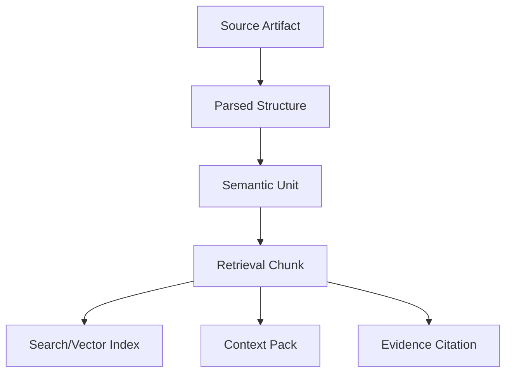
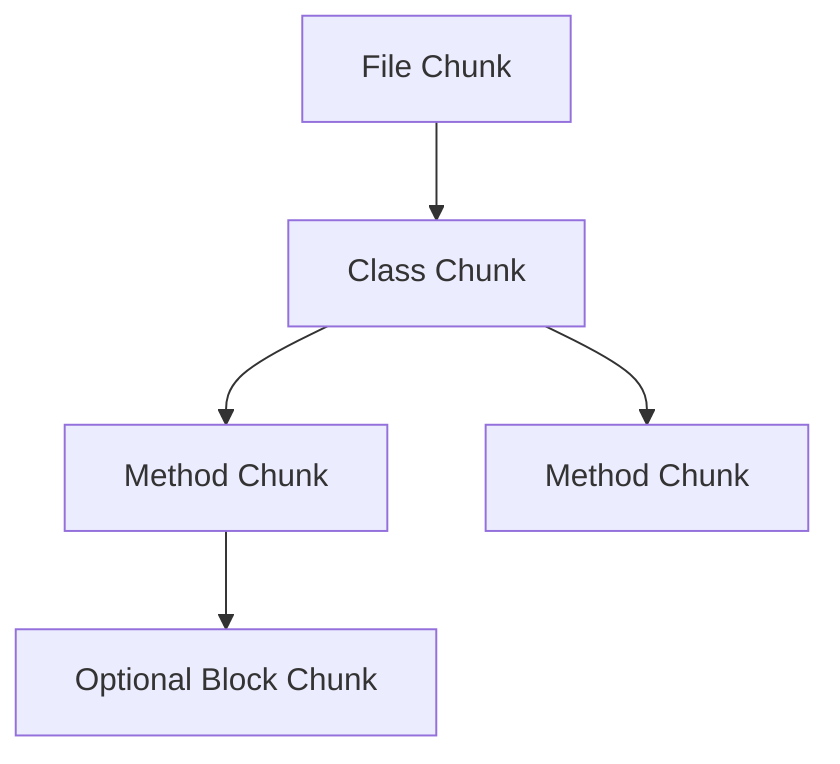

------
title: Learn AI Code Documentation & Agent Memory Platform - Part 013
description: Chunking code dan dokumen secara AST-aware, symbol-aware, section-aware, provenance-preserving, dan token-efficient untuk retrieval, documentation generation, dan agent context assembly.
series: learn-ai-code-documentation-agent-memory
seriesTitle: Learn AI Code Documentation & Agent Memory Platform
order: 13
partTitle: Chunking Code and Documents
tags:
- ai
- retrieval
- chunking
- code-intelligence
- documentation
- agent-context
- repository-analysis
- software-architecture
date: 2026-07-02
---

# Part 013 — Chunking Code and Documents

## 1. Tujuan Part Ini

Part 012 menutup fondasi knowledge representation: metadata, provenance, dan trust. Sekarang kita masuk ke fase retrieval architecture.

Topik pertama adalah **chunking**.

Chunking adalah proses memecah source code, dokumen, schema, config, dan graph evidence menjadi unit yang bisa diindeks, dicari, disusun menjadi context, dan dikutip sebagai evidence.

Chunking terlihat sederhana, tetapi di sistem code intelligence ia sangat menentukan kualitas seluruh platform.

Jika chunking buruk:

- method terpotong di tengah,
- komentar terpisah dari symbol,
- docs kehilangan heading context,
- evidence span tidak bisa diaudit,
- embedding menjadi noise,
- retrieval mengambil potongan tidak lengkap,
- agent kekurangan constraints,
- generated docs hallucinated,
- memory grounded pada unit yang salah.

Target part ini:

1. memahami chunk sebagai unit retrieval, bukan sekadar potongan text,
2. membedakan chunk untuk source code, docs, schema, config, graph, dan memory,
3. mendesain AST-aware chunking untuk code,
4. mendesain section-aware chunking untuk docs,
5. menjaga provenance di setiap chunk,
6. mengatur chunk identity dan invalidation,
7. menentukan granularity yang tepat,
8. menangani token budget dan overlap,
9. membuat chunk quality gates,
10. menghubungkan chunking dengan retrieval, docs, agent context, dan memory.

---

## 2. Chunking Bukan Sekadar Memotong Teks

Naive chunking:

```txt
ambil setiap 1000 karakter
overlap 200 karakter
embed semuanya
```

Pendekatan ini cukup untuk dokumen umum, tetapi buruk untuk source code.

Code punya struktur:

- package,
- import,
- class,
- method,
- annotation,
- decorator,
- route,
- test,
- schema,
- config section,
- migration operation.

Jika struktur ini dihancurkan, retrieval kehilangan makna.

### 2.1 Contoh Chunk Buruk

```txt
lines 1-80:
  package/import/class header + setengah method

lines 81-160:
  sisa method + awal method lain
```

Masalah:

- signature method ada di chunk pertama,
- body logic ada di chunk kedua,
- retrieval hanya mengambil salah satu,
- agent tidak punya context lengkap.

### 2.2 Contoh Chunk Baik

```yaml
chunk:
  kind: method
  symbol: OrderService.createOrder
  includes:
    - leading comment
    - annotations
    - method signature
    - method body
  span: [31, 74]
```

Chunk baik mempertahankan unit makna.

---

## 3. Mental Model Chunk



Chunk adalah jembatan antara knowledge representation dan retrieval.

Chunk harus punya:

- content,
- type,
- scope,
- source span,
- token estimate,
- identity,
- parent-child relation,
- linked graph nodes,
- confidence,
- freshness metadata,
- permission metadata.

---

## 4. Chunk Taxonomy

### 4.1 Core Chunk Types

| Chunk Type | Source | Example |
|---|---|---|
| `file_overview` | file | compact summary/header metadata |
| `class_chunk` | code | class with methods overview |
| `method_chunk` | code | method/function body |
| `symbol_header_chunk` | code | declaration/signature only |
| `route_chunk` | code/contract | API operation |
| `test_case_chunk` | tests | one test case |
| `schema_chunk` | schema/contract | DTO, OpenAPI schema, protobuf message |
| `config_section_chunk` | config | config prefix/key group |
| `migration_chunk` | SQL | migration operation |
| `doc_section_chunk` | docs | markdown section |
| `adr_chunk` | docs | ADR context/decision/consequence |
| `runbook_step_chunk` | runbook | troubleshooting step |
| `graph_path_chunk` | graph | compact graph path |
| `memory_chunk` | memory | memory record as retrievable unit |

### 4.2 Chunk Role

| Role | Meaning |
|---|---|
| `primary_evidence` | can support major claim |
| `supporting_evidence` | supports secondary/contextual claim |
| `navigation` | helps find source, not enough as evidence |
| `summary` | compact derived representation |
| `warning` | stale/conflict/uncertainty info |
| `excluded` | not indexed |

Example:

```yaml
chunk:
  type: method_chunk
  role: primary_evidence
```

```yaml
chunk:
  type: file_overview
  role: navigation
```

---

## 5. Chunk Metadata Model

### 5.1 Minimal Chunk

```yaml
chunk:
  chunkId: chunk_01J...
  repositoryId: order-service
  snapshotId: snap_6f41ab2
  commitSha: 6f41ab2
  path: src/main/java/com/acme/order/OrderService.java
  chunkType: method_chunk
  content: "public Order createOrder(...) { ... }"
  span:
    startLine: 31
    endLine: 74
```

### 5.2 Production Chunk

```yaml
chunk:
  chunkId: chunk_01J...
  logicalChunkId: chunklog_order_service_create_order
  tenantId: acme
  repositoryId: order-service
  snapshotId: snap_6f41ab2
  commitSha: 6f41ab2
  source:
    type: file_span
    path: src/main/java/com/acme/order/OrderService.java
    contentHash: sha256:...
  chunkType: method_chunk
  role: primary_evidence
  title: "OrderService.createOrder"
  language: java
  content:
    raw: "..."
    normalized: "..."
  spans:
    full:
      startLine: 29
      endLine: 74
    declaration:
      startLine: 31
      endLine: 32
    body:
      startLine: 33
      endLine: 74
  linkedNodes:
    - symbol:OrderService.createOrder
    - class:OrderService
  parentChunkId: chunk_class_order_service
  childChunkIds: []
  tokenEstimate: 690
  quality:
    confidence: 0.94
    parseStatus: OK
    staleRisk: low
  security:
    visibilityScope: private
    redacted: false
```

---

## 6. Chunk Identity

Chunk identity menentukan incremental update.

### 6.1 Bad Identity

```txt
chunkId = random_uuid()
```

Masalah:

- setiap reindex semua chunk terlihat baru,
- vector index penuh duplikasi,
- docs/memory sulit di-invalidate,
- diff tidak bisa dipercaya.

### 6.2 Instance and Logical Chunk

Gunakan dua ID:

| ID | Meaning |
|---|---|
| `chunkInstanceId` | chunk untuk snapshot tertentu |
| `logicalChunkId` | chunk logical lintas snapshot |

Contoh:

```txt
chunkInstanceId =
hash(repositoryId, snapshotId, path, chunkType, linkedSymbolId, contentHash)

logicalChunkId =
hash(repositoryId, path, chunkType, logicalSymbolId)
```

### 6.3 Content Hash

Simpan hash normalized content:

```txt
contentHash = sha256(normalizedChunkContent)
```

Jika line number berubah tetapi content sama, chunk logical tetap sama dan content hash sama.

---

## 7. Chunking Code

Code chunking harus berbasis struktur.

### 7.1 Chunk Hierarchy



### 7.2 Code Chunking Levels

| Level | Use |
|---|---|
| file overview | navigation and repo overview |
| class/type | module docs and architecture |
| method/function | agent code task and behavior evidence |
| block | large method internal retrieval |
| signature/header | API surface and quick search |

### 7.3 Default Strategy

For most code:

1. create file overview chunk,
2. create class/type chunks,
3. create method/function chunks,
4. create framework code unit chunks,
5. create test case chunks,
6. avoid block chunks unless unit too large.

---

## 8. Method Chunk

### 8.1 What to Include

A method chunk should include:

- leading comments/docstring,
- annotations/decorators,
- signature,
- body,
- maybe relevant imports if needed,
- parent class name metadata.

Example:

```yaml
chunk:
  type: method_chunk
  title: OrderService.createOrder
  contentParts:
    - leading_comment
    - annotations
    - signature
    - body
```

### 8.2 Why Include Signature

The body alone may not contain:

- method name,
- parameter types,
- return type,
- annotations,
- visibility.

Agent needs these.

### 8.3 Large Method Strategy

If method is too large:

```yaml
methodChunk:
  type: method_chunk
  mode: outline_plus_blocks
  children:
    - block_chunk: validation_branch
    - block_chunk: persistence_branch
```

Keep a parent method summary chunk with structure.

---

## 9. Class Chunk

### 9.1 What to Include

Class chunk can include:

- class declaration,
- annotations,
- fields,
- constructor signatures,
- method list,
- high-level comments,
- not necessarily full method bodies.

Example:

```md
class OrderService {
  fields:
    - OrderValidator validator
    - OrderRepository repository

  methods:
    - createOrder(CreateOrderRequest): Order
    - cancelOrder(UUID): void
}
```

### 9.2 Use Cases

Class chunk helps:

- architecture docs,
- module overview,
- agent navigation,
- retrieval when query is broad.

### 9.3 Avoid Huge Class Chunks

If class is huge, do not embed full class. Embed overview and methods separately.

---

## 10. Route Chunk

API route is often more useful than raw method.

### 10.1 Example

```yaml
chunk:
  type: route_chunk
  title: "POST /orders"
  content:
    handler: OrderController.createOrder
    request: CreateOrderRequest
    response: OrderResponse
    calls:
      - OrderService.createOrder
  evidence:
    - OrderController.java:12-22
    - openapi/order-api.yaml#/paths/~1orders/post
```

### 10.2 Source Composition

Route chunk may combine:

- controller code,
- OpenAPI operation,
- request/response schema,
- related test.

Mark it as composed chunk:

```yaml
composition:
  type: composed
  sources:
    - file_span
    - schema_pointer
```

### 10.3 Be Careful

Composed chunks are useful for retrieval, but claims must still cite original evidence.

---

## 11. Test Chunk

Tests are behavior evidence.

### 11.1 Test Case Chunk

```yaml
chunk:
  type: test_case_chunk
  title: "shouldRejectOrderWithoutCustomerId"
  source:
    path: OrderValidatorTest.java
    lines: [35, 52]
  linkedNodes:
    - test_case:OrderValidatorTest.shouldRejectOrderWithoutCustomerId
    - symbol:OrderValidator.validate
```

### 11.2 Test Suite Chunk

For broad retrieval:

```yaml
chunk:
  type: test_suite_overview
  title: OrderValidatorTest
  content:
    tests:
      - shouldRejectOrderWithoutCustomerId
      - shouldAcceptValidCorporateOrder
```

### 11.3 Why Test Chunks Matter

For agent code changes, tests often matter more than docs.

If target symbol changes, related test chunks should rank high.

---

## 12. Schema and Contract Chunking

Contracts require structure-aware chunking.

### 12.1 OpenAPI

Chunk by:

- operation,
- schema,
- parameter group,
- error response,
- security scheme.

Example:

```yaml
chunk:
  type: api_operation_chunk
  title: "POST /orders"
  pointer: /paths/~1orders/post
  linkedNodes:
    - api_operation:POST:/orders
    - schema:CreateOrderRequest
    - schema:OrderResponse
```

### 12.2 Protobuf

Chunk by:

- message,
- service,
- rpc method,
- enum.

```yaml
chunk:
  type: protobuf_message_chunk
  title: OrderCreated
  path: events/order.proto
```

### 12.3 SQL Migrations

Chunk by operation:

```yaml
chunk:
  type: migration_operation_chunk
  title: "ALTER TABLE orders ADD COLUMN status"
  table: orders
  operation: add_column
```

### 12.4 GraphQL

Chunk by:

- type,
- query,
- mutation,
- subscription,
- fragment.

---

## 13. Config Chunking

Config files are often YAML/JSON/TOML/properties.

### 13.1 Chunk by Prefix

```yaml
order:
  validation:
    max-items: 100
    corporate-tax-id-required: true
```

Chunk:

```yaml
chunk:
  type: config_section_chunk
  title: order.validation
  keys:
    - order.validation.max-items
    - order.validation.corporate-tax-id-required
```

### 13.2 Redaction

Config chunks must redact sensitive values.

Bad:

```yaml
password: my-prod-password
```

Good:

```yaml
password: <REDACTED_SECRET>
```

### 13.3 Use Cases

Config chunks help:

- ops docs,
- feature behavior docs,
- agent context,
- runbook generation,
- impact analysis.

---

## 14. Document Chunking

Docs should be chunked by sections, not fixed character windows.

### 14.1 Section-Aware Chunking

Markdown:

```md
# Order Validation

## Purpose

...

## Main Components

...

## Flow

...
```

Chunks:

- `Purpose`,
- `Main Components`,
- `Flow`.

### 14.2 Heading Path

Store heading path:

```yaml
headingPath:
  - Order Validation
  - Main Components
```

This provides context when chunk is retrieved.

### 14.3 Include Parent Heading

Chunk content should include heading.

```md
## Main Components

`OrderValidator` coordinates validation...
```

Without heading, retrieved chunk may be ambiguous.

### 14.4 Tables and Code Blocks

Do not split table rows across chunks unless necessary.

Do not separate code block from explanation if they depend on each other.

---

## 15. ADR Chunking

ADR has predictable structure.

Typical sections:

- status,
- context,
- decision,
- consequences,
- alternatives.

### 15.1 ADR Chunk Types

| ADR Section | Chunk Role |
|---|---|
| Context | background |
| Decision | strong decision evidence |
| Consequences | trade-off evidence |
| Alternatives | reasoning |
| Status | lifecycle |

### 15.2 ADR Decision Chunk

```yaml
chunk:
  type: adr_decision_chunk
  title: "ADR 012 Decision"
  role: decision_evidence
  linkedNodes:
    - module:order.validation
    - symbol:RuleRegistry
```

ADR decision chunks should rank high for architecture questions, but not override current code for implementation truth.

---

## 16. Runbook Chunking

Runbooks should be chunked by operational task.

### 16.1 Runbook Chunk Types

| Chunk Type | Example |
|---|---|
| symptom_chunk | "High order validation failures" |
| diagnosis_step_chunk | "Check validation error rate" |
| remediation_step_chunk | "Rollback validation config" |
| escalation_chunk | "Contact team-order-platform" |
| dashboard_chunk | "Grafana dashboard links" |

### 16.2 Safety

Runbooks may contain operational sensitive data.

Apply visibility and redaction.

---

## 17. Graph Path Chunking

Graph paths can be converted into compact chunks.

### 17.1 Example

```yaml
chunk:
  type: graph_path_chunk
  title: "POST /orders request flow"
  graphPath:
    - POST /orders
    - OrderController.createOrder
    - OrderService.createOrder
    - OrderValidator.validate
    - OrderRepository.save
```

### 17.2 Use Cases

Graph path chunks are useful for:

- flow retrieval,
- docs generation,
- agent context,
- memory candidate generation.

### 17.3 Caution

Graph path chunks are derived. Claims still need original edge evidence.

---

## 18. Memory Chunking

Memory records should be retrievable.

### 18.1 Memory Chunk

```yaml
chunk:
  type: memory_chunk
  title: "Repo convention: validation rules use RuleRegistry"
  content: "Validation rules are registered through RuleRegistry, not instantiated directly in controllers."
  memoryId: mem_rule_registry
  scope: repository:order-service
  evidence:
    - RuleRegistry.java:10-88
```

### 18.2 Use in Retrieval

Memory chunks should not mix with source chunks blindly.

Rank memory separately and include as derived guidance.

---

## 19. Chunk Overlap

Overlap is useful, but must be controlled.

### 19.1 Code Overlap

For method chunks, overlap may include:

- class name,
- imports relevant to method,
- leading comment,
- annotations,
- surrounding test setup.

Avoid arbitrary line overlap that duplicates unrelated methods.

### 19.2 Doc Overlap

For docs, overlap can include:

- parent heading,
- previous paragraph if needed,
- table header.

### 19.3 Overlap Metadata

```yaml
overlap:
  includesParentHeading: true
  includesLeadingComment: true
  includesImports:
    - OrderValidator
```

---

## 20. Token Budget

Chunk size should consider token budget.

### 20.1 Suggested Size Bands

| Chunk | Target Tokens |
|---|---:|
| method/function | 150–1200 |
| class overview | 200–1000 |
| doc section | 200–1200 |
| API operation | 300–1500 |
| schema | 200–1500 |
| runbook step | 150–900 |
| graph path | 100–500 |
| memory | 40–250 |

These are not hard rules. Use task requirements.

### 20.2 Too Small

Bad:

```txt
return repository.save(order);
```

No context.

### 20.3 Too Large

Bad:

```txt
entire 4000-line service file
```

Too much noise.

### 20.4 Adaptive Chunking

If symbol is small, one chunk.

If symbol is huge:

- create overview,
- create child chunks,
- preserve parent relation.

---

## 21. Chunk Normalization

Store raw and normalized content.

### 21.1 Raw Content

Raw content preserves exact source for evidence.

### 21.2 Normalized Content

Normalized content improves indexing.

Examples:

- remove excessive whitespace,
- normalize line endings,
- preserve identifiers,
- optionally strip comments for some indexes,
- keep comments for documentation index.

### 21.3 Do Not Over-Normalize Code

Identifiers matter.

Do not replace all variable names if retrieval needs exact code references.

---

## 22. Chunk Provenance

Every chunk must carry provenance.

### 22.1 Required Provenance

```yaml
provenance:
  sourceType: file_span
  repositoryId: order-service
  snapshotId: snap_6f41ab2
  commitSha: 6f41ab2
  path: OrderService.java
  span: [31, 74]
  contentHash: sha256:...
  producedBy:
    chunkerId: ast-code-chunker
    chunkerVersion: 2026.07.02
```

### 22.2 Composed Chunk Provenance

```yaml
provenance:
  sourceType: composed
  sources:
    - fileSpan: OrderController.java:12-22
    - schemaPointer: openapi.yaml#/paths/~1orders/post
    - graphEdge: OrderController.createOrder CALLS OrderService.createOrder
```

### 22.3 Why It Matters

When generated docs cite chunk, system can resolve original source.

---

## 23. Chunk Security

Chunks inherit source sensitivity.

### 23.1 Visibility

```yaml
security:
  visibilityScope: private
  derivedFrom:
    - repo:order-service/private
```

### 23.2 Redaction

```yaml
redaction:
  applied: true
  reason: secret_candidate
  redactedPatterns:
    - api_key
```

### 23.3 Exclusion

Do not create content chunk for blocked files.

Create metadata-only record if needed:

```yaml
chunk:
  type: blocked_file_metadata
  path: .env.production
  content: null
```

---

## 24. Chunk Invalidation

Chunks must update when source changes.

### 24.1 Invalidation Triggers

| Trigger | Action |
|---|---|
| file hash changed | re-chunk file |
| parser version changed | re-chunk parsed code |
| symbol span changed | update symbol chunk |
| doc section hash changed | update doc chunk |
| graph path changed | update graph chunk |
| memory invalidated | remove/mark memory chunk |
| permission changed | update visibility/index |

### 24.2 Chunk Diff

```yaml
chunkDiff:
  added:
    - chunk_new_rule
  removed:
    - chunk_old_rule
  changed:
    - chunk_order_validator_validate
  unchanged:
    - chunk_rule_registry
```

### 24.3 Index Update

If chunk changed:

- delete old vector,
- write new vector,
- update lexical index,
- update chunk metadata,
- trigger docs/memory refresh if referenced.

---

## 25. Chunk Storage Schema

### 25.1 Chunks

```sql
CREATE TABLE chunks (
    chunk_id TEXT PRIMARY KEY,
    logical_chunk_id TEXT NOT NULL,
    tenant_id TEXT NOT NULL,
    repository_id TEXT,
    snapshot_id TEXT,
    commit_sha TEXT,
    source_type TEXT NOT NULL,
    path TEXT,
    chunk_type TEXT NOT NULL,
    role TEXT NOT NULL,
    title TEXT NOT NULL,
    language TEXT,
    content_hash TEXT NOT NULL,
    token_estimate INTEGER NOT NULL,
    visibility_scope TEXT NOT NULL,
    stale_risk TEXT NOT NULL,
    created_at TIMESTAMP NOT NULL
);
```

### 25.2 Chunk Spans

```sql
CREATE TABLE chunk_spans (
    id TEXT PRIMARY KEY,
    chunk_id TEXT NOT NULL,
    span_type TEXT NOT NULL,
    start_line INTEGER,
    start_column INTEGER,
    end_line INTEGER,
    end_column INTEGER
);
```

### 25.3 Chunk Links

```sql
CREATE TABLE chunk_graph_links (
    id TEXT PRIMARY KEY,
    chunk_id TEXT NOT NULL,
    graph_node_id TEXT NOT NULL,
    link_type TEXT NOT NULL,
    confidence NUMERIC NOT NULL
);
```

### 25.4 Chunk Sources

```sql
CREATE TABLE chunk_sources (
    id TEXT PRIMARY KEY,
    chunk_id TEXT NOT NULL,
    source_ref_type TEXT NOT NULL,
    source_ref_id TEXT NOT NULL,
    usage_type TEXT NOT NULL
);
```

---

## 26. Chunker Architecture

### 26.1 Interface

```java
public interface Chunker {
    boolean supports(ChunkingInput input);

    List<Chunk> chunk(ChunkingInput input);
}
```

### 26.2 Chunking Input

```java
public record ChunkingInput(
    RepositorySnapshot snapshot,
    SourceFile file,
    FileClassification classification,
    LanguageDetection language,
    ParseResult parseResult,
    List<CodeSymbol> symbols,
    List<CodeUnit> codeUnits,
    ChunkingPolicy policy
) {}
```

### 26.3 Chunking Policy

```yaml
chunkingPolicy:
  maxTokensPerChunk: 1200
  includeLeadingComments: true
  includeAnnotations: true
  createOverviewChunks: true
  createBlockChunksForLargeMethods: true
  preserveEvidenceSpans: true
```

### 26.4 Chunker Plugins

- Java AST chunker,
- TypeScript AST chunker,
- Go AST chunker,
- Python AST chunker,
- Markdown section chunker,
- OpenAPI chunker,
- SQL migration chunker,
- YAML config chunker,
- graph path chunker,
- memory chunker.

---

## 27. Chunk Quality Gates

### 27.1 Structural Gates

- chunk has source span,
- chunk has content hash,
- chunk has token estimate,
- chunk linked to source artifact,
- chunk type valid,
- chunk visibility valid.

### 27.2 Code Gates

- method chunk includes signature,
- class chunk has child method list or child links,
- route chunk includes handler,
- test chunk linked to test symbol,
- generated/vendor chunks not primary evidence.

### 27.3 Document Gates

- doc section chunk includes heading,
- section span valid,
- stale docs marked,
- generated docs carry generation metadata.

### 27.4 Security Gates

- no blocked-sensitive content,
- redacted chunks marked,
- chunk visibility no broader than source,
- composed chunk visibility is max sensitivity of sources.

---

## 28. Chunk Evaluation

### 28.1 Retrieval Evaluation

Questions:

- does query retrieve the correct chunk?
- is chunk self-contained enough?
- does chunk include evidence span?
- is irrelevant sibling code excluded?

### 28.2 Context Evaluation

Questions:

- can agent perform task with selected chunks?
- are required tests included?
- are stale docs excluded?
- is token budget respected?

### 28.3 Documentation Evaluation

Questions:

- generated claim can cite chunk?
- chunk maps to exact source lines?
- source changes invalidate affected docs?

---

## 29. Common Mistakes

### 29.1 Fixed-Size Chunking for Code

This destroys structure.

### 29.2 Chunk Without Provenance

A chunk that cannot cite source is not safe evidence.

### 29.3 Ignoring Tests

Test chunks are essential for behavior and agent modification tasks.

### 29.4 Embedding Huge Files

Large file chunks are noisy and expensive.

### 29.5 No Logical Chunk ID

Incremental indexing becomes wasteful and unstable.

### 29.6 Mixing Source and Memory

Memory chunks should be separated as derived guidance.

### 29.7 Not Redacting Config

Config chunks can leak secrets.

### 29.8 No Section-Aware Docs

Documentation retrieval becomes weak if heading hierarchy is lost.

---

## 30. Practical Exercise

Build chunking for one repository.

### 30.1 Input

Use:

```txt
OrderController.java
OrderService.java
OrderValidator.java
OrderValidatorTest.java
application.yml
openapi/order-api.yaml
docs/order-validation.md
docs/adr/012-validation-rules.md
```

### 30.2 Output

Produce:

```txt
chunks.json
chunk-spans.json
chunk-links.json
chunk-quality-report.yaml
```

### 30.3 Required Chunks

- class chunks,
- method chunks,
- route chunk,
- test case chunks,
- config section chunk,
- OpenAPI operation chunk,
- ADR decision chunk,
- doc section chunks.

### 30.4 Acceptance Criteria

- every chunk has provenance,
- every chunk has stable logical ID,
- method chunks include signature,
- doc chunks include heading path,
- config chunks redact sensitive values,
- route chunk links handler + contract,
- changed file invalidates only relevant chunks,
- generated/vendor files not primary evidence.

---

## 31. Summary

Chunking is a core retrieval architecture layer, not a preprocessing detail.

Key points:

1. chunks are retrieval/evidence units,
2. code chunking should be AST-aware and symbol-aware,
3. docs should be section-aware,
4. contracts/config/schema need domain-specific chunkers,
5. chunk identity must support incremental updates,
6. chunks need provenance, visibility, token estimate, and linked graph nodes,
7. composed chunks are useful but must preserve original evidence,
8. memory chunks are derived guidance, not source truth,
9. chunk quality directly affects retrieval, docs, agent context, and memory,
10. fixed-size text splitting is not enough for production code intelligence.

Part berikutnya membahas **Embedding and Vector Indexing**: bagaimana membuat vector representation untuk chunks, kapan vector search berguna, kapan tidak cukup, bagaimana versioning/reindexing bekerja, dan bagaimana menjaga cost serta permission.
