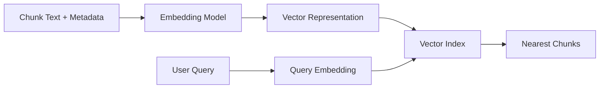
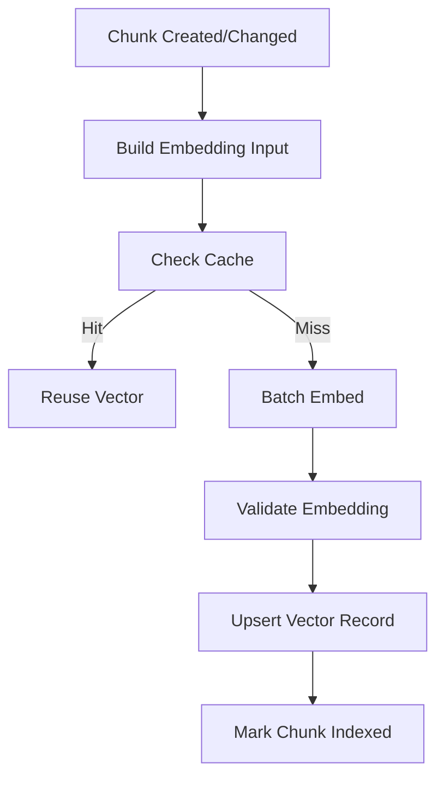
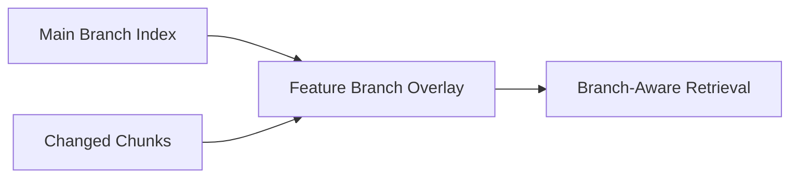
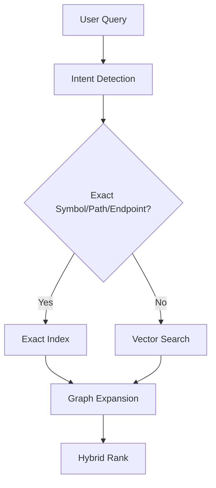
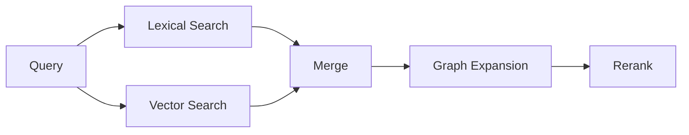

------
title: Learn AI Code Documentation & Agent Memory Platform - Part 014
description: Embedding dan vector indexing untuk code/document chunks, termasuk model selection, index metadata, versioning, reindexing, permission filtering, cost control, dan evaluasi retrieval.
series: learn-ai-code-documentation-agent-memory
seriesTitle: Learn AI Code Documentation & Agent Memory Platform
order: 14
partTitle: Embedding and Vector Indexing
tags:
- ai
- embeddings
- vector-search
- retrieval
- code-intelligence
- documentation
- agent-context
- software-architecture
date: 2026-07-02
---

# Part 014 — Embedding and Vector Indexing

## 1. Tujuan Part Ini

Part 013 membahas chunking. Sekarang kita membahas bagaimana chunk direpresentasikan untuk semantic retrieval melalui **embedding** dan **vector indexing**.

Vector search berguna untuk menemukan chunk yang secara makna relevan meskipun kata-katanya tidak sama.

Namun dalam code intelligence, vector search tidak boleh dianggap sebagai solusi tunggal.

Vector search kuat untuk:

- query konseptual,
- onboarding questions,
- mencari module berdasarkan purpose,
- menemukan docs terkait,
- menemukan code dengan behavior serupa,
- mencari memory yang relevan.

Vector search lemah untuk:

- exact symbol lookup,
- endpoint exact path,
- file path,
- identifier,
- permission enforcement,
- versioning,
- structural dependency,
- impact analysis.

Target part ini:

1. memahami kapan embedding berguna dan kapan tidak,
2. mendesain embedding pipeline untuk code/doc chunks,
3. menentukan metadata yang harus ikut disimpan di vector index,
4. membuat embedding versioning dan reindexing strategy,
5. mengatur permission filtering,
6. mengontrol cost, latency, dan batch processing,
7. membuat strategy multi-repo dan multi-language,
8. menggabungkan vector index dengan lexical search dan graph,
9. mengevaluasi kualitas vector retrieval,
10. menghindari anti-pattern "semua masuk vector DB".

---

## 2. Mental Model Embedding

Embedding mengubah text menjadi vector numerik.



Vector yang dekat secara geometris diharapkan punya makna yang mirip.

Tetapi "mirip makna" tidak selalu sama dengan "benar untuk task".

---

## 3. Vector Search dalam Codebase

### 3.1 Good Use Cases

| Query | Vector Search Value |
|---|---|
| "where do we validate corporate orders?" | finds validation-related code/docs even without exact names |
| "how are order events published?" | finds publisher methods/docs |
| "what handles customer onboarding?" | finds relevant module |
| "known caveats for pricing rules" | finds memory/docs |
| "how to troubleshoot Kafka lag?" | finds runbook sections |

### 3.2 Weak Use Cases

| Query | Better Tool |
|---|---|
| `OrderValidator.validate` | exact symbol index |
| `POST /orders` | route index |
| `src/main/java/...` | file index |
| "callers of validate" | graph query |
| "who consumes order.created" | event graph |
| "docs generated from commit X" | metadata query |
| "does user have access?" | permission system |

### 3.3 Core Principle

```txt
Vector search is a recall tool, not the source of truth.
```

Use it to find candidates. Use graph, metadata, exact search, and evidence to verify.

---

## 4. Embedding Input Design

What you embed matters.

### 4.1 Bad Embedding Input

Embedding raw method body only:

```java
public Order createOrder(CreateOrderRequest request) {
    validator.validate(request);
    return repository.save(Order.from(request));
}
```

This lacks:

- class name,
- package,
- file path,
- comments,
- symbol identity,
- role,
- route/test relation.

### 4.2 Better Embedding Input

Create embedding text with structured context:

```txt
Chunk type: method
Language: java
Repository: order-service
Path: src/main/java/com/acme/order/OrderService.java
Symbol: com.acme.order.OrderService.createOrder
Parent: com.acme.order.OrderService
Role: primary source
Annotations: Transactional

Code:
public Order createOrder(CreateOrderRequest request) {
    validator.validate(request);
    return repository.save(Order.from(request));
}
```

### 4.3 Why Add Metadata to Text?

Embedding model sees only text. Metadata stored separately helps filtering/ranking, but metadata included in embedding text improves semantic representation.

Do not include sensitive metadata if it should not be embedded.

---

## 5. Embedding Text Template

Use templates per chunk type.

### 5.1 Method Chunk Template

```txt
Type: method
Language: {language}
Repository: {repositoryName}
Path: {path}
Symbol: {qualifiedName}
Parent: {parentQualifiedName}
Role: {role}
Summary Hint: {optionalPurposeHint}

Code:
{content}
```

### 5.2 Documentation Section Template

```txt
Type: documentation section
Document Type: {docType}
Repository: {repositoryName}
Path: {path}
Heading: {headingPath}
Audience: {audience}
Freshness: {staleRisk}

Content:
{sectionText}
```

### 5.3 API Operation Template

```txt
Type: API operation
Method: POST
Path: /orders
Handler: OrderController.createOrder
Request Schema: CreateOrderRequest
Response Schema: OrderResponse

Evidence:
{contractOrHandlerText}
```

### 5.4 Memory Template

```txt
Type: memory
Memory Type: repo_convention
Scope: repository order-service
Statement: Validation rules are registered through RuleRegistry.
Evidence Summary: RuleRegistry and OrderValidator source evidence.
State: active
Confidence: good
```

### 5.5 Avoid Overloading Template

Do not stuff every possible metadata field into embedding text. Keep it relevant.

---

## 6. Embedding Metadata

Vector index must store metadata for filtering and ranking.

### 6.1 Required Metadata

```yaml
vectorRecord:
  vectorId: vec_01J...
  chunkId: chunk_01J...
  logicalChunkId: chunklog_...
  tenantId: acme
  repositoryId: order-service
  snapshotId: snap_6f41ab2
  commitSha: 6f41ab2
  path: src/main/java/com/acme/order/OrderService.java
  chunkType: method_chunk
  role: primary_evidence
  language: java
  visibilityScope: private
  contentHash: sha256:...
  embeddingModel: embedder-v1
  embeddingVersion: 2026.07.02
```

### 6.2 Useful Ranking Metadata

```yaml
rankingMetadata:
  symbolQualifiedName: com.acme.order.OrderService.createOrder
  graphNodeIds:
    - symbol:OrderService.createOrder
  docType: null
  staleRisk: low
  confidence: 0.94
  sourceKind: source
  generated: false
  vendor: false
  tokenEstimate: 690
```

### 6.3 Security Metadata

```yaml
security:
  visibilityScope: private
  tenantId: acme
  allowedTeams:
    - team-order-platform
  redacted: false
  sensitivity: internal
```

---

## 7. Vector ID and Versioning

### 7.1 Vector ID

```txt
vectorId =
hash(chunkId, embeddingModelId, embeddingTemplateVersion)
```

### 7.2 Why Include Model and Template

If embedding model changes, vector changes.

If embedding text template changes, vector changes.

If chunk content changes, vector changes.

### 7.3 Embedding Version Record

```yaml
embeddingVersion:
  embeddingModelId: code-doc-embedding-v1
  provider: configured-provider
  dimensions: 1536
  templateVersion: embedding-template-method-v3
  tokenizerVersion: tokenizer-v1
```

### 7.4 Store Embedding Hash

```yaml
embeddingInputHash: sha256:...
```

This prevents duplicate embedding calls.

---

## 8. Embedding Pipeline



### 8.1 Steps

1. select chunks eligible for embedding,
2. build embedding input text,
3. compute embedding input hash,
4. check cache,
5. batch embedding requests,
6. validate dimensions,
7. store vector,
8. store metadata,
9. mark index version.

### 8.2 Eligibility

Not all chunks need embedding.

Embed:

- source method/class chunks,
- doc section chunks,
- API operation chunks,
- schema chunks,
- config section chunks,
- memory chunks,
- runbook chunks.

Maybe skip:

- huge lockfile chunks,
- binary metadata,
- vendor chunks,
- generated build artifacts,
- secret-blocked chunks.

---

## 9. Batch Processing

Embedding one chunk at a time is inefficient.

### 9.1 Batch Strategy

Group by:

- tenant,
- embedding model,
- template version,
- chunk type,
- priority.

### 9.2 Priority

| Priority | Chunk |
|---|---|
| high | changed target module, docs requested now |
| medium | source/test/doc chunks |
| low | old docs, low-traffic repos |
| skip | vendor/generated/blocked |

### 9.3 Idempotency

Embedding jobs must be idempotent.

```txt
job key = hash(chunkId, embeddingModelId, templateVersion, contentHash)
```

If same job runs twice, result should upsert same vector.

---

## 10. Incremental Reindexing

### 10.1 When to Re-Embed

Re-embed if:

- chunk content hash changed,
- embedding input template changed,
- embedding model changed,
- metadata included in embedding text changed,
- redaction changed,
- language normalization changed.

Do not re-embed if:

- only line number changed,
- only unrelated metadata changed,
- retrieval ranker changed,
- permission metadata changed.

Permission metadata update can update vector metadata without recomputing vector.

### 10.2 Reindex Plan

```yaml
reindexPlan:
  reason: embedding_template_changed
  affectedChunks:
    count: 12420
  strategy:
    mode: rolling
    batchSize: 128
    priority:
      - active repos
      - recently queried chunks
      - rest
```

### 10.3 Dual Index Version

During migration:

```txt
old index active
new index building
query uses old until new coverage >= threshold
then switch
```

Or query both and merge temporarily.

---

## 11. Vector Index Metadata Filtering

Permission must be enforced before returning results.

### 11.1 Pre-Filter vs Post-Filter

Pre-filter:

```txt
search only vectors matching tenant/repo/visibility
```

Post-filter:

```txt
search broad results, then remove unauthorized
```

Pre-filter is safer and often more efficient, but not all vector stores support complex filters equally.

### 11.2 Required Filters

At minimum:

- tenant,
- repository access,
- visibility,
- snapshot/branch,
- blocked sensitivity,
- state active,
- chunk type if specified.

### 11.3 Permission Invariant

```txt
A vector result must never return a chunk the principal cannot read.
```

Even returning title/path can leak information. Filter metadata too.

---

## 12. Snapshot and Branch Semantics

Vector index must be version-aware.

### 12.1 Common Mistake

Index only latest chunk:

```txt
chunk: OrderValidator.validate
```

No commit.

Problem:

- docs generated for old branch use new content,
- agent on feature branch gets main branch context,
- audit impossible.

### 12.2 Better

Store snapshot:

```yaml
repositoryId: order-service
snapshotId: snap_6f41ab2
branch: main
commitSha: 6f41ab2
```

### 12.3 Query Target

Query should specify:

```yaml
snapshotSelector:
  branch: main
  commitSha: 6f41ab2
```

If no commit given, resolve latest allowed snapshot first.

### 12.4 Branch Differences

Feature branch indexing can be expensive.

Possible strategies:

- index main branch fully,
- index feature branch diff chunks,
- fallback to main for unchanged chunks,
- overlay changed chunks.



---

## 13. Multi-Repo Vector Indexing

### 13.1 Index Topology Options

| Option | Description |
|---|---|
| one index per tenant | simpler filtering by tenant |
| one index per repo | strong isolation, many indexes |
| shared global index | simpler ops, harder permission |
| hybrid | tenant-level index with repo filters |

### 13.2 Recommended Start

For MVP/team:

```txt
one index per tenant/workspace with repository metadata filters
```

For high-security enterprise:

```txt
separate indexes per tenant or sensitivity boundary
```

### 13.3 Cross-Repo Query

When user asks across repos:

1. resolve allowed repos,
2. query only allowed repo filters,
3. merge/rerank results,
4. include repo identity in context.

### 13.4 Avoid Cross-Tenant Embedding Leakage

Never mix tenant data in query results.

Even if vector store is shared physically, logical isolation must be enforced.

---

## 14. Code Embeddings vs Document Embeddings

Code and docs differ.

### 14.1 Code Chunks

Code contains:

- identifiers,
- syntax,
- framework annotations,
- function signatures,
- terse comments.

Embedding code raw may not capture intent if identifiers are poor.

Add structured metadata.

### 14.2 Document Chunks

Docs contain natural language.

Embedding docs works well for semantic queries, but stale/conflicted docs must be ranked carefully.

### 14.3 Memory Chunks

Memory statements are short and structured.

They may retrieve too strongly because they are concise. Keep memory retrieval separate or apply derived-source penalty.

### 14.4 Separate Indexes?

Options:

| Strategy | Pros | Cons |
|---|---|---|
| single mixed index | simple | docs/memory can dominate |
| separate by modality | better control | more query complexity |
| single index + chunk type filters | practical | needs good metadata |
| hybrid indexes | flexible | operational complexity |

MVP: single index with strong metadata and reranking.

---

## 15. Embedding Query Design

User query may not be ideal.

### 15.1 Raw Query

```txt
how does order validation work?
```

### 15.2 Query Enrichment

Add scope and intent:

```txt
Task: explain module
Repository: order-service
Query: how does order validation work?
Prefer source code, tests, and reviewed docs related to validation.
```

### 15.3 Symbol-Aware Query

If query contains known symbol:

```txt
OrderValidator
```

Do exact symbol lookup first, then vector expansion.

### 15.4 Endpoint-Aware Query

If query contains:

```txt
POST /orders
```

Use route index first.

### 15.5 Query Routing



---

## 16. Similarity Is Not Relevance

Vector similarity can be misleading.

### 16.1 Example

Query:

```txt
validation rule registry
```

Top vector result might be old docs mentioning `RuleEngine`, because language is similar.

But source code `RuleRegistry.java` is more relevant and current.

### 16.2 Need Reranking

Rerank with:

- exact symbol match,
- source kind,
- freshness,
- graph proximity,
- permission,
- task intent,
- doc review state,
- confidence.

### 16.3 Scoring

```txt
finalScore =
    vectorSimilarity * 0.35
  + lexicalScore * 0.20
  + exactMatchScore * 0.20
  + graphProximityScore * 0.15
  + freshnessScore * 0.05
  + trustScore * 0.05
  - stalePenalty
  - generatedPenalty
```

Weights vary by task.

---

## 17. Vector Store Record

### 17.1 Example Record

```yaml
vectorRecord:
  vectorId: vec_01J...
  values: [0.012, -0.044, ...]
  metadata:
    tenantId: acme
    repositoryId: order-service
    snapshotId: snap_6f41ab2
    commitSha: 6f41ab2
    chunkId: chunk_01J...
    logicalChunkId: chunklog_...
    chunkType: method_chunk
    role: primary_evidence
    language: java
    path: src/main/java/com/acme/order/OrderService.java
    symbolQualifiedName: com.acme.order.OrderService.createOrder
    visibilityScope: private
    sourceKind: source
    staleRisk: low
    contentHash: sha256:...
    embeddingModelId: embedder-v1
    embeddingTemplateVersion: method-template-v3
```

### 17.2 Metadata Cardinality

Avoid high-cardinality fields if vector store filtering suffers.

But do not compromise security filters.

Security metadata is mandatory.

---

## 18. Embedding Cache

Embedding can be expensive. Cache aggressively.

### 18.1 Cache Key

```txt
cacheKey =
hash(embeddingModelId, templateVersion, embeddingInputHash)
```

### 18.2 Cache Value

```yaml
embeddingCache:
  cacheKey: ...
  vector: [...]
  dimensions: 1536
  createdAt: 2026-07-02T00:00:00Z
```

### 18.3 Cache Invalidation

Invalidate when:

- model changes,
- template changes,
- input hash changes.

Do not invalidate when:

- chunk metadata not embedded changes,
- permissions change,
- ranker changes.

---

## 19. Cost Control

### 19.1 Cost Drivers

| Driver | Impact |
|---|---|
| number of chunks | embedding cost |
| chunk size | token cost |
| reindex frequency | recurring cost |
| multi-branch indexing | multiplier |
| duplicate chunks | waste |
| generated/vendor noise | waste |
| query volume | query latency/cost |

### 19.2 Cost Reduction

- exclude vendor/generated,
- metadata-only for lockfiles,
- chunk deduplication,
- embedding cache,
- batch embedding,
- priority indexing,
- lazy embedding for low-value chunks,
- branch overlay strategy,
- reindex only changed chunks.

### 19.3 Budget Record

```yaml
embeddingJob:
  chunks: 1200
  estimatedTokens: 840000
  priority: medium
  budget:
    maxTokens: 1000000
    maxCost: configured
```

---

## 20. Latency

### 20.1 Query Latency Components

- query embedding,
- vector search,
- metadata filter,
- lexical search,
- graph expansion,
- reranking,
- context assembly.

### 20.2 Optimization

- cache query embedding for repeated queries,
- route exact queries away from vector,
- use metadata pre-filters,
- limit topK,
- parallel lexical/vector search,
- async graph expansion when broad,
- store precomputed graph neighborhoods for common nodes.

### 20.3 TopK Strategy

Do not retrieve too many.

Typical:

```yaml
vectorTopK: 50
afterFilter: 20
afterRerank: 8
contextPack: 4-12 chunks depending token budget
```

---

## 21. Embedding Security

### 21.1 Are Embeddings Sensitive?

Treat embeddings as derived sensitive data.

Even if raw text is not stored, vectors can leak information through retrieval behavior or metadata.

### 21.2 Security Rules

- do not embed blocked-sensitive chunks,
- store vectors in tenant/sensitivity boundary,
- filter by permission,
- delete vectors when source must be removed,
- audit access to sensitive indexes.

### 21.3 Metadata Leakage

Vector metadata can leak:

- file paths,
- service names,
- table names,
- event topics.

Apply permission before returning metadata.

---

## 22. Deletion and Retention

### 22.1 Delete Source

If repository access is revoked or data deleted:

- delete chunks,
- delete vectors,
- delete derived summaries,
- delete memory grounded only in that source or mark inaccessible,
- keep audit metadata only if policy allows.

### 22.2 Tombstone

Use tombstones for cleanup:

```yaml
deletion:
  source: repo_order_service
  action: delete_vectors
  status: completed
  timestamp: 2026-07-02T00:00:00Z
```

### 22.3 Retention Policy

For old snapshots:

| Artifact | Retention |
|---|---|
| latest main chunks | active |
| old snapshot chunks | limited |
| vectors for old branches | expire |
| audit events | longer |
| generated docs | per policy |
| memory | until invalidated/expired |

---

## 23. Evaluation of Vector Retrieval

### 23.1 Golden Query Set

Create query -> expected chunks.

Example:

```yaml
- query: "where are order validation rules registered?"
  expected:
    - RuleRegistry.java
    - OrderValidator.java
    - ADR 012
```

### 23.2 Metrics

| Metric | Meaning |
|---|---|
| recall@k | expected chunk appears in top k |
| precision@k | top k chunks are relevant |
| MRR | expected result rank |
| nDCG | ranked relevance quality |
| stale result rate | stale chunks in top results |
| permission violation | must be zero |
| context usefulness | downstream task success |

### 23.3 Evaluate by Task Type

Do not evaluate all queries the same.

Task types:

- symbol navigation,
- module explanation,
- API documentation,
- code modification,
- troubleshooting,
- architecture review.

Vector search may score differently per task.

---

## 24. Embedding Quality Issues

### 24.1 Identifier Problem

Code with poor names embeds poorly.

Example:

```java
void doIt(Input x) {}
```

No semantic meaning. Graph and tests help.

### 24.2 Short Chunk Problem

Very short chunks may be ambiguous.

Add metadata context.

### 24.3 Long Chunk Problem

Long chunks blur multiple concepts.

Split structurally.

### 24.4 Stale Docs Problem

Old docs may be semantically perfect but factually wrong.

Freshness/trust ranking needed.

### 24.5 Generated Code Problem

Generated code may match many queries but not represent domain intent.

Apply generated penalty.

---

## 25. Hybrid with Lexical Search

Vector search should be combined with lexical search.

### 25.1 Lexical Strength

Lexical search is good for:

- exact identifiers,
- path fragments,
- endpoint strings,
- config keys,
- error messages,
- table names,
- event topics.

### 25.2 Vector Strength

Vector search is good for:

- conceptual questions,
- paraphrases,
- vague onboarding questions,
- similar behavior.

### 25.3 Combined Retrieval



### 25.4 Merge Strategy

Use reciprocal rank fusion or weighted score.

Example:

```txt
rrfScore = 1/(k + lexicalRank) + 1/(k + vectorRank)
```

Then apply graph/trust/freshness.

---

## 26. Embedding and Graph

Graph improves vector retrieval.

### 26.1 Graph-Aware Boost

If vector result is graph-near target, boost it.

Example:

- query target: `OrderValidator.validate`,
- vector result: `RuleRegistry.java`,
- graph edge: `OrderValidator.validate CALLS RuleRegistry.resolve`,
- boost.

### 26.2 Vector Seed to Graph Expansion

Vector finds seed chunks. Graph expands neighbors.

Example:

```txt
Vector result: OrderValidator.validate
Graph expansion: callers, tests, configs, docs
```

### 26.3 Graph Prevents Semantic Drift

Vector may retrieve old similar docs. Graph can prefer current source-linked docs.

---

## 27. Embedding and Documentation Generation

### 27.1 Retrieval for Docs

For doc generation, vector search should retrieve:

- relevant source chunks,
- related docs,
- ADR,
- tests,
- config,
- schema.

But final doc should cite evidence, not vector similarity.

### 27.2 Source Priority

For factual implementation docs:

```txt
source code > tests/contracts > reviewed docs > memory > stale docs
```

Vector score does not override source priority.

### 27.3 Unsupported Claim Detection

If generated claim has no retrieved evidence, flag it.

---

## 28. Embedding and Agent Context

### 28.1 Agent Context Use

Vector search helps agent discover relevant files.

But code modification context should include:

- exact target symbol,
- graph neighbors,
- tests,
- constraints,
- memory.

### 28.2 Agent Query Loop

Agent may ask:

```txt
Find code related to corporate order validation.
```

System should:

1. vector search,
2. exact search for terms,
3. graph expansion,
4. rerank,
5. return cited chunks.

### 28.3 Avoid Agent Over-Retrieval

Agents can ask broad queries repeatedly. Enforce:

- topK limits,
- rate limits,
- context budget,
- task scope,
- permission filters.

---

## 29. Embedding Pipeline Schema

### 29.1 Embedding Jobs

```sql
CREATE TABLE embedding_jobs (
    job_id TEXT PRIMARY KEY,
    tenant_id TEXT NOT NULL,
    chunk_id TEXT NOT NULL,
    embedding_model_id TEXT NOT NULL,
    template_version TEXT NOT NULL,
    input_hash TEXT NOT NULL,
    status TEXT NOT NULL,
    priority TEXT NOT NULL,
    attempts INTEGER NOT NULL,
    created_at TIMESTAMP NOT NULL,
    updated_at TIMESTAMP NOT NULL
);
```

### 29.2 Embedding Records

```sql
CREATE TABLE embedding_records (
    vector_id TEXT PRIMARY KEY,
    tenant_id TEXT NOT NULL,
    chunk_id TEXT NOT NULL,
    logical_chunk_id TEXT NOT NULL,
    repository_id TEXT,
    snapshot_id TEXT,
    commit_sha TEXT,
    embedding_model_id TEXT NOT NULL,
    template_version TEXT NOT NULL,
    input_hash TEXT NOT NULL,
    dimensions INTEGER NOT NULL,
    vector_store_namespace TEXT NOT NULL,
    vector_store_key TEXT NOT NULL,
    created_at TIMESTAMP NOT NULL
);
```

### 29.3 Embedding Metadata

```sql
CREATE TABLE embedding_metadata (
    vector_id TEXT PRIMARY KEY,
    metadata JSONB NOT NULL,
    visibility_scope TEXT NOT NULL,
    sensitivity TEXT NOT NULL
);
```

---

## 30. Vector Index API

### 30.1 Upsert

```java
public interface VectorIndex {
    void upsert(List<VectorRecord> records);

    VectorSearchResult search(VectorSearchQuery query, Principal principal);

    void deleteByChunkIds(List<String> chunkIds);

    void deleteByRepository(String repositoryId);
}
```

### 30.2 Query

```java
public record VectorSearchQuery(
    String tenantId,
    String repositoryId,
    SnapshotSelector snapshotSelector,
    String queryText,
    float[] queryVector,
    Set<String> chunkTypes,
    int topK,
    Map<String, String> filters
) {}
```

### 30.3 Result

```java
public record VectorSearchHit(
    String chunkId,
    double similarity,
    Map<String, String> metadata,
    String reason
) {}
```

---

## 31. Operational Concerns

### 31.1 Backpressure

Embedding jobs can overwhelm provider/index.

Use:

- queue,
- rate limit,
- retry with backoff,
- priority,
- dead-letter queue,
- budget guard.

### 31.2 Retry

Retry transient errors.

Do not retry forever for invalid input.

### 31.3 Poison Chunk

If chunk repeatedly fails embedding:

```yaml
chunkEmbeddingState:
  status: failed
  reason: input_too_large
  action: split_or_skip
```

### 31.4 Observability

Track:

- embedding job latency,
- tokens embedded,
- failures,
- cache hit rate,
- vector upsert latency,
- query latency,
- topK result quality,
- cost.

---

## 32. Common Mistakes

### 32.1 Using Vector Search for Everything

Exact symbol/path/endpoint queries need exact indexes.

### 32.2 Not Storing Metadata

Vector without metadata cannot be filtered, audited, or reranked.

### 32.3 No Versioning

Embedding model/template changes require versioned reindex.

### 32.4 No Permission Filter

Vector retrieval can leak private chunks.

### 32.5 Embedding Stale Docs Without Penalty

Semantic similarity can retrieve stale docs strongly.

### 32.6 Embedding Secrets

Never embed blocked-sensitive content.

### 32.7 Reindexing Everything on Every Commit

Use chunk diff and embedding cache.

### 32.8 Ignoring Cost

Large repositories can make embedding cost explode.

---

## 33. Practical Exercise

Build vector indexing for generated chunks.

### 33.1 Input

Use chunks from Part 013:

```txt
method chunks
class chunks
test chunks
doc section chunks
OpenAPI chunks
config chunks
memory chunks
```

### 33.2 Output

Produce:

```txt
embedding-inputs.jsonl
embedding-records.json
vector-index-metadata.json
retrieval-eval-report.yaml
```

### 33.3 Required Queries

Test:

```txt
where are validation rules registered?
how does order creation validate requests?
what tests cover invalid orders?
what config controls max order items?
what endpoint creates orders?
```

### 33.4 Acceptance Criteria

- vector records include tenant/repo/snapshot/visibility,
- embedding input includes useful structured metadata,
- exact symbol query routed away from vector,
- stale docs penalized,
- memory results marked as derived,
- permission filter applied,
- retrieval eval reports recall@k and precision@k,
- changed chunk causes only that vector to update.

---

## 34. Summary

Embedding and vector indexing are powerful, but only one part of retrieval architecture.

Key points:

1. vector search helps semantic recall,
2. exact identifiers, paths, endpoints, and graph queries need other indexes,
3. embedding input should include structured chunk context,
4. vector records must store rich metadata,
5. embedding model and template versions must be tracked,
6. incremental reindexing depends on chunk identity and content hash,
7. permission filtering is mandatory,
8. stale/generated/vendor chunks need ranking penalties,
9. memory chunks must be treated as derived guidance,
10. vector search should be combined with lexical search, graph expansion, and reranking.

Part berikutnya membahas **Hybrid Search and Ranking**: bagaimana menggabungkan lexical search, vector search, graph expansion, exact symbol lookup, metadata filters, freshness, trust, and task intent menjadi retrieval yang benar-benar useful untuk docs dan agents.
