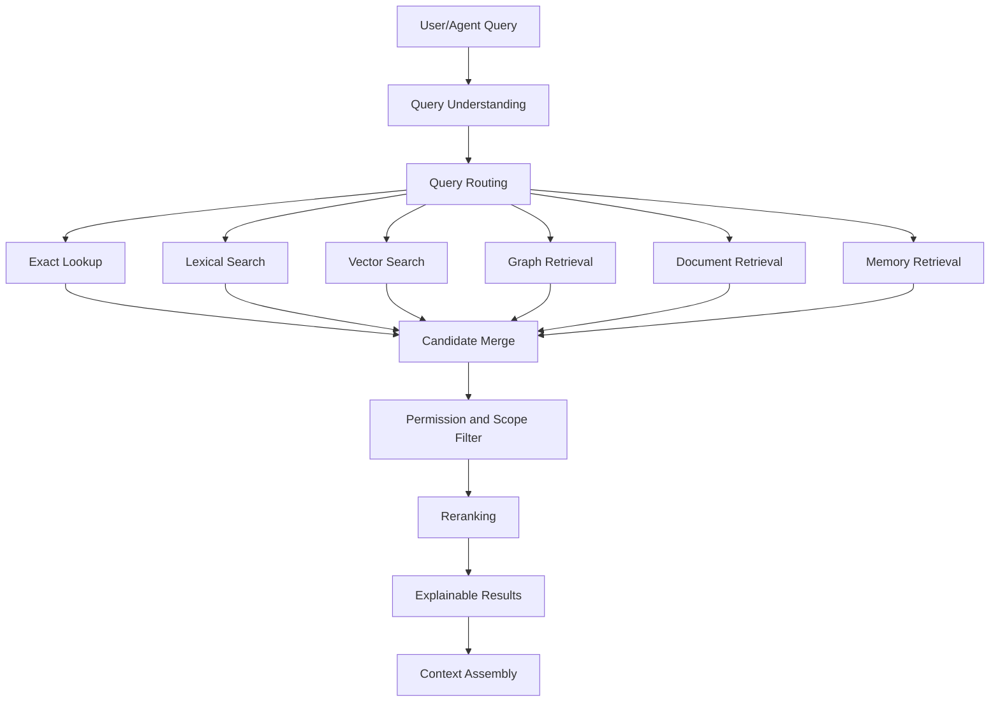

------
title: Learn AI Code Documentation & Agent Memory Platform - Part 015
description: Hybrid search dan ranking untuk menggabungkan exact lookup, lexical search, vector search, graph expansion, metadata filtering, trust, freshness, dan task intent dalam retrieval code intelligence.
series: learn-ai-code-documentation-agent-memory
seriesTitle: Learn AI Code Documentation & Agent Memory Platform
order: 15
partTitle: Hybrid Search and Ranking
tags:
- ai
- retrieval
- hybrid-search
- ranking
- vector-search
- lexical-search
- code-intelligence
- agent-context
date: 2026-07-02
---

# Part 015 — Hybrid Search and Ranking

## 1. Tujuan Part Ini

Part 014 membahas embedding dan vector indexing. Sekarang kita menyusun retrieval layer yang benar-benar usable: **hybrid search and ranking**.

Dalam code intelligence platform, tidak ada satu search strategy yang cukup.

Vector search bagus untuk semantic recall, tetapi lemah untuk exact identifier. Lexical search bagus untuk keyword dan identifier, tetapi lemah untuk intent. Graph bagus untuk dependency dan impact, tetapi tidak cocok sebagai discovery awal untuk pertanyaan vague. Metadata filtering menjaga scope dan permission. Trust/freshness menjaga agar hasil yang tampak relevan tidak menyesatkan.

Target part ini:

1. memahami kenapa retrieval harus hybrid,
2. membedakan exact lookup, lexical, vector, graph, metadata, dan memory retrieval,
3. mendesain query understanding dan query routing,
4. membuat ranking model berbasis task intent,
5. menggabungkan hasil dari beberapa retriever,
6. menerapkan permission filtering dan source boundary,
7. memberi ranking penalty untuk stale/generated/vendor/low-confidence evidence,
8. menghasilkan retrieval result yang explainable,
9. membuat evaluation untuk hybrid retrieval,
10. menyiapkan output untuk context assembly engine di Part 016.

---

## 2. Kenapa Hybrid Search Wajib

Repository query memiliki bentuk yang sangat berbeda.

| Query | Search Terbaik |
|---|---|
| `OrderValidator.validate` | exact symbol lookup |
| `POST /orders` | route/API index |
| `src/main/java/.../OrderService.java` | file path lookup |
| `order.validation.max-items` | config key index |
| "how does order validation work?" | vector + lexical + graph |
| "what calls this method?" | graph query |
| "which tests cover invalid orders?" | test graph + lexical |
| "why did we centralize validation?" | ADR/doc search + vector |
| "what changed after commit X?" | metadata + graph diff |
| "agent needs context to edit pricing rule" | exact target + graph + tests + memory |

Jika semua query dilempar ke vector DB, hasil akan tampak pintar tetapi sering salah. Jika semua query dilempar ke lexical search, sistem tidak memahami intent.

Hybrid retrieval menggabungkan kekuatan beberapa strategi.

---

## 3. Retrieval Stack



Retrieval bukan satu call. Retrieval adalah pipeline.

---

## 4. Retrieval Inputs

### 4.1 Query Request

```yaml
retrievalRequest:
  tenantId: acme
  principal:
    userId: user_123
    teams:
      - team-order-platform
  scope:
    repositoryId: order-service
    branch: main
    commitSha: 6f41ab2
  query:
    text: "how does order validation work?"
    taskType: module_explanation
  constraints:
    maxCandidates: 50
    includeMemory: true
    includeDocs: true
    includeTests: true
```

### 4.2 Required Context

Retrieval needs:

- tenant/principal,
- repository scope,
- snapshot/commit,
- task type,
- query text,
- target symbol/path if available,
- source boundary policy,
- permission policy,
- freshness policy,
- ranking profile.

Without these, retrieval cannot be safe or relevant.

---

## 5. Query Understanding

Query understanding decides how to route query.

### 5.1 Query Features

Extract:

- exact symbol-like tokens,
- file paths,
- endpoint paths,
- config keys,
- event topics,
- table names,
- error messages,
- natural language intent,
- task type,
- target module,
- repository names,
- branch/commit hints.

### 5.2 Query Classification

```yaml
queryUnderstanding:
  raw: "what tests cover OrderValidator.validate?"
  detected:
    intent: find_related_tests
    symbolCandidates:
      - OrderValidator.validate
    wantsTests: true
    queryMode:
      - exact_symbol
      - graph_tests
      - lexical
```

### 5.3 Intent Types

| Intent | Example |
|---|---|
| `find_symbol` | "where is OrderValidator?" |
| `explain_module` | "how does order validation work?" |
| `find_callers` | "what calls validate?" |
| `find_tests` | "tests for corporate order validation" |
| `generate_docs` | "generate module docs" |
| `code_change_context` | "context to modify validation rule" |
| `api_explanation` | "what handles POST /orders?" |
| `data_flow` | "where is orders table written?" |
| `architecture_decision` | "why use RuleRegistry?" |
| `troubleshooting` | "why validation failures spike?" |

### 5.4 Exact Pattern Detection

Examples:

```txt
com.acme.order.OrderValidator.validate
src/main/java/com/acme/order/OrderValidator.java
POST /orders
order.created
order.validation.max-items
orders.status
```

Exact patterns should route to exact indexes before semantic search.

---

## 6. Retriever Types

### 6.1 Exact Lookup

Exact lookup is deterministic.

Use for:

- symbol,
- file path,
- route,
- config key,
- event topic,
- table,
- document path,
- memory ID.

Example:

```yaml
exactLookup:
  type: symbol
  value: OrderValidator.validate
```

### 6.2 Lexical Search

Lexical search is strong for identifiers and literal strings.

Use for:

- class/function names,
- error messages,
- config keys,
- table names,
- comments,
- specific terms.

### 6.3 Vector Search

Vector search is strong for semantic recall.

Use for:

- conceptual queries,
- vague questions,
- onboarding,
- behavior discovery,
- doc discovery,
- memory discovery.

### 6.4 Graph Retrieval

Graph retrieval is strong for relation queries.

Use for:

- callers,
- callees,
- tests,
- route flow,
- dependency impact,
- docs linked to symbol,
- memory grounded in symbol.

### 6.5 Document Retrieval

Document retrieval uses document metadata, type, freshness, review state.

Use for:

- ADR,
- README,
- runbook,
- module docs,
- generated docs,
- stale docs report.

### 6.6 Memory Retrieval

Memory retrieval is scoped and governed.

Use for:

- conventions,
- decisions,
- known pitfalls,
- test strategy,
- previous evaluation lessons.

Memory should be returned as derived guidance, not primary evidence.

---

## 7. Retrieval Routing

### 7.1 Routing Matrix

| Intent | Exact | Lexical | Vector | Graph | Docs | Memory |
|---|---:|---:|---:|---:|---:|---:|
| find symbol | high | high | low | medium | low | low |
| explain module | medium | medium | high | high | high | medium |
| find callers | high | low | low | high | low | low |
| find tests | medium | high | medium | high | low | medium |
| generate docs | medium | medium | high | high | high | medium |
| code change context | high | medium | medium | high | medium | high |
| API explanation | high | medium | medium | high | high | medium |
| architecture decision | low | medium | high | medium | high | high |
| troubleshooting | medium | high | high | high | high | medium |

### 7.2 Example Routing

Query:

```txt
what handles POST /orders?
```

Routing:

```yaml
routes:
  - api_route_index
  - graph_handler_query
  - lexical_search
  - vector_search_low_priority
```

Query:

```txt
why are validation rules centralized?
```

Routing:

```yaml
routes:
  - document_search_adr
  - vector_search_docs
  - memory_search_decisions
  - graph_search_related_symbols
```

---

## 8. Candidate Model

All retrievers should output a common candidate model.

```yaml
candidate:
  candidateId: cand_01J...
  sourceRetriever: vector_search
  artifactType: chunk
  artifactId: chunk_01J...
  repositoryId: order-service
  snapshotId: snap_6f41ab2
  path: src/main/java/com/acme/order/validation/OrderValidator.java
  title: OrderValidator.validate
  score:
    raw: 0.83
    normalized: 0.76
  evidenceRole: primary_evidence
  metadata:
    chunkType: method_chunk
    language: java
    staleRisk: low
    confidence: 0.94
```

### 8.1 Candidate Types

| Candidate Type | Example |
|---|---|
| chunk | method/doc/config chunk |
| symbol | `OrderValidator.validate` |
| graph_node | API operation |
| graph_edge | `CALLS` edge |
| document | `docs/order-validation.md` |
| memory | `mem_rule_registry` |
| graph_path | request flow |
| file | source file |

Candidates may be transformed into context items later.

---

## 9. Candidate Merge

Multiple retrievers may return the same thing.

### 9.1 Duplicate Sources

Example:

- exact lookup returns `OrderValidator.validate`,
- vector search returns method chunk,
- graph retrieval returns same symbol as target.

Merge by logical identity.

```yaml
mergedCandidate:
  artifactId: chunk_order_validator_validate
  matchedBy:
    - exact_symbol
    - vector_search
    - graph_target
  scores:
    exact: 1.0
    vector: 0.82
    graph: 0.95
```

### 9.2 Merge Keys

Use:

- logicalChunkId,
- logicalSymbolId,
- documentId + sectionId,
- graph node logical ID,
- memoryId,
- file path + commit.

### 9.3 Merge Benefit

Merged candidates get stronger ranking because multiple retrieval modes agree.

---

## 10. Permission and Scope Filtering

Security filter is not optional.

### 10.1 Filter Stages

Apply filtering:

1. before retrieval if possible,
2. after retrieval before ranking,
3. before context assembly,
4. before output.

### 10.2 Required Checks

- tenant match,
- repository access,
- snapshot access,
- document visibility,
- memory scope,
- sensitivity,
- blocked content,
- derived visibility.

### 10.3 Never Return Unauthorized Metadata

Even path/title can leak.

Bad:

```json
{
  "path": "fraud-service/src/main/java/HighRiskPaymentDetector.java"
}
```

if user cannot access fraud-service.

### 10.4 Filter Result

Store exclusion counts, not secret details.

```yaml
filterReport:
  candidatesBefore: 80
  excluded:
    permissionDenied: 12
    blockedSensitive: 1
    staleHighRisk: 3
  candidatesAfter: 64
```

---

## 11. Ranking Features

Ranking combines many signals.

### 11.1 Feature Categories

| Category | Features |
|---|---|
| Query match | exact, lexical, vector similarity |
| Structural | graph proximity, parent/child relation |
| Source quality | source kind, generated/vendor, confidence |
| Freshness | stale risk, commit match, last changed |
| Trust | review state, evidence coverage, conflict |
| Task intent | tests for code change, ADR for decision |
| Scope | same module/repo, branch/commit |
| Security | allowed, sensitivity |
| Cost | token size, chunk length |
| Diversity | avoid duplicate chunks |

### 11.2 Example Feature Record

```yaml
features:
  exactSymbolMatch: 1.0
  lexicalScore: 0.62
  vectorSimilarity: 0.79
  graphProximity: 0.90
  sourceKindBoost: 0.20
  freshnessPenalty: 0.00
  generatedPenalty: 0.00
  memoryDerivedPenalty: 0.00
  tokenCostPenalty: 0.04
```

---

## 12. Ranking Formula

Start simple and explainable.

```txt
finalScore =
    exactMatchScore * 0.25
  + lexicalScore * 0.20
  + vectorScore * 0.20
  + graphScore * 0.15
  + taskIntentScore * 0.10
  + trustScore * 0.05
  + freshnessScore * 0.05
  - penalties
```

### 12.1 Penalties

```txt
penalties =
    stalePenalty
  + generatedPenalty
  + vendorPenalty
  + lowConfidencePenalty
  + duplicatePenalty
  + tokenCostPenalty
  + wrongScopePenalty
```

### 12.2 Task-Specific Weight

For exact symbol lookup:

```txt
exactMatchWeight high
vectorWeight low
```

For conceptual explanation:

```txt
vectorWeight high
docs/source/trust high
```

For code change context:

```txt
target/exact/graph/tests high
docs medium
memory medium
```

---

## 13. Ranking Profiles

### 13.1 Module Explanation Profile

Prefer:

- module source chunks,
- class overview chunks,
- docs,
- graph path chunks,
- ADR,
- tests as supporting evidence.

Penalize:

- unrelated private helpers,
- generated code,
- stale docs.

### 13.2 Code Change Profile

Prefer:

- target symbol,
- parent class,
- direct callers/callees,
- related tests,
- config/schema,
- known pitfalls memory.

Penalize:

- broad docs,
- large files,
- unrelated modules.

### 13.3 API Documentation Profile

Prefer:

- API operation chunks,
- OpenAPI contract,
- route handler,
- request/response schema,
- tests,
- service flow graph.

### 13.4 Architecture Decision Profile

Prefer:

- ADR,
- architecture docs,
- graph dependencies,
- decision memory,
- reviewed docs.

### 13.5 Troubleshooting Profile

Prefer:

- runbooks,
- config,
- operational docs,
- error messages,
- code path,
- recent incidents if integrated.

---

## 14. Graph Proximity Scoring

Graph helps rank related artifacts.

### 14.1 Distance

| Distance | Example | Score |
|---|---|---:|
| 0 | target symbol | 1.0 |
| 1 | direct caller/callee/test/doc | 0.8 |
| 2 | caller of caller / dependency | 0.5 |
| 3+ | distant | low |

### 14.2 Edge Type Weight

| Edge Type | Code Change | Docs |
|---|---:|---:|
| TESTS | high | medium |
| CALLS | high | high |
| HANDLED_BY | medium | high |
| READS_CONFIG | medium | medium |
| DOCUMENTED_BY | medium | high |
| GROUNDED_IN | medium | medium |
| IMPORTS | low/medium | low |
| MENTIONS | low/medium | medium |

### 14.3 Confidence

Graph edge confidence should multiply proximity.

```txt
graphScore = proximityScore * edgeConfidence * edgeTypeWeight
```

---

## 15. Freshness and Trust Ranking

### 15.1 Freshness

| Stale Risk | Score Effect |
|---|---:|
| low | no penalty |
| medium | small penalty |
| high | large penalty |
| critical | exclude unless explicitly requested |
| unknown | small/medium penalty |

### 15.2 Trust

Trust includes:

- source strength,
- review state,
- conflict state,
- generation provenance,
- evidence coverage.

### 15.3 Example

A stale README may have high vector similarity. A current source method with lower semantic similarity may be better.

Ranking should prefer current evidence for factual code questions.

---

## 16. Source Boundary Ranking

Source kind matters.

### 16.1 Default Source Priority

For implementation truth:

```txt
current source code
> tests/contracts
> reviewed docs/ADR
> generated reviewed docs
> memory
> unreviewed generated docs
> stale docs
```

For decision rationale:

```txt
reviewed ADR
> architecture docs
> decision memory
> source implementation
> generated docs
```

For operational troubleshooting:

```txt
runbook
> config/infra
> code path
> tests
> README
```

### 16.2 Generated and Vendor Penalty

Generated code:

- useful if original contract absent,
- usually not primary evidence.

Vendor code:

- usually exclude.

---

## 17. Diversity and Redundancy

Top results should not be 10 chunks from the same file if task needs broad understanding.

### 17.1 Diversity Rules

Limit:

- max chunks per file,
- max chunks per symbol,
- max docs per doc type,
- max memory records,
- max graph paths.

### 17.2 Diversity Example

For module docs, prefer:

- one class overview,
- main methods,
- related tests,
- ADR,
- config,
- graph path.

Not:

- 8 helper methods from same class.

### 17.3 Redundancy Handling

If class chunk and method chunks overlap, choose based on task.

- explanation: class overview + key methods,
- code change: target method + related tests.

---

## 18. Explainable Ranking

Every result should explain why it was returned.

### 18.1 Result Explanation

```yaml
result:
  title: OrderValidator.validate
  finalScore: 0.91
  reasons:
    - "Exact match to target symbol"
    - "Primary source chunk"
    - "Directly linked to requested module"
    - "Current snapshot"
  penalties: []
```

### 18.2 Stale Result Explanation

```yaml
result:
  title: docs/legacy-rule-engine.md
  finalScore: 0.32
  reasons:
    - "Semantic match to validation rules"
  penalties:
    - "High stale risk"
    - "Mentions missing symbol OrderRuleEngine"
```

### 18.3 Why Explanation Matters

It helps:

- debugging retrieval,
- user trust,
- eval,
- tuning,
- audit.

---

## 19. Retrieval Output Contract

Hybrid retrieval should output structured results.

```yaml
retrievalResult:
  retrievalRunId: ret_01J...
  queryUnderstanding:
    intent: explain_module
    detectedSymbols:
      - OrderValidator
  scope:
    repositoryId: order-service
    commitSha: 6f41ab2
  results:
    - rank: 1
      artifactType: chunk
      chunkId: chunk_order_validator_validate
      title: OrderValidator.validate
      finalScore: 0.91
      evidenceRole: primary_evidence
      reasons:
        - exact symbol/module match
        - source primary evidence
    - rank: 2
      artifactType: chunk
      chunkId: chunk_order_validator_test
      title: OrderValidatorTest
      finalScore: 0.84
      evidenceRole: supporting_evidence
  exclusions:
    - reason: stale_high_risk
      count: 2
    - reason: permission_denied
      count: 5
  versions:
    rankerVersion: hybrid-ranker-v1
    retrieverVersion: retrieval-orchestrator-v1
```

---

## 20. Hybrid Retrieval Implementation

### 20.1 Interfaces

```java
public interface Retriever {
    boolean supports(RetrievalRequest request);

    List<RetrievalCandidate> retrieve(RetrievalRequest request);
}
```

### 20.2 Orchestrator

```java
public final class HybridRetrievalOrchestrator {
    private final List<Retriever> retrievers;
    private final CandidateMerger merger;
    private final PermissionFilter permissionFilter;
    private final Reranker reranker;

    public RetrievalResult retrieve(RetrievalRequest request) {
        QueryUnderstanding understanding = understand(request);

        List<RetrievalCandidate> candidates = retrievers.stream()
            .filter(r -> r.supports(request.withUnderstanding(understanding)))
            .flatMap(r -> r.retrieve(request).stream())
            .toList();

        List<RetrievalCandidate> merged = merger.merge(candidates);
        List<RetrievalCandidate> allowed = permissionFilter.filter(merged, request.principal());
        List<RankedResult> ranked = reranker.rank(allowed, request, understanding);

        return RetrievalResult.of(understanding, ranked);
    }
}
```

### 20.3 Reranker

```java
public interface Reranker {
    List<RankedResult> rank(
        List<RetrievalCandidate> candidates,
        RetrievalRequest request,
        QueryUnderstanding understanding
    );
}
```

---

## 21. Lexical Index Design

### 21.1 Fields

Index:

- title,
- content,
- symbol name,
- qualified name,
- path,
- comments,
- doc headings,
- endpoint path,
- config key,
- event topic,
- table name.

### 21.2 Analyzer

For code:

- preserve identifiers,
- split camelCase,
- split snake_case,
- split package names,
- preserve exact phrase.

Example:

```txt
OrderValidator.validate
Order Validator validate
order validator validate
```

### 21.3 Field Boost

| Field | Boost |
|---|---:|
| exact symbol name | high |
| qualified name | high |
| path | high |
| title/heading | medium/high |
| content | medium |
| comments | medium |
| generated content | low |

---

## 22. Exact Index Design

Exact indexes should exist for:

- symbol name,
- qualified symbol,
- file path,
- route method/path,
- config key,
- event topic,
- table name,
- document path,
- memory ID.

### 22.1 Exact Query Output

Exact lookup returns high-confidence candidates, but still filter by permission and snapshot.

### 22.2 Ambiguity

If symbol name ambiguous:

```yaml
query: OrderService
candidates:
  - com.acme.order.OrderService
  - com.acme.billing.OrderService
status: ambiguous
```

Use scope/repo/path to disambiguate.

---

## 23. Memory Ranking

Memory should not dominate source evidence.

### 23.1 Memory Ranking Rules

Boost:

- exact scope match,
- active state,
- approved review,
- high confidence,
- graph proximity,
- task type match.

Penalize/exclude:

- stale,
- conflicted,
- candidate-only,
- broad scope mismatch,
- low evidence strength.

### 23.2 Memory Output

Memory should be labeled:

```yaml
result:
  artifactType: memory
  sourceRole: derived_guidance
  statement: "Validation rules are registered through RuleRegistry."
  evidence:
    - RuleRegistry.java
```

Do not present memory as source code fact without evidence.

---

## 24. Ranking Evaluation

### 24.1 Golden Queries

Create query set:

```yaml
- query: "where are validation rules registered?"
  intent: code_location
  expected:
    - RuleRegistry.java
    - OrderValidator.java

- query: "why centralize validation rules?"
  intent: architecture_decision
  expected:
    - docs/adr/012-validation-rules.md

- query: "what tests cover OrderValidator.validate?"
  intent: find_tests
  expected:
    - OrderValidatorTest.shouldRejectInvalidOrder
```

### 24.2 Metrics

| Metric | Meaning |
|---|---|
| recall@k | expected relevant items found |
| precision@k | top results relevant |
| MRR | first relevant rank |
| nDCG | ranked relevance |
| stale@k | stale results in top k |
| sourceCoverage | includes source/test/docs as required |
| permissionViolations | must be zero |
| contextSuccess | downstream task success |

### 24.3 Evaluate by Intent

Do not average everything blindly.

A ranker good at conceptual docs may be bad at exact symbol navigation.

---

## 25. Retrieval Debugging

### 25.1 Debug Trace

For each query, store:

- query understanding,
- retrievers called,
- raw candidates,
- merge decisions,
- filters,
- ranking features,
- final results,
- exclusions.

### 25.2 Example

```yaml
debug:
  retrievers:
    exact_symbol:
      candidates: 1
    vector:
      candidates: 40
    lexical:
      candidates: 22
    graph:
      candidates: 8
  merge:
    before: 71
    after: 48
  filter:
    permissionDenied: 4
    staleExcluded: 2
  ranker:
    version: hybrid-ranker-v1
```

### 25.3 Why Debugging Matters

Bad retrieval causes bad docs and bad agent behavior. Without trace, prompt tuning becomes guesswork.

---

## 26. Common Mistakes

### 26.1 Vector Search Only

Fails exact symbol, endpoint, and path queries.

### 26.2 Lexical Search Only

Fails semantic discovery and vague queries.

### 26.3 Graph Only

Graph needs seed nodes; it is weak for broad discovery.

### 26.4 No Permission Filter

Security incident waiting to happen.

### 26.5 Ranking Without Task Intent

Different tasks need different evidence.

### 26.6 No Freshness Penalty

Stale docs can rank highly because they are semantically similar.

### 26.7 Memory Treated as Source Truth

Memory should be derived guidance.

### 26.8 No Explainability

Ranker becomes impossible to tune and audit.

---

## 27. Practical Exercise

Build hybrid retrieval for one repository.

### 27.1 Input

Use indexed artifacts:

```txt
symbols
chunks
documents
graph edges
memory records
vector records
lexical index
```

### 27.2 Queries

Test:

```txt
OrderValidator.validate
what handles POST /orders?
where are validation rules registered?
why are validation rules centralized?
what tests cover invalid orders?
what config controls max order items?
```

### 27.3 Output

Produce:

```txt
retrieval-results.json
retrieval-debug-trace.json
retrieval-eval-report.yaml
```

### 27.4 Acceptance Criteria

- exact symbol query returns symbol first,
- endpoint query returns route handler and contract,
- conceptual query includes source + docs + tests,
- stale docs penalized,
- permission filter applied,
- memory labeled as derived,
- ranking reasons included,
- eval metrics reported per intent.

---

## 28. Summary

Hybrid search and ranking is where retrieval becomes useful for real engineering tasks.

Key points:

1. no single retrieval method is enough,
2. query understanding should route to exact, lexical, vector, graph, docs, and memory retrieval,
3. all retrievers should output a common candidate model,
4. candidates must be merged by logical identity,
5. permission and scope filtering are mandatory,
6. ranking should account for exact match, lexical, vector, graph, task intent, trust, and freshness,
7. stale/generated/vendor/low-confidence artifacts need penalties,
8. memory must be ranked as derived guidance,
9. result explanations are essential for debugging and trust,
10. retrieval evaluation must be task-specific.

Part berikutnya membahas **Context Assembly Engine**: bagaimana mengubah retrieval results menjadi context pack yang compact, safe, cited, ordered, token-aware, and useful for documentation generation and AI agents.
