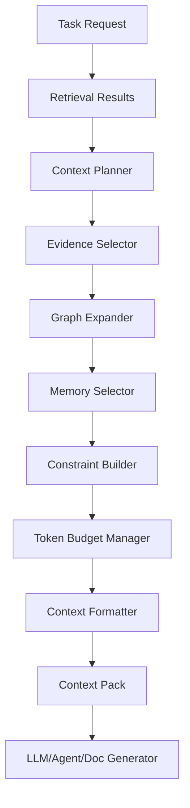
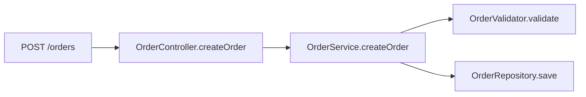

------
title: Learn AI Code Documentation & Agent Memory Platform - Part 016
description: Context assembly engine untuk mengubah retrieval results menjadi context pack yang token-aware, evidence-preserving, permission-safe, task-specific, cited, dan siap dipakai documentation generator maupun AI agents.
series: learn-ai-code-documentation-agent-memory
seriesTitle: Learn AI Code Documentation & Agent Memory Platform
order: 16
partTitle: Context Assembly Engine
tags:
- ai
- context-assembly
- agent-context
- retrieval
- documentation
- code-intelligence
- provenance
- software-architecture
date: 2026-07-02
---

# Part 016 — Context Assembly Engine

## 1. Tujuan Part Ini

Part 015 membahas hybrid retrieval dan ranking. Sekarang kita membahas tahap yang mengubah retrieval results menjadi sesuatu yang bisa dipakai model/agent: **context assembly engine**.

Retrieval menjawab:

> "Artifact apa yang relevan?"

Context assembly menjawab:

> "Dari artifact yang relevan, informasi apa yang harus diberikan, dalam urutan apa, dengan format apa, batas token berapa, evidence mana, memory mana, warning apa, dan constraint apa?"

Ini adalah salah satu bagian paling kritis dalam sistem AI code documentation.

Jika context assembly buruk:

- LLM menerima terlalu banyak noise,
- evidence penting tidak masuk,
- stale docs masuk tanpa warning,
- memory terlihat seperti source truth,
- tests terlewat,
- token budget habis untuk README,
- generated docs tidak bisa cite source,
- agent membuat perubahan tanpa constraint,
- permission leak terjadi melalui context.

Target part ini:

1. memahami context pack sebagai artifact,
2. mendesain input/output context assembly,
3. membuat strategy packing berdasarkan task intent,
4. mengatur token budget,
5. menjaga evidence provenance,
6. memisahkan source evidence, docs, memory, constraints, warnings, dan exclusions,
7. membuat context ordering yang membantu model,
8. menerapkan compression tanpa menghilangkan traceability,
9. membuat quality gates,
10. menyiapkan pipeline documentation generation di Part 018.

---

## 2. Context Assembly Bukan Concatenation

Naive approach:

```txt
ambil top 10 retrieval chunks
gabungkan
kirim ke LLM
```

Masalah:

- top 10 bisa redundant,
- chunks bisa stale,
- memory bercampur source,
- evidence source tidak jelas,
- order tidak sesuai reasoning,
- token budget boros,
- tidak ada task constraints,
- tidak ada warning.

Context assembly adalah proses seleksi dan pengemasan evidence.

---

## 3. Mental Model



Context pack adalah artifact yang harus bisa disimpan dan diaudit.

---

## 4. Context Pack Definition

Context pack adalah paket structured context untuk satu task/run.

### 4.1 Minimal Context Pack

```yaml
contextPack:
  contextPackId: ctx_01J...
  task:
    type: generate_module_doc
    description: "Generate docs for order validation module"
  source:
    repositoryId: order-service
    commitSha: 6f41ab2
  evidence:
    - path: OrderValidator.java
      lines: [12, 144]
  tokenEstimate: 8500
```

### 4.2 Production Context Pack

```yaml
contextPack:
  contextPackId: ctx_01J...
  tenantId: acme
  principal:
    userId: user_123
  task:
    type: code_change_context
    description: "Add validation rule for corporate orders"
    target:
      kind: symbol
      id: OrderValidator.validate
  scope:
    repositoryId: order-service
    snapshotId: snap_6f41ab2
    branch: main
    commitSha: 6f41ab2
  sections:
    - source_evidence
    - tests
    - contracts_and_config
    - documentation
    - memory
    - constraints
    - warnings
  budget:
    maxTokens: 8000
    estimatedTokens: 7420
  provenance:
    retrievalRunId: ret_01J...
    graphQueryId: graphq_01J...
    memoryQueryId: memq_01J...
    assemblerVersion: context-assembler-v1
  quality:
    evidenceCoverage: good
    staleRisk: low
    unsupportedRisk: medium
  security:
    visibilityScope: private
    redactionApplied: false
```

---

## 5. Context Assembly Inputs

### 5.1 Required Inputs

| Input | Why |
|---|---|
| task type | determines evidence priority |
| user/principal | permission filtering |
| repository/snapshot | version correctness |
| retrieval results | candidate evidence |
| graph neighborhood | relation-aware expansion |
| memory results | derived guidance |
| token budget | packing limit |
| source boundary policy | safety and relevance |
| output target | docs vs agent vs review |
| trust/freshness metadata | avoid stale context |

### 5.2 Context Assembly Request

```yaml
contextAssemblyRequest:
  task:
    type: generate_module_doc
    target:
      type: module
      path: src/main/java/com/acme/order/validation
    audience:
      - backend_engineer
  retrievalRunId: ret_01J...
  scope:
    repositoryId: order-service
    commitSha: 6f41ab2
  options:
    maxTokens: 12000
    includeTests: true
    includeDocs: true
    includeMemory: true
    includeGraphPaths: true
    requireCitations: true
```

---

## 6. Context Pack Sections

Do not mix all content into one blob.

### 6.1 Recommended Sections

| Section | Purpose |
|---|---|
| task | what the model should do |
| scope | repo/branch/commit/target |
| source evidence | primary code evidence |
| tests | behavior evidence |
| contracts/schemas/config | structural/runtime evidence |
| graph paths | compact relationship evidence |
| documentation | existing docs/ADR/runbook |
| memory | derived guidance |
| constraints | rules and policies |
| warnings | stale/uncertain/conflict info |
| exclusions | what was intentionally excluded |
| citation map | source IDs to spans |

### 6.2 Why Sections Matter

Sections help:

- model understand priority,
- prevent memory from masquerading as source,
- preserve citations,
- support audit,
- enable quality checks.

---

## 7. Task-Specific Context Strategy

### 7.1 Module Documentation

Prioritize:

1. module symbols/classes,
2. public entry points,
3. graph paths,
4. tests,
5. configs/contracts,
6. existing docs/ADR,
7. memory,
8. warnings.

### 7.2 Code Change

Prioritize:

1. exact target symbol,
2. parent class/file,
3. related tests,
4. direct callers/callees,
5. config/schema,
6. conventions/pitfalls memory,
7. relevant docs,
8. constraints.

### 7.3 API Documentation

Prioritize:

1. route/API operation,
2. OpenAPI/contract,
3. handler,
4. request/response schema,
5. service flow,
6. tests,
7. error handling,
8. docs/ADR.

### 7.4 Architecture Explanation

Prioritize:

1. module graph,
2. dependency edges,
3. ADR/design docs,
4. service boundaries,
5. event/data/config relations,
6. source entry points,
7. memory.

### 7.5 Troubleshooting

Prioritize:

1. runbook,
2. error messages,
3. operational config,
4. relevant code path,
5. deployment/CI/infra,
6. recent memory/eval lessons.

---

## 8. Evidence Selection

Retrieval returns candidates. Context assembly selects final evidence.

### 8.1 Selection Rules

Select evidence that is:

- relevant to task,
- permission-safe,
- fresh enough,
- high confidence,
- non-redundant,
- source-boundary compliant,
- token-efficient,
- citation-ready.

### 8.2 Evidence Categories

```yaml
evidenceBuckets:
  primary:
    - target source code
    - direct implementation
  supporting:
    - tests
    - contracts
    - config
  explanatory:
    - docs
    - ADR
  derived:
    - graph paths
    - memory
  warning:
    - stale docs
    - conflicts
```

### 8.3 Minimum Evidence Set

For code change context:

```yaml
minimum:
  - target symbol
  - parent file/class
  - at least one related test if exists
  - direct constraints
```

For generated docs:

```yaml
minimum:
  - source symbols in target scope
  - docs/ADR if available
  - graph summary
  - evidence citation map
```

---

## 9. Token Budget Manager

Context window is finite. Budget must be explicit.

### 9.1 Budget Allocation

Example for 12k token budget module docs:

```yaml
budget:
  taskAndInstructions: 800
  primarySource: 4500
  tests: 1800
  graphPaths: 900
  docsAndADR: 2200
  memory: 500
  warningsAndCitationMap: 700
  reserveForModel: 600
```

### 9.2 Adaptive Budget

If no ADR exists, reallocate to tests/source.

If source is huge, use summaries + key method chunks.

If task is code change, tests get more budget.

### 9.3 Token Cost per Candidate

Each candidate should have token estimate.

```yaml
candidate:
  chunkId: chunk_order_validator
  tokenEstimate: 720
  valueScore: 0.91
  valuePerToken: 0.00126
```

### 9.4 Packing Objective

Maximize utility under token budget:

```txt
maximize sum(candidateValue)
subject to totalTokens <= budget
and requiredEvidence included
and diversity constraints satisfied
```

This can be greedy initially.

---

## 10. Ordering Context

Order affects model behavior.

### 10.1 Recommended Order for Documentation

```txt
1. Task and output requirements
2. Scope and source version
3. High-level graph/module overview
4. Primary source evidence
5. Supporting tests/contracts/config
6. Existing docs/ADR
7. Memory
8. Warnings and uncertainties
9. Citation map
```

### 10.2 Recommended Order for Code Change Agent

```txt
1. Task and constraints
2. Target symbol and file
3. Related tests
4. Direct callers/callees
5. Config/schema/contract
6. Memory/pitfalls
7. Relevant docs
8. Tool permissions
9. Warnings
```

### 10.3 Put Warnings Where They Matter

If stale docs are included, put warning before the stale content.

```md
Warning: The following legacy doc is stale and should not be treated as primary evidence.
```

---

## 11. Context Formatting

### 11.1 Markdown Format

Good for LLM/doc generation.

```md
# Context Pack

Task: Generate module documentation for order validation.
Repository: order-service
Commit: 6f41ab2

## Source Evidence

### Evidence E1 — OrderValidator.validate

Source: `src/main/java/.../OrderValidator.java:12-144`

```java
...
```
```

### 11.2 YAML/JSON Format

Good for agent tooling.

```yaml
sourceEvidence:
  - id: E1
    kind: method
    path: src/main/java/.../OrderValidator.java
    lines: [12, 144]
    content: |
      ...
```

### 11.3 Hybrid Format

Use structured header + markdown body.

This is often best for LLMs and humans.

---

## 12. Citation Map

Every evidence block should have an ID.

```yaml
citations:
  E1:
    type: file_span
    path: src/main/java/com/acme/order/validation/OrderValidator.java
    lines: [12, 144]
    commitSha: 6f41ab2
  E2:
    type: test_case
    path: src/test/java/com/acme/order/validation/OrderValidatorTest.java
    lines: [20, 188]
```

Generated docs can cite:

```md
Order validation is performed by `OrderValidator.validate`. [E1]
```

### 12.1 Citation Requirements

Citations should include:

- evidence ID,
- source type,
- path/pointer,
- line/span,
- commit,
- artifact ID,
- visibility.

---

## 13. Compression Strategy

Compression is necessary for large repos.

### 13.1 Safe Compression

Safe compression keeps traceability.

```yaml
summary:
  text: "OrderValidator delegates rule lookup to RuleRegistry."
  evidence:
    - E1
    - E3
```

### 13.2 Unsafe Compression

Unsafe:

```txt
The system uses a sophisticated rule registry.
```

No evidence, vague, possibly exaggerated.

### 13.3 Compression Levels

| Level | Description |
|---|---|
| raw | full source chunk |
| extractive | selected lines/snippets |
| structured summary | generated summary with evidence IDs |
| graph summary | compact relation path |
| memory summary | memory statement with grounding |

### 13.4 When to Compress

Compress:

- large classes,
- long docs,
- repeated patterns,
- graph paths,
- old supporting docs.

Do not compress:

- exact target method for code change,
- critical test assertions,
- API contract fields,
- source evidence for major claim.

---

## 14. Graph Context

Graph should be represented compactly.

### 14.1 Graph Path Format

```yaml
graphPaths:
  - id: G1
    title: "Create order request flow"
    path:
      - "POST /orders"
      - "OrderController.createOrder"
      - "OrderService.createOrder"
      - "OrderValidator.validate"
      - "OrderRepository.save"
    evidence:
      - E1
      - E2
      - E3
```

### 14.2 Mermaid for Human Docs



### 14.3 Graph Warnings

If confidence low:

```yaml
warnings:
  - "Call from OrderService.createOrder to PaymentGateway.charge is inferred through interface and has moderate confidence."
```

---

## 15. Memory Context

Memory must be separated.

### 15.1 Memory Section

```md
## Approved Memory

These records are derived knowledge. Use them as guidance and prefer source evidence when making factual claims.

- M1: Validation rules are registered through RuleRegistry.
  Scope: order-service
  Confidence: good
  Evidence: E3
```

### 15.2 Memory Inclusion Rules

Include memory if:

- active,
- permission-safe,
- relevant to task,
- fresh,
- not conflicted,
- not broader than scope.

Exclude or warn if:

- stale,
- candidate-only,
- conflicted,
- low confidence,
- no evidence.

### 15.3 Memory Budget

Memory should be concise.

For most context packs, memory should not exceed 5–15% of token budget.

---

## 16. Documentation Context

Existing docs can help, but must be labeled.

### 16.1 Reviewed Docs

```md
## Reviewed Documentation

D1 — ADR 012: Validation Rules

Status: accepted
Freshness: low stale risk
Source: docs/adr/012-validation-rules.md
```

### 16.2 Stale Docs

```md
## Stale Documentation Warning

D4 — Legacy Rule Engine Doc

This doc is semantically related but marked high stale risk because it mentions `OrderRuleEngine`, which is not present in the current graph. Do not use it as primary evidence.
```

### 16.3 Generated Docs

Label generated docs:

```yaml
sourceKind: ai_generated
reviewState: pending
```

Do not let unreviewed generated docs become primary source.

---

## 17. Constraints and Policies

Context pack should include constraints.

### 17.1 Constraint Types

| Constraint | Example |
|---|---|
| source | "Use only evidence in current commit." |
| output | "Every major claim needs citation." |
| security | "Do not include secrets." |
| code change | "Do not modify generated code." |
| style | "Baeldung-style explanation." |
| review | "Output is draft pending human review." |
| tool | "Read-only tools only." |

### 17.2 Constraint Section

```yaml
constraints:
  - id: C1
    type: evidence
    text: "Do not make factual claims without source evidence."
  - id: C2
    type: security
    text: "Do not expose blocked-sensitive content."
  - id: C3
    type: source_boundary
    text: "Generated code is supporting evidence only."
```

### 17.3 Agent Tool Constraints

For agent context:

```yaml
allowedTools:
  - search_code
  - get_symbol
  - get_tests
prohibitedActions:
  - direct_push
  - write_memory_active
  - read_unauthorized_repo
```

---

## 18. Exclusions

Exclusions are important.

### 18.1 Why Store Exclusions

To explain why context omitted something.

Examples:

- stale docs excluded,
- secret file blocked,
- vendor code excluded,
- token budget omitted low-priority chunks,
- permission denied.

### 18.2 Exclusion Record

```yaml
excluded:
  - artifactType: document
    path: docs/legacy-rule-engine.md
    reason: stale_high_risk
  - artifactType: file
    path: .env.production
    reason: blocked_sensitive
  - artifactType: chunk
    path: target/generated-sources/OrdersApi.java
    reason: generated_supporting_only_low_priority
```

Do not expose unauthorized paths if user lacks permission.

---

## 19. Context Quality Gates

### 19.1 Safety Gates

- no unauthorized chunks,
- no blocked-sensitive content,
- memory visibility valid,
- composed context visibility valid,
- redaction applied.

### 19.2 Evidence Gates

- required target evidence included,
- citation map exists,
- evidence spans valid,
- source commit included,
- stale docs labeled.

### 19.3 Task Gates

For code change:

- target symbol included,
- related tests included or absence reported,
- constraints included,
- generated code not primary.

For doc generation:

- enough source evidence,
- existing docs/ADR included if relevant,
- unsupported-risk warning included.

### 19.4 Token Gates

- token estimate <= budget,
- reserve maintained,
- no single low-value chunk dominates.

---

## 20. Context Pack Quality Report

Example:

```yaml
quality:
  status: pass_with_warnings
  tokenEstimate: 7420
  budget: 8000
  evidence:
    primaryEvidenceCount: 4
    testEvidenceCount: 2
    docEvidenceCount: 1
    memoryCount: 2
  warnings:
    - "No ADR found for corporate order validation."
    - "One related doc excluded due to stale risk."
  safety:
    permissionChecked: true
    redactionApplied: false
    blockedContentIncluded: false
```

---

## 21. Context Pack Persistence

Context pack must be persisted for audit.

### 21.1 Store

- request,
- retrieval run ID,
- selected candidates,
- final formatted context,
- citation map,
- exclusions,
- token estimates,
- assembler version,
- quality report.

### 21.2 Schema

```sql
CREATE TABLE context_packs (
    context_pack_id TEXT PRIMARY KEY,
    tenant_id TEXT NOT NULL,
    repository_id TEXT,
    snapshot_id TEXT,
    commit_sha TEXT,
    task_type TEXT NOT NULL,
    target_ref TEXT,
    max_tokens INTEGER NOT NULL,
    estimated_tokens INTEGER NOT NULL,
    assembler_version TEXT NOT NULL,
    quality_status TEXT NOT NULL,
    visibility_scope TEXT NOT NULL,
    created_at TIMESTAMP NOT NULL
);
```

```sql
CREATE TABLE context_pack_items (
    id TEXT PRIMARY KEY,
    context_pack_id TEXT NOT NULL,
    item_type TEXT NOT NULL,
    artifact_type TEXT NOT NULL,
    artifact_id TEXT NOT NULL,
    order_index INTEGER NOT NULL,
    token_estimate INTEGER NOT NULL,
    reason TEXT NOT NULL,
    citation_id TEXT
);
```

```sql
CREATE TABLE context_pack_exclusions (
    id TEXT PRIMARY KEY,
    context_pack_id TEXT NOT NULL,
    artifact_type TEXT,
    artifact_id TEXT,
    reason TEXT NOT NULL,
    safe_description TEXT
);
```

---

## 22. Context Assembly Algorithm

### 22.1 Greedy Baseline

```txt
1. Add required task/instructions.
2. Add required target evidence.
3. Add high-priority tests/graph/config.
4. Add docs/ADR if budget.
5. Add memory if relevant.
6. Add warnings/citation map.
7. Drop low value-per-token items.
8. Validate gates.
```

### 22.2 Pseudo-Code

```java
public ContextPack assemble(ContextAssemblyRequest request) {
    RetrievalResult retrieval = retrievalStore.get(request.retrievalRunId());

    ContextPlan plan = planner.plan(request, retrieval);

    List<ContextItem> required = selector.selectRequired(plan);
    TokenBudget budget = TokenBudget.of(request.maxTokens()).reserve(plan.reserveTokens());

    ContextPackBuilder builder = new ContextPackBuilder(request);

    builder.addTaskSection(plan.taskSection());
    builder.addItems(required, budget);

    for (ContextBucket bucket : plan.orderedBuckets()) {
        List<ContextItem> selected = selector.select(bucket, budget.remaining());
        builder.addItems(selected, budget);
    }

    builder.addWarnings(plan.warnings());
    builder.addCitationMap();
    builder.addExclusions(plan.exclusions());

    ContextPack pack = builder.build();
    qualityGate.validate(pack);

    return contextPackStore.save(pack);
}
```

---

## 23. Context Planner

Planner maps task to context strategy.

### 23.1 Planner Output

```yaml
contextPlan:
  taskType: code_change_context
  requiredBuckets:
    - target_symbol
    - tests
  optionalBuckets:
    - callers
    - callees
    - config
    - docs
    - memory
  ordering:
    - task
    - target_symbol
    - tests
    - graph_neighbors
    - memory
    - docs
    - warnings
```

### 23.2 Planner Config

```yaml
profiles:
  code_change_context:
    required:
      - target_symbol
      - related_tests
    budget:
      target_symbol: 0.30
      tests: 0.25
      graph_neighbors: 0.20
      docs: 0.10
      memory: 0.10
      warnings: 0.05
```

---

## 24. Handling Missing Context

Context assembly should explicitly report missing evidence.

### 24.1 Missing Tests

```yaml
warnings:
  - type: missing_related_tests
    message: "No tests linked to OrderValidator.validate were found."
```

### 24.2 Missing ADR

```yaml
warnings:
  - type: missing_decision_doc
    message: "No ADR found for validation rule architecture."
```

### 24.3 Missing Contract

```yaml
warnings:
  - type: missing_contract
    message: "Route handler exists, but no OpenAPI operation was found."
```

### 24.4 Why This Matters

Missing context is a signal. The model should not invent absent information.

---

## 25. Context for Documentation Generation

### 25.1 Documentation Context Template

```md
# Documentation Generation Context

Task: Generate module documentation.
Audience: backend engineer.
Repository: order-service.
Commit: 6f41ab2.

Rules:
- Use only provided evidence.
- Cite each major claim.
- Mark uncertainty explicitly.

## Module Scope

...

## Primary Source Evidence

...

## Tests

...

## Existing Documentation and Decisions

...

## Graph Summary

...

## Memory

...

## Warnings

...

## Citation Map

...
```

### 25.2 Required for Generated Docs

- doc type,
- audience,
- scope,
- output style,
- citation policy,
- source evidence,
- uncertainty policy.

---

## 26. Context for AI Coding Agent

### 26.1 Agent Context Template

```yaml
task:
  type: code_change
  objective: "Add corporate order validation rule"

target:
  symbol: OrderValidator.validate
  file: OrderValidator.java

mustInspect:
  - E1
  - E2

relatedTests:
  - T1
  - T2

constraints:
  - "Update tests if behavior changes."
  - "Do not edit generated code."
  - "Prefer adding rule through RuleRegistry."

memory:
  - M1

allowedTools:
  - read_file
  - search_code
  - propose_patch
```

### 26.2 Agent-Specific Needs

Agent needs:

- exact files,
- change boundaries,
- tests,
- conventions,
- allowed tools,
- prohibited actions,
- stopping conditions.

---

## 27. Context for Review

Review context is different.

### 27.1 PR Review Context

Include:

- changed files,
- impacted graph nodes,
- related tests,
- docs/memory affected,
- risky dependencies,
- policy constraints.

### 27.2 Review Pack Example

```yaml
reviewContext:
  change:
    files:
      - OrderValidator.java
  impact:
    callers:
      - OrderService.createOrder
    tests:
      - OrderValidatorTest
    docs:
      - docs/order-validation.md
    memory:
      - mem_rule_registry
  checks:
    - "Docs may need refresh"
    - "Memory needs revalidation"
```

---

## 28. Context and Anti-Hallucination

Context assembly reduces hallucination by:

1. giving source evidence,
2. removing stale/unsafe data,
3. requiring citations,
4. warning about missing evidence,
5. separating memory from source,
6. preserving task constraints,
7. limiting irrelevant noise.

But context does not guarantee correctness. Verification still needed later.

---

## 29. Context Assembly Evaluation

### 29.1 Metrics

| Metric | Meaning |
|---|---|
| required evidence inclusion | target/test/source included |
| evidence precision | selected items relevant |
| evidence diversity | source/test/docs/config balanced |
| token efficiency | useful info per token |
| citation completeness | evidence IDs available |
| stale inclusion rate | stale artifacts included |
| permission violations | must be zero |
| downstream success | doc/agent output quality |

### 29.2 Golden Context Tests

For each task, define expected context.

```yaml
task: modify_order_validation
mustInclude:
  - OrderValidator.validate
  - OrderValidatorTest
  - RuleRegistry
mustExclude:
  - docs/legacy-rule-engine.md
  - target/generated-sources/OrdersApi.java
```

### 29.3 Human Review

Ask reviewer:

- Is context sufficient?
- Is important file missing?
- Is irrelevant content included?
- Are warnings clear?
- Are citations usable?

---

## 30. Common Mistakes

### 30.1 Concatenating TopK Results

Retrieval rank is not context order.

### 30.2 No Token Budget

Context becomes bloated and unpredictable.

### 30.3 Mixing Memory with Source

Agent may treat memory as primary truth.

### 30.4 Omitting Tests

Code agents need tests.

### 30.5 Omitting Warnings

Missing evidence and stale docs must be explicit.

### 30.6 No Citation Map

Generated docs cannot be verified.

### 30.7 No Exclusion Record

Users cannot understand why something was missing.

### 30.8 No Context Persistence

You cannot audit or debug agent output.

---

## 31. Practical Exercise

Build context assembly for one repository.

### 31.1 Input

Use retrieval results for:

```txt
OrderValidator.validate
OrderValidatorTest
RuleRegistry
ADR 012
application.yml
POST /orders graph path
mem_rule_registry
```

### 31.2 Output

Produce:

```txt
context-pack-docgen.md
context-pack-agent.yaml
context-citation-map.json
context-quality-report.yaml
```

### 31.3 Acceptance Criteria

- context includes source, tests, docs, memory, warnings,
- memory separated from source,
- stale docs excluded or warned,
- citation IDs attached,
- token budget respected,
- exclusions recorded,
- context pack persisted with assembler version,
- generated docs can cite evidence IDs.

---

## 32. Summary

Context assembly is the bridge between retrieval and generation/action.

Key points:

1. context assembly is not concatenation,
2. context pack is a first-class auditable artifact,
3. task intent controls evidence priority,
4. source evidence, docs, memory, constraints, warnings, and exclusions must be separated,
5. token budget must be explicit,
6. context needs citation map and provenance,
7. graph paths are useful compact context,
8. memory is derived guidance, not source truth,
9. missing evidence should be reported, not hallucinated,
10. context quality directly affects documentation generation and agent behavior.

Part berikutnya starts the documentation generation phase with **Documentation Taxonomy**: how to define document types, audiences, structure, quality bars, and generation targets before building the code-to-doc pipeline.
