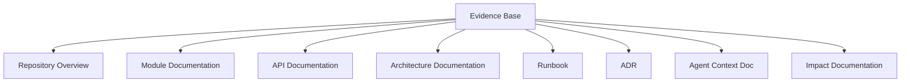
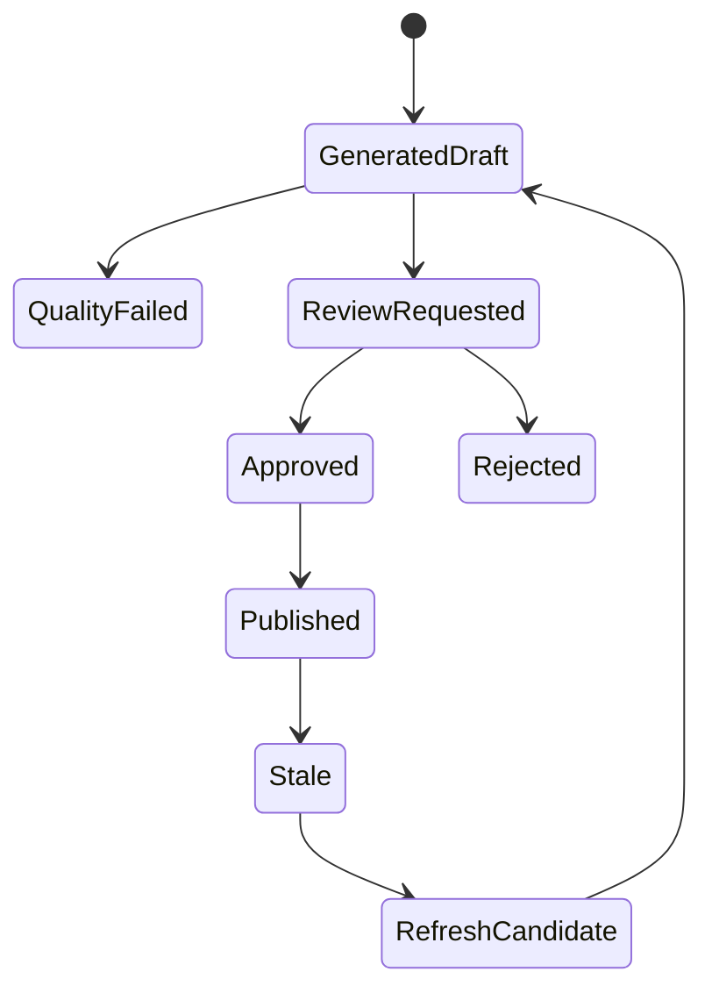

------
title: Learn AI Code Documentation & Agent Memory Platform - Part 017
description: Documentation taxonomy untuk mendesain jenis dokumentasi, audience, structure, quality bar, source evidence, lifecycle, dan output target sebelum membangun code-to-doc generation pipeline.
series: learn-ai-code-documentation-agent-memory
seriesTitle: Learn AI Code Documentation & Agent Memory Platform
order: 17
partTitle: Documentation Taxonomy
tags:
- ai
- documentation
- documentation-taxonomy
- code-intelligence
- software-architecture
- agent-context
- repository-analysis
date: 2026-07-02
---

# Part 017 — Documentation Taxonomy

## 1. Tujuan Part Ini

Part 016 menutup fase retrieval dengan context assembly engine. Sekarang kita masuk ke fase **documentation generation**.

Sebelum membuat pipeline code-to-doc, kita harus tahu dulu dokumentasi seperti apa yang akan dibuat. Banyak sistem AI documentation gagal bukan karena modelnya lemah, tetapi karena semua output diperlakukan sama:

```txt
"Generate documentation for this repo."
```

Permintaan seperti itu terlalu kabur.

Dokumentasi yang baik harus punya:

- audience,
- purpose,
- scope,
- source evidence,
- structure,
- lifecycle,
- quality bar,
- review policy,
- freshness policy,
- publication target.

Part ini membahas **documentation taxonomy**: klasifikasi jenis dokumentasi yang akan dibaca, dibuat, direview, dipublish, dan dijaga freshness-nya oleh platform.

Target part ini:

1. membedakan documentation type berdasarkan audience dan use case,
2. mendesain struktur standar untuk tiap doc type,
3. menentukan evidence yang dibutuhkan per doc type,
4. membuat quality bar per doc type,
5. mengatur lifecycle docs dari draft sampai stale/superseded,
6. membedakan human docs, agent docs, generated docs, dan docs sebagai memory source,
7. menyiapkan kontrak input/output untuk Part 018: Code-to-Doc Generation Pipeline.

---

## 2. Kenapa Taxonomy Penting

Tanpa taxonomy, generator akan membuat dokumen yang:

- terlalu panjang,
- terlalu umum,
- mencampur audience,
- tidak jelas level detailnya,
- sulit direview,
- sulit diupdate,
- sulit dievaluasi,
- sulit dipakai agent,
- sering mengulang README,
- penuh klaim tanpa evidence.

### 2.1 Contoh Permintaan Buruk

```txt
Generate documentation for order-service.
```

Masalah:

- docs untuk siapa?
- level repo atau module?
- API atau architecture?
- perlu runbook?
- perlu Mermaid?
- perlu source citations?
- output MDX atau context YAML?
- source branch/commit apa?
- apakah boleh memakai stale docs?
- review siapa?

### 2.2 Permintaan yang Lebih Baik

```yaml
docRequest:
  docType: module_doc
  audience:
    - backend_engineer
    - ai_agent
  target:
    repositoryId: order-service
    modulePath: src/main/java/com/acme/order/validation
  source:
    branch: main
    commitSha: 6f41ab2
  requirements:
    citations: required
    includeMermaid: true
    includeTests: true
    includeUncertainties: true
```

Taxonomy mengubah permintaan kabur menjadi kontrak engineering.

---

## 3. Dokumentasi sebagai Product Surface

Dokumentasi bukan hanya output teks. Dokumentasi adalah product surface untuk:

- onboarding,
- development,
- code review,
- architecture governance,
- incident response,
- compliance,
- agent context,
- knowledge retention.

Setiap surface punya kebutuhan berbeda.



---

## 4. Dimensi Taxonomy

Kita klasifikasikan dokumentasi berdasarkan beberapa dimensi.

### 4.1 Audience

| Audience | Kebutuhan |
|---|---|
| new engineer | onboarding, glossary, setup, map |
| backend engineer | module internals, flow, tests, constraints |
| frontend engineer | API, contract, examples, error behavior |
| platform engineer | deployment, CI/CD, infra, ownership |
| SRE/operator | runbook, metrics, failure modes |
| tech lead/staff | architecture, trade-off, dependency, impact |
| security/compliance | audit trail, permission, data handling |
| AI agent | compact context, constraints, exact files/tests |
| engineering manager | coverage, ownership, risk, stale docs |

### 4.2 Scope

| Scope | Example |
|---|---|
| repository | `order-service` |
| module/package | `order.validation` |
| symbol | `OrderValidator.validate` |
| API operation | `POST /orders` |
| event | `order.created` |
| database table | `orders` |
| workflow | CI deploy pipeline |
| cross-repo flow | order-service -> billing-service |
| platform capability | CPQ pricing lifecycle |

### 4.3 Purpose

| Purpose | Output |
|---|---|
| understand | explanation docs |
| operate | runbook |
| decide | ADR/design doc |
| change code | agent context/change guide |
| integrate | API/event docs |
| audit | evidence/provenance report |
| migrate | migration guide |
| review | impact/change review docs |

### 4.4 Lifecycle

| Lifecycle | Meaning |
|---|---|
| draft | not official |
| generated_draft | AI-generated, unreviewed |
| review_requested | awaiting owner review |
| active | official/current |
| stale | source changed |
| deprecated | intentionally outdated |
| superseded | replaced |
| archived | historical |

---

## 5. Core Documentation Types

### 5.1 Repository Overview

Purpose:

> Memberi peta awal tentang repository: apa perannya, bagaimana menjalankan, struktur utama, dependency, ownership, dan entry points.

Audience:

- new engineer,
- backend engineer,
- tech lead,
- AI agent onboarding.

Required evidence:

- README,
- build files,
- source roots,
- major packages,
- API/event/config graph,
- tests,
- deployment config.

Suggested structure:

```md
# Repository Overview

## Purpose

## High-Level Architecture

## Main Modules

## Entry Points

## Build and Run

## Dependencies

## Tests

## Operational Notes

## Ownership

## Evidence and Freshness
```

Quality bar:

- menyebut repo purpose dengan evidence,
- tidak mengulang semua file,
- menyebut module utama,
- menyebut cara menjalankan/test jika evidence ada,
- menyebut uncertainty jika setup tidak jelas,
- punya source commit.

---

### 5.2 Module Documentation

Purpose:

> Menjelaskan satu module/package/component secara cukup detail agar engineer bisa memahami boundary, responsibility, flow, dependency, tests, dan change points.

Audience:

- backend engineer,
- tech lead,
- AI coding agent.

Required evidence:

- source symbols dalam module,
- class/function chunks,
- related tests,
- docs/ADR,
- graph neighbors,
- config/schema terkait.

Suggested structure:

```md
# <Module Name>

## Purpose

## Scope and Boundary

## Main Components

## Control Flow

## Data and Configuration

## Related Tests

## Extension Points

## Known Constraints

## Mermaid Diagram

## Evidence

## Uncertainties
```

Quality bar:

- module boundary jelas,
- main components tidak terlalu banyak,
- flow berbasis graph/evidence,
- tests disebut,
- uncertainty disebut,
- citations lengkap.

---

### 5.3 Symbol Documentation

Purpose:

> Menjelaskan satu class/function/method penting: role, inputs, outputs, side effects, callers, callees, tests, and caveats.

Audience:

- engineer yang akan modify code,
- AI agent,
- code reviewer.

Required evidence:

- target symbol chunk,
- parent class/file,
- callers/callees,
- tests,
- comments/docstrings,
- config/contract jika ada.

Suggested structure:

```md
# <Symbol>

## Responsibility

## Signature

## Behavior

## Inputs and Outputs

## Side Effects

## Callers and Callees

## Related Tests

## Change Notes

## Evidence
```

Quality bar:

- signature benar,
- behavior tidak mengada-ada,
- side effects berdasarkan evidence,
- related tests ada atau absence reported,
- citations ke source lines.

---

### 5.4 API Documentation

Purpose:

> Menjelaskan endpoint/operation: request, response, error behavior, auth, handler, service flow, tests, compatibility.

Audience:

- frontend engineer,
- backend engineer,
- integrator,
- API reviewer,
- AI agent.

Required evidence:

- OpenAPI/contract,
- route handler,
- request/response schema,
- service flow graph,
- tests,
- error handling.

Suggested structure:

```md
# API: <METHOD> <PATH>

## Purpose

## Contract

## Request

## Response

## Error Behavior

## Handler Flow

## Validation

## Related Tests

## Compatibility Notes

## Evidence
```

Quality bar:

- contract source jelas,
- handler disebut,
- request/response tidak hanya dari controller jika OpenAPI tersedia,
- error behavior tidak diinvent,
- mismatch contract vs code ditandai.

---

### 5.5 Event Documentation

Purpose:

> Menjelaskan event/topic/message: producer, consumer, schema, version, trigger, ordering, compatibility, failure handling.

Audience:

- backend engineer,
- platform engineer,
- event consumer teams,
- AI agent.

Required evidence:

- producer code,
- consumer code,
- schema/protobuf/Avro/AsyncAPI,
- topic config,
- tests,
- docs/ADR.

Suggested structure:

```md
# Event: <topic or message>

## Purpose

## Producers

## Consumers

## Schema

## Trigger Conditions

## Delivery and Ordering Assumptions

## Compatibility

## Failure Handling

## Evidence
```

Quality bar:

- producer/consumer dipisah,
- schema version jelas jika ada,
- ordering/retry hanya disebut jika evidence ada,
- cross-repo consumers diberi scope/permission warning.

---

### 5.6 Data Model Documentation

Purpose:

> Menjelaskan entity/table/schema: fields, constraints, ownership, read/write paths, migrations, lifecycle.

Audience:

- backend engineer,
- data engineer,
- tech lead,
- AI agent.

Required evidence:

- entity/model classes,
- migrations,
- repository/DAO,
- SQL queries,
- tests,
- schema docs.

Suggested structure:

```md
# Data Model: <Entity/Table>

## Purpose

## Schema

## Ownership

## Read Paths

## Write Paths

## Migrations

## Constraints and Indexes

## Related APIs/Events

## Evidence
```

Quality bar:

- fields/constraints dari schema/migration,
- read/write paths berbasis graph,
- migration timeline tidak terlalu verbose,
- table sharing/cross-service risk disebut jika evidence ada.

---

### 5.7 Runbook

Purpose:

> Memberi langkah operasional untuk diagnosis, mitigasi, rollback, escalation, dan post-incident.

Audience:

- SRE,
- on-call engineer,
- platform engineer,
- incident commander.

Required evidence:

- existing runbook,
- config,
- deployment manifests,
- CI/CD,
- service dependencies,
- metrics/log references jika tersedia,
- ownership.

Suggested structure:

```md
# Runbook: <Service/Scenario>

## Scope

## Symptoms

## Impact

## Diagnosis

## Mitigation

## Rollback

## Escalation

## Verification

## Known Risks

## Evidence and Freshness
```

Quality bar:

- tidak membuat operational command tanpa evidence,
- menyebut uncertainty jika metrics/logs tidak tersedia,
- escalation owner jelas,
- stale risk tinggi jika infra berubah.

---

### 5.8 ADR

Purpose:

> Mencatat keputusan arsitektur, konteks, alternatif, trade-off, dan konsekuensi.

Audience:

- tech lead,
- staff/principal engineer,
- reviewer,
- future maintainers,
- AI agent decision context.

Required evidence:

- source/docs existing,
- problem statement,
- alternatives,
- decision owner,
- impacted modules.

Suggested structure:

```md
# ADR <NNN>: <Decision>

## Status

## Context

## Decision

## Alternatives Considered

## Consequences

## Risks

## Follow-up

## Evidence
```

Quality bar:

- decision tidak ditulis sebagai implementation summary saja,
- alternatives ada,
- consequence ada,
- status jelas,
- source/evidence dan reviewer jelas.

AI sebaiknya tidak otomatis membuat ADR final. AI bisa membuat **ADR draft**.

---

### 5.9 Architecture Documentation

Purpose:

> Menjelaskan sistem/module lintas komponen: boundary, dependency, runtime relations, trade-off, ownership, risk.

Audience:

- tech lead,
- staff/principal engineer,
- platform engineer,
- architecture reviewer.

Required evidence:

- code graph,
- service graph,
- API/event/data relations,
- ADR,
- docs,
- deployment config.

Suggested structure:

```md
# Architecture: <System/Capability>

## Scope

## Context

## Components

## Dependencies

## Runtime Flow

## Data Flow

## Trade-offs

## Risks

## Evolution Notes

## Diagrams

## Evidence
```

Quality bar:

- scope jelas,
- dependency graph tidak overclaim,
- diagram berbasis graph,
- trade-off dari ADR/review jika ada,
- uncertainty untuk missing runtime evidence.

---

### 5.10 Onboarding Guide

Purpose:

> Membantu engineer baru memahami repo/capability secara bertahap.

Audience:

- new engineer,
- transfer engineer,
- AI agent initial orientation.

Required evidence:

- repository overview,
- module docs,
- README,
- setup/build/test info,
- ownership,
- key flows.

Suggested structure:

```md
# Onboarding Guide

## What This System Does

## Concepts and Glossary

## Repository Map

## First Files to Read

## First Local Run

## Key Flows

## Common Change Tasks

## Tests to Know

## Next Reading
```

Quality bar:

- tidak terlalu detail di awal,
- punya learning path,
- file awal jelas,
- link ke docs lebih dalam,
- setup commands hanya jika evidence ada.

---

### 5.11 Troubleshooting Guide

Purpose:

> Menjelaskan diagnosis dan solusi untuk masalah spesifik.

Audience:

- on-call,
- support engineer,
- backend engineer,
- AI debugging agent.

Required evidence:

- runbook,
- error handling code,
- logs/metrics docs jika ada,
- config,
- deployment,
- known incidents jika integrated.

Suggested structure:

```md
# Troubleshooting: <Problem>

## Symptoms

## Likely Causes

## Diagnosis Steps

## Remediation

## Verification

## Escalation

## Related Code

## Evidence
```

Quality bar:

- cause dipisah dari symptom,
- steps actionable,
- tidak membuat command berbahaya,
- uncertainty jelas.

---

### 5.12 Agent Context Documentation

Purpose:

> Memberi compact task-ready context untuk AI agents.

Audience:

- AI coding agent,
- AI documentation agent,
- AI review agent.

Required evidence:

- target symbols,
- tests,
- constraints,
- memory,
- graph paths,
- docs.

Suggested structure:

```yaml
agentContextDoc:
  target:
  taskTypes:
  entrypoints:
  mustInspect:
  relatedTests:
  conventions:
  pitfalls:
  prohibitedActions:
  evidence:
```

Quality bar:

- compact,
- exact file/symbol references,
- no vague prose,
- memory separated,
- stale/uncertain context marked,
- permission-safe.

---

### 5.13 Impact Documentation

Purpose:

> Menjelaskan dampak perubahan tertentu terhadap code, tests, docs, memory, APIs, events, data, dan repos lain.

Audience:

- code reviewer,
- release manager,
- tech lead,
- AI agent.

Required evidence:

- graph diff,
- changed files/symbols,
- tests,
- docs links,
- memory grounding,
- API/event/data graph.

Suggested structure:

```md
# Impact Analysis: <Change>

## Change Summary

## Affected Symbols

## Affected APIs/Events/Data

## Affected Tests

## Affected Documentation

## Affected Memory

## Risk Assessment

## Recommended Actions

## Evidence
```

Quality bar:

- change source jelas,
- impact berbasis graph diff,
- confidence disebut,
- no false certainty for unresolved edges.

---

## 6. Documentation Type Matrix

| Doc Type | Primary Audience | Primary Evidence | Freshness Sensitivity | Review |
|---|---|---|---:|---|
| repository overview | new engineer | repo structure, README, graph | medium | recommended |
| module doc | backend engineer | source, tests, graph | high | recommended |
| symbol doc | engineer/agent | source symbol, tests | high | optional/recommended |
| API doc | frontend/integrator | contract, handler, tests | high | required |
| event doc | backend/platform | schema, producer/consumer | high | required |
| data model doc | backend/data | schema, migrations, repository | high | recommended |
| runbook | on-call | infra, config, ops docs | very high | required |
| ADR | tech lead | decision evidence | medium | required |
| architecture doc | tech lead | graph, ADR, docs | medium/high | required |
| onboarding | new engineer | overview, module docs | medium | recommended |
| troubleshooting | on-call | runbook, errors, config | high | required |
| agent context | AI agent | source, tests, memory | very high | policy-based |
| impact doc | reviewer | graph diff, changes | very high | per change |

---

## 7. Audience-Level Depth

### 7.1 New Engineer

Needs:

- simple mental model,
- glossary,
- file map,
- first reading path,
- common tasks.

Avoid:

- full internal call graph,
- every private helper,
- too many edge cases.

### 7.2 Backend Engineer

Needs:

- module boundary,
- main classes/methods,
- tests,
- config,
- flow,
- change notes.

### 7.3 Tech Lead

Needs:

- dependency,
- trade-offs,
- impact,
- ownership,
- risk,
- consistency.

### 7.4 AI Agent

Needs:

- exact symbols,
- constraints,
- tests,
- memory,
- warnings,
- allowed tools,
- evidence.

AI agent docs should be terse and structured, not prose-heavy.

---

## 8. Documentation Structure Standards

### 8.1 Required Frontmatter for Generated MDX

```mdx
------
title: <Title>
description: <Description>
series: <series>
seriesTitle: <Series Title>
order: <order>
partTitle: <Part Title>
tags:
- documentation
date: 2026-07-02
---
```

For generated project docs:

```mdx
------
title: Order Validation Module
description: Evidence-based documentation for order validation module.
docType: module_doc
repository: order-service
commit: 6f41ab2
generatedBy: ai-code-doc-platform
reviewState: pending
staleRisk: low
---
```

### 8.2 Required Evidence Section

Every generated doc should end with or include:

```md
## Evidence

| ID | Source | Lines | Purpose |
|---|---|---:|---|
| E1 | `OrderValidator.java` | 12-144 | Primary validation logic |
```

### 8.3 Required Uncertainty Section

If evidence incomplete:

```md
## Uncertainties

- Retry behavior was not found in the indexed source evidence.
- No ADR was found for corporate order validation.
```

### 8.4 Required Freshness Section

```md
## Freshness

Generated from repository `order-service` at commit `6f41ab2`.
Stale risk: low.
```

---

## 9. Documentation Quality Bar

### 9.1 Universal Quality Bar

All generated docs must:

- have explicit doc type,
- have audience,
- have scope,
- cite source evidence,
- mention source commit/snapshot,
- avoid unsupported claims,
- mark uncertainty,
- avoid secrets,
- state review status,
- preserve generated status.

### 9.2 Accuracy

Accuracy means claims match evidence.

Bad:

```md
The service guarantees exactly-once processing.
```

Unless evidence supports exactly-once semantics, this is overclaim.

Better:

```md
The service consumes `order.created` events. The indexed evidence does not show an exactly-once guarantee.
```

### 9.3 Completeness

Completeness is doc-type-specific.

Module doc completeness:

- purpose,
- boundary,
- components,
- flow,
- tests,
- configs,
- evidence,
- uncertainty.

API doc completeness:

- method/path,
- request,
- response,
- handler,
- errors,
- tests,
- evidence.

### 9.4 Traceability

Every major claim needs evidence ID.

### 9.5 Maintainability

Docs should be scoped and sectioned so they can be regenerated partially.

### 9.6 Non-Duplication

Docs should link rather than repeat huge content from other docs.

---

## 10. Documentation Evidence Requirements

### 10.1 Module Doc Evidence

Minimum:

- module source symbols,
- at least one class/function overview,
- related tests if present,
- graph summary,
- existing docs if relevant.

### 10.2 API Doc Evidence

Minimum:

- route handler or contract,
- request/response schema,
- service flow if available,
- tests if present.

### 10.3 Runbook Evidence

Minimum:

- existing operational doc or infra/config evidence,
- owner/escalation evidence,
- deployment/config evidence.

If not enough evidence, generate a gap report, not a fake runbook.

### 10.4 ADR Evidence

Minimum:

- problem context,
- decision source or user-provided decision,
- alternatives if available.

AI should not invent organizational decisions.

---

## 11. Generated Docs vs Official Docs

Generated docs are not automatically official.

### 11.1 State Model



### 11.2 Review Policy by Doc Type

| Doc Type | Review Policy |
|---|---|
| module doc | recommended |
| API doc | required |
| runbook | required |
| ADR | required |
| agent context doc | policy-based |
| repository overview | recommended |
| impact doc | reviewer/context-specific |

### 11.3 Official Publication

Publication options:

- create PR to repo,
- publish to docs portal,
- store as generated artifact only,
- attach to review/PR,
- expose via agent tool.

---

## 12. Documentation and Memory Boundary

Docs and memory interact but are different.

### 12.1 Docs Can Produce Memory Candidates

Example doc statement:

```md
Validation rules should be registered through `RuleRegistry`.
```

Memory candidate:

```yaml
type: repo_convention
statement: "Validation rules should be registered through RuleRegistry."
evidence:
  - doc section
  - RuleRegistry source
reviewRequired: true
```

### 12.2 Memory Can Support Docs

Memory can be included as guidance:

```md
Team convention memory indicates validation rules should be registered through `RuleRegistry`.
```

But cite original source if possible.

### 12.3 Avoid Circular Trust

Never let:

```txt
generated doc -> memory -> generated doc
```

become source without original evidence.

---

## 13. Documentation for AI Agents

Agent docs differ from human docs.

### 13.1 Agent Doc Example

```yaml
target: order.validation
taskTypes:
  - code_change
entrypoints:
  - OrderValidator.validate
mustInspect:
  - RuleRegistry.java
  - OrderValidatorTest.java
relatedTests:
  - OrderValidatorTest
conventions:
  - "Add new rules through RuleRegistry."
pitfalls:
  - "Do not edit generated OpenAPI clients."
evidence:
  - E1
  - E2
```

### 13.2 Agent Doc Quality

Agent docs must be:

- compact,
- exact,
- structured,
- evidence-backed,
- permission-safe,
- current,
- actionable.

Agent docs do not need long explanation unless task requires it.

---

## 14. Documentation Templates

### 14.1 Template Contract

A template should define:

```yaml
template:
  docType: module_doc
  requiredSections:
    - Purpose
    - Scope and Boundary
    - Main Components
    - Flow
    - Tests
    - Evidence
    - Uncertainties
  requiredEvidence:
    - source
    - tests
  optionalEvidence:
    - ADR
    - config
    - graph
  qualityGates:
    - citations_required
    - unsupported_claims_below_threshold
```

### 14.2 Template Versioning

Templates must be versioned.

```yaml
templateVersion: module-doc-template-v2
```

If template changes, generated docs may need refresh.

---

## 15. Documentation Output Formats

### 15.1 Markdown/MDX

Best for human docs.

### 15.2 YAML/JSON

Best for agent context docs and structured memory candidates.

### 15.3 HTML/Portal

Best for published docs site.

### 15.4 PR Patch

Best for repo-owned documentation workflow.

### 15.5 Evidence Report

Best for audit and review.

---

## 16. Documentation Evaluation by Type

### 16.1 Module Doc Evaluation

Check:

- target module covered,
- main symbols included,
- related tests included,
- source citations present,
- no unsupported behavior claims,
- uncertainty explicit.

### 16.2 API Doc Evaluation

Check:

- endpoint method/path correct,
- request/response schema correct,
- handler linked,
- error behavior supported,
- contract-code mismatch flagged.

### 16.3 Runbook Evaluation

Check:

- steps are evidence-backed,
- no unsafe commands invented,
- owner/escalation present,
- freshness tied to infra/config.

### 16.4 ADR Evaluation

Check:

- status exists,
- decision clear,
- alternatives present,
- consequences present,
- not confused with implementation summary.

---

## 17. Documentation Anti-Patterns

### 17.1 One Giant Repository Doc

Too broad, stale quickly, hard to review.

### 17.2 Summary Without Evidence

Looks useful but cannot be trusted.

### 17.3 Generated Docs Published Without Review

Creates false confidence.

### 17.4 Same Output for Humans and Agents

Humans need narrative. Agents need compact exact context.

### 17.5 Docs That Hide Uncertainty

Dangerous in complex systems.

### 17.6 Docs That Repeat Source

Docs should explain and connect evidence, not paste entire code.

### 17.7 Docs Without Lifecycle

Every doc will eventually stale.

---

## 18. Practical Exercise

Design documentation taxonomy for one service.

### 18.1 Input

Use service:

```txt
order-service
  OrderController
  OrderService
  OrderValidator
  RuleRegistry
  OrderRepository
  OpenAPI contract
  ADR validation rules
  tests
```

### 18.2 Output

Produce taxonomy plan:

```yaml
docs:
  - docType: repository_overview
    audience: new_engineer
  - docType: module_doc
    target: order.validation
  - docType: api_doc
    target: POST /orders
  - docType: adr
    target: validation rule centralization
  - docType: agent_context_doc
    target: order.validation
```

### 18.3 Acceptance Criteria

- every doc has audience,
- every doc has scope,
- every doc has required evidence,
- review policy defined,
- freshness policy defined,
- output format defined,
- agent docs separated from human docs.

---

## 19. Summary

Documentation taxonomy is the contract before generation.

Key points:

1. documentation type determines structure, evidence, audience, and quality bar,
2. "generate docs for repo" is too vague,
3. human docs and agent docs need different formats,
4. each doc needs scope, audience, lifecycle, and review policy,
5. source evidence and citations are mandatory for trust,
6. generated docs should not become official without review,
7. stale risk must be tracked,
8. docs can feed memory only through governed memory candidates,
9. templates must be versioned,
10. doc evaluation must be type-specific.

Part berikutnya membahas **Code-to-Doc Generation Pipeline**: bagaimana dari doc request, retrieval, context pack, outline, drafting, claim verification, quality gates, review, dan diff-aware regeneration menjadi pipeline produksi.
