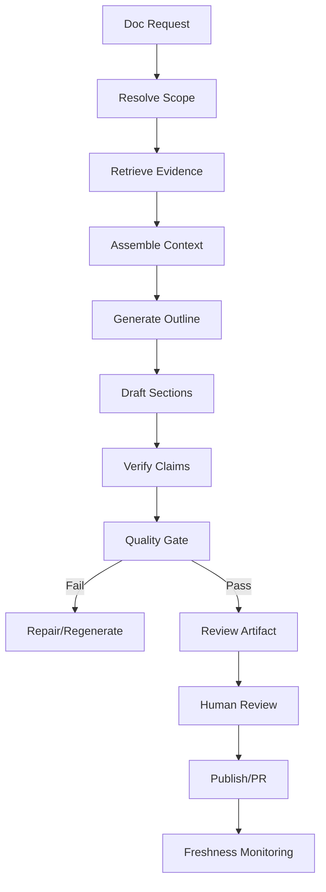
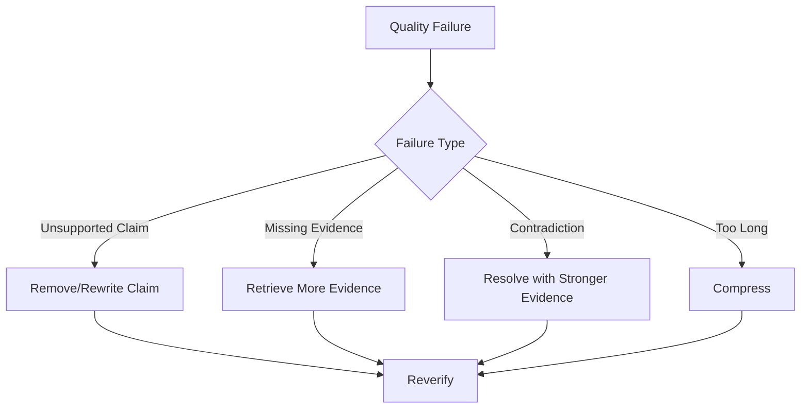
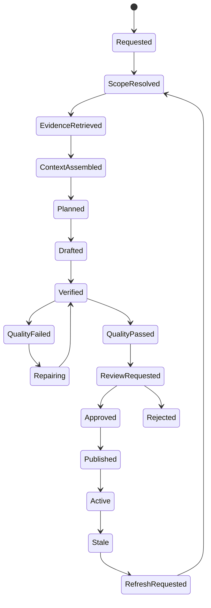

------
title: Learn AI Code Documentation & Agent Memory Platform - Part 018
description: Code-to-doc generation pipeline untuk menghasilkan dokumentasi berbasis evidence dari repository, context pack, graph, docs, memory, claim verification, quality gates, review, dan diff-aware regeneration.
series: learn-ai-code-documentation-agent-memory
seriesTitle: Learn AI Code Documentation & Agent Memory Platform
order: 18
partTitle: Code-to-Doc Generation Pipeline
tags:
- ai
- documentation-generation
- code-to-doc
- evidence-based-docs
- code-intelligence
- agent-context
- repository-analysis
date: 2026-07-02
---

# Part 018 — Code-to-Doc Generation Pipeline

## 1. Tujuan Part Ini

Part 017 mendefinisikan taxonomy dokumentasi. Sekarang kita membangun pipeline untuk menghasilkan dokumentasi dari codebase.

Pipeline ini bukan satu prompt.

Pipeline production-grade harus memecah proses menjadi tahap-tahap:

1. menerima doc request,
2. resolve scope dan source snapshot,
3. retrieve evidence,
4. assemble context,
5. plan outline,
6. draft sections,
7. verify claims,
8. run quality gates,
9. create review artifact,
10. publish atau create PR,
11. monitor staleness,
12. regenerate selectively saat source berubah.

Target part ini:

1. memahami code-to-doc sebagai pipeline, bukan prompt tunggal,
2. mendesain stage-by-stage architecture,
3. menentukan input/output per stage,
4. membuat doc planning dan outline generation,
5. membuat drafting yang evidence-bound,
6. mendesain claim verification,
7. membuat quality gates,
8. mendukung human review,
9. mendukung diff-aware regeneration,
10. menyimpan provenance dan audit trail.

---

## 2. Naive Approach vs Pipeline Approach

### 2.1 Naive Approach

```txt
Read all files -> ask LLM to generate docs
```

Masalah:

- context terlalu besar,
- tidak ada scope,
- tidak ada evidence,
- tidak ada citations,
- tidak ada quality gates,
- tidak bisa update incremental,
- sulit direview,
- raw hallucination risk.

### 2.2 Pipeline Approach



Pipeline approach membuat output lebih akurat, audit-able, dan maintainable.

---

## 3. Core Invariants

### 3.1 Evidence Invariant

```txt
Every major factual claim must be supported by evidence or marked uncertain.
```

### 3.2 Scope Invariant

```txt
Generated docs must not exceed requested scope without explicit labeling.
```

### 3.3 Version Invariant

```txt
Generated docs must specify source repository snapshot/commit.
```

### 3.4 Permission Invariant

```txt
Generated docs must not include evidence the requesting principal cannot access.
```

### 3.5 Review Invariant

```txt
Generated docs are drafts until approved by configured workflow.
```

### 3.6 Freshness Invariant

```txt
Generated docs must know which source artifacts can make them stale.
```

---

## 4. Pipeline Inputs

### 4.1 Documentation Request

```yaml
docRequest:
  requestId: docreq_01J...
  docType: module_doc
  audience:
    - backend_engineer
  target:
    repositoryId: order-service
    modulePath: src/main/java/com/acme/order/validation
  source:
    branch: main
    commitSha: 6f41ab2
  options:
    includeMermaid: true
    requireCitations: true
    includeTests: true
    includeUncertainties: true
    outputFormat: mdx
```

### 4.2 Principal

```yaml
principal:
  userId: user_123
  teams:
    - team-order-platform
  permissions:
    - read:order-service
```

### 4.3 Template

```yaml
template:
  docType: module_doc
  templateVersion: module-doc-template-v2
```

---

## 5. Stage 1 — Request Validation

### 5.1 Validate

Check:

- doc type supported,
- target exists,
- repository accessible,
- snapshot resolvable,
- template available,
- output format supported,
- user has permission.

### 5.2 Request Normalization

Normalize:

```yaml
target:
  type: module
  canonicalPath: src/main/java/com/acme/order/validation
source:
  snapshotId: snap_6f41ab2
```

### 5.3 Failure Example

```yaml
error:
  code: target_not_found
  message: "Module path not found in selected snapshot."
```

Do not generate docs if target is unresolved.

---

## 6. Stage 2 — Scope Resolution

Scope resolution maps target to graph/code units.

### 6.1 Module Scope

Input:

```yaml
modulePath: src/main/java/com/acme/order/validation
```

Output:

```yaml
scope:
  symbols:
    - OrderValidator
    - RuleRegistry
    - ValidationRule
  tests:
    - OrderValidatorTest
    - RuleRegistryTest
  relatedConfig:
    - order.validation.*
  relatedDocs:
    - ADR 012
```

### 6.2 API Scope

Input:

```yaml
method: POST
path: /orders
```

Output:

```yaml
scope:
  apiOperation: POST /orders
  handler: OrderController.createOrder
  serviceFlow:
    - OrderService.createOrder
    - OrderValidator.validate
    - OrderRepository.save
  schema:
    - CreateOrderRequest
    - OrderResponse
```

### 6.3 Scope Report

```yaml
scopeReport:
  status: resolved
  confidence: 0.90
  warnings:
    - "No OpenAPI contract found for route."
```

---

## 7. Stage 3 — Evidence Retrieval

Use hybrid retrieval from Part 015.

### 7.1 Retrieval Query

```yaml
retrievalRequest:
  taskType: generate_module_doc
  target:
    modulePath: src/main/java/com/acme/order/validation
  include:
    - source
    - tests
    - docs
    - graph
    - memory
```

### 7.2 Retrieval Output

```yaml
retrievalResult:
  primaryEvidence:
    - OrderValidator.java
    - RuleRegistry.java
  supportingEvidence:
    - OrderValidatorTest.java
    - ADR 012
    - application.yml
  warnings:
    - "Legacy doc excluded due to stale risk."
```

### 7.3 Evidence Gap

If essential evidence missing:

```yaml
evidenceGap:
  type: missing_tests
  severity: medium
  message: "No tests linked to RuleRegistry."
```

Docs may still be generated, but must mention uncertainty.

---

## 8. Stage 4 — Context Assembly

Use context assembly from Part 016.

### 8.1 Context Pack

```yaml
contextPack:
  contextPackId: ctx_01J...
  tokenEstimate: 11200
  sections:
    - source evidence
    - tests
    - ADR
    - graph summary
    - memory
    - warnings
```

### 8.2 Context Quality

```yaml
contextQuality:
  status: pass_with_warnings
  missing:
    - "No runbook found."
  included:
    sourceEvidenceCount: 8
    testEvidenceCount: 3
    docEvidenceCount: 2
```

If context quality fails, do not generate docs. Produce gap report.

---

## 9. Stage 5 — Documentation Plan

Before drafting, generate a plan/outline.

### 9.1 Plan Input

- doc type,
- audience,
- scope,
- context pack summary,
- template,
- evidence gaps.

### 9.2 Plan Output

```yaml
docPlan:
  title: "Order Validation Module"
  sections:
    - id: purpose
      title: Purpose
      requiredEvidence:
        - OrderValidator
        - RuleRegistry
    - id: components
      title: Main Components
      requiredEvidence:
        - OrderValidator
        - RuleRegistry
        - ValidationRule
    - id: flow
      title: Control Flow
      requiredEvidence:
        - graphPath: validation_flow
    - id: tests
      title: Related Tests
      requiredEvidence:
        - OrderValidatorTest
    - id: uncertainties
      title: Uncertainties
```

### 9.3 Plan Quality

Check:

- all required sections present,
- sections match doc type,
- no unsupported section requiring missing evidence,
- evidence assigned to sections.

### 9.4 Why Plan First

Planning prevents output drift.

Without plan, LLM may write attractive but unstructured docs.

---

## 10. Stage 6 — Section Drafting

Draft section by section, not entire doc in one shot.

### 10.1 Why Section-Based Drafting

Benefits:

- smaller context,
- easier verification,
- partial regeneration,
- easier review,
- better citations,
- better quality gates.

### 10.2 Section Draft Request

```yaml
sectionDraftRequest:
  sectionId: flow
  title: Control Flow
  instructions:
    - "Use only evidence assigned to this section."
    - "Cite every major claim."
    - "Mark uncertainty."
  evidence:
    - E1
    - E2
    - G1
```

### 10.3 Section Draft Output

```yaml
sectionDraft:
  sectionId: flow
  markdown: |
    ## Control Flow

    `OrderValidator.validate` is invoked from `OrderService.createOrder` before persistence. [E1][G1]
  claims:
    - claimId: claim_01J...
      text: "OrderValidator.validate is invoked before persistence."
      citations:
        - E1
        - G1
```

### 10.4 Drafting Rules

- no claims without evidence,
- no unsupported best-practice language,
- no "highly scalable" unless evidence,
- no invented runtime guarantees,
- mention missing evidence explicitly.

---

## 11. Stage 7 — Compose Document

After drafting sections, assemble full doc.

### 11.1 Composition

```yaml
document:
  frontmatter: ...
  sections:
    - purpose
    - scope
    - components
    - flow
    - tests
    - evidence
    - uncertainties
```

### 11.2 Cross-Section Consistency

Check:

- same terminology,
- no repeated contradictory statements,
- citations preserved,
- evidence IDs valid,
- headings follow template.

### 11.3 Add Metadata Sections

Add:

- Evidence,
- Uncertainties,
- Freshness,
- Review State.

---

## 12. Stage 8 — Claim Extraction

To verify docs, extract claims from draft.

### 12.1 Claim Types

| Claim Type | Example |
|---|---|
| structure | `OrderValidator` is part of validation module |
| behavior | validation happens before persistence |
| dependency | service calls repository |
| API | endpoint is POST /orders |
| data | repository writes orders table |
| config | max items configured by order.validation.max-items |
| decision | rules centralized by ADR |
| operational | rollback uses deployment X |

### 12.2 Claim Record

```yaml
claim:
  claimId: claim_01J...
  sectionId: flow
  text: "Order validation happens before persistence."
  claimType: behavior
  citations:
    - E1
    - G1
```

### 12.3 Claim Extraction Can Be Heuristic

For MVP:

- require generator to output claims/citations,
- scan markdown citations,
- verify cited evidence exists.

For advanced:

- use claim extraction model,
- compare against evidence,
- detect unsupported claims.

---

## 13. Stage 9 — Claim Verification

### 13.1 Verification Checks

| Check | Meaning |
|---|---|
| citation exists | claim has citation |
| evidence supports claim | citation content relevant |
| source current | evidence from requested snapshot |
| no contradiction | graph/docs do not refute |
| confidence sufficient | edge/source confidence enough |
| permission valid | cited evidence visible |
| no stale source | stale docs not primary evidence |

### 13.2 Claim Status

```yaml
claimVerification:
  claimId: claim_01J...
  status: supported
  confidence: 0.82
  evidence:
    - E1
    - G1
```

Unsupported:

```yaml
claimVerification:
  claimId: claim_02J...
  status: unsupported
  reason: "No evidence found that validation rules are loaded from database."
  action: remove_or_mark_uncertain
```

Contradicted:

```yaml
claimVerification:
  status: contradicted
  reason: "Draft says POST /order, contract says POST /orders."
```

---

## 14. Stage 10 — Quality Gates

### 14.1 Universal Gates

- source commit present,
- evidence section present,
- citations valid,
- unsupported claim count within threshold,
- blocked-sensitive content absent,
- stale docs marked,
- generated status present,
- review state present.

### 14.2 Doc-Type Gates

Module doc:

- purpose exists,
- scope exists,
- components exist,
- flow exists,
- tests section exists,
- uncertainty section exists.

API doc:

- method/path correct,
- request/response evidence,
- handler evidence,
- error behavior supported.

Runbook:

- no invented commands,
- escalation owner evidence,
- operational freshness.

ADR:

- status,
- context,
- decision,
- alternatives,
- consequences.

### 14.3 Quality Report

```yaml
qualityReport:
  status: pass_with_warnings
  evidenceCoverage: 0.88
  unsupportedClaimCount: 1
  contradictedClaimCount: 0
  staleEvidenceUsed: 0
  missingSections:
    - none
  warnings:
    - "No ADR found for retry behavior."
```

---

## 15. Stage 11 — Repair Loop

If quality gate fails, do not blindly publish.

### 15.1 Repair Strategies

| Failure | Repair |
|---|---|
| unsupported claim | remove or mark uncertain |
| missing citation | find evidence or remove claim |
| stale evidence | replace with current evidence |
| missing section | retrieve more or mark gap |
| too verbose | compress section |
| contradiction | prefer stronger evidence and warn |
| missing tests | add uncertainty/gap report |

### 15.2 Repair Flow



### 15.3 Repair Limit

Do not infinite loop.

```yaml
repairPolicy:
  maxAttempts: 2
  onFailure: produce_gap_report
```

---

## 16. Stage 12 — Review Artifact

Generated docs should be reviewable.

### 16.1 Review Package

```yaml
reviewPackage:
  generatedDoc: order-validation.md
  qualityReport: order-validation.quality.yaml
  evidenceMap: order-validation.evidence.json
  contextPack: ctx_01J
  diff:
    targetPath: docs/order-validation.md
```

### 16.2 Reviewer Needs

Reviewer should see:

- generated doc,
- source commit,
- evidence table,
- unsupported claims,
- warnings,
- diff against existing doc,
- changed/stale sections,
- suggested reviewers.

### 16.3 Review UI/PR

Options:

- create Git PR,
- docs portal review,
- attach as artifact,
- comment on issue/PR,
- store as draft only.

---

## 17. Stage 13 — Publication

Publication should be explicit.

### 17.1 Publish Targets

| Target | Use |
|---|---|
| repo docs folder | source-owned docs |
| docs portal | searchable docs |
| generated artifact store | draft/eval |
| PR comment | change-specific docs |
| agent knowledge store | agent context |
| memory candidate | durable facts |

### 17.2 PR Workflow

Generate patch:

```txt
docs/order-validation.md
docs/order-validation.evidence.json
```

Create PR:

```txt
docs: update order validation documentation
```

Do not auto-merge unless policy allows.

### 17.3 Generated Metadata

The published doc should retain metadata:

- generated by,
- source commit,
- review state,
- evidence map,
- stale policy.

---

## 18. Diff-Aware Regeneration

Docs should update only affected sections.

### 18.1 Why Diff-Aware

Full regeneration causes:

- noisy diffs,
- reviewer fatigue,
- loss of human edits,
- unstable docs,
- merge conflicts.

Diff-aware regeneration updates only sections whose evidence changed.

### 18.2 Inputs

- old generated doc,
- old evidence map,
- new graph diff,
- changed chunks,
- reviewer edits,
- template version.

### 18.3 Regeneration Decision

```yaml
sectionRefreshPlan:
  section: Control Flow
  reason: "CALLS edge changed"
  action: regenerate

  section: Purpose
  reason: "No evidence changed"
  action: keep

  section: Tests
  reason: "New test added"
  action: update
```

### 18.4 Preserve Human Edits

If section was edited by human after generation:

```yaml
conflict:
  section: Flow
  reason: human_edited_and_source_changed
  action: review_required
```

Do not overwrite human edits silently.

---

## 19. Stale Detection for Generated Docs

Generated docs should know their source evidence.

### 19.1 Evidence Map

```yaml
docEvidence:
  section: Control Flow
  evidence:
    - edge: OrderService.createOrder CALLS OrderValidator.validate
    - file: OrderService.java
    - file: OrderValidator.java
```

### 19.2 Source Change

If `OrderValidator.java` changes:

```yaml
staleRisk:
  section: Control Flow
  level: medium
  reason: "Referenced source file changed"
```

If symbol deleted:

```yaml
staleRisk:
  level: high
  reason: "Referenced symbol deleted"
```

### 19.3 Stale Action

- mark section stale,
- create refresh candidate,
- notify owner,
- include in docs health report.

---

## 20. Pipeline State Machine



---

## 21. Pipeline Data Model

### 21.1 Generation Run

```sql
CREATE TABLE documentation_generation_runs (
    run_id TEXT PRIMARY KEY,
    tenant_id TEXT NOT NULL,
    request_id TEXT NOT NULL,
    doc_type TEXT NOT NULL,
    repository_id TEXT NOT NULL,
    snapshot_id TEXT NOT NULL,
    commit_sha TEXT NOT NULL,
    target_ref TEXT NOT NULL,
    template_version TEXT NOT NULL,
    generator_version TEXT NOT NULL,
    status TEXT NOT NULL,
    created_at TIMESTAMP NOT NULL,
    updated_at TIMESTAMP NOT NULL
);
```

### 21.2 Document Draft

```sql
CREATE TABLE generated_document_drafts (
    document_id TEXT PRIMARY KEY,
    run_id TEXT NOT NULL,
    title TEXT NOT NULL,
    content_hash TEXT NOT NULL,
    markdown_content TEXT NOT NULL,
    review_state TEXT NOT NULL,
    quality_status TEXT NOT NULL,
    created_at TIMESTAMP NOT NULL
);
```

### 21.3 Section Draft

```sql
CREATE TABLE generated_document_sections (
    section_id TEXT PRIMARY KEY,
    document_id TEXT NOT NULL,
    section_key TEXT NOT NULL,
    heading TEXT NOT NULL,
    content TEXT NOT NULL,
    content_hash TEXT NOT NULL,
    quality_status TEXT NOT NULL,
    order_index INTEGER NOT NULL
);
```

### 21.4 Claims

```sql
CREATE TABLE generated_document_claims (
    claim_id TEXT PRIMARY KEY,
    document_id TEXT NOT NULL,
    section_id TEXT NOT NULL,
    claim_text TEXT NOT NULL,
    claim_type TEXT NOT NULL,
    verification_status TEXT NOT NULL,
    confidence NUMERIC NOT NULL
);
```

### 21.5 Claim Evidence

```sql
CREATE TABLE generated_document_claim_evidence (
    id TEXT PRIMARY KEY,
    claim_id TEXT NOT NULL,
    evidence_id TEXT NOT NULL,
    support_type TEXT NOT NULL,
    confidence NUMERIC NOT NULL
);
```

---

## 22. Pipeline Services

### 22.1 DocumentationGenerationService

Coordinates pipeline.

```java
public interface DocumentationGenerationService {
    DocumentationRun start(DocumentationRequest request, Principal principal);
}
```

### 22.2 ScopeResolver

```java
public interface DocumentationScopeResolver {
    DocumentationScope resolve(DocumentationRequest request);
}
```

### 22.3 OutlinePlanner

```java
public interface DocumentationPlanner {
    DocumentationPlan plan(DocumentationRequest request, ContextPack contextPack);
}
```

### 22.4 SectionDrafter

```java
public interface SectionDrafter {
    SectionDraft draft(SectionDraftRequest request);
}
```

### 22.5 ClaimVerifier

```java
public interface ClaimVerifier {
    ClaimVerificationReport verify(GeneratedDocumentDraft draft, EvidenceMap evidence);
}
```

### 22.6 QualityGate

```java
public interface DocumentationQualityGate {
    QualityReport evaluate(GeneratedDocumentDraft draft);
}
```

---

## 23. Prompt/Instruction Design

Even though this is not a prompt engineering course, generator instructions matter.

### 23.1 Generation Instruction Principles

- use only provided evidence,
- cite every major claim,
- do not infer runtime guarantees unless evidence,
- mark uncertainty,
- do not expose secrets,
- keep audience in mind,
- follow doc type template,
- do not treat memory as source truth,
- avoid generic praise.

### 23.2 Section Draft Instruction Example

```txt
Write the "Control Flow" section for a module document.

Rules:
- Use only the evidence provided.
- Cite claims with evidence IDs.
- Do not mention components not present in evidence.
- If evidence is incomplete, add an uncertainty note.
- Keep the section concise and technical.
```

### 23.3 Anti-Patterns

Avoid instructions like:

```txt
Make the documentation comprehensive and impressive.
```

This encourages overclaim.

---

## 24. Output Example

### 24.1 Generated Section

```md
## Control Flow

Order validation is invoked from `OrderService.createOrder` before persistence. The service delegates validation to `OrderValidator.validate`, then saves the order through `OrderRepository.save`. [E1][E2][G1]

The indexed evidence does not show retry behavior or asynchronous validation for this flow.
```

### 24.2 Evidence Table

```md
## Evidence

| ID | Source | Lines | Purpose |
|---|---|---:|---|
| E1 | `OrderService.java` | 40-48 | Call order: validate then save |
| E2 | `OrderValidator.java` | 12-144 | Validation implementation |
| G1 | Graph path | n/a | Service flow relation |
```

### 24.3 Uncertainty

```md
## Uncertainties

- No ADR was found for retry behavior.
- No tests were linked to `RuleRegistry` in the indexed snapshot.
```

---

## 25. Handling Insufficient Evidence

Sometimes the correct output is not documentation, but a gap report.

### 25.1 Gap Report

```yaml
gapReport:
  status: insufficient_evidence
  docType: runbook
  missing:
    - operational procedures
    - escalation owner
    - metrics/dashboard references
  availableEvidence:
    - Kubernetes deployment
    - application config
  recommendation:
    - "Ask service owner to provide incident response steps."
```

### 25.2 When to Generate Anyway

Generate with uncertainty if:

- doc type allows partial docs,
- missing evidence is not critical,
- output clearly marks gaps.

Do not generate fake runbooks or fake ADRs.

---

## 26. Human-in-the-Loop Review

### 26.1 Reviewer Assignment

Reviewer can be inferred from:

- CODEOWNERS,
- repo owner metadata,
- graph ownership,
- doc owner,
- team memory.

### 26.2 Review Checklist

For module doc:

- scope correct,
- components correct,
- flow correct,
- tests complete,
- uncertainty fair,
- no unsupported claims,
- citations useful.

### 26.3 Review Actions

```yaml
reviewActions:
  - approve
  - approve_with_changes
  - request_changes
  - reject
  - mark_stale
  - create_memory_candidate
```

### 26.4 Review Is Audit Evidence

Store review decision.

---

## 27. Documentation Generation Observability

Track each stage.

### 27.1 Trace

```yaml
trace:
  runId: run_01J
  stages:
    - name: scope_resolution
      latencyMs: 120
      status: ok
    - name: retrieval
      latencyMs: 640
      candidates: 54
    - name: context_assembly
      latencyMs: 180
      tokens: 11200
    - name: drafting
      latencyMs: 8400
    - name: verification
      latencyMs: 900
      unsupportedClaims: 1
```

### 27.2 Metrics

- generation success rate,
- quality pass rate,
- unsupported claims per doc,
- average evidence coverage,
- review approval rate,
- stale docs created,
- time to review,
- regeneration frequency,
- cost per doc.

---

## 28. Failure Modes

### 28.1 Retrieval Miss

Important source absent. Result docs incomplete.

Mitigation:

- retrieval eval,
- graph expansion,
- missing evidence warnings.

### 28.2 Context Overload

Too many irrelevant chunks. Model output vague.

Mitigation:

- context budget,
- diversity,
- task profile.

### 28.3 Unsupported Claims

Model adds plausible facts.

Mitigation:

- claim verification,
- citations required,
- repair loop.

### 28.4 Stale Evidence

Old docs used as source truth.

Mitigation:

- freshness ranking,
- stale labels.

### 28.5 Human Edits Overwritten

Regeneration overwrites manual improvement.

Mitigation:

- section diff,
- human edit detection,
- review required.

### 28.6 Security Leak

Secret/config/private docs included.

Mitigation:

- source classification,
- permission filters,
- redaction gates.

---

## 29. Practical Exercise

Build a code-to-doc pipeline for one module.

### 29.1 Input

```yaml
docType: module_doc
target: order.validation
repository: order-service
commit: 6f41ab2
```

### 29.2 Required Artifacts

Produce:

```txt
doc-request.yaml
scope-report.yaml
retrieval-result.json
context-pack.md
doc-plan.yaml
section-drafts/
generated-doc.mdx
claim-verification.yaml
quality-report.yaml
review-package/
```

### 29.3 Acceptance Criteria

- doc request validated,
- scope resolved to symbols/tests/docs,
- context pack persisted,
- outline generated before drafting,
- sections drafted separately,
- every major claim has citation,
- unsupported claims reported,
- quality gate pass/fail explicit,
- review artifact created,
- stale detection source map stored.

---

## 30. Summary

Code-to-doc generation is a pipeline, not a prompt.

Key points:

1. doc type and audience drive the pipeline,
2. scope resolution is required before retrieval,
3. retrieval and context assembly must preserve evidence,
4. outline planning prevents document drift,
5. section-based drafting improves quality and regeneration,
6. claim verification catches unsupported or contradicted claims,
7. quality gates are mandatory before review/publish,
8. review state must be explicit,
9. diff-aware regeneration prevents noisy docs churn,
10. provenance and audit are first-class outputs.

Part berikutnya membahas **Doc Quality Gates** secara lebih dalam: accuracy, completeness, freshness, traceability, style, duplication, review readiness, doc debt scoring, dan automated evaluation untuk documentation platform.
