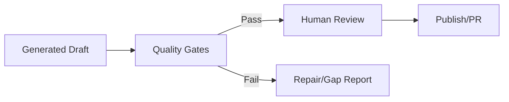
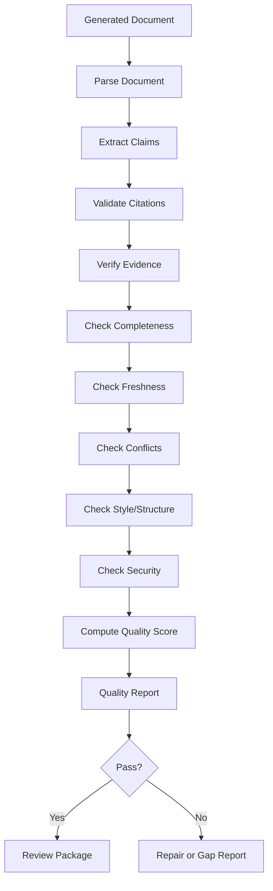

------
title: Learn AI Code Documentation & Agent Memory Platform - Part 019
description: Doc quality gates untuk mengevaluasi accuracy, completeness, freshness, traceability, style, duplication, review readiness, doc debt, dan automated evaluation dalam platform AI documentation.
series: learn-ai-code-documentation-agent-memory
seriesTitle: Learn AI Code Documentation & Agent Memory Platform
order: 19
partTitle: Doc Quality Gates
tags:
- ai
- documentation
- quality-gates
- doc-evaluation
- code-intelligence
- provenance
- software-architecture
date: 2026-07-02
---

# Part 019 — Doc Quality Gates

## 1. Tujuan Part Ini

Part 018 membahas pipeline code-to-doc generation. Sekarang kita membahas bagian yang menentukan apakah output documentation generator layak dipercaya: **doc quality gates**.

Tanpa quality gates, AI documentation platform akan menghasilkan banyak teks dengan kualitas tidak stabil. Beberapa akurat, beberapa terlalu umum, beberapa stale, beberapa hallucinated, beberapa mengulang source code, beberapa berbahaya karena menyembunyikan uncertainty.

Quality gates adalah mekanisme untuk menjawab:

- Apakah dokumen akurat?
- Apakah claim punya evidence?
- Apakah scope-nya benar?
- Apakah dokumen cukup lengkap untuk doc type-nya?
- Apakah source masih fresh?
- Apakah dokumen mengandung contradiction?
- Apakah generated doc siap direview?
- Apakah aman dipublish?
- Apakah ada doc debt?
- Apakah docs ini membantu human dan agent?

Target part ini:

1. mendesain dimensi kualitas dokumentasi,
2. membuat gates untuk accuracy, completeness, freshness, traceability, style, duplication, security, dan review readiness,
3. membuat claim-level verification model,
4. membuat doc debt scoring,
5. membuat evaluasi otomatis dan human review loop,
6. membuat quality reports yang actionable,
7. menghubungkan quality gates ke pipeline generation, stale detection, dan memory.

---

## 2. Kenapa Quality Gates Wajib

AI dapat mempercepat dokumentasi, tetapi juga mempercepat produksi dokumentasi buruk.

### 2.1 Dokumentasi Buruk Lebih Berbahaya daripada Tidak Ada Dokumentasi

Dokumentasi kosong membuat engineer sadar harus membaca source.

Dokumentasi salah membuat engineer dan agent percaya pada informasi palsu.

Contoh buruk:

```md
The service guarantees exactly-once event processing.
```

Jika source hanya menunjukkan Kafka consumer biasa tanpa idempotency evidence, claim ini berbahaya.

### 2.2 Quality Gates sebagai Trust Boundary

Generated docs harus melewati boundary:



Quality gate bukan pengganti review manusia, tetapi filter awal yang membuat review lebih efisien.

---

## 3. Quality Dimensions

### 3.1 Universal Dimensions

| Dimension | Pertanyaan |
|---|---|
| accuracy | Apakah claim sesuai evidence? |
| completeness | Apakah section wajib ada? |
| traceability | Apakah claim bisa dilacak ke source? |
| freshness | Apakah source evidence masih current? |
| scope correctness | Apakah dokumen tidak melebar keluar target? |
| clarity | Apakah jelas untuk audience? |
| structure | Apakah template dipenuhi? |
| consistency | Apakah istilah/claim konsisten? |
| duplication | Apakah mengulang docs lain tanpa perlu? |
| safety | Apakah tidak membocorkan secret/private info? |
| review readiness | Apakah siap direview? |
| agent usefulness | Apakah usable untuk agent context jika perlu? |

### 3.2 Quality bukan Satu Angka

Satu score total membantu prioritization, tetapi review butuh detail.

```yaml
quality:
  accuracy: pass
  completeness: warn
  traceability: pass
  freshness: pass
  safety: pass
  reviewReadiness: warn
  overall: pass_with_warnings
```

---

## 4. Quality Gate Architecture



### 4.1 Gate Inputs

- generated document,
- doc request,
- doc type template,
- context pack,
- evidence map,
- claim list,
- graph snapshot,
- source snapshot,
- freshness report,
- permission context,
- style guide.

### 4.2 Gate Outputs

- pass/fail/warn,
- quality report,
- unsupported claims,
- contradicted claims,
- missing sections,
- stale evidence,
- security findings,
- repair suggestions,
- reviewer checklist.

---

## 5. Accuracy Gate

Accuracy gate memastikan claim sesuai evidence.

### 5.1 Claim-Level Accuracy

Claim:

```md
`OrderService.createOrder` validates the request before saving the order. [E1][G1]
```

Check:

- E1 exists,
- G1 exists,
- graph path supports validate-before-save ordering,
- source snapshot matches,
- no stronger contradictory evidence.

### 5.2 Accuracy Status

| Status | Meaning |
|---|---|
| `supported` | evidence supports claim |
| `unsupported` | no evidence |
| `contradicted` | evidence refutes claim |
| `uncertain` | evidence weak/ambiguous |
| `not_evaluable` | claim too vague |
| `out_of_scope` | claim outside target scope |

### 5.3 Accuracy Report

```yaml
accuracy:
  status: fail
  supportedClaims: 18
  unsupportedClaims:
    - claim: "Validation rules are loaded from database."
      reason: "No cited evidence supports database-backed rules."
  contradictedClaims:
    - claim: "Endpoint is POST /order."
      contradicts: "OpenAPI and route graph show POST /orders."
```

### 5.4 Accuracy Gate Rule

```yaml
gate:
  name: accuracy
  passIf:
    unsupportedClaims: 0
    contradictedClaims: 0
  warnIf:
    uncertainClaimsBelow: 3
```

For internal drafts, uncertain claims may pass if clearly marked.

---

## 6. Traceability Gate

Traceability gate memastikan dokumen bisa diaudit.

### 6.1 Required Traceability

Every major factual claim should cite:

- file span,
- document span,
- schema pointer,
- graph edge/path,
- memory with original evidence,
- human review if relevant.

### 6.2 Traceability Levels

| Level | Description |
|---|---|
| line-level | file path + line range |
| section-level | doc section evidence |
| artifact-level | file/doc only |
| derived | graph/memory with underlying evidence |
| none | no traceability |

Line-level is best for code facts.

### 6.3 Traceability Report

```yaml
traceability:
  totalClaims: 24
  claimsWithLineEvidence: 19
  claimsWithArtifactOnly: 3
  claimsWithoutEvidence: 2
  score: 0.79
```

### 6.4 Gate Rule

```yaml
passIf:
  claimsWithoutEvidence: 0
  lineLevelTraceabilityForCodeClaims: ">= 0.80"
```

---

## 7. Completeness Gate

Completeness gate mengecek apakah doc type memenuhi struktur minimum.

### 7.1 Module Doc Completeness

Required:

- purpose,
- scope/boundary,
- main components,
- control flow,
- related tests,
- evidence,
- uncertainty/freshness.

### 7.2 API Doc Completeness

Required:

- method/path,
- contract source,
- request schema,
- response schema,
- handler,
- error behavior or uncertainty,
- tests or absence report,
- evidence.

### 7.3 Runbook Completeness

Required:

- symptoms,
- diagnosis,
- mitigation,
- rollback or absence,
- escalation,
- verification,
- freshness.

### 7.4 Completeness Report

```yaml
completeness:
  docType: module_doc
  requiredSections:
    Purpose: present
    Scope: present
    MainComponents: present
    ControlFlow: present
    RelatedTests: missing
    Evidence: present
    Uncertainties: present
  status: warn
```

### 7.5 Missing Evidence vs Missing Section

Jika tests tidak ada di repo, section tetap harus menyebut:

```md
## Related Tests

No tests linked to this module were found in the indexed snapshot.
```

Itu lebih baik daripada menghilangkan section.

---

## 8. Freshness Gate

Freshness gate memastikan docs merepresentasikan source version yang jelas.

### 8.1 Freshness Inputs

- source commit,
- current commit,
- evidence file hashes,
- graph diff,
- doc generation timestamp,
- template version,
- context pack ID,
- review timestamp.

### 8.2 Freshness Status

| Status | Meaning |
|---|---|
| current | evidence unchanged |
| partially_stale | some source changed |
| stale | key evidence changed |
| invalid | referenced symbol/dependency deleted |
| unknown | no evidence map |

### 8.3 Freshness Report

```yaml
freshness:
  status: partially_stale
  sourceCommit: 6f41ab2
  currentCommit: 9ab812c
  changedEvidence:
    - path: OrderValidator.java
      impact: section_control_flow
  recommendedAction: regenerate_affected_sections
```

### 8.4 Gate Rule

For new generated doc:

```yaml
passIf:
  sourceCommitPresent: true
  evidenceMapPresent: true
  staleEvidenceUsedAsPrimary: false
```

For existing doc health:

```yaml
failIf:
  referencedSymbolDeleted: true
```

---

## 9. Scope Correctness Gate

Docs must not overclaim outside target.

### 9.1 Scope Violations

Module doc for `order.validation` should not claim:

```md
The billing service charges customer cards.
```

unless cross-module context is explicitly in scope.

### 9.2 Scope Checks

- cited evidence belongs to target scope or allowed related scope,
- sections do not introduce unrelated modules,
- graph expansion depth within policy,
- multi-repo evidence labeled.

### 9.3 Scope Report

```yaml
scope:
  requested:
    type: module
    path: src/main/java/com/acme/order/validation
  outOfScopeClaims:
    - claim: "Billing service charges customer cards."
      reason: "No allowed cross-repo scope."
```

---

## 10. Conflict Gate

Conflict gate detects contradictions.

### 10.1 Conflict Types

| Type | Example |
|---|---|
| doc vs source | doc says `RuleEngine`, source has `RuleRegistry` |
| doc vs contract | doc says `/order`, OpenAPI says `/orders` |
| generated section vs another section | section A says sync, section B says async |
| memory vs source | memory refers to deleted symbol |
| stale docs vs current graph | old flow differs |

### 10.2 Conflict Report

```yaml
conflicts:
  - type: doc_vs_code
    severity: high
    claim: "Validation rules are loaded from database."
    evidence:
      currentSource: "RuleRegistry uses in-memory registered rules."
    action: revise_claim
```

### 10.3 Gate Rule

High severity contradictions fail.

Medium contradictions can pass only if clearly marked as uncertainty.

---

## 11. Style and Structure Gate

Docs must be readable and consistent.

### 11.1 Style Checks

- headings follow template,
- no excessive verbosity,
- no marketing language,
- no unsupported adjectives,
- consistent terminology,
- code identifiers formatted correctly,
- tables readable,
- Mermaid valid if included.

### 11.2 Bad Style

```md
This amazing service robustly handles all order use cases using best practices.
```

Problems:

- vague,
- unsupported,
- marketing language.

### 11.3 Better Style

```md
`OrderService.createOrder` validates the request through `OrderValidator.validate` before calling `OrderRepository.save`. [E1]
```

### 11.4 Style Report

```yaml
style:
  status: warn
  issues:
    - type: unsupported_adjective
      text: "robustly"
    - type: vague_statement
      text: "handles everything related to orders"
```

---

## 12. Duplication Gate

Duplicate docs create maintenance risk.

### 12.1 Duplication Types

| Type | Example |
|---|---|
| exact duplicate | same paragraph repeated |
| semantic duplicate | two docs explain same module |
| conflicting duplicate | two docs explain same flow differently |
| generated duplicate | generator creates new doc instead of updating old |
| copy-pasted source | docs paste large code blocks unnecessarily |

### 12.2 Detection Signals

- same scope,
- same title,
- same linked symbols,
- high text similarity,
- same evidence map,
- same doc type.

### 12.3 Duplication Report

```yaml
duplication:
  status: warn
  similarDocs:
    - path: docs/order-validation.md
      similarity: 0.84
      sameScope: true
  recommendation: update_existing_doc_instead_of_create_new
```

### 12.4 Gate Rule

If same scope and doc type already exists, prefer update/regeneration over new doc creation.

---

## 13. Security Gate

Documentation must not leak sensitive information.

### 13.1 Security Checks

- no secret values,
- no blocked-sensitive chunks,
- generated doc visibility no broader than source,
- no unauthorized cross-repo evidence,
- redaction applied,
- memory not leaking private source,
- operational docs do not expose dangerous commands without review.

### 13.2 Security Finding

```yaml
security:
  status: fail
  findings:
    - type: secret_like_value
      section: Configuration
      action: redact
```

### 13.3 Gate Rule

Security failure blocks publication.

No warning-only for secret leakage.

---

## 14. Review Readiness Gate

A doc can be accurate but not reviewable.

### 14.1 Review Readiness Checks

- doc has owner/reviewer,
- quality report present,
- evidence map present,
- diff present if updating existing doc,
- unsupported claims listed,
- warnings clear,
- source commit present,
- generated status visible.

### 14.2 Review Package

```yaml
reviewPackage:
  doc: generated/order-validation.md
  qualityReport: generated/order-validation.quality.yaml
  evidenceMap: generated/order-validation.evidence.json
  contextPack: ctx_01J
  suggestedReviewers:
    - team-order-platform
```

### 14.3 Gate Rule

If no reviewer can be determined for required-review doc types, mark review readiness fail/warn depending policy.

---

## 15. Agent Usefulness Gate

Some docs are intended for AI agents.

### 15.1 Agent Context Quality

Check:

- exact symbols included,
- constraints explicit,
- tests listed,
- memory separated from source,
- stale docs excluded,
- tool boundaries included,
- output is compact enough.

### 15.2 Agent Doc Anti-Pattern

Bad:

```md
This module is important and has many validation responsibilities...
```

Good:

```yaml
target: OrderValidator.validate
mustInspect:
  - OrderValidator.java
  - RuleRegistry.java
relatedTests:
  - OrderValidatorTest
prohibitedActions:
  - edit generated OpenAPI client
```

### 15.3 Gate Rule

Agent docs should fail if they lack exact target references.

---

## 16. Doc Debt Scoring

Doc debt is accumulated documentation risk.

### 16.1 Doc Debt Inputs

| Signal | Debt |
|---|---:|
| stale critical doc | high |
| missing runbook for critical service | high |
| missing API docs | medium/high |
| unreviewed generated docs | medium |
| duplicate/conflicting docs | medium/high |
| low evidence coverage | medium |
| no owner | medium |
| missing tests section | low/medium |
| old README | low/medium |

### 16.2 Doc Debt Score

```yaml
docDebt:
  repositoryId: order-service
  score: 72
  band: high
  reasons:
    - "Runbook missing"
    - "2 module docs stale"
    - "API docs missing for 3 endpoints"
    - "Generated docs pending review"
```

### 16.3 Score Formula Example

```txt
docDebtScore =
    staleCriticalDocs * 20
  + missingRequiredDocs * 15
  + conflictedDocs * 15
  + unreviewedGeneratedDocs * 8
  + lowTraceabilityDocs * 6
  + ownerlessDocs * 5
```

Use configurable weights.

### 16.4 Use Doc Debt

Use it to:

- prioritize documentation work,
- alert owners,
- block release if policy requires,
- choose regeneration candidates,
- measure platform impact.

---

## 17. Automated Evaluation

### 17.1 Evaluation Levels

| Level | Method |
|---|---|
| syntax | markdown/frontmatter/links |
| structure | required sections |
| citation | citation IDs valid |
| evidence | claims supported |
| freshness | source unchanged |
| style | linting |
| security | secret scanning |
| semantic | claim verification |
| human | reviewer feedback |

### 17.2 Golden Doc Eval

For known repo fixture, expected docs should include:

```yaml
mustMention:
  - OrderValidator
  - RuleRegistry
  - OrderValidatorTest
mustNotMention:
  - OrderRuleEngine
mustCite:
  - OrderValidator.java
```

### 17.3 Regression Tests

Run eval after changes to:

- prompt template,
- retrieval ranking,
- context assembly,
- claim verifier,
- parser,
- graph builder.

### 17.4 Metrics

| Metric | Meaning |
|---|---|
| evidence coverage | claims with evidence |
| unsupported claim rate | hallucination risk |
| contradiction rate | correctness risk |
| stale evidence rate | freshness |
| review approval rate | human acceptance |
| revision count | review friction |
| doc debt trend | overall health |
| agent task success | downstream usefulness |

---

## 18. Human Review Loop

### 18.1 Reviewer Feedback Types

- claim incorrect,
- missing component,
- too verbose,
- wrong audience,
- stale evidence,
- bad structure,
- good output,
- memory candidate approved,
- memory candidate rejected.

### 18.2 Feedback Schema

```yaml
reviewFeedback:
  documentId: doc_01J
  reviewer: team-order-platform
  decision: request_changes
  comments:
    - section: Control Flow
      issue: "Missing RuleRegistryTest."
      severity: medium
  reusableLessons:
    - "Validation module docs should include RuleRegistryTest."
```

### 18.3 Feedback to Evaluation Memory

Review feedback can create evaluation memory candidate.

```yaml
memoryCandidate:
  type: evaluation_lesson
  statement: "Validation module docs should include RuleRegistryTest when present."
  evidence:
    - reviewFeedbackId: review_01J
```

But do not auto-approve without policy.

---

## 19. Quality Report Format

### 19.1 Summary

```yaml
qualityReport:
  documentId: docgen_01J
  status: pass_with_warnings
  overallScore: 0.84
  docType: module_doc
  sourceCommit: 6f41ab2
```

### 19.2 Dimensions

```yaml
dimensions:
  accuracy:
    status: pass
    score: 0.91
  completeness:
    status: warn
    missing:
      - related_tests_section_content
  traceability:
    status: pass
    score: 0.88
  freshness:
    status: pass
  security:
    status: pass
```

### 19.3 Action Items

```yaml
actions:
  - type: review
    message: "Confirm uncertainty about retry behavior."
  - type: improve_docs
    message: "Add tests for RuleRegistry or document absence."
```

### 19.4 User-Facing Summary

```md
Quality: Pass with warnings

- Evidence coverage: good
- Unsupported claims: 0
- Missing evidence: retry behavior
- Review required: yes
```

---

## 20. Quality Gate Implementation

### 20.1 Interface

```java
public interface DocumentationQualityGate {
    QualityGateResult evaluate(QualityGateInput input);
}
```

### 20.2 Input

```java
public record QualityGateInput(
    GeneratedDocument document,
    DocumentationRequest request,
    DocumentationTemplate template,
    EvidenceMap evidenceMap,
    ContextPack contextPack,
    GraphSnapshot graphSnapshot,
    Principal principal
) {}
```

### 20.3 Result

```java
public record QualityGateResult(
    QualityStatus status,
    List<QualityFinding> findings,
    QualityScore score,
    List<RecommendedAction> actions
) {}
```

### 20.4 Gate Chain

```java
List<DocumentationQualityGate> gates = List.of(
    new StructureGate(),
    new CitationGate(),
    new ClaimAccuracyGate(),
    new FreshnessGate(),
    new ConflictGate(),
    new SecurityGate(),
    new StyleGate(),
    new ReviewReadinessGate()
);
```

---

## 21. CI/CD Integration

Docs quality gates can run in CI.

### 21.1 Use Cases

- PR modifies code but docs stale,
- PR modifies docs with unsupported claim,
- generated docs missing evidence,
- runbook changed without owner review,
- API change without API docs refresh.

### 21.2 CI Report

```yaml
documentationCheck:
  status: warn
  findings:
    - "Order validation docs may be stale due to changed OrderValidator.java"
    - "API docs missing for new POST /orders/bulk endpoint"
```

### 21.3 Blocking Policy

Do not block every warning.

Block for:

- secret leakage,
- contradicted critical docs,
- missing required compliance/runbook docs,
- broken links in official docs,
- high-risk stale docs for changed critical APIs.

---

## 22. Common Mistakes

### 22.1 Only Checking Grammar

Good grammar does not mean correct docs.

### 22.2 No Claim-Level Verification

Section-level quality is too coarse.

### 22.3 Ignoring Freshness

A perfect doc from old commit can be wrong.

### 22.4 No Review State

Readers need to know if doc is generated/unreviewed.

### 22.5 Publishing Warnings as Hidden Metadata

Warnings should be visible to reviewers.

### 22.6 No Security Gate

Docs can leak secrets and architecture.

### 22.7 One Quality Score for Everything

API docs and ADRs require different gates.

### 22.8 No Feedback Loop

Human review should improve future generation/eval.

---

## 23. Practical Exercise

Build quality gates for module docs.

### 23.1 Input

Use generated doc:

```txt
generated/order-validation.md
evidence-map.json
context-pack.md
graph-snapshot.json
```

### 23.2 Output

Produce:

```txt
quality-report.yaml
claim-verification.yaml
doc-debt-report.yaml
review-checklist.md
```

### 23.3 Required Gates

- structure gate,
- citation gate,
- accuracy gate,
- freshness gate,
- conflict gate,
- security gate,
- review readiness gate.

### 23.4 Acceptance Criteria

- unsupported claims detected,
- missing required sections reported,
- stale evidence reported,
- secret-like content blocked,
- doc debt score computed,
- review checklist generated,
- pass/fail status explicit.

---

## 24. Summary

Doc quality gates are the trust boundary for AI-generated documentation.

Key points:

1. quality is multi-dimensional,
2. accuracy requires claim-level evidence,
3. traceability is mandatory for trust,
4. completeness depends on doc type,
5. freshness must be tied to source evidence,
6. conflicts must be detected and surfaced,
7. security failures block publication,
8. docs need review readiness artifacts,
9. doc debt scoring helps prioritization,
10. evaluation and human feedback should continuously improve the platform.

Part berikutnya membahas **Multi-Repository Documentation**: bagaimana menghasilkan docs lintas repository, service, event, API, ownership, dan dependency tanpa merusak permission, provenance, dan version alignment.
